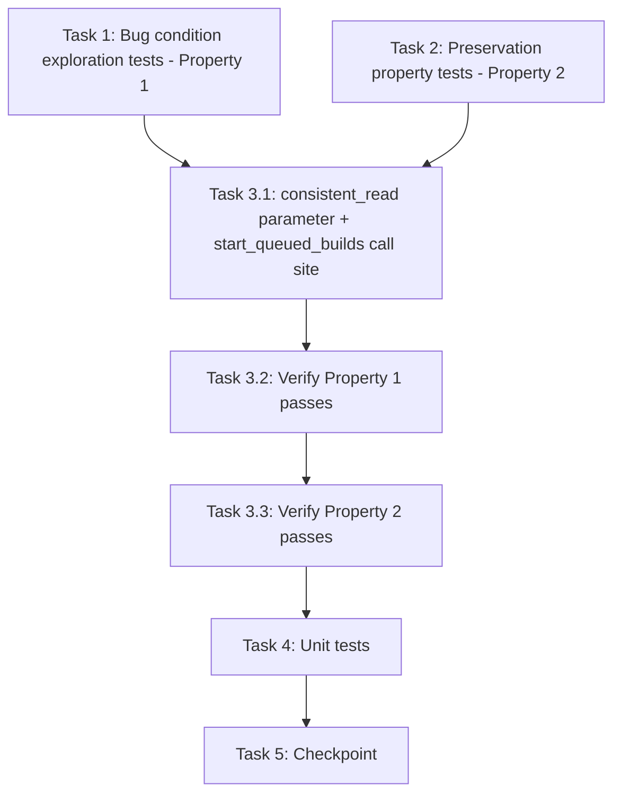

# Implementation Plan

## Overview

Fix the adjust-revision stale-read race using the exploratory bugfix workflow: write bug condition exploration tests (Property 1) and preservation property tests (Property 2) against the UNFIXED code first, then implement the targeted read-your-own-write fix (design Option 1: opt-in `consistent_read` on `plugin_records.get_version_item`, requested by `plugin_builds.start_queued_builds`), then verify the fix with the same tests plus unit coverage. Backend only — no frontend changes.

## Task Dependency Graph

```json
{
  "waves": [
    { "wave": 1, "description": "Run on UNFIXED code: surface the stale-read wrong-source counterexamples (task 1 FAILS - Property 1) and capture preservation baselines (task 2 PASSES - Property 2). Independent of each other.", "tasks": ["1", "2"] },
    { "wave": 2, "description": "Implement the fix: consistent_read parameter on get_version_item, requested by start_queued_builds.", "tasks": ["3.1"] },
    { "wave": 3, "description": "Verify the fix: re-run task 1 tests (now PASS) then task 2 tests (still PASS).", "tasks": ["3.2", "3.3"] },
    { "wave": 4, "description": "Unit tests for fix specifics.", "tasks": ["4"] },
    { "wave": 5, "description": "Checkpoint: full backend suite passes.", "tasks": ["5"] }
  ]
}
```



## Tasks

- [x] 1. Write bug condition exploration tests
  - **Property 1: Bug Condition** - Auto-Started Builds Resolve the Post-Write Source Tree
  - **CRITICAL**: These tests MUST FAIL on unfixed code - failure confirms the bug exists
  - **DO NOT attempt to fix the tests or the code when they fail**
  - **NOTE**: These tests encode the expected behavior - they will validate the fix when they pass after implementation
  - **GOAL**: Surface counterexamples that demonstrate the stale-read race exists and confirm the root cause analysis (eventually-consistent `get_item` in `get_version_item`, silent flat-prefix fallback in `arch_source_prefix`, same-invocation write-then-read on both adjustment paths)
  - **Scoped PBT Approach**: The stale read is deterministic to simulate - stub the plugin table's `get_item` to return the stale (pre-write) item for plain reads and the post-write item only when `ConsistentRead=True` is passed (isBugCondition from design: auto-start follows a revision-mapping write in the same invocation, and the eventually-consistent re-read returns the pre-write item)
  - Tests in `edge-cv-portal/backend/tests/test_adjust_revision_stale_read.py` (pytest + Hypothesis, reusing `test_plugin_importer.py`'s stub/moto patterns for the plugin table and CodeBuild; capture `start_build` calls):
    - **Fetch-success stale read**: settle an adjustment fetch via `_handle_adjustment_fetch_result` with the stale-read stub - assert the auto-started build's `sourceLocationOverride` names the adjusted `rev-{slug}/` prefix (unfixed code submits the flat `source_s3_prefix`)
    - **Reuse-path stale read**: `adjust_revision` ADJUST_REUSE against an already-fetched revision with the stale-read stub - assert the auto-started build's source names the reused entry's prefix (unfixed code submits the flat prefix)
    - **ConsistentRead assertion**: assert `start_queued_builds`'s re-read passes `ConsistentRead=True` to `get_item` (unfixed code never sets the key)
    - **Property 1 (fix)**: Hypothesis-generated records × adjusted archs × slugs under the stale-unless-consistent stub - the auto-started submission's source always reflects the post-write mapping (≥100 iterations, tagged `Feature: adjust-revision-stale-read-fix, Property 1: Auto-Started Builds Resolve the Post-Write Source Tree`)
    - **Retry-masks-it edge (documents 1.3)**: after the stale-read submission, a manual retry with fresh reads resolves the adjusted prefix (passes on unfixed code - documents the masking behavior)
  - Run tests on UNFIXED code
  - **EXPECTED OUTCOME**: Tests FAIL (this is correct - it proves the first post-adjustment build compiles the original tree)
  - Document counterexamples found (e.g., `start_build` called with `sourceLocationOverride = {bucket}/{source_s3_prefix}` instead of `{bucket}/{fetches[slug].source_prefix}` on both adjustment paths)
  - Mark task complete when tests are written, run, and failure is documented
  - _Requirements: 1.1, 1.2, 1.3_

- [x] 2. Write preservation property tests (BEFORE implementing fix)
  - **Property 2: Preservation** - All Other Reads and Auto-Start Semantics Are Unchanged
  - **IMPORTANT**: Follow observation-first methodology
  - Observe behavior on UNFIXED code for non-bug-condition inputs, then write Hypothesis property-based tests in `edge-cv-portal/backend/tests/test_adjust_revision_stale_read.py` capturing the observed behavior patterns from the design's Preservation Requirements:
    - **Default-read call shape**: `get_version_item(plugin_id, version)` without the parameter issues a `get_item` call with NO `ConsistentRead` key and returns the same decoded item as today; returns `None` for missing items (3.5)
    - **Auto-start semantics**: for Hypothesis-generated records, `start_queued_builds` starts exactly the queued+configured architectures, leaves already-started and non-queued entries alone, leaves unconfigured architectures queued, records StartBuild failures without raising to the caller, and returns `{}` for missing records - identical to unfixed behavior apart from read consistency (3.3)
    - **`arch_source_prefix` resolution**: for Hypothesis-generated items, resolution is byte-identical for every arch - mapped (`arch_revisions[arch] -> fetches[slug].source_prefix`), unmapped (flat fallback), and flat single-revision records (3.1, 3.2)
    - **Retry and failure paths**: manual retry (POST .../build) re-submits from the platform's currently recorded source tree; adjustment fetch-failure handling records the fetch-failure logTail on the affected arch only, starts no builds, and leaves other platforms and `arch_revisions` untouched (3.4, 3.6)
  - Property-based testing generates many test cases for stronger guarantees (record shapes with/without `arch_revisions`/`fetches`, arch subsets, artifact statuses, partially mapped records)
  - Property tests run ≥100 iterations, tagged `Feature: adjust-revision-stale-read-fix, Property 2: All Other Reads and Auto-Start Semantics Are Unchanged`
  - Run tests on UNFIXED code
  - **EXPECTED OUTCOME**: Tests PASS (this confirms baseline behavior to preserve)
  - Mark task complete when tests are written, run, and passing on unfixed code
  - _Requirements: 3.1, 3.2, 3.3, 3.4, 3.5, 3.6_

- [x] 3. Fix the adjust-revision stale read

  - [x] 3.1 Add opt-in consistent_read to get_version_item and request it from start_queued_builds
    - `edge-cv-portal/backend/functions/plugin_records.py`, `get_version_item` (~line 262): signature becomes `get_version_item(plugin_id: str, version: int, consistent_read: bool = False)`; pass `ConsistentRead=True` to `plugin_table().get_item(...)` ONLY when `consistent_read` is true - when false, issue exactly today's call (do NOT pass the key at all, so stubs and moto behavior for existing tests are unchanged)
    - Docstring notes the parameter exists for same-invocation read-your-own-write callers (auto-start after an adjustment/fetch-settle write), mirroring the `_handle_multi_fetch_result` `ConsistentRead=True` precedent at plugin_importer.py ~line 1971
    - `edge-cv-portal/backend/functions/plugin_builds.py`, `start_queued_builds` (~line 673): `item = get_version_item(plugin_id, version, consistent_read=True)` - everything else in the function (queued-arch selection, `submit_arch_builds`, `set_arch_entry` persistence, never-raise wrapper, audit logging) is untouched
    - No other changes: `arch_source_prefix`, `submit_arch_builds`, both adjustment paths in `plugin_importer.py`, and every other `get_version_item` call site are not modified
    - One fix covers both race sites (fetch-success handler and ADJUST_REUSE both funnel through `start_queued_builds`) and the import-time fetch-settle auto-start gains the same strictly-safer guarantee
    - _Bug_Condition: isBugCondition(write, autoStart) from design - auto-start follows a revision-mapping write in the same invocation and the eventually-consistent re-read returns the pre-write item_
    - _Expected_Behavior: the auto-start re-reads with ConsistentRead=True so arch_source_prefix resolves the just-written arch_revisions[arch] -> fetches[slug].source_prefix and the CodeBuild sourceLocationOverride names the adjusted tree (Property 1 from design)_
    - _Preservation: Preservation Requirements from design - every other get_version_item caller issues the identical eventually-consistent get_item; auto-start idempotency/never-raise semantics, manual retries, flat single-revision resolution, and fetch-failure handling unchanged_
    - _Requirements: 2.1, 2.2, 2.3, 3.3, 3.5_

  - [x] 3.2 Verify bug condition exploration tests now pass
    - **Property 1: Expected Behavior** - Auto-Started Builds Resolve the Post-Write Source Tree
    - **IMPORTANT**: Re-run the SAME tests from task 1 - do NOT write new tests
    - The tests from task 1 encode the expected behavior
    - When these tests pass, it confirms the expected behavior is satisfied: both adjustment paths auto-start builds whose `sourceLocationOverride` names the adjusted revision's `rev-{slug}/` prefix, and the re-read requests `ConsistentRead=True`
    - Run with pytest (venv at `/home/ubuntu/backend-test-venv`)
    - **EXPECTED OUTCOME**: Tests PASS (confirms bug is fixed)
    - _Requirements: 2.1, 2.2, 2.3_

  - [x] 3.3 Verify preservation tests still pass
    - **Property 2: Preservation** - All Other Reads and Auto-Start Semantics Are Unchanged
    - **IMPORTANT**: Re-run the SAME tests from task 2 - do NOT write new tests
    - Run preservation property tests from task 2 on the fixed code
    - **EXPECTED OUTCOME**: Tests PASS (confirms no regressions)
    - Confirm all tests still pass after fix (no regressions)
    - _Requirements: 3.1, 3.2, 3.3, 3.4, 3.5, 3.6_

- [x] 4. Write unit tests for the fix specifics
  - `get_version_item` parameter behavior: passes `ConsistentRead=True` exactly when `consistent_read=True`; omits the key entirely by default; returns the decoded item in both modes; returns `None` for missing items in both modes
  - `start_queued_builds`: re-reads with `consistent_read=True`; with the stale-read stub, submits the adjusted prefix; idempotency cases - already-building arch untouched, unconfigured arch left queued, StartBuild exception recorded as a failed entry without raising, missing record returns `{}`
  - Both adjustment paths end-to-end against the stale-read stub: fetch-success settles via `handle_fetch_result` then builds from `rev-{slug}/` with the arch entry advancing queued → building; ADJUST_REUSE maps the arch then builds from the reused entry's prefix
  - Import-time flow: original import fetch-settle → `start_queued_builds` still starts all queued architectures from the flat prefix with unchanged idempotency
  - _Requirements: 2.1, 2.2, 2.3, 3.2, 3.3_

- [x] 5. Checkpoint - Ensure all tests pass
  - Run the full backend suite with pytest (venv at `/home/ubuntu/backend-test-venv`)
  - Ensure all tests pass, ask the user if questions arise

## Notes

- Task 1 tests MUST FAIL on unfixed code (confirms the bug); task 2 tests MUST PASS on unfixed code (confirms the baseline). Do not "fix" either before implementing task 3.1.
- Backend only - no frontend changes in this fix. Tests live in `edge-cv-portal/backend/tests/test_adjust_revision_stale_read.py` (pytest + Hypothesis), reusing `test_plugin_importer.py`'s stub/moto patterns.
- The stale read is deterministic to simulate: stub `get_item` to return the pre-write item unless `ConsistentRead=True` is passed.
- Tasks 3.2 and 3.3 re-run the SAME tests from tasks 1 and 2 - no new tests are written there.
- Property tests run ≥100 iterations and are tagged `Feature: adjust-revision-stale-read-fix, Property {n}: {title}`.
- The fix must omit the `ConsistentRead` key entirely when `consistent_read=False` so every existing caller's `get_item` call is byte-identical (preservation requirement 3.5).
