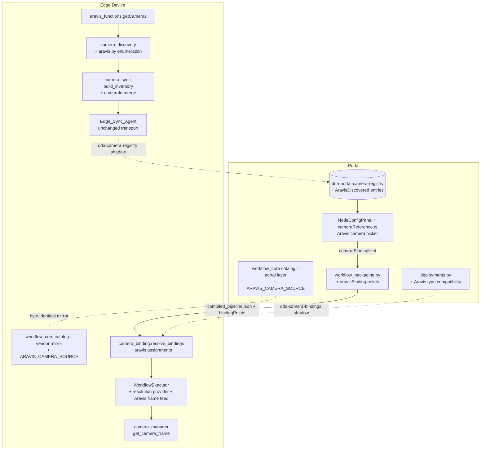
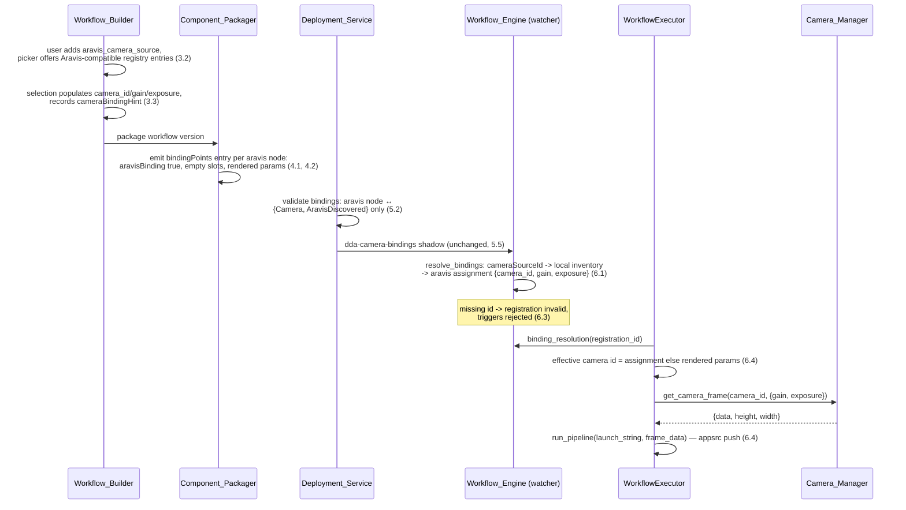

# Design Document: Aravis Camera Input

## Overview

This feature gives the flow designer a camera input node that speaks the edge application's native camera language. On the edge, camera inputs are Aravis (GenICam) devices: `aravis_functions.getCameras()` enumerates the bus, `utils/camera_manager.py` connects and grabs frames by camera id, and `Camera`-type Image_Sources reference an Aravis camera through their `cameraId` field. The designer's only camera node, `camera_source`, is V4L2-path-shaped, and the camera-registry-sync feature discovers only V4L2 hardware — the Aravis inventory the edge actually manages never reaches the Portal, and the designer cannot express an Aravis-typed input.

The design threads a new `aravis_camera_source` node type through every existing seam the camera-registry-sync feature already built, changing no wire protocols and adding no new transport:

1. **Catalog** — a new `ARAVIS_CAMERA_SOURCE` NodeTypeDescriptor in the shared workflow_core catalog (both mirrored copies), with `camera_id` / `gain` / `exposure` parameters and appsrc-headed mappings on all device architectures (Requirement 1).
2. **Edge discovery** — an injectable Aravis enumeration layer added to `camera_discovery`, feeding `build_inventory` with `AravisDiscovered` Camera_Sources merged with configured `Camera`-type Image_Sources by camera id, reported through the unchanged `dda-camera-registry` shadow (Requirement 2).
3. **Designer picker** — the existing Camera_Picker extended to the new node's `camera_id` parameter, offering only Aravis-compatible registry entries and recording the standard `cameraBindingHint` (Requirement 3).
4. **Packaging + deployment** — the Component_Packager treats the node as a Camera_Input_Node emitting `aravisBinding: true` binding points; `validate_camera_bindings` gains the Aravis type-compatibility rule (Requirements 4, 5).
5. **Edge resolution + execution** — `resolve_bindings` produces Aravis assignments; the WorkflowExecutor gains a resolution provider (wired to the watcher's existing `binding_resolution` accessor) and an Aravis frame feed that grabs a frame through the Camera_Manager and pushes it into the compiled pipeline's appsrc via `GstPipelineManager.run_pipeline`'s existing `frame_data` mechanism (Requirement 6).

### Key Design Decisions

| Decision | Choice | Rationale |
|----------|--------|-----------|
| New node type vs. discriminator on `camera_source` | A separate `aravis_camera_source` node type | `camera_source` compiles to `v4l2src device={device}` on x86 — a fundamentally different transport with a different identity parameter. A discriminator parameter would fork every mapping, slot, and picker rule inside one descriptor; a second descriptor reuses all generic catalog machinery unchanged and keeps `camera_source` byte-identical (Requirement 7.4) |
| Aravis node identity parameter | `camera_id` (required string), matching the edge Image_Source's `cameraId` and `camera_manager.connect_camera(camera_id)` | The Aravis camera id (e.g. `Aravis-Fake-GV01`, `Basler-12345678`) is the one identifier every edge camera path already keys on |
| Device-arch mapping | `appsrc name=appsrc_{nodeId} ! videoconvert` on every physical architecture; sim uses the shared dataset-fed stub | Aravis acquisition happens in the LocalServer process via Camera_Manager (a GStreamer `aravissrc` element is not shipped in the DDA images); the appsrc + Frame_Feed path is exactly how classic `Camera`-type pipelines run today (`GstPipelineManager.run_pipeline(pipeline_str, frame_data)`) |
| Aravis discovery placement | New `camera_discovery/aravis.py` with an injectable enumerator defaulting to a lazy import of `aravis_functions.getCameras()` | Mirrors the V4L2 module's injectable-ioctl pattern so tests supply fake buses; the lazy import keeps `camera_discovery` importable where the `gi`/Aravis stack is absent (Requirement 2.6, 2.7) |
| Aravis stable id | `arv-{sha1(vendor + "|" + model + "|" + serial)[:12]}` | Vendor/model/serial are the bus-stable GenICam identity; the Aravis runtime id can embed transport addresses that change across reconnects. Deterministic and collision-resistant per Requirement 2.2 |
| Merge rule | A configured `Camera`-type Image_Source whose `cameraId` equals a discovered Aravis camera's `id` merges into ONE entry under `cfg-{imageSourceId}` (configured params + discovered identity metadata), exactly like the existing device-path merge for V4L2 | Same shape as the proven `build_inventory` path merge (Requirement 2.4); bindings keep referencing the configured id |
| Discovered-only type | `AravisDiscovered` | Parallel to the existing `V4L2Discovered` naming; the sync reducer, registry table, and frontend display are type-string generic, so no reducer or storage change is needed (Requirement 7.3) |
| Binding point marker | `aravisBinding: true`, empty slots, on every device architecture | Parallel to the existing `adapterBinding` (JP4/5) and `csiSensorBinding` (JP6) markers: the binding selects which camera the executor's feed connects, never an element argument |
| Type compatibility | `aravis_camera_source` ↔ {`Camera`, `AravisDiscovered`}; `AravisDiscovered` also added to `camera_source`'s compatible set | An Aravis node must bind to an Aravis-backed source (Requirement 5.2); conversely a registered GenICam camera is a legitimate camera-backed source for the generic camera node on the adapter-fed architectures (Requirement 5.3) |
| Executor resolution wiring | `WorkflowExecutor` gains an injectable `binding_resolution_provider(registration_id)` wired to the watcher's existing `binding_resolution()` accessor | The watcher already computes and caches `ResolutionResult` (substituted document + assignments) per registration; the executor currently reloads the raw document from disk and never consumes it. Wiring the provider closes that gap for Aravis assignments (and slot-substituted documents) without new state |
| Frame feed | Executor pre-grabs one frame per Aravis node via `camera_manager.get_camera_frame(camera_id, config)` and pushes it through `run_pipeline`'s existing `frame_data` appsrc feed | This is byte-for-byte the classic `Camera`-type execution model (`gst_pipeline_executor` → `run_pipeline(pipeline_str, frame_data)`), reusing the cached-connection Camera_Manager path with its existing locking, timeout, and status handling |

## Architecture

### System Context



### Aravis node end-to-end flow



## Components and Interfaces

### 1. Node_Catalog: `ARAVIS_CAMERA_SOURCE` (both catalog copies)

Added to `workflow_core/catalog/nodes.py` in `edge-cv-portal/backend/layers/workflow_core/python/workflow_core/` and mirrored byte-identically to `src/backend/workflow_engine/vendor/workflow_core/`:

```python
ARAVIS_CAMERA_SOURCE = NodeTypeDescriptor(
    type_id="aravis_camera_source",
    category=CATEGORY_INPUT,
    display_name="Aravis Camera Source",
    inputs=[],
    outputs=[PortDescriptor("out", PORT_TYPE_VIDEO_FRAMES)],
    parameters=[
        ParameterDescriptor("camera_id", "string", required=True, default=None,
                            constraints={"min_length": 1},
                            description="Aravis (GenICam) camera identifier as "
                                        "enumerated on the edge device, e.g. "
                                        "Aravis-Fake-GV01 or Basler-12345678.",
                            examples=["Aravis-Fake-GV01", "Basler-12345678"]),
        ParameterDescriptor("gain", "int", required=False, default=4,
                            constraints={"min": 0, "max": 100}, ...),
        ParameterDescriptor("exposure", "int", required=False, default=5000000,
                            constraints={"min": 0}, ...),
    ],
    mappings=_same_on_device_archs(
        element_chain=[
            _element("appsrc", name="appsrc_{nodeId}"),
            _element("videoconvert"),
        ],
        plugin_dependencies=["app", "videoconvertscale"],
    ) + [_dataset_fed_sim_source()],
    hardware_dependent=True,
)
```

- Appended to `NODE_CATALOG` next to `CAMERA_SOURCE`. Every generic consumer — validator, compiler, serializer, the `/workflows/node-catalog` route, the Node_Palette, `merged_catalog`, the test sandbox — picks the node up from the descriptor with no special-casing (Requirement 1.5).
- The appsrc element name is compile-time-rendered per node (the compiler resolves `{nodeId}` the same way other templates resolve node parameters) so multi-camera documents stay addressable; the executor's Frame_Feed locates the appsrc by the binding point's node id.
- The `camera_id` parameter never appears in any `args_template`, so `binding_point_slots` naturally yields no slots — consistent with the `aravisBinding` marker.
- The sim mapping is the shared `_dataset_fed_sim_source()` stub, exactly like `camera_source`, so designer test runs feed the node from the Test_Dataset (Requirement 1.4).
- Mirror discipline: the change is made in the portal layer copy and copied verbatim to the vendor mirror; the existing baseline expectation is `diff -r` cleanliness of the two source trees (Requirement 1.6).

### 2. Edge Aravis discovery (`src/backend/camera_discovery/aravis.py`)

```python
@dataclass(frozen=True)
class DiscoveredAravisCamera:
    stable_id: str        # arv-{sha1(vendor|model|serial)[:12]}
    camera_id: str        # the Aravis runtime id camera_manager connects by
    model: str
    address: str
    physical_id: str
    protocol: str         # "GigEVision" | "USB3Vision" | "Fake"
    serial: str
    vendor: str

@dataclass(frozen=True)
class AravisDiscoveryResult:
    cameras: list[DiscoveredAravisCamera]
    failures: list[dict]   # [{"error": str}] — enumeration-level failures

def enumerate_aravis(enumerator=None) -> AravisDiscoveryResult
```

- `enumerator` is injectable (tests pass fakes); the default lazily imports `edge_ml1_p_camera_management.aravis_functions` and calls `getCameras()`, mapping each returned `model.Camera` object to a `DiscoveredAravisCamera`. Import failure (no `gi`/Aravis stack) or enumeration failure yields `AravisDiscoveryResult([], [{"error": ...}])` — never an exception (Requirements 2.6, 2.7).
- `CameraDiscovery` (`discovery.py`) gains the Aravis enumerator alongside the V4L2 layer: each periodic pass runs both, and the tracked-snapshot diff (present/absent, `absent_since`, `on_change` only on change) treats Aravis stable ids identically to V4L2 stable ids — same absence semantics, same cadence, no second timer (Requirements 2.2, 2.5). The `InventorySnapshot` entries carry the camera object; downstream code distinguishes families by the entry type.
- Stable id derivation is a pure function `aravis_stable_id(vendor, model, serial)`; when serial is empty it falls back to including `physical_id` so two serial-less cameras of the same model do not collide.

### 3. Inventory merge extension (`src/backend/camera_sync/inventory.py`)

`build_inventory` gains the Aravis branch, structurally parallel to the existing device-path merge:

- **Configured merge (2.4)**: an Image_Source of type `Camera` whose `cameraId` equals a tracked Aravis camera's `camera_id` yields ONE entry — id `cfg-{imageSourceId}`, name/type/params from the configured record (params already include `cameraId`, `gain`, `exposure` via the existing `_configured_params`), plus `capabilities.aravis = {model, address, physicalId, protocol, serial, vendor}` from discovery, `discovered: True`, and the tracked absent state. Each tracked Aravis camera contributes to exactly one entry.
- **Discovered-only (2.1, 2.3)**: an unmerged Aravis camera yields `CameraSourceState(camera_source_id=stable_id, name=f"{vendor} {model}", type="AravisDiscovered", origin="edge-discovered", params={"cameraId": camera_id, "serial": serial, "protocol": protocol, "address": address}, capabilities={"aravis": {...}}, discovered=True, absent=..., absent_since=...)`.
- The function stays pure and deterministic (sorted output); on inputs containing no Aravis cameras its output is unchanged from today (Requirement 7.2). The Edge_Sync_Agent, shadow document shape, sync reducer, and registry storage need no changes — `AravisDiscovered` flows through as one more type string (Requirement 7.3).

### 4. Workflow_Builder Aravis picker (frontend `cameraReference.ts` + `NodeConfigPanel.tsx`)

Pure extensions in `cameraReference.ts`:

```typescript
// Control selection: aravis_camera_source's camera_id joins the rule (3.1)
export function isCameraReferenceParameter(typeId, parameterName): boolean;
// -> true for ('camera_source','device') and ('aravis_camera_source','camera_id')

// Aravis compatibility filter for the picker's option list (3.2)
export function isAravisCompatibleCamera(camera: CameraSourceEntry): boolean;
// type === 'AravisDiscovered', or type === 'Camera' with a non-empty
// string params.cameraId

// The camera id a Camera_Source resolves to (3.3, 3.5 display)
export function cameraIdValue(camera: CameraSourceEntry): string | null;

// Selection application for the Aravis node (3.3; mirrors applyCameraSelection)
export function applyAravisCameraSelection(
  parameters, camera, sourceDeviceId
): CameraSelectionResult;
// populates camera_id from cameraIdValue(camera), copies numeric
// gain/exposure when present, returns the standard CameraBindingHint
```

- `NodeConfigPanel` keys the control off the extended `isCameraReferenceParameter`; for `aravis_camera_source` it filters the fetched device cameras through `isAravisCompatibleCamera`, displays name, type, camera id, sync status, and staleness badge per option (3.5), applies selections through `applyAravisCameraSelection`, and retains the manual-entry toggle exactly as the existing control does (3.4). The hint storage (`data.cameraBindingHint`), advisory semantics, and `defaultManualEntry` logic are reused unchanged.
- `camera_source`'s picker path is untouched (Requirement 7.4).

### 5. Component_Packager extension (`workflow_packaging.py`)

```python
ARAVIS_CAMERA_SOURCE_TYPE_ID = 'aravis_camera_source'
```

- `gather_camera_input_nodes` includes nodes of type `aravis_camera_source` (Requirement 4.1); the version item's `camera_input_nodes` records them with `has_binding_points: true` through the existing recording path.
- `build_binding_points`: an `aravis_camera_source` node's entry carries `'aravisBinding': True` with empty slots on every physical device architecture (the sim document is never packaged), and `parameters` holds the rendered `camera_id` / `gain` / `exposure` defaults-overlaid values (Requirement 4.2). All other node types' entries are produced exactly as before.
- Workflows without Aravis nodes serialize byte-identically to pre-feature output — guaranteed structurally because the only behavior change is gated on the new type id (Requirement 4.3).

### 6. Deployment_Service extension (`deployments.py`)

```python
_CAMERA_COMPATIBLE_SOURCE_TYPES = {
    'camera_source': frozenset({'Camera', 'ICam', 'NvidiaCSI',
                                'V4L2Discovered', 'AravisDiscovered'}),   # 5.3
    'aravis_camera_source': frozenset({'Camera', 'AravisDiscovered'}),   # 5.2
}
```

- `validate_camera_bindings` needs no other change: unbound-node errors, missing-source errors, degraded-source warnings, override constraint checking (now resolving the `aravis_camera_source` descriptor from the catalog for 5.4), hint pre-selection, and never-synced handling all apply to the new node through the existing generic code paths (Requirement 5.1).
- The binding-context endpoint and `CameraBindingMatrix` already carry `node_type` per node; the matrix's option list for an `aravis_camera_source` row is filtered through the same Aravis compatibility predicate (shared from `cameraReference.ts`) so users are not offered bindings the validator would reject.
- Binding delivery over `dda-camera-bindings` is unchanged (Requirement 5.5).

### 7. Workflow_Engine resolution extension (`src/backend/workflow_engine/camera_binding.py`)

- `resolve_bindings` treats `aravisBinding: true` binding points the same way it treats `adapterBinding` points — no slot substitution; a resolved binding contributes an assignment — but records them in a dedicated `aravis_assignments: Dict[str, Dict]` field on `ResolutionResult` (`{node_id: {"cameraSourceId": ..., "params": {...}}}`), keeping JP4/5 camera-adapter assignments and Aravis feed assignments distinct for the executor (Requirements 6.1, 6.2).
- A `cameraSourceId` binding resolves through the local inventory exactly as today; the resolved params for an Aravis-backed entry carry `cameraId` (from `build_inventory`), which the feed planner maps to the node's `camera_id`. `_PARAM_ALIASES` gains `"cameraId" -> "camera_id"` so overrides and resolved values line up with the descriptor's parameter name.
- Missing ids follow the existing path: `missing` entry + `missing camera source {csid}` error → watcher marks the registration invalid → triggers rejected → re-resolution on discovery change / shadow delta flips it back (Requirement 6.3). No watcher changes are needed beyond the enlarged `ResolutionResult`.

### 8. WorkflowExecutor Aravis frame feed (`src/backend/workflow_engine/`)

New pure module `src/backend/workflow_engine/aravis_feed.py`:

```python
@dataclass(frozen=True)
class AravisFeed:
    node_id: str
    camera_id: str
    config: dict           # {"gain": int, "exposure": int} when present

def plan_aravis_feeds(document: dict,
                      resolution: Optional[ResolutionResult]) -> list[AravisFeed]
```

- Pure over its inputs: for each binding point with `aravisBinding: true`, the effective values are the resolution's `aravis_assignments[node_id]["params"]` when present, else the binding point's rendered `parameters` (Requirement 6.4). A feed without a non-empty `camera_id` value is a planning error surfaced as an execution failure attributed to the node.
- `WorkflowExecutor` changes:
  - Gains an injectable `binding_resolution_provider: Callable[[str], Optional[ResolutionResult]]`, wired at engine startup to the watcher's existing `binding_resolution()` accessor. When the provider returns a resolution, the executor runs the resolution's substituted document (closing the existing gap where slot-substituted documents were computed but never executed) — otherwise the disk document, as today.
  - Before starting the pipeline, for each planned `AravisFeed` the executor grabs one frame through `camera_manager.get_camera_frame(feed.camera_id, feed.config)` (lazily imported, exactly like `GstPipelineManager`). The grab happens before `run_pipeline` so a camera failure fails fast with `failing_node_id = feed.node_id` (Requirement 6.5).
  - The frame is pushed through the existing Frame_Feed: `run_pipeline(launch_string, frame_data)` locates the appsrc, wraps the buffer, pushes, and sends EOS — the classic `Camera`-type execution model. The appsrc caps are set from the grabbed frame's width/height, mirroring the caps handling the classic camera processing pipeline performs.
  - Documents with no Aravis binding points plan zero feeds and take the exact pre-feature call path (`run_pipeline(launch_string, latency_metrics=...)`, no frame_data) (Requirement 6.6). Initial scope executes one Aravis feed per run (matching the single-appsrc Frame_Feed contract); a document with multiple Aravis nodes fails registration-side validation with a clear reason rather than undefined behavior.

## Data Models

### Catalog descriptor (both workflow_core copies)

New `NodeTypeDescriptor` as specified in Component 1; `NODE_CATALOG` tuple gains one member. No changes to `models.py` shapes, the serializer schema, or the compiler.

### Camera_Source inventory / registry entry (extended values only, no schema change)

| Field | Aravis discovered-only entry | Configured `Camera` merged entry |
|---|---|---|
| `camera_source_id` | `arv-{sha1(vendor\|model\|serial)[:12]}` | `cfg-{imageSourceId}` (unchanged) |
| `type` | `AravisDiscovered` (new value) | `Camera` (unchanged) |
| `origin` | `edge-discovered` | `edge-configured` |
| `params` | `{cameraId, serial, protocol, address}` | existing configured params (already include `cameraId`, `gain`, `exposure`) |
| `capabilities` | `{aravis: {model, address, physicalId, protocol, serial, vendor}}` | existing + `aravis: {...}` |
| `discovered` / `absent` / `absent_since` | standard tracking | standard tracking |

The `dda-camera-registry` shadow document, `reduce_report`, the DynamoDB registry table, and the camera routes carry these entries with zero changes — types and params are opaque strings/maps to all of them.

### Binding point entry (compiled_pipeline.json)

```jsonc
{
  "nodeId": "n2",
  "nodeType": "aravis_camera_source",
  "bindingHint": { "cameraSourceId": "arv-3fe9c0d21ab4", ... },   // when present
  "parameters": { "camera_id": "Aravis-Fake-GV01", "gain": 4, "exposure": 5000000 },
  "slots": [],
  "aravisBinding": true
}
```

### ResolutionResult (edge)

Gains `aravis_assignments: Dict[str, Dict[str, Any]] = field(default_factory=dict)` — same shape as `adapter_assignments`. Existing consumers are unaffected (dataclass field addition with a default).

### Camera_Binding shadow / deployment record

Unchanged: `{node_id: {"cameraSourceId": id} | {"override": {"camera_id": ..., "gain": ..., "exposure": ...}}}` — the override keys are just the new node's parameter names.

## Correctness Properties

*A property is a characteristic or behavior that should hold true across all valid executions of a system — essentially, a formal statement about what the system should do. Properties serve as the bridge between human-readable specifications and machine-verifiable correctness guarantees.*

### Property 1: Aravis node definitions round-trip and compile through generic catalog paths

*For any* valid workflow definition containing `aravis_camera_source` nodes, serializing then parsing the definition SHALL produce an equivalent graph, and validating then compiling it for a device architecture SHALL succeed and render the node's appsrc-headed element chain.

**Validates: Requirements 1.5**

### Property 2: Aravis discovery enumeration completeness with identity capture

*For any* set of enumerated Aravis cameras, every camera SHALL contribute to exactly one inventory entry, and every discovered-only entry SHALL have type `AravisDiscovered`, origin `edge-discovered`, and parameters/capabilities carrying all of the camera's identity fields (id, model, address, physical id, protocol, serial, vendor).

**Validates: Requirements 2.1, 2.3**

### Property 3: Aravis stable id determinism

*For any* Aravis camera identity (vendor, model, serial), the derived stable id SHALL be a pure function of those fields — invariant under bus enumeration order, runtime id changes, and address changes — and distinct identities within an enumeration SHALL derive distinct stable ids.

**Validates: Requirements 2.2**

### Property 4: Configured/discovered Aravis merge by camera id

*For any* combination of configured Image_Sources and discovered Aravis cameras, each `Camera`-type Image_Source whose `cameraId` equals a discovered camera's id SHALL yield exactly one inventory entry under the configured identifier combining configured parameters with discovered identity metadata, and no discovered Aravis camera SHALL contribute to more than one entry.

**Validates: Requirements 2.4**

### Property 5: Aravis absence marking on re-enumeration

*For any* sequence of Aravis enumeration results, a stable id present in an earlier result and missing from a later one SHALL be marked absent with an absence timestamp and SHALL never be dropped from the tracked inventory.

**Validates: Requirements 2.5**

### Property 6: Aravis failure isolation and no-Aravis identity

*For any* configured and V4L2-discovered inventory, building the inventory with a failing or unavailable Aravis enumerator SHALL produce entries identical to the pre-feature output for the same inputs, record the failure, and raise no exception.

**Validates: Requirements 2.6, 7.2**

### Property 7: Aravis picker compatibility filter

*For any* list of Camera_Registry entries, the Aravis picker option list SHALL contain exactly the entries that are Aravis-compatible (type `AravisDiscovered`, or type `Camera` carrying a non-empty camera id parameter) — no incompatible entry offered, no compatible entry omitted.

**Validates: Requirements 3.2**

### Property 8: Aravis selection populates the node and records the hint

*For any* Aravis-compatible Camera_Source and any prior parameter record, applying the selection SHALL set `camera_id` to the source's camera id, copy `gain` and `exposure` exactly when the source's params carry them as numbers, leave all other parameters untouched, and produce a binding hint carrying the source id, display name, and reference device id.

**Validates: Requirements 3.3**

### Property 9: Packaging emits Aravis binding points

*For any* workflow definition containing `aravis_camera_source` nodes, packaging SHALL emit exactly one `bindingPoints` entry per Aravis node per architecture carrying `aravisBinding: true`, empty slots, and the node's rendered `camera_id`/`gain`/`exposure` parameter values, and SHALL record each node in the version item's `camera_input_nodes` with `has_binding_points: true`.

**Validates: Requirements 4.1, 4.2**

### Property 10: Aravis-free packaging identity

*For any* workflow definition containing no `aravis_camera_source` node, the packaged compiled document SHALL be byte-identical to the pre-feature packaging output for the same definition.

**Validates: Requirements 4.3**

### Property 11: Aravis type-compatibility validation

*For any* workflow version with Camera_Input_Nodes, target registry snapshot, and binding set, `validate_camera_bindings` SHALL produce a type-incompatibility error for a binding exactly when the bound Camera_Source's type is outside the node type's declared compatible set — `{Camera, AravisDiscovered}` for `aravis_camera_source`, the existing set plus `AravisDiscovered` for `camera_source`.

**Validates: Requirements 5.2, 5.3**

### Property 12: Aravis override constraint validation

*For any* manual override submitted for an `aravis_camera_source` node, validation SHALL accept the override exactly when every value satisfies the descriptor's declared constraints (non-empty string `camera_id`, `gain` within 0–100, `exposure` non-negative, no undeclared parameter names).

**Validates: Requirements 5.4**

### Property 13: Device-side Aravis binding resolution

*For any* compiled document with Aravis binding points, binding map, and local inventory: a `cameraSourceId` binding matching an inventory entry SHALL yield an Aravis assignment whose `camera_id` is the entry's camera id and SHALL leave the document's segments unchanged; a constraint-valid override binding SHALL yield an assignment from the override values; a `cameraSourceId` with no inventory entry SHALL mark the resolution invalid recording the missing id; and a constraint-violating override SHALL mark the resolution invalid with a reason.

**Validates: Requirements 6.1, 6.2, 6.3**

### Property 14: Aravis feed plan precedence

*For any* compiled document with Aravis binding points and any optional resolution result, the planned feed for each node SHALL use the resolution's Aravis assignment values when present and the binding point's rendered parameters otherwise.

**Validates: Requirements 6.4**

### Property 15: Aravis-free execution identity

*For any* compiled document containing no Aravis binding point (including legacy documents without `bindingPoints`), the feed planner SHALL plan zero feeds and the executor SHALL invoke the pipeline run without a frame feed, exactly as before this feature.

**Validates: Requirements 6.6**

## Error Handling

| Failure | Handling |
|---|---|
| Aravis runtime (`gi`/Aravis) unavailable or `getCameras()` raises | `enumerate_aravis` returns an empty result with a failure record; `build_inventory` output equals the pre-feature output; discovery loop and Edge_Sync_Agent continue untouched (Requirements 2.6, 7.2) |
| Individual Aravis camera with missing/empty identity fields | Stable id derivation falls back to including `physical_id`; entries with no usable identity are recorded in the discovery failures list and skipped, never crashing the pass |
| Registry read fails while the picker is open | Existing Camera_Picker error handling unchanged: the control surfaces the fetch error and the manual-entry path remains usable (Requirement 3.4) |
| Binding submitted against a non-Aravis source type | `validate_camera_bindings` rejects with the existing `CAMERA_TYPE_INCOMPATIBLE` error naming the node, device, and source type (Requirement 5.2) |
| Aravis `cameraSourceId` missing from device inventory at resolution time | Resolution invalid with `missing camera source {csid}`; registration invalid, triggers rejected; re-resolution on discovery change / bindings delta flips it back (Requirement 6.3) |
| Multiple Aravis binding points in one document | Registration-side validation marks the registration invalid with a clear reason (single Frame_Feed contract) rather than undefined multi-appsrc behavior |
| `get_camera_frame` raises or returns no frame during a run | Execution marked failed with `failing_node_id` set to the Aravis node and the camera error message; nothing propagates (existing contained-failure discipline, Requirement 6.5) |
| Binding resolution provider unavailable/raises at execution time | Executor falls back to the disk document and rendered binding-point parameters (the unbound behavior), logged — a provider failure never takes a run down for documents that don't need it |

## Testing Strategy

**Dual approach**: property-based tests for the pure cores (catalog round trip, discovery/merge, id derivation, picker filter/application, packaging binding points, binding validation, resolution, feed planning) and example-based unit/component tests for static catalog content, UI wiring, and failure paths. Integration behavior (shadow transport, GStreamer, real Aravis hardware) is exercised through the existing injectable fakes; no test requires a physical camera.

- **Python property tests** use `hypothesis` with no hardcoded `max_examples` (project default ≥100 iterations), tagged `**Feature: aravis-camera-input, Property {number}: {property_text}**`:
  - Portal backend: `edge-cv-portal/backend/tests/test_property_*.py` against the moto-backed conftest stack (Properties 1, 9, 10, 11, 12).
  - Edge LocalServer: `test/backend-test/camera_discovery`, `test/backend-test/camera_sync`, and `test/backend-test/workflow_engine` run with `PYTHONPATH=src/backend:test/backend-test` (Properties 2–6, 13, 14, 15).
- **TypeScript property tests** use `fast-check` (`numRuns: 100`) beside the existing picker property test in `edge-cv-portal/frontend/src/pages/workflows/` (Properties 7, 8).
- **Unit/component tests**: catalog content assertions mirroring `test_catalog_content.py` (1.1–1.4), catalog mirror diff check (1.6), injectable-enumerator construction (2.7), NodeConfigPanel control rendering / manual entry / display fields (3.1, 3.4, 3.5), binding matrix option filtering and hint pre-selection for Aravis rows (5.1), binding delivery with an Aravis node (5.5), executor grab/push with fake camera manager and fake pipeline manager including the failure path (6.4, 6.5), reducer ingestion of `AravisDiscovered` reports (7.3), and `camera_source` descriptor unchanged (7.4).
- **Baselines that must stay green**: portal backend pytest suite, frontend vitest + `npm run build`, and the edge `test/backend-test` workflow_engine / camera_discovery / camera_sync suites that pass on this host — pre-feature behavior identity (Requirement 7.1) is enforced by Properties 6, 10, 15 plus these unchanged baselines.
