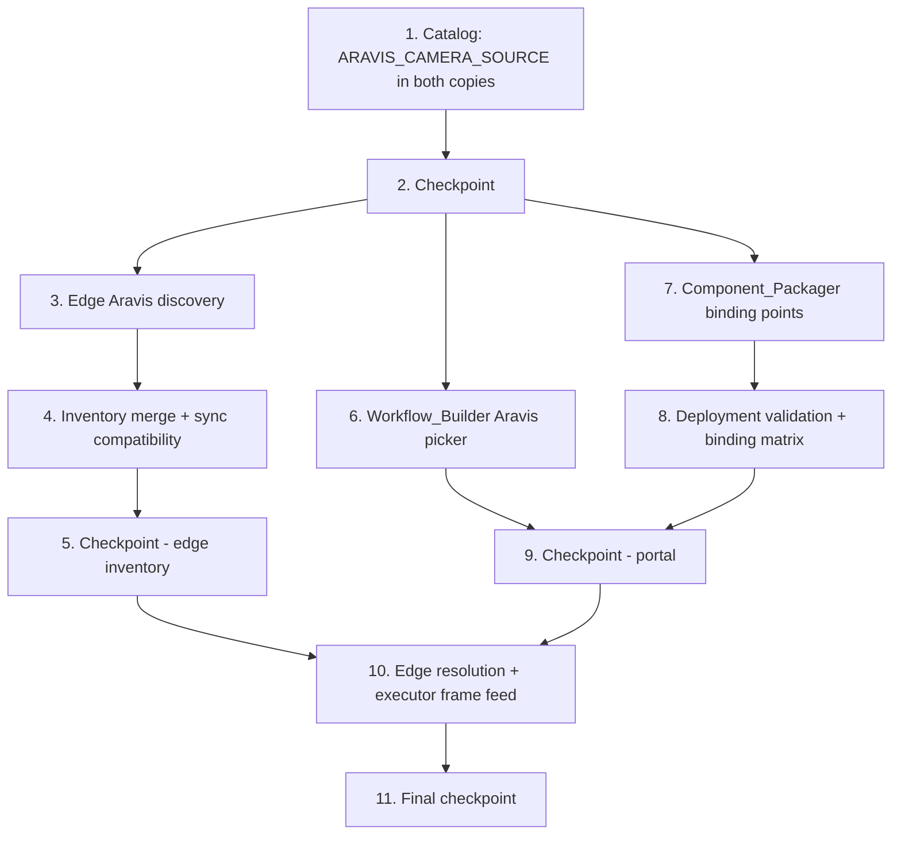

# Implementation Plan: Aravis Camera Input

## Overview

Implementation follows the data flow the design threads through the existing camera-registry-sync seams: the catalog descriptor first (both mirrored workflow_core copies — everything downstream consumes it), then the edge Aravis discovery and inventory merge (pure cores with injectable enumeration), then the Portal surfaces (picker, packaging, deployment validation), and finally the edge resolution and executor frame feed. Property tests sit directly beside the code they validate.

Test baselines that must stay green throughout: portal backend pytest under `edge-cv-portal/backend/tests` (moto-backed conftest stack), frontend vitest + `npm run build` under `edge-cv-portal/frontend`, and the edge LocalServer suites that pass on this host, run with `PYTHONPATH=src/backend:test/backend-test` scoped to `test/backend-test/workflow_engine test/backend-test/camera_discovery test/backend-test/camera_sync`. Python property tests use `hypothesis` (no hardcoded `max_examples`; the project default provides ≥100 iterations) as `test_property_*.py`; TypeScript property tests use `fast-check` with `numRuns: 100`. Each property test is tagged `**Feature: aravis-camera-input, Property {number}: {property_text}**`.

## Task Dependency Graph



```json
{
  "waves": [
    { "wave": 1, "tasks": ["1"], "description": "Catalog descriptor in the portal workflow_core layer, mirrored byte-identically to the edge vendor copy, with content tests and the definition round-trip/compile property" },
    { "wave": 2, "tasks": ["2"], "description": "Checkpoint: catalog tests pass in both trees" },
    { "wave": 3, "tasks": ["3", "6", "7"], "description": "Independent consumers of the descriptor: edge Aravis enumeration, the frontend picker, and packaging binding points (can proceed in parallel)" },
    { "wave": 4, "tasks": ["4", "8"], "description": "Inventory merge on the edge; deployment type-compatibility validation and binding matrix on the portal" },
    { "wave": 5, "tasks": ["5", "9"], "description": "Checkpoints: edge inventory suites and portal suites pass" },
    { "wave": 6, "tasks": ["10"], "description": "Edge binding resolution (aravis assignments), feed planning, and the WorkflowExecutor frame feed wiring" },
    { "wave": 7, "tasks": ["11"], "description": "Final checkpoint: all baselines pass" }
  ]
}
```

## Tasks

- [ ] 1. Add the `aravis_camera_source` node type to the Node_Catalog
  - [ ] 1.1 Add the `ARAVIS_CAMERA_SOURCE` descriptor to the portal workflow_core catalog
    - In `edge-cv-portal/backend/layers/workflow_core/python/workflow_core/catalog/nodes.py`: type id `aravis_camera_source`, category input, display name "Aravis Camera Source", no inputs, one `out` port of type VideoFrames; parameters `camera_id` (string, required, `min_length: 1`, description, examples), `gain` (int, optional, default 4, min 0 max 100), `exposure` (int, optional, default 5000000, min 0), each with description and examples; `hardware_dependent=True`; device-arch mappings `appsrc name=appsrc_{nodeId} ! videoconvert` with plugin dependencies `app`, `videoconvertscale`; sim mapping `_dataset_fed_sim_source()`; appended to `NODE_CATALOG`
    - Ensure the compiler resolves the `{nodeId}` token in the appsrc name (reuse or extend the existing template resolution so multi-node documents render unique appsrc names)
    - _Requirements: 1.1, 1.2, 1.3, 1.4_

  - [ ] 1.2 Mirror the catalog change to the edge vendor copy
    - Copy the modified catalog source verbatim to `src/backend/workflow_engine/vendor/workflow_core/` so the two source trees stay byte-identical (`diff -r` clean, ignoring `__pycache__`)
    - _Requirements: 1.6_

  - [ ]* 1.3 Write catalog content unit tests
    - Extend `edge-cv-portal/backend/layers/workflow_core/tests/test_catalog_content.py` conventions: descriptor identity (type id, category, display name, ports), parameter declarations and constraints, hardware_dependent flag, per-arch appsrc element chains and plugin dependencies, sim mapping equal to `camera_source`'s sim stub, `EXPECTED_TYPE_IDS` updated; assert `camera_source`'s descriptor is unchanged; add a mirror-equality check diffing the two catalog files
    - _Requirements: 1.1, 1.2, 1.3, 1.4, 1.6, 7.4_

  - [ ]* 1.4 Write property test for Aravis node definition round trip and compilation
    - **Feature: aravis-camera-input, Property 1: Aravis node definitions round-trip and compile through generic catalog paths**
    - **Validates: Requirements 1.5**
    - hypothesis over generated definitions containing `aravis_camera_source` nodes (extend `tests/generators.py` video-input types): serialize → parse equivalence; validate + compile succeed per device arch with the node's appsrc chain rendered

- [ ] 2. Checkpoint - catalog complete in both trees
  - Ensure the workflow_core test suite and the edge-scoped suites pass, ask the user if questions arise.

- [ ] 3. Implement edge Aravis discovery (`src/backend/camera_discovery/aravis.py`)
  - [ ] 3.1 Implement the injectable Aravis enumeration module
    - Frozen `DiscoveredAravisCamera` dataclass (stable_id, camera_id, model, address, physical_id, protocol, serial, vendor) and `AravisDiscoveryResult` (cameras, failures); `enumerate_aravis(enumerator=None)` defaulting to a lazy import of `aravis_functions.getCameras()`, mapping each returned Camera object; import or enumeration failure yields an empty result with a failure record, never an exception
    - Pure `aravis_stable_id(vendor, model, serial, physical_id)` deriving `arv-{sha1(vendor|model|serial)[:12]}` with the empty-serial fallback including `physical_id`
    - _Requirements: 2.1, 2.3, 2.6, 2.7_

  - [ ]* 3.2 Write property test for stable id determinism
    - **Feature: aravis-camera-input, Property 3: Aravis stable id determinism**
    - **Validates: Requirements 2.2**
    - hypothesis over identity tuples in `test/backend-test/camera_discovery`: pure-function invariance under bus order / runtime-id / address changes; distinctness within generated enumerations

  - [ ] 3.3 Wire Aravis enumeration into the CameraDiscovery loop and snapshot
    - `CameraDiscovery` accepts an injectable Aravis enumerator alongside the V4L2 layer; each periodic pass runs both; the tracked-snapshot diff treats Aravis stable ids identically to V4L2 ids (present/absent, `absent_since`, `on_change` only on change); no second timer; V4L2 behavior unchanged
    - _Requirements: 2.1, 2.5, 2.7_

  - [ ]* 3.4 Write property test for Aravis absence marking
    - **Feature: aravis-camera-input, Property 5: Aravis absence marking on re-enumeration**
    - **Validates: Requirements 2.5**
    - hypothesis over sequences of fake Aravis enumeration results driven through the discovery diff

  - [ ]* 3.5 Write property test for enumeration completeness with identity capture
    - **Feature: aravis-camera-input, Property 2: Aravis discovery enumeration completeness with identity capture**
    - **Validates: Requirements 2.1, 2.3**
    - hypothesis over generated fake Aravis buses (unicode names, duplicate models, empty serials); every camera contributes exactly one entry with type `AravisDiscovered`, origin `edge-discovered`, and all identity fields captured

- [ ] 4. Extend the inventory merge (`src/backend/camera_sync/inventory.py`)
  - [ ] 4.1 Implement the Aravis branch of build_inventory
    - Configured `Camera`-type Image_Source with `cameraId` equal to a tracked Aravis camera's id merges into ONE entry under `cfg-{imageSourceId}` (configured params + `capabilities.aravis` identity metadata, `discovered: True`, tracked absent state); unmerged Aravis cameras yield `AravisDiscovered` / `edge-discovered` entries with params `{cameraId, serial, protocol, address}` and `capabilities.aravis`; each tracked camera contributes to exactly one entry; output stays sorted and deterministic; inputs with no Aravis cameras produce output identical to today
    - _Requirements: 2.1, 2.3, 2.4, 7.2_

  - [ ]* 4.2 Write property test for the configured/discovered Aravis merge
    - **Feature: aravis-camera-input, Property 4: Configured/discovered Aravis merge by camera id**
    - **Validates: Requirements 2.4**
    - hypothesis in `test/backend-test/camera_sync` over configured sources and discovered cameras with random cameraId overlap

  - [ ]* 4.3 Write property test for Aravis failure isolation and no-Aravis identity
    - **Feature: aravis-camera-input, Property 6: Aravis failure isolation and no-Aravis identity**
    - **Validates: Requirements 2.6, 7.2**
    - hypothesis over configured + V4L2 inventories with a raising/unavailable Aravis enumerator; output equals the pre-feature output for the same inputs, a failure record is present, nothing raises

  - [ ]* 4.4 Write unit test for registry ingestion of AravisDiscovered reports
    - Ingest a report containing `AravisDiscovered` entries through the portal `reduce_report`/handler path (moto conftest stack); entries stored verbatim with existing types unaffected
    - _Requirements: 7.3_

- [ ] 5. Checkpoint - edge inventory complete
  - Ensure the edge-scoped suites pass (`PYTHONPATH=src/backend:test/backend-test`, camera_discovery + camera_sync + workflow_engine), ask the user if questions arise.

- [ ] 6. Implement the Workflow_Builder Aravis picker (frontend)
  - [ ] 6.1 Extend cameraReference.ts with the pure Aravis helpers
    - `isCameraReferenceParameter` returns true for (`aravis_camera_source`, `camera_id`); new `isAravisCompatibleCamera` (type `AravisDiscovered`, or type `Camera` with non-empty string `params.cameraId`), `cameraIdValue`, and `applyAravisCameraSelection` (populates `camera_id`, copies numeric gain/exposure, returns the standard `CameraBindingHint`, leaves other parameters untouched)
    - _Requirements: 3.1, 3.2, 3.3_

  - [ ] 6.2 Wire the Aravis control into NodeConfigPanel
    - The `aravis_camera_source` node's `camera_id` renders the camera reference control; option list filtered through `isAravisCompatibleCamera`; options display name, type, camera id, sync status, and staleness badge; selection applied through `applyAravisCameraSelection` storing `data.cameraBindingHint`; manual-entry toggle retained; `camera_source`'s control path untouched
    - _Requirements: 3.1, 3.2, 3.3, 3.4, 3.5, 7.4_

  - [ ]* 6.3 Write property test for the Aravis compatibility filter
    - **Feature: aravis-camera-input, Property 7: Aravis picker compatibility filter**
    - **Validates: Requirements 3.2**
    - fast-check (`numRuns: 100`) over generated `CameraSourceEntry` lists: filter soundness and completeness

  - [ ]* 6.4 Write property test for Aravis selection application
    - **Feature: aravis-camera-input, Property 8: Aravis selection populates the node and records the hint**
    - **Validates: Requirements 3.3**
    - fast-check over Aravis-compatible entries and prior parameter records through `applyAravisCameraSelection`

  - [ ]* 6.5 Write component tests for the Aravis picker
    - Control renders for the Aravis node's `camera_id` (and not for unrelated parameters); manual entry toggle accepts a typed camera id; option display fields including stale/pending badges
    - _Requirements: 3.1, 3.4, 3.5_

- [ ] 7. Extend the Component_Packager (`edge-cv-portal/backend/functions/workflow_packaging.py`)
  - [ ] 7.1 Emit Aravis binding points and version-item records
    - `ARAVIS_CAMERA_SOURCE_TYPE_ID = 'aravis_camera_source'` joins `gather_camera_input_nodes`; `build_binding_points` marks Aravis nodes' entries `aravisBinding: true` with empty slots on every device architecture, parameters carrying the rendered `camera_id`/`gain`/`exposure`; version item records the nodes in `camera_input_nodes` with `has_binding_points: true`; all other node types' output unchanged
    - _Requirements: 4.1, 4.2, 4.3_

  - [ ]* 7.2 Write property test for Aravis binding point emission
    - **Feature: aravis-camera-input, Property 9: Packaging emits Aravis binding points**
    - **Validates: Requirements 4.1, 4.2**
    - hypothesis in `edge-cv-portal/backend/tests` over definitions with 1..n Aravis (and mixed camera) nodes through the binding-point builder

  - [ ]* 7.3 Write property test for Aravis-free packaging identity
    - **Feature: aravis-camera-input, Property 10: Aravis-free packaging identity**
    - **Validates: Requirements 4.3**
    - hypothesis over Aravis-free definitions; `compiled_document_json` byte-equal to the pre-feature serialization

- [ ] 8. Extend the Deployment_Service and binding matrix
  - [ ] 8.1 Add the Aravis type-compatibility rule and matrix filtering
    - `_CAMERA_COMPATIBLE_SOURCE_TYPES` gains `aravis_camera_source: {Camera, AravisDiscovered}` and adds `AravisDiscovered` to `camera_source`'s set; override constraint checking resolves the `aravis_camera_source` descriptor through the existing catalog lookup; frontend `CameraBindingMatrix` filters an `aravis_camera_source` row's options through the shared Aravis compatibility predicate with hint pre-selection unchanged
    - _Requirements: 5.1, 5.2, 5.3, 5.4_

  - [ ]* 8.2 Write property test for Aravis type-compatibility validation
    - **Feature: aravis-camera-input, Property 11: Aravis type-compatibility validation**
    - **Validates: Requirements 5.2, 5.3**
    - hypothesis over version items with Aravis and camera_source nodes, registries with arbitrary source types, and binding sets; `CAMERA_TYPE_INCOMPATIBLE` exactly per the compatibility-map oracle

  - [ ]* 8.3 Write property test for Aravis override constraint validation
    - **Feature: aravis-camera-input, Property 12: Aravis override constraint validation**
    - **Validates: Requirements 5.4**
    - hypothesis over valid and violating overrides (`camera_id` emptiness, gain/exposure bounds, undeclared keys)

  - [ ]* 8.4 Write unit and component tests for matrix presentation and delivery
    - Component test: Aravis node row offers only compatible sources with hint pre-selection; unit test: a submission with an Aravis binding writes the expected `dda-camera-bindings` desired document and leaves the artifact bytes untouched
    - _Requirements: 5.1, 5.5_

- [ ] 9. Checkpoint - portal surfaces complete
  - Ensure the portal backend suite, frontend vitest, and `npm run build` pass, ask the user if questions arise.

- [ ] 10. Implement edge resolution and the executor Aravis frame feed
  - [ ] 10.1 Extend resolve_bindings with Aravis assignments
    - `camera_binding.py`: binding points with `aravisBinding: true` never substitute slots; resolved `cameraSourceId` and constraint-valid override bindings contribute to a new `aravis_assignments` field on `ResolutionResult` (default empty — existing consumers unaffected); `_PARAM_ALIASES` gains `cameraId → camera_id`; missing ids and override violations follow the existing invalid path with reasons
    - _Requirements: 6.1, 6.2, 6.3_

  - [ ]* 10.2 Write property test for device-side Aravis binding resolution
    - **Feature: aravis-camera-input, Property 13: Device-side Aravis binding resolution**
    - **Validates: Requirements 6.1, 6.2, 6.3**
    - hypothesis in `test/backend-test/workflow_engine` over documents with Aravis binding points, binding maps (cameraSourceId / override / missing / violating), and inventories

  - [ ] 10.3 Implement the aravis_feed planning module
    - New pure `src/backend/workflow_engine/aravis_feed.py`: `AravisFeed` dataclass and `plan_aravis_feeds(document, resolution)` — assignment values when present, else the binding point's rendered parameters; empty-camera-id plans surface as node-attributed errors; more than one Aravis feed per document is a registration-side validation error (single Frame_Feed contract)
    - _Requirements: 6.4_

  - [ ]* 10.4 Write property test for feed plan precedence
    - **Feature: aravis-camera-input, Property 14: Aravis feed plan precedence**
    - **Validates: Requirements 6.4**
    - hypothesis over documents with Aravis points and optional resolution results

  - [ ] 10.5 Wire the resolution provider and frame feed into the WorkflowExecutor
    - `WorkflowExecutor` gains an injectable `binding_resolution_provider`; engine startup (`runtime.py`) wires it to the watcher's `binding_resolution()` accessor; when a resolution exists the executor runs its substituted document; before pipeline start, each planned `AravisFeed` grabs one frame via `camera_manager.get_camera_frame(camera_id, config)` (lazy import) and the run goes through `run_pipeline(launch_string, frame_data)` with appsrc caps derived from the frame; grab failure fails the execution with `failing_node_id` set to the Aravis node; provider failure falls back to the disk document; documents with no Aravis points take the exact pre-feature call path
    - _Requirements: 6.4, 6.5, 6.6_

  - [ ]* 10.6 Write property test for Aravis-free execution identity
    - **Feature: aravis-camera-input, Property 15: Aravis-free execution identity**
    - **Validates: Requirements 6.6**
    - hypothesis over Aravis-free documents (including legacy documents without `bindingPoints`): zero feeds planned and the executor invokes the fake pipeline manager without frame_data

  - [ ]* 10.7 Write executor unit tests for the frame feed
    - Fake camera manager + fake pipeline manager: successful grab/push call shape with resolved and rendered-default camera ids; raising camera manager → execution failed with the Aravis node id and camera error; multiple Aravis points → registration-side invalid reason; provider raising → disk-document fallback
    - _Requirements: 6.4, 6.5_

- [ ] 11. Final checkpoint
  - Ensure all baselines pass: portal backend pytest, frontend vitest + `npm run build`, and the edge-scoped suites (`PYTHONPATH=src/backend:test/backend-test` over workflow_engine, camera_discovery, camera_sync); verify the two workflow_core catalog trees are byte-identical; ask the user if questions arise.

## Notes

- Tasks marked with `*` are optional test tasks and can be skipped for a faster MVP
- Each task references specific requirements for traceability; all 15 design properties are covered by tasks 1.4, 3.2, 3.4, 3.5, 4.2, 4.3, 6.3, 6.4, 7.2, 7.3, 8.2, 8.3, 10.2, 10.4, 10.6
- Python property tests use hypothesis with no hardcoded `max_examples` (project default ≥100 iterations); TypeScript property tests use fast-check with `numRuns: 100`; each tagged `**Feature: aravis-camera-input, Property {number}: {property_text}**`
- The catalog change lands first and is mirrored byte-identically (portal layer + edge vendor copy) before any consumer work begins; the mirror diff check in task 1.3 guards it for the rest of the implementation
- Aravis hardware, the `gi`/Aravis runtime, GStreamer, and IoT shadow transport are exercised through injectable fakes everywhere; no test requires a physical GenICam camera
- No shadow document, sync reducer, registry table, or `dda-camera-bindings` schema changes: `AravisDiscovered` is one more opaque type string to the existing transport and storage
