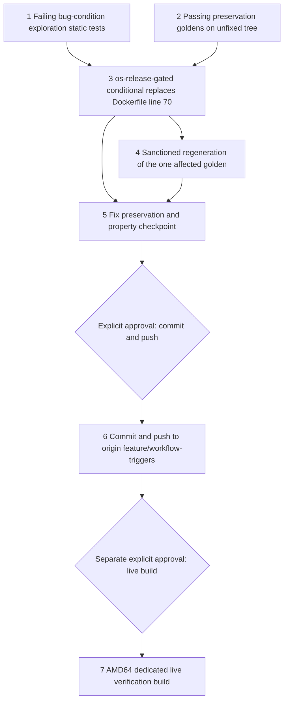

# Implementation Plan

## Overview

This plan implements the approved `bugfix.md` and `design.md` through the bug-condition workflow. The bug condition C(X): an apt install step in the docker-compose AMD64 build path (unconditional, or reachable when the effective base is Ubuntu 22.04) requests a package with no installation candidate on the jammy base, so apt exits 100 and the image build fails — concretely, `src/backend/Dockerfile` line 70's `RUN apt-get install libssl1.1 -y` (target `backend_generic`, Docker build step 24/63), where apt reports "Unable to locate package libssl1.1" and the image build and portal build job die (verified live on portal build job `3d18ba88-9c17-490a-811b-8c21360216f4`, AMD64 dedicated, source_ref `feature/workflow-triggers`, commit `4e1ce8c`, `BUILD_FAILED` on 2026-08-09 at ~21m51s). This is the third latent defect in the same class, unmasked by the sibling fixes (`edgemlsdk-cmake-pin-failure`, then `edgemlsdk-python-dev-ubuntu2204`); per the user mandate the spec closes the whole class in one pass — the full-path scan plus design-phase jammy index verification (Decision 2) confirm exactly ONE C(X) site: line 70. The fix (design Change 1) replaces line 70 with an `/etc/os-release`-gated conditional — comment block plus `RUN . /etc/os-release && if [ "$VERSION_ID" = "18.04" ] || [ "$VERSION_ID" = "20.04" ] ; then apt-get install libssl1.1 -y; fi` — installing `libssl1.1` only on the bases that resolve it (18.04/20.04) and skipping it on jammy, whose OpenSSL runtime need is already met (preinstalled `libssl3`, line 4's `libssl-dev` dependency, and the edgemlsdk artifacts' own `openssl.deb`). Critically the gate does NOT use the `$OS` build-arg, which is out of scope in every RUN (declared only before FROM) — an `$OS` conditional would be silently inert, and re-declaring `ARG OS` after FROM would activate the dormant lines 73-75 branch and break JP4 (Decision 1). Nothing else changes: the frontend Dockerfile, compose file, jp5/jp6/x86_64_nvidia variants, and all three install scripts are byte-for-byte untouched (Decisions 3-4); no compensating `libssl3` install is added on jammy (Decision 5).

Tasks 1 and 2 are standalone pre-fix tests on the UNFIXED tree in a new package `test/backend-test/backend_jammy_pkgs/` mirroring the proven `edgemlsdk_pythondev` pattern. Task 1 MUST FAIL on unfixed code for its bug-condition cases (design exploration cases 1, 2, and 6 — retired-token scan, fixed-step exact form, old-base allowlist reachability); its ¬C/scoping cases (3, 4, 5, 7 — counterexample scoping, class-closure verdict inventory, ARG-scoping structural pin, frontend zero-apt sanity) pass. Task 2 MUST PASS on unfixed code; neither baseline may be rewritten after implementation. Full Docker image builds cannot run in automated tests — validation is static/property tests over the Dockerfile and install-script text (parsed as TEXT only: no `docker`, `subprocess`, or shell-out anywhere in the package) plus the existing docker security-baseline suite and BOTH sibling packages, with the single affected golden regenerated through its sanctioned capture path. Tasks 1-5 authorize no deployment, push, SSM command, instance action, artifact publication, or build. Task 6 (commit + push to origin `feature/workflow-triggers`) and task 7 (live verification build) are separate explicit approval gates; task 6 approval does not authorize task 7.

Per the user-mandated completion criterion in `bugfix.md`, shared with both open siblings: **the spec is not complete until an actual portal build reaches `succeeded` including artifact publication**. Local validation alone does not close this spec. A `succeeded` AMD64 build with artifact publication simultaneously closes THREE specs: this one, `edgemlsdk-cmake-pin-failure`, and `edgemlsdk-python-dev-ubuntu2204`.

All test commands must be finite/non-watch invocations using the repo convention `PYTHONPATH=src/backend:test/backend-test pytest <files> --noconftest`. Property-based test tasks carry `**Property N: ...**` annotations for status tracking and must be run with the execution warning: `This test run contains property-based tests and may generate/shrink counterexamples.`

## Task Dependency Graph

```json
{
  "schemaVersion": 1,
  "waves": [
    {"wave": 1, "tasks": ["1", "2"], "dependsOn": [], "parallel": true, "gate": "unfixed tree only; task 1 must fail on exploration cases 1/2/6, task 2 must pass, both frozen thereafter"},
    {"wave": 2, "tasks": ["3"], "dependsOn": ["1", "2"], "parallel": false},
    {"wave": 3, "tasks": ["4"], "dependsOn": ["3"], "parallel": false, "gate": "sanctioned golden capture path only"},
    {"wave": 4, "tasks": ["5"], "dependsOn": ["3", "4"], "parallel": false, "gate": "local/static validation only"},
    {"wave": 5, "tasks": ["6"], "dependsOn": ["5"], "parallel": false, "gate": "explicit push approval (public repo)"},
    {"wave": 6, "tasks": ["7"], "dependsOn": ["6"], "parallel": false, "gate": "separate explicit live-build approval"}
  ],
  "edges": [["1", "3"], ["2", "3"], ["3", "4"], ["3", "5"], ["4", "5"], ["5", "6"], ["6", "7"]]
}
```



- Wave 1 freezes bug-condition evidence and preservation baselines on the unfixed tree before any production edit.
- Wave 2 applies the single-step fix (design Change 1).
- Wave 3 regenerates the one golden that embeds the changed file through its sanctioned capture path and proves all other goldens bit-identical (design Changes 2-4).
- Wave 4 is the local checkpoint: exploration tests now pass, frozen preservation goldens unchanged, Properties 1-3 validated, full security preservation suite and BOTH sibling packages green — no operational action.
- Waves 5-6 are separate explicit user-approval gates. Build servers sync from origin, so the push (task 6) is a precondition for the live build (task 7); neither approval is implied by plan completion, and task 6 approval does not authorize task 7.

## Tasks

- [x] 1. Write and run bug-condition exploration static tests on the unfixed tree
  - **Property 1: Bug Condition** - No Jammy-Unresolvable Package in Any AMD64-Reachable Apt Step
  - **CRITICAL**: Write and run this task before any production fix. The retired-token, fixed-step, and old-base-reachability tests MUST FAIL on unfixed code — failure confirms the bug exists. Do not weaken assertions or change production code in response.
  - **GOAL**: Surface counterexamples demonstrating C(X) and confirm the root cause analysis; if refuted (line 70 already changed, additional jammy-retired sites exist in the AMD64 path, a second `ARG OS` declaration exists after FROM, or an install script contains an unvetted apt package), re-hypothesize before fixing.
  - **Scoped PBT Approach**: This is a deterministic static bug — scope the assertions to the one concrete site identified by `isBugCondition` in design (line 70's unconditional `libssl1.1` request), plus a whole-path reachability-aware token-boundary scan guard for additional retired sites.
  - Create the new package `test/backend-test/backend_jammy_pkgs/` with `test_bug_condition_exploration.py`: parse the UNFIXED AMD64 build path's apt install steps (logical RUN reconstruction across backslash continuations in `src/backend/Dockerfile`; apt lines in the three install scripts `prereqs_install.sh`, `install_aravis.sh`, `install_edgemlsdk.sh`; package-token extraction excluding flags like `-y`/`--no-install-recommends`/`--only-upgrade`; release-conditional reachability modeling; strict token-boundary matching so `libssl1.1` never substring-matches and `libssl-dev`/`libssl3` never classify as retired) and assert the FIXED predicate from design's fix-checking pseudocode. The package parses files as TEXT only — no `docker`, `subprocess`, or shell-out anywhere. Textual anchors use content matching, not line numbers (the fix shifts later line numbers).
  - Cover all seven design exploration cases: (1) no jammy-retired package token (`RETIRED_JAMMY_PACKAGES = {"libssl1.1"}`) in any AMD64-reachable (22.04-reachable) apt install step of `src/backend/Dockerfile` + the three install scripts (→ FAILS on unfixed code — counterexample: line 70's unconditional `libssl1.1`), (2) fixed-step exact form: the libssl install step is the `/etc/os-release`-gated conditional with allowlist exactly {"18.04", "20.04"} and body `apt-get install libssl1.1 -y` (→ FAILS on unfixed code, which has the unconditional form), (3) counterexample inventory scoping: the retired-token scan over the UNFIXED tree finds exactly ONE site — the line-70 step (passes pre-fix as a scoping check confirming the bugfix.md scan and single-step fix scope; post-fix meaning: zero reachable sites), (4) class-closure verdict inventory (¬C): every package token requested by AMD64-reachable apt steps in the Dockerfile and scripts is a member of the design-verified jammy-resolvable inventory (the Decision 2 table plus the bugfix.md-enumerated ¬C sites) — any unknown token fails until vetted (passes pre-fix for all sites except line 70's token, which case 1 already isolates; passes post-fix completely), (5) ARG-scoping structural pin: `ARG OS` appears only before `FROM` and no `ARG OS` re-declaration exists after `FROM` — the structural fact that forces the `/etc/os-release` gate and keeps lines 73-75 inert (passes pre/post fix), (6) old-base allowlist reachability: the fixed step's guard makes `libssl1.1` reachable when the base is 18.04 or 20.04 and unreachable when 22.04, under the reachability model (→ FAILS pre-fix: the unconditional step is reachable on all three), (7) frontend/compose sanity (¬C): `src/frontend/Dockerfile` contains zero apt install steps (alpine/npm only) — anchors the Req 2.4 scan boundary (passes pre/post fix).
  - These tests encode the expected behavior; they are the fix check that will pass after implementation (task 5.1). Do not write throwaway inverted tests.
  - Run only this package with `PYTHONPATH=src/backend:test/backend-test pytest test/backend-test/backend_jammy_pkgs/ --noconftest` (finite, non-watch) and the property-test warning.
  - Record the counterexample (the exact line-70 text and its position between the `apt update -y` lines 69/71) in `.kiro/specs/backend-jammy-retired-packages/exploration-notes.md` or test docstrings, cross-referencing the live apt exit 100 evidence from job `3d18ba88` at backend step 24/63.
  - **EXPECTED OUTCOME**: FAIL on unfixed code for cases 1, 2, and 6 (the line-70 bug-condition cases); PASS for the scoping check, verdict inventory, ARG-scoping pin, and frontend sanity cases (3, 4, 5, 7). Mark complete only after the failures are reproduced and documented.
  - _Requirements: 1.1, 1.2, 1.3, 1.4, 2.1, 2.2, 2.3, 2.4_

- [x] 2. Write and run observation-first preservation baseline capture on the unfixed tree
  - **Property 2: Preservation** - All Other Lines, Old-Base Behavior, and Sibling Files Unchanged
  - **IMPORTANT**: Follow observation-first methodology — capture the UNFIXED tree's bytes as goldens BEFORE any production edit, verify the tests pass on the unfixed tree, and freeze the goldens thereafter. Do not rebaseline these after implementation.
  - Add preservation tests under `test/backend-test/backend_jammy_pkgs/` using a capture-or-assert helper mirroring the `edgemlsdk_pythondev` pattern: on first run (golden absent) capture from the tree into `test/backend-test/backend_jammy_pkgs/baselines/`; on subsequent runs assert byte-for-byte equality.
  - Capture the diff-scoping goldens from design's preservation pseudocode: (a) `backend_Dockerfile_libssl_masked.txt` — the libssl-step-masked view of `src/backend/Dockerfile` (mask ONLY the libssl install step; **the mask MUST match BOTH shapes**: the unfixed single line `RUN apt-get install libssl1.1 -y` AND the fixed comment-block-plus-conditional form, so the golden frozen on the unfixed tree asserts unchanged on the fixed tree — the masked view thereby proves the Python 3.11 source build, the awscrt vendored-link workaround, lines 69/71/72, the inert lines 73-75 conditional, the CVE block, and all COPY/script invocation lines survive verbatim, Req 3.1); (b) full-file sha256 goldens of the 8 untouched files: `src/frontend/Dockerfile`, `src/docker-compose.yaml`, `src/backend/Dockerfile.jp5`, `src/backend/Dockerfile.jp6`, `src/backend/Dockerfile.x86_64_nvidia` (Req 3.3), and the three install scripts `prereqs_install.sh`, `install_aravis.sh`, `install_edgemlsdk.sh` (Decision 3 enforced mechanically).
  - Add a mask-exactness assertion: the masked view differs from the raw file by exactly the one target step (pre-fix: one physical line; post-fix: the comment+conditional block), with the step count and content asserted — the mask cannot hide collateral edits.
  - Add the Hypothesis property tests from design: (i) retired-token classifier property — for generated package-name tokens including adversarial prefixes/suffixes around `libssl1.1` and `libssl-dev` (e.g. `libssl1.1-foo`, `libssl3`, `zlib1g-dev`), the classifier flags a token iff it is exactly a member of the retired set (token-boundary discipline); (ii) masking preservation property — for generated Dockerfile line sequences containing zero or more marked target steps, the masking helper removes exactly the target step(s) and nothing else (mirrors the `edgemlsdk_pythondev` masking-helper property pattern); (iii) apt-line tokenization property — for generated apt install lines with random flag/package orderings and backslash continuations, tokenization is total and flags never classify as packages; (iv) reachability model property — for generated release allowlists and base versions, a guarded step is reachable iff the base is in the allowlist and an unconditional step is always reachable, so the fixed step is 22.04-unreachable and 18.04/20.04-reachable by construction.
  - Run with `PYTHONPATH=src/backend:test/backend-test pytest test/backend-test/backend_jammy_pkgs/ --noconftest` (finite, non-watch) and the property-test warning.
  - **EXPECTED OUTCOME**: PASS on unfixed code, establishing the immutable preservation baseline. Goldens are frozen from this point.
  - _Requirements: 3.1, 3.2, 3.3_

- [x] 3. Fix line 70 with the /etc/os-release-gated conditional

  - [x] 3.1 Replace `RUN apt-get install libssl1.1 -y` at `src/backend/Dockerfile:70` with the release-gated conditional
    - Replace line 70 with the comment block plus conditional from design Change 1 — the entire code fix:
      ```dockerfile
      # libssl1.1 (OpenSSL 1.1 runtime) exists only through focal; on
      # jammy the base already ships libssl3 and the edgemlsdk debs carry their
      # own OpenSSL 3.x (openssl.deb). Gate on the base's own /etc/os-release:
      # the OS build-arg is out of scope in RUN (declared only before FROM).
      RUN . /etc/os-release && if [ "$VERSION_ID" = "18.04" ] || [ "$VERSION_ID" = "20.04" ] ; then \
          apt-get install libssl1.1 -y; \
          fi
      ```
    - Nothing else in the file changes: line 69's `apt update -y` still precedes the step (index fresh when the guard fires on old bases), the comment block travels with the step inside the single masked region, and later line numbers shift by the added lines (all textual anchors in tests use content matching, not line numbers).
    - The allowlist gate reads the base image's ground truth (`VERSION_ID`), sidestepping the `$OS` ARG-scoping trap entirely: no `ARG OS` re-declaration is introduced, so the dormant lines 73-75 branch stays exactly as inert as today (Decisions 1 and 4). On 18.04/20.04 the identical `apt-get install libssl1.1 -y` runs as before (Req 3.2); on 22.04 the step skips and the OpenSSL runtime need is already met twice over — `libssl3` preinstalled in `public.ecr.aws/ubuntu/ubuntu:22.04` and a hard dependency of line 4's `libssl-dev` — plus the edgemlsdk artifacts' own `openssl.deb` (Decision 5: no compensating install added).
    - **Explicitly unchanged by design**: `src/frontend/Dockerfile`, `src/docker-compose.yaml`, `src/backend/Dockerfile.jp5`/`.jp6`/`.x86_64_nvidia`, the three install scripts (all apt steps ¬C — Decision 3), all other `src/backend/Dockerfile` lines including the inert lines 73-75 conditional and its typo'd `libavcodec-extra57i` (Decision 4), the security suite's masked goldens and default-refs baseline, all other out-of-scope entries, both sibling test packages, and all of `src/edgemlsdk/**`.
    - _Bug_Condition: isBugCondition(input) — line 70's unconditional apt step requests retired `libssl1.1`, no installation candidate on the 22.04 base, apt exit 100_
    - _Expected_Behavior: Property 1 — no AMD64-reachable apt step requests a jammy-retired token; the libssl step is gated to allowlist {18.04, 20.04} and 22.04-unreachable; build proceeds past step 24/63_
    - _Preservation: Property 2 — every other `src/backend/Dockerfile` line byte-for-byte unchanged; old-base libssl1.1 behavior preserved; the 8 sibling files untouched_
    - _Requirements: 2.1, 2.2, 2.3, 2.4, 3.1, 3.2_

- [x] 4. Regenerate the one affected golden via the sanctioned capture path
  - **Property 3: Baseline Regeneration** - Exactly One Golden Regenerated, Mechanisms Intact
  - Regenerate ONLY the one golden that embeds the changed file, through its sanctioned path — never by hand-editing captured bytes beyond the single entry:
  - (a) `test/backend-test/security/baselines/docker_baseline_out_of_scope.json` — the `src/backend/Dockerfile` entry only: per `.kiro/steering/builds.md` and both siblings' precedent, run `sha256sum src/backend/Dockerfile` on the fixed tree, edit just that one JSON entry (currently `40f7c9e00e53096fed4aa5be311f393c231440f241503a3527ac33e5a1741b87`), re-run `test/backend-test/security/preservation/test_preservation_docker_out_of_scope.py` to assert green. Touch no other entry (compose, edgemlsdk Dockerfile, frontend Dockerfile). Note: the security suite has NO masked-bytes golden for the plain `src/backend/Dockerfile` (only backend jp5/jp6 and edgemlsdk jp5/jp6 masked goldens exist) and `docker_baseline_default_refs.json` tracks no entry in this file — so this entry is the only golden affected repo-wide.
  - (b) Assert every golden NOT embedding the changed file is bit-identical pre/post fix (e.g. `git diff --stat` shows no change): the security suite's backend and edgemlsdk jp5/jp6 masked goldens, `docker_baseline_default_refs.json`, the other three out-of-scope entries, and BOTH sibling packages' goldens (`test/backend-test/edgemlsdk_cmake/baselines/`, `test/backend-test/edgemlsdk_pythondev/baselines/` — `src/edgemlsdk/**` is untouched, so none embed this change).
  - Per steering, this golden update ships in the same commit as the fix (task 6) so the tree is self-consistent on either side of it.
  - Run the affected test with `PYTHONPATH=src/backend:test/backend-test pytest test/backend-test/security/preservation/test_preservation_docker_out_of_scope.py --noconftest` (finite, non-watch).
  - _Bug_Condition: n/a — intended consequence of the fix (the golden describes the changed file)_
  - _Expected_Behavior: Property 3 — exactly one golden regenerated through the sanctioned path, all others bit-identical_
  - _Preservation: enforcing mechanisms (masked-bytes comparison, out-of-scope hash guard, default-refs guard, capture-on-absent semantics) run unchanged against the regenerated golden_
  - _Requirements: 2.5, 3.4, 3.5_

- [x] 5. Fix, preservation, and property validation checkpoint (Properties 1-3)

  - [x] 5.1 Re-run the bug-condition exploration tests unchanged
    - **Property 1: Expected Behavior** - No Jammy-Unresolvable Package in Any AMD64-Reachable Apt Step
    - **IMPORTANT**: Re-run the SAME tests from task 1 — do NOT write new tests or weaken assertions. The task 1 tests encode the expected behavior; when they pass, the fix is confirmed for the C(X) site and the class is closed.
    - Confirm zero jammy-retired tokens in any AMD64-reachable apt step of the fixed tree (case 1); the libssl step is the exact `/etc/os-release`-gated conditional with allowlist {"18.04", "20.04"} and body `apt-get install libssl1.1 -y` (case 2); the retired-token scan finds zero reachable sites (case 3, post-fix meaning); the class-closure verdict inventory passes completely (case 4); `ARG OS` still appears only before FROM (case 5); the guarded step is 18.04/20.04-reachable and 22.04-unreachable under the reachability model (case 6); the frontend Dockerfile still has zero apt steps (case 7).
    - Run with `PYTHONPATH=src/backend:test/backend-test pytest test/backend-test/backend_jammy_pkgs/ --noconftest` and the property-test warning.
    - **EXPECTED OUTCOME**: PASS after the fix (confirms the bug is fixed and the class closed).
    - _Requirements: 2.1, 2.2, 2.3, 2.4_

  - [x] 5.2 Re-run the frozen preservation goldens unchanged
    - **Property 2: Preservation** - All Other Lines, Old-Base Behavior, and Sibling Files Unchanged
    - **IMPORTANT**: Re-run the SAME tests from task 2 against the frozen goldens — do NOT recapture or rebaseline them. The shape-agnostic mask (matching both the unfixed single line and the fixed comment+conditional block) is what lets the frozen golden assert on the fixed tree.
    - Confirm the libssl-step-masked view of `src/backend/Dockerfile` is byte-for-byte identical to the unfixed capture (proving the Python 3.11 build, the awscrt workaround, lines 69/71/72, the inert lines 73-75 conditional, the CVE block, and the script invocations survive verbatim), the mask-exactness assertion still holds (exactly the one target step differs from the raw file — now the comment+conditional block), and all 8 full-file sha256 goldens (frontend Dockerfile, compose, jp5/jp6/x86_64_nvidia variants, three install scripts) are bit-identical — proving exactly one step changed and every sibling file is untouched.
    - Run with `PYTHONPATH=src/backend:test/backend-test pytest test/backend-test/backend_jammy_pkgs/ --noconftest` and the property-test warning.
    - **EXPECTED OUTCOME**: PASS after the fix (confirms no regressions).
    - _Requirements: 3.1, 3.2, 3.3_

  - [x] 5.3 Run the full security preservation suite and BOTH sibling packages; confirm the no-live-action contract
    - **Property 3: Baseline Regeneration** - Exactly One Golden Regenerated, Mechanisms Intact
    - Re-run the complete docker security preservation suite (`PYTHONPATH=src/backend:test/backend-test pytest test/backend-test/security/preservation/ --noconftest`) against the fixed tree with the regenerated out-of-scope entry: masked-bytes mechanism intact, out-of-scope guard green with the updated `src/backend/Dockerfile` hash, backend and edgemlsdk jp5/jp6 masked goldens and default-refs guard bit-identical. Expected shape: fully green apart from any known pre-existing skips.
    - Re-run BOTH sibling packages (`PYTHONPATH=src/backend:test/backend-test pytest test/backend-test/edgemlsdk_cmake/ test/backend-test/edgemlsdk_pythondev/ --noconftest`) against the fixed tree: all tests green, all their goldens bit-identical — `src/edgemlsdk/**` is untouched by this fix (Req 3.5).
    - Confirm every Property 1-3 has a passing test with exact requirement traceability, and that no automated test in this spec runs a Docker build (the no-Docker-build validation constraint from bugfix.md is honored — no `docker`, `subprocess`, or shell-out in `test/backend-test/backend_jammy_pkgs/`, verified by inspection).
    - Record validation commands, pass/fail counts, and any pre-existing unrelated failures in `.kiro/specs/backend-jammy-retired-packages/verification-notes.md`.
    - **STOP**: Do not deploy, push, send an SSM command, start/stop/terminate an instance, publish an artifact, or launch a build in this checkpoint. Live verification proceeds only through tasks 6 and 7. Ask the user if questions arise.
    - _Requirements: 2.5, 3.4, 3.5_

- [x] 6. Approval-gated commit and push to origin feature branch
  - **STOP: obtain explicit user approval after task 5. Local validation completion is not push approval.**
  - Build servers sync from origin, so local commits are invisible to them — pushing the fix to origin `feature/workflow-triggers` (the user's standing branch decision from the sibling chain; the failing evidence job's source_ref already points there) is the precondition for task 7's live verification.
  - Before requesting approval, present the exact diff scope: the single-step `src/backend/Dockerfile` fix (comment block + conditional), the one regenerated golden entry in `docker_baseline_out_of_scope.json` (shipped in the same commit per steering), and the new `test/backend-test/backend_jammy_pkgs/` package with its baselines.
  - This is a public repo — run the per-repo secret-hygiene checks (secrets guard per `.kiro/steering/builds.md`) over the diff before pushing, INCLUDING an internal-endpoint scan; confirm no credentials, tokens, or internal identifiers appear in any added text. **Prior-chain lesson**: live API Gateway URLs leaked into verification/exploration notes during the sibling chain — redact any live API Gateway URLs (and similar internal endpoints) from `exploration-notes.md`/`verification-notes.md` BEFORE staging anything.
  - After approval only: stage the specific files (no `git add .`), commit with a message referencing this spec, and push to origin `feature/workflow-triggers`. No force-push.
  - This task authorizes the push only — it does NOT authorize dispatching any build; task 7 requires its own separate approval.
  - _Requirements: 2.5 (golden ships with the fix); precondition for the bugfix Introduction completion criterion_

- [ ] 7. Separately approval-gated live verification build (user-mandated completion criterion)
  - **STOP: obtain a new explicit user approval after task 6. Push approval does not authorize this build.**
  - The approval request must state: target `AMD64`, mode dedicated (the existing X86 build server — same shape as failing evidence job `3d18ba88`), `source_ref` `feature/workflow-triggers`, estimated duration/cost, artifact-publication effects, monitoring scope, and stop criteria. Builds run strictly one at a time per steering.
  - After approval only: run the portal build preflight first, per the established build-fleet workflow and `.kiro/steering/builds.md` (no concurrent build, no preservation-tracked drift, guard tests green — out-of-scope guard + secrets guard — fleet/instance health, one-at-a-time). If preflight fails, do not dispatch; record diagnostics and stop.
  - If preflight passes, dispatch exactly the approved build and monitor via the Build Log API / CloudWatch `/dda/portal-builds`: confirm the backend build proceeds past the former step 24/63 with no `libssl1.1` resolution failure (the guarded step skips on jammy), that line 72's six-package install and the CVE-block install run green (closing the flagged ¬C verdicts live), and that both siblings' fixed steps still log clean (`cmake version 3.31.6`; `python-dev-is-python3`).
  - **Success criterion**: the job must reach `succeeded` INCLUDING artifact publication — the user-mandated completion criterion from bugfix.md. A build that merely fails later than the backend libssl step is progress evidence but does NOT complete this spec.
  - **Shared completion — THREE specs**: a `succeeded` AMD64 build with artifact publication simultaneously satisfies the completion criteria of this spec AND both open siblings, `edgemlsdk-cmake-pin-failure` and `edgemlsdk-python-dev-ubuntu2204` — record the shared closure in all three specs' verification notes.
  - **New-failure handling**: any follow-on failure past the fixed step is new evidence outside this spec's fix scope — record it in `verification-notes.md`, open/route a new spec or task for it (as this spec was itself routed from `edgemlsdk-python-dev-ubuntu2204`), and keep this spec open until a build succeeds and publishes.
  - Record the job ID, timeline, former-step-24/63 log evidence, line-72 and CVE-block log evidence, sibling-fix log evidence, and final status in `.kiro/specs/backend-jammy-retired-packages/verification-notes.md`.
  - _Requirements: 1.1, 1.2 (defect no longer reproduces), 1.4 (class closed in one pass), 2.1, 2.3, 2.4; bugfix Introduction completion criterion ("complete only when an actual portal build reaches `succeeded` including artifact publication")_

## Notes

- Tasks 1 and 2 are standalone pre-fix tasks on the UNFIXED tree. Task 1 is complete only after its expected failures (exploration cases 1, 2, and 6 — the line-70 bug-condition cases) and its passing ¬C/scoping cases (3, 4, 5, 7) are reproduced and documented; task 2 is complete only after its goldens are captured and passing on unfixed code. Both baselines are frozen — the fix must make task 1 pass and keep task 2 passing without touching either test.
- Property status annotations use the design's numbered correctness properties: task 5.1 reuses task 1 as the fix check (Property 1), task 5.2 reuses task 2 as the preservation check (Property 2), and tasks 4 + 5.3 validate Property 3.
- The masked-golden mask is deliberately shape-agnostic: it must match BOTH the unfixed single line (`RUN apt-get install libssl1.1 -y`) and the fixed comment-block-plus-conditional form, so the golden captured on the unfixed tree (task 2) asserts unchanged on the fixed tree (task 5.2) without rebaselining. The mask-exactness assertion guards against the mask hiding collateral edits in either shape.
- Token-boundary discipline is load-bearing throughout: `libssl1.1` must never substring-match, and `libssl-dev` (line 4) and `libssl3` must never classify as retired — every scan matches whole package-name tokens (split on whitespace/backslash-continuations), never substrings.
- The `$OS` ARG-scoping trap is load-bearing for the fix shape: `ARG OS` is declared only before FROM, so `$OS` is empty in every RUN — an `$OS`-gated conditional would be silently inert, and re-declaring `ARG OS` after FROM would activate the dormant lines 73-75 branch (typo'd `libavcodec-extra57i`) on real 18.04 builds. The `/etc/os-release` gate reads the base's ground truth and leaves lines 73-75 exactly as inert as today; exploration case 5 pins this structurally.
- Full Docker image builds cannot run in automated tests (bugfix.md validation constraint). The security preservation suite and both sibling packages are the in-repo integration layer; the task 7 live build is the true integration test and the only path to spec completion.
- Rollback is a pure git revert: the single-step Dockerfile fix, the one regenerated golden entry, and the new test package revert atomically in one commit, keeping all preservation suites consistent on either side. If the live build surfaces a genuine OpenSSL 1.1 dependency on the 22.04 path (contradicting Decision 5's analysis), the fallback is NOT a compat shim — per bugfix.md that is a design problem to solve properly (most likely in the consuming artifact's own build, as the edgemlsdk image did with its source-built OpenSSL 3.x), a deliberate scope expansion requiring user agreement before implementation.
- Tasks 6 and 7 are separate non-automatic approval gates. Neither approval is implied by completion of tasks 1-5, and task 6 (push) approval does not authorize task 7 (build dispatch). The user has pre-authorized commit and one deployment-test build for this chain, but both gates must still be presented explicitly with their full scope statements.
