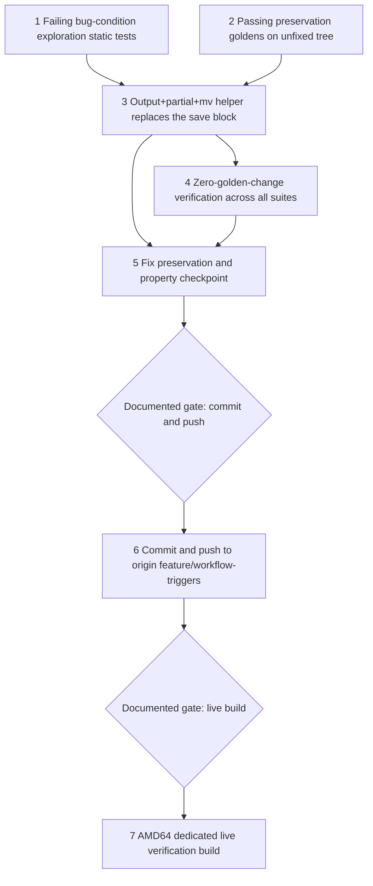

# Implementation Plan

## Overview

This plan implements the approved `bugfix.md` and `design.md` through the bug-condition workflow. The bug condition C(X): a `docker save` invocation site in `build-custom.sh` streams the image tar through the snap-confined docker CLI's redirected stdout (`docker save <image> > <file>`), which fails with `write /dev/stdout: bad file descriptor` (EBADF) under the SSM RunShellScript execution context, leaving a 0-byte tar and aborting the build via `set -e` — concretely, lines 366 (`docker save flask-app > ./custom-build/$COMPONENT_NAME/flask-app.tar`, the confirmed live failure) and 367 (react-webapp, the identical pattern, unreached only because line 366 aborts first). Verified live on portal build job `d844a5fb-81d5-4294-956d-d6d6ae1f000e` (AMD64 dedicated X86 server, source_ref `feature/workflow-triggers`, commit `ab900d9`, settled `failed` 2026-08-09 at ~9m32s; 0-byte tar confirmed by read-only SSM inspection, 29 GB free disk). This is the first NON-apt blocker in the chain, a pre-existing latent defect unmasked by the three sibling fixes — that job was the first AMD64 build ever to build all three images and pass every in-build gate. The bind: BOTH historical save forms are broken under snap Docker — the script's own comment (lines 361-365) documents that the stdout-redirect form was itself the workaround for `--output`'s transient `.tmp-<name><rand>` rename racing the old recursive packaging `zip` (exit 18), and the redirect form now fails under SSM. The fix (design Change 1) replaces the save block — comment lines 361-365 plus save lines 366-367, between the unchanged line-360 `echo "save docker images as tarvballs"` log anchor and the unchanged compose-`cp` line — with a `save_image_tar` helper: `docker save --output` to a `.partial`-suffixed name in the staging dir, atomic same-dir `mv` into the exact final `ZIP_MEMBERS` tar path, and an integrity guard (size ≥ 1048576 bytes + full `tar -tf` structural check) with loud diagnostics and non-zero exit on every failure path; two identical call sites (flask-app, react-webapp) close the class in one pass (design Decisions 1-4). The `--output` form involves docker's stdout in no way at all — zero assumptions about snap stdout plumbing under SSM — and its one documented hazard is neutralized three ways: the `.partial`+`mv` discipline means the final tar name only ever appears complete, and the existing pre-zip `rm -f .tmp-*` cleanup and explicit `ZIP_MEMBERS` list with `-x '*/.tmp-*'` exclusion (lines 385-421) police any residual. Nothing else changes: every other `build-custom.sh` line, the four scanned neighbor scripts, all Dockerfiles/compose/goldens repo-wide are byte-for-byte untouched (design Decision 5).

Tasks 1 and 2 are standalone pre-fix tests on the UNFIXED tree in a new package `test/backend-test/build_save_pkgs/` mirroring the proven sibling pattern (`backend_jammy_pkgs`, `edgemlsdk_pythondev`). Task 1 MUST FAIL on unfixed code for its bug-condition cases (design exploration cases 1, 2, and 3 — no-stdout-redirect scan, both-sites-fixed-form, fixed-form helper structure); its ¬C/scoping cases (4, 5, 6, 7 — counterexample scoping to exactly TWO sites, class boundary over the four neighbor scripts, temp-hazard guard coexistence, log-anchor preservation) pass. Task 2 MUST PASS on unfixed code; neither baseline may be rewritten after implementation. Automated tests cannot run `docker save` against real multi-gigabyte images and the build-server context cannot be reproduced locally — validation is static/property tests over the `build-custom.sh` text (parsed as TEXT only: no `docker`, `subprocess`, or shell-out anywhere in the package) plus the existing suites re-run. Unlike all three siblings, this spec regenerates NO golden anywhere: no existing golden or baseline embeds `build-custom.sh` bytes (bugfix.md scan), so task 4 is a zero-golden-change verification, not a regeneration. Tasks 1-5 authorize no deployment, push, SSM command, instance action, artifact publication, or build. Task 6 (commit + push to origin `feature/workflow-triggers`) and task 7 (live verification build) are pre-authorized by the user for this chain but remain separate, documented, explicitly acknowledged gates.

Per the user-mandated completion criterion in `bugfix.md`, shared with all three open siblings: **the spec is not complete until an actual portal build reaches `succeeded` including artifact publication**. Local validation alone does not close this spec. A `succeeded` AMD64 build with artifact publication simultaneously closes FOUR specs: this one, `edgemlsdk-cmake-pin-failure`, `edgemlsdk-python-dev-ubuntu2204`, and `backend-jammy-retired-packages`.

All test commands must be finite/non-watch invocations using the repo convention `PYTHONPATH=src/backend:test/backend-test pytest <files> --noconftest`. Property-based test tasks carry `**Property N: ...**` annotations for status tracking and must be run with the execution warning: `This test run contains property-based tests and may generate/shrink counterexamples.`

## Task Dependency Graph

```json
{
  "schemaVersion": 1,
  "waves": [
    {"wave": 1, "tasks": ["1", "2"], "dependsOn": [], "parallel": true, "gate": "unfixed tree only; task 1 must fail on exploration cases 1/2/3, task 2 must pass, both frozen thereafter"},
    {"wave": 2, "tasks": ["3"], "dependsOn": ["1", "2"], "parallel": false},
    {"wave": 3, "tasks": ["4"], "dependsOn": ["3"], "parallel": false, "gate": "zero-golden-change verification — no regeneration exists for this spec"},
    {"wave": 4, "tasks": ["5"], "dependsOn": ["3", "4"], "parallel": false, "gate": "local/static validation only"},
    {"wave": 5, "tasks": ["6"], "dependsOn": ["5"], "parallel": false, "gate": "push gate (pre-authorized but documented; public repo secrets/endpoint hygiene)"},
    {"wave": 6, "tasks": ["7"], "dependsOn": ["6"], "parallel": false, "gate": "live-build gate (pre-authorized but documented; separate acknowledgment)"}
  ],
  "edges": [["1", "3"], ["2", "3"], ["3", "4"], ["3", "5"], ["4", "5"], ["5", "6"], ["6", "7"]]
}
```



- Wave 1 freezes bug-condition evidence and preservation baselines on the unfixed tree before any production edit.
- Wave 2 applies the single-block fix (design Change 1) — the entire code diff.
- Wave 3 proves the unique invariant of this spec: ZERO golden changes repo-wide — the python-version audit, the security preservation suite, and all three sibling packages pass with every golden bit-identical (design Decision 5, Property 3).
- Wave 4 is the local checkpoint: exploration tests now pass, frozen preservation goldens unchanged, Properties 1-3 validated — no operational action.
- Waves 5-6 are the operational gates. Build servers sync from origin, so the push (task 6) is a precondition for the live build (task 7). Both gates are pre-authorized by the user for this chain but must still be presented with their full scope statements and acknowledged separately; task 6 does not authorize task 7.

## Tasks

- [x] 1. Write and run bug-condition exploration static tests on the unfixed tree
  - **Property 1: Bug Condition** - Both Save Sites Use the Output+Rename Form with an Integrity Guard
  - **CRITICAL**: Write and run this task before any production fix. The no-stdout-redirect scan, both-sites-fixed-form, and helper-structure tests MUST FAIL on unfixed code — failure confirms the bug exists. Do not weaken assertions or change production code in response.
  - **GOAL**: Surface counterexamples demonstrating C(X) and confirm the root cause analysis; if refuted (the save lines already changed, additional `docker save`/`docker export` sites exist, the zip-side guards are not as documented at lines 385-421, or the comment block no longer matches its documented content), re-hypothesize before fixing.
  - **Scoped PBT Approach**: This is a deterministic static bug — scope the assertions to the two concrete sites identified by `isBugCondition` in design (lines 366-367's stdout-redirect saves), plus a whole-file save-form classification scan guarding against additional sites.
  - Create the new package `test/backend-test/build_save_pkgs/` with `test_bug_condition_exploration.py`: parse `build-custom.sh` as TEXT only (logical line reconstruction across backslash continuations; comment/string-aware tokenization so `docker save` inside a comment or string never classifies as an invocation site; save-form classification into STDOUT_REDIRECT vs OUTPUT_PARTIAL_MV vs OTHER, recognizing both `--output` and `-o` spellings) and assert the FIXED predicate from design's fix-checking pseudocode. No `docker`, `subprocess`, or shell-out anywhere in the package. Textual anchors use content matching, not line numbers (the fix shifts later line numbers — sibling precedent).
  - Cover all seven design exploration cases: (1) no stdout-redirect save site remains — classify every `docker save` invocation site in `build-custom.sh` and assert zero sites of form STDOUT_REDIRECT (→ FAILS on unfixed code — counterexamples: the flask-app and react-webapp sites, matching the live EBADF evidence from job `d844a5fb`), (2) both sites in the fixed form — exactly two image-save call sites exist (flask-app, react-webapp), both invoking the shared `save_image_tar` helper, with final destinations exactly the two `ZIP_MEMBERS` tar paths `custom-build/$COMPONENT_NAME/flask-app.tar` and `custom-build/$COMPONENT_NAME/react-webapp.tar` (→ FAILS on unfixed code), (3) fixed-form helper structure — the helper contains, in order: `docker save --output` to a `"$dest.partial"` destination, an `mv` from `.partial` to the final name, a size guard with threshold literal 1048576, a `tar -tf` structural check, and non-zero exits with diagnostics on both failure paths (→ FAILS on unfixed code, which has no helper), (4) counterexample inventory scoping: the STDOUT_REDIRECT scan over the UNFIXED tree finds exactly TWO sites — lines 366-367's images (passes pre-fix as a scoping check confirming the bugfix.md scan and that the fix scope is exactly the save block; post-fix meaning: zero sites), (5) class boundary (¬C): the four neighbor scripts (`scripts/portal-build-agent.sh`, `publish-ecr-only.sh`, `com.dda.InferenceUploader/build-and-publish.sh`, `src/edgemlsdk/build.sh`) contain zero `docker save`/`docker export` invocation sites — anchors the Req 2.2 class closure (passes pre/post fix), (6) temp-hazard guards coexist (Req 2.3): the pre-zip `rm -f ./custom-build/$COMPONENT_NAME/.tmp-*` cleanup, the explicit `ZIP_MEMBERS` array with both tar paths, and the `-x '*/.tmp-*'` zip exclusion are all present, and the transient names the fixed form can produce (`.tmp-*`, `*.partial`) never appear in `ZIP_MEMBERS` (cleanup/exclusion assertions pass pre/post fix; the `.partial` non-membership assertion is trivially true pre-fix), (7) log anchor preserved: the `echo "save docker images as tarvballs"` line survives verbatim — the live-log grep anchor for the verification build (passes pre/post fix). Structural pins: `set -e` and `set -o pipefail` still at lines 2-3.
  - These tests encode the expected behavior; they are the fix check that will pass after implementation (task 5.1). Do not write throwaway inverted tests.
  - Run only this package with `PYTHONPATH=src/backend:test/backend-test pytest test/backend-test/build_save_pkgs/ --noconftest` (finite, non-watch) and the property-test warning.
  - Record the counterexamples (the exact text of lines 366-367 and their position between the line-360 echo anchor and the compose-`cp` line) in `.kiro/specs/build-docker-save-stdout-failure/exploration-notes.md` or test docstrings, cross-referencing the live evidence: job `d844a5fb`'s `write /dev/stdout: bad file descriptor` immediately after `save docker images as tarvballs`, the confirmed 0-byte `flask-app.tar`, 29 GB free disk, 4.78 GB image.
  - **EXPECTED OUTCOME**: FAIL on unfixed code for cases 1, 2, and 3 (the bug-condition cases); PASS for the scoping, class-boundary, guard-coexistence, and log-anchor cases (4, 5, 6, 7). Mark complete only after the failures are reproduced and documented.
  - _Requirements: 1.1, 1.2, 1.3, 1.4, 2.1, 2.2, 2.3, 2.4_

- [x] 2. Write and run observation-first preservation baseline capture on the unfixed tree
  - **Property 2: Preservation** - All Other Lines, Tar Paths, and Neighbor Scripts Unchanged
  - **IMPORTANT**: Follow observation-first methodology — capture the UNFIXED tree's bytes as goldens BEFORE any production edit, verify the tests pass on the unfixed tree, and freeze the goldens thereafter. Do not rebaseline these after implementation.
  - Add preservation tests under `test/backend-test/build_save_pkgs/` using a capture-or-assert helper mirroring the sibling pattern: on first run (golden absent) capture from the tree into `test/backend-test/build_save_pkgs/baselines/`; on subsequent runs assert byte-for-byte equality.
  - Capture the diff-scoping goldens from design's preservation pseudocode: (a) `build_custom_save_masked.txt` — the save-block-masked view of `build-custom.sh` (mask ONLY the save block; **the mask MUST match BOTH shapes**: the unfixed 5-comment-lines-plus-2-save-lines block AND the fixed comment-block-plus-helper-plus-2-call-lines form, with the block's boundaries anchored on the unchanged line-360 `echo "save docker images as tarvballs"` above and the unchanged compose-`cp` line below, so the golden frozen on the unfixed tree asserts unchanged on the fixed tree — the masked view thereby proves the interpreter-version audit guard, the edgemlsdk build and deb extraction, the docker-compose builds with their profile/build-arg selection, the in-image backend test and security gate block, the staging-dir population, the pre-zip `rm -f .tmp-*` cleanup, the packaging diagnostics, the `ZIP_MEMBERS` list with its exact tar paths, the zip invocation with its `-x '*/.tmp-*'` exclusion, the `zip -T` integrity check, and the `greengrass-build` copy all survive verbatim, Req 3.1, 3.5); (b) full-file sha256 goldens of the four scanned neighbor scripts `scripts/portal-build-agent.sh`, `publish-ecr-only.sh`, `com.dda.InferenceUploader/build-and-publish.sh`, `src/edgemlsdk/build.sh` (the class boundary enforced mechanically).
  - Add a mask-exactness assertion: the masked view differs from the raw file by exactly the one contiguous save block (pre-fix: the 5 comment lines + 2 save lines; post-fix: the new comment block + helper + 2 call lines), anchored between the line-360 echo and the compose-`cp` line, with the block boundaries and content asserted — the mask cannot hide collateral edits in either shape.
  - Add a ZIP_MEMBERS-intact assertion: both tar paths (`custom-build/$COMPONENT_NAME/flask-app.tar`, `custom-build/$COMPONENT_NAME/react-webapp.tar`) appear verbatim inside the masked (unchanged) region AND as the save sites' final destinations — producer and consumer agree (Req 3.2).
  - Add the Hypothesis property tests from design: (i) save-form classifier property (Property 1) — for generated `docker save` invocation variants (flag orderings, spacing, image names, redirect targets, comment/string wrapping), the classifier returns STDOUT_REDIRECT iff the invocation is a real (non-comment, non-string) `docker save` whose image tar goes through a shell stdout redirect, and OUTPUT_PARTIAL_MV iff it is the fixed form — token discipline: `--output` never matches a hypothetical `--output-foo`; (ii) masking preservation property (Property 2) — for generated shell-line sequences containing zero or more marked save blocks between the two anchors, the masking helper removes exactly the block(s) and nothing else (mirrors the sibling masking-helper property pattern); (iii) tokenization totality property (Properties 1-2) — for generated shell lines with random comments, strings, redirects, and continuations, classification is total and never throws: unknown constructs classify OTHER, never crash and never silently classify as the fixed form.
  - Run with `PYTHONPATH=src/backend:test/backend-test pytest test/backend-test/build_save_pkgs/ --noconftest` (finite, non-watch) and the property-test warning.
  - **EXPECTED OUTCOME**: PASS on unfixed code, establishing the immutable preservation baseline. Goldens are frozen from this point.
  - _Requirements: 3.1, 3.2, 3.5_

- [x] 3. Fix the save block with the output+partial+atomic-mv helper

  - [x] 3.1 Replace the save block in `build-custom.sh` with design Change 1
    - Replace the save block — the comment lines 361-365 and the two save lines 366-367, between the unchanged line-360 echo anchor and the unchanged compose-`cp` line — with the exact helper and call sites from design's Changes Required section: the rewritten truthful comment block (documenting why NEITHER historical form works bare under snap Docker and how the temp-file hazard is layered against), the `save_image_tar()` helper (`rm -f "$dest" "$dest.partial"`; `docker save --output "$dest.partial" "$image"` with failure diagnostics — docker version, staging-dir listing, disk free — and `exit 1`; atomic `mv "$dest.partial" "$dest"`; integrity guard `stat -c%s` size ≥ 1048576 and `tar -tf "$dest" > /dev/null` with loud failure and `exit 1`; success line `echo "Saved $image -> $dest ($size bytes, tar structure OK)"`), and the two call sites `save_image_tar flask-app ./custom-build/$COMPONENT_NAME/flask-app.tar` and `save_image_tar react-webapp ./custom-build/$COMPONENT_NAME/react-webapp.tar` — the entire code fix.
    - The final destinations are the exact `ZIP_MEMBERS` paths (Req 3.2); the `.partial` suffix exists only transiently before the atomic same-dir `mv` (same filesystem → the final tar name only ever appears complete, Req 2.3); docker's stdout is involved in no way at all, in any execution context (Req 2.1, 2.4); both C(X) sites are fixed identically through the one helper, closing the class in one pass (Req 2.2, design Decision 4). Later line numbers shift by the added lines — all textual anchors in tests use content matching, never line numbers.
    - **Nothing else in the file changes**: line 360's echo log anchor, the staging `cp`/`mkdir` lines, the `rm -f .tmp-*` cleanup, the diagnostics block, the `ZIP_MEMBERS` list, the zip invocation with exclusion, the `zip -T` check, and the `greengrass-build` copy are all byte-for-byte preserved (enforced by the masked golden).
    - **Explicitly unchanged by design**: the four neighbor scripts, all Dockerfiles and compose files, `test/python_version_audit.py`, the security suite and its baselines, the three sibling test packages and their goldens, and all application code (design Decision 5). No golden regeneration anywhere — the commit contains the `build-custom.sh` edit and the new test package only (same-commit rule, design Change 4).
    - _Bug_Condition: isBugCondition(input) — a `docker save <image> > <file>` stdout-redirect site under the snap Docker + SSM RunShellScript context, EBADF on the confined CLI's fd 1, 0-byte tar, `set -e` abort; concretely lines 366-367_
    - _Expected_Behavior: Property 1 — both save sites use `--output` → `.partial` → atomic `mv` with the integrity guard; zero bare stdout-redirect saves remain; the temp-file hazard is not reintroduced; a silent 0-byte or truncated tar can never reach the zip_
    - _Preservation: Property 2 — every other `build-custom.sh` line byte-for-byte unchanged; tars land at the exact `ZIP_MEMBERS` paths; the four neighbor scripts untouched_
    - _Requirements: 2.1, 2.2, 2.3, 2.4, 3.1, 3.2_

- [x] 4. Verify zero golden changes across every existing suite (no regeneration exists for this spec)
  - **Property 3: Guard and Suite Preservation** - Zero Golden Changes, All Audits Green
  - **UNIQUE TO THIS SPEC**: unlike all three siblings, NO golden regeneration happens anywhere — no existing golden or baseline embeds `build-custom.sh` bytes (verified by the bugfix.md scan: no `build-custom` reference under any `baselines/` directory; the security suite's shell-script goldens cover `setup_station.sh`, `publish.sh`, and Dockerfiles only). This task VERIFIES that invariant rather than regenerating anything; if any golden shifts, the fix has escaped its declared scope — stop and investigate, do not rebaseline.
  - Run `test/python_version_audit.py` against the fixed tree: green with `build-custom.sh` in scope — the fixed save block introduces no end-of-life Python interpreter references (Req 3.3).
  - Run the full docker security preservation suite with `PYTHONPATH=src/backend:test/backend-test pytest test/backend-test/security/preservation/ --noconftest` (finite, non-watch): all green, masked-bytes mechanism, out-of-scope hash guard, and default-refs guard all against bit-identical goldens — nothing this fix touches is covered by any baseline (Req 3.4).
  - Run the three sibling packages with `PYTHONPATH=src/backend:test/backend-test pytest test/backend-test/backend_jammy_pkgs/ test/backend-test/edgemlsdk_cmake/ test/backend-test/edgemlsdk_pythondev/ --noconftest` (finite, non-watch) and the property-test warning: all green, all their goldens bit-identical — the fix touches no file they cover (Req 3.4).
  - Assert every golden bit-identical pre/post fix mechanically: `git diff --stat` over `test/backend-test/**/baselines/` and the security suite baselines shows zero changes.
  - _Bug_Condition: n/a — this is the class-boundary/preservation invariant of the fix_
  - _Expected_Behavior: Property 3 — every existing guard and suite green with zero golden changes repo-wide_
  - _Preservation: enforcing mechanisms (masked-bytes comparison, out-of-scope hash guard, default-refs guard, capture-on-absent semantics, sibling goldens) run unchanged against unchanged goldens_
  - _Requirements: 3.3, 3.4_

- [x] 5. Fix, preservation, and property validation checkpoint (Properties 1-3)

  - [x] 5.1 Re-run the bug-condition exploration tests unchanged
    - **Property 1: Expected Behavior** - Both Save Sites Use the Output+Rename Form with an Integrity Guard
    - **IMPORTANT**: Re-run the SAME tests from task 1 — do NOT write new tests or weaken assertions. The task 1 tests encode the expected behavior; when they pass, the fix is confirmed for both C(X) sites and the class is closed.
    - Confirm zero STDOUT_REDIRECT save sites remain anywhere in `build-custom.sh` (case 1); exactly two image-save call sites exist, both invoking `save_image_tar`, with final destinations exactly the two `ZIP_MEMBERS` tar paths (case 2); the helper has the exact fixed-form structure — `--output` to `"$dest.partial"`, atomic `mv`, 1048576 size threshold, `tar -tf` check, non-zero exits with diagnostics on both failure paths (case 3); the STDOUT_REDIRECT scan now finds zero sites (case 4, post-fix meaning); the four neighbor scripts still contain zero `docker save`/`docker export` sites (case 5); the `.tmp-*` cleanup, explicit `ZIP_MEMBERS`, and `-x '*/.tmp-*'` exclusion coexist with the fixed form and neither `.tmp-*` nor `*.partial` appears in `ZIP_MEMBERS` (case 6); the `echo "save docker images as tarvballs"` log anchor survives verbatim (case 7).
    - Run with `PYTHONPATH=src/backend:test/backend-test pytest test/backend-test/build_save_pkgs/ --noconftest` and the property-test warning.
    - **EXPECTED OUTCOME**: PASS after the fix (confirms the bug is fixed and the class closed).
    - _Requirements: 2.1, 2.2, 2.3, 2.4, 2.5_

  - [x] 5.2 Re-run the frozen preservation goldens unchanged
    - **Property 2: Preservation** - All Other Lines, Tar Paths, and Neighbor Scripts Unchanged
    - **IMPORTANT**: Re-run the SAME tests from task 2 against the frozen goldens — do NOT recapture or rebaseline them. The shape-agnostic mask (matching both the unfixed 5+2-line block and the fixed comment+helper+call-sites form, anchored on the line-360 echo above and the compose-`cp` line below) is what lets the frozen golden assert on the fixed tree.
    - Confirm the save-block-masked view of `build-custom.sh` is byte-for-byte identical to the unfixed capture (proving the audit guard, edgemlsdk build, compose builds, gate block, staging-dir population, `.tmp-*` cleanup, diagnostics, `ZIP_MEMBERS`, zip + `zip -T`, and greengrass copy survive verbatim), the mask-exactness assertion still holds (exactly the one contiguous block differs from the raw file — now the comment+helper+call-lines shape), the ZIP_MEMBERS-intact assertion still holds (both tar paths verbatim in the masked region AND as the fixed sites' final destinations), and all four neighbor-script sha256 goldens are bit-identical — proving exactly one contiguous block changed and no other script was touched.
    - Run with `PYTHONPATH=src/backend:test/backend-test pytest test/backend-test/build_save_pkgs/ --noconftest` and the property-test warning.
    - **EXPECTED OUTCOME**: PASS after the fix (confirms no regressions).
    - _Requirements: 3.1, 3.2, 3.5_

  - [x] 5.3 Suite-wide re-run, verification notes, and the no-live-action contract
    - **Property 3: Guard and Suite Preservation** - Zero Golden Changes, All Audits Green
    - Re-run the complete validation set against the fixed tree: `test/python_version_audit.py`, the docker security preservation suite (`PYTHONPATH=src/backend:test/backend-test pytest test/backend-test/security/preservation/ --noconftest`), and the three sibling packages — all green, every golden bit-identical, confirming task 4's verdict holds at the checkpoint. Expected shape: fully green apart from any known pre-existing skips.
    - Confirm every Property 1-3 has a passing test with exact requirement traceability, and that no automated test in this spec runs a Docker build or any live command (the validation constraint from bugfix.md is honored — no `docker`, `subprocess`, or shell-out in `test/backend-test/build_save_pkgs/`, verified by inspection).
    - Record validation commands, pass/fail counts, and any pre-existing unrelated failures in `.kiro/specs/build-docker-save-stdout-failure/verification-notes.md`. **Endpoint redaction policy (prior-chain lesson)**: live API Gateway URLs leaked into notes during the sibling chain — redact any live API Gateway URLs and similar internal endpoints from `exploration-notes.md`/`verification-notes.md` as they are written, not just before staging.
    - **STOP**: Do not deploy, push, send an SSM command, start/stop/terminate an instance, publish an artifact, or launch a build in this checkpoint. Live verification proceeds only through tasks 6 and 7. Ask the user if questions arise.
    - _Requirements: 3.3, 3.4_

- [x] 6. Gated commit and push to origin feature branch (pre-authorized, documented)
  - **GATE: pre-authorized by the user for this chain, but must be presented and acknowledged before executing. Local validation completion alone does not trigger the push.**
  - Build servers sync from origin, so local commits are invisible to them — pushing the fix to origin `feature/workflow-triggers` (the user's standing branch decision from the sibling chain; the failing evidence job `d844a5fb`'s source_ref already points there) is the precondition for task 7's live verification.
  - Before executing, present the exact diff scope: the single contiguous save-block replacement in `build-custom.sh` (rewritten comment + `save_image_tar` helper + two call sites) and the new `test/backend-test/build_save_pkgs/` package with its baselines — and NOTHING else: zero golden changes anywhere (unique to this spec), confirmed by `git status`/`git diff --stat` before staging.
  - This is a public repo — run the per-repo secret-hygiene checks (secrets guard per `.kiro/steering/builds.md`) over the diff before pushing, INCLUDING an internal-endpoint scan; confirm no credentials, tokens, or internal identifiers appear in any added text. **Prior-chain lesson**: verify `exploration-notes.md`/`verification-notes.md` carry no live API Gateway URLs or similar internal endpoints BEFORE staging anything (the 5.3 redaction policy should have already handled this — re-verify here).
  - Stage the specific files only (no `git add .`), commit with a message referencing this spec (fix + test package in ONE commit per the same-commit rule, keeping the tree self-consistent and pure-git-revert rollbackable on either side), and push to origin `feature/workflow-triggers`. No force-push.
  - This task executes the push only — it does NOT dispatch any build; task 7 is a separate documented gate.
  - _Requirements: precondition for the bugfix Introduction completion criterion; design Gated Live Verification Gate 1_

- [ ] 7. Gated AMD64 dedicated live verification build (user-mandated completion criterion; pre-authorized, documented)
  - **GATE: pre-authorized by the user for this chain, but must be presented and acknowledged separately from task 6. Push completion does not auto-dispatch this build.**
  - Present before dispatch: target `AMD64`, mode dedicated (the existing X86 build server — same shape as evidence job `d844a5fb`), `source_ref` `feature/workflow-triggers`, estimated duration (~9-10 minutes with warm layer cache to the former failure point, longer to publication), artifact-publication effects, monitoring scope, and stop criteria. Builds run strictly one at a time per steering.
  - Run the portal build preflight first, per the established build-fleet workflow and `.kiro/steering/builds.md` (no concurrent build, no preservation-tracked drift, guard tests green — out-of-scope guard + secrets guard — fleet/instance health, one-at-a-time). If preflight fails, do not dispatch; record diagnostics and stop.
  - If preflight passes, dispatch exactly the approved build and monitor via the Build Log API / CloudWatch `/dda/portal-builds`. Confirm the job passes the former failure point: after `save docker images as tarvballs`, BOTH `Saved <image> -> <dest> (<size> bytes, tar structure OK)` lines appear with plausible sizes (flask-app ~4.78 GB, react-webapp hundreds of MB) and NO `bad file descriptor`; then the packaging diagnostics, `zip`, `zip -T` integrity check, and greengrass copy run green; and the three siblings' fixed steps still log clean (CMake `3.31.6` CACHED, `python-dev-is-python3` CACHED, the guarded libssl conditional skipping on jammy).
  - **Success criterion**: the job must reach `succeeded` INCLUDING artifact publication — the user-mandated completion criterion from bugfix.md. A build that merely fails later than the save/packaging steps is progress evidence but does NOT complete this spec.
  - **Shared completion — FOUR specs**: a `succeeded` AMD64 build with artifact publication simultaneously satisfies the completion criteria of this spec AND all three open siblings — `edgemlsdk-cmake-pin-failure`, `edgemlsdk-python-dev-ubuntu2204`, and `backend-jammy-retired-packages`. Record the shared closure in all FOUR specs' verification notes and mark task 7 `[x]` in all FOUR specs' `tasks.md` files.
  - **Failure AT the fixed step is a fix insufficiency, not new evidence**: if the save step fails in a new way (e.g. snap denying the `--output` open under SSM, contradicting the historical `.tmp-*` evidence), the helper's diagnostics (docker version, staging-dir listing, disk free) are designed to make one job's logs conclusive — capture them and STOP. The documented fallback is design option (a): `docker save  | cat > <file>` (safe under the script's existing `pipefail`) plus the SAME integrity guard — a deliberate re-design requiring user agreement, not an automatic retry.
  - **New-failure handling (past the fixed step)**: any follow-on failure past the save/packaging steps is new evidence outside this spec's fix scope — record it in `verification-notes.md`, open/route a new spec or task for it (as this spec was itself routed from `backend-jammy-retired-packages`), and keep this spec open until a build succeeds and publishes.
  - Record the job ID, timeline, both `Saved ... tar structure OK` log lines with sizes, packaging/zip/`zip -T`/greengrass log evidence, sibling-fix log evidence, publication evidence, and final status in `.kiro/specs/build-docker-save-stdout-failure/verification-notes.md` (endpoint redaction policy applies).
  - _Requirements: 1.1, 1.2, 1.3, 1.4 (defect no longer reproduces; class closed in one pass), 2.1, 2.2, 2.5; bugfix Introduction completion criterion ("complete only when an actual portal build reaches `succeeded` including artifact publication")_

## Notes

- Tasks 1 and 2 are standalone pre-fix tasks on the UNFIXED tree. Task 1 is complete only after its expected failures (exploration cases 1, 2, and 3 — the save-block bug-condition cases) and its passing ¬C/scoping cases (4, 5, 6, 7) are reproduced and documented; task 2 is complete only after its goldens are captured and passing on unfixed code. Both baselines are frozen — the fix must make task 1 pass and keep task 2 passing without touching either test.
- Property status annotations use the design's numbered correctness properties: task 5.1 reuses task 1 as the fix check (Property 1), task 5.2 reuses task 2 as the preservation check (Property 2), and tasks 4 + 5.3 validate Property 3.
- The masked-golden mask is deliberately shape-agnostic: it must match BOTH the unfixed save block (5 comment lines + 2 stdout-redirect save lines) AND the fixed form (rewritten comment block + `save_image_tar` helper + 2 call lines), anchored between the unchanged line-360 echo and the unchanged compose-`cp` line, so the golden captured on the unfixed tree (task 2) asserts unchanged on the fixed tree (task 5.2) without rebaselining. The mask-exactness assertion guards against the mask hiding collateral edits in either shape.
- Token discipline is load-bearing throughout: `docker save` inside a comment or string must never classify as an invocation site (the fixed comment block itself mentions both historical forms), `--output` must never match a hypothetical `--output-foo`, and classification is total — unknown constructs classify OTHER, never crash and never silently classify as the fixed form.
- **Zero golden regeneration is the distinguishing invariant of this spec**: no existing golden or baseline embeds `build-custom.sh` bytes (bugfix.md scan), so — unlike all three siblings — task 4 verifies bit-identical goldens repo-wide instead of regenerating anything. Any golden shift means the fix escaped its declared scope: stop and investigate, never rebaseline.
- The fix-form choice is evidence-driven (design Decision 1): `docker save --output` is the only candidate whose critical path is backed by direct on-server observation — the `--output` era demonstrably wrote complete tars into this exact staging dir under snap (the documented failure was the zip race, never the save). Its one hazard is neutralized three ways: the `.partial`+atomic-`mv` discipline, the pre-zip `rm -f .tmp-*` cleanup, and the explicit `ZIP_MEMBERS` list with `-x '*/.tmp-*'` exclusion. The integrity guard (size ≥ 1 MiB + `tar -tf`) is form-independent and makes any residual save failure loud — the silent 0-byte tar that made job `d844a5fb` expensive to diagnose can never reach the zip again.
- Automated tests cannot run `docker save` against real multi-gigabyte images and cannot reproduce the snap+SSM build-server context (bugfix.md validation constraint). The static/property tests and existing suites are the in-repo layer; the task 7 live build is the true integration test, the only way to prove the chosen form under snap+SSM, and the only path to spec completion.
- Rollback is a pure git revert: the single contiguous `build-custom.sh` block and the new test package revert atomically in one commit with zero golden changes, keeping all preservation suites consistent on either side. If the live build refutes the chosen form at the fixed step, the fallback is design option (a) — the pipe form with the same integrity guard — a deliberate, user-agreed re-design with the failed job's diagnostics as evidence, never an automatic retry.
- Tasks 6 and 7 are pre-authorized by the user for this chain but remain separate, documented, individually acknowledged gates with full scope statements. Task 6 (push) execution does not auto-dispatch task 7 (build). A `succeeded` build with artifact publication closes FOUR specs at once — this one plus the three open siblings — and the shared closure must be recorded in all four specs' verification notes and tasks.md files.
