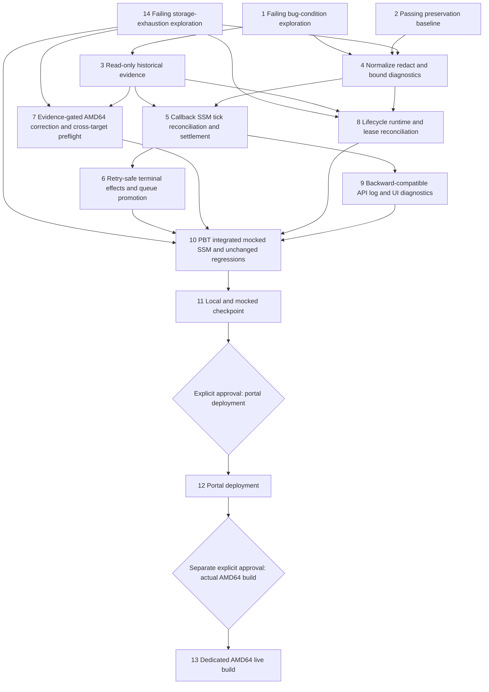

# Implementation Plan

## Overview

This plan implements the approved `bugfix.md` and `design.md` through the bug-condition workflow. It covers all three defect facets: (A) terminal dedicated AMD64 SSM failure before callback with lost invocation output/status and no useful Build Log, (B) maximum-runtime evidence that cannot distinguish queue wait, provisioning, active progress, heartbeat loss, progress stall, or hard-ceiling expiry, and (C) ephemeral runner storage exhaustion, where ENOSPC evidence collapses into generic `BUILD_FAILED`, the agent's head-keeping truncation drops the trailing `no space left on device` root cause from the durable record, no disk evidence is captured, and the 100 GB single-volume default is undersized for concurrent JP6 image export.

Tasks 1 and 2 are standalone pre-fix tests. Task 1 MUST fail on unfixed code and task 2 MUST pass on unfixed code; neither baseline may be rewritten after implementation. Task 14 is the storage amendment's standalone pre-fix exploration: it MUST fail on unfixed code, depends on nothing and may run immediately, and the storage implementation subtasks (4.4, 7.4, 7.5, 8.5) depend on it; the completed task 1 and 2 baselines stay frozen and are not extended retroactively. Task 3 is read-only historical investigation. Tasks 1–11 and 14 authorize no deployment, production timeout or volume-default change, live SSM command, instance action, artifact publication, or live build. Task 12 is a separate portal-deployment approval gate, and task 13 is a second, independent approval gate for one actual dedicated AMD64 build; these gates now also cover the storage facet, and the raised 200 GB ephemeral volume default takes effect only for jobs created after the task 12 deployment.

All test commands must be finite/non-watch invocations. Property-based test tasks carry `**Property N: ...**` annotations for status tracking and must be run with the execution warning: `This test run contains property-based tests and may generate/shrink counterexamples.`

## Task Dependency Graph

```json
{
  "schemaVersion": 1,
  "waves": [
    {"wave": 1, "tasks": ["1", "2", "14"], "dependsOn": [], "parallel": true, "gate": "unfixed code only; amendment task 14 parallels this wave's timing and may run immediately"},
    {"wave": 2, "tasks": ["3"], "dependsOn": ["1"], "parallel": false, "gate": "read-only evidence only"},
    {"wave": 3, "tasks": ["4"], "dependsOn": ["1", "2", "14"], "parallel": false},
    {"wave": 4, "tasks": ["5", "7", "8"], "dependsOn": ["3", "4", "14"], "parallel": true},
    {"wave": 5, "tasks": ["6"], "dependsOn": ["5", "8"], "parallel": false},
    {"wave": 6, "tasks": ["9"], "dependsOn": ["4", "5", "8"], "parallel": false},
    {"wave": 7, "tasks": ["10"], "dependsOn": ["6", "7", "8", "9", "14"], "parallel": false},
    {"wave": 8, "tasks": ["11"], "dependsOn": ["10"], "parallel": false, "gate": "local and mocked only"},
    {"wave": 9, "tasks": ["12"], "dependsOn": ["11"], "parallel": false, "gate": "explicit portal-deployment approval"},
    {"wave": 10, "tasks": ["13"], "dependsOn": ["12"], "parallel": false, "gate": "separate explicit dedicated-AMD64-build approval"}
  ],
  "edges": [["1", "3"], ["2", "4"], ["3", "5"], ["3", "7"], ["3", "8"], ["4", "5"], ["4", "8"], ["5", "6"], ["5", "9"], ["6", "10"], ["7", "10"], ["8", "10"], ["9", "10"], ["10", "11"], ["11", "12"], ["12", "13"], ["14", "4"], ["14", "7"], ["14", "8"], ["14", "10"]]
}
```



- Wave 1 freezes failure and preservation behavior before production edits. The amendment's storage exploration (task 14) parallels this wave's timing: it has no dependencies, may run immediately even though tasks 1 and 2 are already complete, and gates the storage implementation subtasks (4.4, 7.4, 7.5, 8.5).
- Wave 2 may inspect retained evidence but may not mutate any AWS resource.
- Wave 3 creates the pure shared contract used by later parallel work; its storage subtask (4.4) additionally requires task 14.
- Wave 4 separates command reconciliation, preflight/agent reporting, and runtime accounting into independent file groups; the storage subtasks 7.4, 7.5, and 8.5 join their parent seams' wave and additionally require task 14.
- Waves 5–6 integrate terminal effects and backward-compatible presentation.
- Wave 7 runs fix checking, Properties 1–18, integrated mocked-SSM tests, the storage exploration re-run (10.9), and the unchanged regression suite.
- Wave 8 is local/mocked verification only.
- Waves 9 and 10 are separate explicit user-approval gates; deployment approval never implies live-build approval.

## Tasks

- [x] 1. Write and run bug-condition exploration property/integration tests on unfixed code
  - **Property 1: Bug Condition** - Terminal SSM evidence recovery and runtime-evidence sufficiency
  - **CRITICAL**: Write and run this task before any production fix. The test MUST FAIL on unfixed code; do not weaken assertions or change production code in response.
  - Add `test/backend-test/portal_builds/test_execution_failure_exploration.py` with a scoped Hypothesis/integration fixture for a dedicated `AMD64` Build Job carrying correlated job/attempt/command/instance identities, no terminal callback, and final `GetCommandInvocation` evidence containing `Status=Failed`, `StatusDetails`, non-zero `ResponseCode`, timestamps, stdout, stderr, and unique secret canaries.
  - Deliver the real SSM EventBridge failure shape through `edge-cv-portal/backend/functions/build_events.py`; make the CloudWatch stream missing through `edge-cv-portal/backend/functions/build_jobs.py`; assert the fixed predicate from design: invocation retrieval, bounded/redacted persistence, stable classification, and useful Build Log diagnostic rather than generic `AGENT_COMMAND_FAILED` plus an empty log.
  - In the same exploration file, add a deterministic repository-path contract case that compares the dedicated dispatcher’s effective/default repository and agent-script path with the fleet bootstrap/registration clone path. Model `/opt/dda/DefectDetectionApplication` and `/home/ubuntu/DefectDetectionApplication` in a temporary filesystem, assert preflight selects the registered clone and finds the script, and record the current failing mismatch. This proves the contract defect, not historical causation.
  - Generate available-empty and unavailable stdout/stderr variants, but always include at least one useful status/detail/output field so the test proves currently available diagnostics are lost. Assert canary secrets must not survive in the expected durable/API/audit/log surfaces.
  - Add deterministic runtime cases to the same file: (a) active execution beyond a soft interval with fresh meaningful progress and below hard ceiling, (b) heartbeat-fresh but progress-stalled execution, (c) stale heartbeat, (d) queued behind an occupied server or predecessor, (e) provisioning delay, and (f) strict hard-ceiling expiry. Assert separate phase accounting and evidence-rich classification; demonstrate the current model cannot satisfy those assertions.
  - Include exact deadline counterexamples around active progress and record whether `created_at`, `dispatched_at`, or `started_at` is incorrectly/insufficiently used. Do not assert an unevidenced longer timeout.
  - Save shrunk counterexamples and observed unfixed outputs in `test/backend-test/portal_builds/execution_failure_counterexamples.md`; redact all canaries and include no live resource data.
  - Run only this file with the property-test warning metadata. Expected failures must identify lost status details/response code/stdout/stderr, missing diagnostic when CloudWatch is absent, and insufficient phase/activity evidence.
  - **EXPECTED OUTCOME**: FAIL on unfixed code; mark complete only after failures are reproduced and documented.
  - _Requirements: 1.1, 1.2, 1.3, 1.4, 1.5, 1.6, 1.7, 1.9, 1.10, 1.11, 1.12, 1.13, 1.14, 1.15, 1.16, 1.17, 1.18_

- [x] 2. Write and run observation-first preservation property tests on unfixed code
  - **Property 2: Preservation** - Non-bug Build and Fleet behavior
  - **IMPORTANT**: Before any production fix, observe unfixed behavior where `isBugCondition(input)` is false, encode it in `test/backend-test/portal_builds/test_execution_failure_preservation.py`, and verify it passes. Do not rebaseline this oracle after implementation.
  - Freeze normal `building`, `publishing`, `succeeded`, build-failed, and publishing-failed phase/result behavior, including result fields, partial-publish lists, artifacts, image references, audit meanings, and absorbing terminal states.
  - Freeze Build Jobs history/detail/log/cancel/retry response envelopes, errors, status values, retention, `events`, `nextToken`, and pagination. Optional future diagnostic/timing fields are excluded from equality only when absent in the original.
  - Freeze target/component/mode mappings and intentional validation: `JP5`/`JP6 -> arm64`, `AMD64`/`AMD64_NVIDIA -> x86_64`, existing component identities, and supported dedicated/ephemeral combinations.
  - Freeze the DynamoDB single-slot lock, pre-dispatch `pgrep`, on-server `flock` command contract, serialization watchdog, stale-release protection, verified cancellation/fail-closed behavior, ephemeral cleanup, predecessor gates, original submission ordering, and oldest-eligible queue promotion.
  - Freeze runtime compatibility: queue/predecessor wait remains queued, `now == deadline` is not expired, `now > deadline` is expired, and an existing snapshotted `max_runtime_hours` remains the fallback for legacy jobs.
  - Use recorded pure-function or API oracles rather than copying implementation logic. Run this new file plus the existing focused preservation files for phase transitions, completion events, cancellation, mappings, allocation, ordering, and deadline arithmetic.
  - **EXPECTED OUTCOME**: PASS on unfixed code and establish the immutable preservation baseline.
  - _Requirements: 3.1, 3.2, 3.3, 3.4, 3.5, 3.6, 3.7, 3.8, 3.9, 3.10, 3.11, 3.12_

- [x] 14. Write and run storage-exhaustion bug-condition exploration tests on unfixed code (amendment; standalone pre-fix task, numbered 14 to preserve the frozen plan numbering)
  - **Property 17: Bug Condition** - ENOSPC evidence collapses into generic failure with no disk evidence
  - **Property 18: Bug Condition** - Head-keeping truncation drops the trailing root cause
  - **CRITICAL**: Write and run this task before any storage fix lands (tasks 4.4, 7.4, 7.5, 8.5 depend on it). The test MUST FAIL on unfixed code; do not weaken assertions or change production code in response. Do not modify or extend the frozen task 1 and task 2 baselines.
  - This task depends on nothing and may run immediately; it parallels wave 1 timing even though tasks 1 and 2 are already complete.
  - Add `test/backend-test/portal_builds/test_storage_exhaustion_exploration.py` reproducing on unfixed code, from the `storageEvidenceLost` form of `isBugCondition` in design:
  - (a) ENOSPC misclassification: feed agent/invocation output bearing disk-exhaustion evidence (`no space left on device`, ENOSPC) through the current classification path and assert the fixed predicate — a stable `RUNNER_DISK_FULL` code with disk evidence recorded. On unfixed code the outcome collapses to generic `BUILD_FAILED` with no `RUNNER_DISK_FULL` code and no disk evidence, so the assertion fails.
  - (b) Head-keeping truncation loss: derive the durable error message via the agent's current `tail -n 5 "$BUILD_LOG" | head -c 512` semantics from an over-length buildkit failure line fixture whose trailing content is `no space left on device`, matching the retained `bd91c5d8-ac7e-4125-becc-711860660f2e` record ending at `write /var/snap/docker/common/`. Assert the fixed predicate — the bounded message preserves the trailing root cause. On unfixed code the head-keeping derivation drops it, so the assertion fails.
  - Use fixtures and injected outputs only; no live AWS resource, SSM command, instance action, deployment, or build.
  - Append shrunk counterexamples and observed unfixed outputs to the existing `test/backend-test/portal_builds/execution_failure_counterexamples.md` (clearly marked storage-amendment section) or a sibling `storage_exhaustion_counterexamples.md`; redact any secret-shaped content.
  - Run only this file with a finite non-watch command and the property-test warning metadata.
  - **EXPECTED OUTCOME**: FAIL on unfixed code; mark complete only after both failures are reproduced and documented.
  - _Requirements: 1.19, 1.20, 1.21, 1.22_

- [x] 3. Perform read-only historical evidence investigation before selecting causal or timeout changes

  - [x] 3.1 Investigate known AMD64 job `06c9a7ac-6b65-49ee-acdd-db8bf6d0cc03`
    - Create/update `.kiro/specs/build-fleet-execution-failures/historical-evidence.md` using read-only BuildJobs/Audit_Log, SSM command/invocation, CloudWatch stdout/stderr and Lambda logs, and EC2/fleet lifecycle reads described in design.
    - Record command/instance/server identity, timestamps, final status details, response code, stdout/stderr availability, callback presence, repository/script path evidence, and lifecycle state. Mark each source `available`, `unavailable`, or `retention-expired`; never fabricate missing fields.
    - Sanitize notes before writing: omit credentials, tokens, signed query values, repository credentials, passwords, raw authorization values, and unnecessary account/resource identifiers.
    - Prove or refute `/opt/dda/DefectDetectionApplication` versus `/home/ubuntu/DefectDetectionApplication` only from retained/reproduced evidence. A static mismatch is not historical causation.
    - Do not issue SSM commands, update records, change instances, deploy, publish, or launch a build.
    - _Requirements: 1.12, 2.8, 2.10, 2.12_

  - [x] 3.2 Investigate the maximum-runtime job when identifiers and retained evidence are available
    - In the same `historical-evidence.md`, record the timeout job identifier/source if discoverable from approved local context or read-only records. If no unambiguous identifier is available, explicitly state that investigation is blocked by unavailable identity and do not guess.
    - Reconstruct queue wait, predecessor/server occupancy, provisioning, positive execution start, runtime budget and source, heartbeat/progress/log growth, hard deadline, cleanup, and terminal effects. Distinguish active progress, stall, heartbeat loss, queue wait, provisioning, and hard-ceiling expiry only when evidence supports it.
    - Record unavailable/expired evidence explicitly and state which conclusions cannot be made. Do not recommend or encode a timeout increase from the failure label alone.
    - Use read-only calls only; perform no resource mutation or live validation.
    - _Requirements: 1.13, 1.14, 1.15, 1.16, 1.17, 1.18, 2.13, 2.18, 2.19_

  - [x] 3.3 Review the evidence gate
    - Add a compact hypothesis table to `historical-evidence.md`: hypothesis, evidence source, observation, confirmed/refuted/unknown, permitted code correction, and prohibited inference.
    - Require implementation tasks 7 and 8 to cite this table before any path correction or runtime-budget default change. Unknown evidence permits observability/preflight/runtime-model fixes, not a claim about historical cause or an unevidenced production timeout increase.
    - _Requirements: 2.8, 2.12, 2.13, 2.17, 2.19_

- [x] 4. Implement the shared reconciliation and diagnostic model

  - [x] 4.1 Add redaction, normalization, and byte-bounding primitives
    - Create `edge-cv-portal/backend/functions/build_reconciliation.py` as a pure module. Normalize nested scalar/list/map evidence, preserve valid UTF-8/JSON, and distinguish unavailable from available-empty provider fields.
    - Redact before every application-controlled sink: AWS access/secret/session values, bearer/basic/authorization values, password/token/secret assignments, repository credentials, signed-URL credentials/signatures/tokens, and configured organization patterns.
    - Enforce post-redaction limits from design: 16 KiB each stdout/stderr, 4 KiB status/detail/message fields, and 48 KiB total diagnostic JSON, preserving useful head/tail, a truncation marker, and original byte count.
    - Never include raw provider payloads in logs, exceptions, Audit_Log details, failed-job messages, persistence, or API models.
    - _Bug_Condition: `commandEvidenceLost` and unsafe/unbounded diagnostic surfaces in `isBugCondition(input)`_
    - _Expected_Behavior: bounded, redacted, truthful `Execution_Diagnostic` from `expectedBehavior(result)`_
    - _Preservation: diagnostic/timing fields remain optional and existing status/result fields are unchanged_
    - _Requirements: 2.2, 2.10, 2.11, 3.1, 3.6_

  - [x] 4.2 Add deterministic evidence classification, precedence, and diagnostic merge
    - In `build_reconciliation.py`, implement attempt correlation, stale/mismatched evidence rejection, the design precedence table, all stable command/runtime error codes, settlement planning, and field-completeness diagnostic merge independent of delivery order.
    - Permit later evidence to increase diagnostic completeness after terminal status while preventing status/result/`ended_at` resurrection or overwrite. Make duplicate events and non-increasing evidence no-ops.
    - Represent invocation service unavailability and eventual consistency without fabricating command failure.
    - _Bug_Condition: generic/misclassified outcome or order-dependent diagnostic completeness_
    - _Expected_Behavior: one precedence-defined outcome and monotonic diagnostic completeness_
    - _Preservation: valid agent terminal results and partial-publish metadata retain authority_
    - _Requirements: 2.1, 2.4, 2.6, 2.11, 3.1, 3.8_

  - [x] 4.3 Add timing, execution-attempt, and terminal-effects planning models
    - In `build_reconciliation.py`, define pure records/decisions for stable execution-attempt identity, deterministic command comment, queue/provisioning/execution clocks, heartbeat/progress sequences, settlement deadline, timeout evidence, and the terminal-effects ledger.
    - Plan terminal status/`ended_at`, audit, verified compute stop/cleanup, allocation release, and promotion as retryable effects with one stable `effect_id`; do not perform I/O in this module.
    - Preserve strict `now > deadline` expiry and encode hard ceilings as non-extendable.
    - _Bug_Condition: uncorrelated attempt evidence, insufficient timing evidence, or distributed terminal effects_
    - _Expected_Behavior: correlated timing decisions and exactly-once effect plan_
    - _Preservation: terminal absorption, strict boundary, serialization, and legacy fallback remain observable invariants_
    - _Requirements: 2.6, 2.7, 2.14, 2.16, 2.17, 2.18, 3.11, 3.12_

  - [x] 4.4 Add deterministic ENOSPC disk-exhaustion classification (amendment; requires task 14)
    - In `build_reconciliation.py`, extend the deterministic classification table from task 4.2's seam with the stable `RUNNER_DISK_FULL` error code, detected from ENOSPC patterns (`no space left on device`, ENOSPC) in the agent error message, stderr, or invocation output, and honor an agent-reported `error_kind=disk` shortcut without pattern matching.
    - Never classify `RUNNER_DISK_FULL` when no disk-exhaustion evidence exists (no false positives); keep detection pure and testable alongside the existing rows, and leave every existing classification row and its precedence unchanged.
    - **Property 17: ENOSPC Classification** - add a property test generating outputs with and without disk-exhaustion evidence (including `error_kind=disk`) and asserting `RUNNER_DISK_FULL` exactly when evidence exists and never otherwise; it may live additively in the task 10.3 `test_build_reconciliation_properties.py` file or its own sibling file. Run with a finite non-watch command and the property-test warning.
    - _Bug_Condition: `storageEvidenceLost` — `job.error_code = generic BUILD_FAILED despite ENOSPC evidence` in `isBugCondition(input)`_
    - _Expected_Behavior: `enospcEvidenceClassifiesAsRunnerDiskFull(result)` from `expectedBehavior(result)`_
    - _Preservation: failures without disk-exhaustion evidence keep their existing codes, messages, and bounds_
    - _Requirements: 2.21, 3.15_

- [x] 5. Integrate EventBridge and scheduled command reconciliation

  - [x] 5.1 Reconcile all terminal SSM events through final invocation evidence
    - Update `edge-cv-portal/backend/functions/build_events.py` to route `Success`, `Failed`, `TimedOut`, and `Cancelled`, resolve correlated attempt/command/instance identity, call `GetCommandInvocation`, sanitize immediately, and delegate to `build_reconciliation.py` rather than immediate generic fallback.
    - Treat `InvocationDoesNotExist` as eventual consistency through a bounded retry/settlement state. Preserve genuinely in-progress jobs and valid correlated callbacks.
    - Persist/merge late diagnostics independently of terminal transition so callback-first, command-first, duplicate, and reordered deliveries converge without duplicate side effects.
    - Do not log raw invocation responses.
    - _Bug_Condition: terminal command notification arrives before callback and final invocation evidence is discarded_
    - _Expected_Behavior: final evidence is reconciled before fallback and late diagnostics can safely enrich terminal records_
    - _Preservation: normal phase transitions/results/audits remain unchanged_
    - _Requirements: 2.1, 2.2, 2.4, 2.6, 2.10, 3.1_

  - [x] 5.2 Add scheduled reconciliation for missing events, settlement, and ambiguous sends
    - Update `edge-cv-portal/backend/functions/build_dispatcher.py` to inspect command-bearing nonterminal jobs, settlement waits, ambiguous `sending` attempts, and terminal jobs with incomplete diagnostics/effects on the existing one-minute tick.
    - Use `GetCommandInvocation`; keep nonterminal invocations nonterminal; settle terminal commands within the configured bound; classify `Success` without callback as `AGENT_RESULT_MISSING` only after settlement.
    - Recover ambiguous `SendCommand` by deterministic job/attempt comment and recent-command lookup before any resend. Only a conditional attempt after the visibility bound may send anew; never blindly duplicate dispatch.
    - Ensure omitted EventBridge events affect latency, not correctness, and duplicate/reordered tick/event/callback observations converge.
    - _Bug_Condition: missing/delayed event or ambiguous send leaves job unresolved or duplicates execution_
    - _Expected_Behavior: bounded scheduled convergence with at most one effective dispatch_
    - _Preservation: one-minute schedule, pre-dispatch gates, locks, and ordinary dispatch remain unchanged_
    - _Requirements: 2.5, 2.6, 2.7, 2.11, 3.2, 3.4_

  - [x] 5.3 Add least-privilege service wiring for reconciliation
    - Update `edge-cv-portal/infrastructure/lib/build-fleet-stack.ts` to allow only the operational read actions required for invocation/command recovery, include SSM `Success` in the event rule, preserve all existing failure statuses, and retain the one-minute dispatcher schedule.
    - Add/update `edge-cv-portal/infrastructure/test/build-fleet-stack.test.ts` to assert least privilege, event status coverage, and unchanged schedule. Do not change portal-user RBAC, route authorization, or navigation.
    - Synthesize/test only; do not deploy.
    - _Requirements: 2.1, 2.5, 2.12, 3.5_

- [x] 6. Implement exactly-once terminal effects, verified cleanup, and queue promotion

  - [x] 6.1 Persist terminal outcome and effect ledger atomically/idempotently
    - Update `edge-cv-portal/backend/functions/build_events.py` and `build_dispatcher.py` adapters to conditionally write one status/error-or-result/`ended_at`/evidence digest/effect ID and advance pending effect states without rewriting an absorbed terminal outcome.
    - Deduplicate Audit_Log writes by stable effect identity; retries may complete a pending audit but cannot create a second logical audit.
    - _Bug_Condition: races split terminal state and effects or duplicate audit_
    - _Expected_Behavior: one terminal outcome and one logical audit under retries_
    - _Preservation: existing audit meaning and terminal status values remain unchanged_
    - _Requirements: 2.6, 2.7, 2.11, 3.1, 3.8, 3.11_

  - [x] 6.2 Enforce verified stop/cleanup before dedicated release or ephemeral completion
    - In `build_dispatcher.py`, make timeout/cancellation/interruption cleanup retryable: record cleanup pending, send stop idempotently, confirm protected processes are absent, then release only if the same job/attempt still owns the allocation.
    - Keep allocation and follower blocked when process state is unknown. Treat idempotent ephemeral termination and `InvalidInstanceID.NotFound` as cleanup success only where the design allows.
    - Preserve `edge-cv-portal/backend/functions/build_jobs.py` cancellation conflict and fail-closed semantics while routing completed cleanup through the same ledger.
    - _Bug_Condition: server is released/promoted before stop verification or cleanup is duplicated_
    - _Expected_Behavior: verified cleanup precedes release and stale release cannot free another attempt_
    - _Preservation: SSM stop/`pgrep`, cancellation responses, interruption, and runner cleanup semantics_
    - _Requirements: 2.7, 3.2, 3.3, 3.8, 3.11_

  - [x] 6.3 Promote exactly one oldest eligible follower without duplicate dispatch
    - Reuse `edge-cv-portal/backend/functions/build_planner.py` oldest-eligible/predecessor planning and the conditional server lock; wake the dispatcher after release while retaining the schedule fallback.
    - Record a dispatch claim before command send, preserve original `created_at`, and prove retries/races cannot promote a younger job, dispatch two followers, or bypass serialization.
    - Keep pre-dispatch `pgrep`, local `flock`, attempt marker, and serialization watchdog as defense in depth.
    - _Bug_Condition: terminal races duplicate promotion/dispatch or violate order/serialization_
    - _Expected_Behavior: one oldest-eligible promotion and at most one effective execution_
    - _Preservation: predecessor gates, ordering, deferral cadence, and no-concurrent-build guarantees_
    - _Requirements: 2.7, 2.11, 3.2, 3.4, 3.11_

- [x] 7. Implement evidence-gated dedicated AMD64 preflight and agent attempt/progress contract

  - [x] 7.1 Resolve and validate the repository-path/startup contract before costly work
    - Consult task 3’s hypothesis table. Update only evidenced seams in `edge-cv-portal/backend/functions/build_fleet.py`, `build_dispatcher.py`, and `edge-cv-portal/infrastructure/lib/build-fleet-stack.ts` so dispatch uses the registered/configured actual clone path rather than conflicting assumptions.
    - Explicitly prove/refute `/opt/dda/DefectDetectionApplication` versus `/home/ubuntu/DefectDetectionApplication`; if historical causation remains unknown, describe the change as contract hardening, not the incident cause.
    - Add a separately recorded preflight after allocation/`pgrep` or ephemeral SSM readiness and before build/publish. Validate repository path, `scripts/portal-build-agent.sh`, `portal-build.sh`, executability/readability, required tools, writable lock/log paths, source ref, callback bus/region/account, safe AWS identity presence, quoting, architecture, target mapping, and component identity.
    - Preflight failure must yield bounded/redacted `COMMAND_PREFLIGHT_FAILED`, perform no costly work, and use the common terminal-effects flow.
    - _Bug_Condition: an invalid startup contract reaches costly command execution or a divergent path is assumed_
    - _Expected_Behavior: valid actual path is explicit and invalid prerequisites fail before build/publish_
    - _Preservation: valid overrides and existing command semantics remain unchanged_
    - _Requirements: 2.8, 2.9, 2.10, 2.12, 3.7, 3.9_

  - [x] 7.2 Add correlated execution-start, heartbeat, progress, and terminal reporting
    - Update `scripts/portal-build-agent.sh` and `portal-build.sh` to accept `ATTEMPT_ID`, emit a safe execution-start after preflight/lock acquisition, periodic heartbeat, meaningful progress on phase/checkpoint/log growth, and terminal completion time with existing result/failure metadata.
    - Use unique event IDs and monotonic sequences; emit no raw environment or build output in heartbeats. Stop the heartbeat monitor reliably on every shell exit/trap.
    - Preserve existing target arguments, callback bus behavior, artifact result format, local `flock`, and build/publish commands.
    - _Bug_Condition: runtime cannot correlate liveness/progress/result to one attempt_
    - _Expected_Behavior: safe monotonic attempt evidence supports lease and precedence decisions_
    - _Preservation: successful build/publish and artifact metadata remain unchanged_
    - _Requirements: 2.6, 2.8, 2.9, 2.16, 2.18, 3.1, 3.9_

  - [x] 7.3 Preserve all targets and execution modes through preflight
    - In `build_dispatcher.py` and `build_domain.py`, retain `AMD64`/`AMD64_NVIDIA -> x86_64` and `JP5`/`JP6 -> arm64`, existing component identities, intentional invalid combinations, and dedicated/ephemeral architecture-specific environments.
    - Ensure preflight checks target-specific tools without imposing AMD64-only assumptions on JP5/JP6 or vice versa.
    - Do not run a build or publish artifacts while validating this task.
    - _Requirements: 2.8, 2.9, 2.11, 3.7, 3.9_

  - [x] 7.4 Change agent durable-message derivation to tail-preserving truncation with optional local disk detection (amendment; requires task 14)
    - In `scripts/portal-build-agent.sh` (task 7.2's seam), change the error-tail derivation from `tail -n 5 "$BUILD_LOG" | head -c 512` to tail-preserving semantics (`tail -n 5 "$BUILD_LOG" | tail -c 512`) so the root-cause END of over-length failure lines survives into the durable record; keep all existing bounded sizes and redaction, and leave lines within the byte bound unchanged.
    - Ensure durable message derivation through the task 4.1 backend bounding primitives also preserves the root-cause end of each bounded line.
    - Optionally detect ENOSPC patterns locally in the captured failure output and report `error_kind=disk` in the terminal callback, which task 4.4 classification honors directly.
    - **Property 18: Tail-Preserving Truncation** - add a property test generating failure lines below, at, and above the durable-message byte bound (including the observed over-length buildkit fixture) and asserting the trailing content survives for over-length lines while in-bound lines are byte-identical to current behavior. Run with a finite non-watch command and the property-test warning.
    - _Bug_Condition: `storageEvidenceLost` — `durableMessageDroppedTrailingCause(job)` in `isBugCondition(input)`_
    - _Expected_Behavior: `durableMessagePreservesRootCauseTail(result)` from `expectedBehavior(result)`_
    - _Preservation: short or already-complete failure lines keep their existing durable messages, bounded sizes, and redaction; only which end of over-length lines is retained changes_
    - _Requirements: 2.22, 3.15_

  - [x] 7.5 Record disk-capacity preflight evidence and optional diagnostic disk fields (amendment; requires task 14)
    - Extend the task 7.1 preflight contract with the disk-capacity recording check from design: record available capacity (`df`) for the build/docker storage path — `/var/snap/docker/common` on snap-docker runners — and the repository/`tmp` volume. This check records evidence only and does not itself fail preflight unless a separately configured minimum is violated.
    - Add the optional disk block to `execution_diagnostic` (for example `disk: {docker_storage_path, available_gb, used_gb, total_gb, measured_at, available}`), projected through the same normalization/redaction/bounding primitives; mark `{available: false}` when the measurement was not taken rather than fabricating values.
    - Surface the disk evidence in failure diagnostics when available so storage exhaustion can be confirmed or ruled out from the durable record.
    - _Bug_Condition: `storageEvidenceLost` — `diskCapacityNeverRecorded(job)` in `isBugCondition(input)`_
    - _Expected_Behavior: `diskEvidenceRecordedOrMarkedUnavailable(result)` from `expectedBehavior(result)`_
    - _Preservation: additive observation only; successful builds within available disk capacity keep current streaming, callbacks, artifacts, cleanup, and result recording_
    - _Requirements: 2.23, 3.14_

- [x] 8. Implement lifecycle runtime accounting, leases, and snapshotted hard ceilings

  - [x] 8.1 Replace the single elapsed-runtime decision with separate phase clocks
    - Update `edge-cv-portal/backend/functions/build_planner.py` and `build_reconciliation.py` to measure queue wait, provisioning, and active execution separately. Active runtime begins only with positive correlated execution-start evidence.
    - A job behind an occupied server or unfinished predecessor remains queued in oldest-eligible order; queue/provisioning time never consumes execution runtime. Optional queue/provisioning deadlines apply only when explicitly snapshotted.
    - Return evidence-rich decisions with phase, observed duration, applicable budget/value/source, target, mode, and unavailable activity fields.
    - _Bug_Condition: maximum-runtime evidence cannot establish which lifecycle phase consumed time_
    - _Expected_Behavior: isolated phase accounting and no active-runtime charge before execution start_
    - _Preservation: existing queue order, predecessor gates, and statuses remain unchanged_
    - _Requirements: 2.13, 2.14, 2.15, 2.18, 3.4_

  - [x] 8.2 Implement heartbeat/progress leases and a non-extendable hard ceiling (planner portion complete; the `build_dispatcher.py` watchdog persistence wiring is deferred to task 6's dispatcher work per orchestrator instruction)
    - In `build_planner.py`, distinguish fresh progress, heartbeat-only liveness, stale heartbeat, stalled progress, and hard-ceiling expiry. Meaningful progress renews heartbeat and progress leases; heartbeat alone renews only liveness; neither changes the hard deadline.
    - Evaluate in the approved precedence: explicit queue/provisioning budget where applicable, execution hard ceiling, heartbeat lease, then progress lease; preserve a qualifying pre-deadline terminal result.
    - Keep strict boundaries: continue at `now == deadline`; expire only at `now > deadline`.
    - Update `build_dispatcher.py` watchdog execution to persist the complete safe timing diagnostic and use the common verified terminal-effects flow.
    - _Bug_Condition: simplistic wall-clock timeout ignores active progress/stall/liveness/hard ceiling_
    - _Expected_Behavior: distinct deterministic timeout classes with useful evidence_
    - _Preservation: strict boundary and stop/cleanup behavior remain unchanged_
    - _Requirements: 2.4, 2.7, 2.16, 2.18, 3.8, 3.11, 3.12_

  - [x] 8.3 Validate and snapshot target/mode runtime budgets with legacy fallback
    - Update `edge-cv-portal/backend/functions/build_domain.py` and `build_config.py` to validate optional target/mode runtime maps and snapshot resolved immutable budgets per job.
    - Resolve in design order: target/mode override, target default, snapshotted `max_runtime_hours`, then documented compatibility default. Existing jobs lacking the new shape continue to use their own snapshotted `max_runtime_hours`.
    - Do not hardcode a timeout increase or alter production settings. JP5/JP6 1–2+ hour evidence may inform later configuration but mandates no value here.
    - _Requirements: 2.17, 2.19, 3.6, 3.7, 3.12_

  - [x] 8.4 Add backward-compatible runtime settings UI
    - Update `edge-cv-portal/frontend/src/components/BuildInfrastructureSettings.tsx` and `BuildInfrastructureSettings.test.tsx` to expose optional target/mode heartbeat, progress-stall, hard-runtime, queue-wait, and provisioning budgets while retaining global `max_runtime_hours`.
    - Explain hard ceilings are non-extendable, queue/provisioning limits are independent/optional, and changing current settings does not mutate existing snapshots.
    - Preserve legacy payloads and validation; do not submit or deploy any production setting change.
    - _Requirements: 2.17, 2.19, 3.6, 3.12_

  - [x] 8.5 Raise the ephemeral volume default and add validated per-target sizing (amendment; requires task 14)
    - Update `edge-cv-portal/backend/functions/build_config.py`: raise `DEFAULT_VOLUME_SIZE_GB` from 100 to 200 and add the optional validated `volume_size_gb_by_target` map (target -> volume GB), validated in `build_domain.py`/`build_config.py` following the runtime-budget pattern; any configured or resolved `JP6` value must be at least 200 GB.
    - Resolve once at submission in design order — explicit request value, per-target map, then global default (now 200) — and snapshot the resolved size immutably into `config_snapshot.volume_size_gb`. `plan_runner` in `build_planner.py` continues to read `config_snapshot.volume_size_gb` unchanged, and previously created jobs keep their snapshotted sizes without retroactive adoption.
    - Update `edge-cv-portal/frontend/src/components/BuildInfrastructureSettings.tsx` and its test to keep exposing the global `volume_size_gb` field (default now 200) and add the optional per-target volume-size entries with help text; do not remove the global field.
    - Do not submit or deploy any production setting change; the raised default takes effect only for jobs created after the task 12 deployment gate.
    - **Property 16: Volume-Size Default and Per-Target Resolution** - add a property test generating explicit, per-target, and defaulted submissions plus previously created jobs, asserting the 200 GB default, `JP6 >= 200` validation, submission-time resolution, snapshot immutability, and unchanged prior-job snapshots/instance-type/spot semantics; it may live additively in the task 10.5 `test_runtime_accounting_properties.py` file or its own sibling file. Run with a finite non-watch command and the property-test warning.
    - _Bug_Condition: `storageEvidenceLost` — `job.config_snapshot.volume_size_gb = legacyUndersizedDefault(100)` in `isBugCondition(input)`_
    - _Expected_Behavior: `newJobVolumeSizeResolvesRaisedDefault(result)` AND `snapshottedVolumeSizesRemainImmutable(result)` from `expectedBehavior(result)`_
    - _Preservation: existing jobs honor snapshotted volume size, instance type, and spot choices; new-job instance-type and spot resolution behave as before_
    - _Requirements: 2.20, 3.13_

- [x] 9. Add backward-compatible Build Jobs API and frontend diagnostics

  - [x] 9.1 Project safe optional diagnostics from detail and Build Log APIs
    - Update `edge-cv-portal/backend/functions/build_jobs.py` so `GET /builds/{id}/logs` preserves `events` and `nextToken` exactly and optionally adds the approved versioned `diagnostic`; detail may expose the same optional persisted structure.
    - Return diagnostics independently of CloudWatch stream existence. Preserve limits, tokens, error envelopes, status meanings, history/retry/cancel behavior, and legacy responses when diagnostics are absent.
    - Include classification, status/details/response code, stdout/stderr availability/truncation, timing phase/durations, budget/source, last heartbeat/progress, target/mode, observed time, and completeness. Project only normalized/redacted/bounded data.
    - _Bug_Condition: useful retained evidence exists but absent CloudWatch produces an empty-only response_
    - _Expected_Behavior: optional diagnostic remains useful even with missing stream_
    - _Preservation: existing API fields and pagination are unchanged_
    - _Requirements: 2.2, 2.3, 2.10, 2.18, 3.6_

  - [x] 9.2 Render actionable invocation and timeout evidence in Build Detail
    - Update `edge-cv-portal/frontend/src/pages/builds/types.ts` and `BuildDetail.tsx` with optional diagnostic/timing types and an accessible Execution diagnostics panel.
    - Show safe classification, response/status details, stdout/stderr excerpts, phase durations, timeout kind/budget/source, last heartbeat/progress, and explicit unavailable/truncated states.
    - When CloudWatch events are absent but useful diagnostic evidence exists, show it and do not leave `No log output was recorded for this build job.` as the only explanation. When neither source exists, state that evidence is unavailable or expired without fabrication.
    - Preserve legacy/running/success rendering, polling, pagination, and clients that omit the optional fields.
    - _Requirements: 2.3, 2.10, 2.18, 3.6, 3.10_

- [x] 10. Complete fix checking and Properties 1–15 validation

  - [x] 10.1 Re-run the original exploration test unchanged
    - **Property 1: Expected Behavior** - Terminal SSM evidence recovery and runtime-evidence sufficiency
    - Re-run the SAME `test_execution_failure_exploration.py` tests and counterexamples from task 1; do not replace them with easier tests.
    - Confirm failed-with-details/output/no-callback evidence survives missing CloudWatch safely, and runtime cases distinguish active progress, stalls, heartbeat loss, queue/provisioning, and hard ceiling.
    - **EXPECTED OUTCOME**: PASS after the fix.
    - _Requirements: 2.1, 2.2, 2.3, 2.4, 2.5, 2.10, 2.11, 2.13, 2.14, 2.15, 2.16, 2.17, 2.18_

  - [x] 10.2 Re-run the frozen preservation test unchanged
    - **Property 2: Preservation** - Non-bug Build and Fleet behavior
    - Re-run the SAME `test_execution_failure_preservation.py` oracle from task 2 without rebaselining.
    - Confirm normal phases/results, API envelopes, target mappings, serialization, cancellation, queue ordering, strict boundary, legacy `max_runtime_hours`, and successful dedicated/ephemeral behavior remain unchanged except optional diagnostic/timing fields.
    - **EXPECTED OUTCOME**: PASS after the fix.
    - _Requirements: 3.1, 3.2, 3.3, 3.4, 3.5, 3.6, 3.7, 3.8, 3.9, 3.10, 3.11, 3.12_

  - [x] 10.3 Add diagnostic/classification/reconciliation property tests
    - **Property 3: Diagnostic Redaction and Bounds** - Arbitrary diagnostic payloads remain safe and bounded
    - **Property 4: Deterministic Classification and Ordering** - Permutations and duplicates converge
    - **Property 5: Event and Scheduled Reconciliation Convergence** - Missing events affect latency only
    - Add `test/backend-test/portal_builds/test_build_reconciliation_properties.py` generating arbitrary Unicode/size, nested secrets, field missingness, all SSM statuses, callback/lifecycle evidence, duplicates, delivery permutations, and omitted events.
    - Assert valid UTF-8/JSON, byte limits, truthful empty/unavailable/truncated markers, canary absence from every captured sink, precedence-defined outcome, diagnostic monotonicity, eventual-consistency handling, and nonterminal preservation.
    - Run with the required property-test warning and record exact shrunk failing examples if any.
    - _Requirements: 2.1, 2.2, 2.4, 2.5, 2.6, 2.10, 2.11_

  - [x] 10.4 Add terminal-effects and race property/integration tests
    - **Property 6: Exactly-Once Terminal Effects and Promotion** - Races cannot duplicate effects or execution
    - **Property 10: Timeout Retry and Race Convergence** - Deadline races settle deterministically
    - Add `test/backend-test/portal_builds/test_terminal_effects_properties.py` generating callback/SSM/timeout/cancel/tick races, conditional-write loss, service retries, cleanup outcomes, and queued followers.
    - Assert one terminal status/`ended_at`, one logical audit/effect ID, verified stop before release, one effective cleanup, oldest-eligible promotion, stale-release rejection, no duplicate dispatch, valid pre-deadline result precedence, and serialization preservation.
    - Add fake-service integration through actual event/dispatcher persistence adapters; no live AWS client may be used.
    - _Requirements: 2.6, 2.7, 2.11, 3.2, 3.3, 3.4, 3.11, 3.12_

  - [x] 10.5 Add runtime accounting and evidence-gate property tests
    - **Property 7: Timeout Boundary and Hard Ceiling** - Equality continues and only greater-than expires
    - **Property 8: Heartbeat and Progress Leases** - Liveness and meaningful progress are distinct
    - **Property 9: Queue and Provisioning Time Isolation** - Active runtime starts only on execution evidence
    - **Property 14: Evidence-Gated Timeout Diagnosis** - A failure label alone cannot select a remedy
    - Add `test/backend-test/portal_builds/test_runtime_accounting_properties.py` generating target/mode snapshots, legacy snapshots, queue/predecessor/provisioning durations, heartbeat/progress sequences, and times below/at/above every deadline.
    - Assert immutable budget resolution, strict boundaries, non-extendable hard ceiling, queue/provisioning isolation, occupied-server ordering, distinct lease classifications, complete timing evidence, and no automatic timeout-increase/queueing recommendation from an underspecified label.
    - _Requirements: 2.13, 2.14, 2.15, 2.16, 2.17, 2.18, 3.2, 3.4, 3.11, 3.12_

  - [x] 10.6 Add preflight/target-matrix and no-live-action tests
    - **Property 11: Target and Mode Matrix** - Mappings and intentional restrictions remain valid
    - **Property 12: Preflight Fails Before Costly Work** - Invalid prerequisites never start build/publish
    - **Property 15: Approval-Gated Timeout Validation** - Local validation cannot authorize costly action
    - Add `test/backend-test/portal_builds/test_preflight_target_matrix_properties.py` generating valid/invalid paths, tools, permissions, quoting, source refs, callback settings, architectures, targets, modes, and component identities.
    - Assert `JP5`/`JP6 -> arm64`, `AMD64`/`AMD64_NVIDIA -> x86_64`, valid command equivalence, actionable redacted preflight failure, and zero build/publish calls on invalid contracts.
    - Add `test/backend-test/portal_builds/test_no_live_validation_contract.py` with recording/failing adapters proving the suite performs no deployment, production setting write, SSM send, instance action, artifact publication, or live build.
    - _Requirements: 2.8, 2.9, 2.10, 2.11, 2.12, 2.19, 3.7, 3.9_

  - [x] 10.7 Add API/frontend diagnostic tests
    - **Property 13: Build Log and Timeout Diagnostic Availability** - Useful evidence survives absent/incomplete CloudWatch
    - Add `test/backend-test/portal_builds/test_build_diagnostic_api.py` for legacy responses, events plus diagnostics, diagnostics-only stdout/stderr/status/timing, missing stream, available-empty, unavailable, truncation, redaction, and pagination-token stability.
    - Add/update `edge-cv-portal/frontend/src/pages/builds/BuildDetail.test.tsx` for useful SSM/timeout evidence without CloudWatch, explicit unavailable/expired/truncated states, secret absence, and unchanged legacy/running/success views.
    - _Requirements: 2.2, 2.3, 2.10, 2.18, 3.6, 3.10_

  - [x] 10.8 Run integrated mocked flows and the full unchanged `portal_builds` preservation suite
    - Extend `test/backend-test/portal_builds/test_dispatcher_tick_integration.py` only with additive mocked flows for dedicated/ephemeral reconciliation, transient `InvocationDoesNotExist`, `Success` settlement inside/outside callback window, suppressed EventBridge event, stop-before-release, and follower promotion. Do not rewrite existing expectations.
    - Run the complete unchanged `test/backend-test/portal_builds/` suite, including phase/audit, history/log pagination, request/config snapshots, cancellation, allocation, queue order, serialization, interruption, ephemeral one-to-one, and deadline arithmetic.
    - Run focused frontend tests and infrastructure synthesis/tests with finite non-watch commands. Record commands, pass/fail counts, and any pre-existing failure separately.
    - Confirm all Properties 1–15 have a passing property, unit, or integration test and exact requirement traceability; with task 10.9, confirm the same for the storage-amendment Properties 16–18.
    - _Requirements: 2.1, 2.2, 2.3, 2.4, 2.5, 2.6, 2.7, 2.8, 2.9, 2.10, 2.11, 2.12, 2.13, 2.14, 2.15, 2.16, 2.17, 2.18, 2.19, 3.1, 3.2, 3.3, 3.4, 3.6, 3.7, 3.8, 3.9, 3.10, 3.11, 3.12_

  - [x] 10.9 Re-run the storage exploration test unchanged and validate Properties 16–18 (amendment fix check)
    - **Property 17: Expected Behavior** - ENOSPC evidence classifies as `RUNNER_DISK_FULL`
    - **Property 18: Expected Behavior** - Durable messages preserve the root-cause tail
    - **IMPORTANT**: Re-run the SAME `test_storage_exhaustion_exploration.py` file from task 14 unchanged, alongside the task 10.1 re-run; do not replace it with easier tests or rebaseline its fixtures.
    - Confirm ENOSPC-bearing agent/invocation output now classifies as `RUNNER_DISK_FULL` with disk evidence recorded, and the over-length buildkit fixture's durable message now ends with `no space left on device` instead of `write /var/snap/docker/common/`.
    - Confirm the Property 16 (task 8.5), Property 17 (task 4.4), and Property 18 (task 7.4) property tests pass with exact requirement traceability.
    - Run with finite non-watch commands and the property-test warning; no deployment, production setting change, SSM send, instance action, artifact publication, or live build.
    - **EXPECTED OUTCOME**: PASS after the fix.
    - _Requirements: 2.20, 2.21, 2.22, 2.23, 3.13, 3.14, 3.15_

- [x] 11. Verification checkpoint - local and mocked validation only
  - Ensure tasks 1–10 and 14 are complete, task 1’s original counterexamples now pass, task 14’s storage counterexamples now pass unchanged, task 2’s frozen preservation oracle still passes, all Properties 1–15 and the storage-amendment Properties 16–18 pass, and the full unchanged `portal_builds` suite is green.
  - Run diagnostics, backend tests, frontend type/test checks, and infrastructure synthesis/tests using finite non-watch commands. Fix implementation defects rather than weakening tests.
  - Review captured persistence/API/UI/audit/log/exception sinks for canary secrets and verify all diagnostic byte limits and unavailable/truncated markers.
  - Review the diff for no portal-user RBAC/navigation change, no unsupported historical-cause claim, no unevidenced hardcoded timeout increase, and no production configuration mutation.
  - Record the evidenced cause(s), unknowns, compatibility results, exact validation commands/results, rollback considerations, and residual risks in `.kiro/specs/build-fleet-execution-failures/verification-notes.md`.
  - **STOP**: Do not deploy, change a production timeout, send an SSM command, start/stop/terminate an instance, publish an artifact, or launch a build in this checkpoint. Any approved operational verification proceeds only through tasks 12 and 13.
  - _Requirements: 2.10, 2.11, 2.12, 2.19, 3.5, 3.10, 3.11, 3.12_

- [x] 12. Approval-gated portal deployment
  - **Property 15: Approval-Gated Timeout Validation** - Local completion does not authorize deployment
  - **STOP: obtain explicit user approval after task 11. Approval to implement or validate locally is not deployment approval.**
  - Before requesting approval, state the environment/account/region, exact stacks/functions, repository-path and timeout-configuration effects, service-IAM wiring delta, estimated duration/cost, rollback procedure, and confirmation that no live build is included.
  - After approval only, deploy the reviewed portal changes to the named environment and run non-chargeable smoke checks for API compatibility, event/schedule wiring, redaction, and rollback readiness.
  - Do not send a build-agent SSM command, start/stop compute, publish artifacts, or begin the AMD64 build in this task.
  - Record deployment evidence and obtain user acceptance before task 13.
  - _Requirements: 2.12, 2.19_

- [x] 13. Separately approval-gated actual dedicated AMD64 live build
  - **Property 15: Approval-Gated Timeout Validation** - A live build requires independent approval
  - **STOP: obtain a new explicit user approval after task 12. Portal deployment approval does not authorize this build.**
  - The approval request must state target (`AMD64`), mode (dedicated), server/instance, source ref/component, estimated duration/cost, artifact-publication effects, snapshotted budgets, monitoring scope, cleanup plan, and rollback/stop criteria.
  - After approval only, run preflight first. If it fails, retain only redacted diagnostics, complete cleanup, and do not start costly build/publish work.
  - If preflight passes, launch exactly the approved build and monitor queue/provisioning/execution timing, heartbeat/progress, SSM invocation, Build Log diagnostics, settlement, terminal effects, and cleanup/release. Exercise a queued follower only if it was explicitly included in approval.
  - Stop at the approved scope. JP5/JP6 source builds, timeout-setting changes, additional builds, or additional artifact publication require separate future approval.
  - _Requirements: 2.12, 2.19_

## Notes

- Tasks 1 and 2 are standalone pre-fix tasks. Task 1 is complete only after expected failures and exact counterexamples are recorded; task 2 is complete only after passing unfixed-code observations are frozen.
- Task 14 is the storage amendment’s standalone pre-fix exploration, numbered 14 so existing task numbering and completed checkboxes stay untouched. It must fail on unfixed code before the storage subtasks (4.4, 7.4, 7.5, 8.5) begin; the completed task 1 and 2 baselines are frozen and must not be extended to cover the storage facet retroactively.
- Property status annotations use the design’s numbered correctness properties. Task 10.1 reuses task 1 as the fix check, task 10.2 reuses task 2 as the preservation check, and task 10.9 reuses task 14 as the storage fix check for Properties 17–18, with Property 16 validated by task 8.5’s property test.
- RBAC, portal role matrices/navigation, and the `jp5730ai` Greengrass failure remain out of scope.
- Tasks 12 and 13 are separate non-automatic approval gates. Neither approval is implied by completion of this plan, and task 12 approval does not authorize task 13.