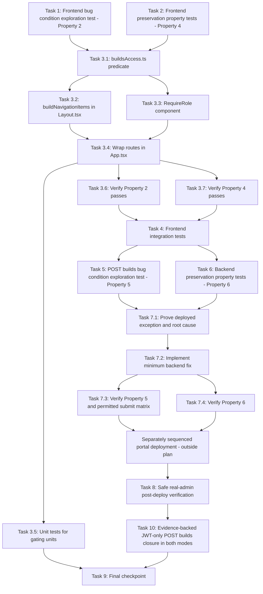

# Implementation Plan

## Overview

Fix the remaining frontend facet of the build-fleet RBAC visibility bug using the exploratory bugfix workflow: write the frontend bug condition exploration test (Property 2) and frontend preservation property tests (Property 4) against the UNFIXED code first, then implement the gating per design Part B (`buildsAccess.ts` predicate, exported pure `buildNavigationItems(role)` in `Layout.tsx`, `RequireRole` route guard wrapping the three routes in `App.tsx`), then verify with the same tests plus integration tests. The original backend facet (Properties 1 and 3) is already implemented, committed (`22a27eb`), and verified. A distinct, newly reproduced `POST /builds` authorization failure remains covered by incomplete backend Tasks 5–8; Task 10 adds the requested single evidence-backed backend closure task spanning the real handler/decorator boundary, both execution modes, preservation, and safe post-deployment verification. Deployment itself remains outside this plan. All existing task IDs remain stable, including final checkpoint Task 9.

## Task Dependency Graph

```json
{
  "waves": [
    { "wave": 1, "description": "Run on UNFIXED code: frontend exploration test surfaces the ungated Builds nav/routes counterexamples (task 1 FAILS - Property 2) and preservation baselines are captured (task 2 PASSES - Property 4). Independent of each other.", "tasks": ["1", "2"] },
    { "wave": 2, "description": "Implement the frontend fix per design Part B: buildsAccess.ts, buildNavigationItems extraction, RequireRole guard, App.tsx route wrapping, plus unit tests.", "tasks": ["3.1", "3.2", "3.3", "3.4", "3.5"] },
    { "wave": 3, "description": "Verify the frontend fix: re-run task 1 test (now PASSES) and task 2 tests (still PASS), then add integration tests for route/sidebar consistency.", "tasks": ["3.6", "3.7", "4"] },
    { "wave": 4, "description": "Run before the backend fix: reproduce the newly observed POST /builds generic authorization failure at the real handler/decorator boundary (task 5 FAILS - Property 5) and capture unaffected authorization/API preservation baselines (task 6 PASSES - Property 6).", "tasks": ["5", "6"] },
    { "wave": 5, "description": "Use CloudWatch and deployed handler/layer artifacts to prove the actual exception and root cause before applying the minimum backend compatibility/authorization fix.", "tasks": ["7.1", "7.2"] },
    { "wave": 6, "description": "Verify the backend fix with the same exploration test, the role/mode authorization matrix, and unchanged GET/list/cancel, audit, and error-envelope preservation tests.", "tasks": ["7.3", "7.4"] },
    { "wave": 7, "description": "After a separately sequenced portal deployment (deployment itself is outside this plan), safely verify the real admin can submit JP5 in both execution modes without overlapping or duplicate expensive builds.", "tasks": ["8"] },
    { "wave": 8, "description": "After tasks 5–8 establish the real-boundary counterexample, deployed-artifact evidence, preservation baseline, and safe verification constraints, execute the single evidence-backed backend closure task for JWT-only POST /builds in both execution modes; deployment remains outside this plan.", "tasks": ["10"] },
    { "wave": 9, "description": "Final checkpoint depends on the evidence-backed backend closure and then runs the full frontend and targeted backend suites.", "tasks": ["9"] }
  ]
}
```



## Notes

**Status note (original backend facet — already done, commit `22a27eb`)**: the
original backend fix (threading `user_info` through `rbac_check` /
`super_user_only` in
`edge-cv-portal/backend/functions/rbac_middleware.py`) is implemented and
committed. Its exploration/fix tests at
`edge-cv-portal/backend/tests/test_rbac_global_scope_jwt_role.py` failed with
403 on unfixed code and now pass (Property 1). Backend preservation
(Property 3) was verified on `22a27eb`: `-k rbac` 270 passed,
`portal_builds` 74 passed (with `--noconftest`), deployment filter 110 passed.
A newly reproduced, distinct POST `/builds` failure now returns the catch-all
`{"error":"Authorization check failed"}` and creates no job for the real JWT
PortalAdmin. Tasks 5–7 cover exploration, deployed-artifact root-cause
investigation, the minimum backend fix, and preservation checks; Task 8 covers
safe post-deploy verification. Task 10 is the single evidence-backed backend
closure task for this observed failure. The earlier `user_info` change is a
hypothesis to verify, not proof that this new exception is resolved. The
consolidated sanity re-run remains in Task 9.

**Deployment note**: portal deployment is intentionally NOT a task in this
plan. It remains separately sequenced after any running build chain finishes
(steering: one build at a time and no portal deploys during builds). Task 8 is
verification after that separately approved deployment, not authorization to
deploy.

## Tasks

- [x] 1. Write frontend bug condition exploration test
  - **Property 2: Bug Condition** - Builds surface visibility is a function of the role
  - **CRITICAL**: This test MUST FAIL on unfixed code - failure confirms the bug exists
  - **DO NOT attempt to fix the test or the code when it fails**
  - **NOTE**: This test encodes the expected behavior - it will validate the fix when it passes after implementation (per the design's Exploratory section, the raw observations of current buggy behavior are inverted into these fix assertions)
  - **GOAL**: Surface counterexamples confirming root cause #3 (no gating in `Layout.tsx` base items, no route guards in `App.tsx`)
  - **Scoped PBT Approach**: The bug is deterministic per role; scope the property to the concrete failing roles (Viewer, Operator) alongside the full-domain assertions
  - Frontend only — the backend exploration is already done and documented (`test_rbac_global_scope_jwt_role.py`, commit `22a27eb`); do NOT write backend exploration tests
  - Test in `edge-cv-portal/frontend` (vitest), mocking AuthContext (`useAuth()` → `user.role`) per role:
    - Render the Layout navigation (or its extracted item builder once available) with role `Viewer` and `Operator`: assert the "Builds" nav item is NOT present (from Bug Condition `isBugCondition` — UiNavigation branch: role NOT IN ['DataScientist', 'UseCaseAdmin', 'PortalAdmin'])
    - MemoryRouter at `/builds` and `/builds/:buildJobId` with role `Viewer`/`Operator`: assert BuildsPage/BuildDetail do NOT mount (router redirects away — Expected Behavior: no 403-banner page render)
    - MemoryRouter at `/admin/fleet` with role `Operator`: assert FleetPage does NOT mount (redirect away)
  - Run test on UNFIXED code
  - **EXPECTED OUTCOME**: Test FAILS (this is correct - it proves the bug exists: "Builds" is rendered for every role and the three routes mount their pages for roles without builds access)
  - Document counterexamples found (e.g., "role=Viewer: 'Builds' nav item present; /builds mounts BuildsPage whose only content is the 403 error banner")
  - Mark task complete when test is written, run, and failure is documented
  - _Requirements: 1.6, 2.5_

- [x] 2. Write frontend preservation property tests (BEFORE implementing fix)
  - **Property 4: Preservation** - Builds-capable roles keep their UI; non-builds nav items unchanged
  - **IMPORTANT**: Follow observation-first methodology
  - Observe on UNFIXED code: record the exact navigation item list produced for each role in `UserRole` ∪ {undefined} (the pre-fix oracle from the design's Preservation Checking test plan), including the PortalAdmin-only group ("Build Fleet" → `/admin/fleet`) and the UseCaseAdmin audit-logs handling
  - Write property-based tests (vitest + fast-check over the role domain, pattern from `edge-cv-portal/frontend/src/components/vllm-publish/publishState.gating.property.test.ts`) capturing the observed behavior:
    - For every role: the navigation item list minus any "Builds" entry equals the pre-fix oracle minus any "Builds" entry (all other items, dividers, and ordering identical)
    - "Build Fleet" item present if and only if role is `PortalAdmin` (unchanged by the fix)
    - DataScientist / UseCaseAdmin / PortalAdmin see "Builds" and can render `/builds` and `/builds/:buildJobId`; `/admin/fleet` renders FleetPage for PortalAdmin
  - Run tests on UNFIXED code
  - **EXPECTED OUTCOME**: Tests PASS (this confirms baseline behavior to preserve)
  - Mark task complete when tests are written, run, and passing on unfixed code
  - _Requirements: 3.6_

- [x] 3. Fix the frontend builds/fleet gating (design Part B)

  - [x] 3.1 Create `edge-cv-portal/frontend/src/utils/buildsAccess.ts`
    - Export `BUILDS_ACCESS_ROLES: readonly UserRole[]` = `['DataScientist', 'UseCaseAdmin', 'PortalAdmin']` (the Build_Operator capability per the merged matrix)
    - Export pure predicate `canAccessBuilds(role: UserRole | undefined | null): boolean` returning true iff role is non-null and in `BUILDS_ACCESS_ROLES`
    - Mirror the exported-pure-function pattern of `WORKFLOW_EDIT_ROLES` / `canEditWorkflows` in `pages/workflows/WorkflowToolbar.tsx`
    - _Bug_Condition: isBugCondition(input) — UiNavigation branch, role NOT IN Builds_Access_Roles, from design_
    - _Expected_Behavior: builds surface visible iff canAccessBuilds(role), from design_
    - _Requirements: 2.5, 2.6_

  - [x] 3.2 Extract exported pure `buildNavigationItems(role)` in `edge-cv-portal/frontend/src/components/Layout.tsx`
    - `export function buildNavigationItems(role: UserRole | undefined): SideNavigationProps.Item[]` reproducing today's item list exactly, with one change: include `{ text: 'Builds', href: '/builds' }` only when `canAccessBuilds(role)`
    - Keep the PortalAdmin-only group (including "Build Fleet" → `/admin/fleet`) and the UseCaseAdmin audit-logs handling exactly as they are (mirrors the existing `buildSettingsDropdownItems` pattern so gating is directly property-testable)
    - Component body calls `buildNavigationItems(user?.role)` instead of assembling the list inline
    - _Expected_Behavior: "Builds" in buildNavigationItems(role) iff canAccessBuilds(role); "Build Fleet" iff PortalAdmin, from design_
    - _Preservation: all navigation items other than "Builds"/"Build Fleet" identical to the pre-fix oracle for every role_
    - _Requirements: 2.5, 2.6, 3.6_

  - [x] 3.3 Create `edge-cv-portal/frontend/src/components/RequireRole.tsx` route guard
    - `RequireRole({ roles, children })` using the existing `useAuth()` pattern: if `!user?.role || !roles.includes(user.role)` return `<Navigate to="/dashboard" replace />`, else render children
    - Redirect target `/dashboard` (the authenticated index target) satisfies Req 2.5's "no rendering of the page with a 403 error banner"
    - _Expected_Behavior: route renders page iff role predicate holds, otherwise redirect away, from design_
    - _Requirements: 2.5, 2.6_

  - [x] 3.4 Wrap the three routes in `edge-cv-portal/frontend/src/App.tsx`
    - `builds` → `<RequireRole roles={BUILDS_ACCESS_ROLES}><BuildsPage /></RequireRole>`
    - `builds/:buildJobId` → `<RequireRole roles={BUILDS_ACCESS_ROLES}><BuildDetail /></RequireRole>`
    - `admin/fleet` → `<RequireRole roles={['PortalAdmin']}><FleetPage /></RequireRole>`
    - Keep FleetPage's internal PortalAdmin check untouched (second defensive layer; server-side 403 remains the ultimate authority)
    - No changes to backend code, API service calls, the AuthContext, or any other route/nav entry
    - _Bug_Condition: direct navigation to /builds, /builds/:buildJobId, /admin/fleet by roles without builds access, from design_
    - _Expected_Behavior: redirect to /dashboard (no page render) for roles failing the predicate, from design_
    - _Preservation: builds-capable roles keep their pages; server-side 403 handling unchanged (defense in depth)_
    - _Requirements: 2.5, 2.6, 2.7, 3.6_

  - [x] 3.5 Write unit tests for the new gating units
    - `canAccessBuilds`: true for exactly DataScientist, UseCaseAdmin, PortalAdmin; false for Viewer, Operator, `undefined`, `null`
    - `RequireRole`: renders children when the role is allowed; redirects to `/dashboard` (replace) when the role is missing or not allowed
    - `buildNavigationItems`: example-based spot checks — Viewer (no Builds, no admin group) and PortalAdmin (Builds + admin group + audit logs)
    - _Requirements: 2.5, 2.6, 3.6_

  - [x] 3.6 Verify bug condition exploration test now passes
    - **Property 2: Expected Behavior** - Builds surface visibility is a function of the role
    - **IMPORTANT**: Re-run the SAME test from task 1 - do NOT write a new test
    - The test from task 1 encodes the expected behavior (nav item and routes gated by the builds-access predicate)
    - Run the frontend bug condition exploration test from task 1
    - **EXPECTED OUTCOME**: Test PASSES (confirms bug is fixed)
    - _Requirements: 2.5, 2.6_

  - [x] 3.7 Verify preservation tests still pass
    - **Property 4: Preservation** - Builds-capable roles keep their UI; non-builds nav items unchanged
    - **IMPORTANT**: Re-run the SAME tests from task 2 - do NOT write new tests
    - Run the preservation property tests from task 2
    - **EXPECTED OUTCOME**: Tests PASS (confirms no regressions - non-builds nav items identical per role, "Build Fleet" stays PortalAdmin-only, builds-capable roles keep access)
    - _Requirements: 3.6_

- [x] 4. Write integration tests for route and sidebar consistency
  - Render `App` routes in a MemoryRouter with mocked auth per role:
    - Viewer navigating to `/builds` and `/admin/fleet` ends up on `/dashboard`
    - PortalAdmin reaches BuildsPage and FleetPage
    - DataScientist reaches BuildsPage but is redirected from `/admin/fleet`
  - Sidebar integration: `Layout` rendered with each role shows/hides "Builds"/"Build Fleet" consistently with the route guards (no nav-item-without-route or route-without-nav divergence for the same role)
  - _Requirements: 2.5, 2.6, 3.6_

- [x] 5. Write POST build-submission authorization bug condition exploration test
  - **Property 5: Bug Condition** - JWT-only PortalAdmin reaches `POST /builds` through `@require_builds_submit()` in both execution modes
  - **CRITICAL**: Write and run this test against the current/unfixed deployed artifact assembly BEFORE implementing another fix; it MUST reproduce the visible `Authorization check failed` response, and its failure/captured traceback is evidence that the new bug exists
  - **DO NOT** assume commit `22a27eb`'s `user_info` threading resolves this failure, and do not bypass, mock, unwrap, or redecorate the authorization layer
  - Define the new bug condition explicitly: the caller is authenticated by Cognito with JWT `custom:role=PortalAdmin`, has no `dda-portal-user-roles` row for `global`, submits target `JP5`, selects either `ephemeral` or `dedicated`, receives the generic catch-all `{"error":"Authorization check failed"}`, and no Build_Job is created
  - Exercise the real API dispatch and handler boundary in `edge-cv-portal/backend/functions/build_jobs.py`: `handler` routes `POST /builds` to `submit_build`, whose real imported function is decorated with `@require_builds_submit()`; do not test only a synthetic decorated function
  - Parameterize the test over these screenshot/user-report interpretations so authorization is proven independent of execution mode:
    - `{ "targets": ["JP5"], "execution_mode": "ephemeral" }` (the mode visibly selected in the screenshot)
    - `{ "targets": ["JP5"], "execution_mode": "dedicated", "server_id": "<valid-running-arm64-test-server>" }` (the user-described mode, with a seeded valid server)
  - Build an API Gateway/Cognito event whose claims resolve to a JWT-only PortalAdmin and explicitly verify the role table has no `global` row; use real `get_user_from_event`, `rbac_middleware`, `shared_utils.RBACManager`, `Permission.BUILDS_SUBMIT`, and the real role-permission matrix
  - Prevent any real build from launching: after the real decorator and request validation execute, replace only downstream side effects with recording fakes (`put_new_job` records the would-be job and `invoke_dispatcher` is a no-op); do not mock authorization, role resolution, enum lookup, or the decorator
  - On the current/unfixed artifact assembly, assert/capture the observed 500 generic authorization response and zero recorded/persisted jobs; use captured RBAC logger traceback (`caplog`) to record the exact exception type, message, stack frame, mode, deployed function code/version, and attached layer version as the counterexample
  - If current source passes while the deployed handler/layer assembly fails, preserve that source-vs-deployed result as the counterexample and run the test fixture against the exact deployed function artifact plus attached layer contents; do not weaken the test or infer a cause from the source-only pass
  - **EXPECTED OUTCOME BEFORE FIX**: both mode cases reproduce the generic catch-all failure and identify the swallowed exception; after the fix, this SAME test is inverted/re-run as the accepted-response check in task 7.3
  - _Requirements: 1.3, 2.1, 2.3, 2.7_

- [x] 6. Write backend build authorization preservation property tests (BEFORE implementing fix)
  - **Property 6: Preservation** - Existing build role matrix, read/cancel behavior, audit records, and authorization envelopes remain unchanged
  - **IMPORTANT**: Follow observation-first methodology on the current/unfixed code/artifact for inputs outside the new PortalAdmin submit bug condition
  - At the same real handler/decorator boundaries, observe and record the current successful/denied outcomes, response status/body shape, `rbac_context`, Build_Job mutations, and audit entries for:
    - Viewer and Operator `POST /builds`: denied with the standard 403 `Insufficient permissions` envelope, zero Build_Jobs, and one denied `unauthorized_access` audit record carrying `builds:submit` and `usecase_id=global` — never the generic authorization 500
    - Authorized and unauthorized GET/list and detail paths guarded by `require_builds_read()`, and cancel paths guarded by `require_builds_cancel()`, including no mutation on denial
    - Existing DynamoDB-row role precedence and JWT-only role resolution outside the reproduced submit failure
  - Write property-based tests over `Role × build operation` that preserve the existing matrix exactly: PortalAdmin, DataScientist, and UseCaseAdmin hold `BUILDS_SUBMIT`/`BUILDS_READ`/`BUILDS_CANCEL`; Viewer and Operator do not. Treat the permitted-role POST assertions as fix checks to be enabled/verified in task 7.3, while the unaffected baseline assertions in this task MUST PASS before implementation
  - Preserve the standard 403 fields (`error`, `required_permissions`, `usecase_id`), denial audit structure, authorized `rbac_context` keys, GET/list response shape/order, cancel semantics, and the existing non-authorization error envelope
  - Run the unaffected preservation properties on UNFIXED code
  - **EXPECTED OUTCOME**: preservation tests PASS before the fix and remain unchanged after it
  - _Requirements: 2.7, 3.1, 3.2, 3.3, 3.4, 3.5_

- [x] 7. Diagnose and fix the newly reproduced backend build-submission authorization exception

  - [x] 7.1 Prove the actual deployed exception and root cause before changing code
    - Correlate the failed real-admin request by timestamp/API Gateway request id and inspect the complete CloudWatch exception/traceback requested for `BuildFleetHandler`; also inspect the actual `BuildJobsHandler` log stream because CDK routes `POST /builds` to `build_jobs.handler`/`BuildJobsHandler`, while `BuildFleetHandler` serves `/build-servers`. Record which function emitted the catch-all and retain evidence rather than assuming the reported handler name
    - Capture the deployed function configuration for both handlers: function version/alias, `CODE_VERSION`, code SHA, last-modified time, attached layer ARNs/versions, and the API integration target for `POST /builds`
    - Download/inspect or otherwise hash-verify the deployed function and layer artifacts against the synthesized/local assets. Confirm which `rbac_middleware.py` is packaged with `build_jobs.py`, which `shared_utils.py`/`RBACManager` is imported from `/opt/python`, and whether stale Lambda versions or layers are attached
    - At deployed-runtime compatibility level, verify and record evidence for:
      - `rbac_middleware.py` calls and the imported `RBACManager.has_permission`, `get_user_role`, `get_user_permissions`, and `is_portal_admin` signatures, including `user_info` keyword compatibility
      - `Permission.BUILDS_SUBMIT` existence/value and object identity/compatibility across function and layer imports
      - The role-permission matrix grants `builds:submit` to PortalAdmin, DataScientist, and UseCaseAdmin and denies Viewer/Operator
      - Packaged Lambda layer contents/version ordering and any source/layer version skew capable of raising inside `rbac_check` before `submit_build` executes
    - Produce a concise root-cause evidence record containing the exact exception, triggering frame, mismatched artifact/signature/enum/matrix if any, reproduction result for both modes, and why the evidence explains the generic catch-all response. Do not proceed on a hypothesis such as “`user_info` was already threaded” without this evidence
    - _Bug_Condition: JWT-only PortalAdmin + no global role row + POST JP5 in ephemeral or dedicated mode reaches the `rbac_check` catch-all and creates no job_
    - _Requirements: 1.3, 2.1, 2.3, 2.7, 3.1, 3.4_

  - [x] 7.2 Implement the minimum evidence-backed root-cause fix
    - Change only the component(s) proven incompatible or defective in task 7.1 (middleware, shared layer API/enum/matrix packaging, function/layer version selection, or deployment fingerprint as applicable); do not make speculative broad RBAC changes
    - Ensure a JWT-only PortalAdmin with no global DynamoDB role row reaches `submit_build` and receives the normal accepted/success response (`201`) with one queued JP5 Build_Job for both `ephemeral` and valid `dedicated` requests
    - Ensure authorization is independent of execution mode: mode-specific validation remains in the handler/domain layer after RBAC, not in permission resolution
    - Ensure every unauthorized Viewer/Operator submission still receives the standard 403 denial and audit record; expected denials must never fall through to the generic `Authorization check failed` 500
    - Preserve the existing role-permission matrix, role precedence, response/audit structures, GET/list/cancel behavior, and all non-authorization build validation unless task 7.1 proves a packaging correction is required to restore those exact definitions
    - If artifact/layer skew is the cause, update the deployable asset/version fingerprint so the corrected `rbac_middleware.py` and compatible shared layer are necessarily published together; portal deployment itself remains outside this plan
    - _Bug_Condition: isBugCondition(input) from task 5 for both execution modes_
    - _Expected_Behavior: permitted JWT role returns 201 and records one queued job; unauthorized role returns the standard 403, never generic auth 500_
    - _Preservation: Property 6 baselines from task 6 and the existing role matrix/error/audit contracts_
    - _Requirements: 1.3, 2.1, 2.3, 2.7, 3.1, 3.2, 3.3, 3.4, 3.5_

  - [x] 7.3 Verify the exploration test and permitted submission matrix now pass
    - **Property 5: Expected Behavior** - JWT build operators submit JP5 through the real authorization boundary in either execution mode
    - **IMPORTANT**: Re-run the SAME real-boundary test from task 5; do not replace it with a synthetic decorator test
    - Extend/parameterize the fix check across JWT-only PortalAdmin, DataScientist, and UseCaseAdmin (with no global DynamoDB role row) and both `ephemeral` and valid `dedicated` JP5 requests
    - For every permitted `role × mode` case, assert accepted/success status, exactly one recorded queued Build_Job with target/mode/requesting user preserved, and no generic authorization response; continue stubbing downstream persistence/dispatch so automated tests launch no EC2/SSM build
    - For PortalAdmin, explicitly prove both screenshot-selected ephemeral and user-described dedicated paths pass the same `@require_builds_submit()` authorization decision
    - **EXPECTED OUTCOME**: all permitted role/mode cases PASS and the exact exception/counterexamples from task 5 no longer occur
    - _Requirements: 1.3, 2.1, 2.3, 3.1, 3.4, 3.5_

  - [x] 7.4 Verify backend preservation properties still pass
    - **Property 6: Preservation** - Existing build role matrix, read/cancel behavior, audit records, and authorization envelopes remain unchanged
    - **IMPORTANT**: Re-run the SAME tests from task 6 and the existing `test_rbac_global_scope_jwt_role.py`/`portal_builds` tests; do not rewrite baselines after seeing the fix
    - Assert Viewer and Operator remain denied for submit/read/cancel according to the current matrix with the standard 403 and denial audit, while authorized GET/list/cancel behavior remains unchanged
    - Assert error-envelope and audit fields, `rbac_context` keys, role precedence, Build_Job no-mutation-on-denial, GET/list ordering/shape, and cancel behavior match the pre-fix observations
    - **EXPECTED OUTCOME**: all preservation tests PASS; no authorization denial is converted to a generic 500 and no unrelated build API behavior changes
    - _Requirements: 2.7, 3.1, 3.2, 3.3, 3.4, 3.5_

- [x] 8. Perform safe post-deploy verification with the real Cognito admin
  - **PREREQUISITE**: a separately sequenced/approved portal deployment has published the proven compatible handler and layer artifacts. Do not deploy the portal as part of this task or this plan
  - Sign in as the real Cognito `admin`/PortalAdmin and confirm the token carries `custom:role=PortalAdmin`; retain deployed function/layer version identifiers from task 7.1/7.2 for traceability
  - Before each live submission, query Builds/fleet state and verify no job is queued, provisioning, building, publishing, cancelling, or otherwise active; respect one-build-at-a-time steering and stop if another build is running
  - Avoid duplicate expensive builds: validate one execution mode at a time, wait until its test job is cancelled/terminal and no build is active before attempting the other mode, and never resubmit after an ambiguous response until GET/list proves whether a job was created
  - Verify the screenshot-selected ephemeral path with one JP5 submission: observe an accepted response and exactly one new Build_Job, capture its id, then cancel immediately before execution starts (or use the existing safe validation mechanism that proves job creation without dispatching compute); confirm cancellation and no orphaned runner
  - Verify the user-described dedicated path with one JP5 submission against an existing safe/running ARM64 dedicated server: observe acceptance and exactly one new Build_Job, then cancel immediately before execution starts (or use the existing safe validation mechanism). Do not launch a dedicated server solely for this check
  - For each mode, verify Builds increments exactly once, the job records target `JP5`, selected mode, real admin identity, and queued/accepted state, and CloudWatch/audit logs contain no `Authorization check failed`
  - After each cancellation, verify the job reaches cancelled/terminal state, the server/runner has no active allocation, Builds shows no additional duplicate job, and the system is safe before proceeding
  - **COMPLETED (2026-08-07, live verification against the deployed portal)**: all portal stacks deployed with rolled BuildFleet handlers (pre-deploy SHA yv9pV0l6… → post-deploy uIPDYx9D…, final deployed dispatcher includes runner-environment fixes; shared layer `BuildFleetSharedLayerC170FCDB:1`). Real Cognito admin sign-in confirmed (`custom:role=PortalAdmin`, `cognito:username=admin`, `token_use=id`). Ephemeral: POST /builds → 201, exactly one queued JP5 job, progressed queued→provisioning→building (bootstrap gate + phase events verified live), cancelled at building (cancel 200 → cancelled, `ended_at` set), runner auto-released; no generic "Authorization check failed". Dedicated (job 052fd636 on srv-3f963f3b): POST /builds → 201, one queued job, agent ran as ubuntu (run-as-ubuntu dispatch), real gdk/docker build ran ~90s error-free, cancel 200 → cancelled, `ended_at` set. Safe-verification discipline held: one mode at a time, single job per attempt, cancelled before completion, no duplicate builds, no server started solely for verification; interim failed verification jobs individually failed with evidence-carrying error records and compute terminated
  - _Requirements: 1.3, 2.1, 2.3, 2.7, 3.2, 3.4, 3.5_

- [x] 10. Close the JWT-only PortalAdmin `POST /builds` authorization failure with evidence
  - **Bug condition / exploration**: reproduce the real Cognito JWT-only `admin`/PortalAdmin submission of target `JP5` with no `global` role row at the actual `build_jobs.handler` `POST /builds` dispatch and the imported `submit_build` decorated by `@require_builds_submit()`; do not unwrap, replace, redecorate, or mock the authorization boundary
  - **Property 5: Bug Condition** - JWT-only PortalAdmin must pass the real builds-submit boundary in either execution mode
  - Parameterize the real-boundary exploration over the screenshot-confirmed `{ "targets": ["JP5"], "execution_mode": "ephemeral" }` request and a `{ "targets": ["JP5"], "execution_mode": "dedicated", "server_id": "<seeded-valid-running-arm64-server>" }` request
  - Stub only downstream job side effects after authorization and request validation: use a recording job-creation fake and no-op dispatcher so the test can prove whether exactly one job would be created without persisting a job, invoking compute, or starting an expensive build
  - Capture the current counterexample for each mode: generic `{"error":"Authorization check failed"}`, no recorded/persisted job, and the complete RBAC exception type, message, traceback frame, request id, function version, and layer version from test logging and the correlated CloudWatch log stream
  - **Deployed evidence**: inspect the API integration and deployed Lambda code/version, alias, code hash, and attached layer ARNs/versions for handler/layer skew; compare the packaged `rbac_middleware` calls with imported `shared_utils.RBACManager` signatures (`has_permission`, `get_user_role`, `get_user_permissions`, and `is_portal_admin`), including `user_info` compatibility
  - Verify the deployed/local `Permission.BUILDS_SUBMIT` member and value are compatible and that the effective role-permission matrix permits PortalAdmin, DataScientist, and UseCaseAdmin while denying Viewer and Operator; retain concrete evidence of any stale artifact, signature, enum, import-identity, or matrix mismatch that explains the swallowed exception
  - **Minimum fix**: implement only the handler, middleware, shared-layer API/enum/matrix, packaging, or version-fingerprint correction established by the captured exception and artifact comparison; do not apply speculative RBAC changes, and keep portal deployment itself outside this plan
  - **Permitted-role fix tests**: at the same real handler/decorator boundary, parameterize PortalAdmin, DataScientist, and UseCaseAdmin JWT-only callers across ephemeral and dedicated modes; assert the normal accepted response and exactly one recorded queued JP5 job with the selected mode and caller identity, while downstream creation/dispatch remains stubbed
  - **Denied-role tests**: parameterize Viewer and Operator across both modes; assert the standard 403 `Insufficient permissions` envelope, zero jobs, and the existing denied `unauthorized_access` audit record for `builds:submit`/`global`, never the generic authorization failure
  - **Property 6: Preservation** - Re-run existing list/detail/read and cancel tests and preserve response shape/order, cancel semantics, no mutation on denial, authorized `rbac_context`, audit fields, role precedence, and authorization/non-authorization error envelopes exactly
  - **Safe post-deploy verification**: only after a separately approved deployment, confirm deployed handler/layer identifiers and no active build, then use a non-dispatching validation path if available; otherwise submit at most one mode at a time, inspect list state before any retry, immediately cancel the single accepted job before execution, wait for terminal/no-allocation state, and proceed to the other mode only when no job is active. Never deploy from this task, launch duplicate builds, start a dedicated server solely for verification, or retry an ambiguous submission without proving no job was created
  - _Bug_Condition: Cognito JWT-only PortalAdmin/admin + no global role row + JP5 POST in screenshot-selected ephemeral or valid dedicated mode returns generic Authorization check failed and creates no job_
  - _Expected_Behavior: permitted JWT roles pass `@require_builds_submit()` and produce one accepted queued job; denied roles receive the established 403/audit behavior_
  - _Preservation: list/detail/cancel behavior, audit contracts, role matrix/precedence, `rbac_context`, and error envelopes remain unchanged_
  - _Requirements: 1.3, 2.1, 2.3, 2.7, 3.1, 3.2, 3.3, 3.4, 3.5_

- [x] 9. Checkpoint - Ensure all tests pass
  - Run the full frontend suite: `npm test` in `edge-cv-portal/frontend`
    - Known pre-existing flakes (pass in isolation, unrelated to this fix): `builderActionPreservation`, `workflowNameDisplay.exploration`, `requirementsReconciliation.property` — re-run these in isolation if they fail in the full run
  - Re-run backend sanity suites to confirm preservation (Properties 1, 3, 5, and 6):
    - The new real-boundary POST `/builds` authorization exploration/fix and preservation tests from tasks 5–7
    - `pytest -k rbac` from `edge-cv-portal/backend` (including `test_rbac_global_scope_jwt_role.py`)
    - `portal_builds` suite under `test/backend-test/portal_builds` with `--noconftest`
  - Confirm the task 7.1 root-cause evidence is recorded, both execution modes pass without real automated build launch, unauthorized roles receive standard 403 rather than generic auth 500, and task 8's safe real-user verification is complete after the separately sequenced deployment
  - Ensure all tests pass, ask the user if questions arise
  - _Requirements: 1.3, 2.1, 2.3, 2.7, 3.1, 3.2, 3.3, 3.4, 3.5_
