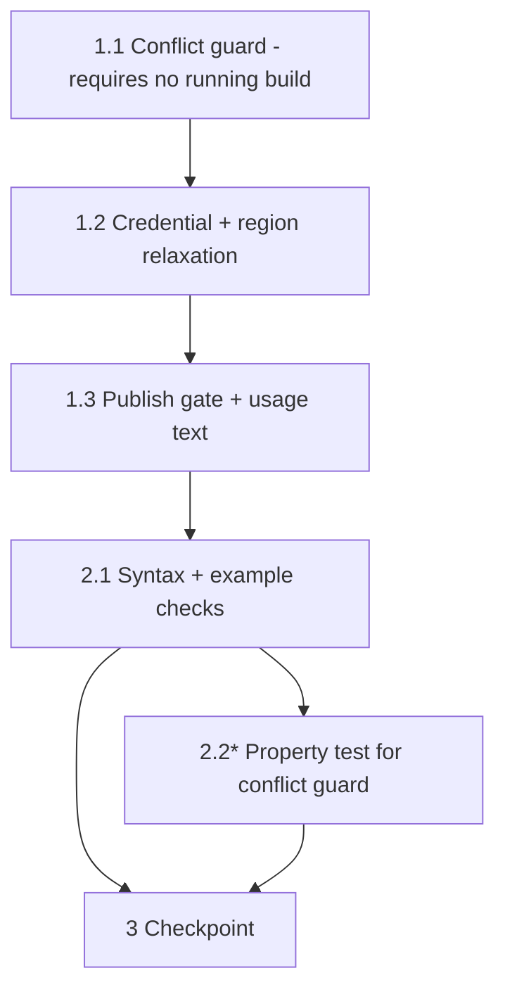

# Implementation Plan: build-only-flag

## Overview

Single-file change to `gdk-component-build-and-publish.sh`: add a `SKIP_PUBLISH=1` build-only mode (conflict guard, relaxed credential pre-flight, region placeholder, publish gate, usage docs), verified with `bash -n` and fast-failing example checks that never trigger a real build.

**⚠ PRECONDITION — do not start until no build is running.** A build from this script is currently in progress. Per `.kiro/steering/builds.md`, concurrent builds corrupt model versioning, and editing the script while it executes is unsafe (bash reads scripts incrementally). Before starting task 1, verify both of these return nothing:

```
pgrep -af "gdk component build"
pgrep -af "build-custom.sh"
```

If either shows a process, wait for it to finish.

## Tasks

- [x] 1. Add SKIP_PUBLISH mode guards to gdk-component-build-and-publish.sh
  - [x] 1.1 Verify no build is running, then add the conflict guard
    - Run `pgrep -af "gdk component build"` and `pgrep -af "build-custom.sh"`; proceed only if both are empty
    - Insert the mutual-exclusion check (`SKIP_BUILD=1` + `SKIP_PUBLISH=1` → error + exit 1) immediately after the `set` lines, before the credential pre-flight
    - _Requirements: 3.1_

  - [x] 1.2 Relax the credential pre-flight and region resolution for build-only mode
    - In the `aws sts get-caller-identity` failure branch: when `${SKIP_PUBLISH:-0}` = 1, print a warning and continue; otherwise keep the existing exit 1
    - In the `GDK_REGION` resolution: when empty and `SKIP_PUBLISH=1`, use placeholder `us-east-1` with an informational note; otherwise keep the existing exit 1
    - _Requirements: 2.1, 2.2, 2.3_

  - [x] 1.3 Add the publish gate and update usage text
    - Insert the early-exit block (print skip message with `SKIP_BUILD=1` re-run hint, elapsed time, exit 0) immediately before `print_step "Publishing LocalServer component"`, so publish, tagging, and the InferenceUploader prompt are all skipped
    - Extend the usage comment block with an "Environment variables" section documenting `SKIP_BUILD=1` and `SKIP_PUBLISH=1` (mutually exclusive) plus invocation examples
    - _Requirements: 1.1, 1.2, 1.3, 1.4, 4.1_

- [x] 2. Verify the change without triggering a build
  - [x] 2.1 Run syntax and fast-failing example checks
    - `bash -n gdk-component-build-and-publish.sh` must pass
    - `SKIP_BUILD=1 SKIP_PUBLISH=1 ./gdk-component-build-and-publish.sh` must exit non-zero within seconds with the conflict message and no side effects
    - With broken credentials (`AWS_ACCESS_KEY_ID=bad AWS_SECRET_ACCESS_KEY=bad AWS_SESSION_TOKEN=bad`) and no SKIP vars, the script must exit 1 at the pre-flight before any build step (safe to run — fails before the build starts)
    - Confirm via `grep SKIP_PUBLISH gdk-component-build-and-publish.sh` that the usage block documents the new variable
    - _Requirements: 2.2, 3.1, 4.1_

  - [x]* 2.2 Write property test for the conflict guard
    - **Property 1: Conflicting modes always rejected before any action**
    - For randomly generated argument vectors, run the script with both `SKIP_BUILD=1` and `SKIP_PUBLISH=1`; assert non-zero exit, the mutual-exclusion message, and no filesystem side effects (e.g. via Hypothesis driving `subprocess.run` from `test/backend-test`)
    - **Validates: Requirements 3.1**

- [x] 3. Checkpoint — Ensure all checks pass
  - Ensure `bash -n` and the example checks in 2.1 pass; ask the user if questions arise.

## Task Dependency Graph



```json
{
  "waves": [
    {"wave": 1, "tasks": ["1.1"], "rationale": "Precondition-gated first edit: verify no build is running, then add the conflict guard. All edits touch the same script, so tasks are strictly sequential."},
    {"wave": 2, "tasks": ["1.2"], "rationale": "Credential/region relaxation builds on the guard being in place."},
    {"wave": 3, "tasks": ["1.3"], "rationale": "Publish gate and usage text complete the script change."},
    {"wave": 4, "tasks": ["2.1", "2.2"], "rationale": "Verification runs against the finished script; example checks and the optional property test can run together."},
    {"wave": 5, "tasks": ["3"], "rationale": "Final checkpoint after all checks pass."}
  ]
}
```

## Notes

- Tasks marked with `*` are optional and can be skipped
- Do NOT run a full build-only end-to-end build as part of these tasks: a real build takes 1–2h and must never run concurrently with another build (builds.md). End-to-end validation happens on the next normal build cycle with `SKIP_PUBLISH=1`.
- The default path (no SKIP vars) must remain byte-for-byte behavior-identical apart from the new guards (Requirement 1.4).
