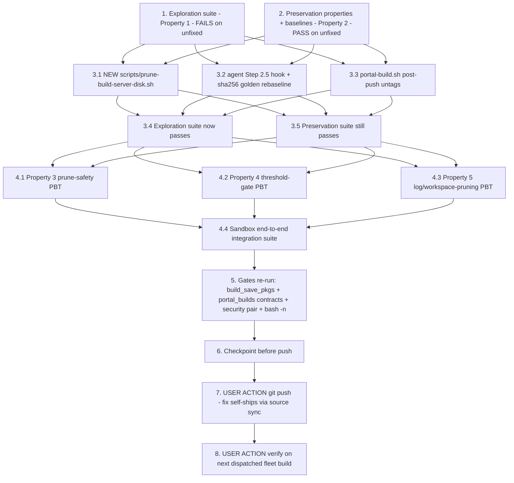

# Implementation Plan

## Overview

Stop the dedicated build server's unbounded disk accumulation that killed
fleet JP7 build `e1d672ce` with `RUNNER_DISK_FULL` (ENOSPC extracting
`libonnxruntime_providers_cuda.so` ~1 h in, AFTER the GPU compile, with the
measurement-only preflight having "passed" at 29 GB free) and required manual
cleanup (~74 GB of stale locally-tagged per-version ECR image generations +
old `/tmp` logs) plus a requeue. Three parts per design.md, engineered so a
**git push alone ships the fix** (the fleet source sync places the server's
clone on the job's `source_ref` before every dispatched build — no portal
deploy, Decision 6):

1. **Stop the leak at the source** — `portal-build.sh` untags each local
   per-version ECR ref (`docker rmi ... || true`) immediately after its
   successful `docker push`; layers stay referenced by `flask-app:latest` /
   `react-webapp:latest` (design Decision 4).
2. **Reclaim stale state when a new build starts** — NEW standalone
   `scripts/prune-build-server-disk.sh`, invoked by an existence-gated
   Step 2.5 hook in `scripts/portal-build-agent.sh` (after the source sync,
   inside `/var/lock/dda-build.lock`). Prunes ONLY provably-safe state:
   ECR-digest-confirmed per-version generations (never `:latest`, never
   unqualified repos, never `rmi -f`), dangling images (`image prune -f`
   only — NEVER `system`/`builder` prune or `image prune -a`), stale
   `custom-build/` leftovers, and age-gated pattern-matched `/tmp` build
   logs (current job's log excluded); every action logged with sizes freed;
   fail OPEN on any ECR/docker uncertainty (design Decisions 1, 2, 5).
3. **Enforce a minimum free-disk threshold AFTER pruning** — the prune
   script exits 3 when post-prune free space on the docker storage volume is
   below `BUILD_MIN_FREE_DISK_GB` (default 60, `0` disables); the agent then
   fails the job BEFORE the expensive build via the EXISTING
   `error_kind=disk` → `RUNNER_DISK_FULL` classification — no backend
   change (design Decision 3).

**Honesty guard.** No test in this plan runs real docker, aws, gdk, or
touches the build server. Script behavioral tests run the REAL shell scripts
via `subprocess.run` with stub binaries on PATH (`docker`, `aws`, `df`,
`find` recording their argv and returning canned outputs — the
`deploy_reliability` / `csi_nvargus_optional` stub-binary pattern) inside
sandbox repos (the `test_source_selection_preservation.py` `_sandbox_repo`
technique). The real claims — actual space reclaimed on
`i-092e45480d30c89c4`, real ECR digest confirmation, a real fleet build
passing the threshold with the prune log visible — are ONLY provable on the
build server and are assigned to the USER ACTION tasks (7, 8), at the NEXT
dispatched fleet build. Do not write a test that pretends to exercise real
docker/ECR/the server.

**Non-goal guards.** No change to
`edge-cv-portal/backend/functions/build_dispatcher.py` (Decision 6 — hence
NO portal deploy in this spec), `publish-ecr-only.sh` (pinned by its own
sha256 golden; covered by the prune backstop), `build-custom.sh`,
`run_jp_builds.sh`, any backend classification code, or any recipe. The
agent preflight stays measurement-only and byte-untouched
(`PREFLIGHT_MIN_DISK_GB` keeps its unset production semantics — the
preflight suites pin it). The pinned agent contracts (argument contract,
exit codes 64/75/78 meanings, preflight markers, phase-event field sets,
ERROR_TAIL derivation) are preserved verbatim. Exactly ONE intended golden
update in this whole spec: the `build_save_pkgs` neighbor-script sha256 for
`scripts/portal-build-agent.sh` — a conscious rebaseline, never a weakened
test. No component build is required for the fix itself. **Do not commit
anything in this dispatch.**

Test commands:
- Host-side suites run in the portal venv from the repo root:
  `source /home/ubuntu/.venvs/dda-portal-tests/bin/activate` then
  `PYTHONPATH=src/backend:test/backend-test python3 -m pytest test/backend-test/build_server_disk_pruning -q -p no:cacheprovider --noconftest`
- The existing pinned-contract suites run the same way (`--noconftest`,
  `PYTHONPATH=src/backend:test/backend-test`):
  `test/backend-test/build_save_pkgs`, and the `portal_builds`
  agent-contract files named in task 2
- Hypothesis property tests use `test_property_*.py` naming with no
  hardcoded `max_examples` and `# Validates: Requirements …` comments
- Shell syntax check: `bash -n <script>` for every touched/created script
- The security guard pair runs host-side (unrelated to this spec's files —
  the security preservation gate does NOT pin `portal-build.sh` or the
  agent — but it is the standard pre-push gate):
  `python3 -m pytest test/backend-test/security/preservation/test_preservation_out_of_scope_guard.py test/backend-test/security/preservation/test_preservation_secrets_out_of_scope_guard.py -p no:cacheprovider --noconftest -q`

New files this plan creates:
- `scripts/prune-build-server-disk.sh` (the fix — File 1)
- `test/backend-test/build_server_disk_pruning/test_exploration_disk_pruning.py`
- `test/backend-test/build_server_disk_pruning/test_preservation_disk_pruning.py`
- `test/backend-test/build_server_disk_pruning/test_property_prune_safety.py`
- `test/backend-test/build_server_disk_pruning/test_property_prune_threshold.py`
- `test/backend-test/build_server_disk_pruning/test_property_prune_logs.py`
- `test/backend-test/build_server_disk_pruning/test_integration_agent_prune_sandbox.py`

## Notes

- Source-tree changes: `scripts/prune-build-server-disk.sh` (NEW — all
  pruning + threshold logic; unpinned by any golden),
  `scripts/portal-build-agent.sh` (the ~15-line existence-gated Step 2.5
  hook between Step 2 source sync and Step 3 phase=building), the CONSCIOUS
  rebaseline of
  `test/backend-test/build_save_pkgs/baselines/scripts_portal-build-agent.sh.sha256.txt`
  in the SAME task as the agent edit, and `portal-build.sh` (two post-push
  `docker rmi ... || true` + log lines in the ECR path — no golden pins
  this file)
- Prune exit-code contract (design Decision 1): 0 = proceed; 3 = below
  threshold → agent `emit_failed "disk" ...` + `exit 1` (plain
  build-failure exit — the pinned 64/75/78 codes keep their exact
  meanings); any other nonzero (incl. the script's internal-failure exit 4)
  = prune malfunction → loud warning, build proceeds (fail open)
- Env knobs, all `${VAR:-default}`: `BUILD_MIN_FREE_DISK_GB` (60),
  `PRUNE_LOG_RETENTION_DAYS` (7), `DDA_PRUNE_DISABLE` (unset; `1` = log and
  exit 0 immediately)
- The agent-sandbox tests (`test_source_selection_preservation.py`) copy
  ONLY the agent + a stub `portal-build.sh` into a temp repo; the
  existence gate makes the new hook a no-op there — those tests stay valid
  WITHOUT modification (design Decision 1)
- builds.md is binding: JP7 component build `998b6f42` is RUNNING on the
  build server. Nothing in this plan may disturb it — all host-side work is
  safe; the git push (task 7) does not touch the server (the server syncs
  source only when a NEW build is dispatched), and the live verification
  (task 8) happens at the NEXT dispatched fleet build
- No portal deploy anywhere in this spec (Decision 6 — `build_dispatcher.py`
  unchanged); if that ever changes, the deploy must be
  orchestrator-sequenced strictly AFTER the running build finishes per
  builds.md
- Tasks 7 and 8 are USER ACTIONs (git push + real fleet-build
  verification); the agent prepares and verifies everything else host-side

## Task Dependency Graph

```json
{
  "waves": [
    { "wave": 1, "description": "Exploration + preservation on the UNFIXED tree: exploration surfaces the untag/prune/threshold counterexamples (cases 1-4 FAIL expected; case 5 F(X) pins PASS); preservation baselines the clean-run sandbox identity, the agent sha256 golden value, and the existing pinned-contract suites green (PASS required).", "tasks": ["1", "2"] },
    { "wave": 2, "description": "The fix, per design Fix Implementation Files 1-3: the NEW prune script, the agent Step 2.5 hook + conscious sha256 golden rebaseline, the portal-build.sh post-push untags.", "tasks": ["3.1", "3.2", "3.3"] },
    { "wave": 3, "description": "Verify: the exploration suite now passes on the fixed tree; the preservation suite still passes (only diff vs baseline = the one recorded golden rebaseline).", "tasks": ["3.4", "3.5"] },
    { "wave": 4, "description": "Fix-checking: prune-safety PBT (Property 3), threshold-gate PBT (Property 4), log/workspace-pruning PBT (Property 5), and the sandbox end-to-end integration suite over the four scenario classes.", "tasks": ["4.1", "4.2", "4.3", "4.4"] },
    { "wave": 5, "description": "Re-run every adjacent gate (build_save_pkgs with the rebaselined hash, the portal_builds agent-contract suites, security guard pair, bash -n), then checkpoint.", "tasks": ["5", "6"] },
    { "wave": 6, "description": "USER ACTION: git push - the fix self-ships via the fleet source sync; no portal deploy (Decision 6). Safe while build 998b6f42 runs.", "tasks": ["7"] },
    { "wave": 7, "description": "USER ACTION: verify the durable fix on the NEXT dispatched fleet build on i-092e45480d30c89c4 - prune log lines + sizes freed, threshold measurement, build success, ECR intact, no forced onnxruntime recompile.", "tasks": ["8"] }
  ]
}
```



## Tasks

- [x] 1. Write bug condition exploration test suite
  - **Property 1: Bug Condition** - New Builds Prune Stale Disk State and Fail Fast on Insufficient Disk
  - **CRITICAL**: Cases 1-4 MUST FAIL on unfixed code - failure confirms the bug condition exists
  - **DO NOT attempt to fix the tests or the code when they fail**
  - **NOTE**: This suite encodes the expected behavior - it validates the fix when it passes after implementation (task 3.4)
  - **GOAL**: Surface counterexamples for defects 1.1-1.5 on the UNFIXED tree - every check is host-runnable (honesty guard: text fingerprints + stub-binary sandbox-agent behavioral legs ONLY; no real docker/aws/server)
  - Create `test/backend-test/build_server_disk_pruning/test_exploration_disk_pruning.py` (module-level `REPO_ROOT` resolution, plain pytest, stub binaries on PATH via `subprocess.run` env; sandbox repo per `test_source_selection_preservation.py`'s `_sandbox_repo` technique)
  - Case 1 - **Publish-path untag exists (defect 1.1)**: `portal-build.sh` contains a `docker rmi` of `${ECR_REPO_BACKEND}:${COMPONENT_VERSION}` AND of `${ECR_REPO_FRONTEND}:${COMPONENT_VERSION}` positioned after the corresponding pushes (comment/string-aware text scan). FAILS on unfixed code (`docker tag` + `docker push` × 2 with zero `rmi` - one new ~29-42 GB generation per image per publish)
  - Case 2 - **Prune script exists with the safety anchors (defect 1.2)**: `scripts/prune-build-server-disk.sh` exists; contains the ECR digest-confirmation call (`describe-images` + `imageDigest`), the retention-reason log tokens (`NOT_IN_ECR`, `NO_REPODIGEST`, `ECR_UNVERIFIABLE`), all four `/tmp` log patterns (`gdk-build-*.log`, `gdk-publish-*.log`, `portal-build-agent-*.log`, `inference-uploader-build-*.log`), the `BUILD_MIN_FREE_DISK_GB` gate, and NO `system prune` / `builder prune` / `image prune -a` / `rmi -f`. FAILS on unfixed code (file absent)
  - Case 3 - **Agent invokes the prune before the build (defects 1.2/1.4), behavioral**: sandbox repo (byte-identical agent copy, stub `portal-build.sh`, a recording stub prune script planted at `scripts/prune-build-server-disk.sh`, `EVENT_BUS` unset) - assert the prune stub ran BEFORE the `portal-build.sh` stub. FAILS on unfixed code (the agent never invokes any prune: lock → preflight (evidence-only) → sync → building → build)
  - Case 4 - **Below-threshold fail-fast (defects 1.3/1.4/1.5), behavioral**: sandbox with a stub prune script exiting 3 - assert the agent emits a `failed` detail with `"error_kind":"disk"`, does NOT run the `portal-build.sh` stub, and exits nonzero. FAILS on unfixed code (the build runs regardless - the e1d672ce path: 29 GB free "passed", ~1 h wasted, manual recovery)
  - Case 5 - **F(X) pins - PASS on unfixed, must NOT be inverted**: the agent preflight remains measurement-only (`PREFLIGHT_MIN_DISK_GB="${PREFLIGHT_MIN_DISK_GB:-}"` with no hardcoded default) and `record_disk_capacity` still exists (the preserved preflight contract Decision 3 relies on); `portal-build.sh` step [3/7] `rm -rf greengrass-build/` and `build-custom.sh`'s `rm -rf ./custom-build` still exist (the existing-cleanup baseline Decision 5 mirrors)
  - Run host-side (portal venv command from Test commands above)
  - **EXPECTED OUTCOME**: cases 1-4 FAIL (this is correct - it proves the bug condition exists); case 5 PASSES
  - Document the counterexamples found: the tag+push-no-rmi ECR path, the absent prune script, the agent's prune-free step sequence, the agent proceeding into the build after a threshold-exceeded prune exit
  - Mark complete when the suite is written, run, and the failures are documented
  - **OUTCOME (2026-08-17)**: Suite written and run on the UNFIXED tree — 7 failed (cases 1-4, as required) / 4 passed (case 5 F(X) pins). Counterexamples surfaced: **Case 1 (defect 1.1)** — `portal-build.sh` pushes `${ECR_REPO_BACKEND}:${COMPONENT_VERSION}` (line 407) and `${ECR_REPO_FRONTEND}:${COMPONENT_VERSION}` (line 411) with ZERO `docker rmi` anywhere in the script (`rmi_lines=[]` for both repos): one new ~29-42 GB locally-tagged generation per image per publish, never removed. **Case 2 (defect 1.2)** — `scripts/prune-build-server-disk.sh` does not exist (all three anchor tests fail at the existence assert): the only between-build cleanup is step [3/7] `rm -rf greengrass-build/ .gdk/`. **Case 3 (defects 1.2/1.4)** — sandbox agent (byte-identical copy, planted recording prune stub exiting 0): record = `["BUILD aarch64 7"]`, no `PRUNE` entry — the agent's step sequence (lock → sync → building → portal-build.sh) never invokes any prune. **Case 4 (defects 1.3/1.4/1.5)** — with the prune stub exiting 3 (below-threshold signal), the agent ran the build anyway: record = `["BUILD aarch64 7"]`, details = `[building, succeeded]`, agent exit 0, no `failed` detail with `"error_kind":"disk"` — the e1d672ce path (29 GB free "passed", ~1 h wasted, manual recovery). Case 5 pins confirmed un-inverted: `PREFLIGHT_MIN_DISK_GB="${PREFLIGHT_MIN_DISK_GB:-}"` with no hardcoded default + `record_disk_capacity` present; `rm -rf greengrass-build/` (portal-build.sh [3/7]) and `rm -rf ./custom-build` (build-custom.sh) present. Bug condition confirmed; the same suite unmodified validates the fix at task 3.4.
  - _Requirements: 1.1, 1.2, 1.3, 1.4, 1.5_

- [x] 2. Write preservation property tests (BEFORE implementing the fix)
  - **Property 2: Preservation** - Everything Outside the Stale-Disk Surface Is Unchanged
  - **IMPORTANT**: Follow observation-first methodology - observe the UNFIXED behavior, record it as baselines, then encode it as properties that PASS on the unfixed tree and must keep passing
  - Create `test/backend-test/build_server_disk_pruning/test_preservation_disk_pruning.py` (Hypothesis where property-shaped, no hardcoded `max_examples`, `# Validates: Requirements …` comments; example-style pins may live in the same file)
  - Observe on UNFIXED code and encode:
    - **Clean-server identity (3.1)**: run the sandbox agent (real agent copy + stub `portal-build.sh`, `EVENT_BUS` unset) on a clean-run scenario and RECORD the emitted detail sequence, ordering, field sets, and exit code as the unfixed baseline; encode the assertion that the fixed tree reproduces them exactly (on the fixed tree the prune section additionally reports zero deletions - the info line the detail parser ignores)
    - **ECR read-only (3.2), skip-as-absent PBT**: _for any_ generated scenario, the recorded stub `aws` argv transcript contains ONLY `ecr describe-images` calls - no delete/put/batch ECR mutation ever. Written NOW against `scripts/prune-build-server-disk.sh`, skipping while the script does not exist (the csi-spec skip-as-absent pattern); binds automatically when task 3.1 lands, re-run bound in 3.5
    - **In-progress-build immunity (3.3), skip-as-absent**: the prune script never deletes `portal-build-agent-${BUILD_JOB_ID}.log` (current-job exclusion) - encoded with the log-pruning sandbox; the lock-placement leg (hook inside `/var/lock/dda-build.lock`, after acquisition) is asserted structurally in task 3.2's text scan
    - **ENOSPC classification identity (3.4)**: baseline `test/backend-test/portal_builds/test_enospc_classification_properties.py` green on the UNFIXED tree (record the count) - the existing `error_kind=disk` / ENOSPC-evidence → `RUNNER_DISK_FULL` path the fix reuses and must not disturb
    - **Local dev builds untouched (3.5)**: text pin - `run_jp_builds.sh` and `build-custom.sh` contain no reference to `prune-build-server-disk.sh` (the prune script is not shared with local dev paths)
    - **Pinned script contracts (3.6)**: RECORD the current agent sha256 golden value from `test/backend-test/build_save_pkgs/baselines/scripts_portal-build-agent.sh.sha256.txt` verbatim (the ONE intended rebaseline, applied in task 3.2 - recording it now makes the 3.2 diff auditable); baseline green (record counts) on the UNFIXED tree: `test/backend-test/build_save_pkgs` and the `portal_builds` agent-contract suites - `test_source_selection_preservation.py`, `test_agent_tail_truncation_properties.py`, `test_preflight_target_matrix_properties.py`, `test_preflight_agent_contract.py`, `test_execution_failure_preservation.py`
  - Run host-side (`--noconftest`, `PYTHONPATH=src/backend:test/backend-test`, `-p no:cacheprovider`)
  - **EXPECTED OUTCOME**: Tests PASS on UNFIXED code (this confirms the baseline behavior to preserve); the skip-as-absent tests SKIP
  - Mark complete when the tests are written, run, and passing on unfixed code with the baseline counts and the golden value recorded
  - **OUTCOME/BASELINE RECORDED (2026-08-16)**: `test_preservation_disk_pruning.py` written and run on the UNFIXED tree — 9 passed, 3 skipped (the skip-as-absent legs: ECR read-only PBT, the PRUNE_TMP_DIR structural guard, and the current-job-log immunity PBT — all bind when task 3.1 lands). Clean-run sandbox identity RECORDED: exit 0; phases exactly `["building", "succeeded"]`; building detail field set `{build_job_id, phase, build_target, source_ref, source_commit}`; succeeded detail field set `{build_job_id, phase, build_target, result}` with the stub `PORTAL_BUILD_RESULT` round-tripped verbatim; stdout step ordering lock → building event → portal-build.sh start → stub → result line → succeeded event. Agent sha256 golden RECORDED VERBATIM (the ONE intended rebaseline, applied in task 3.2): `09ac1caa438840eb724e1009fdc1b3a73b6d71d0370d1190792a8d6ac0635b46` (verified == sha256 of the live `scripts/portal-build-agent.sh`). Existing-suite baseline counts on the UNFIXED tree, all green: `test_enospc_classification_properties.py` 6 passed; `build_save_pkgs` 21 passed; agent-contract suites 175 passed total (test_source_selection_preservation 35, test_agent_tail_truncation_properties 6, test_preflight_target_matrix_properties 11, test_preflight_agent_contract 50, test_execution_failure_preservation 73). Text pins green: `run_jp_builds.sh` / `build-custom.sh` contain no `prune-build-server-disk` reference.
  - _Requirements: 3.1, 3.2, 3.3, 3.4, 3.5, 3.6_

- [x] 3. Fix: prune stale disk state at build start, untag after push, enforce the post-prune threshold (design "Fix Implementation" Files 1-3)

  - [x] 3.1 Create `scripts/prune-build-server-disk.sh` (design File 1 - NEW; all pruning + threshold logic)
    - Standalone bash; `set -u -o pipefail` but NOT `set -e` (resilient per-step error handling - its own bugs must never abort a build); all external binaries (`docker`, `aws`, `df`, `find`, `stat`) resolved from PATH so the test suites can stub them; accepts `KEY=VALUE` args (agent convention): `BUILD_JOB_ID=<id>`; env knobs `${VAR:-default}`: `BUILD_MIN_FREE_DISK_GB` (60), `PRUNE_LOG_RETENTION_DAYS` (7), `DDA_PRUNE_DISABLE` (unset; `1` = log and exit 0 immediately)
    - Structure per design File 1, in order:
      1. `free_gb_of <path>` + docker-storage-path resolution (`/var/snap/docker/common` when present, else the repo volume - mirrors `record_disk_capacity`); log the BEFORE measurement
      2. **Stale generation pruning**: enumerate `docker image ls --format '{{.Repository}}\t{{.Tag}}\t{{.Size}}'`; candidates = repository matches `[0-9]*.dkr.ecr.*.amazonaws.com/dda/*` AND tag ∉ {latest, `<none>`}; for each, read the local RepoDigest for that repository from `docker image inspect`, confirm via `aws ecr describe-images --repository-name dda/<name> --image-ids imageDigest=<digest>`; on FULL confirmation `docker rmi <repo>:<tag>` (never `-f`, never by image ID) and log `PRUNED image <ref> (<size>, digest <sha>)`; otherwise log `RETAINED image <ref> reason=<NOT_IN_ECR|NO_REPODIGEST|ECR_UNVERIFIABLE>`; ANY aws/docker error → retain + continue (fail open, loudly)
      3. **Dangling images**: `docker image prune -f` (dangling only), log its reclaimed-space report; NEVER `-a`, NEVER `builder`/`system` prune
      4. **Workspace leftovers**: `rm -rf <repo>/custom-build/` (size logged first) - provably safe, `build-custom.sh` does the same at its start (Decision 5)
      5. **Old `/tmp` logs**: `find /tmp -maxdepth 1 -name '<pattern>' -mtime +${PRUNE_LOG_RETENTION_DAYS}` over the four patterns, excluding `portal-build-agent-${BUILD_JOB_ID}.log`; log each deletion with size
      6. **Threshold gate**: log the AFTER measurement and total freed; if `BUILD_MIN_FREE_DISK_GB > 0` and free < threshold → log `PRUNE-DISK-INSUFFICIENT free=<X>GB required=<Y>GB` and `exit 3`; else `exit 0`; internal unexpected failures exit 4 (agent fails open)
    - Verify: `bash -n scripts/prune-build-server-disk.sh` clean; exploration case 2 (safety-anchor text scan) passes against it
    - **OUTCOME (2026-08-17)**: `scripts/prune-build-server-disk.sh` created (238 lines) implementing design File 1 verbatim: `set -u -o pipefail` (no `set -e`); `BUILD_JOB_ID=` KEY=VALUE arg; knobs `BUILD_MIN_FREE_DISK_GB` (60, 0/non-numeric disables fail-open), `PRUNE_LOG_RETENTION_DAYS` (7), `DDA_PRUNE_DISABLE` (1 = log + exit 0), plus `PRUNE_TMP_DIR` (default /tmp — the test override the preservation suite requires); steps in design order — (1) `free_gb_of` + `/var/snap/docker/common`-else-repo-volume resolution with BEFORE measurement, (2) digest-confirmed generation pruning (candidate pattern `[0-9]*.dkr.ecr.*.amazonaws.com/dda/*`, tag ∉ {latest, `<none>`}, RepoDigest via `docker image inspect`, `aws ecr describe-images --image-ids imageDigest=`, `docker rmi <repo>:<tag>` never `-f`/never by ID, `PRUNED ... (size, digest)` / `RETAINED ... reason=NOT_IN_ECR|NO_REPODIGEST|ECR_UNVERIFIABLE` logging, fail open on any aws/docker error), (3) `docker image prune -f` only (no `-a`, no `builder`/`system` prune anywhere), (4) `rm -rf <repo>/custom-build/` size-logged, (5) the four `/tmp` log patterns `-maxdepth 1 -mtime +retention` with `portal-build-agent-${BUILD_JOB_ID}.log` always excluded, (6) AFTER measurement + total freed + `PRUNE-DISK-INSUFFICIENT free=<X>GB required=<Y>GB` → exit 3 iff threshold > 0 and free < threshold, else exit 0; internal failures exit 4. Verified host-side: `bash -n` clean; exploration Case 2 (`TestCase2PruneScriptSafetyAnchors`) 3 passed; preservation suite now 12 passed, 0 skipped — the three skip-as-absent legs (ECR read-only PBT 3.2, `PRUNE_TMP_DIR` structural guard, current-job-log immunity PBT 3.3) bound against the real script and pass. Sandbox/stub verification only (build 998b6f42 running on the server — untouched). Not committed.
    - _Bug_Condition: isBugCondition legs - staleGenerations/staleTmpLogs/danglingImages ≠ ∅ with no prune (defects 1.1, 1.2), freeDiskGB < buildFootprintGB with no gate (defects 1.3, 1.4)_
    - _Expected_Behavior: Properties 1, 3, 4, 5 - safe-set-exact pruning, fully logged with sizes, threshold exit 3 iff enforcement on and free < threshold, fail open on uncertainty_
    - _Preservation: Property 2 - `:latest` lineage and BuildKit cache never touched (2.2); describe-images is the only ECR call (3.2); current-job log excluded (3.3)_
    - _Requirements: 2.1, 2.2, 2.3, 2.4, 2.5, 3.2, 3.3_

  - [x] 3.2 Add the Step 2.5 prune hook to `scripts/portal-build-agent.sh` + conscious sha256 golden rebaseline (design File 2)
    - Insert the existence-gated hook BETWEEN Step 2 (source sync) and Step 3 (phase=building event), exactly per design Decision 1: `PRUNE_SCRIPT="${REPO_DIR}/scripts/prune-build-server-disk.sh"`; if present, run it with `BUILD_JOB_ID="$BUILD_JOB_ID"`; exit 3 → `emit_failed "disk" "Insufficient disk space before build: free space below BUILD_MIN_FREE_DISK_GB after pruning (see prune log above for measured capacity)"` + `exit 1`; any other nonzero → loud warning + proceed (fail open); absent → one info line + skip. NO other line changes anywhere in the agent
    - The hook's placement is LOAD-BEARING: after the sync (the prune script that runs belongs to the job's `source_ref`) and inside `/var/lock/dda-build.lock` (pruning can never race an in-progress build - requirement 3.3 by construction); it runs unconditionally for legacy and ATTEMPT_ID dispatches alike
    - **Same task (the ONE intended golden update, requirement 3.6)**: recompute `sha256sum scripts/portal-build-agent.sh` and rebaseline `test/backend-test/build_save_pkgs/baselines/scripts_portal-build-agent.sh.sha256.txt` to the new hash; never weaken or delete the test; the task 2 record of the old value makes this diff auditable
    - Do NOT touch the preflight (`PREFLIGHT_MIN_DISK_GB` stays measurement-only), the argument contract, exit codes 64/75/78, ERROR_TAIL derivation, or any phase-event field set - the `portal_builds` sandbox tests must stay valid WITHOUT modification (the existence gate no-ops in their agent-only sandbox)
    - Verify: `bash -n scripts/portal-build-agent.sh` clean; `test/backend-test/build_save_pkgs` green with the rebaselined hash; `test_source_selection_preservation.py` green UNMODIFIED
    - **OUTCOME (2026-08-17)**: Step 2.5 hook inserted exactly per design Decision 1 between Step 2 (source sync) and Step 3 (phase=building) — `git diff --stat` = 17 insertions, 0 deletions, no other line touched (preflight, argument contract, exit codes 64/75/78, ERROR_TAIL, phase-event field sets all verbatim). Golden consciously rebaselined: `09ac1caa438840eb724e1009fdc1b3a73b6d71d0370d1190792a8d6ac0635b46` → `f7e9ed72490cc91e528813f0b49a88a48d3fea2186563b20430ae2e4ed497a54` in `test/backend-test/build_save_pkgs/baselines/scripts_portal-build-agent.sh.sha256.txt` (test unweakened). Verified host-side: `bash -n` clean; `build_save_pkgs` 21 passed with the new hash; `test_source_selection_preservation.py` 35 passed UNMODIFIED; exploration TestCase3+TestCase4 now PASS (2 passed — the tests plant their own stub prune scripts; the real `scripts/prune-build-server-disk.sh` from task 3.1 had not yet landed at verification time and the existence gate makes the hook safe regardless). Not committed.
    - _Bug_Condition: isBugCondition - the unfixed agent neither prunes nor fails fast (defects 1.2, 1.3, 1.4)_
    - _Expected_Behavior: Properties 1, 4 - prune runs before any build work; exit 3 → error_kind=disk failure WITHOUT running portal-build.sh; other nonzero → fail open_
    - _Preservation: Property 2 - pinned agent contracts verbatim (3.6); clean-run identity (3.1); error_kind=disk reuses the existing RUNNER_DISK_FULL classification, no backend change (3.4)_
    - _Requirements: 2.1, 2.3, 2.4, 3.1, 3.3, 3.4, 3.6_

  - [x] 3.3 Add the post-push untags to `portal-build.sh` (design File 3, Decision 4)
    - In the ECR publish path, immediately after each successful `docker push`, add `docker rmi "${ECR_REPO_BACKEND}:${COMPONENT_VERSION}" >/dev/null 2>&1 || true` + the `✓ Untagged local ...` log line (and the `${ECR_REPO_FRONTEND}` equivalent after the react-webapp push). Non-fatal (`|| true`): an untag failure must never fail a publish that already succeeded
    - `docker rmi` on a multi-tagged image only removes the tag - layers stay referenced by `flask-app:latest` / `react-webapp:latest` (the cache-retention property 2.2); the local tag has no consumer after the push (recipe references the ECR ref; `SKIP_BUILD=1` re-creates it from `:latest`)
    - Do NOT touch the agent's publish-failure reconstruction grep targets (`Pushing flask-app to ECR`, `Creating component version via API`), `PUSHED_IMAGE_REFS` metadata, phase events, the `PORTAL_BUILD_RESULT` line, or step [3/7]; `portal-build.sh` has NO sha256 golden (verified in design) - no rebaseline for this edit
    - Verify: `bash -n portal-build.sh` clean; exploration case 1 (untag-after-push text scan) passes; `test_preflight_agent_contract.py`'s textual anchors on `portal-build.sh` still green
    - _Bug_Condition: isBugCondition - every ECR-path publish leaves a per-version generation behind (defect 1.1)_
    - _Expected_Behavior: Property 1 - no new generation left behind after a successful push_
    - _Preservation: Property 2 - publish behavior, result line, and log markers unchanged (3.1); ECR contents untouched (3.2)_
    - **OUTCOME (2026-08-17)**: Post-push untags added to the ECR publish path in `portal-build.sh` — `docker rmi "${ECR_REPO_BACKEND}:${COMPONENT_VERSION}" >/dev/null 2>&1 || true` + `✓ Untagged local ...` log line immediately after the flask-app push (after its `PUSHED_IMAGE_REFS` append), and the `${ECR_REPO_FRONTEND}` equivalent after the react-webapp push; `set -e` guarantees the untag only runs after a successful push. Grep targets (`Pushing flask-app to ECR`, `Creating component version via API`), `PUSHED_IMAGE_REFS`, phase events, `PORTAL_BUILD_RESULT`, and step [3/7] untouched; no golden rebaseline (portal-build.sh unpinned). Verified host-side: `bash -n portal-build.sh` clean; exploration Case 1 (`TestCase1PublishPathUntag`) now 2 passed; `test_preflight_agent_contract.py` still 50 passed. Not committed.
    - _Requirements: 2.1, 2.2, 3.1, 3.2_

  - [x] 3.4 Verify bug condition exploration test now passes
    - **Property 1: Expected Behavior** - New Builds Prune Stale Disk State and Fail Fast on Insufficient Disk
    - **IMPORTANT**: Re-run the SAME suite from task 1 - do NOT write new tests
    - Run: `PYTHONPATH=src/backend:test/backend-test python3 -m pytest test/backend-test/build_server_disk_pruning/test_exploration_disk_pruning.py -q -p no:cacheprovider --noconftest`
    - **EXPECTED OUTCOME**: all cases PASS (confirms the bug is fixed: the untags exist after both pushes, the prune script exists with every safety anchor, the sandbox agent runs the prune before the build, and a prune exit 3 fails the job with error_kind=disk before any build work); case 5's F(X) pins remain un-inverted
    - **OUTCOME (2026-08-17)**: SAME suite from task 1, unmodified, re-run on the FIXED tree — **11 passed, 0 failed** (was 7 failed / 4 passed on the unfixed tree). All four bug-condition cases now pass: Case 1 (post-push `docker rmi` of both `${ECR_REPO_BACKEND}:${COMPONENT_VERSION}` and `${ECR_REPO_FRONTEND}:${COMPONENT_VERSION}` after their pushes), Case 2 (prune script exists with every safety anchor: digest confirmation, retention-reason tokens, four /tmp log patterns, `BUILD_MIN_FREE_DISK_GB` gate, no forbidden prune subcommands), Case 3 (sandbox agent runs the prune BEFORE `portal-build.sh`), Case 4 (prune exit 3 → `failed` detail with `"error_kind":"disk"`, no `portal-build.sh` invocation, nonzero agent exit). Case 5's F(X) pins remain un-inverted (4 passed). Host-side venv run only; build 998b6f42 on the server untouched.
    - _Requirements: 2.1, 2.2, 2.3, 2.4, 2.5_

  - [x] 3.5 Verify preservation tests still pass
    - **Property 2: Preservation** - Everything Outside the Stale-Disk Surface Is Unchanged
    - **IMPORTANT**: Re-run the SAME tests from task 2 - do NOT write new tests; the skip-as-absent tests (ECR read-only, current-job-log immunity) now BIND against the real prune script and must pass
    - Run: `test_preservation_disk_pruning.py` plus the baselined existing suites from task 2 (`build_save_pkgs`, the five `portal_builds` agent-contract files, `test_enospc_classification_properties.py`)
    - **EXPECTED OUTCOME**: Tests PASS (confirms no regressions). The ONLY diff vs the task 2 baseline is the consciously-rebaselined agent sha256 golden (recorded in task 2, applied in task 3.2) - any other diff is a regression to fix before proceeding
    - **OUTCOME (2026-08-17)**: SAME tests from task 2, unmodified, re-run on the FIXED tree — all green, no regressions. `test_preservation_disk_pruning.py`: **12 passed, 0 skipped** (task 2 baseline: 9 passed, 3 skipped — the three skip-as-absent legs, ECR read-only PBT / `PRUNE_TMP_DIR` structural guard / current-job-log immunity PBT, now BIND against the real `scripts/prune-build-server-disk.sh` and pass). Baselined existing suites match task 2 counts exactly: `build_save_pkgs` **21 passed** (with the rebaselined agent sha256 `f7e9ed72…497a54`), `test_enospc_classification_properties.py` **6 passed**, agent-contract suites **175 passed** total (test_source_selection_preservation 35, test_agent_tail_truncation_properties 6, test_preflight_target_matrix_properties 11, test_preflight_agent_contract 50, test_execution_failure_preservation 73 — all UNMODIFIED). The ONLY diff vs the task 2 baseline is the consciously-rebaselined agent golden (recorded in task 2, applied in 3.2), confirmed via `git diff --stat`. Host-side venv run only; server untouched. Not committed.
    - _Requirements: 3.1, 3.2, 3.3, 3.4, 3.5, 3.6_

- [x] 4. Fix-checking suites

  - [x] 4.1 Write the prune-safety property tests
    - **Property 3: Fix Checking** - Prune Safety (ECR-Confirmed Deletions Only, Cache Retained)
    - Create `test/backend-test/build_server_disk_pruning/test_property_prune_safety.py` (Hypothesis, no hardcoded `max_examples`, `# Validates: Requirements 2.1, 2.2, 3.2, 3.3` comments)
    - _For any_ generated local image inventory (arbitrary repositories incl. ECR-pattern `dda/*`, unqualified `flask-app`/`react-webapp`/`edgemlsdk`, `:latest` tags, `<none>` dangling, junk repos; arbitrary digests and sizes) × any generated ECR state (subsets present/absent, digest matches and mismatches, transient `aws` errors, total ECR outage): run the REAL prune script with stub `docker`/`aws`/`df` and assert the deleted set (from the stub docker's recorded `rmi` argv) equals EXACTLY the safe set {ECR-registry `dda/*` repo, tag ≠ latest, local RepoDigest present, digest confirmed in ECR} - nothing else, ever
    - Assert the forbidden-subcommand invariant across all generated scenarios: no `rmi -f`, no deletion by image ID, no `system prune`, no `builder prune`, no `image prune -a` in the transcript
    - Assert fail-open: on ANY ECR/docker query failure the affected candidates are RETAINED (zero deletions of unverifiable images), the retention reason is logged (`NOT_IN_ECR`/`NO_REPODIGEST`/`ECR_UNVERIFIABLE`), and the script exits without blocking the build; the unpushed-image case (per-version tag, push failed, no RepoDigest) is structurally undeletable
    - Assert `DDA_PRUNE_DISABLE=1` → immediate exit 0, zero docker mutations
    - Run host-side; **EXPECTED OUTCOME**: PASSES on the fixed tree
    - **OUTCOME (2026-08-17)**: `test_property_prune_safety.py` written and run on the FIXED tree — **6 passed** (5 Hypothesis properties + 1 fail-open example; no hardcoded `max_examples`, `# Validates: Requirements 2.1, 2.2, 3.2, 3.3` comments). Drives the REAL `scripts/prune-build-server-disk.sh` as a sha256-verified byte-identical sandbox copy (so `REPO_DIR`/`custom-build/` resolution stays sandboxed) with recording stub `docker`/`aws`/`df` on PATH and a sandboxed `PRUNE_TMP_DIR`; per-ref inspect state files (RepoDigest match / absent / other-repo / inspect-fail) × per-digest ECR state files (present / absent / error) generate the full confirmation space of design Decision 2. Verified across all generated inventories (ECR `dda/*` per-version candidates, ECR `:latest`, `<none>` dangling, unqualified `flask-app`/`react-webapp`/`edgemlsdk` lineage, junk + near-miss registry repos): (1) the recorded `rmi` argv set equals EXACTLY the safe set {ECR-registry `dda/*` repo, tag ≠ latest, local RepoDigest present, digest confirmed in ECR} with every deletion `PRUNED`-logged and every retention reason-logged verbatim, exit 0 on a roomy volume; (2) forbidden-subcommand invariant — no `rmi -f`, no image-ID/unqualified-repo deletion, no `system`/`builder` prune, `image prune` only ever exactly `-f`; (3) unpushed images (no usable RepoDigest) structurally undeletable — zero deletions AND zero ECR consultation even when ECR would confirm; (4) total ECR outage — zero deletions, loud `ECR_UNVERIFIABLE` retentions, always-safe dangling prune still runs, exit 0 (fail open); (5) `DDA_PRUNE_DISABLE=1` → immediate exit 0, zero docker/aws activity; (6) `docker image ls` failure → nothing pruned, loud warning, exit 0. Module-local helpers only (tasks 4.2/4.3 concurrent — no conftest); existing suites untouched. Host-side venv run only; server/build 998b6f42 untouched. Not committed.
    - _Requirements: 2.1, 2.2, 3.2, 3.3_

  - [x] 4.2 Write the threshold-gate property tests
    - **Property 4: Fix Checking** - Post-Prune Threshold Gate
    - Create `test/backend-test/build_server_disk_pruning/test_property_prune_threshold.py` (Hypothesis, `# Validates: Requirements 2.3, 2.4` comments)
    - _For any_ generated post-prune free-space value (stub `df`) × any `BUILD_MIN_FREE_DISK_GB` setting (0, below, equal, above, unset→default 60): the prune script exits 3 IFF enforcement is enabled (threshold > 0) AND free < threshold, else exits 0; the `PRUNE-DISK-INSUFFICIENT free=<X>GB required=<Y>GB` line appears exactly on the exit-3 branch
    - Agent-leg PBT (sandbox agent + planted stub prune script): _for any_ stub prune exit code - exit 3 → `failed` detail with `"error_kind":"disk"` and NO `portal-build.sh` invocation; exit 0 → build proceeds normally; any other nonzero (incl. 4) → warning logged, build proceeds (fail open)
    - Run host-side; **EXPECTED OUTCOME**: PASSES on the fixed tree
    - **OUTCOME (2026-08-17)**: `test_property_prune_threshold.py` written and run on the fixed tree — **4 passed** (Hypothesis, no hardcoded max_examples). Script-leg PBTs run a byte-identical sandbox copy of the REAL prune script (REPO_DIR/custom-build resolves inside the sandbox; `PRUNE_TMP_DIR` sandboxed — never the real /tmp) with stub `df`/`docker`/`aws`: (1) exit 3 IFF threshold > 0 AND measured free (floor GB) strictly < threshold, else exit 0, over generated avail-KB 0..300 GB non-aligned × thresholds {unset→60, ""→60 via `${VAR:-60}`, "0"..."300", non-numeric junk}, with pinned boundary examples (free==threshold→0, one-KB-under→3, unset+29 GB e1d672ce case→3, "0"+empty disk→0) and the `PRUNE-DISK-INSUFFICIENT free=<X>GB required=<Y>GB` line asserted to appear EXACTLY once on the exit-3 branch with the measured values verbatim; (2) unmeasurable free space (df failing) → exit 0 + loud "unmeasurable" warning, no insufficiency line, for any enabled threshold; (3) non-numeric thresholds → exit 0 + "not a number" warning, no insufficiency line, for any free space. Agent-leg PBT (sandbox byte-identical agent + planted stub prune, EVENT_BUS/ATTEMPT_ID unset, lock-checked): _for any_ prune exit 0-255 (examples pin 0/3/4) — 3 → `failed` detail `"error_kind":"disk"` with "Insufficient disk space before build" in error_message, NO portal-build.sh run, no succeeded phase, agent exit ≠ 0; 0 → prune-before-build ordering, phases exactly [building, succeeded], exit 0, no warning; other nonzero → `disk prune exited <code>` + "fail-open" warning logged and the build proceeds normally. One test-oracle iteration during the run: empty-string `BUILD_MIN_FREE_DISK_GB` initially modeled as non-numeric fail-open, but bash `${VAR:-60}` treats empty as unset → default 60; the script's `''` case arm is defensive dead code on the env path — oracle corrected, no script change. Host-side venv run only; server untouched. Not committed.
    - _Requirements: 2.3, 2.4_

  - [x] 4.3 Write the log/workspace-pruning property tests
    - **Property 5: Fix Checking** - Log/Workspace Pruning Is Pattern-Scoped, Age-Gated, and Fully Logged
    - Create `test/backend-test/build_server_disk_pruning/test_property_prune_logs.py` (Hypothesis, `# Validates: Requirements 2.1, 2.5` comments)
    - _For any_ generated `/tmp` population (sandboxed tmp dir; files of arbitrary names - matches of the four build-log globs, near-misses, unrelated files - and arbitrary mtimes straddling the retention window): the prune script deletes EXACTLY the files matching the four patterns whose age exceeds `PRUNE_LOG_RETENTION_DAYS`, NEVER deletes the current job's log (`portal-build-agent-${BUILD_JOB_ID}.log`, even when over-age) or any non-matching file
    - Assert the logging contract across all scenarios: a log line for every prune action (images, logs, workspaces, dangling) including sizes freed, plus the BEFORE/AFTER free-space measurements and the freed total - present even on no-op runs (zero deletions still log the measurements)
    - Assert the `custom-build/` leftover removal (size logged first) and that `greengrass-build/`/`.gdk/` are NOT the prune script's job (no reference - they remain step [3/7]'s)
    - Run host-side; **EXPECTED OUTCOME**: PASSES on the fixed tree
    - **OUTCOME (2026-08-17)**: `test_property_prune_logs.py` written and run on the fixed tree — **6 passed** (Hypothesis, no hardcoded `max_examples`, `# Validates: Requirements 2.1, 2.5`). Every run executes a BYTE-IDENTICAL sandbox copy of the real prune script (sha256-verified) planted in a throwaway repo so `REPO_DIR` — and hence the `custom-build/` removal — resolves to the sandbox, with stub `docker`/`aws`/roomy `df` on PATH and `PRUNE_TMP_DIR` at a generated sandbox tmp dir (real /tmp and live clone untouched). Legs: (1) exact-set PBT — _for any_ generated population (four-glob matches, near-misses like `.log.old`/`x`-prefixed/dash-dropped/`.txt`, unrelated files; ages 0-30 days) × retention 0-10 × job id × current-log age: deleted set == EXACTLY the over-age fnmatch oracle set, current job's log immune even over-age (with its `RETAINED log ... (current job's log` line when over-age), every deletion logged with exact byte size, section marker states retention+scan root; (2) no-op logging — zero deletions still log BEFORE/AFTER measurements, freed total, all four action sections, the dangling reclaimed-space report, and the workspace no-op; (3) `-maxdepth 1` pin — nested over-age match survives while a top-level one is pruned; (4) workspace — `custom-build/` (1 MiB content) removed with size logged FIRST (`Removing stale workspace ... (size ...)` precedes `PRUNED workspace ...`, size ≠ unknown), and `greengrass-build/`/`.gdk/` pinned both structurally (no reference in the script) and behaviorally (both survive a run that prunes `custom-build/`); (5) default-retention pin — knob unset → 7-day window (8-day-old pruned, 7-day-old survives). Helpers module-local, no conftest, no edits to any other suite file. Host-side venv run only; server untouched. Not committed.
    - _Requirements: 2.1, 2.5_

  - [x] 4.4 Write the sandbox end-to-end integration suite
    - Create `test/backend-test/build_server_disk_pruning/test_integration_agent_prune_sandbox.py`: REAL agent + REAL prune script + stub `docker`/`aws`/`df` + stub `portal-build.sh`, over the four scenario classes from design Integration Tests:
      1. **stale+roomy**: generations pruned (ECR-confirmed only), logs pruned, threshold passes, build runs - full event/exit/transcript contract asserted
      2. **stale+tight**: pruning frees what it can, post-prune free still < threshold → `error_kind=disk` failed event, `portal-build.sh` never invoked, agent exits nonzero
      3. **clean+roomy**: prune no-ops (zero deletions, measurements logged), event sequence and exit code identical to the task 2 unfixed clean-run baseline
      4. **ECR-down**: zero image deletions of unverifiable candidates, loud retention logs, the always-safe steps (dangling/logs/custom-build) still run, build proceeds
    - Run host-side; **EXPECTED OUTCOME**: PASSES on the fixed tree
    - **OUTCOME (2026-08-17)**: `test_integration_agent_prune_sandbox.py` written and run on the fixed tree — **4 passed**. Each scenario runs the REAL agent + REAL prune script end-to-end (both sha256-verified byte-identical sandbox copies, so `REPO_DIR`/`custom-build/` resolve inside the sandbox) with recording stub `docker`/`aws`/`df` + recording stub `portal-build.sh`, `EVENT_BUS`/`ATTEMPT_ID` unset, `PRUNE_TMP_DIR` sandboxed, real `/var/lock/dda-build.lock` checked-and-skip-if-held. Canned stale state: 2 ECR-confirmed per-version generations (RepoDigest + describe-images present) + 1 unpushed (no RepoDigest) + ECR/unqualified `:latest` lineage + dangling row; four over-age build logs (one per pattern) + in-window + non-matching + over-age current-job log; 1 MiB `custom-build/` leftover. **(1) stale+roomy** (128 GB): deleted set == exactly the two confirmed refs with size+digest `PRUNED` lines, unpushed retained `NO_REPODIGEST`, logs/workspace/dangling pruned with the current-job log immune-and-logged, exactly 2 read-only `describe-images` calls, no insufficiency line, phases [building, succeeded], `BUILD aarch64 7` exactly once AFTER the prune, exit 0. **(2) stale+tight** (29 GB — the e1d672ce value): pruning still freed the safe set + logs + workspace, exactly one `PRUNE-DISK-INSUFFICIENT free=29GB required=60GB`, exactly one `failed` detail with `"error_kind":"disk"` + "Insufficient disk space before build", `portal-build.sh` NEVER invoked, agent exit 1. **(3) clean+roomy** (`:latest`-only inventory, no stale state): zero deletions, zero aws calls, `PRUNED ` absent, measurements still logged, and the task 2 unfixed baseline reproduced exactly — phases/field sets (`{build_job_id, phase, build_target, source_ref, source_commit}` / `{..., result}`), stub result round-tripped verbatim, recorded step ordering with the prune section between lock and building event, exit 0. **(4) ECR-down** (describe-images exit 255 for all): zero image deletions, loud `ECR_UNVERIFIABLE (aws exit 255)` retentions for both confirmable candidates, always-safe steps (dangling/logs/custom-build) still ran, aws transcript read-only, build proceeded normally, exit 0. Module-local helpers only; the five FINAL suite files untouched. Host-side venv run only; build 998b6f42 on the server untouched. Not committed.
    - _Requirements: 2.1, 2.2, 2.3, 2.4, 2.5, 3.1, 3.2, 3.3_

- [x] 5. Re-run every adjacent gate
  - Full spec suite sweep: `PYTHONPATH=src/backend:test/backend-test python3 -m pytest test/backend-test/build_server_disk_pruning -q -p no:cacheprovider --noconftest` - all green
  - Pinned-contract suites green: `test/backend-test/build_save_pkgs` (with the rebaselined agent hash) and the `portal_builds` agent-contract files - `test_source_selection_preservation.py`, `test_agent_tail_truncation_properties.py`, `test_preflight_target_matrix_properties.py`, `test_preflight_agent_contract.py`, `test_execution_failure_preservation.py`, `test_enospc_classification_properties.py`
  - `bash -n` clean on all three touched/created scripts (`scripts/prune-build-server-disk.sh`, `scripts/portal-build-agent.sh`, `portal-build.sh`)
  - Security guard pair from the repo root green (command in Overview; this spec touches nothing the security gate pins, so any failure means pre-existing drift - handle per builds.md, e.g. move stale `cdk.out` aside; do NOT weaken baselines)
  - **EXPECTED OUTCOME**: everything green; tree is push-ready
  - **OUTCOME (2026-08-17)**: Every adjacent gate re-run host-side (portal venv, `PYTHONPATH=src/backend:test/backend-test`, `--noconftest -p no:cacheprovider`) — all green, tree push-ready. **Full spec suite** `test/backend-test/build_server_disk_pruning`: **43 passed, 0 skipped** in one run (exploration 11 + preservation 12 + prune_safety 6 + threshold 4 + logs 6 + integration 4) — the `/var/lock/dda-build.lock`-checking agent legs did NOT skip (the lock file exists on this host but is not flock-held; no local `gdk component build` / `build-custom.sh` process). **Pinned-contract suites**: `build_save_pkgs` **21 passed** (with the rebaselined agent sha256 `f7e9ed72…497a54`); the five `portal_builds` agent-contract files + `test_enospc_classification_properties.py` **181 passed** in one run (175 contract + 6 enospc — matches the task 2 baseline exactly). **`bash -n`** clean (exit 0) on all three touched/created scripts: `scripts/prune-build-server-disk.sh`, `scripts/portal-build-agent.sh`, `portal-build.sh`. **Security guard pair**: **4 passed, 3 skipped** — the skips are the guards' own designed skip conditions, verified via `-rs`: 2× "no cdk.out copies present on disk (build tree absent)" and 1× the gitignored vendored `edgemlsdk/edgemlsdk deploy.py` duplicate exclusion; no drift, no baseline touched. Host-side only; build 998b6f42 on the server untouched. Not committed.
  - _Requirements: 3.4, 3.6_

- [x] 6. Checkpoint - Ensure all tests pass
  - Ensure all tests pass, ask the user if questions arise
  - Confirm the working tree contains ONLY the intended changes: design Fix Implementation Files 1-3, the one rebaselined golden, and the six new test files; `build_dispatcher.py`, `publish-ecr-only.sh`, `build-custom.sh`, `run_jp_builds.sh`, and all recipes untouched; **nothing is committed in this dispatch**
  - STOP here for the orchestrator: tasks 7-8 are USER ACTIONs
  - **OUTCOME (2026-08-17)**: Checkpoint green. Full spec suite re-run host-side (portal venv, `PYTHONPATH=src/backend:test/backend-test --noconftest -p no:cacheprovider`): **43 passed, 0 skipped** in 37s — matches the task 5 sweep exactly (exploration 11 + preservation 12 + prune_safety 6 + threshold 4 + logs 6 + integration 4). Working tree audited via `git status --porcelain -uall` + `git diff` on branch `spec/jetpack7-support`: this spec's footprint is EXACTLY the intended set — `portal-build.sh` (+4: the two post-push `docker rmi ... || true` + `✓ Untagged local ...` lines), `scripts/portal-build-agent.sh` (+17/-0: the existence-gated Step 2.5 hook only, verbatim per design Decision 1), the ONE golden rebaseline `test/backend-test/build_save_pkgs/baselines/scripts_portal-build-agent.sh.sha256.txt` (`09ac1caa…0635b46` → `f7e9ed72…497a54`, matching the task 2/3.2 records), NEW `scripts/prune-build-server-disk.sh`, and the NEW `test/backend-test/build_server_disk_pruning/` suite (exactly the six planned test files; `__pycache__` is the only other dir content, non-committable). Non-goals confirmed untouched: `build_dispatcher.py`, `publish-ecr-only.sh`, `build-custom.sh`, `run_jp_builds.sh`, all recipes — none appear in git status. The only other working-tree content is the expected unrelated jp7-workflow-min-localserver-floor changes (compute-stack.ts, workflow_packaging.py, deployments.py, 4 test files), .kiro bookkeeping, and non-committable artifacts (CLAUDE.md, deploy .out logs, cdk.out.bak-*, gdk-config.json.bak-*, .kiro/hooks/) — nothing unexpected under this spec's paths. NOTHING committed in this dispatch; server/build 998b6f42 untouched. Tree is push-ready for USER ACTION tasks 7-8.

- [x] 7. USER ACTION: git push - the fix self-ships via the fleet source sync
  - Commit (per repo git conventions; state in the commit that the `build_save_pkgs` agent sha256 golden was rebaselined and why) and push the change set
  - **No portal deploy** (design Decision 6: `build_dispatcher.py` unchanged) - the dispatcher's source-sync preamble plus the agent's own Step 2 sync put the server's clone on the job's `source_ref` before every dispatched build, so the fix lands on `i-092e45480d30c89c4` automatically at the next dispatched build after the push
  - Safe relative to the RUNNING JP7 build `998b6f42` (builds.md): a git push does not touch the server, and no deploy regenerates `cdk.out` mid-build; do NOT dispatch a new fleet build until `998b6f42` finishes (one build at a time)
  - **OUTCOME (2026-08-17)**: Committed and pushed. Commit `7e1bfe73d813b7a5367745424976353e5e96922e` (`fix(build-server): bounded disk pruning to stop stale-image accumulation`) staged exactly this spec's footprint (portal-build.sh, scripts/portal-build-agent.sh, NEW scripts/prune-build-server-disk.sh, the ONE rebaselined agent sha256 golden `09ac1caa…` → `f7e9ed72…` stated explicitly in the message, the six test files, and the spec docs; `__pycache__` excluded). Push result: `1b45632..7e1bfe7 spec/jetpack7-support -> spec/jetpack7-support` (plain `git push`, tracked branch, success). Pre-push gate verified per builds.md: `pgrep -af "gdk component build"` and `pgrep -af "build-custom.sh"` both empty (fleet job `8dfd1c6c` already succeeded). No portal deploy performed and nothing dispatched. The fix now **self-ships via the fleet source sync**: the dispatcher's source-sync preamble + the agent's Step 2 sync will put the server's clone on this ref at the next dispatched build — task 8 acceptance runs then.
  - _Requirements: 2.1, 2.3_

- [ ] 8. USER ACTION: verify the durable fix on the next dispatched fleet build (acceptance)
  - Depends on task 7 and on build `998b6f42` having fully finished (builds.md: `pgrep -af "gdk component build"` / `pgrep -af "build-custom.sh"` both empty before dispatching)
  - Dispatch the next fleet build to the dedicated server and verify in the CloudWatch build log:
    - the Step 2.5 prune hook ran BEFORE the build, inside the lock, with the prune log lines visible: BEFORE/AFTER free-space measurements, each `PRUNED image ...` / `RETAINED image ... reason=...` line with sizes, dangling/`custom-build/`//tmp-log actions, and the freed total
    - the threshold measurement logged and passing (`BUILD_MIN_FREE_DISK_GB` default 60), the build proceeding and SUCCEEDING
    - the post-push untag lines (`✓ Untagged local ...`) for both images, and afterwards NO new per-version locally-tagged generation left on the server (`docker image ls`)
  - Verify safety on the server: ECR images intact (`aws ecr describe-images` for the published versions), `edgemlsdk:latest` / `flask-app:latest` / `react-webapp:latest` still present, and the build's incremental speed preserved - no forced ~1-2 h onnxruntime GPU recompile (the cache-retention acceptance from the manual remediation's deliberate KEEP)
  - If a below-threshold server is encountered (or simulated by temporarily setting `BUILD_MIN_FREE_DISK_GB` high): the job fails in seconds with `RUNNER_DISK_FULL` and the clear disk message - never mid-build after the compile
  - **EXPECTED OUTCOME**: prune + threshold behavior demonstrated on the real server, build green, ECR and cache intact - the end-to-end acceptance for the durable fix
  - _Requirements: 2.1, 2.2, 2.3, 2.4, 2.5, 3.2_
