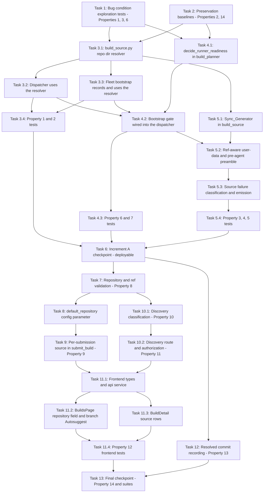

# Implementation Plan

## Overview

Two clearly separated increments. **Increment A is the unblocking work and
is deployable on its own**: repository-directory alignment (Req 5), the
ephemeral bootstrap completion gate (Req 6.1-6.4), and the minimum
ref-aware bootstrap so the runner obtains a tree that actually contains
`scripts/portal-build-agent.sh` (Req 4.1-4.4). After Increment A a build
submitted with an explicit ref runs end to end, which is what unblocks
testing. **Increment B** adds the operator-controlled default repository
(Req 1.5), per-submission repository + ref through the API and
`config_snapshot` (Req 1, 2.5-2.7), branch discovery (Req 3), the frontend
repository field and branch dropdown (Req 1.1-1.4, 2.1-2.4), and
resolved-commit recording (Req 4.5).

The three Increment A defects follow the observation-first bugfix pattern:
write the failing test on unfixed code, capture the preservation baseline on
unfixed code, then fix, then re-run both. Increment B is new behavior, so it
is plain property + example testing plus the same preservation suites.

## Task Dependency Graph

```json
{
  "waves": [
    { "wave": 1, "description": "INCREMENT A. Run on UNFIXED code: the three bug-condition exploration tests surface the path-mismatch, agent-unobtainable, and bootstrap-race counterexamples (task 1 FAILS - Properties 1, 3, 6) and the preservation baselines are captured (task 2 PASSES - Properties 2, 14). Independent of each other.", "tasks": ["1", "2"] },
    { "wave": 2, "description": "Pure foundations, no callers changed yet: the shared repository-directory resolver in the new build_source.py and the readiness decision in build_planner.py. Independent of each other.", "tasks": ["3.1", "4.1"] },
    { "wave": 3, "description": "Point the dispatcher and the fleet bootstrap at the one authoritative directory, and add the Sync_Generator to build_source.py.", "tasks": ["3.2", "3.3", "5.1"] },
    { "wave": 4, "description": "Wire the bootstrap completion gate into the dispatcher: the ephemeral marker/log, the readiness gate before SendCommand, bootstrap-stage failure, and runner release.", "tasks": ["4.2"] },
    { "wave": 5, "description": "Make the bootstrap ref-aware: Sync_Generator into both user-data paths and the pre-agent preamble, then the distinct source-failure classification and emission.", "tasks": ["5.2", "5.3"] },
    { "wave": 6, "description": "Property and unit tests for the three Increment A fixes.", "tasks": ["3.4", "4.3", "5.4"] },
    { "wave": 7, "description": "Increment A checkpoint: re-run the task 1 exploration tests (now PASS), the task 2 preservation baselines (still PASS), the dispatcher tick integration, and the full portal_builds suite with --noconftest. Increment A is deployable after this wave.", "tasks": ["6"] },
    { "wave": 8, "description": "INCREMENT B. Repository and ref validation/normalization in build_source.py - the containment boundary every later B task depends on (Property 8).", "tasks": ["7"] },
    { "wave": 9, "description": "The operator-controlled default_repository build-config parameter (which validates via task 7's normalizer) and the pure branch-discovery classification. Independent of each other.", "tasks": ["8", "10.1"] },
    { "wave": 10, "description": "Per-submission repository/ref through validation, submit_build, and config_snapshot; the authorized discovery route and its infrastructure wiring; resolved-commit recording. Independent of each other.", "tasks": ["9", "10.2", "12"] },
    { "wave": 11, "description": "Frontend types and api service for the new fields and the discovery call.", "tasks": ["11.1"] },
    { "wave": 12, "description": "Frontend surfaces: the repository field plus branch Autosuggest on BuildsPage and the source rows on BuildDetail.", "tasks": ["11.2", "11.3"] },
    { "wave": 13, "description": "Frontend property and unit tests for source selection (Property 12).", "tasks": ["11.4"] },
    { "wave": 14, "description": "Final checkpoint: the Property 14 differential against the pre-change oracle plus the full frontend and builds-related backend suites.", "tasks": ["13"] }
  ]
}
```



## Notes

**Increment A is the deliverable that unblocks testing.** It is
self-contained: Req 5 (directory alignment), Req 6.1-6.4 (bootstrap gate),
Req 4.1-4.4 (ref-aware bootstrap). Task 6 is its checkpoint. Increment B
adds no behavior Increment A depends on, so B can be sequenced later without
re-opening A.

**Test suite note**: the `portal_builds` suite under
`test/backend-test/portal_builds` must be run with **`--noconftest`**. Other
backend suites run normally from `edge-cv-portal/backend`.

**Deployment note**: portal deployment is intentionally NOT a task in this
plan. Deployments are separately approved and sequenced (steering: one build
at a time, no portal deploys during builds). No task here launches EC2
compute, sends a real SSM command, or starts a real build.

**Boundary note**: `.kiro/specs/build-fleet-execution-failures/` owns SSM
outcome reconciliation, execution diagnostics, runtime accounting, and the
`provisioning` stuck-job / orphaned-runner reconciliation. `build_dispatcher.py`
and `build_events.py` are edited by both specs — see design "Boundary with
build-fleet-execution-failures". Land Increment A first, then rebase that
spec's work onto it. Task 12 is deliberately a single additive field in
`build_events.apply_phase_event` to keep the merge trivial.

## Tasks

### Increment A — unblocking (deployable on its own)

- [x] 1. Write the bug condition exploration tests for the three blocking defects
  - **Property 1: Bug Condition** - Agent path equals the bootstrap clone directory
  - **Property 3: Bug Condition** - The runner obtains the selected source before the agent runs
  - **Property 6: Bug Condition** - Bootstrap completion gates the agent command
  - **CRITICAL**: These tests MUST FAIL on unfixed code - failure confirms the bugs exist
  - **DO NOT attempt to fix the tests or the code when they fail**
  - **NOTE**: These tests encode the expected behavior; they become the fix checks in task 6
  - **GOAL**: Confirm root causes 1 (bootstrap ordering), 2 (repo-directory mismatch), and 3 (no ephemeral readiness signal)
  - New file `test/backend-test/portal_builds/test_source_selection_exploration.py` (run with `--noconftest`):
    - **Path mismatch**: build a dedicated Build_Job plus the fleet-bootstrapped server record and assert the path prefix of `build_dispatcher.agent_command(...)` equals the directory `build_fleet.USER_DATA_TEMPLATE` clones into. Expect FAIL: `/opt/dda/DefectDetectionApplication` (`build_dispatcher.py:112-113`) versus `/home/ubuntu/DefectDetectionApplication` (`build_fleet.py:179`)
    - **Agent unobtainable**: create a temporary local git origin whose default branch omits `scripts/portal-build-agent.sh` while a feature branch contains it; run the bootstrap command text `build_dispatcher.runner_bootstrap_user_data()` generates, then attempt the agent invocation. Expect FAIL reproducing the observed class: `No such file or directory` (the live 127 from SSM `e9281bdc` / `d75f1ea2`)
    - **Bootstrap race**: drive `build_dispatcher.provision_ephemeral` (mocked SSM/EC2) over a provisioning job whose runner reports SSM Online while no `/var/log/dda-build-server-bootstrap.done` exists, and assert no agent SendCommand is issued. Expect FAIL: the command is sent on the first Online tick, reproducing the 21:36:59Z-command versus 21:38:54Z-bootstrap-finish race
  - Run the tests on UNFIXED code and document each counterexample verbatim in the test docstrings
  - **EXPECTED OUTCOME**: Tests FAIL (correct - it proves the three defects exist)
  - _Bug_Condition: isBugCondition(input) - pathMismatch, agentUnobtainable, bootstrapRace, from design_
  - _Requirements: 4.1, 4.2, 5.1, 5.4, 6.1, 6.2_

- [x] 2. Write the preservation baseline property tests (BEFORE implementing any fix)
  - **Property 2: Preservation** - Legacy dedicated servers need no re-bootstrap
  - **Property 14: Preservation** - Everything outside the selected source is unchanged
  - **IMPORTANT**: Follow observation-first methodology - record the oracle from UNFIXED code
  - New file `test/backend-test/portal_builds/test_source_selection_preservation.py` (`--noconftest`), recording on unfixed code:
    - The exact `POST /builds` request body, `201` response, and created Build_Job records for a no-selection submission (Req 7.1)
    - The `config_snapshot` key set and value types produced by `build_domain.create_build_jobs` (Req 7.5)
    - The stored-item attribute set for an ephemeral job with `server_id = None` - `server_id` omitted, `predecessor_job_id: None` retained (Req 7.3)
    - The `GET /builds`, `GET /builds/{id}`, `GET /builds/{id}/logs`, and cancel response shapes, pagination token, and ordering (Req 7.4)
    - The `portal-build-agent.sh` argument contract: exit 64 on missing/unknown arguments, exit 75 on a held lock, and the `building`/`succeeded`/`failed` detail field sets (Req 7.6)
    - Server records carrying no recorded repository directory (every server bootstrapped before this change) as the Property 2 input domain
  - Write these as `hypothesis` property tests over generated jobs, configs, and server records, asserting equality with the recorded oracle
  - Run on UNFIXED code
  - **EXPECTED OUTCOME**: Tests PASS (confirms the baseline behavior to preserve)
  - _Preservation: submit shape/201/one queued job per target, config_snapshot keys, None indexed-key omission, API shapes, agent contract, from design_
  - _Requirements: 5.3, 7.1, 7.3, 7.4, 7.5, 7.6_

- [x] 3. Align the repository directory on one authoritative value (design A1)

  - [x] 3.1 Create `edge-cv-portal/backend/functions/build_source.py` with the directory resolver
    - Pure module, no AWS clients, mirroring `build_domain.py` / `build_planner.py`
    - `DEFAULT_REPO_DIR = '/home/ubuntu/DefectDetectionApplication'` - the location `build_fleet.py`'s existing dedicated bootstrap already uses, so servers bootstrapped before this change keep working untouched
    - `resolve_repo_dir(job, server=None, env_default=None)`: the directory the bootstrap recorded for this server/runner, else the configured env override, else `DEFAULT_REPO_DIR`
    - `agent_script_path(repo_dir)` returning `f'{repo_dir}/scripts/portal-build-agent.sh'`
    - _Expected_Behavior: agentPathPrefix = bootstrapRepoDir, one authoritative value, from design_
    - _Requirements: 5.1, 5.2, 5.3, 5.4_

  - [x] 3.2 Point `edge-cv-portal/backend/functions/build_dispatcher.py` at the resolver
    - `BUILD_REPO_DIR` default becomes `build_source.DEFAULT_REPO_DIR` (the env override is retained; the deployed Lambda sets none)
    - `agent_command(job, repo_dir)` takes the resolved directory and builds its path via `build_source.agent_script_path` instead of reading the module constant
    - `verify_and_start_dedicated` resolves from the server record (`server['repo_dir']`), `provision_ephemeral` from the runner record (`job['runner']['repo_dir']`), each falling back through `resolve_repo_dir`
    - `runner_bootstrap_user_data` clones into the resolved directory, and provisioning records it on `job['runner']['repo_dir']`
    - Leave no independent `DefectDetectionApplication` directory literal in the module
    - _Bug_Condition: pathMismatch - agentPathPrefix != bootstrapRepoDir, from design_
    - _Requirements: 5.1, 5.2, 5.4_

  - [x] 3.3 Point `edge-cv-portal/backend/functions/build_fleet.py` at the resolver and record the directory
    - `USER_DATA_TEMPLATE` formats `{repo_dir}` from `build_source.DEFAULT_REPO_DIR` instead of hard-coding `/home/ubuntu/DefectDetectionApplication` (`build_fleet.py:179`)
    - The launch path writes `repo_dir` onto the Build_Server record so the dispatcher reads back the exact directory the bootstrap used
    - Leave no independent directory literal in the module
    - _Preservation: existing servers, which have no repo_dir, resolve to DEFAULT_REPO_DIR and need no re-bootstrap_
    - _Requirements: 5.2, 5.3_

  - [x] 3.4 Write the Property 1 and Property 2 tests
    - **Property 1**: `hypothesis` over generated jobs x server/runner records x configured directories - the agent command path prefix always equals the bootstrap clone directory
    - Structural assertion: no `DefectDetectionApplication` directory literal remains in `build_dispatcher.py` or `build_fleet.py` (Req 5.2 - the two cannot drift again)
    - **Property 2**: over server records with the field absent, `None`, or empty - resolution is `DEFAULT_REPO_DIR` and the dedicated dispatch path is otherwise identical to the task 2 oracle
    - Unit tests for `resolve_repo_dir` precedence (recorded, then env override, then default) and `agent_script_path`
    - _Requirements: 5.1, 5.2, 5.3, 5.4_

- [x] 4. Gate the agent command on bootstrap completion (design A2)

  - [x] 4.1 Add `decide_runner_readiness` to `edge-cv-portal/backend/functions/build_planner.py`
    - Pure decision returning READY / WAIT / TIMEOUT from the marker probe output plus elapsed time, alongside the module's existing tick decisions
    - READY when `/var/log/dda-build-server-bootstrap.done` is observed - **regardless of recorded inner-step failures**, since the live runner logged `Failed: sudo chmod 666 /var/run/docker.sock` and `Failed to set Python 3.11 as default` while still finishing successfully, and the readiness signal is authoritative
    - WAIT while the marker is absent at or below the budget; TIMEOUT on strict `now > deadline`, matching the existing watchdog boundary convention
    - Budget from a snapshotted `bootstrap_timeout_minutes` config value (default 20; the observed bootstrap took ~140 s), measured from `dispatched_at`
    - No sleep-based or fixed-interval branch: readiness is a function of the probe alone
    - _Expected_Behavior: agentSentOnlyAfterMarkerObserved; bootstrapExceededBudget implies failedWithStage('bootstrap'), from design_
    - _Requirements: 6.2, 6.3, 6.4_

  - [x] 4.2 Wire the gate into `edge-cv-portal/backend/functions/build_dispatcher.py`
    - `runner_bootstrap_user_data` mirrors the dedicated template: redirect output to `/var/log/dda-build-server-bootstrap.log` and `touch /var/log/dda-build-server-bootstrap.done` as the last statement
    - Add `BOOTSTRAP_PROBE_COMMANDS` (marker test plus log path echo) and run it through the existing `run_shell_sync` helper
    - `provision_ephemeral`'s gate becomes SSM Online **and** `decide_runner_readiness(...) == READY`; on READY record `bootstrap = {'marker_at': now, 'log_path': ...}` on the job before the SendCommand
    - On TIMEOUT: `fail_job` with a `BOOTSTRAP_TIMEOUT` error naming bootstrap as the failing stage and carrying the bootstrap log location, then terminate the runner through the existing `terminate_partial_compute` path
    - Dedicated servers run the same probe alongside the existing pgrep verification, but the marker is required only while the server is inside its bootstrap budget from launch; a server past that window with no marker proceeds with an advisory note recorded (keeps Req 5.3 and 7.1 intact for pre-existing and manually prepared servers)
    - Do NOT add SSM invocation reconciliation, orphan sweeping, or runtime accounting - those belong to `build-fleet-execution-failures`
    - _Bug_Condition: bootstrapRace - command sent while marker not observed, from design_
    - _Expected_Behavior: no agent command precedes an observed readiness signal; bounded budget; runner released on bootstrap failure_
    - _Requirements: 6.1, 6.2, 6.3, 6.4, 6.5_

  - [x] 4.3 Write the Property 6 and Property 7 tests
    - **Property 6**: `hypothesis` over generated probe-output/time sequences - no SendCommand in any tick before an observed marker; WAIT at `now == deadline` and TIMEOUT at `now > deadline`; marker-with-inner-failures yields READY with the log path recorded on the job
    - **Property 7**: over provisioning and bootstrap failure causes - every recorded failure is accompanied by a termination request for that job's compute in the same pass
    - Unit tests for `decide_runner_readiness` (marker present, absent at deadline, absent past deadline) and for the generated user-data containing the marker write as its last statement
    - _Requirements: 6.1, 6.2, 6.3, 6.4, 6.5_

- [x] 5. Make the bootstrap ref-aware (design A3)

  - [x] 5.1 Add the Sync_Generator to `edge-cv-portal/backend/functions/build_source.py`
    - `source_sync_commands(repo_url, repo_dir, source_ref)`: clone-if-absent, then exactly the semantics `scripts/portal-build-agent.sh:155-176` already implements - `git fetch --prune origin`, then `git checkout --force -B <ref> origin/<ref>` when `refs/remotes/origin/<ref>` verifies, else `git checkout --force <ref>`
    - Failure branches echo `PORTAL_SOURCE_SYNC_FAILED kind=<class> repository=<url> ref=<ref>` and exit 65 (repository unreachable) or 66 (ref not found) - never a bare 127
    - An empty `source_ref` yields the clone-only sequence, i.e. today's behavior
    - `bootstrap_commands(repo_url, repo_dir, source_ref)`: the sync commands plus `bash ./setup-build-server.sh` plus the marker write - the shared body of both user-data scripts
    - This is the single origin of all Source_Sync command text: no second, divergent sync mechanism
    - _Expected_Behavior: syncCommandsComeFromOneGenerator, from design_
    - _Requirements: 4.3_

  - [x] 5.2 Use the Sync_Generator in both user-data paths and as the pre-agent preamble
    - `build_dispatcher.runner_bootstrap_user_data(job)` builds its body from `bootstrap_commands(...)` with the job's selected repository and ref
    - `build_fleet.USER_DATA_TEMPLATE` builds its body from the same generator, so a dedicated server is bootstrapped at the selected ref too
    - `build_dispatcher.agent_command(job, repo_dir)` gains a pre-agent preamble of the same `source_sync_commands(...)`, so a dedicated server bootstrapped weeks ago on another ref still gets the selected source before the agent runs, and the agent script becomes obtainable even though it is absent from the repository default branch
    - The agent's own Step 2 then re-runs the identical sync, which is idempotent; do NOT modify the agent's sync block, argument contract, exit codes, or emissions
    - _Bug_Condition: agentUnobtainable - agent invoked from a tree that cannot contain it, from design_
    - _Expected_Behavior: sourceSyncedBeforeAgent for the selected (repository, ref)_
    - _Preservation: portal-build-agent.sh contract and phase emissions unchanged_
    - _Requirements: 4.1, 4.2, 4.3, 7.6_

  - [x] 5.3 Classify and surface source-sync failures
    - On a sync failure the preamble emits one `dda.portal.builds` / `BuildPhaseChange` event with `phase=failed`, `error_kind=source_sync`, `source_error=<ref_not_found|repository_unreachable>`, and a message naming both the repository and the ref, then exits with its dedicated code
    - Use a minimal inline `aws events put-events` call: the agent's `emit_event` helper cannot be reused because it lives in the tree the preamble is fetching. Keep the detail shape identical to the agent's `emit_failed`
    - Verify no `build_events.py` change is needed: `apply_phase_event` already takes the build-stage failure edge for a `phase=failed` event whose `error_kind` is not `publishing`
    - Do NOT add SSM invocation reads to classify this - that is `build-fleet-execution-failures` territory
    - _Bug_Condition: sourceUnobtainable surfacing as a bare exit 127, from design_
    - _Expected_Behavior: failure names repository and ref and is classified ref_not_found or repository_unreachable_
    - _Requirements: 4.4_

  - [x] 5.4 Write the Property 3, 4, and 5 tests
    - **Property 3**: `hypothesis` over generated `(repository, ref)` pairs - the sync command index is strictly less than the agent-invocation index in every generated sequence; plus the git-fixture integration case where only the non-default branch carries `scripts/portal-build-agent.sh` and the agent still runs
    - **Property 4**: the preamble's command list equals `source_sync_commands(...)` exactly; against a temporary git fixture, applying the preamble and then the agent's own sync leaves the same `HEAD` as the agent's sync alone (idempotence); agent argument permutations still behave as documented
    - **Property 5**: over the two failure classes x generated repository/ref values - the marker line, exit code, and message content are class-distinct and name both values, and the emitted detail shape matches the agent's `emit_failed`
    - Unit tests for `source_sync_commands`: branch case emits `checkout --force -B`, non-branch case emits `checkout --force`, empty ref emits clone-only, failure branches carry the marker plus exit 65/66
    - _Requirements: 4.1, 4.2, 4.3, 4.4_

- [x] 6. Increment A checkpoint (after this, Increment A is deployable)
  - **IMPORTANT**: Re-run the SAME tests from tasks 1 and 2 - do NOT write new tests for the fix or preservation checks
  - Run the task 1 exploration tests - **EXPECTED OUTCOME**: they now PASS (Properties 1, 3, 6 confirm the three defects are fixed)
  - Run the task 2 preservation baselines - **EXPECTED OUTCOME**: still PASS (Properties 2, 14 confirm no regression)
  - Extend `test/backend-test/portal_builds/test_dispatcher_tick_integration.py` with the ephemeral end-to-end sequence over mocked AWS: queued -> provisioning -> marker observed -> agent SendCommand carrying the resolved repository directory, repository, and ref; and the dedicated sequence: allocation -> pgrep verification -> readiness policy -> agent command against the recorded server directory
  - Run the full `portal_builds` suite with `--noconftest` and the builds-related backend suites; all must pass unchanged (Req 7.7)
  - Record which requirements are now satisfied end to end (Req 4.1-4.4, 5.1-5.4, 6.1-6.5) so the deployment decision has an explicit basis. Deployment itself is separately approved and is not a task here
  - _Requirements: 4.1, 4.2, 4.3, 4.4, 5.1, 5.2, 5.3, 5.4, 6.1, 6.2, 6.3, 6.4, 6.5, 7.7_

### Increment B — source selection surface

- [x] 7. Implement repository and ref validation/normalization in `build_source.py`
  - **Property 8: Expected Behavior** - Repository validation is total and containment-safe
  - `ALLOWED_REPOSITORY_HOSTS = ('github.com',)` as a module constant
  - `normalize_repository_url(value)` returning `(normalized_url, None)` or `(None, error)` where the error carries `rule` and `field`: accepts only `https`, an allowlisted host, and an `<owner>/<repo>` path (optional `.git`, optional trailing slash); rejects userinfo, ports, query strings, fragments, extra path segments, non-allowlisted hosts, and non-string input
  - `parse_owner_repo(normalized_url)` for building discovery URLs later - discovery must never use raw input
  - `normalize_source_ref(value)`: accepts branch names, tags, and 40-hex SHAs; rejects control characters, whitespace, a leading `-`, and `..`
  - Write the Property 8 test with `hypothesis` `st.text()` plus a hostile corpus: for every input the function is total (accept-with-normalized-form or reject-with-field-named-error), and every accepted value satisfies the normalized-form invariants
  - Unit tests: the DDA URL with and without `.git` and a trailing slash; `http://`, `git@`, userinfo, port, query, fragment, extra segment, other host, non-string; `main`, `feature/portal-build-fleet-and-workflow-gates`, `v1.2.3`, a 40-hex SHA, and each rejected ref form
  - _Requirements: 1.3, 1.4, 2.7, 3.5_

- [x] 8. Add the operator-controlled `default_repository` build-config parameter
  - `build_domain.DEFAULT_BUILD_CONFIG` gains `'default_repository': 'https://github.com/awslabs/DefectDetectionApplication'`; because `build_config.KNOWN_PARAMETERS = tuple(build_domain.DEFAULT_BUILD_CONFIG)` it becomes an operator-settable, audited parameter with no `build_config.py` change
  - `build_domain.validate_build_config` gains `RULE_CONFIG_REPOSITORY_INVALID`, delegating to `build_source.normalize_repository_url`
  - Collapse the duplicate parameter tables: point `build_jobs.DEFAULT_BUILD_CONFIG` (`build_jobs.py:103`) and `build_fleet.DEFAULT_BUILD_CONFIG` (`build_fleet.py:112`) at `build_domain.DEFAULT_BUILD_CONFIG` so the table has one definition. **This is a refactor inside the unblocking area - see design "Decisions worth reviewing" item 5**
  - Tests: `effective_build_config` returns the stored value when present and the documented default when absent or `None`; `PUT /build-config` accepts a valid repository and rejects an invalid one atomically with the existing envelope and one audit entry per applied change; `test_config_defaults_and_validation.py` and `test_config_snapshot_immutability.py` still pass
  - _Requirements: 1.5, 7.5_

- [x] 9. Carry the per-submission source through validation, `submit_build`, and `config_snapshot`
  - **Property 9: Expected Behavior** - Source_Selection snapshot fidelity
  - `build_domain.validate_build_request` accepts optional `repository` and `source_ref`, adding `RULE_REPOSITORY_INVALID` and `RULE_SOURCE_REF_INVALID`, each naming the offending field so the existing `BUILD_REQUEST_INVALID` envelope carries it and no Build_Job is created
  - `build_jobs.submit_build` resolves the pair after validation and extends the snapshot with additive keys only: `config['repository'] = normalized or config['default_repository']`, and `config['source_ref'] = submitted_ref` only when a ref was submitted (otherwise the configured value, `None` meaning the repository default branch)
  - `create_build_jobs` stays unchanged - it already deep-copies the snapshot per job
  - The `build_requested` audit details gain `repository` and `source_ref`
  - Write the Property 9 test with `hypothesis` over submissions x configs: snapshot values equal the resolved values; omitted fields fall back to config; tags and 40-hex SHAs survive unchanged; rejected submissions create zero jobs
  - _Requirements: 1.2, 1.3, 1.4, 1.6, 2.4, 2.5, 2.7_

- [x] 10. Implement branch discovery

  - [x] 10.1 Add `discover_branches` to `build_source.py`
    - **Property 10: Expected Behavior** - Discovery result classification
    - Injected-fetch pattern mirroring `vllm_fit_check._default_hf_fetch`, with `GITHUB_API_HOST`, a 5-second timeout, `per_page=100`, and a page cap of 3 with a `truncated` flag
    - URLs built only from `parse_owner_repo()` against the fixed API host, and no credentials sent (public GitHub, both the DDA repository and typical forks)
    - Distinct codes per condition: `REPOSITORY_NOT_FOUND` (404), `REPOSITORY_FORBIDDEN` (403 without rate-limit indication), `DISCOVERY_RATE_LIMITED` (403/429 with it), `DISCOVERY_TIMEOUT`, `DISCOVERY_UPSTREAM_ERROR` (5xx or malformed), `REPOSITORY_EMPTY` (reachable, no branches) - no failure is ever reported as a success with an empty list
    - Success identifies exactly one default branch
    - Write the Property 10 test over the upstream-outcome domain with an injected fetch, and extend the Property 8 test to assert every recorded outbound URL starts with `https://api.github.com/repos/<owner>/<repo>` derived from the parse
    - _Requirements: 3.1, 3.2, 3.3, 3.5_

  - [x] 10.2 Expose `GET /build-branches` with the builds read boundary
    - **Property 11: Expected Behavior** - Discovery authorization
    - Add `list_build_branches(event, context)` to `build_jobs.py` decorated with `@require_builds_read()`, routed from `handler` alongside the existing paths, using the module's existing `error_response` envelope helper so the surface matches the rest of the builds API
    - Register `api.root.addResource('build-branches')` with `GET` on `jobsIntegration` in `edge-cv-portal/infrastructure/lib/build-fleet-stack.ts`, next to `/builds`, `/build-servers`, and `/build-config` (the route-salt hash rolls the deployment automatically)
    - Validate and normalize the `repository` query parameter through `build_source.normalize_repository_url` before any outbound call; reject with the standard envelope naming the field
    - Write the Property 11 test over the role domain at the real handler/decorator boundary: 200 iff the role holds builds read, else the existing 403 envelope plus exactly one denial audit record. Do not mock or unwrap the decorator
    - _Requirements: 3.1, 3.3, 3.4, 3.5_

- [x] 11. Implement the frontend source selection surface

  - [x] 11.1 Extend the frontend types and api service
    - `frontend/src/pages/builds/types.ts`: `SubmitBuildRequest` gains optional `repository?: string` and `source_ref?: string`; add `BuildBranchesResponse { branches: string[]; default_branch: string; truncated: boolean }`; extend the `BuildJob` `config_snapshot` typing with optional `repository`, `source_ref`, and `source_commit`
    - `frontend/src/services/api.ts`: add `listBuildBranches(repository)` alongside `submitBuild`, and reuse the existing build-config read for the default repository
    - _Requirements: 1.1, 1.5, 2.1, 3.1_

  - [x] 11.2 Add the repository field and branch Autosuggest to `frontend/src/pages/builds/BuildsPage.tsx`
    - A `FormField` + `Input` for the repository, pre-filled from the effective build config's `default_repository`
    - An **`Autosuggest`** (not `Select`) for the branch so the discovered branches appear as a dropdown while a typed value is still accepted - required by both the manual-entry-on-failure case and non-branch refs
    - `statusType` carries loading and error states, with the message derived from the discovery error code; discovery re-runs, debounced, whenever the repository value settles
    - Discovery failure must never block submission
    - The submitted body includes `repository`/`source_ref` only when non-default and non-empty, so the zero-effort request body stays byte-identical to today's
    - _Requirements: 1.1, 1.2, 1.3, 1.4, 2.1, 2.2, 2.3, 2.4, 2.7_

  - [x] 11.3 Show the built source on `frontend/src/pages/builds/BuildDetail.tsx`
    - Add repository, ref, and resolved commit rows to the existing key-value pairs, with a placeholder for legacy jobs that lack them
    - _Requirements: 2.6_

  - [x] 11.4 Write the Property 12 frontend tests
    - **Property 12: Expected Behavior** - Frontend source selection behavior
    - `fast-check` over configured defaults, repository values, and the discovery-outcome domain (following `frontend/src/components/vllm-publish/publishState.gating.property.test.ts`): the field pre-fills from the configured default; the branch options come from discovery for the current repository and re-populate on change; exactly one of loading / actionable error / options is presented; submission remains possible with a manually entered ref when discovery fails
    - Unit tests: submit body omits the new fields when untouched; `BuildDetail` renders the source rows and the placeholder when absent
    - Run `npm test` in `edge-cv-portal/frontend`
    - _Requirements: 1.1, 1.2, 2.1, 2.2, 2.3, 2.6_

- [x] 12. Record the resolved commit SHA
  - **Property 13: Expected Behavior** - Resolved commit recording
  - `scripts/portal-build-agent.sh`: the `phase=building` event detail gains `"source_commit":"<git rev-parse HEAD>"`. Additive only - the argument contract, exit codes, and existing fields are untouched
  - `edge-cv-portal/backend/functions/build_events.py`: `apply_phase_event` copies a present `source_commit` into its updates and ignores its absence. **Keep this to the single additive field** - the same function is restructured by `build-fleet-execution-failures`, so a minimal change keeps the merge trivial
  - Write the Property 13 test over phase-event payloads with and without `source_commit`: persisted when present, and the record otherwise unchanged in every field (legacy agents keep working)
  - Run `test_completion_event_recording.py` and `test_build_events_idempotence_and_audit.py` unchanged
  - _Requirements: 4.5, 7.6_

- [x] 13. Final checkpoint
  - **Property 14: Preservation** - Everything outside the selected source is unchanged
  - **IMPORTANT**: Re-run the SAME preservation tests from task 2 - do not rewrite the oracle after seeing the changes
  - Run the Property 14 differential over generated no-selection submissions, roles, jobs, and list/detail/logs/cancel calls: identical request shape, `201`, one queued job per target, identical authorization outcome/envelope/audit structure, `server_id` still omitted for ephemeral jobs, identical response shapes/tokens/ordering, and `config_snapshot` differing from the oracle only by additive keys
  - Run the full `portal_builds` suite with `--noconftest`, the builds-related backend suites, and the frontend `npm test` suite; all must pass unchanged
  - **EXPECTED OUTCOME**: all preservation tests PASS and no builds behavior outside the selected source changed
  - _Requirements: 7.1, 7.2, 7.3, 7.4, 7.5, 7.6, 7.7_
