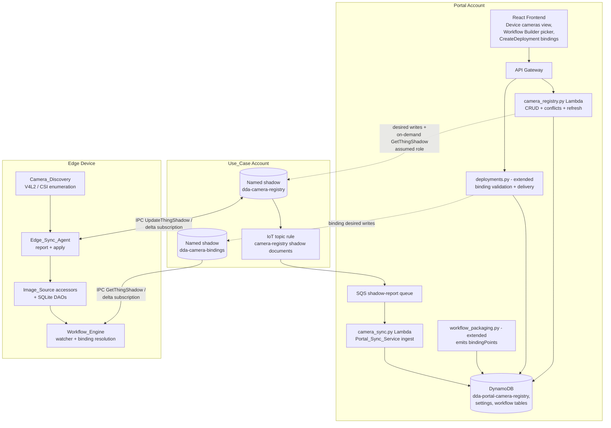
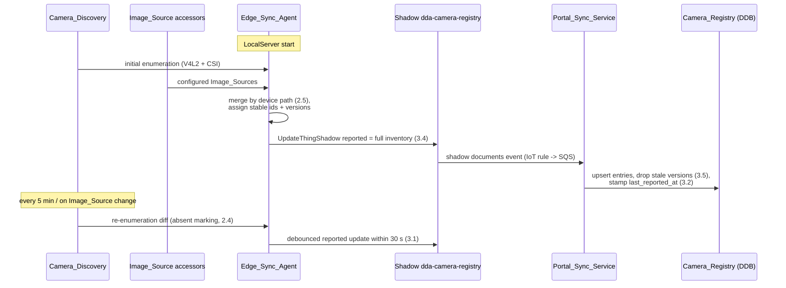
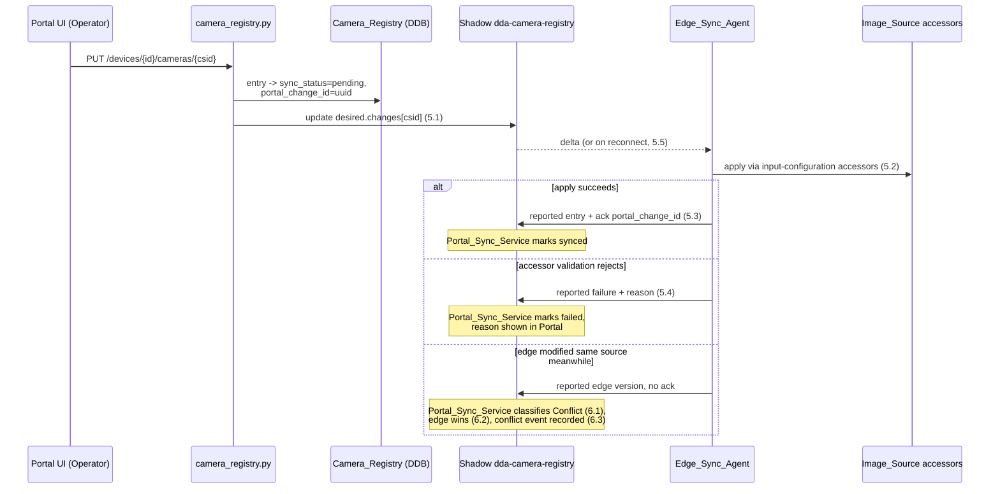
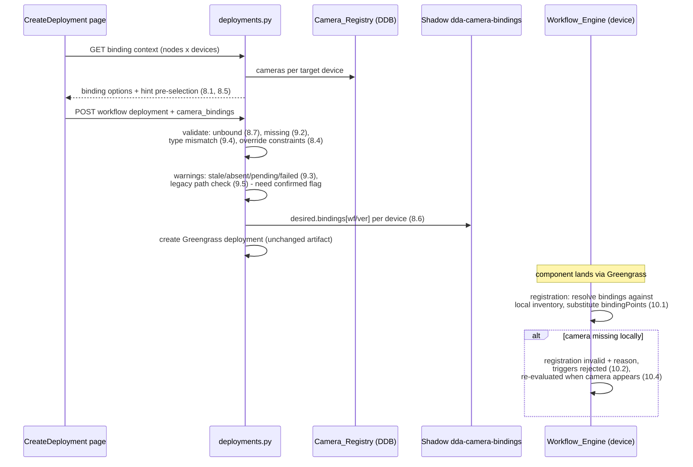

# Design Document: Camera Registry Sync

## Overview

This feature closes the visibility gap between the Portal and the edge devices' input sources. Today the DDA LocalServer owns all camera knowledge: Image_Source records in its SQLite configuration database (image_source / input_configuration DAOs), and physical capture hardware visible only to the device kernel. Portal-built workflows inline device paths blind — `workflow_packaging.py` renders `v4l2src device={device}` into `compiled_pipeline.json` at packaging time with no check that `/dev/video0` exists anywhere.

The design adds five cooperating pieces:

1. **Camera_Registry** — a Portal DynamoDB table holding, per Edge_Device, the set of Camera_Sources known for the device with sync metadata (Requirement 1).
2. **Camera_Discovery + Edge_Sync_Agent** — a LocalServer subsystem that enumerates physical capture hardware (V4L2 nodes, Jetson CSI sensors), merges the results with configured Image_Sources, and exchanges Camera_Source state with the Portal over a **named IoT device shadow** using the existing `IoTShadowAccessor` IPC pattern (Requirements 2, 3, 5, 6).
3. **Portal_Sync_Service** — a Lambda that ingests device shadow reports into the Camera_Registry, writes portal-originated changes into the shadow's desired state, and detects/records conflicts with edge-wins resolution (Requirements 3, 5, 6).
4. **Portal camera pickers** — the Workflow_Builder's `camera_source` device parameter becomes a camera reference picker (free-text fallback retained), and the deployment flow gains a per-device Camera_Binding step with validation (Requirements 7, 8, 9).
5. **Device-side binding resolution** — the Component_Packager emits *binding points* into `compiled_pipeline.json`; Camera_Bindings travel per-device in a second named shadow, and the Workflow_Engine resolves them against local inventory at registration time. Documents without binding points (everything packaged before this feature) register and run exactly as today (Requirements 10, 11).

### Key Design Decisions

| Decision | Choice | Rationale |
|----------|--------|-----------|
| Sync_Channel transport | Named IoT device shadow `dda-camera-registry` per thing: `reported` written by the Edge_Sync_Agent, `desired` written by the Portal_Sync_Service, delta drives edge apply | Matches the requirements' Sync_Channel definition and the existing `IoTShadowAccessor` IPC pattern (`dao/iotshadow/IoTShadowAccessor.py`, used by `WorkflowAccessor` and the pipeline shadow today). Shadow persistence gives offline queueing in both directions for free: a disconnected device's pending `desired` waits in the shadow (5.5), and the device republishing its full `reported` state on reconnect restores edge→portal sync (3.3) |
| Portal ingest of device reports | IoT topic rule on `$aws/things/+/shadow/name/dda-camera-registry/update/documents` routed to the Portal_Sync_Service Lambda (cross-account SQS destination in the portal account when the Use_Case runs in its own account, provisioned with the existing ComputeStack/use-case onboarding handlers); plus an on-demand pull (`GetThingShadow` via the existing `get_usecase_client` assumed-role pattern) behind a refresh endpoint | Event-driven keeps the registry near-real-time (3.2) without polling every device; the pull path covers rule misconfiguration and gives users an explicit "refresh now" |
| Camera_Binding delivery to devices | A second named shadow `dda-camera-bindings` per thing, desired state keyed `{workflowId}/{version}` → per-node bindings, written by the Portal at deployment submission | Requirement 8.6 forbids touching the packaged artifact, and Greengrass per-deployment configuration merge cannot express *per-device* values inside a thing-group deployment. A per-thing shadow is per-device by construction, persists for offline devices, and reuses the exact same accessor the LocalServer already has |
| Binding application on device | The Component_Packager adds an optional `bindingPoints` section to `compiled_pipeline.json` mapping each Camera_Input_Node's logical parameters to the rendered element arguments (or, on JP4/5, to the camera-adapter connection). The Workflow_Engine substitutes resolved values at registration time | The compiled document stays fully rendered and self-contained for the default (unbound) case, so old LocalServers ignore the new field and old documents lack it — backward compatibility (11.1, 11.5) falls out of "no `bindingPoints` ⇒ no resolution step" |
| Binding-required rule | Workflow versions packaged **with** `bindingPoints` require a binding or override per Camera_Input_Node per target device (8.7); versions packaged **before** this feature (no `bindingPoints` in the version item) skip the binding step and instead get the compiled-in-path comparison warning (9.5) | One crisp discriminator (presence of packager-recorded binding metadata on the version item) separates the new strict behavior from legacy leniency, so no existing deployment flow breaks (11.5) |
| Camera_Source identity | Edge-configured sources: `cfg-{imageSourceId}` (stable — the SQLite primary key). Discovered hardware: `disc-{sha1(bus_info + card_name)[:12]}` (stable across reboots and `/dev/videoN` renumbering, which V4L2 does not guarantee). When an Image_Source references a discovered device's path the two report as one Camera_Source under the configured id with merged capability metadata (2.5) | Stable ids are what Camera_Bindings reference; deriving the discovered id from V4L2 bus info instead of the device path survives USB re-enumeration |
| Conflict rule | Edge wins (6.2). The Portal_Sync_Service detects a conflict when an incoming edge report for a Camera_Source arrives while the registry entry has an unacknowledged portal-originated change (sync status `pending`) and the edge payload does not carry that change's `portal_change_id` acknowledgment | Deterministic, testable as a pure classification function; both versions are preserved in a conflict event so the operator can re-apply the portal edit (6.3, 6.4) |
| Camera_Discovery implementation | Direct V4L2 ioctls (`VIDIOC_QUERYCAP`, `VIDIOC_ENUM_FMT`, `VIDIOC_ENUM_FRAMESIZES`) over `/dev/video*` via `fcntl.ioctl` — no new binary dependency; CSI sensors identified by the V4L2 driver name (`tegra-video` family) on Jetson, which exposes CSI sensors as video nodes | LocalServer already ships without `v4l2-ctl` guarantees across JetPack versions; raw ioctls work identically on x86 and all Jetson images and return exactly the metadata Requirement 2.2 asks for |
| Registry storage | New DynamoDB table `dda-portal-camera-registry`, PK `device_id`, SK item-type-prefixed (`CAMERA#{id}`, `META`, `CONFLICT#{ts}#{id}`), GSI on `usecase_id` | Single-partition read serves the device detail view and the deployment binding picker; conflict events co-located with the device rows they annotate; follows the existing `dda-portal-*` table conventions |
| Staleness_Threshold | Portal settings table entry `camera_registry.staleness_threshold_hours` (default 24), editable by PortalAdmin through the existing settings API | The settings table already backs PortalAdmin-configurable values (e.g. Bedrock configuration) — no new mechanism (4.3) |

## Architecture

### System Context



### Edge→Portal report flow (Requirements 2, 3)



### Portal→Edge change flow with conflict handling (Requirements 5, 6)



### Deploy-time binding flow (Requirements 8, 9, 10)



## Components and Interfaces

### 1. Camera_Discovery (LocalServer, new module `src/backend/camera_discovery/`)

```python
class DiscoveredCamera:            # frozen dataclass
    stable_id: str                 # disc-{sha1(bus_info+card)[:12]}
    device_path: str               # /dev/video0
    card_name: str                 # from VIDIOC_QUERYCAP
    bus_info: str
    driver: str
    kind: str                      # "v4l2" | "csi"
    formats: list[dict]            # [{pixel_format, resolutions: [[w,h],...]}]

class CameraDiscovery:
    def enumerate(self) -> DiscoveryResult
        # DiscoveryResult: cameras: list[DiscoveredCamera],
        #                  failures: list[{device_path, error}]
    def start(self, interval_seconds=300, on_change=callback) -> None
    def stop(self) -> None
```

- `enumerate()` globs `/dev/video*`, opens each node read-only, and issues `VIDIOC_QUERYCAP` / `VIDIOC_ENUM_FMT` / `VIDIOC_ENUM_FRAMESIZES` ioctls. Nodes without the `VIDEO_CAPTURE` capability flag (metadata nodes, encoders) are skipped. A node whose driver is in the Tegra CSI driver set is reported with `kind="csi"` (2.1, 2.2).
- Per-node failures are captured into `failures` and enumeration continues (2.6). A total failure yields an empty result plus a logged error — never an exception into LocalServer startup (11.2).
- The periodic loop (default 300 s, configurable via the existing feature-configs mechanism, 2.3) diffs against the previous result and invokes `on_change` only when the inventory changed. Previously seen `stable_id`s missing from the new result are handed to the Edge_Sync_Agent as **absent**, never dropped (2.4).

### 2. Edge_Sync_Agent (LocalServer, new module `src/backend/camera_sync/`)

```python
class EdgeSyncAgent:
    def __init__(self, iot_shadow_accessor, image_source_accessor,
                 input_configuration_accessor, camera_discovery, db_session_factory)
    def start(self) -> None          # full report (3.4), subscribe to delta
    def stop(self) -> None
    def report_inventory(self) -> None   # debounced, <= 30 s after change (3.1)
    def on_delta(self, delta: dict) -> None   # apply portal changes (5.2)
    def build_inventory(self, image_sources, discovery_result) -> list[CameraSourceState]
```

- **Shadow name**: `dda-camera-registry`; thing name from `AWS_IOT_THING_NAME`, exactly like the pipeline shadow. All shadow I/O goes through the existing `IoTShadowAccessor` (IPC — device IoT identity and policies, 12.4); delta notifications arrive through the existing MQTT `SubscriptionHandler` pattern on `$aws/things/{thing}/shadow/name/dda-camera-registry/update/delta`.
- **`build_inventory` is a pure function**: it merges configured Image_Sources (via `ImageSourceAccessor`, read-only — 11.3) with the latest `DiscoveryResult`. An Image_Source whose resolved device path equals a discovered camera's path yields **one** entry: configured id, configured params, discovered capability metadata, origin `edge-configured` with `discovered: true` (2.5). Discovered-only hardware yields origin `edge-discovered`. Each entry carries the per-source `version` counter persisted in a small local state file (`/aws_dda/camera_sync_state.json`) and bumped whenever that source's content hash changes.
- **Report triggers**: LocalServer start (3.4), Image_Source CRUD (a post-commit hook in the accessors' code path — the accessors themselves are unchanged; the agent observes via the existing FastAPI route layer calling `agent.report_inventory()`), discovery `on_change`, and portal-change application. Reports are debounced to one shadow write per 5 s window, well inside the 30 s bound (3.1). Failed shadow writes (offline) are retried with backoff; because each report is the *complete current state*, the reconnect retry is automatically the catch-up publish (3.3).
- **Apply path** (`on_delta`): each `desired.changes[csid]` entry is applied through `InputConfigurationAccessor` / `ImageSourceAccessor` — schema validation, camera-manager side effects, and DIO handling all preserved (5.2, 11.3). Success reports the applied state with the change's `portal_change_id` echoed in an `ack` field (5.3); a `ValidationError`/`HTTPException` reports `{csid, status: "failed", reason}` (5.4). Changes targeting origin `edge-discovered` entries are refused with reason `discovery-managed` (defense in depth behind the portal-side rejection, 5.6). Applied or failed desired entries are cleared from `desired` by writing `null`, per standard shadow discipline.
- The agent runs on a daemon thread started from `server_setup.py`; any crash is logged and leaves the rest of LocalServer untouched (11.2). No migration: the agent only reads existing tables through accessors (11.4).

### 3. Sync_Channel message shapes (shadow `dda-camera-registry`)

```jsonc
// reported (Edge_Sync_Agent -> Portal), complete inventory every write
{
  "schemaVersion": 1,
  "reportedAt": 1730000000000,
  "cameras": {
    "cfg-a1b2": {
      "version": 7,
      "name": "Line 1 inspection cam",
      "type": "Camera",                  // ImageSourceType values + "V4L2Discovered"
      "origin": "edge-configured",       // | "edge-discovered" | "portal-created"
      "params": { "devicePath": "/dev/video0", "cameraId": "cam-1",
                  "gain": 4, "exposure": 5000000 },
      "capabilities": { "formats": [{ "pixelFormat": "YUYV",
                                      "resolutions": [[1920,1080],[1280,720]] }] },
      "absent": false,
      "ack": "pc-9f31..."                // portal_change_id just applied, else omitted
    },
    "disc-3fe9c0d21ab4": { "version": 2, "origin": "edge-discovered",
                            "absent": true, "absentSince": 1729990000000, ... }
  },
  "failures": { "cfg-c3d4": { "reason": "location is required when ...",
                              "portalChangeId": "pc-77aa..." } },
  "discoveryErrors": [ { "devicePath": "/dev/video3", "error": "ioctl EINVAL" } ]
}

// desired (Portal_Sync_Service -> Edge), sparse, cleared on ack
{
  "changes": {
    "cfg-a1b2":   { "op": "update", "portalChangeId": "pc-9f31...",
                    "baseVersion": 7, "name": "...", "type": "Camera", "params": {...} },
    "portal-new": { "op": "create", "portalChangeId": "pc-1c2d...", ... },
    "cfg-old":    { "op": "delete", "portalChangeId": "pc-8e0f...", "baseVersion": 3 }
  }
}
```

The document is capped well under the 8 KB shadow limit for realistic inventories (tens of sources); capability metadata is truncated to the top resolutions per format if a report would exceed 7 KB, with a `capabilitiesTruncated` flag.

### 4. Portal_Sync_Service (`camera_sync.py` Lambda)

Consumes the SQS queue fed by the per-use-case IoT rule (rule + cross-account queue policy provisioned by the existing use-case onboarding ComputeStack handlers). Core logic is a **pure reducer** applied per camera source, then persisted:

```python
def reduce_report(registry_entry: dict | None, incoming: dict, now_ms: int) -> SyncOutcome
# SyncOutcome: action = upsert | discard_stale | conflict
#   - discard_stale: incoming.version < registry_entry.version (3.5)
#   - conflict: registry_entry.sync_status == "pending" and
#               incoming.ack != registry_entry.portal_change_id and
#               incoming content differs from the pending portal content (6.1)
#               -> upsert edge state (edge wins, 6.2) + ConflictEvent (6.3)
#   - a reported deletion (source missing from a full report) while a portal
#     update is pending -> deletion wins + ConflictEvent (6.5)
#   - incoming.ack == portal_change_id -> upsert, sync_status = synced (5.3)
#   - incoming failure entry -> sync_status = failed + reason (5.4)
```

Every processed report also updates the device `META` item (`last_report_at`, clearing `never_synced`). Duplicate/out-of-order SQS delivery is safe because reduction is version-guarded and idempotent.

### 5. Camera_Registry API (`camera_registry.py` Lambda)

| Route | Permission | Behavior |
|---|---|---|
| `GET /devices/{device_id}/cameras` | Viewer (12.1, 1.3) | Registry entries + `META`; computes per-entry `stale` against the Staleness_Threshold (4.1) and attaches the IoT connectivity status from the existing device-status lookup (4.2). `never_synced` devices return `{state: "never-synced"}`, not an empty list (1.6) |
| `POST /devices/{device_id}/cameras` | Operator (12.2, 5.7) | Creates origin `portal-created` entry, `sync_status=pending`, writes shadow `desired` (5.1); audit event (12.3) |
| `PUT /devices/{device_id}/cameras/{csid}` | Operator | As above; rejects origin `edge-discovered` with `DISCOVERY_MANAGED` (5.6) |
| `DELETE /devices/{device_id}/cameras/{csid}` | Operator | Pending delete via shadow desired; rejects discovery-managed |
| `GET /devices/{device_id}/cameras/conflicts` | Viewer | Conflict events, newest first (6.3) |
| `POST /devices/{device_id}/cameras/conflicts/{cid}/reapply` | Operator | Re-issues the overridden portal version as a new pending change (6.4) |
| `POST /devices/{device_id}/cameras/refresh` | Viewer | On-demand `GetThingShadow` pull through `get_usecase_client`, runs the same reducer |

Authorization follows the existing pattern (`has_workflow_permission`-style checks against the device's `usecase_id`; out-of-scope requests get the standard 403, 1.5). All mutating routes call `log_audit_event` (12.3).

### 6. Workflow_Builder camera picker (frontend)

- `NodeConfigPanel` renders a **camera reference control** for the `camera_source` node's `device` parameter (keyed off node type + parameter name; no `workflow_core` schema change): a reference-device selector (devices of the current Use_Case), then a camera dropdown fed by `GET /devices/{id}/cameras`, each option showing name, type, path/URL, sync status, and staleness badge (7.1, 7.4).
- Selecting a camera populates the node's `device` (and gain/exposure when present in the source params) and stores a **binding hint** in the node data: `data.cameraBindingHint = { cameraSourceId, cameraName, sourceDeviceId }` (7.2). The hint is advisory metadata inside the workflow definition JSON — validator and compiler ignore unknown node data keys, so the workflow stays device-portable (7.5) and existing definitions are untouched (11.5).
- A "manual entry" toggle keeps the plain text input (7.3).

### 7. Component_Packager extension (`workflow_packaging.py`)

For each Camera_Input_Node (node whose type descriptor is `camera_source`, or a Custom_Node_Type declared camera-backed via a new optional `camera_backed: true` descriptor flag), the packager appends to `compiled_pipeline.json`:

```jsonc
"bindingPoints": [
  {
    "nodeId": "n1",
    "nodeType": "camera_source",
    "bindingHint": { "cameraSourceId": "cfg-a1b2" },     // from the definition, may be absent
    "parameters": { "device": "/dev/video0", "gain": 4, "exposure": 5000000 },
    "slots": [   // arch-specific: where resolved values land in THIS document
      { "param": "device", "segment": 0, "element": 0, "arg": "device" }
    ]
  }
]
```

- On x86_64 / x86_64_nvidia the slot points at the `v4l2src` `device` arg. On JP4/JP5 (appsrc fed by the camera adapter) `slots` is empty and the binding point instead carries `"adapterBinding": true` — resolution selects which local Image_Source/cameraId the executor's camera adapter connects to. On JP6 the binding selects the CSI sensor the capture host service stages from. The compiled elements keep their fully rendered default values, so an unbound document is byte-identical in behavior to today's output.
- The packager also records `has_binding_points: true` and the Camera_Input_Node list on the workflow **version item** in DynamoDB — the discriminator the Deployment_Service uses for the strict-vs-legacy rule.

### 8. Deployment_Service extension (`deployments.py` + `CreateDeployment.tsx`)

Request body addition to `create_workflow_deployment`:

```jsonc
"camera_bindings": {
  "<thing_name>": {
    "<node_id>": { "cameraSourceId": "cfg-a1b2" }
    // or       { "override": { "device": "/dev/video2", "gain": 8 } }
  }
},
"confirmed_warnings": ["<warning_id>", ...]
```

Validation pipeline (pure function `validate_camera_bindings(version_item, targets, registry_snapshot, bindings, confirmed) -> (errors, warnings)`), run pre-submit alongside the existing LocalServer/plugin gates:

- **Errors (reject)**: unbound Camera_Input_Node on any target when `has_binding_points` (8.7); referenced `cameraSourceId` not present in the target's registry (9.1, 9.2); Camera_Source type incompatible with the node type — e.g. `Folder` bound to `camera_source` (9.4); override values violating the node type's declared parameter constraints, checked with the existing `workflow_core` parameter validator (8.4).
- **Warnings (require matching `confirmed_warnings` ids)**: bound source is stale, absent, or sync status pending/failed (9.3); target device `never_synced` — bindings restricted to manual override (8.8); **legacy path check**: when `has_binding_points` is false, each compiled-in device path is compared against the target's registry and unmatched paths produce warnings only (9.5, 11.1).
- Distinct bindings per device for the same node are the natural shape of the map (8.3); workflows with no Camera_Input_Nodes skip the step entirely (8.9).
- On successful validation the Lambda writes `desired.bindings["{workflowId}/{version}"] = {nodeId: binding}` into each target thing's `dda-camera-bindings` shadow (assumed-role `iot-data` client), then creates the Greengrass deployment exactly as today — artifact untouched (8.6). Bindings are also stored on the workflow-deployment record for display and audit (12.3).
- `CreateDeployment.tsx` gains a binding matrix step (nodes × target devices) shown only when the selected workflow version has Camera_Input_Nodes, pre-selecting registry entries matching each node's `cameraBindingHint` (8.5), with per-cell manual-override entry and warning confirmation checkboxes.

### 9. Workflow_Engine binding resolution (LocalServer)

New module `src/backend/workflow_engine/camera_binding.py`:

```python
def resolve_bindings(document: dict, bindings: dict | None,
                     local_inventory: dict) -> ResolutionResult
# ResolutionResult: document (substituted copy), status: resolved | invalid,
#                   missing: [{nodeId, cameraSourceId}], adapter_assignments: {...}
```

- Pure over its inputs: for each `bindingPoints` entry with a binding, a `cameraSourceId` binding looks up the local inventory (Image_Source records + latest discovery result, same `build_inventory` ids) and substitutes the resolved parameter values into the declared `slots` (10.1); an `override` binding substitutes its values directly, constraint-checked against the vendored catalog descriptor (10.3). Documents without `bindingPoints`, or with no bindings supplied, are returned unchanged — the compiled-in values run as-is (10.5, 11.1).
- `WorkflowWatcher._register` calls a `CameraBindingStore` (reads the `dda-camera-bindings` shadow via `IoTShadowAccessor`, cached, refreshed on shadow delta) for `{workflow_id}/{version}`, then `resolve_bindings`. An unresolved `cameraSourceId` marks the registration `invalid` with reason `missing camera source {csid}` — the existing invalid-registration path already rejects triggers (10.2). The watcher re-runs resolution for invalid registrations on discovery `on_change` and bindings-shadow delta, flipping them to `registered` when everything resolves (10.4).
- JP4/5 adapter binding points produce `adapter_assignments` consumed by the executor when it connects the camera adapter to the appsrc.

## Data Models

### DynamoDB: `dda-portal-camera-registry`

| Item | PK `device_id` | SK | Attributes |
|---|---|---|---|
| Camera source | thing name | `CAMERA#{camera_source_id}` | `usecase_id`, `name`, `type` (`Camera`\|`Folder`\|`ICam`\|`NvidiaCSI`\|`RTSP`\|`V4L2Discovered`), `params` (map), `capabilities` (map), `origin` (`edge-configured`\|`edge-discovered`\|`portal-created`), `version` (N, monotonic), `last_reported_at` (N), `sync_status` (`synced`\|`pending`\|`failed`), `failure_reason?`, `portal_change_id?`, `pending_content?` (map), `absent` (BOOL), `absent_since?` (N) |
| Device meta | thing name | `META` | `usecase_id`, `last_report_at?` (N), `never_synced` (BOOL, default true) |
| Conflict event | thing name | `CONFLICT#{ts}#{uuid}` | `usecase_id`, `camera_source_id`, `edge_version` (map), `portal_version` (map), `resolution` (`edge-retained`\|`deletion-retained`), `created_at` (N), `reapplied_as?` |

GSI `usecase-index` on `usecase_id` for Use_Case-scoped listings and authorization checks (1.4, 1.5). Requirements 1.1/1.2 map directly onto the camera-source item shape.

### Workflow version item additions (existing workflow tables)

- `has_binding_points: bool` — set by the Component_Packager.
- `camera_input_nodes: [{node_id, node_type, binding_hint?, compiled_device_paths: {arch: path}}]` — the deployment flow's source of truth for the binding matrix and the legacy path check (9.5) without re-reading compiled documents from S3.

### Settings table addition

- `camera_registry.staleness_threshold_hours` (default `24`), PortalAdmin-editable through the existing settings route (4.3).

### Device-local state (LocalServer)

- `/aws_dda/camera_sync_state.json` — `{camera_source_id: {version, content_hash}}` plus the last discovery snapshot. Written atomically (temp file + rename). Loss of this file only resets version counters upward on next report (versions restart from `max(known)+1` using the shadow's current reported state as floor), never corrupts sync.
- **No SQLite schema change**: Image_Source and input-configuration tables are untouched; all reads/writes go through the existing accessors (11.3, 11.4).

### Camera_Binding shadow document (`dda-camera-bindings`)

```jsonc
{
  "desired": {
    "bindings": {
      "wf-123/3": {
        "n1": { "cameraSourceId": "cfg-a1b2" },
        "n2": { "override": { "device": "/dev/video2" } }
      }
    }
  }
}
```

Entries are keyed by `{workflowId}/{version}` so a revised deployment of a newer version simply adds its key; the Portal prunes keys for versions no longer deployed to the device when it writes.

## Correctness Properties

*A property is a characteristic or behavior that should hold true across all valid executions of a system — essentially, a formal statement about what the system should do. Properties serve as the bridge between human-readable specifications and machine-verifiable correctness guarantees.*

The sync reducer, inventory builder, discovery diff, deployment validation, and binding resolution are all pure functions by design, which makes them directly property-testable with generated inputs.

### Property 1: Sync reducer round trip with version guard

*For any* registry state and any incoming device report, processing the report through `reduce_report` yields registry entries that preserve every declared Camera_Source field (id, name, type, params, capabilities, origin, version, last-reported timestamp) and the device's `usecase_id`, entries not referenced by the report are unchanged, entries whose incoming version is lower than the recorded version are discarded leaving the recorded entry intact, and the device meta's last-report timestamp is stamped.

**Validates: Requirements 1.1, 1.2, 1.4, 3.2, 3.5**

### Property 2: Discovery enumeration completeness

*For any* set of fake capture devices presented to the enumeration layer, every device carrying the video-capture capability appears in the discovery result exactly once with its device path, card name, and format/resolution metadata propagated, and every resulting inventory entry not matching a configured Image_Source has origin `edge-discovered`.

**Validates: Requirements 2.1, 2.2**

### Property 3: Discovery failure isolation

*For any* set of fake capture devices and any subset chosen to fail enumeration, the discovery result contains every non-failing device, one failure record per failing device, and no exception escapes the enumeration call.

**Validates: Requirements 2.6**

### Property 4: Absence marking on re-enumeration

*For any* pair of consecutive discovery snapshots, every stable id present in the first and missing from the second appears in the diff output marked absent with an absence timestamp, and no id is ever removed from the tracked set by a diff.

**Validates: Requirements 2.4**

### Property 5: Configured/discovered merge

*For any* set of configured Image_Sources and any set of discovered cameras, `build_inventory` emits exactly one entry per path-matching configured/discovered pair — carrying the configured id and parameters combined with the discovered capability metadata — plus one entry per unmatched member of either set, and no device path appears in two entries.

**Validates: Requirements 2.5**

### Property 6: Reconnect publishes complete current state

*For any* sequence of local inventory changes interleaved with failing shadow writes, the first successful shadow write after the failures carries the complete current inventory (equal to `build_inventory` over the state at publish time), so no retained change is lost.

**Validates: Requirements 3.3**

### Property 7: Portal change apply/report round trip

*For any* portal-originated Camera_Source change, applying it through the Edge_Sync_Agent against a device database and reducing the resulting report in the Portal ends with: for schema-valid changes, the device-local state matching the change, the report acknowledging the `portal_change_id`, and the registry entry marked `synced` with the applied content; for schema-invalid changes, the device-local state unchanged and the registry entry marked `failed` with a non-empty reason.

**Validates: Requirements 5.2, 5.3, 5.4**

### Property 8: Conflict classification with edge-wins resolution

*For any* registry entry holding a pending portal change and any incoming edge report for the same Camera_Source that does not acknowledge that change, the reducer classifies a Conflict exactly when the edge content differs from the pending portal content; on every conflict the retained effective state equals the edge state (including edge deletion winning over portal modification), and the emitted conflict event contains both conflicting versions, the resolution applied, and a timestamp.

**Validates: Requirements 6.1, 6.2, 6.3, 6.5**

### Property 9: Portal mutation produces pending state and matching desired document

*For any* valid create, update, or delete of a Camera_Source through the portal API, the registry entry transitions to `pending` with a fresh `portal_change_id`, and the shadow desired document written for the device contains a change entry whose operation and content round-trip to the submitted mutation.

**Validates: Requirements 5.1**

### Property 10: Discovery-managed sources are immutable from the Portal

*For any* Camera_Source entry and any mutation operation (create-over, update, delete), the portal API rejects the mutation identifying the source as discovery-managed exactly when the entry's origin is `edge-discovered`, and accepts it (subject to other validation) for every other origin.

**Validates: Requirements 5.6**

### Property 11: Camera selection populates the node and records the hint

*For any* Camera_Source, applying it as the selection for a Camera_Input_Node yields node parameter values matching the source's parameters for every parameter the source provides, and a binding hint recording exactly that source's identifier.

**Validates: Requirements 7.2**

### Property 12: Binding hints are transparent to validation and compilation

*For any* valid workflow definition and any binding hints attached to its Camera_Input_Nodes, validating and compiling the hinted definition produces results equivalent to validating and compiling the same definition with the hints stripped.

**Validates: Requirements 7.5, 11.5**

### Property 13: Binding completeness validation

*For any* workflow version with binding points, any set of target devices, and any bindings map, deployment validation reports an unbound error identifying exactly the (Camera_Input_Node, Edge_Device) pairs missing from the map — including maps that bind the same node to different sources on different devices without error — and reports nothing for workflow versions containing no Camera_Input_Nodes.

**Validates: Requirements 8.3, 8.7, 8.9**

### Property 14: Binding existence validation

*For any* bindings map and any per-device registry snapshots, validation reports a missing-source error identifying the Camera_Source and Edge_Device exactly for those bindings whose referenced `cameraSourceId` is not present in that device's registry snapshot.

**Validates: Requirements 9.1, 9.2**

### Property 15: Degraded-source warnings gate submission on confirmation

*For any* binding whose referenced Camera_Source is stale, marked absent, or has sync status pending or failed, and for any target device that has never synced, validation emits a warning identifying the condition, and the deployment is accepted if and only if every emitted warning id appears in the submitted confirmations (with never-synced devices additionally restricted to manual overrides).

**Validates: Requirements 8.8, 9.3**

### Property 16: Type compatibility and override constraint validation

*For any* Camera_Binding, validation rejects it identifying a type mismatch exactly when the bound Camera_Source's type is outside the node type's compatible set, and accepts a manual override exactly when every override value satisfies the node type's declared parameter constraints (as judged by the existing `workflow_core` parameter validator).

**Validates: Requirements 8.4, 9.4**

### Property 17: Legacy compiled-path warning

*For any* workflow version without binding points carrying compiled-in device paths, and any target device registry, validation emits a warning for exactly those compiled-in paths that match no registered Camera_Source's device path on that device, and never emits an error for them.

**Validates: Requirements 9.5, 11.1**

### Property 18: Binding hint pre-selection

*For any* Camera_Input_Node hint and any device registry snapshot, the proposed pre-selection equals the registry entry whose id matches the hint when such an entry exists, and is empty otherwise.

**Validates: Requirements 8.5**

### Property 19: Binding delivery round trip

*For any* validated bindings map, the desired document written to each target device's bindings shadow, decoded back, equals the submitted bindings for that device and workflow version, and the packaged Workflow_Component artifact is not modified by the submission.

**Validates: Requirements 8.2, 8.6**

### Property 20: Device-side binding resolution

*For any* compiled document with binding points, any bindings, and any local inventory: bindings referencing a `cameraSourceId` present in the inventory substitute that source's parameter values into exactly the declared slots; override bindings substitute the override values regardless of inventory; and any binding referencing an id absent from the inventory yields status invalid with a reason identifying the missing Camera_Source, leaving the registration non-runnable.

**Validates: Requirements 10.1, 10.2, 10.3**

### Property 21: Registration re-evaluation on camera appearance

*For any* document and binding whose resolution is invalid against an inventory missing the referenced Camera_Source, re-resolving after adding that source to the inventory yields a resolved document, and re-evaluation flips the registration from invalid to registered.

**Validates: Requirements 10.4**

### Property 22: No-binding identity

*For any* compiled document — with or without binding points, including documents packaged before this feature — resolving with no bindings supplied returns the document unchanged, so execution uses exactly the compiled-in parameter values.

**Validates: Requirements 10.5, 11.1, 11.5**

## Error Handling

### Edge device

| Failure | Handling |
|---|---|
| Individual V4L2 node enumeration error (ioctl failure, permission) | Recorded in `discoveryErrors`, remaining nodes enumerated, loop continues (2.6) |
| Total discovery failure / missing `/dev/video*` | Empty discovery result, logged; configured Image_Sources still reported |
| Edge_Sync_Agent thread crash or IPC/shadow unavailability | Logged, retried with exponential backoff (cap 5 min); LocalServer pipelines and Workflow_Engine unaffected — the agent is a daemon thread with a top-level exception guard (11.2) |
| Shadow write rejected (size, throttle) | Capability metadata truncated (`capabilitiesTruncated`) and retried; oversize after truncation logs and drops capabilities only, never identity fields |
| Portal change fails accessor validation | `ValidationError`/`HTTPException` message captured verbatim into the failure report's `reason` (5.4); desired entry cleared so the delta does not re-fire |
| Portal change targets discovery-managed source | Refused with reason `discovery-managed` (defense in depth, 5.6) |
| Bindings shadow unreadable at registration | Registration proceeds only for documents without binding points; documents requiring bindings are marked invalid with reason `bindings unavailable` and re-evaluated on the next shadow delta or watcher sync (10.2, 10.4) |
| Local state file corrupt/missing | Version counters re-floored from the shadow's current reported state; full re-report published |

### Portal

| Failure | Handling |
|---|---|
| Malformed or unparseable shadow report in SQS | Message logged and dead-lettered (DLQ on the queue); one bad report never blocks others |
| Out-of-order / duplicate SQS delivery | Version-guarded idempotent reducer (Property 1) makes reprocessing safe |
| `GetThingShadow`/`UpdateThingShadow` assumed-role failure | 502 with the standard error envelope; registry state untouched; mutation not recorded as pending unless the desired write succeeded (write desired first, then mark pending — a desired write without a pending mark self-heals on the ack report) |
| Binding shadow write fails for one target mid-submission | Deployment not created; already-written targets' desired entries are pruned (best-effort) and the error identifies the failing device — no partial deployment |
| Registry read fails during deployment validation | Deployment rejected with `REGISTRY_UNAVAILABLE` rather than silently skipping validation |
| Unauthorized access | Standard 403 envelope + `unauthorized_access` audit event, matching existing handlers (1.5, 5.7, 12.1, 12.2) |

## Testing Strategy

The property-based tests target the pure cores called out above; example-based unit tests cover RBAC, API envelopes, UI interactions, and timing behavior; a small number of integration/smoke tests cover the transports that AWS owns.

### Property-based tests

- **Library**: Hypothesis (Python — reducer, inventory builder, discovery diff/merge, apply path against in-memory SQLite, deployment validation, binding resolution); fast-check (TypeScript — selection application, hint pre-selection where implemented in the frontend).
- **Configuration**: minimum 100 iterations per property (`max_examples=100` / `numRuns: 100`).
- **Traceability**: each property is implemented as a single property-based test tagged with a comment in the form
  `**Feature: camera-registry-sync, Property {number}: {property_text}**`.
- Generators produce: multi-source inventories with overlapping device paths, version sequences (including regressions), all origins and sync statuses, edge deletions, whitespace/unicode names, degenerate registries (empty, never-synced), documents with zero to many binding points across all architectures, and legacy documents lacking `bindingPoints`.

### Example-based unit tests

- RBAC matrix per route (Viewer read, Operator mutate, cross-use-case 403) — 1.3, 1.5, 5.7, 12.1, 12.2.
- Never-synced response shape (1.6); staleness boundary cases at exactly/just-past the threshold (4.1); disconnected-status pass-through (4.2); settings default (4.3); absent display fields (4.4).
- Debounce/report timing with a fake clock (3.1); startup full report (3.4); discovery interval configuration (2.3).
- Conflict re-apply endpoint (6.4); audit event payload per mutating route (12.3).
- Frontend component tests: picker population and display fields (7.1, 7.4), manual entry toggle (7.3), binding matrix rendering and warning confirmation flow (8.1).
- Agent failure isolation: a raising agent constructor/start does not propagate into server setup (11.2).

### Integration and smoke tests

- One integration test per direction over a real or emulated named shadow: reported ingest via the IoT rule path, desired delivery and delta receipt (5.5, 12.4).
- Smoke test: Edge_Sync_Agent started against a populated fixture SQLite database leaves every existing row byte-identical (11.4).
- Existing packaging tests (`test_workflow_generation.py` and packaging suite) extended with one snapshot assertion: packaging a camera workflow with the feature enabled produces the same rendered segments as before plus the `bindingPoints` section, and packaging a workflow without camera nodes is byte-identical to the pre-feature output.

### What is explicitly not property-tested

- Real V4L2/CSI hardware enumeration (integration on device), AWS shadow persistence semantics (5.5), IoT rule routing, and Greengrass delivery — these are external-service behaviors verified with single integration examples, per the testing decision guide.
