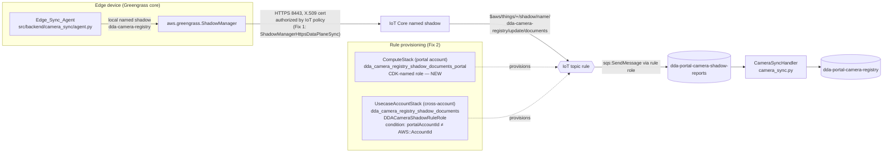
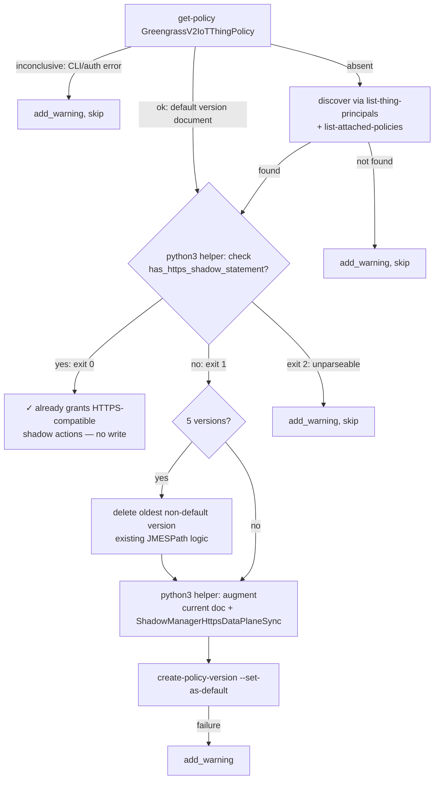

# Camera Shadow Sync Provisioning — Bugfix Design

## Overview

The portal showed `ryanorinagxdevkithomelabjp622` as "Never synced" with Cameras (0) and camera refresh failed with "Device has no camera registry shadow to refresh from", even though the edge Edge_Sync_Agent was writing the local `dda-camera-registry` named shadow correctly. Root-cause diagnosis (confirmed empirically on the device and in account 164152369890) found two independent provisioning gaps:

- **Gap 1 — device-side IoT policy (wrong authorization layer).** `aws.greengrass.ShadowManager` cloud sync calls the IoT data plane over HTTPS (port 8443) authenticated with the device X.509 certificate, so it is authorized by the certificate's IoT policy — never by the token-exchange IAM role. The certificate's `GreengrassV2IoTThingPolicy` granted the shadow actions only on `arn:aws:iot:*:*:thing/${iot:Connection.Thing.ThingName}`; thing policy variables resolve only on MQTT connections, so every `CloudUpdateSyncRequest` got `ForbiddenException` 403. `setup_station.sh` tried to fix this at the wrong layer twice: step 3.6 attaches a `ShadowManagerSyncPolicy` IAM policy to `GreengrassV2TokenExchangeRole` (never consulted by ShadowManager sync), and — the actual code-level culprit — the existing "Ensuring IoT thing policy allows shadow data-plane sync" block (~lines 1101–1195, right after Greengrass provisioning) both (a) writes a replacement policy version whose shadow statement uses the thing-policy-variable resource (HTTPS-incompatible), and (b) uses `grep -q "iot:UpdateThingShadow"` as its idempotency check, which the variable-scoped statement satisfies — so re-running setup can never repair a broken policy.

- **Gap 2 — cloud-side missing IoT topic rule in single-account deployments.** The `dda_camera_registry_shadow_documents` topic rule (forwarding `$aws/things/+/shadow/name/dda-camera-registry/update/documents` to the `dda-portal-camera-shadow-reports` SQS queue) exists only in `usecase-account-stack.ts`, which is deployed only for cross-account use-case onboarding. In the common single-account setup (portal account == use-case account) the rule was never created, so shadow reports never reached the ingest queue/Lambda. The analogous `dda_user_accounts_shadow_documents` rule is already provisioned in `compute-stack.ts` (`UserAccountsShadowRule`) — the pattern to mirror.

The live production fix was applied manually in account 164152369890 and verified end to end (IoT policy version 3 adding a `ShadowManagerHttpsDataPlaneSync` statement while preserving the original two statements; a hand-built `DDACameraShadowRuleRole` + `dda_camera_registry_shadow_documents` topic rule mirroring the UsecaseAccountStack definitions). This design covers the two durable repository fixes so fresh provisioning produces a working system, plus collision avoidance between the ComputeStack copy, the manually created resources, and a future UsecaseAccountStack deployment into the same account:

1. **Fix 1 — `station_install/setup_station.sh`**: repair the thing-policy ensure block to append an HTTPS-compatible `ShadowManagerHttpsDataPlaneSync` statement to the *current* default policy document (preserving all existing statements, exactly like the manual production fix) with a correct, property-tested idempotency predicate extracted into a new sibling helper `station_install/iot_policy_shadow_statement.py`; keep the step 3.6 IAM policy as harmless belt-and-braces but re-comment it accurately; rebaseline `test/backend-test/security/baselines/dependency_baseline_setup_station.txt` without weakening its test.

2. **Fix 2 — `edge-cv-portal/infrastructure/lib/compute-stack.ts`**: provision the camera shadow topic rule for the single-account case next to the queue it feeds, mirroring `UserAccountsShadowRule` — with a CDK-generated role name and the distinct rule name `dda_camera_registry_shadow_documents_portal` to avoid colliding with the manually created / UsecaseAccountStack fixed names. Guard the UsecaseAccountStack's `CameraRegistryShadowRule` + `DDACameraShadowRuleRole` with a deploy-time CloudFormation condition so they are only created when the use-case account differs from the portal account, and bump its `STACK_VERSION` to 1.6.0.

## Design Decisions

| # | Decision | Rationale |
|---|----------|-----------|
| D1 | Fix Gap 1 at the **existing thing-policy ensure block** (~lines 1101–1195, immediately after Greengrass provisioning), not by rewriting step 3.6 into IoT-policy provisioning | That block is where the defect lives (variable-scoped statement + `grep` false idempotency) and where the scaffolding already exists (inconclusive/absent check handling, 5-version pruning, `run_cmd`/`add_warning` conventions). Step 3.6 keeps its IAM `put-role-policy` untouched (see D8) with only its comment corrected. |
| D2 | **Append, don't replace**: create the new policy version from the *current* default document plus the `ShadowManagerHttpsDataPlaneSync` statement | Matches the verified manual production fix (version 3 = original two statements + the new statement). Replacement with a hardcoded document (current behavior) silently discards any statement the installer or an operator added, and violates Req 3.1 (the MQTT thing-policy-variable statement must be preserved, not replaced). |
| D3 | Extract the decision logic into a new **pure-Python helper `station_install/iot_policy_shadow_statement.py`** (stdlib-only, Python 3.6-compatible, `check`/`augment` CLI) invoked by the bash block | JSON statement analysis is not reliably expressible in bash/grep — that is exactly how the false idempotency bug happened. A pure module makes the predicate and the augmentation property-testable with Hypothesis (Testing Strategy) without any AWS calls. Python 3.6 compatibility because JP4 devices run Ubuntu 18.04's system python3. Sibling-file distribution follows the existing `./edge_manager_agent_config.json` precedent. |
| D4 | Policy identification: use the conventional name `GreengrassV2IoTThingPolicy` first, with **certificate-principal discovery as fallback** when that name is absent | The same script provisions the policy under that exact name (`--thing-policy-name GreengrassV2IoTThingPolicy` in the installer invocation, ~line 1094), so the conventional name is authoritative for stations set up by this script. The fallback (`aws iot list-thing-principals` → `aws iot list-attached-policies`) covers pre-provisioned devices; on discovery failure the step degrades to the existing `add_warning` path. |
| D5 | Keep the existing bash/JMESPath **5-version pruning** (delete oldest non-default version when at the limit) unchanged | It is already correct and in place; moving it into the Python helper would require reimplementing `list-policy-versions` parsing for no behavioral gain and would widen the diff. |
| D6 | ComputeStack copy uses a **CDK-generated IAM role name** (no `roleName`) and the **distinct rule name `dda_camera_registry_shadow_documents_portal`** | The fixed names `DDACameraShadowRuleRole` / `dda_camera_registry_shadow_documents` already exist in account 164152369890 (manual fix) and in usecase-account-stack.ts; a create with the same names would fail. Nothing depends on the rule *name* — only the SQL/topic matters (verified: no consumer references the rule name). IoT rule names must match `[a-zA-Z0-9_]+`, which the `_portal` suffix satisfies. The manually created resources are superseded and deleted per the Migration Note. |
| D7 | Guard the UsecaseAccountStack camera-shadow resources with a **deploy-time `CfnCondition`** (`Not(Equals(portalAccountId, AWS::AccountId))`), not a synth-time `if` | A synth-time guard (`portalAccountId !== Stack.of(this).account`) breaks the security preservation suite: `test_preservation_iam_cdk_synth.py` synthesizes `DDAPortalUseCaseAccountStack` with `portalAccountId=111111111111` **and** `CDK_DEFAULT_ACCOUNT=111111111111` (a same-account fixture), so the guard would strip the `SendCameraShadowReports` statement from the live synth and fail the statement-multiset identity check against `iam_baseline_DDAPortalUseCaseAccountStack.template.json` — repairable only by erasing that statement from the security baselines. The CfnCondition keeps every synthesized IAM statement byte-identical (baselines untouched, Req 3.7), evaluates correctly at deploy time regardless of whether the synth environment resolved the account, and still satisfies Req 2.5/3.3: created iff the accounts differ. |
| D8 | Keep the step 3.6 `ShadowManagerSyncPolicy` IAM inline policy; removal is **out of scope** | Minimal blast radius: the IAM grant is harmless belt-and-braces for SigV4 data-plane callers using the token-exchange role (it includes `iot:ListNamedShadowsForThing`, which the IoT-policy layer statement does not carry). Only its comment and failure-warning text are corrected — they currently claim camera sync depends on it, which is false. |
| D9 | Bump usecase-account-stack.ts `STACK_VERSION` 1.5.0 → **1.6.0** | Minor version per the file's own semver convention: new conditional behavior, no breaking change. |
| D10 | Rebaseline `dependency_baseline_setup_station.txt` to the fixed file; regenerate **both** `iam_baseline_EdgeCVPortalComputeStack.template.json` and `.unfixed.template.json` symmetrically | The setup-station golden pins the whole file, so any edit requires recapture (Req 3.8 — rebaselined, never weakened; the test file itself is untouched). The ComputeStack gains one new IAM policy statement (`SendCameraShadowReports`); the established repo practice (integration commits `2308311`, `bb2b9cc`) is to regenerate the fixed baseline from a live synth and mirror the identical new statements into the unfixed capture, keeping the recorded I1–I4 symmetric difference invariant so `test_baseline_drift_confined_to_I1_I4` and `test_synth_iam_statements_match_fixed_baseline` both stay green. `iam_baseline_cdk_i_changes.json` is never touched. |

## Glossary

- **Bug_Condition (C)**: per gap — a provisioned core device whose certificate's IoT policy lacks an HTTPS-compatible (non-policy-variable) allow for the three shadow actions (Gap 1); a single-account portal deployment with no `dda-camera-registry` shadow topic rule (Gap 2). See Bug Details.
- **Property (P)**: the desired behavior — station provisioning always yields a default IoT policy version carrying the HTTPS-compatible shadow statement (idempotently, preserving existing statements), and every ComputeStack deployment carries a camera-registry shadow topic rule delivering to the report queue without name collisions.
- **Preservation**: MQTT thing-policy-variable authorization, all other `setup_station.sh` steps, cross-account UsecaseAccountStack provisioning, `UserAccountsShadowRule`, the edge `camera_sync` code, the manual refresh route, and every existing test suite behave identically before and after the fix.
- **ShadowManager**: `aws.greengrass.ShadowManager` — the Greengrass component that syncs named shadows (`dda-camera-registry`, `dda-camera-bindings`, `dda-user-accounts`) between the device and IoT Core. Its cloud sync uses the IoT data plane over **HTTPS (8443) with the device X.509 certificate** — authorized by the certificate's IoT policy, not by IAM.
- **Thing policy variable**: `${iot:Connection.Thing.ThingName}` in an IoT policy resource. Resolves **only** on MQTT connections (where the connection carries a thing binding); over HTTPS it never resolves, so a statement scoped with it denies all HTTPS calls.
- **GreengrassV2IoTThingPolicy**: the IoT policy the Greengrass installer attaches to the device certificate; `setup_station.sh` passes this exact name via `--thing-policy-name` (~line 1094). The installer-created version grants `iot:Connect/Publish/Subscribe/Receive` + `greengrass:*` on `*`.
- **ShadowManagerHttpsDataPlaneSync**: the Sid of the new statement — `Allow` `iot:GetThingShadow`/`iot:UpdateThingShadow`/`iot:DeleteThingShadow` on `arn:aws:iot:*:*:thing/*` (no policy variables). Deployed manually as policy version 3 in account 164152369890 and verified end to end.
- **ShadowManagerSyncPolicy**: the step 3.6 IAM inline policy on `GreengrassV2TokenExchangeRole` (the wrong layer for ShadowManager sync; kept as belt-and-braces per D8).
- **Thing-policy ensure block**: the existing `setup_station.sh` section "Ensuring IoT thing policy allows shadow data-plane sync..." (~lines 1101–1195) — the Gap 1 fix site.
- **`iot_policy_shadow_statement.py`**: the new pure-Python helper in `station_install/` with `has_https_shadow_statement(doc)` (the idempotency predicate) and `augment(doc)` (statement append), plus a `check`/`augment` stdin/stdout CLI.
- **ComputeStack / UsecaseAccountStack**: `edge-cv-portal/infrastructure/lib/compute-stack.ts` (portal account; owns the `dda-portal-camera-shadow-reports` queue, DLQ, cross-account queue policy, and the `CameraSyncHandler` ingest Lambda) and `edge-cv-portal/infrastructure/lib/usecase-account-stack.ts` (cross-account onboarding; defines `CameraRegistryShadowRule` + `DDACameraShadowRuleRole` with fixed names).
- **`UserAccountsShadowRule`**: the existing ComputeStack IoT topic rule (`dda_user_accounts_shadow_documents`, compute-stack.ts ~line 1513) — the exact pattern the new ComputeStack rule mirrors (inline `iam.Role` + `iot.CfnTopicRule`, `topic(3) AS thing_name`, `useBase64: false`).
- **`camera_sync.py` / reduce_report**: the ingest Lambda consuming the report queue; its reducer is idempotent under duplicate delivery per the camera-registry-sync design — which makes temporary duplicate SQS deliveries during migration safe.
- **Setup-station golden**: `test/backend-test/security/baselines/dependency_baseline_setup_station.txt`, pinned byte-for-byte (except the requests-pin version token) by `test/backend-test/security/preservation/test_preservation_dependency_setup_station.py`.

## Bug Details

### Bug Condition — Gap 1 (IoT policy lacks an HTTPS-compatible shadow grant)

The bug manifests for any provisioned core device whose certificate IoT policy has no policy-variable-free allow of the three shadow actions covering the thing. `setup_station.sh` produces exactly such devices two ways: the thing-policy ensure block writes the variable-scoped statement itself, and its `grep -q "iot:UpdateThingShadow"` idempotency check reports "already granted" whenever *any* shadow statement exists — including the HTTPS-incompatible one — so a re-run never repairs it. Step 3.6's IAM policy is invisible to ShadowManager sync entirely (IAM simulation says allowed while the device gets 403).

**Formal Specification:**
```
FUNCTION isBugCondition_Gap1(X)
  INPUT: X of type ProvisionedCoreDevice
  OUTPUT: boolean

  // No HTTPS-compatible (non-thing-policy-variable) allow of the shadow
  // actions on the thing in the certificate's IoT policy default version
  RETURN NOT existsStatement(X.certIotPolicy.defaultVersionDocument,
    Effect = Allow
    AND actions ⊇ {iot:GetThingShadow, iot:UpdateThingShadow, iot:DeleteThingShadow}
    AND ∃ resource: resource covers X.thingArn AND resource contains no "${")
END FUNCTION
```

### Bug Condition — Gap 2 (no camera shadow topic rule in single-account deployments)

```
FUNCTION isBugCondition_Gap2(X)
  INPUT: X of type PortalDeployment
  OUTPUT: boolean

  // Single-account deployment where no UsecaseAccountStack exists
  RETURN X.portalAccountId = X.usecaseAccountId
    AND NOT cameraRegistryShadowTopicRuleExists(X)
END FUNCTION
```

A secondary manifestation (Req 1.5): once the rule exists in the account (manually created today, ComputeStack-provisioned after this fix), deploying UsecaseAccountStack into that same account fails on create because its `roleName: 'DDACameraShadowRuleRole'` and `ruleName: 'dda_camera_registry_shadow_documents'` are fixed names.

### Examples

- **Incident (Gap 1)**: `ryanorinagxdevkithomelabjp622` — greengrass.log shows every `CloudUpdateSyncRequest` failing `ForbiddenException` 403; reproduced with raw curl to `https://<ats-endpoint>:8443/things/.../shadow?name=dda-camera-registry` using the device certificate. IAM policy simulation on `GreengrassV2TokenExchangeRole` said *allowed* — confirming the wrong-layer diagnosis. Expected: HTTP 200 and the named shadow mirrored to IoT Core. The manual policy version 3 (original two statements + `ShadowManagerHttpsDataPlaneSync`) fixed it immediately.
- **False idempotency (Gap 1)**: run `setup_station.sh` twice on a device whose policy carries only the variable-scoped shadow statement — the ensure block prints "already grants shadow data-plane actions" both times and the 403s continue. Expected: the first run appends the HTTPS-compatible statement; the second run detects it and skips.
- **Incident (Gap 2)**: account 164152369890 (single-account portal): `aws iot list-topic-rules` showed no `dda_camera_registry_shadow_documents` while `dda_user_accounts_shadow_documents` existed (ComputeStack-provisioned); the `dda-portal-camera-shadow-reports` queue existed with zero traffic; the portal showed "Never synced". Creating the rule + role manually made ingest flow within seconds of the next shadow update. Expected: ComputeStack provisions the rule so this never needs manual repair.
- **Collision (Gap 2 / Req 1.5)**: after the manual fix, `cdk deploy DDAPortalUseCaseAccountStack` into 164152369890 would fail: `DDACameraShadowRuleRole` already exists (IAM roles are account-global) and the topic rule name is taken. Expected: the UsecaseAccountStack copies are simply not created when the target account *is* the portal account.
- **Edge case (not the bug)**: a genuine cross-account use-case account (account ≠ portal account) has no ComputeStack and needs the UsecaseAccountStack rule/role exactly as today — the guard must not remove them there (Req 3.3).
- **Edge case (not the bug)**: a device whose policy already carries the HTTPS statement (e.g. the production device on version 3) re-runs setup — no new policy version may be created (5-version limit exhaustion through repeated runs would itself be a defect).

## Expected Behavior

### Preservation Requirements

**Unchanged Behaviors:**

- MQTT shadow authorization keeps working through the existing thing-policy-variable statement: `augment` only *appends*; it never rewrites or removes existing statements (Req 3.1).
- Every other `setup_station.sh` step — users/groups, directories, Python/Docker/GStreamer installs, Greengrass download/provisioning (including the `--thing-policy-name GreengrassV2IoTThingPolicy` installer invocation), token-exchange role steps 1–3.5, step 3.6's actual `aws iam put-role-policy` command, step 4 verification, LFV/logging sections — is byte-identical (Req 3.2).
- Cross-account UsecaseAccountStack deployments (use-case account ≠ portal account) still create `CameraRegistryShadowRule` + `DDACameraShadowRuleRole` with the same names, SQL, and queue target, forwarding to the portal account's queue (Req 3.3) — the CfnCondition evaluates true there.
- `UserAccountsShadowRule`, the account-sync ack flow, and every other ComputeStack resource are untouched; the camera shadow report queue/DLQ/queue-policy/ingest Lambda definitions are unchanged — the new rule only *references* the existing queue construct (Req 3.4).
- No edge-side code changes: `src/backend/camera_sync/` is not touched (Req 3.5); the on-demand camera refresh route (`camera_registry.py`) is not touched (Req 3.6).
- Infrastructure jest suite (30 tests baseline, growing by the new assertions) and `npx tsc --noEmit` pass (Req 3.7).
- The setup-station security golden remains enforced: the golden *file* is recaptured to the fixed script; `test_preservation_dependency_setup_station.py` itself is byte-identical (Req 3.8).
- Portal backend tests, including `test_camera_shadow_sync_integration.py` (which documents the rule SQL — unchanged by design), pass (Req 3.9).

**Scope:**

All inputs that do NOT hit a bug condition are unaffected: devices whose IoT policy already carries an HTTPS-compatible shadow statement (no new policy version), MQTT-connected shadow operations, cross-account onboarding deployments, the user-accounts shadow pipeline, and the ingest/refresh backend code paths.

## Hypothesized Root Cause

Both root causes are CONFIRMED empirically (device logs, raw-curl reproduction, account inspection) and by code inspection; the exploration tests make each confirmation executable:

1. **Gap 1 — wrong resource shape written, wrong predicate checked.** The thing-policy ensure block (`setup_station.sh` ~lines 1101–1195) was added to fix shadow sync but embeds the HTTPS-incompatible resource `arn:aws:iot:*:*:thing/${iot:Connection.Thing.ThingName}` in its replacement document (single-quoted heredoc — the `${...}` is literal policy-variable text). ShadowManager's sync loop uses the cert-authenticated HTTPS data plane where that variable never resolves → 403. Its idempotency check (`echo "$policy_doc" | grep -q "iot:UpdateThingShadow"`) cannot distinguish an HTTPS-compatible grant from the variable-scoped one, so once any shadow statement exists the block permanently reports success. Step 3.6 compounds the confusion by "fixing" camera sync on the IAM layer (`GreengrassV2TokenExchangeRole`), which ShadowManager's cert-authenticated sync never consults.

2. **Gap 2 — the rule lives only in the cross-account onboarding stack.** camera-registry-sync placed `CameraRegistryShadowRule` in usecase-account-stack.ts (correct for cross-account: the rule must run in the account where the device shadows live) but never added the portal-account copy for the single-account topology — unlike portal-user-manager, which put `UserAccountsShadowRule` directly in compute-stack.ts. The queue, cross-account queue policy (which already admits the portal account itself via `aws:PrincipalAccount`), and ingest Lambda all exist in ComputeStack; only the rule is missing. The fixed names in usecase-account-stack.ts additionally guarantee a create-collision if it is ever deployed into an account that already has the rule/role.

## Correctness Properties

Property 1: Bug Condition — Gap 1: provisioning yields an HTTPS-compatible shadow grant

_For any_ IoT policy default-version document lacking an HTTPS-compatible shadow statement (isBugCondition_Gap1 — including the installer's MQTT-only document and documents whose only shadow statements are thing-policy-variable-scoped), the fixed ensure step SHALL create a new default policy version whose document contains every original statement unchanged and in order, plus the `ShadowManagerHttpsDataPlaneSync` statement (Effect Allow; Actions `iot:GetThingShadow`, `iot:UpdateThingShadow`, `iot:DeleteThingShadow`; Resource `arn:aws:iot:*:*:thing/*`; no policy variables) — so `has_https_shadow_statement` holds on the result and ShadowManager HTTPS sync is authorized.

**Validates: Requirements 2.1, 2.2, 2.3**

Property 2: Bug Condition — Gap 1: the ensure step is idempotent

_For any_ IoT policy document on which `has_https_shadow_statement` already holds (including the output of `augment` itself and the manually deployed production version-3 document), the fixed ensure step SHALL make no write (no new policy version, no pruning) — so repeated `setup_station.sh` runs are stable and never exhaust the 5-version limit.

**Validates: Requirements 2.1**

Property 3: Bug Condition — Gap 2: ComputeStack provisions the camera shadow topic rule

_For any_ synthesized ComputeStack template, there SHALL exist exactly one IoT topic rule whose SQL is exactly `SELECT *, topic(3) AS thing_name FROM '$aws/things/+/shadow/name/dda-camera-registry/update/documents'` with `awsIotSqlVersion` 2016-03-23, enabled, whose single action delivers to the `dda-portal-camera-shadow-reports` queue (`useBase64: false`) through a role assumable by `iot.amazonaws.com` whose policy allows `sqs:SendMessage` scoped to that queue's ARN — so a `dda-camera-registry` shadow documents event in a single-account deployment reaches the ingest Lambda without manual steps.

**Validates: Requirements 2.4, 2.6**

Property 4: Bug Condition — Gap 2: no fixed-name collisions between the two definitions

_For any_ synthesized ComputeStack template, the new rule role SHALL carry no fixed `RoleName` and the rule SHALL be named `dda_camera_registry_shadow_documents_portal` (≠ the usecase-account-stack fixed name); and _for any_ synthesized UsecaseAccountStack template, the `CameraRegistryShadowRule`, `DDACameraShadowRuleRole`, and its default policy SHALL each carry a CloudFormation condition equivalent to `Not(Equals(portalAccountId, AWS::AccountId))` — so the fixed-name resources are created exactly when the use-case account differs from the portal account and never collide with the ComputeStack (or manually created) copies.

**Validates: Requirements 2.5**

Property 5: Preservation — setup_station.sh outside the fix sites, and the golden

_For any_ device whose policy already satisfies the predicate (NOT isBugCondition_Gap1), the fixed provisioning SHALL perform the same writes as the original (none, for the ensure step); the fixed `setup_station.sh` SHALL be byte-identical to the original outside the thing-policy ensure block and the step 3.6 comment/warning text (in particular: the installer invocation, steps 1–3.5, step 3.6's `put-role-policy` command and policy document, and step 4 are unchanged, and the MQTT thing-policy-variable statement is never removed from any policy document the step writes); and the setup-station golden SHALL be recaptured to the fixed file with `test_preservation_dependency_setup_station.py` itself unchanged.

**Validates: Requirements 3.1, 3.2, 3.8**

Property 6: Preservation — infrastructure unchanged outside the additions

_For any_ cross-account UsecaseAccountStack synthesis (portalAccountId ≠ account), the fixed template SHALL contain the same `CameraRegistryShadowRule`/`DDACameraShadowRuleRole` resource properties (names, SQL, queue ARN/URL target, `SendCameraShadowReports` statement) as the original, differing only by the added condition wiring and the STACK_VERSION bump; the ComputeStack template SHALL be unchanged except for the added rule + role (in particular `UserAccountsShadowRule`, the camera shadow report queue/DLQ/queue policy, and `CameraSyncHandler` are byte-identical); and the infrastructure jest suite, `npx tsc --noEmit`, and the security IAM baseline tests (with the symmetric D10 regeneration) SHALL pass.

**Validates: Requirements 3.3, 3.4, 3.7**

Property 7: Preservation — edge and backend code untouched

_For any_ edge camera-sync operation or portal camera route invocation, behavior SHALL be identical: the fix changes no file under `src/backend/camera_sync/` and does not touch `camera_registry.py` (manual refresh) or `camera_sync.py` (ingest) — and the portal backend suites, including `test_camera_shadow_sync_integration.py`, SHALL pass unchanged.

**Validates: Requirements 3.5, 3.6, 3.9**

## Fix Implementation

### Architecture



Fix 1 decision flow inside `setup_station.sh`:



### Changes Required

#### 1. `station_install/iot_policy_shadow_statement.py` (NEW)

Pure-stdlib Python (compatible with Python 3.6 — JP4's system python3). No AWS SDK, no network: input is a policy document JSON, output is a decision or an augmented document.

```python
REQUIRED_ACTIONS = frozenset({
    "iot:GetThingShadow", "iot:UpdateThingShadow", "iot:DeleteThingShadow",
})

SHADOW_STATEMENT = {
    "Sid": "ShadowManagerHttpsDataPlaneSync",
    "Effect": "Allow",
    "Action": ["iot:GetThingShadow", "iot:UpdateThingShadow", "iot:DeleteThingShadow"],
    "Resource": "arn:aws:iot:*:*:thing/*",
}

def has_https_shadow_statement(doc): ...
def augment(doc): ...
```

Semantics (the property-tested contract):

- `_as_list(value)` — normalizes a string-or-list policy field to a list.
- An action entry *covers* a required action iff it equals the action, `"iot:*"`, or `"*"`.
- A resource is *HTTPS-compatible* iff it is a string containing no `"${"` (no policy variables) and either equals `"*"` or is an `arn:aws:iot:...` ARN whose final `:`-segment is exactly `"thing/*"` (deliberately conservative: prefix-scoped resources like `thing/dda-*` are treated as not satisfying the predicate; the worst case of a false negative is one extra appended statement, which then satisfies the predicate on every later run).
- `statement_grants_https_shadow(stmt)` — `Effect == "Allow"`, every `REQUIRED_ACTIONS` member covered by some action entry, and at least one HTTPS-compatible resource.
- `has_https_shadow_statement(doc)` — true iff any statement in the normalized `Statement` list satisfies the above. Deny statements are ignored (out of scope; documented).
- `augment(doc)` — deep copy; normalizes `Statement` to a list; if the predicate already holds, returns the copy unchanged (defensive idempotence); otherwise appends `SHADOW_STATEMENT`. All pre-existing statements and every other top-level key (`Version`, etc.) are preserved verbatim and in order.
- CLI: `python3 iot_policy_shadow_statement.py check` reads the document on stdin, exits 0 (statement present), 1 (absent), or 2 (unparseable JSON / malformed document); `... augment` reads stdin, writes the augmented document JSON to stdout, exits 0 or 2.

#### 2. `station_install/setup_station.sh` — thing-policy ensure block (~lines 1101–1195)

Within the existing block, keeping the `gg_policy_check` ok/inconclusive/absent scaffolding, `run_cmd`/`add_warning` conventions, and the version-pruning logic intact:

1. **Helper resolution**: `shadow_helper="$(dirname "$0")/iot_policy_shadow_statement.py"`; if missing, `add_warning` ("helper not found — cannot verify/repair the IoT policy shadow statement; ...") and skip the block's write path (same degradation shape as the existing `edge_manager_agent_config.json` sibling-file handling).
2. **Discovery fallback (D4)**: in the current `absent` branch, before warning, attempt `principal=$(aws iot list-thing-principals --thing-name "$thing_name" --query 'principals[0]' --output text)` then `discovered=$(aws iot list-attached-policies --target "$principal" --query 'policies[0].policyName' --output text)`; if a name is discovered, set `gg_thing_policy="$discovered"` and retry `get-policy`. Only if that also fails, emit the existing warning.
3. **Fetch the actual default version document**: replace the `--query policyDocument` shortcut with an explicit default-version read so the augmented document is built from what is really in force:
   ```bash
   default_version=$(aws iot get-policy --policy-name "$gg_thing_policy" --query defaultVersionId --output text)
   policy_doc=$(aws iot get-policy-version --policy-name "$gg_thing_policy" \
       --policy-version-id "$default_version" --query policyDocument --output text)
   ```
   (error handling folded into the existing `gg_policy_check` classification).
4. **Correct idempotency predicate**: replace `elif echo "$policy_doc" | grep -q "iot:UpdateThingShadow"; then` with:
   ```bash
   elif printf '%s' "$policy_doc" | python3 "$shadow_helper" check; then
       echo "✓ $gg_thing_policy already grants HTTPS-compatible shadow data-plane actions"
   ```
   A `check` exit code of 2 routes to `add_warning` (inconclusive), not to the write path.
5. **Append instead of replace**: delete the hardcoded `POLICY_EOF` heredoc; build the new version from the live document:
   ```bash
   shadow_policy_file=$(mktemp)
   if printf '%s' "$policy_doc" | python3 "$shadow_helper" augment > "$shadow_policy_file"; then
       # existing 5-version pruning runs here, unchanged
       if run_cmd "aws iot create-policy-version --policy-name $gg_thing_policy \
             --policy-document file://$shadow_policy_file --set-as-default"; then
           echo "✓ Added ShadowManagerHttpsDataPlaneSync statement to $gg_thing_policy (existing statements preserved)"
       else
           add_warning "Could not update $gg_thing_policy ... add iot:GetThingShadow/UpdateThingShadow/DeleteThingShadow on arn:aws:iot:*:*:thing/* (no policy variables) manually."
       fi
   else
       add_warning "Could not build augmented $gg_thing_policy document — repair the policy manually."
   fi
   rm -f "$shadow_policy_file"
   ```
6. **Comment rewrite**: the block's leading comment explains the HTTPS/MQTT authorization-layer distinction: ShadowManager cloud sync is HTTPS + device certificate → certificate IoT policy; thing policy variables never resolve over HTTPS; the appended statement is the HTTPS-compatible grant while the existing variable statement continues to serve MQTT connections.

#### 3. `station_install/setup_station.sh` — step 3.6 (~lines 1542–1574)

The `aws iam put-role-policy ... ShadowManagerSyncPolicy` command and its policy document are **byte-identical** (D8). Only the surrounding prose changes:

- The leading comment now reads (in substance): *"IAM-layer grant on the token exchange role for SigV4 data-plane callers (includes iot:ListNamedShadowsForThing, which the IoT-policy layer statement does not carry). NOTE: ShadowManager cloud sync does NOT use this role — it authenticates with the device certificate over HTTPS and is authorized by the certificate's IoT policy (see the 'Ensuring IoT thing policy allows shadow data-plane sync' step above). Kept as belt-and-braces."*
- The failure `add_warning` no longer claims camera registry sync depends on it; new text: *"Could not attach ShadowManager IAM shadow policy (belt-and-braces for SigV4 callers). ShadowManager HTTPS sync itself is authorized by the IoT thing policy step."*

#### 4. `test/backend-test/security/baselines/dependency_baseline_setup_station.txt`

Recaptured as an exact copy of the fixed `setup_station.sh` (the golden is the whole file). The F1 requests-pin line is untouched by this fix, so both pin assertions in `test_preservation_dependency_setup_station.py` keep passing; the test file itself is not modified (Req 3.8).

#### 5. `edge-cv-portal/infrastructure/lib/compute-stack.ts` — single-account camera shadow rule

Placed immediately after the `CameraSyncHandler` SQS event-source wiring (~line 1365, adjacent to the queue it feeds), mirroring `UserAccountsShadowRule`:

```typescript
// Portal-account IoT topic rule for the SINGLE-ACCOUNT topology (portal
// account == use-case account): forwards every dda-camera-registry shadow
// documents event to the shadow-report queue above. Cross-account use-case
// accounts get the equivalent rule from the UseCaseAccountStack instead
// (condition-gated there to the cross-account case). Deliberately distinct
// rule name and CDK-generated role name so this never collides with the
// fixed-name UseCaseAccountStack copies (or resources created manually
// before this fix existed — see the camera-shadow-sync-provisioning spec
// migration note).
const cameraShadowRuleRole = new iam.Role(this, 'CameraShadowRuleRole', {
  assumedBy: new iam.ServicePrincipal('iot.amazonaws.com'),
  description:
    'Role for the portal-account dda-camera-registry shadow IoT topic rule ' +
    'to deliver shadow documents events to the DDA Portal shadow-report queue',
});
cameraShadowRuleRole.addToPolicy(new iam.PolicyStatement({
  sid: 'SendCameraShadowReports',
  effect: iam.Effect.ALLOW,
  actions: ['sqs:SendMessage'],
  resources: [cameraShadowReportQueue.queueArn],
}));

new iot.CfnTopicRule(this, 'CameraRegistryShadowRule', {
  ruleName: 'dda_camera_registry_shadow_documents_portal',
  topicRulePayload: {
    // topic(3) is the thing name in $aws/things/{thing}/shadow/...
    sql: "SELECT *, topic(3) AS thing_name FROM '$aws/things/+/shadow/name/dda-camera-registry/update/documents'",
    awsIotSqlVersion: '2016-03-23',
    ruleDisabled: false,
    description:
      'Forward dda-camera-registry shadow documents events to the DDA ' +
      'Portal camera shadow-report queue (single-account topology)',
    actions: [
      {
        sqs: {
          queueUrl: cameraShadowReportQueue.queueUrl,
          roleArn: cameraShadowRuleRole.roleArn,
          useBase64: false,
        },
      },
    ],
  },
});
```

No queue, queue-policy, or Lambda changes: the existing queue policy already admits the portal account via `aws:PrincipalAccount` (it includes `cdk.Aws.ACCOUNT_ID`), and `camera_sync.py` already consumes the queue. The `iot` module is already imported (used by `UserAccountsShadowRule`).

#### 6. `edge-cv-portal/infrastructure/lib/usecase-account-stack.ts` — cross-account condition + version bump

- `STACK_VERSION`: `'1.5.0'` → `'1.6.0'` (D9).
- Immediately before the existing `cameraShadowRuleRole` definition (~line 792), define the condition; then attach it to the three camera-shadow resources (the L2 role's `CfnRole`, its `DefaultPolicy`'s `CfnPolicy`, and the L1 rule):

```typescript
// Only create the fixed-name camera-shadow rule/role when this use-case
// account is NOT the portal account. In the single-account topology the
// ComputeStack provisions the equivalent rule
// (dda_camera_registry_shadow_documents_portal), and creating these
// fixed-name copies there would collide. Deploy-time condition (not a
// synth-time if): keeps the synthesized IAM statements identical for the
// security preservation baselines and stays correct even when the synth
// environment does not resolve the account.
const cameraShadowCrossAccountCondition = new cdk.CfnCondition(
  this, 'CameraShadowCrossAccountCondition', {
    expression: cdk.Fn.conditionNot(
      cdk.Fn.conditionEquals(portalAccountId, cdk.Aws.ACCOUNT_ID)
    ),
  }
);

// ... existing cameraShadowRuleRole / addToPolicy / CfnTopicRule definitions,
//     properties unchanged ...

(cameraShadowRuleRole.node.defaultChild as iam.CfnRole)
  .cfnOptions.condition = cameraShadowCrossAccountCondition;
(cameraShadowRuleRole.node.findChild('DefaultPolicy').node.defaultChild as iam.CfnPolicy)
  .cfnOptions.condition = cameraShadowCrossAccountCondition;
cameraRegistryShadowRule.cfnOptions.condition = cameraShadowCrossAccountCondition;
```

(The `new iot.CfnTopicRule(...)` expression is assigned to a `const cameraRegistryShadowRule` to attach the condition; its properties are unchanged.) The `CameraShadowReportQueueArn` CfnOutput stays unconditional — its value is a plain derived string, not a resource reference. Note `portalAccountId` here is the already-computed `props.portalAccountId || cdk.Stack.of(this).account`; when the prop is omitted (same-account default) the condition compares the account to itself and correctly evaluates false.

#### 7. `edge-cv-portal/infrastructure/test/camera-shadow-sync-provisioning.test.ts` (NEW jest suite)

New file (leaving the existing 30-test files untouched), with its own `beforeAll` synth mirroring `camera-registry-infra.test.ts` (StorageStack + ComputeStack + a cross-account UseCaseAccountStack). Assertions in Testing Strategy.

#### 8. `test/backend-test/security/baselines/iam_baseline_EdgeCVPortalComputeStack.{template,unfixed.template}.json`

Regenerated per D10: fixed baseline recaptured from a live `cdk synth` of the fixed tree; the identical new resources/statements (the `CameraShadowRuleRole` role, its `DefaultPolicy` carrying the `SendCameraShadowReports` statement, and the topic rule) mirrored into the unfixed capture, so the statement-multiset symmetric difference between the two files remains exactly the recorded I1–I4 set. `iam_baseline_cdk_i_changes.json` and every security test file are untouched. The `DDAPortalUseCaseAccountStack` baselines need **no** change (D7: the condition does not alter any IAM statement).

#### 9. New tests under `test/backend-test/camera_shadow_sync/`

Exploration + property-based + preservation tests for the helper and the script; specified in Testing Strategy.

### Migration Note (account 164152369890)

After the first ComputeStack deploy containing this fix, the manually created resources are superseded and must be deleted:

```
aws iot delete-topic-rule --rule-name dda_camera_registry_shadow_documents
aws iam delete-role-policy --role-name DDACameraShadowRuleRole --policy-name SendCameraShadowReports
aws iam delete-role --role-name DDACameraShadowRuleRole
```

Deleting *after* the deploy leaves a window where both rules forward the same shadow events — safe, because the `camera_sync.py` reduce_report reducer is idempotent under duplicate delivery (camera-registry-sync design); deleting *before* the deploy avoids duplicates but leaves a (short) ingest gap. Either order is acceptable; after-deploy is recommended (no gap). The manually created IoT policy version 3 needs no migration: the fixed ensure step's predicate recognizes it and makes no write. This note also ships as the code comment on the ComputeStack rule (see change 5).

## Testing Strategy

### Validation Approach

Two-phase: first surface executable counterexamples demonstrating both gaps on UNFIXED code (confirming the root-cause analysis), then verify the fix (fix checking) and that everything outside the bug conditions is unchanged (preservation checking). Infrastructure properties are asserted with jest on synthesized CloudFormation templates; the `setup_station.sh` decision logic is property-tested through the extracted pure-Python helper with Hypothesis (no AWS calls anywhere in the tests).

### Exploratory Bug Condition Checking

**Goal**: Surface counterexamples that demonstrate the bug BEFORE implementing the fix. Confirm or refute the root cause analysis. If we refute, we will need to re-hypothesize.

**Test Plan**: Extract the artifacts the unfixed code produces (the heredoc policy document and grep predicate from `setup_station.sh`; synthesized templates from the unfixed CDK stacks) and assert the *expected correct* behavior — these tests fail on the unfixed tree, and the failures are the counterexamples.

**Test Cases** (`test/backend-test/camera_shadow_sync/test_gap1_exploration.py`, `edge-cv-portal/infrastructure/test/camera-shadow-sync-provisioning.test.ts` exploration describe):
1. **Heredoc statement is HTTPS-compatible**: parse the policy document embedded in the unfixed `setup_station.sh` thing-policy heredoc and assert its shadow statement has no `${` policy variable in its resource (will fail on unfixed code — resource is `arn:aws:iot:*:*:thing/${iot:Connection.Thing.ThingName}`)
2. **Idempotency predicate distinguishes the layers**: assert that the script's idempotency check does NOT report "already granted" for a document whose only shadow statement is variable-scoped — executable as: the unfixed check is `grep -q "iot:UpdateThingShadow"`, which returns true on that document (will fail on unfixed code; this is the false-idempotency counterexample)
3. **Step 3.6 targets the wrong layer**: assert `setup_station.sh` provisions the shadow grant on an IoT policy (an `aws iot create-policy-version` writing a variable-free shadow statement), not solely on `GreengrassV2TokenExchangeRole` (will fail on unfixed code)
4. **ComputeStack has the camera shadow rule**: synthesize ComputeStack and assert an `AWS::IoT::TopicRule` with the `dda-camera-registry` documents SQL exists (will fail on unfixed code — only `dda_user_accounts_shadow_documents` exists)
5. **UsecaseAccountStack fixed names are gated**: synthesize UseCaseAccountStack and assert the `DDACameraShadowRuleRole`/rule resources carry a cross-account condition (will fail on unfixed code — unconditional fixed names, the Req 1.5 collision)

**Expected Counterexamples**:
- The unfixed heredoc's shadow resource contains `${iot:Connection.Thing.ThingName}` — HTTPS sync 403s even after the block "fixes" the policy
- `grep -q "iot:UpdateThingShadow"` returns 0 on the variable-only document — re-runs never repair a broken policy
- The unfixed ComputeStack template contains exactly one IoT topic rule (`dda_user_accounts_shadow_documents`) and no camera-registry rule
- Possible causes if refuted: the installer version writes a different initial document shape; the rule exists under a different construct — neither observed

### Fix Checking

**Goal**: Verify that for all inputs where the bug condition holds, the fixed function produces the expected behavior.

**Pseudocode:**
```
// Gap 1 (setup_station.sh ensure step, via the extracted helper)
FOR ALL policyDoc WHERE isBugCondition_Gap1(policyDoc) DO
  result := augment(policyDoc)
  ASSERT has_https_shadow_statement(result)
  ASSERT result.Statement[0 .. n-1] = normalize(policyDoc.Statement)   // preserved, in order
  ASSERT result.Statement[n] = SHADOW_STATEMENT
END FOR

// Gap 2 (compute-stack.ts, via synthesized template)
FOR ALL X WHERE isBugCondition_Gap2(X) DO
  template := synth(ComputeStack')
  ASSERT exactlyOneTopicRule(template, sql = CAMERA_REGISTRY_DOCUMENTS_SQL)
  ASSERT ruleDeliversTo(template, cameraShadowReportQueue, useBase64 = false)
  ASSERT ruleRoleGrantsSendMessage(template, cameraShadowReportQueue)
  ASSERT noNameCollision(template, UsecaseAccountStack'(X))
END FOR
```

### Preservation Checking

**Goal**: Verify that for all inputs where the bug condition does NOT hold, the fixed function produces the same result as the original function.

**Pseudocode:**
```
FOR ALL input WHERE NOT isBugCondition_Gap1(input) AND NOT isBugCondition_Gap2(input) DO
  ASSERT F(input) = F'(input)
  // already-compliant policies: no new version; MQTT variable statement intact;
  // other setup_station.sh steps byte-identical; cross-account UsecaseAccountStack
  // rule/role properties identical; UserAccountsShadowRule untouched;
  // edge camera_sync code and refresh route untouched
END FOR
```

**Testing Approach**: Property-based testing is used for preservation of the policy-ensure logic because it generates arbitrary policy documents (statement counts, action shapes, string-vs-list fields, variable and non-variable resources) and gives strong guarantees the decision is a no-op exactly on the compliant set; template-level preservation uses jest equality on synthesized resources plus the security suite's existing statement-multiset machinery.

**Test Plan**: Observe behavior on UNFIXED code first (the golden already pins the unfixed `setup_station.sh`; the unfixed usecase template is pinned by `camera-registry-infra.test.ts` and the IAM baselines), then assert the fixed tree preserves it.

**Test Cases**:
1. **Compliant-policy no-op**: for any generated document on which `has_https_shadow_statement` holds (including the literal production version-3 document as a regression example), the ensure flow's decision is "skip" and `augment(doc) = doc` — no policy version is ever created
2. **MQTT statement preservation**: for any generated document containing the variable-scoped shadow statement, that statement appears verbatim in `augment`'s output
3. **Script-outside-the-fix preservation**: the fixed `setup_station.sh` still contains the byte-exact installer invocation (`--thing-policy-name GreengrassV2IoTThingPolicy ...`), step 3.5 ECR heredoc, step 3.6 `put-role-policy` command + `ShadowManagerCloudSync` policy document, and step 4 verification block (content anchors, not line numbers); the recaptured golden passes `test_preservation_dependency_setup_station.py` unchanged
4. **Cross-account usecase synth preservation**: jest — the `DDACameraShadowRuleRole` name, `SendCameraShadowReports` statement, rule name `dda_camera_registry_shadow_documents`, SQL, and queue ARN/URL in the usecase template equal their pre-fix values (the existing `camera-registry-infra.test.ts` assertions continue to pass verbatim)
5. **ComputeStack sibling preservation**: jest — `UserAccountsShadowRule` (name, SQL, target) and the camera shadow report queue/DLQ/queue-policy properties are unchanged; the security IAM baseline pair diffs only by the mirrored new statements (D10), keeping `test_baseline_drift_confined_to_I1_I4` green

### Unit Tests

- `iot_policy_shadow_statement.py` `check`/`augment` CLI: exit codes 0/1/2 on present/absent/garbage stdin; augment output is valid JSON parseable by `aws iot create-policy-version`
- Predicate examples: installer MQTT-only document → absent; variable-only shadow document → absent; production version-3 document → present; `iot:*` / `"*"` action wildcard documents → present; `Statement` as a single object (not list) → handled
- UsecaseAccountStack condition: expression is `Fn::Not[Fn::Equals[portalAccountId, Ref AWS::AccountId]]`; exactly the role, its default policy, and the topic rule carry it; `STACK_VERSION` output is 1.6.0
- ComputeStack rule role: `RoleName` property is absent (CDK-generated); rule name is `dda_camera_registry_shadow_documents_portal`

### Property-Based Tests

Hypothesis, in `test/backend-test/camera_shadow_sync/test_iot_policy_statement_properties.py`, over a generator of arbitrary policy documents (0–8 statements; actions as strings or lists drawn from shadow actions, wildcards, and unrelated actions; resources drawn from variable-scoped ARNs, `thing/*` ARNs, prefix ARNs, and `"*"`; optional Sids; `Statement` as list or single object):

- **Property 1/2 (fix + idempotency)**: `has_https_shadow_statement(augment(doc))` always; `augment(augment(doc)) == augment(doc)`; when the predicate holds on `doc`, `augment(doc) == normalize(doc)`; original statements always a preserved prefix; non-`Statement` keys unchanged
- **Property 1 (predicate soundness)**: documents where every shadow-action Allow statement has `${` in all its resources → predicate false; documents containing any variable-free `thing/*` (or `*`) Allow covering all three actions → predicate true
- **Property 5 (preservation)**: for documents containing the variable-scoped MQTT statement, it survives `augment` verbatim

Infrastructure properties (Properties 3, 4, 6) are checked by jest assertions on synthesized templates — the "for any synthesized template" quantification is discharged by synthesis determinism, matching the repo's established practice for CDK properties.

### Integration Tests

- Full jest suite (`npx jest` in `edge-cv-portal/infrastructure`) + `npx tsc --noEmit`: existing 30 tests plus the new suite pass
- Security preservation suite (`test/backend-test/security/`): setup-station golden and both IAM CDK-synth layers pass with the D10 rebaselines
- Portal backend suite including `test_camera_shadow_sync_integration.py` (rule SQL contract unchanged) passes
- On-hardware/live verification is already done for the production account (manual fix mirrored by this design); fresh-provisioning verification (run fixed `setup_station.sh` on a device, observe policy version created once, 200s in greengrass.log, portal camera sync) is operator-gated and documented in tasks rather than automated
