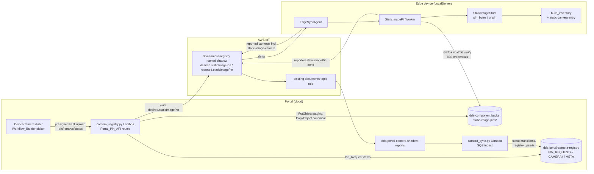

# Design Document: cloud-static-camera-provisioning

## Overview

This feature lets a Portal user pin, replace, and remove a device's Pinned_Image from the cloud. The device-side pin semantics are untouched: a cloud-initiated pin lands through the exact same `StaticImageStore.pin_bytes` / `unpin` primitives the Device_Pin_API uses (`src/backend/utils/static_image_camera.py`), so validation, atomic replacement, restart persistence, and enumeration-while-pinned are identical no matter where the pin originated.

The design reuses three existing pieces of infrastructure almost verbatim:

1. **Sync_Channel** — the existing `dda-camera-registry` named shadow (camera-registry-sync feature) gains two small single-slot document sections, `desired.staticImagePin` and `reported.staticImagePin`. No new named shadow, no ShadowManager `synchronize` config change, no new IoT topic rules, no cross-account stack updates (see Design Decision 1).
2. **Image_Transport** — the Portal component bucket (`dda-component-{region}-{account}`), which every onboarded device account's `GreengrassV2TokenExchangeRole` can already read (`s3:GetObject` on `arn:aws:s3:::dda-component-*/*` via `setup_station.sh`'s `GreengrassComponentS3Access` inline policy, plus the per-account bucket policy written at use-case onboarding by `usecases.update_component_bucket_policy_for_greengrass`). Images live under a new `static-image-pins/` prefix; the shadow carries only a reference plus a sha256 Content_Checksum (the `quick_setup.py` Setup_Bundle presigned-URL + `bundle_sha256` precedent, adapted to device-credentialed GETs).
3. **Portal persistence, RBAC, audit** — Pin_Requests are a new `PIN_REQUEST#` item type in the existing `dda-portal-camera-registry` table, and the new routes live in the existing `camera_registry.py` Lambda behind the same `VIEW_DEVICES` / `MANAGE_DEVICES` permissions and `log_audit_event` calls the Camera_Registry mutation routes use.

On the device, a new `StaticImagePinWorker` (a small sibling of the camera-sync apply path in `src/backend/camera_sync/`) consumes the shadow's `desired.staticImagePin` slot, downloads and checksum-verifies the image with the container's ambient TES credentials (the `workflow_engine/payload_fetch.py` boto3 pattern — `AWS_CONTAINER_CREDENTIALS_FULL_URI` is already passed into the flask-app container and boto3 is already installed by `install_edgemlsdk.sh`), applies it through the pin store, and echoes the desired fields back under `reported.staticImagePin` with the outcome.

One genuinely new device-side integration is required for Requirement 6: today `camera_sync/inventory.py:build_inventory` merges only configured Image_Sources and discovery snapshots, so the Static_Image_Camera never reaches the Camera_Registry. The inventory merge gains a virtual entry for the static camera (present exactly while a Pinned_Image exists), reported with origin `edge-discovered` so the existing discovery-managed mutation rejection, absence handling, Workflow_Builder picker, and Camera_Binding_Matrix flows apply with zero special-casing.

### What ships where

| Side | Change | Deploy mechanism |
|---|---|---|
| Portal backend | `camera_registry.py` routes, `camera_sync.py` ingest extension, new `PIN_REQUEST#` items | `deploy-portal.sh` / `deploy-infrastructure.sh` |
| Portal infra (CDK) | Routes in `CameraRegistryApiStack`, S3 prefix grant + imaging layer for the Camera_Registry Lambda, staging lifecycle rule | `deploy-infrastructure.sh` |
| Portal frontend | Static-image panel in `DeviceCamerasTab`, shortcut in the Workflow_Builder camera reference picker | `deploy-frontend.sh` |
| Device (LocalServer) | `StaticImagePinWorker`, `EdgeSyncAgent` delta routing + startup check, `build_inventory` static-camera entry, report-size headroom | Full JP5/JP6/JP7 component builds (sequential, per `.kiro/steering/builds.md`) + Greengrass deployment, then mandatory on-device verification |

**No preservation-tracked file is touched**: no recipe change (the recipes' ShadowManager `accessControl` uses `$aws/things/*/shadow/name/*` wildcards and the shadow name is unchanged anyway), no `docker-compose.yaml` change (credential env vars already pass through), no `requirements.txt` change (boto3 is already installed by `install_edgemlsdk.sh`), no Dockerfile change, no `setup_station.sh` change (the TES role's S3 policy already covers `dda-component-*/*`).

## Design Decisions

### Decision 1: Sync_Channel = the existing `dda-camera-registry` shadow, new single-slot sections

**Chosen**: two new top-level sections in the existing named shadow — `desired.staticImagePin` (written by the Portal, one slot, newest request replaces the previous wholesale) and `reported.staticImagePin` (written by the device, echoing the processed desired fields plus the outcome).

**Alternative considered — a new named shadow (`dda-static-image`)**: rejected on deployment cost. A new shadow would require (a) adding the name to `deployments.py`'s `PORTAL_SHADOW_NAMES` ShadowManager `synchronize` merge (and updating the contract-pinning suites `test_shadowmanager_sync_revision_*` / `test_deployment_shadow_manager.py`), (b) a **new IoT topic rule in both `ComputeStack` and `usecase-account-stack.ts`** to forward its documents events — the latter is deployed per use-case account, so every already-onboarded cross-account use case would need a stack update before confirmations could flow, and (c) new SQS wiring. Reusing the existing shadow gives us the whole device→portal confirmation pipeline (topic rule → `dda-portal-camera-shadow-reports` queue → `camera_sync.handler`) for free, in every already-onboarded account.

**Why single-slot desired implements newest-wins (Req 5.3, 5.4)**: the Portal always *replaces* `desired.staticImagePin` wholesale. A reconnecting device reads or receives exactly one desired pin — the newest — so superseded requests are structurally unobservable by the device. No queue, no ordering logic.

**Why the device echoes desired fields instead of clearing desired**: the camera-registry apply path clears processed `desired.changes` entries by writing `null`, which carries a small race (a newer portal write between apply and clear gets clobbered). For pins we avoid the race entirely: the device's confirmation writes `reported.staticImagePin` containing a verbatim echo of every field of the desired document it processed, plus outcome fields. IoT's delta computation then sees desired == reported (extra reported-only fields don't produce deltas) and stops re-delivering; when the Portal later writes a *different* desired document, the delta fires again. Desired is never cleared by the device, so a superseding write can never be lost.

> **Correction (found during on-device verification, jetson-thor1 / LocalServer.arm64JP7 1.0.23)**: the reasoning above missed that IoT's per-field delta computation cuts both ways — the echo doesn't just silence fully-processed requests, it also **starves later requests of any desired field equal to the previous echo's value**. A pin→pin replace shares `op` ("pin") and `bucket` with request 1's echo, so the delivered delta was partial ({requestId, requestedAtEpochMs, key, sha256, sizeBytes, format, fileName} — no `op`, no `bucket`); the worker read `op=''`, never confirmed, and the request hung `pending` forever. Two fixes ship: **(1)** the Portal's `write_desired_pin` clears `reported.staticImagePin` (null) in the *same* shadow update that replaces the desired slot, so the next delta always carries every desired field — safe because the device re-echoes on confirmation, the prior confirmation was already ingested through the documents event, and the ingest treats an absent reported section as a no-op; this mitigation works with already-deployed device builds. **(2)** the device worker tolerates partial documents: when `op` is missing, or `op=='pin'` with any of bucket/key/sha256 missing, it fetches the current full desired document via a shadow GET and uses it iff its requestId matches the delivery's (the GET returns the current single slot — definitionally the newest, so newest-wins is preserved); a failed GET or requestId mismatch is reported `failed` naming the incomplete delivery rather than hanging. The desired-never-cleared-by-the-device property and the supersede safety argument above are unaffected.

> **Second correction (found during the same on-device verification, jetson-thor1 / LocalServer.arm64JP7 1.0.23)**: shadow **updates MERGE nested maps** — a key omitted from an update persists in the shadow document; only an explicit `null` deletes it. Section 6's original removal contract ("when unpinned the entry is simply absent from the full report, so the existing absence handling applies") is therefore wrong on real hardware: after an applied removal, the device's next full inventory report omitted `static-image-camera` from `reported.cameras`, but the key **persisted in the shadow document**, every subsequent documents event still carried the stale entry, and the portal reducer kept upserting it as present — the registry entry never went absent (Req 6.2 violated). The emulated-shadow integration harness implemented the merge but the removal test faked a device that reported the entry explicitly absent, so the omission-based design was never exercised and passed silently (harness guard tests now pin the merge semantics). Two fixes ship: **(1) portal-side mitigation (live for deployed builds)** — when a remove confirmation transitions its Pin_Request to `applied`, the `camera_sync.py` ingest marks the `CAMERA#static-image-camera` registry entry absent with the confirmation timestamp (after the camera reduction, so it wins within the event) and best-effort writes `reported.cameras.static-image-camera: null` to the device shadow through the use-case iot-data client, so future events stop resurrecting the entry; reported deletions of the static camera absence-mark instead of deleting. **(2) device-side contract fix (rides the next component build — the correct contract per Req 6.2)** — after unpin, the device keeps reporting the static entry with `absent: true` and a stable `absentSince` (the discovered-camera absence pattern the reducer already consumes; see section 6 for the derivation), so the key never goes stale in the first place and re-pin restores it. Related caveat for future work: the same merge semantics apply to *any* key-omission-based removal over this shadow — edge-initiated deletions of configured Image_Sources rely on the same omission signal and are equally invisible to the portal until the key is explicitly nulled; that path is out of this feature's scope but shares the bug class.

**8 KB shadow budget**: the camera report is capped by the agent's truncation ladder at `MAX_REPORT_BYTES = 7168`. Adding the pin sections shares that budget, so:
- the device report cap is lowered to `6 * 1024` (6144 bytes), reserving ~2 KB of headroom for `desired.staticImagePin` + `reported.staticImagePin` + transient `desired.changes`;
- the Portal enforces a hard bound on the desired section it writes — the serialized `desired.staticImagePin` document must be ≤ 1024 bytes (file names are truncated to 128 characters for the echo; every other field is fixed-width) — comfortably satisfying Req 2.3/2.4's 8 KB document requirement with margin;
- the device's echo adds ≤ ~300 bytes over the desired fields.

### Decision 2: Image_Transport = component bucket + device-credentialed S3 GET + sha256

**Chosen**: image objects live in the Portal component bucket under `static-image-pins/{device_id}/{pin_request_id}`. The shadow reference carries `{bucket, key, sha256, sizeBytes, format, fileName}`. The device GETs the object with its ambient Greengrass TES credentials and verifies the sha256 before applying (Req 2.8).

**Why not presigned GET URLs in the shadow**: pending Pin_Requests must stay retrievable indefinitely while a device is offline (Req 5.1), but presigned URLs generated from Lambda role credentials expire with the session (hours). Device-credentialed GETs have no expiry and reuse the exact trust model of Greengrass component artifact downloads: the TES role identity policy (`GreengrassComponentS3Access`, already installed by `setup_station.sh`) plus the per-device-account bucket policy (already written at use-case onboarding). Requirement 2.7's enforcement point is therefore the bucket policy + IAM: retrieval requires the device account's TES role credentials; anonymous or portal-user access is rejected. (Scoping is at the device-*account* role level — the same granularity as component artifacts — not per-thing; this is the existing trust boundary and is called out here explicitly.)

**Why not a new bucket**: a new bucket would need a new bucket policy per already-onboarded device account (a re-onboarding touch) and a new `setup_station.sh` policy statement (preservation-tracked). The component bucket needs neither.

**Upload path**: API Gateway caps request bodies at 10 MB, but pins accept up to 50 MB, so upload uses the Portal's established presigned-PUT staging pattern (`data_management.get_upload_url`, `workflow_testing` multipart parts): the client requests an upload URL, PUTs the bytes to a staging key (`static-image-pins/staging/{uuid}`), then submits the pin referencing the staging key. On submission the Lambda downloads the staged object, validates it (size ≤ 50 MB, Pillow decode, format ∈ {JPEG, PNG, BMP} — mirroring `StaticImageStore` constants), computes the sha256, and server-side-copies it to the canonical per-request key. Copying after validation means no presigned URL can modify the bytes the device will fetch — any tampering is caught by the checksum anyway, but the canonical object is simply never writable by clients. A bucket lifecycle rule expires `static-image-pins/staging/` objects after 1 day (the `dda_labeling` preview-prefix precedent); canonical objects are deleted by the Portal when their Pin_Request leaves `pending` (applied/failed/superseded — Open Decision 4's default).

**Portal-side validation (Req 1.1)** uses Pillow via the existing imaging-layer convention (the `synthetic_data.py` Lambda already does lazy `from PIL import Image`); the CDK change attaches the same layer to the Camera_Registry Lambda and sizes its memory for a 50 MB decode (≥ 1024 MB). Pillow's default decompression-bomb guard stays enabled.

### Decision 3: Device-side agent = a new `StaticImagePinWorker` owned by `EdgeSyncAgent`

The pin-apply loop is a **new, separate worker class** (`src/backend/camera_sync/pin_worker.py`) rather than more branches inside `EdgeSyncAgent`: the agent's `on_delta` routes `state.staticImagePin` to the worker and keeps routing `state.changes` to the existing camera apply path, so the two flows share the shadow transport but nothing else. The worker runs its retrieval/apply cycle on its own daemon thread (downloads take up to 3 × 120 s and must not block camera-report scheduling).

**Idempotence (Req 3.5, 7.4)**: the worker persists an applied-marker JSON at `$COMPONENT_WORK_PATH/static_image_camera/applied_pin_request.json` — `{requestId, op, status, metadata, completedAtEpochMs}` — written atomically (same temp+`os.replace` discipline as the pin store) after each terminal outcome. On any delivery (delta, reconnect redelivery, startup shadow read) whose `requestId` matches the marker, the worker re-reports the recorded outcome without re-executing. The marker lives next to the pin store so it survives restarts with the same lifetime as the Pinned_Image itself.

**Apply primitives**: `get_store().pin_bytes(data, fileName)` for pin/replace (full existing validation + atomic replace, Req 3.1) and `get_store().unpin()` for removal; a removal against an already-unpinned store treats the store's "no image is pinned" error as success (Req 7.4 — removal converges to "no Pinned_Image" and confirms).

**Reconnect / startup (Req 5.2)**: `EdgeSyncAgent.start` already GETs the shadow (`_refresh_reported_versions`); the same read now also hands `desired.staticImagePin` (when it differs from the marker) to the worker, and shadow delta redelivery covers reconnection while running — comfortably inside the 60-second bound.

### Decision 4: Builds and rollout

The device-side change requires **new LocalServer component builds for every deployed target (JP5, JP6, JP7)** — run strictly sequentially with per-target logs, the security-preservation pre-flight, and the pre-build guard suite, per `.kiro/steering/builds.md`. Per the same steering, the feature is not "done" until the pin/replace/remove flows are verified end-to-end **on real hardware** for each affected arch. The portal side deploys with `deploy-infrastructure.sh` (never concurrently with a component build — cdk.out drift fails the build's security gate). Portal-first rollout is safe: pin submissions to devices running the old component simply stay `pending` (the desired section sits unconsumed) until the device receives the new component.

## Architecture



### End-to-end flows

**Pin (happy path)**
1. Operator requests an upload URL → Lambda returns a presigned PUT for `static-image-pins/staging/{uuid}` (15-minute TTL).
2. Client PUTs the image bytes.
3. Operator submits `POST .../static-image/pin {stagingKey, fileName}`. The Lambda resolves the device's Use_Case from the devices table (Req 8.5), authorizes `MANAGE_DEVICES`, downloads and validates the staged object (decode + format + 50 MB, Reqs 1.1/1.3/1.4), computes sha256, copies to `static-image-pins/{device_id}/{pin_request_id}` (Req 2.1: content stored before any shadow write), supersedes any pending Pin_Request (Req 5.3), writes the `PIN_REQUEST#` item as `pending`, then replaces `desired.staticImagePin`. Audit event logged (Req 8.4). Response: `{pinRequestId, deviceId, status: "pending"}` (Req 1.5).
4. On the device, the shadow delta hands the desired document to `StaticImagePinWorker`: marker check (idempotence) → S3 GET with 120 s bound → sha256 verify → `pin_bytes` → marker write → `reported.staticImagePin` echo with `status: "applied"` + metadata (Req 3.6) → `report_inventory()` so the camera inventory (now containing `static-image-camera`) publishes (Req 6.1).
5. The documents event reaches the SQS ingest; the extended handler routes `reported.staticImagePin` to the pin reducer, which transitions the `pending` item to `applied` and records the device metadata + timestamp (Req 4.2). The camera reducer independently upserts the `static-image-camera` registry entry from `reported.cameras`.

**Removal** — same shape with `op: "remove"`, no Image_Transport object, device applies `unpin()` (no-op success when nothing is pinned), confirms, and the next inventory report marks the registry entry absent through the existing deletion/absence path (Reqs 7.2–7.5, 6.2).

**Failure** — any device-side failure (all 3 retrieval attempts failed, checksum mismatch, decode/storage error) leaves the prior Pinned_Image untouched (the pin store already guarantees this) and reports `status: "failed"` with the reason; the ingest transitions the `pending` item to `failed` (Reqs 2.11, 3.4, 4.3, 5.5, 7.8).

**Offline device** — the desired slot persists in the shadow with no expiry (Req 5.1); each newer submission supersedes the previous item and replaces the slot; on reconnect the device observes only the newest (Req 5.4). Confirmations for superseded request ids fail the reducer's request-id guard and change nothing (Reqs 4.8, 5.6).

## Components and Interfaces

### 1. Portal_Pin_API routes (`edge-cv-portal/backend/functions/camera_registry.py`)

New routes registered in `CameraRegistryApiStack` under the imported `/devices/{id}` resource (route salt rolls a new API deployment automatically):

| Route | Permission | Purpose |
|---|---|---|
| `POST /devices/{id}/cameras/static-image/upload-url` | `MANAGE_DEVICES` | Presigned PUT + staging key (Req 1.1 upload path) |
| `POST /devices/{id}/cameras/static-image/pin` | `MANAGE_DEVICES` | Validate staged object, create pin Pin_Request (Reqs 1.1–1.9, 2.1–2.5, 5.3, 7.1) |
| `DELETE /devices/{id}/cameras/static-image/pin` | `MANAGE_DEVICES` | Create removal Pin_Request (Req 7.2) |
| `GET /devices/{id}/cameras/static-image` | `VIEW_DEVICES` | Provisioning status (Reqs 1.7, 1.10, 4.4–4.8, 5.7) |

Authorization deviates from the existing `authorize()` helper in one deliberate way: the Use_Case is resolved **only** from Portal-side records — the devices table (`camera_sync._resolve_usecase_id` pattern) first, the device's registry items second, never the caller's query parameter (Req 8.5). A device with no Portal record is rejected with 404 before any Pin_Request or shadow write (Reqs 1.8, 8.7). Denials log the standard `unauthorized_access` audit event with the attempted operation type (Reqs 8.2, 8.6); acceptances log `pin_static_image` / `remove_static_image` events through `log_audit_event` with the Pin_Request id (Req 8.4).

The status response:

```json
{
  "deviceId": "...",
  "usecaseId": "...",
  "latest": {
    "pinRequestId": "...", "op": "pin" | "remove",
    "status": "pending" | "applied" | "failed",
    "createdAt": 0, "completedAt": 0,
    "failureReason": "...",
    "deviceMetadata": {"width": 0, "height": 0, "format": "JPEG", "fileName": "..."}
  } | null,
  "connectivity": "connected" | "disconnected",
  "deviceReported": {"present": true, "absent": false, "absentSince": 0} | null,
  "history": [ {"pinRequestId": "...", "op": "...", "status": "superseded", "createdAt": 0}, ... ]
}
```

- `latest` is the most recent non-superseded state: superseded requests are excluded from the current state but retained in `history` (Req 5.7); `null` + an explicit `"noPinRequest": true` marker when the device has zero Pin_Requests (Reqs 1.10, 4.7).
- `connectivity` maps the existing `device_connectivity_status` Greengrass core-device lookup to exactly `connected` (HEALTHY) or `disconnected` (anything else), included while `latest.status == "pending"` (Req 4.5).
- `deviceReported` is derived from the `CAMERA#static-image-camera` registry entry — the device-report-driven record — and is presented as the current state even when it disagrees with `latest` (Reqs 4.6, 4.8).
- `deviceMetadata` appears when the most recent pin-type request is `applied` (Req 1.7).

### 2. Pin_Request lifecycle (portal side, pure core + persistence)

A small pure module (`pin_requests.py`, bundled into the same Lambda asset like `camera_sync.py`) holds the reducer and transition logic so it is unit/property-testable without AWS:

```python
def reduce_pin_confirmation(pin_item: Optional[dict], reported: dict, now_ms: int) -> PinOutcome:
    """reported.staticImagePin -> Pin_Request transition.

    - requestId not found or item not `pending` -> no-op (Reqs 4.1, 4.8, 5.6)
    - status "applied" on a pending item -> applied + device metadata + timestamp (Req 4.2)
    - status "failed"  on a pending item -> failed + reason + timestamp (Reqs 4.3)
    Idempotent under duplicate delivery: re-reducing an already-terminal item is a no-op.
    """
```

Persistence enforces the `pending -> {applied, failed, superseded}` single-transition rule with a DynamoDB `ConditionExpression` on `status = pending` (Req 4.1), so racing confirmations and supersedes cannot double-transition. On any terminal transition the canonical S3 object is deleted best-effort.

`camera_sync.py`'s SQS handler is extended minimally: `_parse_record` additionally extracts `reported.staticImagePin` (tolerant — absence means nothing to do; the camera path is untouched), and `_process_report` gains a call into the pin reducer. Because the documents event always carries the full current reported state, a pin confirmation write also re-reduces the camera sections — the existing reducer is idempotent by design, so this is a no-op re-application.

### 3. Sync_Channel document shapes

Written by the Portal (single slot, replaced wholesale — serialized size enforced ≤ 1024 bytes, Reqs 2.2–2.4):

```json
"desired": {
  "staticImagePin": {
    "requestId": "20250101T000000-ab12cd34",
    "op": "pin",
    "bucket": "dda-component-us-east-1-...",
    "key": "static-image-pins/{deviceId}/{requestId}",
    "sha256": "…64 hex chars…",
    "sizeBytes": 123456,
    "format": "JPEG",
    "fileName": "sample.jpg",
    "requestedAtEpochMs": 0
  }
}
```

(`op: "remove"` carries only `requestId`, `op`, `requestedAtEpochMs`.) `fileName` is truncated to 128 characters before writing; the original full name is preserved on the Pin_Request item.

Written by the device (verbatim echo of every desired field it processed, plus outcome — this equality is what silences the delta):

```json
"reported": {
  "staticImagePin": {
    "...all desired fields echoed verbatim...",
    "status": "applied" | "failed",
    "reason": "only when failed",
    "metadata": {"width": 0, "height": 0, "format": "JPEG", "fileName": "..."},
    "completedAtEpochMs": 0
  }
}
```

Shadow writes merge at the top level, so the agent's camera reports (`reported.cameras`, …) and the worker's pin section never clobber each other.

### 4. StaticImagePinWorker (`src/backend/camera_sync/pin_worker.py`)

```python
class StaticImagePinWorker:
    def __init__(self, iot_shadow_accessor, thing_name, shadow_name,
                 store_factory=get_store, s3_client_factory=None,
                 marker_path=None, clock=time.monotonic, sleep=time.sleep):
        ...

    def on_desired(self, desired: Mapping) -> None:
        """Queue the desired pin document (newest replaces any queued older
        one — the worker mirrors the single-slot semantics locally)."""

    def process_one(self, desired: Mapping) -> dict:
        """One full cycle: marker check -> (pin) retrieve+verify with the
        retry policy -> apply via the pin store -> marker write -> reported
        echo. Returns the reported document (pure-ish seam for tests)."""
```

- **Retry policy (Reqs 2.9–2.11)**: up to 3 attempts; each attempt bounded at 120 s (botocore connect/read timeouts + a wall-clock bound on the streamed read); ≥ 5 s sleep between attempts; sha256 computed over the streamed bytes and compared before any store call; a mismatch discards the bytes and counts as a failed attempt. After the third failure: no store call (prior Pinned_Image untouched), `status: "failed"` with a reason naming the final attempt's cause (`retrieval failure: …` or `checksum mismatch`).
- **Size guard**: the download aborts past `MAX_PIN_FILE_BYTES` (50 MB) — defense in depth; `pin_bytes` re-enforces it.
- **Apply (Reqs 3.1–3.3, 3.7)**: exactly `store.pin_bytes(data, fileName)` — no second code path, so decode validation, EXIF handling, atomic replacement, metadata, enumeration, and frame bytes are definitionally identical to a device-initiated pin. Removal calls `store.unpin()`, mapping the "no image is pinned" `StaticImagePinError` to a successful no-op confirmation (Req 7.4).
- **Confirmation ordering (Req 3.6)**: the reported echo is written only after `pin_bytes` returns (the store's `os.replace` makes the image available to frame grabs before that return) and after the marker write.
- **Inventory trigger**: after any terminal outcome the worker calls the agent's `report_inventory()` so the camera inventory change publishes promptly.
- All collaborators are injectable (the `EdgeSyncAgent` testing pattern): fake shadow accessor, fake S3 client, temp-dir store and marker, fake clock/sleep.

### 5. EdgeSyncAgent integration (`src/backend/camera_sync/agent.py`)

- `on_delta` gains one routing branch: `state.staticImagePin` → `pin_worker.on_desired(...)`; `state.changes` routing is unchanged.
- `start()`'s existing shadow GET additionally inspects `desired.staticImagePin` and hands it to the worker when its `requestId` differs from the marker (startup/reconnect catch-up, Req 5.2).
- `MAX_REPORT_BYTES` drops from `7 * 1024` to `6 * 1024` (Decision 1 headroom). The truncation ladder is untouched.
- `_load_inventory` appends the static-camera entry (next section).

### 6. Inventory entry for the Static_Image_Camera (`src/backend/camera_sync/inventory.py`)

`build_inventory` gains an optional `static_image_pinned: bool` input (the agent passes `get_store().is_pinned()`); when true, the merge appends:

```python
CameraSourceState(
    camera_source_id="static-image-camera",        # the fixed id (Req 6.1)
    name="Static Image Camera",
    type="StaticImage",
    origin=ORIGIN_EDGE_DISCOVERED,                  # discovery-managed (Req 6.5)
    params={},
    capabilities={"staticImage": {**identity, **pin_metadata}},
    discovered=True,
)
```

- Origin `edge-discovered` makes the Portal's existing `discovery_managed_rejection` cover generic mutation attempts (Req 6.5) and the device-side apply path's `disc-`/`cfg-` prefix guard is extended to also treat the literal `static-image-camera` id as discovery-managed (defense in depth).
- **Unpinned = explicitly ABSENT, never merely omitted** (corrected after the second on-device finding, see the Decision 1 correction below): once the camera has ever been reported, an unpinned store yields exactly one absent entry — same fixed identity/type/origin, `absent: true`, a stable `absentSince` — exactly the absence pattern discovered physical cameras use, which the Portal reducer already consumes (Req 6.2); the next pinned report restores it to present (Req 6.1 "restoring to present"). A never-reported camera yields no entry. `build_inventory` takes this as an optional `static_image_absent_since: Optional[int]`; the agent derives it in `_load_inventory`: "previously reported" is answered by the version state store (persisted on every successful report, so it tracks entries first reported at runtime) OR the start-time shadow reported-versions floor (which survives state-file loss) — the two cover each other's failure modes. The timestamp is derived once per absence episode and cached so it never churns between reports (churn would version-bump every report): the pin worker marker's `completedAtEpochMs` when the marker records an applied `remove` (cloud-initiated removal — the exact removal instant, restart-stable), else the wall clock at the first absent observation; at start an already-absent shadow entry's `absentSince` re-seeds the cache so restarts don't invent new timestamps. ~~When the image is unpinned the entry is simply absent from the full report, so the existing Portal deletion/absence reduction marks the registry entry absent~~ — **wrong against real shadow merge semantics** (an omitted nested key persists in the shadow document), and the deletion reduction *deletes* rather than absence-marks anyway.
- **Portal-side convergence for deployed builds** (`camera_sync.py` ingest): when a remove confirmation transitions its Pin_Request to `applied`, the ingest (a) marks the device's `CAMERA#static-image-camera` registry entry absent with the confirmation timestamp (running after the camera reduction, so it wins over the same event's stale merged entry) and (b) best-effort clears the stale shadow key with an explicit `null` (`reported.cameras.static-image-camera: null`) through the use-case iot-data client, so subsequent documents events stop resurrecting the entry. Additionally, a reported deletion of the static camera (its key genuinely missing from the report, e.g. after the null lands) absence-marks the entry instead of running the deletion reduction — the virtual camera is absence-tracked, never deleted (Req 6.2).
- The Workflow_Builder picker (`pages/workflows/cameraReference.ts`) and the Camera_Binding_Matrix consume registry-backed entries generically; the entry above flows through both with zero code changes (Reqs 6.3, 6.4, 6.6), including the existing absent-source warning and missing-source rejection (Reqs 6.7, 6.8) — the design's integration tests pin this, rather than new code.
- Version counters come from the existing `version_state` store like any other source, so replace operations bump the version and the Portal's staleness guard behaves normally.

### 7. Portal frontend

- **DeviceCamerasTab** (`edge-cv-portal/frontend/src/components/DeviceCamerasTab.tsx`, rendered in DeviceDetail's Cameras tab — Open Decision 1 primary surface): a "Static image camera" panel showing the status response (state badge per Sync_Status, device-reported pinned state, metadata, failure reason, connectivity hint while pending), with upload-and-pin (file input → presigned PUT → pin submit), replace (same flow), and remove actions gated on the user's mutation permission. Poll the status route while `pending` (the tab already polls the registry).
- **Workflow_Builder shortcut** (Open Decision 1 secondary surface): the camera reference picker gains a "Pin a static test image…" affordance that routes to the device's Cameras tab (target-device chooser first). No picker listing logic changes — the camera appears there through the registry like any camera.

## Data Models

### `dda-portal-camera-registry` — new item type

| Attribute | Value |
|---|---|
| `device_id` (PK) | thing name |
| `sk` (SK) | `PIN_REQUEST#{createdAtMs:014d}#{uuid8}` — zero-padded so lexicographic SK order is creation order; "most recent" = highest SK (Req 4.4) |
| `pin_request_id` | the `{createdAtMs:014d}#{uuid8}` suffix, also the shadow `requestId` (SK derivable from a confirmation without a scan) |
| `usecase_id` | scoping, resolved from the devices table |
| `op` | `pin` \| `remove` |
| `status` | `pending` \| `applied` \| `failed` \| `superseded` (single transition out of `pending`, condition-guarded — Req 4.1) |
| `s3_bucket`, `s3_key`, `sha256`, `size_bytes`, `format`, `file_name` | pin-type requests only |
| `created_at`, `completed_at` | epoch ms |
| `failure_reason` | device-reported, `failed` only (Req 4.3) |
| `device_metadata` | `{width, height, format, fileName}` recorded at confirmation (Reqs 1.7, 4.2) |

The most-recent query is `begins_with(sk, 'PIN_REQUEST#')`, `ScanIndexForward=False`, `Limit=1`; history is the same query un-limited (bounded page). No new table, no GSI.

### S3 layout (component bucket)

```
static-image-pins/staging/{uuid}                 # presigned-PUT target, 1-day lifecycle expiry
static-image-pins/{device_id}/{pin_request_id}   # canonical, written only by CopyObject after validation,
                                                 # deleted when the request leaves `pending`
```

### Device-side state (under `$COMPONENT_WORK_PATH/static_image_camera/`)

```
pinned_image                  # unchanged (base feature)
pinned_image.json             # unchanged (base feature)
applied_pin_request.json      # NEW idempotence marker: {requestId, op, status, metadata, completedAtEpochMs}
```

## Error Handling

| Failure | Where | Behavior | Reqs |
|---|---|---|---|
| Undecodable / unsupported upload | Portal pin submit | 400 enumerating JPEG, PNG, BMP; no Pin_Request, no shadow write, staged object deleted | 1.3 |
| Upload > 50 MB | Portal pin submit | 400 naming the 50 MB limit (HeadObject size check before download); no Pin_Request | 1.4 |
| Unknown device id | Portal submit/status | 404 "device not registered"; nothing created or written | 1.8, 8.7 |
| S3 store/copy failure | Portal pin submit | No shadow write; error identifying the storage failure; if the Pin_Request item was already written, it transitions to `failed` | 2.5, 1.9 |
| Shadow write failure | Portal pin submit | Pin_Request transitions to `failed`; 502 identifying delivery initiation failure (registry entry untouched — shadow-first ordering does not apply here because the Pin_Request item is the tracking record; the S3 object is removed best-effort) | 1.9 |
| Desired section would exceed the size bound | Portal pin submit | Reject before any shadow write, naming the document size limit | 2.3, 2.4 |
| Missing permission | Portal any route | 403 naming the required permission + `unauthorized_access` audit event; no side effects | 8.2, 8.6 |
| Retrieval timeout / checksum mismatch | Device worker | Discard bytes, count attempt, ≥ 5 s spacing, ≤ 3 attempts | 2.9, 2.10 |
| All 3 attempts fail | Device worker | Prior Pinned_Image untouched; `failed` + final-attempt cause reported | 2.11 |
| `pin_bytes` validation/storage failure | Device worker | Store guarantees prior image untouched; `failed` + store's descriptive reason reported | 3.4, 7.8 |
| Duplicate delivery of an applied request | Device worker | Marker match → re-report recorded outcome, no re-execution | 3.5, 7.4 |
| Confirmation for non-pending request | Portal ingest | Condition-guarded no-op; device-reported state still surfaces in status | 4.1, 4.8, 5.6 |
| Malformed `reported.staticImagePin` | Portal ingest | Logged; pin reduction skipped; camera reduction unaffected (section isolation) | — |
| Marker file corrupt/missing | Device worker | Treated as "no marker": the request re-applies — `pin_bytes` is itself idempotent-safe (same bytes → same state), removal is a no-op on empty | 3.5 |

## Correctness Properties

*A property is a characteristic or behavior that should hold true across all valid executions of a system — essentially, a formal statement about what the system should do. Properties serve as the bridge between human-readable specifications and machine-verifiable correctness guarantees.*

Properties 1–8 are portal-side (hypothesis tests in `edge-cv-portal/backend/tests/`); Properties 9–15 are device-side (hypothesis tests in `test/backend-test/camera_sync/`, run in the flask-app container).

### Property 1: Submission validation acceptance

*For any* byte payload and injectable size limit, a Portal pin submission is accepted exactly when the payload decodes as a Supported_Image_Format (JPEG, PNG, BMP) and its size is at or below the limit; every rejection names the supported formats (undecodable input) or the size limit (oversize input), and a rejected submission records zero Pin_Request items, zero Image_Transport writes, and zero Sync_Channel writes.

**Validates: Requirements 1.1, 1.3, 1.4**

### Property 2: Accepted-submission effects

*For any* accepted pin or removal submission, the observable effects are exactly: (a) a Pin_Request item in the `pending` Sync_Status scoped to the target device; (b) for pin operations, the image content stored in the Image_Transport strictly before any Sync_Channel write; (c) a `desired.staticImagePin` document carrying the content reference, the sha256 Content_Checksum, and the byte-size/format metadata — never the image bytes — whose serialized size is at most 1024 bytes; (d) a response carrying the Pin_Request identifier, the device identifier, and `pending`; and (e) one audit event recording the acting user, the device, the operation type, the Pin_Request identifier, and the timestamp.

**Validates: Requirements 1.2, 1.5, 2.1, 2.2, 2.3, 2.4, 7.2, 8.4**

### Property 3: Delivery-initiation failure

*For any* accepted submission where the Image_Transport store step or the Sync_Channel write step fails, the Pin_Request ends in the `failed` Sync_Status, the operator receives an error identifying the failing step, and a store-step failure records zero Sync_Channel writes.

**Validates: Requirements 1.9, 2.5**

### Property 4: Unknown device rejection

*For any* device identifier with no Portal-side device record, pin, replace, and removal submissions are rejected with a not-registered error and record zero Pin_Request items, zero Image_Transport writes, and zero Sync_Channel writes.

**Validates: Requirements 1.8, 8.7**

### Property 5: Authorization decisions and audit

*For any* combination of user permission grants and requested operation, mutation requests succeed exactly when the user holds the device-mutation permission for the device's Use_Case and status queries succeed exactly when the user holds the device-view permission; every denial returns an authorization error naming the required permission, produces zero side effects and zero status data, and logs an `unauthorized_access` audit event recording the acting user, the device, the attempted operation type, and the timestamp.

**Validates: Requirements 8.1, 8.2, 8.3, 8.6**

### Property 6: Use-case resolution ignores caller scoping

*For any* devices-table use-case value, caller-supplied use-case parameter, and permission grant set, the authorization decision for a Pin_Request submission or status query depends only on the devices-table value — a caller-supplied parameter differing from the Portal record never changes the outcome.

**Validates: Requirements 8.5**

### Property 7: Pin_Request lifecycle and supersede

*For any* sequence of submissions, device confirmations, device failure reports, and supersede events applied to a device's Pin_Requests: (a) at most one Pin_Request is in the `pending` Sync_Status at any point; (b) every Pin_Request transitions out of `pending` at most once, only to `applied`, `failed`, or `superseded`, and never transitions again — confirmations or failure reports referencing a non-pending Pin_Request change nothing; (c) after each submission the Sync_Channel desired slot equals exactly the newest Pin_Request's document; (d) the Image_Transport object of a pin-type Pin_Request is deleted only when that Pin_Request leaves `pending`, and no transition ever occurs without a triggering event (no time-based expiry).

**Validates: Requirements 4.1, 5.1, 5.3, 5.6, 2.6**

### Property 8: Confirmation reduction and status view

*For any* set of Pin_Request items and any device report: reducing an `applied` confirmation against the `pending` Pin_Request it references records the device-reported metadata (width, height, format, file name) and the confirmation timestamp; reducing a failure report records the device-reported reason and timestamp; and the status view built from any item set returns the identifier, Sync_Status, operation type, and creation timestamp of the Pin_Request with the latest creation timestamp — excluding `superseded` items from the current state while retaining them in history, reporting device metadata exactly when the most recent pin-type Pin_Request is `applied`, including connectivity as exactly one of `connected` or `disconnected` while the latest Pin_Request is `pending`, presenting the device-reported pinned state as current even when it disagrees with the recorded outcome, and returning a no-request response (not an error) for an empty item set.

**Validates: Requirements 4.2, 4.3, 4.4, 4.5, 4.6, 4.7, 4.8, 1.7, 1.10, 5.7, 7.5**

### Property 9: Retrieval verification and retry

*For any* served byte sequence, declared Content_Checksum, and injected failure pattern (timeouts, errors, mismatched bytes): the worker applies a pin only when retrieved bytes match the checksum; every timed-out or mismatched attempt discards its bytes and counts as one failed attempt; the worker makes at most 3 attempts with at least 5 seconds between consecutive attempts; and when all 3 attempts fail, the pin store is never invoked (the prior Pinned_Image state is byte-identical) and the reported Sync_Status is `failed` with a reason identifying the final attempt's cause as retrieval failure or checksum mismatch.

**Validates: Requirements 2.8, 2.9, 2.10, 2.11, 5.5**

### Property 10: Cloud/device pin equivalence

*For any* valid image file, applying it through the StaticImagePinWorker leaves the device in a state indistinguishable from a direct Device_Pin_API pin of the same file: identical on-disk store state, identical pin-status metadata (width, height, format, file name), identical camera-enumeration identity fields for `static-image-camera`, byte-identical `get_frame` output (data, width, height, pixel format), and identical observable results for any subsequent Device_Pin_API replace or remove operation.

**Validates: Requirements 3.1, 3.2, 3.3, 3.7, 3.8, 7.1**

### Property 11: Failure retains the prior image

*For any* prior pinned state and any failing application (checksum-valid but undecodable bytes, storage failure, or a failing replacement or removal), the Pinned_Image content, the pin-status output, and `get_frame` results are unchanged from before the attempt, and the reported document carries `failed` with a descriptive reason.

**Validates: Requirements 3.4, 7.8**

### Property 12: Idempotent redelivery

*For any* Pin_Request and any number of deliveries N ≥ 1 of that same request identifier (pin or removal, including removals targeting an unpinned device), the observable outcome equals exactly-once delivery: the pin store's mutating operations are invoked at most once, and the Pinned_Image state, enumeration state, and reported Sync_Status are identical after every delivery.

**Validates: Requirements 3.5, 7.4**

### Property 13: Confirmation ordering

*For any* pin application cycle, the `reported.staticImagePin` confirmation (carrying the Pin_Request identifier and the applied metadata) is written only after the pin store operation returns, and every frame grab performed before the store operation returns the previous Pinned_Image content byte-for-byte.

**Validates: Requirements 3.6, 7.7**

### Property 14: Newest-request-wins on the device

*For any* sequence of two or more desired-slot documents observed by the worker (modeling requests issued while disconnected followed by reconnection), only the newest request's operation is executed — zero superseded requests are applied — and the device's pin state converges to the newest request's requested state (pinned for a pin operation, unpinned for a removal); worker removal of any starting state leaves the store in exactly the state a direct Device_Pin_API unpin produces, with removals of an already-unpinned store confirming as no-ops.

**Validates: Requirements 5.4, 7.3, 7.4**

### Property 15: Inventory presence tracks the pin state

*For any* combination of configured Image_Sources, discovery snapshot, pinned flag, and absence timestamp, `build_inventory` includes exactly one `static-image-camera` entry when the flag is true — carrying origin `edge-discovered` and the fixed identity — exactly one explicitly ABSENT entry (`absent: true` with the supplied `absentSince` and the same fixed identity) when the flag is false and an absence timestamp is supplied (unpinned after having been reported), and zero such entries when the flag is false with no timestamp (never reported), with all other inventory entries identical to the pre-feature merge; the flag reflects the store's pinned state regardless of whether the pin was device- or cloud-initiated.

*(Contract updated after the second hardware finding — the original "zero entries whenever the flag is false" contract is unsound under shadow merge semantics; see the Decision 1 corrections.)*

**Validates: Requirements 6.1, 6.2, 6.5, 7.6**

### Criteria covered by examples and integration tests instead of properties

- **Reqs 1.6** (one device per request — structural), **6.3, 6.4, 6.7, 6.8** (existing registry-generic picker/binding paths — one example each with a static entry), **6.5** (portal-route rejection example with csid `static-image-camera`; the generic origin-based rejection is already property-tested by the camera-registry-sync suites) — example-based tests.
- **Req 2.7** (transport authorization is IAM/bucket-policy enforcement, not code) — infrastructure assertion + on-device verification.
- **Req 5.2** (60-second reconnect processing bound) — wiring example (agent start hands the unprocessed desired document to the worker) + on-device verification.
- **Req 6.6** (zero node-catalog/schema changes) — structural, verified by review and existing schema suites staying green.

## Testing Strategy

Property-based testing applies: the feature's core is pure, input-varying logic (validation, document building, lifecycle reduction, retry/verification cycles, inventory merging). Library: **hypothesis** (already in use on both sides), **minimum 100 iterations per property** (hypothesis default `max_examples=100`; do not lower it). Each property is implemented as a **single property-based test** tagged:

```
# Feature: cloud-static-camera-provisioning, Property {N}: {property title}
```

### Portal-side (`edge-cv-portal/backend/tests/`)

- **Property tests** for Properties 1–8 against `camera_registry.py`'s new routes and the `pin_requests.py` reducer/view, using the suite's established seams: recorded fake shadow clients (`test_camera_registry_mutation_properties.py` pattern), moto/fake DynamoDB and S3, and Pillow-generated real image bytes (`test_synthetic_data_unit.py`'s `_tiny_png_bytes` convention). Property 1 uses an injectable size limit so generators straddle the boundary without 50 MB payloads.
- **Example/unit tests**: route wiring (404s, OPTIONS, malformed bodies), Req 1.6, Req 6.5 mutation-rejection example, ingest-handler routing of `reported.staticImagePin` (including malformed-section isolation from the camera path), and an end-to-end emulated-shadow test extending the `test_camera_shadow_sync_integration.py` harness: portal pin → desired slot → fake device confirmation → `applied` item + registry entry.
- **CDK assertions** (`edge-cv-portal/infrastructure/test/`): new routes in `CameraRegistryApiStack`, Lambda S3 prefix grant + imaging layer + memory, staging lifecycle rule (Req 2.7's infrastructure half).
- Run: `python -m pytest edge-cv-portal/backend/tests -q` (the suite's existing conventions).

### Device-side (`test/backend-test/camera_sync/`, plus `test/backend-test/static_image_camera/` for equivalence)

- **Property tests** for Properties 9–15 against `pin_worker.py`, the extended `agent.py`, and `inventory.py`, using the existing fakes (fake shadow accessor, fake clock/sleep, temp-dir `StaticImageStore`, fake boto3 S3 client). Property 10/14 compare full observable state against direct `pin_bytes`/`unpin` calls (model-based).
- **Example/unit tests**: `on_delta` routing, startup catch-up handoff (Req 5.2 wiring), marker corruption recovery, report-size headroom (a full report + pin sections stays ≤ 8 KB).
- Run in the flask-app container (interpreter differs by image — python3.11 on JP5, python3.10 on JP6):

```
docker run --rm -v "$(pwd)":/repo -w /repo \
  -e PYTHONPATH=/repo/src/backend:/repo/test/backend-test \
  flask-app:latest bash -lc \
  'PY=$(command -v python3.11 || command -v python3.10); \
   $PY -m pytest test/backend-test/camera_sync test/backend-test/static_image_camera -q -p no:cacheprovider'
```

### Build, deploy, and mandatory on-device verification (per `.kiro/steering/builds.md`)

- The device-side change ships in new LocalServer component builds for **every deployed target (JP5, JP6, JP7)** — built strictly one at a time, each ~1–2 h, with per-target logs (`.gdk_build_jp{5,6,7}.log`), the pre-build check for running builds, and the preservation guard suite run green before dispatch. **No preservation-tracked file is modified by this feature** (no recipe, docker-compose, Dockerfile, `requirements.txt`, or `setup_station.sh` change), so no baseline rebaselining is expected — but the guard suite must still be run before each build.
- Portal deploys (`deploy-infrastructure.sh` / `deploy-portal.sh` / `deploy-frontend.sh`) must **never run concurrently with a component build** (cdk.out drift fails the build's late security gate). Sequence: portal deploy → move `cdk.out` aside → component builds.
- **On-device verification is required before the device-side change is committed** — unit and container tests are necessary but not sufficient. On real hardware of each affected arch (JP5 and/or JP6/JP7 as deployed): pin an image from the Portal and confirm it lands (`GET /static-image-camera/pin` on the device, camera enumeration, a frame grab through a workflow), replace it, remove it, verify the registry/picker/binding-matrix flows in the Portal, exercise the offline case (pin while the device is down, confirm apply within ~60 s of reconnect) and the supersede case (two pins while offline → only the newest lands), and confirm the backend stays healthy (no crash-loop, camera reports still flowing) for a sustained period. State in the commit/PR what was verified on which device(s).

### What is deliberately NOT property-tested

AWS service behavior (shadow delta delivery, SQS, S3 durability, IAM enforcement — Req 2.7's runtime half), the 60-second reconnect bound (Req 5.2), and the Portal UI panels (component tests with 1–3 examples, following the existing frontend test conventions) — these are integration/smoke concerns where input variation adds nothing.
