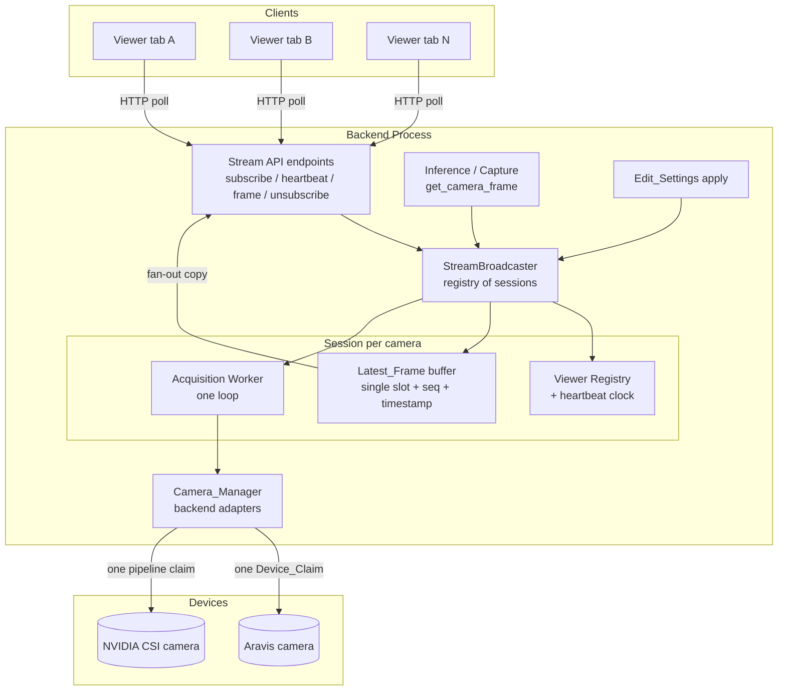
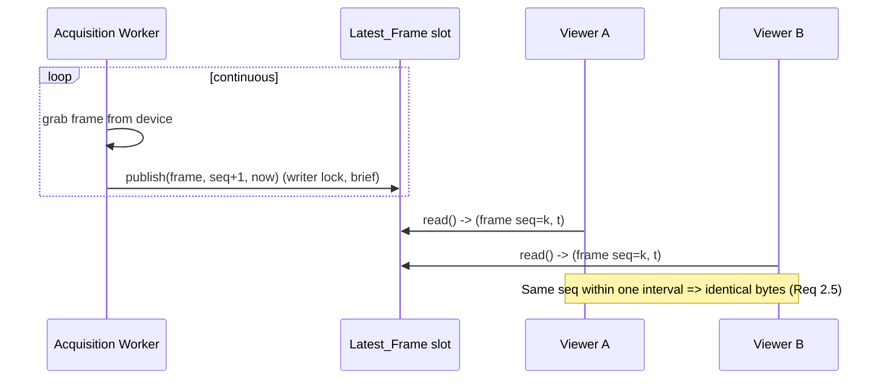

# Design Document

## Overview

Today the backend serves a live preview to only one viewer at a time. Each preview frame
in `camera_manager.py` runs through a module-level `get_frame_lock` plus a per-request
`start_acquisition()` / `get_frame()` / `stop_acquisition()` cycle on a `multiprocessing`-hosted
`Camera` proxy. Two browser tabs polling the same camera serialize on that one lock, so the
second viewer stalls behind the first, and every grab pays the full start/stop cost.

This feature replaces the per-request grab model with a **broadcast model**: a single long-lived
acquisition session per physical camera (the `Stream_Broadcaster`) reads frames once and fans the
most recent frame out to every subscribed viewer. Viewers no longer claim the device — they
**subscribe** to a stream, send periodic **heartbeats**, and **unsubscribe** when done. The session
starts on the first subscriber and stops on the last, releasing the device claim.

The design must hold one device claim per camera across two acquisition backends:

- **GenICam / USB3Vision** via Aravis (the current `Camera` / `get_camera_frame()` path).
- **NVIDIA CSI / ICAM** via GStreamer pipelines (the current `gst_pipeline_executor` path, which
  today does not go through `get_camera_frame()`).

It must also keep two existing consumers working against the *same* single claim:

- **Edit_Settings_Preview** — applying gain / exposure / advanced GenICam features to the live
  session, plus per-request config-override previews.
- **Inference_Pipeline / capture** — `digital_input_process_manager`,
  `digital_input_thread_manager`, `workflow`, and capture endpoints, which must reuse the active
  session's claim rather than opening a second one.

### Goals

- One `Device_Claim` per `Physical_Camera` while ≥ 1 viewer is subscribed; zero when none are.
- Acquire each frame once; fan it out identically to all viewers (≥ 8 concurrent) without
  per-viewer blocking.
- Automatic start-on-first-viewer / stop-on-last-viewer lifecycle keyed off explicit subscription
  and heartbeat tracking, so abandoned tabs cannot pin the device.
- Bounded freshness/latency (serve latest frame < 500 ms, no frame older than 2 s without a
  staleness signal) regardless of viewer count.
- Backend-agnostic behavior across Aravis and GStreamer cameras.
- Edit-settings and inference/capture continue to function through the shared claim.

### Non-Goals

- Changing the on-the-wire image encoding or the GStreamer processing pipeline definitions.
- Pixel-format / ROI live control (still out of scope, as in the current code).
- Multi-host / clustered broadcasting; this is a single-backend-process design.

## Architecture

The `Stream_Broadcaster` is introduced as a backend-process-wide registry of per-camera
**stream sessions**. Each session owns exactly one acquisition worker bound to one device claim,
a single-slot **latest-frame buffer**, and a **viewer registry**. HTTP endpoints become thin
clients over the broadcaster: subscribe / heartbeat / unsubscribe / get-frame / viewer-count.



### Concurrency / fan-out model

The core problem with the current code is that the *reader* (device grab) and the *consumers*
(viewer requests) share one lock, so consumers serialize behind the grab. The new model decouples
them:

- **One producer** per session: the acquisition worker is the *only* code that touches the device
  handle. It loops: grab → write latest-frame slot → repeat. Aravis cameras switch from
  per-request software-trigger to continuous acquisition driven by the worker; CSI cameras run a
  persistent GStreamer `appsink` pull loop instead of a one-shot pipeline.
- **Single-writer / many-reader latest-frame slot.** The worker publishes each frame into a single
  shared slot guarded by a short-held lock (or an atomic pointer swap). Each frame carries a
  monotonic **sequence number** and an **acquired-at timestamp**. Readers copy the current
  reference out under the lock and release immediately — they never hold the lock across I/O and
  never touch the device.
- **Readers never block each other or the producer.** A viewer's get-frame is a slot read plus a
  freshness check; its latency is independent of any other viewer's in-flight request (Req 1.5,
  4.5). This satisfies "serve each viewer independently."
- **Backpressure = drop-to-latest.** There is no per-viewer queue. Slow viewers simply read
  whatever the latest frame is on their next poll; the producer never waits on a consumer. This
  bounds memory and guarantees producer cadence is independent of viewer count (Req 4.5).



### Single-claim sharing with inference / capture

To honor Req 6, the device claim moves *into the session*, and both viewers and the inference
path go through the broadcaster:

- **Session active:** `get_camera_frame()` (inference/capture) is redirected to the broadcaster.
  For inference it returns the session's latest frame (fresh grab fan-out) instead of opening a
  second claim (Req 6.1). For capture with a per-capture config, the worker briefly applies the
  override on the live session (see Edit-Settings interaction) and returns the next frame.
- **No session:** `get_camera_frame()` falls back to the legacy dedicated-claim path
  (open → grab → close), giving inference its frame within the 2 s bound (Req 6.3). This keeps
  inference working when nobody is watching.

The broadcaster therefore mediates *all* device access; the invariant "at most one open claim per
camera" is enforced in one place.

### Transport choice

The current frontend polls a preview endpoint via `img src` / a 500 ms `refetchInterval` React
Query. To minimize frontend churn while adding lifecycle, the design keeps a **poll-based
transport** and layers an explicit subscription/heartbeat protocol on top of it:

- The poll request for a frame **doubles as the heartbeat** (each frame GET refreshes the viewer's
  last-active timestamp), so a viewer that keeps polling stays alive automatically. An explicit
  heartbeat endpoint is also provided for clients that render via MJPEG/`img` and need to keep the
  subscription alive without a JSON round-trip.
- A separate **subscribe** call establishes the viewer id (start-on-first-viewer) and an
  **unsubscribe** call (or `navigator.sendBeacon` on tab close) provides prompt teardown; the 30 s
  stale-viewer sweep is the backstop for abandoned tabs.

Polling (vs. websockets/MJPEG push) is chosen because it (a) reuses the existing frontend image
flow and error handling, (b) makes the freshness/staleness contract a simple per-request check,
and (c) keeps each viewer's request independent, which is exactly the property Req 1.5 / 4.5
require. MJPEG remains available as an optional rendering transport over the same subscription.

## Components and Interfaces

### StreamBroadcaster (new)

Process-wide singleton holding `{camera_id -> StreamSession}`. Thread-safe registry operations.

```python
class StreamBroadcaster:
    MAX_VIEWERS_PER_CAMERA = 8
    HEARTBEAT_INTERVAL_S = 10
    STALE_TIMEOUT_S = 30
    FIRST_FRAME_TIMEOUT_S = 10

    def subscribe(self, camera_id: str, config: dict | None) -> SubscribeResult:
        """Register a new viewer; start the session if this is the first viewer.
        Raises ViewerLimitReached (Req 1.6) or CameraUnavailable (Req 1.7, 3.2)."""

    def heartbeat(self, camera_id: str, viewer_id: str) -> bool:
        """Refresh the viewer's last-active timestamp. Returns False if unknown/expired."""

    def get_frame(self, camera_id: str, viewer_id: str) -> FrameResult:
        """Return the latest frame (also refreshes heartbeat). Encodes NO_FRAME /
        STALE / DISCONNECTED states (Req 2.6, 4.7, 7.5)."""

    def unsubscribe(self, camera_id: str, viewer_id: str) -> None:
        """Deregister a viewer; stop the session if it was the last (Req 3.3, 8.8)."""

    def viewer_count(self, camera_id: str) -> int:
        """Active viewer count (Req 8.4)."""

    def get_inference_frame(self, camera_id: str, config: dict | None) -> dict | None:
        """Reuse the active session's claim for inference/capture; fall back to a
        dedicated claim when no session exists (Req 6.1, 6.3)."""

    def apply_settings(self, camera_id: str, features: dict) -> ApplyResult:
        """Apply gain/exposure/advanced features to the live session (Req 5)."""

    def sweep_stale_viewers(self, now: float) -> None:
        """Deregister viewers past STALE_TIMEOUT_S; stop emptied sessions (Req 3.8/3.9, 8.6/8.7)."""
```

### StreamSession (new)

Owns one camera's acquisition worker, latest-frame slot, viewer registry, and lifecycle state.

```python
class StreamSession:
    state: SessionState                 # STARTING | RUNNING | STOPPING | STOPPED | ERROR
    camera_id: str
    backend: CameraBackend              # AravisBackend | GStreamerBackend
    viewers: dict[str, Viewer]
    latest: LatestFrame | None
    def add_viewer(self, viewer: Viewer) -> None: ...
    def remove_viewer(self, viewer_id: str) -> bool: ...   # returns True if now empty
    def publish(self, frame_bytes, width, height, now) -> None: ...  # writer side
    def read_latest(self, now) -> FrameResult: ...                   # reader side
    def is_empty(self) -> bool: ...
```

### CameraBackend adapters (new abstraction over existing code)

A common interface so the broadcaster treats both camera families identically (Req 2.8).

```python
class CameraBackend(Protocol):
    def open(self) -> None: ...          # acquire the single Device_Claim (≤3 attempts, Req 7.6)
    def start_stream(self) -> None: ...  # continuous acquisition / appsink pull
    def grab(self, timeout_ms: int) -> RawFrame | None: ...  # one frame, bounded wait
    def apply_features(self, features: dict) -> dict: ...     # gain/exposure/advanced
    def stop_stream(self) -> None: ...
    def close(self) -> None: ...         # release the Device_Claim
```

- **AravisBackend** wraps the existing `Camera` class. Acquisition moves from per-request
  software-trigger to a worker-driven continuous loop; `apply_features` reuses
  `apply_device_features` / `_apply_config_features` with acquisition coordination.
- **GStreamerBackend** wraps a persistent pipeline ending in an `appsink`, replacing the one-shot
  `execute_image_source_pipeline` for the live-view path. Capture/inference still build their own
  full processing pipelines but pull the source frame from the session.

### Acquisition worker (new)

One thread (or process) per session. Loop: `grab(timeout)` → on success `session.publish(...)`;
on `None`/timeout mark disconnected (Req 7.1) and transition session to ERROR → stop. Sleeps to
cap rate at the configured ceiling but never below device cadence (Req 4.3, 4.4).

### Stream API endpoints (new / refactored `endpoints/streams.py`)

| Method & path | Purpose | Requirements |
|---|---|---|
| `POST /streams/{camera_id}/subscribe` | Register viewer, start session if first. Returns `viewerId`. | 1.2, 3.1, 8.1 |
| `GET  /streams/{camera_id}/frame?viewerId=` | Latest frame + state; refreshes heartbeat. | 2.3, 4.1, 4.6 |
| `POST /streams/{camera_id}/heartbeat` | Explicit keep-alive. | 8.2, 8.3 |
| `POST /streams/{camera_id}/unsubscribe` | Deregister viewer, stop session if last. | 3.6, 8.8 |
| `GET  /streams/{camera_id}/viewers` | Active viewer count. | 8.4 |
| `POST /streams/{camera_id}/settings` | Apply gain/exposure/advanced to live session. | 5.1, 5.2 |

Existing `POST /image-sources/{id}/preview` with a config override is preserved and routed to a
**single-frame override path** that does not mutate the live session (Req 5.4).

### Camera_Manager (`camera_manager.py`, refactored)

`get_camera_frame(camera_id, config)` is rewired to call `broadcaster.get_inference_frame(...)`,
preserving its signature so `digital_input_*`, `workflow`, and capture endpoints are unchanged.
The legacy dedicated-claim grab becomes the `no active session` fallback inside the broadcaster.

## Data Models

```python
@dataclass(frozen=True)
class LatestFrame:
    data: bytes            # raw image payload (same shape as today's get_frame dict)
    width: int
    height: int
    seq: int               # monotonic per session; identifies an acquisition interval
    acquired_at: float     # epoch seconds when grabbed

@dataclass
class Viewer:
    viewer_id: str         # server-issued uuid; duplicate subscribes => distinct ids (Req 8.5)
    camera_id: str
    subscribed_at: float
    last_active: float     # updated on heartbeat/frame GET (Req 8.3)

class SessionState(Enum):
    STARTING = "starting"
    RUNNING = "running"
    STOPPING = "stopping"
    STOPPED = "stopped"
    ERROR = "error"

class FrameStatus(Enum):
    OK = "ok"
    NO_FRAME = "no_frame"        # session up, no frame yet (Req 2.6, 4.2)
    STALE = "stale"             # latest older than 2s (Req 4.7)
    DISCONNECTED = "disconnected"  # camera dropped (Req 7.5)

@dataclass
class FrameResult:
    status: FrameStatus
    frame: LatestFrame | None
    error: str | None = None

@dataclass
class SubscribeResult:
    viewer_id: str | None
    accepted: bool
    reason: str | None        # "viewer_limit" | "camera_unavailable" | None
    viewer_count: int

# Configurable bounds (Req 7.1, 7.6)
@dataclass
class StreamConfig:
    frame_timeout_ms: int = 5000      # clamp [500, 30000]
    open_timeout_ms: int = 5000       # clamp [500, 30000]
    max_open_attempts: int = 3
    max_viewers: int = 8
    heartbeat_interval_s: int = 10
    stale_timeout_s: int = 30
    first_frame_timeout_s: int = 10
    stale_after_s: float = 2.0        # freshness ceiling for served frames (Req 4.6)
    min_refresh_fps: float = 5.0      # Req 4.3
```

The viewer registry is keyed `camera_id -> {viewer_id -> Viewer}`; `viewer_count` is `len(...)`.
The latest-frame slot is one `LatestFrame` reference per session, replaced wholesale on publish so
readers always observe a complete, consistent frame (Req 2.2, 2.5).

## Correctness Properties

*A property is a characteristic or behavior that should hold true across all valid executions of
a system — essentially, a formal statement about what the system should do. Properties serve as
the bridge between human-readable specifications and machine-verifiable correctness guarantees.*

These properties test the `StreamBroadcaster` / `StreamSession` logic against a **mock
`CameraBackend`** (counting opens/closes/grabs and simulating failures) and an **injected clock**,
so they exercise our fan-out, lifecycle, and freshness logic deterministically without real
hardware. Each property is parametrized over both a mock `AravisBackend` and a mock
`GStreamerBackend` to satisfy backend parity (Req 2.8). Wall-clock timing bounds (e.g. "within
500 ms", "within 5 s", frame-rate floors) and real-device behavior (first-frame arrival, applied
setting visible within N frames, inter-frame gaps) are verified by integration/perf tests in the
Testing Strategy, not by these properties.

### Property 1: Single device-claim invariant

*For any* sequence of subscribe / unsubscribe / stale-sweep / disconnect operations across one or
more cameras, the number of open `Device_Claim`s for each camera equals 1 when that camera has at
least one active viewer and 0 when it has none, never exceeds 1 at any point, and a new claim is
never opened before a prior claim for the same camera has been released (no overlapping claims).

**Validates: Requirements 1.2, 2.1, 3.4, 7.7**

### Property 2: Session lifecycle (start on first, stop and release on last)

*For any* viewer operation sequence, the first viewer to subscribe to a camera with no session
causes exactly one session to be created, and whenever the active viewer count for a camera
returns to 0 the session is stopped and its backend `close()` (claim release) is invoked.

**Validates: Requirements 3.1, 3.3, 3.7, 8.7**

### Property 3: Fan-out delivers the identical latest frame to every viewer

*For any* set of 1 to `max_viewers` subscribed viewers and any sequence of published frames, every
viewer that reads after a publish (and before the next) receives a byte-identical frame with the
same sequence number as every other viewer reading in that interval, and that frame is the most
recently published one.

**Validates: Requirements 1.1, 1.4, 2.2, 2.5**

### Property 4: Reads are independent of other viewers and do not re-grab

*For any* viewer and *any* number of other viewers in any read state, a viewer's `get_frame`
returns the current latest frame as a pure function of the latest-frame slot — independent of the
presence, count, or pending reads of other viewers — and repeated reads with no intervening
publish return the same frame without invoking a device grab.

**Validates: Requirements 1.5, 2.4**

### Property 5: Producer cadence is independent of viewer count

*For any* fixed sequence of frames produced by the backend, the sequence of frames published into
the latest-frame slot is identical whether 1 or `max_viewers` viewers are reading arbitrarily, and
no viewer read prevents or delays a publish (drop-to-latest, no backpressure).

**Validates: Requirements 4.5**

### Property 6: Viewer-limit enforcement

*For any* operation sequence that brings a camera to `max_viewers` active viewers, the next
subscribe is rejected with reason `viewer_limit`, the active viewer count remains `max_viewers`,
and all existing viewers remain registered and able to read frames.

**Validates: Requirements 1.6, 1.3**

### Property 7: Open-failure handling

*For any* camera whose backend `open()` fails, a subscribe attempt makes at most
`max_open_attempts` (3) attempts, then is rejected with reason `camera_unavailable`, leaves no
session and zero claims for that camera, while subscriptions to any other healthy camera still
succeed.

**Validates: Requirements 1.7, 3.2, 7.6**

### Property 8: Viewer-count correctness and duplicate subscriptions

*For any* operation sequence, the reported active viewer count for a camera is always a
non-negative integer equal to the number of distinct registered viewers, and subscribing K times
to the same camera yields K distinct viewer ids that each count toward the total.

**Validates: Requirements 8.1, 8.4, 8.5, 8.8**

### Property 9: Heartbeat update and staleness predicate

*For any* viewer and *any* receipt time t, processing a heartbeat sets that viewer's last-active
timestamp to t, and *for any* last-active time and current time `now`, the viewer is classified as
stale exactly when `now - last_active > stale_timeout_s`.

**Validates: Requirements 3.9, 8.3**

### Property 10: Stale sweep deregisters, heartbeats keep alive

*For any* set of viewers with arbitrary last-active timestamps, a stale-sweep at time `now`
removes exactly those viewers with `now - last_active > stale_timeout_s` (decrementing the count
accordingly and treating them as unsubscribed), while any viewer that has sent a heartbeat within
`stale_timeout_s` of `now` is retained.

**Validates: Requirements 3.8, 8.2, 8.6**

### Property 11: Frame freshness predicate

*For any* latest frame with acquired-at time and *any* request time `now`, a read returns status
`OK` with the frame when `now - acquired_at <= stale_after_s` (2 s) and status `STALE` otherwise.

**Validates: Requirements 4.6, 4.7**

### Property 12: No-frame-yet handling

*For any* session that has started but published no frame, a read returns status `NO_FRAME` and
the session remains active (not stopped).

**Validates: Requirements 2.6, 4.2**

### Property 13: Acquisition failure preserves the last good frame

*For any* published latest frame followed by a failed grab, the latest-frame slot still equals the
last successfully published frame (the failed grab does not overwrite it) and an acquisition-failure
indication is produced.

**Validates: Requirements 2.7**

### Property 14: Disconnection cascade

*For any* session with any set of subscribed viewers, when a grab times out or fails such that the
camera is marked disconnected, the session is stopped with its backend `close()` (claim release)
invoked before stop completion is reported, and every subscribed viewer's subsequent `get_frame`
returns status `DISCONNECTED` with no frame payload (never a previously cached frame).

**Validates: Requirements 7.1, 7.2, 7.3, 7.4, 7.5, 3.5, 3.11**

### Property 15: Timeout/configuration clamping

*For any* configured frame-timeout or open-timeout value, the effective timeout used equals that
value clamped to the range [500, 30000] ms.

**Validates: Requirements 7.1**

### Property 16: Inference reuses the session claim, falls back when none

*For any* camera, a frame request from the inference/capture path returns a frame without opening
a second claim when a session is active (claim count stays 1), and when no session exists it opens
exactly one dedicated claim, returns a frame, and releases that claim (count returns to 0).

**Validates: Requirements 6.1, 6.3, 6.4**

### Property 17: Inference failure leaves the session intact

*For any* active session, if an inference frame request fails or the camera becomes unavailable
for that request, an error indication is returned to the caller while the session remains running
and its `Device_Claim` is retained.

**Validates: Requirements 6.6**

### Property 18: Live settings apply preserves the session

*For any* set of valid camera control values applied to a running session, the backend reflects
the requested values, the session remains in the RUNNING state, the subscribed viewer set is
unchanged, and the latest frame remains readable throughout.

**Validates: Requirements 5.1, 5.2, 5.3**

### Property 19: Settings-apply failure retains prior values

*For any* apply request in which at least one control fails, the operation returns an error
identifying the failed control, the control values in effect before the request are retained
unchanged, and the session remains active.

**Validates: Requirements 5.5**

### Property 20: Override preview isolation

*For any* per-request configuration override preview against a running session, the session's
applied control values and the shared latest frame delivered to other viewers are unchanged by the
override request.

**Validates: Requirements 5.4**

### Property 21: Out-of-range capture configuration is rejected

*For any* per-capture image-source configuration containing at least one parameter value outside
its accepted range, the request is rejected with an error identifying an offending parameter and
the previously active image-source configuration is preserved unchanged.

**Validates: Requirements 6.5**

## Error Handling

| Condition | Detection | Response | Requirements |
|---|---|---|---|
| Device open fails on subscribe | `backend.open()` raises across ≤3 attempts within `open_timeout_ms` | Reject subscribe, reason `camera_unavailable`, no session, other cameras unaffected | 1.7, 3.2, 7.6 |
| Viewer limit reached | registry size == `max_viewers` on subscribe | Reject, reason `viewer_limit`, existing viewers untouched | 1.6 |
| No frame yet | session RUNNING, slot empty | `FrameResult(NO_FRAME)`, session retained | 2.6, 4.2 |
| First-frame timeout | no publish within `first_frame_timeout_s` | Stream error to viewers, stop session | 3.11 |
| Single-grab timeout / failure | `grab()` returns `None` / non-success | Mark camera disconnected, retain last good slot until disconnect, surface failure | 2.7, 7.1 |
| Camera disconnected | timeout/failure marks disconnect | All viewers get `DISCONNECTED` (no cached frame); stop session; release claim before completion | 7.2, 7.3, 7.4, 7.5 |
| Stop failure | `stop_stream()` raises | Force claim release, mark STOPPED, surface error | 3.5 |
| Stale viewer | sweep finds `now - last_active > 30s` | Deregister, decrement count, stop session if empty | 3.8, 8.6, 8.7 |
| Apply control failure | `apply_features` raises for a control | Error names the control, retain prior values, keep session RUNNING | 5.5 |
| Out-of-range capture config | validation against feature bounds | Reject, identify invalid parameter, preserve active config | 6.5 |
| Inference grab failure (session active) | grab error during `get_inference_frame` | Error to inference caller, session + claim left intact | 6.6 |

Errors are surfaced to viewers through the `FrameResult.status` enum (`NO_FRAME`, `STALE`,
`DISCONNECTED`) and to subscribe callers through `SubscribeResult.reason`. The broadcaster logs at
ERROR for device failures and at INFO for lifecycle transitions, reusing the existing `Timer`
metrics (`CameraConnectTime`, `CameraGetFrameTime`, etc.) plus new metrics for session start/stop
and viewer counts.

## Testing Strategy

### Property-based tests

Property-based testing **is appropriate** for this feature: the `StreamBroadcaster` /
`StreamSession` are pure-logic state machines (subscription registry, viewer counting, staleness
and freshness predicates, single-slot fan-out, lifecycle transitions, single-claim invariant) whose
behavior varies meaningfully with inputs (number of viewers, operation interleavings, heartbeat /
acquisition timings, frame sequences). Exercising 100+ generated input sequences finds ordering and
boundary bugs that a handful of examples would miss.

- Library: **Hypothesis** (Python), matching the existing pytest suite under `test/backend-test`.
- Each property test runs a **minimum of 100 iterations**.
- Each test is tagged with a comment referencing its design property, format:
  **Feature: concurrent-camera-stream-viewing, Property {number}: {property_text}**
- Each correctness property (1–21) is implemented by a **single** property-based test.
- Tests use a **mock `CameraBackend`** (records open/close/grab calls, can simulate open failure,
  grab timeout/failure, and stop failure) and an **injected clock** so timing-dependent logic
  (staleness, freshness, first-frame timeout) is deterministic.
- Stateful/interleaving properties (1, 2, 6, 8) use Hypothesis `RuleBasedStateMachine` to generate
  random subscribe / unsubscribe / heartbeat / sweep sequences and assert invariants after each step.
- Backend-parity properties are parametrized over both a mock `AravisBackend` and a mock
  `GStreamerBackend` (Req 2.8).

### Unit / example tests

Focus on concrete behaviors and boundaries not covered by universal properties:

- Subscribe → frame → unsubscribe happy path for each backend.
- The exact `max_viewers = 8` boundary (8th accepted, 9th rejected) — Req 1.3/1.6 edge.
- `FrameResult` / `SubscribeResult` serialization on the API endpoints (status codes for
  `NO_FRAME`, `STALE`, `DISCONNECTED`, `viewer_limit`, `camera_unavailable`).
- `get_camera_frame` signature compatibility so `digital_input_*`, `workflow`, and capture
  endpoints keep working unchanged (regression against existing tests in
  `test/backend-test/api-endpoints`).

### Integration / performance tests (timing & real-device bounds — NOT property tests)

These verify the wall-clock and hardware-dependent acceptance criteria that property tests
intentionally exclude:

- First frame available within 10 s of session start (Req 3.10); latest-frame read < 100 ms /
  500 ms (Req 2.3, 4.1, 4.2); stale response < 500 ms (Req 4.7 timing).
- Refresh ≥ 5 fps for a ≥ 5 fps source and tracks device rate below that (Req 4.3, 4.4); refresh
  rate independent of viewer count up to 8 (Req 4.5 wall-clock side).
- New subscriber starts receiving within 2000 ms with no disruption to existing viewers (Req 1.4).
- Applied setting visible in the live stream within 5 frames (Req 5.2).
- Inference grab during active session keeps viewer inter-frame gaps ≤ 500 ms and ≥ 90% rate
  (Req 6.2); inference dedicated-claim grab returns within 2000 ms (Req 6.3 timing).
- End-to-end against a Fake Aravis camera (`Aravis.enable_interface("Fake")`, already used in the
  codebase) and a simulated GStreamer source, run with 1–3 representative examples each.
