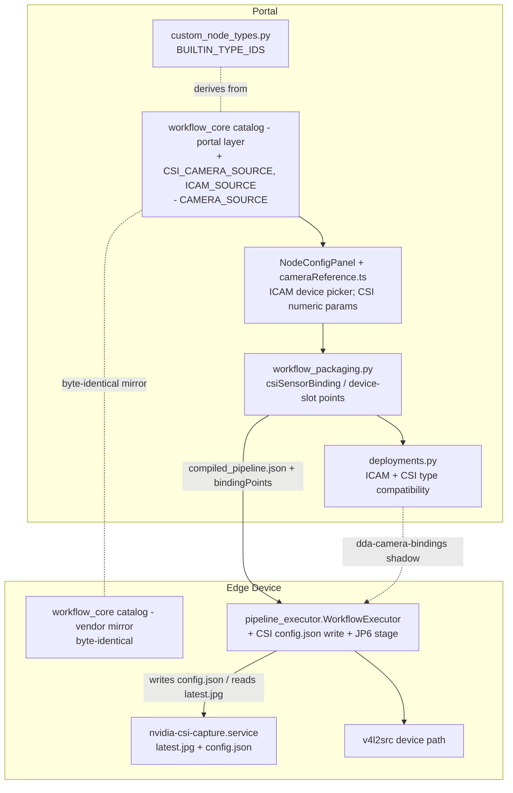
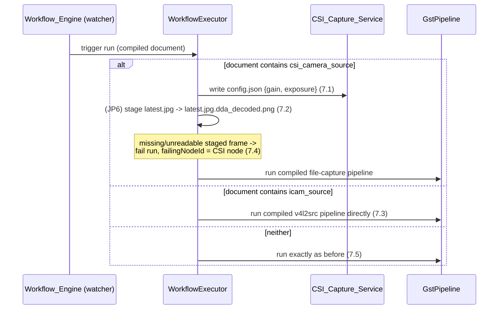

# Design Document: CSI and ICAM Input Node Types

## Overview

This feature replaces the flow designer's single ambiguous camera input node (`camera_source`) with two input node types that name the edge's real capture families:

- **`csi_camera_source` ("CSI Camera Input")** — an NVIDIA CSI camera. On the edge, CSI capture is host-service based: `pipeline_builder._add_nvidia_csi_image_source` writes `gain`/`exposure` to `/aws_dda/nvidia-csi-capture/config.json` and reads frames the `nvidia-csi-capture.service` continuously stages to `/aws_dda/nvidia-csi-capture/latest.jpg`. The node's parameters are `gain`/`exposure` only (no device path); its compiled chain reads the staged capture file.
- **`icam_source` ("ICAM")** — a V4L2 smart camera. On the edge, ICAM capture is `v4l2src device=/dev/video0 ! videoconvert` (`pipeline_builder._add_icam_image_source`). The node's parameter is a `device` path; its compiled chain is `v4l2src device={device} ! videoconvert`.

The generic `camera_source` is removed entirely (no existing workflow uses it; confirmed with the product owner). Its JP6 mapping already *was* the CSI host-capture path, so `csi_camera_source` inherits that exact chain; its x86 mapping already *was* `v4l2src device={device}`, so `icam_source` inherits that exact chain generalized to all physical architectures.

The design threads both new node types through the same seams the camera input pipeline already provides (catalog → packaging → deploy-time binding → device execution), changing no wire protocols. The two workflow_core catalog copies (portal layer and edge vendor mirror) stay byte-identical.

### Key Design Decisions

| Decision | Choice | Rationale |
|----------|--------|-----------|
| Split vs. keep generic | Two typed nodes (`csi_camera_source`, `icam_source`); remove `camera_source` | CSI (host-service file capture, no device path) and ICAM (`v4l2src device=…`) are fundamentally different transports the edge already treats as distinct `ImageSourceType`s. A single node cannot express both without an ambiguous discriminator; two descriptors reuse all generic catalog machinery |
| Remove `camera_source` outright | Hard removal from both catalog copies + all references | The product owner confirmed nothing uses it yet, so no deprecation/migration shim is needed; the JP6 and x86 behaviors it carried are preserved verbatim by the two new nodes |
| CSI node parameters | `gain`/`exposure` only, no device path | The CSI_Capture_Service stages a single frame regardless of any device path; gain/exposure are the only settings the service consumes (via config.json). Mirrors the removed `camera_source`'s JP6 behavior |
| CSI compiled chain | JPEG file chain on non-JP6 archs reading `/aws_dda/nvidia-csi-capture/latest.jpg`; PNG-staged chain on JP6 reading `…/latest.jpg.dda_decoded.png`; dataset-fed sim stub | Byte-identical to how `folder_source` and the old `camera_source` handle the JP6 libjpeg collision; the staged file is produced by the host service, so parameters never enter the element chain (no slots) |
| CSI binding marker | `csiSensorBinding: true`, empty slots, all physical archs | Preserves the exact marker the removed `camera_source` emitted on JP6; the binding selects which CSI sensor the host service stages from, never an element argument |
| ICAM node parameter | `device` (required string, default `/dev/video0`) | Matches `_add_icam_image_source`'s `v4l2src device` default; the one identifier a V4L2 smart camera keys on |
| ICAM compiled chain | `v4l2src device={device} ! videoconvert` on every physical arch; dataset-fed sim stub | `v4l2src` is the ICAM capture element on both x86 and Jetson (the edge uses it uniformly); byte-identical to the removed `camera_source` x86 chain, generalized to all device archs |
| ICAM binding | Slot-based (`device` → v4l2src `device` arg), like the removed `camera_source` on x86 | The `device` template is a single `{device}` placeholder, so `binding_point_slots` naturally yields one slot — the generic slot machinery handles it with no special-casing |
| CSI device-side execution | Executor writes config.json + (JP6) stages the PNG before the pipeline runs | The deployed-workflow executor (`pipeline_executor`) compiles from the catalog and does not go through the legacy `_add_nvidia_csi_image_source`; it must perform the same config-write and JP6 staging the legacy path did, reusing the existing `_stage_frame_sources` JP6 PNG staging |
| ICAM device-side execution | Run the compiled `v4l2src` pipeline directly, no staging | `v4l2src` captures live from the device; there is no file to decode/stage, so ICAM takes the unstaged execution path |
| Type compatibility | `icam_source` ↔ {`ICam`, `V4L2Discovered`, `Camera`}; `csi_camera_source` ↔ {`NvidiaCSI`, CSI-capable `Camera`} | An ICAM node must bind to a V4L2-backed source; a CSI node to a CSI-backed source. Mirrors the `aravis_camera_source` compatibility-set pattern |

## Architecture

### System Context



### New input node execution flow (edge)



## Components and Interfaces

### 1. Node_Catalog: `CSI_CAMERA_SOURCE` and `ICAM_SOURCE`, remove `CAMERA_SOURCE` (both copies)

Edited in `workflow_core/catalog/nodes.py` in `edge-cv-portal/backend/layers/workflow_core/python/workflow_core/` and mirrored byte-identically to `src/backend/workflow_engine/vendor/workflow_core/`.

```python
CSI_CAMERA_SOURCE = NodeTypeDescriptor(
    type_id="csi_camera_source",
    category=CATEGORY_INPUT,
    display_name="CSI Camera Input",
    inputs=[],
    outputs=[PortDescriptor("out", PORT_TYPE_VIDEO_FRAMES)],
    parameters=[
        ParameterDescriptor("gain", "int", required=False, default=4,
                            constraints={"min": 0, "max": 100},
                            description="NVIDIA CSI sensor gain (0-100) applied "
                                        "through the CSI capture service; e.g. 4.",
                            examples=[4, 10]),
        ParameterDescriptor("exposure", "int", required=False, default=5000000,
                            constraints={"min": 0},
                            description="NVIDIA CSI sensor exposure time in "
                                        "nanoseconds, e.g. 5000000 (5 ms).",
                            examples=[5000000, 16000000]),
    ],
    mappings=[
        GstMapping(arch=ARCH_X86_64, element_chain=_jpeg_file_chain("/aws_dda/nvidia-csi-capture/latest.jpg"),
                   plugin_dependencies=["coreelements", "emexifextract", "jpeg",
                                        "videoconvertscale", "videofilter"]),
        GstMapping(arch=ARCH_X86_64_NVIDIA, element_chain=_jpeg_file_chain("/aws_dda/nvidia-csi-capture/latest.jpg"),
                   plugin_dependencies=["coreelements", "emexifextract", "jpeg",
                                        "videoconvertscale", "videofilter"]),
        GstMapping(arch=ARCH_ARM64_JP4, element_chain=_jpeg_file_chain("/aws_dda/nvidia-csi-capture/latest.jpg"),
                   plugin_dependencies=["coreelements", "emexifextract", "jpeg",
                                        "videoconvertscale", "videofilter"]),
        GstMapping(arch=ARCH_ARM64_JP5, element_chain=_jpeg_file_chain("/aws_dda/nvidia-csi-capture/latest.jpg"),
                   plugin_dependencies=["coreelements", "emexifextract", "jpeg",
                                        "videoconvertscale", "videofilter"]),
        GstMapping(arch=ARCH_ARM64_JP6, element_chain=_jp6_png_staged_chain("/aws_dda/nvidia-csi-capture/latest.jpg.dda_decoded.png"),
                   plugin_dependencies=["coreelements", "png", "videoconvertscale", "python:pillow"]),
        _dataset_fed_sim_source(),
    ],
    hardware_dependent=True,
)

ICAM_SOURCE = NodeTypeDescriptor(
    type_id="icam_source",
    category=CATEGORY_INPUT,
    display_name="ICAM",
    inputs=[],
    outputs=[PortDescriptor("out", PORT_TYPE_VIDEO_FRAMES)],
    parameters=[
        ParameterDescriptor("device", "string", required=True, default="/dev/video0",
                            constraints={"min_length": 1},
                            description="V4L2 device path of the smart (ICAM) "
                                        "camera on the edge device, e.g. /dev/video0.",
                            examples=["/dev/video0", "/dev/video1"]),
    ],
    mappings=_same_on_device_archs(
        element_chain=[
            _element("v4l2src", device="{device}"),
            _element("videoconvert"),
        ],
        plugin_dependencies=["video4linux2", "videoconvertscale"],
    ) + [_dataset_fed_sim_source()],
    hardware_dependent=True,
)
```

- `NODE_CATALOG` drops `CAMERA_SOURCE` and gains `CSI_CAMERA_SOURCE` and `ICAM_SOURCE` in the input section. Every generic consumer (validator, compiler, serializer, `/workflows/node-catalog` route, Node_Palette, `merged_catalog`, test sandbox) picks the nodes up from their descriptors with no special-casing (Requirements 1.5, 2.5).
- CSI parameters (`gain`/`exposure`) never appear in an `args_template`, so `binding_point_slots` yields no slots (Requirement 1.4) — consistent with the `csiSensorBinding` marker. ICAM's `device` is a single `{device}` placeholder in the v4l2src `device` arg, so `binding_point_slots` yields exactly one slot (Requirement 2.4).
- Mirror discipline: the change is made in the portal layer copy and copied verbatim to the vendor mirror; the maintained invariant is `diff -r` cleanliness of the two source trees (Requirements 3.4, 8.1).

### 2. Component_Packager (`workflow_packaging.py`)

```python
CSI_CAMERA_SOURCE_TYPE_ID = 'csi_camera_source'
ICAM_SOURCE_TYPE_ID = 'icam_source'
# CAMERA_SOURCE_TYPE_ID removed
```

- `gather_camera_input_nodes` includes `csi_camera_source` and `icam_source` nodes (and keeps `aravis_camera_source` + camera-backed custom types); the version item's `camera_input_nodes` records them with `has_binding_points: true` (Requirements 4.1, 4.2).
- `build_binding_points`:
  - a `csi_camera_source` node's entry carries `'csiSensorBinding': True` with empty slots on every physical architecture (replacing the old JP6-only `camera_source` csiSensor branch, now unconditional for CSI), and `parameters` holds the rendered `gain`/`exposure` (Requirement 4.1);
  - an `icam_source` node's entry carries the generic `slots` computed by `binding_point_slots` (one `device` slot) and `parameters` holds the rendered `device` (Requirement 4.2);
  - the removed `camera_source` `adapterBinding`/`csiSensorBinding` branches are deleted.
- Workflows without the new nodes serialize byte-identically to the post-removal baseline — the only behavior change is gated on the new type ids (Requirement 4.3).

### 3. Frontend palette + picker (`cameraReference.ts`, `NodeConfigPanel.tsx`)

- The palette is descriptor-driven: removing `CAMERA_SOURCE` and adding the two descriptors makes "CSI Camera Input" and "ICAM" appear under Input automatically once the backend serves them (Requirements 3.3, 5.1).
- `isCameraReferenceParameter(typeId, name)`: drop the `('camera_source','device')` branch; add `('icam_source','device')` so the ICAM device parameter renders the camera reference control (Requirement 5.2). `csi_camera_source` is not a camera-reference parameter, so its `gain`/`exposure` render as standard numeric inputs (Requirement 5.3).
- `CameraReferenceField`: the `icam_source` device flavor offers V4L2-compatible registry entries (type `ICam`/`V4L2Discovered`/`Camera` with a device path) and applies the selection through the existing `applyCameraSelection` (device-path population), retaining the manual-entry toggle. The removed `camera_source` handling is deleted; the `aravis_camera_source` flavor is untouched (Requirement 5.4).

### 4. Deployment_Service (`deployments.py`)

```python
_CAMERA_COMPATIBLE_SOURCE_TYPES = {
    'icam_source':        frozenset({'ICam', 'V4L2Discovered', 'Camera'}),   # 6.1
    'csi_camera_source':  frozenset({'NvidiaCSI', 'Camera'}),                # 6.2
    'aravis_camera_source': frozenset({'Camera', 'AravisDiscovered'}),       # unchanged
    # 'camera_source' entry removed
}
```

- `validate_camera_bindings` needs no structural change: unbound-node, missing-source, degraded-source, override constraint checking (resolving the new descriptors from the catalog), hint pre-selection, and never-synced handling apply to the new nodes through the existing generic paths (Requirements 6.3, 6.5).
- The binding-matrix option list for an `icam_source`/`csi_camera_source` row is filtered through the same compatibility sets so users are not offered bindings the validator would reject (Requirements 6.1, 6.2).
- Binding delivery over `dda-camera-bindings` is unchanged (Requirement 6.4).

### 5. WorkflowExecutor device-side execution (`src/backend/workflow_engine/pipeline_executor.py`)

A pure planning helper decides per-run capture handling from the compiled document:

```python
def plan_capture_sources(document: dict, arch: str) -> CapturePlan
# CapturePlan: csi_nodes: list[CsiCapture]  (node_id, gain, exposure)
#              icam_nodes: list[str]         (node ids; direct v4l2 capture, no staging)
```

- For each `csi_camera_source` node the executor writes `/aws_dda/nvidia-csi-capture/config.json` with the node's effective `gain`/`exposure` (from resolved binding parameters when present, else the binding point's rendered parameters) before starting the pipeline (Requirement 7.1). This reuses the config-write logic factored out of `pipeline_builder._add_nvidia_csi_image_source`.
- On `arm64_jp6`, CSI capture staging joins the existing `_stage_frame_sources` JP6 PNG path: the staged `latest.jpg` is Pillow-decoded to `latest.jpg.dda_decoded.png` at the compiled read path before the pipeline runs (Requirement 7.2). A missing/unreadable `latest.jpg` fails the run fast with `failing_node_id` set to the CSI node (Requirement 7.4).
- `icam_source` nodes take the unstaged path: the compiled `v4l2src` pipeline is run directly (Requirement 7.3).
- Documents containing neither new node plan no CSI/ICAM work and take the exact pre-feature execution path (Requirement 7.5).

### 6. BUILTIN_TYPE_IDS (`custom_node_types.py`)

Derived from `NODE_CATALOG`, so it updates automatically: gains `csi_camera_source` and `icam_source`, loses `camera_source` (Requirement 8.3). No code change beyond the catalog edit; asserted by test.

## Data Models

### Catalog descriptors (both workflow_core copies)

Two new `NodeTypeDescriptor`s (Component 1); `NODE_CATALOG` tuple loses `CAMERA_SOURCE` and gains `CSI_CAMERA_SOURCE`, `ICAM_SOURCE`. No changes to `models.py` shapes, the serializer schema, or the compiler.

### Binding point entries (compiled_pipeline.json)

```jsonc
// csi_camera_source
{
  "nodeId": "n1", "nodeType": "csi_camera_source",
  "parameters": { "gain": 4, "exposure": 5000000 },
  "slots": [], "csiSensorBinding": true
}
// icam_source
{
  "nodeId": "n1", "nodeType": "icam_source",
  "parameters": { "device": "/dev/video0" },
  "slots": [ { "param": "device", "segment": 0, "element": 0, "arg": "device" } ]
}
```

### Camera type compatibility map (`deployments.py`)

`_CAMERA_COMPATIBLE_SOURCE_TYPES` as in Component 4 — the `camera_source` key removed, `icam_source` and `csi_camera_source` keys added, `aravis_camera_source` unchanged.

### Camera_Binding shadow / deployment record

Unchanged shape: `{node_id: {"cameraSourceId": id} | {"override": {...node params...}}}` — override keys are just the new nodes' parameter names (`device` for ICAM, `gain`/`exposure` for CSI).

### CSI capture config file (`/aws_dda/nvidia-csi-capture/config.json`)

Unchanged shape, now written by the Workflow_Executor as well as the legacy `pipeline_builder`: `{"gain": int, "exposure": int, "crop"?: {...}}`.

## Correctness Properties

*A property is a characteristic or behavior that should hold true across all valid executions of a system — essentially, a formal statement about what the system should do. Properties serve as the bridge between human-readable specifications and machine-verifiable correctness guarantees.*

### Property 1: New input node definitions round-trip and compile through generic catalog paths

*For any* valid workflow definition containing `csi_camera_source` and/or `icam_source` nodes, serializing then parsing the definition SHALL produce an equivalent graph, and validating then compiling it for any device architecture SHALL succeed and render the node's declared element chain (CSI: the file-capture chain; ICAM: `v4l2src device={device} ! videoconvert`).

**Validates: Requirements 1.5, 2.5**

### Property 2: CSI node compiles with no binding slots

*For any* compiled document produced for any device architecture from a definition containing a `csi_camera_source` node, the node's rendered parameters (`gain`, `exposure`) SHALL appear in no element argument, so the node's binding point carries empty slots.

**Validates: Requirements 1.4**

### Property 3: ICAM node compiles with exactly one device slot

*For any* compiled document produced for any physical device architecture from a definition containing an `icam_source` node, the node SHALL contribute exactly one binding slot binding the `device` parameter to the v4l2src `device` argument, and the rendered `device` value SHALL appear verbatim in that argument.

**Validates: Requirements 2.4**

### Property 4: Generic camera source is fully removed

*For any* lookup or catalog enumeration after this feature, `get_node_type("camera_source")` SHALL return no descriptor, `camera_source` SHALL be absent from `NODE_CATALOG`, from BUILTIN_TYPE_IDS, and from the served `/workflows/node-catalog` payload, while every other node type's descriptor is unchanged.

**Validates: Requirements 3.1, 3.2, 3.3, 3.4, 8.3**

### Property 5: Packaging emits CSI sensor binding points

*For any* workflow definition containing `csi_camera_source` nodes, packaging SHALL emit exactly one `bindingPoints` entry per CSI node per architecture carrying `csiSensorBinding: true`, empty slots, and the node's rendered `gain`/`exposure`, and SHALL record each node in the version item's `camera_input_nodes` with `has_binding_points: true`.

**Validates: Requirements 4.1**

### Property 6: Packaging emits ICAM device slot binding points

*For any* workflow definition containing `icam_source` nodes, packaging SHALL emit exactly one `bindingPoints` entry per ICAM node per architecture carrying one `device` slot and the node's rendered `device` parameter, and SHALL record each node in the version item's `camera_input_nodes` with `has_binding_points: true`.

**Validates: Requirements 4.2**

### Property 7: New-node-free packaging identity

*For any* workflow definition containing neither `csi_camera_source` nor `icam_source`, the packaged compiled document SHALL be byte-identical to the post-`camera_source`-removal packaging output for the same definition.

**Validates: Requirements 4.3, 8.4**

### Property 8: New-node binding type compatibility

*For any* workflow version with Camera_Input_Nodes, target registry snapshot, and binding set, `validate_camera_bindings` SHALL produce a type-incompatibility error for a binding exactly when the bound Camera_Source's type is outside the node type's declared compatible set — `{ICam, V4L2Discovered, Camera}` for `icam_source`, `{NvidiaCSI, Camera}` for `csi_camera_source`.

**Validates: Requirements 6.1, 6.2**

### Property 9: New-node override constraint validation

*For any* manual override submitted for a new input node, validation SHALL accept the override exactly when every value satisfies the descriptor's declared constraints (non-empty string `device` for ICAM; `gain` within 0–100 and non-negative `exposure` for CSI; no undeclared parameter names).

**Validates: Requirements 6.3**

### Property 10: CSI device-side config write and JP6 staging precedence

*For any* run of a document containing a `csi_camera_source` node, the executor SHALL write the node's effective `gain`/`exposure` to the CSI config file before starting the pipeline, and on `arm64_jp6` SHALL stage the capture frame as a decoded PNG at the compiled read path before the pipeline reads it; a missing/unreadable capture frame SHALL fail the run with the failing node id set to the CSI node.

**Validates: Requirements 7.1, 7.2, 7.4**

### Property 11: ICAM and unaffected runs take unchanged execution paths

*For any* run of a document whose only new input node is an `icam_source`, the executor SHALL run the compiled `v4l2src` pipeline with no frame-source staging; *for any* run of a document containing neither new input node, the executor SHALL take the exact pre-feature execution path.

**Validates: Requirements 7.3, 7.5**

### Property 12: Catalog mirror byte-identity

*For any* state of the repository after this feature, the two workflow_core catalog source trees (portal layer and edge vendor mirror) SHALL be byte-identical, and both SHALL contain the `csi_camera_source` and `icam_source` descriptors and neither SHALL contain `camera_source`.

**Validates: Requirements 8.1, 8.2**

## Error Handling

- **CSI capture frame missing/unreadable (edge, Requirement 7.4):** when a `csi_camera_source` run starts and the staged frame (`latest.jpg`, or the decoded PNG on JP6) is absent or cannot be decoded, the executor fails the run with `failing_node_id` set to the CSI node and an error identifying the missing capture frame, rather than launching a pipeline that would stall on an empty `filesrc`. This uses the existing execution-failure path (same as folder-source staging failures).
- **CSI config write failure (edge, Requirement 7.1):** a failure writing `/aws_dda/nvidia-csi-capture/config.json` is logged and does not crash the run; the CSI capture service continues with its last-known settings, matching the tolerant behavior of the legacy `_add_nvidia_csi_image_source` (which logs and continues on config-write errors).
- **ICAM device unavailable (edge, Requirement 7.3):** an invalid/unavailable `v4l2src` device surfaces through the normal GStreamer pipeline error path, marking the run failed with the ICAM node attributed — no new handling; the existing pipeline error-to-node mapping covers it.
- **Binding type mismatch (deploy, Requirements 6.1, 6.2):** an incompatible Camera_Source type for a new input node is rejected at deploy-time validation with a message naming the node, the bound source, and the type mismatch; the deployment is not created.
- **Override constraint violation (deploy, Requirement 6.3):** a manual override that violates the descriptor's constraints is rejected with a per-parameter validation message through the existing generic constraint checker.
- **Catalog mirror drift (build-time, Requirement 8.1):** the two catalog copies drifting is caught by the mirror-identity test in CI, failing the build before packaging or deployment can observe the drift.
- **Unknown/removed type id (Requirement 3.1):** a definition still referencing the removed `camera_source` (none exist today) fails validation with the standard unknown-node-type error, the same as any other unrecognized type id — no special handling.

## Testing Strategy

- **Catalog (both copies):** descriptor shape (ids, category, ports, params, constraints, defaults), NODE_CATALOG membership (added present, `camera_source` absent), and a `diff`-based mirror-identity test asserting the two `nodes.py` copies are byte-identical.
- **Round-trip/compile (Property 1, 2, 3):** parse→serialize equivalence and per-architecture compile of definitions with each new node, asserting the rendered chains and the slot outcomes (CSI zero slots, ICAM one `device` slot).
- **Packaging (Property 5, 6, 7):** `bindingPoints` shape per node type and per architecture; byte-identity of packaging for definitions containing neither new node against a captured baseline.
- **Deploy-time binding (Property 8, 9):** type-compatibility acceptance/rejection matrices for `icam_source`/`csi_camera_source`; override constraint acceptance/rejection.
- **Device execution (Property 10, 11):** executor writes config.json with effective gain/exposure; JP6 staging invoked for CSI and produces the decoded PNG; missing capture frame fails with the right node id; ICAM run takes the unstaged path; a neither-node run is unchanged.
- **Removal completeness (Property 4):** no `camera_source` reference remains in packaging, deployments, frontend, or BUILTIN_TYPE_IDS; served node-catalog payload excludes it.
- Property-based tests (Hypothesis) back Properties 1–12 where a value space is enumerable (parameter values, arch × node-type matrices, compatible/incompatible type pairs); example-based tests cover the fixed device paths and file-capture path strings.

## Requirements Coverage

| Requirement | Design components | Properties |
|---|---|---|
| 1.1–1.5 (CSI catalog) | Component 1 | 1, 2 |
| 2.1–2.5 (ICAM catalog) | Component 1 | 1, 3 |
| 3.1–3.4 (camera_source removal) | Components 1, 2, 3, 6 | 4 |
| 4.1–4.3 (packaging) | Component 2 | 5, 6, 7 |
| 5.1–5.4 (builder/picker) | Component 3 | 4 (palette), 1 |
| 6.1–6.5 (deploy-time binding) | Component 4 | 8, 9 |
| 7.1–7.5 (device execution) | Component 5 | 10, 11 |
| 8.1–8.4 (mirror/no regression) | Components 1, 6 | 4, 7, 12 |
