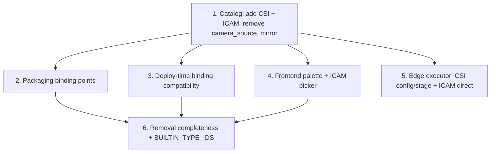

# Implementation Plan: CSI and ICAM Input Node Types

## Overview

Implementation starts at the shared **catalog** (Task 1) since every downstream seam reads node descriptors from it: the two new descriptors are added and `camera_source` removed in both mirrored copies, kept byte-identical. The **packaging** (Task 2), **deploy-time binding** (Task 3), **frontend palette/picker** (Task 4), and **device-side execution** (Task 5) layers each depend only on the catalog and can proceed in parallel. A final **removal-completeness** pass (Task 6) confirms no `camera_source` reference remains anywhere and that `BUILTIN_TYPE_IDS` reflects the change.

The two new designer node types map onto capture paths the edge already implements (`v4l2src` for ICAM, host-service file capture for CSI), so no new GStreamer elements or transports are introduced. Property-based tests (Hypothesis for Python, `react-scripts`/Jest for the frontend) back the correctness properties; example-based tests cover the fixed device paths and CSI capture-file path strings.

Test baselines that must stay green throughout:
- Edge backend: `PYTHONPATH=src/backend:test/backend-test:test/backend-test/workflow_engine python3 -m pytest test/backend-test/workflow_engine -q`.
- Portal backend: the `edge-cv-portal/backend/tests` suite.
- Frontend: `CI=true npx react-scripts test --watchAll=false` under `edge-cv-portal/frontend`.

## Task Dependency Graph



```json
{
  "waves": [
    { "wave": 1, "tasks": ["1"], "description": "Shared catalog: add csi_camera_source + icam_source, remove camera_source, keep both mirrors byte-identical" },
    { "wave": 2, "tasks": ["2", "3", "4", "5"], "description": "Catalog consumers (parallel): packaging binding points, deploy-time binding compatibility, frontend palette + ICAM picker, edge executor CSI config/stage + ICAM direct" },
    { "wave": 3, "tasks": ["6"], "description": "Removal completeness sweep + BUILTIN_TYPE_IDS verification" }
  ]
}
```

## Tasks

- [x] 1. Add CSI and ICAM node descriptors and remove `camera_source` in the shared catalog (both mirrored copies)
  - In `edge-cv-portal/backend/layers/workflow_core/python/workflow_core/catalog/nodes.py`, add the `CSI_CAMERA_SOURCE` descriptor (type id `csi_camera_source`, display "CSI Camera Input", `gain`/`exposure` params, file-capture mappings: JPEG chain reading `/aws_dda/nvidia-csi-capture/latest.jpg` on x86_64/x86_64_nvidia/jp4/jp5, JP6 PNG-staged chain reading `/aws_dda/nvidia-csi-capture/latest.jpg.dda_decoded.png`, sim dataset stub) and the `ICAM_SOURCE` descriptor (type id `icam_source`, display "ICAM", required `device` param default `/dev/video0`, `v4l2src device={device} ! videoconvert` on all device archs + sim dataset stub) per design Component 1.
  - Remove the `CAMERA_SOURCE` descriptor and its `NODE_CATALOG` membership; register `CSI_CAMERA_SOURCE` and `ICAM_SOURCE` in the input section of `NODE_CATALOG`.
  - Copy the edited `nodes.py` verbatim to the edge vendor mirror `src/backend/workflow_engine/vendor/workflow_core/catalog/nodes.py` so the two trees stay byte-identical.
  - _Requirements: 1.1, 1.2, 1.3, 1.4, 2.1, 2.2, 2.3, 2.4, 3.1, 3.4, 8.1_

- [x] 1.1 Write catalog descriptor, membership, and mirror-identity tests
  - Assert the two new descriptors' shape (type id, category input, single VideoFrames output port, parameter names/types/constraints/defaults) and that `get_node_type("camera_source")` returns None while `csi_camera_source`/`icam_source` resolve.
  - Assert `NODE_CATALOG` contains both new types and not `camera_source`, and that every other descriptor is unchanged.
  - Add/extend the mirror-identity test asserting the portal-layer and edge-vendor `nodes.py` are byte-identical.
  - Add property tests for round-trip+compile (Property 1), CSI zero-slot compile (Property 2), and ICAM one-`device`-slot compile (Property 3) across architectures.
  - _Requirements: 1.5, 2.5, 8.1, 8.2_

- [x] 2. Emit packaging binding points for the new input nodes and drop `camera_source` handling
  - In `edge-cv-portal/backend/functions/workflow_packaging.py`, replace `CAMERA_SOURCE_TYPE_ID` with `CSI_CAMERA_SOURCE_TYPE_ID = 'csi_camera_source'` and `ICAM_SOURCE_TYPE_ID = 'icam_source'`; include both in `gather_camera_input_nodes`.
  - In `build_binding_points`, mark `csi_camera_source` entries `csiSensorBinding: true` with empty slots (unconditional across physical archs) and rendered `gain`/`exposure`; produce generic `device`-slot entries for `icam_source` via `binding_point_slots`; delete the removed `camera_source` `adapterBinding`/`csiSensorBinding` branches.
  - _Requirements: 4.1, 4.2, 3.2_

- [x] 2.1 Write packaging binding-point tests
  - Assert CSI binding-point shape (`csiSensorBinding: true`, empty slots, rendered params) per architecture (Property 5) and ICAM binding-point shape (one `device` slot, rendered `device`) per architecture (Property 6).
  - Assert `camera_input_nodes` records both with `has_binding_points: true`, and that a definition with neither new node packages byte-identically to the post-removal baseline (Property 7).
  - _Requirements: 4.1, 4.2, 4.3, 8.4_

- [x] 3. Update deploy-time camera-binding type compatibility
  - In `edge-cv-portal/backend/functions/deployments.py`, update `_CAMERA_COMPATIBLE_SOURCE_TYPES`: remove the `camera_source` key, add `icam_source -> {ICam, V4L2Discovered, Camera}` and `csi_camera_source -> {NvidiaCSI, Camera}`, leaving `aravis_camera_source` unchanged; ensure override constraint checking resolves the new descriptors from the catalog.
  - _Requirements: 6.1, 6.2, 6.3, 6.5_

- [x] 3.1 Write deploy-time binding validation tests
  - Assert the type-compatibility accept/reject matrix for `icam_source` and `csi_camera_source` (Property 8) and manual-override constraint accept/reject (Property 9), including that a `camera_source` binding is no longer recognized.
  - _Requirements: 6.1, 6.2, 6.3_

- [x] 4. Wire the Workflow Builder palette and ICAM camera picker; remove `camera_source` frontend handling
  - In `edge-cv-portal/frontend/src/pages/workflows/cameraReference.ts`, drop the `('camera_source','device')` branch from `isCameraReferenceParameter` and add `('icam_source','device')`; keep `aravis_camera_source` untouched.
  - In `NodeConfigPanel.tsx`, render the ICAM `device` parameter through `CameraReferenceField` filtered to V4L2-compatible registry entries (type `ICam`/`V4L2Discovered`/`Camera` with a device path), applying selections via the existing `applyCameraSelection` and retaining manual entry; delete the removed `camera_source` handling. CSI `gain`/`exposure` render as standard numeric inputs.
  - _Requirements: 5.1, 5.2, 5.3, 5.4, 3.2_

- [x] 4.1 Write frontend palette and picker tests
  - Assert the palette lists "CSI Camera Input" and "ICAM" under Input and no longer lists the generic camera source, that the ICAM device parameter renders the camera reference control with V4L2-compatible options and manual-entry fallback, and that CSI params render as plain numeric inputs.
  - _Requirements: 5.1, 5.2, 5.3, 5.4_

- [x] 5. Implement device-side execution for CSI and ICAM in the Workflow Executor
  - In `src/backend/workflow_engine/pipeline_executor.py`, add `plan_capture_sources(document, arch)` (pure) returning CSI nodes (with effective `gain`/`exposure`) and ICAM node ids per design Component 5.
  - For CSI nodes: write `/aws_dda/nvidia-csi-capture/config.json` with effective gain/exposure before starting the pipeline (reuse config-write logic factored from `pipeline_builder._add_nvidia_csi_image_source`); on `arm64_jp6` stage `latest.jpg` → `latest.jpg.dda_decoded.png` via the existing `_stage_frame_sources` JP6 PNG path; fail the run with the CSI node id when the capture frame is absent/unreadable.
  - For ICAM nodes: run the compiled `v4l2src` pipeline directly with no frame-source staging. Leave documents with neither new node on the exact pre-feature path.
  - _Requirements: 7.1, 7.2, 7.3, 7.4, 7.5_

- [x] 5.1 Write device-side execution tests
  - Assert the executor writes config.json with the effective gain/exposure, invokes JP6 staging for CSI and produces the decoded PNG, fails with the correct node id on a missing capture frame (Property 10), runs ICAM unstaged, and leaves a neither-node run byte-path-identical (Property 11).
  - _Requirements: 7.1, 7.2, 7.3, 7.4, 7.5_

- [x] 6. Verify complete removal of `camera_source` and BUILTIN_TYPE_IDS derivation
  - Confirm `custom_node_types.py` `BUILTIN_TYPE_IDS` (derived from `NODE_CATALOG`) now includes `csi_camera_source`/`icam_source` and excludes `camera_source`; add an assertion test.
  - Sweep packaging, deployments, frontend, and the served `/workflows/node-catalog` payload for any residual `camera_source` reference and remove/adjust it.
  - _Requirements: 3.2, 3.3, 8.3_

- [x] 6.1 Write removal-completeness tests
  - Assert `camera_source` is absent from `NODE_CATALOG`, `BUILTIN_TYPE_IDS`, the served node-catalog payload, and the packaging/deployment/frontend type-id references (Property 4), and that all other node types are unaffected.
  - _Requirements: 3.1, 3.2, 3.3, 3.4, 8.3_

## Notes

- **Catalog mirror discipline:** every change to `workflow_core/catalog/nodes.py` MUST be applied to both copies (`edge-cv-portal/backend/layers/workflow_core/python/workflow_core/` and `src/backend/workflow_engine/vendor/workflow_core/`) and the two source trees kept byte-identical. Task 1.1 enforces this with a mirror-identity test.
- **No backward-compat shim for `camera_source`:** the product owner confirmed no existing workflow uses it, so it is removed outright (Requirement 3). Its prior JP6 (CSI host-capture) and x86 (`v4l2src`) behaviors are preserved verbatim by `csi_camera_source` and `icam_source` respectively.
- **Two type vocabularies:** the designer node type ids (`csi_camera_source`, `icam_source`) are distinct from the legacy runtime `ImageSourceType` strings (`NvidiaCSI`, `ICam`). This feature only adds designer catalog node types and their compile/package/deploy/execute handling; it does not change the legacy endpoint-driven `ImageSourceType` path.
- **Dependency waves for parallel execution:** Task 1 (catalog) is the foundation and must complete first. Tasks 2, 3, 4, and 5 depend only on Task 1 and can run in parallel. Task 6 (removal completeness) depends on Tasks 2, 3, and 4.
- **Shipping:** the catalog change spans the portal (portal deploy) and the edge vendor mirror + executor (a new LocalServer build, v1.0.41). Both must ship together for end-to-end behavior; the catalog copies going out of sync between a portal deploy and an edge build would surface as compile/validation drift.
- **Test commands:** backend/edge — `PYTHONPATH=src/backend:test/backend-test:test/backend-test/workflow_engine python3 -m pytest test/backend-test/workflow_engine -q`; portal backend — the `edge-cv-portal/backend/tests` suite; frontend — `CI=true npx react-scripts test --watchAll=false` under `edge-cv-portal/frontend`.
