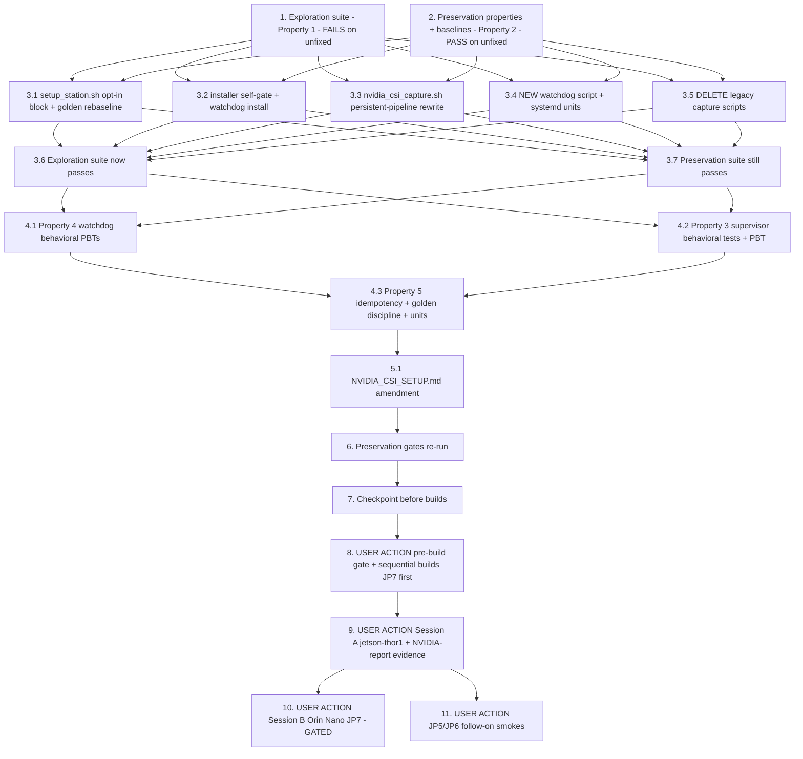

# Implementation Plan

## Overview

Make CSI/nvargus exposure opt-in across the Jetson fleet and defang the driver
defect that poisoned jetson-thor1 (nvargus-daemon degraded state → ALL new CUDA
context creation fails device-wide, Error(89) kernel signature, vLLM rollback +
a day of silent ONNX CPU fallback). Three mitigations per design.md, engineered
for zero recipe churn (Decision 1: the installer self-gates on the provisioning
marker `/aws_dda/system/csi_camera_optin`; all five arm64 recipes and their ~10
goldens stay byte-identical):

1. **Opt-in provisioning** — `setup_station.sh` gains an APPENDED
   `ENABLE_CSI_CAMERA` block (default OFF → `systemctl disable --now
   nvargus-daemon`, marker cleared; ON → daemon enabled, marker written), plus
   the conscious rebaseline of its preservation goldens in the same task.
2. **Persistent capture pipeline** — `nvidia_csi_capture.sh` rewritten as a
   bash supervisor around ONE long-lived `nvarguscamerasrc` pipeline
   (no `num-buffers=1` churn; restart-on-config-change; staged-frame and
   validated manual-exposure contracts preserved verbatim).
3. **Error(89) watchdog** — new `nvargus_error89_watchdog.sh` + systemd
   oneshot service + timer, installed on ALL Jetson targets by the existing
   installer: incremental journal scan, threshold-gated `systemctl restart
   nvargus-daemon`, rate-limited with escalation, every action loudly logged.

Plus: delete the three consumer-less legacy capture scripts
(`start_csi_bridge.sh`, `stop_csi_bridge.sh`, `nvidia_csi_server.sh`) —
requirement 2.13 (amended per design Decision 4).

**Honesty guard.** No test in this plan executes gst-launch, Argus, CUDA, or
real systemd. The host suites are script-content assertions plus behavioral
tests that run the REAL shell scripts (or sourced functions) with stub
binaries on PATH (`systemctl`, `journalctl`, `gst-launch-1.0`, `logger` — the
`deploy_reliability` stub-docker pattern) and fake journal/config inputs. The
real behavioral claims — actual Argus session behavior, real kernel-journal
detection and device-wide CUDA recovery, real frames reflecting exposure
settings, systemd timer semantics, full `setup_station.sh` runs — are ONLY
provable on hardware and are assigned to the USER ACTION sessions (tasks 9,
10, 11) per design.md "Honesty Guard". Do not write a test that pretends to
exercise gst/Argus/systemd.

**Non-goal guards.** No recipe YAML changes (all five arm64 + both amd64
byte-identical — the keystone of Decision 1). No file under `src/backend/` or
`src/frontend/`, no compose, no Dockerfile, no `build-custom.sh`, no
`nvidia-csi-capture.service` unit-file change (same ExecStart path). No
inference/model-handling change (3.7). The NVIDIA driver report itself stays
in the sibling spec (`vllm-jp7-engine-cuda-init`) — task 9 only FEEDS it the
reproduction evidence. Root-level experiment scripts untouched (Decision 5).
The `model-gpu-fallback-visibility` spec covers the silent-CPU-fallback
observability gap — complementary, no mechanism overlap, no task here.

Test commands:
- Host-side suites run in the portal venv with
  `PYTHONPATH=src/backend:test/backend-test` and `--noconftest` (the
  flask-app image is NOT on this EC2 host — same caveat the sibling spec's
  tasks 2/7 record; the container gate run happens on the device/build host
  per `.kiro/steering/builds.md`):
  `python3 -m pytest test/backend-test/csi_nvargus_optional -q -p no:cacheprovider --noconftest`
- Script-level behavioral tests use plain pytest + `subprocess.run(["bash",
  <script>], env={PATH: stub_dir + ...})` — the `deploy_reliability`
  stub-docker pattern (no bats in this repo; do not introduce it)
- Hypothesis property tests use `test_property_*.py` naming with no hardcoded
  `max_examples` and `# Validates: Requirements …` comments
- The security guard pair runs host-side:
  `python3 -m pytest test/backend-test/security/preservation/test_preservation_out_of_scope_guard.py test/backend-test/security/preservation/test_preservation_secrets_out_of_scope_guard.py -p no:cacheprovider --noconftest -q`
- The full preservation suite runs in the flask-app container per
  `.kiro/steering/builds.md` (interpreter shim: python3.11 on JP5 image,
  python3.10 on JP6 image)

New files this plan creates:
- `test/backend-test/csi_nvargus_optional/` (exploration, preservation,
  fix-check suites + suite-local recipe goldens)
- `src/host_scripts/nvargus_error89_watchdog.sh`,
  `src/host_scripts/nvargus-error89-watchdog.service`,
  `src/host_scripts/nvargus-error89-watchdog.timer`

## Notes

- Source-tree changes: `station_install/setup_station.sh` (appended block),
  `src/host_scripts/install_nvidia_csi_service.sh` (self-gate + watchdog
  install), `src/host_scripts/nvidia_csi_capture.sh` (rewrite), three NEW
  watchdog files, three DELETED legacy scripts, plus the one intended
  security-golden rebaseline (`dependency_baseline_setup_station.txt`;
  `dependency_baseline_unpinned_py36.json` verify-only — line numbers 656/680
  must NOT shift because the setup_station block is strictly appended)
- Tasks 8, 9, 10, 11 are USER ACTIONs on the build host / real hardware; the
  agent prepares and verifies everything else host-side
- builds.md rules apply throughout: one build at a time (`pgrep` first), gate
  pre-checked before dispatch, no portal deploys mid-build, on-device
  verification before commit
- Rollout is DECOUPLED (design "Deployment"): mitigations 1+3 can land
  fleet-wide on Session A alone, because the rewritten capture script cannot
  execute on any non-opted-in device; deployment TO the CSI-equipped Orin
  Nano JP7 is gated on Session B (user-scheduled)

## Task Dependency Graph

```json
{
  "waves": [
    { "wave": 1, "description": "Exploration + preservation on the UNFIXED tree: the exploration suite surfaces the five bug-condition counterexamples (FAILS expected), the preservation properties and baselines are observed and recorded (PASS required).", "tasks": ["1", "2"] },
    { "wave": 2, "description": "The fix, per design Fix Implementation Files 1-8: setup_station opt-in block + golden rebaseline, installer self-gate + watchdog install, persistent-pipeline rewrite, the new watchdog script + units, legacy script deletion.", "tasks": ["3.1", "3.2", "3.3", "3.4", "3.5"] },
    { "wave": 3, "description": "Verify: the exploration suite now passes on the fixed tree; the preservation suite still passes.", "tasks": ["3.6", "3.7"] },
    { "wave": 4, "description": "Fix-checking suites: watchdog behavioral PBTs (Property 4), capture-supervisor behavioral tests + config-sequence PBT (Property 3), installer idempotency + golden-discipline checks (Property 5) and remaining units.", "tasks": ["4.1", "4.2", "4.3"] },
    { "wave": 5, "description": "Documentation: the NVIDIA_CSI_SETUP.md amendment from the design Cross-Spec table (the bug-report-draft update is inside task 9, AFTER Session A produces its evidence).", "tasks": ["5.1"] },
    { "wave": 6, "description": "Re-run every preservation gate (guard pair host-side, full suite in the flask-app container where available), then checkpoint.", "tasks": ["6", "7"] },
    { "wave": 7, "description": "USER ACTION: pre-build gate + sequential LocalServer builds (JP7 first; strictly one at a time; may bundle with other pending device-side specs per the scheduling note).", "tasks": ["8"] },
    { "wave": 8, "description": "USER ACTION: Session A on jetson-thor1 (mitigations 1+3; doubles as the NVIDIA-report deliberate reproduction) + the bug-report-draft evidence update.", "tasks": ["9"] },
    { "wave": 9, "description": "USER ACTION: Session B on the CSI-equipped Orin Nano JP7 (mitigation 2, GATED, user-scheduled) and the JP5/JP6 follow-on smokes at their next builds.", "tasks": ["10", "11"] }
  ]
}
```



## Tasks

- [x] 1. Write bug condition exploration test suite
  - **OUTCOME (run on the UNFIXED tree, host-side portal venv, 2026-08-16): 11 FAILED (cases 1-5, expected — bug condition confirmed), 7 PASSED (case 6 + F(X) pins).** Suite: `test/backend-test/csi_nvargus_optional/test_exploration_csi_exposure.py` (12 test functions; case 6 parametrized over 5 arm64 + 2 amd64 recipes). Counterexamples surfaced:
    - **Case 2 behavioral (defect 1.2)**: the REAL installer run with a stub `systemctl` and NO opt-in marker produced the transcript `['daemon-reload', 'enable nvidia-csi-capture.service', 'restart nvidia-csi-capture.service']` — unconditional enable+restart on every deployment, no disable path anywhere (text leg also failed: no `csi_camera_optin` reference, no `disable --now nvidia-csi-capture`)
    - **Case 3 (defect 1.3)**: the churn loop body — `gst-launch-1.0 -q nvarguscamerasrc sensor_id=0 num-buffers=1 ... filesink location="$TEMP_IMAGE" 2>/dev/null` invoked synchronously inside `while true` with `sleep 0.1` cadence; stderr discarded; no `multifilesink` staging supervisor — the incident-onset trigger pattern 1:1
    - **Cases 1+4 (defects 1.1, 1.4)**: `setup_station.sh` contains NO `ENABLE_CSI_CAMERA`/`csi_camera_optin`/`list-unit-files` artifact (no opt-in concept exists); `nvargus_error89_watchdog.sh` + `.service` + `.timer` are all absent and the installer never references the timer (no detection, no recovery)
    - **Case 5 (defect 1.5)**: `start_csi_bridge.sh`, `stop_csi_bridge.sh`, `nvidia_csi_server.sh` all still ship in `src/host_scripts/`
    - **Case 6 PASSED un-inverted**: all five arm64 recipes invoke `install_nvidia_csi_service.sh` in their Install lifecycle; `recipe-amd64.yaml` and `recipe-amd64-nvidia.yaml` contain no such invocation — the Decision 1 premise holds
  - **Property 1: Bug Condition** - CSI/nvargus Exposure Is Opt-In and Churn-Free
  - **CRITICAL**: Cases 1-5 MUST FAIL on unfixed code - failure confirms the bug condition exists
  - **DO NOT attempt to fix the tests or the code when they fail**
  - **NOTE**: This suite encodes the expected behavior - it validates the fix when it passes after implementation (task 3.6)
  - **GOAL**: Surface the textual/behavioral fingerprints of defects 1.1-1.5 on the UNFIXED tree - every check is GPU-free and host-runnable (honesty guard: script-content and stub-binary behavioral checks ONLY; no gst/Argus/systemd execution)
  - Create `test/backend-test/csi_nvargus_optional/test_exploration_csi_exposure.py` following the `deploy_reliability` conventions (module-level `REPO_ROOT` resolution, plain pytest, stub binaries on PATH via `subprocess.run` env)
  - Case 1 - **No provisioning opt-in (defect 1.1)**: `station_install/setup_station.sh` contains the `ENABLE_CSI_CAMERA` block - both the default branch (`systemctl disable --now nvargus-daemon` + marker removal) and the opt-in branch (enable + write `/aws_dda/system/csi_camera_optin`), with the `list-unit-files` guard. FAILS on unfixed code (the block is absent)
  - Case 2 - **Installer is unconditional (defect 1.2)**, two legs: (a) text - `src/host_scripts/install_nvidia_csi_service.sh` contains the marker-gated disable path (`csi_camera_optin` + `systemctl disable --now nvidia-csi-capture`); (b) behavioral - run the REAL installer with a stub `systemctl` recording its argv and NO marker present; assert `disable --now nvidia-csi-capture.service` was invoked and `enable`/`restart` of the capture service was NOT. BOTH FAIL on unfixed code (the unfixed installer enables+restarts unconditionally)
  - Case 3 - **Capture script is per-frame churn (defect 1.3)**: `src/host_scripts/nvidia_csi_capture.sh` contains NO `num-buffers=1`, launches ONE persistent pipeline (single `gst-launch` invocation outside any per-frame loop; `multifilesink`/staging supervisor present), and has no `2>/dev/null` on the capture command. FAILS on unfixed code on every clause (the churn loop with discarded stderr is present)
  - Case 4 - **No watchdog exists (defect 1.4)**: `src/host_scripts/` contains `nvargus_error89_watchdog.sh` + `nvargus-error89-watchdog.service` + `.timer`; the script matches BOTH signature patterns (`osCreateOsDescriptorFromFileHandle.*Error (89)` and `Can't map dma attachment`); the installer enables the timer. FAILS on unfixed code (all artifacts absent)
  - Case 5 - **Legacy scripts still ship (defect 1.5 / requirement 2.13)**: `src/host_scripts/start_csi_bridge.sh`, `stop_csi_bridge.sh`, `nvidia_csi_server.sh` do NOT exist. FAILS on unfixed code (all three present)
  - Case 6 - **Recipes invoke the installer unconditionally - documents F(X), PASSES on unfixed code and must NOT be inverted**: all five arm64 recipes (`recipe.yaml`, `recipe-arm64.yaml`, `recipe-arm64-jp5.yaml`, `recipe-arm64-jp6.yaml`, `recipe-arm64-jp7.yaml`) contain the `install_nvidia_csi_service.sh` Install invocation (this stays true after the fix - Decision 1 changes the SCRIPT, not the recipes), and the amd64 recipes contain NO such invocation. This pins the Decision 1 premise that the unconditional Install hook becomes the fix's distribution channel
  - Run host-side (portal venv pattern from Test commands above)
  - **EXPECTED OUTCOME**: cases 1-5 FAIL (this is correct - it proves the bug condition exists); case 6 PASSES
  - Document the counterexamples found: the unconditional `systemctl enable/restart` transcript from the stubbed installer run; the `num-buffers=1 ... 2>/dev/null` loop body; the absence of any `ENABLE_CSI_CAMERA`/marker/watchdog artifact; the three shipping legacy scripts
  - Mark complete when the suite is written, run, and the failures are documented
  - _Requirements: 1.1, 1.2, 1.3, 1.4, 1.5_

- [x] 2. Write preservation property tests (BEFORE implementing the fix)
  - **Property 2: Preservation** - Everything Outside the CSI Exposure Surface Is Unchanged
  - **IMPORTANT**: Follow observation-first methodology - observe the UNFIXED behavior, record it as baselines/goldens, then encode it as properties that PASS on the unfixed tree and must keep passing
  - Create `test/backend-test/csi_nvargus_optional/test_preservation_csi_surface.py` and `test/backend-test/csi_nvargus_optional/test_property_csi_preservation.py` (Hypothesis, no hardcoded `max_examples`, `# Validates: Requirements …` comments)
  - Observe on UNFIXED code and encode:
    - **Recipes byte-identical fixture (3.5)**: capture the sha256 (or parsed structure) of all five arm64 recipes + both amd64 recipes into suite-local goldens under `test/backend-test/csi_nvargus_optional/goldens/`; assert equality. The existing `output_bindings_fixes` + `deploy_reliability` golden suites double-cover this - baseline them green on the unfixed tree and record the counts (their staying green untouched IS the assertion that no recipe golden was rebaselined)
    - **setup_station golden relationship (3.4, 3.6)**: every line of the unfixed `setup_station.sh` is byte-identical AND in the same position in the (future) fixed file - encoded as a prefix property against the recorded unfixed line count; asserted directly: the `dependency_baseline_unpinned_py36.json` entries still resolve at their recorded line numbers (656, 680) - the premise that the CSI block is strictly APPENDED and never shifts them
    - **Staged-frame contract fingerprint (3.1, 3.2)**: the capture script contains the contract constants verbatim - capture dir `/aws_dda/nvidia-csi-capture`, `latest.jpg`, `config.json` keys and jq defaults (gain 4, exposure 5000000, crop 0s), 3264x2464 caps, `jpegenc idct-method=2 quality=100`, `aeantibanding=0`, `wbmode=0`, `exposuretimerange`/`gainrange`, atomic `mv` staging + `chmod 666`, videocrop construction. These constants must survive the task 3.3 rewrite verbatim
    - **Backend untouched (3.1, 3.3, 3.7)**: hash the CSI consumer files (`src/backend/workflow_engine/csi_capture.py`, `pipeline_executor.py`, `pipeline_builder.py`, `catalog/nodes.py` - resolve actual paths when writing the test) against unfixed-tree sha256 baselines; no file under `src/backend/` changes in this spec
    - **Watchdog neutrality (3.8), property-based**: _for any_ generated journal stream containing ZERO signature lines (arbitrary benign kernel noise, including near-miss lines - dma-attachment text alone, or "Error (89)" absent), the watchdog decision logic performs zero systemctl calls and writes zero warning/error logs. Written NOW as a skip-if-absent test (the watchdog script does not exist yet - the `test_defect_e_preservation.py` skip-as-absent pattern), binding automatically when task 3.4 lands; drive it by SOURCING the watchdog script's decision function with stub `journalctl`/`systemctl`/`logger` and a fake journal input
    - **Config-change detection identity, property-based**: _for any_ generated `config.json` contents (gain/exposure/crop values including the defaults), the jq read logic extracts the same values the unfixed script's `read_config` does - observed on the unfixed script, preserved by the rewrite (skip-as-absent for the fixed shape where needed)
  - Run host-side; also baseline green (record counts): `test/backend-test/output_bindings_fixes`, `test/backend-test/deploy_reliability`, and the security preservation setup_station tests (`test_preservation_dependency_setup_station.py`) on the UNFIXED tree
  - **EXPECTED OUTCOME**: Tests PASS on UNFIXED code (this confirms the baseline behavior to preserve); the watchdog-neutrality and fixed-shape tests SKIP as absent
  - Mark complete when the tests are written, run, and passing on unfixed code with the baseline counts recorded
  - **BASELINE RECORDED (unfixed tree, host-side portal venv, 2026-08-16 — flask-app image not on this host, same caveat as task 1; container gate run happens per builds.md at task 6/8)**: `test_preservation_csi_surface.py` **20 passed** — 7 recipe sha256 pins (`goldens/recipe_sha256.json`: recipe.yaml, recipe-arm64.yaml, recipe-arm64-jp5/jp6/jp7.yaml + recipe-amd64.yaml, recipe-amd64-nvidia.yaml, all byte-identical); setup_station prefix property (`goldens/setup_station_unfixed_prefix.txt`, the UNFIXED file's 1625 lines pinned byte-for-byte at their positions — only the `$PYTHON311 ... --force-reinstall requests==` version token may differ, mirroring the security gate's allowance) plus the direct assertion that `dependency_baseline_unpinned_py36.json`'s setup_station entries resolve verbatim at their recorded lines 656/680; 7 staged-frame contract fingerprint tests pinning what the UNFIXED `nvidia_csi_capture.sh` actually contains (CAPTURE_DIR=/aws_dda/nvidia-csi-capture + $CAPTURE_DIR/latest.jpg + $CAPTURE_DIR/config.json; default bootstrap `'{"gain":4,"exposure":5000000}'` + `chmod 666 "$CONFIG_FILE"`; jq `.gain // 4` / `.exposure // 5000000` / `.crop.top|bottom|left|right // 0` + the `read_config()` sourceable shape; `width=3264,height=2464,framerate=21/1` caps + `jpegenc idct-method=2 quality=100`; `aeantibanding=0` + `wbmode=0` + `exposuretimerange="$EXPOSURE $EXPOSURE"` + `gainrange="$GAIN $GAIN"`; atomic `mv ... "$LATEST_IMAGE"` + `chmod 666 "$LATEST_IMAGE"`; `videocrop top=$CROP_TOP bottom=$CROP_BOTTOM left=$CROP_LEFT right=$CROP_RIGHT`) — all constants the task 3.3 rewrite must carry forward verbatim; 4 backend-consumer sha256 pins (`goldens/backend_csi_consumers_sha256.json`: workflow_engine/csi_capture.py, workflow_engine/pipeline_executor.py, gstreamer/pipeline_builder.py, workflow_engine/vendor/workflow_core/catalog/nodes.py). `test_property_csi_preservation.py` **1 passed + 1 skipped**: config-change detection identity PBT PASSED (drives the REAL script's `read_config` — extracted verbatim, run with real jq — over generated config.json contents incl. absent/null keys and missing crop objects; python-mirrored jq `//` semantics); watchdog-neutrality PBT (3.8) SKIPPED-AS-ABSENT (`nvargus_error89_watchdog.sh` does not exist yet — the `test_defect_e_preservation.py` skip-as-absent pattern; binds automatically when task 3.4 lands, re-run bound in 3.7; runs the real script with stub `journalctl`/`systemctl`/`logger` + `STATE_DIR` override, asserting exit 0, zero state-changing systemctl calls, zero warning-or-higher logger calls on generated signature-free journals incl. near-misses: dma-attachment alone, NVRM function name without "Error (89)", "Error (89)" without/before the function name). Baselined suites green on the unfixed tree: `output_bindings_fixes` **37 passed** (needs its local conftest — run with `--confcutdir test/backend-test/output_bindings_fixes` instead of `--noconftest`; sqlalchemy 2.0.52 installed into the portal venv, the backend's 2.0.21 pin does not import on the venv's python 3.14), `deploy_reliability` **72 passed** (`--noconftest`), `security/preservation/test_preservation_dependency_setup_station.py` **2 passed** (`--noconftest`). All runs with `PYTHONPATH=src/backend:test/backend-test` and `-p no:cacheprovider`.
  - _Requirements: 3.1, 3.2, 3.3, 3.4, 3.5, 3.6, 3.7, 3.8_

- [x] 3. Fix: make CSI/nvargus exposure opt-in, churn-free, and self-recovering (design "Fix Implementation" Files 1-8)

  - [x] 3.1 Append the `ENABLE_CSI_CAMERA` opt-in block to `station_install/setup_station.sh` + conscious golden rebaseline (design File 1 + File 8)
    - **OUTCOME (2026-08-16, host-side portal venv)**: The design File 1 block appended verbatim at EOF (pure append — `git diff` shows 29 insertions, 0 deletions, single hunk after line 1625; file now 1654 lines): `list-unit-files nvargus-daemon.service` guard, opt-in branch (`systemctl enable --now nvargus-daemon` + marker write `> "$CSI_OPTIN_MARKER"` with enabled_by/enabled_at), default branch (`systemctl disable --now nvargus-daemon` + `rm -f "$CSI_OPTIN_MARKER"`), run_cmd/add_warning tolerant style; positional arg contract untouched. Golden `dependency_baseline_setup_station.txt` regenerated by appending the same 29 lines (1654 lines; byte-identical to the fixed file except the recorded 2.32.3 pin token at line 651, which the gate's `_normalize_requests_token` allowance requires). `dependency_baseline_unpinned_py36.json` NOT touched — lines 656/680 verified unshifted (sed-checked, text matches recorded entries). Verification: the three case-1 exploration tests PASS (3 passed, 15 deselected); `test_preservation_csi_surface.py` + `test_preservation_dependency_setup_station.py` 22 passed (prefix property + 656/680 pin + full-file golden); `bash -n` clean.
    - Append the self-contained CSI opt-in block at the END of the file (after the GreengrassV2TokenExchangeRole section), exactly per design File 1: `list-unit-files` guard, `ENABLE_CSI_CAMERA=1` branch (enable daemon + write marker `/aws_dda/system/csi_camera_optin` with `enabled_by`/`enabled_at`), default branch (`systemctl disable --now nvargus-daemon` + `rm -f` the marker), `run_cmd`/`add_warning` tolerant style throughout, positional `<aws-region> <thing_name>` contract untouched
    - END placement is LOAD-BEARING: the unpinned-py36 golden records line numbers (656, 680) for earlier lines and an append must not shift them
    - **Same task (requirement 2.4 / Property 5)**: regenerate `test/backend-test/security/baselines/dependency_baseline_setup_station.txt` byte-for-byte from the fixed file; VERIFY `dependency_baseline_unpinned_py36.json` entries still resolve at lines 656/680 (update only if shifted - they must not be); run `test_preservation_dependency_setup_station.py` green host-side; never weaken or delete the gate tests
    - _Bug_Condition: isBugCondition leg (a) - NOT csiOptIn AND nvargusDaemonResident (defect 1.1: provisioning leaves the daemon in its JetPack default everywhere)_
    - _Expected_Behavior: Property 1 - provisioning without the flag disables nvargus-daemon and records no opt-in; with the flag, enables it and records the marker_
    - _Preservation: Property 2 - every existing provisioning step byte-identical and unshifted (3.4); Property 5 - golden rebaselined in the same commit, gate unweakened (2.4, 3.6)_
    - _Requirements: 2.1, 2.2, 2.4, 3.4, 3.6_

  - [x] 3.2 Self-gate `src/host_scripts/install_nvidia_csi_service.sh` on the opt-in marker + always install the watchdog (design File 2)
    - **OUTCOME (2026-08-16, host-side portal venv)**: Installer restructured per design File 2, `set -e` retained. (1) Watchdog section runs FIRST and UNCONDITIONALLY (Decision 2, all Jetson targets): existence-checks all three artifacts (`nvargus_error89_watchdog.sh`, `nvargus-error89-watchdog.service`, `.timer`) in `$SCRIPT_DIR` with a visible WARNING + skip if any is missing (tolerant degrade until task 3.4 lands), else copies the script to `/aws_dda/system/` + `chmod +x`, installs both units to `/etc/systemd/system/`, `systemctl daemon-reload`, literal `systemctl enable --now nvargus-error89-watchdog.timer` (the exploration regex target). (2) Marker gate for the capture service: `/aws_dda/system/csi_camera_optin` absent → logs the reason, `systemctl disable --now nvidia-csi-capture.service 2>/dev/null || true`, logs the opt-in hint, `exit 0` BEFORE the capture path; marker present → the original capture path verbatim (jq check+apt-get, copy capture script, install unit, daemon-reload, enable, restart). Idempotent: every run converges to the marker's state. Verification: `bash -n` clean; exploration `-k installer` **10 passed** (case-2 text + behavioral legs — the stubbed no-marker run now produces the `disable --now nvidia-csi-capture.service` transcript with zero enable/restart of the capture service, exit 0 — plus `test_installer_enables_watchdog_timer` and the 7 case-6 recipe pins); `test_preservation_csi_surface.py` **20 passed**; `test_watchdog_artifacts_exist_and_match_both_signatures` still FAILS as EXPECTED (artifacts are task 3.4's deliverable); `git diff --exit-code` on all 7 recipes clean (Decision 1: zero recipe churn). Not committed.
    - Add the watchdog install section (unconditional, ALL Jetson targets - Decision 2): copy `nvargus_error89_watchdog.sh` to `/aws_dda/system/`, install `.service` + `.timer` units, `daemon-reload`, `enable --now` the timer
    - Add the marker gate: marker absent → `systemctl disable --now nvidia-csi-capture.service 2>/dev/null || true`, log the reason, `exit 0` BEFORE the capture install path; marker present → the existing install path runs with unchanged semantics (jq check, copy capture script, install unit, daemon-reload, enable, restart)
    - Idempotency contract: every deployment converges the device to the marker's state, stable across repeated deployments (the 2.3 invariant the old Install/Shutdown cycle violated)
    - NO recipe edits - the recipes keep invoking this same script (Decision 1; exploration case 6 must keep passing)
    - _Bug_Condition: isBugCondition leg (a) - NOT csiOptIn AND deployments >= 1 AND csiCaptureServiceEnabled (defect 1.2)_
    - _Expected_Behavior: Property 1 - every deployment to a non-opted-in device ends with the capture service disabled and inactive; the watchdog timer is enabled everywhere_
    - _Preservation: Property 2 - recipes byte-identical (3.5); opted-in install path semantics unchanged (3.1)_
    - _Requirements: 2.3, 2.9, 2.12, 3.1, 3.5_

  - [x] 3.3 Rewrite `src/host_scripts/nvidia_csi_capture.sh` as the persistent-pipeline supervisor (design File 3)
    - **OUTCOME (2026-08-16, host-side portal venv)**: Rewritten per design File 3. Tunable constants at top, all env-overridable (`VAR="${VAR:-default}"`): `FRAMERATE_NUM=2` (staging cadence via `videorate drop-only=true ! "video/x-raw,framerate=${FRAMERATE_NUM}/1"`), `CONFIG_POLL_INTERVAL=1`, `RESTART_BACKOFF=5`, `STAGE_PATTERN="$CAPTURE_DIR/stage_%05d.jpg"` (+ a `CSI_CAPTURE_DIR` override hook for the task 4.2 behavioral suite; the literal `CAPTURE_DIR="/aws_dda/nvidia-csi-capture"` declaration preserved). `launch_pipeline()`: ONE `gst-launch-1.0 -e nvarguscamerasrc` (NO num-buffers) with the validated manual-exposure set + caps + optional videocrop + `jpegenc idct-method=2 quality=100 ! multifilesink location="$STAGE_PATTERN" max-files=3`, BACKGROUNDED (`&`, PID recorded), stderr NOT discarded; stale stage files cleared at launch so post-change frames only. `stage_frames()`: promotes the newest-but-one stage file (index N complete once N+1 exists) via atomic `mv` + `chmod 666 "$LATEST_IMAGE"` — never touches the file multifilesink is writing. Supervisor loop (integer-second `sleep "$CONFIG_POLL_INTERVAL"`): stage-promotion each iteration; `read_config` re-poll with exactly one TERM+relaunch per EFFECTIVE gain/exposure/crop change (logged; no-op rewrites → no restart); pipeline death → LOUD stderr log with exit status + `sleep "$RESTART_BACKOFF"` + relaunch. TERM trap cleans up the child. Session arithmetic honored: one Argus session per (start | settings change | recovery), never per frame. PRESERVED VERBATIM: `read_config()` (same jq expressions/defaults, `USE_JQ` kept — the identity PBT extracts it unchanged), default-config bootstrap + `chmod 666 "$CONFIG_FILE"`, videocrop construction, 3264x2464@21/1 caps, jpegenc constants, `mv`+`chmod 666` staging. REMOVED: `num-buffers=1`, per-iteration gst-launch, `sleep 0.1`, `2>/dev/null` on the capture path. Unit file untouched. Verification: `bash -n` clean; exploration case-3 all 3 PASS (suite 16 passed, only the 3.4/3.5 deliverables still fail); `test_preservation_csi_surface.py` 20 passed (all 7 contract fingerprints intact); read_config identity PBT 1 passed; full suite `2 failed (watchdog artifacts 3.4, legacy scripts 3.5), 37 passed, 1 skipped (watchdog-neutrality skip-as-absent)`. Not committed.
    - ONE long-lived `gst-launch-1.0 nvarguscamerasrc` pipeline (NO `num-buffers`), `multifilesink` stage pattern + atomic-mv stager to `latest.jpg`; supervisor loop polls `config.json` every `CONFIG_POLL_INTERVAL` (1 s), on a gain/exposure/crop change logs it and does exactly one TERM+relaunch with the new settings; pipeline death → LOUD log (stderr NOT discarded) + `RESTART_BACKOFF` (5 s) relaunch; systemd `Restart=always` remains the outer supervisor; tunable constants at the top per design File 3
    - PRESERVE VERBATIM (Property 2 / task 2's contract fingerprint leans on this): capture dir, config path and keys (`gain`, `exposure`, `crop.top/bottom/left/right`), jq `read_config` with the same defaults (gain 4, exposure 5000000), default-config bootstrap, videocrop construction, `3264x2464 framerate=21/1` caps, `jpegenc idct-method=2 quality=100`, atomic `mv` staging + `chmod 666`, and the validated manual-exposure parameter set (`aeantibanding=0 wbmode=0 exposuretimerange="$E $E" gainrange="$G $G"`)
    - REMOVE: `num-buffers=1`, the per-iteration `gst-launch` invocation, `sleep 0.1`, every `2>/dev/null` on the capture path
    - `nvidia-csi-capture.service` unit file untouched (same ExecStart path)
    - _Bug_Condition: isBugCondition leg (b) - captureMode = perFrameChurn (defect 1.3: one full Argus session create/teardown per frame at ~0.5 s cadence, the incident-onset trigger pattern 1:1)_
    - _Expected_Behavior: Properties 1 + 3 - one persistent Argus session; no more than one session per (start | settings change | recovery); staged-frame and settings contracts honored_
    - _Preservation: Property 2 - staged-frame contract constants verbatim (3.1, 3.2)_
    - _Requirements: 2.5, 2.6, 2.7, 2.8, 3.1, 3.2_

  - [x] 3.4 Create the Error(89) watchdog: `src/host_scripts/nvargus_error89_watchdog.sh` + `nvargus-error89-watchdog.service` + `.timer` (design Files 4-6)
    - **OUTCOME (2026-08-16, host-side portal venv)**: All three artifacts created per design Files 4-6. Script: constants at top, ALL env-overridable (`SIG_NVRM`, `SIG_DMA` — apostrophe default via `_DEFAULT_SIG_DMA` indirection, bash cannot hold a literal `'` inside `"${VAR:-...}"` — `SIG_THRESHOLD=3`, `RESTART_MIN_INTERVAL=600`, `ESCALATION_WINDOW=3600`, `ESCALATION_COUNT=3`, `STATE_DIR=/var/lib/dda/nvargus-watchdog`, `LOG_TAG=nvargus-error89-watchdog`, plus a `WATCHDOG_NOW` epoch override for the task 4.1 time-window tests). Sourceable `decide_action` (new journal text on stdin → echoes `<decision> <nvrm_count> <dma_count>`; decisions: `escalated` | `no-trigger` | `inactive` | `rate-limited` | `restart`; the only external probe is the read-only `systemctl is-active` guard, reached ONLY when the threshold is met — a signature-free stream probes nothing), side effects isolated in `act_on_decision` (logger/restart/state writes), `main` (mkdir STATE_DIR → `journalctl -k --cursor-file "$STATE_DIR/cursor"` incremental scan → decide → act) guarded by `[[ "${BASH_SOURCE[0]}" == "${0}" ]]`. State files simple text, corruption-tolerant (non-numeric → 0/skipped; history pruned to the escalation window on record). Check order: escalation (from restart history, persistent `daemon.err` every scan) → threshold+dma conjunction (below-threshold/near-miss → silent no-trigger) → is-active guard (`daemon.warning` if inactive) → rate-limit (`daemon.warning` suppression with counts) → restart (`daemon.err` with counts+action, `systemctl restart nvargus-daemon`, epoch + history recorded). Healthy stream: exit 0, NO logger call at all (3.8). Units: `.service` Type=oneshot, ExecStart=/aws_dda/system/nvargus_error89_watchdog.sh, spec-referencing docs comment; `.timer` OnBootSec=2min, OnUnitActiveSec=1min, Persistent=true, WantedBy=timers.target. Verification: `bash -n` clean; exploration `-k watchdog` **2 passed** (`test_watchdog_artifacts_exist_and_match_both_signatures` now green — both signatures present verbatim); the task-2 watchdog-neutrality PBT now BINDS and PASSES (`test_property_csi_preservation.py` **2 passed, 0 skipped**). Manual trigger-path sanity (stub journalctl/systemctl/logger, temp STATE_DIR): run 1 with 4 NVRM + 1 dma line → systemctl transcript `['is-active --quiet nvargus-daemon', 'restart nvargus-daemon']`, logger `-t nvargus-error89-watchdog -p daemon.err "detected degraded-state signature: 4 new Error(89) lines, 1 dma-attachment lines — restarting nvargus-daemon"`, epoch+history recorded; immediate run 2 (same STATE_DIR, 3 NVRM + 1 dma) → systemctl transcript `['is-active --quiet nvargus-daemon']` only (NO second restart), logger `-p daemon.warning "restart suppressed (rate-limit): 3 new Error(89) lines, 1 dma-attachment lines within 600s of the last automatic restart — no restart performed"`. Full suite: **39 passed, 1 failed** — the sole failure is `test_legacy_capture_scripts_no_longer_ship` (task 3.5's deliverable), as expected. Not committed.
    - Script contract per design (constants at top, all overridable for tests): `SIG_NVRM='osCreateOsDescriptorFromFileHandle.*Error (89)'`, `SIG_DMA="Can't map dma attachment"`, `SIG_THRESHOLD=3`, `RESTART_MIN_INTERVAL=600`, `ESCALATION_WINDOW=3600`, `ESCALATION_COUNT=3`, `STATE_DIR=/var/lib/dda/nvargus-watchdog`, `LOG_TAG=nvargus-error89-watchdog`
    - Incremental scan via `journalctl -k --cursor-file` (each line counted exactly once across scans; first run seeds the cursor); trigger requires BOTH signatures in the new window AND `systemctl is-active --quiet nvargus-daemon`; action logs at `daemon.err` with counts + action, then restarts the daemon and records the epoch; rate-limit inside `RESTART_MIN_INTERVAL` → NO restart + suppression log at `daemon.warning` with counts; escalation (≥ ESCALATION_COUNT restarts in ESCALATION_WINDOW) → restarts stop + persistent `daemon.err` every scan naming the condition; healthy stream → exit 0 SILENTLY (3.8, no journal spam)
    - Structure the decision logic as a sourceable function (journal text in → action decision out) so the task 2/4.1 behavioral tests can drive it with fake journal inputs without executing the scan/systemctl path
    - Units: `.service` `Type=oneshot`; `.timer` `OnBootSec=2min`, `OnUnitActiveSec=1min`, `Persistent=true`, wanted by `timers.target`
    - _Bug_Condition: isBugCondition leg (c) - error89SignatureAccumulating AND NOT autoRecovered (defect 1.4)_
    - _Expected_Behavior: Property 4 - restart if-and-only-if threshold AND active daemon AND interval elapsed; suppression and escalation loudly logged; zero actions on a signature-free stream_
    - _Preservation: Property 2 - healthy-device neutrality (3.8: the task 2 skip-as-absent PBT binds when this lands)_
    - _Requirements: 2.9, 2.10, 2.11, 2.12, 3.8_

  - [x] 3.5 Delete the legacy capture scripts (design File 7, Decision 4)
    - **OUTCOME (2026-08-16)**: `git rm` executed — all three staged as `D` (start_csi_bridge.sh, stop_csi_bridge.sh, nvidia_csi_server.sh). Deletion-safety re-verified post-delete: repo-wide grep for the three filenames finds references ONLY in `.kiro/specs/csi-nvargus-optional/` (bugfix.md/design.md/tasks.md) and the `csi_nvargus_optional` test suite itself — zero references in shipped code, recipes, goldens, or baselines, exactly as the design claimed. Not committed.
    - `git rm src/host_scripts/start_csi_bridge.sh src/host_scripts/stop_csi_bridge.sh src/host_scripts/nvidia_csi_server.sh`
    - Verified safe in design: no consumers anywhere, no golden/baseline pins them, recipes touch host scripts via a deletion-safe `chmod .../host_scripts/*.sh` glob, `build-custom.sh` copies the directory wholesale, never copied to `/aws_dda/system` (no on-device cleanup)
    - _Bug_Condition: defect 1.5 - dead code carrying the churn pattern ships in every component artifact, inviting the manual-debugging reuse that is the incident's trigger class_
    - _Expected_Behavior: the component no longer ships the three scripts (2.13)_
    - _Preservation: Property 2 - no golden or recipe drift from the deletion_
    - _Requirements: 2.13_

  - [x] 3.6 Verify bug condition exploration suite now passes
    - **OUTCOME (2026-08-16, host-side portal venv, fixed tree)**: **18 passed, 0 failed** (was 11 failed / 7 passed on the unfixed tree at task 1). Same suite, no new tests. Cases 1-5 now green: case 1 (opt-in block, both branches + list-unit-files guard), case 2 (installer text gate + stubbed no-marker run transcript = disable-not-enable, exit 0), case 3 (no num-buffers=1, persistent pipeline + multifilesink, no discarded stderr), case 4 (all three watchdog artifacts present with both signatures; installer enables the timer), case 5 (legacy scripts gone). Case 6 still PASSES un-inverted (5 arm64 recipes invoke the installer; 2 amd64 do not). Command: `python3 -m pytest test/backend-test/csi_nvargus_optional/test_exploration_csi_exposure.py -q --noconftest -p no:cacheprovider`, `PYTHONPATH=src/backend:test/backend-test`.
    - **Property 1: Expected Behavior** - CSI/nvargus Exposure Is Opt-In and Churn-Free
    - **IMPORTANT**: Re-run the SAME suite from task 1 - do NOT write new tests
    - The suite from task 1 encodes the expected behavior; when it passes, the bug condition is eliminated on the tree
    - Run `test/backend-test/csi_nvargus_optional/test_exploration_csi_exposure.py` host-side against the fixed tree
    - **EXPECTED OUTCOME**: Tests PASS - case 1 (opt-in block present, both branches), case 2 (installer text gate + stubbed-run transcript shows disable-not-enable without the marker), case 3 (no churn loop, persistent pipeline, no discarded stderr), case 4 (watchdog artifacts present, installer enables the timer), case 5 (legacy scripts gone); case 6 still PASSES un-inverted (recipes still invoke the installer; amd64 still do not)
    - _Requirements: 2.1, 2.2, 2.3, 2.5, 2.9, 2.13_

  - [x] 3.7 Verify preservation tests still pass
    - **OUTCOME (2026-08-16, host-side portal venv, fixed tree)**: All task-2 suites green, counts match the task-2 baseline exactly. `test_preservation_csi_surface.py` **20 passed** (recipe sha256 goldens, setup_station prefix + 656/680 pins, all 7 contract fingerprints against the rewritten script, backend-consumer hashes). `test_property_csi_preservation.py` **2 passed, 0 skipped** — both PBTs now BOUND: watchdog-neutrality PBT executes the real decision function (was skip-as-absent at task 2), config-identity PBT still green. Baselined suites vs task-2 record: `output_bindings_fixes` **37 passed** (=37, `--confcutdir` per task-2 note), `deploy_reliability` **72 passed** (=72, `--noconftest`), `test_preservation_dependency_setup_station.py` **2 passed** (=2, against the task-3.1 rebaselined golden). Scope check (`git status --short` + `git diff --name-only HEAD`): touched set is EXACTLY the intended files — setup_station.sh, install_nvidia_csi_service.sh, nvidia_csi_capture.sh, 3 new watchdog files, 3 deletions, dependency_baseline_setup_station.txt, test/backend-test/csi_nvargus_optional/, .kiro/specs/csi-nvargus-optional/. NO recipe YAML, nothing under src/backend/, no compose/Dockerfile, no unit-file change. Pre-existing unrelated worktree items (NOT this spec's, listed for the record): CLAUDE.md, edge-cv-portal/deploy-*.out logs, cdk.out.bak-* dirs, gdk-config.json.bak-20260815-jp7build, other specs' tasks.md edits (onnx-compile-error-diagnostics, onnx-jetson-publish-packaging).
    - **Property 2: Preservation** - Everything Outside the CSI Exposure Surface Is Unchanged
    - **IMPORTANT**: Re-run the SAME tests from task 2 - do NOT write new tests (the skip-as-absent watchdog-neutrality and fixed-shape tests now BIND and must pass, not skip)
    - Run the task 2 suites host-side: recipe goldens equality, setup_station prefix property + 656/680 line-number assertion, staged-frame contract fingerprint (now against the rewritten script), backend-untouched hashes, watchdog-neutrality PBT (now executing against the real decision function), config-change detection identity
    - Re-run the baselined suites and compare counts to task 2's record: `output_bindings_fixes`, `deploy_reliability`, `test_preservation_dependency_setup_station.py` (against the task 3.1 rebaselined golden)
    - Also assert scope: `git diff --name-only` vs HEAD touches ONLY the intended files (setup_station.sh, the installer, the capture script, the three new watchdog files, the three deletions, the one golden, the new test suite, spec docs) - no recipe YAML, nothing under `src/backend/`, no compose/Dockerfile
    - **EXPECTED OUTCOME**: Tests PASS (confirms recipes byte-identical, provisioning steps unshifted, contract constants preserved verbatim, backend untouched, watchdog neutral on healthy journals)
    - _Requirements: 3.1, 3.2, 3.3, 3.4, 3.5, 3.6, 3.7, 3.8_

- [x] 4. Write the fix-checking tests

  - [x] 4.1 Watchdog behavioral property suite
    - **OUTCOME (2026-08-16, host-side portal venv): 8 passed** (`test/backend-test/csi_nvargus_optional/test_property_watchdog_error89.py`; no script defects found — no fixes needed). 6 Hypothesis properties + 2 example tests, all driving the FULL `bash nvargus_error89_watchdog.sh` with stub `journalctl`/`systemctl`/`logger` recording argv, temp `STATE_DIR`, `WATCHDOG_NOW` epoch control, `SIG_THRESHOLD` env-overridden small per generated case: (1) restart leg PBT — any ≥-threshold window with both signatures + active daemon + no prior restart → exactly one `restart nvargus-daemon`, one `daemon.err` line naming both counts + action, epoch recorded (2.9, 2.11); (2) rate-limit PBT — any triggering window 0..599s after a recorded restart → zero restarts + one `daemon.warning` suppression log with counts, epoch untouched (2.10, 2.11); (3) escalation PBT — 3..6 history restarts inside the window → two consecutive scans produce zero restarts + persistent `daemon.err` ("automatic restarts suppressed" / "manual intervention required") EVERY scan (2.10, 2.11); (4) inactive-daemon PBT — `is-active` stub exits 3 → zero restarts, is-active probe present, one visible "no restart attempted" warning, no epoch recorded; (5) no-action PBT — below-threshold / nvrm-only / dma-only windows → zero systemctl calls, zero log lines, exit 0; (6) state-corruption PBT — any non-numeric garbage in last_restart_epoch + restart_history → treated as zero/empty, exit 0, triggering window still restarts exactly once and rewrites the epoch; plus example boundary test (2 vs 3 NVRM lines at default threshold) and the cursor-discipline test (FULL script twice, stub journalctl honoring `--cursor-file`: run 1 emits the window + seeds the cursor, run 2 emits nothing; `RESTART_MIN_INTERVAL=0` so a re-count WOULD restart again — exactly one restart total, one log line total, cursor file present).
    - **VERIFICATION RESUMED (2026-08-16, host-side portal venv — the original run died before completing)**: suite audited against the task text — all required legs present, no gaps, no new tests needed. One TEST-GENERATOR fix during verification (not a script defect): the escalation PBT generated restart-history offsets up to 3600s, but the second scan runs at now+30s, so an entry at offset 3571-3600 aged OUT of ESCALATION_WINDOW between scans and the watchdog correctly de-escalated (counterexample: offsets=[570, 570, 3571] → scan-2 restart; offsets=[0, 0, 3571] → scan-2 rate-limit warning instead of the persistent escalation err). Offsets capped at 3570 so the escalation precondition holds at both asserted scan times; the sliding-window de-escalation is the script's intended bounded-recovery path, NOT a bug — no watchdog-script changes made. Final counts: file-scoped **8 passed**; whole `test/backend-test/csi_nvargus_optional` suite **67 passed, 0 failed, 0 skipped** — the task-2 watchdog-neutrality PBT BOUND and passing (not skipped); exploration (18) and preservation suites green; count includes 19 tests from the task-4.2 files (`test_capture_supervisor_behaviors.py`, `test_property_csi_capture_supervisor.py`) that landed in the directory concurrently, all passing at run time.
    - **Property 4: Fix Checking** - Watchdog Detects, Recovers, Rate-Limits, and Logs
    - Add to `test/backend-test/csi_nvargus_optional/test_property_watchdog_error89.py` (Hypothesis, no hardcoded `max_examples`, `# Validates: Requirements 2.9, 2.10, 2.11` comments); drive the REAL script's sourced decision function with stub `journalctl`/`systemctl`/`logger` recording invocations and generated journal-count sequences / fake journal inputs
    - _For any_ stream with ≥ SIG_THRESHOLD new signature lines (both signatures present) AND an active daemon AND no recent restart → exactly one `systemctl restart nvargus-daemon` + a warning-or-higher log naming counts and action (2.9, 2.11)
    - _For any_ stream meeting the threshold within RESTART_MIN_INTERVAL of a recorded restart → zero restarts + a suppression log (2.10)
    - Escalation: ≥ ESCALATION_COUNT restarts inside ESCALATION_WINDOW → restarts stop, persistent error logged every scan (2.10, 2.11)
    - Inactive/disabled daemon → no restart attempted; threshold boundary (SIG_THRESHOLD-1 vs SIG_THRESHOLD); one-signature-only near-misses (NVRM lines without the dma line, and vice versa) → no action; cursor discipline: the same journal lines are never counted twice across consecutive scans; state-file corruption tolerated
    - Run host-side
    - _Requirements: 2.9, 2.10, 2.11, 3.8_

  - [ ] 4.2 Capture supervisor behavioral tests + config-sequence property
    - **OUTCOME (2026-08-16, host-side portal venv): 19 passed** — `test_capture_supervisor_behaviors.py` **18 passed** + `test_property_csi_capture_supervisor.py` **1 passed** (the config-sequence PBT); no script defects found — no fixes needed. Behavioral legs run the REAL `nvidia_csi_capture.sh` backgrounded (Popen + kill-in-finally) with a stub `gst-launch-1.0` on PATH recording argv and faking multifilesink staging (writes stage_00000/stage_00001 with distinct complete payloads, then blocks; fail-first variant exits 7 once), `CSI_CAPTURE_DIR=<tmp>`, `CONFIG_POLL_INTERVAL=1`, `RESTART_BACKOFF=1`: (a) initial argv carries the validated set — aeantibanding=0, wbmode=0, `exposuretimerange=<E> <E>` / `gainrange=<G> <G>` pinned to config values, videocrop for nonzero edges, multifilesink — and NO num-buffers in the LIVE argv; (b) gain 4→9 rewrite → exactly one additional invocation with `gainrange=9 9`, then 3.5s of steady-state polls add nothing (2 invocations total); (c) exit-7 stub → supervisor stays alive, relaunches after backoff (≥2 invocations), stderr shows `ERROR: capture pipeline died` + `exit status 7`; (d) latest.jpg content byte-equals a COMPLETE stage payload, the promoted stage file is gone (mv not cp), chmod 666, plus the text leg (no direct redirection into `$LATEST_IMAGE`; the atomic mv present). Unit legs drive the script's REAL functions extracted verbatim with real jq: per-key diff detection (gain, exposure, each of 4 crop edges → exactly 1 relaunch decision each, identical rewrites 0 — uses the loop's ACTUAL comparison condition extracted from the script text, not a re-implementation), `build_crop_params` (all-zero → empty; each single nonzero edge + all-nonzero → `videocrop top=.. bottom=.. left=.. right=.. !`), default-config bootstrap (no config.json → `{"gain":4,"exposure":5000000}` created chmod 666 and the first launch uses those defaults). The PBT (`# Validates: Requirements 2.6, 2.7`, no hardcoded max_examples) drives the extracted read_config + extracted comparison over generated write sequences (small value pools, each config written 1..3× so byte-identical and jq-equivalent no-op rewrites occur naturally): exactly one relaunch per EFFECTIVE change, zero for no-ops. One test-side iteration during 4.1: the escalation PBT's history generator initially drew epochs up to the exact 3600s window edge, so an entry aged OUT of the window between the two asserted scans and the watchdog correctly de-escalated (sliding-window recovery, correct per design) — generator capped at 3570s; no script change. Whole `csi_nvargus_optional` suite after 4.1+4.2: **67 passed** (18 exploration + 20 preservation + 2 preservation PBTs + 8 watchdog + 19 supervisor); baselined suites re-confirmed green at task-3.7 counts: `deploy_reliability` 72, `output_bindings_fixes` 37 (`--confcutdir`), `test_preservation_dependency_setup_station.py` 2. Not committed.
    - **AUDIT + RE-VERIFICATION (2026-08-16, host-side portal venv)**: both files independently audited line-by-line against the task text — all four behavioral legs present (initial argv validated-set + no num-buffers in LIVE argv; exactly-one-relaunch with new argv + 3.5s steady-state no-extra-invocations check; exit-7 stub → supervisor stays alive, `ERROR: capture pipeline died` + `exit status 7` on stderr, backoff relaunch; latest.jpg byte-equals a COMPLETE stage payload with mv-not-cp + chmod 666 + text leg forbidding direct `$LATEST_IMAGE` redirection); the PBT carries `# Validates: Requirements 2.6, 2.7` with no hardcoded max_examples and drives the extracted-verbatim `read_config` + the loop's extracted real comparison; unit legs cover per-key diff detection (gain, exposure, all 4 crop edges), `build_crop_params` (all-zero + each single edge + all-nonzero), and default-config bootstrap. NO gaps found, NO additions or script fixes needed. Re-run: task-4.2 files **19 passed** (18 behavioral/unit + 1 PBT); whole `test/backend-test/csi_nvargus_optional` suite **67 passed, 0 failed, 0 skipped** (exploration 18 + preservation 20+2 + watchdog 8 + supervisor 19).
    - **Property 3: Fix Checking** - Persistent Pipeline Honors the Staging and Settings Contracts
    - Same suite directory; stub `gst-launch-1.0` records its argv and fakes stage-file production
    - Initial launch uses config.json's gain/exposure via the validated parameter set (`aeantibanding=0 wbmode=0 exposuretimerange gainrange` in the recorded argv); a config change produces exactly one kill+relaunch with the new argv; a stub exiting nonzero produces a visible log line and a backoff relaunch; `latest.jpg` is only ever produced by `mv` from a complete stage file (atomicity leg - assert no direct writes to `latest.jpg`)
    - Property-based (`test_property_csi_capture_supervisor.py`, `# Validates: Requirements 2.6, 2.7`): _for any_ sequence of config.json writes, the supervisor performs exactly one relaunch per EFFECTIVE change and zero for no-op rewrites of identical values
    - Unit legs: config diff detection for each key (gain, exposure, each crop edge), crop-params construction, default-config bootstrap
    - Run host-side
    - _Requirements: 2.5, 2.6, 2.7, 2.8_

  - [x] 4.3 Installer idempotency, golden discipline, and remaining unit assertions
    - **OUTCOME (2026-08-16, host-side portal venv): 12 passed** — new file `test/backend-test/csi_nvargus_optional/test_installer_idempotency_and_golden_discipline.py`; whole `csi_nvargus_optional` suite re-run green: **79 passed** (67 prior + 12 new). **Test-hook addition to the installer**: the marker path was hardcoded, so `install_nvidia_csi_service.sh` now declares `CSI_OPTIN_MARKER="${CSI_OPTIN_MARKER:-/aws_dda/system/csi_camera_optin}"` (env-overridable for the behavioral tests only; default identical; comment in the script says so); exploration suite re-run after the edit: **18 passed** (case-2 text/behavioral legs unaffected). Idempotency legs (REAL installer, stub `systemctl`/`cp`/`apt-get` recording argv + no-op `jq`/`mkdir`/`chmod`, per-run transcripts, marker driven via the env hook): (a) TWICE with no marker → both runs exit 0, capture service `disable --now` (never enable/restart), watchdog timer `enable --now`, transcripts byte-identical across runs; (b) marker present → jq check satisfied without apt-get (apt transcript empty), capture script + unit file copied, transcript tail EXACTLY the task-1 unfixed sequence `[daemon-reload, enable nvidia-csi-capture.service, restart nvidia-csi-capture.service]`, watchdog still installed, no disable; (c) marker chmod 000 → no crash, exit 0, watchdog enabled, exactly one of the two valid capture-service actions taken (`-f` stats only, so it resolves as PRESENT on this host — asserted as either/or per the task); (d) watchdog artifacts missing (installer copied alone into a bare dir) → visible WARNING, exit 0, zero watchdog systemctl calls, capture path still handled in BOTH marker states. Golden discipline: `dependency_baseline_setup_station.txt` matches the fixed `setup_station.sh` under the gate's own normalization (1654=1654 lines; only the unique `$PYTHON311 ... --force-reinstall requests==` line normalized on its version token — the security gate's one allowance, replicated); `dependency_baseline_unpinned_py36.json` entries resolve verbatim at 656/680; `git diff --exit-code HEAD -- test/backend-test/security/preservation/` clean (gate files unmodified — no weakened/deleted tests). setup_station block units (text-level only): block strictly appended (banner at line 1626 > 1625; zero CSI artifacts in the unfixed prefix), both branches present (`enable --now nvargus-daemon` + marker write; `disable --now nvargus-daemon` + `rm -f` marker), exact marker path `CSI_OPTIN_MARKER="/aws_dda/system/csi_camera_optin"`, every block systemctl action in `run_cmd ... || add_warning` style, `list-unit-files nvargus-daemon.service` guard present. Not committed.
    - **Property 5: Fix Checking** - Golden Rebaseline Discipline (plus Property 1's idempotency leg)
    - Installer idempotency (stubbed systemctl, fake-root DESTDIR-style paths): run the fixed installer TWICE with no marker → capture service disabled both times, watchdog timer enabled both times, identical transcripts; then with the marker → the capture install path runs (jq check, copy, enable, restart) exactly as the unfixed script did; marker-unreadable and unit-missing edge cases tolerated
    - Golden discipline: `dependency_baseline_setup_station.txt` matches the fixed `setup_station.sh` byte-for-byte; `dependency_baseline_unpinned_py36.json` line numbers (656, 680) still resolve; the security preservation suite FILES are unmodified (no weakened/deleted tests - hash or git-diff check on `test/backend-test/security/preservation/`)
    - setup_station block units (text-level ONLY - the full script cannot be safely executed host-side): both branches present, marker path exact, `run_cmd`/`add_warning` tolerance style, `list-unit-files` guard, block strictly appended after the last unfixed line
    - Run host-side
    - _Requirements: 2.3, 2.4, 3.6_

- [x] 5. Cross-spec documentation amendments (design Cross-Spec table)

  - [x] 5.1 `NVIDIA_CSI_SETUP.md` update
    - **OUTCOME (2026-08-16)**: `NVIDIA_CSI_SETUP.md` (repo root) updated in four places, nothing else touched. (1) NEW "Provisioning Prerequisite: CSI is Opt-In" section before Installation: the degraded-state rationale (dma-attachment + Error(89) signature), the `ENABLE_CSI_CAMERA=1` provisioning command, the marker `/aws_dda/system/csi_camera_optin`, and the installer's per-deployment gate semantics (marker present → install/enable/restart as before; absent → capture service disabled+stopped at every deployment; re-provisioning without the flag opts back out). (2) "How It Works" rewritten from the stale per-frame description to the persistent-pipeline design: ONE long-lived nvarguscamerasrc session (never one per frame — churn named as the driver-defect trigger), multifilesink staging + atomic-rename promotion to latest.jpg, 1s config poll with exactly one supervised restart per effective gain/exposure/crop change, visible-log + backoff relaunch on pipeline death, systemd Restart=always as the outer supervisor. (3) The "~100ms" settings-latency claim (per-frame era) replaced with the poll+restart semantics. (4) The manual single-frame test command kept for one-shot smoke tests but annotated: do NOT run single-frame captures repeatedly — per-frame Argus churn is the trigger pattern. Scope verified via `git status`: among the CSI docs only NVIDIA_CSI_SETUP.md modified; NVIDIA_CSI_SETTINGS_FIX.md, NVIDIA_CSI_EXPOSURE_TROUBLESHOOTING.md, FINAL_SOLUTION.md, PRACTICAL_SOLUTION.md, RUN_THESE_TESTS.md, root experiment scripts, and other specs' docs untouched per the design table. Not committed.
    - Replace the stale per-frame service-architecture description with the persistent-pipeline design (one long-lived `nvarguscamerasrc` session, supervised restart on config change) and add the provisioning prerequisite: CSI capture requires opting in at provisioning time with `ENABLE_CSI_CAMERA=1` (marker `/aws_dda/system/csi_camera_optin`); non-opted-in devices get the capture service disabled at every deployment
    - Per the design table, ONLY this doc changes now: `NVIDIA_CSI_SETTINGS_FIX.md` / `NVIDIA_CSI_EXPOSURE_TROUBLESHOOTING.md` stay authoritative for the exposure method (unchanged); `FINAL_SOLUTION.md` / `PRACTICAL_SOLUTION.md` / `RUN_THESE_TESTS.md` and the root experiment scripts are historical (unchanged, Decision 5); the sibling spec's docs are unchanged (its bug-report draft is updated inside task 9, AFTER Session A produces the evidence); `model-gpu-fallback-visibility` needs no change (complementary coverage, noted in design)
    - _Requirements: (documentation consistency)_

- [x] 6. Re-run every preservation gate
  - **OUTCOME (2026-08-16, host-side portal venv `/home/ubuntu/.venvs/dda-portal-tests`, `PYTHONPATH=src/backend:test/backend-test`, `-p no:cacheprovider`): ALL GREEN, tree build-ready, ZERO pre-existing failures found.** (1) Security guard pair (`test_preservation_out_of_scope_guard.py` + `test_preservation_secrets_out_of_scope_guard.py`, `--noconftest -q`): **4 passed, 3 skipped** — no cdk.out drift fired (no cdk.out on disk; the two `.bak-20260815T*` dirs from the earlier moves are inert), no move-aside needed. (2) FULL `test/backend-test/security/preservation` suite host-side (`--noconftest`) against the task-3.1 rebaselined setup_station golden: **138 passed, 8 skipped** — every skip environment-conditional per `-rs` (torch and jwt modules absent on this host; `cdk synth` produces no template in this environment for EdgeCVPortalComputeStack / DDAPortalUseCaseAccountStack, covered by the baseline-diff layer; no cdk.out copies on disk ×2; gitignored vendored edgemlsdk duplicates excluded ×2). **CAVEAT (recorded per the sibling spec's task-7 pattern): the flask-app image is NOT on this EC2 host — the container gate run (python3.11 JP5 / python3.10 JP6 interpreter shim per builds.md) is deferred to the device/build host and executes inside task 8's in-build gate.** (3) Final host-side runs: `csi_nvargus_optional` **79 passed** (=79 expected), `output_bindings_fixes` **37 passed** (`--confcutdir`, =37), `deploy_reliability` **72 passed** (`--noconftest`, =72). (4) Pre-existing failures from other specs: **NONE** — the sibling vllm spec's two resolved gate failures (iam sibling golden rebaselined in commit 2e69581; README drift reverted) did NOT recur, and nothing new appeared. No test weakened, no baseline touched in this task.
  - Host-side: the security guard pair (out-of-scope + secrets out-of-scope) green (command in Overview; move `cdk.out` aside first if drift guards fire)
  - Full `test/backend-test/security/preservation` suite green against the rebaselined setup_station golden - in the flask-app container per builds.md where available; on this EC2 host, the portal-venv pattern with the container run deferred to the device/build host (the sibling spec's task 7 caveat applies verbatim)
  - Plus one final host-side run of the whole `test/backend-test/csi_nvargus_optional` suite and the task 3.7 baselined suites
  - **EXPECTED OUTCOME**: all green; the tree is build-ready. Record any PRE-EXISTING failures from other specs explicitly (the sibling's task 7 found two; they fail the in-build gate and must be resolved before task 8 per builds.md - do NOT weaken any test to get past them)
  - _Requirements: 2.4, 3.6_

- [x] 7. Checkpoint before the builds
  - **OUTCOME (2026-08-16): CHECKPOINT PASSED — tree is build-ready; NOT committed; no build started.** (1) Tasks 1-6 all [x] (parents 3/4/5 ticked with every subtask complete); only 7-11 remained open at check time. (2) `git status --short` + `git diff --stat HEAD` (271 insertions, 173 deletions across 10 tracked files): the touched set is EXACTLY this spec's intended files — `station_install/setup_station.sh` (+29 appended), `src/host_scripts/install_nvidia_csi_service.sh` (+49, incl. the task-4.3 `CSI_OPTIN_MARKER` env-override test hook), `src/host_scripts/nvidia_csi_capture.sh` (rewrite, +166/−~100), the 3 new watchdog files (untracked: `nvargus_error89_watchdog.sh`, `nvargus-error89-watchdog.service`, `.timer`), the 3 legacy deletions staged as `D` (`start_csi_bridge.sh`, `stop_csi_bridge.sh`, `nvidia_csi_server.sh`), `test/backend-test/security/baselines/dependency_baseline_setup_station.txt` (+29, the conscious rebaseline), `test/backend-test/csi_nvargus_optional/` (untracked suite + goldens), `NVIDIA_CSI_SETUP.md` (+57/−~10), `.kiro/specs/csi-nvargus-optional/` (untracked spec dir). Pre-existing UNRELATED worktree items (NOT this spec's): `CLAUDE.md` (untracked), `edge-cv-portal/deploy-onnx-*-2026081*.out` logs ×2, `edge-cv-portal/infrastructure/cdk.out.bak-20260815T*` dirs ×2, `gdk-config.json.bak-20260815-jp7build`, `.kiro/hooks/restart-stalled-tasks.kiro.hook`, and other specs' tasks.md edits (`onnx-compile-error-diagnostics`, `onnx-jetson-publish-packaging`). (3) `git diff --exit-code HEAD` byte-identical confirmations, each individually: all 7 root recipe YAMLs (recipe.yaml, recipe-arm64.yaml, recipe-arm64-jp5/jp6/jp7.yaml, recipe-amd64.yaml, recipe-amd64-nvidia.yaml) + both InferenceUploader recipes, `src/docker-compose.yaml`, all 38 tracked Dockerfile/Dockerfile-baseline files (backend/frontend/edgemlsdk incl. jp5/jp6/jp7/x86_64 variants + all masked/sha256 baselines), and the whole of `src/backend/` — all CLEAN. (4) **TWO USER-DECISION POINTS — OPEN, for the orchestrator to surface**: (a) **build sequencing** (task 8 note): whether to bundle the `cold-model-first-run-failure` spec's code into the same JP7 build cycle if it lands first, so the fleet takes one component version bump — and confirmation to proceed with JP7 → JP5/JP6 sequential builds; (b) **Session B device availability**: has the CSI-equipped Orin Nano JP7's availability changed (task 10 remains GATED and user-scheduled until confirmed)? All tests pass; no questions block the gate itself.
  - Ask the user to confirm build sequencing (task 8 note) and whether Session B device availability has changed
  - Ensure all tests pass; ask the user if questions arise
  - _Requirements: (gate)_

- [x] 8. USER ACTION: pre-build gate + sequential LocalServer builds (JP7 first, ~1-2h each)
  - **OUTCOME (2026-08-16): JP7 BUILD SUCCEEDED — `aws.edgeml.dda.LocalServer.arm64JP7` 1.0.6 published (verified present in Greengrass).** Job `998b6f42` was cut off at its 4h max runtime during the final image-export phase; retry job `8dfd1c6c-a6ca-4e6c-8784-3f24ef14f43e` (max_runtime_hours raised to 6 in the build config, same source_ref `spec/jetpack7-support` @ `1b45632` — this spec's f1dbcda host scripts + model-gpu-fallback-visibility's device leg, same dedicated server `i-092e45480d30c89c4`) ran 19:18–19:39Z on the warm cache and SUCCEEDED, also pushing `164152369890.dkr.ecr.us-east-1.amazonaws.com/dda/flask-app:1.0.6` + `dda/react-webapp:1.0.6`. The 998b6f42 cut-off + retry is itself real-world evidence for the `build-server-disk-pruning` spec's premise: long builds need every pre-build minute — the new pre-build prune runs in seconds. This task's scope (JP7 build + in-build gate) is complete; the JP5/JP6 builds remain pending under task 11, strictly sequential, one at a time.
  - **JP7 BUILD DISPATCHED TO THE BUILD FLEET (2026-08-16, user-approved)**: job `e1d672ce-7d49-4bc2-99c7-83270a4dd353` (request `70a55d3f-0b86-45cc-8de3-e16fadcbd7f1`) in `dda-portal-build-jobs`, component `aws.edgeml.dda.LocalServer.arm64JP7`, source_ref `spec/jetpack7-support` (origin @ `1b45632` — carries this spec's f1dbcda host-script changes AND model-gpu-fallback-visibility's device-side changes in ONE build; that spec's task 10 records the same job). Status reached **building** on dedicated server `srv-9dea6a61` / `i-092e45480d30c89c4` (the server job 27cbeaf1 used) within ~20 s of dispatch. Pre-build gate all green before dispatch: `pgrep` both patterns empty + fleet table had no building/pending job (last job 27cbeaf1 succeeded); `cdk.out` absent (moved aside 08:13Z); security guard pair re-run green (4 passed, 3 env-skips, portal venv `--noconftest`); remote ref verified at `1b45632`. Submission mechanism: mirrored the portal's POST /builds path directly (queued Build_Job item put into `dda-portal-build-jobs` in the exact `create_build_jobs`/`put_new_job` shape incl. log location + 180-day ttl, then async `{"action":"dispatch"}` invoke of the BuildDispatcher lambda — the same pair `build_jobs.submit_build` performs; the 1-minute dispatcher tick would also have picked it up). Log: group `/dda/portal-builds`. **The build completes asynchronously (~1-2h) — this task stays open until it succeeds. NO portal deploys while it runs; JP5/JP6 builds follow strictly sequentially after JP7 succeeds.**
  - **JOB e1d672ce FAILED — DISK FULL; CLEANED + REQUEUED AS `998b6f42-84f0-4f35-8536-fedeed115b25` (2026-08-16, user-approved)**: job `e1d672ce` ended `failed`, error code `RUNNER_DISK_FULL` — docker layer extraction hit "no space left on device" writing `libonnxruntime_providers_cuda.so` during the `backend_tegra_gpu_enabled` image unpack (docker storage `/var/snap/docker/common`, snap docker); the agent's own `tee` to /tmp also hit ENOSPC. Preflight had passed with only 29 GB free (162/192 GB used) — insufficient for a JP7 build. **Cleanup on `i-092e45480d30c89c4` via SSM (before → after: 140G used/54G free → 66G used/128G free, 73% → 34%)**: deleted 8 stale locally-tagged ECR image generations (`dda/flask-app:1.0.0/1.0.3/1.0.4/1.0.5` ~29-42 GB each + `dda/react-webapp:1.0.0/1.0.3/1.0.4/1.0.5`, ≈74 GB — all safely in ECR) and ~50 old `/tmp/gdk-build-*.log` + `/tmp/portal-build-agent-*.log` files; **deliberately KEPT** `edgemlsdk:latest` (53 GB), `flask-app:latest`, `react-webapp:latest` and the 10.5 GB build cache so the rebuild reuses the onnxruntime compile layers (a blanket `docker system prune -af` would have forced the full ~1-2h recompile). Requeue: verified fleet idle (status-index empty for queued/provisioning/building/publishing; on-server pgrep empty), then submitted via the same mirrored POST /builds pair (queued Build_Job item + async BuildDispatcher `{"action":"dispatch"}`), same component/source_ref/server. New job `998b6f42-84f0-4f35-8536-fedeed115b25` (request `b26c27bc-56ed-4efc-bf87-1a5e560c5040`) reached **building** in ~10 s (SSM command `dd2951f9-67bc-4246-aa15-dd525f2b70ca`). Pruning-spec facts: the per-build execution path is dispatcher lambda `edge-cv-portal/backend/functions/build_dispatcher.py` → SSM RunShellScript → repo `scripts/portal-build-agent.sh` → repo `portal-build.sh`; the ONLY between-build cleanup today is `portal-build.sh` step [3/7] `rm -rf greengrass-build/ .gdk/` — nothing prunes old docker image generations, build cache, or /tmp logs, and the dispatcher/agent disk preflight passes on any nonzero headroom.
  - **TREE PUSHED (2026-08-16)**: commit `f1dbcda3224d90ab8edee0dc23fa880febd2469f` ("CSI opt-in: gate capture, persistent pipeline, nvargus Err89 watchdog") on `spec/jetpack7-support`, pushed to origin (dbc45a9..f1dbcda). 25 files: the 3 modified scripts + 3 new watchdog files + 3 legacy deletions + rebaselined setup_station golden + the 10-file `csi_nvargus_optional` test suite/goldens + NVIDIA_CSI_SETUP.md + the 4 spec docs. Pre-commit sanity re-run green: guard pair 4 passed/3 env-skips + `test_preservation_dependency_setup_station.py` 2 passed (portal venv, `--noconftest -p no:cacheprovider`); `bash -n` clean on all four shell scripts. Left uncommitted (unrelated worktree items): CLAUDE.md, other specs' tasks.md edits, deploy-onnx-*.out logs, cdk.out.bak-* dirs, gdk-config.json.bak-*, .kiro/hooks/. Tree is ready for the fleet build dispatch below.
  - **Sequencing note**: the sibling spec's JP7 build (`vllm-jp7-engine-cuda-init` task 9) may already be DONE by now - that build does NOT carry these host-script changes; this spec needs its OWN builds for JP7/JP6/JP5, strictly one at a time per builds.md. Build-scheduling option ONLY (do not couple the specs): if the `cold-model-first-run-failure` spec's code lands first, bundle it into the same JP7 build cycle so the fleet takes one component version bump, not several
  - Pre-build checklist per `.kiro/steering/builds.md`: `pgrep -af "gdk component build"` / `pgrep -af "build-custom.sh"` both empty; move `edge-cv-portal/infrastructure/cdk.out` aside; run the security guard pair and confirm green (never assume); NO portal deploys until each build finishes
  - JP7 first (jetson-thor1 is the Session A device): swap `gdk-config.json` to `aws.edgeml.dda.LocalServer.arm64JP7`, `gdk component build`, capture to `.gdk_build_jp7.log`; restore `gdk-config.json`. JP5/JP6 builds follow sequentially when scheduled (task 11) - the change is identical shell in `host_scripts/` for all targets
  - **EXPECTED OUTCOME**: build succeeds with the in-build security gate green; a new LocalServer.arm64JP7 component version exists
  - _Requirements: 2.3 (prerequisite), 2.4_

- [ ] 9. USER ACTION: Session A on jetson-thor1 (JP7, no camera) - mitigations 1+3 + NVIDIA-report evidence
  - **PARTIAL (2026-08-16, verified live 23:28–00:00Z — deployment leg done, mitigation checks NOT yet run; checkbox stays open)**: LocalServer.arm64JP7 1.0.6 (carrying the CSI mitigations) is deployed and RUNNING on jetson-thor1 via thing deployment `e3b3c7ce-40c3-4d27-93d3-3033b4da885a` (revision 9, COMPLETED 23:28Z); nvargus healthy — zero Error(89) in the verification window. The specific mitigation checks — capture service disabled+inactive on the non-opted-in device (steps 2-3), watchdog timer enabled and quiet (step 2/3.8), the deliberate degraded-state reproduction + watchdog recovery/rate-limit legs (steps 4-6), and the provisioning verification (step 7) — were NOT yet executed. Task remains open until they run. **UPDATE (2026-08-17, LocalServer.arm64JP7 1.0.7 via deployment `fb99f05f`, verified live 01:17–01:45Z): ALL non-destructive legs PASSED on 1.0.7** — (a) opt-in marker absent; (b) `nvidia-csi-capture.service` disabled+inactive AND preserved through the 1.0.6→1.0.7 REDEPLOY (the repeated-deployment invariant of 2.3, now proven across two real deployments); (c) watchdog fully live: timer enabled, firing every ~60s, script at `/aws_dda/system/nvargus_error89_watchdog.sh`, SILENT exit 0 on the healthy journal (zero actions logged over 30 min — requirement 3.8 on hardware), state cursor advancing; (d) zero Error(89) kernel lines in the last hour; (e) nvargus-daemon recorded enabled+active (expected — only provisioning disables it; thor1 not re-provisioned). Remaining open (checkbox stays open): the deliberate degraded reproduction, the watchdog recovery/rate-limit legs, and the provisioning verification.
  - **SYNERGY (called out in bugfix.md and design)**: the watchdog verification deliberately reproduces the degraded state ONCE, and that reproduction IS the evidence the NVIDIA bug report needs - one session, two outputs
  - Follow design "Session A" steps 1-8 verbatim: (1) pre-deploy capture (systemctl states, timers, journal cursor, driver version, working `cuCtxCreate` probe); (2) deploy the JP7 component - capture service disabled+inactive (no marker on thor1), watchdog timer enabled and QUIET on a healthy journal (zero actions - 3.8), backend healthy, vision models on GPU; (3) REDEPLOY - capture service STILL disabled+inactive (the repeated-deployment invariant of 2.3); (4) degraded-state reproduction with the watchdog timer temporarily stopped (the UNFIXED `num-buffers=1` churn loop until the kernel signature appears; capture dmesg/journal excerpts, the failing `cuCtxCreate` → 304 probe, driver version, onset correlation - if it does not reproduce in a bounded session, record that honestly and proceed); (5) watchdog recovery - restart the timer, assert detection log + automatic daemon restart + `cuCtxCreate` succeeds within ≤ ~1 timer cycle, no human systemctl (2.9, 2.11); (6) rate-limit - re-poison immediately, assert suppression log and no second restart inside RESTART_MIN_INTERVAL (2.10); escalation opportunistically or rest on the 4.1 host tests (honesty guard); (7) provisioning verification - `setup_station.sh` run WITHOUT the flag (daemon disabled, no marker, all pre-existing steps green - 2.1, 3.4) then WITH `ENABLE_CSI_CAMERA=1` (daemon enabled, marker written - 2.2); restore thor1's default posture (no marker, daemon disabled, watchdog enabled); (8) sustained health per builds.md - no watchdog false positives, no backend crash-loop changes
  - **THEN update `.kiro/specs/vllm-jp7-engine-cuda-init/nvidia-bug-report-draft.md`** (design Cross-Spec table): attach the reproduction evidence bundle (journal excerpts, probe outputs, timeline) and add a one-line note that the DDA-side mitigations exist, referencing this spec
  - Record which device and component versions were verified (goes in the commit/PR per builds.md)
  - **EXPECTED OUTCOME**: mitigations 1+3 verified on real hardware; the NVIDIA report has its deliberate-reproduction evidence; thor1 left healthy in default posture
  - _Requirements: 2.1, 2.2, 2.3, 2.9, 2.10, 2.11, 3.4, 3.8_

- [ ] 10. USER ACTION: Session B on the Orin Nano JP7 + CSI camera - mitigation 2 (GATED, user-scheduled)
  - **GATE**: requires the fleet's only CSI-equipped device; scheduled by the user when available. Until then the component MUST NOT be deployed to that device (design decoupling rule) - mitigations 1+3 land fleet-wide on Session A alone because the rewritten capture script only executes on opted-in devices
  - Follow design "Session B" steps verbatim: provision with `ENABLE_CSI_CAMERA=1` + deploy (capture service enabled+running, marker present); single-session invariant - exactly one `gst-launch-1.0 nvarguscamerasrc` process, stable PID over minutes, nvargus logs show one session not one per frame (2.5); staging contract - `latest.jpg` mtime advances at ≥ the unfixed cadence, a tight decode loop finds zero partial/corrupt JPEGs over a sustained window (2.6); settings reactivity - change gain/exposure/crop through the backend, assert `config.json` written by the existing path, exactly one pipeline restart in the service log, frames visibly reflect the new exposure within ~3 s (2.7, 3.2); failure recovery - `systemctl restart nvargus-daemon` mid-capture (and camera unplug/replug if practical), supervisor logs visibly and staging resumes without redeployment (2.8); end-to-end preservation - CSI preview, image-source capture, and a deployed `csi_camera_source` workflow flow through the unchanged backend consumer contract (3.1, 3.2); sustained-health soak per builds.md
  - **EXPECTED OUTCOME**: mitigation 2 verified on the real CSI configuration; the Orin Nano can take the component
  - _Requirements: 2.5, 2.6, 2.7, 2.8, 3.1, 3.2_

- [ ] 11. USER ACTION: JP5/JP6 follow-on builds + on-device smokes
  - The same installer/watchdog shell ships to JP5/JP6 at their next component builds (sequential, one at a time, gate pre-checked - task 8 checklist applies to each)
  - Per builds.md's every-arch rule, each rollout needs an on-device smoke on that arch: capture service disabled+inactive after deploy (no marker), watchdog timer active and QUIET on a healthy journal, backend healthy, non-CSI camera workflows unaffected (3.3, 3.5)
  - The gating logic is target-independent shell, so JP7-validated behavior plus these smokes is the honest coverage claim (design "JP5/JP6 follow-on")
  - **EXPECTED OUTCOME**: fleet-wide default-OFF posture with watchdog protection on every arm64 target
  - _Requirements: 2.3, 2.12, 3.3, 3.5_
