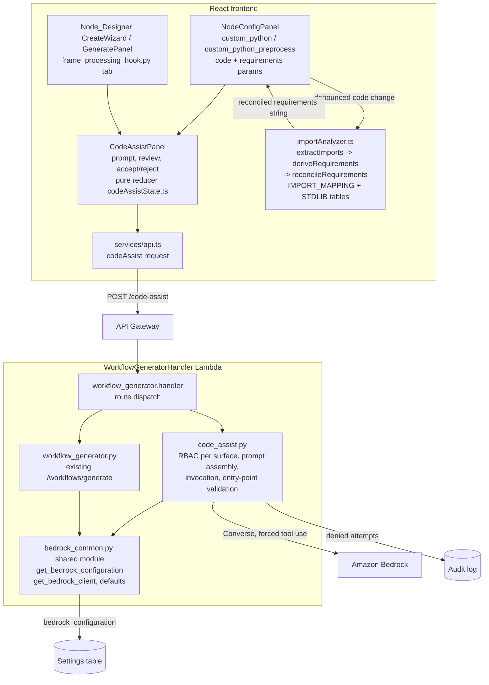

# Design Document: Custom Node Code Assist

## Overview

This feature attaches a Bedrock-backed Code_Assistant to every Portal surface where custom Python node module code is edited, and introduces an Import_Analyzer that derives the node's pip `requirements` from the code's import statements:

- **Code_Assistant** — a prompt panel rendered beside each code editor. The user describes the desired code or filter in natural language; the backend Code_Assist_Generator invokes the account's configured Bedrock model with the prompt, the target Node_Contract, and the runtime environment description, validates that the returned code parses and defines the required entry point, and returns it for review. Accepting places the code into the editor; nothing is auto-saved.
- **Import_Analyzer** — a pure frontend function that, on every (debounced) code change, extracts the code's imports (including imports nested in functions and conditional blocks), maps import names to pip distribution names (`cv2` → `opencv-python-headless`, `PIL` → `Pillow`, …), excludes the standard library and the runtime-provided `dda_frames` module, and reconciles the derived list into the node's `requirements` parameter while preserving every manually added or version-pinned entry.

The feature introduces **no new configuration**: the Code_Assist_Generator reads the existing `bedrock_configuration` settings item with exactly the semantics of the workflow generation feature (defaults, explicit-null sampling parameters, timeout clamped to 1–60 s), extracted into a shared module so the two features cannot drift.

### Code_Editing_Surfaces covered

| Surface | Editor | Node_Contract | `requirements` param |
|---|---|---|---|
| Workflow_Builder NodeConfigPanel, `custom_python` node `code` parameter | `paramType === 'code'` Textarea | `process_frame(frame, metadata)` **or** `handle(frame_bytes, metadata)` (exactly one) | yes — Import_Analyzer active |
| Workflow_Builder NodeConfigPanel, `custom_python_preprocess` node `code` parameter | same | `process_frame(frame, metadata)` | yes — Import_Analyzer active |
| Node_Designer CreateWizard scaffold review, `plugin/frame_processing_hook.py` tab | scaffold file Tabs Textarea | `process_frame(frame, params)` (Frame_Processing_Hook) | no — plugin dependencies are meson-managed, no pip `requirements` parameter exists |
| Node_Designer GeneratePanel scaffold review, `plugin/frame_processing_hook.py` tab | same | same | no |

The Node_Designer surfaces present the assistant only on tabs whose path ends in `.py` (today exactly the Frame_Processing_Hook); C sources, meson files, and READMEs get no assistant (Requirement 1.3 covers *Python* node module code only).

### Key findings from investigation

- **Bedrock plumbing exists twice already.** `workflow_generator.py` and `node_generator.py` each carry `get_bedrock_configuration()` (settings key `bedrock_configuration`, `DEFAULT_BEDROCK_CONFIG`, explicit-null handling for `temperature`/`top_p`, timeout clamped 1..60 s) and `get_bedrock_client(region, timeout)` (per-`(region, timeout)` cached `bedrock-runtime` client, client-side read timeout, retries disabled). Requirement 4 demands byte-equal semantics with workflow generation, so this design extracts the logic into a shared module rather than adding a third copy.
- **The runtime contract to describe in the prompt** lives in `src/backend/workflow_engine/python_bridge.py`: `process_frame(frame, metadata)` receives a NumPy uint8 array (H×W×C, H×W for GRAY8) and must return `None` (pass-through) or an array of identical shape/dtype; `handle(frame_bytes, metadata)` receives raw bytes and returns `(frame_bytes, metadata)`; `cv2`, `np`, and `numpy` are pre-bound on the handler module; `dda_frames` provides `to_array`, `to_bytes`, `frame_info()`, `load_image(path or s3://…)`; every handler sees `metadata["frame"] = {width, height, format}`; stdout belongs to the framed protocol so handlers must never print to it.
- **The Node_Designer hook contract differs**: `render_scaffold` (`workflow_core/scaffold.py`) emits `plugin/frame_processing_hook.py` exposing `process_frame(frame, params)` where `params` carries the declared GObject parameters — no `metadata`, no `dda_frames`, no pip requirements. The generator therefore needs a per-contract environment description, not one hardcoded prompt.
- **`requirements` is a plain string parameter** (requirements.txt form) packaged verbatim by `workflow_packaging.py` as `python/{nodeId}/requirements.txt`. There is no side-channel to store "which entries were derived", so derived-vs-manual must be encoded in the string itself (see the marker-comment decision below).
- **The packager ships only `handler.py`** per custom Python node — no sibling source files exist on the Workflow_Builder surfaces, so Requirement 3.3's "modules packaged alongside the node module's own files" reduces to excluding relative imports (`from . import x`).
- **Routing precedent**: `POST /workflows/generate` is a synchronous LambdaIntegration on the `WorkflowGeneratorHandler` Lambda (60 s Lambda timeout). The api-gateway nested stack is close to the CloudFormation 500-resource limit (its integrations disable test-invoke for that reason), so a new endpoint should reuse an existing Lambda rather than adding a function + role + permissions.
- **Frontend gating predicates exist**: `canEditWorkflows(role)` (`WorkflowToolbar.tsx`) gates workflow editing (DataScientist/UseCaseAdmin/PortalAdmin — exactly the roles holding `workflow:create`/`workflow:edit`); the Node_Designer backend's `can_generate` (`node_generator.py`) allows UseCaseAdmin-in-Use_Case or PortalAdmin.
- **Error-view precedent**: `node-designer/generate.ts` shows the pattern for pure, unit-testable error-presentation helpers (`describeGenerationError`) that keep the prompt in the input box on every failure.
- **The catalog's own `requirements` example** already names `opencv-python-headless`, and the edge LocalServer environment reports its OpenCV as `opencv_python_headless` (`src/backend/endpoints/system.py`), so the Import_Mapping designates `cv2 → opencv-python-headless`.

## Architecture



Request flow for one assist:

1. The user types a prompt (1–4,000 chars) in the CodeAssistPanel and submits. The panel reducer enters `submitting` (spinner shown, submit disabled, editor untouched and still editable).
2. The frontend POSTs `/code-assist` with `{usecase_id, surface, contract, prompt, current_code, context}` — `current_code` is sent only when the editor holds a non-whitespace character (Requirements 2.6, 2.10).
3. `code_assist.py` authorizes per surface (workflow permission or Node_Designer role), returning 403 + audit entry before any generation on denial (Requirement 6.3).
4. It loads the Bedrock_Configuration through the shared module, assembles the contract-specific system prompt and user message, and invokes Converse with a forced `provide_code` tool call.
5. The tool output's `code` is validated server-side with `ast.parse` + entry-point inspection; failures return categorized error envelopes; success returns `{code, notes, model_id}`.
6. The panel shows the returned code for review; Accept writes it into the editor (which triggers the Import_Analyzer on Workflow_Builder surfaces), Reject discards it and keeps the prompt.
7. Independently of the assistant, every editor code change (typed or accepted) runs the Import_Analyzer after a 750 ms debounce — well inside the 2-second bound of Requirement 3.1 — and reconciles the node's `requirements` parameter.

### Key Design Decisions

| Decision | Choice | Rationale |
|---|---|---|
| Where the Import_Analyzer runs | Frontend TypeScript, pure synchronous module | Requirement 3.1's 2-second reactive bound applies to *every* keystroke-driven code change; an in-browser pure function is instant, works offline from the backend, adds no per-edit Lambda traffic, and — being pure — is the feature's best property-test target. The mapping table is **not shared with the backend** because the backend never derives requirements (generation returns code only; derivation always happens editor-side, uniformly for typed and generated code, Requirement 3.1). One table, one owner, no cross-language sync problem. |
| Import extraction technique | Hand-written line/continuation-aware scanner over import statements (comments and string literals stripped first), not a full Python parser | A real Python grammar in the browser (pyodide, tree-sitter WASM) costs megabytes for one function. The scanner recognizes the complete `import` / `from … import` statement grammar including parenthesized and backslash continuations and nested (indented) imports. "Cannot be parsed" (Requirement 3.10) is defined as: a malformed import statement or an unterminated string/paren encountered while scanning — precisely the failures that could corrupt derivation. Syntax errors *outside* import statements cannot change the import set, so deriving from a module that is otherwise broken is safe and useful (the user is mid-edit most of the time). |
| Derived-vs-manual encoding | Trailing marker comment on derived lines: `name  # via code imports` (unmapped: `name  # via code imports (verify package name)`) | The `requirements` parameter string is the only persisted artifact (packaged verbatim as requirements.txt, where comments are legal). A sidecar data structure would desync on reload/duplicate/generate paths. Any line **without** the marker is manual and preserved verbatim — which automatically protects user pins like `numpy==1.24.0` (Requirements 3.5, 3.9). |
| `cv2` mapping | `opencv-python-headless` | Matches the catalog's own `requirements` example and the edge LocalServer's installed OpenCV distribution; `opencv-python` would drag GUI/X11 dependencies onto headless devices. |
| Endpoint shape | Synchronous `POST /code-assist` served by the existing WorkflowGeneratorHandler Lambda (new `code_assist.py` module, dispatched from `workflow_generator.handler`) | Single-file code generation is a small completion (one module, ≤ `max_tokens`), far quicker than the 45–50 s multi-file scaffold generation that forced `node_generator.py` into start/poll sessions. Reusing the Lambda avoids a new function/role/permission set in a nested stack near the CloudFormation resource limit, and the Lambda already holds Bedrock invoke permissions and the settings-table read. The API Gateway 29 s integration ceiling is a pre-existing, shared caveat with `POST /workflows/generate`; a gateway-cut request surfaces through the same timeout error path (Requirement 5.2). |
| Statelessness | No chat sessions; each request carries the current editor code | Requirement 2.6 defines follow-up semantics purely in terms of the current editor content. Dropping sessions removes the DynamoDB table, TTL, and S3 snapshots the workflow generator needs, and guarantees Requirement 6.4 (authorization evaluated fresh per request) structurally. |
| Structured output | Converse forced tool use (`provide_code` tool with `{code, notes}` input schema) | Same mechanism as both existing generators: extraction is a field read, never regex-scraping markdown fences. "No tool call or empty `code`" is the well-defined trigger for Requirement 5.3. |
| Entry-point validation location | Backend, `ast.parse` + top-level `FunctionDef` inspection | The Lambda has a real Python parser; the response is then either code that provably parses and carries the contract's entry point, or a categorized error (Requirements 2.2, 2.3, 5.6). For `custom_python` the validator requires **exactly one** of `process_frame`/`handle` (Requirement 2.3) — two entry points would silently shadow one another at runtime (the bridge prefers `process_frame`). |
| Shared config module | New `backend/functions/bedrock_common.py`; `workflow_generator.py` refactored to import it; `node_generator.py` migration optional follow-up | Requirement 4 pins the assist feature to workflow generation's exact semantics; sharing code makes divergence impossible. The `node_generator.py` copy is left as-is to keep this feature's diff contained (its docstrings/session logic have diverged); migrating it is a mechanical cleanup, not a requirement. |

## Components and Interfaces

### 1. `bedrock_common.py` — shared Bedrock configuration (backend/functions)

Extracted verbatim from `workflow_generator.py` (Requirements 4.1–4.7):

```python
BEDROCK_CONFIG_SETTING_KEY = 'bedrock_configuration'
MAX_TIMEOUT_SECONDS = 60
DEFAULT_BEDROCK_CONFIG = { ... }          # unchanged values

def get_bedrock_configuration() -> Dict:  # unchanged semantics:
    # defaults -> stored overrides; temperature/top_p honor explicit null;
    # timeout coerced to int, junk -> 60, clamped to [1, 60]
def get_bedrock_client(region: str, timeout_seconds: int):  # unchanged:
    # per-(region, timeout) cache, connect_timeout min(t, 10),
    # read_timeout = t, retries disabled
def build_inference_config(config: Dict) -> Dict:
    # {'maxTokens': int(config['max_tokens'])} plus at most ONE sampling
    # parameter: temperature when set, else topP when set (4.2, 4.3)
```

`workflow_generator.py` replaces its local copies with imports (same Lambda bundle — `backend/functions` is one code asset — so this is a same-directory import exactly like its existing `from workflow_validation import …`). `build_inference_config` is newly factored out of `invoke_generation` so both callers share the sampling-exclusivity rule.

### 2. `code_assist.py` — Code_Assist_Generator (backend/functions)

Handles `POST /code-assist`, dispatched from `workflow_generator.handler` (the module lives in the same bundle; the handler gains one `resource == '/code-assist'` branch). Same error envelope, `parse_body`, `forbidden_response`-style helpers as the existing generators.

**Request validation** (400 on failure):
- `usecase_id`, `surface`, `contract`, `prompt` required (`MISSING_FIELDS`)
- `surface` ∈ {`workflow-builder`, `node-designer`} (`INVALID_SURFACE`)
- `contract` ∈ {`process_frame`, `process_frame_or_handle`, `frame_hook`} (`INVALID_CONTRACT`)
- `prompt` a string with ≥ 1 non-whitespace character and `len(prompt) <= 4000` (`INVALID_PROMPT`) — the server-side twin of the frontend check (Requirements 1.4, 2.8)
- `current_code` optional string; `context` optional object (`{node_type?, parameters?: [{name, param_type, description?}]}`, used by `frame_hook` prompts)

**Authorization** (Requirements 6.1–6.4), evaluated on every request before any Bedrock call:

```python
def is_authorized(user, usecase_id, surface) -> bool:
    if surface == 'workflow-builder':
        return has_permission(WORKFLOW_CREATE) or has_permission(WORKFLOW_EDIT)
    return rbac_manager.get_user_role(user, usecase_id) == 'UseCaseAdmin' \
        or user_is_portal_admin(user)      # same rule as node_generator.can_generate
```

Denial returns the uniform 403 `FORBIDDEN` envelope and writes an `unauthorized_access` audit entry carrying the acting user, `surface`, `usecase_id`, and timestamp (Requirement 6.3) — the same `log_audit_event` call shape as `forbidden_response` in `workflow_generator.py`. `get_usecase(usecase_id)` failure returns 404 `USECASE_NOT_FOUND`.

**Prompt assembly** — pure functions (property-tested):

```python
CONTRACTS = {
  'process_frame': {
      'entry_points': frozenset({'process_frame'}),  'require_exactly_one': False,
      'signature': 'process_frame(frame, metadata)',
      'environment': PYTHON_BRIDGE_ENVIRONMENT,      # see below
  },
  'process_frame_or_handle': {
      'entry_points': frozenset({'process_frame', 'handle'}), 'require_exactly_one': True,
      'signature': 'process_frame(frame, metadata) or handle(frame_bytes, metadata)',
      'environment': PYTHON_BRIDGE_ENVIRONMENT,
  },
  'frame_hook': {
      'entry_points': frozenset({'process_frame'}),  'require_exactly_one': False,
      'signature': 'process_frame(frame, params)',
      'environment': FRAME_HOOK_ENVIRONMENT,
  },
}

def build_system_prompt(contract: str, context: Optional[Dict]) -> str
def build_user_message(prompt: str, current_code: Optional[str]) -> str
```

`PYTHON_BRIDGE_ENVIRONMENT` describes the Python_Bridge runtime faithfully (Requirement 2.1), sourced from `python_bridge.py`:
- `process_frame(frame, metadata)`: `frame` is a NumPy uint8 array (H×W×C; H×W for GRAY8, formats RGB/BGR/RGBA/GRAY8); return `None` to pass the frame through, or an array of **identical shape and dtype** (the bridge rejects anything else); mutate `metadata` in place to attach results.
- `handle(frame_bytes, metadata)`: raw bytes in, `(frame_bytes, metadata)` out.
- `cv2`, `np`, and `numpy` are pre-bound on the module — no import needed, but an explicit import is harmless.
- `import dda_frames` provides `to_array(frame_bytes, width, height, format)`, `to_bytes(array)`, `frame_info()` → `{'width', 'height', 'format'}`, `load_image(path_or_s3_uri)` (BGR uint8).
- `metadata["frame"]` carries `{width, height, format}` on every invocation.
- Never write to stdout (it belongs to the frame protocol); use `sys.stderr` for diagnostics.
- Extra pip packages may be imported freely; the Portal derives the node's requirements from the imports (so the model should emit a normal `import` for any library the user asks for — Requirement 3.4).
- Keep the module complete and self-contained: when current code is provided, return the **entire modified module**, never a fragment or diff (Requirement 2.6).

`FRAME_HOOK_ENVIRONMENT` describes the Frame_Processing_Hook: `process_frame(frame, params)` with `params` holding the declared element parameters (names/types injected from `context.parameters`), embedded-interpreter execution, return the processed frame.

`build_user_message(prompt, current_code)` embeds `current_code` in a `CURRENT MODULE CODE` block with modify-not-regenerate instructions **iff** it contains a non-whitespace character; otherwise it sends the prompt alone (Requirements 2.6, 2.10) — mirroring `workflow_generator.build_user_message`.

**Invocation** — `get_bedrock_client(...).converse(...)` with `build_inference_config(config)` and forced tool use:

```python
TOOL_NAME = 'provide_code'
# inputSchema: {type: object, required: [code], properties: {
#   code:  {type: string, description: 'the complete Python module'},
#   notes: {type: string, description: 'one short paragraph for the user'}}}
```

Exception mapping mirrors `invoke_generation` and adds Requirement 5.1's categories in `details.category` (see Error Handling).

**Output validation** — pure function (property-tested):

```python
def validate_entry_point(code: str, contract: str) -> Optional[str]:
    """None when valid; a defect description otherwise.
    - ast.parse failure               -> 'generated code is not valid Python: ...'
    - top-level FunctionDef names are intersected with the contract's
      entry_points; zero matches      -> 'missing entry point ...'
    - require_exactly_one and both
      process_frame and handle defined -> 'defines both entry points ...'
    """
```

Parse failure returns 422 `GENERATED_CODE_INVALID`; a missing/duplicated entry point returns 422 `MISSING_ENTRY_POINT` (Requirements 2.2, 2.3, 5.6). Empty/absent tool output returns 422 `NO_CODE_RETURNED` (Requirement 5.3).

**Success response** (200):

```json
{ "code": "...", "notes": "...", "model_id": "us.anthropic....", "contract": "process_frame" }
```

Nothing is persisted anywhere — no DynamoDB, no S3 (Requirements 2.7, 6.4).

### 3. Infrastructure (api-gateway-stack.ts, compute-stack.ts)

- `api-gateway-stack.ts`: one new top-level resource `code-assist` with `POST` on the existing `workflowGeneratorIntegration` (Cognito authorizer, `allowTestInvoke: false`, CORS OPTIONS like its siblings). Two CloudFormation resources total; no new Lambda.
- `compute-stack.ts`: no change needed — `WorkflowGeneratorHandler` already bundles `backend/functions`, has the 60 s timeout, the settings-table read, and `bedrock:InvokeModel*` permissions used by `/workflows/generate`.

### 4. `importAnalyzer.ts` — Import_Analyzer (frontend/src/pages/workflows/)

A dependency-free pure module (the feature's main property-test target):

```typescript
/** Result of scanning module code for import statements. */
export type ImportScan =
  | { ok: true; imports: string[] }   // absolute top-level module names, deduped
  | { ok: false };                    // unparseable (Requirement 3.10)

export function extractImports(code: string): ImportScan;
```

The scanner strips comments and string literals (tracking single/double/triple quotes; an unterminated string ⇒ `{ok:false}`), joins backslash and open-paren continuations, and matches every logical line — at any indentation, so nested imports count (Requirement 3.1) — against the import-statement grammar:

- `import a.b.c as x, d` → top-level names `a`, `d`
- `from a.b import x, y` → top-level name `a`
- `from . import x` / `from .sib import x` → **relative**: recorded as excluded (Requirement 3.3)
- A line starting with `import`/`from` that does not match the grammar ⇒ `{ok:false}`

```typescript
/** One derived requirements entry. */
export interface DerivedRequirement {
  distribution: string;   // pip distribution name
  needsReview: boolean;   // true when the import had no mapping (3.7)
}

export function deriveRequirements(imports: string[]): DerivedRequirement[];
```

`deriveRequirements` drops names in `STDLIB_MODULES` (the union of CPython 3.9 and 3.11 `sys.stdlib_module_names`, plus `__future__`) and `dda_frames`, then maps the rest: `IMPORT_MAPPING[name]` when present (`needsReview: false`), else the import name itself with `needsReview: true` (Requirements 3.2, 3.3, 3.7). Output is sorted and deduped.

```typescript
export const IMPORT_MAPPING: Record<string, string> = {
  cv2: 'opencv-python-headless',      PIL: 'Pillow',
  sklearn: 'scikit-learn',            skimage: 'scikit-image',
  yaml: 'PyYAML',                     bs4: 'beautifulsoup4',
  dateutil: 'python-dateutil',        dotenv: 'python-dotenv',
  serial: 'pyserial',                 usb: 'pyusb',
  zmq: 'pyzmq',                       paho: 'paho-mqtt',
  tflite_runtime: 'tflite-runtime',   numpy: 'numpy',
  scipy: 'scipy', pandas: 'pandas', requests: 'requests',
  matplotlib: 'matplotlib', torch: 'torch', torchvision: 'torchvision',
  onnxruntime: 'onnxruntime', boto3: 'boto3',
};
```

(Identity entries are listed explicitly where the requirements name them — `numpy` per 3.2 — or where they are common in this domain; anything absent falls through to the identity-plus-review rule, so the table only ever *improves* accuracy.)

**Reconciliation** — the derived-vs-manual merge (Requirements 3.5, 3.9):

```typescript
export const DERIVED_MARKER = '# via code imports';

export interface RequirementsEntry {
  raw: string;            // the verbatim line (manual lines round-trip exactly)
  distribution: string | null;  // normalized (PEP 503) name, null for blank/comment lines
  derived: boolean;       // line carries DERIVED_MARKER
  needsReview: boolean;   // derived line carries the verify suffix
}

export function parseRequirements(text: string): RequirementsEntry[];
export function renderRequirements(entries: RequirementsEntry[]): string;

export function reconcileRequirements(
  currentText: string,
  derived: DerivedRequirement[]
): string;
```

`reconcileRequirements`:
1. `parseRequirements(currentText)`; keep every non-derived line **verbatim and in order** (manual entries, pins, user comments, blank lines).
2. Drop every previously derived line (marker present).
3. Append one line per derived entry whose PEP 503-normalized distribution does not match any surviving manual entry's distribution (Requirement 3.9): `${distribution}  ${DERIVED_MARKER}` or `${distribution}  ${DERIVED_MARKER} (verify package name)`.

The function is idempotent for a fixed derived list and never touches manual text. Callers apply it only when `extractImports` returned `ok: true` (Requirement 3.10) and only when the result differs from the current value (no spurious dirty state).

### 5. `CodeAssistPanel` — shared assistant UI (frontend/src/components/code-assist/)

CloudScape panel rendered inside the owning surface (Requirements 1.1–1.3), props:

```typescript
interface CodeAssistPanelProps {
  usecaseId: string | null;
  surface: 'workflow-builder' | 'node-designer';
  contract: CodeAssistContract;
  context?: { nodeType?: string; parameters?: HookParameter[] };
  editorCode: string;                    // live editor value (2.6 / 2.10)
  onAccept: (code: string) => void;      // the ONLY path that touches the editor
}
```

State is a pure reducer (`codeAssistState.ts`, property-tested):

```typescript
type CodeAssistState =
  | { phase: 'idle';       prompt: string; error: CodeAssistErrorView | null }
  | { phase: 'submitting'; prompt: string }
  | { phase: 'reviewing';  prompt: string; code: string; notes: string };

type CodeAssistEvent =
  | { type: 'edit-prompt'; value: string }
  | { type: 'submit' }                    // ignored unless idle + valid prompt (1.4, 1.6, 2.8)
  | { type: 'succeeded'; code: string; notes: string }
  | { type: 'failed'; error: CodeAssistErrorView }   // -> idle, SAME prompt (5.1-5.3, 5.5)
  | { type: 'accept' }                    // reviewing -> idle, prompt cleared, onAccept fired
  | { type: 'reject' };                   // reviewing -> idle, SAME prompt (2.9)

export function isSubmittablePrompt(prompt: string): boolean;
// trimmed.length >= 1 && prompt.length <= 4000        (1.4, 2.8)
```

Rendering: prompt Textarea with a character counter and constraint text; Generate button disabled while `submitting` or the prompt is unsubmittable, with a `disabledReason` (matching GenerateChatPanel's pattern); `submitting` shows a `StatusIndicator` spinner (1.6) — the *editor* is a sibling component and stays enabled (1.5); `reviewing` shows the returned code read-only (monospace) with the model's `notes` and Accept / Reject buttons (2.4, 2.5, 2.9); failures render an inline Alert from `describeCodeAssistError` (pure helper modeled on `node-designer/generate.ts`) — header per category, message, and for timeouts the applied seconds — while the prompt stays in the input (5.1–5.3).

Errors never invoke `onAccept` and the panel has no access to the requirements or save paths, so Requirement 5.4 holds structurally.

### 6. Workflow_Builder integration (NodeConfigPanel.tsx)

For nodes whose `typeId` is `custom_python` or `custom_python_preprocess`:

- Below the `code` parameter's editor, render `CodeAssistPanel` with `surface='workflow-builder'`, `contract` = `process_frame_or_handle` / `process_frame` respectively, `editorCode` = the effective `code` value, and `onAccept` writing the code into `node.data.parameters` through the existing `onParametersChange` path — the exact channel manual edits use, so canvas markers, validation, and save behavior are untouched (2.5, 2.7). The panel renders only when `canEditWorkflows(role)` (the role is already threaded to the builder page) — Viewer/Operator see no assistant entry point (6.1, 6.5).
- A `useEffect` with a 750 ms debounce watches the effective `code` value; on change it runs `extractImports` → `deriveRequirements` → `reconcileRequirements(currentRequirements, derived)` and, when the text changed, writes the `requirements` parameter through `onParametersChange` (3.1, 3.5). An `{ok:false}` scan applies nothing (3.10).
- The `requirements` parameter control gains a read-only annotation list under the existing editable Textarea (3.6 — the raw text stays the editing surface): each parsed entry renders with a "derived" badge, and `needsReview` entries a warning badge "verify package name" (3.7), reusing the node-designer `badges.tsx` styling.

### 7. Node_Designer integration (CreateWizard.tsx, GeneratePanel.tsx)

Both scaffold-review Tabs editors render `CodeAssistPanel` under the Textarea of any tab whose path ends with `.py` (today `plugin/frame_processing_hook.py`), with `surface='node-designer'`, `contract='frame_hook'`, `context.parameters` = the declaration's parameters, `editorCode` = that file's content, and `onAccept` replacing that file in the `files` map (1.3, 2.5). Gating: the panel renders only for UseCaseAdmin/PortalAdmin — the same rule that already gates these pages' mutating actions (6.2, 6.5). No Import_Analyzer here (no pip `requirements` parameter exists on this surface).

In GeneratePanel the per-file assistant coexists with the existing whole-scaffold chat: the chat regenerates the full file set through `node_generator.py` sessions; the Code_Assistant edits the hook file in place. They share no state.

### 8. Frontend API client (services/api.ts)

```typescript
async codeAssist(request: CodeAssistRequest): Promise<CodeAssistResponse>
// POST /code-assist following the existing request conventions
// (bearer token, loading bus, ApiError envelope with code/details)
```

## Data Models

### Code-assist API

```typescript
type CodeAssistContract = 'process_frame' | 'process_frame_or_handle' | 'frame_hook';

interface CodeAssistRequest {
  usecase_id: string;
  surface: 'workflow-builder' | 'node-designer';
  contract: CodeAssistContract;
  prompt: string;                       // 1..4000 chars, non-whitespace
  current_code?: string;                // present iff editor has non-whitespace content
  context?: {
    nodeType?: string;                  // e.g. 'custom_python_preprocess'
    parameters?: { name: string; param_type: string; description?: string }[];
  };
}

interface CodeAssistResponse {
  code: string;
  notes: string;
  model_id: string;
  contract: CodeAssistContract;
}
```

### Error envelope

`{"error": {"code", "message", "details"}}` — identical shape to every Workflow Manager endpoint.

| HTTP | code | details | Requirement |
|---|---|---|---|
| 400 | `MISSING_FIELDS` / `INVALID_PROMPT` / `INVALID_SURFACE` / `INVALID_CONTRACT` / `INVALID_JSON` | — | 1.4, 2.8 |
| 403 | `FORBIDDEN` | `{surface, usecase_id}` | 6.1–6.3 |
| 404 | `USECASE_NOT_FOUND` | — | — |
| 502 | `BEDROCK_INVOCATION_FAILED` | `{category, bedrock_error_code, model_id}` | 5.1 |
| 502 | `BEDROCK_UNREACHABLE` | `{region, category: 'model-access'}` | 5.1 |
| 504 | `GENERATION_TIMEOUT` | `{timeout_seconds, model_id}` | 5.2 |
| 422 | `NO_CODE_RETURNED` | `{stop_reason}` | 5.3 |
| 422 | `GENERATED_CODE_INVALID` | `{defect}` | 2.2, 2.3 |
| 422 | `MISSING_ENTRY_POINT` | `{defect, contract}` | 5.6 |

`details.category` ∈ `'throttling' | 'authorization' | 'model-access' | 'model-error'` (Requirement 5.1), from:

| botocore error code | category |
|---|---|
| `ThrottlingException`, `TooManyRequestsException`, `ServiceQuotaExceededException` | `throttling` |
| `AccessDeniedException`, `UnrecognizedClientException`, `ExpiredTokenException` | `authorization` |
| `ResourceNotFoundException`, `ModelNotReadyException`, `ValidationException` | `model-access` |
| `ModelErrorException`, `ModelTimeoutException`, `ServiceUnavailableException`, `InternalServerException`, anything else | `model-error` |

### Requirements text model (frontend)

- `DerivedRequirement { distribution: string; needsReview: boolean }`
- `RequirementsEntry { raw: string; distribution: string | null; derived: boolean; needsReview: boolean }`
- Derived line format: `<distribution>  # via code imports` / `<distribution>  # via code imports (verify package name)`
- Distribution-name normalization for duplicate detection (PEP 503): lowercase, `[-_.]+` → `-`.

### Bedrock_Configuration (unchanged, read-only reuse)

Settings-table item under key `bedrock_configuration`: `{model_id, region, max_tokens, temperature, top_p, timeout_seconds}` with workflow generation's defaults and null semantics (Requirement 4).

## Correctness Properties

*A property is a characteristic or behavior that should hold true across all valid executions of a system — essentially, a formal statement about what the system should do. Properties serve as the bridge between human-readable specifications and machine-verifiable correctness guarantees.*

The pure functions of this design — prompt validity, invocation assembly, entry-point validation, import extraction/derivation/reconciliation, Bedrock config resolution, error categorization, and the panel reducer — are all deterministic input→output transformations, making them direct property-test targets.

### Property 1: Prompt validity predicate

*For any* string, `isSubmittablePrompt` (and the backend's `INVALID_PROMPT` check) accepts it if and only if it contains at least one non-whitespace character and its length is at most 4,000; a rejected prompt never triggers a Code_Assist_Generator invocation.

**Validates: Requirements 1.4, 2.8**

### Property 2: Invocation assembly

*For any* prompt, contract, and editor content: the assembled Converse messages contain the prompt verbatim; the system prompt contains the contract's entry-point signature and its environment description markers (`dda_frames`, pre-bound `cv2`/`np` for the Python_Bridge contracts; `params` for `frame_hook`); and the user message embeds the editor content in a modify-this-module block if and only if the editor content contains a non-whitespace character.

**Validates: Requirements 2.1, 2.6, 2.10**

### Property 3: Entry-point validation

*For any* generated Python source and contract, `validate_entry_point` returns no defect if and only if the source parses as Python **and** the set of top-level function definitions intersected with the contract's entry points satisfies the contract's rule — at least one match for `process_frame` and `frame_hook`, exactly one of {`process_frame`, `handle`} for `process_frame_or_handle`.

**Validates: Requirements 2.2, 2.3, 5.6**

### Property 4: Import extraction completeness

*For any* Python module assembled from a random set of import statements (plain, aliased, multi-name, `from … import`, dotted, placed at top level or nested inside function bodies and conditional blocks, interleaved with non-import code, comments, and string literals that mention import-like text), `extractImports` returns `ok: true` with exactly the set of absolute top-level module names of the planted imports.

**Validates: Requirements 3.1**

### Property 5: Requirements derivation

*For any* set of imported top-level module names, every element of `deriveRequirements`: standard-library names, `dda_frames`, and relative imports produce no entry; every name present in the Import_Mapping produces exactly its mapped distribution with `needsReview: false` (in particular `cv2` → `opencv-python-headless` and `numpy` → `numpy`); every other name produces the name itself with `needsReview: true`; and no other entries exist.

**Validates: Requirements 3.2, 3.3, 3.7, 3.8**

### Property 6: Reconciliation preserves manual entries and replaces derived ones

*For any* requirements text composed of random manual lines (including version-pinned entries and comments) and previously derived marker lines, and any derived list: `reconcileRequirements` keeps every manual line verbatim and in order, removes every previously derived line not re-derived, and adds no derived entry whose PEP 503-normalized distribution equals that of a surviving manual entry.

**Validates: Requirements 3.5, 3.9**

### Property 7: Reconciliation idempotence

*For any* requirements text and derived list, applying `reconcileRequirements` twice with the same derived list yields the same text as applying it once.

**Validates: Requirements 3.5**

### Property 8: Requirements text round trip

*For any* list of requirements entries, `parseRequirements(renderRequirements(entries))` yields entries with identical raw lines, derived flags, and needs-review flags — so the derived/manual distinction encoded in the parameter string survives persistence and reload.

**Validates: Requirements 3.5, 3.6, 3.7**

### Property 9: Unparseable code changes nothing

*For any* module code into which a malformed import statement or unterminated string literal has been injected, `extractImports` returns `ok: false`, and the surface's derivation step consequently leaves the current requirements text byte-identical.

**Validates: Requirements 3.10**

### Property 10: Bedrock configuration resolution

*For any* stored configuration item (any subset of the known keys, with arbitrary extra keys, Decimal-typed numbers, explicit nulls for sampling parameters, and arbitrary junk in `timeout_seconds`), the resolved configuration equals the workflow-generation defaults overridden by the present non-null values, except that explicitly stored null `temperature`/`top_p` remain unset; and the resolved timeout is an integer in [1, 60], equal to 60 whenever the stored value is missing or not interpretable as a number.

**Validates: Requirements 4.1, 4.4, 4.6, 4.7**

### Property 11: Sampling parameter exclusivity

*For any* combination of `temperature` and `top_p` values (each set or unset), `build_inference_config` emits at most one sampling parameter: `temperature` when it is set, else `topP` when it is set, and omits any parameter that is unset.

**Validates: Requirements 4.2, 4.3**

### Property 12: Failure category totality

*For any* Bedrock error-code string, the categorization function returns exactly one of `throttling`, `authorization`, `model-access`, `model-error`, with each code in the designated mapping table landing in its designated category.

**Validates: Requirements 5.1**

### Property 13: Panel failure recovery preserves the prompt

*For any* sequence of CodeAssistPanel reducer events, whenever a `failed` event is processed the resulting state is `idle` with the prompt string unchanged from the moment of submission and an error view present; a `reject` event likewise returns to `idle` with the prompt unchanged; `submit` is a no-op except from `idle` with a submittable prompt; and `onAccept` is invoked only by an `accept` event from `reviewing`.

**Validates: Requirements 1.6, 2.9, 5.1, 5.2, 5.3, 5.5**

## Error Handling

### Backend (`code_assist.py`)

- **Request errors** (400/403/404): validated before any Bedrock traffic; the 403 path writes the `unauthorized_access` audit entry with user, surface, Use_Case, and timestamp and never constructs a Bedrock client (Requirement 6.3).
- **Timeout** (`ReadTimeoutError`/`ConnectTimeoutError`): 504 `GENERATION_TIMEOUT` whose message states the applied (clamped) timeout in seconds and whose details carry `timeout_seconds` (Requirement 5.2). The client-side read timeout equals the clamped value and retries are disabled, so wall time cannot exceed it.
- **Endpoint unreachable** (`EndpointConnectionError`): 502 `BEDROCK_UNREACHABLE`, category `model-access`.
- **`ClientError`**: 502 `BEDROCK_INVOCATION_FAILED` with `details.category` from the mapping table and the original Bedrock message (Requirement 5.1).
- **No/empty tool output**: 422 `NO_CODE_RETURNED` (Requirement 5.3).
- **Invalid/entry-point-less code**: 422 `GENERATED_CODE_INVALID` / `MISSING_ENTRY_POINT` with the defect description (Requirements 2.2, 2.3, 5.6).
- Unexpected exceptions fall through the handler's existing 500 `INTERNAL_ERROR` guard.
- A settings-table read failure logs a warning and proceeds with defaults inside `get_bedrock_configuration` — the request never fails for that reason (Requirement 4.5).

### Frontend

- Every failure path funnels through the reducer's `failed` event: the spinner clears, the prompt stays in the input for resubmission, manual editing was never blocked, and the editor/`requirements`/workflow state are untouched because failures carry no code and only `accept` can emit code (Requirements 5.4, 5.5).
- `describeCodeAssistError` maps `ApiError` code + `details.category` to a headed alert (Throttled / Not authorized to invoke the model / Model not available / Model error / Timed out after N seconds / No code produced), falling back to a generic header for unknown codes — the same defensive pattern as `describeGenerationError`.
- The Import_Analyzer is failure-free by construction: an `{ok:false}` scan is a normal outcome that applies no change (Requirement 3.10); reconciliation is applied only when its output differs from the current text.

## Testing Strategy

Property-based tests use **hypothesis** for backend Python (`edge-cv-portal/backend/tests/`, matching `test_workflow_generation.py` conventions) and **fast-check** for frontend TypeScript (colocated `*.property.test.ts`, matching the node-designer suites). Every property test runs a minimum of **100 iterations** and carries a comment tag referencing its design property:

```
# Feature: custom-node-code-assist, Property 3: Entry-point validation
```

**Property tests (backend, hypothesis)** — Properties 2, 3, 10, 11, 12 against `code_assist.py` and `bedrock_common.py`. Generators: prompt/code strings including unicode and whitespace-only cases; synthesized Python modules with controlled top-level/nested function definitions; partial config dicts with Decimals, nulls, and junk timeouts; arbitrary error-code strings seeded with the known Bedrock codes.

**Property tests (frontend, fast-check)** — Property 1 (`isSubmittablePrompt`), Properties 4–9 (`importAnalyzer.ts`: a module-builder arbitrary that plants known imports at random nesting/positions among filler statements, comments, and strings; a requirements-text arbitrary mixing manual lines, pins, comments, and marker lines; a corruption arbitrary injecting malformed imports/unterminated strings), and Property 13 (`codeAssistState.ts` reducer over random event sequences).

**Unit/example tests**
- Backend: RBAC matrix per surface incl. audit-entry assertions and no-Bedrock-call-on-denial (6.1–6.3); settings read failure → defaults (4.5); mocked Converse responses for timeout with `timeout_seconds` echo (5.2), missing tool call (5.3), and the happy path; handler route dispatch for `/code-assist`.
- Frontend (Vitest + Testing Library): assistant presence on both Workflow_Builder node types and on the `.py` scaffold tab but not the C tab (1.1–1.3); role gating hides the panel for Viewer/Operator and non-admin Node_Designer users (6.5); review-before-apply, accept-into-editor, reject-preserves-everything flows (2.4, 2.5, 2.9); editor remains editable and unchanged while a request is pending (1.5, 1.6); requirements badges render for derived and needs-review entries (3.6, 3.7); no save/persist API call in any assistant flow (2.7).
- Debounce timing (3.1's 2-second bound) is verified with fake timers: a code change leads to exactly one analysis after 750 ms.

**Not automated**: Requirement 3.4 (the model actually importing a prompt-requested library) is nondeterministic LLM behavior; it is addressed by the system-prompt instruction (asserted in Property 2's markers) and by the derivation pipeline handling whatever imports are returned. Requirement 6.4 (per-request authorization) holds structurally in the stateless handler and is covered by code review.
