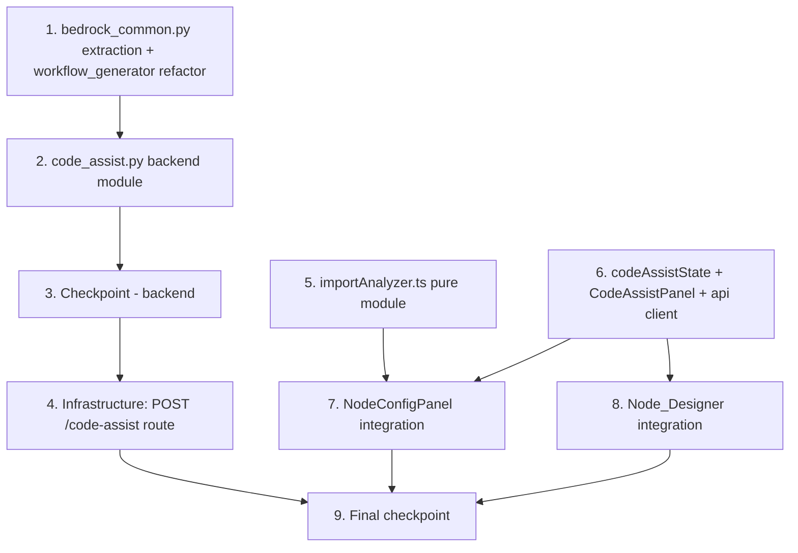

# Implementation Plan: Custom Node Code Assist

## Overview

Implementation follows the dependency order the design lays out: the shared `bedrock_common.py` module is extracted first (with the workflow-generation regression baseline intact, since Requirement 4 pins the assist feature to those exact semantics), then the `code_assist.py` backend module with its handler dispatch, entry-point validation, and error mapping; the infrastructure route follows once the handler branch exists. On the frontend, the pure `importAnalyzer.ts` module and the `codeAssistState.ts` reducer + `CodeAssistPanel` + API client are built as standalone, property-tested units before being wired into the two surfaces: NodeConfigPanel (assistant + debounced Import_Analyzer + requirements badges) and the Node_Designer scaffold editors (assistant on `.py` tabs). Property tests sit directly beside the code they validate.

Test baselines that must stay green throughout: portal backend pytest scoped to `tests/` run from `edge-cv-portal/backend` (moto-backed conftest stack), and the frontend suite (`npx vitest run`) plus `npm run build` run from `edge-cv-portal/frontend`. Python property tests use `hypothesis` (no hardcoded `max_examples`; the project default provides ≥100 iterations) as `test_property_*.py`; TypeScript property tests use `fast-check` with `numRuns: 100`. Each property test is tagged `**Feature: custom-node-code-assist, Property {number}: {property_text}**`.

## Task Dependency Graph



```json
{
  "waves": [
    { "wave": 1, "tasks": ["1", "5"], "description": "Independent foundations: the shared Bedrock configuration module extracted from workflow_generator.py (backend), and the pure import-analysis module with its extraction/derivation/reconciliation properties (frontend)" },
    { "wave": 2, "tasks": ["2", "6"], "description": "Consumers of the foundations: the code_assist.py generator with handler dispatch, validation, and error mapping (backend), and the panel reducer, CodeAssistPanel component, error presenter, and API client (frontend)" },
    { "wave": 3, "tasks": ["3"], "description": "Checkpoint: portal backend suite passes with the refactored workflow generator and the new code-assist module" },
    { "wave": 4, "tasks": ["4", "7", "8"], "description": "Wiring: the API Gateway route, the NodeConfigPanel integration (assistant + Import_Analyzer + badges), and the Node_Designer scaffold-tab integration" },
    { "wave": 5, "tasks": ["9"], "description": "Final checkpoint: all baselines pass" }
  ]
}
```

## Tasks

- [x] 1. Extract the shared Bedrock configuration module and refactor the workflow generator
  - [x] 1.1 Create `bedrock_common.py` with configuration resolution, client cache, and inference config
    - New `edge-cv-portal/backend/functions/bedrock_common.py`: `BEDROCK_CONFIG_SETTING_KEY`, `MAX_TIMEOUT_SECONDS`, `DEFAULT_BEDROCK_CONFIG` (values unchanged from `workflow_generator.py`); `get_bedrock_configuration()` with the exact existing semantics (defaults overridden by stored values, explicit-null `temperature`/`top_p` remain unset, timeout coerced to int with junk → 60 and clamped to [1, 60]); `get_bedrock_client(region, timeout_seconds)` with the per-`(region, timeout)` cache, `connect_timeout = min(t, 10)`, `read_timeout = t`, retries disabled; new `build_inference_config(config)` factored out of `invoke_generation` emitting `maxTokens` plus at most one sampling parameter (temperature when set, else topP when set)
    - _Requirements: 4.1, 4.2, 4.3, 4.4, 4.5, 4.6, 4.7_

  - [x] 1.2 Refactor `workflow_generator.py` to import the shared module
    - Replace the local `get_bedrock_configuration`/`get_bedrock_client`/defaults copies with same-directory imports from `bedrock_common` (same Lambda bundle, like the existing `from workflow_validation import …`); `invoke_generation` uses `build_inference_config`; behavior byte-equal — the existing `test_workflow_generation.py` suite passes unchanged; `node_generator.py` is left as-is
    - _Requirements: 4.1_

  - [x]* 1.3 Write property test for Bedrock configuration resolution
    - **Feature: custom-node-code-assist, Property 10: Bedrock configuration resolution**
    - **Validates: Requirements 4.1, 4.4, 4.6, 4.7**
    - hypothesis in `edge-cv-portal/backend/tests` over stored configuration items (any subset of known keys, arbitrary extra keys, Decimal-typed numbers, explicit nulls for sampling parameters, junk `timeout_seconds`): resolved config equals defaults overridden by present non-null values with explicit-null sampling parameters unset; resolved timeout is an integer in [1, 60], equal to 60 whenever the stored value is missing or uninterpretable

  - [x]* 1.4 Write property test for sampling parameter exclusivity
    - **Feature: custom-node-code-assist, Property 11: Sampling parameter exclusivity**
    - **Validates: Requirements 4.2, 4.3**
    - hypothesis over set/unset combinations of `temperature` and `top_p`: `build_inference_config` emits at most one sampling parameter — `temperature` when set, else `topP` when set — and omits unset parameters

  - [x]* 1.5 Write unit test for settings read failure falling back to defaults
    - A raising settings-table read inside `get_bedrock_configuration` logs a warning and returns the workflow-generation defaults; no exception escapes
    - _Requirements: 4.5_

- [x] 2. Implement the Code_Assist_Generator backend module
  - [x] 2.1 Implement request validation, per-surface authorization, and prompt assembly in `code_assist.py`
    - New `edge-cv-portal/backend/functions/code_assist.py`: request validation per the design's 400 matrix (`MISSING_FIELDS`, `INVALID_SURFACE`, `INVALID_CONTRACT`, `INVALID_PROMPT` for prompts without a non-whitespace character or over 4,000 chars, optional `current_code` string and `context` object); `is_authorized(user, usecase_id, surface)` — workflow create/edit permission for `workflow-builder`, UseCaseAdmin-in-Use_Case or PortalAdmin for `node-designer` (same rule as `node_generator.can_generate`); denial returns the uniform 403 `FORBIDDEN` envelope and writes the `unauthorized_access` audit entry (acting user, surface, usecase_id, timestamp) before any Bedrock client is constructed; `get_usecase` failure → 404 `USECASE_NOT_FOUND`; the `CONTRACTS` table (`process_frame`, `process_frame_or_handle` with `require_exactly_one`, `frame_hook`) with `PYTHON_BRIDGE_ENVIRONMENT` and `FRAME_HOOK_ENVIRONMENT` descriptions per the design; pure `build_system_prompt(contract, context)` and `build_user_message(prompt, current_code)` embedding `current_code` in the modify-not-regenerate block iff it contains a non-whitespace character
    - _Requirements: 1.4, 2.1, 2.6, 2.8, 2.10, 6.1, 6.2, 6.3, 6.4_

  - [x] 2.2 Implement the Bedrock invocation, entry-point validation, and error mapping
    - Converse call through `bedrock_common.get_bedrock_client` + `build_inference_config` with the forced `provide_code` tool (`{code, notes}` input schema); pure `validate_entry_point(code, contract)` via `ast.parse` + top-level `FunctionDef` intersection with the contract's entry points (at least one match; exactly one of `process_frame`/`handle` for `process_frame_or_handle`); error envelopes per the design table: 504 `GENERATION_TIMEOUT` stating the applied timeout seconds, 502 `BEDROCK_UNREACHABLE` (category `model-access`), 502 `BEDROCK_INVOCATION_FAILED` with `details.category` from the botocore error-code → {throttling, authorization, model-access, model-error} mapping, 422 `NO_CODE_RETURNED` / `GENERATED_CODE_INVALID` / `MISSING_ENTRY_POINT`; success returns `{code, notes, model_id, contract}` with nothing persisted
    - _Requirements: 2.2, 2.3, 2.7, 5.1, 5.2, 5.3, 5.6_

  - [x] 2.3 Dispatch `POST /code-assist` from the workflow generator handler
    - `workflow_generator.handler` gains a `resource == '/code-assist'` branch delegating to `code_assist.py` (same bundle); existing routes unchanged; unexpected exceptions fall through the existing 500 `INTERNAL_ERROR` guard
    - _Requirements: 2.1_

  - [x]* 2.4 Write property test for invocation assembly
    - **Feature: custom-node-code-assist, Property 2: Invocation assembly**
    - **Validates: Requirements 2.1, 2.6, 2.10**
    - hypothesis over prompts, contracts, and editor content (including unicode and whitespace-only): assembled messages contain the prompt verbatim; the system prompt carries the contract's entry-point signature and environment markers (`dda_frames`, pre-bound `cv2`/`np` for Python_Bridge contracts; `params` for `frame_hook`); the user message embeds the editor content in the modify-this-module block iff it contains a non-whitespace character

  - [x]* 2.5 Write property test for entry-point validation
    - **Feature: custom-node-code-assist, Property 3: Entry-point validation**
    - **Validates: Requirements 2.2, 2.3, 5.6**
    - hypothesis over synthesized Python modules with controlled top-level/nested function definitions (and invalid sources) × contracts: `validate_entry_point` returns no defect iff the source parses and the top-level definitions satisfy the contract's rule — at least one match for `process_frame`/`frame_hook`, exactly one of {`process_frame`, `handle`} for `process_frame_or_handle`

  - [x]* 2.6 Write property test for failure category totality
    - **Feature: custom-node-code-assist, Property 12: Failure category totality**
    - **Validates: Requirements 5.1**
    - hypothesis over arbitrary error-code strings seeded with the known Bedrock codes: the categorization returns exactly one of `throttling`/`authorization`/`model-access`/`model-error`, with every code in the design's mapping table landing in its designated category

  - [x]* 2.7 Write unit tests for RBAC, error paths, and the happy path
    - RBAC matrix per surface (workflow permissions; UseCaseAdmin/PortalAdmin) including the audit-entry assertion and no Bedrock client construction on denial; mocked Converse: read-timeout → 504 with `timeout_seconds` echoing the clamped value, missing/empty tool call → 422 `NO_CODE_RETURNED`, happy path returning `{code, notes, model_id, contract}`; handler route dispatch for `/code-assist`; request-validation 400s
    - _Requirements: 5.1, 5.2, 5.3, 6.1, 6.2, 6.3_

- [x] 3. Checkpoint - backend complete
  - Run the portal backend suite (pytest scoped to `tests/` from `edge-cv-portal/backend`); ensure all tests pass — including the pre-existing workflow generation suite against the refactored module — ask the user if questions arise.

- [x] 4. Add the infrastructure route
  - [x] 4.1 Add `POST /code-assist` to the API Gateway stack
    - `edge-cv-portal/infrastructure/lib/api-gateway-stack.ts`: one new top-level `code-assist` resource with `POST` on the existing `workflowGeneratorIntegration` (Cognito authorizer, `allowTestInvoke: false`, CORS OPTIONS like its siblings); no compute-stack change (the Lambda already bundles `backend/functions` with the 60 s timeout, settings-table read, and Bedrock permissions); `npm run build` in `infrastructure` compiles clean
    - _Requirements: 2.1_

- [x] 5. Implement the Import_Analyzer pure module (frontend)
  - [x] 5.1 Implement `extractImports` in `importAnalyzer.ts`
    - New `edge-cv-portal/frontend/src/pages/workflows/importAnalyzer.ts`: the line/continuation-aware scanner — strip comments and string literals (single/double/triple quotes; unterminated string → `{ok:false}`), join backslash and open-paren continuations, match every logical line at any indentation against the import grammar (`import a.b.c as x, d` → `a`, `d`; `from a.b import x, y` → `a`; relative `from . import …` recorded as excluded); a line starting with `import`/`from` that does not match the grammar → `{ok:false}`; result deduped absolute top-level names
    - _Requirements: 3.1, 3.3, 3.10_

  - [x] 5.2 Implement `deriveRequirements` with the Import_Mapping and stdlib tables
    - `IMPORT_MAPPING` per the design (`cv2` → `opencv-python-headless`, `PIL` → `Pillow`, `sklearn` → `scikit-learn`, `yaml` → `PyYAML`, identity entries incl. `numpy`, …); `STDLIB_MODULES` as the union of CPython 3.9 and 3.11 `sys.stdlib_module_names` plus `__future__`; `deriveRequirements(imports)` drops stdlib names and `dda_frames`, maps mapped names with `needsReview: false`, falls through to identity-plus-`needsReview: true` for unmapped names; output sorted and deduped
    - _Requirements: 3.2, 3.3, 3.7_

  - [x] 5.3 Implement requirements parsing, rendering, and reconciliation
    - `DERIVED_MARKER` (`# via code imports`, unmapped suffix `(verify package name)`); `parseRequirements`/`renderRequirements` over `RequirementsEntry` (verbatim raw lines, PEP 503-normalized distribution — lowercase, `[-_.]+` → `-`, derived and needsReview flags); `reconcileRequirements(currentText, derived)` keeping every non-derived line verbatim and in order, dropping previously derived lines, appending one marker line per derived entry whose normalized distribution matches no surviving manual entry; idempotent for a fixed derived list
    - _Requirements: 3.5, 3.9_

  - [x]* 5.4 Write property test for import extraction completeness
    - **Feature: custom-node-code-assist, Property 4: Import extraction completeness**
    - **Validates: Requirements 3.1**
    - fast-check (`numRuns: 100`) with a module-builder arbitrary planting known imports (plain, aliased, multi-name, `from … import`, dotted, top-level or nested in function bodies and conditional blocks) among filler statements, comments, and import-mentioning string literals: `extractImports` returns `ok: true` with exactly the planted absolute top-level names

  - [x]* 5.5 Write property test for requirements derivation
    - **Feature: custom-node-code-assist, Property 5: Requirements derivation**
    - **Validates: Requirements 3.2, 3.3, 3.7, 3.8**
    - fast-check over sets of imported top-level names: stdlib names, `dda_frames`, and relative imports produce no entry; mapped names produce exactly their mapped distribution with `needsReview: false` (in particular `cv2` → `opencv-python-headless`, `numpy` → `numpy`); every other name produces itself with `needsReview: true`; no other entries exist

  - [x]* 5.6 Write property test for reconciliation preserving manual entries
    - **Feature: custom-node-code-assist, Property 6: Reconciliation preserves manual entries and replaces derived ones**
    - **Validates: Requirements 3.5, 3.9**
    - fast-check with a requirements-text arbitrary mixing manual lines, version pins, comments, and marker lines × derived lists: every manual line kept verbatim and in order; every previously derived line not re-derived removed; no derived entry added whose PEP 503-normalized distribution equals a surviving manual entry's

  - [x]* 5.7 Write property test for reconciliation idempotence
    - **Feature: custom-node-code-assist, Property 7: Reconciliation idempotence**
    - **Validates: Requirements 3.5**
    - fast-check over requirements texts and derived lists: applying `reconcileRequirements` twice with the same derived list equals applying it once

  - [x]* 5.8 Write property test for the requirements text round trip
    - **Feature: custom-node-code-assist, Property 8: Requirements text round trip**
    - **Validates: Requirements 3.5, 3.6, 3.7**
    - fast-check over lists of requirements entries: `parseRequirements(renderRequirements(entries))` yields identical raw lines, derived flags, and needs-review flags

  - [x]* 5.9 Write property test for unparseable code changing nothing
    - **Feature: custom-node-code-assist, Property 9: Unparseable code changes nothing**
    - **Validates: Requirements 3.10**
    - fast-check with a corruption arbitrary injecting a malformed import statement or unterminated string literal into module code: `extractImports` returns `ok: false`, and the surface's derivation step consequently leaves the current requirements text byte-identical

- [x] 6. Implement the CodeAssistPanel, state reducer, and API client (frontend)
  - [x] 6.1 Implement the `codeAssistState.ts` pure reducer and prompt predicate
    - New `edge-cv-portal/frontend/src/components/code-assist/codeAssistState.ts`: the `idle`/`submitting`/`reviewing` state machine over `edit-prompt`/`submit`/`succeeded`/`failed`/`accept`/`reject` events — `submit` ignored unless idle with a submittable prompt; `failed` → idle with the same prompt and an error view; `reject` → idle with the same prompt; `accept` → idle with the prompt cleared; `isSubmittablePrompt(prompt)` = trimmed length ≥ 1 and total length ≤ 4,000
    - _Requirements: 1.4, 1.6, 2.8, 2.9, 5.5_

  - [x] 6.2 Implement the error presenter and API client
    - Pure `describeCodeAssistError` (modeled on `node-designer/generate.ts`'s `describeGenerationError`) mapping `ApiError` code + `details.category` to headed alerts — Throttled / Not authorized to invoke the model / Model not available / Model error / Timed out after N seconds (from `details.timeout_seconds`) / No code produced — with a generic fallback for unknown codes; `codeAssist(request)` in `edge-cv-portal/frontend/src/services/api.ts` POSTing `/code-assist` with the existing bearer-token/loading-bus/ApiError conventions
    - _Requirements: 5.1, 5.2, 5.3_

  - [x] 6.3 Implement the `CodeAssistPanel` component
    - New `edge-cv-portal/frontend/src/components/code-assist/CodeAssistPanel.tsx` over the reducer: prompt Textarea with character counter and constraint text; Generate button disabled while submitting or the prompt is unsubmittable (with `disabledReason`); submitting shows a `StatusIndicator` spinner while the sibling editor stays enabled; reviewing shows the returned code read-only (monospace) with the model's `notes` and Accept/Reject buttons; failures render the inline Alert from `describeCodeAssistError` with the prompt retained; `current_code` sent iff `editorCode` has a non-whitespace character; `onAccept(code)` is the only path that touches the editor; no save/persist call anywhere in the panel
    - _Requirements: 1.4, 1.5, 1.6, 2.4, 2.5, 2.6, 2.7, 2.9, 2.10, 5.4, 5.5_

  - [x]* 6.4 Write property test for the prompt validity predicate
    - **Feature: custom-node-code-assist, Property 1: Prompt validity predicate**
    - **Validates: Requirements 1.4, 2.8**
    - fast-check over arbitrary strings (unicode, whitespace-only, boundary lengths around 4,000): `isSubmittablePrompt` accepts iff at least one non-whitespace character and length ≤ 4,000; the reducer never leaves `idle` on `submit` with a rejected prompt (no invocation)

  - [x]* 6.5 Write property test for panel failure recovery
    - **Feature: custom-node-code-assist, Property 13: Panel failure recovery preserves the prompt**
    - **Validates: Requirements 1.6, 2.9, 5.1, 5.2, 5.3, 5.5**
    - fast-check over random reducer event sequences: every `failed` yields `idle` with the prompt unchanged from submission and an error view present; `reject` returns to `idle` with the prompt unchanged; `submit` is a no-op except from `idle` with a submittable prompt; accept-callback effects occur only on `accept` from `reviewing`

  - [x]* 6.6 Write component tests for the panel flows
    - Vitest + Testing Library: review-before-apply (returned code shown, editor untouched until Accept); Accept fires `onAccept` with the code and clears the prompt; Reject preserves editor and prompt; spinner shown and resubmission blocked while pending, editor sibling still editable; error alert per category with prompt retained; no persist API call in any flow
    - _Requirements: 1.5, 1.6, 2.4, 2.5, 2.7, 2.9, 5.4, 5.5_

- [x] 7. Integrate the assistant and Import_Analyzer into NodeConfigPanel
  - [x] 7.1 Render the CodeAssistPanel for the custom Python node types
    - In `edge-cv-portal/frontend/src/pages/workflows/NodeConfigPanel.tsx` (custom_python → contract `process_frame_or_handle`, custom_python_preprocess → `process_frame`): render `CodeAssistPanel` below the `code` parameter editor with `surface='workflow-builder'`, `editorCode` = the effective `code` value, and `onAccept` writing through the existing `onParametersChange` path; panel rendered only when `canEditWorkflows(role)` — Viewer/Operator see no assistant entry point
    - _Requirements: 1.1, 1.2, 2.5, 2.7, 6.1, 6.5_

  - [x] 7.2 Wire the debounced Import_Analyzer and requirements badges
    - A 750 ms-debounced effect on the effective `code` value runs `extractImports` → `deriveRequirements` → `reconcileRequirements(currentRequirements, derived)` and writes the `requirements` parameter through `onParametersChange` only when the text changed; an `{ok:false}` scan applies nothing; the `requirements` parameter control gains a read-only annotation list under the editable Textarea — "derived" badge per marker entry, "verify package name" warning badge for `needsReview` entries (reusing the node-designer `badges.tsx` styling)
    - _Requirements: 3.1, 3.5, 3.6, 3.7, 3.10_

  - [x]* 7.3 Write component tests for the Workflow_Builder integration
    - Assistant present beside the `code` editor for both node types and absent for other node types; hidden for Viewer/Operator roles; fake-timer debounce test — one analysis run 750 ms after a code change updates the `requirements` parameter; accepted generated code triggers derivation; derived and needs-review badges render; manual pins survive a derivation pass
    - _Requirements: 1.1, 1.2, 3.1, 3.5, 3.6, 3.7, 3.8, 6.5_

- [x] 8. Integrate the assistant into the Node_Designer scaffold editors
  - [x] 8.1 Render the CodeAssistPanel on `.py` scaffold tabs in CreateWizard and GeneratePanel
    - In both scaffold-review Tabs editors: for any tab whose path ends with `.py` (today `plugin/frame_processing_hook.py`), render `CodeAssistPanel` under the Textarea with `surface='node-designer'`, `contract='frame_hook'`, `context.parameters` = the declaration's parameters, `editorCode` = that file's content, and `onAccept` replacing that file in the `files` map; panel gated to UseCaseAdmin/PortalAdmin (the same rule gating these pages' mutating actions); no Import_Analyzer on this surface; the GeneratePanel whole-scaffold chat is untouched
    - _Requirements: 1.3, 2.5, 6.2, 6.5_

  - [x]* 8.2 Write component tests for the Node_Designer integration
    - Assistant present on the `.py` tab and absent on C source/meson/README tabs in both CreateWizard and GeneratePanel; hidden for non-admin users; Accept replaces exactly that file's content in the files map
    - _Requirements: 1.3, 2.5, 6.2, 6.5_

- [x] 9. Final checkpoint
  - Ensure all baselines pass: portal backend pytest scoped to `tests/` from `edge-cv-portal/backend`, and `npx vitest run` plus `npm run build` from `edge-cv-portal/frontend`; verify the infrastructure package compiles; ask the user if questions arise.

## Notes

- Tasks marked with `*` are optional test tasks and can be skipped for a faster MVP
- Each task references specific requirements for traceability; all 13 design properties are covered by tasks 1.3, 1.4 (Properties 10, 11), 2.4, 2.5, 2.6 (Properties 2, 3, 12), 5.4–5.9 (Properties 4–9), and 6.4, 6.5 (Properties 1, 13)
- Python property tests use hypothesis with no hardcoded `max_examples` (project default ≥100 iterations); TypeScript property tests use fast-check with `numRuns: 100`; each tagged `**Feature: custom-node-code-assist, Property {number}: {property_text}**`
- The `bedrock_common.py` extraction lands first with the existing `test_workflow_generation.py` suite as its regression guard — Requirement 4 pins the assist feature to workflow generation's exact configuration semantics, and shared code makes divergence impossible; `node_generator.py` migration is an optional follow-up outside this spec
- Bedrock is exercised through mocked Converse responses everywhere; no test invokes a real model
- Requirement 3.4 (the model actually importing a prompt-requested library) is nondeterministic LLM behavior — addressed by the system-prompt instruction (asserted in Property 2's markers) and the derivation pipeline handling whatever imports are returned; Requirement 6.4 holds structurally in the stateless handler
- No new configuration, no new Lambda, no persistence: the route reuses the WorkflowGeneratorHandler integration, and nothing from a code-assist request is written to DynamoDB or S3
