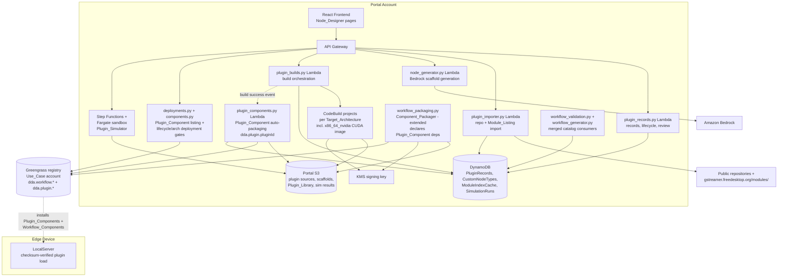
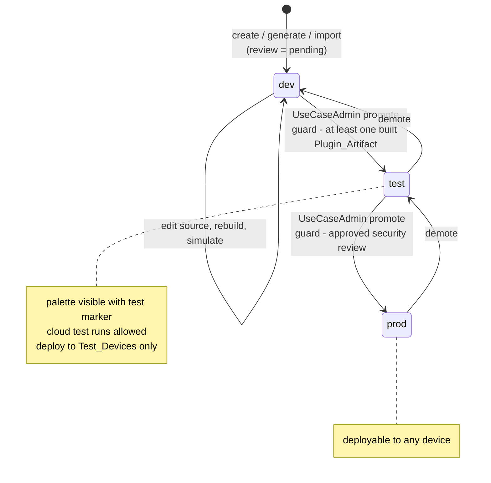
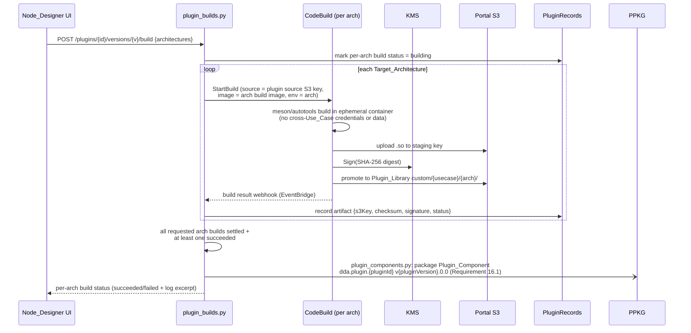

# Design Document: Custom Node Designer

## Overview

The Custom Node Designer extends the Workflow Manager with a portal capability (Node_Designer) for adding new node types to the Workflow_Builder palette without a platform release. It provides four entry paths into a single pipeline: scaffold creation with a Frame_Processing_Hook (Requirement 1), prompt-based scaffold generation via Bedrock (Requirement 2), import from a public repository (Requirement 4), and import from the official GStreamer Module_Listing with upstream good/bad/ugly risk classification (Requirements 6, 15). All paths converge on a Plugin_Record that flows through per-architecture isolated builds (Requirement 3), visual simulation (Requirement 7), Custom_Node_Type registration into the Node_Type_Catalog (Requirement 8), a dev → test → prod lifecycle with security review and signing (Requirements 9, 10), packaging/delivery through the existing Component_Packager path (Requirement 11), automatic packaging of built Plugin_Artifacts into versioned, individually deployable Greengrass Plugin_Components with dependency-based delivery to devices (Requirement 16), and cloud test runs (Requirement 12).

Plugins target five Target_Architectures per the requirements glossary: `x86_64` (amd64), `x86_64_nvidia` (x86_64 with NVIDIA GPU runtime), and `arm64_jp4/jp5/jp6` (Jetson JetPack 4/5/6). `x86_64_nvidia` is new relative to the workflow-manager implementation and is threaded through the build matrix, the `workflow_core` architecture constants, the Plugin_Library layout, Greengrass platform manifests, and deployment matching (see "Target_Architecture: x86_64_nvidia" below).

The design builds directly on the workflow-manager implementation that exists in the repo today:

- **Catalog**: `workflow_core.catalog` currently declares a static `NODE_CATALOG` tuple of frozen `NodeTypeDescriptor` dataclasses (`edge-cv-portal/backend/layers/workflow_core/python/workflow_core/catalog/nodes.py`), consumed by the validator, compiler, the node-catalog endpoint, the Workflow_Generator system prompt, the test sandbox (vendored copy), and LocalServer (vendored copy under `src/backend/workflow_engine/vendor/`). This feature makes the catalog **composable**: built-in descriptors stay static; Custom_Node_Type descriptors are stored per Use_Case in DynamoDB and merged into a per-request effective catalog at serve, validate, generate, compile, and package time.
- **Plugin library**: `workflow_packaging.py` already resolves plugin binaries from portal S3 at `{WORKFLOW_PLUGIN_LIBRARY_PREFIX}/{arch}/{plugin}.so` and streams them into the per-arch component zip under `plugins/{arch}/{plugin}.so`. That inline path stays for built-in/curated plugins; this feature adds a per-Use_Case custom prefix with checksum + signature verification, and custom plugin artifacts reach devices via Greengrass dependencies on auto-packaged Plugin_Components (`dda.plugin.{pluginId}`) rather than inline bundling (see "Plugin_Component packaging and deployment").
- **Simulator**: the Plugin_Simulator reuses the existing test-sandbox pattern (`edge-cv-portal/test-sandbox/` harness in a Fargate task orchestrated by Step Functions, `test-runner-stack.ts`) with a new single-plugin harness mode.
- **Generation**: the Node_Generator reuses the `workflow_generator.py` patterns verbatim — `get_bedrock_configuration()` from the settings table (timeout clamped ≤ 60 s), cached `bedrock-runtime` client with client-side read timeout and no retries, Converse API with forced tool-use for structured output, and session snapshots for follow-up prompts.
- **Edge**: LocalServer already scopes delivered plugins per-run (`src/backend/workflow_engine/gst_plugins.py`: `GST_PLUGIN_PATH` prepend + registry scan, restored afterwards). This feature adds manifest checksum verification before the registry scan.

### Key Design Decisions

| Decision | Choice | Rationale |
|----------|--------|-----------|
| Custom catalog storage | DynamoDB `CustomNodeTypes` table (declaration JSON per Use_Case per version) merged with the static `NODE_CATALOG` at request time by a new `workflow_core.catalog.resolve_catalog(custom_descriptors)` function | Built-in descriptors stay frozen dataclasses; custom declarations use the identical wire shape so the validator/compiler/generator work unchanged on the merged tuple. No schema fork, no LocalServer change — the edge only ever sees compiled documents and delivered `.so` files, never the catalog |
| Plugin build execution | AWS CodeBuild, one project per Target_Architecture with custom build images (x86_64 Ubuntu 22.04/GStreamer 1.20 matching the sandbox image; x86_64_nvidia the same base plus the CUDA toolkit and NVIDIA GStreamer runtime headers; arm64 JetPack 4/5/6 cross-build images with the matching L4T + DeepStream SDK) | CodeBuild gives per-build ephemeral, network-policy-controlled containers (isolation per Use_Case build, Requirement 3.2), native git source cloning for imports, build log capture for compiler-output error reporting (3.4), and custom-image support for the CUDA/JetPack/DeepStream toolchains (5.2). Fargate would require building our own build orchestration and log plumbing |
| Artifact signing | KMS asymmetric key (ECDSA P-256) per portal installation: `Sign` on the SHA-256 digest after a successful build; `Verify` in the Component_Packager before inclusion | Managed keys, non-exportable private key, auditable sign/verify calls (Requirement 3.3, 10.4). LocalServer verifies the SHA-256 checksum from the component manifest (10.6) — no device-side KMS dependency |
| Simulator execution | New `simulate` harness mode in the existing test-sandbox image, run as a Fargate task via a new Step Functions state machine with a 5-minute timeout | The sandbox image already has GStreamer 1.20 + Python GI on x86_64 and the incremental-results-flush pattern; a single-plugin pipeline (`multifilesrc ! decode ! <element> ! frame+metadata capture`) is a strict subset of what the harness does today (Requirement 7) |
| Module_Listing retrieval | Lambda fetch of `https://gstreamer.freedesktop.org/modules/` parsed server-side, cached in DynamoDB with a 24 h TTL item | Keeps the parser in one place, testable against synthetic listings; cache satisfies Requirement 6.4 and shields the UI from upstream outages (6.3) |
| good/bad/ugly classification | Pure function `classify_plugin_set(module_name, repo_url) -> good|bad|ugly|unclassified` derived from the official plugin-set module names (`gst-plugins-good`, `gst-plugins-bad`, `gst-plugins-ugly`) and their known repository locations; everything else is `unclassified` | The taxonomy is upstream's own; deriving it from the module identity is deterministic and testable. Arbitrary public repositories are never guessed into an official set (Requirement 15.4) |
| Lifecycle + review storage | `PluginRecords` DynamoDB table keyed `plugin_id` + `version`, holding Lifecycle_State, security review decision, provenance, per-arch artifact entries (S3 key, checksum, signature, build status) | Single-item read answers every gate (packaging, deployment, palette inclusion); versions are separate items so Requirement 9.13/10.5 (new version resets state and review) falls out of the data model |
| Deployment gate for test state | Extend the existing deployment pre-submit check in `deployments.py` (which already compares LocalServer versions per device) with a Plugin_Record lifecycle check against a `test_device` flag on the Devices table | Reuses the one place that already inspects targets before submission (Requirement 9.8) |
| Custom plugin delivery to devices | **Dependency-based**: every successful build set is auto-packaged into a versioned Greengrass Plugin_Component `dda.plugin.{pluginId}`; Workflow_Component recipes declare `ComponentDependencies` on the Plugin_Components their Custom_Node_Types need instead of bundling those `.so` files inline. Built-in/curated plugins keep the existing inline `plugins/{arch}/*.so` bundling | See "Reconciling Requirements 11 and 16" below — one immutable signed artifact per plugin version, Greengrass-native version resolution, standalone deployability from the deployment screen (16.2), and no double-shipping when several workflows share a plugin |
| x86_64 vs x86_64_nvidia platform matching | Greengrass platform attribute `runtime: nvidia` on x86_64_nvidia manifests, mirroring the existing `variant` attribute pattern that already disambiguates the arm64 JetPack builds in `build_recipe` | Both x86_64 flavors map to Greengrass architecture `amd64`; a custom platform attribute (declared in the device's Nucleus platform overrides, exactly like `variant`) is the established mechanism in this codebase for splitting one Greengrass architecture into DDA Target_Architectures |

## Architecture

### System Context



### The Plugin_Record pipeline

Every path produces the same artifact flow:



New source, changed declaration, or a rebuild creates a **new version item** whose Lifecycle_State is `dev` and review decision `pending`, independent of prior versions (Requirements 9.13, 10.5). Deployed Workflow_Components are never touched by demotion — gates apply only to subsequent packaging/deployment requests (9.12).

### Dynamic Node_Type_Catalog extension

The static catalog stays exactly as it is. A new module `workflow_core.catalog.custom` adds:

- `descriptor_from_declaration(decl: dict) -> NodeTypeDescriptor` — converts a stored Custom_Node_Type declaration (same wire shape the node-catalog endpoint already serves) into a frozen `NodeTypeDescriptor`, validating port types against `PORT_TYPES`, categories against `CATEGORIES`, parameter descriptors against `PARAMETER_TYPES`, and mappings against `ARCHITECTURES`. Invalid declarations raise `DeclarationError` identifying the offending field (Requirement 8.5).
- `resolve_catalog(custom_descriptors: Sequence[NodeTypeDescriptor]) -> tuple` — returns `NODE_CATALOG + tuple(custom_descriptors)` with duplicate `type_id` rejection (built-ins always win).

Consumers change as follows (all portal-side; the sandbox and LocalServer vendored copies gain the module but the edge never resolves custom catalogs — compiled documents are self-contained):

| Consumer | Change |
|---|---|
| `GET /workflows/node-catalog` | Loads the Use_Case's registered Custom_Node_Types (Lifecycle_State test/prod only; dev excluded per 9.2), merges, serves; test-state entries carry `lifecycleState: "test"` for the palette marker (9.6) |
| `workflow_validation.py` | Validates against the merged catalog for the workflow's Use_Case |
| `workflow_generator.py` | Serializes the merged catalog into the system prompt so generated workflows may use registered custom nodes |
| `workflow_packaging.py` | Compiles against the merged catalog; custom-node plugin dependencies resolve to Plugin_Component dependencies declared in the Workflow_Component recipe, with artifact verification against the Plugin_Record (below) |
| test runner (`workflow_test_steps.py`) | Compile step uses the merged catalog; the sandbox task downloads custom x86_64 Plugin_Artifacts into its plugin scan path (Requirement 12.1) |

A custom `GstMapping` for a plugin-backed node is mechanical: `element_chain = [{factory: <element>, args_template: <declared property mapping>}]`, `plugin_dependencies = ["custom:<usecase_id>/<plugin_name>"]`. The `custom:` prefix routes the packager to the plugin's Plugin_Component: instead of bundling the `.so` inline it declares a Greengrass `ComponentDependencies` entry on `dda.plugin.{pluginId}` and verifies the depended-on artifacts (Requirements 8.6, 11.1, 16.4 — see "Reconciling Requirements 11 and 16"); DeepStream-backed types simply omit mappings for architectures without a matching runtime, which makes the existing compiler error path (`CompileError{nodeId, arch}`) satisfy Requirement 5.4 with no new compiler logic.

### Target_Architecture: x86_64_nvidia

The requirements glossary defines five Target_Architectures; `x86_64_nvidia` (x86_64 with an NVIDIA GPU runtime) is new to the implementation and touches every layer that enumerates architectures:

- **`workflow_core` constants** (`catalog/models.py`): a new `ARCH_X86_64_NVIDIA = "x86_64_nvidia"` is added to `ARCHITECTURES` and `DEVICE_ARCHITECTURES` (and to the vendored copies in the test sandbox and `src/backend/workflow_engine/vendor/`). Because built-in `NODE_CATALOG` descriptors generate one `GstMapping` per `DEVICE_ARCHITECTURES` entry (`nodes.py`), every built-in node type automatically gains an `x86_64_nvidia` mapping identical to its `x86_64` one; nodes with an NVIDIA-accelerated variant may declare a distinct chain later without schema change. The bundled-plugin manifest (`bundled_plugins_for`) gains an `x86_64_nvidia` entry (initially mirroring `x86_64` — the LocalServer.amd64 GPU build bundles the same base plugin set). The compiler, validator, and packaging arch validation (`DEVICE_ARCHITECTURES` membership) then accept `x86_64_nvidia` with no further change.
- **Build matrix**: a sixth CodeBuild project with a CUDA-enabled x86_64 image — the sandbox's Ubuntu 22.04/GStreamer 1.20 base plus the CUDA toolkit and NVIDIA GStreamer/codec headers. Custom_Node_Type declarations and imports may select `x86_64_nvidia` like any other arch (DeepStream records remain restricted to `arm64_jp4/jp5/jp6` per Requirement 5.1 — DeepStream targets Jetson; plain CUDA/NVIDIA plugins use `x86_64_nvidia`).
- **Plugin_Library layout**: artifacts store under `workflow-plugins/custom/{usecase_id}/x86_64_nvidia/{plugin}.so` (+ `.sig`), same pattern as the other arches.
- **Greengrass platform matching**: `ARCH_TO_GG_PLATFORM` maps `x86_64_nvidia → amd64`. Since plain `x86_64` also maps to `amd64`, recipes disambiguate with a custom platform attribute `runtime: nvidia` on `x86_64_nvidia` manifests — the same mechanism `build_recipe` already uses (`variant`) to split the three JetPack builds within `aarch64`. Devices with the NVIDIA runtime declare `runtime: nvidia` in their Nucleus platform overrides; when both x86_64 flavors are packaged, the plain `x86_64` manifest is listed after the `x86_64_nvidia` one so attribute-less amd64 devices match plain `x86_64` while NVIDIA devices match the more specific manifest first.
- **Deployment matching**: the portal records each device's Target_Architecture (existing Devices table attribute); the deployment-time architecture check (below) treats `x86_64` and `x86_64_nvidia` as distinct — a Plugin_Component with only an `x86_64` artifact is deployable to an `x86_64_nvidia` device only if the component also publishes an `x86_64_nvidia` manifest; no implicit fallback is designed in (a CUDA plugin genuinely differs from its CPU build, and silent substitution would mask that).
- **Simulator/test sandbox**: unchanged — both execute plain `x86_64` builds (glossary; Fargate has no GPU here), so simulation and cloud test runs of an `x86_64_nvidia`-only plugin follow the existing missing-x86_64 guard and stubbing paths (7.5, 12.2).

### Plugin_Build_Service



- **Isolation (3.2)**: each build runs in a fresh CodeBuild container with a role scoped to exactly the source prefix and staging prefix of that build — no Use_Case account credentials, no other builds' prefixes. Build projects run without VPC access to portal internals; outbound internet is allowed for source-declared dependency fetches during import builds.
- **Failure (3.4)**: failed builds store the CloudWatch log tail in the Plugin_Record's per-arch entry; no artifact is stored for that arch.
- **Prebuilt binaries (3.6)**: an upload path accepts a `.so` per arch, checksums and signs it identically (provenance records `prebuilt: true`).
- **DeepStream (5.1, 5.2)**: records flagged `deepstream: true` restrict selectable architectures to `arm64_jp4/jp5/jp6`; the JetPack build images pin the DeepStream SDK version matching each JetPack release.

### Plugin_Scaffold and Node_Generator

- Scaffold generation is pure templating in a new `workflow_core.scaffold` module (also usable in tests without AWS): given a validated declaration (name, category, ports, parameters, architectures), it renders a GStreamer plugin project — a C skeleton element wrapping an embedded Python `process_frame(frame, params) -> frame` Frame_Processing_Hook file (the same appsink/appsrc bridge approach as the existing `emlpython` custom-python element), `meson.build` per selected architecture, and a README. Declared parameters surface as GObject properties plumbed into the hook's `params` dict (Requirements 1.2–1.4). The scaffold is stored under portal S3 `plugin-sources/{usecase_id}/{plugin_id}/{version}/` and downloadable as a zip (1.5).
- The Node_Generator (`node_generator.py`) mirrors `workflow_generator.py`: chat sessions in a TTL'd DynamoDB table with the current scaffold source snapshot in S3; Converse invocation with a forced `create_plugin_scaffold` tool whose input schema is the scaffold file map (`{files: {path: content}}`) plus the declaration; the system prompt embeds the scaffold template conventions and the Frame_Processing_Hook contract. Follow-up prompts include the current source and instruct modification (2.4). Output that fails scaffold validation (missing hook file, undeclared files) returns an error with the prompt preserved (2.6); Bedrock failures/timeouts follow the existing ≤ 60 s clamped timeout handling (2.7). Accepted source enters the standard build/simulate/lifecycle path with the prompt recorded as provenance (2.5).

### Plugin_Importer and Module_Listing

- **Repository import (Requirement 4)**: `plugin_importer.py` validates the URL, then starts a lightweight CodeBuild "fetch" step that clones the repository at the requested revision (default branch when omitted) and syncs the source tree to `plugin-sources/...`. Unreachable repo / missing revision fails before any Plugin_Record is created (4.4). A source-tree scan (presence of a GStreamer plugin build definition: `meson.build`/`configure.ac` with a `gst_plugin` target, or prebuilt `.so`) marks unbuildable imports failed with the finding reported (4.5). Successful fetch creates the Plugin_Record with provenance `{repoUrl, revision, importedBy, importedAt, classification}` (4.2, 15.5) and submits builds (4.3). First successful build prompts Custom_Node_Type declaration (4.6).
- **Module_Listing import (Requirement 6)**: `GET /plugin-modules` returns the parsed module index — fetched from `https://gstreamer.freedesktop.org/modules/`, parsed into `{name, description, repoUrl, classification}` entries, cached in `ModuleIndexCache` with `fetchedAt` and reused for 24 h (6.4). Fetch/parse failure returns an error and the UI offers manual URL entry (6.3). Selecting a module feeds its published repository location into the Requirement 4 path (6.2).
- **Classification (Requirement 15)**: `classify_plugin_set` maps the official plugin-set modules to `good`/`bad`/`ugly` and everything else to `unclassified`. The UI shows the classification as a color-coded risk badge in the module list (15.1) and on the import confirmation view together with the fixed plain-language explanations (15.2, 15.3); the Plugin_Importer stamps it into provenance (15.4, 15.5); the security review screen displays it with the other provenance (15.6).

### Plugin_Simulator

A new Step Functions state machine (in a `node-designer-stack.ts` following `test-runner-stack.ts` patterns) runs the existing sandbox image with `HARNESS_MODE=simulate`:

1. **Guard**: refuse to start when the Plugin_Record version has no successful x86_64 Plugin_Artifact (7.5).
2. **Prepare**: stage the selected Test_Dataset (reusing the existing dataset staging) or the uploaded sample frames; stage the plugin `.so` from the Plugin_Library to the task's plugin scan directory.
3. **RunSandbox** (Fargate, isolated subnet, task role limited to the run's S3 prefix — no Plugin_Library write, no other Use_Case data; Requirement 7.2): the harness renders `multifilesrc ! decode ! <element> <declared-params> ! frame capture + metadata tap`, executes via `Gst.parse_launch` exactly like the test harness, and flushes per-frame results `{frameIndex, inputRef, outputRef, metadata}` incrementally to S3.
4. **Collect**: the UI renders input/output frames side by side with per-frame metadata (7.3), offers parameter re-configuration and re-run (7.4). Abnormal termination reports the plugin's stderr/bus error, contained to the task (7.6). The state machine enforces the 5-minute timeout, marking the run failed-with-timeout and retaining flushed partial results (7.7).

### Signing, verification, and packaging integration

- **Sign (3.3)**: after each successful build, SHA-256 checksum + KMS signature are recorded in the Plugin_Record per-arch entry and stored alongside the artifact in the Plugin_Library (`custom/{usecase_id}/{arch}/{plugin}.so` + `.sig`).
- **Package-time verify (10.4)**: `workflow_packaging.py` gains a branch for `custom:` plugin dependencies. For each one it resolves the pinned Custom_Node_Type version to its Plugin_Record, streams the artifact bytes for every selected architecture from the Use_Case custom prefix, recomputes the SHA-256, and `KMS Verify`s the signature — failing packaging (existing `PackagingError` path — stage cleanup, no partial component) on either mismatch. Verified custom plugins are **not** bundled into the arch zip (see "Reconciling Requirements 11 and 16"); instead the recipe declares a dependency on the plugin's Plugin_Component, and the per-plugin checksum is written into `manifest.json` (`pluginChecksums: {<pluginComponentName>/<file>: <sha256>}`) so the edge can verify the installed files. Built-in/curated (non-`custom:`) plugins keep the existing inline `plugins/{arch}/*.so` bundling in `build_arch_zip`, unchanged.
- **Lifecycle gates at packaging (11.2, 11.3)**: before assembly, every custom node's backing Plugin_Record is loaded; `dev` state, a missing per-arch artifact, or a missing Plugin_Component version rejects with the Custom_Node_Type and arch/state identified.
- **Edge verify (10.6)**: `workflow_engine/gst_plugins.py` verifies each plugin `.so` referenced by `manifest.json` `pluginChecksums` — whether delivered inline under `plugins/<arch>/` or installed by a depended-on Plugin_Component under `/aws_dda/plugins/{pluginId}/{version}/{arch}/` — before the registry scan; a mismatch skips the plugin, fails the workflow registration with the file identified, and reports through the existing status path.
- **Deployment gate (9.8, 9.11, 16.3, 16.6)**: `deployments.py`'s pre-submit check loads the manifest's plugin records; a test-state plugin restricts targets to devices flagged `test_device` (a new attribute a UseCaseAdmin sets on the existing Devices table); violations are rejected identifying the Custom_Node_Type and its Lifecycle_State. The same pre-submit pass performs the Plugin_Component architecture check (below).

### Plugin_Component packaging and deployment (Requirement 16)

#### Reconciling Requirements 11 and 16

Requirement 11 says the Component_Packager includes each Custom_Node_Type's Plugin_Artifact per packaged architecture; Requirement 16 says Workflow_Components declare Greengrass dependencies on Plugin_Components that carry those artifacts. Two delivery models were considered:

| | Inline bundling (status quo, extended to custom plugins) | Plugin_Component dependencies (chosen for custom plugins) |
|---|---|---|
| Delivery | `.so` copied into every Workflow_Component zip per arch | `.so` installed once per device by the depended-on Plugin_Component; Greengrass resolves and installs it with the deployment (16.5) |
| Duplication | N workflows sharing a plugin ship it N times per deployment | One installed copy per plugin version per device |
| Standalone deployability (16.2) | None — plugins only ride workflows | Plugin_Components appear on the deployment screen and can be deployed on their own |
| Version immutability (16.7) | Rebuild silently changes bytes inside future workflow zips | Rebuild publishes a new immutable Plugin_Component version; existing versions untouched |
| Failure surface | One artifact path | Adds Greengrass dependency resolution to workflow deploys |

**Decision**: built-in/curated Plugin_Library plugins stay bundled inline exactly as `workflow_packaging.py` does today (`plugins/{arch}/*.so`) — they version with the platform, not per Use_Case. Custom_Node_Type plugins are delivered **exclusively** via Plugin_Component dependencies — no double-shipping. Requirement 11's "include the Plugin_Artifact" is satisfied for custom plugins by inclusion-by-dependency: the Component_Packager verifies each required artifact exists and passes checksum/signature verification (11.1, 11.2, 10.4), records its checksum in the manifest, and declares the recipe dependency that makes Greengrass deliver it with the deployment (16.4, 16.5); Requirement 11.4 (LocalServer loads the delivered plugin) is met by extending the plugin scan path to the Plugin_Component install roots named in the manifest.

#### Automatic packaging on build completion (16.1, 16.7)

A new `plugin_components.py` Lambda, invoked by `plugin_builds.py` when all requested arch builds for a Plugin_Record version have settled with at least one success, packages the successfully built Plugin_Artifacts into a Greengrass component in the Use_Case account, following the `workflow_packaging.py` conventions:

- **Naming**: `dda.plugin.{pluginId}` version `{pluginVersion}.0.0` (mirroring `dda.workflow.{workflowId}` / `{workflowVersion}.0.0`).
- **Recipe**: install-only (no Run lifecycle — installing or removing a plugin never restarts LocalServer), one platform manifest per successfully built Target_Architecture, built with the same `ARCH_TO_GG_PLATFORM` + platform-attribute scheme as `build_recipe` (`variant` for the JetPack arm64 builds, `runtime: nvidia` for x86_64_nvidia). Each manifest's artifact is the signed `.so` (plus a small `plugin-manifest.json` carrying name, version, arch, and checksum), installed to `/aws_dda/plugins/{pluginId}/{pluginVersion}/{arch}/`.
- **All-or-nothing**: artifacts stage → promote → register, reusing the staging pattern; a failed registration deletes the component version so nothing partial exists.
- **Immutability (16.7)**: a rebuild or source change always creates a new Plugin_Record version (existing design), which packages as a new Plugin_Component version; previously published Plugin_Component versions are never modified or deleted by packaging (removal only through Requirement 14's reference-checked path).
- **Registry metadata**: tagged `dda-portal:managed`, `dda-portal:usecase-id`, `dda-portal:plugin-id`, `dda-portal:plugin-version` so listings can attribute components to Plugin_Records.

#### Deployment screen listing (16.2)

The existing component listing (`components.py` `list_components`, consumed by the deployment screen) is extended to recognize `dda.plugin.*` components and join them with their Plugin_Record (via the registry tags): each entry shows name, version, the backing Plugin_Record's Lifecycle_State, and the supported Target_Architectures (derived from the recipe's platform manifests). Deploying a Plugin_Component standalone goes through the same `deployments.py` submission path as other components, subject to the gates below.

#### Workflow_Component dependency declaration (16.4, 16.5)

`workflow_packaging.py`'s `build_recipe` gains a `ComponentDependencies` block: for each Custom_Node_Type in the compiled workflow, an entry

```json
"ComponentDependencies": {
  "dda.plugin.{pluginId}": {
    "VersionRequirement": ">={pluginVersion}.0.0 <{pluginVersion+1}.0.0",
    "DependencyType": "HARD"
  }
}
```

pinned to the Plugin_Record version recorded by the workflow's pinned Custom_Node_Type versions (Requirement 14.2 resolution). Greengrass then includes the depended-on Plugin_Component versions in every deployment of the Workflow_Component automatically (16.5) — `deployments.py` needs no change for delivery, only for the gates.

#### Deployment-time gates (16.3, 16.6)

Both gates extend the existing pre-submit check in `deployments.py` (the `check_local_server_compatibility` pass that already inspects each target device before submission):

- **Lifecycle (16.3)**: deploying a Plugin_Component (standalone, or transitively via a Workflow_Component dependency) whose backing Plugin_Record is in `test` state is permitted only to devices flagged `test_device`; `prod` state deploys anywhere in the Use_Case. `dev`-state Plugin_Components exist (auto-packaging runs on build completion, before promotion) but are rejected for any deployment target, consistent with the Requirement 9/11.3 dev gates. This is the same gate as 9.8 evaluated over the dependency closure.
- **Architecture (16.6)**: for each target device, the device's recorded Target_Architecture (Devices table) is checked against the platform manifests of every depended-on Plugin_Component version; a device whose architecture has no published Plugin_Artifact in some depended-on Plugin_Component version rejects the submission identifying the Plugin_Component and the unsupported Target_Architecture. `x86_64` and `x86_64_nvidia` are matched distinctly (no fallback). This runs pre-submit — before Greengrass would otherwise fail the deployment device-side with an opaque no-matching-manifest error.

### Versioning, deprecation, removal (Requirement 14)

Custom_Node_Type versions parallel Plugin_Record versions (a declaration change or new plugin version creates a new CustomNodeTypes item; prior versions retained, 14.1). Saved workflows already pin node parameters per workflow version; the Workflow_Definition node entry for a custom node gains a `typeVersion` attribute recorded at save and honored at packaging (14.2). Deprecation flips a `deprecated` flag that excludes the type from the palette merge while keeping it resolvable for loading/validation/packaging of existing workflows (14.3). Removal scans WorkflowVersions for references (an inverted-index GSI on node type ids maintained at save); zero references → delete catalog items + Plugin_Library artifacts + the plugin's Plugin_Component versions from the Use_Case Greengrass registry (the only path that ever deletes a published Plugin_Component version); otherwise reject listing the referencing workflows (14.4, 14.5).

### Access control and audit (Requirement 13)

New RBAC permission actions in `rbac_middleware`, mapped to existing roles:

| Action | UseCaseAdmin | PortalAdmin | DataScientist / Operator / Viewer |
|---|---|---|---|
| node-designer:read | ✓ | ✓ | ✓ (read-only, 13.3) |
| node-designer:create / generate / import / simulate / register / promote-demote (dev↔test) / manage | ✓ (own Use_Case) | ✓ | – |
| node-designer:security-review (approve/reject, promote to prod gate) | – | ✓ | – |

Every create/generate/import/simulate/register/promote/demote/approve/reject/update/deprecate/remove writes the existing AuditLog table with action, acting user, timestamp (13.5); denials return the standard authorization error envelope (13.4).

## Components and Interfaces

### New portal backend Lambdas (`edge-cv-portal/backend/functions/`)

| File | Routes | Responsibility |
|---|---|---|
| `plugin_records.py` | `GET/POST /plugins`, `GET/PUT /plugins/{id}`, `GET /plugins/{id}/versions/{v}`, `POST .../promote`, `POST .../demote`, `POST .../review` | Plugin_Record CRUD, lifecycle transitions with guards, security review decisions, provenance display |
| `plugin_importer.py` | `POST /plugins/import`, `GET /plugin-modules` | Repository fetch orchestration, Module_Listing fetch/parse/cache, classification stamping |
| `plugin_builds.py` | `POST /plugins/{id}/versions/{v}/build`, `GET .../builds`, EventBridge handler for CodeBuild results | Build orchestration, per-arch status, artifact + signature recording, prebuilt upload; triggers `plugin_components.py` when a version's builds settle with ≥ 1 success |
| `plugin_components.py` | Async invoke from `plugin_builds.py`; `GET /plugins/{id}/versions/{v}/component` | Automatic Plugin_Component packaging (`dda.plugin.{pluginId}`, install-only recipe, one platform manifest per built arch), stage/promote/register in the Use_Case account, component status recording on the Plugin_Record |
| `node_generator.py` | `POST /plugins/generate`, `POST /plugins/generate/{session}/message` | Bedrock Converse scaffold generation sessions |
| `plugin_simulator.py` | `POST /plugins/{id}/versions/{v}/simulate`, `GET /simulations/{runId}` | Simulator run start (guarded), status/results |
| `custom_node_types.py` | `POST /custom-node-types`, `GET/PUT/DELETE /custom-node-types/{id}`, `POST .../deprecate` | Custom_Node_Type declaration validation, registration, versioning, deprecation, removal with reference check |

### Extended existing components

- `workflow_core.catalog` — new `custom.py` (`descriptor_from_declaration`, `resolve_catalog`, `DeclarationError`) and `classification.py` (`classify_plugin_set`, explanation texts); `workflow_core.scaffold` — new module (template rendering, scaffold validation).
- `workflow_core.catalog.models` — new `ARCH_X86_64_NVIDIA` in `ARCHITECTURES`/`DEVICE_ARCHITECTURES`, `bundled_plugins_for` entry for `x86_64_nvidia` (propagated to the sandbox and LocalServer vendored copies).
- `workflow_packaging.py` — `custom:` plugin dependency resolution to Plugin_Component `ComponentDependencies` in the recipe, checksum/signature verification, lifecycle/artifact/component gates, `pluginChecksums` in the manifest, `x86_64_nvidia` in `ARCH_TO_GG_PLATFORM` with the `runtime: nvidia` platform attribute.
- `deployments.py` — test-state target gating against `test_device` device flags; pre-submit Plugin_Component gates (lifecycle over the dependency closure, per-device architecture coverage) alongside the existing `minLocalServerVersion` check.
- `components.py` — deployment-screen listing of `dda.plugin.*` components with name, version, backing Lifecycle_State, and supported architectures.
- `workflow_validation.py`, `workflow_generator.py`, node-catalog endpoint, `workflow_test_steps.py` — merged catalog resolution.
- `src/backend/workflow_engine/gst_plugins.py` — manifest checksum verification before registry scan.
- `test-sandbox/harness` — `simulate` mode (single-plugin pipeline, per-frame input/output/metadata capture).

### Frontend (`edge-cv-portal/frontend/src/pages/node-designer/`)

- **Plugin library list**: Plugin_Records with lifecycle badges, per-arch build status, classification risk badges.
- **Create wizard**: declaration form (name, category, ports, parameters, architectures) → scaffold preview/download → source editor → build.
- **Generate panel**: chat interface for prompt-based scaffolds with review-before-accept (2.1, 2.3).
- **Import views**: repository URL form and the Module_Listing select with classification badges + plain-language explanations; import confirmation view repeating the classification and explanation before proceeding (15.1–15.3); fallback to manual URL entry on listing failure (6.3).
- **Simulator view**: dataset/upload picker, side-by-side input/output frame strips with per-frame metadata, parameter editor + re-run (7.1, 7.3, 7.4).
- **Registration wizard**: Custom_Node_Type declaration (ports from `PORT_TYPES`, parameters, element property mapping per built arch, hardware-dependence flag, Use_Case scoping) (8.1).
- **Review queue (PortalAdmin)**: pending Plugin_Records with provenance, classification, per-arch checksums/signatures, and source inspection (10.2, 15.6).
- **Deployment screen (existing `pages/deployments`, extended)**: `dda.plugin.*` Plugin_Components listed with name, version, backing Lifecycle_State badge, and supported Target_Architecture chips; pre-submit gate rejections surfaced with the Plugin_Component and unsupported architecture or lifecycle violation identified (16.2, 16.3, 16.6).

## Data Models

### DynamoDB tables (new, additive)

| Table | Key | Attributes |
|---|---|---|
| `PluginRecords` | `plugin_id` + `version` | usecase_id, name, kind (scaffold/generated/imported), deepstream flag, provenance {repoUrl, revision, prompt, scaffoldDeclaration, importedBy/createdBy, timestamps, classification, prebuilt}, lifecycle_state (dev/test/prod), review {decision: pending/approved/rejected, reviewer, reviewedAt}, artifacts {arch: {s3Key, checksum, signature, buildStatus, logTail}} (arch ∈ x86_64, x86_64_nvidia, arm64_jp4/jp5/jp6), component {name, version, arn, architectures, status: packaging/registered/failed, packagedAt, failure}, source_s3_prefix, GSI: usecase_id |
| `CustomNodeTypes` | `node_type_id` + `version` | usecase_ids, plugin_id + plugin_version, declaration (NodeTypeDescriptor wire JSON), deprecated flag, created_by/at, GSI: usecase_id |
| `ModuleIndexCache` | `cache_key` (`gst-modules`) | modules [{name, description, repoUrl, classification}], fetchedAt, TTL 24 h |
| `SimulationRuns` | `run_id` | plugin_id, version, usecase_id, dataset ref, parameters, status, results_s3_key, failure {message, timeout}, started_at/finished_at |
| `NodeGenSessions` | `session_id` | usecase_id, messages, current_source_key, ttl |

### S3 layout (portal artifacts bucket)

```
plugin-sources/{usecase_id}/{plugin_id}/{version}/...          source trees / scaffolds
workflow-plugins/custom/{usecase_id}/{arch}/{plugin}.so        Plugin_Library (custom prefix)
workflow-plugins/custom/{usecase_id}/{arch}/{plugin}.so.sig    detached signature
plugin-simulations/{usecase_id}/{run_id}/...                   sim inputs/outputs/results
```

The existing built-in prefix `workflow-plugins/{arch}/{plugin}.so` is untouched; `split_plugin_dependencies` in the packager routes `custom:{usecase}/{name}` dependencies to the custom prefix. `{arch}` ranges over all five Target_Architectures including `x86_64_nvidia`.

### Plugin_Component storage (no new table)

Plugin_Components deliberately ride existing storage rather than a new table:

- **Component definition**: the Use_Case account **Greengrass registry** is the source of truth (name `dda.plugin.{pluginId}`, version `{pluginVersion}.0.0`, recipe with platform manifests), exactly as `dda.workflow.*` components work today. Registry tags (`dda-portal:plugin-id`, `dda-portal:plugin-version`, `dda-portal:usecase-id`) link back to the Plugin_Record.
- **Portal-side pointer**: the `component` attribute on the `PluginRecords` item (above) records name/version/ARN/architectures/packaging status so the portal can render status and join listings without describing every component.
- **Recipe artifacts**: the signed `.so` files + `plugin-manifest.json` are copied to the Use_Case account bucket under `plugins/components/{pluginId}/{pluginVersion}/{arch}/` (staging under `plugins/staging/...`), mirroring the `workflows/components` / `workflows/staging` layout — recipe artifact URIs must live in the account Greengrass pulls from, so the portal Plugin_Library copy alone does not suffice.
- **Deployments**: standalone Plugin_Component deployments are recorded in the existing **Deployments** table with `component_type: 'plugin'` plus `plugin_id`/`plugin_version` — the same shape `component_type: 'workflow'` records use, so listing, status polling, and revision flows are reused.

### Custom_Node_Type declaration (wire JSON, identical shape to the catalog endpoint)

```json
{
  "typeId": "custom.blur_regions",
  "category": "preprocessing",
  "displayName": "Blur Regions",
  "inputs": [{"name": "in", "portType": "VideoFrames"}],
  "outputs": [{"name": "out", "portType": "VideoFrames"}],
  "parameters": [{"name": "radius", "paramType": "int", "required": true,
                   "default": 5, "constraints": {"min": 1, "max": 64}}],
  "mappings": [{"arch": "x86_64",
                 "elementChain": [{"factory": "blurregions",
                                    "argsTemplate": {"radius": "{radius}"}}],
                 "pluginDependencies": ["custom:uc-123/blurregions"]}],
  "hardwareDependent": false,
  "typeVersion": 1,
  "lifecycleState": "test"
}
```

## Correctness Properties

*A property is a characteristic or behavior that should hold true across all valid executions of a system-essentially, a formal statement about what the system should do. Properties serve as the bridge between human-readable specifications and machine-verifiable correctness guarantees.*

The feature's pure core — declaration validation and conversion, catalog resolution, classification, scaffold templating, the lifecycle state machine, gate predicates, checksum/signature handling, and Plugin_Component recipe/dependency assembly — is highly amenable to property-based testing. Generators produce random valid/invalid Custom_Node_Type declarations, Plugin_Records in random lifecycle/build/review states, random operation sequences, and synthetic module listings.

### Property 1: Declaration conversion accepts exactly the valid declarations

For all Custom_Node_Type declarations (valid ones, and ones corrupted with a random known defect — port type outside PORT_TYPES, category outside CATEGORIES, parameter type outside PARAMETER_TYPES, architecture outside ARCHITECTURES, default violating its own constraints), `descriptor_from_declaration` succeeds if and only if the declaration is valid; on success the resulting descriptor satisfies the same catalog well-formedness predicate as built-in node types, and DeepStream-flagged declarations yield mappings only for arm64_jp4/jp5/jp6; on failure the error identifies the offending field.

**Validates: Requirements 1.7, 5.3, 8.4, 8.5**

### Property 2: Scaffold generation is complete for the declaration

For all valid Custom_Node_Type declarations, the generated Plugin_Scaffold contains the Frame_Processing_Hook source file, exactly one build configuration per selected Target_Architecture, and parameter plumbing that exposes every declared parameter name to the hook.

**Validates: Requirements 1.2, 1.4**

### Property 3: Scaffold validation rejects non-buildable source

For all scaffold file maps produced by corrupting a valid scaffold with a random defect (removing the Frame_Processing_Hook file, removing all build configurations, emptying required files), scaffold validation rejects the source with a description of the failure, and accepts every uncorrupted scaffold.

**Validates: Requirements 2.6**

### Property 4: Import buildability scan matches source-tree construction

For all synthetic source trees generated with or without a GStreamer plugin build definition (meson/autotools plugin target, or prebuilt .so), the Plugin_Importer's buildability scan reports buildable if and only if the tree was constructed with one.

**Validates: Requirements 4.5**

### Property 5: Module listing parse covers every module

For all synthetic Module_Listing documents generated from a random set of module entries, parsing produces exactly that set of modules, each with its name and repository location.

**Validates: Requirements 6.1**

### Property 6: Plugin-set classification is exact

For all plugin sources, `classify_plugin_set` returns good, bad, or ugly exactly for modules belonging to the corresponding official GStreamer plugin set (by module name or known repository location), and unclassified for every other source — including arbitrary public repository URLs; and every classification value has a non-empty plain-language explanation.

**Validates: Requirements 15.1, 15.3, 15.4**

### Property 7: Import provenance records the classification

For all import sources (Module_Listing selections and arbitrary repository URLs), the created Plugin_Record's provenance contains repository URL, revision, importing user, retrieval timestamp, and a classification equal to `classify_plugin_set` applied to that source.

**Validates: Requirements 4.2, 15.5**

### Property 8: Sign-then-verify round trip with tamper detection

For all artifact byte strings, recording an artifact (built or prebuilt) stores a checksum equal to the SHA-256 of the bytes and a signature that verifies against them, and the Component_Packager's verification accepts the artifact; for any tampering of the bytes, the recorded checksum, or the signature, verification rejects the packaging request.

**Validates: Requirements 3.3, 3.6, 10.4**

### Property 9: Edge checksum verification gates plugin loading

For all plugin file contents and manifest checksum entries, LocalServer's plugin loader accepts the file if and only if the SHA-256 of the delivered bytes equals the manifest checksum, and every rejection identifies the failing plugin file.

**Validates: Requirements 10.6**

### Property 10: Lifecycle state machine conformance

For all random sequences of operations (create record, create new version, record build success/failure per arch, promote, demote, approve review, reject review) applied to Plugin_Records, the implementation agrees with a reference model: every new record and every new version starts in dev with review pending regardless of prior versions; dev→test succeeds if and only if at least one successfully built Plugin_Artifact exists (otherwise rejected identifying the missing build); test→prod succeeds if and only if the security review is approved (otherwise rejected identifying the missing approval); demotion always succeeds and only changes the state.

**Validates: Requirements 9.1, 9.4, 9.5, 9.9, 9.10, 9.13, 10.1, 10.5**

### Property 11: Resolved catalog membership is exact

For all sets of registered Custom_Node_Types with random lifecycle states, deprecation flags, and Use_Case scopes, the palette catalog resolved for a Use_Case equals the built-in NODE_CATALOG plus exactly those non-deprecated custom types scoped to that Use_Case whose backing Plugin_Record is in test or prod state — test-state entries carrying the test marker — while resolution for loading/validating/packaging existing workflows additionally includes deprecated types.

**Validates: Requirements 8.2, 9.2, 9.6, 14.3**

### Property 12: Merged-catalog compilation includes custom plugin dependencies

For all valid Workflow_Definitions over a merged catalog containing custom node types, compilation for an architecture the custom types map to includes each custom node's declared plugin dependency in the compiled document's pluginDependencies, and compilation for an architecture a custom type has no mapping for fails with an error identifying that node and the unsupported architecture.

**Validates: Requirements 5.4, 8.6**

### Property 13: Packaging gates on lifecycle state and artifact presence

For all workflows containing Custom_Node_Types and all combinations of backing Plugin_Record lifecycle states and per-architecture artifact availability, packaging succeeds if and only if every backing record is in test or prod state and has a Plugin_Artifact for every selected architecture; on success every custom node's verified artifact checksum appears in each arch manifest's pluginChecksums (delivery itself is by Plugin_Component dependency — Property 21), and on failure the rejection identifies the Custom_Node_Type and the missing architecture or the offending lifecycle state.

**Validates: Requirements 11.1, 11.2, 11.3**

### Property 14: Deployment gate restricts test-state plugins to Test_Devices

For all sets of workflow plugin lifecycle states and target devices with random test_device flags, deployment submission is permitted if and only if no plugin is in dev state and every test-state plugin targets only devices flagged as Test_Devices (prod-state plugins deploy anywhere); every rejection identifies the Custom_Node_Type and its Lifecycle_State.

**Validates: Requirements 9.7, 9.8, 9.11**

### Property 15: Simulator start guard equals x86_64 artifact presence

For all Plugin_Record versions with random per-architecture artifact sets, the Plugin_Simulator permits starting a run if and only if a successfully built x86_64 Plugin_Artifact exists, and every refusal describes the missing x86_64 build.

**Validates: Requirements 7.5**

### Property 16: Simulation results cover every input frame

For all simulated runs over random input frame sets (pipeline layer mocked), the results report contains exactly one entry per input frame, each carrying the input frame reference, the output frame reference, and the emitted metadata.

**Validates: Requirements 7.3**

### Property 17: Test-run stubbing is exactly the unavailable custom nodes

For all valid Workflow_Definitions over merged catalogs and all custom-node x86_64 artifact availabilities, simulation-mode compilation substitutes a pass-through recording stub for exactly those Custom_Node_Types lacking an x86_64 Plugin_Artifact (in addition to the hardware-dependent stubbing rules), and the test run report identifies exactly the stubbed nodes.

**Validates: Requirements 12.2**

### Property 18: Version retention and pinned resolution

For all random sequences of Custom_Node_Type updates and workflow saves, every prior version remains retrievable with version numbers strictly increasing, every saved workflow records the Custom_Node_Type version current at save time, and packaging any saved workflow version resolves the recorded Custom_Node_Type version regardless of later updates.

**Validates: Requirements 14.1, 14.2**

### Property 19: Reference-counted removal

For all sets of saved workflows and Custom_Node_Types, removal of a Custom_Node_Type succeeds if and only if no saved workflow references it — on success the type is absent from the catalog and its Plugin_Artifacts are deleted from the Plugin_Library; on failure the rejection lists exactly the referencing workflows.

**Validates: Requirements 14.4, 14.5**

### Property 20: Plugin_Component manifests are exactly the built architectures

For all Plugin_Record versions with random per-architecture build outcomes (over x86_64, x86_64_nvidia, arm64_jp4/jp5/jp6, at least one success), the assembled Plugin_Component recipe is named `dda.plugin.{pluginId}` at version `{pluginVersion}.0.0`, is install-only, and contains exactly one platform manifest per successfully built Target_Architecture — each with the correct Greengrass platform attributes (amd64/aarch64, `variant` for the JetPack builds, `runtime: nvidia` for x86_64_nvidia) — and no manifest for any failed or unselected architecture.

**Validates: Requirements 16.1**

### Property 21: Workflow_Component dependencies are exactly the custom plugins

For all valid Workflow_Definitions over merged catalogs containing custom node types, the packaged Workflow_Component recipe declares a Greengrass component dependency on the Plugin_Component of every distinct Custom_Node_Type plugin in the workflow and on no others, each with a version requirement compatible with the Custom_Node_Type version recorded in the workflow; and the per-arch artifact zips contain inline `plugins/{arch}/*.so` entries for exactly the built-in/curated plugins (custom plugins are never bundled inline).

**Validates: Requirements 16.4, 11.1**

### Property 22: Plugin_Component deployment gates on lifecycle and architecture coverage

For all deployment submissions (standalone Plugin_Components, or Workflow_Components with Plugin_Component dependencies) over random backing Plugin_Record lifecycle states, random per-component published-architecture sets, and random target devices with architectures and test_device flags, submission is permitted if and only if no component in the dependency closure is backed by a dev-state record, every test-state component targets only Test_Devices (prod deploys anywhere), and every target device's Target_Architecture (x86_64 and x86_64_nvidia matched distinctly) has a published Plugin_Artifact in every depended-on Plugin_Component version; every rejection identifies the offending Plugin_Component and the unsupported Target_Architecture or Lifecycle_State.

**Validates: Requirements 16.3, 16.6**

### Property 23: Plugin_Component versions are immutable under rebuild

For all sequences of source-change and rebuild operations on a plugin, every publish produces a Plugin_Component version not previously registered, and the recipes and artifact references of all previously published Plugin_Component versions are unchanged after each publish.

**Validates: Requirements 16.7**

## Error Handling

### Portal backend

- **API errors** follow the existing envelope (`{error: {code, message, details}}`): 400 for declaration/scaffold validation failures (field identified — Requirements 1.7, 8.5), 403 for RBAC denials (13.4), 404 scoped per Use_Case, 409 for guarded operations (promotion without build/review — 9.5, 9.10; removal with references — 14.5, listing referencing workflow ids).
- **Import failures**: unreachable repository or missing revision aborts before record creation (4.4); unbuildable source marks the record failed with the scan finding (4.5); Module_Listing fetch/parse failure returns a distinct `MODULE_LISTING_UNAVAILABLE` code so the UI offers manual URL entry (6.3).
- **Builds**: CodeBuild failures store the log tail per arch, never a partial artifact (3.4); EventBridge delivery is idempotent on build id so retries cannot double-record artifacts.
- **Bedrock**: identical handling to `workflow_generator.py` — clamped ≤ 60 s client-side timeout, no retries, descriptive error with prompt preserved client-side (2.6, 2.7).
- **Packaging**: verification failures raise the existing `PackagingError` — stage cleanup, failing artifact identified, no partial component version (10.4 reusing workflow-manager 7.5 atomicity).
- **Simulator**: guard failures return 409 with the missing-x86_64 explanation (7.5); harness failures flush the plugin's error output and are contained to the Fargate task (7.6); the state machine's 5-minute timeout stops the task and marks the run failed-with-timeout, retaining incrementally flushed partial results (7.7).
- **Plugin_Component packaging**: auto-packaging failures (artifact copy, registration not reaching DEPLOYABLE) follow the `workflow_packaging.py` all-or-nothing pattern — stage cleanup, failed component version deleted, `component.status = failed` with the failure recorded on the Plugin_Record; build artifacts and the record itself are unaffected, and packaging is retryable (idempotent on plugin id + version — an already-`registered` component short-circuits, and a Greengrass `ConflictException` from a concurrent retry resolves by re-describing the existing version). Auto-packaging failure never fails the build itself; the UI shows the component status separately from build status.
- **Plugin_Component deployment gates**: pre-submit rejections use distinct codes — `PLUGIN_LIFECYCLE_VIOLATION` (dev-state component, or test-state component targeting a non-Test_Device; 16.3) and `PLUGIN_ARCH_UNSUPPORTED` listing each offending `{pluginComponent, version, device, deviceArch}` (16.6) — alongside the existing LocalServer-compatibility rejection shape, so the deployment screen can render actionable per-device reasons before anything is submitted to Greengrass.

### Edge (LocalServer)

- Checksum mismatch on a delivered plugin skips the registry scan for that file, registers the workflow as invalid with the file identified, and reports through the existing status path (10.6) — bundled plugins and Pipeline_Configuration execution are never affected (the scan remains additive and env changes per-run, as today).

## Testing Strategy

Dual approach: property-based tests for the pure logic (declaration conversion, catalog resolution, classification, scaffolding, lifecycle machine, gates, checksum/signature handling) and example/integration tests for wiring, UI, CodeBuild/KMS/Bedrock/S3 interactions, and device behavior.

### Property-based tests

- **Library**: `hypothesis` for Python (Properties 1–23 backend portions), `fast-check` for TypeScript where frontend logic is tested (badge/classification rendering helpers if extracted).
- **Configuration**: minimum 100 iterations per property test.
- **Traceability**: each property implemented by a single property-based test tagged `**Feature: custom-node-designer, Property {number}: {property_text}**`.
- **Generators**: declaration strategies (valid + defect-seeded), Plugin_Record state strategies (lifecycle × review × per-arch artifacts, arch drawn from all five Target_Architectures including x86_64_nvidia), operation-sequence strategies for the lifecycle model and for rebuild/publish sequences (Property 23), per-arch build-outcome maps for recipe assembly (Property 20), published-arch-set × device-arch strategies for the deployment gates (Property 22), synthetic module-listing and source-tree builders, random artifact byte strings with tamper combinators, and reuse of the existing workflow-manager `graph_strategy` extended with custom node types for merged-catalog properties (Properties 12, 13, 21).
- **Mocks**: KMS sign/verify mocked with a real ECDSA keypair (cryptography lib) so the round trip is genuine; S3/DynamoDB via moto; the GStreamer pipeline layer mocked for results-assembly properties.

### Unit and example-based tests

- Wizard/registration form field coverage (1.1, 8.1), scaffold download (1.5), generated-source review flow (2.1, 2.3), provenance prompt recording (2.5), Bedrock failure handling (2.7), build failure reporting (3.4), status display (3.5), import error paths (4.4, 4.6), DeepStream arch restriction (5.1), module selection wiring and cache TTL boundary (6.2, 6.4), listing-failure fallback (6.3), simulator UI flows (7.1, 7.4, 7.6), palette category display (8.3), review screen completeness including classification (10.2, 15.6), stub limitation text (12.3), RBAC role×action parameterized matrix (13.1–13.4), classification explanations present for all four values (15.3), import confirmation view (15.2), deployment-screen Plugin_Component listing fields — name, version, Lifecycle_State, supported architectures (16.2), amd64 manifest ordering/attribute matching for x86_64 vs x86_64_nvidia recipes (example fixtures for both flavors present and absent).

### Integration tests

- CodeBuild orchestration with mocked StartBuild/EventBridge results (1.6, 3.1, 4.3); build-project IAM policy static assertions (3.2, smoke); DeepStream build image SDK pinning assertions (5.2, smoke); x86_64_nvidia build image CUDA toolchain presence (smoke); all five build projects exist in the stack (snapshot).
- Plugin_Component auto-packaging trigger on build settlement, stage/promote/register against mocked Greengrass, failure cleanup and retry idempotency (16.1, 16.7 wiring); workflow deployment resolves the depended-on Plugin_Component version (16.5, mocked Greengrass dependency resolution end-to-end where feasible).
- Bedrock Converse mocked: prompt/template assembly, follow-up source inclusion (2.2, 2.4).
- Repository fetch against local git fixtures (4.1).
- Simulator state machine: task-role policy assertions (7.2, smoke), timeout behavior with a shortened limit (7.7), containerized single-plugin run in the sandbox image (1.3).
- Audit log writes per operation (10.3, 13.5).
- Packaging + deployment against moto S3/Greengrass with custom plugins (11.4 device-side deferred to edge integration; 12.1 sandbox run with a real custom x86_64 artifact).
- Edge: checksum-verified load and element execution on a device/CI image (10.6 positive path, 11.4).
