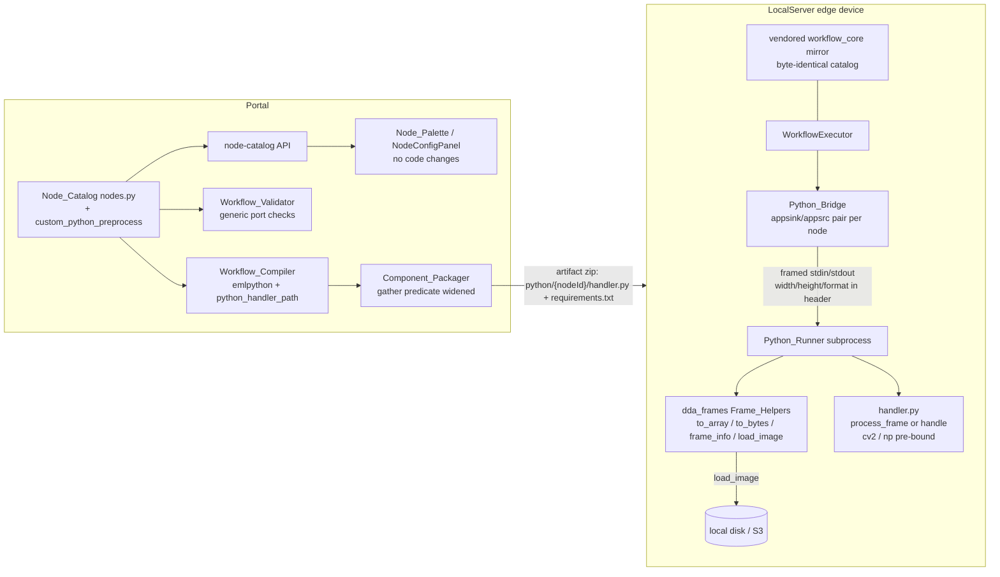

# Design Document: Custom Python Frames

## Overview

This feature adds a Custom Python **preprocessing** node type (`custom_python_preprocess`, VideoFrames in → VideoFrames out) to the workflow node catalog and upgrades the shared Custom Python edge runtime into a practical OpenCV frame-processing environment:

- a new ndarray-based handler contract `process_frame(frame, metadata)` alongside the existing raw-bytes `handle(frame_bytes, metadata)` contract,
- `cv2`, `np`, and `numpy` pre-bound in the handler module's namespace,
- a `dda_frames` helper module (injected by the runner, no extra artifact files) with `to_array` / `to_bytes` conversion, `frame_info()`, and `load_image()` for local paths and `s3://` URIs,
- frame width/height/format delivered to every handler via `metadata["frame"]`.

The design deliberately reuses the entire existing Custom Python delivery chain — the `emlpython` element mapping, the compiler's per-node `{python_handler_path}` derivation, the packager's `python/{nodeId}/handler.py` layout, and the Python_Bridge subprocess isolation — so the new node type requires **no compiler changes, no new edge wire format, and no frontend code changes** (the palette, code editor, port compatibility, and inline validation are all generic over the catalog descriptor). The work concentrates in two files: the catalog (`workflow_core/catalog/nodes.py`, both copies) and the Python_Bridge runner (`src/backend/workflow_engine/python_bridge.py`), plus a one-line predicate change in the packager.

### Key findings from investigation

- **Catalog** (`edge-cv-portal/backend/layers/workflow_core/python/workflow_core/catalog/nodes.py`): `custom_python` is post-processing category with per-instance `input_port_type`/`output_port_type` enum parameters; it maps on all architectures to a single `emlpython` element with `handler-path: {python_handler_path}` and plugin dependency `dda-emlpython`. Its `code` parameter description advertises `process(data, metadata)` — a contract that does not exist in the runtime (Requirement 8 fixes this).
- **Compiler** (`workflow_core/compiler/compiler.py`): `python_handler_path` is derived per node id for *every* node (`_derived_values`), so any node type whose mapping uses the `emlpython` template compiles correctly with zero compiler changes.
- **Packager** (`edge-cv-portal/backend/functions/workflow_packaging.py`): `gather_custom_python_nodes` filters `node.type == 'custom_python'` — the only place the node type id is hardcoded on the portal side. It must also accept `custom_python_preprocess`.
- **Edge bridge** (`src/backend/workflow_engine/python_bridge.py`): the framed protocol header already carries `width`, `height`, `format` from the appsink caps, but the runner never exposes them to the handler (`run_bridged_pipeline` passes `metadata={}`). The runner (`RUNNER_SOURCE`, executed via `python -c` in the subprocess) loads `handler.py` with `importlib` and calls `handle(frame_bytes, metadata)`. All new runtime behavior lands inside `RUNNER_SOURCE`; the bridge (parent) side needs no protocol change.
- **Frontend** (`edge-cv-portal/frontend/src/pages/workflows/`): NodePalette groups by descriptor category; NodeConfigPanel renders a code editor for `paramType === 'code'`; connection acceptance and inline checks key off parameter names (`input_port_type`) and declared ports generically. A fixed-port VideoFrames node needs no frontend changes — only test coverage.
- **Vendored mirror**: `src/backend/workflow_engine/vendor/workflow_core/` is a byte-identical copy of the portal layer package (verified with diff); the test sandbox Docker image COPYies the portal layer copy, so only the two copies exist.
- **Device environment**: `opencv-python` is in `src/backend/requirements.txt` and the handler subprocess runs the executor's interpreter (`sys.executable`), so `cv2`/`numpy` are importable on devices; `boto3` is available via the LocalServer environment and Greengrass provides AWS credentials through the environment, which the bridge already passes through to the subprocess.

## Architecture



Frame flow on the edge for a `process_frame` handler:

1. The bridge's appsink pulls a sample, reads caps (`width`, `height`, `format`), and sends one framed message (header + raw frame bytes) to the subprocess — unchanged from today.
2. The runner merges `{"frame": {"width": w, "height": h, "format": f}}` into the metadata dict and publishes the same triple to the `dda_frames` per-frame context.
3. If the handler defines `process_frame`, the runner converts the raw bytes to a NumPy uint8 array (handling row padding by slicing each stride-sized row to `width × channels` bytes), invokes `process_frame(frame, metadata)`, verifies the returned array's shape and dtype, and writes the pixels back into a copy of the original byte buffer (preserving padding and total byte length so the appsrc caps stay valid).
4. If the handler defines only `handle`, the existing raw-bytes path runs unchanged (with metadata now carrying the `frame` key).
5. The response message travels back over the existing protocol; the bridge pushes the output buffer with the input buffer's timestamps — unchanged.

### Design decisions

- **New node type, not a category flag.** A separate `custom_python_preprocess` descriptor with fixed VideoFrames ports gives users an unambiguous frames-in/frames-out node in the preprocessing palette section, while `custom_python` keeps its flexible per-instance port typing for post-processing. Both share the `emlpython` mapping, so downstream behavior is identical.
- **All runtime additions live in `RUNNER_SOURCE`.** The runner is self-contained by design (the subprocess must not import LocalServer). Embedding the `dda_frames` module source in the runner (registered in `sys.modules` before the handler loads) keeps artifacts unchanged (Requirement 5.1) and works for already-deployed workflows the moment LocalServer updates.
- **`process_frame` output must match input shape/dtype.** The appsrc caps are fixed from the first input sample, so emitting frames of a different size or format would corrupt the pipeline. The runner enforces the constraint and produces a descriptive per-node error instead (Requirement 3.4).
- **Row padding preserved by write-back.** GStreamer buffers may carry row stride padding. `to_array` slices rows by stride; the `process_frame` path writes returned pixels back into a copy of the original buffer bytes, so output byte length always equals input byte length (Requirement 3.2).
- **Pre-imports are best-effort bindings.** `cv2`/`np`/`numpy` are set as module attributes on the handler module *before* `exec_module`, so top-level handler code can use them; import failures leave the binding absent without failing handlers that do not reference it (Requirement 4.3).
- **`load_image` decodes via `cv2.imdecode`** for both local files and S3 objects (uniform behavior, BGR order, honors any format OpenCV can decode). The S3 client is created lazily with boto3 and is injectable for tests.
- **No compiler/serializer/schema changes.** The workflow definition schema stores node `type` as an open string; validation resolves it against the catalog. Adding a descriptor is sufficient.
- **Test sandbox unchanged.** The sandbox inherits whatever behavior `custom_python` has today for the `emlpython` element; the new node type compiles to the identical element chain, so sandbox behavior is identical by construction. Extending sandbox simulation of Custom Python handlers is out of scope.

## Components and Interfaces

### 1. Catalog descriptor (portal layer + vendored mirror)

`workflow_core/catalog/nodes.py` — add after `FORMAT_CONVERT`:

```python
CUSTOM_PYTHON_PREPROCESS = NodeTypeDescriptor(
    type_id="custom_python_preprocess",
    category=CATEGORY_PREPROCESSING,
    display_name="Custom Python (Frames)",
    inputs=[PortDescriptor("in", PORT_TYPE_VIDEO_FRAMES)],
    outputs=[PortDescriptor("out", PORT_TYPE_VIDEO_FRAMES)],
    parameters=[
        ParameterDescriptor("code", "code", required=True, default=None,
                            constraints={"min_length": 1},
                            description="Python run for every video frame. Define "
                                        "process_frame(frame, metadata) and return the "
                                        "processed frame; frame is a NumPy uint8 array "
                                        "(rows x cols x channels) and cv2/np are "
                                        "pre-imported. Return None to pass the frame "
                                        "through. Helpers: import dda_frames for "
                                        "frame_info(), load_image(path or s3:// URI), "
                                        "to_array(), to_bytes().",
                            examples=["def process_frame(frame, metadata):\n"
                                      "    return cv2.GaussianBlur(frame, (5, 5), 0)"]),
        ParameterDescriptor("requirements", "string", required=False, default="",
                            constraints={},
                            description="Extra pip packages the code needs, one per "
                                        "line in requirements.txt form.",
                            examples=["scikit-image==0.24.0"]),
    ],
    mappings=_same_on_all_archs(
        element_chain=[_element("emlpython", **{"handler-path": "{python_handler_path}"})],
        plugin_dependencies=["dda-emlpython"],
    ),
    hardware_dependent=False,
)
```

`CUSTOM_PYTHON_PREPROCESS` is inserted into `NODE_CATALOG` with the other preprocessing types (after `FORMAT_CONVERT`), so `nodes_by_category()` places it in the preprocessing palette section. The `custom_python` descriptor's `code` description/examples are rewritten to state the real contract (Requirement 8):

```
description: "Python run for every item passing through the node. Define
              process_frame(frame, metadata) to work with video frames as NumPy
              arrays (cv2/np pre-imported; import dda_frames for helpers), or
              handle(frame_bytes, metadata) -> (frame_bytes, metadata) to work
              with raw bytes."
examples:    ["def process_frame(frame, metadata):\n    return frame",
              "def handle(frame_bytes, metadata):\n    return frame_bytes, metadata"]
```

The vendored copy `src/backend/workflow_engine/vendor/workflow_core/catalog/nodes.py` is updated to stay byte-identical (Requirement 1.6).

### 2. Component_Packager (`edge-cv-portal/backend/functions/workflow_packaging.py`)

```python
CUSTOM_PYTHON_NODE_TYPES = ('custom_python', 'custom_python_preprocess')

def gather_custom_python_nodes(graph) -> List[Dict]:
    ...
    if node.type in CUSTOM_PYTHON_NODE_TYPES:
```

Everything downstream (`build_arch_zip` writing `python/{nodeId}/handler.py` + `requirements.txt`, `build_manifest` emitting `customPythonNodeIds`) is already generic over the gathered list (Requirements 2.4, 2.5).

### 3. Python_Runner (`src/backend/workflow_engine/python_bridge.py`, `RUNNER_SOURCE`)

The runner script gains three pieces. The bridge (parent process) and the framed protocol are untouched.

**(a) `dda_frames` helper module** — embedded as a separate module-level constant `HELPERS_SOURCE` in `python_bridge.py` and prepended into the assembled runner source. Registered before the handler loads:

```python
_helpers = types.ModuleType("dda_frames")
exec(HELPERS_SOURCE, _helpers.__dict__)
sys.modules["dda_frames"] = _helpers
```

Helper API (all functions raise `ValueError` with descriptive messages on bad input):

```python
FORMAT_CHANNELS = {"RGB": 3, "BGR": 3, "RGBA": 4, "GRAY8": 1}

def to_array(frame_bytes, width, height, format):
    """Raw frame bytes -> NumPy uint8 array (H x W x C; H x W for GRAY8).
    Row stride = len(frame_bytes) // height; each row's first
    width*channels bytes are taken, tolerating stride padding."""

def to_bytes(array):
    """NumPy uint8 array -> contiguous raw frame bytes (no padding)."""

def frame_info():
    """{'width': int, 'height': int, 'format': str} for the frame whose
    handler invocation is in progress; None outside an invocation."""

def load_image(source, s3_client=None):
    """Local path or s3://bucket/key -> BGR uint8 array via cv2.imdecode.
    Raises ValueError naming the source on missing file, malformed URI,
    fetch failure, or undecodable content. s3_client is injectable for
    tests; by default a lazily created boto3 client using the device's
    ambient AWS credentials."""
```

`load_image` reads local files with `open(..., 'rb')` (so missing-file errors are uniform) and S3 objects with `get_object`, then decodes with `cv2.imdecode(np.frombuffer(data, np.uint8), cv2.IMREAD_UNCHANGED)`; a 3-channel result stays BGR, 4-channel input is reduced with `cv2.cvtColor(..., cv2.COLOR_BGRA2BGR)` only when decoded via IMREAD_COLOR — the design uses `cv2.IMREAD_COLOR` for multi-channel sources and `IMREAD_UNCHANGED` yields 2-D arrays for grayscale PNGs, satisfying Requirement 6.1's BGR/2-D contract. PNG round-trip equality (Requirement 6.3) holds for 3-channel BGR arrays written with `cv2.imwrite`.

**(b) Pre-imports and handler resolution** — in the runner's `main()` after `module_from_spec` and before `exec_module`:

```python
for name, binding in (("cv2", "cv2"), ("numpy", "np"), ("numpy", "numpy")):
    try:
        setattr(module, binding, importlib.import_module(name))
    except Exception:
        pass  # absent binding; handlers not using it are unaffected
```

After `exec_module`, entry-point resolution (Requirements 3.6–3.8):

```python
process_frame = getattr(module, "process_frame", None)
handle = getattr(module, "handle", None)
if not callable(process_frame) and not callable(handle):
    error: "handler.py defines neither process_frame(frame, metadata) "
           "nor handle(frame_bytes, metadata)"
```

`process_frame` wins when both are defined (Requirement 3.7).

**(c) Frame loop changes** — per message, before invocation:

```python
metadata = header.get("metadata") or {}
info = {"width": header.get("width"), "height": header.get("height"),
        "format": header.get("format")}
metadata["frame"] = info          # Requirement 3.9
dda_frames._set_current(info)     # Requirement 5.6 (cleared in finally)
```

`process_frame` invocation path:

- format not in `FORMAT_CHANNELS` or width/height missing → error naming the node's unsupported format (Requirement 3.5); numpy unimportable → error naming the missing library.
- `arr = dda_frames.to_array(frame, w, h, fmt)`; `result = process_frame(arr, metadata)`.
- `result is None` → emit input bytes unchanged (Requirement 3.3).
- ndarray with `result.shape == arr.shape and result.dtype == arr.dtype` → write rows back into `bytearray(frame)` at the original stride, emit (Requirement 3.2).
- anything else → error describing expected vs. actual shape/dtype (Requirement 3.4); the runner reports `status: error` and the bridge raises `CustomPythonNodeError` naming the node, exactly like today's handler exceptions.

`handle` invocation is unchanged apart from the enriched metadata. Handler-returned metadata continues to flow back in the response header for both contracts.

### 4. Frontend (no code changes; test coverage only)

- NodePalette test fixture gains the new descriptor and asserts it renders in the Preprocessing section (Requirement 7.1).
- NodeConfigPanel test asserts the code editor renders for the new type's `code` parameter (Requirement 7.2).
- connectionAcceptance property test domain extended with a fixed-VideoFrames-port node shape (Requirement 7.3).
- inlineChecks test asserts a missing `code` yields a required-parameter marker (Requirement 7.4) — generic behavior, pinned by an example.

## Data Models

**Catalog descriptor** — one new `NodeTypeDescriptor` record (shape above); no schema changes to `serializer/schema.py` (node `type` is an open string resolved against the catalog).

**Framed protocol** — unchanged. Executor → runner header: `{nodeId, width, height, format, metadata, frameSize}`; runner → executor: `{status, metadata, frameSize}` or `{status: "error", error}`.

**Metadata frame info** (new, runner-side): `metadata["frame"] = {"width": int|None, "height": int|None, "format": str|None}` delivered to every handler invocation.

**Frame array convention**: NumPy uint8, shape `(height, width, channels)` for RGB/BGR (3) and RGBA (4); shape `(height, width)` for GRAY8. Row stride handling: input bytes of length `L` for height `h` have stride `s = L // h`; row `i` pixels are bytes `[i*s, i*s + width*channels)`.

**Manifest**: `customPythonNodeIds` (existing key) now lists node ids of both Custom Python node types.

**Artifact layout** (existing, now also for the new type): `python/{nodeId}/handler.py`, `python/{nodeId}/requirements.txt`.

## Correctness Properties

*A property is a characteristic or behavior that should hold true across all valid executions of a system — essentially, a formal statement about what the system should do. Properties serve as the bridge between human-readable specifications and machine-verifiable correctness guarantees.*

### Property 1: Validator acceptance of preprocessing node connections

*For any* workflow graph wiring a source node's output port into a `custom_python_preprocess` node's input port, the Workflow_Validator accepts the connection exactly when `are_port_types_compatible(source_type, VideoFrames)` holds under the catalog's declared coercion rules (VideoFrames exactly, and InferenceMeta via the declared coercion), and otherwise reports a port type compatibility error identifying that connection.

**Validates: Requirements 2.1, 2.2**

### Property 2: Legacy handle contract is preserved

*For any* frame bytes and metadata dict, a handler defining only `handle(frame_bytes, metadata)` invoked through the CustomPythonBridge receives the frame bytes unchanged, receives the metadata enriched with the `frame` info key, and its returned `(frame_bytes, metadata)` round-trips back to the bridge caller exactly as under the pre-existing contract.

**Validates: Requirements 3.6, 3.9**

### Property 3: Custom Python node gathering and manifest membership

*For any* workflow graph containing an arbitrary mix of `custom_python` nodes, `custom_python_preprocess` nodes, and other node types with arbitrary node ids, code strings, and requirements strings, `gather_custom_python_nodes` returns exactly the Custom Python nodes of both types with their code and requirements preserved, and `build_manifest`'s `customPythonNodeIds` equals exactly those nodes' ids.

**Validates: Requirements 2.4, 2.5**

### Property 4: process_frame contract round trip

*For any* frame dimensions, supported Pixel_Format, pixel content, and row padding, a `process_frame` handler invoked through the CustomPythonBridge receives a NumPy uint8 array of the shape implied by the caps (rows × columns × channels; 2-D for GRAY8); returning that array unchanged emits output bytes equal to the input bytes (padding included); returning None emits the input bytes unchanged; and returning a deterministic transformation (bitwise inversion) emits bytes whose pixel regions are the transformed pixels while padding bytes and total byte length are preserved.

**Validates: Requirements 3.1, 3.2, 3.3**

### Property 5: process_frame contract violations fail the node identifiably

*For any* frame and any non-compliant `process_frame` outcome — a returned array of different shape, a returned array of different dtype, a non-array non-None return, or an input frame whose Pixel_Format is outside the supported set — the CustomPythonBridge raises `CustomPythonNodeError` carrying the node id and a message describing the mismatch or the unsupported format.

**Validates: Requirements 3.4, 3.5**

### Property 6: Frame info delivery

*For any* frame width, height, and supported Pixel_Format dispatched by the bridge, the handler observes that exact triple both in `metadata["frame"]` and from `dda_frames.frame_info()` during the invocation.

**Validates: Requirements 3.9, 5.6**

### Property 7: Frame/array conversion round trip

*For any* frame dimensions, supported Pixel_Format, and pixel content, `to_bytes(to_array(frame_bytes, width, height, format))` equals the original unpadded frame bytes, and `to_array` of padded frame bytes returns the same array as `to_array` of the unpadded bytes; *for any* unsupported format string or byte string shorter than the dimensions require, `to_array` raises an error describing the format or size problem.

**Validates: Requirements 5.2, 5.3, 5.4, 5.5**

### Property 8: Disk image load round trip

*For any* uint8 BGR image array written losslessly to a PNG file with `cv2.imwrite`, `dda_frames.load_image` of that path returns an array equal to the original.

**Validates: Requirements 6.1, 6.3**

### Property 9: S3 image load round trip

*For any* bucket name, object key, and uint8 BGR image array PNG-encoded and served by an injected fake S3 client, `dda_frames.load_image("s3://bucket/key", s3_client=fake)` requests exactly that bucket and key and returns an array equal to the original.

**Validates: Requirements 6.2**

### Property 10: load_image failures identify the source

*For any* failing source — a non-existent local path, a malformed `s3://` URI, an S3 client raising on fetch, or existing content that does not decode as an image — `dda_frames.load_image` raises an error whose message contains the source.

**Validates: Requirements 6.4**

### Property 11: Designer connection acceptance for fixed VideoFrames ports

*For any* generated pair of nodes where the target is a `custom_python_preprocess`-shaped descriptor (fixed VideoFrames ports, no port type override parameters), the Workflow_Builder connection acceptance function accepts the connection exactly when the source output port type is compatible with VideoFrames under the declared coercion rules (VideoFrames exactly, or InferenceMeta via the declared coercion — mirroring the backend validator per Requirement 2.1) and otherwise rejects it with a reason.

**Validates: Requirements 7.3**

### Property 12: Compiled emlpython element per Custom Python preprocessing node

*For any* valid workflow graph embedding `custom_python_preprocess` nodes with arbitrary node ids, compiling for any architecture yields exactly one `emlpython` element per such node carrying `handler-path` equal to `python/{nodeId}/handler.py` and tagged with that node's id.

**Validates: Requirements 2.3**

## Error Handling

All new failure modes flow through the existing containment path: the runner reports `{status: "error", error: <traceback or message>}`, the bridge raises `CustomPythonNodeError(node_id, message)`, and the executor fails only that workflow run with the node identified (workflow-manager Requirements 9.8/13.7 behavior, unchanged).

| Failure | Where detected | Behavior |
|---|---|---|
| Handler defines neither `process_frame` nor `handle` | Runner, at module load | Error names both accepted entry points; subprocess exits; bridge raises `CustomPythonNodeError` before the pipeline goes to PLAYING |
| `process_frame` with unsupported Pixel_Format (e.g. NV12) or missing caps dims | Runner, per frame | Error names the format; run fails with node identified |
| `process_frame` defined but NumPy unimportable | Runner, per frame | Error names the missing library |
| Returned array shape/dtype mismatch, or non-array non-None return | Runner, per frame | Error describes expected vs. actual; run fails with node identified |
| `to_array`/`to_bytes` misuse from handler code | Frame_Helpers (`ValueError`) | Propagates as a handler exception → existing error path |
| `load_image`: missing file, malformed URI, S3 fetch failure, undecodable bytes | Frame_Helpers (`ValueError` naming the source) | Propagates as a handler exception → existing error path |
| `cv2`/`numpy` import failure at pre-import | Runner, module load | Binding silently absent; only handlers referencing it fail (with a normal NameError traceback) |
| boto3 unavailable when `load_image` gets an `s3://` URI | Frame_Helpers | `ValueError` naming the source and the missing boto3 dependency |

Existing failure modes (wall-clock timeout, memory limit, protocol violations, subprocess death) are untouched.

## Testing Strategy

The feature is covered by a dual approach: property-based tests for the universal contracts above and example-based tests for fixed catalog content, dispatch rules, and UI rendering. Property tests use **hypothesis** (Python) and **fast-check** (TypeScript), inherit each suite's iteration profile from its conftest/setup (no hardcoded `max_examples`; the CI profile runs ≥100 iterations), and each carries a comment tag in the form **Feature: custom-python-frames, Property {number}: {property_text}**. Each correctness property is implemented by a single property-based test.

**Portal backend** (`pytest` + `hypothesis`):
- `edge-cv-portal/backend/layers/workflow_core/tests/` — catalog content examples (descriptor shape, mapping parity with `custom_python`, description/example contract checks: Requirements 1.1–1.5, 8.1, 8.2), Property 1 (validator), Property 12 (compiler).
- `edge-cv-portal/backend/tests/` — Property 3 as `test_property_*.py` over the pure `gather_custom_python_nodes` + `build_manifest`; one example extension of `test_workflow_packaging_deployment_integration.py` covering the new node type's files in the arch zips (Requirements 2.4, 2.5 integration).

**Edge LocalServer** (`pytest` + `hypothesis`, run as `PYTHONPATH=src/backend:test/backend-test pytest test/backend-test/workflow_engine/...` — scoped to the workflow_engine suites; the broader edge suite has pre-existing environment-dependent failures on this host):
- `test/backend-test/workflow_engine/` — Properties 2, 4, 5, 6, 7, 8, 9, 10 against the real `CustomPythonBridge` (real subprocesses, as the existing `test_workflow_python_bridge.py` does) and against `dda_frames` executed from `HELPERS_SOURCE`; example tests for entry-point dispatch (both defined → `process_frame` wins; neither → error naming both), pre-imported `cv2`/`np` usage, sibling-module import regression, missing-cv2 resilience, and `load_image` failure containment through the bridge (Requirements 3.7, 3.8, 4.1–4.5, 5.1, 6.5).
- Host prerequisites verified: numpy 2.0.2, cv2 4.13.0, boto3, hypothesis are importable with the system interpreter that spawns the handler subprocesses.

**Frontend** (`vitest` + RTL + `fast-check`, `edge-cv-portal/frontend/src/pages/workflows/`):
- Property 11 as an extension of the existing `connectionAcceptance.property.test.ts` domain.
- Example tests: palette section rendering, code editor rendering, inline required-`code` marker (Requirements 7.1, 7.2, 7.4).

**Vendored mirror** (Requirement 1.6): a byte-equality check between the two `nodes.py` copies executed as part of the edge test additions (smoke).

Baselines to keep green: portal backend tests (moto-backed conftest), workflow_core layer tests, frontend vitest + `npm run build`, and the edge `test/backend-test/workflow_engine` suites that pass on this host.
