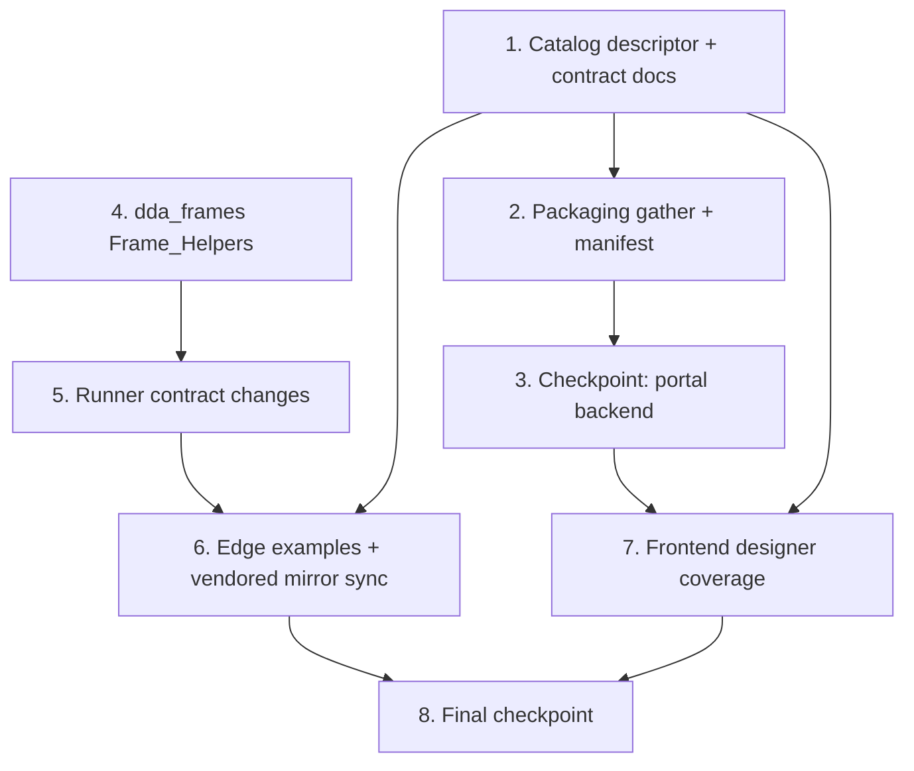

# Implementation Plan: Custom Python Frames

## Overview

Work proceeds along two independent tracks that meet at the vendored-mirror sync: the Portal track (catalog descriptor + documentation fixes, then packaging) and the Edge track (the `dda_frames` helper module, then the runner contract changes), followed by the mirror sync, frontend coverage, and a final full-suite checkpoint. There are no compiler, serializer, schema, or frontend production-code changes — the compiler already derives `python_handler_path` per node, and the designer UI is generic over the catalog descriptor.

Test baselines that must stay green: portal backend `edge-cv-portal/backend/tests` and `edge-cv-portal/backend/layers/workflow_core/tests` (pytest + hypothesis, moto-backed conftest), frontend vitest (`edge-cv-portal/frontend`, vitest + RTL + fast-check) plus `npm run build`, and the edge suites run as `PYTHONPATH=src/backend:test/backend-test pytest test/backend-test/workflow_engine/` (scoped to the workflow_engine suites — the broader edge suite has pre-existing environment-dependent failures on this host). Python property tests use `hypothesis` and TypeScript property tests use `fast-check`; iteration counts come from each suite's registered profile (no hardcoded `max_examples`; the CI profile runs ≥100 iterations) and every property test is tagged `**Feature: custom-python-frames, Property {number}: {property_text}**`.

## Task Dependency Graph



```json
{
  "waves": [
    { "wave": 1, "tasks": ["1", "4"], "description": "Independent foundations: the catalog descriptor with its validator/compiler properties (portal), and the dda_frames helper module with its conversion/load properties (edge)" },
    { "wave": 2, "tasks": ["2", "5"], "description": "Consumers of the foundations: packaging gather/manifest (portal), and the runner contract changes with their bridge-level properties (edge)" },
    { "wave": 3, "tasks": ["3"], "description": "Checkpoint: portal backend and workflow_core layer suites pass" },
    { "wave": 4, "tasks": ["6"], "description": "Edge example tests, load_image failure containment, and the vendored workflow_core mirror sync with byte-equality smoke test" },
    { "wave": 5, "tasks": ["7"], "description": "Frontend designer coverage (palette, code editor, inline marker examples; connection acceptance property)" },
    { "wave": 6, "tasks": ["8"], "description": "Final checkpoint: all suites pass" }
  ]
}
```

## Tasks

- [x] 1. Add the Custom Python preprocessing node type to the catalog (portal layer)
  - [x] 1.1 Add the `custom_python_preprocess` descriptor and fix the Custom Python contract documentation
    - In `edge-cv-portal/backend/layers/workflow_core/python/workflow_core/catalog/nodes.py`: add `CUSTOM_PYTHON_PREPROCESS` (type id `custom_python_preprocess`, category `CATEGORY_PREPROCESSING`, display name "Custom Python (Frames)", fixed `in`/`out` VideoFrames ports, required `code` parameter of type `code` documenting `process_frame(frame, metadata)` with a cv2 example, optional `requirements` parameter, `_same_on_all_archs` mapping to the `emlpython` element with `handler-path: {python_handler_path}` and plugin dependency `dda-emlpython`, `hardware_dependent=False`); insert it into `NODE_CATALOG` after `FORMAT_CONVERT`
    - Rewrite the `custom_python` descriptor's `code` parameter description and examples to state the actual runtime entry points (`process_frame(frame, metadata)` and `handle(frame_bytes, metadata) -> (frame_bytes, metadata)`) in place of the non-existent `process(data, metadata)` contract
    - _Requirements: 1.1, 1.2, 1.3, 1.4, 1.5, 8.1, 8.2_

  - [x] 1.2 Write catalog content unit tests for the new descriptor and documentation
    - In `edge-cv-portal/backend/layers/workflow_core/tests/test_catalog_content.py`: descriptor present with preprocessing category and display name; exactly one VideoFrames input and one VideoFrames output with no `input_port_type`/`output_port_type` parameters; required `code` + optional `requirements` parameters; per-architecture mappings identical to `custom_python`'s (same element chain and plugin dependencies); `code` descriptions of both Custom Python types name `process_frame` (and `handle` for `custom_python`) and not `process(data, metadata)`; every `code` example of both types exec's to a module defining a callable `process_frame` or `handle`
    - _Requirements: 1.1, 1.2, 1.3, 1.4, 1.5, 8.1, 8.2_

  - [x] 1.3 Write property test for validator acceptance of preprocessing node connections
    - **Feature: custom-python-frames, Property 1: Validator acceptance of preprocessing node connections**
    - **Validates: Requirements 2.1, 2.2**
    - New `test_property_*` module in `edge-cv-portal/backend/layers/workflow_core/tests/`: hypothesis-generated graphs wiring a random source node type's output into a `custom_python_preprocess` input; `validate` accepts exactly when `are_port_types_compatible(source_port_type, VideoFrames)` holds under the catalog's declared coercion rules (VideoFrames, and InferenceMeta via the declared coercion), otherwise reports a V2 port-compatibility finding identifying the connection

  - [x] 1.4 Write property test for the compiled emlpython element
    - **Feature: custom-python-frames, Property 12: Compiled emlpython element per Custom Python preprocessing node**
    - **Validates: Requirements 2.3**
    - Hypothesis-generated valid workflows embedding `custom_python_preprocess` nodes with random node ids, compiled per architecture; exactly one `emlpython` element per node, tagged with the node id, carrying `handler-path` = `python/{nodeId}/handler.py`

- [x] 2. Include the new node type in packaging
  - [x] 2.1 Widen the Custom Python gather predicate
    - In `edge-cv-portal/backend/functions/workflow_packaging.py`: introduce `CUSTOM_PYTHON_NODE_TYPES = ('custom_python', 'custom_python_preprocess')` and use it in `gather_custom_python_nodes`; no other packaging changes (`build_arch_zip` and `build_manifest` are generic over the gathered list)
    - _Requirements: 2.4, 2.5_

  - [x] 2.2 Write property test for gathering and manifest membership
    - **Feature: custom-python-frames, Property 3: Custom Python node gathering and manifest membership**
    - **Validates: Requirements 2.4, 2.5**
    - New `test_property_*` module in `edge-cv-portal/backend/tests/`: hypothesis-generated graphs mixing both Custom Python node types and other types with random ids/code/requirements; `gather_custom_python_nodes` returns exactly the Custom Python nodes with code and requirements preserved; `build_manifest`'s `customPythonNodeIds` equals exactly those ids

  - [x] 2.3 Extend the packaging integration test with the new node type
    - In `edge-cv-portal/backend/tests/test_workflow_packaging_deployment_integration.py`: a definition containing one `custom_python_preprocess` node packages `python/{nodeId}/handler.py` and `python/{nodeId}/requirements.txt` into every architecture zip with the node id in the manifest's `customPythonNodeIds`
    - _Requirements: 2.3, 2.4, 2.5_

- [x] 3. Checkpoint — portal backend suites pass
  - Run `edge-cv-portal/backend/layers/workflow_core/tests` and `edge-cv-portal/backend/tests`; ensure all tests pass, ask the user if questions arise.

- [x] 4. Implement the `dda_frames` Frame_Helpers module (edge)
  - [x] 4.1 Add `HELPERS_SOURCE` to the Python bridge
    - In `src/backend/workflow_engine/python_bridge.py`: a new module-level constant `HELPERS_SOURCE` containing the `dda_frames` module source — `FORMAT_CHANNELS` (RGB/BGR 3, RGBA 4, GRAY8 1), `to_array(frame_bytes, width, height, format)` (uint8 array `(h, w, c)`, 2-D for GRAY8, row stride = `len(frame_bytes) // height` with per-row slicing to tolerate padding; `ValueError` naming the unsupported format or the size shortfall), `to_bytes(array)` (contiguous bytes; `ValueError` on non-uint8/non-array input), `frame_info()` returning the per-invocation `{'width', 'height', 'format'}` context (set/cleared via a private `_set_current`), and `load_image(source, s3_client=None)` (local path via `open(..., 'rb')`, `s3://bucket/key` via a lazily created boto3 client or the injected one; decode with `cv2.imdecode` — `IMREAD_COLOR` for color sources yielding BGR, grayscale PNGs yielding 2-D arrays; `ValueError` containing the source string on missing file, malformed URI, fetch failure, undecodable content, or missing boto3)
    - Keep `HELPERS_SOURCE` dependency-free of LocalServer imports (it executes inside the handler subprocess) and importable standalone for direct unit/property testing via `exec`
    - _Requirements: 5.1, 5.2, 5.3, 5.5, 6.1, 6.2, 6.4_

  - [x] 4.2 Write property test for the frame/array conversion round trip
    - **Feature: custom-python-frames, Property 7: Frame/array conversion round trip**
    - **Validates: Requirements 5.2, 5.3, 5.4, 5.5**
    - New `test_property_*` module in `test/backend-test/workflow_engine/` exec'ing `HELPERS_SOURCE`; hypothesis over dims × supported formats × pixel bytes × padding: `to_bytes(to_array(...))` equals unpadded input; padded and unpadded inputs decode to equal arrays; unsupported formats and short buffers raise `ValueError` describing the problem

  - [x] 4.3 Write property test for the disk image load round trip
    - **Feature: custom-python-frames, Property 8: Disk image load round trip**
    - **Validates: Requirements 6.1, 6.3**
    - Hypothesis over uint8 `(h, w, 3)` arrays written to tmp PNGs with `cv2.imwrite`; `load_image(path)` returns an equal array

  - [x] 4.4 Write property test for the S3 image load round trip
    - **Feature: custom-python-frames, Property 9: S3 image load round trip**
    - **Validates: Requirements 6.2**
    - Hypothesis over bucket/key names and image arrays; injected fake S3 client serving PNG bytes records the requested bucket/key; `load_image("s3://...", s3_client=fake)` returns an equal array and requested exactly that bucket and key

  - [x] 4.5 Write property test for load_image failure identification
    - **Feature: custom-python-frames, Property 10: load_image failures identify the source**
    - **Validates: Requirements 6.4**
    - Hypothesis over missing paths, malformed `s3://` URIs, raising fake clients, and non-image byte content; every case raises `ValueError` whose message contains the source

- [x] 5. Implement the runner contract changes (edge)
  - [x] 5.1 Extend `RUNNER_SOURCE` with helpers injection, pre-imports, entry-point dispatch, and the process_frame path
    - In `src/backend/workflow_engine/python_bridge.py` `RUNNER_SOURCE` (assembled with `HELPERS_SOURCE`): register `dda_frames` in `sys.modules` before the handler loads; best-effort bind `cv2`, `np`, and `numpy` on the handler module before `exec_module` (import failures leave the binding absent); resolve the entry point after `exec_module` — `process_frame` preferred, `handle` fallback, neither → error naming both entry points reported through the existing `status: error` path
    - Per frame: merge `{"frame": {"width", "height", "format"}}` into the metadata dict and set the `dda_frames` per-invocation context (cleared in `finally`); for `process_frame`: unsupported/missing format or unimportable numpy → descriptive error; convert bytes via `to_array`; `None` return → emit input bytes; matching shape/dtype array → write rows back into a `bytearray` copy of the input at the original stride (byte length preserved); any other return → error describing expected vs. actual shape/dtype; for `handle`: existing raw-bytes behavior unchanged apart from the enriched metadata
    - No changes to the framed protocol, the bridge (parent) class, `rewrite_document`, or `run_bridged_pipeline`
    - _Requirements: 3.1, 3.2, 3.3, 3.4, 3.5, 3.6, 3.7, 3.8, 3.9, 4.1, 4.2, 4.3, 4.4, 5.1, 5.6_

  - [x] 5.2 Write property test for the process_frame contract round trip
    - **Feature: custom-python-frames, Property 4: process_frame contract round trip**
    - **Validates: Requirements 3.1, 3.2, 3.3**
    - Hypothesis over dims × formats × pixels × padding through a real `CustomPythonBridge.process_frame`: an identity handler asserts received shape/dtype and output bytes equal input bytes; a None-returning handler passes bytes through; a `bitwise inversion` handler inverts pixel regions while padding bytes and byte length are preserved

  - [x] 5.3 Write property test for process_frame contract violations
    - **Feature: custom-python-frames, Property 5: process_frame contract violations fail the node identifiably**
    - **Validates: Requirements 3.4, 3.5**
    - Hypothesis over frames and violation kinds (wrong-shape array, wrong-dtype array, non-array return, unsupported Pixel_Format input); each raises `CustomPythonNodeError` carrying the node id and a message describing the mismatch or format

  - [x] 5.4 Write property test for frame info delivery
    - **Feature: custom-python-frames, Property 6: Frame info delivery**
    - **Validates: Requirements 3.9, 5.6**
    - Hypothesis over (width, height, format); a handler returning `metadata["frame"]` and `dda_frames.frame_info()` through its response metadata; both equal the dispatched caps triple

  - [x] 5.5 Write property test for legacy handle contract preservation
    - **Feature: custom-python-frames, Property 2: Legacy handle contract is preserved**
    - **Validates: Requirements 3.6, 3.9**
    - Hypothesis over frame bytes and metadata dicts; a `handle`-only handler receives the bytes unchanged and metadata enriched with the `frame` key, and its returned `(frame_bytes, metadata)` round-trips to the bridge caller; the existing `test_workflow_python_bridge.py` suite passes unchanged

- [x] 6. Edge example tests and vendored mirror sync
  - [x] 6.1 Write example tests for dispatch, pre-imports, and library imports
    - In `test/backend-test/workflow_engine/test_workflow_python_bridge.py` (or a sibling module): both entry points defined → `process_frame` output wins; neither defined → `CustomPythonNodeError` naming `process_frame` and `handle`; handler using `cv2` and `np` without import statements processes successfully; handler importing a stdlib module and a sibling module shipped beside `handler.py` succeeds; a subprocess where `cv2` import is blocked (import-raising stub on `PYTHONPATH`) still runs a `handle`-only handler; `import dda_frames` succeeds with only `handler.py` shipped
    - _Requirements: 3.7, 3.8, 4.1, 4.2, 4.3, 4.4, 4.5, 5.1, 5.7_

  - [x] 6.2 Write example test for load_image failure containment through the bridge
    - A handler calling `dda_frames.load_image` on a missing path raises through the bridge as `CustomPythonNodeError` carrying the node id and the source in its message
    - _Requirements: 6.5_

  - [x] 6.3 Sync the vendored workflow_core mirror and add the byte-equality smoke test
    - Copy the changed catalog file to `src/backend/workflow_engine/vendor/workflow_core/catalog/nodes.py` so the mirror is byte-identical to the portal layer copy; add a smoke test in `test/backend-test/workflow_engine/` asserting byte equality of the two `nodes.py` files
    - _Requirements: 1.6, 3.10_

- [x] 7. Frontend designer coverage (no production code changes)
  - [x] 7.1 Write example tests for palette, code editor, and inline marker
    - `NodePalette.test.tsx`: catalog fixture including the `custom_python_preprocess` descriptor renders it in the Preprocessing section; `NodeConfigPanel.test.tsx`: selecting the node renders the code editor for the `code` parameter; `inlineChecks.test.ts`: a node instance without `code` yields a required-parameter marker
    - _Requirements: 7.1, 7.2, 7.4_

  - [x] 7.2 Write property test for connection acceptance with fixed VideoFrames ports
    - **Feature: custom-python-frames, Property 11: Designer connection acceptance for fixed VideoFrames ports**
    - **Validates: Requirements 7.3**
    - Extend `connectionAcceptance.property.test.ts`'s fast-check domain with a fixed-VideoFrames-port descriptor shape (no port type override parameters); acceptance exactly when the source output port type is VideoFrames, rejection carries a reason otherwise

- [x] 8. Final checkpoint — all suites pass
  - Run the portal backend suites (`edge-cv-portal/backend/tests`, `edge-cv-portal/backend/layers/workflow_core/tests`), the frontend suite (`npx vitest run` in `edge-cv-portal/frontend`) plus `npm run build`, and the edge suites (`PYTHONPATH=src/backend:test/backend-test pytest test/backend-test/workflow_engine/`); ensure all tests pass, ask the user if questions arise.

## Notes

- No compiler, serializer, schema, or frontend production-code changes are required: the compiler already derives `python_handler_path` per node, the workflow definition schema stores node `type` as an open string, and the designer UI (palette grouping, code editor, connection acceptance, inline markers) is generic over the catalog descriptor.
- The framed stdin/stdout protocol and the bridge (parent) class are unchanged — all runtime additions live in `RUNNER_SOURCE`/`HELPERS_SOURCE`, so already-deployed workflow artifacts gain the new contract when LocalServer updates.
- Property tests inherit iteration counts from each suite's hypothesis/fast-check profile (CI profile ≥100 iterations); no `max_examples` hardcoding.
- Edge test runs are scoped to `test/backend-test/workflow_engine/` — the broader edge suite has pre-existing environment-dependent failures on this host.
- Checkpoints (tasks 3 and 8) validate incrementally; each task references the granular requirements it implements for traceability.
