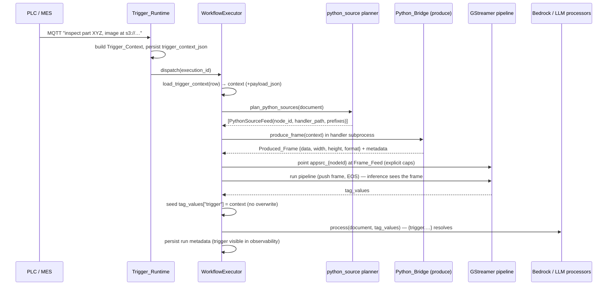
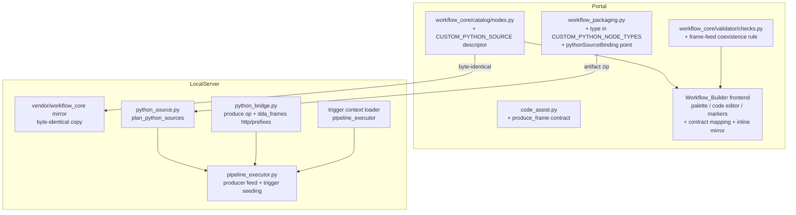

# Design Document: Custom Python Source

## Overview

This feature adds a `custom_python_source` node type — a `CATEGORY_INPUT` node whose user-authored Python produces the run's frame — and finally *reads back* the Trigger_Context that the Trigger_Runtime has been persisting to `workflow_executions.trigger_context_json` since the trigger-activation-runtime feature. Together they close the line-side integration gap: a PLC/MES publishes "inspect part XYZ, image at s3://…", the trigger starts a run, the source node's `produce_frame(context)` fetches *that* image, and the compiled pipeline's inference nodes consume it exactly as they would a camera frame.

The design deliberately re-uses four proven mechanisms rather than inventing new ones:

1. **The Aravis Frame_Feed model** (`aravis_feed.py`, `_prepare_aravis_frame_feed`, `_point_appsrc_at_frame_feed`): the node compiles to an `appsrc name=appsrc_{nodeId} ! videoconvert` chain on every device architecture; the executor resolves one frame *before* the pipeline starts, renames the appsrc, sets its caps, pushes the frame, and sends EOS. A new pure planner (`python_source.py`) mirrors `plan_aravis_feeds` exactly.
2. **The Python_Bridge subprocess isolation** (`python_bridge.py`): the Frame_Producer runs in the same runner subprocess Custom Python handlers use (RLIMIT_AS, thread caps, PYTHONHOME scrubbing, framed stdin/stdout protocol), extended *additively* with a `produce` operation that carries the Trigger_Context in and the resolved Produced_Frame out.
3. **The Custom Python packaging path** (`workflow_packaging.py`): adding `custom_python_source` to `CUSTOM_PYTHON_NODE_TYPES` ships `python/{nodeId}/handler.py` + `requirements.txt` and lists the node in `customPythonNodeIds` with zero new packaging code. A `pythonSourceBinding` marker in `bindingPoints` (mirroring `aravisBinding`) lets the device planner find the node.
4. **The binding-point / coexistence discipline** (`checks.py` V7, `plan_aravis_feeds`'s multi-point failure): the validator gains a frame-feed group rule and the device planner refuses documents carrying more than one fed source, both naming the full conflicting membership.

Trigger-context delivery is independent of the source node: *every* run deserializes `trigger_context_json`, derives `payload_json`, and seeds Run_Metadata (`tag_values`) under `trigger` before the Bedrock/LLM processors and output bindings run — so `{trigger.payload_json.part_id}` resolves in `llm_inference` prompt templates through the existing dotted-placeholder engine (`llm_inference.render_prompt`) with no changes to that engine.

## Architecture

### End-to-end flow



### Component placement



### Key design decisions

| Decision | Choice | Rationale |
|---|---|---|
| Compiled element chain | `appsrc name=appsrc_{nodeId} ! videoconvert`, deps `["app", "videoconvertscale"]` | Byte-for-byte the Aravis chain (Req 1.5); the executor's Frame_Feed machinery and the compiler's `{nodeId}` derivation already handle it — zero compiler changes (Req 9.3). |
| Device-side node discovery | `bindingPoints` entry with `pythonSourceBinding: true` | Mirrors `aravisBinding`; compiled elements carry no node *type*, so a packager marker is the established way to find the node. `camera_binding` passes unknown node types unchecked (verified in `test_workflow_camera_binding.py`). |
| Producer transport | Additive `op` field on the framed protocol | Requests without `op` remain per-frame requests, so existing handlers and the per-frame protocol are bit-compatible (Req 6.6, 11.3). |
| Channel-order convention | 3-channel returns are OpenCV BGR, converted to RGB caps | `dda_frames.load_image` and `cv2.imread` both produce BGR; converting in the runner means the obvious code (`return dda_frames.load_image(url)`) is correct by default (Req 3.4, 3.5). |
| HTTP fetch implementation | `urllib.request` with a bounded timeout | Stdlib-only — the helper module must stay self-contained (no new packages in the runner subprocess); timeout default stays below the producer wall-clock limit (Req 4.4). |
| Prefix restriction enforcement point | Inside `dda_frames` fetch path, configured by the runner from the produce request | The restriction is a helper-level policy, not a sandbox (Req 5.5); carrying prefixes in the produce request keeps the bridge stateless. |
| Trigger seeding location | After `run_pipeline` returns, `tag_values.setdefault("trigger", context)` | Satisfies both "before Bedrock/LLM processors" (Req 2.5) and "never overwrite TAG-produced keys" (Req 2.7) with one line; runs on *every* execution, source node or not. |
| Bridged + fed coexistence | `run_bridged_pipeline` gains an optional `frame_data` parameter | Req 7.4 requires a produced frame and pumped emlpython bridges in one run; the parameter defaults to `None` so existing bridged runs are untouched. |

## Components and Interfaces

### 1. Node_Catalog descriptor (Portal layer + vendored mirror)

**File:** `edge-cv-portal/backend/layers/workflow_core/python/workflow_core/catalog/nodes.py` (mirrored verbatim to `src/backend/workflow_engine/vendor/workflow_core/catalog/nodes.py`)

A new `CUSTOM_PYTHON_SOURCE` descriptor **appended** to `NODE_CATALOG` (never inserted — Req 11.4 keeps every pre-existing descriptor's position):

```python
CUSTOM_PYTHON_SOURCE = NodeTypeDescriptor(
    type_id="custom_python_source",
    category=CATEGORY_INPUT,
    display_name="Custom Python (Source)",
    inputs=[PortDescriptor("activation", PORT_TYPE_EVENT_SIGNAL)],
    outputs=[PortDescriptor("out", PORT_TYPE_VIDEO_FRAMES)],
    parameters=[
        ParameterDescriptor("code", "code", required=True, default=None,
                            constraints={"min_length": 1},
                            description=...,   # documents produce_frame(context),
                                               # Trigger_Context keys, dda_frames helpers (Req 1.7)
                            examples=[...]),
        ParameterDescriptor("requirements", "string", required=False, default="", ...),
        ParameterDescriptor("allowed_uri_prefixes", "string", required=False, default="",
                            description=...),  # newline-separated prefixes; states it is
                                               # NOT a sandbox boundary (Req 5.5)
    ],
    mappings=_same_on_device_archs(
        element_chain=[
            _element("appsrc", name="appsrc_{nodeId}"),
            _element("videoconvert"),
        ],
        plugin_dependencies=["app", "videoconvertscale"],
    ) + [_dataset_fed_sim_source()],
    hardware_dependent=True,
)
```

- The `code` description/examples document the full contract: `produce_frame(context)`, the MQTT keys (`topic`, `payload`, `payload_json`, `qos`, `timestamp`) and OPC UA keys (`endpoint`, `node_id`, `value`, `source_timestamp`), the accepted return values, and `dda_frames.load_image` / `load_bytes` (Req 1.7).
- Simulation architecture: `_dataset_fed_sim_source()` — fed from the Test_Dataset like the other hardware frame sources, so sandbox test runs compile and run (Req 1.6).
- `SOURCE_KIND_TO_SOURCE_TYPE` and the unified-input parameter tables are untouched (Req 1.8).
- After the change the vendored mirror files are re-copied; the existing smoke test `test_vendored_catalog_mirror.py` enforces byte-identity (Req 1.9).

### 2. Workflow_Validator frame-feed coexistence (Portal layer)

**File:** `edge-cv-portal/backend/layers/workflow_core/python/workflow_core/validator/checks.py`

- `COEXISTENCE_SINGLETON_TYPES` gains a `custom_python_source` entry ("the single-frame appsrc feed supports exactly one frame-feed source per workflow"). The `aravis_camera_source` entry, its reason string, and the V7 check logic are **unchanged**, so ≥2 Aravis nodes keep today's exact finding (Req 8.1, 8.3).
- A new frame-feed group rule (same `CODE_V7_COEXISTENCE_CONFLICT` finding code, one error finding per offending node) fires when the workflow contains **both** a `custom_python_source` and an `aravis_camera_source`. Each finding names the full conflicting membership and states that the runtime serves one frame-feed source per workflow (Req 8.2). Restricting the mixed rule to "both types present" avoids double-reporting graphs already covered by the singleton rule.

```python
#: Node types that all bind the runtime's single frame feed; at most one
#: node across the whole group may exist per workflow.
FRAME_FEED_SOURCE_TYPES = frozenset({"aravis_camera_source", "custom_python_source"})
```

- V9 (single activation model) needs no change: `custom_python_source` is a `CATEGORY_INPUT` node with an `activation` port, so the existing rule already requires the port connected when a subscription trigger is present (Req 8.6).
- V4 (required parameters) needs no change: `code` is `required=True`, so a code-less node gets the standard finding.

### 3. Component_Packager (Portal backend)

**File:** `edge-cv-portal/backend/functions/workflow_packaging.py`

- `CUSTOM_PYTHON_NODE_TYPES = ('custom_python', 'custom_python_preprocess', 'custom_python_source')` — the existing gather/write path then ships `python/{nodeId}/handler.py` (the `code` parameter) and `python/{nodeId}/requirements.txt` into every architecture zip and lists the node id in the manifest's `customPythonNodeIds` (Req 9.1, 9.2).
- `build_binding_points` gains a `custom_python_source` branch emitting, per node:

```json
{
  "nodeId": "src1",
  "nodeType": "custom_python_source",
  "pythonSourceBinding": true,
  "parameters": {"allowed_uri_prefixes": "s3://plant-images/\nhttps://mes.local/"},
  "slots": []
}
```

  The `code` and `requirements` values are **not** duplicated into the binding point (they ship as artifact files). Documents without the node emit no such point, keeping Aravis-free/source-free packaging output byte-identical (Req 11.5 discipline, proven by the existing packaging-identity property tests).
- The compiler emits the `appsrc` element carrying the node id through the existing `{nodeId}` derivation — no compiler change (Req 9.3).

### 4. Trigger-context loading and Run_Metadata seeding (LocalServer)

**File:** `src/backend/workflow_engine/pipeline_executor.py` (new pure helper plus wiring in `execute()`)

```python
def load_trigger_context(raw: Optional[str]) -> Dict[str, Any]:
    """trigger_context_json -> the run's Trigger_Context.

    NULL / empty / non-object JSON  -> {} (Req 2.2).
    A 'payload' string that parses as JSON adds 'payload_json' with the
    parsed value; a non-JSON payload sets 'payload_json' to None and
    never fails (Req 2.3, 2.4).
    """
```

Wiring in `execute()`:

1. Right after the execution row is loaded: `trigger_context = load_trigger_context(execution.trigger_context_json)`.
2. Right after `tag_values` is produced by the pipeline run (all three run paths) and **before** `self._bedrock_processor` / `self._llm_processor` / output bindings:

```python
if "trigger" not in tag_values:           # never overwrite TAG keys (Req 2.7)
    tag_values["trigger"] = trigger_context
```

3. `_persist_run_metadata` already dumps `tag_values` — the seeded `trigger` key lands in run observability with no further change (Req 2.8).

`llm_inference.render_prompt` already resolves dotted placeholders against nested dicts, so `{trigger.payload_json.part_id}` works with zero changes to that module (Req 2.6). This seeding happens on **every** run — trigger-less runs seed `{"trigger": {}}`, which is the only Run_Metadata delta allowed by Req 11.1.

### 5. Source planner (LocalServer)

**New file:** `src/backend/workflow_engine/python_source.py` — pure, no I/O, mirroring `aravis_feed.py`:

```python
class PythonSourceError(Exception):
    """node_id lets the executor set failing_node_id directly;
    None for document-level failures no single node owns."""

@dataclass(frozen=True)
class PythonSourceFeed:
    node_id: str
    handler_path: str          # "python/{nodeId}/handler.py", artifact-relative
    allowed_uri_prefixes: Tuple[str, ...]   # parsed, blank lines dropped

def plan_python_sources(document: Dict[str, Any]) -> List[PythonSourceFeed]:
    """Plan the document's Frame_Producers from bindingPoints entries
    marked pythonSourceBinding: true.

    - No such points (incl. pre-feature docs with no bindingPoints):
      [] — the executor takes the exact pre-feature path (Req 7.3, 11.5).
    - More than one fed source across pythonSourceBinding and
      aravisBinding points: PythonSourceError(None) naming every
      offending node (Req 8.5).
    - allowed_uri_prefixes parsed from the point's parameters:
      newline-split, stripped, empties dropped (Req 1.4, 5.x).
    """
```

The >1 check counts the **union** of `pythonSourceBinding` and `aravisBinding` points, so a document that reaches the device with a Custom Python source *and* an Aravis source fails before the pipeline starts with every offending node named (Req 8.5). Documents with only Aravis points still plan zero Python sources and keep the existing `plan_aravis_feeds` single-point contract.

### 6. Python_Bridge producer mode (LocalServer)

**File:** `src/backend/workflow_engine/python_bridge.py`

**Protocol (additive, Req 6.6).** Executor→runner headers gain an optional `op` field:

- absent / `"frame"` — the existing per-frame request, bit-identical behavior;
- `"produce"` — one Frame_Producer invocation:

```
→ {"op": "produce", "nodeId": ..., "context": {…Trigger_Context…},
   "allowedUriPrefixes": ["s3://plant-images/", …], "frameSize": 0}
← {"status": "ok", "width": W, "height": H, "format": "RGB",
   "metadata": {...}, "fetchedSources": ["s3://…"], "frameSize": N} + N raw bytes
← {"status": "error", "error": "<traceback>"} on any failure
```

**Runner changes (`RUNNER_SOURCE`).**

- Module load accepts any of `produce_frame` / `process_frame` / `handle`; the "defines neither" startup error message adds `produce_frame` to the list. The per-frame loop behavior for `process_frame`/`handle` is untouched (Req 11.3).
- On an `op == "produce"` request:
  1. If the module defines no callable `produce_frame` → error response naming the required entry point (the executor fails the run with the node identified, Req 3.2). `process_frame`/`handle` are never invoked for a produce request (Req 3.11).
  2. `dda_frames._set_allowed_prefixes(header["allowedUriPrefixes"])` and clear the fetched-sources record.
  3. Invoke `produce_frame(context)` exactly once (Req 3.1).
  4. Resolve the return value with `_resolve_produced_frame(result)` (below).
  5. If the result is a mapping that also carries a `metadata` dict, or the module set no metadata, respond with `metadata` for the executor to merge (Req 6.7).
  6. Reply with the resolved frame bytes, explicit `width`/`height`/`format`, and `dda_frames._fetched_sources()` so the executor can log every fetch (Req 5.4).

**Return-value resolution (`_resolve_produced_frame`, in the runner):**

| `produce_frame` returned | Resolution |
|---|---|
| 2-D NumPy uint8 array | GRAY8; width/height from shape (Req 3.3) |
| 3-D uint8, 3 channels | BGR→RGB channel swap (`cv2.cvtColor` / numpy slice), format RGB (Req 3.4) |
| 3-D uint8, 4 channels | BGRA→RGBA channel swap, format RGBA (Req 3.5) |
| mapping with `array` + `format` in {RGB, RGBA, GRAY8} | array bytes under the stated format, **no** channel conversion; dims from shape; shape must match the format's channel count (Req 3.6) |
| mapping with `data` + `width` + `height` + `format` | raw bytes under the stated format/dims (Req 3.7) |
| `None` | error: "a source must produce a frame" (Req 3.8) |
| anything else | error describing the accepted return values (Req 3.9) |

A mapping with a format outside {RGB, RGBA, GRAY8}, or whose `len(data) != width * height * channels(format)`, is an error describing the inconsistency (Req 3.10). All errors travel back as `status: "error"` with the handler traceback where one exists (Req 6.5). `cv2`/`np`/`numpy` best-effort binding and `dda_frames` registration already happen at module load for every handler — nothing to add (Req 3.12).

**Bridge changes (`CustomPythonBridge`).**

```python
#: Frame_Producer wall-clock limit (a remote object fetch + decode);
#: configurable via env DDA_PYTHON_SOURCE_WALL_CLOCK_SEC (Req 6.2).
DEFAULT_PRODUCER_WALL_CLOCK_LIMIT_SEC = 30.0
#: Frame_Producer memory limit, configurable via
#: env DDA_PYTHON_SOURCE_MEMORY_LIMIT_BYTES (Req 6.3).
DEFAULT_PRODUCER_MEMORY_LIMIT_BYTES = DEFAULT_MEMORY_LIMIT_BYTES

def produce_frame(self, context, allowed_uri_prefixes=()):
    """One produce invocation under the producer wall-clock limit.
    Returns (frame_bytes, width, height, format, metadata).
    Timeout / death / protocol / handler errors raise
    CustomPythonNodeError naming the node — the timeout message states
    the limit (Req 6.4)."""
```

The subprocess spawn is the **same** `_start_locked` path (interpreter, env passthrough, `_THREAD_CAP_ENV`, RLIMIT_AS preexec — Req 6.1); a producer bridge is simply constructed with the producer limits. A new `build_producer_bridge(feed, artifact_path)` helper mirrors `build_bridges` for one `PythonSourceFeed`.

**Bridged-run frame feed.** `run_bridged_pipeline(launch_string, bridges, latency_metrics=None, frame_data=None)` gains the optional `frame_data`: when present, after the pipeline is built it locates the element named `appsrc` (the renamed fed source), sets its caps from the frame's explicit format/dims, pushes one wrapped buffer, and emits EOS — the same single-frame model `GstPipelineManager.run_pipeline` implements. `frame_data=None` (every existing caller) changes nothing (Req 7.4, 11.1).

### 7. Frame_Helpers (`dda_frames`, embedded in `HELPERS_SOURCE`)

All changes live inside the self-contained helper source (stdlib + optional boto3/cv2/numpy only):

```python
#: Bounded network timeout for HTTP(S) fetches, seconds (Req 4.4).
HTTP_TIMEOUT_SEC = 20.0

_allowed_prefixes = ()   # () = permit everything (Req 5.3)
_fetched = []            # source strings fetched this invocation (Req 5.4)

def _set_allowed_prefixes(prefixes): ...      # runner-only hook
def _fetched_sources(): ...                   # runner-only hook

def _check_allowed(source):
    """Raise ValueError naming the source and stating it is outside the
    node's allowed prefixes when prefixes are declared and none matches
    (Req 5.1, 5.2). Empty declaration permits everything (Req 5.3)."""

def _fetch_bytes(source):
    """source -> raw bytes. Dispatch:
    - http:// or https:// -> urllib.request with HTTP_TIMEOUT_SEC;
      non-2xx / timeout / connection failure -> ValueError naming the
      source and the failure (Req 4.5);
    - s3://bucket/key      -> existing boto3 path, code moved verbatim;
    - anything else        -> existing open()/read local path, verbatim.
    Applies _check_allowed and records the source in _fetched first."""

def load_bytes(source):
    """Raw bytes of a local path, s3:// URI, or http(s):// URL,
    undecoded (Req 4.3)."""
    return _fetch_bytes(source)

def load_image(source, s3_client=None):
    """Unchanged signature. Now: _fetch_bytes(source) then the existing
    _decode_image — BGR uint8 array out for every scheme (Req 4.1);
    local and s3 behavior byte-identical to today (Req 4.2, 11.2)."""
```

`to_array`, `to_bytes`, and `frame_info` are untouched (Req 11.2). Because existing per-frame handlers never receive a produce request, `_allowed_prefixes` stays `()` for them and their `load_image` behavior is exactly today's (Req 5.3). Undecodable content keeps raising the existing `_decode_image` ValueError naming the source (Req 4.6).

### 8. Executor integration (LocalServer)

**File:** `src/backend/workflow_engine/pipeline_executor.py`

A new preparation step in `execute()`, placed directly after the Aravis feed preparation (both can never coexist — the planner enforces it):

```python
def _prepare_python_source_feed(self, document, registration, trigger_context):
    """Plan the document's Frame_Producer, run it, and point the
    compiled appsrc at the Frame_Feed.

    Returns (frame_data, producer_metadata) or (None, None) when the
    document plans zero sources (the pre-feature path, Req 7.3).
    Raises PythonSourceError / CustomPythonNodeError with the node id
    on planning and production failures (Req 6.4, 6.5, 7.6, 8.5).
    """
    feeds = plan_python_sources(document)
    if not feeds:
        return None, None
    feed = feeds[0]
    bridge = python_bridge.build_producer_bridge(feed, registration.artifact_path)
    try:
        data, width, height, fmt, metadata = bridge.produce_frame(
            trigger_context, feed.allowed_uri_prefixes)
    finally:
        bridge.stop()
    frame_data = {"data": data, "width": width, "height": height, "format": fmt}
    self._point_appsrc_at_frame_feed(document, feed, frame_data)
    return frame_data, metadata
```

- **Explicit caps (Req 7.2):** `_frame_caps` is extended to *prefer* an explicit `frame_data["format"]` and only fall back to the bytes-per-pixel inference when the key is absent. Aravis frame grabs never set `format`, so the Aravis path is bit-identical (Req 11.1).
- `_point_appsrc_at_frame_feed` is reused as-is (it matches on `nodeId` + `factory == "appsrc"`); its `AravisFeedError` is generalized to accept either feed type's node id (a shared `FrameFeedError` base or duck-typed `node_id` attribute — the executor already reads `e.node_id`).
- **Run paths:** with a produced `frame_data` and no bridges → `manager.run_pipeline(launch_string, frame_data, ...)` (push + EOS, Req 7.1, 7.5); with bridges → `self._run_bridged(..., frame_data=frame_data)` feeding and pumping in the same run (Req 7.4).
- **Failure containment:** planning/production failures call `_finish_failed(..., failing_node_id=e.node_id)` before the pipeline starts, exactly like `AravisFeedError` today (Req 6.4, 6.5, 7.6). The fetched-sources list returned by the bridge is written to the run log (`logger.info`, captured by `RunLogCapture` — Req 5.4).
- **Producer metadata (Req 6.7):** after the pipeline run, `tag_values.setdefault("python_source", {})[feed.node_id] = producer_metadata` (only when non-empty), then the `trigger` seeding described in §4.
- **Node status (Req 7.7):** the node's appsrc element keeps its `nodeId`, so `rendering.element_name_map` and the `NodeStatusCollector` cover it exactly as they cover the Aravis node — running at start, success/failure at the end, failure attribution through `failing_node_id`.

### 9. Code_Assistant (Portal backend + frontend)

**File:** `edge-cv-portal/backend/functions/code_assist.py`

A new `produce_frame` entry in `CONTRACTS`:

```python
PRODUCE_FRAME_ENVIRONMENT = (
    'RUNTIME ENVIRONMENT (Python_Bridge frame producer):\n'
    '- produce_frame(context): called EXACTLY ONCE per workflow run. '
    '`context` is the Trigger_Context that started the run: for MQTT '
    'triggers {topic, payload, payload_json, qos, timestamp} (payload_json '
    'is the payload parsed as JSON, or None); for OPC UA triggers '
    '{endpoint, node_id, value, source_timestamp}; {} for manual runs.\n'
    '- Return the frame: a NumPy uint8 array (H x W grayscale, H x W x 3 '
    'BGR, or H x W x 4 BGRA — OpenCV channel order), or '
    '{"array": arr, "format": "RGB"|"RGBA"|"GRAY8"} to skip channel '
    'conversion, or {"data": bytes, "width": W, "height": H, "format": ...}. '
    'Returning None fails the run.\n'
    '- cv2, np, and numpy are pre-bound; `import dda_frames` provides '
    'load_image(source) -> BGR uint8 array and load_bytes(source) -> raw '
    'bytes for local paths, s3://bucket/key URIs, and http(s):// URLs '
    '(bounded network timeout; fetches may be restricted to the node\'s '
    'allowed URI prefixes).\n'
)

CONTRACTS['produce_frame'] = {
    'entry_points': frozenset({'produce_frame'}),
    'require_exactly_one': False,
    'signature': 'produce_frame(context)',
    'environment': PRODUCE_FRAME_ENVIRONMENT,
}
```

`validate_entry_point` needs no change: generated code lacking a top-level `produce_frame` gets the existing `MISSING_ENTRY_POINT` 422 (Req 9.4, 9.5).

**Frontend** (`NodeConfigPanel.tsx`, `services/api.ts`):

- `CodeAssistContract` union type gains `'produce_frame'`.
- `CODE_ASSIST_CONTRACTS['custom_python_source'] = 'produce_frame'` — this single mapping entry lights up the assistant panel beside the code editor, the derived-requirements pipeline on the `requirements` parameter, and role gating, all on the same terms as the other Custom Python node types (Req 9.6).

### 10. Workflow designer (Portal frontend)

- **Palette (Req 10.1):** the node arrives through the node-catalog API in the `input` category — no `NodePalette` change.
- **Code editor (Req 10.2):** `NodeConfigPanel` renders a code editor for any `code`-typed parameter — no change beyond the contract mapping above.
- **Connections (Req 10.3, 10.4):** `resolvedPorts`/`arePortsCompatible` operate on the descriptor's declared ports (VideoFrames out, EventSignal activation in) — no change.
- **Required-parameter marker (Req 10.5):** the V4 inline mirror already flags missing required parameters; `code` is required.
- **Fed-source conflict markers (Req 8.4):** `inlineChecks.ts` gains a TypeScript mirror of the frame-feed coexistence rule (singleton `custom_python_source` count + mixed Aravis/Custom-Python membership), emitting one finding per offending node with the same membership-naming message. `validationMarkers.ts` consumes findings generically — no change there.

## Data Models

### Trigger_Context (run-side shape)

```python
# MQTT firing
{"topic": str, "payload": str, "qos": int, "timestamp": str,
 "payload_json": Any | None}          # added by load_trigger_context
# OPC UA firing (no 'payload' key -> no 'payload_json' key; Req 2.3/2.4
# are conditional on a payload string being present)
{"endpoint": str, "node_id": str, "value": Any, "source_timestamp": str | None}
# Manual / pre-feature / unparseable rows
{}
```

`payload_json` is derived only when the context carries a `payload` string: parsed value when it parses as JSON, `None` otherwise. Contexts without `payload` (OPC UA, manual) are passed through unchanged.

### PythonSourceFeed (planner output)

```python
@dataclass(frozen=True)
class PythonSourceFeed:
    node_id: str
    handler_path: str                       # "python/{nodeId}/handler.py"
    allowed_uri_prefixes: Tuple[str, ...]   # () = unrestricted
```

### Produced_Frame (bridge → executor)

```python
{"data": bytes,      # tightly packed, no row padding
 "width": int, "height": int,
 "format": "RGB" | "RGBA" | "GRAY8"}   # explicit — never inferred (Req 7.2)
```

Invariant: `len(data) == width * height * {"GRAY8": 1, "RGB": 3, "RGBA": 4}[format]`.

### Framed-protocol produce messages (additive)

```python
# request (executor -> runner); no-op requests keep today's shape exactly
{"op": "produce", "nodeId": str, "context": dict,
 "allowedUriPrefixes": [str, ...], "frameSize": 0}
# response (runner -> executor)
{"status": "ok", "width": int, "height": int, "format": str,
 "metadata": dict, "fetchedSources": [str, ...], "frameSize": int}
```

### bindingPoints entry (packager → device)

```json
{"nodeId": "...", "nodeType": "custom_python_source",
 "pythonSourceBinding": true,
 "parameters": {"allowed_uri_prefixes": "..."}, "slots": []}
```

### Run_Metadata additions (tag_values)

```python
tag_values["trigger"]                      # the run's Trigger_Context (every run)
tag_values["python_source"][node_id]       # producer metadata, when returned (Req 6.7)
```

## Correctness Properties

*A property is a characteristic or behavior that should hold true across all valid executions of a system — essentially, a formal statement about what the system should do. Properties serve as the bridge between human-readable specifications and machine-verifiable correctness guarantees.*

### Property 1: Trigger context loading is total and faithful

*For any* value of `trigger_context_json` — a serialized JSON object, `None`, the empty string, a non-JSON string, or serialized non-object JSON — `load_trigger_context` never raises; a JSON object's entries are reproduced in the returned Trigger_Context, and every other input yields `{}`. When the context carries a `payload` string, `payload_json` is added holding the parsed value when the payload parses as JSON and `None` otherwise, with all other entries preserved.

**Validates: Requirements 2.1, 2.2, 2.3, 2.4**

### Property 2: Trigger seeding never disturbs pipeline-produced metadata

*For any* Run_Metadata dict produced by a pipeline run and any Trigger_Context, seeding places the context under `trigger` exactly when no `trigger` key already exists, and leaves every pre-existing entry (including a pre-existing `trigger`) unchanged.

**Validates: Requirements 2.5, 2.7**

### Property 3: Dotted trigger placeholders resolve from the seeded metadata

*For any* Trigger_Context containing nested dict values and any dotted path addressing a value inside it, rendering a prompt template containing `{trigger.<path>}` against Run_Metadata seeded with that context substitutes `str(value)` at the placeholder.

**Validates: Requirements 2.6**

### Property 4: The Frame_Producer is invoked exactly once with the run's Trigger_Context

*For any* JSON-representable Trigger_Context, a produce request through the Python_Bridge invokes the handler's `produce_frame` exactly once, and the `context` argument it observes equals the Trigger_Context sent.

**Validates: Requirements 3.1**

### Property 5: NumPy array returns resolve with the declared format, dims, and channel order

*For any* uint8 NumPy array that is 2-D, 3-D with three channels, or 3-D with four channels, the Python_Runner resolves it as a Produced_Frame whose width/height come from the array's shape, whose Pixel_Format is GRAY8, RGB, or RGBA respectively, and whose bytes are the array's bytes with BGR(A)→RGB(A) channel order converted for the 3- and 4-channel cases and untouched for the 2-D case.

**Validates: Requirements 3.3, 3.4, 3.5**

### Property 6: Mapping returns round-trip without channel conversion

*For any* uint8 array paired with a supported Pixel_Format matching its channel count, a `{"array", "format"}` return resolves to exactly the array's bytes (no channel conversion) under the stated format with dims from the shape; and *for any* consistent `{"data", "width", "height", "format"}` mapping, resolution passes the raw bytes, dims, and format through unchanged.

**Validates: Requirements 3.6, 3.7**

### Property 7: Invalid producer returns are rejected with a node-identifying error

*For any* `produce_frame` return value outside the accepted shapes — `None`, arrays of unsupported dtype/dimensionality/channel count, non-mapping scalars, mappings missing required keys, mappings declaring a Pixel_Format outside {RGB, RGBA, GRAY8}, or mappings whose byte length is inconsistent with the declared dims — the run fails with an error identifying the node and describing the defect (accepted return shapes, the must-produce-a-frame rule, or the dimension inconsistency), and no Produced_Frame is resolved.

**Validates: Requirements 3.8, 3.9, 3.10**

### Property 8: HTTP(S) fetches round-trip content

*For any* image served losslessly over a local HTTP endpoint, `dda_frames.load_image(url)` returns the image's exact decoded pixels as a uint8 BGR (or 2-D grayscale) array; and *for any* byte payload served over HTTP or written to a local path, `dda_frames.load_bytes(source)` returns exactly those bytes undecoded.

**Validates: Requirements 4.1, 4.3**

### Property 9: Fetch and decode failures raise errors naming the source

*For any* HTTP response with a non-success status code, and *for any* fetched content that does not decode as an image, the Frame_Helpers raise a `ValueError` whose message contains the source string and describes the failure.

**Validates: Requirements 4.5, 4.6**

### Property 10: The prefix gate permits exactly the declared prefixes

*For any* list of allowed URI prefixes (including the empty list) and any fetch source string, a fetch through the Frame_Helpers is permitted exactly when the list is empty or the source starts with at least one declared prefix; a denied fetch raises an error naming the source and stating it is outside the node's allowed prefixes.

**Validates: Requirements 5.1, 5.2, 5.3**

### Property 11: The per-frame protocol is preserved

*For any* frame bytes, caps (width/height/format), and metadata, a per-frame request (no `op` field) through the extended runner invokes `process_frame` or `handle` with today's exact semantics and returns a response identical in shape and content to the pre-change contract — for handlers that do and do not also define `produce_frame`.

**Validates: Requirements 6.6, 11.3**

### Property 12: Producer metadata merges under the node's key

*For any* metadata dict a Frame_Producer returns alongside its frame, the executor's Run_Metadata after the run carries that dict under a key identifying the node (`python_source.<nodeId>`), with all other Run_Metadata entries unaffected by the merge.

**Validates: Requirements 6.7**

### Property 13: The Produced_Frame is fed with explicit caps before the pipeline starts

*For any* Produced_Frame (across all supported Pixel_Formats and dims — including dims where bytes-per-pixel inference would name a different format), executing a document with one Custom_Python_Source_Node points the node's compiled `appsrc` at the Frame_Feed before the pipeline runs, hands the pipeline manager frame data equal to the Produced_Frame, and sets caps naming exactly the frame's declared Pixel_Format.

**Validates: Requirements 7.1, 7.2**

### Property 14: Source-free execution identity

*For any* compiled document declaring no Custom_Python_Source_Node (including pre-feature documents with no `bindingPoints` section and documents with Aravis or camera points only), `plan_python_sources` returns `[]` and the executor produces the same pipeline invocation, execution row, node status, and persisted Run_Metadata as the pre-feature executor, apart from the seeded `trigger` key.

**Validates: Requirements 7.3, 11.1, 11.5**

### Property 15: Frame-feed coexistence conflicts are reported per offending node with full membership

*For any* valid workflow graph containing two or more Custom_Python_Source_Nodes, or at least one Custom_Python_Source_Node together with at least one `aravis_camera_source`, the Workflow_Validator reports exactly one error finding per member of the conflicting set, and every finding's message names every member of that set.

**Validates: Requirements 8.1, 8.2**

### Property 16: The Aravis singleton finding is preserved

*For any* workflow graph containing `aravis_camera_source` nodes and no Custom_Python_Source_Node, the validator's finding set is identical — same finding codes, messages, and offending nodes — to the pre-feature coexistence rule's output.

**Validates: Requirements 8.3**

### Property 17: Inline markers mirror the frame-feed coexistence rule

*For any* canvas graph over the node catalog, the Workflow_Builder's inline checks produce a frame-feed conflict marker on exactly the nodes the coexistence rule would flag, each naming the full conflicting membership.

**Validates: Requirements 8.4**

### Property 18: The device planner rejects multi-fed-source documents naming every offender

*For any* compiled document whose `bindingPoints` carry two or more frame-feed sources in any mix of `pythonSourceBinding` and `aravisBinding` markers, `plan_python_sources` raises an error whose message names every offending node id, and no Frame_Producer is planned.

**Validates: Requirements 8.5**

### Property 19: Packaging gathers source nodes exactly and preserves their code

*For any* validated workflow embedding nodes of the three Custom Python types with arbitrary ids, code, and requirements values, the Component_Packager gathers exactly those nodes with `code` and `requirements` preserved verbatim, writes `python/{nodeId}/handler.py` and `python/{nodeId}/requirements.txt` for each into every architecture zip, and the manifest's `customPythonNodeIds` equals exactly those nodes' ids.

**Validates: Requirements 9.1, 9.2**

### Property 20: Compilation emits one node-tagged appsrc per source node

*For any* valid workflow graph embedding a Custom_Python_Source_Node with an arbitrary node id, compiling for any device architecture yields exactly one `appsrc` element named `appsrc_{nodeId}` tagged with that node's id, and no other document element carries that node's id as an `appsrc`.

**Validates: Requirements 9.3**

### Property 21: Entry-point validation accepts exactly modules defining produce_frame

*For any* syntactically valid Python module, `validate_entry_point(code, "produce_frame")` passes exactly when the module defines a top-level function named `produce_frame` — nested definitions, other names, and assignments do not count — and otherwise reports the missing-entry-point defect.

**Validates: Requirements 9.5**

### Property 22: Connection acceptance matches the port compatibility oracle

*For any* target node descriptor and input port drawn from the catalog, the Workflow_Builder accepts a connection from a Custom_Python_Source_Node's `out` port exactly when `arePortsCompatible(VideoFrames, targetType)` holds under the declared coercion rules.

**Validates: Requirements 10.3**

### Property 23: Pre-existing Frame_Helpers behavior is preserved

*For any* uint8 array and frame dims, `to_array`/`to_bytes` round-trip exactly as today; *for any* image written to a local path or fetched through an injected S3 client, `load_image` returns the same decoded array (and raises the same source-naming errors on failure) as the pre-change implementation; and `frame_info` reflects the current invocation's caps unchanged.

**Validates: Requirements 4.2, 11.2**

## Error Handling

| Failure | Where detected | Behavior |
|---|---|---|
| `trigger_context_json` NULL / empty / invalid / non-object | `load_trigger_context` | Empty Trigger_Context; the run proceeds exactly as today (Req 2.2) |
| `payload` string not JSON | `load_trigger_context` | `payload_json = None`; never fails the run (Req 2.4) |
| >1 frame-feed source in the compiled document | `plan_python_sources` | `PythonSourceError(None)` naming every offending node; run failed, pipeline never started (Req 8.5) |
| Handler missing / `produce_frame` not defined or not callable | bridge spawn / runner produce dispatch | `CustomPythonNodeError(node_id)` naming the required entry point; run failed with the node identified (Req 3.2) |
| `produce_frame` raises | runner | `status: error` with the handler traceback → `CustomPythonNodeError(node_id)`; run failed, traceback in the error (Req 6.5) |
| Invalid return value (None / unsupported shape / bad format / inconsistent dims) | runner `_resolve_produced_frame` | Error describing the accepted shapes or the inconsistency, attributed to the node (Req 3.8–3.10) |
| Producer wall-clock exceeded | bridge `produce_frame` deadline | Subprocess killed; `CustomPythonNodeError` stating the limit; run failed (Req 6.4) |
| Producer memory exhaustion | RLIMIT_AS → subprocess death | Existing death diagnosis (exit code, signal hint, stderr tail) attributed to the node (Req 6.1) |
| HTTP non-success / timeout / connection failure | `dda_frames._fetch_bytes` | `ValueError` naming the source and the failure; propagates as a handler exception → run failed (Req 4.5) |
| Fetched content undecodable | `dda_frames._decode_image` | Existing `ValueError` naming the source (Req 4.6) |
| Source outside allowed prefixes | `dda_frames._check_allowed` | `ValueError` naming the source and stating the prefix restriction → run failed with the node identified (Req 5.2) |
| Compiled document renders no appsrc for the node | `_point_appsrc_at_frame_feed` | Feed error attributed to the node (existing mechanism) |
| Generated code lacks `produce_frame` | `validate_entry_point` | Existing 422 `MISSING_ENTRY_POINT` response (Req 9.5) |

All run-side failures follow the executor's contained-failure discipline: the execution row is marked `failed` with `failing_node_id` set when a node owns the failure, node status is persisted, and nothing is raised past `execute()`.

## Testing Strategy

Property-based testing applies: the feature's core is pure logic (trigger-context loading, produced-frame resolution, source planning, prefix gating, validator rules, packaging gathering) plus a subprocess protocol that is cheap to exercise for real — the same shape as the existing `python_bridge` and `aravis_feed` test suites.

### Property-based tests

- **Library:** Hypothesis (backend/portal Python — already in use across `test/backend-test` and `edge-cv-portal/backend/tests`) and fast-check (frontend — already in use in `pages/workflows/*.property.test.ts`). No property-testing machinery is written from scratch.
- **Configuration:** minimum 100 iterations per property (Hypothesis `max_examples=100` default or explicit settings; fast-check `numRuns: 100`).
- **One property test per correctness property**, tagged with a comment referencing the design property:
  `# Feature: custom-python-source, Property N: <property title>`
- Bridge-level properties (4, 7, 11) run real handler subprocesses with trivial handlers, following `test_python_bridge` patterns; executor-level properties (2, 12, 13, 14) use the fake pipeline-manager/session harness the aravis-free identity tests established; HTTP properties (8, 9) use an in-process `http.server` bound to localhost.
- Preservation properties (11, 14, 16, 23) implement the pre-feature oracle by construction: the unchanged code path (per-frame requests, source-free documents, aravis-only graphs, local/S3 loading) must be behaviorally identical, mirroring `test_property_aravis_free_execution_identity.py` and `test_property_aravis_free_packaging_identity.py`.

### Unit and example-based tests

Focused on the EXAMPLE/EDGE_CASE/SMOKE classifications from the prework — kept lean since the properties carry input coverage:

- **Catalog content** (Req 1.1–1.8): descriptor fields, ports, parameters, per-arch mappings, sim stub, docs, `SOURCE_KIND_TO_SOURCE_TYPE` untouched; catalog additivity (Req 11.4) as a prefix-order assertion. Mirror byte-identity stays on the existing smoke test (Req 1.9).
- **Bridge/runner examples**: missing `produce_frame` error (Req 3.2), entry-point precedence with all three defined (Req 3.11), `np`/`dda_frames` availability (Req 3.12), sleeping producer against a small wall-clock limit (Req 6.4), raising producer's traceback (Req 6.5), producer spawn isolation and independent limits (Req 6.1–6.3).
- **Helper examples**: unresponsive-endpoint timeout (Req 4.4), not-a-sandbox description text (Req 5.5).
- **Executor examples**: persisted metadata carries `trigger` (Req 2.8), fetched sources in the run log (Req 5.4), source + bridged nodes in one run (Req 7.4), EOS after push (Req 7.5), planning failure never starts the pipeline (Req 7.6), node status coverage (Req 7.7), denied-fetch run failure with the node identified (Req 5.2 run half).
- **Validator/designer examples**: V9 engagement for the activation port (Req 8.6), palette placement (Req 10.1), code editor rendering (Req 10.2), trigger→activation acceptance (Req 10.4), V4 marker without code (Req 10.5), Code_Assistant panel and derived requirements for the new type (Req 9.6), `produce_frame` contract content (Req 9.4).

### Test placement

| Area | Location |
|---|---|
| Catalog / validator / compiler / packaging / code assist | `edge-cv-portal/backend/layers/workflow_core/tests/`, `edge-cv-portal/backend/tests/` |
| Planner / bridge / helpers / executor | `test/backend-test/workflow_engine/` |
| Frontend (palette, config panel, inline checks, connections) | `edge-cv-portal/frontend/src/pages/workflows/*.test.ts(x)` (vitest + fast-check) |
