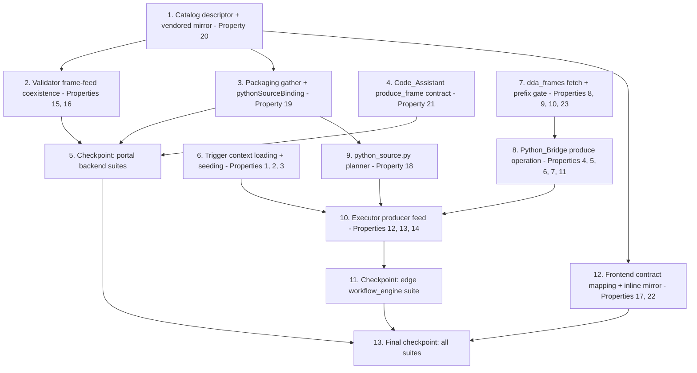

# Implementation Plan: Custom Python Source

## Overview

Work proceeds along three tracks that converge at the executor. The **Portal
track** adds the `custom_python_source` catalog descriptor (mirrored verbatim
to the LocalServer vendored copy), the frame-feed coexistence validator rule,
the packaging gather + `pythonSourceBinding` binding point, and the
`produce_frame` Code_Assistant contract. The **edge foundations track** adds
trigger-context loading/seeding to the executor and the HTTP/prefix-gate
extensions to the `dda_frames` Frame_Helpers, then builds the Python_Bridge
`produce` operation on top of the helpers. The **integration work** — the
`python_source.py` planner and the executor's producer feed — lands last,
wiring the Produced_Frame into the existing Aravis-style Frame_Feed model.
The frontend work (contract mapping + inline frame-feed mirror) only needs
the descriptor and the validator rule semantics, so it runs in parallel with
executor integration.

There are **no compiler changes** (the `appsrc name=appsrc_{nodeId}` chain
rides the existing `{nodeId}` derivation), **no schema changes**, and no
change to the per-frame handler protocol — the `produce` operation is a
strictly additive `op` field on the framed protocol.

## Task Dependency Graph

```json
{
  "waves": [
    { "wave": 1, "tasks": ["1", "6", "7"], "description": "Independent foundations: the catalog descriptor + vendored mirror (portal/edge), trigger-context loading and Run_Metadata seeding (edge, Properties 1-3), and the dda_frames HTTP fetch / load_bytes / prefix gate (edge, Properties 8-10, 23)." },
    { "wave": 2, "tasks": ["2", "3", "4", "8"], "description": "Consumers of the wave-1 foundations: the validator frame-feed coexistence rule (Properties 15, 16), packaging gather + pythonSourceBinding (Property 19), the produce_frame Code_Assistant contract (Property 21), and the Python_Bridge produce operation over the extended helpers (Properties 4-7, 11)." },
    { "wave": 3, "tasks": ["5", "9"], "description": "Portal checkpoint (backend + layer suites pass), and the python_source.py planner over the packager's bindingPoints shape (Property 18)." },
    { "wave": 4, "tasks": ["10", "12"], "description": "Executor producer-feed integration (Properties 12-14) and the frontend contract mapping + inline frame-feed mirror (Properties 17, 22). Independent of each other." },
    { "wave": 5, "tasks": ["11"], "description": "Edge checkpoint: the workflow_engine suite passes, including the trigger, helpers, bridge, planner, and executor property tests." },
    { "wave": 6, "tasks": ["13"], "description": "Final checkpoint: all portal backend, layer, frontend, and edge suites pass; npm run build succeeds." }
  ]
}
```



## Notes

**Test suite invocations**: portal backend suites run as pytest from
`edge-cv-portal/backend/tests` and
`edge-cv-portal/backend/layers/workflow_core/tests` (pytest + hypothesis,
moto-backed conftest); the frontend suite runs as `npx vitest run` in
`edge-cv-portal/frontend` (vitest + RTL + fast-check) plus `npm run build`;
the edge suites run as
`PYTHONPATH=src/backend:test/backend-test pytest test/backend-test/workflow_engine/`
— scoped to `workflow_engine` because the broader edge suite has
pre-existing environment-dependent failures on this host.

**Property test conventions**: Python property tests use `hypothesis`,
TypeScript property tests use `fast-check`; iteration counts come from each
suite's registered profile (no hardcoded `max_examples`; the CI profile runs
≥100 iterations). Every property test is tagged
`**Feature: custom-python-source, Property {number}: {property_text}**`.
HTTP properties (8, 9) use an in-process `http.server` bound to localhost —
no outbound network. Bridge properties (4-7, 11) run real handler
subprocesses with trivial handlers, following the `test_workflow_python_bridge`
patterns. Preservation properties (11, 14, 16, 23) implement the pre-feature
oracle by construction, mirroring `test_property_aravis_free_execution_identity.py`
and `test_property_aravis_free_packaging_identity.py`.

**Deployment note**: portal deployment is intentionally NOT a task in this
plan — portal deployments are separately approved and sequenced. No task
here deploys, publishes a Greengrass component, or runs against a live
device.

**Boundary notes**: the compiler, `llm_inference.render_prompt`, the
per-frame handler protocol, `SOURCE_KIND_TO_SOURCE_TYPE`, and the V7 Aravis
singleton finding are all deliberately unchanged — several tasks assert that
absence of change as preservation tests. The vendored `workflow_core` mirror
byte-identity is enforced by the existing smoke test
(`test_vendored_catalog_mirror.py`); task 1.4 re-copies the mirror and that
test keeps it honest.

## Tasks

- [x] 1. Add the Custom Python source node type to the catalog (portal layer + vendored mirror)
  - [x] 1.1 Add the `CUSTOM_PYTHON_SOURCE` descriptor to `NODE_CATALOG`
    - In `edge-cv-portal/backend/layers/workflow_core/python/workflow_core/catalog/nodes.py`: append (never insert — every pre-existing descriptor keeps its position) a descriptor with type id `custom_python_source`, category `CATEGORY_INPUT`, display name "Custom Python (Source)", exactly one `activation` EventSignal input and one `out` VideoFrames output
    - Parameters: required `code` (type `code`, `min_length: 1`) whose description and examples document the `produce_frame(context)` contract, the MQTT Trigger_Context keys (`topic`, `payload`, `payload_json`, `qos`, `timestamp`), the OPC UA keys (`endpoint`, `node_id`, `value`, `source_timestamp`), the accepted return values, and the `dda_frames.load_image`/`load_bytes` helpers; optional `requirements` (default `""`); optional `allowed_uri_prefixes` (default `""`, newline-separated) whose description states it is NOT a sandbox boundary
    - Device-architecture mappings: `appsrc` named `appsrc_{nodeId}` followed by `videoconvert`, plugin dependencies `["app", "videoconvertscale"]` — byte-for-byte the Aravis chain; plus the dataset-fed simulation-architecture mapping so sandbox test runs compile and run
    - `SOURCE_KIND_TO_SOURCE_TYPE` and the unified-input parameter tables are untouched
    - _Requirements: 1.1, 1.2, 1.3, 1.4, 1.5, 1.6, 1.7, 1.8, 11.4_

  - [x] 1.2 Write catalog content unit tests for the new descriptor
    - In `edge-cv-portal/backend/layers/workflow_core/tests/test_catalog_content.py` (or a sibling module): descriptor present with input category and display name; exactly the declared ports; required `code` + optional `requirements` + optional `allowed_uri_prefixes` (default empty) parameters; per-device-arch element chain and plugin dependencies equal to the Aravis source's appsrc chain; a simulation-architecture mapping exists; the `code` description/examples name `produce_frame`, the Trigger_Context keys, and `dda_frames`; every `code` example exec's to a module defining a callable `produce_frame`; the `allowed_uri_prefixes` description states it is not a sandbox boundary; `SOURCE_KIND_TO_SOURCE_TYPE` has no `custom_python_source` entry; catalog additivity as a prefix-order assertion over `NODE_CATALOG`
    - _Requirements: 1.1, 1.2, 1.3, 1.4, 1.5, 1.6, 1.7, 1.8, 5.5, 11.4_

  - [x] 1.3 Write property test for the compiled node-tagged appsrc
    - **Feature: custom-python-source, Property 20: Compilation emits one node-tagged appsrc per source node**
    - **Validates: Requirements 9.3**
    - New `test_property_*` module in `edge-cv-portal/backend/layers/workflow_core/tests/`: hypothesis-generated valid workflows embedding a `custom_python_source` node with arbitrary node ids, compiled per device architecture; exactly one `appsrc` element named `appsrc_{nodeId}` tagged with the node's id, and no other document element carries that node's id as an `appsrc` — confirming zero compiler changes are needed

  - [x] 1.4 Sync the vendored workflow_core mirror
    - Re-copy the changed catalog file to `src/backend/workflow_engine/vendor/workflow_core/catalog/nodes.py` (and the validator file after task 2.1 lands, keeping the whole mirror byte-identical); the existing byte-identity smoke test in `test/backend-test/workflow_engine/` enforces it
    - _Requirements: 1.9_

- [x] 2. Add the frame-feed coexistence rule to the validator (portal layer)
  - [x] 2.1 Implement the frame-feed group rule in `checks.py`
    - In `edge-cv-portal/backend/layers/workflow_core/python/workflow_core/validator/checks.py`: add a `custom_python_source` entry to `COEXISTENCE_SINGLETON_TYPES` (reason: the single-frame appsrc feed serves exactly one frame-feed source per workflow); leave the `aravis_camera_source` entry, its reason string, and the V7 check logic unchanged
    - Add `FRAME_FEED_SOURCE_TYPES = frozenset({"aravis_camera_source", "custom_python_source"})` and a mixed-group rule under the same `CODE_V7_COEXISTENCE_CONFLICT` finding code: when the workflow contains BOTH types, emit one error finding per offending node, each naming the full conflicting membership and stating that the runtime serves one frame-feed source per workflow; restrict the mixed rule to "both types present" to avoid double-reporting graphs the singleton rule already covers
    - No V9 change (the `activation` port on a `CATEGORY_INPUT` node already falls under the single-activation-model rule) and no V4 change (`code` is `required=True`)
    - _Requirements: 8.1, 8.2, 8.3, 8.6_

  - [x] 2.2 Write property test for per-node conflict findings with full membership
    - **Feature: custom-python-source, Property 15: Frame-feed coexistence conflicts are reported per offending node with full membership**
    - **Validates: Requirements 8.1, 8.2**
    - Hypothesis-generated valid graphs containing two or more `custom_python_source` nodes, or at least one `custom_python_source` with at least one `aravis_camera_source`: exactly one error finding per member of the conflicting set, and every finding's message names every member

  - [x] 2.3 Write property test for Aravis singleton finding preservation
    - **Feature: custom-python-source, Property 16: The Aravis singleton finding is preserved**
    - **Validates: Requirements 8.3**
    - Hypothesis-generated graphs with `aravis_camera_source` nodes and no `custom_python_source`: the finding set (codes, messages, offending nodes) is identical to the pre-feature coexistence rule's output — oracle by construction against the unchanged singleton path

  - [x] 2.4 Write validator example tests for activation and required-code findings
    - A graph with a `custom_python_source` and a subscription trigger where the `activation` port is unconnected gets the existing V9 single-activation-model finding; a `custom_python_source` without `code` gets the standard V4 required-parameter finding
    - _Requirements: 8.6, 10.5_

- [x] 3. Ship the source node through packaging (portal backend)
  - [x] 3.1 Add `custom_python_source` to the packaging gather and binding points
    - In `edge-cv-portal/backend/functions/workflow_packaging.py`: `CUSTOM_PYTHON_NODE_TYPES = ('custom_python', 'custom_python_preprocess', 'custom_python_source')` — the existing gather/write path then ships `python/{nodeId}/handler.py` and `python/{nodeId}/requirements.txt` into every architecture zip and lists the node id in the manifest's `customPythonNodeIds` with no new packaging code
    - `build_binding_points` gains a `custom_python_source` branch emitting per node: `{"nodeId", "nodeType": "custom_python_source", "pythonSourceBinding": true, "parameters": {"allowed_uri_prefixes": ...}, "slots": []}`; `code` and `requirements` are NOT duplicated into the binding point; documents without the node emit no such point
    - _Requirements: 9.1, 9.2_

  - [x] 3.2 Write property test for source-node gathering and manifest membership
    - **Feature: custom-python-source, Property 19: Packaging gathers source nodes exactly and preserves their code**
    - **Validates: Requirements 9.1, 9.2**
    - New `test_property_*` module in `edge-cv-portal/backend/tests/`: hypothesis-generated validated workflows mixing all three Custom Python node types and other types with arbitrary ids/code/requirements; the packager gathers exactly those nodes with `code` and `requirements` preserved verbatim, writes both files per node into every architecture zip, and `customPythonNodeIds` equals exactly those ids

  - [x] 3.3 Write packaging example and preservation tests for binding points
    - The `pythonSourceBinding` point carries the node id, type, and `allowed_uri_prefixes` parameter, and omits `code`/`requirements`; a source-free document's packaging output is byte-identical to today (extend or re-run the existing packaging-identity property tests as the oracle)
    - _Requirements: 9.1, 9.2, 11.5_

- [x] 4. Add the `produce_frame` Code_Assistant contract (portal backend)
  - [x] 4.1 Add the contract to `code_assist.py`
    - In `edge-cv-portal/backend/functions/code_assist.py`: a `produce_frame` entry in `CONTRACTS` with `entry_points=frozenset({'produce_frame'})`, signature `produce_frame(context)`, and a `PRODUCE_FRAME_ENVIRONMENT` description stating the exactly-once-per-run invocation, the MQTT and OPC UA Trigger_Context keys ({} for manual runs), the accepted return values (BGR/BGRA/GRAY8 NumPy arrays, `{"array", "format"}`, `{"data", "width", "height", "format"}`, None fails the run), and the available Frame_Helpers (`load_image`, `load_bytes`, bounded timeout, prefix restriction)
    - `validate_entry_point` needs no change: generated code lacking a top-level `produce_frame` gets the existing `MISSING_ENTRY_POINT` 422
    - _Requirements: 9.4, 9.5_

  - [x] 4.2 Write property test for entry-point validation
    - **Feature: custom-python-source, Property 21: Entry-point validation accepts exactly modules defining produce_frame**
    - **Validates: Requirements 9.5**
    - Hypothesis-generated syntactically valid Python modules (with and without a top-level `produce_frame`, including nested definitions, other names, and assignments): `validate_entry_point(code, "produce_frame")` passes exactly when a top-level function named `produce_frame` is defined, otherwise reports the missing-entry-point defect

  - [x] 4.3 Write contract content example test
    - The `produce_frame` contract's environment text names the Trigger_Context keys for both transports, the three accepted return shapes, the None-fails-the-run rule, and `dda_frames.load_image`/`load_bytes`
    - _Requirements: 9.4_

- [x] 5. Checkpoint — portal backend suites pass
  - Run `edge-cv-portal/backend/layers/workflow_core/tests` and `edge-cv-portal/backend/tests`; ensure all tests pass, ask the user if questions arise.

- [x] 6. Load and seed the Trigger_Context (edge)
  - [x] 6.1 Add `load_trigger_context` and the Run_Metadata seeding to `pipeline_executor.py`
    - In `src/backend/workflow_engine/pipeline_executor.py`: a pure `load_trigger_context(raw)` helper — NULL/empty/non-JSON/non-object input yields `{}` and never raises; a JSON object's entries are reproduced; when the context carries a `payload` string, add `payload_json` holding the parsed value when it parses as JSON and `None` otherwise (contexts without `payload`, e.g. OPC UA and manual, pass through unchanged)
    - Wire into `execute()`: load the context right after the execution row is loaded; after `tag_values` is produced on all run paths and BEFORE the Bedrock/LLM processors and output bindings, seed `tag_values["trigger"] = context` only when no `trigger` key exists (never overwrite TAG-produced keys); `_persist_run_metadata` already dumps `tag_values`, so the seeded key lands in run observability with no further change; seeding happens on every run — trigger-less runs seed `{"trigger": {}}`
    - No change to `llm_inference.render_prompt` — the existing dotted-placeholder engine resolves `{trigger.payload_json.part_id}` from the seeded metadata
    - _Requirements: 2.1, 2.2, 2.3, 2.4, 2.5, 2.7, 2.8, 11.1_

  - [x] 6.2 Write property test for total, faithful trigger-context loading
    - **Feature: custom-python-source, Property 1: Trigger context loading is total and faithful**
    - **Validates: Requirements 2.1, 2.2, 2.3, 2.4**
    - New `test_property_*` module in `test/backend-test/workflow_engine/`: hypothesis over serialized JSON objects, `None`, empty strings, non-JSON strings, and serialized non-object JSON — never raises; object entries reproduced; everything else yields `{}`; `payload_json` derivation for JSON-parsing and non-parsing payload strings with all other entries preserved

  - [x] 6.3 Write property test for non-destructive trigger seeding
    - **Feature: custom-python-source, Property 2: Trigger seeding never disturbs pipeline-produced metadata**
    - **Validates: Requirements 2.5, 2.7**
    - Hypothesis over generated Run_Metadata dicts × Trigger_Contexts: the context lands under `trigger` exactly when no `trigger` key pre-exists, and every pre-existing entry (including a pre-existing `trigger`) is unchanged

  - [x] 6.4 Write property test for dotted trigger placeholder resolution
    - **Feature: custom-python-source, Property 3: Dotted trigger placeholders resolve from the seeded metadata**
    - **Validates: Requirements 2.6**
    - Hypothesis over Trigger_Contexts with nested dict values × dotted paths into them: rendering a prompt template containing `{trigger.<path>}` against seeded Run_Metadata substitutes `str(value)` — exercising the unchanged `llm_inference.render_prompt`

  - [x] 6.5 Write example test for persisted trigger metadata
    - Through the executor harness: a run whose execution row carries a trigger context persists Run_Metadata containing the seeded `trigger` key
    - _Requirements: 2.8_

- [x] 7. Extend the `dda_frames` Frame_Helpers with HTTP fetch, `load_bytes`, and the prefix gate (edge)
  - [x] 7.1 Implement `_fetch_bytes`, `load_bytes`, and the prefix gate in `HELPERS_SOURCE`
    - In `src/backend/workflow_engine/python_bridge.py` `HELPERS_SOURCE` (stdlib + optional boto3/cv2/numpy only): `HTTP_TIMEOUT_SEC = 20.0`; module-level `_allowed_prefixes = ()` (empty = permit everything) and `_fetched = []` with runner-only hooks `_set_allowed_prefixes` / `_fetched_sources`; `_check_allowed(source)` raising `ValueError` naming the source and stating it is outside the node's allowed prefixes when prefixes are declared and none matches
    - `_fetch_bytes(source)` dispatching: `http(s)://` via `urllib.request` with the bounded timeout (non-2xx / timeout / connection failure → `ValueError` naming the source and the failure); `s3://bucket/key` moving the existing boto3 code verbatim; anything else keeping the existing local-path open/read verbatim; applies `_check_allowed` and records the source in `_fetched` first
    - `load_bytes(source)` returning `_fetch_bytes(source)` undecoded; `load_image(source, s3_client=None)` keeps its signature, now `_fetch_bytes` then the existing `_decode_image` — BGR uint8 array out for every scheme, local and S3 behavior byte-identical to today; `to_array`, `to_bytes`, and `frame_info` untouched
    - _Requirements: 4.1, 4.2, 4.3, 4.4, 4.5, 4.6, 5.1, 5.2, 5.3, 11.2_

  - [x] 7.2 Write property test for HTTP(S) fetch round trips
    - **Feature: custom-python-source, Property 8: HTTP(S) fetches round-trip content**
    - **Validates: Requirements 4.1, 4.3**
    - Hypothesis over images served losslessly (PNG) from an in-process localhost `http.server`: `load_image(url)` returns the exact decoded pixels as a uint8 BGR (or 2-D grayscale) array; over arbitrary byte payloads served over HTTP or written to local paths: `load_bytes(source)` returns exactly those bytes undecoded

  - [x] 7.3 Write property test for source-naming fetch and decode failures
    - **Feature: custom-python-source, Property 9: Fetch and decode failures raise errors naming the source**
    - **Validates: Requirements 4.5, 4.6**
    - Hypothesis over non-success HTTP status codes and over fetched content that does not decode as an image: every case raises `ValueError` whose message contains the source string and describes the failure

  - [x] 7.4 Write property test for the prefix gate
    - **Feature: custom-python-source, Property 10: The prefix gate permits exactly the declared prefixes**
    - **Validates: Requirements 5.1, 5.2, 5.3**
    - Hypothesis over prefix lists (including empty) × fetch source strings: a fetch is permitted exactly when the list is empty or the source starts with at least one declared prefix; a denied fetch raises an error naming the source and stating it is outside the node's allowed prefixes

  - [x] 7.5 Write property test for pre-existing helper behavior preservation
    - **Feature: custom-python-source, Property 23: Pre-existing Frame_Helpers behavior is preserved**
    - **Validates: Requirements 4.2, 11.2**
    - Hypothesis over uint8 arrays and dims (`to_array`/`to_bytes` round trip as today), local-path and injected-S3-client image loads (same decoded arrays and same source-naming errors as the pre-change implementation — oracle by construction over the unchanged code paths), and `frame_info` reflecting the current invocation's caps

  - [x] 7.6 Write example test for the bounded HTTP timeout
    - An unresponsive localhost endpoint (accepts, never responds) makes `load_bytes`/`load_image` raise within the timeout bound, naming the source
    - _Requirements: 4.4_

- [x] 8. Add the producer mode to the Python_Bridge (edge)
  - [x] 8.1 Extend `RUNNER_SOURCE` with the `produce` operation and `_resolve_produced_frame`
    - In `src/backend/workflow_engine/python_bridge.py` `RUNNER_SOURCE`: module load accepts any of `produce_frame`/`process_frame`/`handle` (the defines-none startup error adds `produce_frame` to the list); the per-frame loop for `process_frame`/`handle` is untouched; requests without an `op` field keep today's per-frame behavior bit-identical
    - On `op == "produce"`: no callable `produce_frame` → error response naming the required entry point (`process_frame`/`handle` are never invoked for a produce request); set `dda_frames._set_allowed_prefixes(header["allowedUriPrefixes"])` and clear the fetched-sources record; invoke `produce_frame(context)` exactly once; resolve via `_resolve_produced_frame`; reply with the frame bytes, explicit `width`/`height`/`format`, the handler's `metadata` (when returned), and `dda_frames._fetched_sources()`
    - `_resolve_produced_frame`: 2-D uint8 array → GRAY8, dims from shape; 3-channel uint8 → BGR→RGB swap, format RGB; 4-channel uint8 → BGRA→RGBA swap, format RGBA; mapping with `array`+`format` in {RGB, RGBA, GRAY8} → array bytes under the stated format with NO channel conversion, dims from shape, shape must match the format's channel count; mapping with `data`+`width`+`height`+`format` → raw bytes/dims/format passed through; `None` → error "a source must produce a frame"; anything else → error describing the accepted return values; unsupported format or `len(data) != width * height * channels(format)` → error describing the inconsistency; all failures travel back as `status: "error"` with the handler traceback where one exists
    - `cv2`/`np`/`numpy` best-effort binding and `dda_frames` registration already happen at module load — nothing to add
    - _Requirements: 3.1, 3.2, 3.3, 3.4, 3.5, 3.6, 3.7, 3.8, 3.9, 3.10, 3.11, 3.12, 6.6_

  - [x] 8.2 Add `produce_frame` and the producer limits to `CustomPythonBridge`
    - `DEFAULT_PRODUCER_WALL_CLOCK_LIMIT_SEC = 30.0` (env `DDA_PYTHON_SOURCE_WALL_CLOCK_SEC`) and `DEFAULT_PRODUCER_MEMORY_LIMIT_BYTES` (env `DDA_PYTHON_SOURCE_MEMORY_LIMIT_BYTES`), each configurable independently of the per-frame limits; `produce_frame(self, context, allowed_uri_prefixes=())` sends one produce request under the producer wall-clock limit and returns `(frame_bytes, width, height, format, metadata)`; timeout/death/protocol/handler errors raise `CustomPythonNodeError` naming the node, the timeout message stating the limit
    - The subprocess spawn is the same `_start_locked` path (interpreter, env passthrough, thread caps, RLIMIT_AS preexec) — a producer bridge is constructed with the producer limits; add `build_producer_bridge(feed, artifact_path)` mirroring `build_bridges` for one `PythonSourceFeed`
    - _Requirements: 6.1, 6.2, 6.3, 6.4, 6.5_

  - [x] 8.3 Add the optional `frame_data` parameter to `run_bridged_pipeline`
    - `run_bridged_pipeline(launch_string, bridges, latency_metrics=None, frame_data=None)`: when `frame_data` is present, after the pipeline is built, locate the element named `appsrc` (the renamed fed source), set its caps from the frame's explicit format/dims, push one wrapped buffer, and emit EOS — the same single-frame model `GstPipelineManager.run_pipeline` implements; `frame_data=None` (every existing caller) changes nothing
    - _Requirements: 7.4, 11.1_

  - [x] 8.4 Write property test for exactly-once producer invocation with the run's context
    - **Feature: custom-python-source, Property 4: The Frame_Producer is invoked exactly once with the run's Trigger_Context**
    - **Validates: Requirements 3.1**
    - New `test_property_*` module in `test/backend-test/workflow_engine/` running real handler subprocesses: hypothesis over JSON-representable Trigger_Contexts; an instrumented handler records its invocations and the observed `context` — exactly one invocation, argument equal to the context sent

  - [x] 8.5 Write property test for NumPy array return resolution
    - **Feature: custom-python-source, Property 5: NumPy array returns resolve with the declared format, dims, and channel order**
    - **Validates: Requirements 3.3, 3.4, 3.5**
    - Hypothesis over uint8 arrays (2-D, 3-D×3-channel, 3-D×4-channel): the resolved Produced_Frame's width/height come from the shape, format is GRAY8/RGB/RGBA respectively, and the bytes are the array's bytes with BGR(A)→RGB(A) conversion for the 3- and 4-channel cases and untouched for 2-D

  - [x] 8.6 Write property test for conversion-free mapping returns
    - **Feature: custom-python-source, Property 6: Mapping returns round-trip without channel conversion**
    - **Validates: Requirements 3.6, 3.7**
    - Hypothesis over uint8 arrays paired with matching supported formats (`{"array", "format"}` → exactly the array's bytes, no channel conversion, dims from shape) and over consistent `{"data", "width", "height", "format"}` mappings (raw bytes, dims, and format pass through unchanged)

  - [x] 8.7 Write property test for invalid producer return rejection
    - **Feature: custom-python-source, Property 7: Invalid producer returns are rejected with a node-identifying error**
    - **Validates: Requirements 3.8, 3.9, 3.10**
    - Hypothesis over the invalid-return domain (`None`, unsupported dtype/dimensionality/channel counts, non-mapping scalars, mappings missing required keys, unsupported formats, byte lengths inconsistent with declared dims): every case raises `CustomPythonNodeError` identifying the node and describing the defect, and no Produced_Frame is resolved

  - [x] 8.8 Write property test for per-frame protocol preservation
    - **Feature: custom-python-source, Property 11: The per-frame protocol is preserved**
    - **Validates: Requirements 6.6, 11.3**
    - Hypothesis over frame bytes × caps × metadata: per-frame requests (no `op`) through the extended runner invoke `process_frame`/`handle` with today's exact semantics and return responses identical in shape and content to the pre-change contract — for handlers that do and do not also define `produce_frame`; the existing `test_workflow_python_bridge.py` suite passes unchanged

  - [x] 8.9 Write bridge example tests for producer errors and limits
    - Handler without `produce_frame` → error naming the required entry point; handler defining all three entry points → only `produce_frame` invoked for a produce request; `np` bound and `import dda_frames` works inside a producer; a sleeping producer against a small wall-clock limit → `CustomPythonNodeError` stating the limit; a raising producer → error carrying the handler traceback; producer limits configurable independently of the per-frame limits via their env vars
    - _Requirements: 3.2, 3.11, 3.12, 6.1, 6.2, 6.3, 6.4, 6.5_

- [x] 9. Create the source planner (edge)
  - [x] 9.1 Create `src/backend/workflow_engine/python_source.py`
    - Pure module, no I/O, mirroring `aravis_feed.py`: `PythonSourceError` (with a `node_id` attribute, `None` for document-level failures), frozen dataclass `PythonSourceFeed(node_id, handler_path, allowed_uri_prefixes)` with `handler_path = "python/{nodeId}/handler.py"` artifact-relative, and `plan_python_sources(document)` planning from `bindingPoints` entries marked `pythonSourceBinding: true`
    - No such points (including pre-feature documents with no `bindingPoints`) → `[]`; more than one fed source counted across the UNION of `pythonSourceBinding` and `aravisBinding` points → `PythonSourceError(None)` naming every offending node id; `allowed_uri_prefixes` parsed from the point's parameters (newline-split, stripped, empties dropped); documents with only Aravis points plan zero Python sources
    - _Requirements: 7.3, 8.5_

  - [x] 9.2 Write property test for multi-fed-source rejection
    - **Feature: custom-python-source, Property 18: The device planner rejects multi-fed-source documents naming every offender**
    - **Validates: Requirements 8.5**
    - Hypothesis over compiled documents whose `bindingPoints` carry two or more frame-feed sources in any mix of `pythonSourceBinding` and `aravisBinding` markers: `plan_python_sources` raises an error whose message names every offending node id, and no Frame_Producer is planned

  - [x] 9.3 Write planner unit tests
    - Empty documents, documents with no `bindingPoints`, documents with only Aravis/camera points → `[]`; a single `pythonSourceBinding` point → one feed with the correct handler path and parsed prefixes (blank lines and whitespace dropped, empty parameter → `()`)
    - _Requirements: 7.3, 8.5_

- [x] 10. Integrate the producer feed into the executor (edge)
  - [x] 10.1 Add `_prepare_python_source_feed` and wire it through `execute()`
    - In `src/backend/workflow_engine/pipeline_executor.py`: plan via `plan_python_sources`, return `(None, None)` on zero feeds (the exact pre-feature path); otherwise build a producer bridge via `build_producer_bridge`, run `produce_frame(trigger_context, feed.allowed_uri_prefixes)` (stopping the bridge in `finally`), assemble `frame_data = {"data", "width", "height", "format"}`, and point the compiled `appsrc_{nodeId}` at the Frame_Feed via the reused `_point_appsrc_at_frame_feed` (generalize its feed-error type to carry either feed's `node_id`)
    - Explicit caps: `_frame_caps` prefers an explicit `frame_data["format"]` and only falls back to bytes-per-pixel inference when the key is absent — Aravis grabs never set `format`, so that path is bit-identical
    - Run paths: produced frame with no bridges → `manager.run_pipeline(launch_string, frame_data, ...)` (push + EOS); with bridges → `_run_bridged(..., frame_data=frame_data)` feeding and pumping in the same run; planning/production failures call `_finish_failed(..., failing_node_id=e.node_id)` BEFORE the pipeline starts
    - Log the bridge's fetched-sources list to the run log (`logger.info`, captured by `RunLogCapture`); after the run, merge non-empty producer metadata as `tag_values["python_source"][feed.node_id]`, then the task 6 trigger seeding; node status needs no new code — the appsrc element keeps its `nodeId`, so `element_name_map` and the `NodeStatusCollector` cover it like the Aravis node
    - _Requirements: 5.2, 5.4, 6.4, 6.5, 6.7, 7.1, 7.2, 7.3, 7.4, 7.5, 7.6, 7.7, 8.5_

  - [x] 10.2 Write property test for producer metadata merging
    - **Feature: custom-python-source, Property 12: Producer metadata merges under the node's key**
    - **Validates: Requirements 6.7**
    - Using the fake pipeline-manager/session harness: hypothesis over metadata dicts returned by a Frame_Producer; the post-run Run_Metadata carries the dict under `python_source.<nodeId>` with all other entries unaffected

  - [x] 10.3 Write property test for explicit-caps frame feeding
    - **Feature: custom-python-source, Property 13: The Produced_Frame is fed with explicit caps before the pipeline starts**
    - **Validates: Requirements 7.1, 7.2**
    - Hypothesis over Produced_Frames across all supported formats and dims — including dims where bytes-per-pixel inference would name a DIFFERENT format: executing a one-source document points the node's `appsrc` at the Frame_Feed before the pipeline runs, hands the manager frame data equal to the Produced_Frame, and sets caps naming exactly the declared format

  - [x] 10.4 Write property test for source-free execution identity
    - **Feature: custom-python-source, Property 14: Source-free execution identity**
    - **Validates: Requirements 7.3, 11.1, 11.5**
    - Hypothesis over compiled documents declaring no Custom_Python_Source_Node (pre-feature documents with no `bindingPoints`, and documents with Aravis or camera points only): `plan_python_sources` returns `[]` and the executor produces the same pipeline invocation, execution row, node status, and persisted Run_Metadata as the pre-feature executor apart from the seeded `trigger` key — mirroring `test_property_aravis_free_execution_identity.py`

  - [x] 10.5 Write executor example tests
    - EOS sent after the single frame push; a planning failure marks the run failed with the node identified and never starts the pipeline; a source node plus a bridged Custom Python node feed and pump in one run; the fetched-sources list appears in the run log; the source node appears in per-node run status (running at start, success/failure at end, failure attribution via `failing_node_id`); a denied-prefix fetch fails the run with the node identified
    - _Requirements: 5.2, 5.4, 7.4, 7.5, 7.6, 7.7_

- [x] 11. Checkpoint — edge workflow_engine suite passes
  - Run `PYTHONPATH=src/backend:test/backend-test pytest test/backend-test/workflow_engine/`, including the pre-existing python-bridge, aravis-feed, and execution-identity suites; ensure all tests pass, ask the user if questions arise.

- [x] 12. Wire the frontend designer support (portal frontend)
  - [x] 12.1 Map the node type to the Code_Assistant contract
    - In `edge-cv-portal/frontend/src/services/api.ts` (or wherever `CodeAssistContract` lives): add `'produce_frame'` to the contract union; in `NodeConfigPanel.tsx`: `CODE_ASSIST_CONTRACTS['custom_python_source'] = 'produce_frame'` — this single mapping lights up the assistant panel beside the code editor, the derived-requirements pipeline on the `requirements` parameter, and role gating on the same terms as the other Custom Python node types; palette placement, the code editor, connection acceptance, and the V4 required-parameter marker are generic over the catalog descriptor and need no production change
    - _Requirements: 9.6, 10.1, 10.2, 10.5_

  - [x] 12.2 Mirror the frame-feed coexistence rule in the inline checks
    - In `edge-cv-portal/frontend/src/pages/workflows/inlineChecks.ts`: a TypeScript mirror of the frame-feed rule — the `custom_python_source` singleton count plus the mixed Aravis/Custom-Python membership — emitting one finding per offending node with the same membership-naming message; `validationMarkers.ts` consumes findings generically and needs no change
    - _Requirements: 8.4_

  - [x] 12.3 Write property test for inline frame-feed markers
    - **Feature: custom-python-source, Property 17: Inline markers mirror the frame-feed coexistence rule**
    - **Validates: Requirements 8.4**
    - fast-check over canvas graphs drawn from the node catalog: the inline checks produce a frame-feed conflict marker on exactly the nodes the coexistence rule would flag, each naming the full conflicting membership

  - [x] 12.4 Write property test for connection acceptance
    - **Feature: custom-python-source, Property 22: Connection acceptance matches the port compatibility oracle**
    - **Validates: Requirements 10.3**
    - Extend `connectionAcceptance.property.test.ts`'s fast-check domain: for any target descriptor and input port from the catalog, a connection from the source node's `out` port is accepted exactly when `arePortsCompatible(VideoFrames, targetType)` holds under the declared coercion rules, with a displayed reason on rejection

  - [x] 12.5 Write designer example tests
    - `NodePalette.test.tsx`: a catalog fixture including the `custom_python_source` descriptor renders it in the input section; `NodeConfigPanel.test.tsx`: selecting the node renders the code editor for `code` and offers the Code_Assistant panel with derived requirements; connection tests: a trigger output into the `activation` port is accepted; `inlineChecks.test.ts`: a node without `code` yields a required-parameter marker
    - _Requirements: 9.6, 10.1, 10.2, 10.4, 10.5_

- [x] 13. Final checkpoint — all suites pass
  - Run the portal backend suites (`edge-cv-portal/backend/tests`, `edge-cv-portal/backend/layers/workflow_core/tests`), the frontend suite (`npx vitest run` in `edge-cv-portal/frontend`) plus `npm run build`, and the edge suite (`PYTHONPATH=src/backend:test/backend-test pytest test/backend-test/workflow_engine/`), including the vendored-mirror byte-identity smoke test; ensure all tests pass, ask the user if questions arise.
