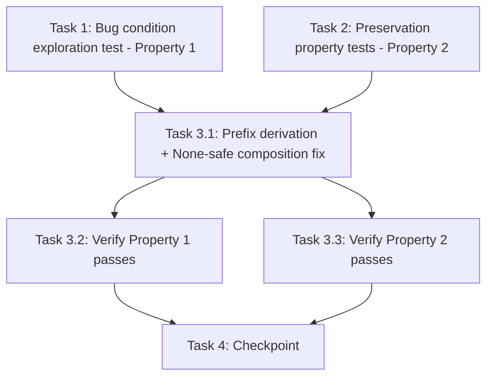

# Implementation Plan

## Overview

Fix the dataset discovery `"None/"` prefix bug using the exploratory bugfix workflow: write the bug condition exploration test (Property 1) and preservation property tests (Property 2) against the UNFIXED code first, then implement the surgical fix in `edge-cv-portal/backend/functions/datasets.py` (restore prefix derivation in `get_data_bucket_and_credentials`, None-safe composition in `list_datasets`, `base_prefix: ''` in the response), then verify with the same tests. `count_images`, `get_image_preview`, `discover_datasets`, and all credential logic are untouched.

Tests live in `edge-cv-portal/backend/tests/` (pytest + moto + Hypothesis), following the `test_captures.py` pattern: inject a fake `shared_utils` module into `sys.modules` (stubbing `get_usecase` and `assume_usecase_role`) and put `functions/` on `sys.path` BEFORE importing `datasets`. Run the new test files standalone — this repo has known moto fixture leakage in unrelated test families during full-directory sweeps.

## Task Dependency Graph

```json
{
  "waves": [
    { "wave": 1, "description": "Run on UNFIXED code: surface the \"None/\" scan and empty dataset list counterexamples (task 1 FAILS - Property 1) and capture preservation baselines for count/preview/credentials (task 2 PASSES - Property 2). Independent of each other.", "tasks": ["1", "2"] },
    { "wave": 2, "description": "Implement the fix: prefix derivation in get_data_bucket_and_credentials + None-safe composition in list_datasets.", "tasks": ["3.1"] },
    { "wave": 3, "description": "Verify the fix: re-run task 1 test (now PASSES) and task 2 tests (still PASS).", "tasks": ["3.2", "3.3"] },
    { "wave": 4, "description": "Checkpoint: new test files standalone plus any existing datasets-related tests pass.", "tasks": ["4"] }
  ]
}
```



## Tasks

- [x] 1. Write bug condition exploration test
  - **Property 1: Bug Condition** - Dataset Discovery Scans the Configured Prefix
  - **CRITICAL**: This test MUST FAIL on unfixed code - failure confirms the bug exists
  - **DO NOT attempt to fix the test or the code when it fails**
  - **NOTE**: This test encodes the expected behavior - it will validate the fix when it passes after implementation
  - **GOAL**: Surface counterexamples demonstrating the `"None/"` scan and the resulting empty dataset list
  - **Scoped PBT Approach**: The bug is deterministic (`get_data_bucket_and_credentials` hardcodes `None` in the prefix slot for every input), so scope the property to concrete configurations: prefix absent, prefix `None`, prefix `''`, with and without a filter prefix
  - Create `edge-cv-portal/backend/tests/test_property_dataset_discovery_none_prefix.py` following the `test_captures.py` pattern: inject fake `shared_utils` into `sys.modules` (stub `get_usecase` returning configurable use case dicts, `assume_usecase_role` returning fixed fake credentials, plus `create_response`/`handle_error`) and add `functions/` to `sys.path` BEFORE importing `datasets`; use moto's mocked S3
  - Seed a moto bucket (cookies-style layout) with image keys under a real prefix, e.g. `training-images/anomaly-1.jpg`, `training-images/anomaly-2.jpg`
  - Test case 1 (unset prefix discovery, Req 2.1, 2.4): use case with no `s3_prefix`, no filter; invoke `list_datasets` and assert `datasets` is non-empty and includes `training-images/` — on unfixed code the scan targets `"None/"` and returns `[]` (Bug Condition `isBugCondition`: base prefix IS None, from design)
  - Test case 2 (filter prefix, Req 1.2, 2.3): supply `prefix=training` filter; assert the discovered datasets come from `training-images/`-compatible keys and the scanned prefix contains no `"None"` literal — on unfixed code the scan targets `"Nonetraining/"`
  - Test case 3 (response field, Req 1.4, 2.5): assert the response body's `base_prefix` is `''`, not `null`
  - Test case 4 (data-account prefix, Req 2.2): use case with `data_account_role_arn` + `data_account_external_id` and `data_s3_prefix: "team-a/"`; seed images under `team-a/` and assert discovery finds them — on unfixed code the scan targets `"None/"`
  - Assertions match the Expected Behavior Properties from design: scanned prefix = normalized `"{configured_prefix}{filter_prefix}"`, discovery returns real image-bearing prefixes, `base_prefix` is `''` when unset
  - Run test standalone: `python -m pytest edge-cv-portal/backend/tests/test_property_dataset_discovery_none_prefix.py -v` on UNFIXED code
  - **EXPECTED OUTCOME**: Test FAILS (this is correct - it proves the bug exists)
  - Document counterexamples found (e.g., `datasets: []` and `base_prefix: null` despite the bucket containing `training-images/anomaly-*.jpg`)
  - Mark task complete when test is written, run, and failure is documented
  - _Requirements: 1.1, 1.2, 1.3, 1.4, 2.1, 2.2, 2.3, 2.4, 2.5_

- [x] 2. Write preservation property tests (BEFORE implementing fix)
  - **Property 2: Preservation** - Credentials, Count, and Preview Behavior Unchanged
  - **IMPORTANT**: Follow observation-first methodology - observe UNFIXED behavior first, then encode it
  - Create `edge-cv-portal/backend/tests/test_property_dataset_discovery_preservation.py` using the same `sys.modules` shared_utils stub + moto pattern
  - Observe on UNFIXED code: `count_images` and `get_image_preview` results for caller-supplied prefixes, credential arguments passed to `assume_usecase_role`, and the `ValueError` for a data account without external ID
  - Property (count/preview, Req 3.1, 3.2): for Hypothesis-generated caller-supplied prefixes and seeded bucket contents, `count_images` counts and `get_image_preview` previews images under exactly the supplied prefix — both discard the prefix slot from `get_data_bucket_and_credentials`, so results are independent of it
  - Property (credential paths, Req 3.3, 3.4): single-account use cases call `assume_usecase_role(cross_account_role_arn, external_id, 'data-access')` and pass the returned credential markers to `boto3.client` unchanged; data-account use cases require `data_account_external_id` and raise `ValueError` without it
  - Property (configured prefix, Req 3.6): for use cases where a prefix will be derived after the fix (e.g. `s3_prefix: "team-a/"`), record the expected scan behavior — discovery recursion up to `max_depth`, image-extension filtering (.jpg/.jpeg/.png/.bmp/.tiff/.tif), sorting by image count descending then prefix (exercise via `discover_datasets` directly against moto S3, which the fix does not touch)
  - Property (response shape, Req 3.5): `list_datasets` response body contains exactly the keys `datasets`, `bucket`, `base_prefix`
  - Run tests standalone: `python -m pytest edge-cv-portal/backend/tests/test_property_dataset_discovery_preservation.py -v` on UNFIXED code
  - **EXPECTED OUTCOME**: Tests PASS (this confirms baseline behavior to preserve)
  - Mark task complete when tests are written, run, and passing on unfixed code
  - _Requirements: 3.1, 3.2, 3.3, 3.4, 3.5, 3.6_

- [x] 3. Fix dataset discovery prefix derivation

  - [x] 3.1 Implement the fix in datasets.py
    - In `get_data_bucket_and_credentials` (edge-cv-portal/backend/functions/datasets.py, ~line 59):
      - Data-account branch: derive `prefix = usecase.get('data_s3_prefix') or usecase.get('s3_prefix', '') or ''` — DynamoDB items contain `null` and empty-string values, so `or ''` semantics are mandatory
      - Use-case branch: derive `prefix = usecase.get('s3_prefix') or ''`
      - Change `return bucket, None, credentials` to `return bucket, prefix, credentials` — the function must never return `None` in the prefix slot
    - In `list_datasets` (~line 93): add defensive None-safety `base_prefix = base_prefix or ''` before composing `search_prefix = f"{base_prefix}{filter_prefix}".strip('/')`, and use the coerced value for the response `base_prefix` field so it is `''` (not `null`) when unset
    - No changes to `count_images`, `get_image_preview`, `discover_datasets`, or any credential logic
    - _Bug_Condition: isBugCondition(input) — base_prefix IS None when list_datasets composes search_prefix, from design_
    - _Expected_Behavior: scanned prefix = normalized "{configured_prefix}{filter_prefix}" with no "None" literal; response base_prefix = configured prefix or '' (Property 1, design)_
    - _Preservation: Preservation Requirements from design (count/preview, credential paths, response shape, discovery semantics)_
    - _Requirements: 2.1, 2.2, 2.3, 2.4, 2.5, 3.1, 3.2, 3.3, 3.4, 3.5, 3.6_

  - [x] 3.2 Verify bug condition exploration test now passes
    - **Property 1: Expected Behavior** - Dataset Discovery Scans the Configured Prefix
    - **IMPORTANT**: Re-run the SAME test from task 1 - do NOT write a new test
    - The test from task 1 encodes the expected behavior; when it passes, the expected behavior is satisfied
    - Run: `python -m pytest edge-cv-portal/backend/tests/test_property_dataset_discovery_none_prefix.py -v`
    - **EXPECTED OUTCOME**: Test PASSES (confirms discovery scans the real prefix, filter composition is correct, and `base_prefix` is `''`)
    - _Requirements: 2.1, 2.2, 2.3, 2.4, 2.5_

  - [x] 3.3 Verify preservation tests still pass
    - **Property 2: Preservation** - Credentials, Count, and Preview Behavior Unchanged
    - **IMPORTANT**: Re-run the SAME tests from task 2 - do NOT write new tests
    - Run: `python -m pytest edge-cv-portal/backend/tests/test_property_dataset_discovery_preservation.py -v`
    - **EXPECTED OUTCOME**: Tests PASS (confirms no regressions in count/preview, credentials, response shape, discovery semantics)
    - Confirm all tests still pass after fix (no regressions)
    - _Requirements: 3.1, 3.2, 3.3, 3.4, 3.5, 3.6_

- [x] 4. Checkpoint - Ensure all tests pass
  - Run both new test files standalone (this repo has known moto fixture leakage in unrelated test families during full-directory sweeps):
    - `python -m pytest edge-cv-portal/backend/tests/test_property_dataset_discovery_none_prefix.py edge-cv-portal/backend/tests/test_property_dataset_discovery_preservation.py -v`
  - Run any existing datasets-related tests in `edge-cv-portal/backend/tests/` (search for tests importing or exercising `datasets.py`) standalone as well
  - Ensure all tests pass, ask the user if questions arise

## Notes

- Write the exploration test BEFORE implementing the fix, and run it on UNFIXED code — its failure confirms the bug.
- Follow observation-first methodology for preservation tests: observe unfixed behavior, then encode it.
- The bug is deterministic (every request hits it), so Property 1 is scoped to concrete configurations covering both branches of `get_data_bucket_and_credentials` and the filter-prefix path.
- Verification runs the new test files standalone rather than a full-directory sweep, due to known moto fixture leakage in unrelated test families.
- The fix unblocks three UI surfaces fed by `GET /datasets`: the Synthetic Data wizard dataset picker, the Dataset Browser page, and training-creation dataset selection.
