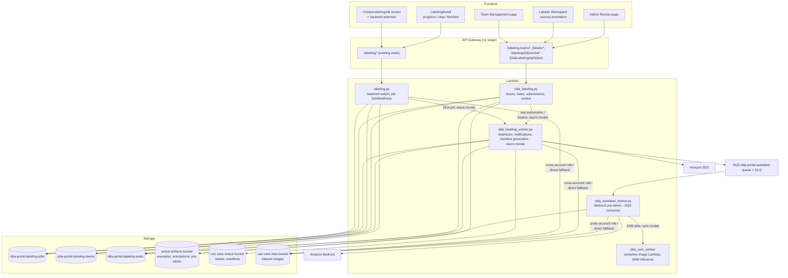

# Design Document — DDA Data Labeling System

## Overview

This feature adds a portal-native labeling backend (the DDA_Labeling_System) beside the existing SageMaker Ground Truth flow. A Job_Creator picks the backend at job creation; DDA jobs are executed entirely with portal-managed AWS resources: DynamoDB for jobs, teams, task assignments and annotations; S3 for images, example images, pre-labels, masks and manifests; Cognito for labeler identity; SES for notifications; Bedrock and a container-packaged SAM model for auto-labeling. Completed DDA jobs emit the exact DDA augmented manifest (`source-ref`, `anomaly-label`, `anomaly-label-metadata`, `anomaly-mask-ref`, `anomaly-mask-ref-metadata`, `bounding-box`/`bounding-box-metadata`) so training and compilation consume them identically to Ground Truth jobs — no transformation step.

The design deliberately reuses existing portal machinery:

- **Job records** live in the existing `dda-portal-labeling-jobs` table with a new `labeling_backend` attribute, so requirement 1.5 (one merged job list) falls out of the existing `usecase-jobs-index` query, and requirement 10.8 (same output fields) falls out of writing `output_manifest_s3_uri` exactly where `labeling_monitor.py` writes it today.
- **Cross-account data access** reuses `shared_utils.get_s3_client_for_bucket` / `assume_usecase_role` (which already implements the single-account direct-access fallback via the `is_default_credentials` marker) — requirements 12.1–12.4.
- **RBAC** extends the existing `Role`/`Permission` enums and `@rbac_check` decorator in `shared_utils`/`rbac_middleware.py`; audit uses `log_audit_event`.
- **Bedrock** reuses `bedrock_common.py` (configuration, client caching, timeout clamping) and the model-options listing already exposed by `data_accounts.py` (`list_bedrock_model_options`).
- **SES** reuses the `SES_SENDER_ADDRESS` CfnParameter/env-var convention from `user_admin.py`.
- **Manifest validation** (requirement 10.6) reuses the shared-layer `manifest_transformer.detect_ground_truth_attributes` plus the validation logic in `manifest_validator.py`.
- **Async work** follows the portal's dominant pattern: fire-and-forget `lambda_client.invoke(InvocationType='Event')` for job-scoped steps (distribution, manifest generation) and an SQS queue + worker Lambda (the `camera_sync` pattern) for the per-image auto-label fan-out.

New API routes are registered in a dedicated nested stack (`DdaLabelingApiStack`) that imports the Rest API by id — the `UserAdminApiStack` pattern — because the main `ApiGatewayStack` is at the CloudFormation 500-resource limit.

## Architecture



### Execution flows

**DDA job creation (team mode)**: `POST /labeling` with `labeling_backend='DDA'` → `labeling.py` delegates to `dda_labeling.create_dda_job` → validate all parameters (name, modality, label set, team, instructions, examples) → enumerate dataset prefix via `get_s3_client_for_bucket` → persist job (`status=InProgress`) → return `job_id` → async-invoke `dda_labeling_worker` with `{action: 'distribute', job_id}`. The worker creates Task_Assignments (round-robin), sends SES notifications, and — if auto-labeling is enabled — enqueues one SQS message per image.

**Labeling**: Labeler Workspace calls `GET /labeler/jobs/{jobId}/next` → returns the next presentable unsubmitted Task_Assignment with a 15-minute presigned image URL, the pre-label (if any), instructions and example-image URLs → labeler annotates → `POST /labeler/tasks/{taskId}/submit` persists the annotation with a conditional write. When the submission is the job's last, the handler async-invokes the worker with `{action: 'generate_manifest', job_id}`.

**Skip-verification**: creation validates admin authorization, Bedrock model and per-label prompts, creates zero Task_Assignments, enqueues every image for Bedrock auto-labeling. When the last image resolves (success or failure), the job flips to review-ready. The admin accepts/rejects each result on the Admin Review page and finalizes → worker generates the manifest from accepted results only and completes the job.

## Components and Interfaces

### 1. Backend selection — changes to `labeling.py`

`create_labeling_job` gains a mandatory `labeling_backend` body field with exactly two values:

| Value | Behavior |
|---|---|
| `GroundTruth` | Existing SageMaker flow, unchanged (params, workteam, PRE/ACS lambdas). |
| `DDA` | Delegates to `dda_labeling.create_dda_job(body, user)`. No SageMaker API is called. |

Missing/invalid values → 400 identifying the invalid backend, nothing persisted (req 1.6). Both paths write `labeling_backend` on the job item (req 1.4). `list_labeling_jobs` requires no query change (single table, single GSI) but skips the SageMaker status-sync loop for `labeling_backend='DDA'` items (their status is portal-managed). `get_labeling_job` returns DDA-specific fields (team, modality, per-member progress, notification state, blocked flag) when the backend is DDA.

A new route `POST /labeling/{id}/stop` (DDA jobs only, req 11.4/11.5/11.9) is added in `DdaLabelingApiStack`; Ground Truth jobs keep their existing lifecycle.

### 2. API surface

All routes are Cognito-authorized; RBAC is enforced in the handlers with `@rbac_check`. New routes live in `DdaLabelingApiStack` (nested stack, imported Rest API, own authorizer, route-salted CfnDeployment — the `UserAdminApiStack` pattern).

**Team management (handler: `dda_labeling.py`, permission `MANAGE_LABELING_TEAMS` — UseCaseAdmin, PortalAdmin)**

| Method & path | Purpose |
|---|---|
| `GET /labeling-teams?usecase_id=` | List teams for a use case with member identities + emails (req 3.8) |
| `POST /labeling-teams` | Create team `{usecase_id, team_name}` (req 3.1, 3.2) |
| `DELETE /labeling-teams/{teamId}` | Delete team (rejected while an InProgress job references it) |
| `POST /labeling-teams/{teamId}/members` | Add member `{user_id}`; validates Data_Labeler role, duplicates (req 3.3–3.5); triggers rebalance of blocked jobs (req 5.5) |
| `DELETE /labeling-teams/{teamId}/members/{userId}` | Remove member; triggers reassignment of unsubmitted tasks (req 5.3, 5.4) |

**Labeler APIs (handler: `dda_labeling.py`, permission `LABELING_TASKS_SELF` — the only APIs a Data_Labeler-only user may call)**

| Method & path | Purpose |
|---|---|
| `GET /labeler/jobs` | Jobs in which the caller holds ≥1 unsubmitted Task_Assignment, with submitted/remaining counts (req 2.4, 7.10) |
| `GET /labeler/jobs/{jobId}/next` | Next presentable unsubmitted assignment: task id, presigned image URL (15 min), pre-label, instructions, example URLs, counts (req 7.1, 7.2, 8.3, 12.6) |
| `POST /labeler/tasks/{taskId}/submit` | Persist annotation, mark submitted (req 7.7–7.9, 11.8) |
| `POST /labeler/tasks/{taskId}/presentation-failure` | Record image presentation failure; withholds the task (req 7.12) |
| `GET /labeler/tasks/{taskId}/image-url` | Fresh presigned URL after expiry, annotation state untouched client-side (req 12.7) |

Every labeler API resolves ownership server-side: the task's `assignee_user_id` must equal the caller's `sub` and the caller must be a current member of the job's team; otherwise 403 with an empty body plus an audit event (req 2.4, 2.6).

**Job lifecycle & review (handlers: `labeling.py` / `dda_labeling.py`)**

| Method & path | Permission | Purpose |
|---|---|---|
| `POST /labeling/{id}/stop` | `MANAGE_LABELING_JOBS` | Stop an InProgress DDA job (req 11.4, 11.5, 11.9) |
| `GET /labeling/{id}/review` | admin (PortalAdmin/UseCaseAdmin) + job creator | Paginated auto-label results with per-image status/decision (req 9.5) |
| `POST /labeling/{id}/review/decisions` | same | Batch accept/reject decisions `{task_id: 'accepted'|'rejected'}`; mutable until finalize (req 9.6) |
| `POST /labeling/{id}/review/finalize` | same | Validate all-decided + ≥1 accepted, then generate manifest (req 9.7–9.9) |

**Reused endpoints**: Bedrock model options via the existing settings endpoint in `data_accounts.py` (`list_bedrock_model_options`); user listing for team membership via existing `user_roles.py` / `user_admin.py` routes.

### 3. Task Distributor (in `dda_labeling_worker.py`)

Distribution and rebalancing are pure functions over `(task ids, member ids)` in a new shared-layer module `labeling_distribution.py`, so they are directly property-testable; the worker only applies the computed assignment with DynamoDB writes.

```python
def distribute(task_ids: list[str], member_ids: list[str]) -> dict[str, str]:
    """Round-robin: sort members for determinism, assign task i to
    member[i % len(members)]. Guarantees per-member counts differ by <= 1."""

def rebalance(unassigned_task_ids: list[str], member_ids: list[str]) -> dict[str, str]:
    """Same round-robin over only the tasks being (re)assigned. Used for
    member removal (the removed member's unsubmitted tasks) and member
    addition to a blocked job (all unassigned tasks)."""
```

- **Initial distribution (req 5.1, 5.2)**: exactly one Task_Assignment per enumerated image; counts differ by ≤1. Items are written with `batch_writer`; after writing, the worker verifies `count(tasks) == image_count` and on any shortfall sets the job `Failed` with an error and marks all written tasks `Inactive` so no partial set is labelable (req 5.6).
- **Member removal (req 5.3)**: the team-member DELETE handler queries the member's unsubmitted tasks per InProgress job, computes `rebalance(...)` over the remaining members, and applies it with conditional updates (`attribute status = Assigned AND assignee = removed_user`). Submitted tasks and annotations are never touched. If any conditional write fails, the whole reassignment is rolled back (assignments restored from the computed inverse) and the API returns an error leaving prior state intact (req 5.7). Membership removal and reassignment are one logical operation: membership is deleted only after reassignment succeeds.
- **Last member removed (req 5.4)**: tasks get `assignee_user_id = 'UNASSIGNED'`, job gets `blocked = true`; status stays InProgress; detail view shows the blocked indication.
- **Member added to team with blocked jobs (req 5.5)**: distribute unassigned tasks across all current members, clear `blocked`; a member who previously held zero tasks in the job gets a notification (req 6.7).

### 4. Auto-Labeler pipeline

**Model/modality compatibility (validated at job creation, req 8.8):**

| Auto_Labeler model | Binary_Classification | Semantic_Segmentation | Object_Detection |
|---|---|---|---|
| SAM (Segment Anything, portal-packaged) | ✗ | ✓ (masks) | ✓ (boxes from mask extents) |
| Bedrock vision models (Converse, image input) | ✓ | ✗ | ✓ |

**Fan-out**: the distributor enqueues one message per image on `dda-portal-autolabel-queue` `{job_id, task_id, image_s3_uri, modality, label_set, model, per_label_prompts?}`. `dda_autolabel_worker.py` (SQS event source, batch size 1–5, visibility 300 s, DLQ after 3 receives) processes each message:

1. Read the image via `get_s3_client_for_bucket` (15-min presigned or direct get).
2. **Bedrock path**: build a Converse request with the image block and a structured prompt (job label set; in skip-verification mode the Per_Label_Prompts, one section per label) demanding a JSON answer (`{"label": "normal"|"anomaly"}` for classification; `{"boxes": [{"class": name, "left", "top", "width", "height"}]}` for detection). Client from `bedrock_common.get_bedrock_client` with read timeout capped at 120 s (req 8.5). The response JSON is parsed and **strictly validated**: any class name not in the Label_Set, malformed geometry, or out-of-bounds box ⇒ generation failed for that image.
3. **SAM path**: synchronous invoke of `dda_sam_worker`, a container-image Lambda (Docker image with a CPU ONNX-exported SAM variant, e.g. MobileSAM; 10 GB memory) that returns mask polygons/RLE per detected region. Since SAM is class-agnostic, regions are proposed without classes; the pre-label carries regions with `class: null` and the Labeler_Interface requires the labeler to assign a Label_Set class to each kept region before submitting (consistent with req 8.2's constraint that persisted annotations only use Label_Set classes — a SAM pre-label is presented as geometry to approve/correct/classify). Invocation wall-clock is bounded at 120 s.
4. Write the result: pre-label payload to `s3://{portal_artifacts}/labeling/{usecase_id}/{job_id}/prelabels/{task_id}.json`, then update the task item `prelabel_status: Available|Failed` (+ `prelabel_error`) with a conditional write. In skip-verification mode the same update also decrements the job's `autolabel_pending` atomic counter; when it reaches zero the worker marks `review_ready = true` (req 9.5).

**Gating (req 8.6, 8.7)**: `GET /labeler/jobs/{jobId}/next` only returns tasks whose `prelabel_status ∈ {None, Available, Failed}` — tasks still `Pending` are withheld, but available/failed ones are labelable while generation continues elsewhere in the job.

### 5. Skip-Verification Mode and Admin Review

- **Creation (req 9.1–9.3)**: `skip_verification: true` is accepted only when the caller's resolved role is UseCaseAdmin or PortalAdmin (403 otherwise). Requires `bedrock_model_id` (from the portal's available models) and `per_label_prompts: {label -> prompt}` covering every Label_Set label with non-empty text; validation errors enumerate each missing/empty item. No team required; zero Task_Assignments in the labeler sense — instead one **result item** per image is created in the tasks table with `assignee_user_id = 'AUTO'`, so progress counting, S3 pointers and review decisions reuse the same item shape.
- **Auto-labeling (req 9.4, 9.10)**: same SQS fan-out, Bedrock path only, prompts assembled from Per_Label_Prompts. Failures record `autolabel_error` and render as failed/ineligible in the review.
- **Admin Review (req 9.5–9.9, 9.11)**: decisions are per-item attributes (`review_decision: accepted|rejected`), mutable until finalize. Finalize validates: zero undecided successful results (else 400 with undecided count) and ≥1 accepted (else 400). On success it async-invokes the manifest generator with the accepted set; every emitted entry's metadata carries `human-annotated: 'no'` (req 9.11, 10.3).
- **Progress display (req 11.10)**: the job detail substitutes `autolabel_completed_count` (succeeded + failed) for the submitted count in the progress percentage.

### 6. Manifest Generator (in `dda_labeling_worker.py`, module `dda_manifest.py` in the shared layer)

Serialization is a pure function so the round-trip property is testable without AWS:

```python
def serialize_manifest(annotations: list[AnnotationRecord], job: JobContext) -> list[str]  # JSON Lines
def parse_manifest(lines: list[str], modality: str) -> list[AnnotationRecord]              # inverse
def render_mask_png(regions: list[MaskRegion], width: int, height: int,
                    color_map: dict[int, str]) -> bytes                                    # PNG bytes
def build_color_map(label_set: list[str]) -> dict                                          # fixed palette
```

**Trigger**: last submission (`submitted_count == image_count`, detected with an atomic counter update on the job item whose returned value makes exactly one submitter the trigger) or Admin Review finalize. Runs async in the worker.

**Included entries (req 10.2)**: team jobs — every task with a submitted annotation (Stopped jobs never reach generation; presentation-failed tasks are excluded); skip-verification jobs — exactly the accepted results.

**Per-modality emission**:

- *Binary_Classification (req 10.3)*: `source-ref`, `anomaly-label` (0=normal, 1=anomaly), `anomaly-label-metadata` `{class-name, confidence, type: 'groundtruth/image-classification', job-name: <job_name>, human-annotated: 'yes'|'no', creation-date: <annotation timestamp, ISO-8601 without colons in mask-adjacent paths>}`. Human submissions ⇒ `'yes'` (req 7.7/8.4); skip-verification ⇒ `'no'` (req 9.11). Confidence: 1.0 for human, model-reported (clamped to [0,1]) or 0.99 default for machine.
- *Semantic_Segmentation (req 10.4)*: classification fields as above, plus a rendered PNG mask written to `s3://{output_bucket}/labeled/{job_id}/masks/{image_stem}.png` — dimensions equal to the source image, background color plus one distinct color per Label_Set class from a **fixed job-wide palette** (`build_color_map`: background `#FFFFFF` at implicit index, class *i* gets palette color *i* from a hardcoded 10-color table starting `#23A436, #1E90FF, #FF8C00, ...`). Emits `anomaly-mask-ref` (mask S3 URI) and `anomaly-mask-ref-metadata` `{internal-color-map: {'<i>': {class-name, hex-color}}, type: 'groundtruth/semantic-segmentation', job-name: <job_name>, human-annotated, creation-date}`. The identical color map is used for every image in the job. Mask object keys never contain colons (avoids the known GT timestamp bug that `manifest_validator.py` fixes).
- *Object_Detection (req 10.5)*: emits the SageMaker GT bounding-box structure under the attribute `bounding-box`:

  ```json
  {"source-ref": "s3://.../img.png",
   "bounding-box": {"image_size": [{"width": W, "height": H, "depth": 3}],
                     "annotations": [{"class_id": 0, "left": L, "top": T, "width": w, "height": h}]},
   "bounding-box-metadata": {"objects": [{"confidence": 1.0}],
                              "class-map": {"0": "scratch"},
                              "type": "groundtruth/object-detection",
                              "human-annotated": "yes",
                              "creation-date": "...",
                              "job-name": "<job_name>"}}
  ```

  `class_id` is the zero-based index into the Label_Set order; box pixel coordinates are clamped/validated to lie within `[0, W] × [0, H]` at submission time so emission never produces out-of-bounds boxes.

**Validation gate (req 10.6)**: before recording the manifest URI, the generator runs the emitted lines through the existing validation path (`detect_ground_truth_attributes` + the `manifest_validator` checks for the job's task type). A validation failure is treated as a generation failure.

**Failure atomicity (req 10.9, 12.5)**: masks are written first, manifest last, `output_manifest_s3_uri` + `status=Completed` + `completed_at` recorded only after the manifest write and validation succeed. Any S3 failure ⇒ no manifest URI recorded, annotations untouched, `status=Failed` with `failure_reason` surfaced on the job detail.

### 7. Notification Service (in `dda_labeling_worker.py`)

- Runs after distribution (initial or rebalancing). Recipient set: exactly the team members holding ≥1 Task_Assignment in the job who, for rebalancing, previously held zero (req 6.1, 6.7). Email: SES `send_email` from `SES_SENDER_ADDRESS`, body includes job name, the recipient's assigned image count, and a link `https://{portal_domain}/labeler?job={job_id}` (resolves to sign-in, then the Labeler_Interface for that job).
- Recipient emails come from Cognito (`list_users`/`admin_get_user` via `USER_POOL_ID`) — same source as `user_admin.py`.
- Per-recipient retry: up to 3 total attempts with short backoff; on final failure, append `{email, reason}` to the job's `notification_failures` list and continue; job status never changes on notification failure (req 6.3, 6.4).
- If `SES_SENDER_ADDRESS` is unset, the job is still created; the job item records `notifications_skipped = true`, shown in the detail view (req 6.6). Notification completion timing (≤5 min) is met structurally: the async worker runs immediately after distribution.

### 8. RBAC — the Data_Labeler role

**Backend (`shared_utils.py`)**:

- Add `Role.DATA_LABELER = 'DataLabeler'` and permissions `LABELING_TASKS_SELF = 'labeling:tasks-self'` (labeler APIs) and `MANAGE_LABELING_TEAMS = 'labeling-teams:manage'`.
- `_initialize_role_permissions()`: `DATA_LABELER → {LABELING_TASKS_SELF}` **only** — no other permission, so every non-labeler endpoint 403s through the existing `@rbac_check` path, which already emits the `unauthorized_access` audit event with user, resource and timestamp (req 2.3). `LABELING_TASKS_SELF` is also granted to DataScientist/UseCaseAdmin/PortalAdmin (harmless; labeler APIs additionally filter by assignment ownership). `MANAGE_LABELING_TEAMS` goes to UseCaseAdmin and PortalAdmin (req 3.7).
- Role assignment reuses the existing mechanisms unchanged (req 2.1): `custom:role` via `PUT /admin/users/{username}/role` (add `DataLabeler` to the accepted values) and per-usecase rows via `user_roles.py`. Enforcement is per-request (role resolved on every `@rbac_check`), so revocation takes effect on the next authenticated request. Cognito remains the identity provider (req 2.5).
- **Multi-role users (req 2.8)**: role resolution is unchanged — a user whose resolved role for the scope is anything other than DataLabeler keeps that role's permissions; the labeler restriction applies only when the resolved role is DataLabeler. The frontend applies the restricted navigation only when `user.role === 'DataLabeler'`.

**Labeler data scoping (req 2.4, 2.6)**: every labeler API filters strictly by `assignee_user_id == caller.sub` **and** current team membership of the caller for the job's team; violations return a 403 with no resource data and write an audit event (`labeler_access_denied`).

**Frontend**:

- `types/index.ts`: add `'DataLabeler'` to `UserRole`.
- `Layout.tsx` `buildNavigationItems(role)`: when role is `DataLabeler`, return only `[{ text: 'My Labeling Tasks', href: '/labeler' }]`; the settings dropdown keeps only sign-out and account settings (req 2.2).
- `App.tsx`: a `DataLabelerRedirect` wrapper (generalizing `RequireRole`) redirects a DataLabeler-only user from any route except `/labeler`, `/login` and account settings to `/labeler` without rendering the page (req 2.7); post-login landing for DataLabeler is `/labeler` instead of `/dashboard`.

### 9. Frontend pages and components

| Piece | Path | Notes |
|---|---|---|
| Backend + DDA options in job wizard | `pages/CreateLabelingJob.tsx` | New first step: backend RadioGroup (required). DDA branch replaces the Workforce step with: Team select (from `/labeling-teams`), Label_Set editor (1–10 names ≤64 chars; hidden for Binary_Classification which shows the fixed normal/anomaly set), instructions textarea (≤5000), good/bad example uploaders (≤10 each, JPEG/PNG, uploaded to the portal artifacts bucket via presigned PUT before submit), auto-label toggle + model select, and — visible only to UseCaseAdmin/PortalAdmin — the Skip_Verification section (Bedrock model select + one prompt field per label). |
| Team management | `pages/labeling/LabelingTeams.tsx` (route `/labeling/teams`) | Cloudscape table of teams per use case; member add modal lists users holding the Data_Labeler role; remove shows the reassignment consequence. Visible to UseCaseAdmin/PortalAdmin. |
| Job detail extensions | `pages/LabelingDetail.tsx` | For DDA jobs: progress bar (submitted/total, req 11.1), per-member submitted/remaining table + unassigned count (req 11.2), blocked banner (req 5.4), notification-skipped/failure display (req 6.4, 6.6), Stop button (req 11.4), link to Admin Review when review-ready. |
| Labeler workspace | `pages/labeler/LabelerWorkspace.tsx` (route `/labeler`) | Job list → single-image labeling view. Layout: image canvas center; right rail with instructions text and good/bad example thumbnails (lightbox); class palette; submitted/remaining counts; completion message with withheld count (req 7.10, 7.11). |
| Annotation canvas | `components/labeling/AnnotationCanvas.tsx` | HTML5 canvas layered over the presigned image. Modality-exclusive tools (req 7.6): Binary_Classification — normal/anomaly segmented control; Object_Detection — drag-to-draw boxes, each box requires a class before submit; Semantic_Segmentation — brush/eraser painting per selected class with adjustable brush size, regions stored as label-indexed bitmap (RLE-encoded for submission). Pre-labels render as an editable starting layer with Approve-as-is / edit controls (req 8.3); SAM proposals render classless and must be classified or deleted. Incomplete submissions are blocked client-side with the missing element identified, and re-validated server-side (req 7.8). On presigned-URL expiry the canvas re-requests `/image-url` keeping annotation state (req 12.7). |
| Admin review | `pages/labeling/AdminReview.tsx` (route `/labeling/:jobId/review`) | Grid of results with rendered annotations; per-item Accept/Reject toggles (batch-saved); failed items flagged ineligible; Finalize button with undecided/zero-accepted guardrails mirrored server-side. |

New `apiService` methods: `listLabelingTeams`, `createLabelingTeam`, `addTeamMember`, `removeTeamMember`, `stopLabelingJob`, `getLabelerJobs`, `getNextTask`, `submitTask`, `reportPresentationFailure`, `refreshTaskImageUrl`, `getReview`, `saveReviewDecisions`, `finalizeReview`.

### 10. Infrastructure (CDK)

- **storage-stack.ts**: two new tables (below), standard template (PAY_PER_REQUEST, PITR, RETAIN).
- **compute-stack.ts**: `DdaLabelingHandler` (`dda_labeling.handler`, 30 s), `DdaLabelingWorker` (`dda_labeling_worker.handler`, 900 s, 2 GB — mask rendering with Pillow needs memory; Pillow ships in the shared layer or a small dedicated layer), `DdaAutolabelWorker` (`dda_autolabel_worker.handler`, 300 s) with SQS event source; SQS queue `dda-portal-autolabel-queue` + DLQ (visibility 300 s, maxReceiveCount 3 — the camera-shadow queue pattern); `DdaSamWorker` as `lambda.DockerImageFunction` (image under `backend/sam-worker/`, 10 GB memory, 300 s). Env vars: `LABELING_TEAMS_TABLE`, `LABELING_TASKS_TABLE`, `AUTOLABEL_QUEUE_URL`, `SAM_WORKER_FUNCTION_NAME`, `DDA_LABELING_WORKER_FUNCTION_NAME`, `SES_SENDER_ADDRESS`, `PORTAL_DOMAIN` plus the shared `lambdaEnvironment`. IAM: `createLambdaRole` grants plus `ses:SendEmail` (worker), `bedrock:InvokeModel`/`Converse` (autolabel worker), `lambda:InvokeFunction` (handler→worker, worker→queue, autolabel→SAM), `sqs` send/consume.
- **dda-labeling-api-stack.ts**: nested stack registering `/labeling-teams*`, `/labeler*`, `/labeling/{id}/stop`, `/labeling/{id}/review*` against the imported Rest API with its own Cognito authorizer and route-salted deployment.

## Data Models

### `dda-portal-labeling-jobs` (existing table — new attributes for DDA jobs)

```
job_id (PK) | usecase_id | job_name | labeling_backend: 'DDA'|'GroundTruth'
status: InProgress|Completed|Failed|Stopped        # same values as GT (req 11.3)
task_type: Classification|Segmentation|ObjectDetection   # existing identifiers
label_set: [str]                                    # ordered; ['normal','anomaly'] for Classification
dataset_prefix | dataset_bucket | image_count
team_id?                                            # absent in skip-verification mode
instructions? | example_images: {good: [s3_key], bad: [s3_key]}
auto_label: {enabled, model: 'sam'|'bedrock:<model_id>'}?
skip_verification: bool | bedrock_model_id? | per_label_prompts?: {label: prompt}
submitted_count (atomic counter) | autolabel_pending (atomic counter) | autolabel_completed_count
blocked: bool | review_ready: bool | review_finalized: bool
notifications_skipped: bool | notification_failures: [{email, reason}]
output_manifest_s3_uri | mask_output_prefix | color_map          # same field GT jobs use (req 10.8)
created_at | created_by | updated_at | completed_at? | stopped_at? | failure_reason?
```

### `dda-portal-labeling-teams` (new, single-table)

```
PK team_id | SK 'META'          -> {usecase_id, team_name, created_at, created_by}
PK team_id | SK 'MEMBER#<user_id>' -> {user_id, email, added_at, added_by}
GSI usecase-teams-index: usecase_id (PK), created_at (SK)   # META items only
```

Name uniqueness per use case is enforced by querying the GSI before create (names ≤128, non-empty; req 3.2).

### `dda-portal-labeling-tasks` (new)

```
PK job_id | SK task_id ('task-<zero-padded index>')
image_s3_uri | image_key | usecase_id
assignee_user_id: <sub> | 'UNASSIGNED' | 'AUTO'
status: Assigned | Submitted | PresentationFailed | Inactive
prelabel_status: None | Pending | Available | Failed
prelabel_s3_key? | prelabel_error?
annotation?           # inline for Classification/ObjectDetection (small);
annotation_s3_key?    # segmentation region bitmaps (RLE JSON) in the portal artifacts bucket
submitted_by? | submitted_at? (epoch + ISO creation-date)
presentation_failure? {reason, at}
review_decision?: accepted | rejected      # skip-verification mode
autolabel_error?
GSI assignee-index: assignee_user_id (PK), job_id (SK)   # labeler "my tasks" queries
```

Submissions use a conditional write (`status = Assigned AND assignee_user_id = :caller`) so double submits, stale assignments after rebalancing, and stopped jobs (checked against the job item first, req 11.8) are all rejected atomically.

### Annotation model (canonical, modality-tagged)

```python
# Binary_Classification
{"modality": "Classification", "label": "normal" | "anomaly"}

# Object_Detection  (pixel coords, validated 0 <= left, top; left+width <= W; top+height <= H)
{"modality": "ObjectDetection", "image_size": {"width": W, "height": H},
 "boxes": [{"class": "<label-set name>", "left": int, "top": int, "width": int, "height": int}]}

# Semantic_Segmentation (per-class RLE bitmaps at source resolution)
{"modality": "Segmentation", "image_size": {"width": W, "height": H},
 "regions": [{"class": "<label-set name>", "rle": "<COCO-style counts>"}],
 "classification": "normal" | "anomaly"}   # derived: anomaly iff any non-empty region
```

Pre-labels use the same shape (`class` may be `null` only for SAM proposals, which cannot be submitted unclassified). This canonical model is the domain of `serialize_manifest`/`parse_manifest`, making the round-trip property well-defined.

### DDA_Manifest formats (emission targets)

See Manifest Generator section for the exact per-modality JSON Lines shapes; the fixed mask palette and `class-map`/`internal-color-map` derivations are deterministic functions of the job's ordered Label_Set.

## Correctness Properties

*A property is a characteristic or behavior that should hold true across all valid executions of a system — essentially, a formal statement about what the system should do. Properties serve as the bridge between human-readable specifications and machine-verifiable correctness guarantees.*

### Property 1: Invalid job submissions are rejected and persist nothing

*For any* DDA Labeling_Job submission containing at least one invalid element — a missing or unknown Labeling_Backend, a missing required parameter, a name outside 1–63 characters or duplicating an existing job in the Use_Case, an invalid Label_Set (empty, >10 classes, duplicate/empty/oversized names), instructions over 5,000 characters, more than 10 good or bad example images, an empty dataset prefix, a non-image or inaccessible object under the prefix, an empty team without Skip_Verification_Mode, or a Skip_Verification_Mode submission missing the Bedrock model or missing/empty Per_Label_Prompts — the submission SHALL be rejected with an error identifying each offending element, and afterwards the jobs and tasks tables SHALL be unchanged and no S3 or SageMaker resources created.

**Validates: Requirements 1.6, 4.1, 4.2, 4.4, 4.6, 4.7, 4.8, 4.9, 4.10, 9.2, 9.3**

### Property 2: Valid job creation persists a complete job record

*For any* valid DDA Labeling_Job submission over any dataset tree (including nested prefixes), creation SHALL return a job identifier whose persisted record has status `InProgress`, the submitted `labeling_backend`, an `image_count` equal to the number of image objects under the prefix, exactly one `usecase_id`, and the submitted instructions and example-image references.

**Validates: Requirements 1.4, 4.5, 4.11, 12.8**

### Property 3: Job listing merges both backends

*For any* stored mix of DDA and Ground Truth job records in a Use_Case, listing labeling jobs SHALL return every job exactly once, each carrying its persisted `labeling_backend` value.

**Validates: Requirements 1.5**

### Property 4: Data_Labeler navigation gating

*For any* portal role, `buildNavigationItems(role)` SHALL return only the Labeler_Interface destination when the role is DataLabeler, and SHALL return that role's unchanged navigation set for every other role.

**Validates: Requirements 2.2, 2.8**

### Property 5: Unauthorized API access is denied with an audit event

*For any* user whose resolved role lacks a required permission — a DataLabeler-only user calling any non-labeler API, a non-admin mutating Labeling_Teams, or a non-admin requesting Skip_Verification_Mode — the request SHALL be rejected with an authorization error containing no portal resource data, an audit event SHALL be recorded with the user identity, requested resource, and timestamp, and the targeted data SHALL be unchanged.

**Validates: Requirements 2.3, 3.7, 9.1**

### Property 6: Labeler data isolation

*For any* population of Labeling_Jobs, Labeling_Teams, Task_Assignments and Data_Labelers, every labeler API response for a given caller SHALL contain exactly the Task_Assignments whose assignee is the caller within jobs of teams the caller currently belongs to (empty when none exist), and any request targeting another labeler's Task_Assignment, image, or job SHALL be rejected with an authorization error containing none of the requested data plus an audit event.

**Validates: Requirements 2.4, 2.6, 7.1**

### Property 7: Team management validation

*For any* sequence of team operations: creating a team with a valid unique name SHALL persist it scoped to its Use_Case and listing SHALL return exactly that Use_Case's teams with member identities and emails; creating with an empty, >128-character, or duplicate name SHALL be rejected leaving teams unchanged; adding a user holding the Data_Labeler role SHALL persist the membership; adding a user without the role, or an existing member, SHALL be rejected leaving membership unchanged; removing a member SHALL exclude them from subsequently created jobs' distribution.

**Validates: Requirements 3.1, 3.2, 3.3, 3.4, 3.5, 3.8**

### Property 8: Initial distribution is total, exclusive, and balanced

*For any* non-empty list of dataset images and non-empty list of team members, `distribute` SHALL assign every image to exactly one member, assign only to listed members, and produce per-member counts whose maximum and minimum differ by at most one.

**Validates: Requirements 5.1, 5.2**

### Property 9: Membership changes rebalance without touching submitted work

*For any* job state with a mix of submitted and unsubmitted Task_Assignments: removing a member SHALL reassign exactly that member's unsubmitted tasks across the remaining members with reassigned per-member counts differing by at most one, leave every submitted Task_Assignment and annotation byte-identical, and exclude the removed member from future distribution; removing the last member SHALL leave the unsubmitted tasks unassigned with the job blocked and still `InProgress`; adding a member to a team with blocked jobs SHALL assign all unassigned tasks across current members with counts differing by at most one and clear the blocked indication.

**Validates: Requirements 3.6, 5.3, 5.4, 5.5**

### Property 10: Notification recipients and content

*For any* completed distribution or rebalancing, the Notification_Service SHALL send exactly one email to each team member who holds at least one Task_Assignment in the job and (for rebalancing) previously held zero, and zero emails to members holding zero Task_Assignments; every sent email SHALL contain the job name, the recipient's assigned image count, and the Labeler_Interface hyperlink.

**Validates: Requirements 6.1, 6.2, 6.7**

### Property 11: Task presentation gating

*For any* task state mix, the next-task API SHALL return only Task_Assignments that are assigned to the caller, unsubmitted, not withheld for presentation failure, and whose pre-label status is none, available, or failed — never one whose pre-label generation is still pending — and the returned payload SHALL include exactly the job's stored instructions and example-image references (omitting absent ones) and the pre-label when available.

**Validates: Requirements 7.2, 7.12, 8.6, 8.7**

### Property 12: Submission persistence and rejection

*For any* annotation submitted against a Task_Assignment: if the annotation is complete for the job's modality and the job is `InProgress`, it SHALL be persisted with the submitting user's identity and timestamp, recorded as human-annotated, and the Task_Assignment marked submitted; if the annotation is incomplete (no classification selection, a region or box lacking a class) the submission SHALL be rejected identifying the missing element with the Task_Assignment left unsubmitted; if the job is `Stopped` the submission SHALL be rejected without persisting anything.

**Validates: Requirements 7.7, 7.8, 8.4, 11.8**

### Property 13: Progress accounting

*For any* job state, the reported totals SHALL satisfy: submitted count equals the number of submitted Task_Assignments (or, in Skip_Verification_Mode, the number of resolved auto-label attempts), per-member submitted/remaining counts and the unassigned count each equal their ground-truth tallies, the progress percentage equals the submitted count divided by the total image count rounded to the nearest whole number, and a labeler with zero unsubmitted presentable tasks receives a completion indication carrying their submitted and withheld counts.

**Validates: Requirements 7.10, 7.11, 11.1, 11.2, 11.10**

### Property 14: Pre-labels use only Label_Set classes or fail

*For any* Auto_Labeler model output — including outputs with class names outside the job's Label_Set, malformed geometry, invocation errors, or timeouts — the stored outcome SHALL be either an available Pre_Label whose classes are all drawn from the job's Label_Set (in the job's modality), or a recorded failure with its reason; failed images SHALL be presented to the labeler without a Pre_Label, and in Skip_Verification_Mode failed images SHALL be ineligible for acceptance.

**Validates: Requirements 8.2, 8.5, 9.10**

### Property 15: Skip-verification creates no labeler work

*For any* Skip_Verification_Mode job over any dataset, the system SHALL create zero labeler Task_Assignments and send zero notifications, SHALL create exactly one auto-label result item per dataset image, and SHALL mark the review ready exactly when every image has a result or a recorded failure, with the review listing covering every dataset image with its result or failed status.

**Validates: Requirements 9.4, 9.5**

### Property 16: Review decisions and finalize gating

*For any* sequence of accept/reject decisions on a Skip_Verification_Mode review, the stored decision for each image SHALL equal the last decision written before finalization; finalizing while any successfully auto-labeled image is undecided SHALL be rejected with the undecided count and all decisions retained; finalizing with zero accepted results SHALL be rejected; decisions SHALL be immutable after successful finalization.

**Validates: Requirements 9.6, 9.7, 9.8**

### Property 17: Manifest inclusion is exact

*For any* completed job (all Task_Assignments submitted, or Admin_Review finalized), the Manifest_Generator SHALL write a JSON Lines manifest to the Use_Case's output bucket, record its URI on the job, and emit exactly one valid JSON object per included image — where the included set is precisely the submitted annotations for team jobs and precisely the accepted results for Skip_Verification_Mode jobs, with rejected results, failed images, and unsubmitted tasks excluded.

**Validates: Requirements 9.9, 10.1, 10.2**

### Property 18: Manifest entries carry the exact DDA fields per modality

*For any* set of persisted annotations, every emitted manifest entry SHALL contain: for Binary_Classification, `source-ref`, `anomaly-label` ∈ {0,1} matching the metadata `class-name`, and `anomaly-label-metadata` with confidence in [0,1], the classification type, the job name, a `human-annotated` value of 'yes' for labeler submissions and 'no' for Skip_Verification_Mode results, and a creation-date equal to the annotation's persisted timestamp; for Semantic_Segmentation, additionally `anomaly-mask-ref` pointing to a rendered PNG with the source image's pixel dimensions using one distinct color per Label_Set class plus background, and `anomaly-mask-ref-metadata` whose `internal-color-map` is identical across every entry in the job; for Object_Detection, a `bounding-box` attribute with the image size and boxes whose pixel coordinates lie within the image bounds and whose `class_id`s are the zero-based Label_Set indexes, plus a `bounding-box-metadata` class-map mapping each id to its class name.

**Validates: Requirements 9.11, 10.3, 10.4, 10.5**

### Property 19: Manifests pass existing validation unchanged

*For any* generated DDA_Manifest, running the Portal's existing manifest validation for the job's task type SHALL report the manifest valid and needing no transformation.

**Validates: Requirements 10.6**

### Property 20: Manifest serialization round trip

*For any* set of persisted annotations across the three modalities, serializing them to a DDA_Manifest (including PNG mask rendering) and parsing that manifest back SHALL produce annotations equivalent to the originals: the same set of source image references, the same class assignment per image for Binary_Classification, pixel-identical class regions for Semantic_Segmentation (compared after decoding the rendered PNG through the color map), and identical box coordinates and class ids for Object_Detection.

**Validates: Requirements 10.7**

### Property 21: Job status lifecycle

*For any* sequence of job operations, every observed status SHALL be one of InProgress, Completed, Failed, Stopped; a successfully created job SHALL start `InProgress`; stopping an `InProgress` job SHALL yield `Stopped` with a recorded stop timestamp and all previously submitted annotations retained, while stopping a job in any other status SHALL be rejected leaving the status unchanged; the job SHALL transition to `Completed` with a completion timestamp exactly when its last unsubmitted Task_Assignment is submitted or its Admin_Review is finalized.

**Validates: Requirements 11.3, 11.4, 11.6, 11.9**

### Property 22: Image access grants are scoped and short-lived

*For any* Task_Assignment image, the access URL issued to the Labeler_Interface SHALL be a read-only grant scoped to exactly that image object with an expiry no more than 15 minutes (900 seconds) after issuance.

**Validates: Requirements 12.6**

## Error Handling

| Failure | Behavior | Requirements |
|---|---|---|
| Invalid job/team/membership input | 400 enumerating every offending element; no writes performed (validation precedes all persistence and enumeration) | 1.6, 3.2, 3.4, 3.5, 4.9, 4.10, 9.3 |
| Authorization failures | 403 via `@rbac_check` / ownership checks, empty of resource data, `unauthorized_access`/`labeler_access_denied` audit event | 2.3, 2.6, 3.7, 9.1 |
| Task creation shortfall during distribution | Job → `Failed` with `failure_reason`; written tasks marked `Inactive`; nothing labelable | 5.6 |
| Rebalancing failure mid-apply | Conditional-write inverse restores prior assignments; API error to the administrator; membership unchanged | 5.7 |
| SES send failure | 3 total attempts per recipient; terminal failures appended to `notification_failures` (address + reason); remaining recipients processed; job status untouched | 6.3, 6.4 |
| SES sender unconfigured | Job proceeds; `notifications_skipped=true` displayed on the detail page | 6.6 |
| Annotation persistence failure | Conditional write fails → task stays `Assigned`; 500 to client; canvas retains the annotation | 7.9 |
| Image unpresentable | `POST .../presentation-failure` records the reason; task withheld; next presentable task served | 7.12 |
| Auto-label model error / >120 s / invalid classes | `prelabel_status=Failed` + reason; image presented without pre-label; skip-verification: failed, ineligible for acceptance | 8.5, 9.10 |
| Bedrock invocation limits | `bedrock_common` client with retries disabled and read timeout ≤120 s; SQS redrive to DLQ after 3 receives caps poison messages | 8.5 |
| Manifest/mask write or validation failure | No manifest URI recorded; annotations untouched; job → `Failed`; error surfaced to Job_Creator | 10.9, 12.5 |
| Stop failure | Job remains `InProgress`; explicit not-stopped error | 11.5 |
| Bucket inaccessible via role and direct fallback | Operation fails with the bucket named, failure recorded on the job, no partial writes | 12.2, 12.3 |
| Expired presigned URL | S3 denies; `GET /labeler/tasks/{taskId}/image-url` issues a fresh grant; client keeps annotation state | 12.7 |

All handler errors flow through the existing `handle_error` envelope; lifecycle actions (create/stop/complete) and denials write audit events via `log_audit_event` (req 11.7).

## Testing Strategy

Property-based testing applies well here: the distributor, manifest serializer/parser, mask renderer, validation, gating predicates, and progress computations are pure or moto-testable logic with large input spaces. UI rendering, fault-injection paths, and AWS wiring use example-based and integration tests.

**Property-based tests** (Hypothesis, following `backend/tests/conftest.py` conventions — moto `aws_stack`, synthetic API Gateway events with Cognito claims):

- Library: **Hypothesis** (already in use; profiles `portal-fast`/`ci`), minimum **100 iterations** per property under the `ci` profile.
- One property-based test per correctness property above, named `test_property_dda_labeling_*.py`.
- Each test carries a docstring tag referencing its property: **Feature: dda-data-labeling, Property {number}: {property_text}**.
- Generators: annotation strategies per modality (labels, in-bounds boxes, RLE region sets), dataset trees (nested prefixes, image/non-image mixes), team/member/assignment states, role values, decision sequences. Edge cases (empty prefix, zero-member team, single-member removal, all-rejected review, whitespace names) are produced by the generators rather than separate tests.
- Property 20 (round trip) exercises `serialize_manifest`/`parse_manifest`/`render_mask_png` as pure functions — PNG masks decoded with Pillow and compared pixel-wise through the color map. Property 19 feeds generated manifests through the real `manifest_transformer`/`manifest_validator` logic.

**Example-based unit tests**: backend dispatch (1.2, 1.3), fixed classification label set (4.3), model/modality matrix (8.8), retry/fault-injection paths (5.6, 5.7, 6.3–6.6, 7.9, 10.9, 11.5, 12.2, 12.3), audit emission (11.7), manifest URI field placement (10.8).

**Frontend tests** (Vitest/RTL, matching existing `buildNavigationItems` test style): navigation gating property over the role domain (Property 4 lives here), route-guard redirects (2.7), modality-exclusive canvas controls (7.3–7.6), pre-label render/approve (8.3), annotation retention across URL refresh (12.7).

**Integration/smoke**: Cognito authorizer on the new nested-stack routes (2.5), SQS→worker→DDB wiring for one auto-label message, one end-to-end DDA job in a deployed environment (create → label → manifest consumed by training-job creation).
