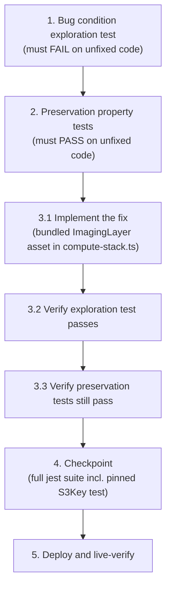

# Implementation Plan

## Overview

This bugfix spec replaces the compute stack's raw-directory `ImagingLayer` asset (`lambda.Code.fromAsset` on `backend/layers/imaging`, whose content depends on whether `build.sh` was run on the deploying host) with synth-time bundling in `compute-stack.ts`, mirroring verbatim the `SyntheticImagingLayer` bundling already cherry-picked into `synthetic-data-stack.ts`. After the fix, the layer content (`python/PIL`) is produced deterministically at synthesis, the staged asset carries no build tooling, and both stacks share one identical bundled asset (equal `Content.S3Key`), restoring the pinned cross-stack test.

## Task Dependency Graph

The dependency structure is strictly linear: tasks 1 and 2 write the same test file (`dda-imaging-layer-empty.test.ts`), and the remaining ordering follows the explore → preserve → implement → validate methodology.

```json
{
  "waves": [
    { "wave": 1, "description": "Run on UNFIXED code: write the bug condition exploration test (Property 1) in dda-imaging-layer-empty.test.ts and observe it FAIL - raw asset staging and diverging S3Keys are the counterexamples.", "tasks": ["1"] },
    { "wave": 2, "description": "Run on UNFIXED code: add preservation property tests (Property 2) to the SAME test file and observe them PASS - captures attach sites, layer metadata, and sibling asset baselines.", "tasks": ["2"] },
    { "wave": 3, "description": "Implement the fix: replace the raw ImagingLayer fromAsset in compute-stack.ts with synth-time bundling mirroring SyntheticImagingLayer verbatim, plus local bundling fallback.", "tasks": ["3.1"] },
    { "wave": 4, "description": "Verify the fix: re-run the exploration test from task 1 (now PASSES - bundled asset, matching S3Keys).", "tasks": ["3.2"] },
    { "wave": 5, "description": "Verify no regressions: re-run the preservation tests from task 2 (still PASS).", "tasks": ["3.3"] },
    { "wave": 6, "description": "Checkpoint: full infrastructure jest suite passes, including the pinned cross-stack S3Key test restored without edits.", "tasks": ["4"] },
    { "wave": 7, "description": "Deploy the compute stack and live-verify the new bundled ImagingLayer version on all three DDA labeling functions.", "tasks": ["5"] }
  ]
}
```



## Tasks

- [x] 1. Write bug condition exploration test
  - **Property 1: Bug Condition** - Synthesized Compute ImagingLayer Asset Is Bundled Pillow
  - **CRITICAL**: This test MUST FAIL on unfixed code - failure confirms the bug exists
  - **DO NOT attempt to fix the test or the code when it fails**
  - **NOTE**: This test encodes the expected behavior - it will validate the fix when it passes after implementation
  - **GOAL**: Surface the counterexample: the staged `ImagingLayer` asset is a raw directory copy, not synth-time bundling output
  - **HOST-STATE CAVEAT**: `build.sh` has been run on this host, so `backend/layers/imaging/python/` EXISTS — do NOT assert only "asset lacks PIL" (that would pass here on unfixed code). Assert the structural defect instead: (a) staged asset root contains NO `build.sh` / `requirements.txt` (bundled output is `python/` only), (b) `python/PIL` present with `Image.py`, `ImageDraw.py`, and ≥1 native `_imaging*.so`, (c) compute `ImagingLayer` `Content.S3Key` EQUALS the synthetic `SyntheticImagingLayer` `Content.S3Key` (from Bug Condition `isBugCondition` and its corollary in design)
  - **Scoped PBT Approach**: CDK synthesis is deterministic — the synth-level assertions over the staged asset and asset keys are the exhaustive check for the bug condition
  - Add `edge-cv-portal/infrastructure/test/dda-imaging-layer-empty.test.ts`: synthesize ComputeStack + SyntheticDataStack in one app via `app.synth()` (stack construction mirrors the beforeAll of `llm-model-token-and-image-sizing-infra.test.ts`; staged-asset dir resolution via `Content.S3Key` → `<assemblyDir>/asset.<hash>` mirrors `synthetic-imaging-layer-empty.test.ts`; synthesize once in beforeAll, generous timeout ~300 s)
  - Run test on UNFIXED code (`npx jest dda-imaging-layer-empty` in `edge-cv-portal/infrastructure`)
  - **EXPECTED OUTCOME**: Test FAILS — staged asset root holds `build.sh` + `requirements.txt` (+ host-built `python/`), and compute S3Key ≠ synthetic S3Key (proves the structural bug regardless of host state)
  - Document counterexamples found (asset root listing, diverging S3Keys)
  - _Requirements: 1.1, 1.2, 1.4, 2.1, 2.3_

- [x] 2. Write preservation property tests (BEFORE implementing fix)
  - **Property 2: Preservation** - Attach Sites, Layer Metadata, Sibling Assets, Suite, and Manual Build Unchanged
  - **IMPORTANT**: Follow observation-first methodology
  - Observe on UNFIXED code: `DdaLabelingWorker`, `DdaLabelingHandler`, `DdaAutolabelWorker` each carry exactly two layers with the second Ref = the stack's single `ImagingLayer` LayerVersion (same Ref across all three); handlers `dda_labeling_worker.handler` / `dda_labeling.handler` / `dda_autolabel_worker.handler`; runtime python3.11; timeouts 900/900/300 s; MemorySize 2048 each; `ImagingLayer` description `Pillow imaging layer for DDA labeling mask rendering (built by backend/layers/imaging/build.sh)` and `CompatibleRuntimes ['python3.11']`; `SharedLayer` staged verbatim from `backend/layers/shared`
  - Write preservation tests in the same test file capturing those observations (from Preservation Requirements in design)
  - Run tests on UNFIXED code
  - **EXPECTED OUTCOME**: Preservation tests PASS (confirms baseline behavior to preserve)
  - _Requirements: 3.1, 3.2_

- [x] 3. Fix for the raw (host-state-dependent) compute ImagingLayer asset

  - [x] 3.1 Implement the fix
    - In `edge-cv-portal/infrastructure/lib/compute-stack.ts` (~line 1805), replace the plain `lambda.Code.fromAsset(.../backend/layers/imaging)` for `ImagingLayer` with the bundled asset mirroring `synthetic-data-stack.ts`'s `SyntheticImagingLayer` VERBATIM: extract `imagingLayerSourceDir`, `bundling.image: lambda.Runtime.PYTHON_3_11.bundlingImage`, command `['bash', '-c', 'pip install -r requirements.txt -t /asset-output/python']` (byte-identical strings — required for the shared asset hash that restores the pinned test)
    - Add the local bundling fallback (`bundling.local.tryBundle`): host pip with the same manylinux wheel targeting as `build.sh` (`--platform manylinux2014_x86_64 --implementation cp --python-version 3.11 --only-binary=:all:`) into `<outputDir>/python`; return false on failure so CDK falls back to Docker; extend the existing `child_process` import (line 21) with `execSync`
    - Rewrite the layer's code comment to document synth-time bundling (cite this spec); keep `description` and `compatibleRuntimes` BYTE-IDENTICAL (pinned by a passing test); keep `build.sh` unchanged for manual builds; do NOT touch `synthetic-data-stack.ts` or any existing test file
    - _Bug_Condition: isBugCondition(input) — staged ImagingLayer asset is a raw directory copy (build tooling staged / PIL by host accident / S3Key diverges from the synthetic bundled asset)_
    - _Expected_Behavior: synthesized ImagingLayer asset is bundling output containing python/PIL, no build tooling, identical Content.S3Key to SyntheticImagingLayer (Property 1)_
    - _Preservation: attach sites, function configs, layer metadata, SharedLayer staging, synthetic stack untouched, build.sh manual path (Property 2)_
    - _Requirements: 2.1, 2.2, 2.3, 3.1, 3.2, 3.3, 3.5_

  - [x] 3.2 Verify bug condition exploration test now passes
    - **Property 1: Expected Behavior** - Synthesized Compute ImagingLayer Asset Is Bundled Pillow
    - **IMPORTANT**: Re-run the SAME test from task 1 - do NOT write a new test
    - **EXPECTED OUTCOME**: Test PASSES (staged asset is bundling output with python/PIL and no build tooling; compute S3Key equals synthetic S3Key)
    - _Requirements: 2.1, 2.3_

  - [x] 3.3 Verify preservation tests still pass
    - **Property 2: Preservation** - Attach Sites, Layer Metadata, Sibling Assets, Suite, and Manual Build Unchanged
    - **IMPORTANT**: Re-run the SAME tests from task 2 - do NOT write new tests
    - **EXPECTED OUTCOME**: Tests PASS (confirms no regressions)
    - _Requirements: 3.1, 3.2_

- [x] 4. Checkpoint - Ensure all tests pass
  - Run the full infrastructure jest suite (`npx jest` in `edge-cv-portal/infrastructure`): all 125 pre-existing tests must pass — the 124 currently green PLUS the pinned test 'SyntheticImagingLayer is unchanged and still bundles its own copy of the imaging asset' in `llm-model-token-and-image-sizing-infra.test.ts`, restored WITHOUT editing it — plus the new spec tests
  - Only if the S3Key equality empirically cannot be restored with identical bundling (not expected — the asset hash derives deterministically from the shared source dir + serialized bundling options) may the pinned test be updated, with explicit justification; treat as last resort and record the reason
  - _Requirements: 2.3, 3.3, 3.4_

- [x] 5. Deploy and live-verify the fix
  - Follow `.kiro/steering/builds.md`: confirm no component build is running (`pgrep -af "gdk component build"` / `pgrep -af "build-custom.sh"`) before deploying; portal deploys must not overlap component builds
  - Redeploy the compute stack from this worktree (account 164152369890, us-east-1): `npx cdk deploy EdgeCVPortalComputeStack --require-approval never` from `edge-cv-portal/infrastructure` (bundling now produces the layer content — no manual `build.sh` step)
  - Verify a NEW `ImagingLayer` version is attached to all three DDA labeling functions (`aws lambda get-function-configuration` on the DdaLabelingWorker / DdaLabelingHandler / DdaAutolabelWorker functions of `EdgeCVPortalComputeStack`)
  - Verify the deployed layer content contains `python/PIL` and NO `build.sh`/`requirements.txt` (`aws lambda get-layer-version` + zip inspection) — this proves the content came from bundling, not host state (the parallel operational mitigation deployed a manually-built layer; the bundled version supersedes it)
  - Optional end-to-end spot check (non-diagnostic post-mitigation): a Prompt Tuning Preview run shows per-image dimensions with no `No module named 'PIL'` model errors
  - After deploying, handle the `cdk.out` drift guards per `.kiro/steering/builds.md` before any subsequent component build (move `cdk.out` aside or rebaseline)
  - _Requirements: 2.2, 3.1_

## Notes

- The exploration test (task 1) MUST be written and observed to FAIL on unfixed code before any fix is written — do not fix the code or the test when it fails; the failure is the proof the bug exists
- The pinned cross-stack test 'SyntheticImagingLayer is unchanged and still bundles its own copy of the imaging asset' in `llm-model-token-and-image-sizing-infra.test.ts` must return to green WITHOUT being edited — restoring its S3Key equality assertion is part of the fix's acceptance, not something to patch around
- The live incident has already been mitigated operationally (a manually-built layer was deployed), so runtime symptoms (`No module named 'PIL'`) are non-diagnostic; verification of the fix rests on the synth-level assertions and the deployed layer's zip content, not on whether the Lambda errors reproduce
