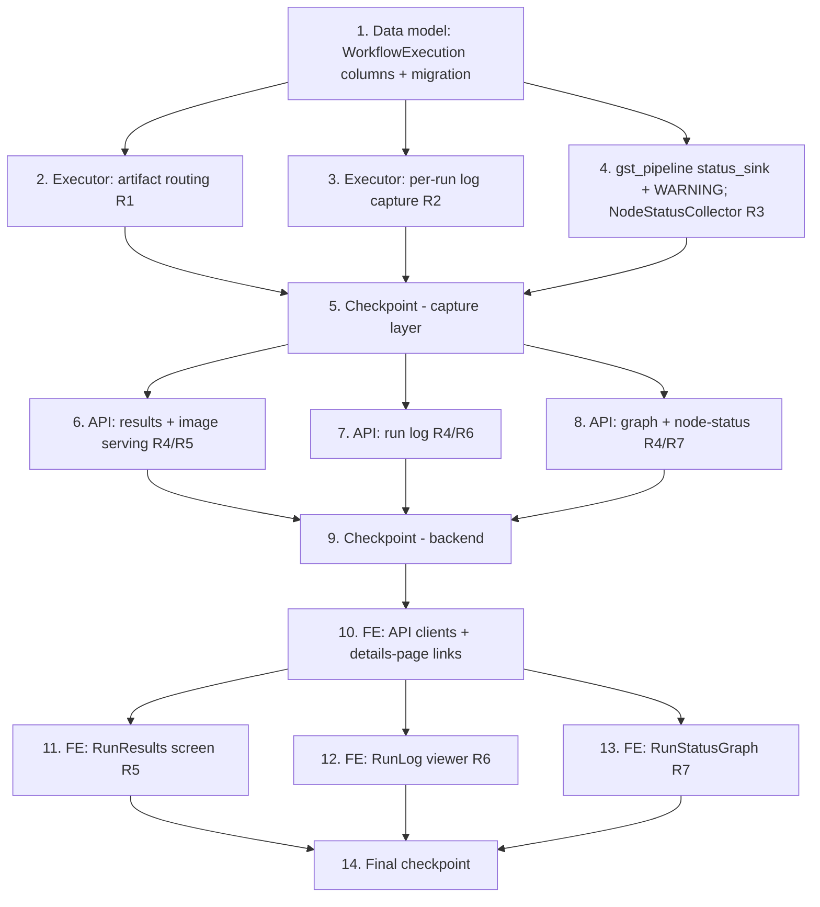

# Implementation Plan: Deployed Workflow Run Observability

## Overview

Implementation follows the design's layering: the **capture layer** in the executor first (artifacts, logs, per-node status — everything downstream reads what it produces), then the **API layer** exposing them, then the **presentation layer** (three on-device screens). The one small `gstreamer/gst_pipeline.py` change (optional `status_sink` + WARNING forwarding) is inert for existing callers, so it can land with the status collector without touching the Pipeline_Configuration path. Backend feature B (logs) is independent of A (artifacts) and C (node status) and can proceed in parallel; the frontend surfaces each depend on their own backend endpoint.

All capture paths are contained (a failure never fails a run or crashes LocalServer — workflow-manager Requirement 13.7). Every executor change is validated with the existing `test_workflow_pipeline_executor.py` fixture style (no real Triton repo, so config-gated routing/metadata no-op in tests).

Test baselines that must stay green throughout:
- Backend: `PYTHONPATH=src/backend:test/backend-test:test/backend-test/workflow_engine python3 -m pytest test/backend-test/workflow_engine` (plus the security gate suites the build runs).
- Frontend: `npm run build` and vitest under `src/frontend`.

Python property tests use `hypothesis` (project default ≥100 examples) as `test_property_*.py`; TypeScript property tests use `fast-check` with `numRuns: 100`. Each property test is tagged `**Feature: deployed-workflow-run-observability, Property {number}: {property_text}**`. Optional test tasks are marked `*`.

## Task Dependency Graph



```json
{
  "waves": [
    { "wave": 1, "tasks": ["1"], "description": "Additive WorkflowExecution columns + migration" },
    { "wave": 2, "tasks": ["2", "3", "4"], "description": "Capture layer: artifact routing, per-run log capture, and node-status collection (independent, parallel)" },
    { "wave": 3, "tasks": ["5"], "description": "Checkpoint: executor suites green; capture layer contained" },
    { "wave": 4, "tasks": ["6", "7", "8"], "description": "API endpoints: results/images, run log, graph + node-status (parallel)" },
    { "wave": 5, "tasks": ["9"], "description": "Checkpoint: backend api suites green; existing endpoints backward compatible" },
    { "wave": 6, "tasks": ["10"], "description": "Frontend API clients + per-execution links on the details page" },
    { "wave": 7, "tasks": ["11", "12", "13"], "description": "Frontend screens: RunResults, RunLog, RunStatusGraph (parallel)" },
    { "wave": 8, "tasks": ["14"], "description": "Final checkpoint: backend + frontend baselines green" }
  ]
}
```

## Tasks

- [x] 1. Add per-run observability columns to WorkflowExecution
  - In `src/backend/workflow_engine/models.py` add nullable columns to `WorkflowExecution`: `capture_id` (String), `output_dir` (String), `has_image_results` (Boolean, default False), `node_status_json` (Text), `log_path` (String).
  - Add the additive column migration through the existing `dao.sqlite_db.db_migration` path so existing devices upgrade in place; defaults keep old rows valid.
  - Update `workflow_engine/api.py` `execution_to_dict` to include `hasImageResults`, `captureId`, `outputDir` (new keys only; existing keys unchanged).
  - _Requirements: 1.4, 8.3_
  - [x]* 1.1 Unit test the migration adds columns idempotently and `execution_to_dict` includes the new keys while preserving the existing four-endpoint shape.
    - _Requirements: 8.3_

- [x] 2. Executor: route capture outputs to a per-run artifact location
  - In `src/backend/workflow_engine/pipeline_executor.py` add `_route_capture_outputs(document, output_dir, capture_id)` and call it in `execute()` alongside the existing prep steps (after `_inject_inference_metadata`, before `_ensure_terminal_sink`/render).
  - Compute `output_dir = {_WORKFLOW_CAPTURE_ROOT}/{workflow_id}/{execution_id}` and reuse the existing synthesized `capture_id`; set the METADATA `sagemaker_edge_core_capture_data_disk_path` to `output_dir` so marshal workflow-id derivation and file targets agree; create the dir best-effort.
  - Populate a terminal `emlcapture` element's empty/`{capture_meta}` `meta` with the `triton_inference_output_*` routing string (mirroring `gstreamer/pipeline_builder._add_post_processing_plugins`), targeting `{output_dir}/{capture_id}`; add only the targets whose outputs the model declares (extend the `config.pbtxt` reader from `_model_declares_metadata_input` to enumerate declared `output {}` names).
  - Set `has_image_results=True` and persist `capture_id`/`output_dir` on the execution when routing was applied; leave non-capture documents untouched.
  - Wrap so any routing failure is logged and swallowed (run still proceeds).
  - _Requirements: 1.1, 1.2, 1.3, 1.4, 1.5, 1.6, 8.5_
  - [x] 2.1 Unit tests: routing populates `meta` only for a capture terminal; only declared outputs are targeted; non-capture/plain-model docs unchanged; `has_image_results`/`output_dir`/`capture_id` set correctly; tag values unchanged.
    - _Requirements: 1.1, 1.5, 1.6_
  - [x]* 2.2 Property test.
    - **Feature: deployed-workflow-run-observability, Property 3: Artifact routing is capture-gated**
    - **Validates: Requirements 1.1, 1.5, 8.2**
    - **Feature: deployed-workflow-run-observability, Property 4: Additive tags**
    - **Validates: Requirements 1.6**

- [x] 3. Executor: capture a per-execution run log
  - Add a `RunLogCapture(execution_id, log_path)` context manager in `workflow_engine` that attaches a bounded `logging.FileHandler` to the `workflow_engine` and `gstreamer` loggers for the duration of `execute()`, then detaches it; write to `log_path` under `output_dir` (or a per-run logs dir when there is no output_dir).
  - Wrap `execute()`'s body in the capture; record `log_path` on the execution; ensure existing/root logging is unaffected and any handler error is swallowed.
  - _Requirements: 2.1, 2.2, 2.3, 2.4, 2.5, 2.6, 8.5_
  - [x] 3.1 Unit tests: the run's launch string, resolution messages, and terminal outcome (tags or failing-node+error) appear in the file; size is bounded; root logging untouched; a forced handler error does not fail the run.
    - _Requirements: 2.2, 2.3, 2.4, 2.5, 2.6_

- [x] 4. Executor + gst_pipeline: collect per-node run status
  - In `src/backend/gstreamer/gst_pipeline.py` `run_pipeline`, add an optional `status_sink` parameter (default None → current behavior); when provided, forward per-element state-changed transitions and add `Gst.MessageType.WARNING` to the handled bus messages, forwarding `(element_name, warning)` to the sink. Existing ERROR/EOS/TAG handling unchanged.
  - Add a `NodeStatusCollector` in `workflow_engine` built from `rendering.element_name_map(document)`: initialize participating nodeIds `pending`; drive `running`/`warning` from the sink when available; on clean completion mark participating nodes `success`; on failure mark the mapped failing node `failure` with detail (via `failing_node_id_from_error`) and resolve the rest best-effort.
  - In `execute()` pass the sink to `run_pipeline`, and persist the terminal `node_status_json` at run end (success and failure paths). Contained: collector errors never fail the run.
  - _Requirements: 3.1, 3.2, 3.3, 3.4, 3.5, 3.6, 8.1, 8.5_
  - [x] 4.1 Unit tests: element→node mapping; fully-terminal map on completion and on failure; failing node attribution; warning capture; Pipeline_Configuration caller (no sink) behaves exactly as before.
    - _Requirements: 3.1, 3.2, 3.4, 3.6, 8.1_
  - [x]* 4.2 Property test.
    - **Feature: deployed-workflow-run-observability, Property 1: Node-status coverage and terminality**
    - **Validates: Requirements 3.1, 3.6**
    - **Feature: deployed-workflow-run-observability, Property 2: Single failure attribution**
    - **Validates: Requirements 3.2**

- [x] 5. Checkpoint — capture layer
  - Run `PYTHONPATH=src/backend:test/backend-test:test/backend-test/workflow_engine python3 -m pytest test/backend-test/workflow_engine`; confirm green and that capture-layer failures are contained.
  - _Requirements: 1.6, 2.6, 3.6, 8.1, 8.5_

- [x] 6. API: run results metadata + image serving
  - In `workflow_engine/api.py` add `GET /workflows/executions/{execution_id}/results` returning `{ hasImageResults, captureId, images:[{kind, hasOverlay}] }`; 404 for unknown executions.
  - Add image-serving routes for a run's base output image and its overlay/mask variant, reading from `output_dir` via `FileResponse`, mirroring `endpoints/download_file.py` conventions and its auth/token-in-query behavior; serve the mask as base64 + background so the existing frontend overlay pipeline is reused unchanged.
  - _Requirements: 4.1, 4.2, 4.6, 4.7, 5.7_
  - [x] 6.1 Unit tests: results shape; base/overlay serving; mask-absent case; 404s; auth/token behavior parity with capture-image endpoints.
    - _Requirements: 4.1, 4.2, 4.6, 4.7_
  - [x]* 6.2 Property test.
    - **Feature: deployed-workflow-run-observability, Property 7: Results-link and artifacts equivalence**
    - **Validates: Requirements 5.1, 5.2**

- [x] 7. API: run log
  - Add `GET /workflows/executions/{execution_id}/log` returning `text/plain` from `log_path`; 200 with an empty body when not yet available; 404 for unknown executions.
  - _Requirements: 4.3, 4.6, 6.4_
  - [x] 7.1 Unit tests: log text returned; empty-but-200 when absent; 404 unknown execution.
    - _Requirements: 4.3, 4.6_

- [x] 8. API: workflow graph + node status
  - Add `GET /workflows/registrations/{registration_id}/graph` returning the registration's `workflow.json` (nodes with positions + connections); 404 when absent.
  - Add `GET /workflows/executions/{execution_id}/node-status` returning the `{nodeId:{status,detail?}}` map from `node_status_json`; 404 for unknown executions.
  - _Requirements: 4.4, 4.5, 4.6_
  - [x] 8.1 Unit tests: graph payload from artifact_path; node-status map shape; 404s.
    - _Requirements: 4.4, 4.5, 4.6_

- [x] 9. Checkpoint — backend
  - Run the backend workflow_engine + api suites; confirm green and that the existing four deployed-workflow endpoints still return their prior shapes (superset only).
  - _Requirements: 4.6, 8.3_
  - [ ]* 9.1 Property test.
    - **Feature: deployed-workflow-run-observability, Property 6: Endpoint backward compatibility**
    - **Validates: Requirements 8.3**

- [x] 10. Frontend: API clients + per-execution links
  - In `src/frontend/src/api/WorkflowRegistrationAPI.ts` add clients and types for results metadata, log text, graph, and node-status; extend `WorkflowExecution` with `hasImageResults`/`captureId`/`outputDir`.
  - In `components/deployed-workflow/details/DeployedWorkflowDetails.tsx` add per-execution "View results" (only when `hasImageResults`), "View run log", and "Run status" links, with visibility decided by pure helpers in `presentation.ts`; register new routes in `App.tsx` under the deployed-workflow area.
  - _Requirements: 5.1, 5.2, 6.1, 7.1_
  - [x] 10.1 Unit tests (vitest): `presentation.ts` link-visibility helpers (results link iff `hasImageResults`; log/status links for started executions).
    - _Requirements: 5.1, 5.2, 6.1_

- [x] 11. Frontend: RunResults screen
  - Add a `RunResults` screen mirroring `components/result-history/ResultDetailsCardDisplay.tsx`: `showMask` state, `InteractableImage` with the mask overlay, `RefreshDisplayActions` toggle; base image from the run output-image endpoint; mask via `getMaskImageProp` from the results endpoint; hide the toggle when no mask; empty/error state on load failure.
  - _Requirements: 5.3, 5.4, 5.5, 5.6, 5.7_
  - [x] 11.1 Unit tests (vitest): toggle shown/hidden by mask presence; reuses `InteractableImage`; error state on fetch failure.
    - _Requirements: 5.4, 5.5, 5.7_

- [x] 12. Frontend: RunLog viewer
  - Add a `RunLog` viewer that fetches `/log` and renders it scrollable + copyable; shown for any started execution; explanatory empty state when pending/empty; failed runs show error + failing node in the text.
  - _Requirements: 6.1, 6.2, 6.3, 6.4, 6.5_
  - [x] 12.1 Unit tests (vitest): populated vs empty state; renders failure text.
    - _Requirements: 6.3, 6.4_

- [x] 13. Frontend: RunStatusGraph screen
  - Add a lightweight read-only graph renderer (absolutely-positioned node cards + SVG edges) using the `/graph` node positions/connections; overlay node color from `/node-status` (green success, red failure, yellow warning, in-progress affordance for running); reuse the portal category palette values as constants; show error/warning detail on node hover/select.
  - Poll `/node-status` while the execution is active (reuse the `presentation.shouldPoll` pattern) and stop at terminal; ensure it renders without cloud access.
  - _Requirements: 7.1, 7.2, 7.3, 7.4, 7.5, 7.6, 7.7_
  - [x] 13.1 Unit tests (vitest): node coloring by status; hover/select detail; polling starts while active and stops at terminal; fully-resolved coloring on finish.
    - _Requirements: 7.3, 7.4, 7.5, 7.6_

- [x] 14. Final checkpoint
  - Run backend workflow_engine + api suites and the `src/frontend` vitest + `npm run build`; confirm all green and no regressions in the Pipeline_Configuration path or the "run inference" experience.
  - _Requirements: 8.1, 8.2, 8.3, 8.4_

## Notes

- **Builds are on hold.** This spec does not itself trigger a LocalServer rebuild. It ships together with the three already-committed executor fixes (folder-source, METADATA injection, terminal sink) in the next JP6 v1.0.40 (then JP5) rebuild, per the user's decision to hold until the observability work is ready.
- **Edge-only.** No change to the cloud Portal authoring/packaging flow. The Portal compiler could later also emit the terminal `fakesink` and a populated `{capture_meta}`; this spec makes the device self-sufficient so existing deployed packages work without re-packaging.
- **Containment is mandatory** for every capture path (artifacts, log, node status): a failure is logged and swallowed so a run always reaches a terminal state and LocalServer never crashes (workflow-manager Requirement 13.7).
- **Reuse over reinvention**: RunResults reuses `InteractableImage`/`RefreshDisplayActions`/`live-result/helpers`; artifact routing mirrors `pipeline_builder._add_post_processing_plugins`; the failing-node mapping reuses `rendering.failing_node_id_from_error`.
- **Graph renderer**: intentionally a lightweight read-only SVG renderer using authored `workflow.json` positions, not `@xyflow/react`, to keep the edge bundle small and offline-capable. Revisit if richer interactions are needed later.
- Optional test tasks (`*`) follow the repo convention; property tests use the tag `Feature: deployed-workflow-run-observability, Property {n}` and validate the properties in design.md.
