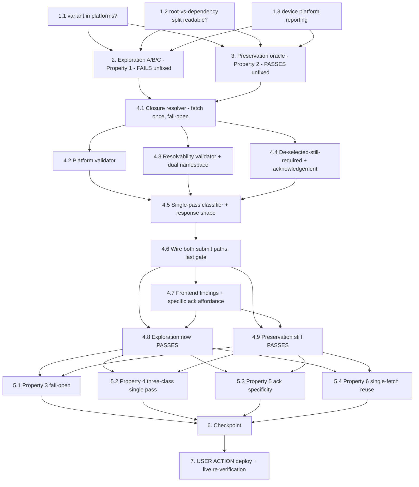

# Implementation Plan

## Overview

Add ONE pre-submit capability to the portal's two deployment submit paths:
resolve the selected components' transitive recipe `ComponentDependencies`
closure **once**, then ask three questions of that single resolved closure.

1. **Platform satisfiability** (bugfix.md 2.2, 2.3, 2.8) — does each component
   version in the closure publish a manifest the target device's platform
   satisfies, `variant` included? Counterexample A: workflow
   `dda.workflow.8784b33b-…` v1.0.0 publishes only `arm64_jp5`/`arm64_jp6`
   variants and was offered for, and accepted onto, a JP7 device
   (`adlink-dlap-701`); deployment `1982ad02-…` revision 6 failed
   `FAILED_NO_STATE_CHANGE`.
2. **Dependency resolvability** (2.4, 2.5) — does every depended-on name have at
   least one published version in the account satisfying its
   `VersionRequirement`? Counterexample B: `…-jetson-xavier` v2.0.0 models
   HARD-depending on `aws.edgeml.dda.LocalServer.arm64JP4` /
   `…LocalServer.arm64`, both with an empty version list; revision 9 failed with
   a reason naming NO component.
3. **De-selected but still required** (2.11–2.16) — is anything the operator
   removed still HARD-required by something they kept? Counterexample C:
   `model-vllm-qwen3-5-9b-jetson-xavier-jp7` was removed at `jetson-thor1`
   revision 21 and stayed installed and running for six days across revisions
   22–52 because `dda.workflow.421f8233-…` v12.0.0 still required it.

Findings are reported in ONE pass, each classified as exactly one of
**blocking-invalid** (2.3/2.5 — no acknowledgement bypasses),
**acknowledgement-required** (2.13/2.14 — refused on first submit, proceeds on
re-submit with a matching specific acknowledgement) or **unverified** (2.9 —
reported, blocks nothing).

**One closure, three validators — not three walks.** Recipes are fetched once
per `(component_name, version)` and reused by all three validators. The only
production recipe read today is the Nucleus `VersionRequirement` lookup inside
`resolve_public_component_version` (`deployments.py:437-450`, the
`get_component(recipeOutputFormat='JSON')` call); the closure resolver
generalizes that read. Available APIs: `get_component` (recipe),
`list_component_versions` (published versions per name), `describe_component`
(platforms — the shape `components.target_architectures_from_platforms`
already consumes at `components.py:127-158`), `get_core_device` (device
platform/architecture, `deployments.py:304`, `devices.py:283`).

**Both submit paths.** `create_deployment` (gates at `deployments.py:1238`
plugin, `:1258` vLLM; submit at `:1512`) and `create_workflow_deployment`
(`:3645` LocalServer floor, `:3672` plugin, `:3693` vLLM, `:3719` camera
bindings; submit at `:3852`). The new validation runs LAST among the
pre-submit gates on both paths, immediately before
`greengrass_client.create_deployment`, so every existing gate keeps
precedence and its exact code/payload (3.4).

**Portal-only.** No device-side change, no component build, no on-device
verification. `src/` is untouched. Rollout is a portal deploy (task 7, USER
ACTION).

## Notes

### Scope guards

- **Explicitly NOT gated: the automated store-limit remediation submits.**
  `_submit_store_remediation` (`deployments.py:1676`) and
  `_resume_original_deployment` (`:1717`) also call
  `greengrass_client.create_deployment`, from
  `remediate_component_store_failures`. These are machine remediation, not
  operator submits: an acknowledgement-required finding there would have
  nobody to acknowledge it and would wedge remediation. They stay
  unvalidated and unblocked, and task 3 pins that.
- **False-positive risk on public component names (2.4/2.5).** Account
  components resolve under
  `arn:aws:greengrass:{region}:{account_id}:components:{name}`
  (`shared_components.py:343`) while AWS-managed ones resolve under the `aws`
  namespace (`deployments.py:420`, `devices.py:699`). A resolvability check
  that only queries the account namespace would report
  `aws.greengrass.Nucleus`, `…LogManager`, `…ShadowManager`, `…Cli`,
  `aws.greengrass.SecureTunneling` as having zero published versions and
  block every deployment. The resolver MUST try both namespaces and treat
  either hit as resolved; unresolvable in both ⇒ finding.
- **`create_workflow_deployment` merges rather than replaces.** Its
  `components_map` starts as a copy of the target's current deployment
  (`:3752-3760`), so de-selection cannot arise there by construction — the C
  validator will normally return nothing on that path. It still runs there
  (uniform code path, and a future non-merging change must not silently lose
  the check), and the diff is computed from the FINAL `components_map` versus
  the previous deployment's components on both paths.
- Auto-included entries (Nucleus, LogManager, ShadowManager,
  InferenceUploader) are added to `components_map` before submit. The closure
  is resolved over the FINAL map so their dependencies are covered, and per
  3.14 the validation never mutates it — no component is re-added, removed or
  reordered by the validator.
- Not changed: `workflow_packaging.model_component_dependencies` (3.12 — the
  unpinned `>=0.0.0` HARD entry stays), `vllm_model_prep.cleanup()` (3.13),
  the frontend coarse arm64/amd64 filter and gated/JetPack filters (3.5–3.7),
  the deployment-detail passthrough of Greengrass `reason`/`statusDetails`
  (3.9, `deployments.py:891-955`), every recipe, artifact and published
  component version (3.10).
- No preservation-tracked file (`src/docker-compose.yaml`, backend/frontend/
  edgemlsdk Dockerfiles, `src/backend/requirements.txt`, recipe variants,
  `station_install/setup_station.sh`) is touched ⇒ **no security-baseline
  rebaseline expected**. Task 6 verifies that claim rather than assuming it;
  if the design ends up needing one, rebaseline in the SAME commit per
  `.kiro/steering/builds.md`.
- Nothing is committed by tasks 1–6. Task 7 is the USER-ACTION deploy.

### Honesty guard

Every test in this plan asserts either a property of a PURE function
(closure resolver / validators / classifier over fixture recipes) or a
property of the SUBMITTED deployment document captured by the existing
`FakeGreengrass` harness, or of the UI's payload. No test may claim that a
real device removed or retained a component — Counterexample C's six-day
retention is device evidence, provable only against the live account. The
live claim is assigned to task 7's read-only re-verification.

### Test conventions (verified, not assumed)

- Portal backend suites run WITH conftest (`edge-cv-portal/backend/tests/
  conftest.py` provides the moto `aws_stack` fixture, the `sys.path` layer
  wiring, and the Hypothesis profiles `portal-fast` (25) / `ci` (100) — do
  NOT hardcode `max_examples`, do NOT pass `--noconftest`):
  `HYPOTHESIS_PROFILE=ci ~/.dda-test-venv/bin/python -m pytest edge-cv-portal/backend/tests/<file> -q -p no:cacheprovider`
  (verified working from the repo root against
  `test_deployment_vllm_gate.py`: 11 passed).
- Property tests: hypothesis, ≥100 examples via `HYPOTHESIS_PROFILE=ci`, ONE
  property per test, each tagged
  `# Feature: deployment-preflight-validation, Property {N}: {title}`.
- Harnesses to reuse, not rebuild: `ShadowManagerEnv`
  (`test_deployment_shadow_manager.py:67` — endpoint-level
  `create_deployment` through the real handler with the fakes injected via
  `monkeypatch` on `get_usecase_client`), `WorkflowDeployEnv`
  (`test_workflow_deploy_subscribe_merge_exploration.py:71` — endpoint-level
  `create_workflow_deployment`), `FakeGreengrass`/`FakeIot`
  (`test_workflow_packaging_deployment_integration.py:76`, with
  `create_deployment_calls` capture, `_pages_list_installed_components`,
  `get_deployment`, `get_core_device`). `FakeGreengrass` needs additive
  `get_component`, `list_component_versions` and `describe_component` support
  plus per-component recipe/version/platform seeding — an additive extension
  in the SAME file so every existing consumer stays green unmodified.
- Frontend is a vitest single run from `edge-cv-portal/frontend`:
  `npx vitest run <file>`. Conventions per
  `CreateDeployment.archFilter.test.tsx` (hoisted `apiService` proxy mock,
  router mock, Cloudscape test utils). Pure helpers live in
  `src/pages/deployments/` with a sibling `.test.ts` — the established
  pattern for `parsePluginGateRejection` (`pluginComponents.ts`),
  `parseVllmGateRejection` (`vllmArchGate.ts`) and
  `parseCameraBindingRejection` (`cameraBindings.ts`).

### New files this plan creates

- `edge-cv-portal/backend/functions/deployment_preflight.py` (closure
  resolver + three validators + classifier; pure over injected fetchers)
- `edge-cv-portal/backend/tests/test_deployment_preflight_exploration.py`
- `edge-cv-portal/backend/tests/test_deployment_preflight_preservation.py`
- `edge-cv-portal/backend/tests/test_deployment_preflight_properties.py`
- `.kiro/specs/deployment-preflight-validation/counterexamples.md` (the
  `exit75_deferral_counterexamples.md` / `execution_failure_counterexamples.md`
  precedent) and `evidence.md` (task 1's live findings)
- `edge-cv-portal/frontend/src/pages/deployments/deploymentPreflight.ts` +
  `deploymentPreflight.test.ts`
- `edge-cv-portal/frontend/src/pages/CreateDeployment.preflightAck.test.tsx`

### Task numbering note

The bug-condition exploration test is task **2** and the preservation oracle
task **3**, not 1 and 2, because bugfix.md lists three claims that are
unverified in-repo and the exploration assertions cannot be written honestly
until they are settled with live read-only evidence (task 1). Task 1 writes no
production code and no test.

## Task Dependency Graph

```json
{
  "waves": [
    { "wave": 1, "description": "Evidence spikes: settle the three unverified-in-repo assumptions with READ-ONLY live account calls (variant in describe_component platforms; root-vs-dependency split via any readable cloud API; how the device platform is reported). Records evidence.md; no code.", "tasks": ["1.1", "1.2", "1.3"] },
    { "wave": 2, "description": "Exploration (Property 1, MUST FAIL) and the observation-first preservation oracle (Property 2, MUST PASS) on the UNFIXED tree.", "tasks": ["2", "3"] },
    { "wave": 3, "description": "The fix: one closure resolver, three validators over it, the single-pass classifier, both submit paths wired, frontend affordance.", "tasks": ["4.1", "4.2", "4.3", "4.4", "4.5", "4.6", "4.7"] },
    { "wave": 4, "description": "Re-run the two wave-2 suites UNMODIFIED: exploration flips to PASS, preservation stays PASS.", "tasks": ["4.8", "4.9"] },
    { "wave": 5, "description": "Fix-checking property suites: fail-open under any greengrassv2 exception, three-class single-pass classification, acknowledgement specificity and set-change invalidation, single-fetch closure reuse.", "tasks": ["5.1", "5.2", "5.3", "5.4"] },
    { "wave": 6, "description": "Checkpoint: full portal suite at baseline counts, frontend vitest + build, security guard pair, git scope check (nothing committed).", "tasks": ["6"] },
    { "wave": 7, "description": "USER ACTION: portal deploy under the builds.md gates + read-only live re-verification of all three counterexamples.", "tasks": ["7"] }
  ]
}
```



## Tasks

- [ ] 1. Settle the three unverified-in-repo assumptions with read-only live evidence (no production code, no tests)
  - **GOAL**: the closure resolver's contract must rest on observed API
    behaviour, not on an assumption. bugfix.md names three open items; each
    gets its own subtask and its answer is recorded in
    `.kiro/specs/deployment-preflight-validation/evidence.md` with the exact
    command and the verbatim (trimmed) response
  - **READ-ONLY ONLY**: `describe-component`, `get-component`,
    `list-component-versions`, `get-core-device`, `get-deployment`,
    `list-deployments`, `list-installed-components`. No create/update/delete,
    no deployment submitted. Account 164152369890, us-east-1 (the shell on
    this build server already assumes `admin-iam`; verified reachable)
  - If any subtask cannot be settled, record it as UNSETTLED with what was
    tried — a resolver that must guess then guesses FAIL-OPEN (2.9), never
    fail-closed

  - [ ] 1.1 Does `DescribeComponent`'s `platforms[].attributes` reliably carry `variant`?
    - `components.py:127-158` (`target_architectures_from_platforms`) assumes
      it does for `dda.plugin.*`; bugfix.md flags this as unverified for every
      component class
    - Sample at least one of each: a multi-arm workflow component (variant
      expected per `workflow_packaging.py:2135-2148`), a single-arm workflow
      component (variant-less expected), a `model-*-jp7` component published by
      `greengrass_publish.py:323`/`:654` (variant-less
      `{"os":"linux","architecture":<platform>}` expected), a
      `dda.plugin.*` component, a LocalServer variant, and one AWS-managed
      public component
    - For each, compare `describe-component` `platforms` against the recipe's
      own `Manifests[].Platform` from
      `get-component --recipe-output-format JSON` — the answer that matters is
      whether the two AGREE, because the validator must judge platform from
      the manifests Greengrass negotiates against (2.2)
    - Record the verdict: if `describe-component` is not reliable, the resolver
      reads platforms from the recipe it already fetches for the closure walk
      and `describe-component` is not used at all
    - _Requirements: 2.2, 2.3, 2.8_

  - [ ] 1.2 Does Greengrass expose the root-vs-dependency split through a readable cloud API pre-submit?
    - Counterexample C's split is visible in the device's own bookkeeping
      (`GroupToRootComponents` omits the component, `ComponentToGroups` still
      contains it) — the open question is whether the portal can read that,
      or an equivalent, from the cloud BEFORE submitting
    - Try, on `jetson-thor1` and `adlink-dlap-701`:
      `list-installed-components` (inspect every field, notably
      `isRoot`/`lifecycleState`/`lastStatusChangeTimestamp` if present),
      `get-deployment` on the latest revision (does `components` distinguish
      root entries?), `list-deployments --history-filter LATEST_ONLY`,
      `get-core-device`
    - Verdict determines 4.4's source of truth: a readable split means the
      validator can corroborate; no readable split means the portal derives
      the answer itself from the recipes it already fetches for 2.1's closure
      walk — which is the assumption to avoid resting on silently
    - _Requirements: 2.11, 2.12_

  - [ ] 1.3 How is the target device's platform actually reported?
    - `get_core_device` is read at `deployments.py:304` and `devices.py:283`
      and yields `platform` + `architecture` only — on the evidence in-repo
      there is NO `variant` in that response, while 2.2 requires judging
      against "the platform attributes the device reports, including
      `variant`". Confirm live for a JP5, a JP6 and a JP7 device and record
      the exact fields
    - Record what the portal's own device record carries instead
      (`DEVICES_TABLE.target_architecture`, read by `load_device_gate_info`,
      `deployments.py:2116-2135`; `TARGET_ARCHITECTURES` in `devices.py:33`
      and `quick_setup.py:82` already include `arm64_jp7`) and how it maps to
      a manifest `variant` value
    - Decide and record the device-platform source the validator uses, plus
      its fail-open behaviour when the source is absent (a device with no
      recorded architecture and no reported variant is UNVERIFIED, not
      incompatible — 2.9, and 3.8 for thing-group members)
    - Note honestly in `evidence.md` that the two JP7 devices' identical
      `platform=linux architecture=aarch64` report is operator-reported in
      bugfix.md; this subtask either confirms it first-hand or records that it
      could not
    - _Requirements: 2.2, 2.9, 3.8_

- [ ] 2. Write bug condition exploration property tests (BEFORE implementing the fix)
  - **Property 1: Bug Condition** - Platform mismatch, unresolvable dependency and de-selected-but-still-required are all caught before submit
  - **CRITICAL**: all three legs MUST FAIL on the unfixed tree — failure
    confirms the bug condition exists
  - **DO NOT attempt to fix the tests or the code when they fail**
  - **NOTE**: this suite encodes the expected behavior — it validates the fix
    when it passes after implementation (task 4.8)
  - **GOAL**: surface counterexamples for defects 1.1–1.10 and confirm or
    refute the root-cause analysis (a refutation means re-hypothesizing before
    task 4)
  - Create `edge-cv-portal/backend/tests/test_deployment_preflight_exploration.py`
    tagged `# Feature: deployment-preflight-validation, Property 1: bug
    condition — pre-submit closure validation`, using `ShadowManagerEnv`
    (generic path) and `WorkflowDeployEnv` (workflow path) with the additive
    `FakeGreengrass` recipe/version/platform seeding from the Notes
  - **Leg A — platform mismatch (defects 1.1, 1.2, 1.7 → 2.3)**: scoped PBT
    over the Counterexample A shape — a component version publishing ONLY
    `{"os":"linux","variant":"arm64_jp5","architecture":"aarch64"}` and
    `{…"arm64_jp6"…}`, hypothesis-generating the component name, version and
    the JP7 device's thing name; assert the submit is REFUSED before
    `greengrass_client.create_deployment` (`gg.create_deployment_calls` empty)
    with a finding naming the component, its version, the platforms it
    actually claims, the device and the device's platform (2.3, 2.7). Include
    the verbatim incident case (`dda.workflow.8784b33b-25a6-44c3-b62d-d47e8213eabe`
    v1.0.0, `adlink-dlap-701`) as a concrete example, and a `has_llm_inference`
    false version item so the existing vLLM gate demonstrably does not fire
    (1.2)
  - **Leg B — unresolvable dependency (defects 1.3, 1.6 → 2.5)**: scoped PBT
    over the Counterexample B shape — a selected model component whose recipe
    HARD-depends on a name with an EMPTY published-version list
    (`aws.edgeml.dda.LocalServer.arm64JP4` at `>=1.0.0 <2.0.0`), and a variant
    where the name has versions but none satisfying the requirement; assert
    refusal before submit with the depended-on name, the `VersionRequirement`,
    the requiring component and version, and the zero-versions vs
    non-satisfying distinction (2.5). Include both live pairs
    (`model-cookies-segmentation-seghead-jetson-xavier` v2.0.0,
    `model-yolo-test-jetson-xavier` v2.0.0) and their resolvable `-jp7` twins
    as the negative control
  - **Leg C — de-selected but still required (defects 1.8–1.10 → 2.13, 2.14)**:
    scoped PBT over the Counterexample C shape — the target's previous
    deployment contains `model-vllm-qwen3-5-9b-jetson-xavier-jp7` and
    `dda.workflow.421f8233-f1d9-495a-b7b2-f26b1d24d0d8` v12.0.0 whose recipe
    carries `{"model-vllm-qwen3-5-9b-jetson-xavier-jp7": {"VersionRequirement":
    ">=0.0.0", "DependencyType": "HARD"}, "aws.edgeml.dda.LocalServer.arm64JP7":
    {…}}`; the submitted set drops the model and keeps the workflow. Assert
    (a) the FIRST submit is refused with nothing sent to Greengrass, (b) the
    finding names the de-selected component AND every selected component
    requiring it with version + `VersionRequirement` + `DependencyType`
    (2.12, 2.15), (c) the response states the effective outcome — the
    component remains installed and running and will NOT be removed (2.13),
    (d) a re-submit carrying a matching specific acknowledgement succeeds and
    submits the component set UNCHANGED (2.14, 3.14)
  - **Leg D — single pass (defect 1.4 → 2.6, 2.16)**: one submission carrying
    an A fault, a B fault and a C finding at once; assert ALL of them come back
    in ONE response, each classified blocking-invalid / acknowledgement-required
    / unverified, and that the acknowledgement does NOT clear the A/B findings
  - Run: `HYPOTHESIS_PROFILE=ci ~/.dda-test-venv/bin/python -m pytest
    edge-cv-portal/backend/tests/test_deployment_preflight_exploration.py -q -p no:cacheprovider`
  - **EXPECTED OUTCOME**: all four legs FAIL (this is correct — it proves the
    bug condition exists; today every one of these submissions is accepted and
    forwarded to Greengrass)
  - Record the counterexamples verbatim — including the hypothesis falsifying
    examples — in
    `.kiro/specs/deployment-preflight-validation/counterexamples.md`
  - _Requirements: 1.1, 1.2, 1.3, 1.4, 1.5, 1.6, 1.7, 1.8, 1.9, 1.10_

- [ ] 3. Write the observation-first preservation oracle (BEFORE implementing the fix)
  - **Property 2: Preservation** - Every submission that resolves today submits byte-identically, with every existing gate's semantics, codes and payloads intact
  - **IMPORTANT**: observation-first — run the UNFIXED code on
    non-bug-condition inputs, RECORD the actual outputs, then encode them as
    properties that PASS on the unfixed tree. **This oracle is IMMUTABLE: it
    is never rebaselined after implementation.** A preservation failure in
    task 4.9 means the fix leaked outside the bug condition and the FIX is
    wrong, not the test
  - **Preservation is the dominant risk in this spec** — the change sits on the
    submit path of every deployment the portal makes
  - Create `edge-cv-portal/backend/tests/test_deployment_preflight_preservation.py`
    tagged `# Feature: deployment-preflight-validation, Property 2:
    non-bug-condition submissions unchanged` (conftest profiles; no hardcoded
    `max_examples`)
  - Observe on the UNFIXED tree and encode:
    - **Clean-submit document identity (3.1)**: _for any_ generated component
      set whose closure resolves, the submitted `deployment_params` (components
      map with every `componentVersion` and `configurationUpdate`, target ARN,
      name, tags, `deploymentPolicies`) and the 201 response body
      (`auto_included`, `is_revision`, `superseded_deployment_id`, `warnings`)
      deep-equal the unfixed capture, and no additional operator step is
      required. Pin the two reference `jetson-thor1` deployments
      (`7092ec91-b404-4738-a586-a022ddc15157`, `a9086c7d…`) as concrete cases
    - **Existing gate identity (3.4)**: enumerate and pin, on BOTH paths, the
      exact status, `code`, `message` and `details` of `VLLM_ARCH_UNSUPPORTED`,
      `PLUGIN_LIFECYCLE_VIOLATION`, `PLUGIN_ARCH_UNSUPPORTED`,
      `INCOMPATIBLE_LOCAL_SERVER`, `CAMERA_BINDINGS_INVALID`,
      `CAMERA_WARNINGS_UNCONFIRMED`, `REGISTRY_UNAVAILABLE` — and their
      PRECEDENCE: when an existing gate and a new finding both apply, the
      existing gate's response is what comes back, byte-identical. Baseline the
      existing suites green with recorded counts:
      `test_deployment_vllm_gate.py` (11 passed observed),
      `test_deployment_shadow_manager.py`, `test_deployment_store_limit.py`,
      `test_camera_binding_submission.py`, `test_camera_binding_validation.py`,
      `test_workflow_deploy_subscribe_merge_*`,
      `test_workflow_deploy_component_version_*`,
      `test_workflow_packaging_deployment_integration.py`,
      `test_secure_tunneling_jp5_guard.py`
    - **Variant-less manifests stay universal (3.2, 2.8)**: _for any_
      generated aarch64 manifest carrying NO `variant` attribute and any
      Jetson device variant, the component is offered and deployed — never
      reported incompatible. Cover the `greengrass_publish.py:323`/`:654`
      shape explicitly
    - **JetPack-matched twins keep deploying (3.3)**: a `-jp7` model whose
      HARD dependency is `…LocalServer.arm64JP7` onto a JP7 device submits
      unchanged
    - **AWS-managed public names never produce a finding**: _for any_
      component set including `aws.greengrass.Nucleus`, `…LogManager`,
      `…ShadowManager`, `…Cli`, `aws.greengrass.SecureTunneling`, no
      resolvability finding is emitted (the dual-namespace guard in the Notes)
    - **Thing-group targets with unresolvable member platforms (3.8)**: _for
      any_ thing-group target whose members' platforms cannot be resolved,
      nothing is hidden and nothing is blocked
    - **No target device selected (3.7)**: the catalog stays fully
      discoverable, no device-derived validation or filtering
    - **Submitted set immutability (3.14)**: _for any_ submission that
      produces ANY finding of ANY class, the component set forwarded to
      Greengrass (when it is forwarded) is exactly the operator's — no
      de-selected component silently re-added, no depending component
      auto-removed
    - **Removal with no remaining dependant (3.11)**: de-selecting a component
      that nothing selected requires submits its removal with NO acknowledgement
      step and NO added finding (revision 53's paired removal is the reference
      case)
    - **Automated remediation untouched**: `remediate_component_store_failures`
      → `_submit_store_remediation` (`:1676`) / `_resume_original_deployment`
      (`:1717`) submit without validation and without any acknowledgement
      requirement. Baseline `test_deployment_store_limit.py` green
    - **Deployment-detail passthrough (3.9)**: the Greengrass `reason` and
      `statusDetails` still surface verbatim on the detail response
    - **Frontend catalog outcomes (3.5, 3.6, 3.7)**: baseline
      `npx vitest run src/pages/CreateDeployment.archFilter.test.tsx`,
      `CreateDeployment.preloadShadowManager.test.tsx`,
      `src/pages/deployments/archCompatibility.property.test.ts`,
      `onnxComponentArch.property.test.ts`, `vllmSuffixArch.property.test.ts`,
      `pluginComponents.test.ts`, `cameraBindings.test.ts` — record the counts;
      the coarse arm64/amd64 filter, the gated `Target_Architecture` filter,
      the name-inferred JetPack filter, the hidden-count notice, the
      explainable incompatible grouping and revise-mode's keep-and-allow-removal
      behaviour must all keep their current outcomes
    - **`src/` untouched (3.10, 3.13)**: assert no file under `src/` and no
      recipe or Dockerfile is modified by this spec (a `git diff --name-only`
      scope assertion, the `test_source_selection_preservation.py` precedent)
  - Run backend with the command in the Notes; frontend with `npx vitest run`
  - **EXPECTED OUTCOME**: everything PASSES on the UNFIXED tree (this is the
    baseline to preserve). Record every baseline count
  - _Requirements: 3.1, 3.2, 3.3, 3.4, 3.5, 3.6, 3.7, 3.8, 3.9, 3.10, 3.11, 3.12, 3.13, 3.14_

- [ ] 4. Fix: one closure resolver, three validators over it, both submit paths

  - [ ] 4.1 Closure resolver — fetch each recipe once, reuse everywhere, fail open
    - New `edge-cv-portal/backend/functions/deployment_preflight.py`:
      `resolve_closure(roots, fetch_recipe, list_versions, describe=None)`
      returning a resolved closure object — nodes keyed
      `(component_name, version)`, edges carrying `VersionRequirement` and
      `DependencyType`, per-name published-version lists, per-version platform
      manifests, and an `unresolved` list of `(name, version, reason)`
    - MEMOIZED: one `get_component(recipeOutputFormat='JSON')` per
      `(name, version)` for the whole validation, no matter how many
      validators or paths consult it; one `list_component_versions` per name.
      Generalize the existing recipe read at `deployments.py:437-450` rather
      than adding a second style of read
    - Cycle-safe and depth-bounded (a recipe graph can be cyclic or
      pathological); the bound being hit yields UNVERIFIED, never a fault
    - Dual namespace resolution per the Notes: account ARN
      (`…:{account_id}:components:{name}`) then the `aws` namespace
      (`…:aws:components:{name}`); either hit resolves
    - Platform source per task 1.1's verdict (recipe `Manifests[].Platform`
      unless `describe-component` was shown reliable); device platform source
      per task 1.3's verdict
    - **Fail-open is a hard contract (2.9)**: every AWS call is wrapped;
      ANY exception (throttling, AccessDenied, ResourceNotFound, malformed
      recipe, JSON error) turns that node into an UNVERIFIED finding and
      NEVER raises out of the resolver. Pure over injected callables so the
      property tests need no AWS
    - _Bug_Condition: isBugCondition(X) from bugfix.md — the closure that no code resolves today (1.3)_
    - _Expected_Behavior: 2.1 — every selected component and every component in its transitive closure is validated_
    - _Preservation: 3.10, 3.12 — no recipe, artifact or published version is altered; packaging behaviour untouched_
    - _Requirements: 2.1, 2.9_

  - [ ] 4.2 Platform-satisfiability validator (blocking-invalid)
    - `validate_platforms(closure, device_platforms)` over the ALREADY-resolved
      closure — no second walk, no second fetch
    - A manifest is satisfied when every attribute it constrains matches the
      device's; a manifest constraining only os+architecture with NO `variant`
      is satisfied by every device of that architecture (2.8, 3.2). A component
      version with no satisfied manifest is a blocking-invalid finding carrying
      the component name, version, the platforms it actually claims, and per
      device the device name and its reported platform (2.3)
    - Attribute platforms correctly and never reproduce the Greengrass wording
      that presents the device's platform as the component's claim (2.7) — the
      clause that misdirected Counterexample A's first diagnosis pass
    - Devices whose platform could not be resolved contribute UNVERIFIED, not
      incompatible (2.9, 3.8)
    - _Bug_Condition: manifests all carry a variant naming another JetPack (1.1, 1.2, 1.7)_
    - _Expected_Behavior: 2.2, 2.3, 2.7, 2.8_
    - _Preservation: 3.2, 3.8 — variant-less aarch64 stays universal; unresolvable group members never block_
    - _Requirements: 2.2, 2.3, 2.7, 2.8_

  - [ ] 4.3 Dependency-resolvability validator (blocking-invalid)
    - `validate_resolvability(closure)`: for every edge, the depended-on name
      must have ≥1 published version satisfying the `VersionRequirement`
      (semver range semantics matching what Greengrass negotiates; reuse
      `_version_key` / `_nucleus_satisfies` where their semantics already
      match and extend deliberately where they do not)
    - Finding payload per 2.5: depended-on name, `VersionRequirement`, the
      requiring component and version, whether the name has ZERO published
      versions or only non-satisfying ones, and a remediation — including,
      where the selected component has no deployable equivalent for the target
      platform, that it must be re-registered or repackaged (the
      `seghead`-has-no-JP7-twin case)
    - Dual-namespace guard from the Notes is mandatory here — this is the
      validator that would otherwise block every deployment on
      `aws.greengrass.*`
    - Unreadable version list ⇒ UNVERIFIED, never a fault (2.9)
    - _Bug_Condition: a closure dependency with no satisfying published version (1.3, 1.6)_
    - _Expected_Behavior: 2.4, 2.5_
    - _Preservation: 3.3 — JetPack-matched twins keep resolving; public AWS names never flagged_
    - _Requirements: 2.4, 2.5_

  - [ ] 4.4 De-selected-but-still-required validator + specific acknowledgement (acknowledgement-required)
    - `validate_deselected_still_required(closure, previous_components, submitted_components)`:
      de-selected = previous deployment's components minus the FINAL submitted
      map (auto-included portal entries excluded from the diff); for each, walk
      the already-resolved closure for any SELECTED component requiring it.
      Previous components come from the `find_latest_deployment_for_target` +
      `get_deployment` read the paths already perform (`:1474`, `:3748`)
    - Corroborate against task 1.2's verdict on whether the cloud exposes the
      root-vs-dependency split; where it does not, the answer is derived from
      the recipes 4.1 already fetched, and that derivation is what the finding
      reports
    - Finding payload: the de-selected component name; for every requiring
      selected component its name, version, `VersionRequirement` and
      `DependencyType` (2.12); the explicit effective-outcome statement — the
      component will remain installed and running as a resolved dependency and
      will NOT be removed by this deployment (2.13); and enough naming for the
      operator to de-select the dependants in the same edit and submit once
      (2.15)
    - **Acknowledgement (2.14)**: a new request field (e.g.
      `acknowledged_retained_components: [names]`, the `confirmed_warnings`
      precedent at `deployments.py:3712`) — the FIRST submit whose only finding
      is this class is REFUSED with nothing sent to Greengrass; a re-submit
      succeeds only when the acknowledgement matches the finding computed for
      the submitted set EXACTLY (set equality over the de-selected component
      names). Blanket or partial acknowledgements do not match. If the
      component set changed between the acknowledged submit and the re-submit
      so the computed finding differs, the finding is RE-REPORTED and the
      submission refused again
    - An acknowledgement NEVER clears a blocking-invalid finding (2.16)
    - _Bug_Condition: a de-selected component still HARD-required by a selected one (1.8, 1.9, 1.10)_
    - _Expected_Behavior: 2.11, 2.12, 2.13, 2.14, 2.15_
    - _Preservation: 3.11, 3.14 — a removal with no remaining dependant is unchanged; the submitted set is never mutated_
    - _Requirements: 2.11, 2.12, 2.13, 2.14, 2.15_

  - [ ] 4.5 Single-pass classifier and response shape
    - `classify_findings(...)` merges the three validators' output into ONE
      response classifying each finding as exactly one of blocking-invalid,
      acknowledgement-required or unverified (2.6, 2.16), with every fault
      named and attributed (2.7)
    - New additive error codes (e.g. `PREFLIGHT_VALIDATION_FAILED` for a
      response containing any blocking-invalid finding,
      `PREFLIGHT_ACKNOWLEDGEMENT_REQUIRED` when the only findings are
      acknowledgement-required) via the existing `_workflow_error` helper
      (`:1906`). Existing codes are untouched (3.4)
    - Unverified findings alone NEVER change the outcome: the submission
      proceeds and the findings ride along in the response (2.9, 2.10)
    - No finding at all ⇒ submit unchanged, Greengrass stays the authoritative
      enforcement layer (2.10)
    - _Bug_Condition: one fault per submit today (1.4, 1.5, 1.6)_
    - _Expected_Behavior: 2.6, 2.7, 2.9, 2.10, 2.16_
    - _Preservation: 3.1, 3.4 — clean submits and existing gate payloads unchanged_
    - _Requirements: 2.6, 2.7, 2.9, 2.10, 2.16_

  - [ ] 4.6 Wire into both submit paths as the LAST pre-submit gate
    - `create_deployment`: after the plugin (`:1238`) and vLLM (`:1258`) gates
      and after the final `components_map` is assembled (auto-includes,
      subscribe accessControl, revision detection at `:1474`), immediately
      before `greengrass_client.create_deployment` (`:1512`)
    - `create_workflow_deployment`: after the LocalServer floor (`:3645`),
      plugin (`:3672`), vLLM (`:3693`) and camera-binding (`:3719`) gates and
      after the merged `components_map` is final, immediately before `:3852`
    - Reuse the clients and reads already in hand — the `greengrassv2` client,
      `resolve_target_thing_names`, the existing-deployment read — so no
      duplicate account traffic is introduced
    - Do NOT touch `_submit_store_remediation` (`:1676`) or
      `_resume_original_deployment` (`:1717`) — see the Notes scope guard
    - The validation must not mutate `components_map` (3.14): assert the map is
      unchanged across the call in the unit tests
    - _Bug_Condition: nothing on either submit path resolves the closure today (1.3)_
    - _Expected_Behavior: 2.1 on both paths, 2.10 when clean_
    - _Preservation: 3.4 gate precedence and payloads; 3.1 document identity; store remediation ungated_
    - _Requirements: 2.1, 2.6, 2.10, 3.1, 3.4, 3.14_

  - [ ] 4.7 Frontend: render the three finding classes and offer a specific acknowledgement
    - New pure module
      `edge-cv-portal/frontend/src/pages/deployments/deploymentPreflight.ts`
      with `parsePreflightRejection(code, message, details)` — exactly the
      established pattern of `parsePluginGateRejection` (`pluginComponents.ts`),
      `parseVllmGateRejection` (`vllmArchGate.ts`) and
      `parseCameraBindingRejection` (`cameraBindings.ts`) — plus a sibling
      `deploymentPreflight.test.ts` (vitest)
    - `CreateDeployment.tsx`: extend the existing submit `catch` (~L1370-1395,
      alongside `setGateRejection` / `setVllmGateRejection`) to surface the new
      codes, grouping findings by class and making the acknowledgement-required
      group's effective-outcome statement unmissable (2.13) with the requiring
      components named (2.15)
    - The acknowledgement affordance is SPECIFIC: the operator acknowledges the
      named de-selected component(s), and the re-submit sends exactly those
      names in `acknowledged_retained_components`. No blanket "proceed anyway"
      control, and no acknowledgement control at all on blocking-invalid
      findings
    - New component test
      `edge-cv-portal/frontend/src/pages/CreateDeployment.preflightAck.test.tsx`
      per `CreateDeployment.archFilter.test.tsx` conventions: the refusal
      renders the finding and the outcome statement; acknowledging and
      re-submitting sends the matching names; changing the component set clears
      the acknowledgement so the refusal is re-reported
    - Keep the existing catalog filtering untouched (3.5, 3.6, 3.7)
    - Verify: `npx vitest run src/pages/deployments/deploymentPreflight.test.ts`,
      `npx vitest run src/pages/CreateDeployment.preflightAck.test.tsx`, the
      task-3 baselined frontend suites green UNMODIFIED, and
      `npm run build` clean
    - _Bug_Condition: nothing in the UI distinguishes a retained dependency from a selected component (1.9, 1.10)_
    - _Expected_Behavior: 2.13, 2.14, 2.15, 2.16_
    - _Preservation: 3.5, 3.6, 3.7 — catalog filter, revise-mode keep-and-remove, no-device-selected discoverability_
    - _Requirements: 2.13, 2.14, 2.15, 2.16, 3.5, 3.6, 3.7_

  - [ ] 4.8 Verify the bug condition exploration suite now passes
    - **Property 1: Expected Behavior** - Platform mismatch, unresolvable dependency and de-selected-but-still-required are all caught before submit
    - **IMPORTANT**: re-run the SAME suite from task 2 UNMODIFIED — do NOT
      write new tests
    - `HYPOTHESIS_PROFILE=ci ~/.dda-test-venv/bin/python -m pytest edge-cv-portal/backend/tests/test_deployment_preflight_exploration.py -q -p no:cacheprovider`
    - **EXPECTED OUTCOME**: legs A, B, C and D all PASS (the bug is fixed);
      append the flip to `counterexamples.md`
    - _Requirements: 2.1, 2.3, 2.5, 2.6, 2.13, 2.14, 2.16_

  - [ ] 4.9 Verify the preservation oracle still passes
    - **Property 2: Preservation** - Every submission that resolves today submits byte-identically, with every existing gate's semantics, codes and payloads intact
    - **IMPORTANT**: re-run the SAME suite from task 3 UNMODIFIED — do NOT
      rebaseline. A failure means the fix leaked outside the bug condition and
      the FIX is wrong
    - Re-run the task-3 baselined backend and frontend suites too and confirm
      the counts match exactly
    - **EXPECTED OUTCOME**: all PASS at the recorded baselines, zero count drift
    - _Requirements: 3.1, 3.2, 3.3, 3.4, 3.5, 3.6, 3.7, 3.8, 3.9, 3.10, 3.11, 3.12, 3.13, 3.14_

- [ ] 5. Fix-checking property suites
  - All in `edge-cv-portal/backend/tests/test_deployment_preflight_properties.py`
    (hypothesis, ≥100 examples via `HYPOTHESIS_PROFILE=ci`, ONE property per
    test, each tagged
    `# Feature: deployment-preflight-validation, Property N: <title>`)

  - [ ] 5.1 Fail-open — no account read failure can ever take deployment submission down
    - **Property 3: Fix Checking** - Fail-open under any greengrassv2 exception
    - `# Feature: deployment-preflight-validation, Property 3: fail-open under any greengrassv2 exception`
    - _For any_ greengrassv2 call in the validation path (`get_component`,
      `list_component_versions`, `describe_component`, `get_core_device`,
      `get_deployment`, the paginators) and _for any_ exception raised from it
      (hypothesis over `ThrottlingException`, `AccessDeniedException`,
      `ResourceNotFoundException`, `ValidationException`, a raw `Exception`,
      a malformed/non-JSON recipe body), the submission is still PERMITTED,
      the affected component is reported UNVERIFIED, and no 5xx is produced
    - This is the difference between a validation that helps and one that
      takes submission down when Greengrass throttles — the property is
      non-negotiable
    - _Requirements: 2.9, 2.10_

  - [ ] 5.2 Single-pass three-class classification
    - **Property 4: Fix Checking** - Every finding classified exactly once in one pass
    - `# Feature: deployment-preflight-validation, Property 4: every finding classified exactly once in one pass`
    - _For any_ generated mix of A-shaped faults, B-shaped faults, C-shaped
      findings and unverified nodes, ONE response carries ALL findings, each in
      exactly one class; any blocking-invalid finding refuses regardless of
      acknowledgement; unverified-only never blocks; empty findings ⇒ submit
      unchanged
    - _Requirements: 2.6, 2.9, 2.10, 2.16_

  - [ ] 5.3 Acknowledgement specificity and set-change invalidation
    - **Property 5: Fix Checking** - A specific acknowledgement can never authorize a different finding
    - `# Feature: deployment-preflight-validation, Property 5: a specific acknowledgement can never authorize a different finding`
    - _For any_ acknowledgement list and _for any_ computed C-finding set: the
      submission proceeds iff the two match exactly; a superset, subset,
      renamed, stale or blanket acknowledgement refuses and re-reports; and
      _for any_ component-set edit between the acknowledged submit and the
      re-submit that changes the computed finding, the finding is re-reported
      and the submission refused again
    - _Requirements: 2.14_

  - [ ] 5.4 One closure, three validators — recipes fetched once
    - **Property 6: Fix Checking** - Each recipe is fetched at most once per validation
    - `# Feature: deployment-preflight-validation, Property 6: each recipe is fetched at most once per validation`
    - _For any_ generated component graph (including diamonds, shared
      dependencies, repeated names at different versions and cycles), the
      counted `get_component` calls never exceed the number of DISTINCT
      `(name, version)` pairs reached, `list_component_versions` never exceeds
      the distinct names, and all three validators produce the same findings
      when run over the pre-resolved closure as when run through the endpoint
      — proving they are validators over one closure and not three walks
    - _Requirements: 2.1, 2.11_

- [ ] 6. Checkpoint — everything green, nothing committed
  - Full portal backend sweep:
    `HYPOTHESIS_PROFILE=ci ~/.dda-test-venv/bin/python -m pytest edge-cv-portal/backend/tests -q -p no:cacheprovider`
    — new suites green, every task-3 baseline count matched; record any
    pre-existing failures separately and prove they are pre-existing against a
    clean HEAD worktree before accepting them
  - Frontend: the touched suites plus a full `npx vitest run` and
    `npm run build` from `edge-cv-portal/frontend`
  - Confirm no preservation-tracked file changed: `git status` / `git diff`
    against `src/docker-compose.yaml`, the backend/frontend/edgemlsdk
    Dockerfiles, `src/backend/requirements.txt`, the recipe variants,
    `station_install/setup_station.sh` — expected: none touched, no baseline
    rebaseline. If one IS needed, rebaseline it in the same commit per
    `.kiro/steering/builds.md` and re-run the preservation suite in the
    flask-app container
  - Security guard pair (seconds, host-side):
    `python3 -m pytest test/backend-test/security/preservation/test_preservation_out_of_scope_guard.py test/backend-test/security/preservation/test_preservation_secrets_out_of_scope_guard.py -p no:cacheprovider --noconftest -q`
  - `git diff --stat` scope check: only the files named in the Notes; nothing
    under `src/`; NOTHING committed by tasks 1–6
  - Ask the user before proceeding to rollout if anything is ambiguous
  - _Requirements: 3.1, 3.4, 3.10_

- [ ] 7. **USER ACTION — do NOT run unattended**: portal deploy + read-only live re-verification
  - **This task adds a gate to the deployment submit path.** A regression here
    blocks operators from deploying anything, so the deploy is deliberately a
    user-driven step: review the diff, then deploy and verify with the user
    watching. Do not run it as part of an unattended dispatch
  - Sequence per `.kiro/steering/builds.md`, in this order:
    1. Confirm NO component build is running — `pgrep -af "gdk component build"`
       and `pgrep -af "build-custom.sh"` must both be empty. A portal deploy
       regenerates `cdk.out` mid-build and fails the security gate that runs
       AFTER the ~1h compile, wasting the whole build
    2. Commit and push the spec's changes (branch per the current integration
       branch), stating in the message that this is portal-only, what was
       verified, and that no preservation-tracked file changed
    3. Deploy: `edge-cv-portal/deploy-infrastructure.sh` — capture the output to
       a dated `.out` file per the existing convention
    4. Move the regenerated `cdk.out` aside:
       `cd edge-cv-portal/infrastructure && mv cdk.out cdk.out.bak-$(date +%Y%m%dT%H%M%SZ)`
       so the next component build's drift guard stays green
    5. Re-run the security guard pair and confirm green
  - **Live re-verification (READ-ONLY; no deployment submitted)** — the claims
    only the real account can make, all three counterexamples:
    - A: `dda.workflow.8784b33b-25a6-44c3-b62d-d47e8213eabe` v1.0.0 still
      publishes only the `arm64_jp5`/`arm64_jp6` variants, and the portal's
      validation now reports it as blocking-invalid for `adlink-dlap-701` —
      confirm via the portal's validation response on a dry submit the operator
      then abandons, or by exercising the validator against the live recipes
      read-only
    - B: `model-cookies-segmentation-seghead-jetson-xavier` v2.0.0 and
      `model-yolo-test-jetson-xavier` v2.0.0 still HARD-depend on names with
      empty version lists, and their `-jp7` twins still resolve
    - C: `dda.workflow.421f8233-f1d9-495a-b7b2-f26b1d24d0d8` v12.0.0 still
      carries the `>=0.0.0` HARD entry on
      `model-vllm-qwen3-5-9b-jetson-xavier-jp7`, and a submit that de-selects
      the model while keeping the workflow is REFUSED on first submit with the
      outcome statement, then proceeds on re-submit with the specific
      acknowledgement
    - A clean deployment to a real device still submits with no extra step
      (3.1) — the honest end-to-end check that the new gate did not break
      normal operation
  - Record what was verified, on which devices, and what could not be verified
  - _Requirements: 2.1, 2.3, 2.5, 2.6, 2.13, 2.14, 2.16, 3.1_
