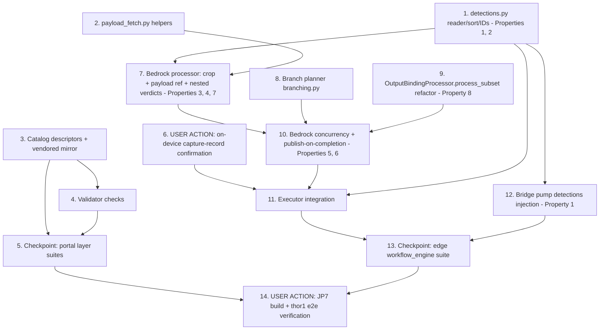

# Implementation Plan: Detection-Guided Bedrock Inspection

## Overview

Work proceeds along two tracks that converge at the executor. The **portal
track** adds the new node parameters to the catalog (mirrored verbatim to
the LocalServer vendored copy) and the three validator checks. The **edge
track** builds the two new foundation modules (`detections.py`,
`payload_fetch.py`), extends the Bedrock processor (crops, payload
references, nested verdicts), adds the branch planner and the
`process_subset` refactor, then lands concurrency and the executor/bridge
integration last.

A design assumption is gated early: **the capture record must land for
`model_inference` runs** (design Risk 1). A USER ACTION task verifies it
on-device before the executor integration; if it fails, the fallback
(marshal sidecar, repo-owned) replaces the reader's data source behind the
same interface without touching any other task.

Per the design posture there are **no compiler changes**, **no proprietary
plugin changes**, and no compiled-document shape changes. Everything is
additive; preservation is pinned by regression tests (Property 7, 8).

## Task Dependency Graph

```json
{
  "waves": [
    { "wave": 1, "tasks": ["1", "2", "3", "6"], "description": "Independent foundations: detections reader/sort/IDs (Properties 1, 2), payload fetch helpers (Property 4 groundwork), catalog descriptors + vendored mirror, and the USER ACTION on-device capture-record confirmation (design Risk 1 gate)." },
    { "wave": 2, "tasks": ["4", "7", "8", "9", "12"], "description": "Consumers of wave 1: validator checks over the new descriptors; Bedrock processor crops/payload-references/nested verdicts (Properties 3, 4, 7); branch planner (Property 8 groundwork); process_subset refactor (Property 8); bridge-pump detections injection (Property 1)." },
    { "wave": 3, "tasks": ["5", "10"], "description": "Portal checkpoint (layer suites), and Bedrock concurrency + publish-on-completion over the planner and process_subset (Properties 5, 6)." },
    { "wave": 4, "tasks": ["11"], "description": "Executor integration: detections merge call site, run_context wiring, branch-binding exclusion from the post-run handler." },
    { "wave": 5, "tasks": ["13"], "description": "Edge checkpoint: the workflow_engine suite passes, including all property tests." },
    { "wave": 6, "tasks": ["14"], "description": "USER ACTION final gate: JP7 component build, deploy to jetson-thor1, end-to-end verification per the builds steering rule." }
  ]
}
```



## Notes

**Test suite invocations**: portal layer suites run as pytest from
`edge-cv-portal/backend/layers/workflow_core/tests`; the edge suites run as
`PYTHONPATH=src/backend:test/backend-test pytest
test/backend-test/workflow_engine/` — scoped to `workflow_engine` because
the broader edge suite has pre-existing environment-dependent failures on
this host.

**Property test conventions**: Python property tests use `hypothesis` with
the suite's registered profile (no hardcoded `max_examples`). Every
property test is tagged
`**Feature: detection-guided-bedrock-inspection, Property {number}:
{property_text}**`. Concurrency tests (Properties 5, 6) use injected fake
invokers with `threading.Event`-controlled completion order — deterministic,
no sleeps-as-synchronization, no network. The R7.1/Property 7 preservation
tests implement the pre-feature oracle by construction (invoke the
pre-change code path shape with no new parameters and byte-compare
requests/metadata), mirroring the aravis-free identity test patterns.

**Detections fixture**: task 1 checks in a real `{capture_id}.jsonl`
fixture captured from jetson-thor1 (the yolo-world blue-plate workflow run
of 2026-08-28), so the reader is tested against the true marshal contract,
not a hand-built imitation.

**Deployment note**: no task here deploys the portal or publishes a
Greengrass component except the explicitly-labelled USER ACTION tasks.
Component builds follow the builds steering rule (one at a time, security
preservation gate pre-checked). This feature touches no
preservation-tracked file, so no baseline rebaselining is expected.

**Boundary notes**: the compiler, `parse_msg`, the `crop` node, the
frame-feed singleton rules, `llm_inference`, and the flat
`is_anomalous`/`confidence` last-writer semantics are deliberately
unchanged. The vendored `workflow_core` mirror byte-identity is enforced by
the existing smoke test.

## Tasks

- [x] 1. Build the detections foundation module (edge)
  - [x] 1.1 Implement `src/backend/workflow_engine/detections.py`
    - `read_detections(output_dir, capture_id)`: parse `{capture_id}.jsonl`, locate the `json_with_base64_encoding` block whose decoded payload carries a top-level `detections` map (same discriminator as `inference_results_utils`); return the raw entries, `None` when no record/block exists, `[]`-equivalent raw when the map is empty; best-effort and contained (malformed record -> None, logged)
    - `build_detection_list(raw, sort_order)`: normalize to `{id, label, confidence, x_min, y_min, x_max, y_max}` (floats, source pixels), sort per Detection_Sort_Order on box centers with the design's tie-breaks, assign `uuid4().hex[:8]` Detection_IDs re-drawn on intra-run collision
    - `resolve_sort_order(graph_document)`: the `model_inference` node's `detection_sort_order` from the registration's `workflow.json` (default `left_to_right`, unknown values -> default, logged)
    - `merge_detections(tag_values, output_dir, capture_id, graph_document, cache)`: builds once, caches on the run state, merges `detections` + `detection_count` without overwriting existing keys
    - _Requirements: 1.1, 1.2, 1.3, 1.4, 1.5, 1.7, 1.8, 1.9_
  - [x] 1.2 Write unit tests over the real thor1 jsonl fixture
    - Record parsing (fixture + hand-mutated variants: no block, empty map, malformed base64/JSON); every sort order incl. tie-breaks; zero-detections -> `[]` + `detection_count: 0`; absent block -> keys absent; never-overwrite semantics
    - _Requirements: 1.1, 1.2, 1.4, 1.5, 1.7, 1.8_
  - [x] 1.3 Write property tests for ID stability and order/ID independence
    - **Feature: detection-guided-bedrock-inspection, Property 1: ID stability within a run**
    - **Validates: Requirements 1.3, 1.10, 2.7**
    - **Feature: detection-guided-bedrock-inspection, Property 2: Order/ID independence**
    - **Validates: Requirements 1.3, 1.4**
    - Hypothesis-generated raw detection maps: building twice from the same cache yields identical entries/IDs; building under different sort orders yields permutations of the same (id, box) pairs — IDs never track position

- [x] 2. Build the payload fetch module (edge)
  - [x] 2.1 Implement `src/backend/workflow_engine/payload_fetch.py`
    - `resolve_payload_path(payload_json, dotted_path)`: dict keys + integer list indices; unresolvable -> typed error naming the path segment
    - `fetch_reference_bytes(value, allowed_prefixes)`: `s3://` via boto3 get_object (streamed, `MAX_REFERENCE_BYTES = 8 MiB` cap), `http(s)://` via urllib with `REFERENCE_FETCH_TIMEOUT_SEC = 10`, `data:` URLs and bare base64 decoded; prefix allow-list on URI fetches; `cv2.imdecode` validation before returning; errors identify the source, never the bytes
    - _Requirements: 3.2, 3.3, 3.4, 3.7, 3.8_
  - [x] 2.2 Write unit tests
    - Dotted-path resolution over nested dict/list payloads; base64 + `data:` URL decode; prefix gating (allowed, denied, empty-permits-all); size cap; timeout wiring (mocked); non-image rejection; error messages carry source not bytes. HTTP cases use an in-process localhost server; S3 uses a stubbed client
    - _Requirements: 3.2, 3.3, 3.4, 3.5, 3.7, 3.8_

- [x] 3. Add the new node parameters to the catalog (portal layer + vendored mirror)
  - [x] 3.1 Extend `MODEL_INFERENCE` and `BEDROCK_INFERENCE` descriptors
    - In `edge-cv-portal/backend/layers/workflow_core/python/workflow_core/catalog/nodes.py` (append parameters; never reorder): `model_inference` gains `detection_sort_order` (enum, default `left_to_right`, the five values); `bedrock_inference` gains `crop_detection_index` (int, optional, `min: 0`), `crop_margin_percent` (int, optional, default 0, `min: 0, max: 100`), `reference_payload_path` (string, optional), `allowed_uri_prefixes` (string, optional, wording mirrored from `custom_python_source`)
    - Descriptions/examples document the Detection_Sort_Order dependence, the dotted payload-path syntax, and that `detection_sort_order` is executor-read (not compiled)
    - _Requirements: 1.4 (descriptor half), 2.1, 2.3, 3.1, 3.4, 6.1, 6.6_
  - [x] 3.2 Write catalog content unit tests
    - New parameters present with the exact types/defaults/constraints; catalog additivity as a prefix-order assertion; descriptions name the payload-path syntax and sort-order values
    - _Requirements: 6.1, 6.4_
  - [x] 3.3 Sync the vendored workflow_core mirror
    - Re-copy changed catalog (and validator after task 4) files to `src/backend/workflow_engine/vendor/workflow_core/`, keeping the mirror byte-identical; the existing byte-identity smoke test enforces it
    - _Requirements: 6.5_

- [x] 4. Add the validator checks (portal layer + vendored mirror)
  - [x] 4.1 Implement the three checks in `workflow_core/validator/checks.py`
    - `CODE_BEDROCK_REFERENCE_CONFLICT` (error): `reference_payload_path` set AND the node's `reference` port fed by any connection
    - `CODE_BEDROCK_CROP_NO_MODEL` (warning): `crop_detection_index` set in a graph with no `model_inference` node
    - `CODE_BEDROCK_PAYLOAD_NO_TRIGGER` (warning): `reference_payload_path` set in a graph with no CATEGORY_TRIGGER node
    - Range constraints (negative index, margin outside 0-100) ride the existing descriptor-constraint mechanism — assert, do not reimplement
    - _Requirements: 3.6, 6.2, 6.3, 6.4_
  - [x] 4.2 Write validator unit tests
    - Each check fires exactly once per offending node with the right severity; a compliant graph (payload path + trigger + model, no fed reference port) produces no findings; both copies stay byte-identical (mirror re-sync via task 3.3)
    - _Requirements: 3.6, 6.2, 6.3, 6.4, 6.5_

- [x] 5. Checkpoint: portal layer suites pass
  - Run the `workflow_core` layer pytest suite; all catalog/validator tests green; vendored-mirror byte-identity smoke test green
  - _Requirements: 6.1, 6.2, 6.3, 6.4, 6.5_

- [x] 6. USER ACTION: confirm capture-record presence on-device (design Risk 1 gate)
  - On jetson-thor1, deploy (or hot-run) a minimal workflow-engine graph containing `model_inference` (yolo-world blue plate) WITHOUT a `capture` node; run it and confirm `{output_dir}/{capture_id}.jsonl` lands with the detections block
  - If it does NOT land: activate the design's fallback — extend `marshal_for_capture_template.py` (repo-owned) to write a detections sidecar JSON keyed by capture id, and point `read_detections` at it (same interface; tasks 7/11/12 unaffected)
  - _Requirements: 1.1, 1.7 (mechanism feasibility)_

- [x] 7. Extend the Bedrock processor: crops, payload references, nested verdicts (edge)
  - [x] 7.1 Thread `run_context` into `BedrockInferenceProcessor`
    - Optional `run_context` (metadata access, output_dir/capture_id, graph document, node-status collector) on `process`/`_run_one`; default `None` keeps every existing caller and test byte-identical
    - _Requirements: 7.1_
  - [x] 7.2 Implement `crop_detection_index` handling in `_run_one`
    - Resolve entry k from the merged Detection_List; out-of-range/absent -> recorded error outcome (naming node, index, count) at `bedrock.{nodeId}.error`, downstream gating identical to a failed condition, run and siblings unaffected; crop via cv2 with `crop_margin_percent` expansion, frame-bounds clamping, defensive captured/source dimension scaling; persist `{capture_id}.crop.{detection_id}.jpg`; send crop as the "Input image" block; record `bedrock.{nodeId}.detection_id`
    - _Requirements: 2.1, 2.2, 2.3, 2.4, 2.5, 2.6, 2.7_
  - [x] 7.3 Implement `reference_payload_path` handling in `_run_one`
    - Resolve via `payload_fetch` against `tag_values["trigger"]["payload_json"]`; fetched/decoded bytes become the "Reference image" block; ANY failure -> recorded error outcome (no single-image fallback); log the resolved source string only
    - _Requirements: 3.1, 3.2, 3.3, 3.4, 3.5, 3.7, 3.8_
  - [x] 7.4 Add nested verdict keys to anomaly-mode results
    - `bedrock.{nodeId}.{is_anomalous, confidence, text[, detection_id]}` merged through the existing nested-`bedrock` mechanism; flat keys unchanged
    - _Requirements: 4.1, 4.2, 4.5_
  - [x] 7.5 Write unit + property tests
    - **Feature: detection-guided-bedrock-inspection, Property 3: Crop containment**
    - **Validates: Requirements 2.2, 2.3**
    - **Feature: detection-guided-bedrock-inspection, Property 4: No-fallback invariant**
    - **Validates: Requirements 3.5**
    - **Feature: detection-guided-bedrock-inspection, Property 7: Additive-only compatibility**
    - **Validates: Requirements 7.1, 7.3**
    - Plus example tests: crop-index error outcomes; payload-reference error outcomes for every failure class; nested merge shape; dotted-key rendering in payload templates and condition evaluation over the nested keys (Requirements 4.3, 4.4); `detection_id` recording
    - _Requirements: 2.2, 2.3, 2.4, 3.5, 4.1, 4.2, 4.3, 4.4, 7.1_

- [x] 8. Implement the branch planner (edge)
  - `src/backend/workflow_engine/branching.py`: `bedrock_branches(document)` — transitive `upstreamNodeIds` closure over `executorBindings`; a binding belongs to a branch iff its closure reaches exactly one `bedrock_inference` node and no `llm_inference` node; BranchPlan carries the bedrock binding + branch-scoped output/gate binding ids
  - Unit tests: single branch, three parallel branches, binding reaching two bedrock nodes (non-branch), llm-downstream exclusion, conditional/filter/metadata bindings inside a branch, empty document
  - _Requirements: 5.1, 5.3, 5.7_

- [x] 9. Refactor `OutputBindingProcessor` with `process_subset` (edge)
  - Extract the `process` body into `process_subset(document, tag_values, binding_ids, ...)`; `process()` delegates with the full binding list — behavior byte-identical (existing tests must pass unmodified)
  - **Feature: detection-guided-bedrock-inspection, Property 8: Non-branch ordering**
  - **Validates: Requirements 5.7**
  - Property test: for arbitrary documents, `process()` and pre-refactor semantics produce identical runner invocation sequences (fake runners recording calls)
  - _Requirements: 5.7_

- [x] 10. Land Bedrock concurrency + publish-on-completion (edge)
  - [x] 10.1 Thread pool + lock-guarded merge in `BedrockInferenceProcessor.process`
    - `ThreadPoolExecutor(max_workers=min(len(bindings), 4))`; per-completion lock-guarded metadata merge; per-branch metadata snapshot -> `OutputBindingProcessor.process_subset` for the branch's binding ids; errored branch skips its outputs, sets node status, siblings proceed; join before return; legacy `BedrockInferenceError` raised after the join
    - _Requirements: 5.2, 5.3, 5.4, 5.5, 5.6_
  - [x] 10.2 Thread-safety hardening
    - Internal lock on `NodeStatusCollector` setters; `duration_sink`/`detail_sink` routed through the merge lock
    - _Requirements: 5.6_
  - [x] 10.3 Write concurrency property + example tests
    - **Feature: detection-guided-bedrock-inspection, Property 5: Branch isolation**
    - **Validates: Requirements 2.4, 3.5, 5.4, 5.5**
    - **Feature: detection-guided-bedrock-inspection, Property 6: Join completeness**
    - **Validates: Requirements 5.6**
    - Event-controlled fake invokers: first-completed branch publishes while another still runs (publish-on-completion); errored branch never publishes, siblings always do; every outcome present in the returned metadata; N branches -> N independent rendered payloads (Requirement 5.1); metadata-node attachments reach branch payloads (Requirement 5.8)
    - _Requirements: 5.1, 5.2, 5.3, 5.4, 5.5, 5.6, 5.8_

- [x] 11. Integrate at the executor (edge)
  - `pipeline_executor.execute`: call `detections.merge_detections` after `_repair_capture_artifacts`, before the Bedrock block; construct and pass `run_context`; exclude branch-scoped binding ids from `_run_post_run_handler` (they ran per-branch); persisted `{capture_id}.json` carries detections + nested verdicts
  - Unit tests over the executor with fake pipeline/processors: merge ordering (detections visible to Bedrock), exclusion correctness (no double publish), persistence content, detection-less runs byte-identical modulo the additive keys
  - _Requirements: 1.1, 1.6, 4.5, 5.6, 5.7, 7.1, 7.3_

- [x] 12. Bridge pump detections injection (edge)
  - `python_bridge.py`: for `custom_python`/`custom_python_preprocess` nodes stream-downstream of `model_inference` (segment element order), poll `read_detections` (2.0 s budget, 50 ms interval) before frame dispatch; inject `metadata["detections"]`/`detection_count` from the shared run-state cache; budget exhaustion -> keys absent + run-log warning; other nodes byte-identical metadata
  - Unit tests with real handler subprocesses (existing bridge test patterns): injection for downstream nodes, absence for non-downstream nodes, budget-exhaustion degraded path, cache identity with the post-pipeline merge (ties into Property 1)
  - _Requirements: 1.10_

- [x] 13. Checkpoint: edge workflow_engine suite passes
  - `PYTHONPATH=src/backend:test/backend-test pytest test/backend-test/workflow_engine/` fully green, including all property tests from tasks 1, 7, 9, 10 and the vendored-mirror smoke test
  - _Requirements: all edge-side_

- [ ] 14. USER ACTION: JP7 component build + thor1 end-to-end verification
  - Follow the builds steering rule (no concurrent builds, preservation guard suite green first, cdk.out moved aside); build `aws.edgeml.dda.LocalServer.arm64JP7`, deploy to jetson-thor1
  - Verify end-to-end: publish an MQTT trigger message with a 3-reference payload (S3 URIs and a base64 entry), confirm the run captures a live Basler frame, yolo-world detects the plates, three Detection_Crops persist with Detection_IDs, three Bedrock verdicts land under nested keys, three Greengrass MQTT messages publish as results complete (observe staggering), errored-branch behavior (payload with a bad reference), and sustained backend health (no crash/restart) afterwards
  - State in the commit/PR what was verified on which device
  - _Requirements: end-to-end validation of Requirements 1-5, 7_
