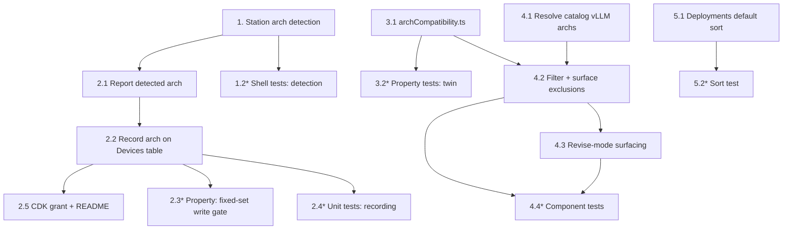

# Implementation Plan: Device Architecture Compatibility

## Overview

The three workstreams are independent and can be built in any order; within each, the pure/testable core comes before its integration. Workstream A (quick-setup arch onboarding) touches `station_install/quick_setup`, the `quick_setup.py` Lambda, and the QuickSetup CDK role. Workstream B (deploy-screen filtering) adds a pure `archCompatibility.ts` twin and wires it into `CreateDeployment.tsx`. Workstream C (deployments list default sort) is a single small change to `Deployments.tsx`.

The backend deployment gates (`check_vllm_deployment_gate`, `check_plugin_deployment_gates`) are NOT modified — workstream B only predicts their verdict client-side, and workstream A only supplies the `Target_Architecture` value they already read.

Python backend uses `pytest` + `hypothesis` with `moto` for AWS mocking; frontend uses TypeScript with `fast-check` for property tests and the existing component-test setup; station-side code is `bash` with the existing quick-setup shell test harness. Every property test is configured for a **minimum of 100 examples** and tagged `**Feature: device-arch-compatibility, Property {N}: {title}**`. Sub-tasks marked with `*` are optional test tasks.

## Tasks

- [x] 1. Station-side architecture detection (Quick Setup)
  - [x] 1.1 Add `detect_arch.sh` and integrate it into `run.sh`
    - Create `station_install/quick_setup/detect_arch.sh` exposing a pure `detect_target_architecture` that prints exactly one of `{x86_64, x86_64_nvidia, arm64_jp4, arm64_jp5, arm64_jp6}` or nothing when undetermined: on aarch64 derive the JetPack major from `/etc/nv_tegra_release` (`R32/R35/R36` → jp4/jp5/jp6) then the `nvidia-l4t-core` dpkg version as fallback; on x86_64 emit `x86_64_nvidia` when an NVIDIA GPU runtime is detectable (`nvidia-smi` / `/proc/driver/nvidia/version` / `lspci`) else `x86_64`; never exit non-zero
    - Source it in `run.sh`, add a non-fatal `▶ STEP: Detect device architecture` step (after Greengrass verification, before the completion report) capturing the value into `DETECTED_ARCH`; a detection error logs a warning and leaves `DETECTED_ARCH` empty (never calls `fail_step`)
    - _Requirements: 1.1, 1.2, 1.3, 1.4, 1.5_

  - [x]* 1.2 Write shell tests for architecture detection
    - Table-driven tests over faked `nv_tegra_release` / dpkg / GPU-probe fixtures asserting each maps to the expected fixed-set value or empty, added to the quick-setup shell test suite
    - **Feature: device-arch-compatibility, Property 8: Detection range**
    - **Validates: Requirements 1.1, 1.4**

- [x] 2. Report and record the Target_Architecture
  - [x] 2.1 Include the detected architecture in the completion report (`run.sh`)
    - Extend `report_status` so the `completed` request body includes `"target_architecture": "<DETECTED_ARCH>"` only when the status is `completed` and `DETECTED_ARCH` is non-empty; leave the `failed` body unchanged
    - _Requirements: 2.1_

  - [x] 2.2 Record the architecture on the Devices table (`quick_setup.py`)
    - Add `DEVICES_TABLE` env read and a `TARGET_ARCHITECTURES` constant identical to `devices.py`; read optional `target_architecture` from the report body; after the existing authenticated conditional `UpdateItem` transitions the registration to `completed`, if the value is in the fixed set perform a best-effort upsert of the `dda-portal-devices` item (key `device_id = device_name`, set `target_architecture`, `usecase_id`, `updated_at`, `updated_by="quick-setup"`) and record a `record_target_architecture` audit event; ignore out-of-set values; swallow Devices-table failures so completion still returns 200; leave the registration transition and `devices.py` untouched
    - _Requirements: 2.2, 2.3, 2.4, 2.5, 2.6, 2.7_

  - [x]* 2.3 Write property test for the fixed-set write gate
    - **Feature: device-arch-compatibility, Property 7: Fixed-set write gate**
    - **Validates: Requirements 2.2, 2.3, 2.4**

  - [x]* 2.4 Write unit tests for architecture recording in `report_status`
    - Cover: valid arch → Devices `UpdateItem` + audit; invalid arch → no write, still completed; no arch → no write, still completed; Devices-table failure → still 200; unauthenticated report → no write
    - **Feature: device-arch-compatibility, Property 7: Fixed-set write gate**
    - **Validates: Requirements 2.3, 2.4, 2.5, 2.6**

  - [x] 2.5 Grant the QuickSetup Lambda access to the Devices table (`compute-stack.ts`) and document it
    - Add `DEVICES_TABLE` to the QuickSetup handler environment and grant its role write access to the Devices table (`props.devicesTable.grantWriteData(quickSetupRole)` or an `UpdateItem`-scoped grant); document the new permission in `station_install/quick_setup/README.md`
    - _Requirements: 2.2_

- [x] 3. Shared architecture-compatibility module (deploy screen)
  - [x] 3.1 Implement `archCompatibility.ts`
    - Create `edge-cv-portal/frontend/src/pages/deployments/archCompatibility.ts` (pure, UI-free) with `classifyGatedComponent(name) → 'vllm' | 'plugin' | null` (LLM-bearing workflow components are not client-classifiable and return null), `componentSupportedArchs(component, vllmArchs) → string[]` (plugin: listing `supported_architectures`; vLLM: resolved set by component name; unresolvable → `[]`), `isArchCompatible(deviceArch, supported)` (exact-name membership, null/empty fail closed), `isCompatibleWithAllDevices(supported, archs)`, and `describeArchIncompatibility(...)` reusing the existing `describeVllmArchEntry` / `describeArchUnsupported` phrasing
    - _Requirements: 3.1, 3.2, 5.1, 5.2, 5.3_

  - [x]* 3.2 Write fast-check property tests for `archCompatibility.ts`
    - Assert fail-closed on null arch and empty supported, exact-name membership, all-devices conjunction, non-gated exemption, and twin-equivalence with `evaluate_vllm_arch_gate` semantics
    - **Feature: device-arch-compatibility, Property 1: Fail-closed on null device arch**
    - **Feature: device-arch-compatibility, Property 2: Fail-closed on empty supported set**
    - **Feature: device-arch-compatibility, Property 3: Exact-name membership, no fallback**
    - **Feature: device-arch-compatibility, Property 4: All-devices conjunction**
    - **Feature: device-arch-compatibility, Property 5: Twin equivalence with the backend gate**
    - **Feature: device-arch-compatibility, Property 6: Non-gated exemption**
    - **Validates: Requirements 3.2, 3.6, 5.1, 5.2, 5.3, 5.4**

- [x] 4. Deploy-screen gated-component filtering (`CreateDeployment.tsx`)
  - [x] 4.1 Resolve vLLM supported sets for the catalog
    - Broaden the existing `vllmComponentArchs` resolution effect to also resolve catalog `model-vllm-*` components (from `allPrivateComponents` + `allPublicComponents`), keyed by component name and deduped against already-resolved entries, so the filter can evaluate not-yet-selected vLLM components; still-resolving components are not hidden until resolved, unresolvable records resolve to `[]`
    - _Requirements: 5.2_

  - [x] 4.2 Filter incompatible gated components and surface the exclusions
    - Compute selected devices' `target_architecture` map and the set of selected devices with no recorded arch; extend the partition `useMemo` so gated components (vLLM/plugin) incompatible with all selected device archs are excluded from the addable options and collected into an `incompatibleGatedComponents` list with a reason; keep non-gated components on their existing behavior; skip gated-arch filtering when no device is selected or the target is a thing group; render an "Incompatible with the selected device(s)" `ExpandableSection` with per-component reasons and a warning `Alert` naming any selected device with no recorded architecture
    - _Requirements: 3.1, 3.2, 3.3, 3.4, 3.5, 3.6, 3.7, 3.8, 5.4_

  - [x] 4.3 Surface now-incompatible pre-loaded components in revise mode
    - When revise mode pre-loads existing components, flag any pre-loaded gated component that is arch-incompatible with the target device's recorded architecture with a warning indicator and the same reason detail, without removing it from the pre-loaded set or blocking removal/submission
    - _Requirements: 4.1, 4.2, 4.3_

  - [x]* 4.4 Write component tests for the filter and revise surfacing
    - Cover: incompatible gated component excluded from options and listed with a reason; null-arch device → warning alert and gated components hidden; non-gated component never hidden by arch; no-device / group target → no gated filtering; revise mode surfaces a now-incompatible pre-loaded component without dropping it
    - **Feature: device-arch-compatibility, Property 6: Non-gated exemption**
    - **Validates: Requirements 3.3, 3.4, 3.5, 3.6, 4.1, 4.3**

- [x] 5. Deployments list default sort (`Deployments.tsx`)
  - [x] 5.1 Default the list to newest-first by created date
    - Pass `useTableSort` a default of `sortingColumn: { sortingField: 'creation_timestamp' }` with `sortingDescending: true`; give the `created` column a `sortingComparator` that orders by parsed timestamp with a deterministic `deployment_id` tie-break and places unparseable/absent timestamps last under the descending default; ensure a header click still overrides the default
    - _Requirements: 6.1, 6.2, 6.3, 6.4_

  - [x]* 5.2 Write a test for the default deployments sort
    - Assert default render is newest-first with a deterministic tie-break, null-timestamp rows sort last and are not dropped, and a header click overrides the default
    - **Feature: device-arch-compatibility, Property 9: Sort placement of missing dates**
    - **Validates: Requirements 6.1, 6.3**

## Task Dependency Graph



Workstreams A (tasks 1-2.5), B (tasks 3-4.4), and C (tasks 5.x) are mutually independent and may proceed in parallel.

```json
{
  "waves": [
    { "wave": 1, "tasks": ["1.1", "3.1", "4.1", "5.1"] },
    { "wave": 2, "tasks": ["1.2", "2.1", "3.2", "4.2", "5.2"] },
    { "wave": 3, "tasks": ["2.2", "4.3"] },
    { "wave": 4, "tasks": ["2.3", "2.4", "2.5", "4.4"] }
  ]
}
```

## Notes

- The backend deployment gates (`check_vllm_deployment_gate`, `check_plugin_deployment_gates`, `evaluate_vllm_arch_gate`, `evaluate_plugin_arch_gate`) are NOT modified by this feature; workstream B is a client-side twin only and workstream A only writes the `Target_Architecture` value they read.
- Task 2.5 introduces the single net-new IAM permission (QuickSetup Lambda write to `dda-portal-devices`), created via CDK and documented in the README, consistent with the "keep contained / CDK-managed roles" constraint.
- Workstream A depends on the existing station-quick-setup completion-report path and its `report_secret` authentication; it adds no new endpoint.
- `*` sub-tasks are optional property/unit/component tests (min 100 examples for property tests) and are not required for core delivery.
