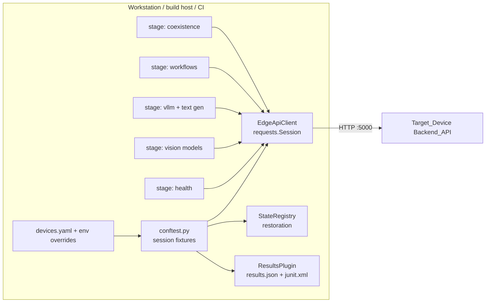

# Design Document

## Overview

The Edge_Test_Harness is a pytest package under `test/on-hardware/harness/` that validates a live edge device through its Backend_API (default port 5000). It is a pure HTTP client of the device — the endpoints it drives already exist (`/system-health`, `/feature-configurations`, `/text-generation/*`, `/workflows/*`, `/local-auth/*`); this feature adds no device-side code. One command runs the suite against a device named in a config file, stages self-select by device profile, teardown restores device state, and every run writes a comparable results bundle.

Design tenets, mapped from the requirements:

- **Device-only surface** (Req 8.3): the harness imports no boto3 and holds no cloud credentials. Everything happens over the device base URL the operator supplies (LAN address or a tunnel-forwarded localhost port).
- **Fail fast, skip honestly** (Reqs 1.3, 2.1, 2.4): an unreachable device aborts the session in setup; a missing capability skips with a recorded reason; a *declared-but-absent* capability fails loudly so profile misconfiguration cannot silently reduce coverage.
- **Leave no footprint** (Reqs 4.3, 6.4, 8.3): a state registry records every start the harness performs and reverses them in session teardown, on success and failure alike.
- **Comparable artifacts** (Req 8.1): a results plugin writes `results.json` + JUnit XML with the device identity and per-stage outcomes, so runs diff cleanly across LocalServer versions.

## Architecture



Package layout:

```
test/on-hardware/harness/
├── README.md                  # invocation, config format, tunnel recipe
├── devices.yaml.example       # sample Harness_Configuration
├── conftest.py                # session fixtures, capability gating, fail-fast
├── pytest.ini                 # markers, default addopts (junitxml)
├── harnesslib/
│   ├── __init__.py
│   ├── config.py              # HarnessConfig / DeviceProfile load + validate
│   ├── client.py              # EdgeApiClient (auth, polling, SSE, diagnostics)
│   ├── restoration.py         # StateRegistry
│   ├── results.py             # ResultsPlugin (pytest hooks)
│   └── sse.py                 # minimal SSE line-protocol parser
├── stages/
│   ├── test_00_health.py
│   ├── test_10_vision_models.py
│   ├── test_20_vllm_textgen.py
│   ├── test_30_workflows.py
│   └── test_40_coexistence.py
└── selftest/                  # harness unit tests + fake-device integration
    ├── fake_device.py         # in-process FastAPI imitation of the Backend_API
    └── test_*.py
```

Dependencies: `pytest`, `requests`, `pyyaml` — all already present in the repo's test tooling. No new pinned packages.

## Components and Interfaces

### Harness_Configuration (`harnesslib/config.py`)

`devices.yaml` declares named targets; `DDA_HARNESS_DEVICE` selects one, and any field is overridable via `DDA_HARNESS_*` environment variables (Req 1.1, 1.2):

```yaml
devices:
  jp6-orinagx:
    base_url: http://localhost:5000       # tunnel-forwarded or LAN
    profile:
      architecture: arm64_jp6
      capabilities: [vllm, onnx_models, workflows]   # no dlr_models on JP6
    credentials: env:DDA_HARNESS_TOKEN    # or file:~/.dda/jp6-token; omit if auth off
    expected:
      vision_models: [model-rf-detr-seg-nano-jetson-xavier-jp6, model-yolo-test-jetson-xavier-jp6]
      vllm_models: [opt125m-smoke]
      workflows: []                        # empty = enumerate-only, no presence assertion
    timeouts:
      model_ready_s: 300
      vllm_ready_s: 900        # engine warmup + possible HF download
      generate_s: 120
      workflow_output_s: 180
      run_budget_s: 2400
```

Dataclasses: `DeviceProfile(architecture, capabilities)`, `DeviceTarget(base_url, profile, credentials_ref, expected, timeouts)`. `load_config()` merges file + env, validates architecture against the known set, and rejects unknown capability names (fail closed, mirroring the portal's engine-config validation style).

### EdgeApiClient (`harnesslib/client.py`)

A thin typed wrapper over `requests.Session` — one method per endpoint the stages use:

- `system_health()` → GET `/system-health`; `component_status()` → GET `/dda-component-status` (device identity: LocalServer version for the Results_Bundle, Req 3.2).
- `auth_status()` / `login(credentials)` → `/local-auth/status`, POST `/local-auth/login`; on `auth_enabled`, the session carries the bearer token. Tokens come from the `credentials` reference (`env:` or `file:` scheme) and are never logged; the diagnostics formatter redacts the `Authorization` header (Req 3.3).
- `feature_configurations()` → GET `/feature-configurations` (returns vision models AND `VllmModel`-type entries with status); `start_model(name)` / `stop_model(name)` → GET `/feature-configurations/models/{name}/start|stop`.
- `wait_for_model_state(name, target='READY', timeout)` — poll loop with backoff; returns terminal state; surfaces device-reported failure reasons verbatim (Reqs 4.2, 5.1).
- `textgen_models()` → GET `/text-generation/models`; `generate(model, prompt, params)` → POST `/text-generation/{model}/generate`; `generate_stream(...)` → POST `/text-generation/{model}/generate-stream`, parsed by `harnesslib/sse.py` (iter_lines-based `data:` event parser; asserts incremental chunks then clean termination, Req 5.3).
- `workflows()` / `run_workflow(id)` / `workflow_images(id)` / `capture_task(id)` → the `/workflows*` router (Req 6).
- Every request applies a per-call timeout derived from stage timeouts; every non-2xx captures method, path, status, and a size-bounded (8 KB) response body into a `DeviceApiError` used for failure diagnostics (Req 8.2).

### Capability gating (`conftest.py`)

- Stages carry `@pytest.mark.capability("vllm")` (etc.). A `pytest_collection_modifyitems` hook compares markers against the selected device's profile and applies `pytest.mark.skip(reason="capability 'vllm' not granted by device profile jp6-orinagx")` (Req 2.1) — reasons flow into JUnit XML and results.json.
- Declared-but-absent detection (Req 2.4): each capability-gated stage begins with a fixture that probes the observed surface (`vllm` → `/text-generation/models` answers and the feature list contains `VllmModel` entries; `workflows` → `/workflows` answers). A granted-but-absent probe raises `CapabilityMismatchError`, failing the stage with a message that names the profile claim vs. the device observation — distinct from ordinary assertion failures.
- Session-start fail-fast (Req 1.3): a `session`-scoped autouse fixture performs one `system_health()` call; on connection error it calls `pytest.exit(f"Target device unreachable at {base_url}: {err}", returncode=2)` so the run dies once with one diagnostic.
- Stage ordering: health is enforced first via module naming (`test_00_*`) and a session fixture dependency — later stages depend on the `device_identity` fixture, which the health stage populates (Req 3.1).

### StateRegistry (`harnesslib/restoration.py`)

Session-scoped fixture recording `(kind, name, pre_state)` for every model/workflow the harness starts. Teardown iterates in reverse and issues stops only for entries whose pre-state was not-running (Reqs 4.3, 6.4, 8.3). Restoration errors are logged as warnings and reported in results.json (`restoration_warnings`) rather than masking the test outcome; the registry is exercised on failure paths via `yield`-fixture teardown, which pytest runs regardless of test result.

### ResultsPlugin (`harnesslib/results.py`)

A pytest plugin (registered in `conftest.py`) hooking `pytest_runtest_logreport` and `pytest_sessionfinish`:

- Groups outcomes by stage (module) into `results.json`: `{device, profile, local_server_version, started_at, duration_s, stages: {name: {passed, failed, skipped, skip_reasons, failures: [...]}}, metrics: {...}, restoration_warnings: [...]}` (Reqs 8.1, 3.2).
- Metrics channel: stages push informational measurements (generate latency, token counts) through a `record_metric(name, value)` fixture; recorded without thresholds (Req 5.4).
- Output directory: `--harness-output-dir` (default `harness-results/<device>-<UTC timestamp>/`), containing `results.json`, `junit.xml` (via addopts), and `failures/` with the bounded request/response captures.
- Overall budget (Req 8.4): `pytest-timeout`-free implementation — the session fixture arms a monotonic deadline from `run_budget_s`; a `pytest_runtest_setup` hook fails remaining tests with "run budget exceeded" once past it, so a hung device degrades to a bounded, explained run.

### Stage designs

- **test_00_health**: `system_health` 200; `component_status` parsed for LocalServer version; auth handshake when `auth_enabled` (fail fast on bad credentials).
- **test_10_vision_models**: enumerate; assert `expected.vision_models` present (Req 4.1); for each not-running expected model → start, `wait_for_model_state(READY, model_ready_s)`, register for restoration (Req 4.2, 4.3). DLR-backed expectations only asserted under `dlr_models`.
- **test_20_vllm_textgen** (`capability: vllm`): expected VLLM_Models READY within `vllm_ready_s` (start if needed, registered); non-streaming generate → 200, non-empty text (Req 5.2); streaming generate → ≥1 incremental chunk then termination (Req 5.3); latency/token metrics recorded (Req 5.4).
- **test_30_workflows** (`capability: workflows`): enumerate; assert configured expectations (Req 6.1); `run_workflow` on one expected workflow → poll `workflow_images`/`capture_task` for output within `workflow_output_s` (Req 6.2); when the workflow definition carries an `llm_inference` node and `vllm` is granted, assert generated content in output metadata (Req 6.3).
- **test_40_coexistence** (`capability: vllm`): with one vision model and one VLLM_Model READY (reusing registry-tracked state), issue a generate; re-poll both models' states after completion; fail with both device-reported states on any departure from READY (Req 7).

## Data Models

- `DeviceProfile { architecture: str, capabilities: set[str] }` — known capabilities: `vllm`, `dlr_models`, `onnx_models`, `workflows`, `auth_enabled`.
- `DeviceTarget { name, base_url, profile, credentials_ref, expected: {vision_models, vllm_models, workflows}, timeouts }`.
- `DeviceApiError { method, path, status, body_excerpt (≤8 KB), elapsed_s }` — the diagnostic payload attached to failures.
- `results.json` schema as sketched above; `schema_version: 1` field included for future evolution.

## Error Handling

| Condition | Behavior |
| --- | --- |
| Device unreachable at session start | `pytest.exit` rc=2, single diagnostic naming URL + error (Req 1.3) |
| Auth required, login fails | Health stage fails fast; credential values never logged (Req 3.3) |
| Capability declared, surface absent | `CapabilityMismatchError` — stage failure, distinct message (Req 2.4) |
| Model FAILED / timeout while waiting for READY | Stage failure carrying device-reported reason verbatim (Reqs 4.2, 5.1) |
| Non-2xx API response in a test | `DeviceApiError` with bounded body into `failures/` (Req 8.2) |
| Restoration stop fails in teardown | Warning logged + `restoration_warnings` in results.json; test outcomes unchanged |
| Run budget exceeded | Remaining tests failed with budget message; session ends bounded (Req 8.4) |

## Testing Strategy

The harness itself is on-hardware tooling, so its correctness is guarded by host-side self-tests that run in the ordinary repo test suite (no device needed):

- **Unit**: config loading/merging/validation (unknown capability rejected, env overrides win), SSE parser (chunking, `data:` framing, termination), StateRegistry ordering and failure-path teardown, diagnostics redaction (Authorization header never serialized), results.json schema.
- **Fake-device integration** (`selftest/fake_device.py`): an in-process FastAPI app imitating the Backend_API surface the harness touches — feature-configurations with scriptable state transitions (LOADING→READY, FAILED-with-reason), text-generation with canned streaming, workflows with output metadata, optional auth. Self-tests run the real stages against it via `pytest`-in-`pytest` (pytester fixture) to assert: skip-with-reason on missing capability, CapabilityMismatchError on declared-but-absent, restoration on failure paths, fail-fast on unreachable target, results bundle contents.
- **On-hardware**: the harness run against a real device is the deliverable; the README documents the smoke recipe against jp6-orinagx (tunnel + `DDA_HARNESS_DEVICE=jp6-orinagx pytest test/on-hardware/harness`) replacing the corresponding stages of `jp6_vllm_validation.md`.

## Requirements Traceability

| Requirement | Design element |
| --- | --- |
| 1.1–1.5 | Harness_Configuration, session fail-fast, pytest markers, non-interactive defaults |
| 2.1–2.4 | Capability gating hook, capability probes, CapabilityMismatchError |
| 3.1–3.3 | test_00_health, device_identity fixture, auth handling + redaction |
| 4.1–4.3 | test_10_vision_models, wait_for_model_state, StateRegistry |
| 5.1–5.4 | test_20_vllm_textgen, SSE parser, metrics channel |
| 6.1–6.4 | test_30_workflows, workflow output polling, StateRegistry |
| 7.1–7.2 | test_40_coexistence |
| 8.1–8.4 | ResultsPlugin, DeviceApiError capture, StateRegistry, run budget deadline |
