# Design Document: Edge VLM Image Inference

## Overview

The `llm_inference` node is text-only end to end even though it declares a VideoFrames input port. This design adds the image path by mirroring the proven `bedrock_inference` frame-capture mechanism at four touch points, in data-flow order:

1. **Compiler** (`workflow_core/compiler/compiler.py`, both copies): extend the existing capture plan so `llm_inference` bindings get `capturePaths` and their feeder branches get synthetic frame-capture sinks — without making the node opaque (frames keep flowing to downstream elements as today).
2. **Processor** (`workflow_engine/output_bindings.py` `LlmInferenceProcessor`): read the captured JPEG from `capturePaths["in"]` (`{work_dir}` resolved), base64-encode it, and pass it to the invoker; `pipeline_executor.py` starts passing `work_dir` to the processor.
3. **Text_Generation_API** (`endpoints/text_generation.py`): accept an optional base64 `image` field, validate/decode it, and forward decoded bytes to the runtime manager.
4. **vLLM runtime** (`vllm_runtime/manager.py`, `server.py`): when image bytes arrive for a multimodal-capable model, build a vLLM prompt dict `{"prompt": <chat-templated text with image placeholders>, "multi_modal_data": {"image": <PIL image>}}`; otherwise generate text-only exactly as today. The Triton generate-extension schema gains the same optional field.

### Key findings from investigation (verified)

- Synthetic frame-capture sink chains and `capturePaths` are emitted only for `BINDING_BEDROCK_INFERENCE` (compiler `_bedrock_capture_plan`, and the `if mappings[node_id].executor_binding == BINDING_BEDROCK_INFERENCE: entry["capturePaths"] = ...` branch around line 403). The two compiler copies are byte-identical today (verified with `diff`).
- `LlmInferenceProcessor._run_one` calls the invoker with `(modelName, prompt, parameters)` only; `_default_llm_invoker` POSTs `{"prompt", max_tokens, temperature, top_p}` to `TEXT_GENERATION_URL` and handles 409-loading polling. `LlmInferenceProcessor.process(document, tag_values)` does not receive `work_dir` (Bedrock's does).
- `BedrockInferenceProcessor._run_one` is the reference: required `in` port (missing/unreadable ⇒ node error), optional `reference` port, `{work_dir}` substitution.
- `normalize_generation_request` validates only prompt/max_tokens/temperature/top_p; `generate_text` forwards prompt-only to `runtime.generate(model_name, prompt, sampling_params)`.
- `VllmRuntimeManager._request` passes a bare prompt string to `engine.generate(...)`; vLLM's `AsyncLLMEngine.generate` also accepts a prompt dict with `multi_modal_data`, which is the standard multimodal entry point.
- `vllm_runtime/server.py` is a Triton generate-extension server (`GenerateRequest = {text_input, parameters}`), not an OpenAI chat server — no `image_url` content parts exist; its schema must be extended directly.
- `pipeline_executor._persist_node_frames` already tolerates and persists `capturePaths` on `llm_inference` bindings (deployed-workflow-run-observability), so frame persistence for results views lights up automatically once the compiler emits the paths.

### Key design decisions

- **Non-opaque capture (unlike Bedrock).** Bedrock nodes are opaque: frames terminate at their capture sinks. `llm_inference` nodes are collapsed executor-level pass-throughs today — a deployed `folder_source → llm_inference → capture` workflow relies on frames flowing through to the downstream capture sink. The capture plan already supports feeders that both continue downstream and sink to a capture branch (`_build_segments` fan-out with `feeder_captures`), so `llm_inference` nodes join the capture plan without joining the `opaque` set. Stream topology for existing workflows is unchanged.
- **Fed-port semantics: attach or fail.** When `capturePaths["in"]` names a path (the port is fed by a video source), the image is attached; an unreadable frame is a contained node error, not a silent text-only fallback — silently answering without the image is exactly the bug being fixed. When `capturePaths` is absent (old packages) or `in` is `None` (unfed port), the request is text-only and byte-identical to today.
- **Graceful text-only-model degradation at the runtime.** A text-only model receiving an image generates text-only with a logged warning and reports `image_used: false` — so an existing workflow that wires a video source into `llm_inference` with a text-only model keeps completing as it does today instead of starting to fail after upgrade.
- **Multimodal capability detected from model config**, not operator settings: the manager inspects the loaded engine's model config / hf config architectures (e.g. `Qwen2VLForConditionalGeneration`, `Qwen2_5_VLForConditionalGeneration`) and whether the tokenizer's chat template handles image content. No new `model.json` fields, no portal changes.
- **Base64 JPEG over the local HTTP contract.** The frames are already JPEG on disk (capture sinks `jpegenc`); base64-in-JSON keeps both HTTP surfaces (Text_Generation_API and Triton generate extension) schema-compatible and testable without multipart handling.

## Architecture

```mermaid
flowchart LR
    subgraph Portal["Portal / workflow_core compiler"]
        C[compile] -->|capture plan now includes llm_inference| D[compiled document]
        D -->|"llm_inference binding + capturePaths {in: {work_dir}/vlm_frame_X.jpg}"| P
        D -->|"feeder branch + tee: videoconvert-jpegenc-multifilesink"| P
    end
    subgraph Device["LocalServer (JP6)"]
        P[Pipeline_Executor] -->|"pipeline run writes {work_dir}/vlm_frame_X.jpg"| F[(captured JPEG)]
        P -->|"process(document, tag_values, work_dir)"| L[LlmInferenceProcessor]
        F --> L
        L -->|"POST /text-generation/{m}/generate {prompt, image: b64, params}"| T[Text_Generation_API]
        T -->|"generate(model, prompt, sampling, image=bytes)"| M[VllmRuntimeManager]
        M -->|"{prompt: chat-templated, multi_modal_data: {image: PIL}}"| E[vLLM engine / Qwen VL]
        S[Triton_Generate_Server] -->|"image field (parity)"| M
    end
```



The post-run sequencing is unchanged: pipeline run → frames persisted by capture sinks → Bedrock processor → **LLM processor (now with `work_dir`)** → output bindings. Only the LLM processor's inputs and the downstream request contents change.

## Components and Interfaces

### 1. Compiler — capture plan generalization (`workflow_core/compiler/compiler.py`, both copies)

Generalize the Bedrock-only capture plan to "frame-consuming executor bindings":

- Add `BINDING_LLM_INFERENCE = "llm_inference"` beside `BINDING_BEDROCK_INFERENCE` and define `FRAME_CAPTURE_BINDINGS = (BINDING_BEDROCK_INFERENCE, BINDING_LLM_INFERENCE)`.
- Collect `llm_capture_node_ids` alongside `bedrock_node_ids` and pass the union to `_bedrock_capture_plan` (renamed conceptually to a frame-capture plan; the function already works per input port off the node's descriptor, so `llm_inference`'s single `in` port needs no special casing). Capture file names for llm nodes use a distinct prefix (`{work_dir}/vlm_frame_<feeder>.jpg`) only if feeder-sharing rules make that free; otherwise reuse the existing `bedrock_frame_` prefix — the path is an opaque contract between compiler and executor, and **sharing one file per feeder across both binding kinds is required** (Requirement 1.3), so the existing single `path_for(feeder)` map is kept as-is (one prefix).
- **Opaque set unchanged**: only Bedrock nodes enter `opaque`. `_frame_feeders` for an llm node's `in` port looks upstream through executor-level nodes exactly as for Bedrock.
- Emit `entry["capturePaths"] = capture_paths.get(node_id, {})` for `llm_inference` bindings in the executor-bindings loop, mirroring the Bedrock branch.
- `_build_segments` needs no change: `feeder_captures` already produces a tee'd capture branch when the feeder also has downstream continuation.
- After editing the canonical layer copy, copy it verbatim to `src/backend/workflow_engine/vendor/workflow_core/compiler/compiler.py` (the repo's established re-vendoring step; the two copies must stay byte-identical — Requirement 1.6).

Simulation (`sim_llm_inference`) is untouched: the sim stub is a different binding and never reaches the capture plan.

### 2. Processor — frame attachment (`src/backend/workflow_engine/output_bindings.py`)

`LlmInferenceProcessor`:

- `process(self, document, tag_values, work_dir=None)` — new optional parameter, threaded to `_run_one`. Keeping it optional preserves every existing test call site.
- `_run_one(binding, metadata, work_dir)`:
  - After prompt rendering (unchanged), resolve the image: `capture_paths = binding.get("capturePaths") or {}`; `path = capture_paths.get("in")`.
    - `path` is `None`/absent → `image_b64 = None` (text-only, byte-identical request — Requirements 2.2, 6.1).
    - `path` set → substitute `{work_dir}`, read bytes, base64-encode. `OSError` → return `{"error": "could not read the captured 'in' frame from <path>: <err>"}` **without invoking** (Requirement 2.3) — contained per the existing convention (recorded, never raised).
  - Invoker call becomes `self._invoker(model_name, prompt, parameters, image_b64)`.
- `_default_llm_invoker(model_name, prompt, parameters, image_b64=None)`: when `image_b64` is not `None`, add `"image": image_b64` to the POST body. The 409-loading polling loop, timeout, and error shape are unchanged (Requirement 6.4). Optional parameter keeps injected test invokers working, but all call sites pass it positionally.

`pipeline_executor.py` line ~1604: `self._llm_processor.process(document, tag_values)` → `self._llm_processor.process(document, tag_values, work_dir)` (Requirement 2.4). `_needs_work_dir` already scans all bindings' `capturePaths`, so the work dir is created for llm-only documents automatically.

### 3. Text_Generation_API — optional image field (`src/backend/endpoints/text_generation.py`)

- `normalize_generation_request` gains image validation (pure, property-testable):
  - `image` absent → normalized output identical to today (Requirements 3.3, 6.2).
  - `image` present: must be a `str`, base64-decodable (`base64.b64decode(value, validate=True)`), decoding to `1..MAX_IMAGE_BYTES` bytes. Failures append a finding `{"field": "image", "reason": ...}` (Requirements 3.4, 3.5).
  - Valid → `effective["image_bytes"] = decoded` (decoded once, at the validation boundary).
- `MAX_IMAGE_BYTES` default 16 MiB, env-overridable via `TEXT_GEN_MAX_IMAGE_BYTES` (same pattern as `TEXT_GEN_RETRY_LIMIT`).
- `generate_text` and `generate_text_stream`: pass `image=effective.get("image_bytes")` to `runtime.generate(...)` / `runtime.generate_stream(...)` only when present (keyword arg, so fakes without the parameter keep working for text-only tests).
- Non-streaming response gains `"image_used": bool` when the request carried an image (Requirement 3.6), sourced from the manager (below).

### 4. vLLM runtime — multimodal generation (`src/backend/vllm_runtime/manager.py`)

- `generate(model_name, prompt, sampling_params=None, image=None)` and `generate_stream(..., image=None)`; `_request` gains `image`.
- New helpers:
  - `_is_multimodal(model_name) -> bool`: inspect the engine's model config (`engine.engine.model_config.hf_config.architectures` or the vLLM `ModelConfig.is_multimodal_model` flag where available); cached per loaded model. Covers `Qwen2VLForConditionalGeneration` / `Qwen2_5_VLForConditionalGeneration` at minimum (Requirements 4.2, 4.5).
  - `_build_multimodal_prompt(model_name, prompt, image_bytes) -> dict`: decode JPEG bytes to a PIL image (`PIL.Image.open(io.BytesIO(...))`; failure → `GenerationError` naming the image decode, engine never invoked — Requirement 4.7); apply the model tokenizer's chat template to `[{"role": "user", "content": [{"type": "image"}, {"type": "text", "text": prompt}]}]` with `add_generation_prompt=True` to produce text containing the model's image placeholder tokens; return `{"prompt": templated_text, "multi_modal_data": {"image": pil_image}}`. If the tokenizer has no usable chat template, fall back to the documented Qwen VL literal form (`<|im_start|>user\n<|vision_start|><|image_pad|><|vision_end|>{prompt}<|im_end|>\n<|im_start|>assistant\n`).
  - PIL is available transitively with the vLLM wheel; imports stay lazy inside the multimodal path so the module keeps importing everywhere.
- `_request` behavior:
  - `image is None` → pass the bare prompt string exactly as today (Requirements 4.4, 6.3).
  - `image` set and model multimodal → pass the prompt dict (Requirement 4.1).
  - `image` set and model not multimodal → log a warning, pass the bare prompt string (Requirement 4.3).
- Result reporting: `generate` returns `(text, image_used)` — **no**; changing the return type breaks Text_Generation_API and server call sites and their tests. Instead the manager exposes `image_supported(model_name) -> bool`; `generate`/`generate_stream` keep returning text. Text_Generation_API computes `image_used = image is not None and runtime.image_supported(model_name)` for the response field. This keeps every existing call site byte-compatible.
- `server.py`: `GenerateRequest` gains `image: Optional[str] = None`; both generate endpoints base64-decode it (422 via FastAPI validation / a small explicit check) and pass `image=` through to the manager (Requirement 4.8).

## Data Models

### Compiled LLM_Inference_Binding (per-arch pipeline document)

```json
{
  "nodeId": "llm1",
  "binding": "llm_inference",
  "parameters": {"modelName": "qwen2-vl-2b", "prompt_template": "Describe the part.", "max_tokens": 256},
  "upstreamNodeIds": ["folder1"],
  "downstreamNodeIds": ["capture1", "mqtt1"],
  "capturePaths": {"in": "{work_dir}/bedrock_frame_folder1.jpg"}
}
```

`capturePaths` values: a `{work_dir}`-rooted path when the port is fed, `None` when unfed, and the whole key absent in pre-feature packages (all three shapes are handled by the processor).

### Text_Generation_API generate request (extended)

```json
{
  "prompt": "Describe the part.",
  "max_tokens": 256,
  "temperature": 0.7,
  "top_p": 1.0,
  "image": "<base64 JPEG, optional>"
}
```

Response (image requests): `{"model_name": "...", "generated_text": "...", "image_used": true}`. Text-only requests/responses are byte-identical to today.

### Triton generate-extension request (extended)

```json
{"text_input": "...", "parameters": {"max_tokens": 256}, "image": "<base64 JPEG, optional>"}
```

### vLLM engine prompt (multimodal)

```python
{"prompt": "<chat-templated text with image placeholder tokens>",
 "multi_modal_data": {"image": <PIL.Image.Image>}}
```

## Correctness Properties

*A property is a characteristic or behavior that should hold true across all valid executions of a system — essentially, a formal statement about what the system should do. Properties serve as the bridge between human-readable specifications and machine-verifiable correctness guarantees.*

### Property 1: Fed ports get capture paths, unfed ports get None

*For any* valid workflow definition containing `llm_inference` nodes, compiling for a vLLM-capable architecture SHALL emit `capturePaths` on every `llm_inference` binding such that the `in` entry is a `{work_dir}`-rooted path if and only if the node's `in` port is (transitively) fed by a GStreamer video source, and `None` otherwise; and for every emitted path some segment terminates a feeder branch with a frame-capture sink chain (`videoconvert → jpegenc → multifilesink`) whose `multifilesink` location equals that path.

**Validates: Requirements 1.1, 1.2**

### Property 2: Feeder capture files are shared, one sink per feeder

*For any* valid workflow definition where one video source feeds input ports of multiple `llm_inference` and/or `bedrock_inference` nodes, the compiled document SHALL contain exactly one capture sink chain for that feeder, and every consuming binding's `capturePaths` entry for the fed port SHALL reference that feeder's single capture file path.

**Validates: Requirements 1.3**

### Property 3: Compilation identity for llm-free workflows

*For any* valid workflow definition containing no `llm_inference` node, the compiled per-architecture pipeline documents SHALL be identical with and without this feature's compiler change.

**Validates: Requirements 1.5**

### Property 4: Stream topology preservation for llm workflows

*For any* valid workflow definition containing `llm_inference` nodes, the compiled document's segments restricted to non-capture elements (i.e. with synthetic capture sink chains for llm feeders removed) SHALL equal the pre-feature compilation's segments — frames still flow through the collapsed llm node to downstream elements.

**Validates: Requirements 1.4**

### Property 5: Processor image attachment trichotomy

*For any* `llm_inference` binding and any of the three `capturePaths` shapes — (a) `in` mapped to a path whose resolved file exists, (b) `in` mapped to `None` or `capturePaths` absent, (c) `in` mapped to a path whose resolved file is missing/unreadable — the processor SHALL respectively (a) invoke the injected invoker exactly once with the file's bytes base64-encoded as the image argument and the `{work_dir}` placeholder resolved, (b) invoke exactly once with image `None` and a request otherwise identical to pre-feature behavior, (c) invoke zero times and merge a `Node_Error_Record` naming the node and path under `metadata['llm'][nodeId]`, with remaining bindings still processed.

**Validates: Requirements 2.1, 2.2, 2.3, 2.5, 6.1**

### Property 6: Image validation exactness at the API boundary

*For any* generate request body, `normalize_generation_request` SHALL return findings naming the `image` field if and only if the body contains an `image` value that is not a string, is not valid base64, decodes to zero bytes, or decodes to more than the configured maximum; and when the `image` field is absent the normalized result SHALL be identical to the pre-feature normalization of the same body. When findings exist the runtime is never invoked.

**Validates: Requirements 3.1, 3.3, 3.4, 3.5, 6.2**

### Property 7: Image bytes round-trip to the runtime

*For any* valid generate request carrying a base64 Image_Payload, the bytes the Text_Generation_API forwards to the runtime generate invocation SHALL equal the base64-decoding of the request's `image` field, alongside the same prompt and sampling parameters the request would produce without the image.

**Validates: Requirements 3.2**

### Property 8: Runtime prompt-construction trichotomy

*For any* prompt, sampling parameters, and optional image bytes, the manager's engine invocation SHALL be: the bare prompt string when image is `None` (byte-identical to pre-feature); a prompt dict whose `multi_modal_data` carries the decoded image and whose text contains the model's image placeholder when the model is multimodal; and the bare prompt string (with a logged warning, `image_supported` reporting `False`) when the model is not multimodal.

**Validates: Requirements 4.1, 4.3, 4.4, 6.3**

### Property 9: image_used reporting

*For any* valid generate request carrying an Image_Payload, the API response SHALL contain `image_used == true` exactly when the serving model is a Multimodal_Model, and responses to requests without an Image_Payload SHALL be identical to pre-feature responses.

**Validates: Requirements 3.6, 4.3**

### Property 10: Processor behavior invariance under image attachment

*For any* `llm_inference` binding with a rendered prompt, the prompt text, anomaly-mode instruction appending, verdict parsing, and error containment produced by the processor SHALL be identical whether or not an image is attached — the image only adds the `image` field to the invocation.

**Validates: Requirements 5.1, 6.4**

## Error Handling

| Failure | Where | Behavior |
|---|---|---|
| `in` fed but frame unreadable | Processor | `Node_Error_Record` naming node/port/path; invoker never called; run continues (2.3, 2.5) |
| `capturePaths` absent / `in: None` | Processor | Not an error: text-only request, pre-feature behavior (2.2, 6.1) |
| Invalid/oversized base64 image | Text_Generation_API | 422 finding naming `image`; runtime never invoked (3.4, 3.5) |
| Image bytes not decodable as an image | Manager | `GenerationError` naming the decode failure; engine never invoked; API maps to 502 as today (4.7) |
| Image for text-only model | Manager | Logged warning, text-only generation, `image_used: false` (4.3) |
| Engine failure during multimodal generate | Manager | Existing `GenerationError` path — model name + backend reason, other models untouched; API 502/retry semantics unchanged (4.6) |
| API error/timeout for an image-carrying node invocation | Processor | Existing containment: `{'error': reason}` recorded, remaining bindings processed, run continues (5.1, 5.2) |

No new error channels: every failure rides an existing surfacing mechanism (per-node metadata error records, 422 findings, `GenerationError` → 502).

## Testing Strategy

The repo's standard dual approach: hypothesis property tests (`test_property_*.py` naming, project default ≥100 iterations, each tagged `**Feature: edge-vlm-image-inference, Property {number}: {title}**`) plus focused unit tests for concrete flows and edge cases.

- **Compiler** (Properties 1–4): hypothesis over generated workflow definitions in `edge-cv-portal/backend/tests/` (reusing the existing definition generators used by the packaging/compiler property tests). Compilation identity (Property 3) compares against the current compiler treated as reference by compiling definitions with no `llm_inference` node before and after — implemented as: documents contain no llm `capturePaths` key differences and segments are unchanged (the practical formulation used by prior additive-identity suites). A byte-identity check between the two compiler copies rides the re-vendoring task.
- **Processor** (Properties 5, 10): `test/backend-test/workflow_engine/`, injected invoker, tmp work dirs with real JPEG bytes on disk — the established style of `test_workflow_llm_inference.py` and the bedrock capture tests.
- **Text_Generation_API** (Properties 6, 7, 9): `normalize_generation_request` is pure — direct hypothesis property tests; endpoint flow tests with a fake runtime via the existing `get_runtime` dependency override.
- **Runtime manager** (Property 8): fake engine capturing the prompt argument (the suite's existing fake-engine pattern); multimodal detection tested against stubbed model configs declaring Qwen VL architectures. No real vLLM/GPU in unit tests.
- **Integration (on-hardware)**: the JP6 harness (`test/on-hardware/`) gains a smoke check that a Qwen VL generate with an image returns `image_used: true` and a non-"no image" answer — 1–2 examples, not property-based (external runtime behavior).
- **Not property-based**: Dockerfile/base-image concerns (none expected — no new Python modules), actual model output quality, and GPU execution.
