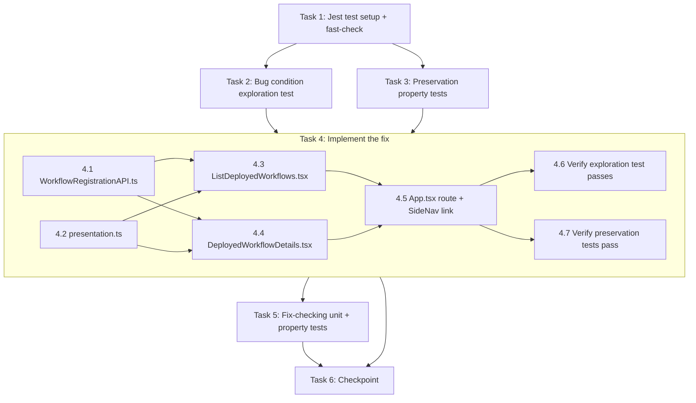

# Implementation Plan

## Overview

UI-only, additive bugfix in `src/frontend`: a new API client over the existing edge registrations/executions endpoints, a "Deployed workflows" list page, a details page with trigger control and execution history, plus one new route subtree in `App.tsx` and one new `SideNav` link. No backend changes.

There are currently NO unit tests under `src/frontend/src`, so task 1 establishes the Jest test setup first (react-scripts test works out of the box; `fast-check` is added as a devDependency for the property tests). All frontend tests run from `src/frontend` with `CI=true npm test -- --watchAll=false` (optionally scoped with `--testPathPattern=...`).

**Build-box constraint (IMPORTANT)**: a heavy Greengrass docker build may be running on this machine. Tasks MUST NOT touch `greengrass-build/`, `custom-build/`, or repo-root `src/backend` Docker artifacts, and MUST NOT run any `docker` commands. All work in this plan lives under `src/frontend` (plus this spec directory) and does not conflict with that build.

## Task Dependency Graph



Tasks 2 and 3 are independent of each other and may run in parallel once task 1 is done. Within task 4, sub-tasks 4.1 and 4.2 touch disjoint new files and may proceed in parallel; 4.3 and 4.4 both depend on 4.1 + 4.2 and are mutually independent; 4.5 is the only edit to existing files and comes last before verification.

```json
{
  "waves": [
    {
      "wave": 1,
      "tasks": ["1"],
      "description": "Establish the frontend Jest test setup (first unit tests in src/frontend/src) and add fast-check as a devDependency."
    },
    {
      "wave": 2,
      "tasks": ["2", "3"],
      "description": "Exploration and preservation tests, written and run against the UNFIXED code. Both tasks are mutually independent (disjoint new test files)."
    },
    {
      "wave": 3,
      "tasks": ["4"],
      "description": "Implement the fix (new API module, presentation logic, two pages, route + nav link) and verify the exploration test now passes and preservation tests still pass. Depends on tasks 2 and 3."
    },
    {
      "wave": 4,
      "tasks": ["5"],
      "description": "Fix-checking unit tests and fast-check property tests over presentation.ts and the new pages. Depends on task 4."
    },
    {
      "wave": 5,
      "tasks": ["6"],
      "description": "Final checkpoint: full frontend test suite, production build, and no-diff check outside src/frontend. Depends on tasks 4 and 5."
    }
  ]
}
```

## Tasks

- [x] 1. Establish the frontend Jest test setup
  - There are currently no unit tests under `src/frontend/src`; this task makes `react-scripts test` runnable and repeatable
  - Add `fast-check` as a devDependency from `src/frontend`: `npm install --save-dev --save-exact fast-check@3.23.2` (v3 line — compatible with the project's TypeScript 4.9; do NOT use fast-check v4, which requires TS ≥ 5). `@testing-library/react`, `@testing-library/jest-dom`, and `@testing-library/user-event` are already in `package.json`
  - Create `src/frontend/src/setupTests.ts` importing `@testing-library/jest-dom` (CRA picks this file up automatically)
  - Add a trivial smoke test (e.g. `src/frontend/src/setup.smoke.test.ts` asserting a fast-check property such as string round-trip) to prove the runner + fast-check work end to end; keep or delete it once real tests exist
  - Run: `CI=true npm test -- --watchAll=false` from `src/frontend` and confirm the suite executes green
  - Do NOT touch `greengrass-build/`, `custom-build/`, `src/backend`, or run docker commands
  - _Requirements: 1.1, 2.1 (test infrastructure prerequisite)_

- [x] 2. Write bug condition exploration test
  - **Property 1: Bug Condition** - Deployed workflow registrations are visible and runnable from the UI
  - **Feature: edge-workflow-run-ux, Property 1: Deployed workflow registrations are visible and runnable from the UI**
  - **CRITICAL**: This test MUST FAIL on unfixed code - failure confirms the bug exists
  - **DO NOT attempt to fix the test or the code when it fails**
  - **NOTE**: This test encodes the expected behavior - it will validate the fix when it passes after implementation
  - **GOAL**: Surface counterexamples that demonstrate the bug (expected: no route matches `/deployed-workflows`, no "Deployed workflows" nav link, no `api/WorkflowRegistrationAPI` module, invalid registrations invisible)
  - **Scoped PBT Approach**: The bug is deterministic (the UI surface is entirely missing), so scope the property to the concrete cases from the design's Exploratory section rather than broad generation
  - Create `src/frontend/src/components/deployed-workflow/deployedWorkflowSurface.exploration.test.tsx` with the four test cases from the design's Exploratory Bug Condition Checking section:
    1. **Route Existence Test**: render the app's route tree at `/deployed-workflows` (via `createMemoryRouter`/`MemoryRouter` over the routes defined in `App.tsx`) and assert a registrations page renders rather than falling through
    2. **Navigation Entry Test**: render `components/layout/SideNav.tsx` and assert a "Deployed workflows" link with href `/deployed-workflows` exists
    3. **API Client Test**: assert `api/WorkflowRegistrationAPI` exports `listWorkflowRegistrations` / `getWorkflowRegistration` / `triggerWorkflowRegistration` / `getWorkflowExecution` targeting `${Connection.ENDPOINT}/workflows/registrations` and `/workflows/executions`
    4. **Invalid Registration Visibility Test**: with the API module mocked (`jest.mock("api/WorkflowRegistrationAPI")`) to return an invalid registration `{status: "invalid", invalidReason: "Missing required artifact file: manifest.json"}`, assert the UI surfaces its status and reason
  - Bug condition from design: `isBugCondition(input)` — registrations exist on the device AND no page in the UI displays them (identity, status, invalidReason, trigger control, executions)
  - The assertions encode Property 1's expected behavior: list shows identity (workflowId, version) and status; empty set renders an empty state; trigger control iff `status === "registered"`; `invalidReason` shown for invalid; execution history with `failingNodeId`/`error` for failed executions
  - Run: `CI=true npm test -- --watchAll=false --testPathPattern=deployed-workflow` from `src/frontend` on UNFIXED code
  - **EXPECTED OUTCOME**: Test FAILS (this is correct - it proves the bug exists: module not found, no route match, no nav link, nothing rendered)
  - Document counterexamples found to confirm the root cause (missing routes, nav entry, API client, pages — not a hidden flag, not missing backend endpoints)
  - Mark task complete when test is written, run, and failure is documented
  - _Requirements: 1.1, 1.2, 1.3, 1.4, 2.1, 2.2, 2.3, 2.4, 2.5_

- [x] 3. Write preservation property tests (BEFORE implementing fix)
  - **Property 2: Preservation** - Existing pages, API calls, and backend behavior unchanged
  - **Feature: edge-workflow-run-ux, Property 2: Existing pages, API calls, and backend behavior unchanged**
  - **IMPORTANT**: Follow observation-first methodology — observe behavior on UNFIXED code first, then encode it
  - Create `src/frontend/src/legacySurfacePreservation.test.tsx` capturing the design's Preservation Checking test cases:
    1. **Legacy Workflow Route Preservation**: observe on unfixed code that `/workflows`, `/workflows/:id`, `/workflows/:id/edit` render the legacy `components/workflow/**` components (mock legacy `WorkflowAPI` at the module boundary), then encode assertions on rendered components and breadcrumb handles (3.1)
    2. **Navigation Preservation**: observe the existing `SideNav` sections/links (text, href, order) on unfixed code and encode them as the expected pre-existing item list — after the fix the only allowed delta is the one new "Deployed workflows" link (3.2)
    3. **Legacy API Client Preservation**: assert `api/WorkflowAPI.ts` endpoints still target `${Connection.ENDPOINT}/workflows` and `config/Interface.tsx` exports are unchanged (3.1, 3.3)
    4. **Fast-check route property**: for any route drawn from the pre-existing route set (`/workflows`, `/image-sources`, `/models`, `/result`, `/history`, `/capture`, `/capture-results`, `/application-health`, ...as observed in `App.tsx`), the router resolves it to the same component as the original route table (3.1, 3.2)
  - Record the backend baseline for 3.3/3.4: `git status --porcelain -- src/backend` shows no changes now and must still show none after the fix (no backend diff; the existing backend 409 rejection of triggers on invalid registrations is preserved by not touching the backend)
  - If rendering the route tree requires exporting the route definitions from `App.tsx` for testability, defer that to task 4.5 and drive these tests through the app root instead — this task must not modify production files
  - Run: `CI=true npm test -- --watchAll=false --testPathPattern=legacySurfacePreservation` from `src/frontend` on UNFIXED code
  - **EXPECTED OUTCOME**: Tests PASS (this confirms baseline behavior to preserve)
  - Mark task complete when tests are written, run, and passing on unfixed code
  - _Requirements: 3.1, 3.2, 3.3, 3.4_

- [x] 4. Fix: add the deployed-workflows UI surface

  - [x] 4.1 Implement `api/WorkflowRegistrationAPI.ts`
    - New file `src/frontend/src/api/WorkflowRegistrationAPI.ts` following sibling module conventions (axios, typed functions)
    - Types per design: `RegistrationStatus`, `ExecutionStatus`, `WorkflowRegistration` (with optional `invalidReason`), `WorkflowExecution` (nullable `startedAt`/`finishedAt`/`failingNodeId`/`error`), `WorkflowRegistrationDetails extends WorkflowRegistration { executions }`
    - Functions: `listWorkflowRegistrations()` → GET `/workflows/registrations`; `getWorkflowRegistration(id)` → GET `/workflows/registrations/{id}`; `triggerWorkflowRegistration(id)` → POST `/workflows/registrations/{id}/trigger`; `getWorkflowExecution(id)` → GET `/workflows/executions/{id}`
    - Import `Connection` from `config/Interface` read-only and build endpoint constants locally — `config/Interface.tsx` is NOT modified
    - _Bug_Condition: isBugCondition(input) from design — no API client module calls the registrations/executions endpoints_
    - _Expected_Behavior: Property 1 from design — the data the backend serves becomes reachable from the UI_
    - _Preservation: Property 2 from design — `WorkflowAPI.ts` and `config/Interface.tsx` untouched_
    - _Requirements: 2.1, 2.2, 2.3, 3.1, 3.3_

  - [x] 4.2 Implement `components/deployed-workflow/presentation.ts`
    - New file: pure presentational logic, free of React/DOM so it is directly property-testable
    - `canTrigger(registration)` — true iff `status === "registered"` (2.2, 2.4)
    - `registrationStatusIndicator(registration)` and `executionStatusIndicator(execution)` — Cloudscape `StatusIndicatorProps.Type` + text mappings for both registration statuses and all four execution statuses
    - `sortExecutions(executions)` — newest first by `startedAt`, stable for ties/nulls (2.3)
    - `executionFailureDetails(execution)` — `{failingNodeId?, error?}` present iff `status === "failed"` (2.3)
    - `isExecutionActive(execution)` — true iff `pending` or `running`; `shouldPoll(executions)` — true iff any execution is active
    - _Bug_Condition: isBugCondition(input) from design — no component logic renders registrations/executions_
    - _Expected_Behavior: Property 1 from design — trigger iff registered, failure details iff failed, newest-first history, polling while active_
    - _Preservation: new file only; nothing existing modified_
    - _Requirements: 2.2, 2.3, 2.4_

  - [x] 4.3 Implement `components/deployed-workflow/list/ListDeployedWorkflows.tsx`
    - `useQuery(["listWorkflowRegistrations"], listWorkflowRegistrations)` matching `ListWorkflows.tsx` react-query conventions
    - Cloudscape `Table` columns: workflow (workflowId link to details), version, arch, status via `registrationStatusIndicator`; invalid rows surface `invalidReason` (2.1, 2.4)
    - `empty` slot renders "No deployed workflows" without error for an empty list (2.5)
    - _Bug_Condition: isBugCondition(input) from design — no page lists registrations_
    - _Expected_Behavior: Property 1 from design — every registration's identity and status rendered; empty state without error_
    - _Preservation: new file only_
    - _Requirements: 2.1, 2.4, 2.5_

  - [x] 4.4 Implement `components/deployed-workflow/details/DeployedWorkflowDetails.tsx`
    - `:registrationId` from `useParams`; `useQuery(["getWorkflowRegistration", registrationId], ...)` with `refetchInterval: shouldPoll(data.executions) ? EXECUTION_POLL_INTERVAL_MS : false` (pattern per `ApplicationHealthOverview`/`RefreshDisplay`)
    - Header: identity, status, `registeredAt`; invalid registrations show an alert with `invalidReason` and NO trigger control (2.4)
    - "Run workflow" `Button` rendered only when `canTrigger(registration)`, wired to `useMutation(triggerWorkflowRegistration)`; on success invalidate the detail query so the new `pending` execution appears and polling starts (2.2)
    - On trigger failure (including backend 409 for registrations that became invalid) show the backend `detail` message via the existing `AppLayoutContext` flashbar `addError` — surface, don't mask, the backend rejection (3.4)
    - Executions table in `sortExecutions` order: execution id, status indicator, started/finished timestamps; failed rows show `failingNodeId` and `error` via `executionFailureDetails` (2.3); empty slot when no executions exist
    - _Bug_Condition: isBugCondition(input) from design — no page shows registration details, trigger control, or executions_
    - _Expected_Behavior: Property 1 from design — trigger iff registered, invalidReason for invalid, execution history with failure details_
    - _Preservation: Property 2 from design — backend 409 behavior reflected, not duplicated or bypassed_
    - _Requirements: 2.2, 2.3, 2.4, 3.4_

  - [x] 4.5 Wire route subtree in `App.tsx` and nav link in `SideNav.tsx` (additive only)
    - `App.tsx`: add the new top-level `deployed-workflows` route subtree exactly as specified in the design (index → `ListDeployedWorkflows`, `:registrationId` → `DeployedWorkflowDetails`, with breadcrumb handles); NO existing route is edited (3.1)
    - `components/layout/SideNav.tsx`: add `{ type: "link", text: "Deployed workflows", href: "/deployed-workflows" }` to the "Configure" section after "Workflows"; NO existing item is edited (3.2)
    - If task 3's tests need the route definitions exported for `createMemoryRouter`, do that here as a behavior-neutral export
    - Confirm the diff for this sub-task touches ONLY these two files, additively; `config/Interface.tsx`, `api/WorkflowAPI.ts`, `components/workflow/**`, and everything under `src/backend/` remain untouched (3.3)
    - _Bug_Condition: isBugCondition(input) from design — no route and no nav entry exist_
    - _Expected_Behavior: Property 1 from design — the pages are routable and discoverable_
    - _Preservation: Property 2 from design — one new route subtree + one new link, nothing else changed_
    - _Requirements: 2.1, 3.1, 3.2, 3.3_

  - [x] 4.6 Verify bug condition exploration test now passes
    - **Property 1: Expected Behavior** - Deployed workflow registrations are visible and runnable from the UI
    - **Feature: edge-workflow-run-ux, Property 1: Deployed workflow registrations are visible and runnable from the UI**
    - **IMPORTANT**: Re-run the SAME test from task 2 - do NOT write a new test
    - The test from task 2 encodes the expected behavior; when it passes, the expected behavior is satisfied
    - Run: `CI=true npm test -- --watchAll=false --testPathPattern=deployed-workflow` from `src/frontend`
    - **EXPECTED OUTCOME**: Test PASSES (confirms bug is fixed)
    - _Requirements: 2.1, 2.2, 2.3, 2.4, 2.5_

  - [x] 4.7 Verify preservation tests still pass
    - **Property 2: Preservation** - Existing pages, API calls, and backend behavior unchanged
    - **Feature: edge-workflow-run-ux, Property 2: Existing pages, API calls, and backend behavior unchanged**
    - **IMPORTANT**: Re-run the SAME tests from task 3 - do NOT write new tests (the only permitted update is registering the one new "Deployed workflows" link as the expected nav delta, per task 3's encoding)
    - Run: `CI=true npm test -- --watchAll=false --testPathPattern=legacySurfacePreservation` from `src/frontend`
    - Verify no backend diff: `git status --porcelain -- src/backend` is empty (3.3, 3.4)
    - **EXPECTED OUTCOME**: Tests PASS (confirms no regressions)
    - _Requirements: 3.1, 3.2, 3.3, 3.4_

- [x] 5. Write fix-checking unit and property tests over the new code
  - **Feature: edge-workflow-run-ux, Property 1: Deployed workflow registrations are visible and runnable from the UI**
  - Create `src/frontend/src/components/deployed-workflow/presentation.property.test.ts` with fast-check arbitraries over `WorkflowRegistration`/`WorkflowExecution` (random statuses, optional `invalidReason`, nullable timestamps/failure fields):
    - For any generated registration: `canTrigger(r) === (r.status === "registered")` (2.2, 2.4)
    - For any generated execution list: `sortExecutions` returns a permutation ordered newest-first; `executionFailureDetails(e)` is defined iff `e.status === "failed"` and echoes `failingNodeId`/`error`; `shouldPoll(list)` is true iff some execution is `pending` or `running` (2.3)
    - For any generated registration list rendered into `ListDeployedWorkflows` (mocked API), every registration's workflowId/version/status appears and a trigger affordance exists iff `canTrigger` (2.1, 2.2, 2.4)
  - Create unit tests per the design's Unit Tests section:
    - `presentation.test.ts`: `canTrigger` both statuses; indicator mappings for all four execution statuses and both registration statuses; `executionFailureDetails` only for `failed`; `shouldPoll` true/false; `sortExecutions` with null `startedAt`
    - `list/ListDeployedWorkflows.test.tsx`: rows for mocked registrations (identity + status), invalid reason shown, empty state on `[]`, error state on API failure (2.1, 2.4, 2.5)
    - `details/DeployedWorkflowDetails.test.tsx`: trigger button only for `registered`; invalid alert with reason; trigger click calls the API and refreshes; 409 mutation error shows the backend `detail` message; failed execution row shows `failingNodeId` and `error` (2.2, 2.3, 2.4, 3.4)
  - Mock all API calls at the module boundary (`jest.mock("api/WorkflowRegistrationAPI")`); no live backend, no docker
  - Run: `CI=true npm test -- --watchAll=false --testPathPattern=deployed-workflow` from `src/frontend`
  - **EXPECTED OUTCOME**: All tests PASS
  - _Requirements: 2.1, 2.2, 2.3, 2.4, 2.5, 3.4_

- [x] 6. Checkpoint - Ensure all tests pass
  - Run the full frontend suite: `CI=true npm test -- --watchAll=false` from `src/frontend`
  - Run the production build: `npm run build` from `src/frontend` (this only builds the CRA bundle — it does not touch `greengrass-build/`, `custom-build/`, or docker)
  - Confirm the overall diff is additive and frontend-only: `git status --porcelain` shows changes only under `src/frontend` (plus this spec directory); `git status --porcelain -- src/backend` is empty
  - Ensure all tests pass, ask the user if questions arise
  - _Requirements: 2.1, 2.2, 2.3, 2.4, 2.5, 3.1, 3.2, 3.3, 3.4_

## Notes

- **Build-box constraint**: a heavy Greengrass docker build may be running. Do NOT touch `greengrass-build/`, `custom-build/`, or repo-root `src/backend` Docker artifacts, and do NOT run docker commands in any task. All work here is confined to `src/frontend` and does not conflict.
- Frontend tests: Jest via `react-scripts test` (CRA 5), React Testing Library (already in `package.json`), fast-check (added in task 1, v3 line for TypeScript 4.9 compatibility). Run with `CI=true npm test -- --watchAll=false` (or `npx react-scripts test --watchAll=false`) from `src/frontend`; scope with `--testPathPattern`.
- The exploration test (task 2) is expected to FAIL on unfixed code — that failure confirms the bug, not a problem to fix at that stage.
- Requirement numbers reference `bugfix.md`: 1.x = current defective behavior, 2.x = expected behavior, 3.x = unchanged behavior (regression prevention). Properties 1–2 reference the Correctness Properties in `design.md`.
- Preservation for 3.3/3.4 is primarily structural: no file under `src/backend/` changes, so backend behavior (including the 409 trigger rejection for invalid registrations) is preserved by construction; the git no-diff checks in tasks 4.7 and 6 are the evidence.
