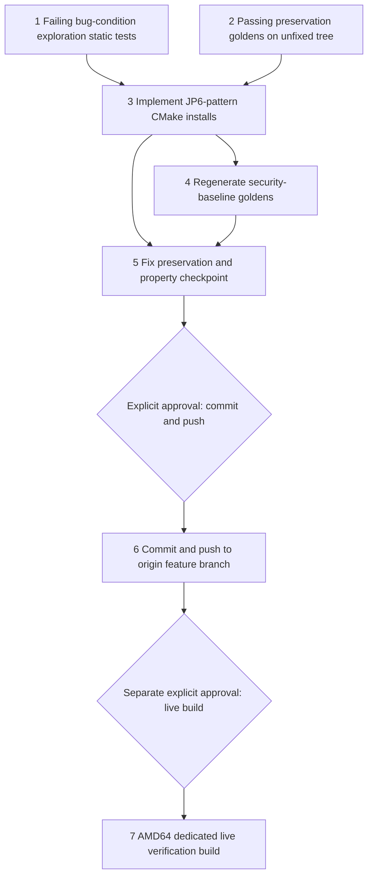

# Implementation Plan

## Overview

This plan implements the approved `bugfix.md` and `design.md` through the bug-condition workflow. The bug condition C(X): a CMake installation step in an edgemlsdk Dockerfile or setup script resolves CMake through the Kitware apt repository (`apt.kitware.com`), so the outcome depends on what that repo currently serves — the pinned `3.21.3-0kitware1ubuntu{18,20}.04.1` package versions are no longer published (apt exit 100, image build dies before any project code is copied in; verified live on portal build job `40b036fc-c379-4a70-b00e-e6d6b0d46ecb`, AMD64, 2026-08-08), and the unpinned host-script path installs whatever the repo serves today (CMake 4.x, Triton-incompatible). The fix replicates the proven JP6 pattern (pinned CMake 3.31.6 from the official Kitware GitHub release binary, self-contained installer, `uname -m` arch selection, in-build `cmake --version`) in `src/edgemlsdk/Dockerfile` (both OS branches), `src/edgemlsdk/Dockerfile.jp5`, and `machine_setup.sh`'s `install_cmake`.

Tasks 1 and 2 are standalone pre-fix tests on the UNFIXED tree. Task 1 MUST FAIL on unfixed code (except its ¬C JP6 anchor case, which passes) and task 2 MUST PASS on unfixed code; neither baseline may be rewritten after implementation. Full Docker image builds cannot run in automated tests — validation is static/property tests over the Dockerfile/script text plus the existing docker security-baseline suite with goldens regenerated through their sanctioned capture paths. Tasks 1–5 authorize no deployment, push, SSM command, instance action, artifact publication, or build. Task 6 (commit + push to origin) and task 7 (live verification build) are separate explicit approval gates; task 6 approval does not authorize task 7.

Per the user-mandated completion criterion in `bugfix.md`: **the spec is not complete until an actual portal build reaches `succeeded` including artifact publication**. Local validation alone does not close this spec.

All test commands must be finite/non-watch invocations using the repo convention `PYTHONPATH=src/backend:test/backend-test pytest <files> --noconftest`. Property-based test tasks carry `**Property N: ...**` annotations for status tracking and must be run with the execution warning: `This test run contains property-based tests and may generate/shrink counterexamples.`

## Task Dependency Graph

```json
{
  "schemaVersion": 1,
  "waves": [
    {"wave": 1, "tasks": ["1", "2"], "dependsOn": [], "parallel": true, "gate": "unfixed tree only; task 1 must fail, task 2 must pass, both frozen thereafter"},
    {"wave": 2, "tasks": ["3"], "dependsOn": ["1", "2"], "parallel": false},
    {"wave": 3, "tasks": ["4"], "dependsOn": ["3"], "parallel": false, "gate": "sanctioned baseline capture paths only"},
    {"wave": 4, "tasks": ["5"], "dependsOn": ["3", "4"], "parallel": false, "gate": "local/static validation only"},
    {"wave": 5, "tasks": ["6"], "dependsOn": ["5"], "parallel": false, "gate": "explicit push approval (public repo)"},
    {"wave": 6, "tasks": ["7"], "dependsOn": ["6"], "parallel": false, "gate": "separate explicit live-build approval"}
  ],
  "edges": [["1", "3"], ["2", "3"], ["3", "4"], ["3", "5"], ["4", "5"], ["5", "6"], ["6", "7"]]
}
```



- Wave 1 freezes bug-condition evidence and preservation baselines on the unfixed tree before any production edit.
- Wave 2 applies the three file changes (Changes 1–3 from design).
- Wave 3 regenerates the two affected security-baseline goldens through their sanctioned capture paths and proves the JP6 golden untouched (Change 4).
- Wave 4 is the local checkpoint: exploration tests now pass, preservation goldens unchanged, Properties 1–4 validated, full security preservation suite green — no operational action.
- Waves 5–6 are separate explicit user-approval gates. Build servers sync from origin, so the push (task 6) is a precondition for the live build (task 7); neither approval is implied by plan completion, and task 6 approval does not authorize task 7.

## Tasks

- [x] 1. Write and run bug-condition exploration static tests on the unfixed tree
  - **Property 1: Bug Condition** - Pinned Upstream Release-Binary CMake Install
  - **CRITICAL**: Write and run this task before any production fix. The tests for the three affected files MUST FAIL on unfixed code — failure confirms the bug exists. Do not weaken assertions or change production code in response.
  - **GOAL**: Surface counterexamples demonstrating C(X) and confirm the root cause analysis; if refuted (files already partially fixed, pin strings differ, or additional CMake install sites exist), re-hypothesize before fixing.
  - **Scoped PBT Approach**: This is a deterministic static bug — scope the assertions to the four concrete CMake install steps identified by `isBugCondition` in design, plus a repo-wide scan guard for additional sites.
  - Add tests under `test/backend-test/edgemlsdk_cmake/` (new package) that parse the UNFIXED `src/edgemlsdk/Dockerfile`, `src/edgemlsdk/Dockerfile.jp5`, and `src/edgemlsdk/src/utilities/machine_setup.sh` and assert the FIXED predicate from design's fix-checking pseudocode: no `apt.kitware.com` CMake resolution and no `cmake=3.21.3-0kitware*` pin anywhere in the affected files; each CMake install step uses the GitHub-release installer (`github.com/Kitware/CMake/releases/download/v<ver>/cmake-<ver>-linux-<arch>.sh`) with `uname -m` arch selection and `--skip-license --prefix=/usr/local`; each Dockerfile CMake step ends with in-build `cmake --version`.
  - Cover all five design exploration cases: (1) `Dockerfile` 18.04/bionic branch (`...0kitware1ubuntu18.04.1` pin present → assertion fails), (2) `Dockerfile` 20.04/focal branch (`...0kitware1ubuntu20.04.1` pin present → fails), (3) `Dockerfile.jp5` focal pin present (→ fails), (4) `machine_setup.sh` `install_cmake` 18.04 branch adds `apt.kitware.com` and installs unpinned `cmake` (→ fails), (5) ¬C anchor: `Dockerfile.jp6` already satisfies the fixed predicate (GitHub-release installer, no Kitware apt CMake resolution) and MUST PASS on the unfixed tree — anchoring the target pattern.
  - These tests encode the expected behavior; they are the fix check that will pass after implementation (task 5.1). Do not write throwaway inverted tests.
  - Run only this package with `PYTHONPATH=src/backend:test/backend-test pytest test/backend-test/edgemlsdk_cmake/ --noconftest` (finite, non-watch) and the property-test warning.
  - Record the counterexamples (the exact Kitware apt lines and pins found in each file) in `.kiro/specs/edgemlsdk-cmake-pin-failure/exploration-notes.md` or test docstrings, cross-referencing the live apt exit 100 evidence from job `40b036fc`.
  - **EXPECTED OUTCOME**: FAIL on unfixed code for `Dockerfile` (both branches), `Dockerfile.jp5`, and `machine_setup.sh`; PASS for the `Dockerfile.jp6` ¬C anchor. Mark complete only after the failures are reproduced and documented.
  - _Requirements: 1.1, 1.2, 1.3, 1.4, 1.5, 2.1, 2.2, 2.3, 2.4_

- [x] 2. Write and run observation-first preservation baseline capture on the unfixed tree
  - **Property 2: Preservation** - Non-CMake Lines and JP6 Unchanged
  - **IMPORTANT**: Follow observation-first methodology — capture the UNFIXED tree's bytes as goldens BEFORE any production edit, verify the tests pass on the unfixed tree, and freeze the goldens thereafter. Do not rebaseline these after implementation.
  - Add preservation tests under `test/backend-test/edgemlsdk_cmake/` using a capture-or-assert helper mirroring `_docker_preservation_support.capture_or_assert_text`: on first run (golden absent) capture from the tree; on subsequent runs assert byte-for-byte equality.
  - Capture the diff-scoping goldens from design's preservation pseudocode: (a) full-file sha256 of `src/edgemlsdk/Dockerfile.jp6` (must remain bit-identical post-fix, Req 3.1); (b) CMake-block-masked view of `src/edgemlsdk/Dockerfile` (mask only the if/else Kitware CMake `RUN` block); (c) CMake-block-masked view of `src/edgemlsdk/Dockerfile.jp5` (mask only the "── 2. CMake ──" `RUN` block); (d) `install_cmake`-body-masked view of `src/edgemlsdk/src/utilities/machine_setup.sh` (mask only the `install_cmake` function body).
  - Add a masking-helper sanity property test: for generated line sequences, the masking helper removes exactly the CMake-install block/function lines and nothing else (mirrors the `test_masking_removed_the_from_lines` pattern).
  - Additionally assert the `install_cmake` "already installed" skip path and the non-18.04 `check_and_install_package cmake` else-branch exist verbatim in the captured view (Req 3.5 semantics survive the fix).
  - Run with `PYTHONPATH=src/backend:test/backend-test pytest test/backend-test/edgemlsdk_cmake/ --noconftest` (finite, non-watch) and the property-test warning.
  - **EXPECTED OUTCOME**: PASS on unfixed code, establishing the immutable preservation baseline. Goldens are frozen from this point.
  - _Requirements: 3.1, 3.2, 3.4, 3.5_

- [x] 3. Fix the CMake install steps by replicating the JP6 pattern

  - [x] 3.1 Replace the Kitware-apt CMake block in `src/edgemlsdk/Dockerfile` (AMD64, both OS branches)
    - Replace the single `RUN if [ "$OS" = "18.04" ]; then ... else ... fi` Kitware-apt CMake block (following the "Install the latest versions of CMake" comment) with the one branch-free JP6-pattern `RUN` block from design Change 1: `CMAKE_VER=3.31.6`, `uname -m` arch selection (x86_64/aarch64), `wget -q` of the GitHub-release installer to `/tmp/cmake.sh`, `sh /tmp/cmake.sh --skip-license --prefix=/usr/local`, cleanup, `cmake --version`, with the explanatory comment about the Kitware repo drift.
    - The upstream installer is distro-agnostic, so the OS branching goes away; the replaced block's redundant `apt-get install -y software-properties-common lsb-release` is dropped with it (both are installed in the file's first apt step). No new package installs: `wget` and `ca-certificates` are already available earlier in the file. No Kitware apt list/key is added on the fixed path, so no residue cleanup is needed in this file.
    - Change ONLY the CMake install block — every other line must survive byte-for-byte (task 2 golden b enforces this).
    - _Bug_Condition: isBugCondition(input) — Dockerfile 18.04/20.04 branches resolve `cmake=3.21.3-0kitware1ubuntu{18,20}.04.1` via apt.kitware.com_
    - _Expected_Behavior: Property 1 — pinned CMake 3.31.6 from the GitHub release binary, no apt resolution, in-build `cmake --version`_
    - _Preservation: all non-CMake lines byte-for-byte unchanged; Triton keeps a 3.x (≥ 3.21, < 4.0) toolchain_
    - _Requirements: 2.1, 2.3, 3.2, 3.3_

  - [x] 3.2 Replace the Kitware-apt CMake block in `src/edgemlsdk/Dockerfile.jp5` (JP5/arm64)
    - Replace the "── 2. CMake 3.21.3 from Kitware ──" `RUN` block with the same JP6-pattern block (identical text to `Dockerfile.jp6` step 2, comment updated to say "JP5 / Ubuntu 20.04 base"). On JP5 hardware `uname -m` yields `aarch64`, so arch selection picks the aarch64 installer. `wget` is already used in this block pre-fix.
    - **Explicitly unchanged**: the later "── 3. Python 3.11 ──" step's Kitware residue cleanup lines (`rm -f /etc/apt/sources.list.d/*kitware*`, `sed -i '/kitware/d' /etc/apt/sources.list`) stay exactly as they are — harmless defense-in-depth mirroring JP6, preserved by Req 3.2 and task 2 golden c.
    - _Bug_Condition: isBugCondition(input) — Dockerfile.jp5 step 2 resolves `cmake-data=3.21.3-... cmake=3.21.3-...` via apt.kitware.com_
    - _Expected_Behavior: Property 1 — pinned CMake 3.31.6 from the GitHub release binary, no apt resolution, in-build `cmake --version`_
    - _Preservation: all non-CMake lines (including the Python step's kitware residue cleanup) byte-for-byte unchanged_
    - _Requirements: 2.2, 2.3, 3.2, 3.3_

  - [x] 3.3 Rework `install_cmake` in `src/edgemlsdk/src/utilities/machine_setup.sh` (host script)
    - Replace only the 18.04 Kitware-apt branch body with the host-adapted JP6 pattern from design Change 3: `CMAKE_VER=3.31.6`, `uname -m` arch selection, `wget -q` of the GitHub-release installer, `$do_sudo sh /tmp/cmake.sh --skip-license --prefix=/usr/local` (mirroring the existing `install_powershell` `$do_sudo` and arch-selection conventions), cleanup, `cmake --version`.
    - Extend the guard to `! dpkg -s "cmake" && ! command -v cmake`: the installer-based CMake does not register with dpkg, so `command -v` prevents reinstall on re-run, while keeping `dpkg -s` so hosts with apt-installed CMake still skip — preserving Req 3.5's skip semantics in both worlds.
    - Keep the function structure, the "already installed" skip path, and the non-18.04 `check_and_install_package cmake` else-branch (Ubuntu archive, not Kitware — not part of C) verbatim. The old branch's gpg/apt-key/kitware-keyring choreography is deleted with the branch; nothing else in the script referenced it. Every other function survives byte-for-byte (task 2 golden d).
    - Note: the vendored `src/backend/edgemlsdk/edgemlsdk/**` duplicates are gitignored build artifacts regenerated by `build-custom.sh` from this fixed source; no action needed.
    - _Bug_Condition: isBugCondition(input) — install_cmake's 18.04 branch adds apt.kitware.com and installs unpinned `cmake` (yields 4.x or fails)_
    - _Expected_Behavior: Property 1 — deterministic pinned CMake 3.x install independent of the Kitware apt repo's current contents_
    - _Preservation: skip-when-installed path, non-18.04 branch, and all other machine_setup.sh functions unchanged_
    - _Requirements: 2.4, 3.5_

- [x] 4. Regenerate the affected security-baseline goldens via sanctioned capture paths
  - **Property 4: Baseline Regeneration** - Goldens Track the Fixed Tree
  - Regenerate ONLY the two goldens affected by intentional edits, each through its sanctioned path — never by hand-editing masked bytes:
  - (a) `test/backend-test/security/baselines/docker_baseline_edgemlsdk_Dockerfile.jp5_masked.txt`: delete the golden, re-run `test/backend-test/security/preservation/test_preservation_docker_masked_bytes.py` so `capture_or_assert_text` re-captures from the fixed tree on absence, then re-run to assert green.
  - (b) `test/backend-test/security/baselines/docker_baseline_out_of_scope.json` — the `src/edgemlsdk/Dockerfile` entry only: per `.kiro/steering/builds.md`, run `sha256sum src/edgemlsdk/Dockerfile`, edit just that one JSON entry, re-run `test_preservation_docker_out_of_scope.py` to assert green. Touch no other entry.
  - (c) Assert `docker_baseline_edgemlsdk_Dockerfile.jp6_masked.txt` is bit-identical to its pre-fix state (e.g. `git diff --stat` shows no change to it) — JP6 untouched (Req 3.1).
  - `machine_setup.sh` is not covered by any existing baseline or guard (verified by repo search in design); no additional golden is involved. Per steering, these baseline updates ship in the same commit as the fix (task 6).
  - Run the affected security tests with `PYTHONPATH=src/backend:test/backend-test pytest test/backend-test/security/preservation/test_preservation_docker_masked_bytes.py test/backend-test/security/preservation/test_preservation_docker_out_of_scope.py --noconftest` (finite, non-watch).
  - _Bug_Condition: n/a — intended consequence of the fix (goldens describe the changed files)_
  - _Expected_Behavior: Property 4 — goldens regenerated through sanctioned capture, jp6 golden unchanged_
  - _Preservation: masked-bytes mechanism (FROM-line masking, byte-for-byte comparison) enforced unchanged against the regenerated goldens_
  - _Requirements: 2.5, 3.1, 3.4_

- [x] 5. Fix, preservation, and property validation checkpoint (Properties 1–4)

  - [x] 5.1 Re-run the bug-condition exploration tests unchanged
    - **Property 1: Expected Behavior** - Pinned Upstream Release-Binary CMake Install
    - **IMPORTANT**: Re-run the SAME tests from task 1 — do NOT write new tests or weaken assertions. The task 1 tests encode the expected behavior; when they pass, the fix is confirmed for all four C(X) install steps.
    - Confirm zero `apt.kitware.com` / `cmake=3.21.3-0kitware*` occurrences in the three fixed files; GitHub-release installer, arch selection, `--skip-license --prefix=/usr/local`, and `cmake --version` present in each Dockerfile CMake step; `$do_sudo` on the host-script install step; the JP6 ¬C anchor still passes.
    - **EXPECTED OUTCOME**: PASS after the fix (confirms the bug is fixed).
    - _Requirements: 2.1, 2.2, 2.3, 2.4_

  - [x] 5.2 Re-run the frozen preservation goldens unchanged
    - **Property 2: Preservation** - Non-CMake Lines and JP6 Unchanged
    - **IMPORTANT**: Re-run the SAME tests from task 2 against the frozen goldens — do NOT recapture or rebaseline them.
    - Confirm the `Dockerfile.jp6` sha256 is bit-identical, the CMake-block-masked views of `Dockerfile` and `Dockerfile.jp5` and the `install_cmake`-masked view of `machine_setup.sh` are byte-for-byte identical to the unfixed captures, and the skip-path/else-branch assertions still hold — proving only the CMake install lines changed.
    - **EXPECTED OUTCOME**: PASS after the fix (confirms no regressions).
    - _Requirements: 3.1, 3.2, 3.4, 3.5_

  - [x] 5.3 Add and run the version-range and pattern property tests
    - **Property 3: No-4.x** - Pinned Version Range
    - Add property tests under `test/backend-test/edgemlsdk_cmake/`: a Hypothesis property over generated version strings (including edge shapes like `3.9`, `3.21.0`, `4.0.0-rc1`) validating the 3.21 ≤ v < 4.0 comparator; plus a direct assertion that every concrete `CMAKE_VER=<x.y.z>` (and any residual apt `cmake=` pin — there must be none) parsed from the three fixed files AND `Dockerfile.jp6` satisfies the range.
    - Add the arch-selection property from design: for any generated `uname -m` value, the modeled arch selection yields `x86_64` for `x86_64` and `aarch64` otherwise — matching JP6's behavior exactly.
    - Run with `PYTHONPATH=src/backend:test/backend-test pytest test/backend-test/edgemlsdk_cmake/ --noconftest` and the property-test warning.
    - _Requirements: 2.3, 3.3_

  - [x] 5.4 Run the full docker security preservation suite and confirm the no-live-action contract
    - **Property 4: Baseline Regeneration** - Goldens Track the Fixed Tree
    - Re-run the complete `test/backend-test/security/preservation/` suite against the fixed tree with the regenerated goldens: masked-bytes mechanism intact (Req 3.4), out-of-scope guard green with the updated `src/edgemlsdk/Dockerfile` hash, jp6 goldens unchanged.
    - Confirm every Property 1–4 has a passing test with exact requirement traceability, and that no automated test in this spec runs a Docker build (the no-Docker-build validation constraint from bugfix.md is honored).
    - Record validation commands, pass/fail counts, and any pre-existing unrelated failures in `.kiro/specs/edgemlsdk-cmake-pin-failure/verification-notes.md`.
    - **STOP**: Do not deploy, push, send an SSM command, start/stop/terminate an instance, publish an artifact, or launch a build in this checkpoint. Live verification proceeds only through tasks 6 and 7. Ask the user if questions arise.
    - _Requirements: 2.5, 3.1, 3.4_

- [-] 6. Approval-gated commit and push to origin feature branch
  - **STOP: obtain explicit user approval after task 5. Local validation completion is not push approval.**
  - Build servers sync from origin, so local commits are invisible to them — pushing the fix to origin `feature/portal-build-fleet-and-workflow-gates` is the precondition for task 7's live verification (its `source_ref` is that branch, post-push).
  - Before requesting approval, present the exact diff scope: the three fixed source files, the two regenerated baseline goldens (shipped in the same commit per steering), and the new `test/backend-test/edgemlsdk_cmake/` tests. This is a public repo — run the per-repo secret-hygiene checks (secrets guard per `.kiro/steering/builds.md`) over the diff before pushing; confirm no credentials, tokens, or internal identifiers appear in any added text.
  - After approval only: stage the specific files (no `git add .`), commit with a message referencing this spec, and push to origin `feature/portal-build-fleet-and-workflow-gates`. No force-push.
  - This task authorizes the push only — it does NOT authorize dispatching any build; task 7 requires its own separate approval.
  - _Requirements: 2.5 (goldens ship with the fix); precondition for the bugfix Introduction completion criterion_

- [~] 7. Separately approval-gated live verification build (user-mandated completion criterion)
  - **STOP: obtain a new explicit user approval after task 6. Push approval does not authorize this build.**
  - The approval request must state: target `AMD64`, mode dedicated (the existing x86 server — same shape as failing evidence job `40b036fc`), `source_ref` `feature/portal-build-fleet-and-workflow-gates`, estimated duration/cost, artifact-publication effects, monitoring scope, and stop criteria. Builds run strictly one at a time per steering.
  - After approval only: run the portal build preflight first, per the established build-fleet workflow (including the pre-build guard run: out-of-scope guard + secrets guard per `.kiro/steering/builds.md`). If preflight fails, do not dispatch; record diagnostics and stop.
  - If preflight passes, dispatch exactly the approved build and monitor via the Build Log diagnostics: confirm the edgemlsdk CMake step now logs the GitHub-release installer and `cmake version 3.31.6` — not apt exit 100.
  - **Success criterion**: the job must reach `succeeded` INCLUDING artifact publication — the user-mandated completion criterion from bugfix.md. A build that merely fails later than the CMake step is progress evidence but does NOT complete this spec.
  - **New-failure handling**: any follow-on failure past the CMake step (e.g. a later compile or publish error) is new evidence outside this spec's fix scope — record it in `verification-notes.md`, open/route a new spec or task for it, and keep this spec open until a build succeeds and publishes.
  - **JP5 follow-on**: after AMD64 succeeds, note that the JP5 (arm64) path (`Dockerfile.jp5`) is to be verified at the next JP5 build opportunity; no additional build is authorized by this task's approval.
  - Record the job ID, timeline, CMake-step log evidence, and final status in `.kiro/specs/edgemlsdk-cmake-pin-failure/verification-notes.md`.
  - _Requirements: 1.4 (defect no longer reproduces), 2.1, 2.3; bugfix Introduction completion criterion ("The build must succeed and publish to be successful and complete.")_

## Notes

- Tasks 1 and 2 are standalone pre-fix tasks on the UNFIXED tree. Task 1 is complete only after its expected failures (Dockerfile both branches, Dockerfile.jp5, machine_setup.sh) and the passing JP6 ¬C anchor are reproduced and documented; task 2 is complete only after its goldens are captured and passing on unfixed code. Both baselines are frozen — the fix must make task 1 pass and keep task 2 passing without touching either test.
- Property status annotations use the design's numbered correctness properties: task 5.1 reuses task 1 as the fix check (Property 1), task 5.2 reuses task 2 as the preservation check (Property 2), task 5.3 validates Property 3, and tasks 4 + 5.4 validate Property 4.
- Full Docker image builds cannot run in automated tests (bugfix.md validation constraint). The security preservation suite is the in-repo integration layer; the task 7 live build is the true integration test and the only path to spec completion.
- Rollback is a pure git revert: source files, goldens, and the new tests revert atomically in one commit, keeping the preservation suite consistent on either side.
- Tasks 6 and 7 are separate non-automatic approval gates. Neither approval is implied by completion of tasks 1–5, and task 6 (push) approval does not authorize task 7 (build dispatch).
