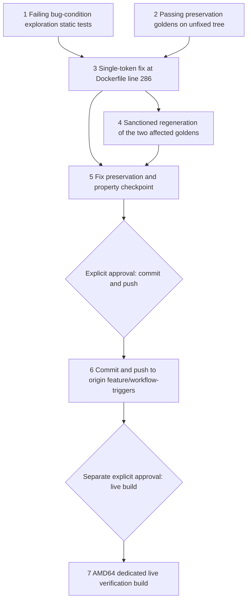

# Implementation Plan

## Overview

This plan implements the approved `bugfix.md` and `design.md` through the bug-condition workflow. The bug condition C(X): an apt install step in `src/edgemlsdk/Dockerfile` requests a retired transitional Python package that has no installation candidate on the file's effective Ubuntu base (22.04 on the AMD64 build servers) — concretely, line 286's `RUN apt-get install python-dev -y` (Docker build step 61/83), where apt exits 100 ("Package 'python-dev' has no installation candidate ... replaced by: python2-dev python2 python-dev-is-python3") and the image build and portal build job die (verified live on portal build job `08a1e2bd-45f9-4521-ac4a-b41b52222e2e`, AMD64 dedicated, source_ref `feature/workflow-triggers`, 2026-08-09). This latent defect was unmasked by sibling spec `edgemlsdk-cmake-pin-failure` (the same job logs `cmake version 3.31.6` at the previously failing step). The fix is a single-token replacement on line 286: `python-dev` → `python-dev-is-python3` (design Decision 1 — transitively provides `python3-dev` matching the JP6 anchor AND `python-is-python3`, preserving the downstream `rm /usr/bin/python` (no `-f`) precondition). Nothing else in the file changes; `Dockerfile.jp5` and `Dockerfile.jp6` are byte-for-byte untouched (Decisions 2–3).

Tasks 1 and 2 are standalone pre-fix tests on the UNFIXED tree in a new package `test/backend-test/edgemlsdk_pythondev/` mirroring the proven `edgemlsdk_cmake` pattern. Task 1 MUST FAIL on unfixed code for the line-286 retired-token cases (its ¬C anchor/scoping cases — JP6 anchor, JP5 out-of-scope, downstream rm-precondition — pass) and task 2 MUST PASS on unfixed code; neither baseline may be rewritten after implementation. Full Docker image builds cannot run in automated tests — validation is static/property tests over the Dockerfile text (parsed as TEXT only: no `docker`, `subprocess`, or shell-out anywhere in the package) plus the existing docker security-baseline suite and the prior spec's `edgemlsdk_cmake` package with the two affected goldens regenerated through their sanctioned capture paths. Tasks 1–5 authorize no deployment, push, SSM command, instance action, artifact publication, or build. Task 6 (commit + push to origin `feature/workflow-triggers`) and task 7 (live verification build) are separate explicit approval gates; task 6 approval does not authorize task 7.

Per the user-mandated completion criterion in `bugfix.md`: **the spec is not complete until an actual portal build reaches `succeeded` including artifact publication**. Local validation alone does not close this spec. A `succeeded` AMD64 build with artifact publication also completes the sibling spec `edgemlsdk-cmake-pin-failure`, which remains open on the same criterion.

All test commands must be finite/non-watch invocations using the repo convention `PYTHONPATH=src/backend:test/backend-test pytest <files> --noconftest`. Property-based test tasks carry `**Property N: ...**` annotations for status tracking and must be run with the execution warning: `This test run contains property-based tests and may generate/shrink counterexamples.`

## Task Dependency Graph

```json
{
  "schemaVersion": 1,
  "waves": [
    {"wave": 1, "tasks": ["1", "2"], "dependsOn": [], "parallel": true, "gate": "unfixed tree only; task 1 must fail on the line-286 cases, task 2 must pass, both frozen thereafter"},
    {"wave": 2, "tasks": ["3"], "dependsOn": ["1", "2"], "parallel": false},
    {"wave": 3, "tasks": ["4"], "dependsOn": ["3"], "parallel": false, "gate": "sanctioned golden capture paths only"},
    {"wave": 4, "tasks": ["5"], "dependsOn": ["3", "4"], "parallel": false, "gate": "local/static validation only"},
    {"wave": 5, "tasks": ["6"], "dependsOn": ["5"], "parallel": false, "gate": "explicit push approval (public repo)"},
    {"wave": 6, "tasks": ["7"], "dependsOn": ["6"], "parallel": false, "gate": "separate explicit live-build approval"}
  ],
  "edges": [["1", "3"], ["2", "3"], ["3", "4"], ["3", "5"], ["4", "5"], ["5", "6"], ["6", "7"]]
}
```



- Wave 1 freezes bug-condition evidence and preservation baselines on the unfixed tree before any production edit.
- Wave 2 applies the one-line fix (design Change 1).
- Wave 3 regenerates the two goldens that embed the changed line through their sanctioned capture paths and proves all other goldens bit-identical (design Changes 2–3).
- Wave 4 is the local checkpoint: exploration tests now pass, frozen preservation goldens unchanged, Properties 1–3 validated, full security preservation suite and the prior spec's `edgemlsdk_cmake` package green — no operational action.
- Waves 5–6 are separate explicit user-approval gates. Build servers sync from origin, so the push (task 6) is a precondition for the live build (task 7); neither approval is implied by plan completion, and task 6 approval does not authorize task 7.

## Tasks

- [x] 1. Write and run bug-condition exploration static tests on the unfixed tree
  - **Property 1: Bug Condition** - Line 286 Resolves on the 22.04 Base
  - **CRITICAL**: Write and run this task before any production fix. The retired-token and fixed-line tests MUST FAIL on unfixed code — failure confirms the bug exists. Do not weaken assertions or change production code in response.
  - **GOAL**: Surface counterexamples demonstrating C(X) and confirm the root cause analysis; if refuted (line 286 already changed, additional retired-Python-package sites exist in the file, or the JP6 anchor does not use `python3-dev`), re-hypothesize before fixing.
  - **Scoped PBT Approach**: This is a deterministic static bug — scope the assertions to the one concrete site identified by `isBugCondition` in design (line 286's `python-dev` token), plus a whole-file token-boundary scan guard for additional retired sites.
  - Create the new package `test/backend-test/edgemlsdk_pythondev/` with `test_bug_condition_exploration.py`: parse the UNFIXED `src/edgemlsdk/Dockerfile`'s apt install steps (logical RUN reconstruction across backslash continuations; package-token extraction excluding flags like `-y`; strict token-boundary matching so `python-dev` never substring-matches `python-dev-is-python3` or `python3-dev`) and assert the FIXED predicate from design's fix-checking pseudocode. The package parses files as TEXT only — no `docker`, `subprocess`, or shell-out anywhere.
  - Cover all six design exploration cases: (1) no retired transitional Python package token (`python-dev`, `python`, `python-pip`, `python-setuptools`) in any apt install step of `src/edgemlsdk/Dockerfile` (→ FAILS on unfixed code — counterexample: line 286's `python-dev`), (2) the Triton-section single-package install step is exactly `RUN apt-get install python-dev-is-python3 -y` (→ FAILS on unfixed code, which has `python-dev`), (3) counterexample inventory scoping: the retired-token scan over the UNFIXED file finds exactly ONE site, line 286 (passes pre-fix as a scoping check, confirming the bugfix.md scan and single-line fix scope), (4) ¬C JP6 anchor: `Dockerfile.jp6`'s system-packages block requests `python3-dev` (token-boundary) and no retired token (→ PASSES on unfixed code — anchors the target dev-headers package), (5) ¬C JP5 out-of-scope: `Dockerfile.jp5` contains the `python-dev` token in its single system-packages block (→ PASSES pre- and post-fix — documents Decision 2's untouched scope, guarding against accidental modification), (6) downstream precondition: the `rm /usr/bin/python` step exists in `src/edgemlsdk/Dockerfile`, uses no `-f`, and follows line 286 (→ PASSES pre/post fix — pins the structural fact forcing Decision 1's `python-dev-is-python3` choice).
  - These tests encode the expected behavior; they are the fix check that will pass after implementation (task 5.1). Do not write throwaway inverted tests.
  - Run only this package with `PYTHONPATH=src/backend:test/backend-test pytest test/backend-test/edgemlsdk_pythondev/ --noconftest` (finite, non-watch) and the property-test warning.
  - Record the counterexample (the exact line-286 text and its position after the `rapidjson-dev libre2-dev` step) in `.kiro/specs/edgemlsdk-python-dev-ubuntu2204/exploration-notes.md` or test docstrings, cross-referencing the live apt exit 100 evidence from job `08a1e2bd` at step 61/83.
  - **EXPECTED OUTCOME**: FAIL on unfixed code for cases 1 and 2 (the line-286 retired-token cases); PASS for the scoping check and the JP6 anchor / JP5 out-of-scope / downstream rm-precondition ¬C cases. Mark complete only after the failures are reproduced and documented.
  - _Requirements: 1.1, 1.2, 1.3, 2.1, 2.2, 2.3_

- [x] 2. Write and run observation-first preservation baseline capture on the unfixed tree
  - **Property 2: Preservation** - All Other Lines and Sibling Dockerfiles Unchanged
  - **IMPORTANT**: Follow observation-first methodology — capture the UNFIXED tree's bytes as goldens BEFORE any production edit, verify the tests pass on the unfixed tree, and freeze the goldens thereafter. Do not rebaseline these after implementation.
  - Add preservation tests under `test/backend-test/edgemlsdk_pythondev/` using a capture-or-assert helper mirroring `_cmake_preservation_support.capture_or_assert_text`: on first run (golden absent) capture from the tree into `test/backend-test/edgemlsdk_pythondev/baselines/`; on subsequent runs assert byte-for-byte equality.
  - Capture the diff-scoping goldens from design's preservation pseudocode: (a) `edgemlsdk_Dockerfile_pythondev_masked.txt` — the python-dev-line-masked view of `src/edgemlsdk/Dockerfile` (mask ONLY the retired-Python-package install line; the masked view thereby proves the prior spec's CMake block, the Python 3.11 source build, the neighboring `rapidjson-dev libre2-dev` install, and the `rm /usr/bin/python` step survive verbatim post-fix, Req 3.1); (b) `edgemlsdk_Dockerfile.jp5.sha256.txt` — full-file sha256 of `src/edgemlsdk/Dockerfile.jp5` (must remain bit-identical post-fix, Req 3.2); (c) `edgemlsdk_Dockerfile.jp6.sha256.txt` — full-file sha256 of `src/edgemlsdk/Dockerfile.jp6` (must remain bit-identical post-fix, Req 3.3).
  - Add a mask-exactness assertion: the masked view differs from the raw file by exactly the one target line (count and content asserted) — the mask cannot hide collateral edits.
  - Add the masking-helper property tests from design: (i) masking preservation property — for Hypothesis-generated Dockerfile line sequences containing zero or more marked target lines, the masking helper removes exactly the target line(s) and nothing else (mirrors the `edgemlsdk_cmake` masking-helper property pattern); (ii) retired-token classifier property — for generated package-name tokens including adversarial prefixes/suffixes (`python-dev-is-python3`, `libpython-dev-foo`, `python-devtools`), the classifier flags a token iff it is exactly a member of the retired set; (iii) apt-line tokenization property — for generated apt install lines with random flag/package orderings and backslash continuations, tokenization is total and flags never classify as packages.
  - Run with `PYTHONPATH=src/backend:test/backend-test pytest test/backend-test/edgemlsdk_pythondev/ --noconftest` (finite, non-watch) and the property-test warning.
  - **EXPECTED OUTCOME**: PASS on unfixed code, establishing the immutable preservation baseline. Goldens are frozen from this point.
  - _Requirements: 3.1, 3.2, 3.3_

- [x] 3. Fix line 286 by the single-token replacement

  - [x] 3.1 Replace `python-dev` with `python-dev-is-python3` at `src/edgemlsdk/Dockerfile:286`
    - Change line 286 from `RUN apt-get install python-dev -y` to `RUN apt-get install python-dev-is-python3 -y` — the entire code fix (design Change 1). Nothing else in the file changes: no comment added or removed, the `apt-get update` on the step above (285) still precedes it, and the diff is exactly one line so both masked-golden mechanisms stay simple.
    - `python-dev-is-python3` is apt's own named replacement: it transitively provides `python3-dev` (the same dev-headers package the proven JP6 anchor installs on its 22.04-generation base) AND `python-is-python3` (which provides `/usr/bin/python`, preserving the downstream `rm /usr/bin/python` (no `-f`) precondition — design Decision 1's decisive constraint; options (a) drop and (c) bare `python3-dev` would relocate the failure to that later, preserved-byte-for-byte step).
    - **Explicitly unchanged by design**: `Dockerfile.jp5` (its `python-dev` token resolves on the digest-pinned focal base — Decision 2), `Dockerfile.jp6`, all other `src/edgemlsdk/Dockerfile` lines, `machine_setup.sh`, the security suite's masked goldens, all other out-of-scope entries. No OS-conditional is added for the dormant 18.04 branch (Decision 3). The gitignored vendored `src/backend/edgemlsdk/edgemlsdk/**` duplicates are build artifacts regenerated by `build-custom.sh`; no action (prior-spec precedent).
    - _Bug_Condition: isBugCondition(input) — line 286 requests retired `python-dev`, no installation candidate on the 22.04 base, apt exit 100_
    - _Expected_Behavior: Property 1 — the step requests only jammy-resolvable packages; replacement is `python-dev-is-python3`; python3 dev headers and `/usr/bin/python` provided; build proceeds past step 61/83_
    - _Preservation: Property 2 — every other `src/edgemlsdk/Dockerfile` line byte-for-byte unchanged; `Dockerfile.jp5` and `Dockerfile.jp6` untouched_
    - _Requirements: 2.1, 2.2, 2.3, 3.1, 3.2, 3.3_

- [x] 4. Regenerate the two affected goldens via sanctioned capture paths
  - **Property 3: Baseline Regeneration** - Goldens Track the Fixed Tree, Mechanisms Intact
  - Regenerate ONLY the two goldens that embed the changed line, each through its sanctioned path — never by hand-editing masked bytes:
  - (a) `test/backend-test/security/baselines/docker_baseline_out_of_scope.json` — the `src/edgemlsdk/Dockerfile` entry only: per `.kiro/steering/builds.md` and the prior spec's precedent, run `sha256sum src/edgemlsdk/Dockerfile` on the fixed tree, edit just that one JSON entry (currently `5fe6186d…a7e355`), re-run `test/backend-test/security/preservation/test_preservation_docker_out_of_scope.py` to assert green. Touch no other entry. Note: the security suite has no masked-bytes golden for `src/edgemlsdk/Dockerfile` (only jp5/jp6 masked goldens exist), so this entry is the only security-suite artifact affected.
  - (b) `test/backend-test/edgemlsdk_cmake/baselines/edgemlsdk_Dockerfile_cmake_masked.txt` — the prior spec's CMake-masked golden masks only the CMake block and therefore embeds line 286 verbatim; after the fix its assertion fails by design. Regenerate through that package's capture-on-absent path: delete the golden, re-run `test/backend-test/edgemlsdk_cmake/test_preservation_baseline.py` (which re-captures from the fixed tree via `_cmake_preservation_support.capture_or_assert_text`), then re-run to assert green.
  - (c) Assert every golden NOT embedding the changed line is bit-identical pre/post fix (e.g. `git diff --stat` shows no change): security masked goldens `docker_baseline_edgemlsdk_Dockerfile.jp5_masked.txt` and `docker_baseline_edgemlsdk_Dockerfile.jp6_masked.txt`; the `edgemlsdk_cmake` package's `edgemlsdk_Dockerfile.jp5_cmake_masked.txt`, `edgemlsdk_Dockerfile.jp6.sha256.txt`, and `machine_setup.sh_install_cmake_masked.txt`.
  - Per steering, these golden updates ship in the same commit as the fix (task 6) so the tree is self-consistent on either side of it.
  - Run the affected tests with `PYTHONPATH=src/backend:test/backend-test pytest test/backend-test/security/preservation/test_preservation_docker_out_of_scope.py test/backend-test/edgemlsdk_cmake/test_preservation_baseline.py --noconftest` (finite, non-watch).
  - _Bug_Condition: n/a — intended consequence of the fix (goldens describe the changed file)_
  - _Expected_Behavior: Property 3 — exactly two goldens regenerated through sanctioned capture, all others bit-identical_
  - _Preservation: enforcing mechanisms (masked-bytes comparison, out-of-scope hash guard, capture-on-absent semantics) run unchanged against the regenerated goldens_
  - _Requirements: 2.4, 3.4, 3.5_

- [x] 5. Fix, preservation, and property validation checkpoint (Properties 1–3)

  - [x] 5.1 Re-run the bug-condition exploration tests unchanged
    - **Property 1: Expected Behavior** - Line 286 Resolves on the 22.04 Base
    - **IMPORTANT**: Re-run the SAME tests from task 1 — do NOT write new tests or weaken assertions. The task 1 tests encode the expected behavior; when they pass, the fix is confirmed for the C(X) site.
    - Confirm zero retired transitional Python package tokens in any apt install step of the fixed `src/edgemlsdk/Dockerfile`; the Triton-section step is exactly `RUN apt-get install python-dev-is-python3 -y` (appearing exactly once); token-boundary discipline held (the fixed line's token does not false-positive); the JP6 anchor, JP5 out-of-scope, and downstream `rm /usr/bin/python` (no `-f`) cases still pass.
    - Run with `PYTHONPATH=src/backend:test/backend-test pytest test/backend-test/edgemlsdk_pythondev/ --noconftest` and the property-test warning.
    - **EXPECTED OUTCOME**: PASS after the fix (confirms the bug is fixed).
    - _Requirements: 2.1, 2.2, 2.3_

  - [x] 5.2 Re-run the frozen preservation goldens unchanged
    - **Property 2: Preservation** - All Other Lines and Sibling Dockerfiles Unchanged
    - **IMPORTANT**: Re-run the SAME tests from task 2 against the frozen goldens — do NOT recapture or rebaseline them.
    - Confirm the python-dev-line-masked view of `src/edgemlsdk/Dockerfile` is byte-for-byte identical to the unfixed capture (proving the CMake block, the Python 3.11 source build, the `rapidjson-dev libre2-dev` step, and the `rm /usr/bin/python` step survive verbatim), the mask-exactness assertion still holds (exactly one line differs from the raw file), and the `Dockerfile.jp5` and `Dockerfile.jp6` full-file sha256es are bit-identical — proving exactly one line changed and both sibling files are untouched.
    - Run with `PYTHONPATH=src/backend:test/backend-test pytest test/backend-test/edgemlsdk_pythondev/ --noconftest` and the property-test warning.
    - **EXPECTED OUTCOME**: PASS after the fix (confirms no regressions).
    - _Requirements: 3.1, 3.2, 3.3_

  - [x] 5.3 Run the full security preservation suite and the prior spec's package; confirm the no-live-action contract
    - **Property 3: Baseline Regeneration** - Goldens Track the Fixed Tree, Mechanisms Intact
    - Re-run the complete docker security preservation suite (`PYTHONPATH=src/backend:test/backend-test pytest test/backend-test/security/preservation/ --noconftest`) against the fixed tree with the regenerated out-of-scope entry: masked-bytes mechanism intact, out-of-scope guard green with the updated `src/edgemlsdk/Dockerfile` hash, jp5/jp6 masked goldens bit-identical. Expected shape: fully green apart from the two known pre-existing vendored-duplicate skips.
    - Re-run the prior spec's package (`PYTHONPATH=src/backend:test/backend-test pytest test/backend-test/edgemlsdk_cmake/ --noconftest`) against the fixed tree after its sanctioned golden regeneration: all tests green, its CMake-focused assertions unaffected, its other three goldens bit-identical (Req 3.5).
    - Confirm every Property 1–3 has a passing test with exact requirement traceability, and that no automated test in this spec runs a Docker build (the no-Docker-build validation constraint from bugfix.md is honored — no `docker`, `subprocess`, or shell-out in `test/backend-test/edgemlsdk_pythondev/`, verified by inspection).
    - Record validation commands, pass/fail counts, and any pre-existing unrelated failures in `.kiro/specs/edgemlsdk-python-dev-ubuntu2204/verification-notes.md`.
    - **STOP**: Do not deploy, push, send an SSM command, start/stop/terminate an instance, publish an artifact, or launch a build in this checkpoint. Live verification proceeds only through tasks 6 and 7. Ask the user if questions arise.
    - _Requirements: 2.4, 3.4, 3.5_

- [x] 6. Approval-gated commit and push to origin feature branch
  - **STOP: obtain explicit user approval after task 5. Local validation completion is not push approval.**
  - Build servers sync from origin, so local commits are invisible to them — pushing the fix to origin `feature/workflow-triggers` (the user's standing branch decision from the prior spec; the failing evidence job's source_ref already points there) is the precondition for task 7's live verification.
  - Before requesting approval, present the exact diff scope: the one-line `src/edgemlsdk/Dockerfile` fix, the two regenerated goldens (the `docker_baseline_out_of_scope.json` entry and the `edgemlsdk_cmake` CMake-masked golden, shipped in the same commit per steering), and the new `test/backend-test/edgemlsdk_pythondev/` package with its baselines. This is a public repo — run the per-repo secret-hygiene checks (secrets guard per `.kiro/steering/builds.md`) over the diff before pushing; confirm no credentials, tokens, or internal identifiers appear in any added text.
  - After approval only: stage the specific files (no `git add .`), commit with a message referencing this spec, and push to origin `feature/workflow-triggers`. No force-push.
  - This task authorizes the push only — it does NOT authorize dispatching any build; task 7 requires its own separate approval.
  - _Requirements: 2.4 (goldens ship with the fix); precondition for the bugfix Introduction completion criterion_

- [ ] 7. Separately approval-gated live verification build (user-mandated completion criterion)
  - **STOP: obtain a new explicit user approval after task 6. Push approval does not authorize this build.**
  - The approval request must state: target `AMD64`, mode dedicated (the existing X86 build server — same shape as failing evidence job `08a1e2bd`), `source_ref` `feature/workflow-triggers`, estimated duration/cost, artifact-publication effects, monitoring scope, and stop criteria. Builds run strictly one at a time per steering.
  - After approval only: run the portal build preflight first, per the established build-fleet workflow and `.kiro/steering/builds.md` (no concurrent build, no preservation-tracked drift, guard tests green — out-of-scope guard + secrets guard — fleet/instance health, one-at-a-time). If preflight fails, do not dispatch; record diagnostics and stop.
  - If preflight passes, dispatch exactly the approved build and monitor via the Build Log API / CloudWatch `/dda/portal-builds`: confirm Docker step 61/83 now logs a successful `python-dev-is-python3` install (no apt exit 100), and that the previously fixed CMake step still logs `cmake version 3.31.6` (the sibling spec's fix holding).
  - **Success criterion**: the job must reach `succeeded` INCLUDING artifact publication — the user-mandated completion criterion from bugfix.md. A build that merely fails later than step 61/83 is progress evidence but does NOT complete this spec.
  - **Shared completion**: a `succeeded` AMD64 build with artifact publication simultaneously satisfies the completion criterion of sibling spec `edgemlsdk-cmake-pin-failure`, which remains open on the same criterion — record the shared closure in both specs' verification notes.
  - **New-failure handling**: any follow-on failure past step 61/83 is new evidence outside this spec's fix scope — record it in `verification-notes.md`, open/route a new spec or task for it (as this spec was itself routed from the prior one), and keep this spec open until a build succeeds and publishes.
  - Record the job ID, timeline, step-61/83 log evidence, CMake-step log evidence, and final status in `.kiro/specs/edgemlsdk-python-dev-ubuntu2204/verification-notes.md`.
  - _Requirements: 1.1, 1.2 (defect no longer reproduces), 2.1, 2.3; bugfix Introduction completion criterion ("complete only when an actual portal build reaches `succeeded` including artifact publication")_

## Notes

- Tasks 1 and 2 are standalone pre-fix tasks on the UNFIXED tree. Task 1 is complete only after its expected failures (the line-286 retired-token and fixed-line cases) and its passing ¬C cases (scoping check, JP6 anchor, JP5 out-of-scope, downstream rm-precondition) are reproduced and documented; task 2 is complete only after its goldens are captured and passing on unfixed code. Both baselines are frozen — the fix must make task 1 pass and keep task 2 passing without touching either test.
- Property status annotations use the design's numbered correctness properties: task 5.1 reuses task 1 as the fix check (Property 1), task 5.2 reuses task 2 as the preservation check (Property 2), and tasks 4 + 5.3 validate Property 3.
- Token-boundary discipline is load-bearing throughout: `python-dev` is a proper prefix of `python-dev-is-python3`, so every scan must match whole package-name tokens (split on whitespace/backslash-continuations), never substrings — otherwise the fixed line would false-positive as still buggy.
- Full Docker image builds cannot run in automated tests (bugfix.md validation constraint). The security preservation suite and the prior spec's `edgemlsdk_cmake` package are the in-repo integration layer; the task 7 live build is the true integration test and the only path to spec completion.
- Rollback is a pure git revert: the one-line Dockerfile fix, both regenerated goldens, and the new test package revert atomically in one commit, keeping both preservation suites consistent on either side. If the live build surfaces a problem with `python-dev-is-python3` itself, the design's documented fallback (bare `python3-dev` plus a minimally-scoped `-f` on the downstream `rm`) is a deliberate scope expansion requiring the user to revisit Req 3.1 before implementation.
- Tasks 6 and 7 are separate non-automatic approval gates. Neither approval is implied by completion of tasks 1–5, and task 6 (push) approval does not authorize task 7 (build dispatch).
