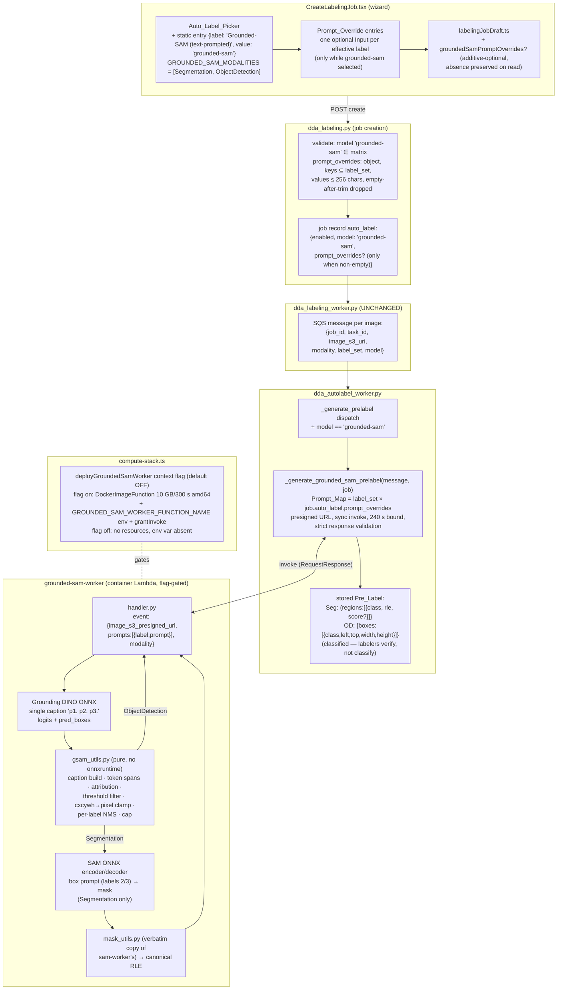

# Design Document — Grounded-SAM Auto-Labeling

## Overview

This feature adds a fourth auto-label model family, `grounded-sam`, as a deliberate structural twin of the existing `sam` family: a new container-image Lambda (`backend/grounded-sam-worker`, CDK `DdaGroundedSamWorker`) gated behind its own context flag, a new `_generate_grounded_sam_prelabel` path in the auto-label worker, a static picker entry in the wizard, one new persisted key on the job's `auto_label` document (`prompt_overrides`), and one additive-optional field on the session-recovery draft. The pipeline inside the worker is Grounded-SAM: Grounding DINO (ONNX, CPU) maps the job's label names — optionally rephrased per label — to scored bounding boxes; for Segmentation, a SAM-family ONNX decoder converts each box into a mask. The output is the family's differentiator: **classified pre-labels** (regions/boxes already tagged with Label_Set classes) where `sam` produces class-agnostic proposals.

Decisions that shape the design:

- **Mirror the sam-worker pattern verbatim, seam for seam.** Every integration seam reuses a mechanism that already exists one screen away: `DockerImageFunction` gated on a context flag with default-off (compute-stack.ts ~2115-2177), models baked at build time behind overridable build-arg URLs (sam-worker/Dockerfile), synchronous invoke with a 15-minute presigned image URL and a read-timeout-bounded Lambda client with a module-level test injection point (`dda_autolabel_worker.py` ~777-855), strict response-shape guards raising `GenerationFailure`, and pure logic split into an import-safe module tested without onnxruntime (`mask_utils.py` / `test_dda_sam_worker_mask_utils.py`). Rationale: the sam worker's design already answered this feature's operational questions (Docker cost gating, missing-worker degradation, arch pinning, warm-session caching); diverging would create a second way to do the same thing.

- **One Grounding DINO forward per image, with pure-function prompt attribution — not one forward per label.** The worker concatenates the Prompt_Map's prompts into a single caption (`"small surface dent. scratch. discoloration."` — lowercased, dot-separated, the model's canonical multi-phrase query format) and runs DINO once. Each detection is then attributed to exactly one prompt by mapping the model's per-token confidence back to the token span of each phrase — a pure function over integer token ids and score arrays. Rationale: a per-label forward is O(labels) × tens of seconds on CPU (a 10-label set could exceed 5 minutes, blowing the Lambda envelope), while the single-caption form is the model's native usage (its `post_process_grounded_object_detection` contract) and keeps the per-image cost flat. The span-attribution logic lives in the pure module where property tests can hammer it without onnxruntime.

- **Classified output end to end; ObjectDetection stores the Bedrock shape exactly.** For Segmentation the stored Pre_Label is `{modality, regions: [{class, rle, score?}], image_width, image_height}` — the same shape the sam path stores except `class` is a Label_Set name instead of `null`; the labeler workspace already renders classed regions (the `llm:` Segmentation path produces them — `AnnotationCanvas.tsx` ~374-393 maps `region.class` to a class index). For ObjectDetection the stored Pre_Label is `{modality, boxes: [{class, left, top, width, height}], image_width, image_height}` — byte-compatible with `_validate_boxes`' output (dda_autolabel_worker.py ~564-604), the shape `AnnotationCanvas` initializes editable boxes from (`prelabel?.boxes` ~287). The worker's own response nests OD geometry under `box` per region (so the worker contract is uniform across modalities); the consumer maps it to the stored `boxes` shape and drops `score` there, because `DdaBoundingBox` (api.ts ~553) carries no score and the Bedrock OD path stores none. No frontend consumption change of any kind.

- **Prompt_Overrides ride the job record; the SQS fan-out message is untouched.** `_process_message` already fetches the full job item for every record (dda_autolabel_worker.py ~974), so `_generate_grounded_sam_prelabel(message, job)` reads `job['auto_label']['prompt_overrides']` directly, and the Prompt_Map is derived beside the invoke from `message['label_set']` + the record's overrides. Rationale: zero message-schema surface means in-flight messages across a deployment process correctly by construction, and the fan-out function (`_enqueue_autolabel_messages`) needs no edit at all — one fewer writer on a shared file. This follows the same total/defaulting posture as the `llm:` family's job-record reads (absent key → defaults, never a failure).

- **New family key `prompt_overrides`, not a reuse of `per_label_prompts`.** The existing top-level `per_label_prompts` is the skip-verification field: required for every label, driving Bedrock question prompts, validated as total over the Label_Set. Grounded-sam's overrides are optional per label with a fall-back-to-label-name rule — different validation, different consumer, different lifetime. Sharing the key would entangle the admin-only skip-verification flow with an ordinary-user feature (Requirement 7.5 keeps skip-verification byte-identical). The new key lives *inside* `auto_label` (like `detection_prompt`, `few_shot`, `downscale_max_edge`) because it is model-family configuration.

- **Additive-optional draft field with absent-preserved normalization.** The draft interface gains `groundedSamPromptOverrides?: Record<string, string>`. The field-by-field reader (`conformingDraft`) validates it with the existing `asStringRecord` helper when present, **rejects the draft when present-but-malformed** (the module's established rule), and — the load-bearing detail — **preserves absence as absence** rather than defaulting to `{}` in the normalized object. Consumers default at the read site (`draft.groundedSamPromptOverrides ?? {}` in the restore path and in `draftsEquivalent`). Rationale: absence-preserved normalization is what keeps every pre-feature draft *and every existing pinned draft test* green without modification — the round-trip property (`labelingJobDraft.storage.property.test.ts` Property 1) asserts `readBack` deep-equals the written draft, and a reader that injected `groundedSamPromptOverrides: {}` into a draft written without the key would fail it. With absence preserved, the four existing draft-constructing test files (`makeDraft`, two draft literals, `draftArb`) compile and pass untouched, and the new coverage is appended as new describes/files. No version bump: old drafts restore with zero overrides (Requirement 6.3).

- **MobileSAM (samexporter convention) is the default mask model; SAM 2 is a swap-in, not the default.** The user request names SAM 2, and the worker's box→mask contract is model-agnostic: the samexporter-style decoder takes a box prompt as the canonical two-point (top-left label 2, bottom-right label 3) encoding, and any export following the `*encoder*.onnx` / `*decoder*.onnx` naming drops in via the same archive build-arg. Considered and rejected as the *default*: pinning a SAM 2 export. There is no packaged, stable CPU encoder/decoder SAM 2 archive under the samexporter convention to pin as a build-arg default today (the vietanhdev archive repo carries SAM-1-family bundles only: mobile_sam, vit_b/l/h — verified), while MobileSAM is the exact bundle the sibling sam-worker already bakes, with known CPU latency inside the Lambda envelope. The design keeps the mask pass strictly behind the archive-URL seam so a SAM 2 CPU export (or `sam_vit_b` for quality) deploys with `-c groundedSamModelArchiveUrl=...` and zero code change.

- **Detection thresholds: env-var defaults, no UI (scope decision).** `GROUNDED_SAM_BOX_THRESHOLD` (0.35) and `GROUNDED_SAM_TEXT_THRESHOLD` (0.25) — the IDEA-Research demo defaults — plus the dedupe IoU and max-detections cap, all read once at module import like the sam worker's knobs. Considered and rejected: wizard-level threshold controls (per the requirements introduction — tuning knobs, not job configuration; would drag validation, persistence, and draft schema along).

- **Considered and rejected — prompt tuning preview for grounded-sam.** The preview executor is the `llm:` chokepoint (`dda_llm_prelabel.generate_llm_prelabel`, shared by preview and labeling). A grounded-sam preview needs the worker deployed in the loop and a second executor path; the overrides are short phrases cheap to iterate by re-creating a job. Deferred as a follow-up; recorded so the omission is legible.

- **Considered and rejected — surfacing overrides on the job detail page.** `LabelingDetail.tsx` renders `auto_label.detection_prompt` for `llm:` jobs only (~230, ~420); rendering overrides is display-only value with test surface on a page this feature otherwise never touches. Follow-up if asked.

- **Invocation bound 240 s for this family (vs sam's 120 s).** Grounding DINO tiny on Lambda CPU (10 GB ⇒ ~6 vCPU) runs tens of seconds per forward; adding the SAM encoder pass and per-box decodes keeps worst cases near or past 120 s. The consumer's read timeout and the recorded bound become `GROUNDED_SAM_MAX_TIMEOUT_SECONDS = 240` — inside the worker's own 300 s Lambda timeout with margin for the consumer to record the failure, and a distinct constant so the sam family's 120 s stays byte-identical (Requirement 7.4).

### Research notes informing the design

- **Grounding DINO tiny ONNX export**: `onnx-community/grounding-dino-tiny-ONNX` on Hugging Face (Apache-2.0) carries `onnx/model.onnx` (full-precision single-graph export), `tokenizer.json`, and `vocab.txt` — verified via the repo file listing. The model card's usage notes: text queries are lowercased and dot-terminated; the canonical post-processing thresholds are `box_threshold`/`text_threshold` (0.3 in the card's example; the IDEA-Research Grounded-SAM demo ships 0.35/0.25, which this design adopts as defaults). Inputs: `pixel_values` (ImageNet-normalized, shortest-edge-800 resize per the repo's `preprocessor_config.json`) plus tokenized caption tensors (`input_ids`, `attention_mask`, `token_type_ids`); outputs: per-query `logits` over text tokens and `pred_boxes` in normalized cxcywh. Pinned default URLs: `https://huggingface.co/onnx-community/grounding-dino-tiny-ONNX/resolve/main/onnx/model.onnx` and `.../resolve/main/tokenizer.json`.
- **Tokenization without torch/transformers**: the `tokenizers` pip package (Rust wheel, no heavy deps) loads `tokenizer.json` directly — the worker's only new Python dependency beside the sam-worker trio (onnxruntime/numpy/pillow). The tokenizer handles the BERT-uncased lowercasing; the pure caption builder still normalizes phrases (strip + lowercase + dot-join) so span bookkeeping is deterministic.
- **SAM box prompts**: the samexporter ONNX decoder (already baked by `sam-worker`) takes box prompts as two points labeled 2 (top-left) and 3 (bottom-right) in `point_coords`/`point_labels` — the canonical SAM ONNX export contract. The existing `_run_decoder` (sam-worker/handler.py ~232) feeds single-point prompts with a padding point; the new worker feeds the box-point pair instead, everything else (embeddings, `orig_im_size`, mask threshold 0.0) identical. Default archive: `https://huggingface.co/vietanhdev/segment-anything-onnx-models/resolve/main/mobile_sam_20230629.zip` — the same default the sam-worker Dockerfile pins; that repo carries SAM-1-family bundles only (verified), hence the MobileSAM-default decision above.
- **Verified consumption anchors** (all read during design): `dda_autolabel_worker.py` — `SAM_MODALITIES`/bounds ~150-160, `_get_sam_lambda_client` ~777, `_generate_sam_prelabel` ~796-855, `_generate_prelabel` dispatch ~958-970, `_process_message` job fetch ~974; `dda_labeling.py` — `AUTO_LABEL_MODEL_MODALITIES` ~217-222, model validation ~1618-1672 (the invalid-model message is pinned by substring `"'sam' or 'bedrock:<model_id>'"` in `test_dda_labeling_create_job.py` ~622 — the extension prepends `'grounded-sam', ` so the pin survives), `auto_label` persistence ~1803-1826, audit details ~1848-1860; `dda_labeling_worker.py` — fan-out ~413-470 (**no change**: model value flows through, overrides ride the job record); `CreateLabelingJob.tsx` — matrices ~78-84, `isAutoLabelModelCompatible` ~162-172, incompatible-clear effect ~504, option building ~550-600, `validateDdaSetup` ~787-870, draft build/restore ~655-737/~1059-1131, submit payload ~1249-1283, model Select ~1841-1866, skip-verification per-label prompt UI pattern ~2079-2104; `labelingJobDraft.ts` — `conformingDraft` ~235-330, `draftsEquivalent` ~482-530, `asStringRecord` ~160-175; `compute-stack.ts` — sam worker block ~2107-2177.
- **Pinned-test blast radius of the new picker entry** (drives the Testing Strategy's one permitted mechanical edit class): `CreateLabelingJob.modelpicker.property.test.tsx` pins the picker's *exact* option structure via a restated oracle (`expectedAutoLabelOptions`, ~233-273; asserted `toEqual(expected.grouped)` ~403), and `CreateLabelingJob.modelpicker.test.tsx` pins full-list option counts (`displayedOptionCount(...)).toBe(5)` at ~327/385/457 and `.toBe(1)` at ~474, all under ObjectDetection where the new entry is offered). Any new static entry moves these by construction. Every other pinned suite is unaffected: search-narrowed counts don't match the new label ("nova"/"claude"/"us.anthropic"/"titan" are not substrings of "Grounded-SAM (text-prompted)" or `grounded-sam`), the draft suites compile-and-pass via absence-preserved normalization, `test_dda_labeling_create_job.py`'s message pin survives the prepend, and `PromptTuningPreview.property.test.tsx`/fewshot/sizing suites never select the new value.

## Architecture



Failure degradation when the worker is not deployed (the default): the dispatch reaches `_generate_grounded_sam_prelabel`, the env check fails, and every image resolves `prelabel_status=Failed` with "worker is not configured" — exactly the sam family's behavior, leaving the job labelable from scratch.

## Components and Interfaces

### 1. New worker — `edge-cv-portal/backend/grounded-sam-worker/`

Four files, mirroring `sam-worker`'s layout:

**`gsam_utils.py` (new, pure)** — standard-library only, import-safe without onnxruntime/numpy (the `mask_utils` precedent). Module constants (env-read defaults happen in `handler.py`; the pure functions take explicit parameters):

```python
DEFAULT_BOX_THRESHOLD = 0.35      # IDEA-Research Grounded-SAM demo default
DEFAULT_TEXT_THRESHOLD = 0.25     # ditto
DEFAULT_MAX_DETECTIONS = 20       # mirrors mask_utils.DEFAULT_MAX_REGIONS
DEFAULT_BOX_NMS_IOU = 0.8         # greedy per-label box dedupe

def normalize_prompts(prompts) -> list[dict]:
    # [{label, prompt}] -> validated, order-preserving list; prompt falls
    # back to the label when empty after strip; raises ValueError on
    # non-list input, non-dict entries, or empty/blank labels (Req 3.8).

def build_caption(prompt_texts) -> tuple[str, list[str]]:
    # normalized phrases (strip, lowercase, inner-whitespace collapse,
    # trailing-dot strip) joined as 'p1. p2. p3.' — the model's canonical
    # multi-phrase caption; returns (caption, phrases) (Req 3.3).

def phrase_token_spans(token_ids, separator_ids, special_ids) -> list[tuple[int, int]]:
    # consecutive [start, end) index runs of non-separator, non-special
    # tokens — one span per phrase, in caption order. Pure over int lists.

def attribute_detection(token_scores, spans, box_threshold, text_threshold):
    # one query's per-token scores -> (phrase_index, score) | None:
    # score = max token score within the best span; None when below
    # box_threshold or the best span's max is below text_threshold
    # (Req 3.3, 3.4 — every detection maps to exactly one phrase).

def cxcywh_to_pixel_box(box, width, height) -> dict | None:
    # normalized (cx, cy, w, h) -> {'left','top','width','height'} floats
    # clamped to [0,width]x[0,height]; None when the clamped area is not
    # positive (Req 3.6). Total for any finite inputs.

def box_iou(a, b) -> float

def select_detections(candidates, max_detections, iou_threshold) -> list[dict]:
    # candidates: [{'label_index', 'score', 'box'}] -> greedy score-descending
    # per-label NMS, then global cap keeping highest scores (Req 3.4).
```

**`mask_utils.py` (verbatim copy of `sam-worker/mask_utils.py`)** — the canonical RLE encoder and mask helpers. The Docker build context is the worker directory, so cross-directory COPY is unavailable; the copy is the sam-worker's own precedent (it duplicates the shared layer's `dda_manifest.rle_encode` deliberately, pinned by equality tests). A drift guard in the new test file asserts the two copies are byte-identical (Req 3.7).

**`handler.py` (new)** — lazy heavy imports (numpy/onnxruntime/Pillow/tokenizers inside functions), module-level cached sessions for warm invocations, following `sam-worker/handler.py` structure:

- Env config: `GROUNDED_SAM_MODEL_PATH=/opt/models` (glob discovery: `grounding_dino*.onnx`, `tokenizer.json`, `*encoder*.onnx`, `*decoder*.onnx`), explicit-path overrides (`GROUNDING_DINO_MODEL_PATH`, `GROUNDING_DINO_TOKENIZER_PATH`, `SAM_ENCODER_PATH`, `SAM_DECODER_PATH`), `GROUNDED_SAM_BOX_THRESHOLD` (0.35), `GROUNDED_SAM_TEXT_THRESHOLD` (0.25), `GROUNDED_SAM_NMS_IOU_THRESHOLD` (0.8), `GROUNDED_SAM_MAX_DETECTIONS` (20), `GROUNDED_SAM_MASK_THRESHOLD` (0.0), `GROUNDED_SAM_DINO_SIZE` (800 shortest edge, 1333 longest cap), `GROUNDED_SAM_URL_FETCH_TIMEOUT` (30) (Req 3.5, 3.9).
- `lambda_handler(event)`: validate event (raise `ValueError` on malformed input so the synchronous caller records a generation failure — Req 3.8); fetch and decode the image (presigned https URL, the sam handler's `_load_image_bytes` pattern); tokenize the caption from `gsam_utils.build_caption`; one DINO forward (`pixel_values` ImageNet-normalized shortest-edge-800 resize + caption tensors); sigmoid the logits and run the pure attribution/filter/NMS pipeline; for ObjectDetection return `{'regions': [{'class', 'score', 'box': {...}}], 'image_width', 'image_height'}`; for Segmentation run the SAM encoder once, decode each retained box (point pair labeled 2/3 — the canonical box-prompt encoding), threshold logits at `GROUNDED_SAM_MASK_THRESHOLD`, RLE-encode at source resolution (vectorized, `runs_to_rle` — the `_rle_encode_fast` pattern), and return `{'regions': [{'class', 'score', 'rle'}], ...}` (Req 3.1, 3.2). Zero retained detections return `{'regions': [], ...}` as a success (Req 3.10).

**`Dockerfile` (new)** — `FROM public.ecr.aws/lambda/python:3.12`, pip install `requirements.txt`, then bake models with overridable build args and pinned defaults (Req 3.9, 5.3):

```
ARG GROUNDING_DINO_MODEL_URL="https://huggingface.co/onnx-community/grounding-dino-tiny-ONNX/resolve/main/onnx/model.onnx"
ARG GROUNDING_DINO_TOKENIZER_URL="https://huggingface.co/onnx-community/grounding-dino-tiny-ONNX/resolve/main/tokenizer.json"
ARG SAM_MODEL_ARCHIVE_URL="https://huggingface.co/vietanhdev/segment-anything-onnx-models/resolve/main/mobile_sam_20230629.zip"
```

staged as `/opt/models/grounding_dino.onnx`, `/opt/models/tokenizer.json`, `/opt/models/sam.encoder.onnx`, `/opt/models/sam.decoder.onnx` (the archive-extraction Python heredoc reuses the sam-worker Dockerfile's, including the `*encoder*/*decoder*` naming check). **`requirements.txt`**: `onnxruntime==1.19.2`, `numpy==1.26.4`, `pillow==10.4.0` (the sam-worker pins) plus `tokenizers==0.20.3`.

### 2. Auto-labeler — `edge-cv-portal/backend/functions/dda_autolabel_worker.py`

All additions sit beside the sam path; no existing line changes except the dispatch (Req 7.4):

- Constants (~128-160): `GROUNDED_SAM_WORKER_FUNCTION_NAME = os.environ.get(...)`, `GROUNDED_SAM_MODALITIES = (MODALITY_SEGMENTATION, MODALITY_OBJECT_DETECTION)`, `GROUNDED_SAM_MAX_TIMEOUT_SECONDS = 240` (decision above), test injection point `grounded_sam_lambda_client = None` with `_cached_grounded_sam_lambda_client`.
- `_get_grounded_sam_lambda_client()` — clone of `_get_sam_lambda_client` with the 240 s read timeout, retries disabled (Req 4.3).
- `_grounded_sam_prompts(label_set, overrides) -> list` — the consumer-side Prompt_Map (pure; total over malformed `overrides`): one `{'label': l, 'prompt': override-or-label}` per label in order, an override applying only when it is a `str` non-empty after strip (Req 2.7, 4.1).
- `_generate_grounded_sam_prelabel(message, job)` — modality gate against `GROUNDED_SAM_MODALITIES`; env check → `GenerationFailure('Grounded-SAM worker function is not configured')` (Req 4.2); presigned URL via the existing `_dataset_s3_client`/`PRESIGNED_URL_EXPIRY_SECONDS`; payload `{'image_s3_presigned_url', 'prompts', 'modality'}`; invoke guards mirroring the sam path (invocation exception, `FunctionError`, unparseable payload, non-list `regions`, non-int dims → `GenerationFailure`, Req 4.3-4.4); per-region validation (class ∈ `message['label_set']`; Segmentation: non-empty `rle`; ObjectDetection: `box` object with float-coercible geometry, positive width/height, non-negative origin, within the returned dims — the `_validate_boxes` rules, Req 4.5); stored shapes per Req 4.6/4.7 (Segmentation regions keep `score` when present, mirroring sam; OD boxes drop `score` and store exactly `{class, left, top, width, height}` floats).
- Dispatch in `_generate_prelabel` (~958): `if model == 'grounded-sam': return _generate_grounded_sam_prelabel(message, job)` before the `bedrock:`/`llm:` prefix branches, beside the sam exact-match — exact string matches, no prefix interplay. Everything downstream (`_write_prelabel`, `_mark_task`, skip-verification counters, storage-failure retry semantics) is reached through the same calls the sam path makes and is untouched (Req 4.8; storage failures stay transient for this family — `storage_failure_is_terminal` keys off the `llm:` prefix only).

### 3. Job creation — `edge-cv-portal/backend/functions/dda_labeling.py`

- `AUTO_LABEL_MODEL_MODALITIES` (~217) gains `'grounded-sam': ('Segmentation', 'ObjectDetection')` (Req 1.5, 1.6 via the existing matrix check).
- Module constant `PROMPT_OVERRIDE_MAX_LENGTH = 256` beside `DETECTION_PROMPT_MAX_LENGTH` (Req 2.6).
- Validation branch (~1618, between the `'sam'` and `bedrock:` arms): `elif auto_label_model == 'grounded-sam': model_family = 'grounded-sam'`, then `prompt_overrides` validation — accepted absent; when present must be a dict; each key must be a member of the submitted Label_Set (else a validation error naming the key); each value must be a string (else error) of raw length ≤ 256 (else an error naming the label); values empty after strip are dropped; survivors kept character-for-character (Req 2.4, 2.5, 2.6).
- Invalid-model message (~1659) becomes `"Auto-label model must be 'grounded-sam', 'sam' or 'bedrock:<model_id>'"` — the prepend preserves the pinned substring `"'sam' or 'bedrock:<model_id>'"` (`test_dda_labeling_create_job.py` ~622) so the existing assertion stays green.
- Persistence (~1803): one conditional key in the `auto_label` document — `**({'prompt_overrides': prompt_overrides} if model_family == 'grounded-sam' and prompt_overrides else {})` — absent for every other family and for override-free grounded-sam jobs (Req 2.4, 2.8, 7.1).
- Audit details (~1848): no code change needed — `auto_label_model` and `auto_label_mode` flow from `auto_label_model`/`model_family` (Req 1.7).

### 4. Wizard — `edge-cv-portal/frontend/src/pages/CreateLabelingJob.tsx`

- `export const GROUNDED_SAM_MODALITIES = ['Segmentation', 'ObjectDetection'];` beside the existing matrices (~84); `export const MAX_PROMPT_OVERRIDE_LENGTH = 256;` (Req 1.1, 2.6).
- `isAutoLabelModelCompatible` (~162): `if (modelValue === 'grounded-sam') return GROUNDED_SAM_MODALITIES.includes(taskType);` — exact match beside `'sam'`'s; the incompatible-clear effect (~504) then covers Req 1.4 with no further change.
- State: `const [groundedSamPromptOverrides, setGroundedSamPromptOverrides] = useState<Record<string, string>>({});` (Req 2.1).
- Option building (~550): `const groundedSamAutoLabelOptions = GROUNDED_SAM_MODALITIES.includes(modality) ? [{ label: 'Grounded-SAM (text-prompted)', value: 'grounded-sam' }] : [];` spliced immediately after `samAutoLabelOptions` in both `flatAutoLabelOptions` and the grouped `autoLabelOptions` (static entries before the model-family groups, Req 1.1, 7.2). The Select's `FormField` description (~1838) gains "; Grounded-SAM turns label names into text prompts for segmentation and object detection" (not pinned by any test — verified).
- Override entries (rendered inside the auto-label section, gated `autoLabelEnabled && autoLabelModel === 'grounded-sam'`): the skip-verification per-label pattern (~2079-2104) reused with single-line `Input`s — `effectiveLabelSet.map((label) => <FormField label={`Text prompt for "${label}"`} description="Optional. Sent to Grounding DINO instead of the label name." constraintText="Optional, at most 256 characters"><Input value={groundedSamPromptOverrides[label] || ''} placeholder={label} onChange=... /></FormField>)`, with the empty-label-set `Alert` fallback (Req 2.1, 2.2 — the block renders for no other selection).
- `validateDdaSetup` (~787): when `autoLabelModel === 'grounded-sam'`, reject any override of raw length > 256 with an error naming the label (Req 2.6). Nothing else: overrides are optional, and the `llm:`-gated rules never fire for the value (Req 7.3 — `'grounded-sam'.startsWith('llm:')` is false, so few-shot/sizing resets and prompt gating behave as for `sam`).
- Submit payload (~1249): inside the existing `auto_label` spread, `...(autoLabelModel === 'grounded-sam' ? (() => { const entries = effectiveLabelSet.filter((l) => (groundedSamPromptOverrides[l] || '').trim() !== '').map((l) => [l, groundedSamPromptOverrides[l]]); return entries.length > 0 ? { prompt_overrides: Object.fromEntries(entries) } : {}; })() : {})` — raw values, pruned to the effective Label_Set, key omitted when empty (Req 2.3, 2.8).
- Draft wiring: `buildDraft` (~1059) always includes `groundedSamPromptOverrides` (and adds it to the `useCallback` deps); `applyDraftRestore` (~655) sets `setGroundedSamPromptOverrides(draft.groundedSamPromptOverrides ?? {})` (Req 6.1, 6.2, 6.3).

### 5. Draft module — `edge-cv-portal/frontend/src/pages/labelingJobDraft.ts`

- Interface: `groundedSamPromptOverrides?: Record<string, string>;` documented as this feature's additive-optional field (Req 6.1).
- `conformingDraft`: `const rawOverrides = record.groundedSamPromptOverrides; const groundedSamPromptOverrides = rawOverrides === undefined ? undefined : asStringRecord(rawOverrides); if (rawOverrides !== undefined && groundedSamPromptOverrides === undefined) return null;` and the rebuilt object spreads `...(groundedSamPromptOverrides !== undefined ? { groundedSamPromptOverrides } : {})` — absence preserved, present-but-malformed rejected (Req 6.3, 6.4; the `asStringRecord` helper already handles the `__proto__`-key subtlety).
- `draftsEquivalent`: `stringRecordsEqual(a.groundedSamPromptOverrides ?? {}, b.groundedSamPromptOverrides ?? {})` appended to the conjunction (Req 6.5 — an override edit makes the state Draft_Worthy).

### 6. API client — `edge-cv-portal/frontend/src/services/api.ts`

`createLabelingJob`'s `auto_label` parameter type (~1875) and `getLabelingJob`'s response `auto_label` type (~1965) each gain `prompt_overrides?: Record<string, string>;` with a doc comment citing this spec. Type-only; no request or consumer change.

### 7. Infrastructure — `edge-cv-portal/infrastructure/lib/compute-stack.ts`

A sibling block directly under the `deploySamWorker` block (~2177), mirroring it clause for clause (Req 5.1-5.3, 5.5):

```typescript
const deployGroundedSamWorkerContext = this.node.tryGetContext('deployGroundedSamWorker');
const deployGroundedSamWorker =
  deployGroundedSamWorkerContext === true || deployGroundedSamWorkerContext === 'true';
if (deployGroundedSamWorker) {
  const dinoModelUrl = this.node.tryGetContext('groundedSamDinoModelUrl');
  const dinoTokenizerUrl = this.node.tryGetContext('groundedSamDinoTokenizerUrl');
  const samArchiveUrl = this.node.tryGetContext('groundedSamModelArchiveUrl');
  const ddaGroundedSamWorker = new lambda.DockerImageFunction(this, 'DdaGroundedSamWorker', {
    code: lambda.DockerImageCode.fromImageAsset(
      path.join(__dirname, '../../backend/grounded-sam-worker'),
      {
        platform: ecrAssets.Platform.LINUX_AMD64,   // same qemu-correctness rationale as DdaSamWorker
        buildArgs: {
          ...(dinoModelUrl ? { GROUNDING_DINO_MODEL_URL: dinoModelUrl } : {}),
          ...(dinoTokenizerUrl ? { GROUNDING_DINO_TOKENIZER_URL: dinoTokenizerUrl } : {}),
          ...(samArchiveUrl ? { SAM_MODEL_ARCHIVE_URL: samArchiveUrl } : {}),
        },
      },
    ),
    architecture: lambda.Architecture.X86_64,
    description: 'DDA labeling Grounded-SAM pre-label worker (CPU ONNX Grounding DINO + SAM)',
    memorySize: 10240,
    timeout: cdk.Duration.seconds(300),
  });
  ddaAutolabelWorker.addEnvironment('GROUNDED_SAM_WORKER_FUNCTION_NAME', ddaGroundedSamWorker.functionName);
  ddaGroundedSamWorker.grantInvoke(ddaAutolabelWorker);
}
```

No CDK-level threshold environment block: the handler defaults (0.35/0.25) are the intended values, and retuning is a Lambda-console/env change, not a redeploy (contrast: `DdaSamWorker` overrides its handler defaults because its tuned grid values differ — this worker's don't). The worker needs no S3/table grants: the image arrives by presigned URL (the sam-worker rationale verbatim).

### 8. Explicitly unchanged components

| Component | Anchor | Disposition |
|---|---|---|
| `dda_labeling_worker.py` fan-out | `_enqueue_autolabel_messages` ~413-470 | **no change** — model value flows through; overrides ride the job record (design decision) |
| `DdaSamWorker` + `deploySamWorker` gating | compute-stack.ts ~2107-2177 | byte-identical (Req 5.5, 7.1) |
| `sam-worker/` (Dockerfile, handler, mask_utils) | backend/sam-worker | byte-identical (Req 7.1, 7.4); its `mask_utils.py` is *copied*, never edited |
| `_generate_sam_prelabel`, `SAM_MAX_TIMEOUT_SECONDS`, sam client | dda_autolabel_worker.py ~777-855 | byte-identical, incl. the 120 s bound (Req 7.4) |
| Skip-verification validation/persistence/fan-out (`per_label_prompts` top-level field) | dda_labeling.py ~1509-1560, ~1838; dda_labeling_worker.py ~452 | byte-identical (Req 7.5) |
| `llm:` controls (detection prompt, few-shot, sizing, preview) | CreateLabelingJob.tsx `llm:`-gated blocks | unchanged; never render for `grounded-sam` (Req 7.3) |
| Model catalog endpoint + capability filter + picker search | data_accounts.py; CreateLabelingJob.tsx ~550-600 Select props | unchanged; the new entry is static, outside the catalog families (Req 7.2) |
| Labeler workspace | AnnotationCanvas.tsx, LabelingDetail.tsx, api.ts DdaAnnotation types | no change — stored shapes are existing ones (Req 4.6, 4.7) |

## Data Models

**Job record `auto_label` document** (DynamoDB `LabelingJobs` item; only the grounded-sam-relevant keys shown):

| Key | Type | Present when | Semantics |
|---|---|---|---|
| `enabled` | bool | always | model-assisted pre-labeling on |
| `model` | string | enabled | now additionally `'grounded-sam'` |
| `prompt_overrides` | map label→string | **this feature**: model is `grounded-sam` AND ≥1 override survived validation | raw override text, character-for-character; keys ⊆ Label_Set |
| `detection_prompt`, `few_shot`, `downscale_max_edge`, `token_budget` | — | `llm:` family only | untouched; never coexist with `prompt_overrides` |

**Prompt_Map derivation** (Req 2.7 — computed in the Auto_Labeler per image, also restated in the worker's `normalize_prompts` fallback rule):

```
prompts = [ {label: l, prompt: overrides[l] if is_nonblank_str(overrides.get(l)) else l}
            for l in label_set ]      # Label_Set order preserved
```

**Grounded_SAM_Worker event** (RequestResponse payload):

```json
{"image_s3_presigned_url": "https://...",
 "prompts": [{"label": "dent", "prompt": "small surface dent"}, {"label": "scratch", "prompt": "scratch"}],
 "modality": "Segmentation" | "ObjectDetection",
 "max_detections": 20}
```
(`max_detections` optional; env default when absent.)

**Grounded_SAM_Worker response**:

```json
// Segmentation
{"regions": [{"class": "dent", "rle": "12 3 9 3 21", "score": 0.61}],
 "image_width": 640, "image_height": 480}
// ObjectDetection
{"regions": [{"class": "dent", "box": {"left": 10.0, "top": 22.5, "width": 41.0, "height": 18.0}, "score": 0.61}],
 "image_width": 640, "image_height": 480}
```

**Stored Pre_Label** (S3 `labeling/{usecase}/{job}/prelabels/{task}.json` — both shapes pre-exist; only the class values are new for this family):

```json
// Segmentation (the sam shape, classified)
{"modality": "Segmentation",
 "regions": [{"class": "dent", "rle": "12 3 9 3 21", "score": 0.61}],
 "image_width": 640, "image_height": 480}
// ObjectDetection (the Bedrock shape, byte-compatible with _validate_boxes output)
{"modality": "ObjectDetection",
 "boxes": [{"class": "dent", "left": 10.0, "top": 22.5, "width": 41.0, "height": 18.0}],
 "image_width": 640, "image_height": 480}
```

**Setup_Draft field** (localStorage, version 1 — no bump):

| Field | Type | Read rule |
|---|---|---|
| `groundedSamPromptOverrides` | `Record<string, string>`, **optional** | absent → accepted, restored as `{}` at the consumer; present & conforming → normalized in; present & non-conforming → whole draft rejected (existing rule) |

**Frontend wizard state**: `groundedSamPromptOverrides: Record<string, string>` keyed by label name as typed; pruned to the effective Label_Set only at submit (stale keys from renamed labels linger harmlessly in state/draft and are never transmitted).

## Correctness Properties

*A property is a characteristic or behavior that should hold true across all valid executions of a system — essentially, a formal statement about what the system should do. Properties serve as the bridge between human-readable specifications and machine-verifiable correctness guarantees.*

Each property gets exactly one property-based test at a minimum of 100 iterations (Hypothesis `@settings(max_examples=100, deadline=None)` backend, fast-check `{ numRuns: 100 }` frontend), tagged `Feature: grounded-sam-autolabel, Property {n}: {title}`. The prework analysis was consolidated: picker structure facts (1.1, 1.2, 7.2) collapse into Property 1; the wizard's pruning and the backend's normalization are deliberately *separate* properties (different implementations of adjacent rules — the wizard prunes, the backend re-validates); the worker's pure pipeline yields four properties over four pure functions rather than one weak composite; and the draft coverage mirrors the session-recovery spec's round-trip/tolerant-read split. Whole-model inference (Req 3.1, 3.2, 3.9) and flag-on synthesis (Req 5.1, 5.3) are **deliberately not properties**: they require multi-gigabyte model artifacts or Docker builds that unit iterations cannot buy coverage for — they are verified by the gated deploy step (integration), per the prework classification.

### Property 1: The picker offers the pre-feature options plus exactly the Grounded-SAM entry for its modalities

*For any* wizard modality (Classification, Segmentation, ObjectDetection) and *any* model catalog (options mixing `image_input: true` / `false` / absent), the Auto_Label_Picker's option structure SHALL equal the pre-feature oracle (SAM entry per its matrix, capability-filtered decorated Bedrock and LLM groups) with exactly one addition: the static entry `{label: 'Grounded-SAM (text-prompted)', value: 'grounded-sam'}` present immediately after the SAM entry when the modality is Segmentation or ObjectDetection, and absent when the modality is Classification.

**Validates: Requirements 1.1, 1.2, 7.2**

### Property 2: The submitted job carries exactly the surviving overrides, raw, or no key at all

*For any* set of label rows and *any* Prompt_Override entry state (values mixing empty, whitespace-only, unicode, boundary-length strings, and entries keyed by labels since renamed or removed), submitting a `grounded-sam` job SHALL send `auto_label.prompt_overrides` equal to exactly the entries that are non-empty after trimming and whose label is in the effective Label_Set, each value character-for-character as entered, with the key omitted entirely when no entry survives; and *for any* non-`grounded-sam` submission the payload SHALL carry no `prompt_overrides` key.

**Validates: Requirements 2.3, 2.8**

### Property 3: Job creation persists the model and the normalized overrides

*For any* valid `grounded-sam` submission (Segmentation or ObjectDetection, any Label_Set, any override map of in-Label_Set keys with string values ≤ 256 characters mixing blank and non-blank), THE created job record SHALL carry `auto_label.model == 'grounded-sam'` and `auto_label.prompt_overrides` equal to exactly the non-blank-after-trim entries character-for-character, with the key absent when none survives.

**Validates: Requirements 1.5, 2.4**

### Property 4: Malformed overrides are rejected and nothing persists

*For any* `grounded-sam` submission whose `prompt_overrides` is not an object of string values, carries a key outside the submitted Label_Set, or carries a value whose raw length exceeds 256 characters, THE creation request SHALL be rejected with a validation error identifying the offense, and no job record SHALL be persisted.

**Validates: Requirements 2.5, 2.6**

### Property 5: Prompt_Map derivation is total, ordered, and falls back to label names

*For any* Label_Set and *any* `prompt_overrides` value (a conforming map, a map with extra or non-string entries, None, or a non-dict), the consumer's Prompt_Map SHALL contain exactly one `{label, prompt}` pair per Label_Set label in Label_Set order, with `prompt` equal to the label's override exactly when that override is a string non-empty after trimming, and the label name otherwise — including for pre-feature job records carrying no overrides at all.

**Validates: Requirements 2.7, 7.6**

### Property 6: Caption spans partition the prompts and attribution is a function onto them

*For any* list of prompt phrases (unicode, embedded dots, mixed whitespace), the built caption's phrase token spans SHALL be disjoint, ordered, and one-per-phrase; and *for any* per-token score vector, `attribute_detection` SHALL either return an index of exactly one phrase span with a score meeting the Box_Threshold and that span's Text_Threshold, or drop the detection — so every emitted class is a supplied prompt label.

**Validates: Requirements 3.3**

### Property 7: The detection selection pipeline yields bounded, thresholded, deduplicated, capped detections

*For any* set of raw candidate detections (normalized cxcywh boxes drawn across in-range, out-of-range, and degenerate values; arbitrary scores; arbitrary label indices) and *any* image dimensions, the selected detections SHALL be a subset of the candidates whose clamped pixel boxes lie within `[0, width] × [0, height]` with positive area, whose scores meet the Box_Threshold, in which no two same-label detections overlap at or above the deduplication IoU, whose count is at most the maximum-detections cap with the highest scores kept in descending order — and an input yielding zero survivors SHALL produce an empty selection, not an error.

**Validates: Requirements 3.4, 3.6, 3.10**

### Property 8: The worker's RLE is the canonical encoding

*For any* binary mask and dimensions, the grounded-sam worker's `rle_encode` SHALL produce a string equal to the shared layer's `dda_manifest.rle_encode` for the same mask, and decoding that string with `dda_manifest.rle_decode` SHALL return the original mask (round trip).

**Validates: Requirements 3.7**

### Property 9: Malformed prompt inputs are rejected at the worker boundary

*For any* malformed `prompts` value (a non-list, a list containing non-dict entries, entries with empty or blank labels, or an empty list), the worker's prompt normalization SHALL raise an error rather than return a Prompt_Map, so the synchronous caller records a generation failure.

**Validates: Requirements 3.8**

### Property 10: The consumer's invocation payload carries the presigned URL, the exact Prompt_Map, and the modality

*For any* Label_Set and *any* job-record override map, processing a `grounded-sam` message SHALL invoke the worker exactly once with a payload whose `image_s3_presigned_url` is an https URL, whose `prompts` equals the Property 5 Prompt_Map for that Label_Set and override map, and whose `modality` equals the message's modality.

**Validates: Requirements 4.1**

### Property 11: Valid worker responses map to the exact stored Pre_Label shapes

*For any* valid worker response (regions with in-Label_Set classes; Segmentation regions carrying `rle` and optional `score`; ObjectDetection regions carrying in-bounds positive `box` geometry and `score`; including the empty-regions response), the stored Pre_Label SHALL be `{modality, regions: [{class, rle, score?}], image_width, image_height}` for Segmentation (classes and scores preserved) and `{modality, boxes: [{class, left, top, width, height}], image_width, image_height}` for ObjectDetection (exact key set, float geometry, score dropped), and the task SHALL resolve Available with the artifact written.

**Validates: Requirements 4.6, 4.7**

### Property 12: Invalid worker responses fail the image without an artifact

*For any* invalid worker outcome — a function error, an unparseable payload, a missing or non-list `regions`, non-integer dimensions, a region whose class is outside the Label_Set, a Segmentation region without `rle`, an ObjectDetection region without a `box` or with non-positive or out-of-bounds geometry — the consumer SHALL mark the task's Pre_Label generation Failed with a descriptive reason and SHALL write no Pre_Label artifact.

**Validates: Requirements 4.4, 4.5**

### Property 13: Drafts round-trip the overrides and the save gate discriminates on them

*For any* Setup_Draft carrying *any* `groundedSamPromptOverrides` map (including entries keyed `__proto__`, unicode values, and the empty map), writing then reading the draft SHALL return the map exactly; and *for any* two drafts identical except for that field, `draftsEquivalent` SHALL hold exactly when the two maps are equal.

**Validates: Requirements 6.1, 6.5**

### Property 14: Draft reading tolerates the field's absence and rejects its malformation

*For any* otherwise-conforming stored draft, removing the `groundedSamPromptOverrides` key SHALL leave the draft readable (non-null, field absent, restoring as zero overrides), and replacing the key's value with *any* non-conforming shape (array, number, string, null, object with non-string values) SHALL make the read report no draft — never an exception.

**Validates: Requirements 6.3, 6.4**

### Property 15: Other families' job records are byte-identical to pre-feature records

*For any* valid submission of the `sam`, `bedrock:` or `llm:` family (with and without skip-verification), the created job record SHALL contain no `prompt_overrides` key anywhere and SHALL equal, key for key, the record the pre-feature creation rules produce for the same submission.

**Validates: Requirements 2.8, 7.1**

## Error Handling

The family's safety rule mirrors its sibling: **every failure is scoped to one image's Pre_Label and recorded as a reason string** — a job is never blocked, a batch is never poisoned, and a labeler can always annotate from scratch.

| Condition | Behavior | Requirement |
|---|---|---|
| `grounded-sam` submitted with Classification | 400 validation error naming model + modality; nothing persisted | 1.6 |
| `prompt_overrides` not an object / unknown key / non-string value / value > 256 chars | 400 validation error identifying the offense; nothing persisted | 2.5, 2.6 |
| Override empty after trimming | Dropped silently (means "use the label name"), client and backend alike | 2.3, 2.4 |
| Worker env var absent (flag-off deploy) | `GenerationFailure('Grounded-SAM worker function is not configured')` → task Failed, job proceeds — the sam degradation verbatim | 4.2, 5.4 |
| Invocation exception / read timeout at 240 s | `GenerationFailure` with the invocation error → task Failed | 4.3 |
| Lambda `FunctionError` / unparseable payload / missing `regions` / non-int dims | `GenerationFailure` with a descriptive reason → task Failed, no artifact | 4.4 |
| Region class ∉ Label_Set, missing `rle`/`box`, degenerate or out-of-bounds box | `GenerationFailure` → task Failed, no artifact (strict-validation convention) | 4.5 |
| Zero detections survive thresholds | **Success** with empty regions/boxes — an empty pre-label, not a failure | 3.10 |
| Malformed worker event (no URL, empty/bad prompts, unknown modality) | Worker raises `ValueError` → surfaces as `FunctionError` → consumer records failure | 3.8 |
| Artifact `put_object` failure | Transient (exception escapes → batch item failure → SQS redrive), exactly the sam family's semantics — `storage_failure_is_terminal` stays `llm:`-only | 4.8 |
| Duplicate SQS delivery | Conditional `_mark_task` resolution makes it a no-op — unchanged machinery | 4.8 |
| Stored draft's override field malformed | Whole draft reported absent (existing non-conforming rule); wizard starts clean | 6.4 |
| Pre-feature draft / job record (field absent) | Accepted; overrides default to none; Prompt_Map falls back to label names | 6.3, 7.6 |

## Testing Strategy

Backend tests live in `edge-cv-portal/backend/tests/` (pytest + Hypothesis; moto-backed stack from `conftest.py`; fake Lambda/Bedrock clients per `test_dda_autolabel_worker.py`; targeted runs — the full-session run has known pollution). Worker pure-logic tests import from `backend/grounded-sam-worker/` by path insertion, exactly as `test_dda_sam_worker_mask_utils.py` does, **without onnxruntime/numpy/Pillow/tokenizers installed**. Frontend: vitest + testing-library + fast-check in `edge-cv-portal/frontend/src/` (tsc must also pass). Infrastructure: jest in `edge-cv-portal/infrastructure/test/` following the synthesize-once-in-beforeAll convention. Each correctness property gets exactly one property-based test at ≥100 iterations, tagged `Feature: grounded-sam-autolabel, Property {n}: {title}`.

### Property test placement

| Property | Test file (new unless noted) | Framework |
|---|---|---|
| 1 — picker composition | `frontend/src/pages/CreateLabelingJob.groundedsam.property.test.tsx` | fast-check over the rendered Select's options (modelpicker.property precedent) |
| 2 — submit override payload | `frontend/src/pages/CreateLabelingJob.groundedsam.property.test.tsx` (second describe) | fast-check rendered walk, captured `createLabelingJob` payload |
| 3 — backend persistence | `backend/tests/test_property_grounded_sam_job_creation.py` | Hypothesis over valid submissions |
| 4 — backend rejection | `backend/tests/test_property_grounded_sam_job_creation.py` (second class) | Hypothesis over malformed override values |
| 5 — Prompt_Map derivation | `backend/tests/test_property_grounded_sam_prompt_map.py` | Hypothesis over label sets × arbitrary override values (pure) |
| 6 — caption spans & attribution | `backend/tests/test_dda_grounded_sam_worker_utils.py` | Hypothesis over phrase lists × score vectors (pure, no onnxruntime) |
| 7 — selection pipeline | `backend/tests/test_dda_grounded_sam_worker_utils.py` | Hypothesis over candidate sets × dims (pure) |
| 8 — RLE canonical | `backend/tests/test_dda_grounded_sam_worker_utils.py` | Hypothesis vs `dda_manifest` (the mask_utils-test precedent) |
| 9 — malformed prompts | `backend/tests/test_dda_grounded_sam_worker_utils.py` | Hypothesis over malformed `prompts` values (pure) |
| 10 — invocation payload | `backend/tests/test_property_grounded_sam_consumer.py` | Hypothesis, fake Lambda client capture (moto stack) |
| 11 — stored-shape mapping | `backend/tests/test_property_grounded_sam_consumer.py` | Hypothesis over valid responses |
| 12 — invalid-response rejection | `backend/tests/test_property_grounded_sam_consumer.py` | Hypothesis over invalid outcomes |
| 13 — draft round trip & gate | `frontend/src/pages/labelingJobDraft.groundedsam.property.test.ts` | fast-check (storage-property precedent; new file so the existing one stays byte-identical) |
| 14 — draft tolerant read | `frontend/src/pages/labelingJobDraft.groundedsam.property.test.ts` (second describe) | fast-check over key-deleted / value-mangled stored JSON |
| 15 — other-family record differential | `backend/tests/test_property_grounded_sam_job_creation.py` (third class) | Hypothesis over sam/bedrock/llm submissions |

### Example / unit / smoke tests (new)

- `backend/tests/test_dda_grounded_sam_worker_utils.py` (alongside its properties): the **byte-identity drift guard** asserting `grounded-sam-worker/mask_utils.py` equals `sam-worker/mask_utils.py` (Req 3.7); handler default constants and env parsing (Box 0.35 / Text 0.25, Req 3.5 smoke); `lambda_handler` raising on missing image source and unknown modality before any model import (Req 3.8).
- `backend/tests/test_dda_grounded_sam_consumer.py` (examples beside the consumer properties' file): worker-not-configured failure reason (Req 4.2, 5.4); the 240 s / retries-0 client config and the sam client's untouched 120 s (Req 4.3, 7.4); empty-regions success stored as Available (Req 3.10); duplicate-delivery idempotency, skip-verification counter movement, transient storage failure → batch item failure (Req 4.8); dispatch reaching the new path for `grounded-sam` and existing families untouched (Req 7.4).
- `backend/tests/test_dda_labeling_create_job.py` (existing, **extended with new tests only** — no existing assertion touched): grounded-sam + Classification rejected (Req 1.6); audit details carry model/mode `grounded-sam` (Req 1.7); creation accepted while no worker is deployed (Req 5.4).
- `frontend/src/pages/CreateLabelingJob.groundedsam.test.tsx` (new): matrix examples for `isAutoLabelModelCompatible('grounded-sam', ...)` (Req 1.3); selection cleared on switch to Classification (Req 1.4); override entries present per label with label-name placeholders exactly under a grounded-sam selection, absent for sam/llm (Req 2.1, 2.2); >256-char override rejected naming the label (Req 2.6); no detection-prompt/few-shot/sizing/preview controls for grounded-sam (Req 7.3); draft-restore returning overrides to the controls and into the next submit (Req 6.2).
- `edge-cv-portal/infrastructure/test/grounded-sam-worker-infra.test.ts` (new): default synth (no flag) — the ComputeStack template contains **no** image-package Lambda for the worker and `DdaAutolabelWorker`'s environment carries neither `GROUNDED_SAM_WORKER_FUNCTION_NAME` nor `SAM_WORKER_FUNCTION_NAME`, and its existing env/layers/timeout are unchanged (Req 5.2, 5.5). Flag-ON synthesis is **deliberately untested in jest** — `fromImageAsset` performs a real Docker build with model downloads at synth time (the same reason no `deploySamWorker=true` test exists today — verified absence); the gated deploy task is the flag-on verification.

### Non-regression inventory (existing tests that pin this area)

The expected number of rebaselines is **zero**, with **one permitted mechanical edit class**, precisely scoped like the session-recovery spec's `localStorage.clear()` precedent:

> **Permitted mechanical edit class — "+1 static picker entry" oracle/count extension.** `CreateLabelingJob.modelpicker.property.test.tsx` restates the picker's exact option structure as an oracle (`expectedAutoLabelOptions`, `ORACLE_MODALITIES`), and `CreateLabelingJob.modelpicker.test.tsx` pins full-list option counts (`.toBe(5)` ×3, `.toBe(1)` ×1). A new static entry moves these **by construction** — the pins exist to catch *unintended* composition drift, and this feature's entry is the requested change itself. The permitted edit is exactly: add the grounded-sam entry to the oracle (mirroring Property 1's oracle) and increment the four full-list counts by one. No search-narrowed count changes (verified: no search query in those files matches the new entry's label or value), no assertion is deleted or weakened, and any *other* required change in any pinned file is a design violation to stop on, not a rebaseline.

| Existing test | Expected disposition | Why |
|---|---|---|
| `frontend/.../CreateLabelingJob.modelpicker.property.test.tsx` | **mechanical edit (permitted class)**: oracle gains the static entry | pins exact option structure; the entry is the feature |
| `frontend/.../CreateLabelingJob.modelpicker.test.tsx` | **mechanical edit (permitted class)**: 4 full-list counts +1 | pins exact option counts under ObjectDetection |
| `frontend/.../labelingJobDraft.storage.property.test.ts` | green, **byte-identical** | absence-preserved normalization: drafts written without the field read back without it, so the deep-equality round trip holds; `draftArb` still satisfies the interface (field optional) |
| `frontend/.../CreateLabelingJob.recovery.test.tsx` / `CreateLabelingJob.recovery.property.test.tsx` | green, byte-identical | draft literals compile (optional field); restore defaults via `?? {}`; no scenario selects `grounded-sam` |
| `frontend/.../CreateLabelingJob.test.tsx` (incl. matrix + catalog-unavailable) | green, byte-identical | matrix assertions test existing families; `isAutoLabelModelCompatible` gains only a new exact-match arm |
| `frontend/.../CreateLabelingJob.fewshot.test.tsx`, `CreateLabelingJob.sizing.test.tsx` | green, byte-identical | select `sam`/`llm:` values only; llm-gating logic untouched |
| `frontend/.../PromptTuningPreview.property.test.tsx` | green, byte-identical | preview/few-shot visibility remains `llm:`-gated; oracles restate existing matrices only |
| `backend/tests/test_dda_labeling_create_job.py` | extended (new tests only); every pre-existing assertion untouched | the invalid-model message keeps the pinned substring `"'sam' or 'bedrock:<model_id>'"` (prepend); existing families' validation and records unchanged (Property 15) |
| `backend/tests/test_dda_autolabel_worker.py`, `test_dda_autolabel_worker_few_shot.py`, `test_property_llm_autolabel_invariance.py` | green, byte-identical | sam/bedrock/llm paths and constants untouched; new code is additive |
| `backend/tests/test_dda_sam_worker_mask_utils.py` | green, byte-identical | `sam-worker/` never edited (its `mask_utils.py` is copied, not moved) |
| `backend/tests/test_dda_labeling_worker_distribute.py` | green, byte-identical | fan-out is deliberately unchanged (design decision) |
| `infrastructure/test/*` (130 tests) | green, byte-identical | default synth adds zero resources (flag off); the new test file only adds coverage |

### Verification commands

- Backend (targeted, per the repo's known full-session pollution): `cd edge-cv-portal/backend && python3 -m pytest tests/test_dda_grounded_sam_worker_utils.py tests/test_property_grounded_sam_prompt_map.py tests/test_property_grounded_sam_job_creation.py tests/test_property_grounded_sam_consumer.py tests/test_dda_grounded_sam_consumer.py tests/test_dda_labeling_create_job.py tests/test_dda_autolabel_worker.py tests/test_dda_sam_worker_mask_utils.py tests/test_dda_labeling_worker_distribute.py -q`
- Infrastructure: `cd edge-cv-portal/infrastructure && npx jest` (all suites — the synth is shared)
- Frontend: `cd edge-cv-portal/frontend && npx tsc --noEmit -p tsconfig.json && npx vitest run`
- Deploy verification is two-staged by design: the routine compute-stack deploy (flag off — proves Req 5.2 live) and a separate, explicitly gated worker-image deploy (`-c deployGroundedSamWorker=true` — proves Req 5.1/5.3/3.1/3.2 live), per the builds.md gates.
