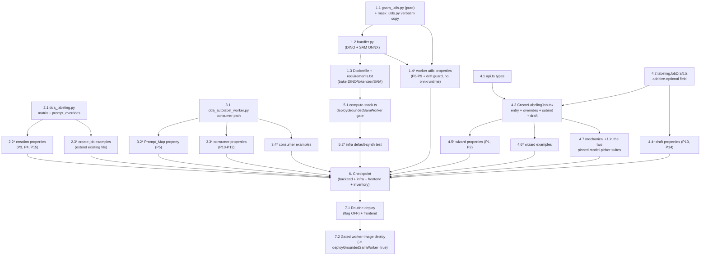

# Implementation Plan: Grounded-SAM Auto-Labeling

## Overview

Five seams, worked outside-in so every wave is independently verifiable. The worker track builds the new `backend/grounded-sam-worker/` container (pure logic first — caption/span attribution, threshold/NMS/clamp pipeline, canonical RLE via a verbatim `mask_utils.py` copy — then the ONNX handler and the model-baking Dockerfile), proven by four Hypothesis properties that run without onnxruntime, per the mask_utils precedent. The backend track adds `grounded-sam` to the job-creation matrix with `prompt_overrides` validation/persistence (three Hypothesis properties including the other-family record differential) and the consumer path `_generate_grounded_sam_prelabel` (Prompt_Map from the job record, presigned-URL sync invoke bounded at 240 s, strict response validation, Bedrock-shape OD storage — three properties plus examples with fake Lambda clients). The frontend track types the API, adds the additive-optional draft field with absence-preserved normalization, then lands the wizard change in one `CreateLabelingJob.tsx` pass (static picker entry, per-label override inputs, submit pruning, draft wiring), proven by two fast-check properties, a render example suite, and the design's one permitted mechanical edit — the "+1 static entry" extension of the two pinned model-picker suites. The CDK track mirrors the `deploySamWorker` gating verbatim behind `deployGroundedSamWorker` (default OFF) with a default-synth infra test. A full checkpoint (targeted backend pytest + infra jest + frontend tsc/vitest + the zero-rebaseline inventory) precedes a two-stage deploy: the routine compute+frontend deploy without the flag, then a separate, explicitly gated worker-image deploy documenting the Docker build cost.

Same-file discipline: `CreateLabelingJob.tsx` and `labelingJobDraft.ts` each have exactly one writer task; `dda_labeling.py`, `dda_autolabel_worker.py`, `compute-stack.ts`, and each test file likewise; no wave contains two writers of one file.

## Task Dependency Graph

```json
{
  "waves": [
    { "id": 0, "description": "Foundations with no intra-feature dependencies: worker pure-logic modules (gsam_utils.py + verbatim mask_utils.py copy), api.ts additive types, labelingJobDraft.ts additive-optional field.", "tasks": ["1.1", "4.1", "4.2"] },
    { "id": 1, "description": "Implementations on the foundations, one writer per file: worker ONNX handler, job-creation validation/persistence, autolabel consumer path, and the single CreateLabelingJob.tsx pass (needs the api.ts and draft types).", "tasks": ["1.2", "2.1", "3.1", "4.3"] },
    { "id": 2, "description": "Container packaging and all test suites against the implemented code, each in its own file; includes the one permitted mechanical +1 extension of the two pinned model-picker suites.", "tasks": ["1.3", "1.4", "2.2", "2.3", "3.2", "3.3", "3.4", "4.4", "4.5", "4.6", "4.7"] },
    { "id": 3, "description": "CDK gating (after the worker asset directory is complete so flag-on synthesis has a buildable context).", "tasks": ["5.1"] },
    { "id": 4, "description": "Default-synth infrastructure test against the gated stack.", "tasks": ["5.2"] },
    { "id": 5, "description": "Routine deploy: compute stack WITHOUT the worker flag plus the frontend bundle, under the builds.md gates.", "tasks": ["7.1"] },
    { "id": 6, "description": "Separate gated worker-image deploy (-c deployGroundedSamWorker=true) with Docker build cost documented, plus live verification.", "tasks": ["7.2"] }
  ]
}
```



## Tasks

- [x] 1. Build the grounded-sam worker (backend/grounded-sam-worker/)
  - [x] 1.1 Create the pure logic modules
    - `edge-cv-portal/backend/grounded-sam-worker/gsam_utils.py` (new, standard library only, import-safe without onnxruntime/numpy — the `mask_utils` precedent): `DEFAULT_BOX_THRESHOLD = 0.35`, `DEFAULT_TEXT_THRESHOLD = 0.25`, `DEFAULT_MAX_DETECTIONS = 20`, `DEFAULT_BOX_NMS_IOU = 0.8`; `normalize_prompts(prompts)` (validated ordered `[{label, prompt}]`, prompt falls back to the label when blank, raises `ValueError` on non-list/non-dict/blank-label/empty input); `build_caption(prompt_texts)` (strip, lowercase, inner-whitespace collapse, trailing-dot strip, `'p1. p2. p3.'` join, returns `(caption, phrases)`); `phrase_token_spans(token_ids, separator_ids, special_ids)` (disjoint ordered one-per-phrase `[start, end)` spans); `attribute_detection(token_scores, spans, box_threshold, text_threshold)` (`(phrase_index, score)` or `None` — every emitted class maps to exactly one prompt); `cxcywh_to_pixel_box(box, width, height)` (clamped `{left, top, width, height}` floats or `None` on non-positive clamped area); `box_iou`; `select_detections(candidates, max_detections, iou_threshold)` (score-descending greedy per-label NMS then global cap)
    - `edge-cv-portal/backend/grounded-sam-worker/mask_utils.py`: **verbatim byte-identical copy** of `edge-cv-portal/backend/sam-worker/mask_utils.py` (the Docker build context is the worker directory; the sam-worker's own duplicate-with-equality-tests precedent) — never edit either copy
    - _Requirements: 3.3, 3.4, 3.6, 3.7, 3.8, 3.10_

  - [x] 1.2 Implement the worker handler
    - `edge-cv-portal/backend/grounded-sam-worker/handler.py` (new, following `sam-worker/handler.py` structure — lazy heavy imports, module-level cached sessions): env config `GROUNDED_SAM_MODEL_PATH=/opt/models` with glob discovery (`grounding_dino*.onnx`, `tokenizer.json`, `*encoder*.onnx`, `*decoder*.onnx`) and explicit-path overrides, `GROUNDED_SAM_BOX_THRESHOLD` (0.35) / `GROUNDED_SAM_TEXT_THRESHOLD` (0.25) / `GROUNDED_SAM_NMS_IOU_THRESHOLD` (0.8) / `GROUNDED_SAM_MAX_DETECTIONS` (20) / `GROUNDED_SAM_MASK_THRESHOLD` (0.0) / `GROUNDED_SAM_DINO_SIZE` (800, longest cap 1333) / `GROUNDED_SAM_URL_FETCH_TIMEOUT` (30)
    - `lambda_handler(event)`: validate the event before any model import (`ValueError` on missing https presigned URL, malformed prompts via `gsam_utils.normalize_prompts`, or a modality outside {Segmentation, ObjectDetection}); fetch/decode the image (sam handler's `_load_image_bytes` pattern); tokenize the `build_caption` output with `tokenizers` (`tokenizer.json`); one Grounding DINO forward (`pixel_values` ImageNet-normalized shortest-edge-800 resize + `input_ids`/`attention_mask`/`token_type_ids`); sigmoid logits → `phrase_token_spans` → `attribute_detection` → `cxcywh_to_pixel_box` → `select_detections`; ObjectDetection returns `{'regions': [{'class', 'score', 'box': {left, top, width, height}}], 'image_width', 'image_height'}` with no mask pass; Segmentation runs the SAM encoder once and decodes each retained box as the canonical two-point box prompt (labels 2/3), thresholds mask logits, RLE-encodes at source resolution via the vectorized `runs_to_rle` path (`_rle_encode_fast` pattern), and returns `{'regions': [{'class', 'score', 'rle'}], ...}`; zero retained detections return `{'regions': [], ...}` as a success
    - _Requirements: 3.1, 3.2, 3.3, 3.5, 3.8, 3.9, 3.10_

  - [x] 1.3 Create the container packaging
    - `edge-cv-portal/backend/grounded-sam-worker/Dockerfile` (new, mirroring `sam-worker/Dockerfile`): `FROM public.ecr.aws/lambda/python:3.12`; pip install requirements; bake models at build time from overridable build args with pinned defaults — `GROUNDING_DINO_MODEL_URL` (default `https://huggingface.co/onnx-community/grounding-dino-tiny-ONNX/resolve/main/onnx/model.onnx`), `GROUNDING_DINO_TOKENIZER_URL` (default `.../resolve/main/tokenizer.json`), `SAM_MODEL_ARCHIVE_URL` (default `https://huggingface.co/vietanhdev/segment-anything-onnx-models/resolve/main/mobile_sam_20230629.zip`, the sam-worker default) — staged as `/opt/models/grounding_dino.onnx`, `tokenizer.json`, `sam.encoder.onnx`, `sam.decoder.onnx` (reuse the sam-worker's archive-extraction heredoc incl. the `*encoder*`/`*decoder*` check); `COPY gsam_utils.py mask_utils.py handler.py`; `CMD ["handler.lambda_handler"]`
    - `edge-cv-portal/backend/grounded-sam-worker/requirements.txt` (new): `onnxruntime==1.19.2`, `numpy==1.26.4`, `pillow==10.4.0`, `tokenizers==0.20.3`
    - _Requirements: 3.9, 5.3_

  - [x]* 1.4 Write worker pure-logic property tests
    - `edge-cv-portal/backend/tests/test_dda_grounded_sam_worker_utils.py` (new) — path-inserts `grounded-sam-worker/` and the shared layer like `test_dda_sam_worker_mask_utils.py`; runs **without onnxruntime/numpy/Pillow/tokenizers**; Hypothesis `@settings(max_examples=100, deadline=None)`
    - **Property 6: Caption spans partition the prompts and attribution is a function onto them** — **Validates: Requirements 3.3**
    - **Property 7: The detection selection pipeline yields bounded, thresholded, deduplicated, capped detections** — **Validates: Requirements 3.4, 3.6, 3.10**
    - **Property 8: The worker's RLE is the canonical encoding** (equality vs `dda_manifest.rle_encode` + decode round trip) — **Validates: Requirements 3.7**
    - **Property 9: Malformed prompt inputs are rejected at the worker boundary** — **Validates: Requirements 3.8**
    - Examples/smoke beside the properties: the byte-identity drift guard (`grounded-sam-worker/mask_utils.py` == `sam-worker/mask_utils.py`); handler default constants and env parsing (0.35/0.25); `lambda_handler` raising on missing image source / unknown modality before any model import
    - _Requirements: 3.3, 3.4, 3.5, 3.6, 3.7, 3.8, 3.10_

- [x] 2. Accept and persist the family at job creation (dda_labeling.py)
  - [x] 2.1 Implement validation and persistence
    - `edge-cv-portal/backend/functions/dda_labeling.py`: `AUTO_LABEL_MODEL_MODALITIES` (~217) gains `'grounded-sam': ('Segmentation', 'ObjectDetection')`; module constant `PROMPT_OVERRIDE_MAX_LENGTH = 256`; new validation arm (~1618, beside the `'sam'` arm) — `model_family = 'grounded-sam'`, `auto_label.prompt_overrides` accepted absent, else must be a dict with keys ⊆ the submitted Label_Set (error naming the key otherwise), string values (error otherwise) of raw length ≤ 256 (error naming the label), empty-after-trim values dropped, survivors kept character-for-character
    - Invalid-model message (~1659) becomes `"Auto-label model must be 'grounded-sam', 'sam' or 'bedrock:<model_id>'"` — the prepend preserves the substring pinned by `test_dda_labeling_create_job.py` (~622)
    - Persistence (~1803): `**({'prompt_overrides': prompt_overrides} if model_family == 'grounded-sam' and prompt_overrides else {})` inside the `auto_label` document — absent for every other family and for override-free grounded-sam jobs; audit details flow unchanged (`auto_label_mode` = `'grounded-sam'`)
    - Skip-verification validation/persistence (~1509-1560) and the fan-out worker are untouched
    - _Requirements: 1.5, 1.6, 1.7, 2.4, 2.5, 2.6, 2.8, 7.5_

  - [x]* 2.2 Write job-creation property tests
    - `edge-cv-portal/backend/tests/test_property_grounded_sam_job_creation.py` (new) — Hypothesis over the moto-backed create-job env (the `test_dda_labeling_create_job.py` scaffolding), 100 examples per property
    - **Property 3: Job creation persists the model and the normalized overrides** — **Validates: Requirements 1.5, 2.4**
    - **Property 4: Malformed overrides are rejected and nothing persists** (generators: non-objects, unknown keys, non-string values, lengths 256/257 at the boundary) — **Validates: Requirements 2.5, 2.6**
    - **Property 15: Other families' job records are byte-identical to pre-feature records** (sam/bedrock:/llm: submissions with and without skip-verification; no `prompt_overrides` key anywhere; record equals the pre-feature shape oracle) — **Validates: Requirements 2.8, 7.1**
    - _Requirements: 1.5, 2.4, 2.5, 2.6, 2.8, 7.1_

  - [x]* 2.3 Extend the create-job example suite (new tests only)
    - `edge-cv-portal/backend/tests/test_dda_labeling_create_job.py` (existing, **extended — every pre-existing assertion untouched**, including the `"'sam' or 'bedrock:<model_id>'"` message pin which survives the prepend): grounded-sam + Classification rejected with the model+modality error and nothing persisted (1.6); audit details carry `auto_label_model`/`auto_label_mode` `grounded-sam` (1.7); creation accepted while no worker is deployed (5.4)
    - _Requirements: 1.6, 1.7, 5.4_

- [x] 3. Generate grounded-sam pre-labels (dda_autolabel_worker.py)
  - [x] 3.1 Implement the consumer path
    - `edge-cv-portal/backend/functions/dda_autolabel_worker.py`: constants `GROUNDED_SAM_WORKER_FUNCTION_NAME` (env), `GROUNDED_SAM_MODALITIES = (Segmentation, ObjectDetection)`, `GROUNDED_SAM_MAX_TIMEOUT_SECONDS = 240` (design decision: CPU DINO latency; the sam family's 120 s constant untouched); test injection point `grounded_sam_lambda_client = None` + `_cached_grounded_sam_lambda_client`; `_get_grounded_sam_lambda_client()` cloning `_get_sam_lambda_client` with the 240 s read timeout, retries disabled
    - `_grounded_sam_prompts(label_set, overrides)` — pure, total over malformed overrides: one `{'label', 'prompt'}` per label in order, override applied only when a str non-empty after strip
    - `_generate_grounded_sam_prelabel(message, job)` — modality gate; env check → `GenerationFailure('Grounded-SAM worker function is not configured')`; presigned URL via `_dataset_s3_client` + `PRESIGNED_URL_EXPIRY_SECONDS`; invoke payload `{'image_s3_presigned_url', 'prompts': _grounded_sam_prompts(message['label_set'], (job.get('auto_label') or {}).get('prompt_overrides')), 'modality'}`; guards mirroring `_generate_sam_prelabel` (invocation exception, `FunctionError`, unparseable payload, non-list regions, non-int dims); per-region validation (class ∈ label_set; Segmentation: non-empty `rle`; ObjectDetection: `box` with float geometry, positive width/height, non-negative origin, within the returned dims — the `_validate_boxes` rules); stores Segmentation as `{modality, regions: [{class, rle, score?}], image_width, image_height}` and ObjectDetection as `{modality, boxes: [{class, left, top, width, height}], image_width, image_height}` (score dropped — the Bedrock shape byte-exactly)
    - Dispatch in `_generate_prelabel` (~958): `if model == 'grounded-sam': return _generate_grounded_sam_prelabel(message, job)` beside the sam exact match; `_write_prelabel`/`_mark_task`/skip-verification/storage-failure machinery reached unchanged (`storage_failure_is_terminal` stays `llm:`-only); the module docstring gains the family (cite this spec)
    - `dda_labeling_worker.py` fan-out: **no change** (overrides ride the job record)
    - _Requirements: 2.7, 4.1, 4.2, 4.3, 4.4, 4.5, 4.6, 4.7, 4.8, 7.4_

  - [x]* 3.2 Write the Prompt_Map property test
    - `edge-cv-portal/backend/tests/test_property_grounded_sam_prompt_map.py` (new) — pure Hypothesis over label lists × arbitrary override values (conforming maps, maps with extra/non-string entries, None, non-dicts), 100 examples
    - **Property 5: Prompt_Map derivation is total, ordered, and falls back to label names** — **Validates: Requirements 2.7, 7.6**
    - _Requirements: 2.7, 7.6_

  - [x]* 3.3 Write consumer property tests
    - `edge-cv-portal/backend/tests/test_property_grounded_sam_consumer.py` (new) — Hypothesis over the moto stack with a fake Lambda client (the `FakeSamLambdaClient` pattern via the new injection point), 100 examples per property
    - **Property 10: The consumer's invocation payload carries the presigned URL, the exact Prompt_Map, and the modality** — **Validates: Requirements 4.1**
    - **Property 11: Valid worker responses map to the exact stored Pre_Label shapes** (Segmentation classes/scores preserved; OD exact key set, floats, score dropped; empty-regions success) — **Validates: Requirements 4.6, 4.7**
    - **Property 12: Invalid worker responses fail the image without an artifact** (FunctionError, non-JSON, missing/typed-wrong fields, out-of-Label_Set class, missing geometry, degenerate/out-of-bounds boxes) — **Validates: Requirements 4.4, 4.5**
    - _Requirements: 4.1, 4.4, 4.5, 4.6, 4.7_

  - [x]* 3.4 Write consumer example tests
    - `edge-cv-portal/backend/tests/test_dda_grounded_sam_consumer.py` (new, the `test_dda_autolabel_worker.py` scaffolding): worker-not-configured failure reason (4.2, 5.4); the grounded-sam client config (read timeout 240, retries 0) and the sam client's untouched 120 (4.3, 7.4); a raising fake client marks the task Failed (4.3); empty-regions response stored as Available (3.10); duplicate delivery never double-resolves, skip-verification counters move once, artifact put failure surfaces a batch item failure (4.8); dispatch reaches the new path for `grounded-sam` while `sam`/`bedrock:`/`llm:` messages take their existing paths (7.4)
    - _Requirements: 3.10, 4.2, 4.3, 4.8, 5.4, 7.4_

- [x] 4. Offer the family in the wizard (frontend)
  - [x] 4.1 Type the API additions
    - `edge-cv-portal/frontend/src/services/api.ts`: `prompt_overrides?: Record<string, string>` on `createLabelingJob`'s `auto_label` parameter type (~1875) and on the job-detail response's `auto_label` type (~1965), each with a doc comment citing this spec; type-only, no request or consumer change
    - _Requirements: 2.3_

  - [x] 4.2 Add the additive-optional draft field
    - `edge-cv-portal/frontend/src/pages/labelingJobDraft.ts`: interface gains `groundedSamPromptOverrides?: Record<string, string>` (documented as this feature's additive-optional field); `conformingDraft` validates it with `asStringRecord` **only when present**, returns null when present-but-malformed, and **preserves absence as absence** in the rebuilt object (the load-bearing detail keeping every pre-feature draft and pinned draft test green); `draftsEquivalent` gains `stringRecordsEqual(a.groundedSamPromptOverrides ?? {}, b.groundedSamPromptOverrides ?? {})`
    - _Requirements: 6.1, 6.3, 6.4, 6.5_

  - [x] 4.3 Implement the wizard changes (single CreateLabelingJob.tsx pass)
    - `edge-cv-portal/frontend/src/pages/CreateLabelingJob.tsx`: export `GROUNDED_SAM_MODALITIES = ['Segmentation', 'ObjectDetection']` and `MAX_PROMPT_OVERRIDE_LENGTH = 256`; `isAutoLabelModelCompatible` gains the exact-match arm (1.3, and the existing clearing effect then covers 1.4); state `groundedSamPromptOverrides: Record<string, string>`; option building gains `groundedSamAutoLabelOptions` (static `{label: 'Grounded-SAM (text-prompted)', value: 'grounded-sam'}` for the two modalities) spliced immediately after `samAutoLabelOptions` in both `flatAutoLabelOptions` and the grouped `autoLabelOptions`; the model FormField description gains a Grounded-SAM clause
    - Override entries (gated `autoLabelEnabled && autoLabelModel === 'grounded-sam'`): the skip-verification per-label pattern (~2079) with single-line `Input`s — one optional entry per `effectiveLabelSet` label, placeholder = the label name, plus the empty-label-set `Alert` fallback
    - `validateDdaSetup`: reject any override of raw length > 256 naming the label; nothing else (overrides optional; `llm:`-gated rules never fire for the value)
    - Submit payload: for `grounded-sam`, include `prompt_overrides` = exactly the entries non-empty after trimming whose label is in `effectiveLabelSet`, raw values, key omitted when none survive; other families' payloads byte-identical
    - Draft wiring: `buildDraft` always includes `groundedSamPromptOverrides` (+ useCallback dep); `applyDraftRestore` sets it from `draft.groundedSamPromptOverrides ?? {}`
    - _Requirements: 1.1, 1.2, 1.3, 1.4, 2.1, 2.2, 2.3, 2.6, 2.8, 6.1, 6.2, 7.2, 7.3_

  - [x]* 4.4 Write draft property tests
    - `edge-cv-portal/frontend/src/pages/labelingJobDraft.groundedsam.property.test.ts` (new file, so `labelingJobDraft.storage.property.test.ts` stays byte-identical) — fast-check `{ numRuns: 100 }`, jsdom localStorage cleared per run, generators including `__proto__` keys per the existing precedent
    - **Property 13: Drafts round-trip the overrides and the save gate discriminates on them** — **Validates: Requirements 6.1, 6.5**
    - **Property 14: Draft reading tolerates the field's absence and rejects its malformation** (key deleted from stored JSON → read non-null with the field absent; value mangled → read null, never throws) — **Validates: Requirements 6.3, 6.4**
    - _Requirements: 6.1, 6.3, 6.4, 6.5_

  - [x]* 4.5 Write wizard property tests
    - `edge-cv-portal/frontend/src/pages/CreateLabelingJob.groundedsam.property.test.tsx` (new) — fast-check `{ numRuns: 100 }` over the rendered wizard (the modelpicker.property walk)
    - **Property 1: The picker offers the pre-feature options plus exactly the Grounded-SAM entry for its modalities** (oracle = pre-feature `expectedAutoLabelOptions` + the static entry after SAM for Segmentation/ObjectDetection, absent for Classification) — **Validates: Requirements 1.1, 1.2, 7.2**
    - **Property 2: The submitted job carries exactly the surviving overrides, raw, or no key at all** (arbitrary label rows × override states incl. whitespace-only, unicode, renamed labels; captured `createLabelingJob` payload vs the pruning oracle; non-grounded-sam submissions carry no key) — **Validates: Requirements 2.3, 2.8**
    - _Requirements: 1.1, 1.2, 2.3, 2.8, 7.2_

  - [x]* 4.6 Write wizard example tests
    - `edge-cv-portal/frontend/src/pages/CreateLabelingJob.groundedsam.test.tsx` (new, the `CreateLabelingJob.test.tsx` mock scaffolding, `window.localStorage.clear()` in `beforeEach`): `isAutoLabelModelCompatible('grounded-sam', ...)` matrix (1.3); selection cleared on switching to Classification (1.4); one override entry per label with label-name placeholders exactly under a grounded-sam selection, none for `sam`/`llm:` (2.1, 2.2); >256-char override rejected naming the label (2.6); no detection-prompt/few-shot/sizing/preview controls for grounded-sam (7.3); a seeded draft with overrides restores them into the controls and the subsequent submit (6.2)
    - _Requirements: 1.3, 1.4, 2.1, 2.2, 2.6, 6.2, 7.3_

  - [x] 4.7 Apply the permitted mechanical "+1 static entry" extension to the two pinned picker suites
    - `edge-cv-portal/frontend/src/pages/CreateLabelingJob.modelpicker.property.test.tsx`: extend the restated oracle (`expectedAutoLabelOptions` / `ORACLE_MODALITIES`) with the static grounded-sam entry after SAM, exactly mirroring the shipped composition
    - `edge-cv-portal/frontend/src/pages/CreateLabelingJob.modelpicker.test.tsx`: increment the four full-list option counts by one (`.toBe(5)` → 6 at ~327/385/457, `.toBe(1)` → 2 at ~474); search-narrowed counts untouched (no query there matches the new entry — verified in design)
    - **No assertion is deleted or weakened; any other required change in these files is a design violation to stop on** (design's one permitted mechanical edit class, per the `localStorage.clear()` precedent)
    - _Requirements: 7.2_

- [x] 5. Gate the worker deployment (infrastructure)
  - [x] 5.1 Add the flag-gated CDK block
    - `edge-cv-portal/infrastructure/lib/compute-stack.ts`: a sibling block directly under the `deploySamWorker` block (~2177) mirroring it clause for clause — `deployGroundedSamWorker` context flag (true/'true'); when on: `DdaGroundedSamWorker` `DockerImageFunction` from `backend/grounded-sam-worker` (platform `LINUX_AMD64` with the same qemu rationale comment, `X86_64` architecture, 10240 MB, 300 s), buildArgs spread from optional context values `groundedSamDinoModelUrl` → `GROUNDING_DINO_MODEL_URL`, `groundedSamDinoTokenizerUrl` → `GROUNDING_DINO_TOKENIZER_URL`, `groundedSamModelArchiveUrl` → `SAM_MODEL_ARCHIVE_URL`; `ddaAutolabelWorker.addEnvironment('GROUNDED_SAM_WORKER_FUNCTION_NAME', ...)` + `grantInvoke`; no CDK threshold env block (handler defaults are the intended values); when off: no resources, no env var
    - `DdaSamWorker`, its flag, and every other function definition byte-identical
    - _Requirements: 5.1, 5.2, 5.3, 5.5_

  - [x]* 5.2 Write the default-synth infra test
    - `edge-cv-portal/infrastructure/test/grounded-sam-worker-infra.test.ts` (new, the synthesize-once-in-beforeAll convention with the generous timeout): default synth (no context flags) — the ComputeStack template contains no image-package Lambda function; `DdaAutolabelWorker`'s environment carries neither `GROUNDED_SAM_WORKER_FUNCTION_NAME` nor `SAM_WORKER_FUNCTION_NAME`; its handler/runtime/timeout/memory/layers and existing env keys are unchanged (5.2, 5.5). Flag-ON synthesis is deliberately not tested in jest (`fromImageAsset` docker-builds at synth — same reason no `deploySamWorker=true` test exists); the gated deploy (7.2) is the flag-on verification
    - _Requirements: 5.2, 5.5_

- [x] 6. Checkpoint — Ensure all tests pass, ask the user if questions arise
  - Backend (targeted, per the design's verification commands): `cd edge-cv-portal/backend && python3 -m pytest tests/test_dda_grounded_sam_worker_utils.py tests/test_property_grounded_sam_prompt_map.py tests/test_property_grounded_sam_job_creation.py tests/test_property_grounded_sam_consumer.py tests/test_dda_grounded_sam_consumer.py tests/test_dda_labeling_create_job.py tests/test_dda_autolabel_worker.py tests/test_dda_sam_worker_mask_utils.py tests/test_dda_labeling_worker_distribute.py -q`
  - Infrastructure: `cd edge-cv-portal/infrastructure && npx jest` (existing 130 tests + the new suite, all green)
  - Frontend: `cd edge-cv-portal/frontend && npx tsc --noEmit -p tsconfig.json && npx vitest run` (144+ files green today; the two mechanically extended picker suites pass with the +1 oracle)
  - Run the design's non-regression inventory with **zero rebaselines** beyond the one permitted mechanical edit class (task 4.7): the draft property/storage suites, recovery suites, fewshot/sizing suites, PromptTuningPreview property suite, `test_dda_autolabel_worker.py`, `test_dda_sam_worker_mask_utils.py`, and `test_dda_labeling_worker_distribute.py` all green **byte-identical**; `test_dda_labeling_create_job.py` extended with every pre-existing assertion intact. If any other pre-existing assertion has to change, stop and raise it as a design violation
  - _Requirements: 7.1, 7.2, 7.3, 7.4, 7.5, 7.6_

- [x] 7. Deploy
  - [x] 7.1 Routine deploy (worker flag OFF)
    - Follow `.kiro/steering/builds.md` gates: confirm no component build is running (`pgrep -af "gdk component build"` and `pgrep -af "build-custom.sh"` both empty) — portal deploys must never overlap component builds
    - From `edge-cv-portal/infrastructure`: `npx cdk deploy EdgeCVPortalComputeStack --require-approval never` (no `-c deployGroundedSamWorker` — proves Requirement 5.2 live: no Docker build, no model downloads, `GROUNDED_SAM_WORKER_FUNCTION_NAME` absent); then from `edge-cv-portal`: `./deploy-frontend.sh`; capture both to spec-named logs, e.g. `edge-cv-portal/deploy-grounded-sam-autolabel-$(date -u +%Y%m%dT%H%M%SZ).out`
    - Live-verify the degradation path: create a `grounded-sam` Segmentation job — creation succeeds, the picker shows the new entry with the override inputs, and each image resolves a pre-label failure with the "not configured" reason (Requirements 5.4, 4.2)
    - After deploying, handle the `cdk.out` drift guards per builds.md before any subsequent component build (move `cdk.out` aside or rebaseline, and re-run the preservation guard pair)
    - _Requirements: 5.2, 5.4_

  - [x] 7.2 Gated worker-image deploy (separate, explicit)
    - **Docker build cost warning**: this synthesis builds the worker image — a multi-gigabyte build downloading the Grounding DINO ONNX (~700 MB), tokenizer, and MobileSAM archive; on the arm64 build host it runs under qemu (slower but correct, per the DdaSamWorker platform-pin rationale). Re-check the builds.md pgrep gates immediately before starting
    - From `edge-cv-portal/infrastructure`: `npx cdk deploy EdgeCVPortalComputeStack -c deployGroundedSamWorker=true --require-approval never` (optionally `-c groundedSamModelArchiveUrl=...` / `-c groundedSamDinoModelUrl=...` / `-c groundedSamDinoTokenizerUrl=...` for model overrides); capture to a spec-named log, e.g. `edge-cv-portal/deploy-grounded-sam-autolabel-worker-$(date -u +%Y%m%dT%H%M%SZ).out`
    - Live-verify (Requirements 5.1, 5.3, 3.1, 3.2, 4.6, 4.7): `DdaGroundedSamWorker` exists (10 GB/300 s), `DdaAutolabelWorker` carries `GROUNDED_SAM_WORKER_FUNCTION_NAME`; a `grounded-sam` Segmentation job on a small prefix produces classified RLE region pre-labels renderable in the labeler workspace, and an ObjectDetection job produces classified boxes; an override (e.g. label "dent" → "small surface dent") changes the prompts observably in the worker logs
    - After deploying, handle the `cdk.out` drift guards per builds.md (the flag-on synth regenerates `cdk.out` with the new image asset — move aside or rebaseline before any component build)
    - _Requirements: 3.1, 3.2, 5.1, 5.3_

## Notes

- Tasks marked with `*` are optional test tasks and can be skipped for a faster MVP; core implementation tasks and task 4.7 (the pinned-suite mechanical extension, required to keep the existing frontend suite green once 4.3 lands) are never optional
- Each of the 15 correctness properties has exactly one property-based test, in the file the design's placement table names, at ≥100 iterations (`@settings(max_examples=100, deadline=None)` / `{ numRuns: 100 }`), tagged `Feature: grounded-sam-autolabel, Property {n}: {title}`
- **Same-file scheduling:** `CreateLabelingJob.tsx` is written only by 4.3 and `labelingJobDraft.ts` only by 4.2 (the two hot files each have a single writer); `dda_labeling.py` only by 2.1, `dda_autolabel_worker.py` only by 3.1, `compute-stack.ts` only by 5.1, `test_dda_labeling_create_job.py` only by 2.3, and the two pinned picker suites only by 4.7 — no wave contains two writers of one file
- `dda_labeling_worker.py` (fan-out) and `sam-worker/` are deliberately untouched; `grounded-sam-worker/mask_utils.py` is a verbatim copy guarded by a byte-identity test — never edit either copy independently
- Whole-model inference (3.1/3.2/3.9) and flag-ON synthesis (5.1/5.3) are verified by the gated deploy task 7.2, not unit tests: the models are multi-hundred-MB build-time artifacts and `fromImageAsset` docker-builds at synth (the same reason no `deploySamWorker=true` jest test exists today)
- The design's one permitted mechanical edit class is scoped to task 4.7 exactly; every other pinned suite must pass byte-identical (zero-rebaseline rule) — any further required edit is a design violation to stop on
- CPU latency expectation (recorded in the requirements rationale): tens of seconds per image for Grounding DINO tiny on the 10 GB Lambda; the consumer bounds grounded-sam invocations at 240 s (`GROUNDED_SAM_MAX_TIMEOUT_SECONDS`) while the sam family's 120 s bound is untouched
