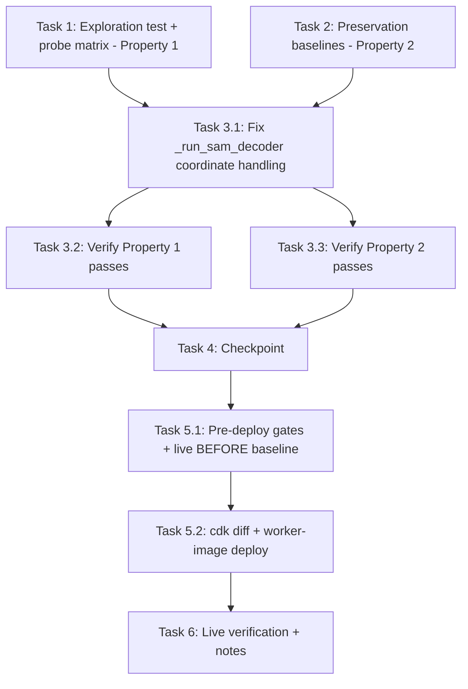

# Implementation Plan

## Overview

Fix the Grounded-SAM Segmentation mask offset using the exploratory bugfix workflow: write the bug condition exploration test against the **real MobileSAM ONNX artifacts** first (Property 1 — fails on unfixed code, and its probe matrix pins the decoder coordinate convention empirically), capture preservation baselines (Property 2 — passes on unfixed code), then apply the minimal coordinate-handling fix in `edge-cv-portal/backend/grounded-sam-worker/handler.py`, verify with the same tests, rebuild + redeploy the worker image, and quantitatively verify alignment live on real cookie images. Do not touch `mask_utils.py`, the DINO path, or `sam-worker/`.

## Task Dependency Graph

```json
{
  "waves": [
    { "wave": 1, "description": "Run on UNFIXED code with the real ONNX models: surface the offset counterexamples + pin the convention via the probe matrix (task 1 FAILS - Property 1) and capture preservation baselines (task 2 PASSES - Property 2).", "tasks": ["1", "2"] },
    { "wave": 2, "description": "Implement the minimal decoder coordinate fix per the empirically pinned convention.", "tasks": ["3.1"] },
    { "wave": 3, "description": "Verify the fix: re-run task 1 test (now PASSES) and task 2 tests (still PASS).", "tasks": ["3.2", "3.3"] },
    { "wave": 4, "description": "Checkpoint: exploration + preservation + the 23-test pure-logic suite all green.", "tasks": ["4"] },
    { "wave": 5, "description": "Deploy: pre-deploy gates + live BEFORE baseline, cdk diff, worker-image redeploy.", "tasks": ["5.1", "5.2"] },
    { "wave": 6, "description": "Live verification on real cookie images + verification-notes.md (incl. stale-prelabel recovery guidance).", "tasks": ["6"] }
  ]
}
```



## Tasks

- [x] 1. Write bug condition exploration test (against the REAL ONNX models)
  - **Property 1: Bug Condition** - Segmentation Masks Align With The Prompted Box
  - **CRITICAL**: This test MUST FAIL on unfixed code - failure confirms the bug exists
  - **DO NOT attempt to fix the test or the code when it fails**
  - **NOTE**: This test encodes the expected behavior - it will validate the fix when it passes after implementation
  - **GOAL**: Surface offset counterexamples AND pin the decoder coordinate convention empirically (confirm/refute H1–H4 from design)
  - Create `edge-cv-portal/backend/tests/test_gsam_mask_offset_exploration.py`
  - Model acquisition: download `https://huggingface.co/vietanhdev/segment-anything-onnx-models/resolve/main/mobile_sam_20230629.zip` (~40 MB) to a cache dir `/tmp/gsam-models` and extract; skip download when the extracted `*encoder*.onnx`/`*decoder*.onnx` already exist (checked during spec creation: no SAM leftovers in /tmp on this host, first run will download)
  - Dependencies: host `python3` already has onnxruntime 1.19.2, numpy 2.0.2, Pillow (verified — no installs needed); `pytest.skip` cleanly when onnxruntime is missing or the download fails so the file is safe in the general suite; record any pip installs that turn out to be needed
  - Module loading: follow the importlib-by-explicit-path pattern from `test_dda_grounded_sam_worker_utils.py` (register `gsam_utils`/`mask_utils` first, never put the worker dir on `sys.path`, never populate `sys.modules['handler']`); point the loaded handler at the extracted models by setting its module attributes `SAM_ENCODER_PATH`/`SAM_DECODER_PATH` (they are read from env into module globals at import time) and reset `handler._SAM_SESSIONS = None` between configuration changes
  - **Scoped PBT Approach**: the property (IoU/centroid thresholds) is scoped to three concrete deterministic geometries for reproducibility against the real models
  - Synthetic image per geometry: dark background (~20 gray) with a bright (~230) rectangle at a KNOWN off-center bbox (biased toward the upper-left so the predicted down/right displacement is measurable); geometries: portrait 576×768 (the incident geometry), landscape 768×576, square 512×512
  - Call the handler's real `_segment_masks(image_rgb, [detection])` with `detection = {'label_index': 0, 'score': 0.9, 'box': <rectangle bbox>}`; decode the returned RLE with `dda_manifest.rle_decode` (shared layer); compute IoU(mask, rectangle) and the mask-vs-rectangle centroid displacement vector
  - Assert per geometry: IoU ≥ 0.85 AND centroid displacement < 3 % of the image diagonal (Property 1, design)
  - Probe matrix (diagnostic output, not an assertion): run the decoder directly on the same embedding with (a) original-frame coords unscaled, (b) 1024-frame coords (current handler behavior), (c) swapped `orig_im_size` `[W, H]`, (d) samexporter-native resized-frame `orig_im_size` `[new_h, new_w]` + external mask resize — report IoU per variant per geometry to pin the convention the export actually expects
  - Run on UNFIXED code: `python3 -m pytest edge-cv-portal/backend/tests/test_gsam_mask_offset_exploration.py -v -s`
  - **EXPECTED OUTCOME**: assertions FAIL (IoU well below 0.5 with a measurable down/right displacement on the current variant) — this is correct, it proves the bug; exactly one probe variant should score ≥ 0.85 on all three geometries
  - Document the counterexample numbers (IoU + displacement vector per geometry) and the winning variant; if NO variant aligns, stop and re-hypothesize (return to design) before task 3
  - Mark task complete when the test is written, run, and the failure + probe results are documented
  - _Requirements: 1.1, 1.2_

- [x] 2. Write preservation property tests (BEFORE implementing fix)
  - **Property 2: Preservation** - Non-Bug Inputs Unchanged
  - **IMPORTANT**: Follow observation-first methodology - observe UNFIXED behavior first, then encode it
  - Add a preservation test class to the same file (or `test_gsam_mask_offset_preservation.py`)
  - Scale = 1 boundary (real models): synthetic rectangle image whose longest side is exactly the encoder size (e.g. 1024×768) — observe on UNFIXED code that the mask ALIGNS today (the suspect transform is the identity at scale = 1); encode IoU ≥ 0.85 + centroid < 3 % diagonal as a passing test
  - If the scale = 1 case does NOT align on unfixed code, the bug condition is broader than `scale ≠ 1` — record the observation, update bugfix.md 3.2 accordingly (offer return to requirements), and treat the case as part of Property 1 instead
  - Baseline the existing pure-logic suite: `python3 -m pytest edge-cv-portal/backend/tests/test_dda_grounded_sam_worker_utils.py -q` → all 23 tests green on UNFIXED code (includes the mask_utils drift-guard byte-identity — do NOT touch `mask_utils.py`)
  - Run tests on UNFIXED code
  - **EXPECTED OUTCOME**: Tests PASS (this confirms baseline behavior to preserve)
  - Mark task complete when tests are written, run, and passing on unfixed code
  - _Requirements: 3.1, 3.2, 3.3, 3.4, 3.5_

- [x] 3. Fix the SAM decoder coordinate handling

  - [x] 3.1 Implement the fix per the empirically pinned convention
    - Edit `edge-cv-portal/backend/grounded-sam-worker/handler.py::_run_sam_decoder` only (touch `_segment_masks` only if the probe implicated `orig_im_size` semantics, e.g. variant (d) requires resizing the returned mask to source resolution before thresholding while keeping the response at source resolution)
    - Minimal diff: change the `point_coords` transform (and/or the `orig_im_size` feed) to the probe-winning variant; no new abstractions, no contract change
    - Document the pinned convention in the docstring/comment WITH the empirical probe evidence (IoU per variant per geometry from task 1)
    - Keep `_sam_preprocess`'s two export conventions (HWC unpadded / NCHW normalized+padded) and its `scale` return working unchanged; keep the fixed-shape-DINO handling and the whole DINO path untouched; do NOT touch `mask_utils.py` or `sam-worker/`
    - _Bug_Condition: isBugCondition(input) — Segmentation, detections present, scale ≠ 1, from design_
    - _Expected_Behavior: Property 1 — IoU ≥ 0.85, centroid displacement < 3 % diagonal on all three geometries, from design_
    - _Preservation: Preservation Requirements from design (OD path, scale = 1, RLE, validation, suite)_
    - _Requirements: 2.1, 2.2, 3.1, 3.2, 3.3, 3.4, 3.5_

  - [x] 3.2 Verify bug condition exploration test now passes
    - **Property 1: Expected Behavior** - Segmentation Masks Align With The Prompted Box
    - **IMPORTANT**: Re-run the SAME test from task 1 - do NOT write a new test
    - The test from task 1 encodes the expected behavior; when it passes, the expected behavior is satisfied
    - `python3 -m pytest edge-cv-portal/backend/tests/test_gsam_mask_offset_exploration.py -v` (real models)
    - **EXPECTED OUTCOME**: Test PASSES — IoU ≥ 0.85 with centroid displacement < 3 % of the diagonal on portrait 576×768, landscape 768×576, and square 512×512 (confirms the bug is fixed; this is also the local end-to-end check against the real artifacts)
    - _Requirements: 2.1, 2.2_

  - [x] 3.3 Verify preservation tests still pass
    - **Property 2: Preservation** - Non-Bug Inputs Unchanged
    - **IMPORTANT**: Re-run the SAME tests from task 2 - do NOT write new tests
    - Scale = 1 real-model case still aligned; `test_dda_grounded_sam_worker_utils.py` still 23/23 green (drift guard intact)
    - **EXPECTED OUTCOME**: Tests PASS (confirms no regressions)
    - _Requirements: 3.1, 3.2, 3.3, 3.4, 3.5_

- [x] 4. Checkpoint - Ensure all tests pass
  - All green in one run: the exploration/fix test, the preservation tests, and the full existing worker suite (`test_dda_grounded_sam_worker_utils.py`)
  - Clean up any temporary probe scripts; the model cache under `/tmp/gsam-models` may stay (speeds re-runs)
  - This checkpoint gates the deploy (house convention: checkpoint before deploy) — ask the user if questions arise

- [x] 5. Rebuild + redeploy the grounded-sam worker image

  - [x] 5.1 Pre-deploy gates + live BEFORE baseline
    - builds.md gates (single-writer discipline): `pgrep -af "gdk component build"` and `pgrep -af "build-custom.sh"` must BOTH be empty before any CDK work; do not run concurrent with GDK builds
    - Capture the live BEFORE numbers against the CURRENTLY DEPLOYED (unfixed) worker: presign 2–3 real cookie images (`aws s3 presign s3://ryvan-cookies/training-images/<key>`), invoke the deployed `DdaGroundedSamWorker` (physical name via `aws cloudformation describe-stack-resources --stack-name EdgeCVPortalComputeStack`; precedent: `EdgeCVPortalComputeStack-DdaGroundedSamWorkerA3B13-qHx8huoBWZFA`) with `{"image_s3_presigned_url": ..., "prompts": [{"label": "cookie_gap", "prompt": "gap between broken cookie pieces"}], "modality": "Segmentation"}` and the SAME payload with `"modality": "ObjectDetection"`
    - Decode the Segmentation RLEs (`dda_manifest.rle_decode`), compute per-region mask centroid and box–mask containment (|mask ∩ box| / |mask|) against the OD boxes — record as the BEFORE baseline (expect centroids displaced below/outside the boxes)
    - *Execution note (adapted)*: the live unfixed worker was already DELETED (2026-09-07T02:53Z, flag-less deploy from another checkout — stack events show `DdaGroundedSamWorkerA3B1314A` DELETE_COMPLETE), so the BEFORE Segmentation masks were taken from the job's stale S3 pre-labels (`labeling-8022a9dc/prelabels/task-000000..2.json`, written 2026-09-06T21:50Z by the unfixed worker on anomaly-1/-10/-11.jpg) and the OD boxes from the redeployed worker (OD path preservation-guaranteed unchanged). Baseline recorded in `before-baseline-5.1.json` + `od-responses-5.1.json` (this spec dir): mask-vs-box IoU 0.35–0.37, containment 0.55–0.84, every mask spilling past its box bottom and clipping at y=767
    - _Requirements: 1.1, 1.2_

  - [x] 5.2 cdk diff, then deploy
    - Resolve `CLOUDFRONT_URL` from the `EdgeCVPortalFrontendStack` output `DistributionDomainName`
    - Diff first: `cd edge-cv-portal/infrastructure && npx cdk diff EdgeCVPortalComputeStack -c deployGroundedSamWorker=true -c cloudFrontDomain=$CLOUDFRONT_URL` — confirm ONLY the grounded-sam worker image changes before deploying
    - Deploy: `npx cdk deploy EdgeCVPortalComputeStack -c deployGroundedSamWorker=true -c cloudFrontDomain=$CLOUDFRONT_URL --require-approval never` with a spec-named log (e.g. `../deploy-gsam-mask-offset-$(date +%Y%m%dT%H%M%SZ).log`)
    - **The `-c deployGroundedSamWorker=true` flag is MANDATORY** — without it CDK DELETES the live worker
    - Docker layers are cached: only the handler COPY layer rebuilds (~5–10 min, no model re-download)
    - cdk.out drift-guard note: this deploy regenerates `edge-cv-portal/infrastructure/cdk.out`; if a GDK component build needs the security-gate baseline afterwards, move `cdk.out` aside per `.kiro/steering/builds.md` before starting that build
    - *Execution note*: deployed 2026-09-07T03:48Z (log `edge-cv-portal/deploy-gsam-mask-offset-20260907T034556Z.log`), stack UPDATE_COMPLETE; the diff showed the worker as a CREATE (restoring the deleted function) — new physical name `EdgeCVPortalComputeStack-DdaGroundedSamWorkerA3B13-i6P1oAqkvVtZ`, CodeSha256 `13df0f40a113dd366d578efdeed46610c1fd349d78773ddae33a3e45d3463b3f`, image asset `6261b9e3…` (old unfixed asset `8d8e5391…`); fix confirmed baked (image handler.py contains `_resize_logits` + pinned-convention comment); autolabel worker re-wired (`GROUNDED_SAM_WORKER_FUNCTION_NAME` present). Repo was fast-forwarded 4c3f58b→28f34a5 first to avoid rolling back the other checkout's `build_dispatcher.py`/`build_fleet.py`; remaining asset churn was proven byte-identical content (their `__pycache__` pollution removed). cdk.out regenerated — handle drift guard before any component build
    - _Requirements: 2.1, 2.2_

- [x] 6. Live verification + verification-notes.md
  - **Rerun API is NOT usable this time**: job `labeling-8022a9dc` now has 0 Failed tasks (all 72 Available from the earlier guardrails replay), so the rerun eligibility gate (failed ≥ 1) will REFUSE `POST /labeling/{id}/rerun-prelabels` — verify by direct worker invoke instead (departure from the 8.2 precedent in `.kiro/specs/grounded-sam-prompt-guardrails-and-prelabel-retry/verification-notes.md`)
  - Re-run the EXACT 5.1 payloads (same images, Segmentation + ObjectDetection) against the redeployed worker; decode RLEs and QUANTITATIVELY verify alignment: each mask centroid inside the DINO box from the same image's OD run, or box–mask containment ≥ 0.5
  - Record before/after numbers side by side in `.kiro/specs/grounded-sam-mask-offset/verification-notes.md` (per-image: OD boxes, mask centroids, containment/IoU, plus the task 1 counterexample numbers and the pinned convention)
  - Stale pre-labels limitation (record in the notes AND flag in the final report for user decision — do NOT mutate the live job's tasks in this spec): the job's 72 Available pre-labels were generated by the unfixed worker and remain offset; Re-run is locked at 0 Failed. Recovery guidance (decided): the upcoming clear-prelabels button is the durable labeler-side answer; the immediate unblock is an admin flipping the tasks' `prelabel_status` to `Failed` (DynamoDB update) to re-enable the Re-run button, which resets and regenerates via the fixed worker — recommend offering this to the user, execute only on their approval
  - *Execution note*: verified live 2026-09-07T04:01–04:02Z by direct invoke of the fixed worker (`…-i6P1oAqkvVtZ`) on the exact 5.1 payloads — all masks: containment 1.0000, centroid inside box (box–mask IoU 0.35–0.37 → 0.60–0.69 on the large masks); OD responses numerically identical to `od-responses-5.1.json` (max deviation 0). USER-APPROVED regeneration executed same session: 72/72 tasks flipped Available→Failed (04:07Z), rerun 202 `retried_count 72` (04:12:03Z; required an additional Stopped→InProgress job-status flip at 04:11:56Z — the user had stopped the job 2026-09-06T22:43Z pre-fix and the product has no resume route; job left InProgress, flagged), all 72 resolved Available in 89 s with fresh aligned artifacts (sample task-000000 verified: containment 1.0000, identical to the direct-invoke output). Full detail in `verification-notes.md`
  - _Requirements: 2.1, 2.2_

## Notes

- Write the exploration test BEFORE implementing the fix, and run it on UNFIXED code — its failure (with the probe matrix) both confirms the bug and pins the correct decoder convention empirically. Do not guess the convention from documentation.
- Follow observation-first methodology for preservation: observe unfixed behavior (scale = 1 alignment, 23-test suite) before encoding it.
- Single-writer discipline: no concurrent GDK builds during the CDK deploy (pgrep gates in 5.1); spec-named deploy log; cdk.out drift-guard note in 5.2.
- Out of scope: `sam-worker/handler.py` uses the same archive and the same pre-scaling with a different prompt style (single point + padding point); record the probe outcome so a follow-up spec can assess whether it shares the defect. `mask_utils.py` is untouched (drift-guard byte-identity must hold).
