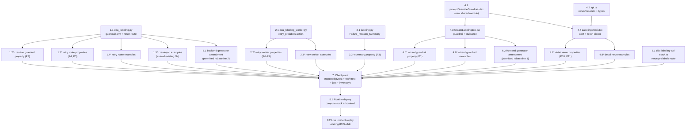

# Implementation Plan: Grounded-SAM Prompt Guardrails and Pre-Label Retry

## Overview

Two features over eight files, worked as independent single-writer tracks that converge at one checkpoint and one routine deploy. The guardrail track adds the period rejection (judged on Effective_Prompts — override or label-name fallback) to `dda_labeling.py`'s grounded-sam validation arm and, through a new shared frontend module (`promptOverrideGuardrails.tsx` — rule + guidance content, one source of truth), to the wizard's `validateDdaSetup` and override FormFields. The retry track adds the `POST /labeling/{id}/rerun-prelabels` route (authorization, eligibility gates, creation-identical override validation, persist-before-trigger) to `dda_labeling.py` — one writer task covers both of that file's changes — the `retry_prelabels` worker action (conditional Failed→Pending reset with error-attribute removal, skip-verification counter re-arm, distributor-shape re-enqueue from task items) to `dda_labeling_worker.py`, the Failure_Reason_Summary to `labeling.py`, the rerun UI (failure alert, eligibility-gated action, override-editing dialog) to `LabelingDetail.tsx`, and the nested-stack route to `dda-labeling-api-stack.ts`. Eleven correctness properties land as property-based tests (Hypothesis / fast-check, 100 iterations, spec-tagged); the two declared generator amendments — the spec's entire permitted rebaseline class — bring the shipped grounded-sam-autolabel valid-space generators to the post-guardrail domain. No consumer change, no worker-image change, no compute-stack change: the deploy is one routine `EdgeCVPortalComputeStack` pass (the DDA API routes are its nested stack) plus the frontend, followed by the live incident replay on job `labeling-8022a9dc`.

Same-file discipline: `dda_labeling.py`, `dda_labeling_worker.py`, `labeling.py`, `promptOverrideGuardrails.tsx`, `api.ts`, `CreateLabelingJob.tsx`, `LabelingDetail.tsx`, `dda-labeling-api-stack.ts`, and each test file have exactly one writer task; no wave contains two writers of one file.

## Task Dependency Graph

```json
{
  "waves": [
    { "id": 0, "description": "Independent implementations, one writer per file: both dda_labeling.py changes in one pass, the worker retry action, the detail-API summary, the shared frontend guardrail module, the api.ts client additions, and the nested-stack route.", "tasks": ["1.1", "2.1", "3.1", "4.1", "4.2", "5.1"] },
    { "id": 1, "description": "Frontend consumers of the wave-0 modules (wizard and detail page), all backend test suites against the wave-0 implementations, and the backend generator amendment (permitted rebaseline class 2).", "tasks": ["4.3", "4.4", "1.2", "1.3", "1.4", "1.5", "2.2", "2.3", "3.2", "6.1"] },
    { "id": 2, "description": "Frontend test suites against the implemented wizard and detail page, and the frontend generator amendment (permitted rebaseline class 1).", "tasks": ["4.5", "4.6", "4.7", "4.8", "6.2"] },
    { "id": 3, "description": "Routine deploy after the checkpoint: compute stack (backend code + nested-stack route, no worker flag) and the frontend bundle under the builds.md gates.", "tasks": ["8.1"] },
    { "id": 4, "description": "Live verification: replay the motivating incident on job labeling-8022a9dc with a corrected noun-phrase override.", "tasks": ["8.2"] }
  ]
}
```



## Tasks

- [x] 1. Guardrail and rerun route in the API handler (dda_labeling.py)
  - [x] 1.1 Implement the creation guardrail and the rerun route (single dda_labeling.py pass)
    - Module constant `ALIGNMENT_BREAKING_CHARACTER = '.'` beside `PROMPT_OVERRIDE_MAX_LENGTH` (~236), commented with the `_marker_token_ids` derivation (the separator set is exactly `tokenizer.token_to_id('.')`; `?` `!` `;` `,` and `。` do not split spans)
    - Creation guardrail in the grounded-sam validation arm (~1640-1681), after the existing per-entry checks: judge each label's Effective_Prompt (surviving override else label name) against `'.'`; one `_validation_error` per offending label — override source: `The text prompt for label '<label>' contains a period; periods separate labels in the detection caption`; label source: `Label '<label>' contains a period and has no text prompt; the label name is used as the text prompt — provide a prompt override without periods`; other families' arms untouched
    - Router: `POST /labeling/{id}/rerun-prelabels` in the existing `/labeling/{id}` block (after `_inject_job_usecase_scope`), dispatching to `rerun_prelabels(event, context)` decorated `@rbac_check([Permission.MANAGE_LABELING_JOBS], allow_global=True)`
    - `rerun_prelabels`: load job (404 absent; 400 non-DDA); skip-verification admin gate (the `_require_review_admin` pattern — 403 + `unauthorized_access` audit on denial); eligibility gates each answering a distinct 400 (status `InProgress`; `auto_label.enabled` or `skip_verification`; `review_finalized` falsy; live Failed-task count ≥ 1); body validation — `prompt_overrides` on a non-grounded-sam job → 400; on a grounded-sam job the creation rules verbatim (dict, keys ⊆ `label_set`, strings, raw length ≤ 256, blank-after-trim dropped) then the guardrail over the resulting Effective_Prompts (submitted survivors else persisted survivors else label name; body absent → persisted judged, so the incident job's unfixed retry is refused with the corrective errors); persist accepted overrides under `auto_label.prompt_overrides` (key removed when none survives, `updated_at` bumped) before anything else; `_invoke_labeling_worker({'action': 'retry_prelabels', 'job_id': job_id})`; `prelabels_rerun` audit event (usecase_id, retried count, `overrides_updated`); respond `202 {job_id, retried_count, message}`
    - _Requirements: 2.1, 2.2, 2.3, 2.4, 2.5, 2.6, 5.1, 5.2, 5.3, 5.4, 5.5, 5.6, 5.7, 5.8, 5.9, 5.10, 8.2, 8.4_

  - [x]* 1.2 Write the creation guardrail property test
    - `edge-cv-portal/backend/tests/test_property_gsam_prompt_guardrails.py` (new) — Hypothesis over the moto-backed create-job scaffolding (`test_dda_labeling_create_job.py` precedent), `@settings(max_examples=100, deadline=None)`, generators drawing family ∈ {grounded-sam, sam, bedrock:, llm:} and labels/override values with and without periods
    - **Property 2: Creation accepts iff the guardrail holds, enumerating offenders, records pre-feature-identical on acceptance** — **Validates: Requirements 2.1, 2.2, 2.3, 2.4, 2.5, 2.6, 8.2, 8.5**
    - _Requirements: 2.1, 2.2, 2.3, 2.4, 2.5, 2.6, 8.2, 8.5_

  - [x]* 1.3 Write the retry route property tests
    - `edge-cv-portal/backend/tests/test_property_prelabel_retry_route.py` (new) — Hypothesis over moto-seeded job records and task populations, fake Lambda client capturing `_invoke_labeling_worker` payloads (the `test_dda_autolabel_worker.py` fake-client precedent), 100 examples per property
    - **Property 4: Retry is accepted iff the job is Retry_Eligible, and rejection mutates nothing** (route arm; generator spans backend, status, review_finalized, autolabel-off, zero-failed) — **Validates: Requirements 5.4, 6.8**
    - **Property 5: Retry override validation equals creation's rules and persists before triggering; rejection leaves record, tasks, and queue untouched** (bodies mixing absent/valid/blank/period/over-length/unknown-key/non-string; persisted period-bearing overrides and labels; non-grounded-sam bodies) — **Validates: Requirements 5.5, 5.6, 5.7, 5.8**
    - _Requirements: 5.4, 5.5, 5.6, 5.7, 5.8, 6.8_

  - [x]* 1.4 Write the retry route example tests
    - `edge-cv-portal/backend/tests/test_dda_prelabel_retry_route.py` (new, the admin-review moto scaffolding): route dispatch smoke (5.1); 403 without `manage_labeling_jobs` (5.2); skip-verification non-admin → 403 + `unauthorized_access` audit event (5.3); accepted request → 202 `{job_id, retried_count}`, `prelabels_rerun` audit row, captured `{action: 'retry_prelabels', job_id}` invoke (5.9); the incident replay — persisted period-bearing override, bodyless retry → 400 with the corrective per-label error, corrected noun-phrase retry → 202 with the record updated (5.5, 5.6)
    - _Requirements: 5.1, 5.2, 5.3, 5.5, 5.6, 5.9_

  - [x]* 1.5 Extend the create-job example suite (new tests only)
    - `edge-cv-portal/backend/tests/test_dda_labeling_create_job.py` (existing, **extended — every pre-existing assertion untouched**): period-bearing override rejected naming the label with the caption-separator message (2.1); period-bearing label with blank override rejected with the label-source message (2.2); comma/question/exclamation/semicolon values accepted (2.4); trailing-dot override rejected (the stricter-than-worker stance pinned)
    - _Requirements: 2.1, 2.2, 2.4_

- [x] 2. Retry action in the distribution worker (dda_labeling_worker.py)
  - [x] 2.1 Implement the retry_prelabels action
    - `edge-cv-portal/backend/functions/dda_labeling_worker.py`: dispatcher gains `retry_prelabels` → `retry_prelabels_job(job_id)`; module docstring gains the action (cite this spec)
    - `retry_prelabels_job`: load job and re-check eligibility (the `distribute_job` status-guard pattern) → `{'skipped': True}` on a miss with zero writes (6.8); paginated query of the job's `prelabel_status == 'Failed'` task items projecting `task_id`, `image_s3_uri`; per-task conditional update `SET prelabel_status = :pending, updated_at = :now REMOVE prelabel_error, autolabel_error` with `ConditionExpression` `prelabel_status = :failed`, `ConditionalCheckFailedException` → not reset (6.1, 6.4, 6.5); skip-verification jobs with a positive reset count: one job update `ADD autolabel_pending :n, autolabel_completed_count :minus_n SET review_ready = :false, updated_at = :now` before enqueueing (6.3); enqueue exactly the reset tasks through a shared enqueue helper refactored from `_enqueue_autolabel_messages`' body — identical model resolution (llm-over-skip-verification precedence, `bedrock:{bedrock_model_id}` fallback), identical `detection_prompt`/`per_label_prompts` riders, `SQS_BATCH_SIZE` batching, identical partial-failure logging — with `image_s3_uri` from the task items (6.2, 6.6); return `{'job_id', 'action', 'reset_count', 'enqueued_count'}`
    - `distribute`'s observable behavior byte-identical through the refactor (same messages, same logs); `notify_new_members` / `generate_manifest` untouched (8.4)
    - _Requirements: 5.10, 6.1, 6.2, 6.3, 6.4, 6.5, 6.6, 6.8, 8.4_

  - [x]* 2.2 Write the retry worker property tests
    - `edge-cv-portal/backend/tests/test_property_prelabel_retry_worker.py` (new) — Hypothesis over moto-seeded jobs (family × skip-verification) and task populations with mixed `prelabel_status`/error attributes, fake SQS client capturing `send_message_batch` entries, 100 examples per property
    - **Property 6: The reset flips exactly the Failed tasks to Pending with errors removed; every other task byte-identical** — **Validates: Requirements 6.1, 6.4**
    - **Property 7: The enqueued set equals the reset set, each message the distributor's exact shape for its family** — **Validates: Requirements 5.10, 6.2**
    - **Property 8: Skip-verification counters re-arm by exactly the reset count with review_ready cleared; other jobs' counters untouched** — **Validates: Requirements 6.3**
    - **Property 9: Repeating the retry enqueues at most one message per originally-Failed task** — **Validates: Requirements 6.5**
    - _Requirements: 5.10, 6.1, 6.2, 6.3, 6.4, 6.5_

  - [x]* 2.3 Write the retry worker example tests
    - `edge-cv-portal/backend/tests/test_dda_prelabel_retry_worker.py` (new): partial `send_message_batch` failure logged per entry and remaining batches proceed (6.6); retry-then-consume wiring — retry persists new overrides, then `dda_autolabel_worker` processes the re-enqueued message and the captured grounded-sam invoke payload carries the updated prompts (6.7); action on a stopped / review-finalized / zero-failed job records skipped with zero writes (6.8)
    - _Requirements: 6.6, 6.7, 6.8_

- [x] 3. Failure-reason summary in the job detail API (labeling.py)
  - [x] 3.1 Implement the Failure_Reason_Summary
    - `edge-cv-portal/backend/functions/labeling.py` `_get_dda_labeling_job`: aggregate over the already-queried `active_tasks` — distinct `prelabel_error` values of Failed tasks (missing error → `'unknown'`) with counts, descending count (ties by first occurrence), capped at 5 — as `prelabel_failure_reasons`, included only when at least one active Failed task exists (zero-failed responses byte-identical); pass `review_finalized` through on the job payload
    - _Requirements: 4.1, 4.4_

  - [x]* 3.2 Write the summary property test
    - `edge-cv-portal/backend/tests/test_property_prelabel_failure_summary.py` (new) — Hypothesis over task populations (statuses × error strings with duplicates and absences, Inactive tasks excluded by the oracle), 100 examples
    - **Property 3: Failure_Reason_Summary is the capped descending distinct-count aggregation, present iff failures exist** — **Validates: Requirements 4.1, 4.4**
    - _Requirements: 4.1, 4.4_

- [x] 4. Frontend: shared guardrail module, wizard, detail page
  - [x] 4.1 Create the shared guardrail and guidance module
    - `edge-cv-portal/frontend/src/pages/promptOverrideGuardrails.tsx` (new): `ALIGNMENT_BREAKING_PATTERN` (comment citing `_marker_token_ids`); `effectivePrompt(label, override)` (trim-fallback mirroring `_grounded_sam_prompts`); `findPromptGuardrailViolation(labels, overrides)` (first offender in Label_Set order, source `'override' | 'label'`); `promptGuardrailMessage(violation)` (the design's two message variants); `PROMPT_GUIDANCE_CONSTRAINT` (no-periods constraint text); `PromptGuidanceContent` (info-slot `Box` per the page's Label Categories precedent: short noun phrase naming the visual thing; examples "gap between broken cookie pieces", "scratch on metal surface"; the detector localizes what the text names, the mask model turns boxes into masks; instruction-style text does not work; no periods — they separate labels; commas fine; empty uses the label name)
    - _Requirements: 3.1, 3.2, 3.3, 3.4_

  - [x] 4.2 Type and add the API client method
    - `edge-cv-portal/frontend/src/services/api.ts`: `rerunPrelabels(jobId, body?)` POSTing `/labeling/${encodeURIComponent(jobId)}/rerun-prelabels` with optional `{prompt_overrides}` (the `stopLabelingJob` pattern, doc comment citing this spec); job-detail response type gains `prelabel_failure_reasons?: {reason: string; count: number}[]` and `review_finalized?: boolean`
    - _Requirements: 5.1, 7.5_

  - [x] 4.3 Wire the guardrail and guidance into the wizard (single CreateLabelingJob.tsx pass)
    - `edge-cv-portal/frontend/src/pages/CreateLabelingJob.tsx`: `validateDdaSetup`'s grounded-sam arm gains `findPromptGuardrailViolation(effectiveLabelSet, groundedSamPromptOverrides)` after the existing over-length check, returning `promptGuardrailMessage(...)` (1.1, 1.2, 1.4, 1.5); the override FormFields' `constraintText` becomes `PROMPT_GUIDANCE_CONSTRAINT`, `info={<PromptGuidanceContent />}` added, `errorText` gains the period variant with over-length keeping precedence (1.3, 3.1); nothing else changes — submit assembly, draft wiring, picker, and every non-grounded-sam path byte-identical (8.6)
    - _Requirements: 1.1, 1.2, 1.3, 1.4, 1.5, 3.1, 8.6_

  - [x] 4.4 Implement the failure alert and rerun dialog (single LabelingDetail.tsx pass)
    - `edge-cv-portal/frontend/src/pages/LabelingDetail.tsx`: warning `Alert` ("Pre-labeling failures") when `prelabel_failed_count >= 1` stating the count and listing `prelabel_failure_reasons` entries with counts (4.2), absent at zero (4.3); exported `canRerunPrelabels(job)` (DDA + `InProgress` + autolabel-or-skip-verification + `review_finalized` falsy + failed ≥ 1); "Re-run pre-labels (N failed)" action in the Auto-Labeling container header, rendered iff eligible (7.1, 7.2); Cloudscape `Modal` (the stop-modal precedent) — grounded-sam jobs: one `Input` per `label_set` label pre-filled from `rawJob.auto_label.prompt_overrides` with `PROMPT_GUIDANCE_CONSTRAINT`, `PromptGuidanceContent`, and `findPromptGuardrailViolation` blocking submission (7.3, 3.5); other families: plain confirmation with the count (7.4); submit assembles pruned overrides (non-blank-after-trim, Label_Set keys, raw values) omitting the body field iff equal to the persisted map (7.5), calls `apiService.rerunPrelabels`; 202 → close + refetch (7.6); error → response error inline, dialog open, values retained (7.7)
    - _Requirements: 3.5, 4.2, 4.3, 7.1, 7.2, 7.3, 7.4, 7.5, 7.6, 7.7_

  - [x]* 4.5 Write the wizard guardrail property test
    - `edge-cv-portal/frontend/src/pages/CreateLabelingJob.guardrails.property.test.tsx` (new) — fast-check `{ numRuns: 100 }` over rendered wizard scenarios (the groundedsam.property walk precedent, `localStorage.clear()` per run): labels with/without periods × override states (empty, whitespace, period-bearing, comma/question/exclamation/semicolon, unicode) × model selections
    - **Property 1: Wizard accepts iff the guardrail holds** — **Validates: Requirements 1.1, 1.2, 1.4, 1.5**
    - _Requirements: 1.1, 1.2, 1.4, 1.5_

  - [x]* 4.6 Write the wizard guardrail example tests
    - `edge-cv-portal/frontend/src/pages/CreateLabelingJob.guardrails.test.tsx` (new, the groundedsam example-suite scaffolding): the offending entry carries the field-level period error while the step error names the same label (1.3); guidance constraint text and info affordance render under grounded-sam and not under sam/llm (3.1); guidance content pins — noun-phrase teaching, both examples, the localizes/masks explanation, instructions-don't-work, no-periods/commas-fine/empty-default (3.2, 3.3, 3.4)
    - _Requirements: 1.3, 3.1, 3.2, 3.3, 3.4_

  - [x]* 4.7 Write the detail rerun property tests
    - `edge-cv-portal/frontend/src/pages/LabelingDetail.rerun.property.test.tsx` (new) — fast-check `{ numRuns: 100 }` over mocked job-detail records and dialog edit states
    - **Property 10: The re-run action renders iff the record satisfies the eligibility predicate** — **Validates: Requirements 7.1, 7.2**
    - **Property 11: The dialog's request carries exactly the pruned overrides, omitted iff equal to the persisted map** — **Validates: Requirements 7.5**
    - _Requirements: 7.1, 7.2, 7.5_

  - [x]* 4.8 Write the detail rerun example tests
    - `edge-cv-portal/frontend/src/pages/LabelingDetail.rerun.test.tsx` (new, the LabelingDetail.test.tsx mock scaffolding): failure alert with count and reasons at failed ≥ 1, absent at zero (4.2, 4.3); grounded-sam dialog pre-fills the persisted overrides, renders the shared guidance, and blocks a period-bearing entry in-dialog (7.3, 3.5); llm-family dialog shows the count with no override entries (7.4); mocked 202 closes the dialog and refetches the detail (7.6); mocked 400 shows the response error with the dialog open and values retained (7.7)
    - _Requirements: 3.5, 4.2, 4.3, 7.3, 7.4, 7.6, 7.7_

- [x] 5. Route the rerun API (infrastructure)
  - [x] 5.1 Add the nested-stack route
    - `edge-cv-portal/infrastructure/lib/dda-labeling-api-stack.ts`: `labelingJobResource.addResource('rerun-prelabels', { defaultCorsPreflightOptions: corsOptions })` + `addMethod(..., 'POST')` beside the stop/review routes (default `DdaLabelingHandler` integration); the deployment's route-table salt re-points the stage; **no compute-stack.ts change** (the worker already holds the queue permissions; the handler already holds `grantInvoke`)
    - _Requirements: 5.1, 8.4_

- [x] 6. Permitted rebaseline: bring the shipped generators to the post-guardrail domain
  - [x] 6.1 Amend the backend job-creation generators (permitted rebaseline class 2)
    - `edge-cv-portal/backend/tests/test_property_grounded_sam_job_creation.py`: introduce period-free strategies `_gsam_safe_label_names` / `_gsam_safe_values` and use them in Property 3's valid space and Property 4's non-offending base portions; Property 15's other-family generators keep the full `_TEXT_ALPHABET`; **no assertion changes** — any other required change in this file is a design violation to stop on
    - _Requirements: 8.7_

  - [x] 6.2 Amend the frontend wizard generators (permitted rebaseline class 1)
    - `edge-cv-portal/frontend/src/pages/CreateLabelingJob.groundedsam.property.test.tsx`: `labelArb` and `overrideValueArb` gain a period exclusion (filter `!value.includes('.')`), shrinking the Property 1/2 scenario space to the post-guardrail valid domain; **no assertion changes** — any other required change in this file is a design violation to stop on
    - _Requirements: 8.7_

- [x] 7. Checkpoint — Ensure all tests pass, ask the user if questions arise
  - Backend (targeted, per the design's verification commands): `cd edge-cv-portal/backend && python3 -m pytest tests/test_property_gsam_prompt_guardrails.py tests/test_property_prelabel_failure_summary.py tests/test_property_prelabel_retry_route.py tests/test_property_prelabel_retry_worker.py tests/test_dda_prelabel_retry_route.py tests/test_dda_prelabel_retry_worker.py tests/test_dda_labeling_create_job.py tests/test_property_grounded_sam_job_creation.py tests/test_property_grounded_sam_prompt_map.py tests/test_property_grounded_sam_consumer.py tests/test_dda_grounded_sam_consumer.py tests/test_dda_autolabel_worker.py tests/test_dda_labeling_worker_distribute.py tests/test_labeling_stop_route.py tests/test_dda_labeling_admin_review.py -q`
  - Frontend: `cd edge-cv-portal/frontend && npx tsc --noEmit -p tsconfig.json && npx vitest run`
  - Infrastructure: `cd edge-cv-portal/infrastructure && npx jest`
  - Run the design's non-regression inventory: the only amended pre-existing files are the two generator suites (tasks 6.1, 6.2) and the extended-with-new-tests-only `test_dda_labeling_create_job.py`; `grounded-sam-worker/`, `dda_autolabel_worker.py`, and `compute-stack.ts` show **no diff**; the consumer/worker/draft/picker/stop/review suites pass byte-identical. If any other pre-existing assertion has to change, stop and raise it as a design violation
  - _Requirements: 8.1, 8.3, 8.4, 8.5, 8.6, 8.7_

- [x] 8. Deploy and verify live
  - [x] 8.1 Routine deploy (compute stack + frontend)
    - Follow `.kiro/steering/builds.md` gates: confirm no component build is running (`pgrep -af "gdk component build"` and `pgrep -af "build-custom.sh"` both empty) — portal deploys must never overlap component builds
    - From `edge-cv-portal/infrastructure`: `npx cdk deploy EdgeCVPortalComputeStack --require-approval never` (**no worker flag** — the grounded-sam worker image is untouched by this spec; the deploy ships `dda_labeling.py`, `dda_labeling_worker.py`, `labeling.py`, and the nested `DdaLabelingApiStack` route in one pass); then from `edge-cv-portal`: `./deploy-frontend.sh`; capture both to spec-named logs, e.g. `edge-cv-portal/deploy-grounded-sam-prompt-guardrails-and-prelabel-retry-$(date -u +%Y%m%dT%H%M%SZ).out`
    - After deploying, handle the `cdk.out` drift guards per builds.md before any subsequent component build
    - _Requirements: 5.1, 8.1_

  - [x] 8.2 Live verification — replay the motivating incident
    - On the deployed portal, open job `labeling-8022a9dc`'s detail page: the failure alert shows 72 failed with the caption-alignment reason, and the "Re-run pre-labels (72 failed)" action is present (4.1, 4.2, 7.1)
    - Trigger the re-run with the persisted broken override unchanged: the request is refused with the corrective per-label error (5.6); then submit a corrected noun-phrase override for `cookie_gap` (e.g. "gap between broken cookie pieces"): 202, tasks flip to Pending, and classified pre-labels appear as tasks resolve Available (5.5, 6.2, 6.7)
    - Also verify the creation-side guardrail live: the wizard rejects a period-bearing override naming the label, with the guidance visible on the entry (1.1, 3.1)
    - Record findings (counts, timings, any residual Failed tasks with reasons) in the deploy log or a `verification-notes.md` beside this spec
    - _Requirements: 1.1, 3.1, 4.1, 4.2, 5.5, 5.6, 6.2, 6.7, 7.1_

## Notes

- Tasks marked with `*` are optional test tasks and can be skipped for a faster MVP; the checkpoint's inventory assumes they ran
- Each task cites the granular requirements it implements or validates; the eleven correctness properties map one-to-one onto property tests via the design's table
- Tasks 6.1 and 6.2 are the spec's entire permitted rebaseline class (Req 8.7) — generator-domain amendments with zero assertion changes; they are not optional because the shipped suites fail against the new validation without them
- `dda_autolabel_worker.py` (consumer), `grounded-sam-worker/` (worker image), and `compute-stack.ts` are deliberately untouched — the checkpoint verifies no diff exists
- The deploy is one routine compute-stack pass (no worker flag, no Docker build) plus the frontend, followed by the live replay of the motivating incident
- **Same-file scheduling:** `dda_labeling.py` is written only by 1.1 (guardrail + route in one pass), `dda_labeling_worker.py` only by 2.1, `labeling.py` only by 3.1, `promptOverrideGuardrails.tsx` only by 4.1, `api.ts` only by 4.2, `CreateLabelingJob.tsx` only by 4.3, `LabelingDetail.tsx` only by 4.4, `dda-labeling-api-stack.ts` only by 5.1, and each test file by exactly one task — no wave contains two writers of one file
