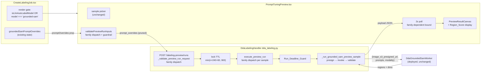

# Design Document

## Overview

This feature widens the shipped Prompt_Tuning_Preview from `llm:`-only to `llm:` + `grounded-sam`, superseding grounded-sam-autolabel's considered-and-rejected decision at the user's explicit request. The design principle is the same one that made the llm preview trustworthy: **the preview is a faithful predictor of labeling-time behavior because it runs the same contract, not a copy of it**. Concretely:

- The **run machinery is reused unchanged** — run record, per-user/per-Use_Case lock, async self-invoke executor, per-sample progressive writes, presigned result payloads, short-polling. The `llm:` gates become family dispatches; no new routes, tables, or prefixes.
- The **worker contract is the consumer's contract** — the executor's grounded-sam sample path presigns the image, derives the Preview_Prompt_Map with `_grounded_sam_prompts`' exact fallback, invokes `GROUNDED_SAM_WORKER_FUNCTION_NAME` synchronously bounded at `GROUNDED_SAM_MAX_TIMEOUT_SECONDS = 240` with retries disabled, and validates the response with `_generate_grounded_sam_prelabel`'s exact rules. A prompt that works in the preview works in the job, and one that fails fails the same way.
- The **renderer is reused** — `PreviewResultCanvas` already decodes Segmentation RLE masks (via `AnnotationCanvas`'s shared helpers) and positions ObjectDetection boxes; grounded-sam Pre_Labels arrive in exactly those shapes. The one rendering addition is the Region_Score beside each class name, conditional on presence, so `llm:` results (which carry no scores) render byte-identically.
- The **guardrail is enforced at both ends with the shipped modules** — `promptOverrideGuardrails.tsx` client-side (every offender listed before any request), `_prompt_guardrail_errors` server-side (validation errors before any lock claim). A period-bearing Effective_Prompt can never reach the worker from the preview, mirroring job creation.

Three deliberate divergences from the llm preview posture, each grounded in the worker's physics: the per-sample bound is 240 s (CPU cold start ≈ 140 s makes 120 s deterministically fatal); the executor gains a Run_Deadline_Guard (5 × 240 + 60 > the Lambda's 900 s, so a pathological all-timeouts run must self-terminate rather than die mid-flight); and worker-not-deployed rejects at start-time validation rather than producing a run of per-sample failures (a preview run is ephemeral — burning a lock and five failure payloads to report a deployment fact known up front serves nobody; job creation keeps its Req 5.4 semantics).

## Architecture



Request flow for a Grounded_SAM_Preview_Run:

1. **Wizard** renders the panel for `grounded-sam` (Segmentation/ObjectDetection are the only modalities offering the entry), feeding it the existing `groundedSamPromptOverrides` state through a new optional `promptOverrides` prop. The llm-only controls (detection prompt, few-shot, sizing) stay gated on `isLlmAutoLabelModel` exactly as today.
2. **Run control** validates client-side: family-aware rules plus the Prompt_Guardrail over every label's Effective_Prompt — all offenders listed, no request on violation. The request body carries `model: 'grounded-sam'`, `task_type`, `label_set`, `sample_images`, and `prompt_overrides` pruned exactly as job submission prunes them; no `detection_prompt`, `few_shot`, `downscale_max_edge`, or `token_budget`.
3. **Start route** dispatches validation by family. The grounded-sam arm: modality ∈ {Segmentation, ObjectDetection}, `_validate_label_set`, override creation-rules + `_prompt_guardrail_errors`, inapplicable-fields rejection, worker-deployed check (`GROUNDED_SAM_WORKER_FUNCTION_NAME` present, else the Not_Deployed_Message), plus all shared rules (Use_Case, prefix, sample scope/count) — every violation in one 400. Acceptance claims the lock with the family's TTL, writes the RUN item (recording `prompt_overrides`), writes Pending sample items, audits `preview_run`, and self-invokes the executor — all existing code paths.
4. **Executor** dispatches per run model. The grounded-sam sample path: check the Run_Deadline_Guard, presign the Sample_Image (same cross-account client machinery), invoke the worker synchronously (240 s read timeout, retries 0), validate the response with the consumer's rules, and write the success/failure payload before the item update — the existing sequencing. The run reaches Completed on every path and the lock is released in `finally`, as today.
5. **Panel** polls the existing status route (grounded-sam bound: `min(n × 240 + 60, 900) + 60` s), fetches payloads, and renders through `PreviewResultCanvas` — masks, boxes, scores, the empty state, and per-sample failures.

## Components and Interfaces

### Backend — `dda_labeling.py` (one writer task)

**Constants** (beside the existing preview constants):

```python
PREVIEW_GROUNDED_SAM_MODEL = 'grounded-sam'
# The consumer's bound, adopted per sample (Req 4.1). 120 s would
# deterministically fail every cold-start sample (~140 s observed).
PREVIEW_GSAM_PER_SAMPLE_SECONDS = 240   # == GROUNDED_SAM_MAX_TIMEOUT_SECONDS
GROUNDED_SAM_WORKER_FUNCTION_NAME = os.environ.get(
    'GROUNDED_SAM_WORKER_FUNCTION_NAME', '')
PREVIEW_GSAM_NOT_DEPLOYED_MESSAGE = 'Grounded-SAM worker is not deployed'
# Test injection seam, mirroring dda_autolabel_worker's.
grounded_sam_lambda_client = None
_cached_grounded_sam_lambda_client = None
```

**`_preview_per_sample_seconds(model) -> int`** — 240 for `grounded-sam`, 120 otherwise. `_preview_lock_ttl_seconds(sample_count, model='')` gains the model parameter (default keeps every existing call site byte-identical) and substitutes the family's per-sample term: `min(n × per_sample + 60, 900)`.

**`_validate_preview_run_request` family dispatch.** The model rule becomes: accept `llm:`-prefixed (existing path, unchanged) or exactly `grounded-sam`. The grounded-sam arm:

- modality must be Segmentation or ObjectDetection (Classification → validation error naming the family's modalities); `_validate_label_set` as today;
- `detection_prompt` not required and not recorded (the family has no such input);
- `prompt_overrides`: optional; creation rules verbatim (dict; keys within the request's Label_Set; string values; raw length ≤ 256; blank-after-trim dropped from the surviving map), then `_prompt_guardrail_errors(label_set, surviving_overrides)` — the shared wording, one error per offending label;
- inapplicable fields: `few_shot` enabled, non-null `downscale_max_edge`, or present `token_budget` → one validation error each stating the field does not apply to the grounded-sam family;
- worker-deployed: `GROUNDED_SAM_WORKER_FUNCTION_NAME` empty → one validation error carrying `PREVIEW_GSAM_NOT_DEPLOYED_MESSAGE`;
- shared rules (Use_Case, dataset prefix, sample count and scope) evaluated exactly as today, everything enumerated together.

The config dict gains `prompt_overrides` (the surviving map, or `{}`). `_start_preview_run` records it on the RUN item via a new optional `prompt_overrides` parameter of `_write_preview_run_item` (attribute written only when non-empty — llm RUN items stay byte-identical), resolves few-shot/token-budget only on the llm path (grounded-sam runs record `few_shot_enabled=False`, no sizing attributes), and claims the lock with `_preview_lock_ttl_seconds(sample_count, model)`. The `preview_run` audit event is the same single event; its `details.model` distinguishes the family.

**`_get_grounded_sam_preview_lambda_client()`** — the consumer's client construction verbatim: `connect_timeout=10, read_timeout=240, retries={'max_attempts': 0}`, behind the module-level injection seam.

**`_grounded_sam_preview_prompts(label_set, overrides)`** — the Preview_Prompt_Map derivation, replicating `_grounded_sam_prompts`' pure fallback (override when a string survives trimming, else the label name; total over malformed inputs). Replicated rather than imported: importing `dda_autolabel_worker` into `dda_labeling` would execute that module's environment/client initialization at import time. The equivalence is pinned by Property 5 against the consumer's function as the oracle, so drift is test-detected.

**`_run_grounded_sam_preview_sample(run, clients, usecase, dataset_bucket, sample_key)`** — the family's sample path, returning the prelabel dict plus worker-reported dimensions, raising `PreviewSampleFailure` otherwise:

1. Presign `s3://{dataset_bucket}/{sample_key}` through `_preview_s3_client` (same cross-account mechanism) with the consumer's 900 s expiry; a presign failure raises `image_access_failure` naming the object.
2. Invoke `GROUNDED_SAM_WORKER_FUNCTION_NAME` with `{'image_s3_presigned_url': url, 'prompts': _grounded_sam_preview_prompts(label_set, run.get('prompt_overrides')), 'modality': task_type}`. A read/connect timeout raises `PreviewSampleFailure('timeout', ...)`; any other invocation exception, a `FunctionError`, or an unparseable payload raises `PreviewSampleFailure('model_error', ...)` — each reason carrying the worker's error detail (the consumer's `[:512]` truncation for function-error bodies).
3. Validate the payload with the consumer's rules, transcribed: `regions` list + integer dimensions, else `model_error` "malformed response"; Segmentation — per region a Label_Set member `class` and non-empty `rle`, `score` carried through when present; ObjectDetection — per region a Label_Set member `class` and a `box` whose `left/top/width/height` are non-boolean numerics with positive extent inside the image bounds, emitted as the Bedrock-shaped `{class, left, top, width, height}` floats **plus `score` when present** (the one divergence from the stored job shape, display-only, on an ephemeral payload).
4. Return `({'modality', 'regions'|'boxes', 'image_width', 'image_height'}, width, height)`. An empty `regions` list is a valid success — the renderer's empty state.

**`execute_preview_run(run_id, context=None)`** — gains the optional Lambda context (threaded from `_handle_preview_action`; `None` from existing tests keeps behavior identical). The per-sample loop dispatches on `run['model']`:

- `grounded-sam`: apply the Run_Deadline_Guard first — when `context` is present and `context.get_remaining_time_in_millis() < (240 + 30) × 1000`, resolve this and every remaining Pending sample as `PreviewSampleFailure('timeout', 'the preview run deadline was reached before this sample could be invoked')` without invoking; otherwise call `_run_grounded_sam_preview_sample` and build `_preview_success_payload(sample_key, prelabel, width, height)` (no sizing kwargs — the pre-feature payload shape).
- `llm:` (and anything else): the existing `_run_preview_sample` path, untouched.

Everything after the dispatch — payload-before-item writes, `_update_preview_sample_state`, Completed-even-all-failed, lock release in `finally` — is the existing loop body, shared by both families.

### Frontend

**`api.ts` (one writer task).** `StartPreviewRunRequest` gains optional `prompt_overrides?: Record<string, string>`, `detection_prompt` and `few_shot` become optional (grounded-sam requests omit them; llm call sites keep passing them — no behavioral change). `DdaMaskRegion` and `DdaBoundingBox` gain optional `score?: number` (additive; no existing consumer reads it).

**`PromptTuningPreview.tsx` (one writer task).** New optional prop `promptOverrides?: Record<string, string>`; internal `isGroundedSam = model === 'grounded-sam'`.

- `validatePreviewRunInputs` gains `promptOverrides` in its input and dispatches the model rule: `llm:`-prefixed (existing rules verbatim) or `grounded-sam` — modality ∈ {Segmentation, ObjectDetection}, label-set rules as today, **no** detection-prompt rule, **no** token-budget rule, plus one violation per guardrail offender built from the shared module (`effectivePrompt` + `ALIGNMENT_BREAKING_PATTERN` + `promptGuardrailMessage`, walked in Label_Set order — the preview's list-every-offender style over the shared wording).
- `handleStartRun` for grounded-sam: skip the few-shot upload branch; assemble `prompt_overrides` with the submit-payload pruning (entries non-blank after trimming whose label is in `labelSet`, raw values); omit `detection_prompt`, `few_shot`, `downscale_max_edge`, `token_budget`. Poll with `perSampleBoundMs = isGroundedSam ? 240_000 : 120_000` and deadline `min(sampleCount × perSampleBound + 60_000, 900_000) + 60_000` for grounded-sam (the llm arm keeps the existing `sampleCount × 120_000 + 60_000` expression byte-for-byte).
- Start-rejection surface, gated to grounded-sam: when `startPreviewRun` throws an `ApiError` whose `details.validation_errors` is an array, render those messages in the existing validation-errors alert (this is how the Not_Deployed_Message reaches the Job_Creator); the llm arm keeps today's generic `runError` path untouched.
- The sizing controls and few-shot hint stay behind `isLlmAutoLabelModel`; the timing expectation (CPU inference ≈ 5 s per image warm; first run after idle can take a few minutes while the worker starts) renders only for grounded-sam.

**`PreviewResultCanvas.tsx` (one writer task).** Region_Score display: the Segmentation legend entry and the ObjectDetection box label append ` (score.toFixed(2))` when the region/box carries a numeric `score`. No score — byte-identical markup, which is every llm payload.

**`CreateLabelingJob.tsx` (one writer task).** The render gate becomes `autoLabelEnabled && (isLlmAutoLabelModel || autoLabelModel === 'grounded-sam')`; the panel receives `promptOverrides={groundedSamPromptOverrides}`. All other props are already family-safe (`detectionPrompt` is unused by the grounded-sam arm; `fewShotEnabled` is always false outside llm). Nothing else on the page changes; submission assembly is untouched.

### Infrastructure — `compute-stack.ts` (one writer task)

Inside the existing `deployGroundedSamWorker`-gated block, after the `ddaAutolabelWorker` wiring (`ddaLabelingHandler` is declared ~270 lines earlier, so both references are valid):

```typescript
// Prompt_Tuning_Preview for the grounded-sam family: the preview
// executor runs in DdaLabelingHandler and invokes the worker
// synchronously per sample (grounded-sam-prompt-tuning-preview Req 8.1).
// Flag off → no env entry, no grant: the preview start route then
// rejects grounded-sam runs with the not-deployed message (Req 6.1)
// while job creation keeps its Req 5.4 degradation.
ddaLabelingHandler.addEnvironment(
  'GROUNDED_SAM_WORKER_FUNCTION_NAME',
  ddaGroundedSamWorker.functionName,
);
ddaGroundedSamWorker.grantInvoke(ddaLabelingHandler);
```

`grantInvoke` on `ddaLabelingHandler` has no cycle hazard here (the policy statement references the *worker's* ARN, not the handler's own — the self-invoke cycle documented above `DdaLabelingSelfInvokePolicy` does not apply). Flag off produces today's template exactly.

## Data Models

**Start request (grounded-sam family):**

```json
{
  "usecase_id": "uc-…", "dataset_prefix": "training-images/",
  "model": "grounded-sam",
  "task_type": "Segmentation" | "ObjectDetection",
  "label_set": ["cookie_gap"],
  "sample_images": ["training-images/anomaly-1.jpg"],
  "prompt_overrides": {"cookie_gap": "gap between broken cookie pieces"}
}
```

`detection_prompt`, `few_shot`, `downscale_max_edge`, `token_budget`: rejected when present (few-shot only when enabled; downscale only when non-null).

**RUN item additions:** `prompt_overrides` (map, written only when non-empty). Grounded-sam RUN items carry `few_shot_enabled: false`, `attached/omitted_example_count: 0`, no `detection_prompt`, no sizing attributes. llm RUN items are byte-identical to today's.

**Preview_Prompt_Map oracle** (== `_grounded_sam_prompts`): for each `label` in `label_set` order, `{label, prompt: overrides[label] if it is a string non-empty after trimming else label}`; total over `None`/non-dict/non-string junk.

**Success payload:** `_preview_success_payload` unchanged — `{sample_key, state: 'Succeeded', prelabel, image_width, image_height}` where `prelabel` is `{modality, regions: [{class, rle, score?}], image_width, image_height}` (Segmentation) or `{modality, boxes: [{class, left, top, width, height, score?}], image_width, image_height}` (ObjectDetection). Dimensions are the worker's reported integers.

**Failure category mapping (grounded-sam sample path):**

| Outcome | Category | Reason carries |
|---|---|---|
| presigned URL cannot be produced | `image_access_failure` | the object key |
| read/connect timeout at 240 s | `timeout` | the invocation error |
| invocation exception | `model_error` | the exception text |
| `FunctionError` | `model_error` | worker error body (≤ 512 chars) |
| unparseable / malformed payload | `model_error` | the parse/validation detail |
| out-of-set class, empty RLE, bad box | `model_error` | the consumer's wording for that violation |
| Run_Deadline_Guard trip | `timeout` | "the preview run deadline was reached…" |

All categories are members of the existing `PREVIEW_FAILURE_CATEGORIES`; no new category, so the status route and panel render them with zero changes.

**Timing model:** per-sample bound 240 s; lock TTL `min(n × 240 + 60, 900)` s; executor deadline guard threshold `remaining < 270 s`; client poll bound `min(n × 240 + 60, 900) + 60` s. For n = 5 the lock and poll bounds saturate at 900/960 s — inside the handler's 900 s Lambda timeout by construction of the guard.

## Correctness Properties

*A property is a characteristic or behavior that should hold true across all valid executions of a system — essentially, a formal statement about what the system should do. Properties serve as the bridge between human-readable specifications and machine-verifiable correctness guarantees.*

Each property gets exactly one property-based test at a minimum of 100 iterations (Hypothesis `@settings(max_examples=100, deadline=None)` backend; fast-check `{ numRuns: 100 }` frontend), tagged `Feature: grounded-sam-prompt-tuning-preview, Property {n}: {title}`. The prework was consolidated: the four visibility criteria (1.1, 1.2, 1.4, 1.5) collapse into Property 1; the backend validation criteria (2.4, 2.5, 3.2-3.5) into Property 4's single accepts-iff oracle; the tune loop (7.1) is implied by Properties 3 and 5 (each run's request and map reflect its own entries) and proven end-to-end by the live verification; empty-regions (4.4) and presign-failure (4.6) ride Properties 6 and 7's generators as edge cases. Picker UX (1.3), the timing note (1.6), route mechanics/audit/authz (3.1, 3.7, 3.8), polling bounds (3.9), replacement semantics (3.10), representative rendering (5.1, 5.2, 5.4, 5.5), degradation surfaces (6.1, 6.2), and loop ergonomics (7.2, 7.3) are examples per the prework; infrastructure (8.x) is CDK assertion tests; preservation and rebaseline accounting (6.3, 9.x, 10.x) are the checkpoint's non-regression inventory.

| # | Property (title) | Validates | Test file |
|---|---|---|---|
| 1 | The Preview_Panel renders exactly for the preview families, without the llm-only controls under grounded-sam | 1.1, 1.2, 1.4, 1.5 | `frontend/src/pages/CreateLabelingJob.gsampreview.property.test.tsx` |
| 2 | The run control starts a grounded-sam run iff the Prompt_Guardrail holds, listing every offender | 2.3 | `frontend/src/components/labeling/PromptTuningPreview.groundedsam.property.test.tsx` |
| 3 | A started grounded-sam run's request carries exactly the job's pruned prompts and no llm-only fields | 2.1, 7.1 | `frontend/src/pages/CreateLabelingJob.gsampreview.property.test.tsx` |
| 4 | Start validation accepts iff the grounded-sam predicate holds, enumerating every violation with nothing persisted | 2.4, 2.5, 3.2, 3.3, 3.4, 3.5 | `backend/tests/test_property_gsam_preview_routes.py` |
| 5 | The executor's invoke payload equals the consumer's derivation | 2.2, 4.1, 7.1 | `backend/tests/test_property_gsam_preview_executor.py` |
| 6 | Response acceptance and payload construction mirror the consumer's validation | 4.2, 4.3, 4.4 | `backend/tests/test_property_gsam_preview_executor.py` |
| 7 | Failure categorization is total, one existing category per outcome, worker detail carried | 4.5, 4.6 | `backend/tests/test_property_gsam_preview_executor.py` |
| 8 | Every grounded-sam run terminates: deadline-guarded samples resolve as timeout without invocation, the run reaches Completed, the lock is released | 4.7, 4.8 | `backend/tests/test_property_gsam_preview_executor.py` |
| 9 | The in-flight lock TTL takes the family's per-sample form | 3.6, 9.2 | `backend/tests/test_property_gsam_preview_routes.py` |
| 10 | Grounded-sam runs create no labeling-pipeline state | 4.9, 9.3 | `backend/tests/test_property_gsam_preview_executor.py` |
| 11 | Region_Score renders exactly when a region or box carries one | 5.3, 9.5 | `frontend/src/components/labeling/PreviewResultCanvas.score.property.test.tsx` |

### Property 1: The Preview_Panel renders exactly for the preview families, without the llm-only controls under grounded-sam

*For any* auto-label model selection (`grounded-sam`, `sam`, `bedrock:*`, `llm:*`, none) and any offered Labeling_Modality, the wizard's setup step SHALL render the Preview_Panel exactly when auto-labeling is enabled and the model is `llm:`-prefixed or `grounded-sam`; and whenever the model is `grounded-sam`, the detection prompt entry, few-shot toggle, and sizing controls SHALL be absent.

**Validates: Requirements 1.1, 1.2, 1.4, 1.5**

### Property 2: The run control starts a grounded-sam run iff the Prompt_Guardrail holds, listing every offender

*For any* Label_Set rows and Prompt_Override entry states (empty, whitespace-only, period-bearing, other-punctuation, unicode) with a valid sample selection, activating the run control under a grounded-sam selection SHALL issue a start request exactly when every label's Effective_Prompt is period-free; on violation the panel SHALL list one corrective error per offending label using the shared guardrail wording, issue no request, and leave the selection and wizard state unchanged.

**Validates: Requirements 2.3**

### Property 3: A started grounded-sam run's request carries exactly the job's pruned prompts and no llm-only fields

*For any* guardrail-clean Label_Set and Prompt_Override entry states, the started run's request body SHALL carry `model: 'grounded-sam'`, the wizard's modality and Label_Set, the selected samples, and a `prompt_overrides` map equal to exactly the entries non-empty after trimming whose label is in the effective Label_Set (values character-for-character), with no `detection_prompt`, `few_shot`, `downscale_max_edge`, or `token_budget` key.

**Validates: Requirements 2.1, 7.1**

### Property 4: Start validation accepts iff the grounded-sam predicate holds, enumerating every violation with nothing persisted

*For any* generated start request (model strings across families; modalities; label sets; override maps mixing valid, blank, period-bearing, over-length, unknown-key, and non-string entries; sample lists mixing in-scope, out-of-scope, and out-of-count; inapplicable llm fields present or absent), `POST /labeling-preview/runs` SHALL answer 202 exactly when the model is `llm:`-valid (existing rules) or is `grounded-sam` with a Segmentation/ObjectDetection modality, a valid Label_Set, creation-rule-valid and guardrail-clean overrides, no inapplicable field, in-scope samples within 1..5, and the worker configured; every rejection SHALL enumerate all violated rules in one response and persist no RUN item, no sample item, and no lock claim.

**Validates: Requirements 2.4, 2.5, 3.2, 3.3, 3.4, 3.5**

### Property 5: The executor's invoke payload equals the consumer's derivation

*For any* Label_Set and recorded `prompt_overrides` (mixing surviving, blank, absent, and malformed entries), each Sample_Image invocation of a Grounded_SAM_Preview_Run SHALL carry a payload whose `prompts` equal `dda_autolabel_worker._grounded_sam_prompts(label_set, overrides)`, whose `modality` is the run's task type, and whose `image_s3_presigned_url` presigns the sample's object — so each run's prompts are its own recorded entries.

**Validates: Requirements 2.2, 4.1, 7.1**

### Property 6: Response acceptance and payload construction mirror the consumer's validation

*For any* worker response payload (valid Segmentation/ObjectDetection responses including empty `regions`, and malformed ones: missing/non-list `regions`, non-integer dimensions, out-of-Label_Set classes, empty RLE, missing/degenerate/out-of-bounds box geometry), the preview sample SHALL resolve Succeeded exactly when `_generate_grounded_sam_prelabel` would accept the same payload, and on success the written prelabel SHALL carry the renderer shapes with each region/box's `score` present exactly when the worker returned one, an empty response resolving as Succeeded with an empty Pre_Label.

**Validates: Requirements 4.2, 4.3, 4.4**

### Property 7: Failure categorization is total, one existing category per outcome, worker detail carried

*For any* per-sample invocation outcome (invocation exception, read timeout, `FunctionError`, unparseable payload, validation-failing payload, presign failure), the sample SHALL resolve Failed with exactly one category from the existing `PREVIEW_FAILURE_CATEGORIES` — `timeout` for timeouts, `image_access_failure` for presign failures, `model_error` otherwise — with a reason carrying the outcome's detail, and every other sample of the run SHALL resolve independently.

**Validates: Requirements 4.5, 4.6**

### Property 8: Every grounded-sam run terminates: deadline-guarded samples resolve as timeout without invocation, the run reaches Completed, the lock is released

*For any* sample count 1..5 and any remaining-time profile of the executor's Lambda context (including profiles that exhaust mid-run), every sample SHALL reach a resolution — samples whose slot cannot fit another 240-second invocation resolving as `timeout` failures with zero worker invocations — the run status SHALL reach Completed, and the in-flight lock SHALL be absent afterwards.

**Validates: Requirements 4.7, 4.8**

### Property 9: The in-flight lock TTL takes the family's per-sample form

*For any* sample count 1..5, a grounded-sam start's lock claim SHALL carry `expires_at - claimed_at = min(count × 240 + 60, 900)` seconds, and an `llm:` start's SHALL carry `min(count × 120 + 60, 900)` — the pre-feature form.

**Validates: Requirements 3.6, 9.2**

### Property 10: Grounded-sam runs create no labeling-pipeline state

*For any* executed Grounded_SAM_Preview_Run (mixed success/failure outcomes), the system SHALL hold no new Labeling_Job record, no Task_Assignment item, no artifact under `labeling/{usecase_id}/`, and no labeler notification — result payloads existing only under `labeling-previews/`.

**Validates: Requirements 4.9, 9.3**

### Property 11: Region_Score renders exactly when a region or box carries one

*For any* successful result payload (Segmentation regions or ObjectDetection boxes, each independently carrying or omitting a numeric `score`), the rendered result SHALL display each region/box's score beside its class name exactly when the payload carries one — a payload with no scores (every llm payload) rendering byte-identically to before this feature.

**Validates: Requirements 5.3, 9.5**

## Error Handling

- **Client-side rejection** (guardrail violation, bad selection count): the existing validation-errors alert lists every violated rule; no request is issued; wizard state untouched (Req 2.3).
- **Start-time 400** (including the Not_Deployed_Message): the grounded-sam arm reads `ApiError.details.validation_errors` and renders the messages in the same validation-errors alert, leaving the panel and wizard operable (Req 6.2); the llm arm keeps its existing generic start-failure path byte-identically.
- **409 in-flight**: the existing message and semantics, unchanged.
- **Per-sample failures**: exactly one existing category each (table in Data Models); the panel's existing failure rendering shows category and reason; a sample failure never disturbs its siblings (Req 4.5).
- **Run-level failure** (executor invoke never landed, store write failures): the existing Failed-with-`run_error` path, unchanged.
- **Deadline exhaustion**: the Run_Deadline_Guard converts would-be-stranded samples into `timeout` failures so the run still reaches Completed and the lock is released — no stuck-Running runs (Req 4.7, 4.8).
- **Worker not deployed**: start-time validation rejection carrying the Not_Deployed_Message; no lock, no run state, no S3 reads (Req 6.1); job creation untouched (Req 6.3).

## Testing Strategy

Dual approach: property-based tests for the eleven correctness properties (exactly one test per property, ≥ 100 iterations, tagged `Feature: grounded-sam-prompt-tuning-preview, Property {n}: {title}`), example-based tests for route mechanics, rendering wiring, degradation surfaces, and content pins.

**Backend** (`edge-cv-portal/backend/tests/`, pytest + moto + Hypothesis, targeted runs only): new `test_property_gsam_preview_routes.py` (Properties 4, 9) and `test_property_gsam_preview_executor.py` (Properties 5-8, 10) over the shipped scaffolding — `PreviewEnv`/`CreateJobEnv` and `FakeLambdaClient` from `test_dda_labeling_create_job.py`, a `FakeGroundedSamLambdaClient` per `test_property_grounded_sam_consumer.py`'s pattern injected at the new `dda_labeling.grounded_sam_lambda_client` seam, and `dda_autolabel_worker._grounded_sam_prompts` / `_generate_grounded_sam_prelabel` imported as Property 5/6 oracles. New example suites `test_dda_gsam_preview_routes.py` (202 shape, RUN-item recording, audit event, authz fixed bodies, not-deployed rejection, 409) and `test_dda_gsam_preview_executor.py` (client config 240 s/retries-0, sequential payload-before-item ordering, representative categorized failures) following the shipped preview suites' structure.

**Frontend** (`edge-cv-portal/frontend/src/`, vitest + testing-library + fast-check, `localStorage.clear()` per run, `npx tsc --noEmit` must pass): new `CreateLabelingJob.gsampreview.property.test.tsx` (Properties 1, 3 — the render-per-run wizard walk precedent), `PromptTuningPreview.groundedsam.property.test.tsx` (Property 2), `PreviewResultCanvas.score.property.test.tsx` (Property 11), and example suite `PromptTuningPreview.groundedsam.test.tsx` (picker under grounded-sam, timing note, poll bound at 240 s per sample, replacement semantics, mask/box/score/empty/failure rendering wiring, not-deployed surface, in-flight disable, selection retention).

**Infrastructure** (`edge-cv-portal/infrastructure/`, jest + CDK assertions): new `test/gsam-preview-infra.test.ts` — flag-on synth carries the env entry and invoke grant on `DdaLabelingHandler` with the existing worker wiring unchanged; flag-off synth carries neither (today's template).

**Declared rebaseline class (Requirement 10), the only pre-existing test changes:** `CreateLabelingJob.groundedsam.test.tsx` (Req 7.3 preview-absence assertion inverts, with settling; sibling absences kept), `CreateLabelingJob.guardrails.test.tsx` (settling awaits only), and benign `getImagePreview` resolutions in the two wizard property suites (mock-table only, zero oracle changes). The checkpoint's non-regression inventory verifies: every other suite byte-identical; `dda_autolabel_worker.py`, `grounded-sam-worker/`, `dda-labeling-api-stack.ts` show no diff; the shipped llm preview suites (`test_dda_labeling_preview_routes.py`, `test_dda_labeling_preview_executor.py`, `test_preview_flow_integration.py`, `test_property_preview_run_outcomes.py`, `PromptTuningPreview.*.test.tsx`, `PreviewResultCanvas.test.tsx`) pass unchanged.
