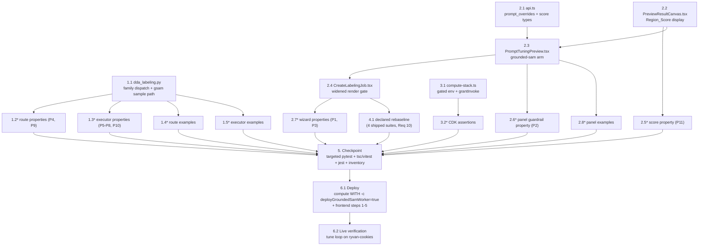

# Implementation Plan: Grounded-SAM Prompt Tuning Preview

## Overview

One feature over six implementation files, worked as independent single-writer tracks that converge at one checkpoint, one flag-carrying deploy, and one live tune-loop verification. The backend track turns `dda_labeling.py`'s `llm:` preview gates into family dispatches — the grounded-sam validation arm (modality, creation-rule overrides, shared `_prompt_guardrail_errors`, inapplicable-field rejection, worker-deployed check), the family-dependent lock TTL, the `_grounded_sam_preview_prompts` derivation, the `_run_grounded_sam_preview_sample` worker invoke/validate path mirroring `_generate_grounded_sam_prelabel`, and the Run_Deadline_Guard — all in one pass over the one file. The frontend track adds the request/score types to `api.ts`, the Region_Score display to `PreviewResultCanvas.tsx`, the grounded-sam arm (guardrail pre-flight, request assembly, 240 s poll bound, not-deployed surface, timing note) to `PromptTuningPreview.tsx`, and the widened render gate to `CreateLabelingJob.tsx`. Infrastructure adds the env var + `grantInvoke` for `DdaLabelingHandler` inside the existing `deployGroundedSamWorker`-gated block. Eleven correctness properties land as property-based tests (Hypothesis / fast-check, ≥ 100 iterations, spec-tagged); the declared rebaseline (Requirement 10) amends exactly four shipped frontend suites in the declared ways. The consumer (`dda_autolabel_worker.py`), the worker image (`grounded-sam-worker/`), and the API stack (`dda-labeling-api-stack.ts` — no new routes) are untouched.

Same-file discipline: `dda_labeling.py` (1.1), `api.ts` (2.1), `PreviewResultCanvas.tsx` (2.2), `PromptTuningPreview.tsx` (2.3), `CreateLabelingJob.tsx` (2.4), `compute-stack.ts` (3.1), and each test file have exactly one writer task; the rebaseline task 4.1 is the sole writer of its four amended files; no wave contains two writers of one file.

## Task Dependency Graph

```json
{
  "waves": [
    { "id": 0, "description": "Independent implementations, one writer per file: the whole dda_labeling.py family dispatch, the api.ts types, the renderer's score display, and the gated infrastructure wiring.", "tasks": ["1.1", "2.1", "2.2", "3.1"] },
    { "id": 1, "description": "Backend property and example suites against the wave-0 implementation; the preview panel's grounded-sam arm (needs the api.ts types); the score-rendering property; the CDK assertion suite.", "tasks": ["1.2", "1.3", "1.4", "1.5", "2.3", "2.5", "3.2"] },
    { "id": 2, "description": "The wizard gate (needs the panel), the panel-level guardrail property, and the panel example suite.", "tasks": ["2.4", "2.6", "2.8"] },
    { "id": 3, "description": "Wizard-level properties (need the gate) and the declared rebaseline amendments (the amended suites exercise the wizard with the preview mounting under grounded-sam).", "tasks": ["2.7", "4.1"] },
    { "id": 4, "description": "Routine-shaped deploy after the checkpoint — compute stack WITH the mandatory worker flag, then the frontend bundle via deploy-frontend.sh steps 1-5 only.", "tasks": ["6.1"] },
    { "id": 5, "description": "Live verification: the tune loop proven against s3://ryvan-cookies with two prompts and differing results.", "tasks": ["6.2"] }
  ]
}
```



## Tasks

- [x] 1. Backend: grounded-sam family in the Preview_API and executor
  - [x] 1.1 Implement the family dispatch in `dda_labeling.py` (single pass)
    - Constants beside the existing preview block: `PREVIEW_GROUNDED_SAM_MODEL = 'grounded-sam'`, `PREVIEW_GSAM_PER_SAMPLE_SECONDS = 240` (comment: `== GROUNDED_SAM_MAX_TIMEOUT_SECONDS`; cold start ≈ 140 s makes 120 s deterministically fatal), `GROUNDED_SAM_WORKER_FUNCTION_NAME = os.environ.get(..., '')`, `PREVIEW_GSAM_NOT_DEPLOYED_MESSAGE = 'Grounded-SAM worker is not deployed'`, and the `grounded_sam_lambda_client` / `_cached_grounded_sam_lambda_client` test-injection seam
    - `_preview_per_sample_seconds(model)` (240 for grounded-sam, 120 otherwise); `_preview_lock_ttl_seconds(sample_count, model='')` gains the defaulted model parameter — every existing call site behaves byte-identically — and the start route passes the request's model so grounded-sam claims carry `min(n × 240 + 60, 900)`
    - `_validate_preview_run_request` model rule becomes the family dispatch: `llm:`-prefixed (existing path verbatim) or exactly `grounded-sam`; the grounded-sam arm validates modality ∈ {Segmentation, ObjectDetection} (Classification names the family's modalities), `_validate_label_set` as today, no detection-prompt rule, `prompt_overrides` with the creation rules (dict, keys within the request's Label_Set, string values ≤ 256 raw, blank-after-trim dropped) then `_prompt_guardrail_errors` over the survivors, one error per inapplicable field (few-shot enabled / non-null `downscale_max_edge` / present `token_budget`), and the worker-deployed check answering `PREVIEW_GSAM_NOT_DEPLOYED_MESSAGE` when the env var is empty — all shared rules and the enumerate-everything posture unchanged; config gains `prompt_overrides`
    - `_start_preview_run`: record `prompt_overrides` on the RUN item via a new defaulted `_write_preview_run_item` parameter (attribute only when non-empty — llm RUN items byte-identical); grounded-sam runs skip few-shot/token-budget resolution (`few_shot_enabled=False`, counts 0, no sizing attributes); the single `preview_run` audit event unchanged in shape with `model: 'grounded-sam'` in details
    - `_get_grounded_sam_preview_lambda_client()` (connect 10 s / read 240 s / retries 0, behind the seam); `_grounded_sam_preview_prompts(label_set, overrides)` replicating the consumer's pure fallback (do NOT import `dda_autolabel_worker` — module-level env/client init; equivalence is Property 5's oracle); `_run_grounded_sam_preview_sample(run, clients, usecase, dataset_bucket, sample_key)` — presign via `_preview_s3_client` (900 s expiry; failure → `image_access_failure` naming the object), invoke `{image_s3_presigned_url, prompts, modality}`, map timeout → `PreviewSampleFailure('timeout', ...)`, other invoke errors / `FunctionError` (body ≤ 512) / unparseable → `'model_error'`, validate with the consumer's transcribed rules (regions list + int dims; Seg: Label_Set class + non-empty rle, score carried; OD: Label_Set class + numeric positive in-bounds box → `{class, left, top, width, height}` floats plus `score` when present), empty regions → success with empty Pre_Label
    - `execute_preview_run(run_id, context=None)` threaded from `_handle_preview_action`; the sample loop dispatches on `run['model']`: grounded-sam applies the Run_Deadline_Guard (`context.get_remaining_time_in_millis() < 270_000` → resolve this and remaining Pending samples as `timeout` with the deadline reason, zero invocations) then `_run_grounded_sam_preview_sample` + `_preview_success_payload(sample_key, prelabel, width, height)` (no sizing kwargs); every other model takes the existing `_run_preview_sample` path untouched; payload-before-item writes, Completed-even-all-failed, and the `finally` lock release shared as today
    - _Requirements: 2.2, 2.4, 2.5, 3.1, 3.2, 3.3, 3.4, 3.5, 3.6, 3.7, 3.8, 4.1, 4.2, 4.3, 4.4, 4.5, 4.6, 4.7, 4.8, 4.9, 6.1, 9.2, 9.3, 9.4_

  - [x]* 1.2 Write the route property tests
    - `edge-cv-portal/backend/tests/test_property_gsam_preview_routes.py` (new) — Hypothesis `@settings(max_examples=100, deadline=None)` over the moto-backed `PreviewEnv`/`CreateJobEnv` scaffolding with `FakeLambdaClient`, generators spanning model strings across families, modalities, label sets, override maps (valid / blank / period-bearing / over-length / unknown-key / non-string), sample lists (in-scope / out-of-scope / out-of-count), and inapplicable llm fields
    - **Property 4: Start validation accepts iff the grounded-sam predicate holds, enumerating every violation with nothing persisted** — **Validates: Requirements 2.4, 2.5, 3.2, 3.3, 3.4, 3.5**
    - **Property 9: The in-flight lock TTL takes the family's per-sample form** — **Validates: Requirements 3.6, 9.2**
    - _Requirements: 2.4, 2.5, 3.2, 3.3, 3.4, 3.5, 3.6, 9.2_

  - [x]* 1.3 Write the executor property tests
    - `edge-cv-portal/backend/tests/test_property_gsam_preview_executor.py` (new) — Hypothesis over moto-seeded grounded-sam RUN/sample items with a `FakeGroundedSamLambdaClient` (the `test_property_grounded_sam_consumer.py` pattern) injected at `dda_labeling.grounded_sam_lambda_client`, and `dda_autolabel_worker._grounded_sam_prompts` / `_generate_grounded_sam_prelabel` imported as oracles; stub Lambda context with a scripted `get_remaining_time_in_millis`
    - **Property 5: The executor's invoke payload equals the consumer's derivation** — **Validates: Requirements 2.2, 4.1, 7.1**
    - **Property 6: Response acceptance and payload construction mirror the consumer's validation** — **Validates: Requirements 4.2, 4.3, 4.4**
    - **Property 7: Failure categorization is total, one existing category per outcome, worker detail carried** — **Validates: Requirements 4.5, 4.6**
    - **Property 8: Every grounded-sam run terminates: deadline-guarded samples resolve as timeout without invocation, the run reaches Completed, the lock is released** — **Validates: Requirements 4.7, 4.8**
    - **Property 10: Grounded-sam runs create no labeling-pipeline state** — **Validates: Requirements 4.9, 9.3**
    - _Requirements: 2.2, 4.1, 4.2, 4.3, 4.4, 4.5, 4.6, 4.7, 4.8, 4.9, 7.1, 9.3_

  - [x]* 1.4 Write the route example tests
    - `edge-cv-portal/backend/tests/test_dda_gsam_preview_routes.py` (new, the `test_dda_labeling_preview_routes.py` structure): accepted grounded-sam request → 202 shape, RUN item carrying model/task_type/label_set/`prompt_overrides`/`few_shot_enabled: false`, one Pending IMAGE item per sample, the captured `execute_preview_run` self-invoke (3.1); the `preview_run` audit event's fields (3.7); the flattened 403 on both routes and the fixed 404 for another user's run (3.8); env var unset → 400 carrying exactly 'Grounded-SAM worker is not deployed' with no lock and no items, env var set → the rule silent (6.1); 409 while a claim is active (3.6)
    - _Requirements: 3.1, 3.6, 3.7, 3.8, 6.1_

  - [x]* 1.5 Write the executor example tests
    - `edge-cv-portal/backend/tests/test_dda_gsam_preview_executor.py` (new, the `test_dda_labeling_preview_executor.py` structure): the preview's Lambda client config (read timeout 240, retries 0 — the `test_dda_grounded_sam_consumer.py` captured-config pattern) (4.1); sequential request-order processing with each payload written before its item (4.9); representative categorized failures — `FunctionError` body carried ≤ 512, unparseable payload, out-of-set class — beside a succeeding sibling sample (4.5); an all-failed run reaching Completed with the lock released (4.8)
    - _Requirements: 4.1, 4.5, 4.8, 4.9_

- [x] 2. Frontend: API types, renderer score, preview panel arm, wizard gate
  - [x] 2.1 Extend the API client types in `api.ts`
    - `StartPreviewRunRequest`: add optional `prompt_overrides?: Record<string, string>`; make `detection_prompt` and `few_shot` optional (grounded-sam requests omit them; llm call sites keep passing both — no behavioral change)
    - `DdaMaskRegion` and `DdaBoundingBox`: add optional `score?: number` (additive; no existing consumer reads it); doc comments cite this spec
    - _Requirements: 2.1, 5.3_

  - [x] 2.2 Add the Region_Score display to `PreviewResultCanvas.tsx`
    - Segmentation legend entries and ObjectDetection box labels append the score formatted to two decimals when the region/box carries a numeric `score`; no score → byte-identical markup (every llm payload) — testids `preview-region-score` / `preview-box-score`
    - _Requirements: 5.1, 5.2, 5.3, 5.4, 9.5_

  - [x] 2.3 Add the grounded-sam arm to `PromptTuningPreview.tsx`
    - New optional prop `promptOverrides?: Record<string, string>`; `isGroundedSam = model === 'grounded-sam'`; sample picker, polling loop, replacement semantics, and result plumbing shared unchanged
    - `validatePreviewRunInputs`: model rule accepts `llm:`-prefixed (existing rules verbatim) or `grounded-sam`; the grounded-sam arm skips the detection-prompt and token-budget rules, requires modality ∈ {Segmentation, ObjectDetection}, keeps the label-set and sample-count rules, and appends one violation per Prompt_Guardrail offender in Label_Set order built from the shared `promptOverrideGuardrails` exports (`effectivePrompt` + `ALIGNMENT_BREAKING_PATTERN` + `promptGuardrailMessage`)
    - `handleStartRun` grounded-sam path: skip the few-shot upload branch; assemble `prompt_overrides` with the submit-payload pruning (non-blank-after-trim entries whose label is in `labelSet`, raw values); omit `detection_prompt` / `few_shot` / `downscale_max_edge` / `token_budget`; poll deadline `min(sampleCount × 240_000 + 60_000, 900_000) + 60_000` (the llm expression kept byte-for-byte); on an `ApiError` whose `details.validation_errors` is an array — grounded-sam runs only — render those messages in the existing validation-errors alert (the Not_Deployed_Message path, Req 6.2), the llm start-failure path untouched
    - Sizing controls and few-shot hint stay behind `isLlmAutoLabelModel`; a grounded-sam-only timing note (CPU inference ≈ 5 s per image warm; first run after idle can take a few minutes while the worker starts), testid `preview-gsam-timing-note`
    - _Requirements: 1.3, 1.4, 1.6, 2.1, 2.3, 3.9, 3.10, 5.5, 6.2, 7.1, 7.2, 7.3_

  - [x] 2.4 Widen the render gate in `CreateLabelingJob.tsx`
    - The Preview_Panel condition becomes `autoLabelEnabled && (isLlmAutoLabelModel || autoLabelModel === 'grounded-sam')`; pass `promptOverrides={groundedSamPromptOverrides}`; every other prop and the whole submission assembly untouched
    - _Requirements: 1.1, 1.2, 1.5, 9.1, 9.3_

  - [x]* 2.5 Write the score-rendering property test
    - `edge-cv-portal/frontend/src/components/labeling/PreviewResultCanvas.score.property.test.tsx` (new) — fast-check `{ numRuns: 100 }` over Segmentation/ObjectDetection payloads whose regions/boxes independently carry or omit numeric scores
    - **Property 11: Region_Score renders exactly when a region or box carries one** — **Validates: Requirements 5.3, 9.5**
    - _Requirements: 5.3, 9.5_

  - [x]* 2.6 Write the panel guardrail property test
    - `edge-cv-portal/frontend/src/components/labeling/PromptTuningPreview.groundedsam.property.test.tsx` (new) — fast-check `{ numRuns: 100 }`, component-level render with `model='grounded-sam'` and mocked listing/start APIs, generators over label rows and override entry states (empty, whitespace, period-bearing, other punctuation, unicode)
    - **Property 2: The run control starts a grounded-sam run iff the Prompt_Guardrail holds, listing every offender** — **Validates: Requirements 2.3**
    - _Requirements: 2.3_

  - [x]* 2.7 Write the wizard property tests
    - `edge-cv-portal/frontend/src/pages/CreateLabelingJob.gsampreview.property.test.tsx` (new) — fast-check `{ numRuns: 100 }` over the render-per-run wizard walk (the groundedsam.property precedent, `localStorage.clear()` per run), model/modality generators for visibility and guardrail-clean override scenarios for request assembly, `startPreviewRun` mocked to capture bodies
    - **Property 1: The Preview_Panel renders exactly for the preview families, without the llm-only controls under grounded-sam** — **Validates: Requirements 1.1, 1.2, 1.4, 1.5**
    - **Property 3: A started grounded-sam run's request carries exactly the job's pruned prompts and no llm-only fields** — **Validates: Requirements 2.1, 7.1**
    - _Requirements: 1.1, 1.2, 1.4, 1.5, 2.1, 7.1_

  - [x]* 2.8 Write the panel example tests
    - `edge-cv-portal/frontend/src/components/labeling/PromptTuningPreview.groundedsam.test.tsx` (new, the shipped PromptTuningPreview.test.tsx scaffolding): picker lists/selects/caps under grounded-sam (1.3); the timing note present under grounded-sam, absent under llm: (1.6); fake-timer poll bound at 240 s per sample with give-up past it and the llm bound unchanged (3.9); two sequential runs' replacement semantics (3.10); mask overlay + legend, boxes + labels, scores, empty state, and failure category/reason rendering fed from grounded-sam payloads (5.1, 5.2, 5.4, 5.5); a mocked 400 with `validation_errors: ['Grounded-SAM worker is not deployed']` surfacing the message with the panel operable (6.2); in-flight disable/re-enable and selection retention across runs (7.2, 7.3)
    - _Requirements: 1.3, 1.6, 3.9, 3.10, 5.1, 5.2, 5.4, 5.5, 6.2, 7.2, 7.3_

- [x] 3. Infrastructure: preview executor wiring inside the gated block
  - [x] 3.1 Extend the `deployGroundedSamWorker`-gated block in `compute-stack.ts`
    - Inside the existing `if (deployGroundedSamWorker)` block, after the `ddaAutolabelWorker` wiring: `ddaLabelingHandler.addEnvironment('GROUNDED_SAM_WORKER_FUNCTION_NAME', ddaGroundedSamWorker.functionName)` and `ddaGroundedSamWorker.grantInvoke(ddaLabelingHandler)` (no cycle hazard — the statement references the worker's ARN, not the handler's own), with a comment citing this spec and the flag-off degradation
    - Flag off → today's template exactly: no env entry, no new grant; the existing worker definition and `ddaAutolabelWorker` wiring untouched
    - _Requirements: 6.3, 8.1, 8.2, 8.3_

  - [x]* 3.2 Write the CDK assertion tests
    - `edge-cv-portal/infrastructure/test/gsam-preview-infra.test.ts` (new, the workflow-manager-gaps-infra.test.ts pattern): flag-on synth — `DdaLabelingHandler` env carries `GROUNDED_SAM_WORKER_FUNCTION_NAME` and its role policy allows `lambda:InvokeFunction` on the worker, with the `DdaAutolabelWorker` env/grant still present; flag-off synth — no `GROUNDED_SAM_WORKER_FUNCTION_NAME` on `DdaLabelingHandler` and no grounded-sam worker resources
    - _Requirements: 8.1, 8.2, 8.3_

- [x] 4. Declared rebaseline: the shipped suites that pin preview absence (Requirement 10)
  - [x] 4.1 Amend the four declared files in exactly the declared ways
    - `CreateLabelingJob.groundedsam.test.tsx`: in the Req 7.3 test, the grounded-sam arm's `queryByTestId('prompt-tuning-preview')).toBeNull()` becomes a presence assertion with a settling await (`preview-prefix-empty`); the sibling absences (detection prompt field, few-shot toggle, `preview-sizing-controls`, downscale/token controls) stay asserted under grounded-sam; every other test in the file untouched
    - `CreateLabelingJob.guardrails.test.tsx`: the Req 3.1 test gains a preview-settling await after selecting grounded-sam; zero assertion changes
    - `CreateLabelingJob.guardrails.property.test.tsx` and `CreateLabelingJob.groundedsam.property.test.tsx`: add a benign `getImagePreview` resolution to the mock tables so the newly mounting preview's listing settles deterministically; **zero oracle or assertion changes** — any further change required in these files is a design violation to stop on
    - _Requirements: 10.1, 10.2, 10.3, 10.4_

- [x] 5. Checkpoint — Ensure all tests pass, ask the user if questions arise
  - Backend (targeted, per the repo's known-pollution posture): `cd edge-cv-portal/backend && python3 -m pytest tests/test_property_gsam_preview_routes.py tests/test_property_gsam_preview_executor.py tests/test_dda_gsam_preview_routes.py tests/test_dda_gsam_preview_executor.py tests/test_dda_labeling_preview_routes.py tests/test_dda_labeling_preview_executor.py tests/test_preview_flow_integration.py tests/test_property_preview_run_outcomes.py tests/test_dda_labeling_create_job.py tests/test_property_gsam_prompt_guardrails.py tests/test_dda_grounded_sam_consumer.py tests/test_property_grounded_sam_consumer.py tests/test_property_grounded_sam_prompt_map.py tests/test_dda_autolabel_worker.py -q`
    - The existing preview suites and grounded-sam consumer suites MUST pass byte-identical (Req 9.1, 9.2, 9.4)
  - Frontend: `cd edge-cv-portal/frontend && npx tsc --noEmit -p tsconfig.json && npx vitest run`
  - Infrastructure: `cd edge-cv-portal/infrastructure && npx jest`
  - Non-regression inventory: the only amended pre-existing files are the four task-4.1 suites, in exactly the declared ways; `dda_autolabel_worker.py`, `grounded-sam-worker/`, `dda-labeling-api-stack.ts`, `promptOverrideGuardrails.tsx`, and `AnnotationCanvas.tsx` show **no diff**; if any other pre-existing assertion has to change, stop and raise it as a design violation (Req 10.4)
  - _Requirements: 6.3, 9.1, 9.2, 9.4, 9.5, 10.1, 10.2, 10.3, 10.4_

- [x] 6. Deploy and verify live
  - [x] 6.1 Deploy the compute stack (worker flag MANDATORY) and the frontend
    - Follow `.kiro/steering/builds.md` gates first: `pgrep -af "gdk component build"` and `pgrep -af "build-custom.sh"` must both be empty — portal deploys never overlap component builds
    - From `edge-cv-portal/infrastructure`, inspect before deploying: `npx cdk diff EdgeCVPortalComputeStack -c deployGroundedSamWorker=true -c cloudFrontDomain=https://d23v4ltibogb5x.cloudfront.net` — expect the `DdaLabelingHandler` env/policy additions and backend asset update, and **no** `DdaGroundedSamWorker` replacement/deletion
    - Deploy: `npx cdk deploy EdgeCVPortalComputeStack -c deployGroundedSamWorker=true -c cloudFrontDomain=https://d23v4ltibogb5x.cloudfront.net --require-approval never` — **the `-c deployGroundedSamWorker=true` flag is MANDATORY: a flag-less deploy DELETES the live worker (`DdaGroundedSamWorkerA3B13-i6P1oAqkvVtZ`); this has happened twice, the second time from another checkout (`.kiro/specs/grounded-sam-mask-offset/verification-notes.md` §2)**
    - Frontend: do **not** run `./deploy-frontend.sh` end-to-end — its step 6 runs an internal flag-less `cdk deploy` (the exact deletion hazard). Execute steps 1-5 manually from `edge-cv-portal/frontend`: regenerate `config.json` from stack outputs, `npm ci`, `npx vite build`, the S3 sync with the script's cache-control split, and the CloudFront invalidation (the recorded task-8.1 precedent)
    - Capture both to spec-named logs, e.g. `edge-cv-portal/deploy-grounded-sam-prompt-tuning-preview-$(date -u +%Y%m%dT%H%M%SZ).log`; after deploying, handle the `cdk.out` drift guards per builds.md before any subsequent component build
    - _Requirements: 8.1, 8.3_

  - [x] 6.2 Live verification — the tune loop proven against the cookie dataset
    - Account 164152369890, us-east-1, portal `https://d23v4ltibogb5x.cloudfront.net`, rest-api `yqvyoowugk`. Record everything in `.kiro/specs/grounded-sam-prompt-tuning-preview/verification-notes.md` (the mask-offset precedent)
    - Start a Grounded_SAM_Preview_Run via the deployed routes (the synthesized-event precedent from the prior specs' verification notes) against the use case backed by `s3://ryvan-cookies/training-images/` with `label_set: ["cookie_gap"]`, `prompt_overrides: {"cookie_gap": "gap between broken cookie pieces"}`, modality Segmentation, 2-3 sample images; poll `GET /labeling-preview/runs/{runId}` to Completed; verify each resolved sample's payload carries validated regions (Label_Set class, non-empty RLE decodable by the shared `dda_manifest.rle_decode`, worker-reported dimensions)
    - Start a second run over the same samples with `prompt_overrides: {"cookie_gap": "crack"}`; poll to Completed; verify the two runs' region sets differ (mask count, RLE bytes, or scores) — the tune loop proven live; note warm/cold per-sample timings against the 240 s bound
    - Verify the deployed bundle carries the grounded-sam preview surface (the bundle-grep precedent: fetch the hashed JS from CloudFront and grep for the grounded-sam timing-note marker), and spot-check in the portal UI that the preview renders under grounded-sam with the sample picker
    - _Requirements: 2.2, 4.1, 4.2, 4.3, 5.1, 7.1_

## Notes

- Tasks marked with `*` are optional test tasks and can be skipped for a faster MVP; the checkpoint's inventory assumes they ran
- Every correctness property from the design has exactly one property-based test (11 total), in the file the design's table names, at ≥ 100 iterations (`@settings(max_examples=100, deadline=None)` / `{ numRuns: 100 }`), tagged `Feature: grounded-sam-prompt-tuning-preview, Property {n}: {title}`
- Task 4.1 is the spec's entire permitted rebaseline class (Requirement 10) — it is not optional, because the shipped suites fail against the widened render gate without it; everything else pre-existing stays byte-identical (zero-rebaseline rule)
- `dda_autolabel_worker.py` (consumer), `grounded-sam-worker/` (worker image), `dda-labeling-api-stack.ts` (no new routes), `promptOverrideGuardrails.tsx`, and `AnnotationCanvas.tsx` are deliberately untouched — the checkpoint verifies no diff
- Property 5 and 6 import the consumer's `_grounded_sam_prompts` / `_generate_grounded_sam_prelabel` as oracles, so any drift between the preview's replicated derivation/validation and labeling time is test-detected
- The deploy is routine-shaped but flag-critical: **never** run a compute deploy (including deploy-frontend.sh's step 6) without `-c deployGroundedSamWorker=true` while the worker must stay live
- **Same-file scheduling:** `dda_labeling.py` is written only by 1.1, `api.ts` only by 2.1, `PreviewResultCanvas.tsx` only by 2.2, `PromptTuningPreview.tsx` only by 2.3, `CreateLabelingJob.tsx` only by 2.4, `compute-stack.ts` only by 3.1, the four rebaselined suites only by 4.1, and each new test file by exactly one task — no wave contains two writers of one file
