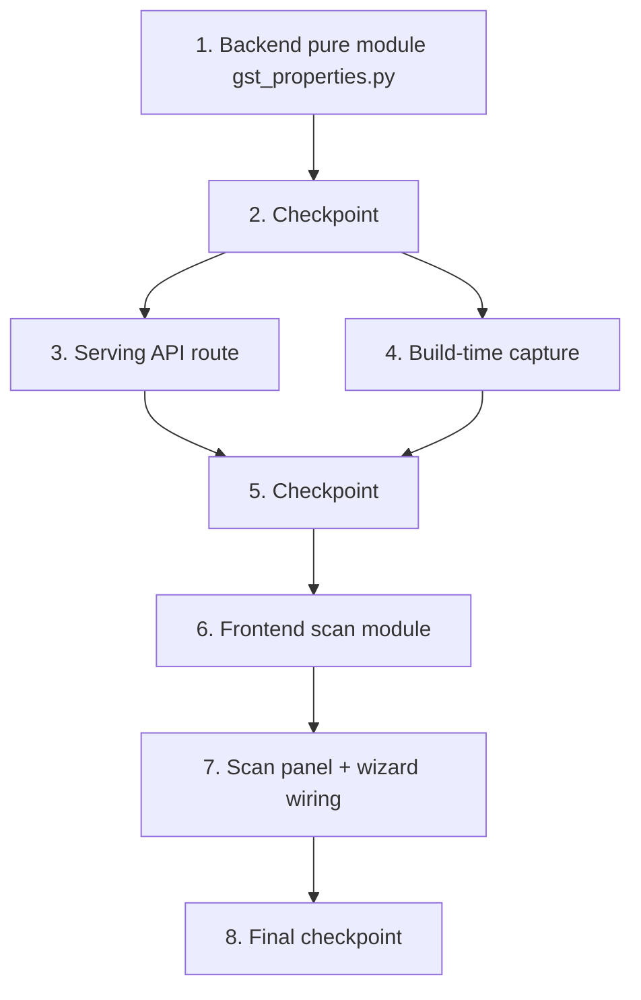

# Implementation Plan: GStreamer Parameter Pre-population

## Overview

Implementation proceeds bottom-up along the data flow: the backend pure mapping module first (report parsing, Type_Mapping, base-class filtering — the core logic everything consumes), then the serving API route, then build-time capture (introspection script, build image, `dda-plugin-build`, `plugin_builds.py` recording), then the frontend scan module and the wizard wiring. Property tests sit directly beside the code they validate. Backend: Python (pytest + hypothesis, `edge-cv-portal/backend/tests/`). Frontend: TypeScript (vitest + fast-check, existing node-designer test layout).

## Task Dependency Graph



```json
{
  "waves": [
    { "wave": 1, "tasks": ["1"], "description": "Backend pure module: report parsing/serialization, Type_Mapping, base-class filtering, and their property tests" },
    { "wave": 2, "tasks": ["2"], "description": "Checkpoint: all backend pure-module tests pass" },
    { "wave": 3, "tasks": ["3", "4"], "description": "Independent consumers of the pure module: the serving API route and the build-time capture pipeline (can proceed in parallel)" },
    { "wave": 4, "tasks": ["5"], "description": "Checkpoint: backend route and capture tests pass" },
    { "wave": 5, "tasks": ["6"], "description": "Frontend scan module (types, API client, pure merge/convert/pick functions) and its property tests" },
    { "wave": 6, "tasks": ["7"], "description": "ParameterScanPanel and wiring into both wizards, with component tests" },
    { "wave": 7, "tasks": ["8"], "description": "Final checkpoint: full test suite passes" }
  ]
}
```

## Tasks

- [x] 1. Implement the backend pure module `gst_properties.py`
  - [x] 1.1 Create `edge-cv-portal/backend/functions/gst_properties.py` with report parsing and serialization
    - Define the Introspection_Report structure (reportVersion, status, message, gstVersion, capturedAt, elements with factory/elementGType/instantiationError/properties)
    - Implement `parse_report(document)` raising a typed `ReportError` on any non-conforming input, and `serialize_report(report)` as its inverse
    - _Requirements: 8.1, 8.3_

  - [x] 1.2 Write property test for report round-trip
    - **Property 1: Introspection report round-trip**
    - hypothesis generators for valid reports; assert `parse_report(serialize_report(r))` equivalence through a real `json.dumps`/`json.loads` cycle; ≥100 iterations
    - **Validates: Requirements 8.1, 8.2**

  - [x] 1.3 Write property test for malformed report rejection
    - **Property 2: Malformed report documents are rejected, not crashed on**
    - Arbitrary-JSON generators plus mutations of valid reports; assert `parse_report` raises `ReportError` and nothing else
    - **Validates: Requirements 8.3, 1.6**

  - [x] 1.4 Implement `map_property` with the Type_Mapping and required heuristic
    - GType mapping table (gint/guint/gint64/guint64/glong/gulong/guchar→int, gfloat/gdouble→float, gboolean→bool, gchararray→string, GEnum→enum with nick values), min/max constraints for ranged numerics, default conversion, blurb-or-synthesized description, example synthesis
    - Required ⇔ no usable default (NULL/empty string default, or default unconvertible to the mapped paramType); optional carries the default
    - Unmapped GTypes and non-writable properties yield skipped entries `{name, reason}`
    - _Requirements: 2.1, 2.2, 2.3, 2.4, 2.5, 3.1, 3.2_

  - [x] 1.5 Write property test for the type mapping
    - **Property 3: Type mapping is total and correctly typed over writable known GTypes**
    - Generators over mapped GTypes with random ranges, enum value lists, and defaults; assert paramType, constraints, and default conversion per the mapping table
    - **Validates: Requirements 2.1, 2.2, 2.3**

  - [x] 1.6 Write property test for skipped properties
    - **Property 4: Unknown or non-writable properties are always skipped with a reason**
    - **Validates: Requirements 2.5**

  - [x] 1.7 Write property test for required classification
    - **Property 6: Required classification follows the usable-default rule**
    - Generators including null/empty/whitespace string defaults and wrong-typed defaults
    - **Validates: Requirements 3.1, 3.2**

  - [x] 1.8 Implement `suggestions_for_element` with Base_Class_Property filtering
    - Filter properties whose `owner` differs from the element's own GType (owner equality keeps overridden/shadowed names); map the remainder; return `{suggestions, skipped}` in the `ParameterDeclaration` wire shape
    - _Requirements: 4.1, 4.2, 1.5_

  - [x] 1.9 Write property test validating every suggestion
    - **Property 5: Every suggestion passes declaration validation**
    - Cross-check each produced suggestion against `workflow_core.catalog.custom`'s real parameter validation (non-empty name/description, valid example, enum values, min ≤ max)
    - **Validates: Requirements 2.4, 2.6**

  - [x] 1.10 Write property test for base-class filtering
    - **Property 7: Base-class filtering keeps exactly the element's own properties**
    - Generators mixing own-owner and base-owner properties including shadowed names
    - **Validates: Requirements 4.1, 4.2**

- [x] 2. Checkpoint - Ensure all tests pass
  - Ensure all tests pass, ask the user if questions arise.

- [x] 3. Implement the serving API route
  - [x] 3.1 Add `GET /plugins/{id}/versions/{v}/gst-properties` to `plugin_records.py`
    - Resolve the Plugin_Record version with the existing RBAC and uniform-404 conventions (node-designer read)
    - Classify unavailability from the x86_64 artifact entry: `no_x86_64_build` (no succeeded artifact), `not_captured` (no `gstIntrospection` stanza), `introspection_failed` (stanza failed, or stored report missing/malformed at read time)
    - Available path: load the report from S3, `parse_report`, derive per-element `{factory, suggestions, skipped}` via `suggestions_for_element`, return with gstVersion/capturedAt
    - _Requirements: 1.5, 1.6, 7.4, 8.3_

  - [x] 3.2 Write unit tests for the route
    - Examples for each unavailability reason (no build, absent stanza, failed stanza, malformed stored JSON), the available path, RBAC denial, and cross-tenant 404 — following `test_plugin_simulator.py` conventions with moto
    - _Requirements: 1.5, 1.6, 7.4, 8.3_

- [x] 4. Implement build-time property capture
  - [x] 4.1 Create `edge-cv-portal/plugin-build-images/dda-gst-introspect`
    - Python GI script: `GST_PLUGIN_PATH` to the scan dir, enumerate only factories from plugins under that dir, `factory.load()` + `Gst.ElementFactory.make`, record per property name/gtype/owner/writable/blurb/default/min/max/enumValues; per-element `instantiationError`; content failures encoded as `status: "failed"` documents, never a non-zero exit
    - _Requirements: 1.1, 1.2, 1.3, 1.4_

  - [x] 4.2 Add GI runtime packages to `Dockerfile.x86_64` and ship the script
    - `python3-gi`, `gir1.2-gstreamer-1.0`; COPY `dda-gst-introspect` to `/usr/local/bin/`
    - _Requirements: 1.1_

  - [x] 4.3 Extend `dda-plugin-build` with the best-effort introspection step (x86_64 only)
    - After promotion: run `dda-gst-introspect` against the built artifacts, upload the report as `{PLUGIN_NAME}.so.gstinspect.json` next to the promoted `.so`; wrap both so no failure changes the build exit code
    - _Requirements: 1.1, 1.4_

  - [x] 4.4 Record the `gstIntrospection` stanza in `plugin_builds.py`
    - In the SUCCEEDED path (`record_promoted_artifact`): fetch the report key, enforce the 256 KiB cap, validate via `parse_report`; write `{status: "captured", s3Key, gstVersion, capturedAt}` or `{status: "failed", message}` on the x86_64 artifact entry; never alter build status
    - _Requirements: 1.1, 1.4, 1.6_

  - [x] 4.5 Write unit tests for stanza recording
    - Examples with moto S3: captured report, `status: failed` report, missing object, oversized object, malformed JSON — assert stanza content and untouched build status
    - _Requirements: 1.4, 1.6_

  - [x] 4.6 Write container integration test for the introspection script
    - In the existing sandbox/container integration suite: run `dda-gst-introspect` against a stock element with a GEnum property (e.g. `videoflip`); assert report shape, enum capture, blurbs, and base-class owners (`name`/`parent` owned by GstObject); feed the output through `parse_report`
    - _Requirements: 1.2, 1.3_

- [x] 5. Checkpoint - Ensure all tests pass
  - Ensure all tests pass, ask the user if questions arise.

- [x] 6. Implement the frontend scan module
  - [x] 6.1 Add scan types and the API client method
    - `GstPropertiesResponse` / `ScanElement` types; `nodeDesignerApi.getGstProperties(pluginId, version)` calling `GET /plugins/{id}/versions/{v}/gst-properties`
    - _Requirements: 1.5, 1.6_

  - [x] 6.2 Create `edge-cv-portal/frontend/src/pages/node-designer/scan.ts` pure functions
    - `formFromSuggestion` (wire shape → `ParameterForm` raw-text rows, min/max constraints retained on the row for re-emission at submit), `mergeSuggestions` (existing rows unchanged, new names appended in order, collisions reported as `alreadyDeclared`, appended names as `added`), `pickElement` (preferred factory match, else sole element, else null)
    - _Requirements: 6.1, 6.2, 6.3, 5.4, 3.3_

  - [x] 6.3 Write property test for merge preservation
    - **Property 8: Merge never changes existing declarations**
    - fast-check arbitraries for `ParameterForm` lists and suggestion lists; ≥100 runs
    - **Validates: Requirements 6.1**

  - [x] 6.4 Write property test for exact merge characterization
    - **Property 9: Merge appends exactly the new names and reports the rest**
    - **Validates: Requirements 6.2, 6.3**

  - [x] 6.5 Write property test for merge idempotence
    - **Property 10: Merge is idempotent**
    - **Validates: Requirements 6.1, 6.2**

  - [x] 6.6 Write property test for the suggestion-form round trip
    - **Property 11: Suggestion-to-form conversion round-trips through form assembly**
    - `formFromSuggestion` then `declaration.ts`'s parameter assembly path reproduces name, paramType, required, default, description, first example, and enum values
    - **Validates: Requirements 2.6, 3.3**

  - [x] 6.7 Write property test for element picking
    - **Property 12: Element picking prefers the wizard's factory**
    - **Validates: Requirements 5.4**

- [x] 7. Implement the scan panel and wire both wizards
  - [x] 7.1 Create `ParameterScanPanel.tsx`
    - Cloudscape panel rendered above the existing parameter controls: no-plugin-context static notice; fetch on mount with plugin context; unavailability Alerts per reason (`no_x86_64_build`, `not_captured` informational; `introspection_failed` and fetch errors as error Alerts with message); auto-merge once when available and the list is empty; "Scan plugin properties" button; factory `Select` for multi-element reports pre-picked via `pickElement`; outcome summary (added count, factory, alreadyDeclared, skipped with reasons); reports `added` names upward for the "from scan" badge
    - _Requirements: 5.1, 5.2, 5.3, 5.4, 5.5, 6.3, 6.4, 7.1, 7.2, 7.3, 7.4, 2.5_

  - [x] 7.2 Wire the panel into `RegistrationWizard.tsx`
    - Embed in the Parameters step with `plugin.plugin_id`, `plugin.version`, and `defaultElementFactory(plugin.name)`; hold scanned-row names in wizard state, render the "from scan" badge on those rows, clear the badge when a row is edited; merge results applied through the existing `patch({parameters})` path so step gating (`parametersStepErrors`) is unchanged
    - _Requirements: 5.1, 5.2, 5.5, 6.4, 3.3_

  - [x] 7.3 Wire the panel into `CreateWizard.tsx`
    - Embed in the Parameters step without plugin context so the scanning-requires-a-built-plugin notice renders; manual parameter flow unchanged
    - _Requirements: 5.6, 7.1_

  - [x] 7.4 Write vitest component tests for the panel and wizard wiring
    - Auto-scan populates an empty list; no auto-merge when rows exist; manual rescan; factory selector on multi-element reports; each degraded notice (no build, not captured, failed with diagnostic, fetch rejection) with Add-parameter still usable and step navigation unblocked; scan outcome rendering including alreadyDeclared and skipped; badge appears after scan and clears on edit; Create wizard static notice; editing a scanned row works like a manual row
    - _Requirements: 5.1, 5.2, 5.3, 5.4, 5.5, 5.6, 6.4, 7.1, 7.2, 7.3, 7.4, 3.3_

- [x] 8. Final checkpoint - Ensure all tests pass
  - Ensure all tests pass, ask the user if questions arise.

## Notes

- Tasks marked with `*` are optional and can be skipped for faster MVP
- Each task references specific requirements for traceability
- Property tests run ≥100 iterations and carry the tag `Feature: gst-parameter-prepopulation, Property {n}: {title}`
- Checkpoints ensure incremental validation; the build-image change (4.2) only takes effect for plugins rebuilt after the image is republished — earlier builds surface as `not_captured` (Requirement 7.4)
