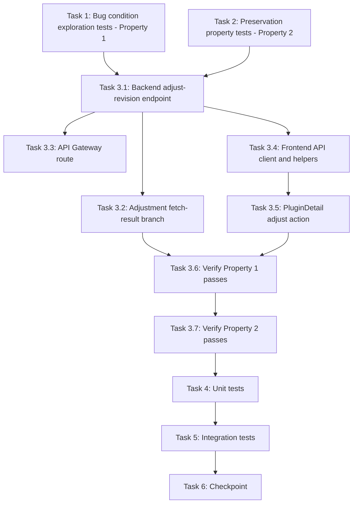

# Implementation Plan

## Overview

Fix the imported-plugin revision adjustment dead end using the exploratory bugfix workflow: write bug condition exploration tests (Property 1) and preservation property tests (Property 2) against the UNFIXED code first, then implement the backend adjust-revision endpoint, the adjustment fetch-result branch, the API Gateway route, and the frontend action, then verify the fix with the same tests plus unit and integration coverage.

## Task Dependency Graph

```json
{
  "waves": [
    { "wave": 1, "description": "Run on UNFIXED code: surface the missing-adjustment-path counterexamples (task 1 FAILS - Property 1) and capture preservation baselines (task 2 PASSES - Property 2). Independent of each other.", "tasks": ["1", "2"] },
    { "wave": 2, "description": "Backend core: the adjust-revision endpoint with adjustment_fetch_slot and persistence.", "tasks": ["3.1"] },
    { "wave": 3, "description": "Downstream of the endpoint: adjustment fetch-result branch, API Gateway route, and frontend API client + pure helpers. Mutually independent.", "tasks": ["3.2", "3.3", "3.4"] },
    { "wave": 4, "description": "Frontend UI: the inline adjust-revision action on PluginDetail.", "tasks": ["3.5"] },
    { "wave": 5, "description": "Verify the fix: re-run task 1 tests (now PASS) then task 2 tests (still PASS).", "tasks": ["3.6", "3.7"] },
    { "wave": 6, "description": "Unit tests for fix specifics, then end-to-end integration tests.", "tasks": ["4", "5"] },
    { "wave": 7, "description": "Checkpoint: full backend and frontend suites pass.", "tasks": ["6"] }
  ]
}
```



## Tasks

- [x] 1. Write bug condition exploration tests
  - **Property 1: Bug Condition** - Applying a Per-Platform Revision Override Adjusts the Tree and Re-runs the Build
  - **CRITICAL**: These tests MUST FAIL on unfixed code - failure confirms the bug exists
  - **DO NOT attempt to fix the tests or the code when they fail**
  - **NOTE**: These tests encode the expected behavior - they will validate the fix when they pass after implementation
  - **GOAL**: Surface counterexamples that demonstrate the dead end exists and confirm the root cause analysis (missing route, fetch-result guard on `import_status == 'fetching'`, UI renders advice as plain text)
  - **Scoped PBT Approach**: This is a deterministic capability gap - scope the property to concrete settled imported records carrying an incompatible `platform_compatibility` entry with a `suggestedRevision` (isBugCondition from design: `kind == 'imported'`, `import_status == 'imported'`, `compatible == false`, `suggestedRevision != null`, `requestedRevision != effectiveRevision(record, arch)`)
  - Backend (`edge-cv-portal/backend/tests/test_plugin_importer.py`, pytest + Hypothesis):
    - POST `/plugins/{id}/versions/{v}/adjust-revision` against `plugin_importer.handler` - assert 202 with a `fetches` slot recording the requested revision (unfixed code returns 404 NOT_FOUND)
    - On a flat single-revision record, assert an adjustment changes `arch_source_prefix(item, 'arm64_jp4')` to the adjusted entry's `rev-{slug}/` prefix (unfixed code: retry re-uses the identical flat prefix - no operation changes the effective revision)
    - Fetch result for a settled record (`import_status == 'imported'`) with an adjustment marker (`pending_archs`) - assert it is processed (unfixed `handle_fetch_result` skips it as "already recorded")
  - Frontend (`edge-cv-portal/frontend/src/pages/node-designer/PluginDetail.test.tsx`, vitest run with `--run`):
    - Render `PluginDetail` with an incompatible `arm64_jp4` entry (suggestedRevision '1.14') - assert an adjust-revision control pre-filled with '1.14' exists (unfixed UI shows the warning text only)
  - Run tests on UNFIXED code
  - **EXPECTED OUTCOME**: Tests FAIL (this is correct - it proves the adjustment surface is absent end to end)
  - Document counterexamples found to understand root cause
  - Mark task complete when tests are written, run, and failure is documented
  - _Requirements: 1.1, 1.2, 1.3, 1.4_

- [x] 2. Write preservation property tests (BEFORE implementing fix)
  - **Property 2: Preservation** - Non-Adjusted Flows Are Unchanged
  - **IMPORTANT**: Follow observation-first methodology
  - Observe behavior on UNFIXED code for non-bug-condition inputs, then write Hypothesis property-based tests in `edge-cv-portal/backend/tests/test_plugin_importer.py` and vitest tests in `importFlow.test.ts` capturing the observed behavior patterns from the design's Preservation Requirements:
    - `arch_source_prefix` preservation: for Hypothesis-generated records (with/without `fetches` maps and `arch_revisions`), every non-adjusted architecture resolves to the same prefix; flat single-revision records keep the flat `source_s3_prefix` layout (3.1, 3.4)
    - Untouched-entry preservation: other architectures' artifact entries (status, s3Key, checksum, signature, logTail) and `builds_view` output are byte-identical for non-adjusted entries (3.5)
    - Plain retry preservation: POST .../build without an adjustment produces the same StartBuild source locations and record writes as today (3.3)
    - Import-flow preservation: `revision_fetch_plan` output and import-time multi-revision persistence (one fetch per distinct revision, `arch -> slug` mapping) are unchanged (3.1)
    - Compatible-platform display: `platformWarningMessage`, `archRevisionLabel`, `incompatiblePlatformWarnings` render compatible entries (or entries without a suggested revision) exactly as today (3.2)
    - Component auto-packaging: `components_triggered` once-per-round semantics on build settle are unchanged (3.6)
  - Property-based testing generates many test cases for stronger guarantees (record shapes, fetches maps, arch subsets, slug collisions)
  - Run tests on UNFIXED code
  - **EXPECTED OUTCOME**: Tests PASS (this confirms baseline behavior to preserve)
  - Mark task complete when tests are written, run, and passing on unfixed code
  - _Requirements: 3.1, 3.2, 3.3, 3.4, 3.5, 3.6_

- [x] 3. Fix the imported-plugin revision adjustment dead end

  - [x] 3.1 Implement the backend adjust-revision endpoint in plugin_importer.py
    - Add `POST /plugins/{id}/versions/{v}/adjust-revision` route (body `{architecture, revision}`) dispatched from `handler`
    - New handler `adjust_revision(event, user, plugin_id, version)`: validate architecture against `requested_architectures` and non-empty trimmed revision (400 `INVALID_ARCHITECTURE` / `INVALID_REVISION`); authorize via `authorize_record_access` with `Permission.NODE_DESIGNER_MANAGE`; reject non-adjustable records with 409 `REVISION_ADJUSTMENT_NOT_AVAILABLE` (`kind != 'imported'`, missing `provenance.repoUrl`, or `import_status != 'imported'`)
    - New pure helper `adjustment_fetch_slot(item, revision)`: reuse an existing succeeded `fetches` entry recording the same revision; join a concurrent `fetching` entry by appending the arch to `pending_archs`; otherwise allocate a fresh slug via `revision_slug` with numeric-suffix collision disambiguation like `revision_fetch_plan`; reset a previously failed entry for the same revision in place
    - Persist + act: reuse path sets `arch_revisions[arch] = slug`, queues `artifacts[arch]`, REMOVEs `components_triggered`, and calls `plugin_builds.start_queued_builds`; fetch path writes the `fetches[slug]` entry with `pending_archs`, queues the arch, REMOVEs `components_triggered`, and calls `start_fetch` with `revision_slug_id=slug` recording `fetch_build_id` - `arch_revisions[arch]` flips only on fetch success
    - Never write `source_s3_prefix`, `default_fetch_slug`, `plugins_found`, `selected_plugins`, or any other architecture's artifact entry
    - Audit via `log_audit_event(action='adjust_plugin_revision', ...)`; respond 202 with `{plugin: import_detail(updated), builds: plugin_builds.builds_view(updated)}`
    - _Bug_Condition: isBugCondition(record, arch, revision) from design - settled imported record, incompatible platform entry with suggestedRevision, requested revision differs from effectiveRevision_
    - _Expected_Behavior: fetch or reuse the adjusted revision's tree into fetches, map arch_revisions[arch] on success, re-run the affected platform's build; fetch failure surfaces on the affected arch only (Property 1 from design)_
    - _Preservation: Preservation Requirements from design - non-adjusted architectures, flat layout, import-time flow, and other platforms' entries untouched_
    - _Requirements: 2.1, 2.2, 2.3, 2.4, 2.5, 3.4, 3.5, 3.6_

  - [x] 3.2 Implement the adjustment fetch-result branch in handle_fetch_result
    - Before the existing `import_status == 'fetching'` paths, route fetch results whose `REVISION_SLUG` names a `fetches` entry carrying `pending_archs` to a new `_handle_adjustment_fetch_result(item, build_id, build_status, env)`
    - Idempotency: per-slug conditional write guarded on `fetches[slug].fetch_build_id == build_id AND fetches[slug].status == 'fetching'`, mirroring `_handle_multi_fetch_result`; skip superseded/duplicate deliveries
    - SUCCEEDED: set `fetches[slug].status = 'succeeded'`, clear `pending_archs`, set `arch_revisions[a] = slug` for each pending arch, call `plugin_builds.start_queued_builds`
    - FAILED / FAULT / STOPPED / TIMED_OUT: set `fetches[slug].status = 'failed'`, clear `pending_archs`, record the fetch-failure `logTail` on each pending arch's artifact entry only; leave `arch_revisions` and `import_status` untouched
    - Audit-logged as the record's `created_by`; never raises beyond what `handle_build_result` tolerates
    - _Bug_Condition: isBugCondition(record, arch, revision) from design_
    - _Expected_Behavior: fetch success maps the arch and re-runs its build from the adjusted tree; fetch failure recorded on the affected platform's entry only, prior mapping intact_
    - _Preservation: import fetch results (`import_status == 'fetching'`) and per-arch build results are routed exactly as today_
    - _Requirements: 2.3, 2.4, 3.5_

  - [x] 3.3 Add the API Gateway route in node-designer-api-stack.ts
    - Add `adjust-revision` POST resource on the version resource wired to the existing importer integration, next to the `select-plugins` route
    - _Bug_Condition: isBugCondition from design - no API path exists post-import_
    - _Expected_Behavior: the adjust-revision route is reachable through the node-designer API_
    - _Preservation: all existing routes and integrations unchanged_
    - _Requirements: 2.1, 2.5_

  - [x] 3.4 Implement the frontend API client and pure helpers
    - `nodeDesignerApi.adjustRevision(pluginId, version, architecture, revision)` in `api.ts` returning the new `AdjustRevisionResponse` type (`{plugin, builds}`) added to `types.ts`
    - `canAdjustRevision(detail, arch)` in `importFlow.ts`: true exactly when the detail is an imported record with `import_status === 'imported'` and `platform_compatibility[arch]` is incompatible with a non-null `suggestedRevision` (mirrors the backend gate)
    - `adjustRevisionError(value)` in `importFlow.ts`: `null` when trimmed non-empty, message otherwise
    - Leave `platformWarningMessage`, `archRevisionLabel`, `incompatiblePlatformWarnings` unchanged
    - _Bug_Condition: isBugCondition from design - UI has no method to call_
    - _Expected_Behavior: the adjustment action is offered exactly for incompatible+suggested entries on settled imports_
    - _Preservation: existing helpers and compatible-platform rendering unchanged (3.2)_
    - _Requirements: 2.1, 2.5, 3.2_

  - [x] 3.5 Implement the adjust-revision action in PluginDetail.tsx
    - Under each incompatible-platform warning where `canAdjustRevision` holds, render an inline "Adjust revision for this platform" action expanding to an `Input` pre-filled with `compat.suggestedRevision` (editable) plus Apply/Cancel buttons
    - Apply calls `nodeDesignerApi.adjustRevision`, replaces `plugin` and `builds` state from the response (the poll resumes because the builds view is no longer settled), and disables while a retry or another adjustment is in flight
    - Surface per-arch adjustment errors in an alert on the affected platform's entry only
    - Leave plain retry buttons and all other page behavior untouched
    - _Bug_Condition: isBugCondition from design - UI renders advice as plain text with no control_
    - _Expected_Behavior: action pre-filled with suggestedRevision, editable, wired to the endpoint; errors surface on the affected platform only_
    - _Preservation: plain retries and all other page behavior unchanged (3.3)_
    - _Requirements: 2.1, 2.4, 3.3_

  - [x] 3.6 Verify bug condition exploration tests now pass
    - **Property 1: Expected Behavior** - Applying a Per-Platform Revision Override Adjusts the Tree and Re-runs the Build
    - **IMPORTANT**: Re-run the SAME tests from task 1 - do NOT write new tests
    - The tests from task 1 encode the expected behavior
    - When these tests pass, it confirms the expected behavior is satisfied: the adjustment fetches or reuses the tree, maps `arch_revisions`, re-runs the affected build, and surfaces fetch failures on the affected arch only
    - Run backend tests with pytest and frontend tests with vitest `--run`
    - **EXPECTED OUTCOME**: Tests PASS (confirms bug is fixed)
    - _Requirements: 2.1, 2.2, 2.3, 2.4, 2.5_

  - [x] 3.7 Verify preservation tests still pass
    - **Property 2: Preservation** - Non-Adjusted Flows Are Unchanged
    - **IMPORTANT**: Re-run the SAME tests from task 2 - do NOT write new tests
    - Run preservation property tests from task 2 on the fixed code
    - **EXPECTED OUTCOME**: Tests PASS (confirms no regressions)
    - Confirm all tests still pass after fix (no regressions)
    - _Requirements: 3.1, 3.2, 3.3, 3.4, 3.5, 3.6_

- [x] 4. Write unit tests for the fix specifics
  - `adjust_revision` handler: happy path with a new revision (fetches entry written with `pending_archs`, arch queued, fetch started with `REVISION_SLUG`, `components_triggered` removed); reuse path (existing succeeded slot: no fetch, `arch_revisions` mapped, build started); failed-slot re-fetch; concurrent-fetch join (arch appended to `pending_archs`)
  - Rejections: 403 without node-designer:manage; 409 for scaffolds/generated records, missing repoUrl, and `import_status` in {fetching, pending_selection, failed}; 400 for unknown architecture or empty revision
  - `_handle_adjustment_fetch_result`: success maps the arch and starts the queued build; failure records the fetch-failure logTail on the affected arch only and leaves `arch_revisions` unchanged; duplicate/superseded deliveries are idempotent
  - `adjustment_fetch_slot`: slug reuse by identical revision, numeric-suffix collision handling, failed-slot reset; property: for any set of existing fetches slugs and any revision, it never clobbers an entry recording a different revision
  - Frontend: `canAdjustRevision` / `adjustRevisionError` truth tables; `PluginDetail` renders the action exactly for incompatible+suggested entries, pre-fills and permits editing, applies via the API, and surfaces per-platform errors
  - _Requirements: 2.1, 2.2, 2.4, 2.5_

- [x] 5. Write integration tests for the end-to-end flows
  - Full flow: import (flat, single revision) → simulate incompatible platform with suggestedRevision → adjust via the endpoint → simulate fetch SUCCEEDED via `handle_fetch_result` → assert the arch's StartBuild used the `rev-{slug}/` prefix → simulate build SUCCEEDED → assert auto-packaging triggers exactly once for the round
  - Fetch-failure flow: adjust → simulate fetch FAILED → assert the affected arch shows the fetch-failure logTail, other archs and the record's `source_s3_prefix` untouched, and a plain retry still builds from the prior tree
  - Detail-page flow (`PluginDetail.test.tsx`): warning renders with the action → apply → page state reflects the response's builds view and the poll resumes; revision label shows the adjusted revision once mapped
  - _Requirements: 2.2, 2.3, 2.4, 3.3, 3.4, 3.5, 3.6_

- [x] 6. Checkpoint - Ensure all tests pass
  - Run the full backend suite (pytest) and frontend suite (vitest `--run`)
  - Ensure all tests pass, ask the user if questions arise

## Notes

- Task 1 tests MUST FAIL on unfixed code (confirms the bug); task 2 tests MUST PASS on unfixed code (confirms the baseline). Do not "fix" either before implementing tasks 3.1-3.5.
- Backend tests live in `edge-cv-portal/backend/tests/test_plugin_importer.py` (pytest + Hypothesis); frontend tests in `importFlow.test.ts` and `PluginDetail.test.tsx` (vitest, always run with `--run`).
- Tasks 3.6 and 3.7 re-run the SAME tests from tasks 1 and 2 - no new tests are written there.
- The adjustment must never write `source_s3_prefix`, `default_fetch_slug`, or any other architecture's artifact entry (preservation requirements 3.4, 3.5).
