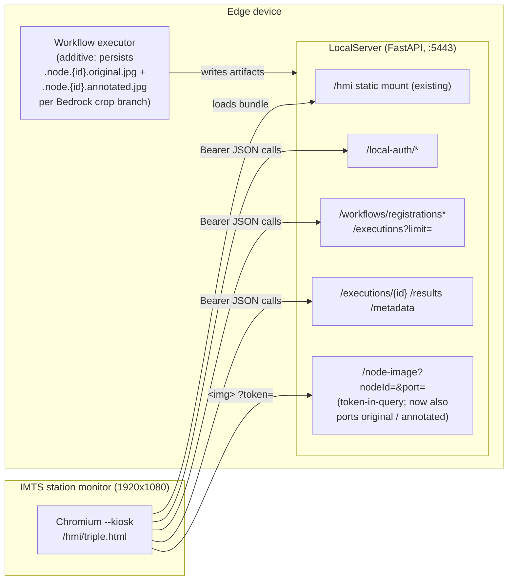
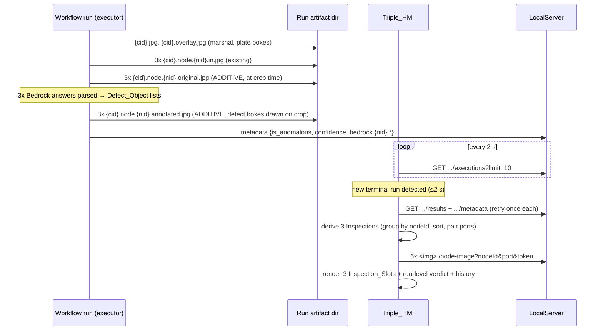

# Design Document: IMTS Triple Inspection HMI

## Overview

The IMTS Triple Inspection HMI (Triple_HMI) is a full-screen 1920x1080 kiosk display for the "blue-plate-detection-guided-inspection" workflow, which inspects three rectangular plates (1.5" x 3", ~1:2 aspect ratio) per run cycle. Where the existing Quality Station HMI (`hmi/`, built from the `quality-station-hmi` spec) shows one inspection per run, the Triple_HMI shows all three inspections of a run simultaneously — each as an annotated image (defect bounding boxes overlaid) side by side with the original un-annotated image.

The design has two parts:

1. **Frontend**: a second build entry inside the existing `hmi/` project (Design Decision 1) that reuses the auth, API client, polling, and connection-resilience machinery unchanged and adds triple-specific pure logic modules plus a triple-specific layout.
2. **Backend**: one small **additive artifact change** in the workflow executor (Design Decision 2) that persists each inspection's original and annotated frames under two new node-image ports (`original`, `annotated`). The `original` frame is the exact detection crop sent to Bedrock; the `annotated` frame is that same crop with the **defect bounding boxes from the Bedrock inspection response** (the `objects` list's Defect_Objects) drawn onto it after the answer arrives (Requirement 4.12). Because the LocalServer's results inventory and image serving are filename-pattern driven and port-generic, this change requires **zero LocalServer route code changes** — the new artifacts appear as additive entries in the existing `/results` response and are served by the existing `/node-image` route (Requirement 4.4).

### Research Findings

All findings verified directly in this repository:

- **The quality-station-hmi infrastructure is fully built and reusable.** The LocalServer mounts `hmi/dist` at `/hmi` (guarded by directory existence, `src/backend/app.py`), the bounded recent-executions route `GET /workflows/registrations/{id}/executions?limit=N` exists (`workflow_engine/api.py`, `list_registration_executions`, newest-first, limit clamped 1..50), and `hmi/src` contains the pure modules the original design specified (`auth/session.ts`, `api/client.ts` with 10 s timeout + single re-login on 401, `api/routes.ts` URL builders with token-in-query image URLs, `logic/runs.ts` terminal-run ordering, `logic/format.ts`, `app/machine.ts` reducer, `app/poller.ts` with the 2 s poll / 10 s disconnected-retry / periodic registrations-refresh cadences). Tooling is Vite + TypeScript, tested with Vitest + fast-check.
- **Artifact model** (`workflow_engine/run_artifacts.py`, `pipeline_executor._persist_node_frames`): per-node frames are persisted as `{capture_id}.node.{sanitizedNodeId}.{port}.jpg`; `list_node_images` keys **purely on the filename pattern** — no port allow-list — and its docstring states "a future third port needs no change here". Entries are sorted by nodeId, then port (`in` before `reference`, other ports after those alphabetically). `node_image_path` resolves only listed pairs (path-traversal safe by construction), and `GET .../node-image?nodeId=&port=&token=` serves any listed pair. Port names must not contain dots (the `{nodeId}.{port}` filename tail splits on its last dot).
- **The target workflow's internals** (built by the `detection-guided-bedrock-inspection` feature): a yolo-world `model_inference` node detects the plates; the marshal writes the detections into the run's `{capture_id}.jsonl` **and draws bounding boxes + labels onto a copy of the frame** (`marshal_for_capture_template._generate_detection_overlay`), which lands as the run-level `{capture_id}.overlay.jpg` — those boxes are the detector's **plate** boxes, not defect boxes. Post-pipeline, the executor builds the ordered Detection_List (`detections.py`, source-frame pixel boxes, stable per-run IDs) and three concurrent `bedrock_inference` branches each inspect one detection crop: `output_bindings._detection_crop` slices the captured frame to the detection's box (expanded by `crop_margin_percent`, clamped to frame bounds) and persists it as `{capture_id}.crop.{detection_id}.jpg`. Verdicts land in run metadata as nested `bedrock.{nodeId}.{is_anomalous, confidence, text, detection_id}` keys beside the flat last-writer-wins `is_anomalous`/`confidence`.
- **The Bedrock answer carries the defect boxes, and the executor sees it while the crop is still in memory**: the station's prompt instructs the model to answer with JSON `{"text": "...", "objects": [{"name", "qc": "OK"|"NOK", "reason", "bounding_box": {"x_min","y_min","x_max","y_max"}}]}`, with box coordinates in the pixel space of the image sent to Bedrock — i.e. the detection crop. The Bedrock call happens after the crop is sliced, so in `process`/`_run_one` the answer text is available while the crop bytes are still held in memory. `parse_bedrock_answer` extracts only `{is_anomalous, confidence}` from the first JSON object in the answer (tolerating fenced code blocks and surrounding prose) and ignores all other keys; the raw answer text is always stored as `bedrock.{nodeId}.text` (both freeform and anomaly modes). The executor already uses OpenCV (`cv2`) to encode the crop JPEG, so box drawing adds no dependency.
- **The gap Requirement 4.4 anticipates, confirmed**: the crop artifacts (`.crop.{detection_id}.jpg`) are *not* listed in `/results` and *not* servable by any image route; node entries always report `hasOverlay: false`; the per-node `in` frames persisted for the three Bedrock nodes are all the **same full captured frame** (each node's `capturePaths["in"]` is the whole frame — the crop happens later at the executor level). So today the inventory can supply neither a per-inspection original (the crop) nor a per-inspection annotated image. The additive change in Design Decision 2 closes exactly this gap.
- **Verdict source for the three inspections**: per-inspection verdict equivalents (Requirement 5.5) are the nested `bedrock.{nodeId}.is_anomalous` / `.confidence` metadata keys; the flat `is_anomalous`/`confidence` are the run-level Inspection_Verdict fields (Requirement 5.6). The node ids in metadata are the raw binding node ids; the node ids in artifact filenames are sanitized (`[^A-Za-z0-9_.-]` → `_`). For the target workflow the ids (`bedrock_1`..`bedrock_3` shaped) are already filename-safe, so the two coincide; the mapping function still tolerates the general case by comparing sanitized forms.

## Architecture

### Design Decision 1: Build variant inside `hmi/`, not a separate app directory

The Triple_HMI is a **second Vite entry point in the existing `hmi/` project** (`hmi/triple.html` + `hmi/src/triple/`), built as a multi-page Vite build whose output lands in the same `hmi/dist`. The kiosk URL is `https://<device>:5443/hmi/triple.html` — served by the **existing** `/hmi` static mount with **no backend serving change at all** (Requirement 6.6).

Rationale:

- Requirements 1 (auth), 3 (polling), and 8 (resilience) of this spec are near-identical to the original spec's; the corresponding modules (`auth/session`, `api/client`, `api/routes`, `logic/runs`, `logic/format`, the poller cadences, the connection state machine) are reused **unchanged**, so their existing property tests keep pinning the shared behavior and a fix benefits both HMIs.
- One toolchain (Vite/Vitest/fast-check), one dist, one static mount, one TLS origin.
- Separation stays clean: everything triple-specific lives under `src/triple/` with its own reducer and renderer; **no existing `hmi/src` module changes behavior**. The existing `index.html` entry and its bundle are byte-equivalent in behavior after the multi-entry build change.

Rejected: a separate `hmi-triple/` top-level app (duplicates ~1,500 lines of auth/client/poller/resilience logic and doubles the test surface for spec-identical behavior); a runtime mode-switch inside the single existing entry (bloats the single-inspection HMI with three-slot layout and binding logic it never uses, and couples the two kiosk deployments at runtime rather than at build time).

### Design Decision 2: Additive per-inspection artifacts — new node-image ports `original` and `annotated`

The executor's Bedrock crop path holds, in memory, everything each Inspection needs — in two phases: at crop time (`output_bindings._detection_crop`) the final clamped crop rectangle and the exact crop bytes; after the Bedrock invocation (`process`/`_run_one`) the model's raw answer text, including the `objects` list of Defect_Objects the station's prompt asks for. The additive change persists, per Bedrock branch that inspects a Detection_Crop, best-effort and contained (the `_persist_node_frames` containment style — failures are logged, never affect the run, and never disturb the existing `is_anomalous`/`confidence` parse or metadata merge):

- `{output_dir}/{capture_id}.node.{sanitizedNodeId}.original.jpg` — the exact crop bytes sent to Bedrock (the Inspection's **Original_Image**), persisted at crop time beside the existing `{capture_id}.crop.{detection_id}.jpg`.
- `{output_dir}/{capture_id}.node.{sanitizedNodeId}.annotated.jpg` — the Inspection's **Annotated_Image**, produced **after the Bedrock answer arrives**. The answer's `objects` list is extracted tolerantly, in the `parse_bedrock_answer` style (first JSON object found, fenced-code-block and surrounding-prose tolerant); the extraction is purely additive — it never affects the existing `is_anomalous`/`confidence` parse or its failure behavior. Each valid Defect_Object's `bounding_box` is then drawn onto a copy of the crop bytes with OpenCV (`cv2`, already used for the crop encode): coordinates are interpreted in crop pixel space, each box is clamped to the crop bounds, and entries whose box is missing, malformed, or empty after clamping are skipped without affecting valid entries (Requirement 4.12). Rendering is a rectangle outline plus the object's `name`/`qc` label, visually distinct per `qc` — red for NOK, green for OK. IF the answer contains no parseable `objects` list, the `annotated` artifact is not persisted — the HMI then shows the no-annotated-image placeholder (Requirement 4.10). An answer with a parseable but empty `objects: []` list persists an annotated image identical to the crop with zero boxes — a clean part.

Why this satisfies Requirement 4.4 with the smallest possible surface:

- **No LocalServer code changes at all.** `list_node_images` is filename-pattern keyed and port-generic, so the new files automatically appear in `GET .../results` as additive `{"kind": "node", "nodeId", "port": "original"|"annotated", "hasOverlay": false}` entries, and `GET .../node-image?nodeId=&port=original|annotated&token=` serves them through the existing resolution (which only resolves listed pairs — traversal-safe by construction). Existing entries, ordering of existing entries, and every existing route and response shape are unchanged; runs of other workflows produce no new artifacts and are byte-identical.
- Both port names are dot-free (a filename-parse constraint) and sort deterministically after `in`/`reference` (alphabetical: `annotated` before `original`), keeping the inventory order deterministic. The Triple_HMI does not depend on server-side entry order anyway — it re-sorts by (`nodeId`, `port`) lexicographically per Requirement 4.2.
- The pairing is intrinsically consistent: `annotated` is drawn directly onto a copy of the exact `original` crop bytes, so the side-by-side panels are pixel-identical views of the same plate, differing only in the drawn defect boxes and labels — and the Bedrock response's box coordinates need no coordinate-space translation, since they are already in the crop's own pixel space.

Rejected alternatives: slicing the `annotated` frame from the run-level detection overlay `{capture_id}.overlay.jpg` (the previously drafted approach) — rejected per user decision, because the overlay's boxes are the detection model's plate boxes, not the defect boxes the Operator needs; the Annotated_Image glossary term and Requirement 4.12 bind the annotation to the Bedrock response's Defect_Objects. A new LocalServer route serving `.crop.{detection_id}.jpg` files (a whole new route where zero suffices, and the detection_id would need to be discovered from metadata before any image could load). Drawing boxes in the HMI via canvas by parsing the metadata `text` answer client-side (moves rendering-correctness and JSON-answer parsing into the display layer and spreads the answer contract across the API boundary). Changing the meaning of the existing `in` node frames to hold crops (mutates artifact content the existing HMI already displays — a behavior change, not additive).

### Design Decision 3: Fixed target-workflow binding, no selection UI

The Triple_HMI has no workflow selector. On startup (after auth) it fetches `GET /workflows/registrations` and binds:

1. Resolve the target name: the `workflow` **query parameter** if present and non-blank, else the **build-time** `VITE_TRIPLE_WORKFLOW_NAME` if non-blank, else `"blue-plate-detection-guided-inspection"` (Requirement 2.5; blank/whitespace values fall through to the next source).
2. Candidates = registrations with active status (`registered`, matching the backend's `ACTIVE_STATUSES` semantics established in the original spec) whose `name` is a case-sensitive exact match.
3. One candidate → bind it. Several → the most recent `registeredAt`; equal/missing `registeredAt` → the first such candidate in API response order (Requirements 2.2, 2.3).
4. Zero → the not-deployed message; re-checks ride the existing retry/refresh cycles and re-bind automatically when a match appears (Requirements 2.4, 8.8). A later registrations response where the bound registration is inactive/absent returns to the not-deployed state (Requirements 2.7, 8.5).

This binding function is pure (`triple/binding.ts`) and evaluated on **every** registrations payload, so deploy/undeploy/redeploy transitions all reduce to the same function.

### Design Decision 4: Reuse the original polling and resilience design unchanged

The Triple_HMI adopts the original design's decisions 3–5 wholesale, with the polling target fixed to the bound registration:

- **2 s poll** of `GET /workflows/registrations/{id}/executions?limit=10` (Run_Detection_Latency ≤ 2 s, Requirement 3.1; limit 10 covers the ≥5 history capacity of Requirement 7.1). New-terminal-run detection, `finishedAt`-desc / `startedAt`-tiebreak ordering, and in-progress detection are the same pure functions (`logic/runs.ts`) already property-tested (Requirements 3.2–3.5).
- Only when the latest terminal run changes does the HMI fetch `/results` + `/metadata` (each retried once on failure, Requirements 4.8, 4.9) and swap the Live_View.
- Periodically (every ~15th cycle) and on every disconnected-retry probe, `GET /workflows/registrations` is re-fetched and re-run through the binding function (Requirements 2.4/2.7/8.5/8.8).
- The **connection state machine** is unchanged: network error / 10 s timeout / HTTP 5xx → DISCONNECTED (indicator + retained content + last-update time, Requirement 8.1); 10 s unlimited retry probes against `/workflows/registrations` (8.2); any 2xx probe → CONNECTED within 1 s, immediate poll + unconditional Live_View and history refresh (8.3, 8.6, 8.7). 401s route to the auth path (single re-login + single retry), exactly as the shared `api/client.ts` already implements (Requirement 1.4).
- Additive on top: a **consecutive-poll-failure counter** drives the stale-data indicator at ≥5 consecutive failed cycles, cleared by the next success (Requirement 3.9) — new pure logic, since the original spec had no such requirement.

### System Context



### Data flow for one run



## Components and Interfaces

### Frontend module layout

Reused **unchanged** from `hmi/src`: `auth/session.ts`, `api/client.ts`, `api/routes.ts` (already builds `node-image` URLs for arbitrary ports), `api/types.ts`, `logic/runs.ts`, `logic/format.ts`.

New, under `hmi/src/triple/` (pure logic modules have no DOM dependency and are directly property-testable):

| Module | Kind | Responsibility |
|---|---|---|
| `triple/config.ts` | pure | Target-workflow name resolution: query param > build-time > default; blank/whitespace falls through (R2.5) |
| `triple/binding.ts` | pure | Registrations payload → bound Target_Workflow or not-deployed (R2.2–2.4, 2.7, 8.5, 8.8) |
| `triple/inspections.ts` | pure | Results inventory → ordered Inspection list + slot assignment + image-entry pairing (R4.2, 4.3, 4.6, 4.7, 4.10) |
| `triple/verdicts.ts` | pure | Metadata → per-Inspection and run-level verdict view models (R5.5–5.7, 5.10–5.12) and failed-run view model (R5.9) |
| `triple/history.ts` | pure | Run verdict-state precedence + history list build/insert/evict (R7.1, 7.2, 7.6, 7.8) |
| `triple/machine.ts` | pure | Triple app reducer `(TripleAppState, Event) → TripleAppState`: auth, connection, binding, live/historical mode, stale counter (R3.8, 3.9, 7.4, 7.5, 8.x) |
| `triple/poller.ts` | effectful | Thin timer shell reusing the original cadences (2 s poll, 10 s retry, periodic registrations refresh); dispatches into the reducer |
| `triple/render.ts` | effectful | DOM rendering of the three-slot layout; `` error/timeout → per-panel placeholder |
| `triple/main.ts` + `hmi/triple.html` | entry | Second Vite entry (multi-page build config in `vite.config.ts`) |

### Inspection derivation (`triple/inspections.ts`) — the core new logic

`deriveInspections(images: ResultImage[]): Inspection[]`, a pure function of the `/results` inventory:

1. Take the `kind === "node"` entries; **group by `nodeId`**; each group is one candidate Inspection (R4.2).
2. Within each group, sort entries by lexicographic ascending `port`; across groups, sort by lexicographic ascending `nodeId`. (The HMI sorts itself rather than trusting server order, making the derivation a deterministic function of the inventory *set* — two evaluations of the same inventory are identical, R4.2.)
3. Pair within each group by port name: `original` := the group's `port === "original"` entry, falling back to the `port === "in"` entry (a run predating the additive executor change still shows what the camera saw); `annotated` := the group's `port === "annotated"` entry, **no fallback** — absent means the annotated panel renders the no-annotated-image placeholder (R4.10; never substitute another image).
4. `assignSlots(inspections)`: slots 1..3 are the first three Inspections in the sorted order (R4.3 — keying solely on sorted inventory keys means a given `nodeId` occupies the same slot across runs with identical inventory keys, and the slot identifier persists, R5.4). Fewer than three → remaining slots carry a no-inspection-data placeholder (R4.6). More than three → first three displayed plus a more-inspections indicator (R4.7).

Every image URL is built from the displayed run's own `executionId` and the entry's own (`nodeId`, `port`) via the existing `nodeImageUrl` builder — substitution across inspections, ports, or runs is impossible by construction (R4.11, 5.8).

### Verdict derivation (`triple/verdicts.ts`)

`deriveVerdicts(status, metadata, inspections)`:

- **Per-Inspection**: for each Inspection's `nodeId`, look up `metadata.bedrock?.[nodeId]` (tolerating sanitized-vs-raw id differences by comparing sanitized forms). `is_anomalous === true` → FAIL, `=== false` → PASS, missing/non-boolean → NO VERDICT for that slot only (R5.5, 5.12). A `confidence` number renders rounded to exactly 2 decimal places beside its verdict (R5.7).
- **Run-level**: flat `is_anomalous`/`confidence` render once at the run level; when only run-level fields exist they are *not* duplicated into slots, and when both exist both render in their own places (R5.6, 5.11).
- **Completed run with no verdict fields anywhere** → images + status without verdict content, never an error (R5.10).
- **Failed run** → run-level failure state with the execution's `error` summary (fallback message when empty/absent), placeholders in all three slots, prior-run images excluded (R5.9).
- Verdict rendering differentiates states by icon + text label, not color alone (R5.5).

### Backend change (contract)

In `output_bindings.py`, the Bedrock crop path (`BedrockInferenceProcessor`, invoked from `_run_one` when `crop_detection_index` resolved successfully) is extended in two phases:

```python
def _persist_original_frame(self, run_context, node_id, crop_bytes):
    """ADDITIVE (imts-triple-inspection-hmi R4.4): beside the existing
    {cid}.crop.{detection_id}.jpg artifact, persist the exact crop
    bytes sent to Bedrock as {cid}.node.{safe_node}.original.jpg.
    Called at crop time (beside _persist_crop). Filename-pattern
    compatibility with list_node_images makes the port listable in
    /results and servable by /node-image with zero LocalServer changes.
    Entirely best-effort in the _persist_node_frames containment style:
    any failure is logged and never affects the run."""

def _persist_annotated_frame(self, run_context, node_id, crop_bytes, answer_text):
    """ADDITIVE (imts-triple-inspection-hmi R4.4, R4.12): called after
    the Bedrock invocation returns, once the answer text is available
    (in process/_run_one, after the existing parse/metadata merge).
    Tolerantly extracts the answer's `objects` list in the
    parse_bedrock_answer style (first JSON object found, fenced code
    blocks and surrounding prose tolerated); the extraction is purely
    additive and never affects the existing is_anomalous/confidence
    parse or its failure behavior. IF the answer yields no parseable
    objects list, nothing is persisted (the HMI shows the R4.10
    placeholder). Otherwise each valid Defect_Object's bounding_box
    (crop pixel space) is clamped to the crop bounds and drawn onto a
    copy of crop_bytes with cv2 (already used for the crop encode) as
    a rectangle outline plus the object's name/qc label — red for NOK,
    green for OK; entries with missing, malformed, or
    empty-after-clamping boxes are skipped without affecting valid
    entries. The result persists as
    {cid}.node.{safe_node}.annotated.jpg. A parseable but empty
    objects: [] list persists the crop unchanged with zero boxes (a
    clean part). Entirely best-effort in the _persist_node_frames
    containment style: any failure is logged and never affects the run
    or the metadata merge."""
```

The parsed `objects` list is consumed only by the annotated-frame draw — it is deliberately **not** merged into run metadata. The raw answer text is already stored as `bedrock.{nodeId}.text`, so no information is lost, and the metadata shape stays byte-identical to today (smallest additive surface; a future `bedrock.{nodeId}.objects` key remains possible without conflicting with this design).

Node-id sanitization reuses the executor's `_UNSAFE_NODE_ID_CHARS` discipline so the filenames always parse back to the same (`nodeId`, `port`) pairs `list_node_images` reports. No change to `run_artifacts.py`, `api.py`, or `download_file.py`.

### Kiosk Layout — 1920x1080 mock-up (Requirement 6)

Three horizontal bands: header (72 px), main (868 px), history strip (140 px). All primary content visible without scrolling (R6.1).

```
┌──────────────────────────────────────── 1920 ─────────────────────────────────────────────┐
│ HEADER h=72   blue-plate-detection-guided-inspection    Run: PASS  conf 0.93   ⟳ RUN IN    │
│               Started 14:32:07  Finished 14:32:11       (run-level verdict,   PROGRESS     │
│               (local tz, seconds; finish omitted         ≥32px, icon+word)    ● LIVE       │
│                when absent)                                                   CONNECTED    │
├────────────────────────────────────────────────────────────────────────────────────────┤
│ MAIN h=868                                                                                 │
│ ┌─ SLOT 1 (bedrock_1) w=632 ─┐ ┌─ SLOT 2 (bedrock_2) w=632 ─┐ ┌─ SLOT 3 (bedrock_3) ────┐ │
│ │  SLOT 1      ✔ PASS  0.97  │ │  SLOT 2      ✘ FAIL  0.88  │ │  SLOT 3   — NO VERDICT  │ │
│ │  (verdict ≥32px,           │ │                            │ │                          │ │
│ │   icon + word, not         │ │                            │ │                          │ │
│ │   color alone)             │ │                            │ │                          │ │
│ │ ┌─────────┐  ┌─────────┐   │ │ ┌─────────┐  ┌─────────┐   │ │ ┌─────────┐ ┌─────────┐ │ │
│ │ │         │  │         │   │ │ │         │  │         │   │ │ │         │ │         │ │ │
│ │ │    │  │    │   │ │ │    │  │    │   │ │ │  image  │ │         │ │ │
│ │ │ ~300x600│  │ ~300x600│   │ │ │         │  │         │   │ │ │ unavail-│ │         │ │ │
│ │ │ (1:2,   │  │ (1:2,   │   │ │ │         │  │         │   │ │ │  able   │ │         │ │ │
│ │ │ contain,│  │ contain,│   │ │ │         │  │         │   │ │ │ (place- │ │         │ │ │
│ │ │ uncrop- │  │ uncrop- │   │ │ │         │  │         │   │ │ │  holder)│ │         │ │ │
│ │ │  ped)   │  │  ped)   │   │ │ │         │  │         │   │ │ │         │ │         │ │ │
│ │ └─────────┘  └─────────┘   │ │ └─────────┘  └─────────┘   │ │ └─────────┘ └─────────┘ │ │
│ │  ANNOTATED    ORIGINAL     │ │  ANNOTATED    ORIGINAL     │ │  ANNOTATED   ORIGINAL   │ │
│ │  (labels, 24px)            │ │                            │ │                          │ │
│ └────────────────────────────┘ └────────────────────────────┘ └──────────────────────────┘ │
├────────────────────────────────────────────────────────────────────────────────────────┤
│ HISTORY STRIP h=140 (newest first, capacity 10, ≥5 visible)                                │
│ ┌────────┐┌────────┐┌────────┐┌────────┐┌────────┐┌────────┐        ┌───────────────────┐  │
│ │✔ PASS  ││✘ FAIL  ││⚠ ERROR ││— NO    ││✔ PASS  ││✔ PASS  │  ⋯     │ ◉ VIEWING HISTORY │  │
│ │14:32:07││14:29:41││14:25:02││VERDICT ││14:15:10││14:11:32│        │ [RETURN TO LIVE]  │  │
│ └────────┘└────────┘└────────┘└────────┘└────────┘└────────┘        │ (newer run avail.)│  │
│  (tile verdict per R7.1 precedence; click → historical view)        └───────────────────┘  │
└────────────────────────────────────────────────────────────────────────────────────────┘
```

Layout rules:

- CSS Grid: `grid-template-rows: 72px 1fr 140px`; main row `grid-template-columns: repeat(3, 1fr)` with a fixed inter-slot gap → the three slot widths are equal within 2 px at any viewport width (R6.2). Fluid columns keep everything visible without horizontal scrolling from 1280 to 1920 px (R6.5).
- Each image panel uses CSS `aspect-ratio: 1 / 2` (within the required 1:1.8–1:2.2 band for the 1.5"x3" plates, R6.2) with `object-fit: contain` → both images in a slot share one fixed panel height (equal display heights), aspect preserved, uncropped (R5.3, R6.8). At 1920 wide each panel is ~300 px wide (≥ the 280 px minimum, R6.8) and ~600 px tall.
- Verdict text (run-level and per-slot) has a minimum rendered height of 32 px at 1920x1080 via `clamp()` (R6.4); every verdict state pairs an icon with a distinct word (✔ PASS / ✘ FAIL / — NO VERDICT / ⚠ ERROR) so states differ by more than color (R5.5).
- Header always shows the workflow name and the displayed run's `startedAt` (and `finishedAt` when present) in local time with seconds (R6.3, 6.9). The in-progress and connection indicators live in the header (R3.4, 8.1, 8.4); the stale-data indicator (R3.9) attaches to the connection area.
- Pure static assets, chrome-free, for Chromium `--kiosk` (R6.6, 6.7).

## Data Models

### API payloads (existing shapes, TypeScript mirrors — `Registration`, `Execution` unchanged from `hmi/src/api/types.ts`)

```typescript
interface ResultImage {              // GET .../results images[i]
  kind: "output" | "node";
  nodeId?: string;
  port?: string;                     // "in" | "reference" | "original" | "annotated" | other
  hasOverlay: boolean;
}

interface RunMetadata {              // GET .../metadata (best-effort, may be {})
  is_anomalous?: boolean;            // run-level (flat, last-writer-wins)
  confidence?: number;
  detections?: DetectionEntry[];     // additive keys from detection-guided runs
  detection_count?: number;
  bedrock?: {                        // per-inspection verdicts, keyed by nodeId
    [nodeId: string]: {
      is_anomalous?: boolean;
      confidence?: number;
      text?: string;
      detection_id?: string;
      error?: string;
    };
  };
  [key: string]: unknown;
}
```

### Backend parsed shape: Defect_Object

Extracted tolerantly from the Bedrock answer's `objects` list (first JSON object found; fenced code blocks and surrounding prose tolerated), consumed only by the annotated-frame draw and never merged into run metadata (see Backend change contract):

```python
# One entry of the answer's `objects` list. Coordinates are in the
# pixel space of the image sent to Bedrock — i.e. the detection crop.
DefectObject = {
    "name": str,           # object label, drawn beside the box
    "qc": "OK" | "NOK",    # drives box color: green for OK, red for NOK
    "reason": str,         # not rendered; retained in bedrock.{nodeId}.text
    "bounding_box": {      # clamped to crop bounds before drawing
        "x_min": float, "y_min": float,
        "x_max": float, "y_max": float,
    },
}
```

Entries whose `bounding_box` is missing, malformed, or empty after clamping are skipped without affecting valid entries (Requirement 4.12).

### Triple view models and app state

```typescript
interface Inspection {
  nodeId: string;
  original?: { nodeId: string; port: string };   // "original", fallback "in"
  annotated?: { nodeId: string; port: string };  // "annotated" only — no fallback
}

type SlotVerdict =
  | { state: "pass" | "fail"; confidenceText?: string }  // boolean is_anomalous
  | { state: "no-verdict" };                             // absent / non-boolean

interface InspectionSlotVM {
  slotNumber: 1 | 2 | 3;
  inspection?: Inspection;          // absent → no-inspection-data placeholder (4.6)
  verdict?: SlotVerdict;            // per-inspection only (5.5, 5.12)
}

type RunVerdictState = "pass" | "fail" | "failed-run" | "no-verdict";

interface RunResultVM {
  execution: Execution;
  slots: [InspectionSlotVM, InspectionSlotVM, InspectionSlotVM];
  runLevelVerdict?: { state: "pass" | "fail"; confidenceText?: string };  // flat fields (5.6)
  moreInspections: boolean;         // inventory yielded > 3 (4.7)
  metadataUnavailable: boolean;     // metadata failed after 1 retry (4.8)
  resultsUnavailable: boolean;      // results failed after 1 retry (4.9)
  failedRun?: { errorSummary: string };  // status "failed" (5.9)
}

interface HistoryEntry {
  executionId: string;
  verdict: RunVerdictState;         // precedence: failed-run > fail > no-verdict > pass (7.1)
  startedAt: number;
}

interface TripleAppState {
  auth: { screen: "login" | "app"; loginError?: "rejected" | "disabled" | "unreachable" };
  connection: {
    state: "connected" | "disconnected";
    lastSuccessfulUpdate: number | null;
    consecutivePollFailures: number;   // ≥5 → stale indicator (3.9)
  };
  binding:
    | { state: "bound"; registration: Registration }
    | { state: "not-deployed" }        // message + automatic re-check (2.4, 2.7)
    | { state: "pending" };
  live: {
    mode: "live" | "historical";
    displayed: RunResultVM | null;     // null → no-runs / placeholder states (2.6, 3.7)
    inProgress: boolean;               // pending/running run exists (3.4)
    history: HistoryEntry[];           // newest first, capacity 10 (7.x)
    newerRunAvailable: boolean;        // historical mode only (7.4)
  };
}
```

The run verdict-state for history tiles is derived per Requirement 7.1 precedence: `failed-run` when the execution failed; else `fail` when any slot verdict is fail; else `no-verdict` when any of the three slots lacks a boolean verdict; else `pass`.

Session storage and the per-execution results/metadata cache (LRU 20) are reused from the existing HMI unchanged; the Triple_HMI uses a distinct `localStorage` key namespace (`hmi.triple.session`) only if operating the two HMIs against different credentials ever matters — default is the shared key, keeping single-login kiosks simple.

## Correctness Properties

*A property is a characteristic or behavior that should hold true across all valid executions of a system-essentially, a formal statement about what the system should do. Properties serve as the bridge between human-readable specifications and machine-verifiable correctness guarantees.*

Frontend properties (1–17) test pure modules (`auth/session`, `api/routes`, `logic/runs`, `logic/format`, `triple/*`) with fast-check; backend properties (18–19) test the additive artifact change with Hypothesis, matching the existing `test/backend-test/workflow_engine/` conventions. Properties 1–3 re-pin shared modules reused from the existing HMI.

### Property 1: Startup session decision

*For any* stored session state (absent, or a token with any `expiresAt`) and any current time, the startup screen decision is "login" if and only if no token is stored or `expiresAt` is at or before the current time; otherwise the app resumes without prompting.

**Validates: Requirements 1.1, 1.5**

### Property 2: Single re-login on 401

*For any* scripted sequence of API responses containing 401s, the client performs at most one `POST /local-auth/login` (using only the in-memory credentials) and at most one retry of the original request per 401; whenever the single re-login fails or no credentials are retained, the stored Session_Token is discarded and the resulting state is the login screen.

**Validates: Requirements 1.4**

### Property 3: Image URLs carry the token in query

*For any* Session_Token, executionId, nodeId, and port (including the new `original` and `annotated` ports), the built image URL targets the `/node-image` or `/output-image` route for that execution and carries exactly the Session_Token in the `token` query parameter, correctly encoded.

**Validates: Requirements 1.3, 4.5**

### Property 4: Target-workflow binding is a deterministic pure function

*For any* registrations payload and any configured workflow name: the binding result is the unique active registration whose name is a case-sensitive exact match; with several matches it is the one with the most recent `registeredAt` (ties or missing values → the first such match in payload order); and the not-deployed state results if and only if no active match exists — so re-evaluating the same function on every later payload yields the not-deployed transition and the automatic re-bind with no additional logic.

**Validates: Requirements 2.2, 2.3, 2.4, 2.7, 8.5, 8.8**

### Property 5: Workflow-name configuration resolution

*For any* combination of build-time value and query-parameter value (each absent, blank, whitespace-only, or arbitrary), the resolved name is the query-parameter value when it is non-blank, else the build-time value when it is non-blank, else "blue-plate-detection-guided-inspection".

**Validates: Requirements 2.5**

### Property 6: Displayed run is the maximal terminal run

*For any* prior app state in live mode and any polled list of executions, the reducer's displayed run is the terminal (`completed`/`failed`) execution that is maximal under the ordering (`finishedAt` descending, `startedAt` as tiebreak when `finishedAt` values are equal or absent), in a single reducer step; when the list contains no terminal execution the displayed run is unchanged (or the placeholder state when nothing was displayed).

**Validates: Requirements 3.2, 3.3, 3.5, 3.7**

### Property 7: In-progress indicator is accurate and non-destructive

*For any* app state and any polled list of executions, the in-progress indicator is on if and only if the list contains a `pending` or `running` execution, and indicator transitions never change the currently displayed Run_Result.

**Validates: Requirements 3.4**

### Property 8: Poll-failure retention and staleness accounting

*For any* sequence of poll outcomes (successes and failures) folded through the reducer, a failure outcome never changes the displayed content; the stale-data indicator is shown if and only if the running count of consecutive failures is 5 or more; and any success resets the count and removes the indicator.

**Validates: Requirements 3.8, 3.9**

### Property 9: Deterministic inspection derivation and stable slot assignment

*For any* results inventory (arbitrary nodeIds, ports, and entry order): the derived Inspection list groups node entries by `nodeId`, ordered lexicographically ascending by `nodeId` (entries within a group by lexicographic ascending `port`); each Inspection's Original_Image is its group's `original`-port entry, falling back to its `in`-port entry; its Annotated_Image is its group's `annotated`-port entry with no fallback of any kind; every referenced entry belongs to that Inspection's own `nodeId` within the same inventory; and the derivation is invariant under permutation of the input list — so any two inventories with identical entry sets yield identical Inspection lists and identical slot assignments.

**Validates: Requirements 4.2, 4.3, 4.10, 4.11, 5.4**

### Property 10: Slot-count clamping

*For any* results inventory: when it yields fewer than three Inspections, exactly the derived Inspections occupy their assigned slots and every remaining slot carries the no-inspection-data placeholder; when it yields more than three, exactly the first three in derivation order are displayed and the more-inspections indicator is set (and only then).

**Validates: Requirements 4.6, 4.7**

### Property 11: Per-inspection verdict derivation

*For any* run metadata object and derived Inspection list: a slot's verdict is FAIL if and only if `bedrock.{nodeId}.is_anomalous` is boolean `true`, PASS if and only if it is boolean `false`, and NO VERDICT when the value is absent or non-boolean — decided independently per slot; any displayed `confidence` renders rounded to exactly 2 decimal places; and a completed run whose metadata lacks all verdict fields yields a view model with no verdict content and no error state.

**Validates: Requirements 5.5, 5.7, 5.10, 5.12**

### Property 12: Verdict placement without conflation

*For any* run metadata object: the run-level verdict is derived only from the flat `is_anomalous`/`confidence` fields and per-slot verdicts only from the nested `bedrock.{nodeId}` fields; when only flat fields exist, the verdict appears once at run level and in no slot; when both exist, both appear in their own positions with values traceable to their own source fields.

**Validates: Requirements 5.6, 5.11**

### Property 13: Failed-run view model

*For any* execution with status `failed` and any error-field content (present, empty, or absent): the view model is the run-level failure state whose summary is the run's error text when non-empty and the no-details message otherwise; all three slots carry placeholders; and no image reference from any prior run appears in any slot.

**Validates: Requirements 5.9**

### Property 14: History invariants and verdict precedence

*For any* initial run list and any sequence of terminal-run insertions with arbitrary per-slot verdict data: the history is always ordered newest first, never exceeds capacity (10 ≥ the required 5), contains only runs that exist, evicts exactly the oldest entry on overflow, and each entry's verdict state equals the precedence function — failed-run when the run failed, else fail when at least one Inspection fails, else no-verdict when any of the three Inspections lacks a verdict, else pass.

**Validates: Requirements 7.1, 7.2, 7.6, 7.8**

### Property 15: Historical pinning and return-to-live round trip

*For any* sequence of new-terminal-run events arriving while a historical run is displayed, the displayed Run_Result stays pinned to the historical run while the history updates and the newer-run flag is set; and after the return-to-live event the mode is live, the indicator is gone, and the displayed run is again the maximal terminal run per Property 6.

**Validates: Requirements 7.4, 7.5**

### Property 16: Connection state transitions

*For any* sequence of request outcomes, the connection machine transitions to disconnected exactly on network errors, 10-second timeouts, and HTTP 5xx (never on 401, which routes to the auth path), retaining the last displayed Run_Result and the last-successful-update time; and any successful response while disconnected transitions back to connected with the update cycle resumed.

**Validates: Requirements 8.1, 8.2, 8.3**

### Property 17: Timestamp formatting

*For any* epoch-seconds `startedAt` and any `finishedAt` (present or absent), the run-timing display renders each present timestamp as its local-time representation with at least seconds precision, and omits the finish time exactly when `finishedAt` is absent, with no error or placeholder text.

**Validates: Requirements 6.3, 6.9**

### Property 18: Additive inventory listing and resolution (backend)

*For any* run artifact directory containing node-frame files over arbitrary nodeIds and ports (including `original` and `annotated`), the results inventory lists exactly one node entry per artifact file, deterministically ordered (nodeId ascending; `in` before `reference` before other ports alphabetically); every listed (`nodeId`, `port`) pair resolves to its file through `node_image_path`; and for any directory containing no `original`/`annotated` artifacts the listing is identical to the pre-change behavior — no existing entry, field, or ordering changes.

**Validates: Requirements 4.4**

### Property 19: Annotated frame renders exactly the answer's valid Defect_Object boxes (backend)

*For any* crop bytes and any Bedrock answer text (containing a valid `objects` list, an invalid one, mixed valid and invalid entries, fenced or prose-wrapped JSON, or no `objects` key at all): the `annotated` artifact is persisted if and only if the answer yields a parseable `objects` list; every rendered box is the clamped intersection of its Defect_Object's `bounding_box` with the crop bounds; entries whose box is missing, malformed, or empty after clamping are skipped without affecting valid entries; the persisted `original` artifact bytes equal the exact crop sent to Bedrock; and the existing `is_anomalous`/`confidence` parsing behavior for the same answer text is byte-identical to today, including its failure behavior.

**Validates: Requirements 4.4, 4.12**

## Error Handling

| Failure | Handling | Requirement |
|---|---|---|
| Login 403 (local login disabled) | "Local login is disabled on this device" message | 1.6 |
| Login 401 | Credentials-rejected message; nothing stored; form retained | 1.7 |
| Login timeout (10 s) / network error | "LocalServer unreachable" message; nothing stored; form retained | 1.9 |
| 401 on any authenticated route | Single re-login with in-memory credentials + single retry; on failure, token discarded, login form shown | 1.4 |
| No active registration matches the target name | Not-deployed message; automatic re-check and re-bind on the retry/refresh cycles | 2.4, 2.7, 8.5, 8.8 |
| Poll request fails | Content retained unchanged; retry next cycle; stale indicator at ≥5 consecutive failures, cleared on next success | 3.8, 3.9 |
| Network error / 10 s timeout / 5xx | Connection machine → disconnected; last Run_Result + last-update time retained; 10 s unlimited retry probes | 8.1, 8.2 |
| `/results` fails (incl. 10 s timeout) | One retry; then per-slot "inspection data unavailable" placeholders, run status still shown | 4.9 |
| `/metadata` fails | One retry; then images + status with "verdict data unavailable" | 4.8 |
| Metadata `{}` or verdict-less (completed run) | Images + status without verdict content; never an error screen | 5.10 |
| Per-inspection verdict absent/non-boolean | NO VERDICT in the affected slot(s) only; valid slots unaffected | 5.12 |
| Inspection lacks an `annotated` entry | Original shown; annotated panel shows "no annotated image" placeholder; no substitution | 4.10 |
| Individual image error / 10 s timeout | Placeholder in that panel only; no substitution across inspections, ports, or runs | 4.11, 5.8 |
| Inventory yields fewer / more than 3 Inspections | Placeholders in empty slots / first three + more-inspections indicator | 4.6, 4.7 |
| Run failed | Run-level failure state with error summary or no-details fallback; placeholders in all slots; prior-run images excluded | 5.9 |
| Missing `finishedAt` | Finish time omitted; no error or placeholder | 6.9 |
| Historical run data unavailable | Error indication in the Live_View; history strip and return-to-live control retained | 7.7 |
| Backend: Bedrock answer has no parseable `objects` list | `annotated` artifact not persisted; HMI shows the no-annotated-image placeholder; `is_anomalous`/`confidence` parse unaffected | 4.10, 4.12 |
| Backend: individual Defect_Object box missing/malformed/empty after clamping | That entry skipped; remaining valid entries rendered | 4.12 |
| Backend: annotated draw or inspection-frame persist failure | Logged and swallowed (`_persist_node_frames` containment style); run status and `is_anomalous`/`confidence` metadata merge unaffected | 4.4 |

Defensive boundary (unchanged from the existing HMI): all API payloads pass through narrow parse functions — unknown fields ignored, missing fields defaulted — so backend evolution never throws in render code.

## Testing Strategy

The Triple_HMI's core logic — binding, inspection derivation, verdict mapping, history precedence, and the state machines — is pure functions over API payloads, exactly the transformation logic property-based testing is good at. Layout and wiring criteria are covered by example and Playwright tests instead.

### Property-based tests

- **Frontend**: Vitest + **fast-check**, one property test per design property (P1–P17), each targeting the pure module named in Components and Interfaces (`hmi/src/triple/*.test.ts`; P1–P3, P6, P7, P16, P17 already exist as passing tests of the reused modules and are extended only where this spec adds behavior, e.g. new ports in P3 generators). Minimum **100 iterations** per property.
- **Backend**: **Hypothesis** tests for P18 and P19 in `test/backend-test/workflow_engine/`, following the existing tmp-dir artifact fixture pattern (`test_workflow_run_results_api.py` style) for P18, and synthetic crop arrays plus generated Bedrock answer JSON strings (valid, invalid, and mixed `objects` entries; fenced, prose-wrapped, and objects-less answer variants) for P19. Minimum **100 iterations** per property.
- Each test is tagged with a comment referencing its property: `**Feature: imts-triple-inspection-hmi, Property {N}: {title}**`.
- Each correctness property is implemented by a single property-based test.

### Example-based unit tests

Kept lean since the properties carry input coverage:

- Auth wiring: login success stores token + bearer header (1.2); 403/401/unreachable login messages (1.6, 1.7, 1.9); startup `GET /local-auth/status` disabled → no form (1.8).
- Poller with fake timers: 2 s poll cadence (3.1); registrations fetched after token (2.1); not-deployed re-check cadence and automatic re-bind/resume (2.4, 8.8); 10 s disconnected retry cadence (8.2); connected steady state (8.4); reconnect → immediate unconditional Live_View + history refresh (8.6, 8.7); results+metadata fetched on new terminal run (4.1); metadata and results retry-once wiring (4.8, 4.9); image-request 10 s timeout (4.5).
- Rendering: three slots present with labeled annotated/original panels (5.1, 5.2); automatic slot replacement on new run (3.6); verdict states differ by icon + word (5.5); img onerror → per-panel placeholder only (4.11, 5.8); empty states — no runs recorded (2.6), no terminal runs placeholders (3.7), zero-history message (7.6); historical-mode indicator, return control, selection within 2 s (7.3); historical fetch failure (7.7); header contents (6.3).

### Layout tests (not PBT)

Playwright (headless Chromium) at fixed viewports: all primary content visible without scrolling or overlap at 1920x1080 (6.1); slot widths equal within 2 px and image-panel aspect between 1:1.8 and 1:2.2 (6.2); equal image heights, aspect preserved, uncropped, ≥280 px wide at 1920 (5.3, 6.8); verdict rendered text height ≥32 px in every state (6.4); no horizontal overflow at 1280 and 1920 widths (6.5).

### Smoke checks

Multi-entry build output is static-assets-only and the existing `/hmi` mount serves `triple.html` (6.6); the existing `index.html` HMI bundle still builds and its full test suite still passes (Design Decision 1's no-behavior-change guarantee); manual kiosk verification on the station's Chromium (6.7); one end-to-end device verification of the additive artifacts — a real blue-plate run produces six node-image entries (three nodeIds x `original`/`annotated`) all servable via `/node-image`.
