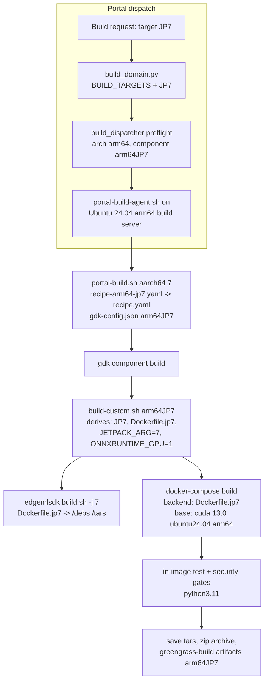
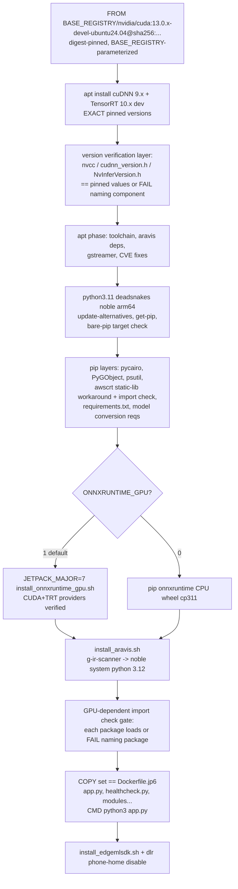

# Design Document: JetPack 7 Support

## Overview

This feature adds a JetPack 7 (JP7) build target to the DefectDetectionApplication build system alongside the existing JP5 and JP6 targets. JP7 targets Jetson Thor-class devices running JetPack 7.1 (Jetson Linux r38.4) and JetPack 7.2 on Ubuntu 24.04 LTS with CUDA 13.0.

The change spans five layers, each following an already-established per-target pattern:

1. **Docker images**: a new `src/backend/Dockerfile.jp7` and `src/edgemlsdk/Dockerfile.jp7`, patterned on the JP5/JP6 variants (digest pinning, `PYTHON_VERSION` build-arg interpreter selection, pip routing verification, import-check gates).
2. **Build scripts**: `src/edgemlsdk/build.sh` gains a `-j 7` branch; `build-custom.sh` derives the JP7 target from the `JP7` component-name token; `portal-build.sh` and `gdk-component-build-and-publish.sh` accept JetPack 7 and select `recipe-arm64-jp7.yaml` / `aws.edgeml.dda.LocalServer.arm64JP7`.
3. **Native GPU builds**: `install_onnxruntime_gpu.sh` gains a `JETPACK_MAJOR=7` case (CUDA 13.0 / TensorRT 10.x pairings, Thor `sm_110`); `install_aravis.sh` is verified (and only if necessary adjusted) for the Ubuntu 24.04 arm64 build environment.
4. **Portal awareness**: the build target matrix (`build_domain.py` `BUILD_TARGETS`) gains `JP7 -> (arm64, aws.edgeml.dda.LocalServer.arm64JP7)`; the device-architecture vocabulary gains `arm64_jp7` across the portal backend, the workflow_core catalog, the on-device architecture derivation, and quick-setup detection; the frozen property-test oracle (`FROZEN_MATRIX`) is extended.
5. **Test baselines**: JP7 counterparts of the per-target build baselines and security preservation baselines, leaving every JP5/JP6 baseline byte-for-byte unchanged.

### Key design decision: JP7 base image

NVIDIA NGC publishes **no `l4t-jetpack` tag for Jetson Linux r38.x** (the newest is `r36.4.0`). Per Requirement 2.2/2.5, the selection rule is:

- **Preferred (if it exists at implementation time)**: `nvcr.io/nvidia/l4t-jetpack:r38.x` — implementation must re-check NGC before pinning.
- **Fallback (expected)**: `nvcr.io/nvidia/cuda:13.0.x-devel-ubuntu24.04` (arm64), e.g. `cuda:13.0.2-devel-ubuntu24.04`, pinned by tag **and** sha256 digest. This is the NVIDIA-forum-recommended base for Thor containers. Unlike `l4t-jetpack`, it does **not** bundle cuDNN or TensorRT, so the JP7 Dockerfiles install `libcudnn9*-cuda-13` and TensorRT 10.x dev packages themselves at **exact pinned versions** from the NVIDIA CUDA apt repository already configured in the base image (Requirement 1.3), followed by an in-build version verification layer (Requirement 2.4).

Both JP7 Dockerfiles reference the **identical digest** (Requirement 2.6) — note this is intentionally stricter than JP6, where the backend (r36.4.0) and edgemlsdk (r36.3.0) bases differ.

### Key design decision: JP7 interpreter

Ubuntu 24.04 (noble) ships Python 3.12 as the distro python. The DDA stack is standardized on CPython 3.11 (the Triton Python-backend stub built by the edgemlsdk image is linked against `libpython3.11`). On JP7 the DDA backend interpreter and the tooling/stub interpreter are **both 3.11** (like JP5/x86; no JP6-style split — the split existed only because JP6 vLLM wheels are cp310-only, and vLLM is out of scope on JP7):

- `BACKEND_PYTHON_VERSION` in `build-custom.sh` stays at the `$PYTHON_VERSION` default (3.11) for JP7 — no new branch needed.
- Install source: **deadsnakes PPA `python3.11` for noble/arm64** (the same mechanism Dockerfile.jp6 uses on jammy/arm64). If implementation finds no noble arm64 binary in deadsnakes, fall back to the Dockerfile.jp5 pattern (compile CPython 3.11 from source under `/usr/local` with `--enable-shared`). The chosen path is documented in the Dockerfile comments.
- The single-interpreter layout means one `get-pip.py` bootstrap; the bare-`pip` targeting verification gate from Dockerfile.jp6 is still included (Requirement 1.8).

### Key design decision: feature scope on JP7

- **vLLM**: disabled on JP7 (`VLLM_ENABLE=0` default, JP5-style build-arg hook retained). No verified Jetson Thor/cu130 wheel index exists; `app.py`'s capability probe (`importlib.util.find_spec("vllm")`) handles absence at runtime.
- **Neo/DLR model runtime**: the JP6-only CUDA 11.4 cudart + TensorRT 8 staging stages are **not** carried to JP7. Those stages exist to satisfy r35-era `libdlr.so` binaries; their transitive L4T driver dependencies do not exist on Thor. DLR-only models are not supported on JP7 (engines are imported lazily per-runner, so this degrades per-model, not at startup). Documented as a known limitation in the JP7 deployment docs.
- **GPU onnxruntime**: enabled by default (source build, ~1–2 h), same `ONNXRUNTIME_GPU=0` opt-out as JP5/JP6.

> **Amendment note** (see `.kiro/specs/onnx-compile-error-diagnostics/`): because
> DLR-only models are not supported on JP7, the ONNX export path
> (`compilation.py`, `target=onnx`) is the designated route for vision models on
> JP7; its start-failure diagnostics are hardened by the referenced spec. There
> is deliberately NO `jetson-xavier-jp7` SageMaker Neo **compile** target and
> none is added — `jetson-xavier-jp7` remains a packaging-target identifier only
> (`packaging.py` `VLLM_ARCH_TO_TARGET`, `workflow_packaging.py`) — because
> SageMaker Neo cannot target CUDA 13 (its `cuda-ver` ceiling is 11.x, per the
> `jetson-xavier-jp6` comment in `COMPILATION_TARGETS`).

> **Amendment note** (see `.kiro/specs/onnx-jetson-publish-packaging/`): the
> JP7 vision route is now delivered. Compiled ONNX exports are published as
> per-JetPack Greengrass components `model-{safe}-onnx-jetson-xavier-jp7`
> (recipe platform `aarch64`, HARD dependency on
> `aws.edgeml.dda.LocalServer.arm64JP7`), packaged from the `onnx` export
> target and resolved by workflow packaging for `arm64_jp7`. The "DLR-only
> models are not supported on JP7" limitation stands, but it no longer leaves
> JP7 without a vision route — ONNX is that route (and JP7's only one).

### Research summary

- JetPack 7.1 = Jetson Linux r38.4, Ubuntu 24.04, kernel 6.8, CUDA 13.0, SBSA-aligned aarch64 (Thor, compute capability `sm_110`). JetPack 7.2 is the follow-on release on the same r38.x/CUDA 13 userspace generation — one component artifact covers both (Requirement 8.1).
- NGC `l4t-jetpack` repository: newest tag `r36.4.0`; no r38.x tag (verified). NVIDIA developer-forum guidance for Thor containers: use `nvcr.io/nvidia/cuda` CUDA 13.0.x Ubuntu 24.04 arm64 images and install cuDNN/TensorRT explicitly.
- ONNX Runtime CUDA 13 support begins in the 1.23 line; TensorRT 10.x EP support has been present since 1.18. JP7 default pin: `v1.23.x` (exact tag chosen at implementation against the TRT version actually pinned in the image), `CUDA_ARCHITECTURES=110`.
- deadsnakes PPA publishes `python3.11` for noble; arm64 availability must be confirmed at implementation (fallback documented above).
- Ubuntu 24.04 hosts ship the `docker compose` plugin rather than the legacy `docker-compose` v1 binary; `build-custom.sh` invokes `docker-compose`, so build-server provisioning must provide a `docker-compose` shim (see Components).

## Architecture

### Build flow (unchanged shape, new target)



### JP7 backend image build (inside Dockerfile.jp7)



### Portal architecture vocabulary

`arm64_jp7` joins the fixed `Target_Architecture` set everywhere it is spelled, with exact-name matching preserved (no coarse-arm64 fallback):

| Location | Change |
|---|---|
| `edge-cv-portal/backend/layers/workflow_core/python/workflow_core/catalog.py` | `ARCH_ARM64_JP7 = 'arm64_jp7'`, added to `DEVICE_ARCHITECTURES` (NOT to `VLLM_ARCHITECTURES`) |
| `src/backend/workflow_engine/vendor/workflow_core/catalog.py` (vendored copy) | same |
| `edge-cv-portal/backend/functions/devices.py`, `quick_setup.py` | `TARGET_ARCHITECTURES` tuples gain `arm64_jp7` |
| `edge-cv-portal/backend/functions/deployments.py` `_component_arch` | `'jp7' in suffix -> 'arm64_jp7'` (checked alongside jp6/jp5/jp4, before the legacy bare-arm64 fallback) |
| `edge-cv-portal/backend/functions/workflow_packaging.py` | `ARCH_TO_PLATFORM['arm64_jp7']='aarch64'`, `ARCH_TO_LOCAL_SERVER_COMPONENT[ARCH_ARM64_JP7]='aws.edgeml.dda.LocalServer.arm64JP7'`, `ARCH_TO_PUBLISH_TARGET[ARCH_ARM64_JP7]` new publish-target id |
| `src/backend/workflow_engine/environment.py` | `"JP7" in component_path -> ARCH_ARM64_JP7` (checked before JP6/JP5) |
| `station_install/setup_station.sh` arch detection | L4T major release r38 -> `arm64_jp7` |
| `edge-cv-portal/frontend` deploy-screen JetPack-token inference | `JP7` name token -> requires `arm64_jp7` |
| vLLM supported-architecture functions (`packaging.py`, `greengrass_publish.py`, `model_import.py`, `vllm_fit_check.py`) | **unchanged** — `arm64_jp7` is deliberately not added |

## Components and Interfaces

### 1. `src/backend/Dockerfile.jp7` (new)

Patterned on `Dockerfile.jp6`, with these deltas:

- **FROM**: single build stage — `FROM ${BASE_REGISTRY}/nvidia/cuda:<13.0.x tag>-devel-ubuntu24.04@sha256:<digest>` (or the `l4t-jetpack:r38.x` image if NGC publishes one before implementation, per Requirement 2.5). `${BASE_REGISTRY}`-parameterized and digest-pinned per FROM, matching the security docker gate convention. No `cuda114`/`trt8` provider stages (DLR not supported on JP7).
- **Header comment block** (Requirement 2.1): documents registry path, tag, digest (character-identical to the FROM digest), and the selection rationale (no l4t-jetpack r38.x at pin time; NVIDIA cuda Ubuntu 24.04 arm64 fallback per forum guidance), plus the cuDNN/TensorRT pinned versions.
- **GPU libraries** (Requirements 1.3, 2.4): `apt-get install -y libcudnn9-cuda-13=<exact> libcudnn9-dev-cuda-13=<exact> tensorrt-dev=<exact>` (exact package names/versions resolved at implementation from the NVIDIA repo for noble arm64; every specifier `=exact-version`, no ranges). Followed by a verification layer that extracts the CUDA version (`nvcc --version` / `cuda.h`), cuDNN version (`cudnn_version.h`) and TensorRT version (`NvInferVersion.h`) and compares each against `ARG`-declared pinned values, failing with `ERROR: <component> version mismatch: expected <X> got <Y>`.
- **py3compile guard**: retained (harmless no-op on a non-l4t base; keeps layer structure aligned with jp5/jp6 for the masked-baseline diffs).
- **Interpreter** (Requirement 1.4): `ARG PYTHON_VERSION` re-declared after FROM; deadsnakes PPA -> `python3.11 python3.11-dev python3.11-venv` (noble has no `-distutils` package for 3.11 — deadsnakes still provides it; confirm at implementation); `update-alternatives` points `python3` at `python${PYTHON_VERSION}`; single `get-pip.py` bootstrap; then the jp6-style gate: `pip --version | grep -F "(python ${PYTHON_VERSION})" || (echo "ERROR: bare pip targets the wrong interpreter:" && pip --version && exit 1)` (Requirement 1.8).
- **pip layers**: same sequence as jp6 (pycairo, PyGObject, psutil, the awscrt vendored-aws-lc workaround with its `import awscrt.mqtt` check, `requirements.txt`, model-conversion requirements, `setuptools<81` caps).
- **ONNX Runtime**: `ARG ONNXRUNTIME_SPEC` / `ARG ONNXRUNTIME_GPU=0`; GPU branch runs `JETPACK_MAJOR=7 ./edge_ml1_p_camera_management/install_onnxruntime_gpu.sh` (PYBIN defaults to `python3` = 3.11); CPU branch pip-installs the cp311 aarch64 wheel.
- **vLLM hook**: JP5-style disabled hook (`ARG VLLM_ENABLE=0`, `VLLM_SPEC=""`), so the build-arg contract stays uniform (Requirement 1.9).
- **aravis**: meson/ninja, `setuptools<71` downgrade, g-ir-scanner shebang rewritten to the noble **system** python (3.12 — detected dynamically like jp6, excluding 3.11), `./edge_ml1_p_camera_management/install_aravis.sh`, `setuptools<81` restore.
- **GPU-dependent import check gate** (Requirements 1.6, 5.7): a consolidated layer that imports, under `python${PYTHON_VERSION}`, every GPU-dependent package the Dockerfile installed — at minimum `onnxruntime` (asserting `CUDAExecutionProvider` and `TensorrtExecutionProvider` are in `get_available_providers()` when `ONNXRUNTIME_GPU=1`) — each in its own `python3 -c "import X"` step so a failure names the package. Passing this gate does not short-circuit later steps (Requirement 1.7 — ordinary `RUN` failure semantics continue to apply).
- **COPY set / CMD / healthcheck** (Requirement 1.5): identical COPY list to `Dockerfile.jp6` (including `app.py`, `healthcheck.py` landing at `/healthcheck.py`, `vllm_runtime`, all module dirs); `CMD ["python3", "app.py"]` (alternatives-managed interpreter). `COPY edgemlsdk` + `install_edgemlsdk.sh` (default `DDA_PYTHON` — python3.11 — is already correct for JP7, no override needed) + `dlr_disable_phone_home.py` under the DDA interpreter.
- **Build args accepted** (Requirement 1.9): `OS`, `PLATFORM`, `PYTHON_VERSION`, `BASE_REGISTRY`, `ONNXRUNTIME_SPEC`, `ONNXRUNTIME_GPU`, `VLLM_*` — the superset build-custom.sh/docker-compose passes for jp6.

### 2. `src/edgemlsdk/Dockerfile.jp7` (new)

Patterned on `src/edgemlsdk/Dockerfile.jp6`:

- `FROM ${BASE_REGISTRY}/nvidia/cuda:...@sha256:<same digest as Dockerfile.jp7 backend>` (Requirement 2.6) plus the same pinned cuDNN/TensorRT dev installs where the Triton build needs them.
- Same header comment block documenting the base selection (Requirement 2.1).
- Python 3.11 via deadsnakes (noble), `Python3_*` env pins to 3.11 so the Triton Python-backend stub links `libpython3.11`.
- CMake 3.x from the upstream tarball (same rationale as jp6 — Triton's fetched deps break on CMake 4).
- Produces the same `/debs` and `/tars` artifact set the extraction flow reads: `PanoramaSDK.deb`, `aws-*.deb`, gstreamer debs, `openssl.deb`, `panorama.whl`, `triton-core.deb`, `triton-python-backend.deb`, `triton_installation_files.tar.gz` (Requirement 3.1). Triton server version re-pinned at implementation to a release supporting CUDA 13 / Ubuntu 24.04; the noble toolchain (gcc-13) replaces the jammy toolchain steps.

### 3. `src/edgemlsdk/build.sh` (modified)

```bash
if [ "$jetpack" = "7" ]; then
    DOCKERFILE="Dockerfile.jp7"
    echo "Using JP7 Dockerfile (nvcr.io/nvidia/cuda 13.0.x ubuntu24.04 base, native build)"
elif [ "$jetpack" = "6" ]; then
    ...existing...
```

Existing behavior for `5`, `6`, empty, and unrecognized values is untouched (Requirement 3.4); the JP7 branch logs the selected Dockerfile and base image (Requirement 3.3). Extraction flow (`extracted-debs/debs/`, `extracted-debs/tars/`, empty-directory warnings, non-zero exit on build failure before extraction) is shared and unchanged (Requirements 3.5, 3.6).

### 4. `build-custom.sh` (modified) + `scripts/build-target-derivation.sh` (new)

The component-name -> target derivation (currently an inline `if/elif` chain) is extracted into a small sourceable helper so it is property-testable without running a build:

```bash
# scripts/build-target-derivation.sh — sourced by build-custom.sh
# derive_build_target COMPONENT_NAME -> sets IS_JP5 IS_JP6 IS_JP7 IS_X86_NVIDIA
#                                        JETPACK_ARG BACKEND_DOCKERFILE
# resolve_onnxruntime_gpu            -> honors existing ONNXRUNTIME_GPU env opt-out
derive_build_target() {
  ... JP6 -> (IS_JP6=1, JETPACK_ARG=6, Dockerfile.jp6)
      JP5 -> (IS_JP5=1, JETPACK_ARG=5, Dockerfile.jp5)
      JP7 -> (IS_JP7=1, JETPACK_ARG=7, Dockerfile.jp7)
      Nvidia -> (IS_X86_NVIDIA=1, Dockerfile.x86_64_nvidia)
      else -> Dockerfile (default CPU-only) ...
}
```

`build-custom.sh` sources the helper and keeps its behavior otherwise identical:

- JP7 logs the derived target (`echo "JetPack 7: $IS_JP7"`), passes `-j 7` to the edgemlsdk build, exports `BACKEND_DOCKERFILE=Dockerfile.jp7` (Requirement 4.2).
- `BACKEND_PYTHON_VERSION` derivation unchanged: only JP6 gets 3.10; JP7 falls through to `$PYTHON_VERSION` (3.11).
- GPU onnxruntime default: the `IS_JP6/IS_JP5/IS_X86_NVIDIA` condition gains `IS_JP7`, preserving the `ONNXRUNTIME_GPU=0` opt-out (Requirement 4.5).
- Packaging, tar/zip integrity verification, in-image test + security gates, and greengrass-build artifact copy are target-agnostic and unchanged (Requirements 4.8, 4.9). The in-image gate runs under `python${BACKEND_PYTHON_VERSION}` = 3.11 on JP7, which the existing `command -v` shims already handle.

### 5. Component identity, recipe, and gdk config

- **`recipe-arm64-jp7.yaml`** (new, repo root): copy of `recipe-arm64-jp6.yaml` with `ComponentName: "aws.edgeml.dda.LocalServer.arm64JP7"` and `StationName: "DDA_Station_ARM64_JP7"`; all accessControl policy blocks (including the `mqttproxy:2` publish entry) and lifecycle content follow the jp5/jp6 conventions (Requirement 4.6).
- **`gdk-config.json`**: JP7 component entry with the same custom build command structure (`bash build-custom.sh aws.edgeml.dda.LocalServer.arm64JP7 NEXT_PATCH`) (Requirement 4.1). Note `gdk-config.json` holds one component at a time in the manual flow (builds.md); the portal flow regenerates it per build.
- **`portal-build.sh` / `gdk-component-build-and-publish.sh`**: argument parsing accepts `7|jp7|JP7|--jp7`; the aarch64 case maps `JETPACK=7 -> recipe-arm64-jp7.yaml + arm64JP7`; usage text updated ("7 = JetPack 7 (Ubuntu 24.04, L4T r38.x) -> aws.edgeml.dda.LocalServer.arm64JP7"). The `cp "$RECIPE_FILE" recipe.yaml` step is what satisfies Requirement 4.7 (build-custom.sh then copies `recipe.yaml` into `greengrass-build/recipes` unchanged).
- **`scripts/portal-build-agent.sh`**: `BUILD_TARGET=JP7` maps to `./portal-build.sh aarch64 7` (same pattern as JP5/JP6).

### 6. `install_onnxruntime_gpu.sh` (modified)

Additive `7)` case in the per-JetPack defaults, everything else untouched (Requirement 5.6):

```bash
    7)
        # JP7 (Thor, r38.x): CUDA 13.0, TensorRT 10.x, cuDNN 9.x ->
        # onnxruntime 1.23 line (first with CUDA 13 support). Thor sm_110.
        ONNXRUNTIME_VERSION="${ONNXRUNTIME_VERSION:-v1.23.<x>}"
        CUDA_ARCHITECTURES="${CUDA_ARCHITECTURES:-110}"
        ;;
```

- The error message for unrecognized values becomes "must be 5, 6 or 7".
- Existing prerequisite checks already cover JP7 (Requirement 5.2): `CUDA_HOME` directory check, `NvInfer.h` check in both `/usr/include/aarch64-linux-gnu/` and `/usr/include/` (the NVIDIA apt TensorRT dev package on noble arm64 lands in one of these — verified path recorded at implementation). The error text is generalized so it does not claim "the l4t-jetpack base is required" for JP7 (message names the missing prerequisite and the required dev package).
- The JP5-only gcc-10 host-compiler override is untouched; CUDA 13 nvcc supports noble's default gcc-13, so JP7 needs no override (confirmed at implementation; if not, a JP7-scoped `CUDA_HOST_COMPILER_DEFINE` is added without touching the JP5 branch).
- Wheel install semantics unchanged: uninstall CPU onnxruntime, install the built cp311 aarch64 wheel into `${PYBIN}`, provider verification (`CUDAExecutionProvider` + `TensorrtExecutionProvider`) fails the build if missing (Requirements 5.1, 5.7).

### 7. `install_aravis.sh` (verify, minimally modify)

The script's stages (dependency install, meson configure, ninja compile, install) must each exit 0 on noble arm64 (Requirement 5.4). Expected noble deltas to verify at implementation: apt package renames (e.g. `libgirepository1.0-dev` vs `libgirepository-2.0-dev`, gtk-doc tooling), meson version behavior. Any change is branched on the detected environment (or is a superset-compatible package alternative) so JP5/JP6 behavior — including the existing aarch64 static-lib handling — is byte-preserved for those targets (Requirement 5.6). If the script is modified, its `install_aravis.sh.sha256.txt` build baseline is rebaselined in the same change (builds.md protocol).

### 8. Portal build target matrix (`build_domain.py` + dispatcher + oracle)

```python
TARGET_JP7 = 'JP7'

BUILD_TARGETS = {
    ...existing four entries unchanged...
    TARGET_JP7: {
        'component_name': 'aws.edgeml.dda.LocalServer.arm64JP7',
        'recipe': 'recipe-arm64-jp7.yaml',
        'required_arch': ARCH_ARM64,
    },
}
```

- `SUPPORTED_BUILD_TARGETS`, `is_supported_target`, `target_definition`, `validate_build_request`, `create_build_jobs`, and the dispatcher preflight (`decide_preflight` component-identity check) all derive from `BUILD_TARGETS`, so JP7 rides through with no further logic change (Requirements 7.1, 7.2, 7.5, 7.6).
- `test_preflight_target_matrix_properties.py` `FROZEN_MATRIX` gains `"JP7": ("arm64", "aws.edgeml.dda.LocalServer.arm64JP7")` — the deliberate re-spelled oracle; the `test_the_frozen_matrix_is_exactly_the_domain_table` equality test then enforces exactly-five targets.
- **Dispatch** (Requirements 6.3–6.7): capability for JP7 = a registered, running arm64 build server (dedicated mode) — the existing `required_arch` matching, single-server selection, missing-capability rejection (`RULE_SERVER_ARCH_MISMATCH` / `server_not_found` / `server_not_running`), dispatch-acceptance verification, and one-build-at-a-time serialization (`running_build_job_id` + pgrep verification, serialization-violation event) apply unchanged. No dispatcher code change is expected beyond the matrix entry; the design adds JP7 to the dispatcher property tests to prove it.

### 9. Device architecture vocabulary (`arm64_jp7`)

Per the table in Architecture. Compatibility semantics (Requirements 7.3, 7.4, 7.7):

- All gates match `Target_Architecture` by **exact name**; adding `arm64_jp7` to the fixed sets makes JP7 devices recordable, and the existing exact-name logic automatically makes `arm64_jp5`/`arm64_jp6` devices incompatible with JP7 components and vice versa.
- Fail-closed on null architecture is existing gate behavior; the surfaced message ("device's architecture must be recorded...") is preserved/extended for the JP7 paths.
- `station_install/setup_station.sh` architecture detection derives `arm64_jp7` from the L4T release major r38 (reading `/etc/nv_tegra_release` or the l4t apt sources, same source as the existing jp4/jp5/jp6 derivation); `quick_setup.py` accepts it because the fixed tuple gains the value.
- The deploy-screen JetPack-token inference (frontend) treats a `JP7` component-name token as requiring `arm64_jp7`.

### 10. Ubuntu 24.04 build server enablement

- **Provisioning documentation** (Requirement 6.2): a new README/docs section (extending the existing arm64 build-server docs) covering: Ubuntu 24.04 LTS arm64 host (Graviton or Jetson Thor-class), Docker Engine + buildx, a `docker-compose` command shim (noble ships only the `docker compose` plugin; provision `docker-compose` as either the standalone v2 binary or a two-line shim delegating to `docker compose` — `build-custom.sh` invokes `docker-compose`), zip, python3, gdk CLI, repository clone as the `ubuntu` user, and portal registration (the existing dedicated-server registration flow; the server records `arch=arm64`, which is what makes it JP7-capable). `edge-cv-portal/launch-arm64-build-server.sh` gains a Ubuntu 24.04 AMI option (or a documented parameter) for JP7 build servers.
- **`build-custom.sh` on noble**: `IMAGE_VER` reads `24.04` from `/etc/lsb-release`; it is threaded to the edgemlsdk `-u` flag and the frontend build `OS` arg — implementation verifies the frontend/default Dockerfiles tolerate `OS=24.04` on this path (JP7 backend/edgemlsdk Dockerfiles ignore `OS` for base selection, which is digest-pinned).
- One-build-at-a-time (Requirements 6.6, 6.7) is existing behavior (portal serialization + builds.md operational protocol) and is not modified.

### 11. Test baselines (JP7 counterparts)

| New file | Content | Suite |
|---|---|---|
| `test/backend-test/backend_jammy_pkgs/baselines/backend_Dockerfile.jp7.sha256.txt` | sha256 hex of `src/backend/Dockerfile.jp7` bytes | backend build baselines (Req 9.1) |
| `test/backend-test/edgemlsdk_pythondev/baselines/edgemlsdk_Dockerfile.jp7.sha256.txt` | sha256 hex of `src/edgemlsdk/Dockerfile.jp7` bytes | the only edgemlsdk baseline family with both jp5 and jp6 variants (Req 9.2; the edgemlsdk_cmake suite has no such pair — its jp5 file is `_cmake_masked` and its jp6 file is `.sha256` — so no cmake-suite counterpart is required; implementation re-scans the suites to confirm) |
| `test/backend-test/security/baselines/docker_baseline_backend_Dockerfile.jp7_masked.txt` | masked content of `src/backend/Dockerfile.jp7` | security preservation gate (Req 9.3) |
| `test/backend-test/security/baselines/docker_baseline_edgemlsdk_Dockerfile.jp7_masked.txt` | masked content of `src/edgemlsdk/Dockerfile.jp7` | security preservation gate (Req 9.3) |

- The security preservation suite's tracked-file list and `docker_base_image_audit.py`'s in-scope Jetson Dockerfile set gain the two JP7 Dockerfiles (per-FROM `${BASE_REGISTRY}` + digest-pin enforcement now covers them).
- A new **digest-equality check** (Requirement 2.6) is added to the backend build baseline suite: parse the FROM digest of both JP7 Dockerfiles and fail if they differ.
- JP7 checks are independent per-file checks (same structure as jp5/jp6), so they pass regardless of unrelated jp5/jp6 baseline state (Requirement 9.5), and no existing baseline file is modified (Requirement 9.4).

## Data Models

### Target derivation table (single source of truth: component-name token)

| Component name token | Target | JETPACK_ARG | Backend Dockerfile | edgemlsdk Dockerfile | ONNXRUNTIME_GPU default | Backend python |
|---|---|---|---|---|---|---|
| `JP7` | JetPack 7 | `7` | `Dockerfile.jp7` | `Dockerfile.jp7` | `1` | 3.11 |
| `JP6` | JetPack 6 | `6` | `Dockerfile.jp6` | `Dockerfile.jp6` | `1` | 3.10 |
| `JP5` | JetPack 5 | `5` | `Dockerfile.jp5` | `Dockerfile.jp5` | `1` | 3.11 |
| `Nvidia` | x86 NVIDIA | — | `Dockerfile.x86_64_nvidia` | `Dockerfile` | `1` | 3.11 |
| (none) | default CPU | — | `Dockerfile` | `Dockerfile` | `0` | 3.11 |

### Portal build target matrix (after change)

| Target | required_arch | component_name | recipe |
|---|---|---|---|
| JP5 | arm64 | aws.edgeml.dda.LocalServer.arm64JP5 | recipe-arm64-jp5.yaml |
| JP6 | arm64 | aws.edgeml.dda.LocalServer.arm64JP6 | recipe-arm64-jp6.yaml |
| **JP7** | **arm64** | **aws.edgeml.dda.LocalServer.arm64JP7** | **recipe-arm64-jp7.yaml** |
| AMD64 | x86_64 | aws.edgeml.dda.LocalServer.amd64 | recipe-amd64.yaml |
| AMD64_NVIDIA | x86_64 | aws.edgeml.dda.LocalServer.amd64Nvidia | recipe-amd64-nvidia.yaml |

### Target_Architecture fixed set (after change)

`{x86_64, x86_64_nvidia, arm64_jp4, arm64_jp5, arm64_jp6, arm64_jp7}` — matched by exact name in every gate; `arm64_jp7` maps to coarse platform `aarch64`, LocalServer component `aws.edgeml.dda.LocalServer.arm64JP7`.

### JP7 pinned-version record (declared as ARGs/comments in Dockerfile.jp7, verified in-build)

| Component | Pin (resolved at implementation) | Verified against |
|---|---|---|
| Base image | `nvcr.io/nvidia/cuda:13.0.x-devel-ubuntu24.04@sha256:...` (identical in both JP7 Dockerfiles) | FROM digest resolution at build start |
| CUDA | 13.0.x (bundled in base) | `nvcc --version` / `cuda.h` |
| cuDNN | 9.x.y exact apt pin | `cudnn_version.h` |
| TensorRT | 10.x.y exact apt pin | `NvInferVersion.h` |
| Python | 3.11 (PYTHON_VERSION build arg) | bare-pip target gate |
| onnxruntime (GPU) | v1.23.x tag, `CUDA_ARCHITECTURES=110` | provider import check |

## Correctness Properties

*A property is a characteristic or behavior that should hold true across all valid executions of a system-essentially, a formal statement about what the system should do. Properties serve as the bridge between human-readable specifications and machine-verifiable correctness guarantees.*

Most of this feature is build infrastructure (docker builds, on-hardware deployment) verified by integration/smoke testing — see Testing Strategy. The properties below cover the pure decision logic: Dockerfile/target selection, the portal target matrix, device-architecture compatibility, dispatch capability validation, and baseline gate behavior.

### Property 1: EdgeMLSDK Dockerfile selection mapping

*For any* JetPack flag value passed to `src/edgemlsdk/build.sh` (`-j`), the script selects the Dockerfile per the fixed table — `"7" -> Dockerfile.jp7`, `"6" -> Dockerfile.jp6`, `"5" -> Dockerfile.jp5`, and any other value (including empty/absent) -> `Dockerfile` — and logs the selected Dockerfile. (Verified with a stub `docker` on PATH recording the `-f` argument; no image is built.)

**Validates: Requirements 3.3, 3.4**

### Property 2: Build target derivation from component name

*For any* component name, the extracted derivation helper (`scripts/build-target-derivation.sh`, sourced by `build-custom.sh`) derives exactly the target row of the derivation table: names containing `JP7` yield `(JETPACK_ARG=7, BACKEND_DOCKERFILE=Dockerfile.jp7, ONNXRUNTIME_GPU default 1)`; names containing `JP6`, `JP5`, or `Nvidia` yield their existing rows unchanged; names containing none of the tokens yield the default CPU-only row (`Dockerfile`, no JetPack arg, GPU 0). And *for any* JetPack/Nvidia target, setting `ONNXRUNTIME_GPU=0` in the environment overrides the GPU default to 0.

**Validates: Requirements 4.2, 4.3, 4.4, 4.5**

### Property 3: Target and mode matrix exactness with JP7

*For any* supported build target (now JP5, JP6, JP7, AMD64, AMD64_NVIDIA), valid execution mode, valid repository directory, and quotable source ref, portal preflight preserves the frozen matrix exactly — `JP7 -> (arm64, aws.edgeml.dda.LocalServer.arm64JP7)` and the four pre-existing mappings byte-identical to their pre-change values — and the job passes the component-identity check when it records its own target's component identity.

**Validates: Requirements 7.1, 7.2**

### Property 4: Cross-wired component identity always fails

*For any* ordered pair of distinct supported targets (from the five-target set), a build job for the first target that records the second target's component identity fails preflight in every execution mode with the `component_identity_mismatch` diagnostic, before any build or publish work.

**Validates: Requirements 7.6**

### Property 5: Unsupported targets keep failing

*For any* target name outside the five-target supported set and any execution mode, the build request/preflight is rejected with a diagnostic naming the unsupported target before any build or publish work — adding JP7 accepts no previously rejected target or mode combination.

**Validates: Requirements 7.5**

### Property 6: Device compatibility is exact-name matching

*For any* recorded device architecture value (drawn from the fixed set `{x86_64, x86_64_nvidia, arm64_jp4, arm64_jp5, arm64_jp6, arm64_jp7}`, arbitrary strings, and the unrecorded/None case) and *for any* LocalServer component variant (arm64JP5, arm64JP6, arm64JP7, ...), the compatibility evaluation treats the device as compatible if and only if the recorded value equals the component's derived architecture by exact name (`arm64JP7 -> arm64_jp7`); an unrecorded architecture is always incompatible (fails closed) with a message stating the architecture must be recorded. In particular, `arm64_jp5`/`arm64_jp6` devices are incompatible with the JP7 component and `arm64_jp7` devices are incompatible with JP5/JP6 components.

**Validates: Requirements 7.3, 7.4, 7.7**

### Property 7: JP7 dispatch requires a capable server

*For any* generated fleet state: a JP7 dedicated build request is accepted only when the selected server exists, is running, and has `arch=arm64`; when no capable server is available (absent, not running, or wrong architecture), the request is rejected with a diagnostic naming the missing capability (server/state/architecture rule) and zero build or publish work is performed (recorder seams stay empty). When at least one capable server is selected, exactly one dispatch occurs.

**Validates: Requirements 6.3, 6.4**

### Property 8: Baseline gate mutation round trip

*For any* mutation of the tracked JP7 Dockerfile content (generated byte/line edits producing content different from the baselined content), the preservation/baseline check fails identifying the mismatched file, and recomputing the baseline from the mutated content makes the same check pass — while unchanged content always passes regardless of the state of unrelated (JP5/JP6) baselines.

**Validates: Requirements 9.5, 9.6**

## Error Handling

### Image builds (fail loud, fail early)

| Failure | Behavior |
|---|---|
| JP7 base digest unresolvable from registry | Docker fails the `FROM` resolution before any build step; registry error in the build log (Req 2.3) |
| cuDNN/TensorRT/CUDA version mismatch vs pins | Version verification layer fails the build: `ERROR: <component> version mismatch: expected <X> got <Y>` (Req 2.4) |
| Bare `pip` targets wrong interpreter | Gate layer prints the mis-targeted `pip --version` output and exits 1 (Req 1.8) |
| GPU-dependent package import failure | Per-package import layer fails the build with the package name in the log (Req 1.6) |
| ORT GPU prerequisites missing (CUDA toolkit, NvInfer.h) | `install_onnxruntime_gpu.sh` exits non-zero before cloning/compiling, naming the missing prerequisite and the required dev package (Req 5.2) |
| ORT build/provider verification failure | Script exits non-zero (missing wheel, missing CUDA/TRT providers); `set -e` fails the RUN and the image build (Req 5.3, 5.7) |
| Aravis stage failure | The failing stage's non-zero exit fails the RUN; stage error in the build log (Req 5.5) |
| edgemlsdk image build failure | `build.sh` exits non-zero with the docker error; extraction is not attempted (Req 3.6); empty extraction dirs log a named warning (Req 3.5) |

### Build packaging

Unchanged shared logic: `save_image_tar` integrity guard (size + tar structure) and `zip -T` verification fail the build naming the artifact (Req 4.9); the interpreter-version audit and the security gates abort before/after the compile as today.

### Portal dispatch and deployment

- Unsupported target / cross-wired identity / missing capability: rejected pre-dispatch with the stable rule vocabulary (`unsupported_target`, `component_identity_mismatch`, `server_arch_mismatch`, `server_not_found`, `server_not_running`); zero costly work (Req 6.4, 7.5, 7.6).
- Dispatch acceptance timeout / capability lost at dispatch: existing preflight/verification flow terminates the job through the common failed-transition path with the missing-capability diagnostic; no partially started build (Req 6.5).
- Device with no recorded architecture: JP7 deployment evaluation fails closed with the record-architecture message (Req 7.7).

### On-device

Existing recipe/docker-compose semantics: backend healthcheck (`python3 /healthcheck.py`) with the 300-second start budget; an unhealthy backend fails the deployment rather than reporting RUNNING, container logs retained (Req 8.2, 8.4). Host-side prerequisite failures (missing driver interface/library on a JetPack 7 release) are documented in the JP7 deployment docs as they are discovered (Req 8.5).

## Testing Strategy

The feature mixes pure decision logic (property-tested), fixed-file conventions (example-based), and hours-long build/deploy flows (integration/smoke). Property-based testing applies only to the pure logic listed in Correctness Properties; the docker image contents, base-image selection, and on-hardware behavior are explicitly NOT property-tested (external services, one-shot builds, high cost).

### Property-based tests

- Library: **Hypothesis** (already used throughout `test/backend-test/`), minimum **100 iterations** per property (`@settings(max_examples=100)` or higher, matching the existing suites' 150–250).
- One property test per design property, tagged with a comment referencing it: `**Feature: jetpack7-support, Property N: <title>**`.
- Locations:
  - Properties 1–2 (script selection/derivation): new `test/backend-test/build_script/test_jp7_target_derivation_properties.py`, driving `bash` with generated inputs and a stub `docker` on PATH (Property 1) and sourcing `scripts/build-target-derivation.sh` (Property 2). Pure/offline: no image is ever built.
  - Properties 3–5, 7: extend `test/backend-test/portal_builds/test_preflight_target_matrix_properties.py` (FROZEN_MATRIX gains JP7; the existing generators automatically widen) and the fleet-validation property files; mocked seams only, no AWS calls.
  - Property 6: new `test/backend-test/portal_builds/test_jp7_device_compatibility_properties.py` against `deployments._component_arch`, the workflow_core catalog sets, and the compatibility/gate predicates; plus `workflow_engine.environment` arch derivation.
  - Property 8: new test alongside the baseline suites exercising the check logic (hash/masked comparison functions) with generated mutations in a temp tree — the real baseline files are never modified.

### Example-based unit tests

- Dockerfile conventions (fixed-file parses): every FROM tag+digest pinned (1.2, 3.2), exact GPU-library pins (1.3), COPY-set equality with jp6 + CMD/healthcheck (1.5), ARG superset (1.9), comment digest == FROM digest (2.1), **FROM digest equality across the two JP7 Dockerfiles (2.6)**.
- `gdk-config.json` JP7 entry (4.1) and `recipe-arm64-jp7.yaml` structure (4.6).
- `build.sh` failure path with stub docker: non-zero exit, no extraction (3.6).
- `install_onnxruntime_gpu.sh`: JP7 defaults echoed by the case branch; fail-fast on missing CUDA/TensorRT naming the prerequisite (5.2); JP5/JP6 case branches unchanged (5.6).
- Baseline files: existence + content correctness for all four new JP7 baselines (9.1–9.3), existing jp5/jp6 baselines unchanged (9.4), JP7 checks pass standalone (9.5).
- Dispatch edge examples with recorder seams: acceptance-timeout/capability-lost (6.5), serialization pending-not-failed (6.6, 6.7) — JP7-parameterized instances of the existing portal flow tests.

### Integration / smoke (manual or on-hardware; NOT run in unit suites)

1. **JP7 component build** on the Ubuntu 24.04 arm64 build server: `gdk component build` with the arm64JP7 entry (one at a time per builds.md; ~1–2 h with GPU ORT). Verifies Requirements 1.1, 1.4, 1.6–1.8, 2.3–2.4, 3.1, 3.5, 4.7–4.9, 5.1, 5.3–5.5, 5.7, 6.1 via the in-build gates and packaging output. Log to `.gdk_build_jp7.log`.
2. **Portal-dispatched JP7 build** end-to-end (registration -> dispatch -> publish) on the registered noble server (6.1, 6.3).
3. **On-hardware deployment** of the same JP7 artifact to a JetPack 7.1 device and a JetPack 7.2 device: component reaches RUNNING within the healthcheck budget on both without release-specific changes; exercise camera + ONNX GPU inference paths per the builds.md on-hardware protocol (8.1–8.4).
4. **Base image selection smoke** at implementation time: re-check NGC for an `l4t-jetpack` r38.x tag (2.2, 2.5); record the decision and digest in the Dockerfile comments.

### Gates and baselines protocol

- The two JP7 Dockerfiles enter the security preservation gate and `docker_base_image_audit.py` scope; all four JP7 baselines are captured in the same change that finalizes the Dockerfiles.
- Any modification to `install_aravis.sh` or `install_onnxruntime_gpu.sh` rebaselines the affected sha256 goldens in the same commit (builds.md protocol); JP5/JP6 baselines are otherwise untouched (9.4).
- The extended FROZEN_MATRIX oracle is updated in the same change as `build_domain.py` so the equality test never sees a drift window.

## Requirements Traceability (summary)

| Requirement | Design elements |
|---|---|
| 1 (JP7 backend Dockerfile) | Components #1; Data Models pinned-version record; Error Handling (image builds) |
| 2 (base image selection/verification) | Overview key decision; Components #1, #2, #11 (digest-equality check); Property 8 gate context |
| 3 (edgemlsdk Dockerfile + build.sh) | Components #2, #3; Property 1 |
| 4 (Greengrass component target) | Components #4, #5; Property 2; Error Handling (packaging) |
| 5 (GPU ORT + aravis) | Components #6, #7; Error Handling; integration test 1 |
| 6 (Ubuntu 24.04 build server) | Components #8, #10; Property 7; integration tests 1–2 |
| 7 (portal target matrix + device compat) | Components #8, #9; Properties 3–6 |
| 8 (JetPack 7.1/7.2 devices) | Overview scope decisions; Error Handling (on-device); integration test 3 |
| 9 (test baselines) | Components #11; Property 8; example tests |

## Amendment (vllm-multi-arch-publish-conflict)

JP7 vLLM model publishing (delivered under this umbrella by `.kiro/specs/jp7-vllm-enablement/`) was amended by `.kiro/specs/vllm-multi-arch-publish-conflict/` (branch `spec/jetpack7-support`): a vLLM model on JP7 now means a JP7-specific model component (`model-vllm-{safe}-jetson-xavier-jp7`, advertising only `arm64_jp7` and depending on `aws.edgeml.dda.LocalServer.arm64JP7`), not a shared component advertising both JetPacks. See that spec for the per-JetPack naming, publishing, and deploy-gate details.
