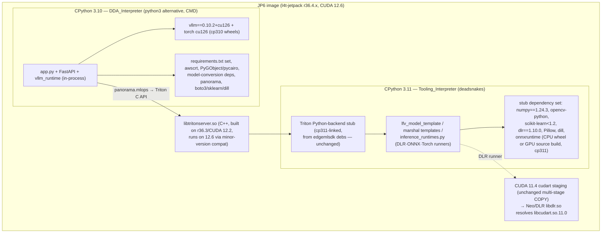

# Design Document

## Overview

This feature finishes vLLM enablement on the JetPack 6 device image. The vllm-triton-inference feature shipped all portal and device code, but a plain JP6 build installs no vLLM wheel: the `Dockerfile.jp6` vLLM layer defaults `VLLM_SPEC=""` and its default index (`pypi.jetson-ai-lab.dev/jp6/cu122`) is dead. `app.py`'s capability probe therefore keeps every JP6 device in pre-feature mode.

The enablement is "Option 1 — prebuilt Jetson AI Lab wheels":

1. **Base bump**: `Dockerfile.jp6` moves from `l4t-jetpack:r36.3.0` (CUDA 12.2) to an r36.4.x tag (CUDA 12.6, TensorRT 10.3, cuDNN 9, Ubuntu 22.04 jammy), digest-pinned at implementation time.
2. **Pinned wheel, enabled by default**: `VLLM_ENABLE=1`, `VLLM_SPEC=vllm==0.10.2+cu126`, `VLLM_INDEX_URL=https://pypi.jetson-ai-lab.io/jp6/cu126`.
3. **Dual-interpreter image**: the Jetson wheels are cp310-only, so the DDA backend process (app.py + in-process `vllm_runtime`) moves to CPython 3.10 on JP6, while CPython 3.11 stays installed and functional for the cp311-linked Triton Python-backend stub stack. JP5 and x86 images stay on 3.11 untouched.
4. **On-hardware validation**: documented manual procedures on a 64 GB AGX Orin — facebook/opt-125m as a fast full-pipeline smoke, Qwen/Qwen2.5-7B-Instruct as a realistic workload.

### Research Summary (verified findings that shape this design)

| Finding | Evidence | Design consequence |
|---|---|---|
| vLLM 0.10.2 carries the full classic V0 API: `AsyncLLMEngine.from_engine_args`, `generate(prompt, sampling_params, request_id)` (async generator of `RequestOutput`), `shutdown_background_loop()`, `errored` property, `AsyncEngineArgs`, `SamplingParams` | [vLLM v0.10.2 async_llm_engine API docs](https://docs.vllm.ai/en/v0.10.2/api/vllm/engine/async_llm_engine.html) | The pin satisfies `vllm_runtime/manager.py`'s compatibility surface (Requirement 1.4) with **zero device-code changes** |
| vLLM V0 is fully deprecated/removed in later releases | [vLLM RFC #18571](https://github.com/vllm-project/vllm/issues/18571), [V1 guide](https://docs.vllm.ai/en/stable/usage/v1_guide/) | 0.10.2 is deliberately pinned as one of the last releases carrying the classic engine; upgrading vLLM later means migrating `manager.py` to the V1 `AsyncLLM` API (out of scope) |
| Since vLLM 0.8 the V1 engine is the **default** engine selection | vLLM V1 guide | The JP6 image sets `ENV VLLM_USE_V1=0` so `AsyncLLMEngine.from_engine_args` deterministically takes the V0 path the manager was written and tested against |
| The Jetson AI Lab cu126 index serves **cp310-only** aarch64 wheels (vllm, torch 2.x+cu126, companion libs); the old `.dev` domain and cu122 channel are gone | [NVIDIA forum: cu126 index offers torch cp310 only](https://forums.developer.nvidia.com/t/installing-building-cuda-enabled-pytorch-2-9-for-python-3-14-on-the-jetson-orin-nano/359715), [jetson-ai-lab.dev torch cp310 note](https://forums.developer.nvidia.com/t/updated-https-pypi-jetson-ai-lab-dev-jp6-cu122-torch-wheeel-throw-error-on-jp6-2/329003) | DDA backend must run cp310 on JP6; index default must be replaced |
| `inference_runtimes.py` (DLR/ONNX/Torch runners) executes **inside the cp311 Triton Python-backend stub**, not the app process (`lfv_model_template.py` imports it from the model version dir; the stub binary is linked against libpython3.11 by the edgemlsdk build) | Repo: `dda_triton/resources_for_copy/lfv_model_template.py`, `src/edgemlsdk/Dockerfile.jp6` (`Python3_LIBRARY=.../libpython3.11.so`) | The 3.11 environment must retain the vision-template dependency set (numpy, opencv, scikit-learn, dlr, onnxruntime); the onnxruntime install must target **3.11**, not the DDA interpreter |
| r36.4.x ships TensorRT 10.3 / cuDNN 9; onnxruntime 1.17.1 (current JP6 default in `install_onnxruntime_gpu.sh`) predates TensorRT 10 support | NVIDIA JetPack 6.1/6.2 release notes; ONNX Runtime TensorRT EP requirements matrix | The JP6 ORT default tag must bump to a TRT10-compatible release (v1.20.x candidate; exact tag verified at implementation against the base's actual TRT) |
| The edgemlsdk-built Triton has **only the Python backend** (`build.py ... --backend python`); Triton core is C++; CUDA 12.2-built binaries run against a CUDA 12.6 base (CUDA minor-version compatibility) | Repo: `src/edgemlsdk/Dockerfile.jp6`; NVIDIA CUDA compatibility docs | `src/edgemlsdk/Dockerfile.jp6` stays **unchanged** (its golden untouched); loadability is verified by the existing in-image check plus on-hardware vision smoke |
| Ubuntu 22.04 (jammy) ships CPython 3.10 natively | Ubuntu jammy package archive | `PYTHON_VERSION=3.10` resolves from the main archive (the existing deadsnakes `apt-get install python${PYTHON_VERSION}` line works as-is); deadsnakes is still needed for the 3.11 tooling interpreter |

## Architecture

### Interpreter topology on the JP6 image (target state)



The split is forced by two immovable constraints: the vLLM wheels are cp310-only, and the Triton Python-backend stub (plus the vision model templates it executes) is cp311-linked by the edgemlsdk build. The DDA process and the stub are separate OS processes that already communicate only through Triton's C interfaces and the filesystem, so giving them different interpreters is safe as long as each side's site-packages carries its own imports.

### What changes, what doesn't

| Artifact | Change |
|---|---|
| `src/backend/Dockerfile.jp6` | Base bump, dual-interpreter layers, vLLM defaults + verification, CMD parameterization, ONNX targeting 3.11 |
| `build-custom.sh` | JP6-scoped backend interpreter threading (backend 3.10, edgemlsdk stays 3.11) |
| `src/backend/edge_ml1_p_camera_management/install_edgemlsdk.sh` | `DDA_PYTHON` parameterization (default `python3.11` → JP5/x86 byte-identical behavior) |
| `src/backend/edge_ml1_p_camera_management/install_onnxruntime_gpu.sh` | JP6 default ORT tag bump for TRT 10; JP5 case untouched |
| `test/backend-test/security/baselines/docker_baseline_backend_Dockerfile.jp6_masked.txt`, `docker_baseline_default_refs.json` | Recaptured |
| New: `test/backend-test/test_py310_compat.py` | Automated 3.10/3.11 source-compat audit of `src/backend` |
| New: `test/on-hardware/jp6_vllm_validation.md` (+ optional seed script) | On-hardware validation procedure |
| `src/backend/Dockerfile.jp5`, `Dockerfile` (x86), JP4, `src/edgemlsdk/*` Dockerfiles, all portal code, `vllm_runtime/*`, `app.py` | **Untouched** |

## Components and Interfaces

### 1. Dockerfile.jp6 — base bump

```dockerfile
FROM ${BASE_REGISTRY}/nvidia/l4t-jetpack:r36.4.0@sha256:<digest-resolved-at-implementation>
```

- Tag: `r36.4.0` (JetPack 6.1, CUDA 12.6). The digest is resolved from NGC at implementation time and pinned, keeping the `${BASE_REGISTRY}` parameterization exactly as today (Requirement 3.1). If NGC offers a newer r36.4.x tag at implementation time it may be used instead — the constraint is r36.4.x/CUDA 12.6.
- The `cuda114` stage (`l4t-cuda:11.4.19-runtime`) and the staging COPY + `ldconfig` fail-fast check are **byte-identical**: the stage is digest-pinned independently of the main base, and the staged path (`/usr/local/cuda-11.4/targets/aarch64-linux/lib`) is not shadowed by the runtime `-v /usr/local/cuda` mount (Requirement 3.2).
- The py3compile/py3clean disable-restore workaround and the apt phase ordering are unchanged; r36.4 is still jammy so the same distro-python behavior applies (Requirement 3.5).

### 2. Dockerfile.jp6 — dual-interpreter layout

**DDA interpreter (3.10).** `PYTHON_VERSION=3.10` flows through the existing build-arg. The existing deadsnakes line `apt-get install python${PYTHON_VERSION} ...` resolves 3.10 from the jammy main archive (deadsnakes PPA presence is harmless). The existing `update-alternatives` switch points `python3` at 3.10, so **every existing `pip` layer** (pycairo, PyGObject, psutil, awscrt pre-build, `requirements.txt`, `model_conversion_requirements.txt`, setuptools caps, grpc_tools protoc) now targets the DDA interpreter with no line changes. The awscrt vendored-aws-lc workaround is interpreter-independent (it manipulates the linker search path, not python).

**Tooling interpreter (3.11).** A new layer installs `python3.11 python3.11-dev python3.11-venv python3.11-distutils` from deadsnakes plus pip, then installs the **stub dependency set** via `python3.11 -m pip`:

```
numpy==1.24.3  opencv-python  scikit-learn>=1.1.3,<1.2  dlr==1.10.0
Pillow==10.3.0  dill  (+ onnxruntime, see §4)
```

Rationale: this is exactly the closure of what executes in the cp311 stub — `lfv_model_template.py` / `marshal_for_capture_template.py` (numpy, cv2), `inference_runtimes.py` lazy engines (dlr, onnxruntime, optional torch — torch is not baked today and stays not baked, preserving current behavior), and the lyra utility packages (numpy/sklearn/Pillow; the lyra packages themselves ride `PYTHONPATH=/` and need no install). A build-time verification RUN asserts the set imports under 3.11:

```dockerfile
RUN python3.11 -c "import numpy, cv2, sklearn, dlr, PIL, dill; print('stub deps OK')"
```

**g-ir-scanner fix.** The existing dynamic detection (`grep -v 3.11`, fallback `/usr/bin/python3.10`) selects the distro python 3.10 — still the correct interpreter for the base's `_giscanner` C extension on r36.4. The exclusion of 3.11 now also excludes the tooling interpreter, which is equally correct. No change needed; the comment is updated to reflect the new roles.

**dlr phone-home.** `dlr_disable_phone_home.py` currently runs once under `python${PYTHON_VERSION}`. Since dlr is now installed in both environments (app 3.10 via requirements.txt, stub 3.11), the JP6 Dockerfile runs it under **both** interpreters so neither copy phones home.

**CMD.**

```dockerfile
CMD ["python3", "app.py"]
```

`python3` is the update-alternatives-managed DDA interpreter selected by `PYTHON_VERSION` — no hardcoded `python3.11` (Requirement 2.2). `Dockerfile.jp5` and `Dockerfile` keep their `["python3.11", "app.py"]` unchanged.

### 3. install_edgemlsdk.sh — DDA_PYTHON parameterization

The script hardcodes `python3.11 -m pip` for boto3, scikit-learn, dill, and the panorama wheel — all imported by the **app** process (e.g. `from panorama import mlops` in `triton_edge_client.py`), which is 3.10 on JP6. Change:

```bash
DDA_PY="${DDA_PYTHON:-python3.11}"
$DDA_PY -m pip install boto3
...
$DDA_PY -m pip install edgemlsdk/panorama-1.0-py3-none-any.whl ...
```

`Dockerfile.jp6` invokes it with `DDA_PYTHON=python${PYTHON_VERSION}`. JP5/x86 invoke it unchanged, so the default preserves their behavior byte-for-byte (Requirement 3.6). The panorama wheel is pure Python (`py3-none-any`), so a cp310 install is a straight pip install. The script is in the Interpreter_Audit scope; the change introduces no 3.9 tokens.

### 4. ONNX Runtime — retarget to the stub interpreter, TRT 10 bump

The OnnxRunner executes in the cp311 stub, so both ONNX branches in `Dockerfile.jp6` retarget 3.11:

- **CPU (default)**: `python3.11 -m pip install ${ONNXRUNTIME_SPEC}` — onnxruntime 1.16.3 ships a cp311 aarch64 manylinux_2_17 wheel and the r36.4 base is still glibc 2.35, so the existing default spec keeps working.
- **GPU (`ONNXRUNTIME_GPU=1`)**: invoke with `PYBIN=/usr/bin/python3.11 JETPACK_MAJOR=6 ./…/install_onnxruntime_gpu.sh`. In the script, the JP6 case's default `ONNXRUNTIME_VERSION` bumps from `v1.17.1` to a TensorRT-10-compatible tag (**v1.20.1 candidate** — verified at implementation against the base's exact TRT/cuDNN; the script's existing provider-verification step fails the build if `CUDAExecutionProvider`/`TensorrtExecutionProvider` are missing, Requirement 3.4). The JP5 case (`v1.16.3`, gcc-10 host-compiler workaround) is untouched.

### 5. vLLM layer — real defaults, safe resolution, verification

```dockerfile
ARG VLLM_ENABLE=1
ARG VLLM_SPEC="vllm==0.10.2+cu126"
ARG VLLM_INDEX_URL="https://pypi.jetson-ai-lab.io/jp6/cu126"
# Classic V0 engine: vllm_runtime/manager.py targets AsyncLLMEngine; V1 is the
# default selection since vLLM 0.8, so pin the V0 path explicitly.
ENV VLLM_USE_V1=0
RUN if [ "$VLLM_ENABLE" = "1" ] && [ -n "$VLLM_SPEC" ]; then \
        pip install --no-cache-dir \
            ${VLLM_INDEX_URL:+--extra-index-url ${VLLM_INDEX_URL}} \
            ${VLLM_SPEC} "numpy>=1.26,<2"; \
    else \
        echo "vLLM layer skipped (VLLM_ENABLE=${VLLM_ENABLE}, VLLM_SPEC='${VLLM_SPEC}')"; \
    fi
```

Design decisions:

- **`--extra-index-url` instead of `--index-url`**: pure-python transitive deps (transformers, tokenizers, etc.) resolve from PyPI; the `+cu126` local-version wheels (vllm, torch) can only be satisfied by the Jetson index — PyPI never hosts local-version specifiers, so the pin cannot be hijacked by an upstream package of the same version.
- **`numpy>=1.26,<2` co-constraint**: vLLM/torch pull a newer numpy than the app's historical `1.24.3`; capping below 2.0 protects the cp310 ABI surface of scikit-learn `<1.2` and opencv in the same environment. `requirements.txt` itself is **not** edited (it is shared with JP5/x86); the JP6 app env deliberately ends at numpy 1.26.x, and the verification below proves the surface still works (Requirement 1.5).
- **Failure is loud**: the layer keeps no `|| true`; a failed pip install fails the image build with the pip error in the log (Requirement 1.7). `VLLM_ENABLE=0` short-circuits to the pre-feature vLLM-free image (Requirement 1.6).
- **Post-install verification RUN** (build fails on any miss, Requirements 1.2, 1.4, 1.5):

```dockerfile
RUN python3 -c "\
import vllm; \
from vllm import AsyncEngineArgs, SamplingParams; \
from vllm.engine.async_llm_engine import AsyncLLMEngine; \
print('vllm', vllm.__version__, 'classic API OK')" && \
    python3 -c "import numpy, cv2, gi, dlr, fastapi, sqlalchemy, awscrt.mqtt; print('app deps OK')" && \
    pip check
```

(Skipped when `VLLM_ENABLE=0`.) The layer is placed after all app-dependency layers so pip resolves against the final environment, and before the aravis build so a wheel-resolution failure aborts early.

At runtime nothing changes: `app.py`'s probe finds the wheel, starts `VllmRuntimeManager` + `VllmRuntimeServer`, and registers the text-generation router — the code path the vllm-triton-inference spec already implemented and tested (Requirement 1.3).

### 6. build-custom.sh — JP6-scoped interpreter threading

`PYTHON_VERSION` stays the single knob for non-JP6 builds (default 3.11). A derived variable scopes the backend interpreter:

```bash
# DDA backend interpreter: 3.10 on JP6 (cp310-only vLLM wheels), 3.11 elsewhere.
if [ "$IS_JP6" = "1" ]; then
  BACKEND_PYTHON_VERSION="${BACKEND_PYTHON_VERSION:-3.10}"
else
  BACKEND_PYTHON_VERSION="$PYTHON_VERSION"
fi
```

- The edgemlsdk build keeps `-y "$PYTHON_VERSION"` (3.11 — the stub stays cp311).
- The docker-compose build passes `--build-arg PYTHON_VERSION="$BACKEND_PYTHON_VERSION"`.
- The in-image backend test/security-gate `docker run` passes `-e PYTHON_VERSION="$BACKEND_PYTHON_VERSION"` so tests and gates execute under the image's actual DDA interpreter (Requirement 2.5).

The Interpreter_Audit (`test/python_version_audit.py`) is untouched: its patterns match only 3.9-series references, so the new 3.10 tokens pass, and neither its artifact list nor its patterns are modified (Requirement 2.8).

### 7. Python 3.10/3.11 source-compatibility audit

New device-suite test `test/backend-test/test_py310_compat.py` (Requirement 2.6):

- **Syntax gate**: `ast.parse(source, feature_version=(3, 10))` over every `*.py` under `src/backend` — rejects 3.11-only syntax (e.g. `except*`) regardless of which interpreter runs the test.
- **Stdlib gate**: scans the same tree's import statements for a denylist of 3.11-only standard-library names: `tomllib`, `asyncio.TaskGroup`/`asyncio.timeout`, `typing.Self`/`typing.LiteralString` (from-typing imports), `enum.StrEnum`, `datetime.UTC`, `contextlib.chdir`.
- Vendored third-party code under `src/backend/edgemlsdk` is excluded (not app source); `workflow_engine/vendor` is included (it ships in the image and imports at runtime).

This runs in the existing device backend suite, so it is exercised by the build gate with no new wiring.

### 8. Preservation goldens and audit gates

- Delete `test/backend-test/security/baselines/docker_baseline_backend_Dockerfile.jp6_masked.txt` so the preservation suite recaptures it against the changed Dockerfile; update the `Dockerfile.jp6` entries in `docker_baseline_default_refs.json` (new digest-pinned `FROM` default ref). The `Dockerfile.jp5` and both edgemlsdk goldens are untouched — the design changes neither file (Requirement 4.1).
- The Docker non-ECR base image audit passes because the new `FROM` remains an nvcr.io reference pinned by digest, the same shape it validates today (Requirement 4.2).
- The dependency audit is unaffected: `requirements.txt` is unchanged.

### 9. On-hardware validation deliverables

New `test/on-hardware/jp6_vllm_validation.md` — the On_Hardware_Validation_Procedure (Requirements 5.1–5.6), structured per stage with expected outcomes and triage:

| Stage | Smoke_Model (facebook/opt-125m) | Realistic_Model (Qwen/Qwen2.5-7B-Instruct) |
|---|---|---|
| Register (portal steps per 5.3) | HF source, default engine settings except `gpu_memory_utilization=0.3`, `max_model_len=2048` (leaves room for coexistence) | HF source, `gpu_memory_utilization=0.5–0.6`, `max_model_len=8192` |
| Package → publish → deploy | Full pipeline; expected: component deploys to the JP6 arm64_jp6 device, gate passes | Same |
| Load / READY | READY within the model-download + load budget; portal shows `VllmModel READY` | Same (longer download; ~15 GB FP16) |
| Generate | `POST /api/text-generation/{model}/generate` round trip returns text | Same |
| Stream | SSE session yields ordered tokens + terminal done event | Same |
| Workflow | `llm_inference` node run merges generated text into node metadata | Qwen only (realistic prompt) |
| Coexistence | A previously supported vision model serving simultaneously with the vLLM model | Qwen + vision model |

Each stage lists triage steps (e.g. load FAILED with CUDA OOM → lower `gpu_memory_utilization`/`max_model_len`; wheel import error → check `VLLM_USE_V1`, torch cu126 presence; READY not propagating → feature-config status merge logs). An optional seed script `test/on-hardware/register_vllm_models.py` registers both models through the portal API with the engine configs above (Requirement 5.7).

## Data Models

No new runtime data models. The configuration surface changes:

**Build args (Dockerfile.jp6):**

| Arg | Old default | New default |
|---|---|---|
| `PYTHON_VERSION` | 3.11 (threaded) | 3.10 (threaded, JP6-scoped via `BACKEND_PYTHON_VERSION`) |
| `VLLM_ENABLE` | `1` | `1` (unchanged) |
| `VLLM_SPEC` | `""` (installs nothing) | `vllm==0.10.2+cu126` |
| `VLLM_INDEX_URL` | `https://pypi.jetson-ai-lab.dev/jp6/cu122` (dead) | `https://pypi.jetson-ai-lab.io/jp6/cu126` |
| `ONNXRUNTIME_SPEC` / `ONNXRUNTIME_GPU` | unchanged | unchanged (installs retarget to 3.11) |

**Interpreter → package matrix (JP6 image):**

| Package set | 3.10 (DDA) | 3.11 (tooling/stub) |
|---|---|---|
| requirements.txt (fastapi, sqlalchemy, numpy→1.26.x post-vLLM, opencv, dlr, PyGObject, awsiotsdk, …) | ✔ | — |
| model_conversion_requirements.txt | ✔ | — |
| panorama wheel, boto3, scikit-learn, dill (install_edgemlsdk.sh) | ✔ | dill/sklearn also in stub set |
| vllm==0.10.2+cu126 + torch cu126 | ✔ | — |
| Stub set: numpy==1.24.3, opencv-python, scikit-learn<1.2, dlr==1.10.0, Pillow, dill | — | ✔ |
| onnxruntime (CPU wheel or GPU source build) | — | ✔ |

## Error Handling

**Build time (all fail the image build loudly):**
- vLLM pip resolution/install failure → pip error in build log (Requirement 1.7).
- Classic-API import verification failure (wrong wheel, V1-only build) → RUN fails.
- App-dependency import smoke or `pip check` failure after the vLLM layer → RUN fails (catches torch/numpy clobber).
- Stub-set import verification failure under 3.11 → RUN fails.
- `libcudart.so.11` not resolving after CUDA114 staging → existing fail-fast check (unchanged).
- ONNX GPU build provider check missing CUDA/TensorRT EPs → existing script check fails the build.

**Runtime (unchanged semantics, inherited from vllm-triton-inference):**
- Image built with `VLLM_ENABLE=0` (or any wheel absence) → capability probe silently runs the pre-feature startup sequence.
- Engine load/serve failures (incl. GPU OOM) → per-model FAILED isolation in `VllmRuntimeManager`; vision Triton untouched.
- `VllmRuntimeServer`/manager startup failure → logged, app continues serving vision workloads (existing `start_vllm_runtime` try/except).

**On-hardware:** every validation stage in the procedure has documented expected outcomes and triage steps (Requirement 5.6).

## Testing Strategy

**Property-based testing is not applicable to this feature.** The changes are Docker image composition, build-script threading, dependency placement, and documentation — declarative configuration and integration surfaces with no new algorithmic logic. There is no meaningful "for all inputs X, property P(X)" statement to make: image builds are one-shot, behavior does not vary with generated input, and the runtime logic this enablement activates (`vllm_runtime`, text-generation API, workflow node) was already property-tested in the vllm-triton-inference spec (24 properties, unchanged code). Per the PBT decision guide, the appropriate instruments are example-based tests, smoke checks, and integration/on-hardware validation. The Correctness Properties section is therefore intentionally omitted.

**Automated tests (run in existing suites/gates):**
1. `test/backend-test/test_py310_compat.py` — dual-version source-compat audit (syntax via `ast.parse(feature_version=(3,10))`, stdlib denylist) over `src/backend` (Requirement 2.6).
2. Recaptured docker preservation goldens asserted by the existing `test_preservation_docker_*.py` suite; jp5/edgemlsdk goldens assert byte-identity (Requirements 4.1, 3.6).
3. The six security audit gates, the Interpreter_Audit, and the full device backend suite via `build-custom.sh` — all pre-existing, all must pass unchanged (Requirements 4.2, 4.3, 4.5, 2.8).
4. Portal backend/workflow_core/frontend suites — unchanged code, unchanged suites (Requirement 4.4).

**Build-time smoke checks (baked into Dockerfile.jp6, single execution each):**
- vLLM classic-API import + app-dependency imports + `pip check` (3.10).
- Stub dependency imports (3.11).
- Existing `libcudart.so.11` ldconfig check; existing ONNX GPU provider check.

**Integration / on-hardware (documented, manual — repo convention):**
- Full JP6 image build on the arm64 build server (`build-custom.sh` end-to-end) with default args and with `VLLM_ENABLE=0`/`ONNXRUNTIME_GPU=1` variants as needed.
- `test/on-hardware/jp6_vllm_validation.md` executed on the 64 GB AGX Orin: opt-125m full-pipeline smoke, Qwen2.5-7B realistic run, streaming, workflow node, vision coexistence (Requirements 5.1–5.6).
