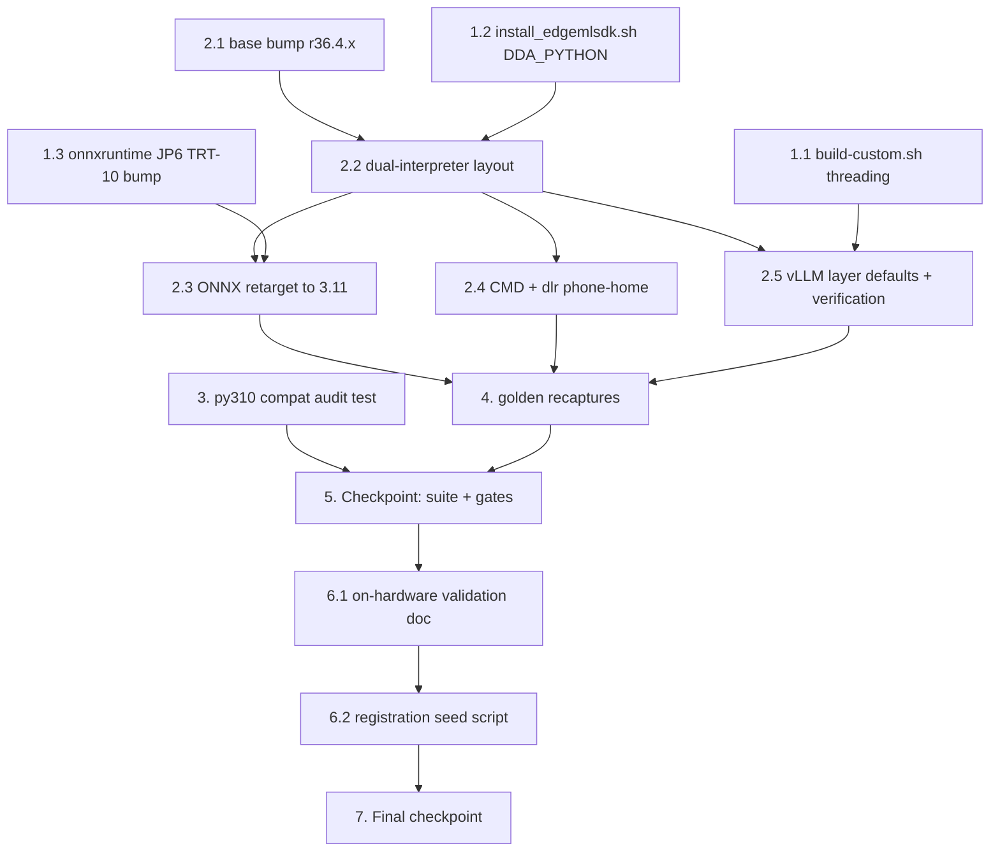

# Implementation Plan: JP6 vLLM Enablement

## Overview

Implementation lands bottom-up: build-script and install-script parameterization first (safe, default-preserving changes), then the `Dockerfile.jp6` rework in three increments (base bump, dual-interpreter layout, vLLM layer), then the new compatibility audit test, then the golden recaptures, then the on-hardware validation deliverables. Every changed shell/Docker artifact keeps JP5/x86 behavior byte-identical via defaults.

Test baselines that must stay green throughout: the device backend suite under `test/backend-test/`, the six security audit gates (`python3 test/backend-test/security/{repo_audit,secrets_audit,iam_audit,s3_squat_audit,docker_base_image_audit,dependency_audit}.py`), the preservation suite (`python3 -m pytest test/backend-test/security/preservation -p no:cacheprovider --noconftest`), the interpreter audit (`python3 test/python_version_audit.py`), and the portal backend/workflow_core/frontend suites (unchanged code — spot-check only). The full JP6 image build and everything on real hardware follow the repo convention: documented procedures executed on the arm64 build server / AGX Orin device, not automated tasks.

## Tasks

- [x] 1. Parameterize the shared build scripts (JP5/x86-preserving defaults)
  - [x] 1.1 Thread a JP6-scoped backend interpreter through `build-custom.sh`
    - Derive `BACKEND_PYTHON_VERSION` (3.10 iff `IS_JP6=1`, else `$PYTHON_VERSION`); pass it as the docker-compose `--build-arg PYTHON_VERSION` and as the `-e PYTHON_VERSION` for the in-image backend test/security-gate `docker run`; keep the edgemlsdk build on `-y "$PYTHON_VERSION"` (3.11); update the "single source of truth" comment to describe the JP6 split
    - _Requirements: 2.5_

  - [x] 1.2 Parameterize `install_edgemlsdk.sh` with `DDA_PYTHON` (default `python3.11`)
    - Replace the hardcoded `python3.11 -m pip` invocations (boto3, scikit-learn, dill, panorama wheel) with `DDA_PY="${DDA_PYTHON:-python3.11}"`; JP5/x86 callers unchanged → identical behavior; no 3.9 tokens (interpreter-audit scope)
    - _Requirements: 2.3, 3.6, 2.8_

  - [x] 1.3 Bump the JP6 onnxruntime-gpu default for TensorRT 10 in `install_onnxruntime_gpu.sh`
    - In the `JETPACK_MAJOR=6` case, bump the default `ONNXRUNTIME_VERSION` from `v1.17.1` to the TRT-10.3/CUDA-12.6-compatible tag (v1.20.1 candidate — verify against the r36.4 base's exact TensorRT/cuDNN before pinning); update the per-JetPack comment block; leave the `JETPACK_MAJOR=5` case and the gcc-10 host-compiler workaround untouched; the script's existing provider-verification step remains the build-time gate
    - _Requirements: 3.4_

- [x] 2. Rework `src/backend/Dockerfile.jp6`
  - [x] 2.1 Bump the base image to r36.4.x with digest pin
    - Resolve the current `nvcr.io/nvidia/l4t-jetpack:r36.4.0` (or newer r36.4.x) digest from NGC and replace the `FROM` line, keeping `${BASE_REGISTRY}` parameterization; leave the `cuda114` stage, the staging COPY, and the `ldconfig` fail-fast check byte-identical; update surrounding comments (CUDA 12.2 → 12.6 references)
    - _Requirements: 3.1, 3.2_

  - [x] 2.2 Install the dual-interpreter layout
    - `PYTHON_VERSION=3.10` flows through the existing deadsnakes apt line (3.10 resolves from jammy main) and the existing `update-alternatives` switch, so all existing `pip` layers retarget the DDA interpreter unchanged; add a new layer installing `python3.11 python3.11-dev python3.11-venv python3.11-distutils` + pip for 3.11; install the stub dependency set via `python3.11 -m pip` (`numpy==1.24.3 opencv-python 'scikit-learn>=1.1.3,<1.2' dlr==1.10.0 Pillow==10.3.0 dill`); add the stub-set import verification RUN (`python3.11 -c "import numpy, cv2, sklearn, dlr, PIL, dill"`); update the g-ir-scanner comment (logic unchanged — still selects distro 3.10)
    - _Requirements: 2.1, 2.4_

  - [x] 2.3 Retarget the ONNX Runtime installs to the tooling interpreter
    - CPU branch: `python3.11 -m pip install ${ONNXRUNTIME_SPEC}`; GPU branch: invoke `install_onnxruntime_gpu.sh` with `PYBIN=/usr/bin/python3.11 JETPACK_MAJOR=6`; update the layer comment to explain the OnnxRunner executes in the cp311 Triton stub
    - _Requirements: 3.4, 2.4_

  - [x] 2.4 Parameterize the entrypoint and run dlr phone-home under both interpreters
    - `CMD ["python3", "app.py"]` (the alternatives-managed DDA interpreter); run `dlr_disable_phone_home.py` under both `python${PYTHON_VERSION}` and `python3.11`; `Dockerfile.jp5`/`Dockerfile` CMDs untouched
    - _Requirements: 2.2, 3.6_

  - [x] 2.5 Implement the vLLM layer defaults, V0 pin, and verification
    - Defaults: `VLLM_ENABLE=1`, `VLLM_SPEC="vllm==0.10.2+cu126"`, `VLLM_INDEX_URL="https://pypi.jetson-ai-lab.io/jp6/cu126"`; add `ENV VLLM_USE_V1=0`; install with `--extra-index-url` and the `"numpy>=1.26,<2"` co-constraint; keep the skip branch for `VLLM_ENABLE=0`/empty spec; add the post-install verification RUN (classic-API imports `AsyncEngineArgs`/`SamplingParams`/`AsyncLLMEngine`, app-dependency import smoke `numpy cv2 gi dlr fastapi sqlalchemy awscrt.mqtt`, `pip check`) gated to run only when the layer installed; place the layer after all app-dependency layers and before the aravis build; rewrite the layer comment block for the new reality
    - _Requirements: 1.1, 1.2, 1.4, 1.5, 1.6, 1.7_

- [x] 3. Write the Python 3.10/3.11 source-compatibility audit test
  - New `test/backend-test/test_py310_compat.py`: AST syntax gate (`ast.parse(source, feature_version=(3, 10))` over every `*.py` under `src/backend`, excluding `src/backend/edgemlsdk`, including `workflow_engine/vendor`) plus a stdlib denylist gate for 3.11-only imports (`tomllib`, `asyncio.TaskGroup`/`asyncio.timeout`, `typing.Self`/`typing.LiteralString`, `enum.StrEnum`, `datetime.UTC`, `contextlib.chdir`); fix any `src/backend` source the audit flags (expected: none — the codebase predates 3.11-only features)
  - _Requirements: 2.6, 2.7_

- [x] 4. Recapture the docker preservation goldens
  - Delete `test/backend-test/security/baselines/docker_baseline_backend_Dockerfile.jp6_masked.txt` so the preservation suite recaptures it; update the `Dockerfile.jp6` default-ref entries in `docker_baseline_default_refs.json` for the new digest-pinned `FROM`; verify the `Dockerfile.jp5` and both edgemlsdk goldens are untouched (byte-identical); run the preservation suite to confirm the recaptured goldens pass
  - _Requirements: 4.1, 3.6_

- [x] 5. Checkpoint — device backend suite and all gates
  - Ensure all tests pass: the device backend suite under `test/backend-test/` (now including `test_py310_compat.py`), the six security audit gates, the preservation suite, and the interpreter audit (`python3 test/python_version_audit.py` — zero disallowed hits, scope/patterns unmodified). Ask the user if questions arise.
  - _Requirements: 4.2, 4.3, 4.5, 2.8_

- [x] 6. Write the on-hardware validation deliverables
  - [x] 6.1 Write `test/on-hardware/jp6_vllm_validation.md`
    - Stage-by-stage procedure for both models: Register LLM portal steps (Models page action, HF source, model IDs `facebook/opt-125m` / `Qwen/Qwen2.5-7B-Instruct`, exact engine settings — opt-125m: `gpu_memory_utilization=0.3`, `max_model_len=2048`; Qwen: `gpu_memory_utilization=0.5–0.6`, `max_model_len=8192` — expected `LLM (vLLM)` badge and supported architectures), package → publish → deploy to the 64 GB AGX Orin, READY propagation, non-streaming generate round trip, SSE streaming session, `llm_inference` workflow node execution with metadata verification, vision-model coexistence check; each stage with expected outcomes and failure triage (OOM → lower memory/context settings; import errors → `VLLM_USE_V1`/torch checks; READY stall → status-merge logs); include the JP6 image build steps (arm64 build server, default args) and the `VLLM_ENABLE=0` variant expectation
    - _Requirements: 5.1, 5.2, 5.3, 5.4, 5.5, 5.6_

  - [x] 6.2 Write the registration seed script
    - `test/on-hardware/register_vllm_models.py`: registers the Smoke_Model and Realistic_Model through the portal API with the engine configurations from 6.1; idempotent (skips already-registered names); portal endpoint/credentials via CLI args or env
    - _Requirements: 5.7_

- [x] 7. Final checkpoint — all baselines
  - Ensure all baselines pass: the device backend suite, the six security audit gates, the preservation suite, and the interpreter audit; spot-check the portal backend pytest (`tests/` from `edge-cv-portal/backend`), the `workflow_core` layer tests, and `npx vitest run` from `edge-cv-portal/frontend` to confirm zero portal impact; the entire pre-existing test suite must pass unchanged. Ask the user if questions arise.
  - _Requirements: 4.2, 4.3, 4.4, 4.5, 3.7_

## Task Dependency Graph



```json
{
  "waves": [
    {
      "wave": 1,
      "tasks": ["1.1", "1.2", "1.3", "2.1", "3"],
      "description": "Independent foundations: build-script threading, install-script parameterization, ONNX version bump, base image bump, and the compat audit test can all proceed in parallel"
    },
    {
      "wave": 2,
      "tasks": ["2.2"],
      "description": "Dual-interpreter Dockerfile layout builds on the base bump and the parameterized install_edgemlsdk.sh"
    },
    {
      "wave": 3,
      "tasks": ["2.3", "2.4", "2.5"],
      "description": "Dockerfile increments that depend on the dual-interpreter layout: ONNX retargeting, CMD/phone-home, and the vLLM layer"
    },
    {
      "wave": 4,
      "tasks": ["4"],
      "description": "Golden recaptures after all Dockerfile.jp6 edits are final"
    },
    {
      "wave": 5,
      "tasks": ["5"],
      "description": "Checkpoint: device backend suite, security gates, preservation suite, interpreter audit"
    },
    {
      "wave": 6,
      "tasks": ["6.1", "6.2"],
      "description": "On-hardware validation deliverables (doc, then seed script)"
    },
    {
      "wave": 7,
      "tasks": ["7"],
      "description": "Final checkpoint across all baselines"
    }
  ]
}
```

## Notes

- No property-based test tasks: the design intentionally omits Correctness Properties (build-infrastructure feature; the activated runtime logic was property-tested in vllm-triton-inference)
- Task 3 is not optional — the 3.10/3.11 source-compat audit is a required deliverable (Requirement 2.6)
- The full JP6 image build (hours: aravis, optional ONNX GPU) and everything on hardware run per the documented procedure (task 6.1), not as automated tasks — repo convention for on-hardware steps
- The exact r36.4.x digest (task 2.1) and the ONNX Runtime tag (task 1.3) are resolved and pinned at implementation time against live NGC/ORT release data
- JP5/x86 preservation is structural: `Dockerfile.jp5`, `Dockerfile`, both edgemlsdk Dockerfiles, and all portal code have zero edits; `install_edgemlsdk.sh`'s `DDA_PYTHON` default keeps JP5/x86 byte-identical in behavior
