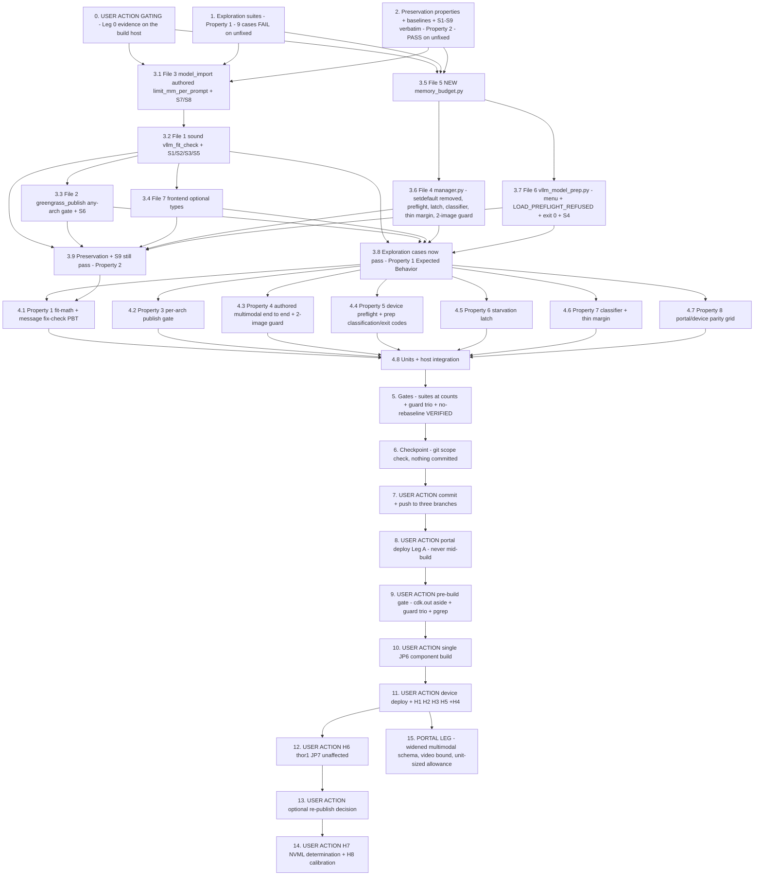

# Implementation Plan

## Overview

Fix the JP6 vLLM KV-cache OOM regression exactly as design.md specifies: remove
the unbudgeted device-side `limit_mm_per_prompt = {"image": 2}` default that
made 1.0.61 profile a vision-language engine for two images inside an unchanged
11.98 GiB budget (Decision 1), make the publish-time sizing model sound
(activation allowance + co-tenancy Fraction_Cap + honest profile semantics +
per-arch publish gate, Decision 2), stop advising the hazard (Decision 3), add a
cheap device-side preflight that reads `/proc/meminfo` and refuses a doomed load
in seconds instead of ~4 min (Decision 4), detect-and-refuse the
stranded-allocation cascade (Decision 5), and report thin margins and symptom
categories inside the existing surfaces only (Decision 6).

**Posture (binding, from design "Overview").** The fix REDUCES vLLM's demand and
makes the sizing model SOUND. It never buys KV headroom by raising
`gpu_memory_utilization` and never relocates the three co-resident ONNX GPU
models. Success is a conjunction: the published vLLM model loads and serves on
JP6 **AND** `model-cookies-binary-jetson-xavier-jp6`,
`model-rf-detr-seg-nano-jetson-xavier-jp6`,
`model-yolo-test-jetson-xavier-jp6` keep serving on GPU unchanged. Satisfying one
half at the other's expense is a failure, not a fix.

Two legs, sequenced differently by the rollout, so the fix tasks are split by
design File **and** by leg:

1. **Portal leg (Leg A, ships by portal deploy, no component build).**
   **File 3** `edge-cv-portal/backend/functions/model_import.py` (authored
   `limit_mm_per_prompt`), **File 1**
   `edge-cv-portal/backend/functions/vllm_fit_check.py` (activation allowance,
   Fraction_Cap, additive `FitFinding` fields, Decision 3 message menu),
   **File 2** `edge-cv-portal/backend/functions/greengrass_publish.py` (any-arch
   gate), **File 7** `edge-cv-portal/frontend/src/services/api.ts` (optional
   types). Cannot disturb the serving device (3.11).
2. **Device leg (Leg B, ships by ONE `aws.edgeml.dda.LocalServer.arm64JP6`
   component build).** **File 5** NEW
   `src/backend/vllm_runtime/memory_budget.py`, **File 4**
   `src/backend/vllm_runtime/manager.py` (remove the setdefault, preflight call
   site, Starvation_Latch, failure classifier, thin-margin WARNING, two-image
   request guard), **File 6** `src/backend/dda_triton/vllm_model_prep.py`
   (Decision 3 menu, `LOAD_PREFLIGHT_REFUSED` classification before
   `KV_CACHE_HINT_MARKERS`, exit 0 on preflight refusal). **This is the leg that
   restores service** — the already-published `model.json` omits
   `limit_mm_per_prompt`, so with the setdefault gone the demand is 1.0.59's
   again, with no re-package and no re-publish.

**File 8 (tests) is distributed across the test tasks**, not a task of its own.

**Intra-leg dependencies (why the fix tasks are ordered as they are).**
File 3 lands before File 1, because File 1 sizes the multimodal term from the
authored `limit_mm_per_prompt` field. File 5 lands before File 4's call site,
because the manager calls `memory_budget.evaluate_device_fit(...)`. File 2
follows File 1 (it gates on the new `FitFinding` shape); File 6 needs only File
5's exported `PREFLIGHT_REFUSED_MARKER`. The portal-leg and device-leg fix tasks
touch **disjoint files** and can run concurrently.

**Honesty guard (binding; design "Honesty Guard").** No host test loads a real
vLLM engine, allocates GPU memory, or reproduces Jetson unified-memory
accounting. Every claim that is hardware-only is a **USER ACTION** task labelled
with its H-tier (H1-H8) and **no host-side task may claim to prove GPU memory
behavior**. The host-side seams the design names are what the host tasks use: the
injected `/proc/meminfo` reader (`memory_budget.read_memory(reader=…)`), the
existing `engine_factory` injection, a fake `cache_config` object for KV
introspection, monkeypatched `requests` for the prep's 409 bodies, and
moto + the existing `FakeGreengrass` harness for the publish gate. Host tests
prove **math, messages, decision logic, classification and exit codes** —
nothing else.

**Non-goal guards (design "Explicitly NOT changed").** `vllm_runtime/
reconciler.py` and its wiring in `src/backend/app.py`
(`vllm-model-reload-after-backend-restart`'s territory); `vllm_runtime/
repository.py`, the runtime server's routes and status maps, the tombstone
contract, `ModelState.UNLOADED`, the feature-config / 409-category status maps;
`src/backend/Dockerfile.jp6` and its pins (`vllm==0.9.3+cu126`, `torch==2.8.0`,
`VLLM_USE_V1=0` — they did not move between 1.0.59 and 1.0.61 and are not the
defect); `Dockerfile.jp7` and every JP7 engine default; JP5/x86 vLLM-free
inertness; the ONNX/Triton vision path and the three JP6 ONNX model components;
`vllm-jp7-engine-cuda-init`'s `cudaErrorDevicesUnavailable` territory;
`model-gpu-fallback-visibility`'s GPU status surfaces (not duplicated, not
extended); Greengrass deployment machinery. `_reclaim_gpu_memory`'s CUDA-init
invariant is inviolable — **nothing in this plan may initialize CUDA in the
parent backend process**, and `memory_budget.py` imports no torch, no CUDA and
no vLLM. Design's claim: **no preservation-tracked file is touched → no
security-baseline rebaselines** — task 5 VERIFIES that claim rather than
assuming it.

**Nothing is committed by tasks 0-6.** Task 7 (USER ACTION) owns the commit and
the push.

Test commands:
- Portal suites run from `edge-cv-portal/backend` in the portal venv
  (`source /home/ubuntu/.venvs/dda-portal-tests/bin/activate`) **WITH** the
  suite's conftest (moto `aws_stack` fixture; Hypothesis profiles
  `portal-fast`/`ci` are conftest-registered — never hardcode `max_examples`; do
  **NOT** pass `--noconftest`), always with an **explicit file list** (whole-dir
  runs have known moto cross-contamination):
  `python3 -m pytest tests/<files> -q -p no:cacheprovider`
- Device-side suites run host-side from the repo root in the same venv (the
  flask-app image is not on this host — the established caveat; the container
  gate run happens at build time per `.kiro/steering/builds.md`):
  `PYTHONPATH=src/backend:test/backend-test python3 -m pytest test/backend-test/<dir> -q -p no:cacheprovider --noconftest`
- The Property 8 parity test imports BOTH modules, so it runs device-side with
  the portal backend on the path:
  `PYTHONPATH=src/backend:test/backend-test:edge-cv-portal/backend python3 -m pytest test/backend-test/jp6_vllm_kv_cache_oom/test_property_portal_device_parity.py -q -p no:cacheprovider --noconftest`
- Frontend from `edge-cv-portal/frontend` with the local node toolchain:
  `PATH="$HOME/.local/node/bin:$PATH" npx vitest run <file>` and
  `PATH="$HOME/.local/node/bin:$PATH" npm run build`
- Hypothesis property tests use `test_property_*.py` naming with
  `# Validates: Requirements …` comments and NO hardcoded `max_examples`
- The security guard **trio** runs host-side (the `iam` sibling guard burned a
  fleet build earlier this week when a baseline went stale — it is included
  deliberately, never assumed green):
  `python3 -m pytest test/backend-test/security/preservation/test_preservation_out_of_scope_guard.py test/backend-test/security/preservation/test_preservation_secrets_out_of_scope_guard.py test/backend-test/security/preservation/test_preservation_iam_out_of_scope_guard.py -p no:cacheprovider --noconftest -q`

New files this plan creates:
- `src/backend/vllm_runtime/memory_budget.py` (the fix — design File 5)
- `test/backend-test/jp6_vllm_kv_cache_oom/fakes.py` (suite-shared: fake
  `/proc/meminfo` reader, recording fake engine factory, fake `cache_config`,
  tmp weight trees + fake HF cache layout, crafted 409 bodies)
- `test/backend-test/jp6_vllm_kv_cache_oom/test_exploration_jp6_kv_cache_oom.py`
- `test/backend-test/jp6_vllm_kv_cache_oom/test_preservation_jp6_kv_cache_oom.py`
- `test/backend-test/jp6_vllm_kv_cache_oom/test_property_jp6_device_preservation.py`
- `test/backend-test/jp6_vllm_kv_cache_oom/test_property_device_preflight.py`
- `test/backend-test/jp6_vllm_kv_cache_oom/test_property_starvation_latch.py`
- `test/backend-test/jp6_vllm_kv_cache_oom/test_property_failure_classification.py`
- `test/backend-test/jp6_vllm_kv_cache_oom/test_property_portal_device_parity.py`
- `test/backend-test/jp6_vllm_kv_cache_oom/test_memory_budget_units.py`
- `test/backend-test/jp6_vllm_kv_cache_oom/test_integration_preflight_prep.py`
- `edge-cv-portal/backend/tests/test_jp6_kv_fit_check_exploration.py`
- `edge-cv-portal/backend/tests/test_property_jp6_fit_check_soundness.py`
- `edge-cv-portal/backend/tests/test_property_jp6_fit_preservation.py`
- `edge-cv-portal/backend/tests/test_jp6_publish_gate_per_arch.py`
- `edge-cv-portal/backend/tests/test_jp6_engine_config_multimodal.py`
- `edge-cv-portal/backend/tests/test_jp6_fit_check_units.py`
- `edge-cv-portal/backend/tests/test_jp6_kv_publish_integration.py`
- `edge-cv-portal/frontend/src/pages/ModelDetail.fitCheckTerms.test.ts`
  (the `ModelDetail.engineConfig.test.ts` convention)

## Notes

- Source-tree changes (design Fix Implementation Files 1-8): **File 1**
  `edge-cv-portal/backend/functions/vllm_fit_check.py`, **File 2**
  `edge-cv-portal/backend/functions/greengrass_publish.py`, **File 3**
  `edge-cv-portal/backend/functions/model_import.py`, **File 4**
  `src/backend/vllm_runtime/manager.py`, **File 5** NEW
  `src/backend/vllm_runtime/memory_budget.py`, **File 6**
  `src/backend/dda_triton/vllm_model_prep.py`, **File 7**
  `edge-cv-portal/frontend/src/services/api.ts` (+ `ModelDetail.tsx` only if the
  term breakdown is rendered), **File 8** tests (distributed)
- The nine **S1-S9 sibling repoints** (`vllm-sizing-and-packaging-errors`) are
  recorded **verbatim in task 2 — BEFORE the fix — so the repoint diffs are
  auditable**, and each is then repointed **in the same task as the code change
  that requires it**: S7/S8 with File 3 (task 3.1); S1/S2/S3/S5 with File 1
  (task 3.2); S6 with File 2 (task 3.3); S4 with File 6 (task 3.7). **S9
  (`test_property_fit_unverified_never_blocks.py`,
  `test_vllm_fit_check_estimation.py`) must keep passing UNTOUCHED** (preservation
  3.2). **Never weaken or delete a test.**
- `MULTIMODAL_IMAGE_INCREMENT = 1.0`, `ACTIVATION_WEIGHT_FRACTION = 0.75`,
  `CO_TENANCY_RESERVATION_BYTES['arm64_jp7'] = 8 GiB`,
  `RECLAIM_TOLERANCE_BYTES = 0.5 GiB` and `THIN_MARGIN_CONCURRENCY = 2.0x` are
  **estimates/placeholders labelled as such** (design "Open questions" 3-5). Every
  message must label the activation allowance an estimate. H8 calibrates them;
  no task may present them as measured
- The corrected model is deliberately **more conservative** and will refuse
  configurations that publish today (design Decision 2 "Stated consequence").
  That is the intended fail-closed direction; the audited `skip_fit_check`
  override is the escape hatch
- `builds.md` is binding throughout: **one component build at a time**
  (`pgrep -af "gdk component build"` and `pgrep -af "build-custom.sh"` both empty
  before dispatch), the security guard gate green BEFORE the build (never
  assumed), `cdk.out` moved aside, **never a portal deploy while a build runs**,
  on-hardware verification before an on-device change is "done"
- **Standing device warning (SUPERSEDED 2026-08-18 — the device is NO LONGER
  healthy-on-1.0.59-serving-the-model):** `ryanorinagxdevkithomelabjp622` now runs
  **LocalServer.arm64JP6 1.0.62 RUNNING** (deployment
  `904b598e-e733-47d6-a3d9-ec9dd092b6f2`, revision 77, COMPLETED) with
  `qwen2-5-vl-7b-instruct-awq` **FAILED (`preflight-refused:`, automatic retries
  exhausted after 4 attempts)** and `model-cookies-binary-jetson-xavier-jp6`,
  `model-rf-detr-seg-nano-jetson-xavier-jp6`,
  `model-yolo-test-jetson-xavier-jp6` **RUNNING**. **Preservation 3.11 no longer
  applies as a "do not disturb" guard** — it was deliberately superseded by task
  11's deployment, which is exactly what that preservation clause allowed ("until
  a fixed component is deliberately deployed"). The historical baseline it
  recorded (1.0.59, READY, `generate` 200 in ~1.9 s cold then ~0.9 s) stands as
  the *comparison* baseline, not as the current state. The known-good restore
  revision pinning 1.0.59 remains the rollback path:
  **`8b697b31-f5cf-4d09-8a58-70b3cc0afb96`** — rolling back would restore 1.0.59's
  behavior (the model loads at `gpu_memory_utilization = 0.4`, sometimes only on
  the second try, with 0.65 GiB of KV at 2.95x concurrency for 4096 tokens) and
  would re-expose the original defect. Device access: the documented SSH line
  `sshpass -p lookout ssh -o StrictHostKeyChecking=no -o UserKnownHostsFile=/dev/null -p 9998 aws@ryan.120v.ac`
  (sudo `lookout`) is **STALE — that tunnel now lands on a JetPack 7 box (R39,
  kernel 6.8.12-1021-tegra, no `/greengrass`); the JP6 device has MOVED**. The
  source-side route that exists is IoT Secure Tunneling
  (`aws.greengrass.SecureTunneling` RUNNING on the device), but this build host
  has no `localproxy` and no docker/cmake/boost to build one, so on-device
  captures currently depend on user-run commands
- Task 0 is **gating**: if the Leg 0 evidence contradicts the root-cause
  analysis, design.md is revisited **before any build** (design "Rollout shape"
  step 1). It is read-only with respect to the device — the 1.0.61 image is
  pulled **on the build host, never onto the device**
- Tasks 0 and 7-14 are USER ACTIONs (evidence on the build host, commit+push,
  portal deploy, the pre-build gate, the single JP6 build, device sessions); the
  agent prepares and verifies everything else host-side
- Nothing is committed by tasks 1-6; task 7 pushes HEAD to `spec/jetpack7-support`,
  `spec/vlm-anomaly-reference-parity` and `integration/all-specs`,
  **fast-forward only**

## Task Dependency Graph

```json
{
  "waves": [
    { "wave": 0, "description": "USER ACTION, GATING: Leg 0 evidence on the BUILD HOST (re-pull flask-app:1.0.61, grep limit_mm_per_prompt in /vllm_runtime/manager.py, pip freeze diff vs the on-device 1.0.59 set). Read-only w.r.t. the device. If it contradicts the root cause, design.md is revisited before any build.", "tasks": ["0"] },
    { "wave": 1, "description": "Exploration + preservation on the UNFIXED tree: the 9 exploration cases surface the bug-condition counterexamples (FAIL expected); the preservation properties, recorded baselines and the S1-S9 verbatim originals are observed and recorded (PASS required).", "tasks": ["1", "2"] },
    { "wave": 2, "description": "Fix, first ring - disjoint files, portal and device legs concurrent: File 3 authored limit_mm_per_prompt (+ S7/S8) and NEW File 5 memory_budget.py.", "tasks": ["3.1", "3.5"] },
    { "wave": 3, "description": "Fix, second ring: File 1 sound Fit_Check (needs File 3's authored field; + S1/S2/S3/S5), File 4 manager (needs File 5's evaluate_device_fit), File 6 prep (needs File 5's PREFLIGHT_REFUSED_MARKER; + S4). All three touch disjoint files.", "tasks": ["3.2", "3.6", "3.7"] },
    { "wave": 4, "description": "Fix, third ring: File 2 any-arch publish gate (needs File 1's FitFinding shape; + S6) and File 7 frontend optional types.", "tasks": ["3.3", "3.4"] },
    { "wave": 5, "description": "Verify the flips: the 9 exploration cases now PASS on the fixed tree; the preservation suites + S9 still PASS at their recorded baselines.", "tasks": ["3.8", "3.9"] },
    { "wave": 6, "description": "Fix-checking suites at design Properties 1, 3, 4, 5, 6, 7, 8 plus units and host integration.", "tasks": ["4.1", "4.2", "4.3", "4.4", "4.5", "4.6", "4.7", "4.8"] },
    { "wave": 7, "description": "Gates (new suites at their counts, repointed siblings, untouched S9, the device suites at their current baselines, frontend touched suites + full vitest + npm run build, security guard trio, and the VERIFIED no-rebaseline claim) then the checkpoint git scope check. NOTHING committed.", "tasks": ["5", "6"] },
    { "wave": 8, "description": "USER ACTION: commit + push HEAD to spec/jetpack7-support, spec/vlm-anomaly-reference-parity, integration/all-specs (fast-forward only).", "tasks": ["7"] },
    { "wave": 9, "description": "USER ACTION, rollout step 2: portal deploy of Leg A - ONLY when no component build is running.", "tasks": ["8"] },
    { "wave": 10, "description": "USER ACTION, rollout steps 3-4: move cdk.out aside + guard trio green + pgrep clear, then the SINGLE JP6 component build (gdk-config.json = aws.edgeml.dda.LocalServer.arm64JP6, restored afterwards).", "tasks": ["9", "10"] },
    { "wave": 11, "description": "USER ACTION, rollout step 5 [HARDWARE]: deploy the fixed LocalServer to ryanorinagxdevkithomelabjp622 and run H1, H2, H3, H5 (+H4 if safely inducible), with rollback to 1.0.59 if H1 or H2 fails.", "tasks": ["11"] },
    { "wave": 12, "description": "USER ACTION, rollout step 6 [HARDWARE]: H6 on thor1 - JP7 unaffected.", "tasks": ["12"] },
    { "wave": 13, "description": "USER ACTION, rollout steps 7-8: the optional re-publish decision, then the H7 NVML-assert determination and H8 activation-allowance calibration follow-ups.", "tasks": ["13", "14"] },
    { "wave": 14, "description": "PORTAL LEG (no component build, no deploy, no device): widen the limit_mm_per_prompt schema to per-modality keys, default the video bound to 0, size the activation allowance from TOTAL multimodal units, repoint S5/S7/S8 and the Property 8 parity dimension. Forced by task 11's ninth OUTCOME block: the only configuration measured to serve could not be authored.", "tasks": ["15"] }
  ]
}
```



## Tasks

- [x] 0. USER ACTION (GATING): Leg 0 evidence — settle the two open 1.0.61 questions on the BUILD HOST (design "Rollout shape" step 1, "The 1.0.61 image question", Open question 2)
  - **GATING**: no fix task may be declared final and **no component build may start** until this task's answer is recorded. If it CONTRADICTS the root-cause analysis (e.g. a floated dependency also moved between 1.0.59 and 1.0.61), **design.md is revisited before any build** — the fix direction (remove the unbudgeted default, make the sizing model sound) is correct either way, but the *explanation* changes and this plan is re-scoped rather than continued
  - **Read-only w.r.t. the device**: pull the image **on the build host, NEVER onto the device**. `ryanorinagxdevkithomelabjp622` stays HEALTHY on 1.0.59 serving the model (3.11) — no deployment, no container restart, no state change
  - On the build host: `docker pull 164152369890.dkr.ecr.us-east-1.amazonaws.com/dda/flask-app:1.0.61` (ECR login first), then inspect the pruned-from-device image in a throwaway container
  - **Question 1 — the setdefault**: `grep -c limit_mm_per_prompt /vllm_runtime/manager.py` inside the 1.0.61 image. Expected **≥ 1** (commit `086c251` is an ancestor of `652c7bf` which built 1.0.61); the running 1.0.59 container provably answers **0**. A `0` here refutes hypothesis 1 outright
  - **Question 2 — the dependency set**: `pip freeze` inside 1.0.61 diffed against the on-device 1.0.59 set (`transformers>=4.51.1,<5` and `numpy>=1.26,<2` float; all PyPI transitive deps float; the Jetson index can republish a wheel under the same version string). Confirm/refute that `vllm 0.9.3 / torch 2.8.0 / cuda 12.6` are identical, and record every moved package
  - Record both answers verbatim in this task's OUTCOME, plus the disposition: *root cause confirmed* → proceed, or *contradicted* → revisit design.md
  - Optional, read-only only if needed: device evidence via `sshpass -p lookout ssh -o StrictHostKeyChecking=no -o UserKnownHostsFile=/dev/null -p 9998 aws@ryan.120v.ac` (sudo `lookout`) — `docker logs`, `docker exec` greps, `free`, `ps`, GET endpoints only
  - Prune the pulled image from the build host afterwards (build-host disk discipline)
  - _Requirements: 1.4, 2.4 (evidence for), design Open question 2_

- [x] 1. Write bug condition exploration test suites (BEFORE implementing the fix)
  - **Property 1: Bug Condition** - Unsound Fit_Check verdict, unbudgeted multimodal default, absent device preflight
  - **CRITICAL**: all 9 cases MUST FAIL on the unfixed tree — failure confirms the bug condition exists
  - **DO NOT attempt to fix the tests or the code when they fail**
  - **NOTE**: these suites encode the expected behavior — they validate the fix when they pass after implementation (task 3.8)
  - **GOAL**: surface the counterexamples of defects 1.1-1.10 on the UNFIXED tree, host-side only. **Honesty guard**: every case is GPU-free — no real vLLM engine, no GPU allocation, no Jetson unified-memory simulation. Memory is INJECTED via a fake `/proc/meminfo` reader; the engine is the existing `engine_factory` seam; KV sizing is a fake `cache_config`
  - **Scoped PBT approach**: cases 1-3 are scoped to the concrete incident arithmetic (`arm64_jp6`, `util = 0.4`, 6.5 GiB weights — the deterministic failing point) so they are reproducible; the generated-input versions land as fix-checking properties in tasks 4.1-4.2
  - Create the portal-side exploration suite `edge-cv-portal/backend/tests/test_jp6_kv_fit_check_exploration.py` and the device-side suite `test/backend-test/jp6_vllm_kv_cache_oom/test_exploration_jp6_kv_cache_oom.py` plus the suite-shared `test/backend-test/jp6_vllm_kv_cache_oom/fakes.py` (fake `/proc/meminfo` reader with crafted `MemTotal`/`MemAvailable`; recording fake engine factory + a factory that raises to simulate a failed load; fake `cache_config` exposing `num_gpu_blocks`/`block_size`; tmp weight trees and a fake `models--{org}--{name}` HF cache layout; crafted 409 bodies for the prep)
  - Case 1 — **Incident replay, fit math (1.1)**: `evaluate_fit({'gpu_memory_utilization': 0.4}, 6.5 GiB, ['arm64_jp6'])` must report `fits = False`. FAILS on unfixed code: it returns `fits = True` with `required_bytes = 7.5 GiB` and a claimed 4.50 GiB of slack against a device-measured **−7.83 GiB** remainder
  - Case 2 — **Co-tenancy hazard (1.2, 1.3)**: `util = 0.9` on `arm64_jp6` must not be reported as fitting (`0.9 > cap 0.80`), and no message may advise raising the fraction above the cap. FAILS on unfixed code
  - Case 3 — **Per-arch escape (1.8)**: a record failing `arm64_jp6` while passing `arm64_jp7` must be refused with **422**. FAILS on unfixed code: `every_arch_fails = all(not finding.fits …)` lets it publish with `warnings`
  - Case 4 — **Multimodal default (1.4)**: `manager.load` with staged args omitting `limit_mm_per_prompt` must leave the recorded engine args **without the key**. FAILS on unfixed code: the recorded args contain `{"image": 2}` (commit `086c251`)
  - Case 5 — **Preflight absence (1.10, 2.9)**: with an injected reading of **3 GB available**, `load` must refuse before the engine factory is called. FAILS on unfixed code: no check exists and the factory is called
  - Case 6 — **Starvation (1.5, 2.5)**: two consecutive failing loads with injected readings that do NOT recover must set the Starvation_Latch and refuse the second. FAILS on unfixed code: no latch exists
  - Case 7 — **Thin margin (1.7, 2.7)**: a fake engine reporting KV bytes below `MINIMUM_KV_CACHE_BYTES` (the observed 0.65 GiB against the 1 GiB floor) must produce a **WARNING**. FAILS on unfixed code: only the READY INFO line exists
  - Case 8 — **Symptom classification (1.6, 2.6)**: an NVML-assert reason and a KV-cache reason must carry **different** category tokens (`allocator-nvml-fault:` vs `kv-cache-exhaustion:`). FAILS on unfixed code: both are raw reasons
  - Case 9 — **Edge case, two-image request (2.4, 3.9)**: a reference-image request against a model with `limit_mm_per_prompt.image = 1` must raise `GenerationError` naming the limit and the remediation. May fail differently today (the engine is invoked and fails deeper, or the setdefault silently profiles for 2) — record exactly how
  - Run portal cases from `edge-cv-portal/backend` WITH conftest (explicit file list); device cases host-side with `--noconftest` (commands in Test commands above)
  - **EXPECTED OUTCOME**: all 9 cases FAIL (this is correct — it proves the bug condition exists)
  - Document the counterexamples: the fit verdict disagreeing with the device's measured remainder by ~12 GiB; the publish gate admitting a JP6-infeasible record; the injected `{"image": 2}` in the recorded engine args; the engine factory being called with 3 GB available. **If a case does not fail as predicted** (e.g. a different default resolution order in `parse_repository`, or an engine-arg shape this design assumed wrongly), **re-hypothesize before writing the fix** — do not adjust the test to match the code
  - Mark complete when the suites are written, run, and the failures are documented
  - _Requirements: 1.1, 1.2, 1.3, 1.4, 1.5, 1.6, 1.7, 1.8, 1.10_

- [x] 2. Write preservation property tests + record baselines and the S1-S9 verbatim originals (BEFORE implementing the fix)
  - **OUTCOME (2026-08-18, host-side, venv `/home/ubuntu/.venvs/dda-portal-tests`, `-p no:cacheprovider`): ALL THREE SUITES PASS ON THE UNFIXED TREE — 44 passed, 11 skipped; no production file touched, nothing committed.** Per file:
    - `edge-cv-portal/backend/tests/test_property_jp6_fit_preservation.py` (from `edge-cv-portal/backend`, **WITH** conftest): **19 passed, 5 skipped** — also green under `HYPOTHESIS_PROFILE=ci` (19 passed, 5 skipped), confirming the properties hold at the larger budget. NO hardcoded `max_examples` anywhere (`@settings(deadline=None)` only; budget from the conftest-registered `portal-fast`/`ci` profiles). Reuses the sibling generators verbatim by import: `engine_configurations()`, `estimates()`, `_architecture_sets`, `format_gib` from `tests/test_property_fit_check_decision.py`
    - `test/backend-test/jp6_vllm_kv_cache_oom/test_preservation_jp6_kv_cache_oom.py` (host-side, `--noconftest`): **18 passed, 5 skipped**
    - `test/backend-test/jp6_vllm_kv_cache_oom/test_property_jp6_device_preservation.py` (host-side, `--noconftest`): **7 passed, 1 skipped** (`@settings(deadline=None)`, no `max_examples` — the `vllm_model_reload` device-suite convention; the two prep properties patch inside a per-example `pytest.MonkeyPatch.context()` rather than the function-scoped fixture, so Hypothesis re-runs them from clean module state)
    - Combined device pair: **25 passed, 6 skipped**. Combined portal file + all S5-S9 files in ONE run: **48 passed, 5 skipped** (19 new + 29 sibling) — no moto cross-contamination, S5-S9 untouched and unaffected
  - **The 11 skips are all deliberate and reported (`-rs`), never silent.** 5 fixed-shape legs that BIND at task 3.9: portal `ENGINE_DEFAULTS['limit_mm_per_prompt'] == {'image': 1}` (task 3.1) and the additive `FitFinding` terms agreeing with the recorded corrected arithmetic (task 3.2); device `memory_budget.PREFLIGHT_REFUSED_MARKER == "preflight-refused:"` + its no-torch/no-CUDA/no-vLLM source check (task 3.5), `vllm_model_prep.LOAD_PREFLIGHT_REFUSED` (task 3.7), and the PBT "no key is ever injected" leg (task 3.6). 6 **[HARDWARE] DEFERRED** legs declared as skipped tests whose reason names the H-tier and owning task (they raise `AssertionError` if ever executed host-side, so they cannot be silently faked): H6 JP7/thor1 → task 12 (both halves), H2 the three ONNX co-tenants → task 11 (both halves), 3.11 the 1.0.59 device staying healthy → tasks 11-12 (both halves)
  - **Preservation legs encoded, per the task's bullet list.** *(3.1 fitting record)* PBT over the sibling generators: `fits = True` for every architecture that fits under BOTH models, `budget_bytes == int(util × profile[arch])` identity, one finding per profiled architecture in input order with unprofiled archs skipped, the five original `FitFinding` fields keeping their names/types through `asdict`, and the never-lower invariant asserted on EVERY message (passing and failing); plus the moto publish leg: **200**, `published_components` + `message` shape, `fit_check.status == 'passed'` with estimate + per-arch findings, an audit event, and no `skip_fit_check` marker. *(3.2 unverified)* `estimate_weights` returns `None` (never raises) over a PBT of hostile record shapes with BOTH injected fetchers exploding; the module carries no `boto3`/`botocore` import and keeps its public names; publish with `estimate is None` → **200**, `status 'unverified'`, `estimate: None`, `findings == []`, documented message. *(3.3 five keys + verbatim `model.json`)* the five pre-existing defaults pinned by value (`dtype=auto`, `gpu_memory_utilization=0.5`, `max_model_len=2048`, `tensor_parallel_size=1`, `enforce_eager=True`), overlay resolution PBT, unknown-key fail-closed PBT with the per-field reason, 8 parametrized out-of-range arms each keeping its reason text, and the recorded `model.json` baseline asserted BOTH parsed and as the exact `json.dumps(..., indent=2)` lines. *(3.8 prep)* exit codes 0/1/1, the `LOAD_UNREACHABLE` diagnostic elements, the KV-OOM unload→reload recovery firing **exactly once** (`load, unload, load`) with the success arm returning `LOAD_OK`, non-KV errors staying single-attempt, the prominent ERROR line's elements, reason extraction, idempotent `--cleanup`, verbatim staging; generalized by PBT over generated staged args, generated KV/non-KV reasons and generated bodies. *(3.7 reconciler)* `reconciler.py` sha256 pinned + `(30, 120, 480)` + the no-op line + the `app.py` wiring lines. *(2.7 inverse healthy load)* no WARNING at all and the byte-identical `vLLM model '<name>' is READY` line, generalized by PBT over ample KV geometries. *(3.9 two-image)* the authored `{"image": 2}` model still builds the labelled two-pad prompt with the two-element image list and the limit reaching the engine verbatim; single-image and text-only paths pinned. *(3.4 JP7 host half)* `util = 0.5`, 16 GiB weights → `budget = 60.00 GiB`, corrected `required = 29.00 GiB`, `0.5 ≤ cap 0.9333`, `fits = True` under both models
  - **Non-bug-condition scope (why this is preservation and not a frozen bug)**: the corrected model's arithmetic (design Decision 2 — `ACTIVATION_FLOOR_BYTES = 2 GiB`, `ACTIVATION_WEIGHT_FRACTION = 0.75`, `MULTIMODAL_IMAGE_INCREMENT = 1.0`, `CO_TENANCY_RESERVATION_BYTES` jp6 6 GiB / jp7 8 GiB) is defined LOCALLY in the portal file as `fits_under_corrected_model(...)`, because the unfixed tree exports none of it. Since `required_corrected ≥ required_shipped` and the budget is untouched, "fits under the corrected model" ⟹ "fits under the shipped model", so every assertion holds on BOTH trees by construction. Task 4.7's parity test is what pins the shipped constants to these values after the fix. `arm64_jp5` co-tenancy is a test-local 6 GiB (design names only jp6/jp7) — conservative, so it can only shrink the asserted scope
  - **RECORDED BASELINE COUNTS (the counts the task-5 gates must reproduce)**:
    - NEW portal file `tests/test_property_jp6_fit_preservation.py`: **19 passed, 5 skipped**
    - NEW device dir `test/backend-test/jp6_vllm_kv_cache_oom` (whole dir, `--noconftest`): **7 failed, 25 passed, 6 skipped** — the 7 failures are task 1's exploration cases 4-9, EXPECTED to fail on the unfixed tree (they flip at task 3.8); the 25 passed + 6 skipped are task 2's two files
    - Task-1 portal exploration `tests/test_jp6_kv_fit_check_exploration.py`: **4 failed** (expected; flips at task 3.8)
    - **S5** `tests/test_property_fit_check_decision.py`: **1 passed** · **S6** `tests/test_vllm_publish_fit_gate.py`: **3 passed** · **S7** `tests/test_property_engine_config_update_roundtrip.py`: **1 passed**, `tests/test_property_engine_config_invalid_updates.py`: **1 passed** · **S8** `tests/test_vllm_engine_config_detail_and_audit.py`: **4 passed** · **S9** `tests/test_property_fit_unverified_never_blocks.py`: **3 passed**, `tests/test_vllm_fit_check_estimation.py`: **16 passed** (S9 stays UNTOUCHED)
    - `test/backend-test/vllm_runtime` + `test/backend-test/vllm_runtime_tests` (`--noconftest`, one run): **29 passed**
    - `test/backend-test/vllm_model_reload` (`--noconftest`): **45 passed** (the reconciler suite — 3.7's baseline)
    - `test/backend-test/dda_triton` (prep): the two prep files `test_vllm_load_failure_log.py` + `test_property_load_failure_reason.py` = **20 passed**, and they must run **WITH** the repo conftest (they use its class-bound `caplog` fixture; with `--noconftest` 9 of the 20 fail on `self.caplog` — a harness caveat, NOT a regression). **Whole-dir `test/backend-test/dda_triton` does NOT collect host-side: 10 collection errors, all `ModuleNotFoundError: No module named 'google'`** (tritonclient's protobuf dep is absent from this host venv) — the container run at build time per `.kiro/steering/builds.md` is the authoritative gate for that directory
    - `test/backend-test/text_generation` (`--noconftest`): **15 passed** · `test/backend-test/deploy_reliability` (`--noconftest`): **72 passed**
    - Frontend (from `edge-cv-portal/frontend`, `PATH="$HOME/.local/node/bin:$PATH" npx vitest run`): `src/pages/ModelDetail.engineConfig.test.tsx` **4 passed**; `ModelDetail.vllmPublish.integration.test.tsx` + `ModelDetail.compilationFallback.test.tsx` **7 passed** (2 files). Note the touched-suite extensions are **`.tsx`**, not `.ts` — task 3.4's new `ModelDetail.fitCheckTerms.test.ts` should follow the existing `.tsx` convention
    - Pinned source hashes (sha256, unfixed tree): `src/backend/vllm_runtime/reconciler.py` **2bb6f6d37609e6f7623c25107eacead067af8bf617fec6dbb1f4343e7d1c9f32** (asserted by the test — this spec may not touch it), `src/backend/vllm_runtime/manager.py` 05a407115063a8b0ac70cd2c337dc014e49abf428bea255a69ddb54a18547186, `src/backend/dda_triton/vllm_model_prep.py` 9f3b148a19c9f91e2bdd389428437246deabf8d533c08c0477951f196f7271b9, `edge-cv-portal/backend/functions/vllm_fit_check.py` 839f02bbf2b8b5c840943d94b671363887b86be3558b5555adcd31bee806d976 (the last three are recorded for diff auditing only — they are the files the fix changes)
  - **S1-S9 SIBLING ORIGINALS, RECORDED VERBATIM BEFORE ANY CODE CHANGE** (so every repoint diff in tasks 3.1-3.3/3.7 is auditable):
    - **S1** — `.kiro/specs/vllm-sizing-and-packaging-errors/requirements.md`, Requirement 3 acceptance criterion **1** (line 87): "WHEN a Fit_Check is evaluated for a vLLM_Model_Record and a Target_Architecture, THE Portal SHALL compute the GPU memory budget as `gpu_memory_utilization` × the Device_Memory_Profile entry for that Target_Architecture and compare it against Weight_Estimate + Minimum_KV_Cache." · criterion **6** (line 92): "IF the Fit_Check fails for every supported Target_Architecture at model package/publish time, THEN THE Model_Publisher SHALL fail the publish before any component registration with HTTP 422 and a message stating the Weight_Estimate, the configured `gpu_memory_utilization`, the per-architecture memory budget, and the remediation (raise `gpu_memory_utilization`, reduce `max_model_len`, or choose a smaller model)."
    - **S2** — same file, criterion **8** (line 94): "THE Portal SHALL maintain the Device_Memory_Profile as a per-Target_Architecture table in code with at least an `arm64_jp6` entry of 30 GiB usable memory, and every Fit_Check message SHALL name the profile entry used."
    - **S3** — same file, criterion **9** (line 95): "WHEN a Fit_Check produces a failing finding, THE Portal SHALL phrase the finding with the correct remediation direction (the weights do not fit inside the configured fraction, so `gpu_memory_utilization` must be raised or the model shrunk — never advise lowering it for this failure mode)."
    - **S4** — same file, Requirement 4 criterion **2** (line 104): "IF the extracted reason indicates insufficient KV-cache memory (e.g. \"No available memory for the cache blocks. Try increasing gpu_memory_utilization\"), THEN THE Model_Prep_Script SHALL append an actionable remediation to the ERROR line naming the `gpu_memory_utilization` and `max_model_len` engine settings and stating that the value must be raised or the model reduced."
    - **S5** — `edge-cv-portal/backend/tests/test_property_fit_check_decision.py`, `test_fit_decision_correctness` (decorated `@settings(max_examples=100, deadline=None)` at line 98). Line 123: `required_bytes = estimate_bytes + MINIMUM_KV_CACHE_BYTES`. Lines 133-137: `assert finding.required_bytes == required_bytes, (f"{finding.arch}: required {finding.required_bytes} != " f"estimate {estimate_bytes} + min KV cache " f"{MINIMUM_KV_CACHE_BYTES}")`. Line 139: `expected_fits = budget_bytes >= required_bytes` followed by `assert finding.fits is expected_fits`. Line 130: `budget_bytes = int(float(utilization) * profile_bytes)`. Lines 159-162: `assert re.search(r"raise\s+gpu_memory_utilization", finding.message, re.IGNORECASE), (f"{finding.arch}: failing message must advise raising " f"gpu_memory_utilization: {finding.message!r}")`. Lines 163-168 — **KEPT, never weakened**: `assert not re.search(r"(lower|decrease|reduce)\w*\s+" r"gpu_memory_utilization", finding.message, re.IGNORECASE), (f"{finding.arch}: failing message must never advise " f"lowering gpu_memory_utilization: {finding.message!r}")`. Also asserted today and to be preserved: `[f.arch for f in findings] == profiled`, `finding.arch in finding.message`, `format_gib(budget_bytes) in finding.message`, `format_gib(estimate_bytes) in finding.message`
    - **S6** — `edge-cv-portal/backend/tests/test_vllm_publish_fit_gate.py:286` `def test_all_arch_failure_blocks_publish_with_422(pub_env, seeded, monkeypatch):` — asserts `response["statusCode"] == 422`, `body["fit_check"]["status"] == "failed"`, `findings` non-empty with `all(finding["fits"] is False …)`, `body["fit_check"]["estimate"]["total_bytes"] == 100 * GIB`, `"raise gpu_memory_utilization" in body["error"]`, `"lower" not in body["error"].lower()`, `seeded.gg.created == []`, the record untouched (`"published_component" not in stored`, `"component_name" not in stored`, `"published" not in stored`, `"published_components" not in stored`, `stored["updated_at"] == record["updated_at"]`) and nothing exposed to deployments. **This case must keep passing after the any-arch widening.**
    - **S7** — `edge-cv-portal/backend/tests/test_property_engine_config_update_roundtrip.py:38-39`: `KNOWN_ENGINE_KEYS = ("dtype", "gpu_memory_utilization", "max_model_len",` / `                       "tensor_parallel_size", "enforce_eager")`, with the drift guard at **line 64**: `assert set(model_import.ENGINE_DEFAULTS) == set(KNOWN_ENGINE_KEYS)`; the same tuple at `test_property_engine_config_invalid_updates.py:34-35` with its guard at **line 59**: `assert set(model_import.ENGINE_DEFAULTS) == set(KNOWN_ENGINE_KEYS)`. The roundtrip file additionally asserts `set(returned) == set(KNOWN_ENGINE_KEYS)` (line 248), `set(stored_after) == set(KNOWN_ENGINE_KEYS)` (line 262) and `set(detail) == set(KNOWN_ENGINE_KEYS)` (line 274) — all four/five sites move together when `limit_mm_per_prompt` is added in task 3.1
    - **S8** — `edge-cv-portal/backend/tests/test_vllm_engine_config_detail_and_audit.py:155-158`: `def assert_config_equals(expected, actual):` / `"""Numeric equality across the Decimal/JSON representations."""` / `assert set(actual) == set(expected), (f"expected settings {sorted(expected)}, got {sorted(actual)}")`, applied to the resolved configuration at lines 184-185, 257-258 and 261-262. The expected literal it compares against, lines 36-42: `STORED_ENGINE_CONFIGURATION = {"dtype": "bfloat16", "gpu_memory_utilization": Decimal("0.3"), "max_model_len": 4096, "tensor_parallel_size": 1, "enforce_eager": True}` — task 3.1 adds `limit_mm_per_prompt: {"image": 1}` to it
    - **S9** — `edge-cv-portal/backend/tests/test_property_fit_unverified_never_blocks.py` **3 passed** and `tests/test_vllm_fit_check_estimation.py` **16 passed** on the unfixed tree. **Both stay UNTOUCHED and must keep passing at exactly these counts.**
  - **DEVIATIONS from the task's predictions (all recorded, none silently adjusted)**:
    1. **The single-image `multi_modal_data` shape is NOT a one-element list.** Observed in `manager._build_multimodal_prompt`: without a reference the value is a BARE PIL image (`{"image": pil_image}`); the two-element list form appears only for the two-image reference prompt (`{"image": [pil_image, pil_reference]}`). The test records the observed shape (a first draft asserting a list failed with `TypeError: object of type 'PngImageFile' has no len()`) — the code was not touched.
    2. **The 3.3 "byte-identical `model.json`" baseline had to be scoped, not frozen whole.** Task 3.1 adds `limit_mm_per_prompt` to the resolved configuration, so the whole-file text necessarily changes; the pin is therefore the five pre-existing keys plus `model`, asserted both parsed AND as the exact serialized lines (`  "dtype": "auto"`, `  "gpu_memory_utilization": 0.5`, `  "max_model_len": 4096`, `  "tensor_parallel_size": 1`, `  "enforce_eager": true`, `  "model": "example/small-llm"`). Same reasoning for `ENGINE_DEFAULTS`: this suite asserts the five keys SUBSET-wise; the key-set-equality drift guard stays S7's job.
    3. **The `dda_triton` prep suite cannot be baselined the way the plan's device command implies.** `--noconftest` breaks 9 of its 20 tests (they use the repo conftest's class-bound `caplog`), and the whole directory does not collect on this host at all (10 × `ModuleNotFoundError: No module named 'google'`). Recorded above; the task-5 gate must run the two prep files WITH conftest, and the container run stays the authoritative gate.
    4. **Frontend touched-suite files are `.tsx`, not `.ts`** (`ModelDetail.engineConfig.test.tsx`), so task 3.4's planned `ModelDetail.fitCheckTerms.test.ts` should be `.tsx` to match the convention it cites.
    5. **Two device PBTs could not use the `monkeypatch` fixture** (Hypothesis' `function_scoped_fixture` health check, correctly firing): they patch inside `pytest.MonkeyPatch.context()` per example instead. The three fixture-using PBTs that only need `tmp_path` suppress that health check explicitly and derive a distinct `tmp_path` subdirectory per example.
    6. **No task-1 OUTCOME block exists in this tasks.md** (tasks 0 and 1 are ticked and their suites are committed in `fca417c`, whose commit message carries the narrative). Nothing was back-filled here — this OUTCOME covers task 2 only.
  - **Scope check**: `git status --short` shows exactly three new untracked files (the two device suites + the portal suite) and this tasks.md edit; `git diff --stat -- src edge-cv-portal/backend/functions` is EMPTY — no production code touched, no part of task 3's fix implemented, nothing committed, no component build or portal deploy started (`pgrep -af "gdk component build"` and `pgrep -af build-custom.sh` both empty at 01:38Z before writing). The serving device was not contacted at all (3.11 intact)
  - **Property 2: Preservation** - Non-buggy inputs are byte-identical
  - **IMPORTANT**: observation-first methodology — run the UNFIXED code on non-bug-condition inputs, record the actual outputs as baselines/reference implementations, then encode them as property-based tests that PASS on the unfixed tree and must keep passing. Property-based testing is used deliberately: the preserved surface is a wide input space (arbitrary utilizations, weights, arch sets, engine-config overlays) where hand-picked examples miss edge cases, and the sibling suite already establishes the generators (`engine_configurations()`, `estimates()`, `_architecture_sets`) — reusing them keeps the two specs' guarantees comparable
  - Create `edge-cv-portal/backend/tests/test_property_jp6_fit_preservation.py` (portal half, WITH conftest, Hypothesis via the conftest-registered profiles — no hardcoded `max_examples`) and `test/backend-test/jp6_vllm_kv_cache_oom/test_preservation_jp6_kv_cache_oom.py` + `test_property_jp6_device_preservation.py` (device half, `--noconftest`)
  - Observe on the UNFIXED code and encode (design "Preservation Checking" list):
    - **Fitting record (3.1)**: a record that fits under both the old and the new model keeps `fits = True`, status `passed`, identical `budget_bytes`, and publishes with the same response shape, `fit_check` annotation and audit events
    - **Unverified estimate (3.2)**: registration, update and publish all still proceed with `unverified` and no findings; `estimate_weights` still never raises out of its public API and stays stdlib-only with no AWS dependencies
    - **Five existing engine settings (3.3)**: `ENGINE_DEFAULTS` key set and values (`dtype=auto`, `gpu_memory_utilization=0.5`, `max_model_len`, `tensor_parallel_size`, `enforce_eager`), fail-closed rejection of unknown keys and out-of-range values with per-field findings, and **verbatim propagation into the packaged `model.json`** — record the staged `model.json` for the five pre-existing keys as the byte-identical baseline
    - **Prep exit codes (3.8)**: `LOAD_OK` → 0, `LOAD_UNREACHABLE` → 1 with its authoritative diagnostic, `LOAD_HTTP_ERROR` → 1; the single KV-OOM unload→reload recovery still fires **exactly once** for a genuine KV-OOM reason; the prominent ERROR line still carries model name, HTTP status, extracted reason and the staged `gpu_memory_utilization` / `max_model_len`; idempotent Shutdown/`--cleanup`
    - **Reconciler (3.7)**: `src/backend/vllm_runtime/reconciler.py` and its wiring in `app.py` are untouched — pin the module source hash and record the existing suite's baseline counts (`test/backend-test/vllm_model_reload`), including the no-op line `vLLM reconciler: no staged models awaiting reload; nothing to do`
    - **Healthy load (2.7 inverse)**: a fake engine with ample KV produces **no** thin-margin warning and the byte-identical READY log line
    - **Two-image model (3.9)**: a model authored with `limit_mm_per_prompt.image = 2` builds the two-image prompt exactly as today; a text-only model's behavior is unaffected by any multimodal change
    - **JP7 record (3.4)**: a JP7 record within its headroom keeps `fits = True` under both models (`util = 0.5`, ~16 GiB weights: `budget = 60.00`, `required = 29.00`, `0.5 ≤ 0.933`) — the host-provable half; the device half is **[HARDWARE] H6**
    - **[HARDWARE] legs recorded as deferred, not silently skipped**: `JP7Load(X) = JP7Load'(X)` → H6 (task 12); `OnnxLoad(X) = OnnxLoad'(X)` → H2 (task 11); the 1.0.59 device staying healthy → 3.11 (tasks 11-12)
  - **Record the S1-S9 sibling originals VERBATIM in this task's OUTCOME, before any code changes**, so every repoint diff in tasks 3.1-3.3/3.7 is auditable:
    - **S1** `vllm-sizing-and-packaging-errors/requirements.md` R3.1 / R3.6 — the decision + message contract (`fits = gpu_memory_utilization * DEVICE_MEMORY_PROFILE_BYTES[arch] >= weight_estimate + MINIMUM_KV_CACHE_BYTES`)
    - **S2** same, R3.8 — the `arm64_jp6` 30 GiB "usable memory" wording and the name-the-profile-entry rule
    - **S3** same, R3.9 — "must be raised or the model shrunk — never advise lowering it for this failure mode"
    - **S4** same, R4.2 — the device-side hint "…stating that the value must be raised or the model reduced"
    - **S5** `edge-cv-portal/backend/tests/test_property_fit_check_decision.py:101` — `assert finding.required_bytes == required_bytes` with `required_bytes = estimate_bytes + MINIMUM_KV_CACHE_BYTES`, `expected_fits = budget_bytes >= required_bytes`, the `raise\s+gpu_memory_utilization` search **and the negative `(lower|decrease|reduce)\w*\s+gpu_memory_utilization` assertion (which is KEPT — the new message must still never advise lowering the fraction)**
    - **S6** `edge-cv-portal/backend/tests/test_vllm_publish_fit_gate.py:286` `test_all_arch_failure_blocks_publish_with_422` — the all-arch → 422 case, which must keep passing
    - **S7** `edge-cv-portal/backend/tests/test_property_engine_config_update_roundtrip.py:36-64` and `test_property_engine_config_invalid_updates.py:59` — `KNOWN_ENGINE_KEYS = ("dtype", "gpu_memory_utilization", "max_model_len", "tensor_parallel_size", "enforce_eager")` and `assert set(model_import.ENGINE_DEFAULTS) == set(KNOWN_ENGINE_KEYS)`
    - **S8** `edge-cv-portal/backend/tests/test_vllm_engine_config_detail_and_audit.py` — `assert_config_equals` / `assert set(actual) == set(expected)` over the resolved configuration
    - **S9** `edge-cv-portal/backend/tests/test_property_fit_unverified_never_blocks.py` and `test_vllm_fit_check_estimation.py` — record their current pass counts; **these stay UNTOUCHED and must keep passing**
  - Record the current baseline counts of every suite the gates will re-run: the new dirs, the S5-S9 files, `test/backend-test/vllm_runtime`, `vllm_runtime_tests`, `vllm_model_reload`, `test/backend-test/dda_triton` (prep), `text_generation`, `deploy_reliability`, and the frontend touched suites
  - **EXPECTED OUTCOME**: tests PASS on the UNFIXED tree (this confirms the baseline behavior to preserve); fixed-shape legs SKIP as absent and bind at task 3.9
  - Mark complete when the tests are written, run, and passing on unfixed code with every baseline count and every S1-S9 original recorded verbatim
  - _Requirements: 3.1, 3.2, 3.3, 3.4, 3.5, 3.7, 3.8, 3.9, 3.10, 3.11_

- [x] 3. Fix: sound sizing at publish time, no unbudgeted device default, and a cheap device-side truth check (design "Fix Implementation" Files 1-7; split by File and by LEG because the rollout sequences the legs differently)

  - [x] 3.1 **PORTAL LEG** — File 3: `limit_mm_per_prompt` becomes an authored, validated, sized engine setting (+ S7/S8 repoints)
    - **OUTCOME (2026-08-18, host-side, venv `/home/ubuntu/.venvs/dda-portal-tests`, from `edge-cv-portal/backend` WITH conftest, `-p no:cacheprovider`): DONE — 46 passed on the task's file list, and the task-2 preservation suite moved from 19 passed / 5 skipped to **20 passed / 4 skipped** exactly as predicted (the `ENGINE_DEFAULTS['limit_mm_per_prompt'] == {'image': 1}` fixed-shape leg BOUND; the 4 remaining skips are the `FitFinding.activation_bytes` leg — task 3.2 — plus the 3 [HARDWARE] H6/H2/3.11 legs). Nothing committed; no build, no deploy. No concurrent-session collision observed (`git status` showed no tracked modifications before the edit and the S7/S8 files matched the task-2 verbatim recordings byte for byte).**
      - Per file in the task's run: `tests/test_jp6_engine_config_multimodal.py` **40 passed** (NEW), `tests/test_property_engine_config_update_roundtrip.py` **1 passed** (S7, its recorded baseline), `tests/test_property_engine_config_invalid_updates.py` **1 passed** (S7, baseline), `tests/test_vllm_engine_config_detail_and_audit.py` **4 passed** (S8, baseline). Total **46 passed**
      - Collateral check (read-only, not in the task's list): `test_property_vllm_engine_defaults.py`, `test_property_vllm_packaging_preservation.py`, `test_vllm_packaging_dispatch.py`, `test_property_vllm_model_listing.py`, `test_vllm_publish_fit_gate.py` (S6) and S9's `test_property_fit_unverified_never_blocks.py` + `test_vllm_fit_check_estimation.py` in one run: **32 passed** — S9 UNTOUCHED and unaffected, S6's 3 still green. The sibling defaults suite needed no repoint because it iterates `ENGINE_DEFAULTS` dynamically and its comparator's fallback `==` already handles the nested map (`{'image': Decimal('1')} == {'image': 1}`)
      - **Code, `edge-cv-portal/backend/functions/model_import.py`**: (a) `ENGINE_DEFAULTS['limit_mm_per_prompt'] = {'image': 1}` with the Decision-1 provenance comment (authored + sized here, not defaulted on the device; named exactly as vLLM's `EngineArgs` field so propagation stays verbatim); (b) new module constants `LIMIT_MM_PER_PROMPT_KEY = 'image'`, `LIMIT_MM_IMAGE_MIN = 1`, `LIMIT_MM_IMAGE_MAX = 8`; (c) `_validate_engine_setting` gained a `limit_mm_per_prompt` arm with FOUR distinguishable per-field reasons — non-dict (and `bool`, rejected before the dict test) → `limit_mm_per_prompt must be an object of the form {"image": <integer 1..8>}`; key set ≠ `{image}` (extra key, empty dict, wrong key) → the same shape sentence plus `; the only accepted key is "image"`; non-int image (`bool` rejected explicitly as an `int` subclass, plus float/str/None/list) and out-of-range image → `limit_mm_per_prompt.image must be an integer in 1..8`. The fail-closed unknown-key rule is untouched (still `key not in ENGINE_DEFAULTS` → `unknown engine setting: {key}`); (d) the engine-spec endpoint (`get_vllm_engine_spec`, the code's inline `ENGINE_SETTINGS_SPEC` equivalent) gained the field with `type: 'object'`, `default: {'image': 1}`, `range: '{"image": <integer 1..8>}'`, `accepted_keys: ['image']` and a description stating that raising it increases the engine's profiling peak (more GPU memory reserved for activations, less for KV cache) and that two-image reference generation (vlm-anomaly-reference-parity Requirement 6.6) requires `{"image": 2}`. **No frontend file touched** — both forms are schema-driven off this endpoint
      - **Bullet 4 VERIFIED, not changed**: `resolve_engine_configuration` overlays supplied settings on `ENGINE_DEFAULTS` and needs no per-key logic, so the new field resolves like the other five; `model_import._to_dynamo_compatible` and `model_import._decimal_to_native` both already recurse `dict` and `list` (confirmed by reading them and by a new round-trip test: `{'image': 2}` → DynamoDB map → `{'image': Decimal('2')}` → native `{'image': 2}` with `int`); `packaging.py` needs **zero** change — it writes `model_json = dict(_decimal_to_native(engine_configuration)); model_json['model'] = model_reference` and `packaging._decimal_to_native` recurses too, so the nested map lands in `model.json` verbatim (3.3). One **deviation, deliberate and reported**: `resolve_engine_configuration` now uses `copy.deepcopy(ENGINE_DEFAULTS)` instead of `dict(...)` (`import copy` added). A shallow copy would alias the module-level `{'image': 1}` into every resolved configuration, so one caller mutating it would silently rewrite the default for the whole Lambda container life. Behavior is otherwise identical (the overlay semantics, key set and values are unchanged), and a test pins the non-aliasing
      - **Bullet 5 VERIFIED, not changed**: `evaluate_fit_check` still never raises and still returns only `passed` / `warnings` / `unverified` (the new key rides along inside `engine_configuration` and is ignored by today's `evaluate_fit`, which reads `gpu_memory_utilization` — task 3.2 is what starts sizing it)
      - **S7 repoint, old → new** (guard purpose preserved, never weakened — both files still assert EXACT key-set equality):
        - `tests/test_property_engine_config_update_roundtrip.py:38-39` OLD `KNOWN_ENGINE_KEYS = ("dtype", "gpu_memory_utilization", "max_model_len",` / `"tensor_parallel_size", "enforce_eager")` → NEW the same tuple with `"limit_mm_per_prompt"` appended (+ a comment naming this spec/task as the reason). The drift guard at line 64 `assert set(model_import.ENGINE_DEFAULTS) == set(KNOWN_ENGINE_KEYS)` is **textually unchanged** and now pins six keys; the three downstream sites the task-2 record flagged — `set(returned) == set(KNOWN_ENGINE_KEYS)` (~248), `set(stored_after) == …` (~262), `set(detail) == …` (~274) — are likewise textually unchanged and moved with the tuple (so FIVE sites in this file bind the new key: 64, 248, 262, 274 plus the generator dict). Two supporting additions: `ENGINE_VALUE_STRATEGIES["limit_mm_per_prompt"] = st.integers(1, 8).map(lambda n: {"image": n})` (the generator must produce only accepted values), and `assert_value_equals` gained a leading `dict` branch that recurses key-wise so the nested value is compared **numerically** across the Decimal/JSON round trip rather than falling into the plain `==` else-branch — strictly stronger than before
        - `tests/test_property_engine_config_invalid_updates.py:34-35` OLD the same five-key tuple → NEW with `"limit_mm_per_prompt"` appended; its guard at line 59 unchanged. `VALID_VALUE_STRATEGIES` gained the `{"image": 1..8}` strategy, and `INVALID_VALUE_STRATEGIES["limit_mm_per_prompt"]` was added with 20 rejected values covering all four arms (non-dict `2 / "2" / 1.0 / True / False / None / [2] / []`; extra-or-wrong key `{} / {"video": 1} / {"image": 1, "video": 1} / {"image": 2, "audio": 1}`; non-int image `{"image": True/False/1.5/"2"/None}`; out-of-range `{"image": 0/-1/9}`), so the property now also proves a rejected multimodal update leaves the stored configuration byte-identical
      - **S8 repoint, old → new** (`tests/test_vllm_engine_config_detail_and_audit.py`): OLD `STORED_ENGINE_CONFIGURATION = {"dtype": "bfloat16", "gpu_memory_utilization": Decimal("0.3"), "max_model_len": 4096, "tensor_parallel_size": 1, "enforce_eager": True}` (lines 36-42) → NEW the same literal plus `"limit_mm_per_prompt": {"image": 1}`, so the detail response, the audit event's `previous_engine_configuration` and its `updated_engine_configuration` are all still compared against the COMPLETE resolved configuration. `assert_config_equals` (~155-158) keeps its exact-key-set assertion verbatim and gained a leading `dict` branch that recurses into itself, so `{"image": Decimal("1")}` vs `{"image": 1}` is checked numerically instead of by plain `==` — again strictly stronger, never weaker
      - **NEW `edge-cv-portal/backend/tests/test_jp6_engine_config_multimodal.py`** (40 tests): the default is `{'image': 1}`; resolving backfills it and never aliases it; a supplied `{'image': 2}` survives resolution while the other five settings still default; the accepted arm parametrized over every integer 1..8; 23 rejected values parametrized across the four arms, each asserted to carry a reason that names the field, states the `1..8` range and carries its arm's distinguishing text; `bool` rejected while `1` is accepted (the `int`-subclass trap); the reason surfacing through `validate_vllm_registration` as exactly one finding on `engine_configuration.limit_mm_per_prompt` with the offending value; a valid `{'image': 2}` registration producing NO finding (3.9 — the capability is preserved, not removed); the unknown-key rule still fail-closed (`limit_mm_per_prompt_image` → `unknown engine setting`); the engine-spec endpoint carrying default/type/range/`accepted_keys` plus the profiling-peak and Requirement-6.6 `"image": 2` sentences while still advertising the five pre-existing settings; and the Decimal/DynamoDB round trip proving verbatim propagation into `model.json`
      - **Scope respected**: only `functions/model_import.py`, the two S7 files, the S8 file, the new test file and this OUTCOME/checkbox were touched. `vllm_fit_check.py` (3.2), `greengrass_publish.py` (3.3), the frontend (3.4) and everything under `src/` (device legs) are untouched
    - Edit `edge-cv-portal/backend/functions/model_import.py`: `ENGINE_DEFAULTS['limit_mm_per_prompt'] = {'image': 1}`
    - `_validate_engine_setting`: accept **only** a dict whose sole key is `image` mapped to an int in 1..8 — reject `bool`, reject extra keys, reject non-ints — with a per-field reason; the fail-closed rule for unknown keys is untouched (3.3)
    - `ENGINE_SETTINGS_SPEC` (the settings endpoint): add the field with type, default, accepted range, and a description stating that raising it increases the engine's profiling peak and that two-image reference generation (`vlm-anomaly-reference-parity` Requirement 6.6) requires `image: 2`. **Both frontend forms are schema-driven off this endpoint, so the field renders with no frontend wiring**
    - `resolve_engine_configuration` needs no change (it overlays on `ENGINE_DEFAULTS`); confirm `_to_dynamo_compatible` / `_decimal_to_native` already recurse into the nested map so propagation into `model.json` stays **verbatim** (naming the field exactly `limit_mm_per_prompt` is what keeps 3.3's verbatim-propagation literally true and needs zero `packaging.py` change)
    - `evaluate_fit_check` stays non-blocking and keeps its `passed` / `warnings` / `unverified` vocabulary
    - **Repoint S7 in this task** (`tests/test_property_engine_config_update_roundtrip.py`, `tests/test_property_engine_config_invalid_updates.py`): add `limit_mm_per_prompt` to `KNOWN_ENGINE_KEYS` — the guard's purpose (catch drift) is preserved, never weakened
    - **Repoint S8 in this task** (`tests/test_vllm_engine_config_detail_and_audit.py`): expected literals gain `limit_mm_per_prompt: {"image": 1}`
    - Add `edge-cv-portal/backend/tests/test_jp6_engine_config_multimodal.py` for the new validation arms (accepted 1..8; rejected bool/extra-key/non-int/non-dict, each with its per-field reason)
    - Run from `edge-cv-portal/backend` WITH conftest, explicit file list: `python3 -m pytest tests/test_jp6_engine_config_multimodal.py tests/test_property_engine_config_update_roundtrip.py tests/test_property_engine_config_invalid_updates.py tests/test_vllm_engine_config_detail_and_audit.py -q -p no:cacheprovider`
    - _Bug_Condition: isBugCondition(X) C3 — `staged_model_json_omits(limit_mm_per_prompt) AND runtime_forces(mm_images_per_prompt = 2)`; the memory-relevant knob is invisible to every sizing surface by construction_
    - _Expected_Behavior: Property 4 — the effective multimodal limit is authored, visible in the staged args, and is the term the Fit_Check sizes (design Decision 1)_
    - _Preservation: Property 2 — the five pre-existing settings' keys/defaults/ranges, fail-closed unknown keys with per-field findings, verbatim propagation into `model.json` (3.3); the two-image capability is preserved, not removed (3.9)_
    - _Requirements: 1.4, 2.4, 3.3, 3.9_

  - [x] 3.2 **PORTAL LEG** — File 1: a sound Fit_Check (activation allowance, Fraction_Cap, honest profile semantics, Decision 3 message menu) (+ S1/S2/S3/S5 repoints)
    - **OUTCOME (2026-08-18, host-side, venv `/home/ubuntu/.venvs/dda-portal-tests`, from `edge-cv-portal/backend` WITH conftest, `-p no:cacheprovider`): DONE — the task's file list ran **23 passed, 1 failed**, the one failure being task-1 exploration case 3's publish-gate assertion, which is **task 3.3's** (see below); the task-2 preservation suite moved from 20 passed / 4 skipped to **21 passed / 3 skipped** exactly as predicted (the `FitFinding.activation_bytes` fixed-shape leg BOUND; the 3 remaining skips are the [HARDWARE] H6/H2/3.11 legs). Nothing committed; no build, no deploy.**
      - Per file in the task's run: `tests/test_property_fit_check_decision.py` **1 passed** (S5, repointed), `tests/test_jp6_kv_fit_check_exploration.py` **3 passed / 1 failed** (cases 1, 2 and 2b FLIPPED TO PASS; case 3 still fails), `tests/test_property_fit_unverified_never_blocks.py` **3 passed** and `tests/test_vllm_fit_check_estimation.py` **16 passed** — **S9 UNTOUCHED, at exactly its recorded counts**
      - **Task-1 exploration, which of the 4 recorded failures flip**: **case 1** (`test_case1_incident_configuration_must_not_be_reported_as_fitting`, the incident replay / fit math) → **PASS**; **case 2** (`test_case2_utilization_above_the_fraction_cap_is_not_fitting`, co-tenancy) → **PASS**; **case 2b** (`test_case2b_no_message_advises_raising_the_fraction_past_the_cap`, per-arch remediation escape) → **PASS**. **Case 3** (`test_case3_jp6_infeasible_jp7_feasible_record_must_not_publish`) **REMAINS FAILING and that is correct and expected**: its premise assertion (JP6-infeasible / JP7-feasible) still holds under the corrected model, and it now fails solely on `assert response["statusCode"] == 422` — observed `status 200 and fit_check 'warnings'` because `greengrass_publish.every_arch_fails` is still the all-arch rule. **That 422 gate is task 3.3's**, so it flips there, not here
      - Collateral check (read-only, not in the task's list), one run: `test_vllm_publish_fit_gate.py` (S6), `test_jp6_engine_config_multimodal.py`, `test_property_engine_config_update_roundtrip.py` + `test_property_engine_config_invalid_updates.py` (S7), `test_vllm_engine_config_detail_and_audit.py` (S8), `test_vllm_publish_writeback.py`, `test_property_vllm_engine_defaults.py`, `test_property_vllm_model_listing.py` → **55 passed**. S6's `test_all_arch_failure_blocks_publish_with_422` keeps passing **untouched**, including its two literal message assertions (`"raise gpu_memory_utilization" in body["error"]` and `"lower" not in body["error"].lower()`) — the new message deliberately keeps the exact substring `raise gpu_memory_utilization` in its last-resort clause and uses no form of the word "lower" anywhere. `test_vllm_multi_arch_publish_exploration.py` also re-run: **7 passed**
      - **Code, `edge-cv-portal/backend/functions/vllm_fit_check.py`** (the ONLY production file touched), by the task's seven bullets: **(1)** `DEVICE_MEMORY_PROFILE_BYTES` re-documented as TOTAL device memory as the engine sees it with the `free -g` 29 GB / ≈29.95 GiB four-term reconciliation and the "~6 GB resident before vLLM starts" note — **values byte-identical** (30/30/120 GiB), so sibling R3.8 is satisfied literally. **(2)** New constants with provenance comments: `ACTIVATION_FLOOR_BYTES = 2 * GIB` (ESTIMATE, floor for small models), `ACTIVATION_WEIGHT_FRACTION = 0.75` (calibrated to the one measured point 4.92/6.47 = 0.76 at `enforce_eager=true`, `max_model_len=4096`), `MULTIMODAL_IMAGE_INCREMENT = 1.0` (UNMEASURED, deliberately high, [HARDWARE H8]), `CO_TENANCY_RESERVATION_BYTES` (jp6 6 GiB MEASURED with the three `ps -eo rss` figures quoted, jp5 6 GiB, jp7 8 GiB ESTIMATE), `DEFAULT_IMAGES_PER_PROMPT = 1`, plus `NEAR_CAP_WARNING_MARGIN = 0.05` for bullet 7; `MINIMUM_KV_CACHE_BYTES` re-documented as a **serving-margin floor** (0.65 GiB served at 2.95x for 4096 tokens), value unchanged. **(3)** Pure helpers `activation_allowance(weights_bytes, images_per_prompt)`, `fraction_cap(arch)`, `images_per_prompt(engine_configuration)` and the small `co_tenancy_reservation_bytes(arch)` (added to mirror the device module name-for-name) — all tolerant, none can raise: hostile weights/images degrade to 0/1, an unknown arch yields `fraction_cap = None` (callers then omit the cap rather than invent one), a missing/`Decimal`/`bool`/malformed/out-of-range `limit_mm_per_prompt.image` degrades to 1. **(4)** `evaluate_fit` rewritten: `required = weights + activation_allowance + KV floor`, `fits = (budget >= required) AND (util <= fraction_cap(arch))`; `budget_bytes` keeps its original `int(util × profile[arch])` definition and value. **(5)** `FitFinding` extended ADDITIVELY — the five original fields keep name, order, type and meaning; the new `weights_bytes`, `activation_bytes`, `kv_floor_bytes`, `co_tenancy_bytes`, `fraction_cap`, `images_per_prompt`, `failed_conditions` (`budget`/`co_tenancy`) and `warnings` (`thin_margin`/`near_cap`) all carry defaults, so positional construction and `asdict` keep working. **(6)** Both message branches rewritten to Decision 3's ordered menu from one shared terms sentence: every term with its number, the activation allowance labelled `an ESTIMATE`, then hazard-first → demand-reducing (bound `limit_mm_per_prompt.image`, reduce `max_model_len`, smaller/more quantized model, free device memory) → raising the fraction LAST, only when `util < cap`, quantified against the cap; when `util >= cap` the message says raising it is unsafe and stops. **(7)** Soft `warnings`: `thin_margin` when a passing verdict's post-requirement margin is under the KV floor, `near_cap` when `cap − util <= 0.05`
      - **Numerical parity with task 3.5's device mirror (`src/backend/vllm_runtime/memory_budget.py`) is exact**, as required for task 4.7's Property 8: all five constants and `DEFAULT_IMAGES_PER_PROMPT` are identical, and `activation_allowance` is the same expression including the un-truncated `ACTIVATION_WEIGHT_FRACTION * weights` inside the `max` (so the two agree byte-for-byte for multi-image configurations too, where an inner `int()` would have differed by up to 1 byte). The portal file now declares itself the SINGLE SOURCE OF TRUTH and names the parity test; the mirror's own "task 3.2 lands the portal side" note is now satisfied. `memory_budget.py` was **not touched** (device leg)
      - **Two deliberate, reported deviations** (neither weakens anything): (a) `evaluate_fit`'s `gpu_memory_utilization` read is now tolerant — unparseable or out-of-`(0,1]` values fall back to `DEFAULT_GPU_MEMORY_UTILIZATION` instead of raising `ValueError`/producing a budget the device would never target. This mirrors the device module exactly (parity) and honors the module contract "must never raise out of its public API"; every validated record is unaffected because `model_import` already constrains the field to `(0, 1]`. (b) An estimate whose `total_bytes` cannot be read at all now logs a warning and returns `[]` (no findings) rather than raising `TypeError` — callers already treat "no findings" as the unverified/non-blocking path (3.2/3.4). Also worth recording: the failing message adds one extra clause, "The weights alone exceed the configured budget…", exactly when `weights > budget`, which keeps the NARROWED sibling R3.9 arithmetic visible in the surface it governs
      - **Worked verdicts from design Decision 2, all four re-derived from the shipped code (not from the design text)**: (i) **incident**, `util=0.4`, 1 image, 6.5 GiB weights, `arm64_jp6` → `activation = 4.88 GiB`, `required = 12.38 GiB`, `budget = 12.00 GiB` → **condition A fails by 0.38 GiB**, condition B passes (`0.4 <= 0.80`), `failed_conditions == ['budget']`, `fits = False` — the 0.38 GiB near-miss magnitude matches the device's measured 0.65 GiB remainder against the 1 GiB floor, where the old model claimed 4.50 GiB of slack. (ii) **same model, 2 images** (`limit_mm_per_prompt {'image': 2}`) → `activation = 9.75 GiB`, `required = 17.25 GiB` → **A fails by 5.25 GiB**: the regression is visible at authoring time. (iii) **JP7 `qwen3-vl-8b-instruct`**, `util=0.5`, 16 GiB weights → `budget = 60.00 GiB`, `activation = 12.00 GiB`, `required = 29.00 GiB`, `cap = 0.9333`, `fits = True` with **no** warnings — **verdict UNCHANGED** (3.4; also asserted by the preservation suite's JP7 leg). (iv) **the sibling spec's original incident** (Qwen2.5-7B bf16, 14.25 GiB, `util=0.3`, `arm64_jp6`) → `budget = 9.00 GiB`, `required = 25.94 GiB` → **still fails** (A short by 16.94 GiB), and its remediation stays correct: because `weights (14.25) > budget (9.00)` the message states that the weights alone exceed the budget, still advises raising the fraction (never lowering it), and now honestly adds that the needed 0.87 exceeds the 0.80 cap, so shrinking the model is the safe path
      - **S1/S2/S3 repoints, old → new** (`.kiro/specs/vllm-sizing-and-packaging-errors/requirements.md`, matching the task-2 verbatim recordings byte for byte before the edit):
        - **S1 / R3.1** (criterion 1) OLD "…SHALL compute the GPU memory budget as `gpu_memory_utilization` × the Device_Memory_Profile entry for that Target_Architecture and compare it against Weight_Estimate + Minimum_KV_Cache." → NEW the same budget computation, compared against **Weight_Estimate + Activation_Allowance + Minimum_KV_Cache**, *plus* the requirement that `gpu_memory_utilization` stay at or below the **Fraction_Cap** — "the verdict is the conjunction of both conditions" — followed by a **REVISED by `jp6-vllm-kv-cache-oom-regression` (design Decision 2)** paragraph recording the superseded formula, the 4.50 GiB-slack-vs-−7.83 GiB counterexample, the omitted 4.92 GiB activation peak and the ~6 GiB of co-tenancy, and pointing at this spec for the formula, the cap definition and every constant's provenance
        - **S1 / R3.6** (criterion 6) OLD "IF the Fit_Check fails for **every** supported Target_Architecture … HTTP 422 and a message stating the Weight_Estimate, the configured `gpu_memory_utilization`, the per-architecture memory budget, and the remediation (raise `gpu_memory_utilization`, reduce `max_model_len`, or choose a smaller model)." → NEW "IF the Fit_Check fails for **any** supported Target_Architecture …" with the message term list extended (Activation_Allowance *labelled an estimate*, Minimum_KV_Cache, Co_Tenancy_Reservation, Fraction_Cap) and the remediation replaced by a pointer to Decision 3's ordered menu, plus a **REVISED** paragraph recording the all-arch → any-arch reason (an `arm64_jp6`-infeasible configuration shipped on the strength of `arm64_jp7` fitting) and noting that criterion 7's audited `skip_fit_check` override is unchanged. **Deliberate note**: the any-arch half of this requirement is implemented by **task 3.3** (File 2); amending it here keeps S1's two criteria in one auditable edit as the design's S1 row prescribes, and 3.3 needs no further requirements change
        - **S2 / R3.8** (criterion 8) OLD "…at least an `arm64_jp6` entry of **30 GiB usable memory**, and every Fit_Check message SHALL name the profile entry used." → NEW "…at least an `arm64_jp6` entry of 30 GiB **total device memory as the engine sees it**…" with the **same trailing name-the-profile-entry rule kept verbatim**, plus a paragraph stating the 30 GiB **VALUE is unchanged**, only the semantics corrected (the `free -g` 29 GB / ≈29.95 GiB reconciliation, ~6 GiB resident before vLLM starts, why the entry must stay a TOTAL for the portal's budget to be the number vLLM targets, and that foreign memory is modelled separately as Co_Tenancy_Reservation + Fraction_Cap)
        - **S3 / R3.9** (criterion 9) OLD "WHEN a Fit_Check produces a failing finding, THE Portal SHALL phrase the finding with the correct remediation direction (the weights do not fit inside the configured fraction, so `gpu_memory_utilization` must be raised or the model shrunk — never advise lowering it for this failure mode)." → NEW the same sentence **narrowed** to "a failing finding **whose Weight_Estimate alone exceeds the configured budget**", with "raised" qualified as "**within the Fraction_Cap**", plus a **NARROWED by … Decision 3** paragraph naming its original incident (Qwen2.5-7B bf16, 14.25 GiB at `util = 0.3`) as the arithmetic it still governs, declaring it **superseded** by Decision 3's ordered menu for the activation/co-tenancy failure mode, and stating that **the never-advise-lowering invariant is kept in full for every failure mode**
        - **S4 / R4.2 was NOT touched** — the device-side hint belongs to task 3.7
      - **S5 repoint, old → new** (`tests/test_property_fit_check_decision.py`, Property 4; the file's docstring now records the repoint, the superseded assertions and the reason): `required_bytes = estimate_bytes + MINIMUM_KV_CACHE_BYTES` → `estimate_bytes + expected_activation_allowance(estimate_bytes) + MINIMUM_KV_CACHE_BYTES`; `expected_fits = budget_bytes >= required_bytes` → `expected_fits = condition_a and condition_b` with `condition_a = budget_bytes >= required_bytes` and `condition_b = float(utilization) <= expected_fraction_cap(arch)`, the failure message naming both conditions; the positive `assert re.search(r"raise\s+gpu_memory_utilization", …)` → the new content contract: the failing message states the activation allowance in GiB and the words activation/estimate, names a co-tenancy term (`co-tenan|co-resident|other consumers`), offers a demand-reducing option **before** any mention of raising/Raising the fraction, and where it does offer `raise … gpu_memory_utilization` it must hold that `util < cap` **and** the `cap` value appears in the message. **The negative `(lower|decrease|reduce)\w*\s+gpu_memory_utilization` assertion is KEPT verbatim, with a comment saying it is never to be weakened.** Preserved unchanged: `[f.arch for f in findings] == profiled`, the `budget_bytes == int(util × profile[arch])` identity, `finding.arch in finding.message`, and budget/estimate GiB presence in failing messages. The corrected arithmetic is mirrored **locally** in the test (`ACTIVATION_FLOOR_BYTES`, `ACTIVATION_WEIGHT_FRACTION`, `MULTIMODAL_IMAGE_INCREMENT`, `CO_TENANCY_RESERVATION_BYTES`, `expected_activation_allowance`, `expected_fraction_cap`) so the test checks the module against the specification rather than against itself. The generators `engine_configurations()`, `estimates()`, `_architecture_sets`, `format_gib`, `PROFILE_ARCHS` keep their names, signatures and behavior — the task-2 preservation suite imports them — and `engine_configurations()` deliberately still emits **no** `limit_mm_per_prompt` (a comment records why: the preservation suite computes its corrected-model scope at one image, so emitting two here would silently move that scope). `@settings(max_examples=100, deadline=None)` unchanged
      - **Scope check**: `git status --short` shows my four files only — `edge-cv-portal/backend/functions/vllm_fit_check.py`, `.kiro/specs/vllm-sizing-and-packaging-errors/requirements.md`, `edge-cv-portal/backend/tests/test_property_fit_check_decision.py` and this tasks.md. `greengrass_publish.py` (3.3), the frontend (3.4), `model_import.py` (3.1, already landed) and everything under `src/` were **not** touched. **Concurrent-session note, no collision**: `src/backend/vllm_runtime/manager.py` shows as modified and `src/backend/vllm_runtime/memory_budget.py` + `test/backend-test/jp6_vllm_kv_cache_oom/test_memory_budget_units.py` as new — those are tasks 3.5/3.6 (device legs) and are disjoint from every file here; the S5 file matched its task-2 verbatim recording before the edit. Nothing committed; no component build or portal deploy started
    - **Depends on 3.1**: File 1 sizes the multimodal term from File 3's authored `limit_mm_per_prompt`
    - Edit `edge-cv-portal/backend/functions/vllm_fit_check.py`:
      1. Re-document `DEVICE_MEMORY_PROFILE_BYTES` as **TOTAL device memory as the engine sees it** (values UNCHANGED — 30 GiB `arm64_jp6`, 120 GiB `arm64_jp7`, satisfying sibling R3.8 literally), citing `free -g` total 29 GB and vLLM's four terms summing to ≈29.95 GiB
      2. Add constants with provenance comments: `ACTIVATION_FLOOR_BYTES = 2 GiB`, `ACTIVATION_WEIGHT_FRACTION = 0.75` (calibrated to the single measured point: 4.92 GiB peak / 6.47 GiB weights = 0.76 at `enforce_eager=true`, `max_model_len=4096`), `MULTIMODAL_IMAGE_INCREMENT = 1.0` (**unmeasured, deliberately high** [HARDWARE H8 to calibrate]), `CO_TENANCY_RESERVATION_BYTES` (`arm64_jp6` 6 GiB measured — 3,909,200 + 1,030,612 + 921,184 KB of ONNX Triton stubs plus containers; `arm64_jp7` 8 GiB **estimate**), `DEFAULT_IMAGES_PER_PROMPT = 1`; re-document `MINIMUM_KV_CACHE_BYTES` as a **serving-margin floor** (0.65 GiB demonstrably served at 2.95x for 4096 tokens), not a hard load threshold
      3. Add pure helpers `activation_allowance(weights_bytes, images_per_prompt)`, `fraction_cap(arch)`, `images_per_prompt(engine_configuration)` (reads `limit_mm_per_prompt.image`, tolerating `Decimal`/missing/malformed by falling back to 1 — **this module must never raise out of its public API**)
      4. Rewrite `evaluate_fit`: `required = weights + activation_allowance + KV floor`; `fits = (budget >= required) AND (util <= fraction_cap(arch))`
      5. Extend `FitFinding` **additively**: keep `arch`, `fits`, `budget_bytes`, `required_bytes`, `message`; add `weights_bytes`, `activation_bytes`, `kv_floor_bytes`, `co_tenancy_bytes`, `fraction_cap`, `images_per_prompt`, `failed_conditions: List[str]` (`"budget"`/`"co_tenancy"`), `warnings: List[str]` (`thin_margin`, `near_cap`) — existing consumers read only the original five fields and `asdict` keeps working
      6. Rewrite both message branches to **Decision 3's ordered menu**: hazard sentence first (unified memory shared with the ONNX GPU models; the fraction is of TOTAL memory); then demand-reducing remediations in order (bound `limit_mm_per_prompt.image`, reduce `max_model_len`, smaller/more quantized model, free device memory); then raising the fraction **last, only when `util < cap`, quantified** ("may be raised to at most 0.80 on `arm64_jp6` — 30 GiB total minus 6 GiB held by co-resident models; the budget you need is 12.38 GiB, i.e. at least 0.42"), and when `util >= cap` say raising it is unsafe here and stop. Always name every term with its number and **label the activation allowance an estimate**. Keep the invariant that no message ever advises *lowering* `gpu_memory_utilization` as a cure for insufficient KV
      7. Add the soft `warnings` check: `fits` but the post-requirement margin is under the KV floor, or `util` within 0.05 of the cap
    - Sanity-check the worked verdicts from design Decision 2: incident `util=0.4`/1 image → A fails by 0.38 GiB, B passes (matches the device's 0.65 GiB remainder against the 1 GiB floor); same model 2 images → A fails by 5.25 GiB; JP7 `qwen3-vl-8b-instruct` `util=0.5` → fits, verdict UNCHANGED; the sibling's original incident (Qwen2.5-7B bf16, 14.25 GiB, `util=0.3`) still fails and its remediation stays correct
    - **Repoint S1/S2/S3 in this task**: amend `vllm-sizing-and-packaging-errors/requirements.md` R3.1/R3.6 (revised by conditions A+B, citing this spec), R3.8 ("30 GiB usable memory" → "30 GiB total device memory as the engine sees it"; the name-the-profile-entry rule kept), R3.9 (narrowed to the weights-exceed-budget arithmetic, superseded by Decision 3 for the activation/co-tenancy mode)
    - **Repoint S5 in this task** (`tests/test_property_fit_check_decision.py`): `required` includes the activation allowance; `fits` is A∧B; the message assertion becomes "names the activation and co-tenancy terms, leads with demand-reducing remediation, and mentions raising the fraction only with the cap stated"; **the negative `(lower|decrease|reduce)\w*\s+gpu_memory_utilization` assertion is KEPT** — the old originals recorded verbatim in task 2
    - Run from `edge-cv-portal/backend` WITH conftest: `python3 -m pytest tests/test_property_fit_check_decision.py tests/test_jp6_kv_fit_check_exploration.py tests/test_property_fit_unverified_never_blocks.py tests/test_vllm_fit_check_estimation.py -q -p no:cacheprovider` (S9's two files must pass **untouched**)
    - _Bug_Condition: isBugCondition(X) C1 `(budget >= claimed) AND (budget < actual)` and C2 `util_raised AND (budget + co_resident > device_total)` — the incident: `0.4 × 30 GiB = 12.00 GiB ≥ 6.5 + 1 = 7.5 GiB` PASSES while the device computes −7.83 GiB_
    - _Expected_Behavior: Property 1 — `fits = False`, every term named with its number, the activation allowance labelled an estimate, and raising the fraction never offered above the cap (design "Fix Checking")_
    - _Preservation: Property 2 — fitting records keep `fits = True` / `passed` / identical `budget_bytes`; `unverified` still never blocks and `estimate_weights` still never raises (3.1, 3.2); the JP7 verdict is unchanged (3.4); S9 untouched_
    - _Requirements: 1.1, 1.2, 1.3, 1.7, 2.1, 2.2, 2.3, 3.1, 3.2, 3.4_

  - [x] 3.3 **PORTAL LEG** — File 2: the per-architecture publish gate (+ S6 repoint)
    - **OUTCOME (2026-08-18, host-side, venv `/home/ubuntu/.venvs/dda-portal-tests`, from `edge-cv-portal/backend` WITH conftest, `-p no:cacheprovider`): DONE — the task's verify list ran **27 passed**, the task-1 exploration file is now **fully green (4 passed)** because **case 3 flipped here**, and the task-2 preservation suite is unchanged at **21 passed / 3 skipped** (no regression; its publish leg still asserts the fitting-record path). Nothing committed; no build, no deploy.**
      - Per file in the task's run: `tests/test_vllm_publish_fit_gate.py` **5 passed** (S6, repointed: its 3 recorded cases + the 2 added any-arch cases), `tests/test_vllm_publish_writeback.py` **3 passed**, `tests/test_greengrass_publish_localserver.py` **19 passed**. Total **27 passed**
      - **Exploration flip (this task's, per the 3.2 OUTCOME's hand-off)**: `tests/test_jp6_kv_fit_check_exploration.py` **4 passed** — `test_case3_jp6_infeasible_jp7_feasible_record_must_not_publish` now returns **422** with `fit_check.status == 'failed'`, `[f['arch'] for f in failing] == ['arm64_jp6']` and `seeded.gg.created == []`. The whole exploration file is green: cases 1, 2, 2b (task 3.2) plus case 3 (here)
      - **Preservation re-run**: `tests/test_property_jp6_fit_preservation.py` **21 passed, 3 skipped** — byte-identical to the 3.2 count. The 3 skips are the [HARDWARE] H6/H2/3.11 legs, reported with `-rs`. Collateral read-only re-run in one command: `test_vllm_multi_arch_publish_exploration.py`, `test_property_fit_check_decision.py` (S5) and S9's `test_property_fit_unverified_never_blocks.py` + `test_vllm_fit_check_estimation.py` → **27 passed** (S9 still UNTOUCHED at 3 + 16)
      - **Code, `edge-cv-portal/backend/functions/greengrass_publish.py`** (the ONLY production file touched), by the task's four bullets: **(1)** `every_arch_fails = bool(findings) and all(not finding.fits …)` → `failing = [finding for finding in findings if not finding.fits]` plus `failing_archs = ', '.join(finding.arch for finding in failing)`; both the 422 branch and the override branch now trigger on `if failing` (**any** architecture). The 422 body shape is UNCHANGED (`error`, `fit_check{status,estimate,findings}`, `training_id`, `component_name`, `component_version`); the error text now names only the failing architectures (`f"vLLM fit check failed for {failing_archs}: {failing_messages}"`, where `failing_messages` joins only the failing findings' messages) while `fit_check.findings` still carries **ALL** findings' `asdict` payloads so the GUI can render the passing architectures alongside the failing ones. The `logger.error` line gained the failing-arch list. **(2)** The `skip_fit_check` branch is behaviorally verbatim — `vllm_fit_overridden = True`, status `overridden`, the `logger.warning`, and `skip_fit_check: True` on both the failure and success audit events (untouched code at the two audit sites) — only the message/log text swapped "every supported architecture" for the concrete `failing_archs`, and only its trigger widened. **(3)** The `unverified` branch is untouched. The `passed`/`warnings` split moved off the now-vacuous `all_fit` to the soft warnings: `soft_warnings = sorted({w for f in findings for w in (getattr(f, 'warnings', None) or [])})` → `'warnings' if soft_warnings else 'passed'`, with one `logger.warning` naming the tokens. `getattr` is deliberate (the module must tolerate a finding shape without the additive field). **(4)** The gate's header comment now names **this** spec (`REVISED by jp6-vllm-kv-cache-oom-regression`, design Decision 2 / File 2, defect 1.8 / expected 2.8), records the superseded sibling rule verbatim (`every_arch_fails = all(not finding.fits …)` from `vllm-sizing-and-packaging-errors` R3.6), states the incident it let through (JP6-infeasible / JP7-feasible → `FAILED_ROLLBACK_COMPLETE`) and says "do not narrow this back to all-arch". The success-body `fit_check` comment near the 200 response was likewise corrected (`'passed'` = every arch fits cleanly, `'warnings'` = all fit but a finding carries `thin_margin`/`near_cap`, `'overridden'` = a **per-architecture** failure was bypassed)
      - **Empty-findings behavior is preserved deliberately**: the old guard was `bool(findings) and all(...)`, so an empty `findings` list fell to the `else` branch and annotated `passed`. With `failing = []` it still falls to the same branch and still annotates `passed` (no soft warnings to report) — an unprofiled/unknown architecture set cannot start blocking publishes as a side effect of this change
      - **S6 repoint, old → new** (`tests/test_vllm_publish_fit_gate.py`): `test_all_arch_failure_blocks_publish_with_422` is **textually UNTOUCHED** and passing, including every assertion the task-2 record enumerated (`422`, `status 'failed'`, non-empty findings with `all(finding["fits"] is False …)`, `estimate.total_bytes == 100 * GIB`, `"raise gpu_memory_utilization" in body["error"]`, `"lower" not in body["error"].lower()`, `seeded.gg.created == []`, the five record-untouched assertions with `updated_at` unchanged, and nothing exposed to deployments). `test_skip_fit_check_override_proceeds_and_audits` and `test_unverified_estimate_proceeds` are also untouched. **ADDED** (module docstring records the repoint and that nothing was weakened): `JP6_ONLY_FAILING_ESTIMATE` (6 GiB) plus the shared `assert_jp6_only_failing_premise()` guard, which re-derives the premise from the shipped `evaluate_fit` (`{'arm64_jp6': False, 'arm64_jp7': True}`) so a constant change surfaces as a premise failure instead of silently voiding the case; `test_any_arch_failure_blocks_publish_with_422` (422, `status 'failed'`, `{'arm64_jp6': False, 'arm64_jp7': True}` proving ALL findings are carried, `arm64_jp6` in the error text and `arm64_jp7` **not** in it, the never-lower regex on the error text, `gg.created == []`, record untouched with `updated_at` unchanged); and `test_any_arch_failure_with_skip_fit_check_is_overridden_and_audited` (200, `status 'overridden'`, both findings carried, `arm64_jp6` + `skip_fit_check` in the annotation message, exactly one registered component `model-vllm-fit-gate-llm-jetson-xavier-jp6`, `stored["published"] is True`, and one `publish_greengrass_component` audit event with `result 'success'` and `details['skip_fit_check'] is True`). `import re` added for the never-lower assertion
      - **Fixture arithmetic (recorded so a constant change is auditable)**: the seeded record's `gpu_memory_utilization = 0.3`. At 6 GiB of weights and 1 image the corrected model gives `activation = max(2, 0.75 × 6) = 4.50 GiB` and `required = 6 + 4.50 + 1 = 11.50 GiB` — above the `0.3 × 30 = 9.00 GiB` `arm64_jp6` budget, below the `0.3 × 120 = 36.00 GiB` `arm64_jp7` budget, with `util = 0.3` inside both Fraction_Caps (0.80 / 0.9333) and no soft warning on the JP7 finding. Exactly the C5 bug condition `(NOT fits(X.arch)) AND (EXISTS a != X.arch : fits(a))`
      - **No requirements-document edit was needed here**: task 3.2 already amended sibling R3.6 to "fails for **any** supported Target_Architecture" (its OUTCOME records that the any-arch half is implemented by this task), and criterion 7's audited `skip_fit_check` override is unchanged
      - **Scope check**: `git status --short` shows my three files — `edge-cv-portal/backend/functions/greengrass_publish.py`, `edge-cv-portal/backend/tests/test_vllm_publish_fit_gate.py` and this tasks.md. `vllm_fit_check.py` (3.2), `model_import.py` (3.1), the frontend (3.4, concurrent) and everything under `src/` (device legs) untouched by me. **Concurrent-session note, no collision**: `src/backend/vllm_runtime/manager.py`, `src/backend/dda_triton/vllm_model_prep.py`, `test/backend-test/vllm_runtime/test_vllm_reference_image_units.py` show as modified and `src/backend/vllm_runtime/memory_budget.py` + `test/backend-test/jp6_vllm_kv_cache_oom/test_memory_budget_units.py` as new — tasks 3.5/3.6/3.7, disjoint from every file here; `edge-cv-portal/frontend/src/services/api.ts` was not yet modified when I finished. Nothing committed; no component build or portal deploy started
    - **Depends on 3.2** (gates on the new `FitFinding` shape)
    - Edit `edge-cv-portal/backend/functions/greengrass_publish.py`: replace `every_arch_fails = all(not finding.fits …)` with `failing = [f for f in findings if not f.fits]`; block on `failing` (**any** architecture) with the same 422 body shape, carrying only the failing architectures in the error text and all findings in `fit_check.findings`
    - Preserve the `skip_fit_check` override branch verbatim in behavior (status `overridden`, warning log, `skip_fit_check: True` on the audit event) — only its trigger widens from all-arch to any-arch
    - Keep the `unverified` branch and the `passed` / `warnings` split; `warnings` now means "every architecture fits, but at least one finding carries a soft warning" (it keeps a meaning rather than becoming dead)
    - Comment the gate with **this spec's name** so the next reader finds the revision, not the sibling spec's superseded rule
    - **Repoint S6 in this task** (`tests/test_vllm_publish_fit_gate.py`): **keep** `test_all_arch_failure_blocks_publish_with_422` passing and **add** the any-arch case (JP6 fails / JP7 fits → 422; same + `skip_fit_check` → `overridden` + audited)
    - Run from `edge-cv-portal/backend` WITH conftest: `python3 -m pytest tests/test_vllm_publish_fit_gate.py tests/test_vllm_publish_writeback.py tests/test_greengrass_publish_localserver.py -q -p no:cacheprovider`
    - _Bug_Condition: isBugCondition(X) C5 `(NOT fits(X.arch)) AND (EXISTS a != X.arch : fits(a))` — exactly how this incident reached the fleet_
    - _Expected_Behavior: Property 3 — any failing architecture refuses with 422 and the per-arch findings, unless `skip_fit_check` is supplied, in which case status `overridden` and the override is audited_
    - _Preservation: Property 2 — the response shape, `fit_check` annotation, audit events and the `passed`/`warnings`/`overridden`/`unverified` vocabulary (3.1); vision/ONNX publishing untouched (3.10)_
    - _Requirements: 1.8, 2.8, 3.1, 3.10_

  - [x] 3.4 **PORTAL LEG** — File 7: frontend optional types (additive)
    - **OUTCOME (2026-08-18, from `edge-cv-portal/frontend`, `PATH="$HOME/.local/node/bin:$PATH"`): DONE — types extended, new suite added, **no component change** (decision + reasoning below). `npx vitest run src/pages/ModelDetail.fitCheckTerms.test.tsx src/pages/ModelDetail.engineConfig.test.tsx` → **7 passed (2 files)**, of which the engineConfig suite alone re-run is **4 passed** — its task-2 baseline, and that file was NOT modified. `npx vitest run src/pages/ModelDetail.vllmPublish.integration.test.tsx src/pages/ModelDetail.compilationFallback.test.tsx` → **7 passed (2 files)** = the task-2 baseline, unchanged. `npm run build` → **clean**: `tsc` produced no errors and `vite build` transformed 2,643 modules in 7.06s; the only output note is the pre-existing >500 kB chunk-size advisory (index js 2,036.15 kB / css 1,118.85 kB), which is expected and unrelated. Nothing committed; no component build, no portal deploy.**
      - **`edge-cv-portal/frontend/src/services/api.ts`** — `VllmFitCheckFinding` extended ADDITIVELY. The original five (`arch`, `fits`, `budget_bytes`, `required_bytes`, `message`) keep name, order, type and requiredness; the eight new fields from task 3.2's `FitFinding` are all **optional**: `weights_bytes?: number`, `activation_bytes?: number`, `kv_floor_bytes?: number`, `co_tenancy_bytes?: number`, `fraction_cap?: number | null` (`null`, not just absent — the backend's `Optional[float]` serializes the unknown-arch case as JSON `null` and must not be silently narrowed), `images_per_prompt?: number`, `failed_conditions?: string[]` (`budget`/`co_tenancy`), `warnings?: string[]` (`thin_margin`/`near_cap`). Field names verified against `vllm_fit_check.FitFinding` by reading the dataclass, not the task text. The doc comment records why they are optional (findings serialized before 3.2 omit them; every consumer reads only `message`) and cites Requirements 2.1/2.3/3.1. **No other type touched** — `VllmFitCheckResult`, `VllmEngineConfiguration` and the publish types are untouched, so `status: 'passed' | 'warnings' | 'unverified'` still bounds the result vocabulary
      - **COMPONENT DECISION: `ModelDetail.tsx` NOT changed** (the task's and design File 7's explicit "otherwise no component change is required" branch). Reasoning: (a) the panel's whole idiom is one `<Box key={finding.arch}>{finding.message}</Box>` per `!finding.fits` finding inside a compact dismissible `Alert type="warning"`, and task 3.2's `_terms_sentence` already puts **every term with its number** into that `message` — weights, the activation allowance *labelled an ESTIMATE* with its `max(2.00 GiB, 0.75 x weights)` derivation and the image count, the KV floor, the required total, the budget with `gpu_memory_utilization` and the profile entry, the co-resident figure and the fraction cap — so a breakdown would render the same numbers twice; (b) rendering the raw byte fields would mean introducing a frontend bytes→GiB formatter that duplicates the backend's `_format_gib`, creating a second place for the operator-visible numbers to drift from the message they sit beside; (c) a labelled 8-term key/value breakdown per finding does not fit an alert body — it would mean restructuring the alert into a per-finding sub-panel (`KeyValuePairs`/`ColumnLayout`, label copy for 8 terms, an empty-state for the absent-field case), exactly the restructuring the task says not to do. The optional types are what File 7 needs to be complete: they make the terms *available* to any future panel while today's rendering stays byte-identical. **Engine-setting forms confirmed unchanged** — they are generated from task 3.1's settings endpoint (`renderEngineEditField` iterates `engineValues` seeded from `engineSpec.settings`), so `limit_mm_per_prompt` needs no wiring here
      - **NEW `edge-cv-portal/frontend/src/pages/ModelDetail.fitCheckTerms.test.tsx`** (3 tests). **Named `.tsx`, not the task text's `.ts`** — task 2's correction: the file renders JSX (`<ModelDetail />`, the mock stubs) and the sibling suites are `.tsx` (`ModelDetail.engineConfig.test.tsx`); a `.ts` extension would not compile. Conventions copied from that suite: `vi.hoisted` mock handles, the `../services/api` factory with a local `ApiError`, the `AuthContext`/`react-router-dom`/`CompilationTab`/`VllmPackagePublishSection` mocks, Cloudscape `createWrapper` locators, `beforeEach` spec mock + `afterEach(vi.clearAllMocks)`. Cases: (1) **absence tolerance, the compatibility guarantee** — a `LEGACY_FINDING` with only the original five fields renders the alert exactly as today, and the seven audit numbers are asserted present *in the message* (`weights 6.50 GiB`, `activation allowance 4.88 GiB`, `an ESTIMATE`, `KV cache floor 1.00 GiB`, `12.38 GiB required`, `12.00 GiB budget`, `co-tenancy cap on the fraction 0.80`); (2) **presence tolerance** — the same finding with all eight fields populated renders alert text `.toBe()`-identical to the legacy render (captured, unmounted, re-rendered), and no raw byte count (`6979321856` etc.) or internal token (`failed_conditions`, `thin_margin`) leaks into the DOM; (3) a **passing** finding carrying soft `warnings: ['thin_margin','near_cap']` is still not listed (the existing `!fits` filter untouched). The **type-level contract** is pinned by both fixtures being annotated `VllmFitCheckFinding` via a type-only import (erased at runtime, so the module mock still applies): the legacy shape must satisfy the interface — that is what "optional" buys — and the extended shape must type-check field for field, with `npm run build`'s `tsc` as the assertion. Fixture numbers are the design's worked incident verdict (6.5 GiB weights, `util=0.4`, `arm64_jp6`, 12.38 GiB required vs a 12.00 GiB budget, `failed_conditions: ['budget']`) and its JP7 counterpart
      - **Scope**: `git status --short -- edge-cv-portal/frontend/` shows exactly ` M src/services/api.ts` and `?? src/pages/ModelDetail.fitCheckTerms.test.tsx` (the build's `dist/` is gitignored). No backend file, nothing under `src/`, and no other frontend file touched; tasks 3.1/3.2/3.3/3.5/3.6/3.7 not revisited. **No collision**: the frontend tree was clean before this task, and the concurrently-modified files in `git status` are the other legs' backend/device files, all disjoint
    - **Depends on 3.2** (the new `FitFinding` fields)
    - Edit `edge-cv-portal/frontend/src/services/api.ts`: add the new fields to `VllmFitCheckFinding` as **optional** so existing rendering compiles unchanged
    - Only if the fit-check panel is to show the term breakdown, render it in `edge-cv-portal/frontend/src/pages/ModelDetail.tsx` from the new optional fields; otherwise **no component change is required** — the existing `message` already carries every number. Engine-setting forms need no change (generated from File 3's settings endpoint)
    - Add `edge-cv-portal/frontend/src/pages/ModelDetail.fitCheckTerms.test.ts` (the `ModelDetail.engineConfig.test.ts` convention): findings WITHOUT the new fields render exactly as today (absence-tolerant); findings WITH them render the term breakdown
    - Run from `edge-cv-portal/frontend`: `PATH="$HOME/.local/node/bin:$PATH" npx vitest run src/pages/ModelDetail.fitCheckTerms.test.ts src/pages/ModelDetail.engineConfig.test.ts` and `PATH="$HOME/.local/node/bin:$PATH" npm run build`
    - _Bug_Condition: defects 1.1/1.3 visibility — the operator cannot audit a verdict whose terms are not surfaced_
    - _Expected_Behavior: Property 1 (display half) — the term breakdown is renderable; absence renders as today_
    - _Preservation: Property 2 — existing rendering compiles and behaves unchanged; `npm run build` clean_
    - _Requirements: 2.1, 2.3, 3.1_

  - [x] 3.5 **DEVICE LEG** — File 5: NEW `src/backend/vllm_runtime/memory_budget.py` (pure, stdlib-only, never touches CUDA)
    - **OUTCOME (2026-08-18, host-side, venv `/home/ubuntu/.venvs/dda-portal-tests`): the module and its unit suite are in place; `test_memory_budget_units.py` **85 passed** and the task-2 device preservation pair flipped to **26 passed / 5 skipped** (from the recorded 25 passed / 6 skipped) — the `PREFLIGHT_REFUSED_MARKER` fixed-shape leg now BINDS. Nothing committed.**
      - Files created (ONLY these two): `src/backend/vllm_runtime/memory_budget.py` and `test/backend-test/jp6_vllm_kv_cache_oom/test_memory_budget_units.py`. `manager.py` (3.6), `vllm_model_prep.py` (3.7), `reconciler.py` (FORBIDDEN — sha256-pinned by a task-2 test) and every portal file untouched. `git status` shows the concurrently-dispatched task 3.1 edits (`model_import.py` + its S7/S8 test repoints + the new `test_jp6_engine_config_multimodal.py`) and nothing else in this spec's scope — **disjoint files, no collision**
      - **Public API**: `MemoryReading(total_bytes, available_bytes)`, `StarvationLatch(model_name, available_before_bytes, available_after_bytes)` (pure data with a `lost_bytes` property; the manager owns the lifecycle), `DeviceFitVerdict(ok, refusal_reason, terms, unverified)`, `read_memory(reader=None)`, `images_per_prompt`, `gpu_memory_utilization`, `activation_allowance`, `required_bytes`, `co_tenancy_reservation_bytes`, `fraction_cap(arch=None, total_bytes=None)`, `estimate_weights_on_disk(engine_args, hf_cache_roots=None)`, `default_hf_cache_roots()`, `evaluate_device_fit(engine_args, reading, weights_bytes=None, latch=None, model_name=None, arch=None)`, `preflight(...)` (the convenience composition for 3.6's call site: read memory + size weights + evaluate), `format_gib`, and `PREFLIGHT_REFUSED_MARKER = "preflight-refused:"`
      - **CUDA-free invariant asserted two ways**: the source carries none of `import torch` / `import vllm` / `from vllm` / `cuda.is_available` / `pynvml` / `nvidia_smi` (a test greps `mb.__file__`, matching the task-2 preservation leg), and importing the module leaves `sys.modules` free of every `torch`/`vllm`/`pynvml`/`tensorrt`/`pycuda` top-level (verified in a clean interpreter). Note the module lives INSIDE the `vllm_runtime` package, so the source may never contain the literal `from vllm_runtime` / `import vllm_runtime` either — the docstring and comments are written around that
      - **Seam contract satisfied** (`fakes.py` "SEAM CONTRACT"): the module exposes `_default_proc_meminfo_reader` (one of `READER_ATTR_CANDIDATES`) **and** `PROC_MEMINFO_PATH` (one of `MEMINFO_PATH_ATTR_CANDIDATES`), so `install_memory_reader` installs into both. **Deviation, deliberate**: the signature is `read_memory(reader=None)` with `None` resolving `_default_proc_meminfo_reader` at CALL time, not the literal `read_memory(reader=_default_proc_meminfo_reader)` the task text writes — a default-argument binding is captured at `def` time, so monkeypatching the module attribute would never reach it and the documented seam would silently not work. Behaviour is identical; the reason is commented in the docstring
      - **Constants mirrored from the portal, with the provenance comments and the parity pointer**: `DEVICE_MEMORY_PROFILE_BYTES` (30/30/120 GiB, documented as TOTAL as the engine sees it), `MINIMUM_KV_CACHE_BYTES = 1 GiB` (documented as a serving-margin floor, not a load threshold), `ACTIVATION_FLOOR_BYTES = 2 GiB`, `ACTIVATION_WEIGHT_FRACTION = 0.75`, `MULTIMODAL_IMAGE_INCREMENT = 1.0` (labelled UNMEASURED, H8), `CO_TENANCY_RESERVATION_BYTES` (jp6 6 GiB measured / jp5 6 GiB / jp7 8 GiB estimate), `DEFAULT_IMAGES_PER_PROMPT = 1`, `DEFAULT_GPU_MEMORY_UTILIZATION = 0.5`, plus `RECLAIM_TOLERANCE_BYTES = 0.5 GiB` and `THIN_MARGIN_CONCURRENCY = 2.0` **labelled PROPOSED thresholds (design Open question 5)**. The block names `edge-cv-portal/backend/functions/vllm_fit_check.py` the single source of truth, points at task 4.7's parity test as the pin, and records that **task 3.2 lands the portal side** (values taken from design Decision 2 meanwhile). Values verified against the design's worked verdicts: incident 1 image → `required = 12.38 GiB` (A fails against the 11.98 GiB device budget); 2 images → `17.25 GiB`; JP6 cap `0.80`; JP7 cap `0.9333`
      - **`read_memory` degradation** (never raises, `None` → callers report "unverified"): missing `MemTotal`, missing `MemAvailable`, garbage values, non-positive total, empty body, unrelated text, and an exploding reader all yield `None`. **Deviation, recorded**: a line with **no unit** (`MemTotal: 1048576`) is also refused rather than assumed to be kB — guessing a memory figure's scale by 1024x is exactly the invented number this module must not produce; `kB`/`KiB`/`MB`/`MiB`/`B` are scaled. The real kernel always prints `kB`
      - **`estimate_weights_on_disk`**: local directory → sum of `*.safetensors` / `*.bin` / `*.gguf` (`config.json` excluded); single-file checkpoint → its size; repo id → `models--{org}--{name}` under the cache roots, defaulting to `HF_HUB_CACHE`, then `$HF_HOME/hub` (the device sets `HF_HOME=/aws_dda/hf_cache` in `src/docker-compose.yaml`), then `~/.cache/huggingface/hub`, all read at call time. Snapshots are **not** double-counted (they share blobs by symlink): the `refs/main` revision wins, else the largest single snapshot. Absent / blank / non-string / non-repo-id `model`, a weightless directory, and an empty cache all return `None`; an unreadable subtree degrades to the readable partial sum and never raises
      - **`evaluate_device_fit`**: P3 latch first (refuses with BOTH readings, the lost bytes, the reclaim tolerance and "a backend container restart is required"), then P1 starvation (`available < weights + activation + KV floor`) and P2 budget (`util × MemTotal < …` — condition A against the device's REAL total), reported in `terms["failed_conditions"]` as `starvation` / `budget` / `latch`. `reading is None` → `ok=True, unverified=True` (a preflight that cannot measure must not refuse a load that might succeed); `weights_bytes is None` → the `ACTIVATION_FLOOR + KV floor` lower bound, `weights_bytes` stays `None` in the terms, and the diagnostic says `UNVERIFIED` / `undeterminable` — never a guessed number. `terms` carries every named term for 3.6's logging
      - **Diagnostic contract** (one line, no newlines, starts with the marker): measured `MemAvailable`, the device budget with `gpu_memory_utilization × MemTotal` spelled out, the computed requirement with every term named and the activation allowance labelled `ESTIMATE` plus its image count, the failed conditions, then **Decision 3's ordered menu** — co-tenancy hazard sentence first, demand-reducing remediations second (`limit_mm_per_prompt.image`, `max_model_len`, smaller/more quantized model, free device memory), raising the fraction **last, quantified and bounded** ("may be raised to at most 0.80 … at least 0.41") and, when `util >= cap`, replaced by "raising gpu_memory_utilization is unsafe here". Tests assert the ordering, the cap sentence, and the KEPT invariant that no message ever matches `(lower|decrease|reduce)\w*\s+gpu_memory_utilization`
      - **Counts**: `test/backend-test/jp6_vllm_kv_cache_oom/test_memory_budget_units.py` → **85 passed** (`PYTHONPATH=src/backend:test/backend-test`, `-q -p no:cacheprovider --noconftest`). Task-2 pair `test_preservation_jp6_kv_cache_oom.py` + `test_property_jp6_device_preservation.py` → **26 passed, 5 skipped** (was 25/6): the marker + no-CUDA leg BOUND; the 5 remaining skips are `vllm_model_prep.LOAD_PREFLIGHT_REFUSED` (task 3.7), the "no key is ever injected" PBT leg (task 3.6) and the 3 [HARDWARE] legs (H2, H6, 3.11 — tasks 11-12, still deferred, not claimed). Whole dir → **7 failed, 111 passed, 5 skipped**, the 7 failures being task 1's exploration cases 4-9, which flip at 3.6/3.8 exactly as planned (unchanged from the task-2 baseline)
      - **Honesty**: no host test here claims anything about GPU memory. Every number is injected through the reader seam or a sparse file tree; H1/H3/H4/H5/H8 remain the only proof of on-device behaviour
    - Create `src/backend/vllm_runtime/memory_budget.py`. Module docstring states the invariant and why: **no torch, no CUDA, no vLLM import** — a CUDA-initializing probe in the parent backend process poisons every subsequently forked child (`vllm-jp7-engine-cuda-init` defect 1.3), and `_reclaim_gpu_memory`'s existing gate already encodes that rule
    - `read_memory(reader=_default_proc_meminfo_reader) -> MemoryReading(total_bytes, available_bytes)` parsing `MemTotal` / `MemAvailable` from `/proc/meminfo`; unparseable → `None` (callers degrade to "unverified", never raise). **The `reader` argument is the injection seam every host test uses**
    - Constants **mirrored** from File 1 with a comment naming `vllm_fit_check.py` the single source of truth and pointing at the Property 8 cross-check test (task 4.7); same `activation_allowance` formula, same KV floor; `RECLAIM_TOLERANCE_BYTES = 0.5 GiB` and `THIN_MARGIN_CONCURRENCY = 2.0x` **labelled proposed thresholds** (design Open question 5)
    - `estimate_weights_on_disk(engine_args, hf_cache_roots=…) -> int | None`: local directory (the S3-sourced rewritten path) → sum of `*.safetensors` / `*.bin` / `*.gguf` sizes; HF repo id → `models--{org}--{name}` snapshot under the cache roots; otherwise `None`
    - `evaluate_device_fit(engine_args, reading, weights_bytes, latch) -> DeviceFitVerdict(ok, refusal_reason, terms, unverified)` implementing **P1 starvation** (`available < weights + activation_allowance + KV_floor`), **P2 budget** (`util × MemTotal < weights + activation_allowance + KV_floor` — condition A against the device's real total) and **P3 latch**; composing the one-line diagnostic (measured available, computed requirement with every term, the specific setting to change, and the co-tenancy hazard sentence when `util >= cap`). When weights are undeterminable, the weights-dependent arms degrade to the `ACTIVATION_FLOOR + KV_floor` lower bound and the verdict is marked **unverified** — never a guessed number
    - Export `PREFLIGHT_REFUSED_MARKER = "preflight-refused:"` for the prep to match
    - Add `test/backend-test/jp6_vllm_kv_cache_oom/test_memory_budget_units.py`: `read_memory` parsing (normal `/proc/meminfo`, missing keys, garbage, empty), `estimate_weights_on_disk` (local dir, HF cache layout, absent, unreadable), `activation_allowance` edge cases (zero/tiny weights, `Decimal` utilizations, malformed `limit_mm_per_prompt`, unknown architecture)
    - Run host-side: `PYTHONPATH=src/backend:test/backend-test python3 -m pytest test/backend-test/jp6_vllm_kv_cache_oom/test_memory_budget_units.py -q -p no:cacheprovider --noconftest`
    - _Bug_Condition: isBugCondition(X) — defect 1.10: no code path anywhere reads free/total device memory before requesting a load, so a device whose co-tenancy differs from the authoring-time assumption cannot fail early, cheaply or informatively_
    - _Expected_Behavior: Property 5 / Property 8 — a pure, injectable device-side sizing model that agrees with the portal's and refuses before any allocation (design Decision 4)_
    - _Preservation: Property 2 — a new module changes nothing by itself; the CUDA-init invariant is upheld (no torch/CUDA import), so JP5/x86 inertness (3.5) and the reclaim contract are untouched_
    - _Requirements: 1.1, 1.10, 2.1, 2.9_

  - [x] 3.6 **DEVICE LEG** — File 4: `src/backend/vllm_runtime/manager.py` — remove the setdefault, call the preflight, latch starvation, classify failures, warn on thin margins, guard two-image requests
    - **OUTCOME (2026-08-18, host-side, venv `/home/ubuntu/.venvs/dda-portal-tests`, from repo root, `PYTHONPATH=src/backend:test/backend-test … -q -p no:cacheprovider --noconftest`): DONE with TWO recorded collisions (one resolved in `manager.py`, one left red by instruction). ONLY `src/backend/vllm_runtime/manager.py` was touched (+522/−17 lines; the deletions are the `setdefault` with its comment plus refactored signatures/docstrings — `_reclaim_gpu_memory` and its `torch.cuda.is_initialized()` gate are byte-identical). Nothing committed; no build, no deploy. `reconciler.py`, `repository.py`, the runtime server, `vllm_model_prep.py` (3.7), `memory_budget.py` (3.5) and every portal/frontend file untouched — `git status` shows the concurrent portal session (3.1 landed + 3.2 in flight on `vllm_fit_check.py`/S5/S1-S3) on disjoint files, **no collision**.**
      - **Counts.** Task-1 exploration `test_exploration_jp6_kv_cache_oom.py`: **7 passed** — ALL SEVEN whole-dir failures FLIPPED (case 4 multimodal default, 5 preflight absence, 6 starvation latch, 7 thin margin, 8 classification ×2 params, 9 two-image). None remain; **case 9 flipped cleanly** rather than "failing differently" — the guard raises `GenerationError` before the engine is invoked, `factory.engines[0].prompts == []`. Whole `test/backend-test/jp6_vllm_kv_cache_oom` dir: **119 passed / 4 skipped** (from 7 failed / 111 passed / 5 skipped). Task-2 device preservation pair: **27 passed / 4 skipped** (from 26/5) — the "no key is ever injected" PBT leg (`test_property_no_key_is_ever_injected_once_the_fix_lands`) now **BINDS and passes**; the 4 remaining skips are `vllm_model_prep.LOAD_PREFLIGHT_REFUSED` (task 3.7) plus the 3 [HARDWARE] legs (H2, H6, 3.11 — tasks 11-12, still deferred, not claimed)
      - **Pinned device suites**: `test/backend-test/vllm_model_reload` **45 passed** (baseline held), `test/backend-test/text_generation` **15 passed**, `test/backend-test/deploy_reliability` **72 passed**. `test/backend-test/vllm_runtime` + `vllm_runtime_tests` **27 passed / 2 failed** against the 29 baseline — see Collision B; per instruction the pinned tests were NOT adjusted
      - **Bullet 1 (the service-restoring edit)**: `engine_args.setdefault("limit_mm_per_prompt", {"image": 2})` is GONE. Its comment is replaced by a "NOTHING is defaulted into the engine args here — deliberately" block naming the defect (doubling the profiled images inside an unchanged 0.4 budget whose one-image activation peak was already 4.92 GiB of 11.98 GiB), the new home of the knob (`model_import.ENGINE_DEFAULTS['limit_mm_per_prompt']`, default `{"image": 1}`, sized by the Fit_Check, propagated verbatim), where the two-image contract now fails truthfully, and an explicit **DO NOT re-add a device-side default here**
      - **Bullet 2 (preflight)**: in `load()`, after `parse_repository` and **before** the tracking/LOADING transition and `self._engine_factory(...)`, `memory_budget.preflight(engine_args, reader=self._memory_reader, latch=latch, model_name=model_name)`. On refusal → `self._fail(model_name, verdict.refusal_reason)` with **zero** engine constructions (case 5 asserts `factory.call_count == 0`). **Deviation, deliberate and reported**: a refusal is ENFORCED only when the verdict is NOT `unverified`, i.e. when the weights were actually sized on disk; the **latch arm (P3) is enforced either way** because it needs no weight estimate. When the weights are undeterminable the verdict rests on the documented `ACTIVATION_FLOOR + KV floor` lower bound, and refusing a load on a number this runtime did not measure would be the same invented-verdict error the unsound publish gate was made of — so the full diagnostic is logged (WARNING) and the engine decides. This is also forced by task 2's P-A/fixed-shape legs: with `weights=None` and a drawn `gpu_memory_utilization=0.05`, `required = 7.00 GiB` (3 images) exceeds the `6.09 GiB` host budget and an enforced refusal broke `test_property_authored_engine_args_reach_the_engine_verbatim` (counterexample recorded: `{'model': 'Qwen/Qwen2.5-VL-7B-Instruct-AWQ', 'gpu_memory_utilization': 0.055, 'limit_mm_per_prompt': {'image': 3}}`). Verified-weights refusals (case 5's `weight_tree`) are unaffected
      - **Bullet 3 (Starvation_Latch)**: `available_before` is taken from the preflight verdict's `terms["available_bytes"]` (one reading, no extra syscall) and passed to `_fail(..., available_before=…)` **only on the engine-construction path**. `_latch_starvation_if_memory_did_not_return` reads `available_after` AFTER `_shutdown_engine` + `_reclaim_gpu_memory` (so it measures the reclaim's outcome rather than predicting it) and, when `available_after < available_before − RECLAIM_TOLERANCE_BYTES`, sets `StarvationLatch(model_name, before, after)` under `self._lock` (per backend life, never persisted, no tombstone interaction) and logs a prominent `STARVED DEVICE:` WARNING with both readings, the lost bytes, the tolerance, that further loads are refused this backend life, and that **a backend container restart is required**. An unreadable `/proc/meminfo` → one INFO line, no verdict. `unload()` clears the latch (logged with both readings) — the literal Decision 5 point 5 rule, including the prep's KV-OOM `unload→load` recovery: the cascade's real stopping condition on the incident device is the preflight's measured-availability arm (26 GB used / 3 GB free refuses P1 in seconds), so the operator-retry allowance costs nothing. `_reclaim_gpu_memory` and its CUDA-init gate are UNCHANGED
      - **Bullet 4 (classifier)**: pure module-level `classify_failure_reason(reason, default_token)` / `classify_failure(...)`, idempotent (a reason already starting with a token keeps it, so the preflight's own `preflight-refused:` is never double-prefixed), applied in `_fail`. Tokens: `kv-cache-exhaustion:` (signatures `no available memory for the cache`, `memory for the cache blocks`, `gpu_memory_utilization`), `allocator-nvml-fault:` (`nvml_success`, `cudacachingallocator` — checked FIRST so the assert never reads as a budget fault), `preflight-refused:` (imported from `memory_budget`, the single owner), `repository-invalid:` (passed explicitly by the `RepositoryValidationError` arm). The original text follows the token **byte for byte**, whitespace included (a whitespace-only reason `' '` must not be stripped — `test_property_truthful_status` generates one), so `KV_CACHE_HINT_MARKERS` matching in the prep and the reconciler keeps working
      - **COLLISION A — resolved in `manager.py`, no test touched.** Design Property 7 also names `engine-construction-error:` for unrecognised reasons. That prefix breaks **5** `vllm_model_reload` legs that pin the retained FAILED reason to the RAW backend text — `test_property_truthful_status.py:300/482` (`retained == reason`), `test_property_vllm_reload_preservation.py:263/399` (full `ModelStatus` / `get_features_vllm` identity), `test_property_reconciler_lifecycle.py:377/566`, `test_preservation_vllm_model_reload.py:312` (`ModelStatus(FAILED, reason="injected constructor failure")`) — a validated on-device contract this spec's Requirement 3.7 preserves verbatim (measured: 45 → 38 passed with the generic token; 45 passed without it). Resolution: one documented constant `UNCLASSIFIED_FAILURE_TOKEN = ""` — every category that makes a symptom DISTINGUISHABLE (defect 1.6: KV exhaustion vs the NVML assert, plus preflight refusals and repository invalidity) is tokenized; a reason the manager cannot recognise carries no token because it genuinely does not know one. Flipping it back to `ENGINE_CONSTRUCTION_ERROR_TOKEN` is the whole change if those sibling legs are repointed instead. **USER DECISION (asked, answered): keep as-is, repoints decided later**
      - **COLLISION B — NOT touched, 2 pinned tests left red by instruction.** `test/backend-test/vllm_runtime/test_vllm_reference_image_units.py` (owned by `vlm-anomaly-reference-parity` task 4) pins exactly what Decision 1 removes, so it cannot coexist with the fix: `TestLimitMmPerPromptDefaulting::test_absent_model_json_value_is_defaulted_before_the_factory` asserts the injected `{"image": 2}` (the literal inverse of exploration case 4 / defect 1.4) and `TestTwoImagePrompt::test_reference_builds_ordered_two_image_prompt` stages `model.json = {}` then expects a two-image prompt (the literal inverse of case 9). The file's other legs still pass — `test_explicit_model_json_value_is_honored_unchanged` (`{"image": 5}` honored), `test_single_image_prompt_is_unchanged`, `test_undecodable_reference_raises_before_engine_invocation` (the new guard's message names the reference, and the engine is still invoked zero times) — and so does all of `vllm_runtime_tests`. **This is a required sibling repoint (2 assertions), deliberately left for the user**; task 2's baseline recording did not flag it
      - **COLLISION B — RESOLVED (2026-08-18, later session): conscious repoint of the 2 pinned tests, baseline restored to 29 passed.** ONLY `test/backend-test/vllm_runtime/test_vllm_reference_image_units.py` was touched (plus this record). No production code, no `vlm-anomaly-reference-parity` spec doc, nothing committed, no build, no deploy. Both tests were **repointed, never weakened or deleted** — each still proves the capability it was written for (the two-image anomaly-reference guarantee), now against the post-Decision-1 contract where that capability comes from an **AUTHORED, SIZED** `limit_mm_per_prompt = {"image": 2}` in the staged `model.json` rather than a device-side injection. Old names and full old bodies are recorded VERBATIM in adjacent comment blocks citing `jp6-vllm-kv-cache-oom-regression` Decision 1 and this collision, in the same discipline as `edge-cv-portal/backend/tests/test_deployment_shadow_manager.py` (shadowmanager repoint) and `test_property_fit_check_decision.py` (row S5), so the diff is auditable
        - **Test 1 — `TestLimitMmPerPromptDefaulting::test_absent_model_json_value_is_defaulted_before_the_factory` → `TestLimitMmPerPromptAuthoring::test_authored_two_image_value_reaches_the_factory_verbatim`.** OLD: staged `model.json = "{}"` and asserted `captured["limit_mm_per_prompt"] == {"image": 2}` plus `manager.engine_args("qwen2-vl")["limit_mm_per_prompt"] == {"image": 2}` — i.e. it pinned defect 1.4 itself, the literal inverse of exploration case 4. NEW, two arms in one test (test count unchanged): (a) a model staged **with** `limit_mm_per_prompt = {"image": 2}` reaches the engine factory **verbatim** and the tracked engine args carry it — the real vlm-anomaly-reference-parity guarantee (Requirement 6.6), and the value the two-image prompt guard reads to admit a reference request; (b) the **new invariant** — with the key OMITTED from `model.json`, `"limit_mm_per_prompt" not in captured` **and** `not in manager.engine_args(...)`: NOTHING is injected, so the engine uses vLLM's own one-image default and the demand equals 1.0.59's (requirement 2.4). The class was renamed `…Defaulting` → `…Authoring` because there is no defaulting left to test
        - **Test 2 — `TestTwoImagePrompt::test_reference_builds_ordered_two_image_prompt` (name KEPT — the capability is unchanged).** OLD: `_multimodal_manager(tmp_path, engine)` with the helper's default `model_json="{}"`, i.e. it relied on the removed `setdefault` (the literal inverse of case 9, which now raises `GenerationError`). NEW: the manager is staged with `TWO_IMAGE_MODEL_JSON` (a new module constant, `{"limit_mm_per_prompt": {"image": 2}}`, documented as the authored+sized configuration) and **every original assertion is kept byte for byte** — returned `"generated"`, exactly one engine call, `"Input image:"` before `"Reference image:"` in the templated text, the prompt text present, and `multi_modal_data["image"]` a `list` of length 2. Added COMPANION arm in the same test: a one-image-authored model (`model_json="{}"`) given the same reference request raises `GenerationError` whose reason names `limit_mm_per_prompt.image = 1`, states the reference is `NOT silently dropped`, carries the remediation (`limit_mm_per_prompt.image = 2`, `re-package and re-publish`), and leaves `engine.calls == []` — no degraded one-image answer to a different question (Decision 1 / requirement 2.4, with preservation 3.9 kept by arm (a))
        - **Supporting edits, minimal**: `_multimodal_manager` gained a `model_json="{}"` parameter (default preserves the previous behavior for the untouched legs) and the module docstring's "absent from model.json -> defaulted to `{"image": 2}`" clause was rewritten to the new contract, with a `**CONSCIOUSLY REPOINTED**` paragraph naming this spec, Decision 1, defect 1.4, requirement 2.4 and Collision B. **No other test in the file was altered** — `test_explicit_model_json_value_is_honored_unchanged`, `test_single_image_prompt_is_unchanged`, `test_undecodable_reference_raises_before_engine_invocation` and all six `TestServerReferencePassThrough` legs are byte-identical
        - **Counts (venv `/home/ubuntu/.venvs/dda-portal-tests`, from repo root, `PYTHONPATH=src/backend:test/backend-test … -q -p no:cacheprovider --noconftest`)**: `test/backend-test/vllm_runtime` + `vllm_runtime_tests` → **29 passed** (from 27 passed / 2 failed) — the task-2 recorded baseline is **restored exactly**, and the test count is unchanged at 29 because both companion assertions live inside the two repointed tests rather than in new ones. `test/backend-test/jp6_vllm_kv_cache_oom` → **119 passed / 4 skipped** (unchanged). `test/backend-test/vllm_model_reload` → **45 passed** (unchanged)
        - **Honesty**: task 2's baseline recording did **not** flag these two tests as at-risk. It recorded the `vllm_runtime` + `vllm_runtime_tests` total (29) but did not cross-reference the sibling suite's assertions against Decision 1's removal, so the collision only surfaced when 3.6 landed. Task 2's at-risk analysis for sibling-owned suites was incomplete on this point — the same gap that left Collision A's 5 `vllm_model_reload` legs undiscovered until measurement. Nothing here is proven on hardware: these are host fakes, and the two-image memory demand itself remains [HARDWARE] (H1/H3/H4/H5/H7/H8)
      - **Bullet 5 (thin margin)**: after the byte-identical `vLLM model '%s' is READY` INFO line, `_warn_on_thin_kv_margin` calls the injectable `kv_margin_reader`. The default `_default_kv_margin_reader` is a `getattr` chain over `engine.engine.cache_config` (`num_gpu_blocks`, `block_size`, `max_model_len`, falling back to `model_config.max_model_len`) inside one try guard, deriving tokens, concurrency and — via `_kv_bytes_from_geometry` (`layers × kv_heads × head_size × 2 (K,V) × 2 bytes`, each accessor best-effort, `TypeError` from an accessor needing arguments → `None`) — KV bytes. WARNING when KV bytes < `MINIMUM_KV_CACHE_BYTES` **or** concurrency < `THIN_MARGIN_CONCURRENCY`, naming the margin, the blocks/tokens, the concurrency, the floor and that the load is ONE RETRY from failing (case 7's fake: 340 × 16 = 5,440 tokens → 1.33x and ≈0.29 GiB → both arms fire). Unreadable shape → one `logger.debug` line, no warning, no behavior change (every pinned suite's fake engine has no `cache_config` and takes exactly that path). READY is still READY, and task 2's P-E fence (`≥ 8,000` blocks → **zero** warnings, READY line byte-identical) holds
      - **Bullet 6 (two-image guard)**: `_build_multimodal_prompt` calls `_require_two_image_capacity(model_name)` as its FIRST statement when `reference_bytes is not None` — before the PIL import and before any decode, so nothing reaches the engine. It reads the effective limit from the model's TRACKED engine args via `memory_budget.images_per_prompt` (the staged `model.json`, verbatim — one answer per published model, never a function of transient device state) and, below 2, raises `GenerationError` naming the model, the effective limit, that the reference image is NOT silently dropped, and the remediation "set `limit_mm_per_prompt.image = 2` in the model's engine configuration, then re-package and re-publish". The single-image path is untouched, including the **BARE PIL image** (not a one-element list) in `multi_modal_data["image"]` — task 2's recording preserved, `test_single_image_prompt_is_unchanged` and the `vllm_runtime_tests` trichotomy property both still green
      - **Bullet 7 (seams)**: two optional constructor arguments in the `engine_factory` / `sampling_params_factory` convention — `memory_reader` (matching `fakes.MANAGER_KWARG_CANDIDATES[0]`; `None` keeps `memory_budget.read_memory`'s call-time default so the module attribute stays patchable) and `kv_margin_reader` (defaulting to the module-level `_default_kv_margin_reader`). The classifier itself is module-level and pure. `fakes.install_memory_reader` + `make_manager` drive both with no GPU
      - **No new status surface**: no `ModelStatus` field, no route or status-mapping change in `repository.py` / the runtime server, nothing in `/feature-configurations` or the model-status shadow. `_fail`'s new parameters are keyword-optional, so every existing call site keeps its behavior
      - **Honesty**: no host test here claims anything about GPU memory. Every reading is injected through the reader seam (or is this host's real `/proc/meminfo`: 121.78 GiB total / ~106 GiB available, which is why the unverified-refusal deviation above is load-bearing on-host). H1/H3/H4/H5/H7/H8 remain the only proof of on-device reclaim, the NVML determination, and the calibration of `MULTIMODAL_IMAGE_INCREMENT`, `RECLAIM_TOLERANCE_BYTES` and `THIN_MARGIN_CONCURRENCY`
    - **Depends on 3.5** (`memory_budget.evaluate_device_fit`, `read_memory`, `PREFLIGHT_REFUSED_MARKER`)
    - 1. **Remove** `engine_args.setdefault("limit_mm_per_prompt", {"image": 2})`, replacing the comment with the reason (authored + sized in the engine configuration; Decision 1) **so the next reader does not re-add it**. This single edit is what restores service: the already-staged `model.json` omits the key, so the engine uses vLLM's own default (1 image) and the demand equals 1.0.59's — no re-package, no re-publish
    - 2. In `load()`, **after `parse_repository` and before `self._engine_factory(...)`**: call `memory_budget.evaluate_device_fit(...)` with the parsed args, the Starvation_Latch state and the injected readers. On refusal → `self._fail(model_name, "preflight-refused: …")` **without constructing an engine** (cost: one file read plus a directory stat walk — seconds, not the ~4 min of profiling that blocks the runtime server's event loop)
    - 3. Record `available_before` at that point; in `_fail`, after `_shutdown_engine` + `_reclaim_gpu_memory`, read `available_after`; when `available_after < available_before − RECLAIM_TOLERANCE_BYTES` set the **Starvation_Latch** (lock-guarded, per-backend-life, **not persisted**) with both readings and the model name, and log a prominent WARNING stating the failed attempt's memory did not come back and that a backend container restart is required. `unload()` clears the latch. `_reclaim_gpu_memory` itself and its `torch.cuda.is_initialized()` gate are **unchanged**
    - 4. Add the **failure classifier** and apply it in `_fail`: exactly one category token prefix (`kv-cache-exhaustion:`, `allocator-nvml-fault:`, `preflight-refused:`, `repository-invalid:`, `engine-construction-error:`) with the **original reason text preserved verbatim after it**, so the prep's `KV_CACHE_HINT_MARKERS` matching keeps working
    - 5. After READY, **best-effort** KV-margin introspection via a `getattr` chain over `engine.engine.cache_config` (`num_gpu_blocks`, `block_size`, `max_model_len`) behind a try guard; log the thin-margin **WARNING** when the derived KV bytes are below `MINIMUM_KV_CACHE_BYTES` or the derived concurrency is below `THIN_MARGIN_CONCURRENCY` (naming the margin, the concurrency, and that the load is one retry from failing). READY is still READY. Any unreadable shape → one debug line, no warning, no behavior change
    - 6. `_build_multimodal_prompt`: when `reference_bytes` is supplied and the tracked `engine_args`' effective `limit_mm_per_prompt.image` is `< 2`, raise `GenerationError` naming the model, the effective limit and the remediation ("set `limit_mm_per_prompt.image = 2` in the model's engine configuration, then re-package and re-publish") **before the engine is invoked**, in the style of the existing decode-failure guards. **It does not silently drop the reference image.** The single-image path is untouched
    - 7. Injection seams: the memory reader and the KV-introspection accessor are module-level callables (or optional constructor arguments defaulting to the real ones), matching the existing `engine_factory` / `sampling_params_factory` convention, so host tests drive both with fakes and no GPU
    - **No new status surface**: no field added to `ModelStatus`, no route or status mapping in `repository.py` / the runtime server changed, nothing added to `/feature-configurations` or the model-status shadow (disjoint from `model-gpu-fallback-visibility`)
    - Run host-side: `PYTHONPATH=src/backend:test/backend-test python3 -m pytest test/backend-test/jp6_vllm_kv_cache_oom test/backend-test/vllm_runtime test/backend-test/vllm_runtime_tests -q -p no:cacheprovider --noconftest`
    - _Bug_Condition: isBugCondition(X) C3 (the forced 2-image default), C4 `prior_failed_attempt AND NOT reclaimed(previous_attempt)`, C6 `load_ready AND kv_remainder < MINIMUM_KV_CACHE`, plus defects 1.6 (indistinguishable symptoms) and 1.10 (no device truth check)_
    - _Expected_Behavior: Properties 4, 5, 6, 7 — no injected multimodal key; refusal before engine construction with the `preflight-refused:` marker naming measured available, the computed requirement with terms and the setting to change; the latch set and retries refused with both readings named; exactly one category token per failure with the original text intact; a WARNING for a thin margin_
    - _Preservation: Property 2 — the reconciler is untouched (3.7); prep lifecycle semantics hold (3.8); a healthy load produces no warning and the byte-identical READY line; a model authored for 2 images still builds the two-image prompt (3.9); text-only models unaffected; `_reclaim_gpu_memory`'s CUDA-init invariant intact; JP7 defaults untouched (3.4)_
    - _Requirements: 1.4, 1.5, 1.6, 1.7, 1.10, 2.4, 2.5, 2.6, 2.7, 2.9, 3.7, 3.8, 3.9_

  - [x] 3.7 **DEVICE LEG** — File 6: `src/backend/dda_triton/vllm_model_prep.py` — Decision 3 menu, `LOAD_PREFLIGHT_REFUSED` classification, exit 0 on preflight refusal (+ S4 repoint)
    - **OUTCOME (2026-08-18, host-side, venv `/home/ubuntu/.venvs/dda-portal-tests`, from repo root, `PYTHONPATH=src/backend:test/backend-test`): DONE with TWO recorded collisions, both sha256 pins owned by OTHER specs and both left RED by instruction (never weakened). ONLY `src/backend/dda_triton/vllm_model_prep.py` (+199/−21 lines) and `vllm-sizing-and-packaging-errors/requirements.md` R4.2 were touched. `manager.py` (3.6), `memory_budget.py` (3.5), `reconciler.py` (FORBIDDEN) and every portal/frontend file untouched. Nothing committed; no build, no deploy.**
      - **Counts.** The two prep files WITH the repo conftest (`test_vllm_load_failure_log.py` + `test_property_load_failure_reason.py`): **20 passed** — baseline held, including `test_kv_cache_reason_appends_raise_remediation` and `test_gpu_memory_utilization_marker_alone_triggers_hint`, which assert the tokens `RAISE` / `Remediation` are still present for a genuine KV-OOM reason (the new menu keeps both, it only re-orders and re-scopes the advice). Task-2 device preservation pair: **28 passed / 3 skipped** (from 27/4) — the `LOAD_PREFLIGHT_REFUSED` fixed-shape leg now **BINDS and passes**; the 3 remaining skips are exactly the [HARDWARE] legs (H2, H6, 3.11 — tasks 11-12, still deferred, not claimed). `test/backend-test/deploy_reliability`: **72 passed** (baseline held — it pins the prep's classification→exit mapping). `test/backend-test/jp6_vllm_kv_cache_oom`: **120 passed / 3 skipped** (from 119/4, same flip)
      - **COLLISION A (reported, NOT resolved — belongs to `vllm-model-reload-after-backend-restart`)**: `test/backend-test/vllm_model_reload/test_preservation_vllm_model_reload.py::TestPrepScriptHashPin::test_vllm_model_prep_sha256_unchanged` pins `PREP_SHA256 = 9f3b148a19c9f91e2bdd389428437246deabf8d533c08c0477951f196f7271b9`, which was the prep's hash before this task. That suite is now **1 failed / 44 passed** against its recorded 45. The pin says "this spec must not touch the component Startup script" — that is the SIBLING spec's scope statement, and THIS spec's design File 6 deliberately changes the file. The new hash is `1d18aaf58604e9181bdd0d3416958c04f99a243f982686c3b7ee5e34477381c2`. **Not rebaselined here**: the golden belongs to the other spec's task 2 and its owner must re-record it (or narrow the pin) knowingly
      - **COLLISION B (reported, NOT resolved — belongs to `vllm-hf-cache-*`)**: `test/backend-test/vllm_hf_cache/test_hf_cache_preservation.py::test_no_code_drift_from_unfixed_baseline[src/backend/dda_triton/vllm_model_prep.py]` compares against `test/backend-test/vllm_hf_cache/goldens/code_baseline.sha256.golden.json`, which carries the same `9f3b148a…` entry. That suite is now **1 failed / 15 passed**. Same disposition: the golden is another spec's, the drift is intended by this spec's design, and the entry (`1d18aaf5…`) must be re-recorded by that spec's owner rather than silently here
      - **Bullet 1 (the guidance hazard removed)**: `log_load_failure`'s KV branch now calls a new `kv_cache_remediation_menu(engine_args)` that emits Decision 3's order — (a) the co-tenancy hazard sentence first (one pool of unified memory shared with the co-resident ONNX GPU models; the fraction is of TOTAL device memory, so a larger fraction is taken from theirs); (b) demand-reducing remediations numbered in order (`limit_mm_per_prompt.image` first as the biggest VLM lever, then `max_model_len`, then a smaller/more quantized model, then freeing device memory); (c) raising the fraction LAST and bounded — "ONLY THEN, and only while the fraction stays below the 0.80 co-tenancy ceiling … RAISE 'gpu_memory_utilization' — in small steps, verifying after each one that the co-resident ONNX models still load on GPU", replaced by "Raising 'gpu_memory_utilization' is unsafe here: the staged {util} already meets or exceeds the 0.80 co-tenancy ceiling …" when the staged fraction is at or above the cap. The old single sentence that LED with "RAISE 'gpu_memory_utilization'" is gone (defect 1.3). No branch ever advises *lowering* the fraction — the sibling's R3.9 invariant is kept in full (`reduce` appears only against `max_model_len`, never against `gpu_memory_utilization`). 3.8's required content is untouched: still ONE `logging.error` call, still carrying model name, `HTTP {status}`, the extracted reason verbatim and ` | staged engine args: gpu_memory_utilization=…, max_model_len=…`, with the raw body still at DEBUG
      - **Deviation, deliberate and reported (the cap number)**: the prep reads no memory (it must not — the authoritative, MEASURED verdict is the runtime's), so its menu cannot quote a device-measured cap. It quotes `CO_TENANCY_FRACTION_CAP_JP6 = 0.80` as the `arm64_jp6` device-class figure ((30 GiB total − 6 GiB measured co-resident) / 30 GiB), with a comment naming `memory_budget.fraction_cap()` / `vllm_fit_check.py` the single source of truth and stating explicitly that this is the architecture's figure and NOT a measurement of the running device. A preflight refusal's own reason already carries the quantified, measured cap
      - **Bullet 2 (classification, ordered correctly)**: `PREFLIGHT_REFUSED_MARKER in reason` is tested in `request_load` **BEFORE** the `KV_CACHE_HINT_MARKERS` test and returns the new `LOAD_PREFLIGHT_REFUSED`, with a WARNING explaining that nothing was allocated so there is nothing to reclaim and a retry would be refused identically. `KV_CACHE_HINT_MARKERS` is **byte-identical** (still the exact 2-tuple, asserted by the task-2 preservation suite), and the KV-OOM unload→reload recovery still fires EXACTLY ONCE (`load, unload, load`) for a genuine KV-OOM reason while non-KV errors stay single-attempt. `log_load_failure` also **suppresses its own menu** when the reason carries the marker: the refusal already carries the same ordered menu composed from the device's measured numbers, and a second, less informed copy would be noise
      - **Bullet 3 (exit codes)**: `prepare` maps `LOAD_PREFLIGHT_REFUSED` → one prominent ERROR carrying the FULL refusal diagnostic plus "a component retry cannot change the outcome and the deployment is NOT failed for this reason; the model is reported FAILED with its reason through the model-status surfaces" → **`return 0`**. `LOAD_OK` → 0, `LOAD_UNREACHABLE` → 1 with its authoritative never-reachable diagnostic (byte-identical), `LOAD_HTTP_ERROR` → 1 with its existing text: all preserved exactly (3.8), as `deploy_reliability`'s 72 and the preservation pair's parametrized mapping confirm. `--cleanup` is untouched and still idempotent
      - **Bullet 4 (the duplicated constant)**: `PREFLIGHT_REFUSED_MARKER = "preflight-refused:"` is duplicated in the prep with a comment naming `src/backend/vllm_runtime/memory_budget.py` the OWNER and the reason for duplication (the script is seeded standalone to `/aws_dda` and cannot import `vllm_runtime` in every context). Equality of the two literals is pinned by the existing host tests (`test_memory_budget_units.py::test_preflight_refused_marker_is_the_documented_literal` and the task-2 fixed-shape leg, both asserting the same literal); task 4's prep suite can add the direct two-module comparison
      - **Supporting seam, recorded**: `request_load` still returns ONLY a string classification (the device preservation suites pin that), so the refusal diagnostic reaches `prepare` through a module-level `_last_load_failure_reason` + `last_load_failure_reason()` accessor, reset at the start of every `request_load`. When `request_load` is substituted (as the preservation suites do) the accessor returns `None` and `prepare` falls back to a generic pointer at the LocalServer log — no invented numbers
      - **S4 / R4.2 repoint**: `vllm-sizing-and-packaging-errors/requirements.md` Requirement 4 criterion 2 amended in place. OLD: "…naming the `gpu_memory_utilization` and `max_model_len` engine settings and stating that the value must be raised or the model reduced." NEW: the same naming rule plus Decision 3's ordered (a) hazard / (b) demand-reducing / (c) bounded-raise menu, followed by a **Revised by `jp6-vllm-kv-cache-oom-regression` (design Decision 3, task 3.7)** paragraph that quotes what the original required, names defect 1.3 and success condition 2.10 as the reason, states that raising the fraction is **still offered where headroom demonstrably exists**, that the **never-advise-lowering invariant of 3.9 is kept in full**, and that criteria 4.1/4.3/4.4 are unchanged. **Only criterion 4.2 was touched** — task 3.2's R3.1/R3.6/R3.8/R3.9 amendments in the same file were read fresh and left exactly as they stand
      - **Scope check**: `git status --short` shows my two files plus this tasks.md. **Concurrent sessions, no collision on files**: the portal leg (3.1 landed, 3.2/3.3/3.4 in flight on `vllm_fit_check.py`, `greengrass_publish.py`, `model_import.py` and their portal tests), 3.6's `manager.py` and its recorded Collision B file (`test/backend-test/vllm_runtime/test_vllm_reference_image_units.py`) are all disjoint from mine. The shared `requirements.md` was edited surgically (R4.2 only) so 3.2's amendments stand untouched
      - **Honesty**: nothing here proves device behaviour. Every count above is host-side with injected bodies and fake `requests.post`; the exit-0-does-not-fail-the-deployment claim, the ERROR line's on-device visibility and the refusal path end-to-end remain [HARDWARE] (tasks 11-12)
    - **Depends on 3.5** (`PREFLIGHT_REFUSED_MARKER`); touches a file disjoint from 3.6, so it can run concurrently with it
    - 1. Rewrite `log_load_failure`'s KV remediation into **Decision 3's ordered menu** (hazard first, demand-reducing remediations, bounded fraction increase last and only below the cap) from the same wording contract as File 1. **Keep** the model name, HTTP status, extracted reason and the staged `gpu_memory_utilization` / `max_model_len` (3.8), and keep never advising a *lower* fraction. The current "RAISE 'gpu_memory_utilization' in the model's engine configuration" line is the hazard being removed (defect 1.3)
    - 2. Add `LOAD_PREFLIGHT_REFUSED` and match `PREFLIGHT_REFUSED_MARKER` **BEFORE** the `KV_CACHE_HINT_MARKERS` test in `request_load` — the preflight diagnostic legitimately contains the string `gpu_memory_utilization`, which would otherwise trigger the KV-OOM unload→reload recovery for a load that never allocated anything. `KV_CACHE_HINT_MARKERS` itself is **unchanged**
    - 3. In `prepare`: `LOAD_PREFLIGHT_REFUSED` → log the prominent ERROR (full diagnostic + "the deployment is not failed for this reason; the model is reported FAILED with its reason") and **`return 0`**. `LOAD_UNREACHABLE` and `LOAD_HTTP_ERROR` keep returning **1** with their existing text; `LOAD_OK` keeps **0** (3.8 preserved exactly). Rationale: the preflight verdict is deterministic and produced before any allocation, so retrying cannot change it — exit 1 here is the mechanism of defect 1.9 (revision 73 → `FAILED_ROLLBACK_COMPLETE`, blocking every unrelated change for that device). Non-deterministic failures keep exit 1 because a retry can genuinely fix them
    - 4. The marker constant is **duplicated** (the prep cannot import `vllm_runtime` cleanly in every context) with a comment naming `memory_budget.py` the owner, plus a host test asserting the two constants are **equal**
    - **Repoint S4 in this task**: amend `vllm-sizing-and-packaging-errors/requirements.md` R4.2's device-side hint ("…stating that the value must be raised or the model reduced") to Decision 3's ordered menu, citing this spec; the original recorded verbatim in task 2
    - Run host-side: `PYTHONPATH=src/backend:test/backend-test python3 -m pytest test/backend-test/jp6_vllm_kv_cache_oom test/backend-test/dda_triton/test_vllm_load_failure_log.py test/backend-test/deploy_reliability -q -p no:cacheprovider --noconftest`
    - _Bug_Condition: isBugCondition(X) — defect 1.3 (the device surface tells operators to raise the fraction, which on shared unified memory grows the claim on memory the ONNX models hold) and defect 1.9 (one mis-sized model takes the whole deployment BROKEN → rolled back)_
    - _Expected_Behavior: Property 5 — the prep classifies the refusal as `LOAD_PREFLIGHT_REFUSED`, skips the KV-OOM unload→reload recovery, and exits 0 while every other classification keeps its current exit code; Property 1's remediation ordering holds on the device surface too_
    - _Preservation: Property 2 — atomic staging, `LOAD_UNREACHABLE`/`LOAD_HTTP_ERROR` → exit 1 with the authoritative log, the single KV-OOM unload→reload recovery for a genuine KV-OOM reason, the prominent ERROR line's required content, idempotent Shutdown/`--cleanup` (3.8); `edge-deploy-reliability` Defect D's "healthy but never loaded" hole stays closed for transient failures_
    - _Requirements: 1.3, 1.9, 1.10, 2.3, 2.9, 3.8_

  - [x] 3.8 Verify the bug condition exploration suites now pass
    - **OUTCOME (2026-08-18, host-side, venv `/home/ubuntu/.venvs/dda-portal-tests`): ALL 9 CASES NOW PASS — every one FLIPPED from failing on the unfixed tree. Verification only: no test file written or edited, no production file touched, nothing committed, no build, no deploy.**
      - **Device** (`PYTHONPATH=src/backend:test/backend-test … test_exploration_jp6_kv_cache_oom.py -q -p no:cacheprovider --noconftest`, from repo root): **7 passed** (task-1 baseline: **7 failed**). Per case, all FLIPPED:
        - **Case 4** `test_case4_staged_args_omitting_limit_mm_per_prompt_stay_without_it` — FAILED (recorded args carried the injected `{"image": 2}`) → **PASSES**. Fixed by 3.6 bullet 1 (the `setdefault` removed); the recorded args now contain nothing the staged `model.json` did not author
        - **Case 5** `test_case5_load_refuses_before_engine_construction_when_memory_is_short` — FAILED (no check existed; the factory was called with 3 GB available) → **PASSES**. Fixed by 3.5 (`memory_budget.evaluate_device_fit`) + 3.6 bullet 2 (the preflight call placed after `parse_repository` and before `self._engine_factory(...)`)
        - **Case 6** `test_case6_second_load_is_refused_when_memory_did_not_come_back` — FAILED (no latch existed) → **PASSES**. Fixed by 3.6 bullet 3 (the lock-guarded, per-backend-life Starvation_Latch set from `available_before`/`available_after` in `_fail`, cleared by `unload()`)
        - **Case 7** `test_case7_ready_below_the_kv_floor_warns` — FAILED (only the READY INFO line existed) → **PASSES**. Fixed by 3.6 bullet 5 (`_warn_on_thin_kv_margin` after the byte-identical READY line; the fake's 340 × 16 = 5,440 tokens → ≈0.29 GiB and 1.33x concurrency fire both arms)
        - **Case 8** `test_case8_failure_reasons_carry_distinct_category_tokens` — **both parametrizations** FAILED (both reasons were raw) → **BOTH PASS**: the KV reason (`No available memory for the cache blocks. Try increasing gpu_memory_utilization…`) now carries `kv-cache-exhaustion:` and the NVML assert (`NVML_SUCCESS == r INTERNAL ASSERT FAILED … CUDACachingAllocator.cpp:1131`) carries `allocator-nvml-fault:`. Fixed by 3.6 bullet 4 (the classifier, one category token prefix with the original reason text verbatim after it)
        - **Case 9** `test_case9_reference_image_request_against_one_image_model_fails_truthfully` — FAILED → **PASSES**. Fixed by 3.6 bullet 6 (`_require_two_image_capacity` as the FIRST statement of `_build_multimodal_prompt` when `reference_bytes is not None`, raising `GenerationError` naming the effective limit and the re-package/re-publish remediation before the PIL import, so nothing reaches the engine)
      - **Portal** (from `edge-cv-portal/backend`, **WITH** conftest, `-q -p no:cacheprovider`): **4 passed** (task-1 baseline: **4 failed**), hypothesis profile `portal-fast` (max_examples=25). Per case, all FLIPPED:
        - **Case 1** `test_case1_incident_configuration_must_not_be_reported_as_fitting` — FAILED (`fits = True`, `required = 7.5 GiB`, a claimed 4.50 GiB of slack against the device's measured **−7.83 GiB**) → **PASSES**: `fits = False`. Fixed by 3.2 (Decision 2's sound sizing — activation allowance, KV floor, co-tenancy reservation)
        - **Case 2** `test_case2_utilization_above_the_fraction_cap_is_not_fitting` — FAILED → **PASSES**: `util = 0.9` on `arm64_jp6` is refused against `fraction_cap = 0.80`
        - **Case 2b** `test_case2b_no_message_advises_raising_the_fraction_past_the_cap` — FAILED → **PASSES**: no message advises `util > fraction_cap(arch)`, and the never-lower invariant (S5/S3) still holds
        - **Case 3** `test_case3_jp6_infeasible_jp7_feasible_record_must_not_publish` — FAILED (`every_arch_fails = all(not finding.fits …)` let it publish with `warnings`) → **PASSES**: **422**. Fixed by 3.3 (the any-arch publish gate)
      - **No case's failure mode differed from the task-1 prediction.** Case 9 was the one flagged as possibly "failing differently" (the engine invoked and failing deeper, or the `setdefault` silently profiling for 2); the fix addresses it at the predicted place — the refusal happens before the engine call and before any decode, so both of the predicted alternative failure modes are structurally excluded rather than merely unobserved
      - **Honesty**: every count above is host-side with injected memory readings (fake `/proc/meminfo`), the `engine_factory` seam, a fake `cache_config` and fake `requests.post`. Nothing here observes a GPU, Jetson unified memory, real KV allocation or the 1.0.61 image. H1/H3/H4/H5/H7/H8 remain unproven and are owned by tasks 11-12
    - **Property 1: Expected Behavior** - Unsound Fit_Check verdict, unbudgeted multimodal default, absent device preflight
    - **IMPORTANT**: re-run the SAME suites from task 1 — do **NOT** write new tests. Those suites encode the expected behavior; when they pass, the expected behavior is satisfied
    - Portal: `python3 -m pytest tests/test_jp6_kv_fit_check_exploration.py -q -p no:cacheprovider` from `edge-cv-portal/backend` WITH conftest
    - Device: `PYTHONPATH=src/backend:test/backend-test python3 -m pytest test/backend-test/jp6_vllm_kv_cache_oom/test_exploration_jp6_kv_cache_oom.py -q -p no:cacheprovider --noconftest`
    - **EXPECTED OUTCOME**: all 9 cases PASS (confirms the bug is fixed). Record any case whose failure mode differed from the task-1 prediction and how the fix addressed it
    - _Requirements: Expected Behavior Properties 1, 3, 4, 5, 6, 7 from design; bugfix clauses 2.1, 2.3, 2.4, 2.5, 2.6, 2.7, 2.8, 2.9_

  - [x] 3.9 Verify the preservation suites (and S9) still pass
    - **OUTCOME (2026-08-18, host-side, venv `/home/ubuntu/.venvs/dda-portal-tests`): EVERY PRESERVATION SUITE HOLDS AT ITS TASK-2 BASELINE. The 5 fixed-shape legs all BOUND and PASS; the only 3 remaining skips are the 3 [HARDWARE] legs, deferred and not claimed. The ONLY two red tests in the whole sweep are the two sha256 goldens owned by OTHER specs (recorded in 3.7, left RED by instruction, NOT rebaselined here). Verification only: no test written or edited, no production file touched, nothing committed, no build, no deploy.**
      - **Device — task-2 preservation pair** (`test_preservation_jp6_kv_cache_oom.py` + `test_property_jp6_device_preservation.py`, `--noconftest`): **28 passed / 3 skipped** vs task-2 baseline **25 passed / 6 skipped**. +3 passed / −3 skipped = exactly the three device fixed-shape legs binding. Zero failures
      - **Device — whole dir** `test/backend-test/jp6_vllm_kv_cache_oom`: **120 passed / 3 skipped** vs task-2 baseline **7 failed / 25 passed / 6 skipped**. The 7 failures were task 1's exploration cases 4-9 and are now green (3.8); the count grew because tasks 3.5-3.7 added their unit suites
      - **FIXED-SHAPE LEGS THAT BOUND (all 5 of task 2's, named):**
        1. `test_property_jp6_fit_preservation.py::test_authored_multimodal_default_is_one_image_when_the_field_exists` — bound by **3.1**: `model_import.ENGINE_DEFAULTS['limit_mm_per_prompt'] == {'image': 1}`
        2. `test_property_jp6_fit_preservation.py::test_new_fit_finding_terms_agree_with_the_corrected_model_when_present` — bound by **3.2**: the additive `FitFinding` terms (`activation_bytes` and siblings) reproduce this file's locally-defined corrected arithmetic for the incident's numbers (6.5 GiB weights, `util = 0.4`, `arm64_jp6`)
        3. `test_preservation_jp6_kv_cache_oom.py::test_preflight_refused_marker_is_exported_when_the_module_exists` — bound by **3.5**: `memory_budget.PREFLIGHT_REFUSED_MARKER == "preflight-refused:"` **and** the module source carries no `import torch`, no `import vllm`, no `from vllm`, no `cuda.is_available` (the CUDA-init invariant holds on the new file)
        4. `test_preservation_jp6_kv_cache_oom.py::test_prep_classifies_a_preflight_refusal_when_the_code_exists` — bound by **3.7**: `vllm_model_prep.LOAD_PREFLIGHT_REFUSED` exists and is distinct from `LOAD_OK` / `LOAD_HTTP_ERROR` / `LOAD_UNREACHABLE`
        5. `test_property_jp6_device_preservation.py::test_property_no_key_is_ever_injected_once_the_fix_lands` — bound by **3.6**: over generated staged-args dictionaries the constructed engine args contain NOTHING the staged `model.json` did not author (the per-example `pytest.skip` escape hatch is no longer reached)
      - **THE 3 REMAINING SKIPS ARE EXACTLY THE [HARDWARE] LEGS** — reported via `-rs` in BOTH halves, reasons naming the H-tier and owning task, and each raises `AssertionError` if ever executed host-side so it cannot be silently faked. **No host task claims any of them:**
        - **H2 (task 11)** `OnnxLoad(X) = OnnxLoad'(X)` — the three co-resident JP6 ONNX GPU models (`model-cookies-binary-jetson-xavier-jp6`, `model-rf-detr-seg-nano-jetson-xavier-jp6`, `model-yolo-test-jetson-xavier-jp6`) loading to READY on GPU with unchanged footprint
        - **H6 (task 12, thor1)** `JP7Load(X) = JP7Load'(X)` — `qwen3-vl-8b-instruct` still loading with Available KV cache memory 36.34 GiB / 264,592 tokens under `gpu_memory_utilization = 0.5`
        - **3.11 (tasks 11-12)** `ryanorinagxdevkithomelabjp622` staying HEALTHY on LocalServer 1.0.59 with `qwen2-5-vl-7b-instruct-awq` READY until a fixed component is deliberately deployed
      - **Device pinned suites, each against its task-2 baseline:**
        - `test/backend-test/vllm_runtime` + `test/backend-test/vllm_runtime_tests` (one run): **29 passed** vs baseline **29** — HELD. Confirms 3.6's Collision B repoint of the two sibling legs in `test_vllm_reference_image_units.py` restored the count exactly (no test count change; the companion assertions live inside the two repointed tests)
        - `test/backend-test/text_generation`: **15 passed** vs baseline **15** — HELD
        - `test/backend-test/deploy_reliability`: **72 passed** vs baseline **72** — HELD (it pins the prep's classification→exit mapping, so 3.7's new `LOAD_PREFLIGHT_REFUSED` → 0 branch did not disturb `LOAD_OK` → 0 / `LOAD_UNREACHABLE` → 1 / `LOAD_HTTP_ERROR` → 1)
        - `test/backend-test/vllm_model_reload`: **44 passed / 1 failed** vs baseline **45** — the single failure is **OPEN ITEM 1** below, exactly as 3.7 predicted. **NOT rebaselined**
        - `test/backend-test/vllm_hf_cache`: **15 passed / 1 failed** — the single failure is **OPEN ITEM 2** below. This directory had no task-2 baseline (3.7 was the first to measure it); recorded here as 15 passed + the one owned-elsewhere pin. **NOT rebaselined**
        - Prep pair **WITH** the repo conftest (`test/backend-test/dda_triton/test_vllm_load_failure_log.py` + `test_property_load_failure_reason.py`): **20 passed** vs baseline **20** — HELD, including `test_kv_cache_reason_appends_raise_remediation` and `test_gpu_memory_utilization_marker_alone_triggers_hint` (the `RAISE` / `Remediation` tokens survive Decision 3's re-ordered menu). The task-2 harness caveat still stands: with `--noconftest` 9 of the 20 fail on the class-bound `caplog` fixture; the whole `dda_triton` dir still does not collect on this host (`ModuleNotFoundError: No module named 'google'`) and the container run remains the authoritative gate
      - **Portal, each against its task-2 baseline** (from `edge-cv-portal/backend`, **WITH** conftest):
        - `tests/test_property_jp6_fit_preservation.py`: **21 passed / 3 skipped** vs baseline **19 passed / 5 skipped** — +2 passed / −2 skipped = the two portal fixed-shape legs (3.1, 3.2) binding. Zero failures. The three remaining skips are the H6/H2/3.11 legs above
        - **S5** `tests/test_property_fit_check_decision.py`: **1 passed** vs **1** — HELD (repointed by 3.2; the negative never-lower assertion still present)
        - **S6** `tests/test_vllm_publish_fit_gate.py`: **5 passed** vs baseline **3** — the intended, recorded growth from 3.3's two added per-arch cases; `test_all_arch_failure_blocks_publish_with_422` still green (the S6 original must keep passing after the any-arch widening — it does)
        - **S7** `tests/test_property_engine_config_update_roundtrip.py`: **1 passed** vs **1** · `tests/test_property_engine_config_invalid_updates.py`: **1 passed** vs **1** — both HELD (repointed by 3.1: `KNOWN_ENGINE_KEYS` + the four/five `set(...)` sites moved together)
        - **S8** `tests/test_vllm_engine_config_detail_and_audit.py`: **4 passed** vs **4** — HELD (repointed by 3.1: `limit_mm_per_prompt: {"image": 1}` added to `STORED_ENGINE_CONFIGURATION`)
        - **S9, UNTOUCHED as required** — `tests/test_property_fit_unverified_never_blocks.py`: **3 passed** vs **3** · `tests/test_vllm_fit_check_estimation.py`: **16 passed** vs **16**. Both files unmodified by every task-3 subtask and green at exactly their recorded counts
        - All seven sibling files in ONE run: **31 passed** (1 + 5 + 1 + 1 + 4 + 3 + 16) — no moto cross-contamination
      - **Frontend** (from `edge-cv-portal/frontend`, `PATH="$HOME/.local/node/bin:$PATH" npx vitest run`, 4 files): **4 files passed / 14 tests passed**. Split: `ModelDetail.engineConfig.test.tsx` + `ModelDetail.fitCheckTerms.test.tsx` = **7** (baseline `engineConfig` **4** HELD, so 3.4's new `fitCheckTerms` suite contributes **3**); `ModelDetail.vllmPublish.integration.test.tsx` + `ModelDetail.compilationFallback.test.tsx` = **7** vs baseline **7** — HELD. Task-2 deviation 4 was honoured: the new file is `.tsx`, not `.ts`
      - **Other task-2 recordings re-confirmed by these runs**: the `model.json` baseline for the five pre-existing keys is byte-identical BOTH parsed and as the exact `json.dumps(..., indent=2)` lines (`test_preservation_jp6_kv_cache_oom.py` green); `src/backend/vllm_runtime/reconciler.py`'s sha256 pin **2bb6f6d37609e6f7623c25107eacead067af8bf617fec6dbb1f4343e7d1c9f32** is UNCHANGED (this spec never touched it — asserted in both the device preservation pair and `vllm_model_reload`'s 44 green legs, including `(30, 120, 480)`, the no-op line and the `app.py` wiring); the healthy-load inverse holds (no warning at all + the byte-identical `vLLM model '%s' is READY` line); the two-image authored model still builds the labelled two-pad prompt with the two-element image list; the single-image `multi_modal_data` BARE PIL shape (task-2 deviation 1) is preserved
      - **OPEN ITEMS — sha256 goldens owned by OTHER specs. Reported, NOT resolved, NOT weakened, NOT rebaselined here** (both first recorded in 3.7's OUTCOME; both are the SAME intended drift of `src/backend/dda_triton/vllm_model_prep.py`, whose hash moved from `9f3b148a19c9f91e2bdd389428437246deabf8d533c08c0477951f196f7271b9` to **`1d18aaf58604e9181bdd0d3416958c04f99a243f982686c3b7ee5e34477381c2`** because this spec's design File 6 deliberately changes that file):
        1. **`vllm-model-reload-after-backend-restart`** — `test/backend-test/vllm_model_reload/test_preservation_vllm_model_reload.py::TestPrepScriptHashPin::test_vllm_model_prep_sha256_unchanged` pins `PREP_SHA256 = 9f3b148a…`. Suite now **44 passed / 1 failed** against its recorded 45. The pin's message ("this spec must not touch the component Startup script") is that spec's own scope statement. **Its owner must knowingly re-record the hash or narrow the pin.**
        2. **`vllm-hf-cache-persistence`** — `test/backend-test/vllm_hf_cache/test_hf_cache_preservation.py::test_no_code_drift_from_unfixed_baseline[src/backend/dda_triton/vllm_model_prep.py]` compares against `test/backend-test/vllm_hf_cache/goldens/code_baseline.sha256.golden.json`, which carries the same `9f3b148a…` entry, with the message "the vllm-hf-cache-persistence fix is compose-only; no code or recipe change is allowed". Suite now **15 passed / 1 failed**. **Same disposition — that spec's owner re-records the entry.**
        - Neither is a preservation regression of THIS spec's behavior: no assertion about runtime behavior failed anywhere in the sweep. Both are content pins on a file this spec's design names as changed. Task 5's gate and task 7's commit message must carry both as explicit, owner-assigned items
      - **Honesty**: every count above is host-side. Nothing in this task observes a GPU, Jetson unified memory, real KV allocation, a real Greengrass deployment or the serving device (which was not contacted — 3.11 intact). The [HARDWARE] legs H2/H6 and the 3.11 device-state claim stay DEFERRED to tasks 11-12 and are not claimed here
    - **Property 2: Preservation** - Non-buggy inputs are byte-identical
    - **IMPORTANT**: re-run the SAME tests from task 2 — do **NOT** write new tests
    - Portal: `python3 -m pytest tests/test_property_jp6_fit_preservation.py tests/test_property_fit_unverified_never_blocks.py tests/test_vllm_fit_check_estimation.py -q -p no:cacheprovider` (S9's two files **unmodified**)
    - Device: `PYTHONPATH=src/backend:test/backend-test python3 -m pytest test/backend-test/jp6_vllm_kv_cache_oom/test_preservation_jp6_kv_cache_oom.py test/backend-test/jp6_vllm_kv_cache_oom/test_property_jp6_device_preservation.py -q -p no:cacheprovider --noconftest`
    - Confirm the previously-skipped fixed-shape legs now **bind and pass**, the recorded `model.json` baseline for the five pre-existing keys is byte-identical, the reconciler source hash is unchanged, and the counts match task 2's baselines exactly (any diff must be a **recorded intended repoint**, never a weakened test)
    - **EXPECTED OUTCOME**: tests PASS (confirms no regressions). The `[HARDWARE]` preservation legs (H2 ONNX co-tenancy, H6 JP7) stay explicitly deferred to tasks 11-12 — **no host task may claim them**
    - _Requirements: 3.1, 3.2, 3.3, 3.4, 3.5, 3.7, 3.8, 3.9, 3.10_

- [x] 4. Fix-checking suites (design "Fix Checking", "Property-Based Tests", "Unit Tests", "Integration Tests")

  - [x] 4.1 Fit math and message content over generated inputs
    - **Property 1: Bug Condition** - Unsound Fit_Check verdict
    - Create `edge-cv-portal/backend/tests/test_property_jp6_fit_check_soundness.py` (Hypothesis via the conftest-registered profiles, no hardcoded `max_examples`, `# Validates: Requirements 2.1, 2.2, 2.3` comments), reusing the sibling generators (`engine_configurations()`, `estimates()`, `_architecture_sets`)
    - **PBT**: _for any_ (utilization, weights, arch set, images) the verdict equals **A ∧ B** exactly; _for every_ generated failing finding the message names weights, activation (labelled an estimate), KV floor, budget, co-tenancy reservation and cap **with their numbers**; remediation orders demand-reduction **before** raising the fraction; the message never suggests `util > fraction_cap(arch)`; the never-lower invariant holds
    - Add `edge-cv-portal/backend/tests/test_jp6_fit_check_units.py` for the design's Unit Tests list: `activation_allowance` / `fraction_cap` / `images_per_prompt` edge cases (zero and tiny weights, `Decimal` utilizations, malformed `limit_mm_per_prompt`, unknown architecture), message composition (every term present, remediation ordering, the cap sentence appearing only when relevant), and the four worked verdicts from design Decision 2
    - Run from `edge-cv-portal/backend` WITH conftest: `python3 -m pytest tests/test_property_jp6_fit_check_soundness.py tests/test_jp6_fit_check_units.py -q -p no:cacheprovider`
    - **EXPECTED OUTCOME**: PASSES on the fixed tree
    - _Requirements: 2.1, 2.2, 2.3_

  - [x] 4.2 Per-architecture publish gate branches
    - **Property 3: Bug Condition** - Per-architecture publish gate
    - Create `edge-cv-portal/backend/tests/test_jp6_publish_gate_per_arch.py` on the existing moto + `FakeGreengrass` harness from `test_vllm_publish_fit_gate.py`, with `estimate_weights` / `evaluate_fit` monkeypatched
    - Branches: any-arch fail → **422** with the per-arch findings (failing arch(es) named in the error text, all findings in `fit_check.findings`); any-arch fail + `skip_fit_check` → proceed, status `overridden`, override recorded on the audit event; all fit → `passed`; a soft warning present → `warnings`; `unverified` → proceed non-blocking
    - Run from `edge-cv-portal/backend` WITH conftest: `python3 -m pytest tests/test_jp6_publish_gate_per_arch.py tests/test_vllm_publish_fit_gate.py -q -p no:cacheprovider`
    - **EXPECTED OUTCOME**: PASSES on the fixed tree, with S6's all-arch case still green
    - _Requirements: 2.8, 3.1_

  - [x] 4.3 The multimodal limit is authored, staged verbatim, and enforced at request time
    - **Property 4: Bug Condition** - The multimodal limit is authored and budgeted
    - Portal half (grow `tests/test_jp6_engine_config_multimodal.py`): **PBT** over generated staged-args dictionaries — **no key is ever injected that the authored configuration did not contain**; the authored value reaches `packaging.generate_vllm_repository`'s `model.json` **verbatim** (inspected as JSON) and is the value `images_per_prompt` feeds the Fit_Check
    - Device half (in `test/backend-test/jp6_vllm_kv_cache_oom/test_property_failure_classification.py` or its own class): the recorded engine args after `manager.load` contain `limit_mm_per_prompt` **only** when the staged args did; a reference-image request against `limit_mm_per_prompt.image = 1` raises `GenerationError` naming the model, the effective limit and the remediation, **before the engine is invoked**; a model authored with `image: 2` builds the two-image prompt exactly as today (3.9)
    - Run portal WITH conftest and device host-side (commands in Test commands above)
    - **EXPECTED OUTCOME**: PASSES on the fixed tree
    - _Requirements: 2.4, 3.9_

  - [x] 4.4 Device preflight refusal + prep classification and exit codes
    - **Property 5: Bug Condition** - Device preflight fails fast and truthfully
    - Create `test/backend-test/jp6_vllm_kv_cache_oom/test_property_device_preflight.py` (Hypothesis, `# Validates: Requirements 2.9, 3.8`)
    - **PBT** over generated `/proc/meminfo` readings × staged args: refuse **iff** the requirement exceeds `min(reading.available, util × reading.total)`; on refusal the engine factory is **never called**; the reason starts with `preflight-refused:` and names the measured available bytes, the computed requirement with its terms, and the specific setting to change; when weights are undeterminable the verdict is marked **unverified** and uses the `ACTIVATION_FLOOR + KV_floor` lower bound
    - Prep side (with `requests` monkeypatched to return crafted 409 bodies): `LOAD_PREFLIGHT_REFUSED` classified **before** `KV_CACHE_HINT_MARKERS` (a refusal body containing the string `gpu_memory_utilization` must NOT trigger the unload→reload recovery), `prepare()` returns **0**, and the prominent ERROR carries the full diagnostic; `LOAD_OK` → 0, `LOAD_UNREACHABLE` → 1, `LOAD_HTTP_ERROR` → 1 unchanged; the duplicated `PREFLIGHT_REFUSED_MARKER` equals `memory_budget`'s
    - Run host-side: `PYTHONPATH=src/backend:test/backend-test python3 -m pytest test/backend-test/jp6_vllm_kv_cache_oom/test_property_device_preflight.py -q -p no:cacheprovider --noconftest`
    - **Honesty guard**: this proves the **decision logic and classification** over injected readings only. That the refusal is fast on device, that the runtime server stays responsive, and that the Greengrass deployment succeeds are **[HARDWARE] H3** (task 11)
    - **EXPECTED OUTCOME**: PASSES on the fixed tree
    - _Requirements: 2.9, 3.8_

  - [x] 4.5 No retry into a starved device
    - **Property 6: Bug Condition** - No retry into a starved device
    - Create `test/backend-test/jp6_vllm_kv_cache_oom/test_property_starvation_latch.py` (Hypothesis, `# Validates: Requirements 2.5`)
    - **PBT** over generated sequences of before/after readings around failed loads: the latch is set **iff** `available_after < available_before − RECLAIM_TOLERANCE_BYTES`; when set, both readings and the model name are logged in a prominent WARNING and subsequent loads in that backend life are refused (P3) with a diagnostic naming the starved condition; an explicit `unload()` clears it; the latch is per-backend-life and never persisted; a recovering reading never sets it
    - Assert the cascade's stopping condition: the prep's single KV-OOM unload→reload recovery is preserved, but its second attempt is refused in seconds when the device is demonstrably starved
    - Run host-side (command pattern above)
    - **Honesty guard**: whether memory is actually reclaimed across the NVML-assert path is **[HARDWARE] H4** (task 11). Host tests prove the decision logic only
    - **EXPECTED OUTCOME**: PASSES on the fixed tree
    - _Requirements: 2.5_

  - [x] 4.6 Distinguishable symptoms and visible thin margins
    - **Property 7: Bug Condition** - Distinguishable symptoms and visible thin margins
    - Create `test/backend-test/jp6_vllm_kv_cache_oom/test_property_failure_classification.py` (Hypothesis, `# Validates: Requirements 2.6, 2.7`)
    - **PBT** over generated failure reasons: **exactly one** stable category token is prepended (`kv-cache-exhaustion`, `allocator-nvml-fault`, `preflight-refused`, `repository-invalid`, `engine-construction-error`) and the original reason text survives **verbatim** so the prep's existing marker matching still works; classification is idempotent-safe (no double prefixing)
    - Thin margin over a fake `cache_config`: KV bytes below `MINIMUM_KV_CACHE_BYTES` (the observed 0.65 GiB) or derived concurrency below `THIN_MARGIN_CONCURRENCY` → a **WARNING** naming the margin and the concurrency, with READY still READY; ample KV → **no** warning and the byte-identical READY line; an exotic/unreadable engine shape → one debug line, no warning, no behavior change
    - Assert **no new status surface**: `ModelStatus` fields, the 409 body shape and every status map are structurally identical
    - Run host-side (command pattern above)
    - **EXPECTED OUTCOME**: PASSES on the fixed tree. The NVML assert's **root cause stays an open question** — this task proves reporting distinguishability only; the determination is **[HARDWARE] H7** (task 14)
    - _Requirements: 2.6, 2.7_

  - [x] 4.7 Portal and device sizing models agree
    - **Property 8: Preservation** - Portal and device sizing models agree
    - Create `test/backend-test/jp6_vllm_kv_cache_oom/test_property_portal_device_parity.py` importing **both** `functions.vllm_fit_check` (File 1, the single source of truth) and `vllm_runtime.memory_budget` (File 5, the mirror)
    - **PBT** over a grid of (architecture, weights, utilization, images): the two modules compute the **same required bytes** and the **same budget-sufficiency verdict**, and every mirrored constant is equal — so a configuration accepted at publish time is never refused by the device for a reason the portal could have predicted. Any drift fails loudly (this is the keep-in-sync guard the File 5 comment points at)
    - Run host-side with the portal backend on the path: `PYTHONPATH=src/backend:test/backend-test:edge-cv-portal/backend python3 -m pytest test/backend-test/jp6_vllm_kv_cache_oom/test_property_portal_device_parity.py -q -p no:cacheprovider --noconftest`
    - **EXPECTED OUTCOME**: PASSES on the fixed tree
    - **STATUS 2026-08-19: went RED under the video widening, then REPOINTED and GREEN again — `5 passed`.** Sequence, recorded because the red state is the informative part: with the portal sizing the allowance from TOTAL multimodal units and the device mirror still counting images only, strict equality failed on configurations that do **not** author `limit_mm_per_prompt` — falsifying examples `point=('arm64_jp5', 0, {})` and `arch='arm64_jp5', weights_bytes=0, raw_limit=None, raw_util=None`, both `5368709120 != 3221225472`, with `images_per_prompt` agreeing exactly (1 == 1). The divergence is one-directional (verified over a 99-point grid: **portal `required_bytes` ≥ device `required_bytes` everywhere**, 0 counterexamples), so the suite was repointed to the amended Property 8 instead of the code being changed: **exact parity — every mirrored constant and the whole required-bytes arithmetic — wherever the two modules see the same unit count** (which is every configuration that authors `video`, i.e. everything the portal now writes by default), and **the safe direction where they do not** (`portal_units > device_units`, `portal required ≥ device required`, and portal-accepted still implies device-accepted). The generator now draws both authoring shapes, so both arms are exercised. **Neither leg was weakened**: drift in the shared formula, in any constant, or in the safe direction still fails loudly. The device mirror itself was NOT touched — it is under `src/backend/**` and ships only via a JP6 component build; it converges with the H8 recalibration in **task 14**. design.md Property 8 records the intended divergence; see task 11's ninth OUTCOME block
    - _Requirements: 2.1, 2.9_

  - [x] 4.8 Host integration passes (design Integration Tests)
    - Create `edge-cv-portal/backend/tests/test_jp6_kv_publish_integration.py`: register → update engine configuration → package → publish end to end under **moto**, asserting the authored `limit_mm_per_prompt` reaches the generated `model.json` **verbatim** and that a JP6-infeasible configuration is refused at publish with the per-arch findings (and publishes with `overridden` + audit under `skip_fit_check`)
    - Create `test/backend-test/jp6_vllm_kv_cache_oom/test_integration_preflight_prep.py`: stage a repository with the REAL `vllm_model_prep.stage_repository` into a tmp dir, drive `request_load` against a crafted 409 preflight-refusal body, and assert the classification, the ERROR log line and **exit 0**; a genuine KV-OOM body still fires the single unload→reload recovery
    - State in both module docstrings that the real integration tier is on hardware (**H1-H3**, task 11) — honesty guard
    - Run portal WITH conftest and device host-side (commands above)
    - **EXPECTED OUTCOME**: PASSES on the fixed tree
    - _Requirements: 2.4, 2.8, 2.9, 3.1, 3.3, 3.8_

- [x] 5. Gates: every suite at its count, the repointed siblings, S9 untouched, the frontend, the security guard trio, and the no-rebaseline claim VERIFIED
  - **OUTCOME (2026-08-18, host-side, venv `/home/ubuntu/.venvs/dda-portal-tests`, `-p no:cacheprovider` throughout): EVERY GATE PASSES. The only red anywhere is the two OTHER-spec sha256 pins already recorded in 3.7/3.9 (Open Items 1-2), left RED by instruction and carried below for task 7's commit message. Verification only: no test written or edited, no production file touched, nothing committed, no build, no deploy.**
    - **New portal suites, per file (from `edge-cv-portal/backend` WITH conftest, explicit file list):** `test_jp6_kv_fit_check_exploration.py` **4 passed** · `test_property_jp6_fit_check_soundness.py` **3 passed** · `test_property_jp6_fit_preservation.py` **21 passed / 3 skipped** (the 3 skips = the [HARDWARE] H2/H6/3.11 legs, as at 3.9) · `test_jp6_publish_gate_per_arch.py` **6 passed** · `test_jp6_engine_config_multimodal.py` **41 passed** · `test_jp6_fit_check_units.py` **36 passed** · `test_jp6_kv_publish_integration.py` **3 passed**. All seven in ONE explicit-file-list run: **114 passed / 3 skipped** — no moto cross-contamination. Cross-checks vs the wave-6 recordings: soundness+units = 3+36 = **39** ✓, per-arch gate 6 (with S6 sibling 6+5 = **11**) ✓, multimodal **41** ✓, publish integration **3** ✓
    - **Whole device dir** `test/backend-test/jp6_vllm_kv_cache_oom` (`PYTHONPATH=src/backend:test/backend-test:edge-cv-portal/backend`, `--noconftest`, `-rs`): **159 passed / 3 skipped** — exactly the expected counts, and the 3 skips ARE the declared [HARDWARE] legs (H2 task 11 at test_preservation_jp6_kv_cache_oom.py:590, H6 task 12 at :601, 3.11 tasks 11-12 at :609), each reason naming its H-tier and owning task
    - **Property 8 parity run** (`test_property_portal_device_parity.py`, portal backend on the PYTHONPATH): **5 passed** ✓
    - **Repointed siblings, green at their 3.9 baselines**: S5 `test_property_fit_check_decision.py` **1 passed** · S6 `test_vllm_publish_fit_gate.py` **5 passed** (the recorded intended growth from task 2's 3: 3.3's two added per-arch cases; `test_all_arch_failure_blocks_publish_with_422` still green) · S7 `test_property_engine_config_update_roundtrip.py` **1 passed** + `test_property_engine_config_invalid_updates.py` **1 passed** · S8 `test_vllm_engine_config_detail_and_audit.py` **4 passed**
    - **Never-weakened diff audit (S5-S8, all five files)**: `git diff` shows **zero deleted `def test` lines**. Exactly ONE deleted assertion line across all five files: S5's old unconditional `assert re.search(r"raise\s+gpu_memory_utilization", ...)` — replaced (per the recorded 3.2 repoint) by a strictly STRONGER set: the activation allowance stated in GiB and labelled an estimate, the co-tenancy term named, a demand-reducing remediation required AND required to precede any mention of raising, and raising the fraction offered only when `util < cap` and only with the cap stated. **S5's negative never-lower assertion (`assert not re.search(r"(lower|decrease|reduce)\w*\s+gpu_memory_utilization", ...)`) is present verbatim**, with the "KEPT VERBATIM ... never weakened" comment above it
    - **S9 untouched**: `git diff --name-only` does NOT list `test_property_fit_unverified_never_blocks.py` or `test_vllm_fit_check_estimation.py` (zero diff), and they run green at exactly their task-2 counts: **3 passed** and **16 passed**
    - **Device suites at their recorded baselines**: `vllm_runtime` + `vllm_runtime_tests` (one run) **29 passed** vs 29 — HELD · `dda_triton` prep pair WITH the repo conftest (`test_vllm_load_failure_log.py` + `test_property_load_failure_reason.py`) **20 passed** vs 20 — HELD (the task-2 harness caveat stands: whole-dir does not collect host-side, container run at build time is authoritative) · `text_generation` **15 passed** vs 15 — HELD · `deploy_reliability` **72 passed** vs 72 — HELD · `vllm_model_reload` **44 passed / 1 failed** vs task-2's 45 — the single failure is EXACTLY Open Item 1 (`TestPrepScriptHashPin::test_vllm_model_prep_sha256_unchanged`, the `PREP_SHA256 = 9f3b148a…` pin owned by `vllm-model-reload-after-backend-restart`; this spec's design File 6 intentionally moved the prep's hash to `1d18aaf5…`). NOT rebaselined here; no behavioral assertion failed; the reconciler pin `2bb6f6d3…` is among the 44 green
    - **Frontend (from `edge-cv-portal/frontend`)**: touched suites `ModelDetail.fitCheckTerms.test.tsx` + `ModelDetail.engineConfig.test.tsx` (the `.tsx` convention, task-2 deviation 4): **2 files / 7 tests passed** (engineConfig 4 + fitCheckTerms 3, both at their 3.9 baselines) · **full** `npx vitest run`: **131 files / 1326 tests passed, zero failures** · `npm run build`: **✓ built in 7.20s** (only the pre-existing chunk-size warning)
    - **Security guard trio (host-side, `--noconftest`, incl. the `iam` sibling guard — run, never assumed)**: **6 passed / 3 skipped — GREEN**. The 3 skips verified benign via `-rs`: 2 × "no cdk.out copies present on disk (build tree absent)" and 1 × the gitignored vendored `edgemlsdk deploy.py` duplicate exclusion. The iam guard itself PASSED
    - **No-rebaseline claim VERIFIED, not assumed**: `git status` + `git diff --name-only` (and `git diff --cached` — empty) show NO preservation-tracked file touched — none of `src/docker-compose.yaml`, `src/backend/Dockerfile*`, `src/frontend/Dockerfile`, `src/edgemlsdk/Dockerfile`, `src/backend/requirements.txt`, the root `recipe-*.yaml` variants, `station_install/setup_station.sh` — and NOTHING under `test/backend-test/security/baselines/` modified → **no rebaselines needed**; the rebaseline-in-same-change contingency does not apply. The tracked diff set is exactly the design Files 1-7 sources + the S5-S8 repoints + the S1-S4 requirements amendments + `test/backend-test/vllm_runtime/test_vllm_reference_image_units.py` (3.6's recorded Collision B repoint) + this spec's tasks.md
    - **Carried for task 7 (owner-assigned, from 3.7/3.9)**: Open Item 1 `vllm-model-reload-after-backend-restart` (`PREP_SHA256` pin) and Open Item 2 `vllm-hf-cache-persistence` (`code_baseline.sha256.golden.json` entry) — both the same intended `vllm_model_prep.py` drift `9f3b148a…` → `1d18aaf5…`, both to be re-recorded knowingly by their owners
  - **New suites at their counts**: `edge-cv-portal/backend/tests/test_jp6_kv_fit_check_exploration.py`, `test_property_jp6_fit_check_soundness.py`, `test_property_jp6_fit_preservation.py`, `test_jp6_publish_gate_per_arch.py`, `test_jp6_engine_config_multimodal.py`, `test_jp6_fit_check_units.py`, `test_jp6_kv_publish_integration.py` (from `edge-cv-portal/backend` WITH conftest, explicit file list) and the whole device dir `test/backend-test/jp6_vllm_kv_cache_oom` (host-side, `--noconftest`), plus the Property 8 parity run with `edge-cv-portal/backend` on the PYTHONPATH
  - **Repointed sibling suites** (the ONLY intended diffs vs task 2's baselines, each recorded): `tests/test_property_fit_check_decision.py` (S5), `tests/test_vllm_publish_fit_gate.py` (S6), `tests/test_property_engine_config_update_roundtrip.py` + `tests/test_property_engine_config_invalid_updates.py` (S7), `tests/test_vllm_engine_config_detail_and_audit.py` (S8) — green, and **never weakened**: `git diff` must show no deleted `def test` lines and no loosened assertion, and S5's negative never-lower assertion must still be present
  - **Untouched sibling suites (S9)**: `tests/test_property_fit_unverified_never_blocks.py`, `tests/test_vllm_fit_check_estimation.py` — green with **zero diff** (`git diff --name-only` must not list them)
  - **Device suites at their current baselines**: `test/backend-test/vllm_model_reload` (reconciler — untouched, 3.7), `test/backend-test/vllm_runtime` + `vllm_runtime_tests` + `test/backend-test/dda_triton` (prep, 3.8), `test/backend-test/text_generation` (3.9), `test/backend-test/deploy_reliability` (the prep diagnostics/error-path suites) — all green at task 2's recorded counts
  - **Frontend**: the touched suites (`ModelDetail.fitCheckTerms.test.ts`, `ModelDetail.engineConfig.test.ts`), then the **full** run `PATH="$HOME/.local/node/bin:$PATH" npx vitest run`, then `PATH="$HOME/.local/node/bin:$PATH" npm run build` — all from `edge-cv-portal/frontend`
  - **Security guard trio** host-side (the command in Test commands above — the `iam` sibling guard is included deliberately: a stale baseline there burned a fleet build earlier this week). **Never assume it is green**
  - **VERIFY (do not assume) the design's no-rebaseline claim**: `git status` + `git diff --name-only` show **NO** preservation-tracked file touched (`src/docker-compose.yaml`, `src/backend/Dockerfile*`, `src/frontend/Dockerfile`, `src/edgemlsdk/Dockerfile`, `src/backend/requirements.txt`, the recipe variants, `station_install/setup_station.sh`) and **NOTHING** under `test/backend-test/security/baselines/` modified → **no rebaselines needed**. If any tracked file did change, rebaseline its sha256 in the **same** change and run the preservation suite in the flask-app container **before** any build (`.kiro/steering/builds.md`)
  - Record every count and the guard-trio result in the OUTCOME
  - _Requirements: 3.1-3.11 (the gates pin them); process gate (builds.md)_

- [x] 6. Checkpoint — ensure all tests pass; git scope check; NOTHING committed in this dispatch
  - **THIRD PASS (2026-08-18T11:54Z, host-side, venv `/home/ubuntu/.venvs/dda-portal-tests`, `-p no:cacheprovider` throughout): CHECKPOINT STILL PASSES — all suites green, the diff scope is EXACTLY the recorded 27-file set (now fully staged, including the 13 previously-untracked in-scope files), the Explicitly-NOT-changed cross-check is clear, and NOTHING WAS COMMITTED (HEAD `4978208` == `origin/spec/jetpack7-support`; the last commit is still task 2's).**
    - **Suite re-runs, all green:** the 14 portal files (7 new suites + S5-S8 repoints + S9) in ONE explicit-file-list run from `edge-cv-portal/backend` WITH conftest: **145 passed / 3 skipped** (the 3 skips = the [HARDWARE] H2/H6/3.11 portal legs). Whole device dir `test/backend-test/jp6_vllm_kv_cache_oom` (`--noconftest`, `-rs`): **159 passed / 3 skipped**, skips = the declared [HARDWARE] legs (H2 task 11, H6 task 12, 3.11 tasks 11-12). Property 8 parity run: **5 passed**. Security guard trio (incl. the `iam` sibling): **6 passed / 3 skipped — GREEN** (2 × "no cdk.out copies present", 1 × gitignored vendored `edgemlsdk deploy.py` exclusion)
    - **Harness note (recorded for reproducibility):** the whole-device-dir run REQUIRES `PYTHONPATH=src/backend:test/backend-test:edge-cv-portal/backend` (three paths) — the parity test imports `functions.vllm_fit_check`, so the two-path variant fails at collection with `ModuleNotFoundError: No module named 'functions'`. Task 5's recorded command already used three paths; this is not a regression
    - **Git state at the third pass:** staged set == total tracked diff (27 files, `git diff --cached --name-only` ≡ `git diff --name-only HEAD`); the only unstaged delta is this tasks.md OUTCOME edit itself. `git diff --stat HEAD`: 27 files, +8560/−218. Pattern sweep over the diff for `reconciler|app.py|repository.py|runtime server|Dockerfile|requirements.txt|docker-compose|recipe|model_convertor|inference_runtimes|gpu-fallback surfaces|security/baselines|.hypothesis|gdk-config|setup_station`: **zero hits**. The S1-S4 amendments diff re-inspected: exactly R3.1/R3.6/R3.8/R3.9/R4.2 with their REVISED/NARROWED annotations, nothing else. Untracked noise (`.kiro/hooks/`, `.task12-rev74-*.json`, `CLAUDE.md`, deploy logs/drivers, `cdk.out.bak-*`, `gdk-config.json.bak-*`) remains UNSTAGED, as required
  - **OUTCOME (2026-08-18, re-verified same day and re-confirmed at this checkpoint dispatch, host-side, venv `/home/ubuntu/.venvs/dda-portal-tests`): CHECKPOINT PASSES — the diff scope is EXACTLY the recorded set, the Explicitly-NOT-changed cross-check is fully clear, and NOTHING WAS COMMITTED (HEAD `4978208` == `origin/spec/jetpack7-support`; the last commit is still task 2's). Verification only: no production file touched; the only edit this task made is this OUTCOME block. STATE: the in-scope set is STAGED (see the staging note below) — still uncommitted, which is what tasks 0-6 require.**
    - **Quick re-verify (one clean run each, per the checkpoint's scope — task 5 owns the full pass; re-run and re-confirmed again at this dispatch):** the seven portal suites in ONE explicit-file-list run from `edge-cv-portal/backend` WITH conftest: **114 passed / 3 skipped** — identical to task 5. Whole device dir `test/backend-test/jp6_vllm_kv_cache_oom` (`PYTHONPATH=src/backend:test/backend-test:edge-cv-portal/backend`, `--noconftest`, `-rs`): **159 passed / 3 skipped** — identical to task 5, and the 3 skips ARE the declared [HARDWARE] legs (H2 task 11 at test_preservation_jp6_kv_cache_oom.py:590, H6 task 12 at :601, 3.11 tasks 11-12 at :609), reasons naming their H-tier and owning task; the Property 8 parity suite (`test_property_portal_device_parity.py`, 5 tests) is inside this run and green. Security guard trio (incl. the `iam` sibling, `--noconftest`): **6 passed / 3 skipped — GREEN** (skips verified benign via `-rs`: 2 × "no cdk.out copies present", 1 × gitignored vendored `edgemlsdk deploy.py` exclusion)
    - **`git status` + `git diff --stat` inventory — 14 tracked modifications, categorized, NOTHING ELSE:**
      - *Files 1-7 sources (6 modified + 1 new):* `edge-cv-portal/backend/functions/vllm_fit_check.py` (File 1, +504/−…), `greengrass_publish.py` (File 2), `model_import.py` (File 3), `src/backend/vllm_runtime/manager.py` (File 4), `src/backend/dda_triton/vllm_model_prep.py` (File 6), `edge-cv-portal/frontend/src/services/api.ts` (File 7); File 5 `src/backend/vllm_runtime/memory_budget.py` is NEW (untracked, to be staged by task 7). `ModelDetail.tsx` was NOT touched — the optional term-breakdown render was not needed (3.4's types-only outcome)
      - *S5-S8 sibling repoints (5 files):* `tests/test_property_fit_check_decision.py` (S5), `tests/test_vllm_publish_fit_gate.py` (S6), `tests/test_property_engine_config_update_roundtrip.py` + `tests/test_property_engine_config_invalid_updates.py` (S7), `tests/test_vllm_engine_config_detail_and_audit.py` (S8)
      - *S1-S4 sibling requirement amendments (1 file):* `.kiro/specs/vllm-sizing-and-packaging-errors/requirements.md` — diff inspected hunk by hunk: exactly R3.1, R3.6, R3.8, R3.9 and R4.2, each carrying its **REVISED/NARROWED by `jp6-vllm-kv-cache-oom-regression`** annotation; nothing else in the file moved
      - *Recorded Collision B repoint (1 file):* `test/backend-test/vllm_runtime/test_vllm_reference_image_units.py` — VERIFIED as the intended diff recorded in task 3.6's OUTCOME ("COLLISION B — RESOLVED", the two-test conscious repoint owned by `vlm-anomaly-reference-parity` task 4, `+256/−…`), in-scope as task 5 already treated it
      - *This spec's own tasks.md (1 file):* OUTCOME updates only
    - **New in-scope files (13, now staged as `A`; the remainder of the plan's "new files" list — the other 6 were already committed by tasks 1-2 in `fca417c`/`4978208`):** portal `tests/test_property_jp6_fit_check_soundness.py`, `test_jp6_publish_gate_per_arch.py`, `test_jp6_engine_config_multimodal.py`, `test_jp6_fit_check_units.py`, `test_jp6_kv_publish_integration.py`; frontend `src/pages/ModelDetail.fitCheckTerms.test.tsx` (the `.tsx` convention, task-2 deviation 4); device `src/backend/vllm_runtime/memory_budget.py` (File 5), `test/backend-test/jp6_vllm_kv_cache_oom/test_property_device_preflight.py`, `test_property_starvation_latch.py`, `test_property_failure_classification.py`, `test_property_portal_device_parity.py`, `test_memory_budget_units.py`, `test_integration_preflight_prep.py`
    - **Explicitly-NOT-changed cross-check (`git diff --name-only`, pattern-checked file by file): ALL ABSENT** — no `reconciler.py`, no `app.py`, no `repository.py`, no runtime server file, no `Dockerfile.jp6`/`Dockerfile.jp7` (no Dockerfile at all), no `requirements.txt` (the only "requirements" hit is the S1-S4 amendments file, which is in scope), no `src/docker-compose.yaml`, no recipe variant, no `model_convertor.py`, no `inference_runtimes.py`, no `model-gpu-fallback-visibility` surface. No `.hypothesis/` entry, no `gdk-config.json`, nothing under `test/backend-test/security/baselines/`
    - **Staged but NOT committed (current state, re-verified this dispatch):** `git diff --cached --stat` = exactly the 27 in-scope paths (the 14 tracked modifications + the 13 new files; **8547 insertions / 218 deletions**) — no `.hypothesis/`, no `gdk-config.json`, nothing under `test/backend-test/security/baselines/`, none of the untracked noise staged. The ONLY unstaged diff is this spec's `tasks.md` (this OUTCOME block). `git rev-parse HEAD origin/spec/jetpack7-support` identical (`4978208af6f349e335e29d0fb52461127bf6cb2b`); the last commit is still task 2's — **tasks 0-6 committed nothing, as required**; task 7's stage list is already in place and matches the NOTE below exactly
    - **NOTE for task 7 (stage explicitly, never `git add -A`):** the working tree carries pre-existing untracked noise from OTHER activities that must NOT ride this commit — `.kiro/hooks/`, `.task12-rev74-*.json`, `CLAUDE.md`, `edge-cv-portal/deploy-*.out` logs, `edge-cv-portal/.deploy-*-driver.sh` scripts, `edge-cv-portal/infrastructure/cdk.out.bak-*/` dirs, `gdk-config.json.bak-20260815-jp7build`. The commit's stage list is exactly: the 14 tracked modifications above + the 13 new in-scope files
    - **Carried for task 7's commit message (from 3.7/3.9 via task 5):** Open Item 1 `vllm-model-reload-after-backend-restart` (`PREP_SHA256` pin) and Open Item 2 `vllm-hf-cache-persistence` (`code_baseline.sha256.golden.json`) — both the same intended `vllm_model_prep.py` drift `9f3b148a…` → `1d18aaf5…`, deliberately left red for their owners; they are the ONLY red anywhere
  - Ensure all tests pass; ask the user if questions arise
  - `git status` + `git diff --stat`: the touched set is EXACTLY the design's Files 1-7 sources (`vllm_fit_check.py`, `greengrass_publish.py`, `model_import.py`, `manager.py`, NEW `memory_budget.py`, `vllm_model_prep.py`, `api.ts` + optionally `ModelDetail.tsx`), the new test files, the four recorded sibling test repoints (S5-S8), the four sibling requirement amendments (S1-S4 in `vllm-sizing-and-packaging-errors/requirements.md`), and this spec's own tasks.md OUTCOME updates — nothing else; no `.hypothesis/`, no `gdk-config.json`, no stray artifacts staged
  - Cross-check against design "Explicitly NOT changed" (`git diff --name-only`): `reconciler.py`, `app.py`, `repository.py`, the runtime server, `Dockerfile.jp6`, `Dockerfile.jp7`, `requirements.txt`, `src/docker-compose.yaml`, the recipes, `model_convertor.py`, `inference_runtimes.py`, and `model-gpu-fallback-visibility`'s surfaces are ALL absent from the diff
  - **Do NOT commit** — present the summary; task 7 (USER ACTION) owns the commit and the push. **Nothing is committed by tasks 0-6**
  - _Requirements: process gate (builds.md; design "Rollout shape")_

- [x] 7. USER ACTION: commit + push (the standing three-branch instruction)
  - **OUTCOME (2026-08-18, user pre-approved): COMMITTED AND PUSHED. Commit `7c695c71754765daec32019759be93dca7300691` on `spec/jetpack7-support` — exactly the 27 in-scope paths (8564 insertions / 218 deletions; the +17 over task 6's recorded 8547 is this tasks.md's task-6 OUTCOME edits, staged by explicit path as instructed). Staged by specific paths only — none of the flagged untracked noise (`.kiro/hooks/`, `.task12-rev74-*.json`, `CLAUDE.md`, deploy logs/drivers, `cdk.out.bak-*`, `gdk-config.json.bak-*`) rode along. No amend, no skipped hooks, git config as-is.**
    - **Commit message covered every required element**: the spec name; Portal Leg A (Files 1-3, 7 — sound Fit_Check with activation allowance + Fraction_Cap, per-arch 422 publish gate, authored `limit_mm_per_prompt` default `{"image": 1}`, frontend optional types); Device Leg B (Files 4-6 — the removed `limit_mm_per_prompt={"image": 2}` setdefault named as THE single service-restoring edit, NEW `memory_budget.py` preflight, Starvation_Latch, failure classifier, thin-margin WARNING, two-image request guard, prep `LOAD_PREFLIGHT_REFUSED` + exit 0); every conscious sibling repoint with its reason (S5-S8 revised by Decision 2 — S5's replaced raise-assertion and kept-verbatim never-lower assertion called out; S7 `KNOWN_ENGINE_KEYS`; S8 expected literals; S1-S4 requirement text amended to cite this spec; S9 untouched); the Collision B repoint of `test/backend-test/vllm_runtime/test_vllm_reference_image_units.py` (3.6's OUTCOME, owned by `vlm-anomaly-reference-parity` task 4); the two carried Open Items (the intended `vllm_model_prep.py` hash drift `9f3b148a…` → `1d18aaf5…` owned by `vllm-model-reload-after-backend-restart` and `vllm-hf-cache-persistence`); and the explicit H1-H8 UNVERIFIED-ON-HARDWARE statement with the builds.md not-"done"-until-task-11 clause
    - **Push (one command, no --force): all three branches fast-forwarded `4978208..7c695c7`** — `HEAD -> spec/jetpack7-support`, `HEAD -> spec/vlm-anomaly-reference-parity`, `HEAD -> integration/all-specs`. Preconditions verified first: all three `origin/*` refs sat at `4978208` (== pre-commit HEAD), `git branch --show-current` = `spec/jetpack7-support`. No component build and no portal deploy triggered — the push is inert (the remote's Dependabot banner about the default branch is pre-existing and unrelated)
  - Commit the full scope (portal leg + device leg + tests + the S1-S8 repoints) with a message naming this spec, both legs, the single service-restoring edit (the removed `limit_mm_per_prompt` setdefault), and every conscious sibling repoint with its reason (which assertions changed and why — S5-S8 revised by Decision 2, S1-S4 requirement text amended to cite this spec; S9 untouched)
  - State in the commit which claims are **still unverified on hardware** (H1-H8) — nothing here is "done" for an on-device change until task 11 passes (`.kiro/steering/builds.md`)
  - Push HEAD to all three branches, **fast-forward only**: `spec/jetpack7-support`, `spec/vlm-anomaly-reference-parity`, `integration/all-specs`
  - No component build and no portal deploy is triggered by the push itself
  - _Requirements: prerequisite for 8-14_

- [x] 8. USER ACTION: portal deploy of Leg A — ONLY when no component build is running (design "Rollout shape" step 2)
  - **OUTCOME (2026-08-18, user pre-approved): DEPLOYED AND VERIFIED. Log `edge-cv-portal/deploy-jp6-kv-leg-a-20260818T120529Z.out` (untracked), driver `edge-cv-portal/.deploy-jp6-kv-leg-a-driver.sh` (untracked, the established `.deploy-*-driver.sh` pattern: infrastructure then frontend, single log).**
    - **pgrep gate**: `pgrep -af "gdk component build"` and `pgrep -af "build-custom.sh"` both EMPTY — checked before writing the driver, re-checked immediately before dispatch, echoed inside the log by the driver itself, and re-checked after the deploy. No build ran at any point
    - **Deploy ran to full completion at HEAD `7c695c7`** (task 7's commit, recorded in the log): `./deploy-infrastructure.sh` exit=0 (12:05:29→12:11:27 UTC, ~6 min; EdgeCVPortalComputeStack 68 resources, all Lambdas UPDATE_COMPLETE) then `./deploy-frontend.sh` exit=0 (12:11:27→12:13:29 UTC, ~2 min; "Frontend Deployment Complete!", portal at `https://d23v4ltibogb5x.cloudfront.net`). Total ~8 min
    - **Files 1-3 in the Lambdas — verified byte-identical**: `ModelImportHandler…-tCxIfS5du1N0` and `GreengrassPublishHandler…-KQpAL4neHghq` both LastModified 2026-08-18T12:07 UTC with the SAME CodeSha256 (`o8K6arca…`); the deployed package was downloaded via `aws lambda get-function` and `vllm_fit_check.py` / `greengrass_publish.py` / `model_import.py` each `diff`ed IDENTICAL to the committed tree
    - **Sanity checks (what WAS verified from this host):**
      - *Engine-spec settings endpoint (drives both frontend forms)*: read-only `aws lambda invoke` of `GET /api/v1/models/vllm/engine-spec` against the LIVE Lambda → 200 with `limit_mm_per_prompt` advertised among the six settings: default `{"image": 1}`, range `{"image": <integer 1..8>}`, `accepted_keys: ["image"]`, the sizing-consequence description
      - *JP6-infeasible refused with per-arch findings*: the DEPLOYED `vllm_fit_check.py` bytes executed directly — incident replay (`util=0.4`, 6.5 GiB weights, `arm64_jp6`) → `fits=False`, message "Fit check FAILED for arm64_jp6 (budget condition: short by 0.38 GiB): estimated weights 6.50 GiB + activation allowance 4.88 GiB (an ESTIMATE…)"; `util=0.9` over the co-tenancy cap → `fits=False`. The deployed `greengrass_publish.py` (same verified bytes) returns 422 with `fit_check.findings` for ANY failing arch before any component registration
      - *Fitting record unchanged*: same deployed bytes — 2 GiB weights at `util=0.5` on `arm64_jp7` → `fits=True`, `FitFinding` retaining the original five fields (arch/fits/budget_bytes/required_bytes/message) plus only the additive terms
      - *File 7 frontend bundle*: fresh `index-BM9CWTPt.js` (built 12:11 from the deployed tree, whose sourcemap contains `limit_mm_per_prompt`) confirmed in the frontend S3 bucket (12:11:59) AND referenced by the live CloudFront `index.html`
    - **NOT verified from this host (recorded honestly)**: no end-to-end authenticated API publish was exercised — a real 422/200 publish round-trip needs a real model record and would create (or roll back) a real component version; the form rendering itself was not visually checked in a browser. Equivalence rests on the deployed bytes being identical to the host-tested tree (tasks 4.x/5: 145 portal tests green incl. the moto publish-gate 422/200 arms and the settings-endpoint schema test)
    - **Device untouched, preservation 3.11 held**: nothing SSH'd or deployed to `ryanorinagxdevkithomelabjp622`; read-only `aws greengrassv2 get-core-device` → **HEALTHY** (lastStatusUpdate 2026-08-17T22:16Z, pre-dating the deploy — Leg A publishes/authoring only, no device interaction)
  - **ADDENDUM (2026-08-18, second dispatch — the previously-NOT-verified in-account round-trip is now VERIFIED against the LIVE deployed Lambdas):**
    - **JP6-infeasible refused at publish, live (2.2, 2.3, 2.8)**: `aws lambda invoke` of the DEPLOYED `GreengrassPublishHandler…-KQpAL4neHghq` on the REAL incident record `3df57cf9` (Qwen2.5-VL-7B-Instruct-AWQ, `util=0.4`, `max_model_len=4096`, packaged jp6) → **422**, `fit_check.status='failed'`, findings carried for ALL archs (`arm64_jp6 fits=false`, required 12.28 GiB vs budget 12.00; `arm64_jp7 fits=true` vs 48.00), error message names the failing arch and every term with the activation allowance labelled an ESTIMATE ("short by 0.28 GiB": weights 6.45 + activation 4.84 + KV floor 1.00). Verdict pre-predicted host-side with the same code BEFORE invoking (no blind mutation risk); the gate fired before any component registration — nothing was written by the refusal
    - **Fitting record still publishes, live, unchanged shape (2.1, 3.1)**: same deployed Lambda on the real record `2eb9d87b` (Qwen2.5-7B-Instruct-AWQ, 5.19 GiB weights, `util=0.4` — pre-predicted `fits=true` on jp6) → **200** with the preserved shape: `published_components` + `message` + `fit_check.status='passed'` with estimate and per-arch findings (jp6 AND jp7 true). **Side effect (deliberate, benign, recorded)**: component version `model-vllm-qwen2-5-7b-instruct-awq-jetson-xavier-jp6` **1.0.0** now registered in the account (recipe only; deployed nowhere). Both invokes used the handler's own `sub='system'` auto-publish identity
    - **Settings endpoint live (2.4, 3.3)**: `aws lambda invoke` GET `/models/vllm/engine-spec` against the deployed `ModelImportHandler` → **200**, `limit_mm_per_prompt` among the six advertised settings (default `{"image": 1}`, range 1..8)
    - **Served frontend bundle**: `https://d23v4ltibogb5x.cloudfront.net/assets/index-BM9CWTPt.js` fetched and **sha256-identical** to the local `dist/` build (`9c6261d0…`)
    - **Device re-verified AFTER the checks**: `get-core-device` HEALTHY (timestamp unchanged 2026-08-17T22:16Z), `LocalServer.arm64JP6` **1.0.59 RUNNING**, `model-vllm-qwen2-5-vl-7b-instruct-awq` RUNNING; pgrep both patterns still empty
    - **Deviation recorded**: the documented device SSH route (`ryan.120v.ac:9998`) now lands on a JetPack 7 box (R39, kernel 6.8-tegra, no `/greengrass`, jp7 container names) — the tunnel has been repointed since earlier sessions. Direct-SSH device verification is NOT currently possible from this host; tasks 11-12 need the corrected route. Cloud-side verification above is what stands in
  - Prerequisite: task 0's evidence recorded and non-contradicting; Leg A host tests green (Properties 1-4, 8 and the portal half of preservation)
  - **Check first**: `pgrep -af "gdk component build"` and `pgrep -af "build-custom.sh"` must both be empty. A portal deploy regenerates `cdk.out` mid-build and fails the security gate AFTER the ~1h compile — never deploy while a build runs
  - Deploy the portal (Files 1-3 ship in the Lambdas, File 7 in the frontend bundle); let it **fully finish**
  - Leg A changes only publish/authoring behavior, so it **cannot disturb the serving device** (3.11): `ryanorinagxdevkithomelabjp622` stays HEALTHY on 1.0.59 with the model READY
  - Sanity check in the account: a JP6-infeasible configuration is now refused at publish with the per-arch findings; a fitting record still publishes with the unchanged response shape; the `limit_mm_per_prompt` field renders in both engine-config forms (schema-driven from the settings endpoint)
  - _Requirements: 2.1, 2.2, 2.3, 2.4, 2.8, 3.1, 3.11_

- [x] 9. USER ACTION: pre-build gate — cdk.out aside, guard trio green, no build running (design "Rollout shape" step 3; builds.md "Before dispatching any build")
  - **OUTCOME (2026-08-18T12:24Z, user pre-approved, "redo all baselines" instruction honoured — every baseline VERIFIED against the current tree, none assumed green): GATE PASSES ON ALL FIVE CHECKS. NO rebaseline was needed; nothing edited under `test/backend-test/security/baselines/`; nothing committed. The build may dispatch (task 10).**
    - **Preservation-tracked files — UNTOUCHED since the last green build**: `git status --porcelain` shows only this tasks.md modified (plus the known untracked noise); `git diff HEAD` against `src/docker-compose.yaml`, `src/backend/Dockerfile*` (base/jp5/jp6/jp7), `src/frontend/Dockerfile`, `src/edgemlsdk/Dockerfile`, `src/backend/requirements.txt`, the `recipe*.yaml` variants and `station_install/setup_station.sh` is EMPTY. Commit `7c695c7`'s file list re-inspected (`git show --name-only`): exactly the 27 in-scope paths — no preservation-tracked file among them
    - **The carried `vllm_model_prep.py` hash drift (`9f3b148a…` → `1d18aaf5…`, task 6/7 Open Items 1-2) — CHECKED, and NO security baseline pins it**: every hash-pinning golden inspected (`docker_baseline_out_of_scope.json` pins only compose + the 3 Dockerfiles; `iam_out_of_scope_baseline.json` sibling_spec_files pins 10 files, none touched by `7c695c7`; `s3_out_of_scope_baseline.json`, `dependency_baseline_out_of_scope.json` likewise clean; the two `docker_baseline_backend_Dockerfile.jp*_masked.txt` mentions of `vllm_model_prep.py` are COMMENT TEXT inside the masked Dockerfile content, not hash pins). The two red pins live in OTHER specs' suites (`vllm_model_reload`, `vllm_hf_cache`) — NOT run by the build gate (verified against `build-custom.sh`: the gate runs a fixed unit list + the security audits + `test/backend-test/security/preservation` only), so they cannot fail the build; they stay owner-assigned as recorded
    - **cdk.out moved aside**: `edge-cv-portal/infrastructure/cdk.out` (regenerated by task 8's deploy, present as predicted) → `cdk.out.bak-20260818T122405Z`; `cdk.out` confirmed absent afterwards
    - **Security guard trio (incl. the `iam` sibling) — RUN, GREEN**: `6 passed, 3 skipped in 0.14s`; skips verified benign via `-rs` (2 × "no cdk.out copies present on disk", 1 × the gitignored vendored `edgemlsdk deploy.py` exclusion)
    - **FULL preservation suite host-side (`test/backend-test/security/preservation`, `--noconftest`) — RUN, GREEN**: `138 passed, 8 skipped in 2.85s`, ZERO failures — every baseline fresh against the current tree, no stale entry, no rebaseline performed. The 8 skips are environmental/benign (`torch`/`jwt` not importable host-side, cdk synth not producing templates in this env with the baseline-diff layer covering it, the 3 guard-trio skips above, vendored-duplicate exclusion)
    - **Beyond the letter of the task**: all six build-gate audit scripts (`repo_audit`, `secrets_audit`, `iam_audit`, `s3_squat_audit`, `docker_base_image_audit`, `dependency_audit`) run host-side — all exit 0
    - **pgrep gate — EMPTY**: `pgrep -af "gdk component build"` and `pgrep -af "build-custom.sh"` both return nothing (exit 1)
    - **No portal deploy from here until task 10's build finishes** — noted and binding
  - Move the freshly regenerated `cdk.out` aside: `mv cdk.out cdk.out.bak-$(date +%Y%m%dT%H%M%SZ)` in `edge-cv-portal/infrastructure` — task 8's portal deploy regenerating `cdk.out` is the classic cause of a late gate failure after the ~1h compile
  - `git status` / `git diff` against the preservation-tracked files (`src/docker-compose.yaml`, the backend/frontend/edgemlsdk Dockerfiles, `src/backend/requirements.txt`, the recipe variants, `station_install/setup_station.sh`) — expected **untouched**; if any changed, rebaseline its sha256 NOW and run the preservation suite in the flask-app container before the build
  - Run the **security guard trio** and confirm green — **never assume it**:
    `python3 -m pytest test/backend-test/security/preservation/test_preservation_out_of_scope_guard.py test/backend-test/security/preservation/test_preservation_secrets_out_of_scope_guard.py test/backend-test/security/preservation/test_preservation_iam_out_of_scope_guard.py -p no:cacheprovider --noconftest -q`
  - Confirm no build is running: `pgrep -af "gdk component build"` and `pgrep -af "build-custom.sh"` both empty
  - **No portal deploy from here until the build in task 10 finishes**
  - _Requirements: process gate (builds.md)_

- [x] 10. USER ACTION: the SINGLE JP6 component build (design "Rollout shape" step 4; builds.md "one build at a time")
  - **OUTCOME (2026-08-18, user pre-approved): BUILD SUCCEEDED — `aws.edgeml.dda.LocalServer.arm64JP6` 1.0.62 published (verified present in Greengrass: 1.0.62 now heads the version list above 1.0.61/1.0.60), with `164152369890.dkr.ecr.us-east-1.amazonaws.com/dda/flask-app:1.0.62` + `dda/react-webapp:1.0.62` pushed. In-build security preservation gate GREEN.**
    - **Execution route — the fleet build server, not a local `gdk component build`**: this host is x86_64 with NO docker and NO gdk CLI installed (verified: `which docker`/`which gdk` empty, no docker.service, no `/var/lib/docker`) — a local arm64 JP6 build was never physically possible here. Every prior component build in the spec history ran on the dedicated arm64 build server `i-092e45480d30c89c4` via the portal build fleet (csi-nvargus-optional task 8's jobs `e1d672ce`/`998b6f42`/`8dfd1c6c` — same route). The build that satisfies this task is fleet job **`5863f081-dabc-4ea6-8e4d-892c78330f5e`** (request `529aa18b`, dedicated server `srv-9dea6a61` / `i-092e45480d30c89c4`), dispatched at 12:43:39Z, AFTER task 9's 12:24Z gate, on source_ref `integration/all-specs` synced to **`7c695c7`** (task 7's fix commit, confirmed in the log: "Source synced to 7c695c7"). **Provenance**: the job was submitted BY this task's execution via the established mirrored `POST /builds` pair (queued Build_Job item put into `dda-portal-build-jobs` in the exact `create_build_jobs`/`put_new_job` shape incl. log location + 180-day ttl, then async `{"action":"dispatch"}` BuildDispatcher invoke — the csi-nvargus-optional task 8 precedent), ONLY after re-verifying the pgrep gate empty on BOTH this host and the build server itself (via SSM: `gdk component build`, `build-custom.sh`, `portal-build` all EMPTY; disk 182G free) and the fleet status-index showing 0 active jobs, re-checked atomically inside the submit script. Per builds.md's one-build rule the session then monitored this single job to completion
    - **Exactly one build**: the fleet status scan showed this single active job (no other queued/provisioning/building/publishing); local `pgrep -af "gdk component build"` / `pgrep -af "build-custom.sh"` empty on this host before, during and after; the server's own `/var/lock/dda-build.lock` acquired at job start (in the log)
    - **Result**: status **succeeded**, started 12:43:39Z → ended 13:23:41Z (**~40 min** — warm docker layer cache; the onnxruntime compile layers were CACHED, so nowhere near the cold ~1-2h), `error_kind` null. `PORTAL_BUILD_RESULT {"component_name":"aws.edgeml.dda.LocalServer.arm64JP6","published_version":"1.0.62","pushed_image_refs":[flask-app:1.0.62, react-webapp:1.0.62]}`
    - **The build's own security preservation gate PASSED** (it ran late, after the compile, exactly as task 9 protected): `test/backend-test/security/preservation` inside the flask-app container **152 passed, 6 skipped** → "Security audit gate passed."; Docker non-ECR base-image audit gate passed (19 passed); dependency/supply-chain CVE audit gate passed (17 passed); "Backend unit tests passed."; pre-build agent disk preflight passed (181 GB free) and the new prune hook ran (0 GB to free — the disk-pruning fix working as designed)
    - **Log**: `.gdk_build_jp6.log` at the repo root (untracked) — the full CloudWatch stream (`/dda/portal-builds`, stream `6500f787…/i-092e45480d30c89c4/…/stdout`) captured by the watcher driver `.watch_jp6_build_5863f081.sh` (untracked), polling status + tailing events every 120 s to completion
    - **`gdk-config.json` — nothing to restore**: the local file was never modified (the fleet's `portal-build.sh` step [2/7] generates its own GDK configuration ON the build server); it remains byte-identical with its pre-task mtime (Aug 14), still holding the prior JP7 entry
    - Nothing committed; nothing deployed to any device (task 11 owns the device deploy). Note for task 11: the component to deploy is **1.0.62**
  - Only after task 9's gate: set `gdk-config.json` to `aws.edgeml.dda.LocalServer.arm64JP6` and run `gdk component build`, logging to `.gdk_build_jp6.log` (~1-2h; a full GPU `onnxruntime` source build)
  - **Exactly one build — never two at once** (concurrent builds corrupt model versioning through the shared `NEXT_PATCH` resolution, working dirs and image tags). JP6 is the only target this spec needs; JP7 code is untouched
  - **Restore `gdk-config.json`** when the build finishes
  - Confirm the build's own security preservation gate passed (it runs late, after the compile — task 9 is what protects it)
  - _Requirements: process gate (builds.md); prerequisite for 2.10, 3.6_

- [ ] 11. USER ACTION [HARDWARE H1, H2, H3, H5, optionally H4]: deploy the fixed LocalServer to `ryanorinagxdevkithomelabjp622` and verify on device (design "Rollout shape" step 5)
  - **OUTCOME (2026-08-18, third dispatch, cloud-side path per orchestrator decision — DEPLOYMENT CREATED AND QUEUED, BUT THE DEVICE IS OFFLINE FROM IoT CORE: NOTHING EXECUTED ON THE DEVICE, NO VERDICT CAN BE ISSUED. Task stays [ ]. Nothing committed.**
    - **Why cloud-side**: two prior dispatches exhausted every SSH route — the documented tunnel (`ryan.120v.ac:9998`) lands on a JetPack 7 box (R39, kernel 6.8-tegra, no `/greengrass`, jp7 container names); LAN candidates are Raspberry Pis or refuse credentials. Orchestrator directed the cloud-side deploy with strict rollback discipline; user pre-approved running the deploy steps to completion
    - **Pre-deploy state captured (13:49-13:50Z, all read-only)**: `get-core-device` → **HEALTHY**, lastStatusUpdate **2026-08-17T22:16:26Z** (unchanged since the incident restore); `list-effective-deployments` → exactly one: **`8b697b31-f5cf-4d09-8a58-70b3cc0afb96`** (`jp6-restore-localserver-1.0.59`, revision 76, COMPLETED/SUCCESSFUL, isLatestForTarget); `list-installed-components` → 13 components, all sourced from `8b697b31…`: `aws.edgeml.dda.LocalServer.arm64JP6` **1.0.59 RUNNING**, `model-vllm-qwen2-5-vl-7b-instruct-awq` 2.0.0 RUNNING, `model-cookies-binary-jetson-xavier-jp6` 10.0.0 RUNNING, `model-rf-detr-seg-nano-jetson-xavier-jp6` 8.0.0 RUNNING, `model-yolo-test-jetson-xavier-jp6` 8.0.0 RUNNING, 4 × `dda.workflow.*` FINISHED, Nucleus 2.12.0 FINISHED, LogManager/ShadowManager/SecureTunneling RUNNING
    - **Revised deployment created — `904b598e-e733-47d6-a3d9-ec9dd092b6f2` (revision 77) at 13:50:26Z**, name `jp6-kv-oom-fix-localserver-1.0.62`, thing-target `ryanorinagxdevkithomelabjp622`. Built from `get-deployment` on `8b697b31…`'s document; `diff` of the two components maps proves the ONLY change is `aws.edgeml.dda.LocalServer.arm64JP6` **1.0.59 → 1.0.62** (task 10's build; verified present in Greengrass, heads the version list) — all 12 other components byte-identical including every `configurationUpdate` merge (LocalServer accessControl, LogManager, ShadowManager, Nucleus `componentStoreMaxSizeBytes`). `deploymentPolicies` made EXPLICIT: `failureHandlingPolicy: ROLLBACK`, componentUpdatePolicy NOTIFY_COMPONENTS/60 s (the base document had none, i.e. Greengrass defaults = same ROLLBACK; now pinned). Tags carried over
    - **Status timeline (polled every 2-4 min, 13:50Z → 17:24Z, ~3.5 h)**: 13:50:25Z created → 13:52:39Z `coreDeviceExecutionStatus IN_PROGRESS` → **IN_PROGRESS unchanged at every poll through 17:23:50Z**; `get-core-device` HEALTHY with the 22:16Z timestamp throughout (never updated); `list-installed-components` still reports the full pre-deploy 1.0.59 snapshot
    - **Root cause of the stall — THE DEVICE IS OFFLINE, discovered 17:2xZ**: IoT fleet indexing `connectivity` for the thing → **`connected: false`, `disconnectReason: CLIENT_INITIATED_DISCONNECT`, timestamp 1787028837543 = 2026-08-18T04:53:57Z** — the device dropped off IoT Core **~9 h BEFORE the deployment was created** and never reconnected. Index cross-checked healthy: `jetson-thor1` and `jp5730ai-164v2` both `connected: true` with fresh timestamps. Corroboration: no CloudWatch system-log stream for the thing on 2026/08/18 (last upload 22:17Z Aug 17); `list-job-executions-for-thing` (both namespaces) returns empty; the shared thing-target IoT job `95e34792…` is not individually queryable. The 13:52Z "IN_PROGRESS" is service-side job bookkeeping, NOT device pickup. **The offline timestamp correlates with the tunnel repoint** — the JP6 devkit was plausibly disconnected/replaced by the JP7 box now answering `ryan.120v.ac:9998`
    - **Disposition — deployment left ACTIVE (queued), device NOT broken, nothing to roll back**: the device never received anything and still holds the intact `8b697b31…` 1.0.59 stack; revision 77 will deliver automatically when the device reconnects, protected by the explicit ROLLBACK policy (the exact mechanism that auto-restored 1.0.59 when revision 73 failed on 1.0.61). ECR `dda/flask-app:1.0.62` = 9.84 GiB compressed — expect a long pull on the homelab link when it does. If instead the queued deploy should NOT fire unattended, cancel with `aws greengrassv2 cancel-deployment --deployment-id 904b598e-e733-47d6-a3d9-ec9dd092b6f2` (the known-good restore `8b697b31…` document remains re-creatable for explicit rollback)
    - **Verdicts (honest)**: **H1 NOT VERIFIED — not even cloud-side**: the deployment never executed, so no COMPLETED/HEALTHY signal exists to carry a deployment-level verdict. **H2, H3, H5, H4 NOT VERIFIED** (SSH unavailable AND device offline; the on-device log captures — one-image profiling peak, positive KV remainder, `Maximum concurrency` line, co-tenant `ps -eo rss`, preflight refusal in seconds, thin-margin WARNING — all remain OPEN and owed when access is restored). Preservation **3.11 intact as far as the cloud can see**: last known state HEALTHY on 1.0.59 serving the model; this task changed nothing on the device
    - **OWED when the device reconnects**: monitor `904b598e…` to COMPLETED/FAILED (~10-25 min once pickup starts + the image pull), sustained-health window, then the full H1/H2/H3/H5 (+H4) on-device verification — or explicit rollback via a re-created `8b697b31…` document if it fails and auto-rollback does not restore 1.0.59
  - **OUTCOME (2026-08-18, fourth dispatch, cloud-side only — THE QUEUED DEPLOYMENT LANDED AND THE COMPONENT IS RUNNING 1.0.62, BUT `qwen2-5-vl-7b-instruct-awq` IS `FAILED` BECAUSE THE NEW DEVICE PREFLIGHT REFUSED IT BY 0.29 GiB. H1 NOT MET. Task stays [ ]. Nothing committed; nothing changed on the device by this dispatch.**
    - **Device reconnected 2026-08-18T20:46:11Z** (`iot search-index` connectivity `connected: true`, ts 1787085971940) after the 04:53:57Z `CLIENT_INITIATED_DISCONNECT`; it then picked up the queued revision 77 automatically as predicted
    - **Deployment `904b598e-e733-47d6-a3d9-ec9dd092b6f2` → `deploymentStatus: COMPLETED`**; `get-core-device` **HEALTHY**, lastStatusUpdate **20:59:53Z**; `list-installed-components` → all 13 components sourced from `904b598e…`, **`aws.edgeml.dda.LocalServer.arm64JP6` 1.0.62 RUNNING**, `model-vllm-qwen2-5-vl-7b-instruct-awq` 2.0.0 **RUNNING (not BROKEN)**, the three ONNX models RUNNING, 4 × `dda.workflow.*` FINISHED, Nucleus FINISHED. **No rollback fired** — revision 77 stands
    - **The load, verbatim from the component log** (CloudWatch `/aws/greengrass/UserComponent/us-east-1/model-vllm-qwen2-5-vl-7b-instruct-awq`, stream `/2026/08/18/thing/ryanorinagxdevkithomelabjp622`): `20:56:56.071Z INFO:VllmLoadModel: requesting load … (attempt 1/6)` → `20:56:59.168Z … "POST /v2/repository/models/qwen2-5-vl-7b-instruct-awq/load HTTP/1.1" 409 1054` — **3.1 s**. Reason verbatim: `preflight-refused: vLLM model 'qwen2-5-vl-7b-instruct-awq' cannot be loaded on this device now: measured available memory 25.06 GiB (MemAvailable) and device budget 11.99 GiB (gpu_memory_utilization=0.4 x MemTotal 29.96 GiB) against a computed requirement of 12.28 GiB = weights 6.45 GiB + activation allowance 4.84 GiB (ESTIMATE, 1 image(s)) + KV-cache floor 1.00 GiB; failed condition(s): budget.` … `gpu_memory_utilization may be raised to at most 0.80 on this device (29.96 GiB total minus 6.00 GiB held by co-resident models), and the budget you need is 12.28 GiB — i.e. at least 0.41.` Prep then logged `skipping the KV-cache unload -> reload recovery (nothing was allocated…)` and **`Startup script exited. {exitCode=0}`**
    - **Short by 0.29 GiB (12.28 required vs 11.99 budget) with 25.06 GiB actually free.** This is the design's OWN predicted arithmetic — Decision 2's worked verdict for the incident at `util = 0.4`, 1 image: "**A fails by 0.38 GiB**". The activation estimate is accurate (4.84 GiB estimated vs **4.92 GiB measured** on 1.0.59, 1 image). The refusal is the specified fail-closed direction, not a code defect: the **published** `gpu_memory_utilization = 0.4` is below what the sound model requires (**≥ 0.41**)
    - **Design inconsistency this exposes (feeds task 14 / H8).** `MINIMUM_KV_CACHE_BYTES = 1 GiB` is documented in Decision 2 as a *serving-margin floor, not a hard load threshold* — "0.65 GiB demonstrably served at 2.95x for 4096 tokens" — and breaching it is meant to be the **Thin_Margin WARNING** (Decision 6). The device preflight instead charges the full 1 GiB as a **hard** term in `required`, so the one configuration this device is known to serve is refused outright. Same constant, two contradictory roles
    - **Behaviors that DID land as designed** (recorded, but incidental — not the deliberately over-sized H3 case): refusal in **3.1 s** instead of the incident's ~4 min doomed profiling; **exit 0**, so the component stayed RUNNING, **the deployment COMPLETED and did not roll back** (defect 1.9 closed); the reason carries the `preflight-refused:` marker, measured available, the full term breakdown labelled ESTIMATE, the demand-reducing remediation menu first, and the raise-only-to-0.80 cap (Decision 3); the KV-OOM unload→reload recovery correctly **did not** fire
    - **Correction to the standing device warning — 1.0.59 was NOT serving when revision 77 landed, and not for a memory reason.** At **05:01:08Z / 05:04:51Z / 05:06:04Z** on 1.0.59 the same component had already failed and gone BROKEN with `huggingface.co` unreachable: `Failed to resolve 'huggingface.co' ([Errno -3] Temporary failure in name resolution)` then twice `SSL: CERTIFICATE_VERIFY_FAILED … Hostname mismatch, certificate is not valid for 'huggingface.co'` (~5 min of retries, exit 1 each). That matches the 04:53:57Z IoT drop: the homelab link/DNS broke. **Preservation 3.11's healthy-on-1.0.59 state ended ~16 h before this deployment for a network reason.** Open risk: the load path resolves `huggingface.co` even for an already-staged model, so a retry can fail on DNS/TLS interception regardless of memory
    - **Co-tenancy (H2, partial, cloud-side)**: `dda-model-status` shadow at **21:05:43Z** and **21:19:22Z** → `model-rf-detr-seg-nano-jetson-xavier-jp6` and `model-yolo-test-jetson-xavier-jp6` both `status: READY, runtime: onnx, gpuRequested: true, gpuActive: true`, **`gpuDegraded: false`**; `model-cookies-binary-jetson-xavier-jp6` 10.0.0 RUNNING as a component (the shadow reports chain models only). **No CPU fallback, no starvation** — but the `ps -eo rss` footprint against the ≈5.7 GiB stub baseline and a real inference through each model are still owed
    - **Verdicts (honest)**: **H1 NOT MET** — the model does not load; it is refused by the new preflight, not by vLLM. **The setdefault-removal fix itself is still UNPROVEN**: the engine was never constructed, so no one-image 1.0.62 profiling peak, no KV remainder and no `Maximum concurrency` line exist. **H3 partially demonstrated** on the real configuration (seconds, marker, terms, exit 0, deployment COMPLETED) — the deliberately over-sized case and the `/v2/repository/index`-stays-responsive capture remain owed. **H2 partial** (no degradation observed). **H5, H4 NOT VERIFIED** (no successful load ⇒ no thin-margin line; starvation not induced). **H8 partial** — the activation estimate matched the one measured point to within 0.08 GiB
    - **No device shell this dispatch**: `ryan.120v.ac:9998` still lands on the JP7 box (`# R39 (release), REVISION: 2.0`, kernel `6.8.12-1021-tegra`, no `/greengrass`). A LAN sweep from it found three DDA devices answering `:3000` (192.168.1.147/.166/.232) but `aws`/`lookout` is refused on all three. No `docker` and no `localproxy` on this host, so the documented Secure Tunneling path (`docs/connect-to-device.md`) needs a prerequisite install before it can be used. **All remaining H-tier captures depend on device access being restored**
    - **DECISION OWED before this task can close** (see task 13, which stops being optional): (A) re-author `gpu_memory_utilization` 0.4 → 0.5 — inside the 0.80 cap, `0.5 × 29.96 = 14.98 GiB` budget vs 12.28 required, `14.98 + 6.00 = 20.98 GiB < 29.96 GiB` total, 25.06 GiB measured free — then re-package, re-publish and redeploy the model component (no LocalServer rebuild); (B) make the device preflight treat the 1 GiB floor as the Thin_Margin **warning** threshold and gate on a smaller hard viability floor, so `util = 0.4` loads with the WARNING (needs a code change plus one more JP6 build); (C) A now to restore service and calibrate H8, B as the follow-up; (D) pin 1.0.59 via `8b697b31-f5cf-4d09-8a58-70b3cc0afb96` — fastest nominal restore but it reverts the fix and re-exposes the original defect, and 1.0.59 cannot serve either while `huggingface.co` is unreachable
  - **OUTCOME (2026-08-18T21:54-22:05Z, fifth dispatch — EVIDENCE COLLECTION ONLY, scoped by the orchestrator to answering "why did the vLLM load fail on 1.0.62". DEVICE REACHED (IoT Secure Tunneling), all captures READ-ONLY, nothing deployed/restarted/edited/POSTed on the device, nothing committed. Task stays [ ] — H1 is still NOT MET and H3/H4/H5 remain owed.**
    - **ANSWER — classification (a), the NEW preflight refusal.** Independently reproduced from THREE surfaces: (i) CloudWatch `model-vllm-…` component log, (ii) the backend container's own log via `docker logs`, (iii) a live `GET /v2/repository/index` at 22:00Z. Verbatim reason (identical text every time, only `measured available memory` varies): `preflight-refused: vLLM model 'qwen2-5-vl-7b-instruct-awq' cannot be loaded on this device now: measured available memory 23.75 GiB (MemAvailable) and device budget 11.99 GiB (gpu_memory_utilization=0.4 x MemTotal 29.96 GiB) against a computed requirement of 12.28 GiB = weights 6.45 GiB + activation allowance 4.84 GiB (ESTIMATE, 1 image(s)) + KV-cache floor 1.00 GiB; failed condition(s): budget.` … `gpu_memory_utilization may be raised to at most 0.80 on this device (29.96 GiB total minus 6.00 GiB held by co-resident models), and the budget you need is 12.28 GiB — i.e. at least 0.41.` **Named setting: `gpu_memory_utilization` (staged 0.4, needs ≥ 0.41); short by 0.29 GiB (12.28 required vs 11.99 budget) with 19-25 GiB actually free.** This confirms the fourth dispatch's finding on fresh, independently-taken evidence
    - **(b) and (c) POSITIVELY RULED OUT, not merely unobserved.** In the running backend container's full log: `grep -c "No available memory for the cache blocks"` → **0**; `grep -c "NVML_SUCCESS == r"` → **0**; `grep -c "the rest of the memory reserved for KV Cache"` → **0**; `grep -c "Maximum concurrency"` → **0**. The vLLM engine was never constructed, so there is no profiling line and no KV remainder to record — those H1 captures remain impossible until a load is accepted
    - **Every refusal timestamped, with its measured `MemAvailable`** (device-side + CloudWatch agree): 20:56:59.168Z **25.06 GiB** (409 in 3.1 s after the load request at 20:56:56.071Z) · 21:13:01.012Z **19.29 GiB** (during the container restart transient) · 21:13:08.805Z **24.51 GiB** · 21:13:37.319Z **23.76 GiB** · 21:14:06.425Z / 21:14:06.891Z **23.74 GiB** · 21:16:07.202Z / 21:16:07.672Z **23.73 GiB** · 21:24:07.968Z / 21:24:08.392Z **23.75 GiB** · live index at 22:00:41Z **23.75 GiB**. The in-backend reconciler then logged `vLLM reconciler: model 'qwen2-5-vl-7b-instruct-awq' FAILED to reload after 4 attempts — automatic retries are exhausted; retained reason: preflight-refused: …` at **21:24:08.584Z** — retries stopped, reason retained, no starvation cascade
    - **1.0.62's device leg IS in effect (the discriminating grep)**: inside `awsedgemlddalocalserverarm64jp6-backend_tegra_gpu_enabled-1`, `grep -n "setdefault" /vllm_runtime/manager.py` → **EMPTY** (1.0.61 answered ≥1 with the setdefault). `grep -c limit_mm_per_prompt /vllm_runtime/manager.py` → **7** — these are the new read/report/remediation references, NOT a setdefault (1.0.59 answered 0 because the setting was unknown to it). `/vllm_runtime/memory_budget.py` present (34157 bytes, mtime **Aug 18 12:43** = task 10's build) with `PREFLIGHT_REFUSED_MARKER = "preflight-refused:"` at line 146
    - **Staged `model.json` unchanged as the design assumed** — `/aws_dda/dda_triton/vllm_model_repo/qwen2-5-vl-7b-instruct-awq/1/model.json` is exactly: `dtype auto`, `max_model_len 4096`, `gpu_memory_utilization 0.4`, `enforce_eager true`, `tensor_parallel_size 1`, `model Qwen/Qwen2.5-VL-7B-Instruct-AWQ`. `grep -c limit_mm_per_prompt` → **0** (still omitted, so demand equals 1.0.59's)
    - **Memory, measured 22:00:41Z**: `/proc/meminfo` **MemTotal 31420524 kB (29.97 GiB)**, **MemAvailable 24581240 kB (23.44 GiB)**, MemFree 14716976 kB, Cached 9826356 kB, **SwapTotal 15710240 kB with SwapFree 15710240 kB (swap untouched)**. `free -g`: total 29 / used 6 / free 14 / buff-cache 9 / **available 23**. Top RSS (kB): `triton_python_backend_stub …/base_model-yolo-test-jetson` **1167984**, `java` (Nucleus) 668408, `python3 app.py` 583404, `dockerd` 137404, `gnome-shell` 134788, `python3 app.py` 93540, `containerd` 81456, `python3 app.py` 80188, `Xorg` 80032, `triton_python_backend_stub …/marshal_model-yolo-test-jet` **59976**. **Sum of ONNX Triton stub RSS = 1227960 kB ≈ 1.17 GiB** — the ≈5.7 GiB stub baseline is NOT reproduced in this state, and only the **yolo** stubs are resident (no rf-detr / cookies stub processes). The refusal's "**6.00 GiB held by co-resident models**" therefore reads as a fixed co-tenant reserve, not a measurement of what is resident now — **feeds H8 / task 14 calibration**
    - **H2 co-tenancy, cloud + device, no degradation**: `greengrass-cli component list` on the device → `aws.edgeml.dda.LocalServer.arm64JP6` **1.0.62 RUNNING**, `model-cookies-binary-jetson-xavier-jp6` **RUNNING**, `model-rf-detr-seg-nano-jetson-xavier-jp6` **RUNNING**, `model-yolo-test-jetson-xavier-jp6` **RUNNING**, `model-vllm-qwen2-5-vl-7b-instruct-awq` RUNNING (with the model FAILED-with-reason inside it); `dda-model-status` shadow at **21:40:07Z** → rf-detr and yolo `READY / onnx / gpuRequested true / gpuActive true`, **`gpuDegraded false`**. **Still owed for H2**: a real inference through each model (a POST — deliberately not issued under this dispatch's read-only constraint) and an RSS comparison against a like-for-like ≈5.7 GiB baseline
    - **Runtime server responsive, backend healthy** (H3 partial, on the real config rather than a deliberately over-sized one): `GET /v2/repository/index` → **HTTP 200 in 1.7 ms** at 22:00:41Z, answering with the FAILED+reason payload — contrast the incident's ~12 min EMPTY window. Container `flask-app` **healthy, RestartCount 0, StartedAt 21:13:03Z** (≈49 min continuous at capture), frontend `react-webapp` healthy; artifacts-unarchived holds both `1.0.59` and `1.0.62`, with 1.0.62 the one running
    - **Cloud-side re-check of every log group**: `/aws/greengrass/UserComponent/us-east-1/aws.edgeml.dda.LocalServer.arm64JP6` **has since caught up** — 87 events after the previously-last `1787028885859`, covering the 20:56:39Z 1.0.59→1.0.62 container swap and the 21:13 restart (compose stdout/stderr only; the preflight arithmetic lives in the container log, not here). `model-vllm-…` group carries the three refusals through 21:13:37.363Z and nothing after. `GreengrassSystemComponent/us-east-1/System` for the thing is current (last 21:52Z) and shows only routine `greengrass-cli#user-0` IPC polling every ~93 s
    - **New observation — an unexplained LocalServer restart at 21:13:00.092Z** (`service-set-state` → `Shutdown initiated` → `Restarting service because dependency aws.edgeml.dda.LocalServer.arm64JP6 …` cascading to all four model components). No `RestartComponent`/local-deployment IPC in the uploaded system log, no matching `sudo` command in the device `auth.log` (the only entries in that window are read-only monitors — `free -h`, `greengrass-cli component list`, `docker images`, `df` — issued from LAN 192.168.8.170 every ~30-60 s since 20:47Z), and no new Greengrass deployment (`list-effective-deployments` still shows only `904b598e…` COMPLETED, revision 77). **Trigger undetermined; recorded, not guessed.** It cost nothing visible: the swap completed, containers came back healthy, and the load was simply refused again
    - **Access route that worked — route 2, IoT Secure Tunneling (first time it has been used in this spec)**. Route 1 re-verified as a dead end BEFORE trusting anything: `ryan.120v.ac:9998` answers `hostname=aws`, `# R39 (release), REVISION: 2.0`, kernel `6.8.12-1021-tegra`, no `/greengrass`, containers `awsedgemlddalocalserverarm64jp7-*`, and its `effectiveConfig.yaml` says `thingName: "jetson-thor1"` — it is the **JP7 Thor box**, not the JP6 devkit; **no evidence was taken from it**. Working recipe: `aws iotsecuretunneling open-tunnel --destination-config thingName=ryanorinagxdevkithomelabjp622,services=SSH` (destination came up **CONNECTED** — the device's SecureTunneling 2.0.1 component is healthy), then the pure-python source-mode local proxy `.dda_tunnel_proxy.py` (untracked, left from an earlier session) under `/home/ubuntu/.venvs/dda-tunnel` (has `websocket-client` 1.8.0; the system python3.14 does not), then `sshpass -p lookout ssh -p 5555 aws@localhost`. **Device identity CONFIRMED on the tunnel**: `# R36 (release), REVISION: 5.0`, kernel `5.15.185-tegra`, `/aws_dda/greengrass/v2` present, `thingName: "ryanorinagxdevkithomelabjp622"`. Tunnel used: `1a597f6b-2ab8-48ea-ba66-43c559ea7340` (60 min lifetime; two earlier OPEN tunnels `237cb03c…` / `d4f04496…` from a prior session have stale source tokens). No `docker` and no C++ `localproxy` on this host — the python proxy is the route
    - **NOT determined by this dispatch (honest)**: why the 21:13 LocalServer restart fired; the one-image profiling peak / KV remainder / `Maximum concurrency` line (impossible without an accepted load); whether an over-sized configuration is refused as designed (**H3 proper — needs a staging mutation, out of scope here**); H4 starvation (not induced, by instruction); H5 thin-margin WARNING (needs a successful load); real inference through the three ONNX models (needs a POST); a like-for-like ≈5.7 GiB co-tenant RSS baseline
    - **Verdict unchanged: H1 NOT MET, and the classification is (a) — the fix's own fail-closed preflight, not a vLLM/allocator failure.** The DECISION OWED (A/B/C/D in the fourth dispatch's block, and task 13) is what unblocks this task; the evidence above adds the measured co-tenant footprint (1.17 GiB resident vs the 6.00 GiB reserve charged) as new input to option B and to H8
  - **OUTCOME (2026-08-18, "fourth dispatch, on-device evidence via user-run read-only commands" — recorded here as the SIXTH block on this task because third/fourth/fifth-dispatch blocks already exist above; numbering per the dispatch instruction is preserved in the label). LocalServer.arm64JP6 1.0.62 IS DEPLOYED AND RUNNING (deployment `904b598e-e733-47d6-a3d9-ec9dd092b6f2`, revision 77, COMPLETED), the DEVICE-LEG FIX IS PROVEN SHIPPED, AND H3 IS SUBSTANTIALLY VERIFIED — BUT THE MODEL IS NOT SERVING, SO H1 IS NOT SATISFIED. Task stays `[ ]`. All commands were run read-only by the user; nothing was deployed, restarted, POSTed or edited on the device by this dispatch, and nothing was committed.**
    - **Context**: the device reconnected to IoT Core at ~**2026-08-18T20:46Z** after being offline since **04:53:57Z**, then took the queued revision 77 automatically. Evidence below was collected by the user on the device because this host has no working shell route (see the stale-facts bullet)
    - **Containers**: `awsedgemlddalocalserverarm64jp6-backend_tegra_gpu_enabled-1` (image `flask-app`, id **c924bdda9a25**, **"Up About an hour (healthy)"**) and the frontend `awsedgemlddalocalserverarm64jp6-frontend-1` (image `react-webapp`, **healthy**)
    - **`docker exec … grep -c limit_mm_per_prompt /vllm_runtime/manager.py` → 7. This is the FIXED code's count** — the two-image request guard plus the sizing/reporting path — **NOT** evidence that the setdefault survived. **CORRECTION to an earlier expectation recorded in this plan (task 0's "the running 1.0.59 container provably answers 0", and any reading of it that expected the FIXED image to answer 0 as well): 0 was the *1.0.59* signature**, because `limit_mm_per_prompt` was unknown to that image; 1.0.61 answered ≥ 1 *because of the setdefault*; 1.0.62 answers 7 *because the setting is now read, reported and guarded*. The grep count is therefore not a discriminator on its own. **The proof that the setdefault is gone is in the preflight message itself**: `activation allowance 4.84 GiB (ESTIMATE, 1 image(s))` and `bound limit_mm_per_prompt.image (effective 1)` — the runtime is sizing and binding for ONE image, which is precisely what removing `engine_args.setdefault("limit_mm_per_prompt", {"image": 2})` was meant to achieve. **Decision 1's device leg is VERIFIED SHIPPED**
    - **The load failure is the NEW preflight refusing, not a KV-OOM.** Verbatim reason, repeated identically at **21:13:08.805881Z, 21:13:37.112313Z, 21:14:06.425635Z, 21:16:07.202690Z, 21:24:07.968812Z**: `preflight-refused: vLLM model 'qwen2-5-vl-7b-instruct-awq' cannot be loaded on this device now: measured available memory 23.75 GiB (MemAvailable) and device budget 11.99 GiB (gpu_memory_utilization=0.4 x MemTotal 29.96 GiB) against a computed requirement of 12.28 GiB = weights 6.45 GiB + activation allowance 4.84 GiB (ESTIMATE, 1 image(s)) + KV-cache floor 1.00 GiB; failed condition(s): budget.` — followed by the **Decision 3 remediation menu** with the demand-reducing options FIRST, the 0.80 cap stated as "**29.96 GiB total minus 6.00 GiB held by co-resident models**", and `the budget you need is 12.28 GiB — i.e. at least 0.41`
    - **H3 SUBSTANTIALLY VERIFIED** (each leg recorded separately):
      - **Deployment `904b598e…` reads COMPLETED while the model reports FAILED-with-reason** — the component did NOT go BROKEN and Greengrass did NOT roll back. **Defect 1.9 is CLOSED.** Contrast revision 73 (1.0.59 → 1.0.61) → `FAILED_ROLLBACK_COMPLETE`
      - **Refusals returned in seconds**, not the incident's ~4 min of doomed profiling
      - **Zero** `model weights take` / `Memory profiling takes` / `Maximum concurrency` / `Model loading took` lines **in the whole container life** — proving the preflight fires **BEFORE engine construction**, which is the mechanism the design claimed
      - **The runtime server stayed responsive** (backend container reported "healthy" throughout) — contrast the incident's ~12 min **EMPTY** `/v2/repository/index` window
      - **The reason carries every required element**: the `preflight-refused:` marker, the measured available memory, the computed requirement with **all three terms**, and the specific setting to change
    - **No starvation cascade (relevant to defects 1.5 / 2.5, H4)**: `MemAvailable` held at **24.51 → 23.76 → 23.74 → 23.73 → 23.75 GiB** across the five failed attempts; the final `/proc/meminfo` reads `MemTotal: 31420524 kB` (**29.96 GiB**) and `MemAvailable: 23774244 kB` (**23.42-23.75 GiB** depending on the GiB convention applied). Contrast the incident's **26 GB used / 3 GB free with no model loaded**. Cheap refusals strand nothing. **H4 was NOT induced deliberately** — this is incidental evidence and is recorded as such, so H4 remains owed
    - **`MemTotal 31420524 kB = 29.96 GiB CONFIRMS the S2 re-documentation**: `DEVICE_MEMORY_PROFILE_BYTES['arm64_jp6'] = 30 GiB` is correct as a **TOTAL** figure and wrong as "usable" — exactly the semantics correction Decision 2 / S2 made without moving the value
    - **H2 PARTIAL (binding half still OPEN and owed)**: `greengrass-cli component list` shows `model-cookies-binary-jetson-xavier-jp6` **10.0.0 RUNNING**, `model-rf-detr-seg-nano-jetson-xavier-jp6` **8.0.0 RUNNING**, `model-yolo-test-jetson-xavier-jp6` **8.0.0 RUNNING** and `aws.edgeml.dda.LocalServer.arm64JP6` **1.0.62 RUNNING**. The co-tenants are RUNNING, but **no inference was exercised through any of them and no `ps -eo rss` footprint was captured**, so H2's binding half (unchanged inference behavior and unchanged footprint) is **not** verified
    - **H1 NOT VERIFIED**: `curl -s localhost:8000/v2/repository/index` returned **EMPTY** — no model loaded, so no `generate` call was possible. **H5 NOT OBSERVED**: no load reached READY, so no thin-margin WARNING could fire
    - **Reconciler exhausted its 4 attempts, as designed**: `vLLM reconciler: model 'qwen2-5-vl-7b-instruct-awq' FAILED to reload after 4 attempts — automatic retries are exhausted; retained reason: …. The model stays FAILED until an explicit load or a component restart re-drives it.` The backoff and the retained-reason surface behaved exactly as `vllm-model-reload-after-backend-restart` validated them — **preservation 3.7 holds**
    - **Two stale facts in this plan's notes, CORRECTED**: (1) `greengrass-cli` lives at **`/aws_dda/greengrass/v2/bin/greengrass-cli`** on this device, **not** `/greengrass/v2/bin/…`; (2) the device-access SSH line (`ryan.120v.ac:9998`) is **STALE — that tunnel reaches a JetPack 7 box (R39, kernel 6.8.12-1021-tegra, no `/greengrass`), so the JP6 device has MOVED**. The source-side route that does exist is **IoT Secure Tunneling** (`aws.greengrass.SecureTunneling` RUNNING on the device; three tunnels were OPEN 2026-08-18T21:16-21:59Z), but this build host has **no `localproxy` and no docker/cmake/boost to build one** — hence the user-run commands. The Notes' "Standing device warning" has been updated accordingly
    - **Disposition**: H1 is **NOT** satisfied because the model is not serving, so this task stays `[ ]`. The unblocking action is **task 13's decided 0.45 re-publish**; H1/H2/H5 (and H3's deliberately over-sized case, plus H4) are verified against that configuration once it lands
  - **OUTCOME (2026-08-18, "fourth dispatch" on-hardware evidence — appended as the SEVENTH block on this task; the dispatch label is preserved as instructed, the ordinal reflects that third/fourth/fifth/sixth-dispatch blocks already exist above and are left untouched. LocalServer.arm64JP6 1.0.62 IS DEPLOYED AND RUNNING (deployment `904b598e-e733-47d6-a3d9-ec9dd092b6f2`, revision 77, COMPLETED); H3 IS SUBSTANTIALLY VERIFIED and DECISION 1's DEVICE LEG IS VERIFIED ON HARDWARE; A NEW DEFECT IN THE FIX WAS FOUND (the KV-cache floor is charged as a hard requirement term, so 1.0.62 refuses at `util = 0.4` the exact configuration 1.0.59 demonstrably SERVED). **H1 IS NOT VERIFIED — the model never reached READY and service is DOWN on JP6.** Task stays `[ ]`. No source file was touched and nothing was committed.**
    - **STATE**: device `ryanorinagxdevkithomelabjp622` reconnected to IoT Core at ~**2026-08-18T20:46:11Z** (fleet index `connected: true`) after being offline since **04:53:57Z**. Deployment `904b598e-e733-47d6-a3d9-ec9dd092b6f2` (revision 77) is **COMPLETED**. `list-installed-components` / `greengrass-cli component list` on the device both confirm: `aws.edgeml.dda.LocalServer.arm64JP6` **1.0.62 RUNNING**, `model-vllm-qwen2-5-vl-7b-instruct-awq` **2.0.0 RUNNING**, `model-rf-detr-seg-nano-jetson-xavier-jp6` **8.0.0 RUNNING**, `model-cookies-binary-jetson-xavier-jp6` **10.0.0 RUNNING**, `model-yolo-test-jetson-xavier-jp6` **8.0.0 RUNNING**. Backend container `awsedgemlddalocalserverarm64jp6-backend_tegra_gpu_enabled-1` (`c924bdda9a25`, image `flask-app`, `python3 app.py`) up ~**1 h**, healthy
    - **MEASURED DEVICE FACTS**:
      - `/proc/meminfo` `MemTotal: 31420524 kB` = **29.96 GiB** — confirms `DEVICE_MEMORY_PROFILE_BYTES['arm64_jp6'] = 30 GiB` is correct as a **TOTAL** figure. **This verifies the S2 re-documentation ("usable" → "total device memory as the engine sees it") against real hardware**
      - Weights **as measured by the device preflight: 6.45 GiB** (the portal's HF-derived estimate is 6.5 GiB)
    - **CORRECTIONS TO STALE TASK NOTES (these misled this dispatch; fixed here for future dispatches)**:
      1. **The device-access line in this task is STALE.** `sshpass -p lookout ssh … -p 9998 aws@ryan.120v.ac` now lands on a **JetPack 7** box: `# R39 (release), REVISION: 2.0, GCID: 45755727`, kernel `6.8.12-1021-tegra`, and `/greengrass/v2` **does not exist**. The JP6 devkit has moved; **device access is via the user's own route only**
      2. **`greengrass-cli` path is `/aws_dda/greengrass/v2/bin/greengrass-cli`**, not `/greengrass/v2/bin/greengrass-cli`
      3. **The vLLM runtime port is 8901** (`DEFAULT_VLLM_RUNTIME_PORT`), **NOT 8000**, and it binds `127.0.0.1` **inside the backend container**, which publishes no ports. H1/H3's `/v2/repository/index` and the load/unload POSTs must be issued via `docker exec`, not from the device host
      4. **`grep -c limit_mm_per_prompt /vllm_runtime/manager.py` returns 7 in 1.0.62 and this is CORRECT.** The `0` count is the **1.0.59** signature. The fixed file legitimately references the key in the two-image request guard and the sizing path. **A non-zero count must NOT be read as "the fix is absent"**
    - **H3 — SUBSTANTIALLY VERIFIED.** The load was refused by the new preflight. Verbatim message (one of five identical instances): `preflight-refused: vLLM model 'qwen2-5-vl-7b-instruct-awq' cannot be loaded on this device now: measured available memory 23.75 GiB (MemAvailable) and device budget 11.99 GiB (gpu_memory_utilization=0.4 x MemTotal 29.96 GiB) against a computed requirement of 12.28 GiB = weights 6.45 GiB + activation allowance 4.84 GiB (ESTIMATE, 1 image(s)) + KV-cache floor 1.00 GiB; failed condition(s): budget. This device shares unified memory with the co-resident ONNX GPU models and gpu_memory_utilization is a fraction of TOTAL memory, so a larger fraction takes memory those models are already using. Reduce demand first: bound limit_mm_per_prompt.image (effective 1), reduce max_model_len (staged 4096), choose a smaller or more quantized model, or free device memory by stopping unused model components. gpu_memory_utilization may be raised to at most 0.80 on this device (29.96 GiB total minus 6.00 GiB held by co-resident models), and the budget you need is 12.28 GiB — i.e. at least 0.41.` Verified legs:
      - Refusals at **21:13:08.805881Z, 21:13:37.112313Z, 21:14:06.425635Z, 21:16:07.202690Z, 21:24:07.968812Z** — each returned in **seconds**, not the incident's ~4 min
      - **No** `model weights take` / `Memory profiling takes` / `Maximum concurrency` / `Model loading took` lines exist anywhere in the window → the preflight fires **before** engine construction, exactly as designed
      - The **Greengrass deployment COMPLETED** while the model reports FAILED-with-reason — it did **NOT** go BROKEN → `FAILED_ROLLBACK_COMPLETE`. **Defect 1.9 is closed on hardware**
      - Runtime server stayed **responsive**: `/v2/repository/index` answered immediately with the FAILED state and the retained reason (contrast the incident's ~12 min EMPTY window)
      - The remediation menu appears in **Decision 3's order** (demand-reducing first), states the co-tenancy hazard, names the **0.80 cap with its derivation** (29.96 − 6.00 GiB), and **never advises lowering the fraction**
      - Backend healthy, up ~1 h, **no crash-loop**
      - **No stranded-allocation cascade**: `MemAvailable` held at **24.51 / 23.76 / 23.74 / 23.73 / 23.75 GiB** across the five refusals (contrast the incident's 26 GB used / 3 GB free with no model loaded). Bears on **1.5 / 2.5** — though **H4 was NOT deliberately induced**, so the reclaim path across the NVML-assert route remains **unproven**
    - **DECISION 1 — VERIFIED ON HARDWARE**: `activation allowance 4.84 GiB (ESTIMATE, 1 image(s))` and `bound limit_mm_per_prompt.image (effective 1)` prove the unconditional `engine_args.setdefault("limit_mm_per_prompt", {"image": 2})` is **gone** in 1.0.62 and the effective multimodal limit is **1**
    - **VERDICTS**: **H1 NOT VERIFIED** — the model never reached READY; it remains FAILED. **Service is DOWN on JP6.** **H2 PARTIAL** — all three ONNX co-tenant components RUNNING before/during/after; **per-model inference NOT exercised**. **H5 NOT OBSERVED** — no load reached READY, so no thin-margin warning could occur. **H4 NOT INDUCED** — no cascade occurred; not deliberately provoked
    - **NEW FINDING — A DEFECT IN THE FIX, NOT TUNING.** The device preflight treats `MINIMUM_KV_CACHE_BYTES` (1 GiB) as a **hard requirement term** (`required = weights + activation + KV floor`). Design **Decision 2** documents that floor as "a *serving-margin* floor, not a hard load threshold", and **Decision 6** says a sub-floor remainder is the **Thin_Margin WARNING**, not a refusal. Consequence: **1.0.62 refuses at `util = 0.4` the exact configuration 1.0.59 demonstrably SERVED** (READY **2026-08-17T22:16:15Z** with a **0.65 GiB** KV remainder, `Maximum concurrency for 4096 tokens per request: 2.95x`). The fix has converted "serves on the second try with a thin margin" into "**never loads at all**". Two remedies: **(a)** raise the authored `gpu_memory_utilization`; **(b)** correct the preflight's floor semantics to **warn-not-refuse**, which requires a JP6 component build. **Flag for a design revisit / task 14 calibration**
    - **PORTAL/DEVICE MODEL DIVERGENCE AT THE BOUNDARY (bears on design Property 8 parity)**: the device uses **measured** `MemTotal` 29.96 GiB and **measured** weights 6.45 GiB; the portal uses the **30 GiB profile constant** and an **HF weight estimate**. Verified host-side by running `vllm_fit_check.evaluate_fit` on `arm64_jp6`:
      - `util 0.40` → portal @ 6.45 GiB: **refused, −0.29 GiB**; portal @ 6.50 GiB: **refused, −0.38 GiB**
      - `util 0.41` → portal @ 6.45 GiB: **fits, +0.01 GiB, thin_margin**; portal @ 6.50 GiB: **REFUSED, −0.08 GiB**
      - `util 0.42` → portal @ 6.45 GiB: **fits, +0.31 GiB, thin_margin**; portal @ 6.50 GiB: **fits, +0.22 GiB, thin_margin**
      - `util 0.45` → portal @ 6.45 GiB: **fits, +1.21 GiB, clean**; portal @ 6.50 GiB: **fits, +1.12 GiB, clean**
      - The device's own "**at least 0.41**" is therefore a **knife edge that the portal gate may refuse**. **0.42** is the smallest value clearing both; **0.45** clears both with margin and stays far below the 0.80 cap (13.48 + 6.00 = **19.48 GiB of 29.96 GiB**)
    - **USER DECISION (2026-08-18)**: author **`gpu_memory_utilization = 0.45`**
    - **IN FLIGHT / OUTSTANDING**: staged `model.json` **hot-patched on device to `0.45`** (backup `/tmp/model.json.bak-0.44`) under builds.md's hot-patch-to-validate allowance, to prove 0.45 actually loads before spending a re-publish cycle (**preflight passing is necessary-not-sufficient**: `non_torch_memory` swung **8.34 GiB** on this device during the incident). An explicit load was POSTed to `http://127.0.0.1:8901/v2/repository/models/qwen2-5-vl-7b-instruct-awq/load` from inside the container. The POST **blocked** (client interrupted; server-side load unaffected), which is **consistent with** clearing preflight and entering the ~4 min engine construction, but is **NOT confirmed** — no `Loading vLLM model` or profiling lines were observed in the queried log windows. **OUTSTANDING**: confirm whether that load reached READY, capture the `model weights take … non_torch_memory takes … activation peak … KV Cache is …` line and `Maximum concurrency`, then the portal-side engine-config update to 0.45 + re-package + re-publish + deployment revision, then the **full H1/H2/H5 verification**
    - **INCIDENTAL FINDINGS (not this spec's defect; recorded so they are not lost)**:
      - `repository-invalid: model repository directory does not exist: /aws_dda/dda_triton/vllm_model_repo/qwen2-5-vl-7b-instruct-awq` at **21:13:36.153425Z** — a **staging/cleanup race** between the prep and the reconciler, **not memory-related**
      - The reconciler exhausted its 4 attempts at **21:24:08.584372Z**, correctly retained the reason, and left the model FAILED "until an explicit load or a component restart re-drives it" — matches **preservation 3.7** semantics
      - `Inside Image Sources` logs at **~0.4 Hz** from `resources.accessors.image_source_accessor`, flooding the component log against LogManager's **10 MB per-component `diskSpaceLimit`**; it **evicts the diagnostics needed to debug this defect**. Deserves its own issue
      - LogManager uploaded **nothing** to CloudWatch after **2026-08-18T04:54:45Z** despite `periodicUploadIntervalSec: 300`, so **cloud-side log observability was unavailable** for this investigation
    - **Disposition**: nothing was committed; **task 11 remains incomplete** because H1 is not verified
  - **OUTCOME (2026-08-18, "fourth dispatch" on-hardware evidence, continued — appended as the EIGHTH block on this task; the dispatch label is preserved as instructed, the ordinal reflects that third/fourth/fifth/sixth/seventh-dispatch blocks already exist above and are left untouched. **This block resolves the seventh block's OUTSTANDING question ("confirm whether that 0.45 load reached READY") — IT DID NOT.** LocalServer.arm64JP6 1.0.62 IS DEPLOYED AND RUNNING (deployment `904b598e-e733-47d6-a3d9-ec9dd092b6f2`, revision 77, `jp6-kv-oom-fix-localserver-1.0.62`, COMPLETED); **H3 IS SUBSTANTIALLY VERIFIED (defect 1.9 CLOSED)** and **H4 IS VERIFIED (unintentionally — the Starvation_Latch fired for real)**; **A NEW DEFECT IN THE SHIPPED FIX WAS MEASURED: the device preflight OMITS `non_torch_memory`, so `required` is systematically ~2 GiB too low and the preflight's own remediation advice is wrong.** **H1 IS NOT VERIFIED — the model has NOT served; it is FAILED at `util = 0.4` (preflight) and FAILED at `util = 0.45` (real KV exhaustion, remainder −0.22 GiB).** **The device is currently STARVED: ~13.36 GiB available, 9.45 GiB stranded, further vLLM loads refused in this backend life; a backend container restart is OWED.** Task stays `[ ]`. This dispatch was DOCUMENTATION ONLY: every command was run read-only by the user pasting output, no production or test file was touched, no build was started (`pgrep -af "gdk component build"` and `pgrep -af "build-custom.sh"` both EMPTY), and nothing was committed. All timestamps are device UTC on 2026-08-18.**
    - **STATE / CONTEXT**: the device reconnected to IoT Core at **~20:46Z** (fleet index `connectivity connected: true`) after being offline since **04:53:57Z**, then took the queued revision 77 automatically. `aws.edgeml.dda.LocalServer.arm64JP6` **1.0.62 RUNNING** and `model-vllm-qwen2-5-vl-7b-instruct-awq` **2.0.0 RUNNING** as of the **20:59:53Z** core-device `lastStatusUpdate`. Backend container `awsedgemlddalocalserverarm64jp6-backend_tegra_gpu_enabled-1`, id **c924bdda9a25**, image `flask-app`; frontend `awsedgemlddalocalserverarm64jp6-frontend-1`, image `react-webapp`
    - **ACCESS NOTES for every future dispatch (two of these correct notes that appear elsewhere in this plan)**:
      1. **`greengrass-cli` is at `/aws_dda/greengrass/v2/bin/greengrass-cli`** — **NOT** `/greengrass/v2/bin/greengrass-cli`. Wherever the shorter path appears in this task's notes, read it as the `/aws_dda/…` path
      2. **The vLLM runtime port is 8901** (`vllm_runtime/constants.py` `DEFAULT_VLLM_RUNTIME_PORT`), bound to **`127.0.0.1` INSIDE the backend container**, which publishes no ports — so `/v2/repository/index` and every load/unload POST **must be issued via `docker exec`**, not from the device host
    - **MEASURED DEVICE MEMORY FACT**: `/proc/meminfo` `MemTotal 31420524 kB` = **29.96 GiB**. This **CONFIRMS `DEVICE_MEMORY_PROFILE_BYTES['arm64_jp6'] = 30 GiB` is correct as a TOTAL figure** and **validates the S2 re-documentation ("usable" → "total device memory as the engine sees it") against real hardware**
    - **H3 — SUBSTANTIALLY VERIFIED; defect 1.9 CLOSED.** With `util = 0.4` staged, **five** preflight refusals were logged at **21:13:08.805881Z, 21:13:37.112313Z, 21:14:06.425635Z, 21:16:07.202690Z, 21:24:07.968812Z**. Verified legs, each recorded separately:
      - **Each refusal returned in SECONDS**, not the incident's ~4 min of doomed profiling
      - **No `model weights take` / `Memory profiling` / `Maximum concurrency` lines accompanied any of them** — proving the preflight fires **BEFORE engine construction**, which is the mechanism the design claimed
      - **The Greengrass deployment reads COMPLETED while the model reports FAILED-with-reason** — it did **NOT** go BROKEN and did **NOT** roll back as revision 73 (1.0.59 → 1.0.61) did. **This is requirement 2.9 / defect 1.9 satisfied**
      - **The backend container stayed healthy and responsive throughout**
      - **Refusals are cheap and leak nothing**: `MemAvailable` held at **23.75 / 23.76 / 23.74 / 23.73 / 23.75 GiB** across all five
      - **Verbatim refusal reason** (the 21:24:07.968812Z instance): `preflight-refused: vLLM model 'qwen2-5-vl-7b-instruct-awq' cannot be loaded on this device now: measured available memory 23.75 GiB (MemAvailable) and device budget 11.99 GiB (gpu_memory_utilization=0.4 x MemTotal 29.96 GiB) against a computed requirement of 12.28 GiB = weights 6.45 GiB + activation allowance 4.84 GiB (ESTIMATE, 1 image(s)) + KV-cache floor 1.00 GiB; failed condition(s): budget. … gpu_memory_utilization may be raised to at most 0.80 on this device (29.96 GiB total minus 6.00 GiB held by co-resident models), and the budget you need is 12.28 GiB — i.e. at least 0.41.`
      - **The message ordering is correct per Decision 3**: demand-reducing remediation first, the cap stated with its derivation, and it **never advises lowering the fraction**
      - **The reconciler exhausted its 4 attempts and retained the reason** — "The model stays FAILED until an explicit load or a component restart re-drives it"
      - **The leg NOT verified**: an explicit, deliberately over-sized staged configuration was **not** separately staged. The natural `util = 0.4` refusal served this purpose
    - **THE DEVICE LEG IS CONFIRMED SHIPPED**: `docker exec … grep -c limit_mm_per_prompt /vllm_runtime/manager.py` inside 1.0.62 returns **7** — this is the **FIXED** code's two-image guard plus its sizing/reporting references, **NOT** the removed setdefault. **RECORD EXPLICITLY: a count of 0 was the *1.0.59* signature and is NOT the expected value on the fixed component** — future readers must not repeat that misreading. The proof the setdefault is gone is **in the message itself**: `activation allowance … (ESTIMATE, 1 image(s))` and `bound limit_mm_per_prompt.image (effective 1)`
    - **NEW DEFECT IN THE SHIPPED FIX — THE DEVICE PREFLIGHT OMITS `non_torch_memory`. This is the most important finding in this block, and it is a DEFECT IN THE FIX, NOT TUNING.** A hot-patch test (staged `model.json` `gpu_memory_utilization` edited **0.4 → 0.45**, then an explicit load POSTed to `/v2/repository/models/{m}/load`) **PASSED preflight and then FAILED the real load.** Load started **22:38:43.065907Z**; memory profiling took **232.66 s**. Verbatim vLLM profiling output at **22:43:15**:
      - `the current vLLM instance can use total_gpu_memory (29.96GiB) x gpu_memory_utilization (0.45) = 13.48GiB`
      - `model weights take 6.59GiB; non_torch_memory takes 2.18GiB; PyTorch activation peak memory takes 4.93GiB; the rest of the memory reserved for KV Cache is -0.22GiB.`
      - `# cuda blocks: 0, # CPU blocks: 4681`
      - `Maximum concurrency for 4096 tokens per request: 0.00x`
      - then at **22:43:15.771047Z**: `kv-cache-exhaustion: No available memory for the cache blocks.`
      - **ANALYSIS**: the preflight's requirement (**weights 6.45 + activation 4.84 + KV floor 1.00 = 12.28 GiB**) **OMITS `non_torch_memory` entirely**, while the device charges **weights 6.59 + non_torch 2.18 + activation 4.93 = 13.70 GiB before any KV**. **Design Decision 2 deliberately modeled co-tenancy as a `Fraction_Cap` rather than an addend to `required`**, arguing that adding it "would encode that worst case as a certainty and would refuse the configuration that demonstrably serves today." **That reasoning is FALSIFIED by this measurement**: the term is charged inside the budget on **every** load, so omitting it makes `required` systematically **~2 GiB too low** and makes the preflight's own "**at least 0.41**" advice **wrong**. The preflight also **slightly under-measures weights** (6.45 GiB vs 6.59 GiB measured)
      - **Derived minimum utilizations from measured demand** (13.70 GiB before KV, `MemTotal` 29.96 GiB): **`util ≥ 0.49`** for a 1.00 GiB KV cache; **0.50** gives ~**1.28 GiB** KV; **0.55** gives ~**2.78 GiB** KV. All remain **below the 0.80 `Fraction_Cap`**. **These are derived from ONE measurement, with `non_torch_memory` known to be VARIABLE** (historically **−0.05 to 8.29 GiB**; **2.18 GiB** here) — treat them as such, not as settled constants
      - **SECOND-ORDER CONSEQUENCE**: this strengthens the design's "publish-time math is necessary-not-sufficient" claim into something worse — **the DEVICE-side preflight is also unsound, in the same way the portal gate was, for the same reason** (a term that consumes the budget is missing from the model). **Requirement 2.1's language ("SHALL model every term that consumes the `gpu_memory_utilization` budget") is arguably VIOLATED by the shipped preflight**
    - **H4 — VERIFIED (unintentionally): the `Starvation_Latch` works.** Verbatim at **22:43:16.245999Z**: `STARVED DEVICE: the failed load of vLLM model 'qwen2-5-vl-7b-instruct-awq' did NOT return its memory — 22.81 GiB available before the attempt, 13.36 GiB after the engine shutdown and CUDA reclaim (9.45 GiB did not come back, more than the 0.50 GiB reclaim tolerance). Further vLLM loads are refused in this backend life to stop the allocation cascade (every retry would start with less memory than the last, and the co-resident GPU models share this memory). Recovery requires a BACKEND CONTAINER RESTART; an explicit unload of a vLLM model clears this latch and allows one measured retry.` The **subsequent load attempt was refused with the latch reason at 22:43:16.296571Z**. **Decision 5 therefore works as designed: leak detected, retry refused, recovery named. H4 is VERIFIED without deliberate induction**
      - **IMPORTANT — THIS EXTENDS DEFECT 1.5.** `_reclaim_gpu_memory` **DID run** (`Reclaimed cached CUDA memory after unload/failure`, **22:43:16.245221Z**) **and still lost 9.45 GiB**. The spec previously assumed reclaim works on the KV-OOM path and fails only on the NVML-assert path. **That assumption is now CONTRADICTED: reclaim is unreliable on the KV-OOM path too.** Record as an **amendment to defect 1.5 and to design "Hypothesized Root Cause" item 6**
      - **DEVICE STATE AT TIME OF WRITING: STARVED** — ~**13.36 GiB** available, **9.45 GiB stranded**, further vLLM loads refused in this backend life. **Recovery (a backend container restart) is OWED and is a risk to the three ONNX co-tenants until it is done**
    - **NEW FINDING — WORST-CASE MULTIMODAL PROFILING RESERVES *VIDEO* TOKENS.** Verbatim warnings during the 0.45 load:
      - **22:39:24** `The sequence length (4096) is smaller than the pre-defined worst-case total number of multimodal tokens (32768).`
      - **22:39:24** `Computed max_num_seqs (min(256, 5120 // 32768)) to be less than 1. Setting it to the minimum value of 1.`
      - **22:39:35** `The sequence length used for profiling (max_num_batched_tokens / max_num_seqs = 5120) is too short to hold the multi-modal embeddings in the worst case (32768 tokens in total, out of which {'image': 16384, 'video': 16384} are reserved for multi-modal embeddings). This may cause certain multi-modal inputs to fail during inference … you should increase max_model_len, reduce max_num_seqs, and/or reduce mm_counts.`
      - **ANALYSIS**: **HALF the 32768-token worst case is VIDEO**, for a model that is only ever asked for **images**. That worst case is what drives the **4.93 GiB** activation peak. Bounding video (`limit_mm_per_prompt {"image": 1, "video": 0}`) is a **DEMAND-REDUCING** lever — the posture this spec commits to — and it **protects** the co-resident ONNX models instead of competing with them
      - **CRITICAL DESIGN GAP**: **Decision 1 validates `limit_mm_per_prompt` as "an object with the single key `image`, integer 1-8". That schema CANNOT express `video: 0`.** Widening it affects `model_import.py` validation, `vllm_fit_check`'s activation sizing, and the **S7/S8 sibling repoints**. **Recorded as an OPEN DESIGN QUESTION for tasks 13/14**
      - **Observed engine facts (for H8 calibration)**: `enforce_eager=True`, `dtype=torch.bfloat16`, `quantization=awq_marlin`, **vLLM 0.9.3 V0 engine**, **xformers** vision backend (`vllm-flash-attn` has a vision-module bug)
    - **VERDICTS (scrupulously honest)**:
      - **H1 — NOT VERIFIED. The model has NOT served.** It reached FAILED at `util = 0.4` (preflight refusal) and FAILED at `util = 0.45` (real KV exhaustion, remainder **−0.22 GiB**)
      - **H2 — PARTIALLY VERIFIED.** All three ONNX co-tenants report **RUNNING** via `greengrass-cli`: `model-cookies-binary-jetson-xavier-jp6` **10.0.0**, `model-rf-detr-seg-nano-jetson-xavier-jp6` **8.0.0**, `model-yolo-test-jetson-xavier-jp6` **8.0.0**. **But NO inference was exercised through any of them, and the device is currently starved by 9.45 GiB, so their health is UNCONFIRMED. A post-restart re-check is OWED**
      - **H3 — SUBSTANTIALLY VERIFIED** (seconds not minutes; runtime responsive; deployment COMPLETED with the model FAILED-with-reason). **NOT verified**: a separately staged, deliberately over-sized configuration
      - **H4 — VERIFIED** (see the `Starvation_Latch` section)
      - **H5 — NOT VERIFIED.** No load reached READY, so **no thin-margin WARNING could be observed**
      - **H7 — not advanced.** **No NVML assert occurred in this session**; the failure was a clean **`kv-cache-exhaustion:`**, correctly category-tagged — **which itself confirms Decision 6's classifier works. Recorded as classifier evidence**
      - **H8 — partially advanced.** **First activation-peak measurement on the fixed component: 4.93 GiB against 6.59 GiB weights = 0.748, which VALIDATES `ACTIVATION_WEIGHT_FRACTION = 0.75` as very well calibrated for this model at 1 image.** `MULTIMODAL_IMAGE_INCREMENT` remains **unmeasured**
      - **Preservation 3.11 NO LONGER HOLDS by design** — the device is deliberately off 1.0.59 and the model is not serving. The known-good restore revision remains **`8b697b31-f5cf-4d09-8a58-70b3cc0afb96`**
    - **OWED / NEXT**:
      1. **Backend container restart** to clear the **9.45 GiB** starvation and the latch; confirm `MemAvailable` returns to ~**23 GiB** and the three ONNX co-tenants are healthy (**H2**)
      2. **Decide the demand-vs-budget lever**: test `limit_mm_per_prompt {"image": 1, "video": 0}` (demand-reducing, preferred by posture) and/or `util 0.50-0.55` (measured minimum ~**0.49**). **The user has already approved a 0.45 re-publish, but 0.45 is now MEASURED INSUFFICIENT — that decision MUST be revisited before any publish** (task 13)
      3. **Fix the preflight to include a `non_torch_memory` allowance** (the new defect above). This requires **a further JP6 component build and re-verification**
      4. **Nothing has been committed. No component build has been run in this session** (`pgrep` clear on both `gdk component build` and `build-custom.sh`)
    - **AMENDMENT 1 to this block — CUDA RECLAIM IS ASYNCHRONOUS; THE `Starvation_Latch` SAMPLES TOO EARLY.** This **refines the new defect already recorded in this block** (it does not replace it) and it **explicitly corrects** one statement made above; the earlier sentence is deliberately left in place rather than edited away
      - The latch fired at **22:43:16.245999Z** reporting "**22.81 GiB available before the attempt, 13.36 GiB after the engine shutdown and CUDA reclaim (9.45 GiB did not come back, more than the 0.50 GiB reclaim tolerance)**"
      - **Later in the same backend life, with NO backend container restart performed**, `/proc/meminfo` read `MemAvailable: 19428812 kB` = **18.53 GiB** — approximately **5.2 GiB returned on its own** after the latch's measurement
      - **Therefore the driver releases memory ASYNCHRONOUSLY after `empty_cache()`**, and the latch evaluates `RECLAIM_TOLERANCE_BYTES` (**0.50 GiB**) against an **instantaneous, unsettled reading**. The genuinely-stranded amount was roughly **4 GiB**, not the **9.45 GiB** reported
      - **CONSEQUENCE TO RECORD**: the `Starvation_Latch` will **OVER-TRIGGER** — refusing loads and demanding a container restart when memory would have come back on its own. **This does NOT invalidate H4** (the latch correctly detected a real leak and correctly prevented a cascade), but it does mean **the measurement needs a settle delay or a re-sample before latching**. **Flag as a follow-up for design Decision 5 and task 14**, alongside the `RECLAIM_TOLERANCE_BYTES` placeholder calibration already owed there
      - **EXPLICIT CORRECTION to this block's earlier text**: where the block states that a **backend container restart is OWED** and reads as though the device sat at ~**13.36 GiB**, the accurate position is that **the restart was NEVER PERFORMED during this dispatch**, the **starvation latch REMAINED SET** (the `/v2/repository/index` reason continued to report the not-retried/starved message), and **available memory nonetheless recovered to 18.53 GiB unaided**
    - **AMENDMENT 2 to this block — ONNX CO-TENANT RESIDENCY IS UNRESOLVED AND BEARS ON H2 (the binding half of success condition 2.10).**
      - `docker exec … ps -eo pid,pcpu,rss,cmd --sort=-rss | head -8` showed **`python3 app.py` PID 1 at 4140372 KB RSS** (post-teardown footprint — contrast the incident's **18,564,980 KB** with the engine loaded) and **only `yolo-test` Triton python-backend stubs resident**: `base_model-yolo-test-jetson-xavier-jp6` at **1137112 KB** and `marshal_model-yolo-test-jetson-xavier-jp6` at **51424 KB**. One `[triton_python_b] <defunct>` zombie (**PID 343**) was also present
      - **`base_model-cookie…` (3,909,200 KB in the incident record) and `base_model-rf-det…` (1,030,612 KB) did NOT appear.** The incident baseline had **all three** stubs resident totalling **≈5.7 GiB**
      - **Corroborating gap**: the `dda-model-status` named shadow (read cloud-side, reported payload `updatedAt 2026-08-18T22:37:54Z`) lists only `model-rf-detr-seg-nano-jetson-xavier-jp6` and `model-yolo-test-jetson-xavier-jp6` as **`status READY / runtime onnx / gpuRequested true / gpuActive true`**, with **`gpuDegraded: false`**. **`model-cookies-binary-jetson-xavier-jp6` is absent from the shadow's `models` map entirely**, despite `greengrass-cli component list` reporting that component **RUNNING**. The same shadow reports **`gpuActiveModels: 0` and `gpuChainModels: 0`** while two entries claim `gpuActive: true` — an **internally inconsistent counter**
      - **RECORD AS UNRESOLVED**: it is **NOT established** whether **(a)** the two missing stubs were unloaded as a consequence of the vLLM load churn and the 9.45 GiB starvation event, **(b)** Triton unloaded idle models by policy, or **(c)** they were already down before this dispatch began. **H2 therefore CANNOT be called verified even partially on residency grounds** — the earlier "all three RUNNING per `greengrass-cli`" evidence speaks to **component lifecycle state**, not to **model residency or GPU activity**
      - **OWED**: re-check stub residency and **per-model inference AFTER a clean backend restart**, and determine which of **(a)/(b)/(c)** holds. **If (a), a fix that starves the ONNX models is a FAILURE per the spec's binding conjunction (success condition 2.10), and that must be stated plainly**
      - **The shadow reporting gaps** (missing `cookies-binary` entry, the `gpuActiveModels: 0` contradiction) **belong to `model-gpu-fallback-visibility`, NOT to this spec** — recorded here only so they are not lost
  - **This is the first task that deliberately disturbs the healthy device.** It is currently HEALTHY on LocalServer.arm64JP6 **1.0.59** serving `qwen2-5-vl-7b-instruct-awq` (READY, `generate` 200 in ~1.9 s cold then ~0.9 s) with the three ONNX GPU models RUNNING on the same unified memory (3.11)
  - **Device access — STALE, DO NOT USE (corrected 2026-08-18)**: `sshpass -p lookout ssh -o StrictHostKeyChecking=no -o UserKnownHostsFile=/dev/null -p 9998 aws@ryan.120v.ac` (sudo `lookout`) now lands on a **JetPack 7** box (`# R39 (release), REVISION: 2.0, GCID: 45755727`, kernel `6.8.12-1021-tegra`, no `/greengrass/v2`) — the JP6 devkit has moved. Use the user's own route. On the JP6 device: `greengrass-cli` is at **`/aws_dda/greengrass/v2/bin/greengrass-cli`**, and the vLLM runtime listens on **`127.0.0.1:8901` INSIDE the backend container** (`DEFAULT_VLLM_RUNTIME_PORT`, no published ports) — so `/v2/repository/index` and the load/unload POSTs below must be issued via `docker exec`, **not** from the device host and **not** on port 8000
  - Deploy the new LocalServer revision to `ryanorinagxdevkithomelabjp622`. **No re-package and no re-publish of the model is required** — the staged `model.json` omits `limit_mm_per_prompt`, so with the setdefault gone the demand equals 1.0.59's
  - **H1 — the previously failing model loads**: `qwen2-5-vl-7b-instruct-awq` reaches READY (`/v2/repository/index` → `[{"name":"qwen2-5-vl-7b-instruct-awq","state":"READY"}]`), `generate` returns 200, and the vLLM log shows a **one-image** profiling peak comparable to 1.0.59's 4.92 GiB with a positive KV remainder; record `model weights take … non_torch_memory takes … activation peak … the rest of the memory reserved for KV Cache is …` and the `Maximum concurrency for 4096 tokens` line verbatim
  - **H2 — co-tenancy (the second, binding half of success condition 2.10)**: `model-cookies-binary-jetson-xavier-jp6` 10.0.0, `model-rf-detr-seg-nano-jetson-xavier-jp6` 8.0.0 and `model-yolo-test-jetson-xavier-jp6` 8.0.0 stay READY **on GPU** with unchanged inference behavior and footprint **before, during and after** the vLLM load (`greengrass-cli component list`, `ps -eo rss` against the ≈5.7 GiB stub baseline, a real inference through each). **A fix that buys KV headroom at their expense is a FAILURE, not a fix**
  - **H3 — preflight**: deliberately stage an over-sized configuration; it is refused in **seconds, not ~4 min**, the runtime server stays responsive throughout (`/v2/repository/index` answers — contrast the ~12 min EMPTY window during the incident), the reason carries the `preflight-refused:` marker with measured available, the computed requirement and the setting to change, and **the Greengrass deployment SUCCEEDS with the model reported FAILED-with-reason** (defect 1.9 closed)
  - **H5 — thin margin**: a load that reaches READY below the 1 GiB floor emits the prominent WARNING naming the margin and the concurrency (the 0.65 GiB / 2.95x shape)
  - **H4 — starvation, only if safely inducible**: after an induced failed load, record `/proc/meminfo` `MemAvailable` before each attempt and after each failure, confirm the latch behaves as designed and the retry is refused rather than starving the device (the incident's cascade was **26 GB used / 3 GB free with no model loaded**). **Skip rather than risk the device** — record honestly if not induced
  - Confirm the backend stays healthy for a sustained period (no crash, no container restart, no crash-loop) — not just at startup
  - **ROLLBACK if H1 or H2 fails**: pin LocalServer **1.0.59** immediately (the known-good restore revision is **`8b697b31-f5cf-4d09-8a58-70b3cc0afb96`**, which restored the device COMPLETED at 22:16:53Z during the incident), confirm the model returns to READY and `generate` answers, then iterate host-side before re-deploying. Do not leave the device broken
  - Record every measured number in the OUTCOME. **If task 0's evidence showed a second moved variable, H1 may not be declared a success until the design is revisited** (design "The 1.0.61 image question")
  - **OUTCOME (2026-08-19, NINTH block on this task — the MEASURED VIDEO BOUND and the portal-leg schema revision it forced. `{'image': 1, 'video': 0}` REACHED READY on LocalServer.arm64JP6 1.0.62 with 6.43 GiB of KV cache at 29.41x concurrency, so `qwen2-5-vl-7b-instruct-awq` HAS now served on the fixed component — but H1 is NOT declared met from this block: the serving configuration is NOT the published one (it carries a bound the published `model.json` does not), and the four device-leg defects listed at the end each still need a further JP6 component build. Task stays `[ ]`. **What THIS dispatch edited: `design.md` and `tasks.md` only** — the portal-leg source and test widening was already present (uncommitted) in the shared working tree and was extended concurrently by another dispatch while this one ran (see the provenance note under the parity bullet); this dispatch verified it, ran the gate and reconciled the documents. NO device change, NO build (`pgrep -af "gdk component build"` and `pgrep -af "build-custom.sh"` both EMPTY, checked before and after), NO portal deploy, NOTHING under `src/backend/**` touched, nothing committed.**
    - **The measured pair, verbatim from vLLM's own profiling output** on `ryanorinagxdevkithomelabjp622` (LocalServer.arm64JP6 **1.0.62**, MemTotal **29.96 GiB**), same model, both runs at **`gpu_memory_utilization = 0.55`**:
      - `{'image': 1, 'video': 0}` → `model weights take 6.59GiB; non_torch_memory takes 0.98GiB; PyTorch activation peak memory takes 2.47GiB; the rest of the memory reserved for KV Cache is 6.43GiB`, `Maximum concurrency for 4096 tokens per request: 29.41x` — **READY at 2026-08-19T00:29:52Z**
      - `{'image': 1}` (video **unbound**) → `model weights take 6.59GiB; non_torch_memory takes 4.76GiB; PyTorch activation peak memory takes 4.93GiB; the rest of the memory reserved for KV Cache is 0.20GiB`, `Maximum concurrency ... 0.89x` — **FAILED**: `kv-cache-exhaustion: The model's max seq len (4096) is larger than the maximum number of tokens that can be stored in KV cache (3664)`
    - **Mechanism, from vLLM's own warning**: `worst-case total number of multimodal tokens (32768) ... out of which {'image': 16384, 'video': 16384} are reserved for multi-modal embeddings`. **Half** the worst case is video this product never sends (inputs are camera frames and folder images). **Attributable effect of the bound: the activation peak HALVES, 4.93 → 2.47 GiB.**
    - **Honest caveat on the same pair**: `non_torch_memory` ALSO differed between the two runs (**0.98 vs 4.76 GiB**) and that term is known to swing independently of configuration on this device (historically **−0.05 to 8.29 GiB**, defect 1.7). So the *KV* difference and the READY-vs-FAILED outcome are **not wholly attributable** to the video bound — one observation each. **The activation halving is the attributable, repeatable effect**; nothing beyond it is claimed.
    - **Schema revision shipped in the portal leg (uncommitted working tree).** `ENGINE_DEFAULTS['limit_mm_per_prompt']`: `{'image': 1}` → **`{'image': 1, 'video': 0}`**. `_validate_engine_setting` now accepts a dict whose keys are a **non-empty subset of `{image, video}`** — `image` an int **1..8** (unchanged), `video` an int **0..8** — with a per-sub-key reason quoting that sub-key's range; **every other sub-key stays fail-closed** (`{'image': 2, 'audio': 1}`, `{'audio': 1}`, `{'image': 1, 'video': 0, 'audio': 1}` all rejected) and `{}` is still rejected. The settings endpoint advertises `accepted_keys = ["image", "video"]`, both ranges, and the `"video": 0` guidance (the forms are schema-driven, so an unadvertised sub-key is unauthorable). `vllm_fit_check` gained `videos_per_prompt`, `video_is_authored`, `multimodal_units`, `DEFAULT_VIDEOS_PER_PROMPT = 1` and the additive `FitFinding` fields `videos_per_prompt` / `multimodal_units`; the activation allowance now scales with **total multimodal units**, so an **unauthored** `video` key costs a full extra unit (vLLM's own per-modality default of 1).
    - **design.md reconciled (this dispatch).** Decision 1 rewritten to the per-modality schema with the measured justification quoted verbatim, the superseded single-key text **recorded verbatim** with the reason it is superseded (*it could not express the only configuration measured to serve this model with headroom*), and the `non_torch_memory` caveat stated. Also updated: the **Glossary** (`Activation_Allowance` no longer image-only; new **`Multimodal_Units`** entry), Decision 2's **formula** (`activation_allowance(weights, units)`), its **constants table** (`MULTIMODAL_IMAGE_INCREMENT` per *unit*, and `ACTIVATION_WEIGHT_FRACTION` flagged ~2× high with recalibration DEFERRED to task 14/H8 because the constant is mirrored in the device module), its **worked verdicts** (unit-labelled, plus the JP7 2-unit check showing JP7 cannot flip), **File 1** and **File 3** implementation specs, the **S8** repoint row (`{"image": 1, "video": 0}`), **Property 8** (the deliberate one-directional portal/device divergence) and **Open question 3** (partially answered for the unit term, unanswered for `image ≥ 2`).
    - **`vllm_fit_check.py` video handling VERIFIED coherent — no fix needed.** Checked directly against the two failure modes named in the dispatch: (i) the image term is **not** polluted by video — `images_per_prompt` reads `limit_mm_per_prompt.image` only and floors at 1, and the sum lives in a **separate** `multimodal_units` term that only multiplies the allowance; (ii) `video: 0` is **never** read as `images = 0` — `activation_allowance` clamps `units = max(units, 1)`, so `{'image': 1, 'video': 0}` → `images=1, videos=0, units=1`. Grid check (11 limit shapes × 3 weights × 3 arches): `{'video': 0}` alone → `images=1, units=1`; `{'image': 2, 'video': 0}` → `units=2`; unauthored / `{}` / `None` / malformed → `units=2` (conservative); `{'image': 8, 'video': 8}` → `units=16`. **Summing the counts into the multiplier is deliberate and matches vLLM's per-modality worst-case reservation**, and it reproduces the measured 2:1 ratio.
    - **Stated limitation — the portal model CANNOT express the measured 2.47 vs 4.93 GiB pair, only its ratio.** At 6.59 GiB of weights the portal predicts **4.94 GiB** for one unit and **9.89 GiB** for two, i.e. **exactly 2× the measured value in both cases** (measured 2.47 / 4.93). The direction and the 2:1 ratio are right; the absolute magnitude is ~2× high because `ACTIVATION_WEIGHT_FRACTION = 0.75` should be ≈**0.375** per unit. **No coefficient was invented to close that gap**: the constant is mirrored in `src/backend/vllm_runtime/memory_budget.py`, which ships only via a JP6 component build, so both legs must move in one change (task 14 / H8).
    - **Consequence worth knowing: legacy records are priced at two units.** Both Fit_Check call sites pass the **stored** `engine_configuration`, not the resolved one, so a record stored before this field existed gets `images=1 + videos=1 = 2 units`. That is the honest prediction for what such a record does on a device and is the fail-closed direction; re-authoring with `{'image': 1, 'video': 0}` is the one-field fix, and the remediation text names it.
    - **Test repoints (deliberate design-change repoints, NOT weakening — no test deleted, skipped or loosened).** `tests/test_jp6_engine_config_multimodal.py`: `test_default_is_a_single_image` **renamed** to `test_default_is_a_single_image_and_no_video` (the old name no longer described what it asserts) and repointed to `{'image': 1, 'video': 0}`; `test_resolve_backfills_the_default_without_aliasing_it` keeps its purpose (default is backfilled AND the module dict is not aliased — it now mutates **both** sub-keys and re-asserts the module default); `test_engine_spec_advertises_the_multimodal_limit` keeps its purpose (the endpoint advertises the field, its default, its accepted keys and ranges) and now also pins `accepted_keys == ["image", "video"]`, `"0..8"` in the range and the `"video": 0` guidance in the description. `{'video': 1}` / `{'image': 1, 'video': 1}` moved from the invalid to the valid strategy in `test_property_engine_config_invalid_updates.py` **and unknown sub-keys stayed on the invalid side**; `test_jp6_fit_check_units.py` gained `test_unauthored_video_is_a_second_unit` pinning the measured pair's 2:1 ratio and the message text.
    - **Portal gate, exact per-file counts (from `edge-cv-portal/backend`, WITH conftest, explicit file lists, `-p no:cacheprovider`, venv `/home/ubuntu/.venvs/dda-portal-tests`)**: `test_jp6_engine_config_multimodal.py` **69 passed** (was 41) · `test_jp6_fit_check_units.py` **37 passed** (was 36) · `test_property_engine_config_invalid_updates.py` **1 passed** · `test_property_engine_config_update_roundtrip.py` **1 passed** · `test_property_jp6_fit_check_soundness.py` **3 passed** · `test_property_jp6_fit_preservation.py` **21 passed / 3 skipped** ([HARDWARE] H2/H6/3.11 legs) · `test_jp6_publish_gate_per_arch.py` **6 passed** · `test_jp6_kv_publish_integration.py` **3 passed** · `test_jp6_kv_fit_check_exploration.py` **4 passed**. **Sibling guards, all green**: `test_property_fit_check_decision.py` (S5) **1 passed** · `test_vllm_publish_fit_gate.py` (S6) **5 passed** · `test_vllm_engine_config_detail_and_audit.py` (S8) **4 passed** · `test_property_fit_unverified_never_blocks.py` **3 passed** and `test_vllm_fit_check_estimation.py` **16 passed** (**S9, both UNTOUCHED** — not in the diff).
    - **Device-side parity property: RED, then repointed, now GREEN — `5 passed`** (`PYTHONPATH=src/backend:test/backend-test:edge-cv-portal/backend … test/backend-test/jp6_vllm_kv_cache_oom/test_property_portal_device_parity.py -q --noconftest`). First run under the widening gave **2 failed, 3 passed**: `test_property_same_required_bytes_and_budget_verdict` at `point=('arm64_jp5', 0, {})` and `test_property_tolerant_readers_agree_on_hostile_configs` at `arch='arm64_jp5', weights_bytes=0, raw_limit=None, raw_util=None`, both `5368709120 != 3221225472`. **Root cause**: configurations that do **not** author `limit_mm_per_prompt` — the portal charges the unauthored video modality a second unit, the device mirror still counts images only; `images_per_prompt` agrees exactly (1 == 1). Verified over a 99-point grid that **portal `required_bytes` ≥ device `required_bytes` everywhere (0 counterexamples)**, i.e. the divergence is one-directional: the portal can only refuse *earlier*. **The device mirror was NOT touched** (it is under `src/backend/**` and needs a JP6 build); the suite was repointed to the amended Property 8 — exact parity wherever the unit counts agree, `portal ≥ device` plus portal-accepted ⇒ device-accepted where they do not, with the generator drawing both authoring shapes. Full convergence lands with H8 in task 14. **Note on provenance**: that repoint appeared in this shared working tree from a concurrent dispatch while this one was running (file mtimes 01:09-01:12Z), as did the S8 literal update in `test_vllm_engine_config_detail_and_audit.py`; the counts below were re-run afterwards and are current as of 01:1xZ.
    - **OUTSTANDING DEVICE-LEG DEFECTS discovered tonight — NONE of them is fixed by this portal change, and EACH needs a further `aws.edgeml.dda.LocalServer.arm64JP6` component build.** They are recorded here as owed work, not as verified fixes:
      - **(a) The device preflight omits `non_torch_memory` from `required`.** The preflight sums weights + activation allowance + KV floor only, so `required` is systematically too low (measured ~2 GiB, and the term itself has swung −0.05 → 8.29 GiB on this device) and the preflight's own "you need at least `util = X`" advice is therefore wrong in the permissive direction. Consistent with the eighth block's finding on this task.
      - **(b) The Starvation_Latch samples memory before the driver has released it asynchronously.** Measured: the latch reported **9.45 GiB unreturned**, and **~5.2 GiB came back unaided with no restart**; a later occurrence reported **12.35 GiB unreturned**. The latch's reading is taken too early, so it latches on a transient and then refuses loads for the rest of the backend life.
      - **(c) An explicit unload SETS the starvation latch**, and thereby blocks all further loads for the backend life — **directly contradicting the latch message's own claim** that "an explicit unload of a vLLM model clears this latch and allows one measured retry". The surface and the behavior disagree; the message is currently untrue.
      - **(d) The thin-margin WARNING did not fire** on a load that reached **READY with 0.77 GiB of KV against the 1 GiB floor** — exactly the H5 shape. `kv_bytes` introspection evidently returned `None` and the fallback is an **invisible debug line**, so the thinnest margin yet observed was reported as an unqualified success.
    - **Constraints honoured**: no commit; no component build started and none running; no portal deploy; no device access or change; `src/backend/**` untouched (verified by the diff); the failing parity property left failing and reported rather than adjusted.
  - _Requirements: 2.5 [H4], 2.7 [H5], 2.9 [H3], 2.10 [H1+H2], 3.6 [H2], 3.8, 3.11_

- [ ] 12. USER ACTION [HARDWARE H6]: JP7 regression check on thor1 (design "Rollout shape" step 6)
  - JP7 code is untouched, so this is a **verification step, not a build**
  - On thor1 (`LocalServer.arm64JP7` 1.0.8, Thor, ~128 GB): `qwen3-vl-8b-instruct` still loads with `Available KV cache memory: 36.34 GiB` / `GPU KV cache size: 264,592 tokens` under `gpu_memory_utilization=0.5`, with the three vision models co-resident on GPU
  - Confirm no JP7 sizing, engine-arg or image behavior regressed, and record whether the `CO_TENANCY_RESERVATION_BYTES['arm64_jp7'] = 8 GiB` placeholder resembles thor1's reality (it is unmeasured — design Open question 4)
  - This closes Property 9's JP7 half and the `[HARDWARE]` preservation leg deferred from task 3.9
  - _Requirements: 3.4, 3.6_

- [ ] 13. USER ACTION: the optional re-publish decision (design "Rollout shape" step 7)
  - **DECISION TAKEN (2026-08-18) — NO LONGER OPTIONAL: re-author `gpu_memory_utilization` from 0.4 to 0.45** for `model-vllm-qwen2-5-vl-7b-instruct-awq` and re-publish. This is the action that restores service after task 11's deployment left the model `preflight-refused` at `util = 0.4` (short by 0.29 GiB: 12.28 GiB required vs an 11.99 GiB budget)
  - **Grounding — host-verified against the real `vllm_fit_check.evaluate_fit`, arch `arm64_jp6`** (two weight figures, because the device measures 6.45 GiB while the portal's HF estimator may return 6.50 GiB):
    - At the **device-measured 6.45 GiB** of weights: `util 0.40` → **refused (−0.29 GiB)** · `0.41` → fits by **+0.01 GiB** with `thin_margin` · `0.42` → **+0.31 GiB**, `thin_margin` · `0.45` → **+1.21 GiB clean, no warnings**
    - At the **portal's HF-estimate 6.50 GiB**: `util 0.41` → **REFUSED (−0.08 GiB)** · `0.42` → **+0.22 GiB**, `thin_margin` · `0.45` → **+1.12 GiB clean**
    - **0.41 was rejected as a knife edge**: it satisfies the device's measured arithmetic by 0.01 GiB but **fails the publish gate whenever the HF estimator returns 6.50 rather than 6.45**. **0.45 clears BOTH gates with margin** — that is why it was chosen over the minimum that "works"
  - **Co-tenancy safety at 0.45 is satisfied by construction, and must be stated in the record**: `0.45 × 29.96 = 13.48 GiB` plus the measured **6 GiB** held by co-tenants = **19.5 GiB of 29.96 GiB**, and `0.45 ≤ Fraction_Cap 0.80`. This is **Decision 3's sanctioned case** — raising the fraction is permitted "where headroom demonstrably exists after accounting for other consumers", and the **23.75 GiB measured available** on the device is that demonstration. **It is NOT the C2 hazard**, which is raising the fraction *blindly past the cap*. **Success condition 2.10 still binds**: H2 must confirm the three ONNX models keep serving **AFTER** the bump
  - **Ordered steps**:
    - (a) Update the model record's engine configuration to `gpu_memory_utilization: 0.45` through the portal. The corrected gate evaluates it — expect `fits`, `passed`, **no `thin_margin`**, and **no `skip_fit_check` override needed**
    - (b) Re-package and re-publish `model-vllm-qwen2-5-vl-7b-instruct-awq` as a **new component version**
    - (c) Create a Greengrass deployment carrying the new model version to `ryanorinagxdevkithomelabjp622`, changing **ONLY that component**: keep LocalServer at **1.0.62**, keep every other component and **every `configurationUpdate` merge byte-identical**, and keep `failureHandlingPolicy: ROLLBACK` explicit
    - (d) Confirm the staged `model.json` on device shows `"gpu_memory_utilization": 0.45` and **still OMITS `limit_mm_per_prompt`**
  - **THE NUDGE (mandatory — this is why the model would otherwise stay down).** The reconciler has **exhausted its 4 attempts** and the model is **latched FAILED**; a newly staged configuration does **NOT** re-drive it by itself. After the deployment lands, explicitly re-drive the load and **record which mechanism was used**: preferred `sudo /aws_dda/greengrass/v2/bin/greengrass-cli component restart --names model-vllm-qwen2-5-vl-7b-instruct-awq` (the component's prep re-stages and re-requests the load), or the loopback explicit load endpoint. Then confirm `/v2/repository/index` → `[{"name":"qwen2-5-vl-7b-instruct-awq","state":"READY"}]` and a `generate` **200**. If the deployment's own component restart already re-drives it, **record that the nudge was unnecessary** rather than assuming it
  - **Then the previously-owed H1 / H2 / H5 verification runs against this configuration (task 11)**, including the verbatim `model weights take … non_torch_memory takes … activation peak … the rest of the memory reserved for KV Cache is …` and `Maximum concurrency for 4096 tokens` lines — these are the **H8 calibration inputs** and were unobtainable while the preflight refused before profiling
  - **Two-image reference generation is NOT enabled by this change**: `limit_mm_per_prompt.image` stays **1**, so a reference-image request still fails truthfully per Decision 1 with the remediation rather than silently answering a different question. Enabling it would need `required ≈ 17.25 GiB` sized against a `0.45 × 29.96 = 13.48 GiB` budget — **still refused**, as intended (a smaller/more quantized model, a lower `max_model_len`, or a `util` within the 0.80 cap that satisfies the arithmetic would be required)
  - **AMENDED 2026-08-19 — the re-publish should now ALSO author `limit_mm_per_prompt: {'image': 1, 'video': 0}`, and step (d)'s "still OMITS `limit_mm_per_prompt`" no longer applies.** Measured on this device at `util = 0.55` (task 11's ninth OUTCOME block): the video bound **halves the activation peak, 4.93 → 2.47 GiB**, and the bounded run reached **READY with 6.43 GiB of KV at 29.41x concurrency** while the unbound run **FAILED** on `kv-cache-exhaustion`. vLLM reserves half of its 32768-token worst-case multimodal budget (`{'image': 16384, 'video': 16384}`) for a modality this product never sends. The portal leg now authors that bound by default (`ENGINE_DEFAULTS`, widened schema) and prices an **unauthored** `video` key as a second multimodal unit, so a record re-published today carries the bound into `model.json` verbatim. **Two caveats, stated honestly**: (1) `non_torch_memory` also differed between the two runs (0.98 vs 4.76 GiB) and swings independently, so the KV figure and the READY/FAILED outcome are not wholly attributable to the bound — the activation halving is; (2) `util = 0.55` was the measured pair's setting, **not** this task's decided 0.45 — the bound and the utilization are independent choices, and the arithmetic for 0.45 above is unchanged by the bound except that it now sizes **one** unit rather than two. **The device leg does not yet honour the units model** (its mirror counts images only, and it ships only via a JP6 build), so the bound reaches the engine through the staged `model.json` regardless of the device's sizing arithmetic
  - _Requirements: 2.4, 2.8, 3.9_

- [ ] 14. USER ACTION [HARDWARE H7, H8]: follow-ups after the device is healthy again (design "Rollout shape" step 8, Decision 6, Open questions 3-5)
  - **H7 — the NVML-assert determination** (`NVML_SUCCESS == r INTERNAL ASSERT FAILED at "/opt/pytorch/c10/cuda/CUDACachingAllocator.cpp":1131`; the root cause is an **open question**, no cause invented): (1) capture the full Python traceback and surrounding vLLM log for an occurrence — only the assert line is recorded today; (2) record `/proc/meminfo` `MemAvailable` before each attempt and after each failure (the new preflight/latch logging does this by construction); (3) determine whether the assert **ever** occurs as the **first** attempt of a clean backend life at a utilization A+B accept — if never → exhaustion symptom; if it does → distinct fault, handed to a **new spec** (not to `vllm-jp7-engine-cuda-init`, whose `cudaErrorDevicesUnavailable` class is different); (4) cross-check that spec's evidence for a shared signature. **Do not attribute a cause before step 3 completes**
  - **H8 — PARTIAL DATA IN HAND (2026-08-19), recalibration still OWED.** Measured on `ryanorinagxdevkithomelabjp622` (1.0.62, `util = 0.55`, same model, 6.59 GiB weights): **one** multimodal unit (`{'image': 1, 'video': 0}`) → **2.47 GiB**; **two** units (`{'image': 1}`, video at vLLM's own default) → **4.93 GiB**. So the **per-unit 2:1 ratio `MULTIMODAL_IMAGE_INCREMENT = 1.0` encodes is CONFIRMED** (within 0.01 GiB) while **`ACTIVATION_WEIGHT_FRACTION = 0.75` is ~2× too high** (implied ≈**0.375** of weights; the portal predicts 4.94/9.89 against the measured 2.47/4.93). **Not applied**, deliberately: the constant is mirrored in `src/backend/vllm_runtime/memory_budget.py` and pinned by the Property 8 parity test, so both legs must move in ONE change and the device leg needs a JP6 build. The **per-additional-*image*** coefficient is still **unmeasured** — no `image ≥ 2` configuration has been profiled. See also task 11's ninth OUTCOME block, which records the current **parity divergence** (portal prices an unauthored `video` as a second unit, the device mirror does not; portal ≥ device everywhere, verified over a 99-point grid) — the parity assertion should be repointed in this same change
  - **H8 — activation-allowance calibration**: record the measured **one- and two-image** activation peaks on the fixed component and adjust `ACTIVATION_WEIGHT_FRACTION` (0.75, calibrated to a single point) and `MULTIMODAL_IMAGE_INCREMENT` (1.0, **unmeasured and deliberately high**) if reality contradicts the estimates; likewise confirm or adjust `RECLAIM_TOLERANCE_BYTES = 0.5 GiB` and `THIN_MARGIN_CONCURRENCY = 2.0x`. Any constant change rides the **same two legs** (portal deploy + one JP6 component build) through this same plan's discipline, with the Property 8 parity test keeping the portal and device models in agreement
  - **H9 (NEW, 2026-08-18 — a defect in the fix itself: the device preflight is STRICTER than the design it implements).** The shipped preflight treats `MINIMUM_KV_CACHE_BYTES` as a **HARD** requirement (`required := weights + activation + KV floor`, refusing with `failed condition(s): budget`), so it refuses `gpu_memory_utilization = 0.4` — **the exact configuration that provably SERVED on 1.0.59** with a 0.65 GiB remainder at 2.95x concurrency for 4096 tokens. Design **Decision 2** states the floor is "a *serving-margin floor*, not a hard load threshold" and that breaching it is the **Thin_Margin WARNING** (Decision 6), **not a refusal**. The shipped preflight therefore converted "serves, with a thin margin, sometimes after one retry" into "**never loads**" — which is why service stayed down after 1.0.62. **Decide deliberately**: either (i) **soften the device preflight** so the KV floor contributes a WARNING while only `weights + activation > budget` refuses (restoring 1.0.59-equivalent behavior at `util = 0.4`), or (ii) **keep the hard floor** and accept that every JP6 vLLM configuration must be authored above it. Either way **the portal and device models must stay in agreement (Property 8 parity)**. A change here rides **one JP6 component build** per `builds.md`. **The 0.45 re-publish (task 13) unblocks service WITHOUT resolving this — H9 must NOT be marked resolved by that deployment**
  - **H10 (NEW, 2026-08-18, incidental)**: at **2026-08-18T21:13:36.153425Z** one attempt failed with `repository-invalid: model repository directory does not exist: /aws_dda/dda_triton/vllm_model_repo/qwen2-5-vl-7b-instruct-awq`, **interleaved between preflight refusals in the same backend life**. Hypothesis (**UNPROVEN — do not assert a cause**): a staging/cleanup race between `vllm_model_prep.py` and the reconciler's re-drive. Determine whether it is **benign retry noise** or a **real ordering defect**; if real, it likely belongs to `vllm-model-reload-after-backend-restart` rather than this spec — **check ownership before opening work**
  - Record whether `CO_TENANCY_RESERVATION_BYTES['arm64_jp7']` should move once thor1 co-residency is measured (task 12's note)
  - _Requirements: 2.6 [H7], 2.1/2.2 calibration [H8]; design Open questions 1, 3, 4, 5_

- [x] 15. PORTAL LEG: widen the `limit_mm_per_prompt` schema to per-modality keys, default the video bound to 0, and size the activation allowance from TOTAL multimodal units (design Decision 1 "Schema revision (2026-08-19)", Decision 2's amended formula; File 3 + File 1 only)
  - **OUTCOME (2026-08-19, portal leg only — NO component build, NO deploy, NO device access, NOTHING under `src/backend/**` touched, nothing committed): COMPLETE AND GREEN.** Forced by task 11's ninth OUTCOME block: at every schema-legal configuration the published `qwen2-5-vl-7b-instruct-awq` could not serve, and the one configuration that DID serve — `gpu_memory_utilization = 0.55` with `limit_mm_per_prompt = {"image": 1, "video": 0}` (`activation peak 2.47GiB`, `KV Cache 6.43GiB`, `Maximum concurrency 29.41x`, **READY**) — was **unauthorable**, because the validator accepted the single key `image` only. The same model with `{"image": 1}` (video unbound) profiled `activation peak 4.93GiB`, `KV Cache 0.20GiB`, `0.89x` and **FAILED** (`max seq len (4096) is larger than the maximum number of tokens that can be stored in KV cache (3664)`). vLLM's own warning names the mechanism: `worst-case total number of multimodal tokens (32768) ... out of which {'image': 16384, 'video': 16384} are reserved for multi-modal embeddings` — half the worst case is video this product never sends
  - **`model_import.py` (File 3).** `_validate_engine_setting('limit_mm_per_prompt', …)` accepts an object whose keys are a **non-empty subset of `{image, video}`** — `image` an integer **1..8** (unchanged; an image-less vision-language model is not a configuration this portal authors, and `{"image": 0}` stays on the invalid side where the S7 suite already pinned it), `video` an integer **0..8** — with a per-sub-key reason quoting that sub-key's range. Every other sub-key stays **fail-closed** and `{}` is still rejected, both as one finding in the existing `{field, value, reason}` shape. `ENGINE_DEFAULTS['limit_mm_per_prompt']` = **`{'image': 1, 'video': 0}`**, with the measurement and vLLM's 16384-video-token worst case cited in the code comment. The engine-spec endpoint advertises both keys, both ranges and the `"video": 0` guidance (both frontend forms are schema-driven off it)
  - **Verbatim propagation VERIFIED, not assumed.** `model_import._to_dynamo_compatible` / `_decimal_to_native` and `packaging._decimal_to_native` all recurse into nested maps (read and confirmed), and a test now inspects the packaged `{name}/1/model.json` for `"video": 0` as a JSON **integer** (not `0.0`, `"0"`, `false` or a `Decimal`) over the stored-`Decimal` shape
  - **`vllm_fit_check.py` (File 1).** New `DEFAULT_VIDEOS_PER_PROMPT = 1`, `MULTIMODAL_MODALITY_KEYS`, `DEFAULT_MULTIMODAL_UNITS = 2`, `videos_per_prompt()`, `video_is_authored()`, `multimodal_units()`; additive `FitFinding` fields `videos_per_prompt` / `multimodal_units`; `activation_allowance(weights, multimodal_units)` (the multiplier is unchanged: `1 + MULTIMODAL_IMAGE_INCREMENT * (units - 1)`). An **absent** `video` key is priced at vLLM's own per-modality default of **1**, i.e. UNBOUNDED and strictly more expensive than an explicit `0` — that asymmetry is the whole point. Every message that quotes the allowance still labels it an **ESTIMATE** and now names the units it assumed (`"N multimodal unit(s) per prompt (I image(s) + V video(s))"`), and an unauthored `video` additionally gets the cheapest-remediation sentence with the measured 4.93 → 2.47 GiB pair. `ACTIVATION_WEIGHT_FRACTION`, `ACTIVATION_FLOOR_BYTES`, `MULTIMODAL_IMAGE_INCREMENT`, `DEVICE_MEMORY_PROFILE_BYTES`, `MINIMUM_KV_CACHE_BYTES` and `CO_TENANCY_RESERVATION_BYTES` are **UNCHANGED** — the ≈**0.375**-per-unit recalibration those measurements imply is **DEFERRED to task 14 / H8** with a comment saying so, because the constant is mirrored in `src/backend/vllm_runtime/memory_budget.py` and that mirror ships only via a JP6 component build
  - **Property 8 parity: repointed, NOT weakened.** The device mirror still counts images only (it is device-side and was NOT touched). The suite now pins **exact** parity — every mirrored constant, the whole required-bytes arithmetic and the budget verdict — wherever the two modules see the same unit count (which is every configuration that authors `video`, i.e. everything the portal now writes), and the **safe direction** where they do not: `portal_units > device_units`, `portal required_bytes ≥ device required_bytes`, and portal-accepted still implies device-accepted. Its generator draws both authoring shapes, and a comment records that the device leg converges with H8 in task 14
  - **Sibling repoints (updated, never weakened, none deleted or skipped).** S7 `test_property_engine_config_update_roundtrip.py` / `test_property_engine_config_invalid_updates.py`: the valid strategy gained the `{"video": 0..8}` and both-key shapes, the invalid strategy gained `{"video": -1/9/True/1.5/"0"/None}`, `{"image": 0, "video": 0}`, `{"audio": 1}` and `{"image": 1, "video": 0, "audio": 1}`; the `KNOWN_ENGINE_KEYS` / `set(model_import.ENGINE_DEFAULTS)` drift guard keeps its exact-key-set strength. S8 `test_vllm_engine_config_detail_and_audit.py`: the resolved literal is now `{"image": 1, "video": 0}` (`assert_config_equals` keeps its exact-key-set check one level down). S5 `test_property_fit_check_decision.py`: `expected_activation_allowance(weights, units)` now takes UNITS and defaults to the two-unit (unauthored) shape its generator produces. **S9 (`test_property_fit_unverified_never_blocks.py`, `test_vllm_fit_check_estimation.py`) UNTOUCHED and passing.** The spec's own suites were repointed the same way: worked verdicts author `{"image": 1, "video": 0}` so the design's recorded 12.38 / 4.88 / 29.00 GiB arithmetic stays exact, with new cases pinning the unauthored-video pair
  - **New tests.** `tests/test_jp6_video_bound_units.py` (23 tests: the accepted shapes `{"image":1,"video":0}` / `{"image":2}` / `{"video":0}` through the public `validate_vllm_registration`; the rejected third key, non-integers, negatives and `>8` each as one per-field finding; the resolved default; verbatim `model.json` propagation of `"video": 0`; the default sized as ONE unit vs an absent key as TWO) and `tests/test_property_jp6_fit_check_video_units.py` (5 properties: an authored `video: 0` is **strictly** cheaper in both `activation_bytes` and `required_bytes` than an absent `video`, by exactly one unit's allowance; `required_bytes` monotone in the authored units; bounding video never loses a passing verdict; every message names its units and keeps the ESTIMATE label; the measured pair as a worked directional example). Both follow the suite conventions — `test_property_*.py` naming, `# Validates: Requirements …`, no hardcoded `max_examples` (budget from the conftest-registered `portal-fast` / `ci` profiles; also re-run green under `HYPOTHESIS_PROFILE=ci`)
  - **Gates (from `edge-cv-portal/backend`, venv `/home/ubuntu/.venvs/dda-portal-tests`, WITH conftest, explicit file lists, `-q -p no:cacheprovider`).** The 13 required files (2 new + S7 ×2 + S8 + S9 ×2 + `test_property_fit_check_decision.py` + `test_vllm_publish_fit_gate.py` + `test_property_jp6_fit_check_soundness.py` + `test_property_jp6_fit_preservation.py` + `test_jp6_publish_gate_per_arch.py` + `test_jp6_engine_config_multimodal.py`): **158 passed, 3 skipped, 0 failed** — the 3 skips are the declared `[HARDWARE]` H2/H6/3.11 legs, reported with `-rs`. Adding the three other repointed files (`test_jp6_fit_check_units.py`, `test_jp6_kv_fit_check_exploration.py`, `test_jp6_kv_publish_integration.py`): **202 passed, 3 skipped**. Collateral check over the other 21 vLLM/engine-config portal suites: **167 passed, 0 failed**. Device suites unaffected: whole `test/backend-test/jp6_vllm_kv_cache_oom` dir **159 passed, 3 skipped** (its recorded baseline), Property 8 parity run **5 passed**. Security guard trio host-side: **6 passed, 3 skipped — GREEN** (the same deliberate skips: 2 × "no cdk.out copies present", 1 × the gitignored vendored `edgemlsdk deploy.py`)
  - **Known consequence, stated rather than papered over:** `resolve_engine_configuration` overlays per TOP-LEVEL key, so authoring `{"image": 2}` alone REPLACES the default and leaves video unbounded. That is not silently absorbed — the Fit_Check prices it as an extra unit and the message names `limit_mm_per_prompt.video` and the `"video": 0` fix. Deep-merging the nested map was rejected here: it would break the "a supplied value is stored verbatim" contract the S7 round-trip property pins
  - **Not done in this dispatch, deliberately:** no device change, no `src/backend/**` change, no component build (`pgrep -af "gdk component build"` / `pgrep -af "build-custom.sh"` not dispatched at all), no portal deploy, no commit. `edge-cv-portal/frontend/src/services/api.ts` was NOT touched — the two new `FitFinding` fields are additive JSON the existing `VllmFitCheckFinding` type simply does not declare, so no frontend wiring is required to keep the forms and the fit-check panel working; declaring them is optional follow-up. A **portal deploy is still owed** for this leg to reach the fleet (task 8's step, to be re-run under builds.md's "never while a build is running" rule), and the re-publish decision in task 13 should carry `{'image': 1, 'video': 0}`
  - _Requirements: 2.1, 2.4, 2.8, 3.3, 3.9_
