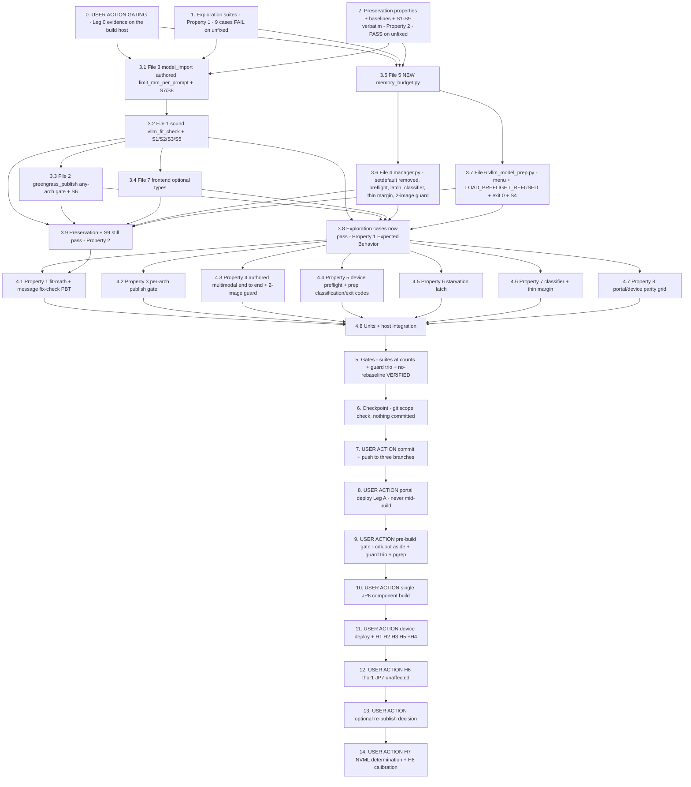

# Implementation Plan

## Overview

Fix the JP6 vLLM KV-cache OOM regression exactly as design.md specifies: remove
the unbudgeted device-side `limit_mm_per_prompt = {"image": 2}` default that
made 1.0.61 profile a vision-language engine for two images inside an unchanged
11.98 GiB budget (Decision 1), make the publish-time sizing model sound
(activation allowance + co-tenancy Fraction_Cap + honest profile semantics +
per-arch publish gate, Decision 2), stop advising the hazard (Decision 3), add a
cheap device-side preflight that reads `/proc/meminfo` and refuses a doomed load
in seconds instead of ~4 min (Decision 4), detect-and-refuse the
stranded-allocation cascade (Decision 5), and report thin margins and symptom
categories inside the existing surfaces only (Decision 6).

**Posture (binding, from design "Overview").** The fix REDUCES vLLM's demand and
makes the sizing model SOUND. It never buys KV headroom by raising
`gpu_memory_utilization` and never relocates the three co-resident ONNX GPU
models. Success is a conjunction: the published vLLM model loads and serves on
JP6 **AND** `model-cookies-binary-jetson-xavier-jp6`,
`model-rf-detr-seg-nano-jetson-xavier-jp6`,
`model-yolo-test-jetson-xavier-jp6` keep serving on GPU unchanged. Satisfying one
half at the other's expense is a failure, not a fix.

Two legs, sequenced differently by the rollout, so the fix tasks are split by
design File **and** by leg:

1. **Portal leg (Leg A, ships by portal deploy, no component build).**
   **File 3** `edge-cv-portal/backend/functions/model_import.py` (authored
   `limit_mm_per_prompt`), **File 1**
   `edge-cv-portal/backend/functions/vllm_fit_check.py` (activation allowance,
   Fraction_Cap, additive `FitFinding` fields, Decision 3 message menu),
   **File 2** `edge-cv-portal/backend/functions/greengrass_publish.py` (any-arch
   gate), **File 7** `edge-cv-portal/frontend/src/services/api.ts` (optional
   types). Cannot disturb the serving device (3.11).
2. **Device leg (Leg B, ships by ONE `aws.edgeml.dda.LocalServer.arm64JP6`
   component build).** **File 5** NEW
   `src/backend/vllm_runtime/memory_budget.py`, **File 4**
   `src/backend/vllm_runtime/manager.py` (remove the setdefault, preflight call
   site, Starvation_Latch, failure classifier, thin-margin WARNING, two-image
   request guard), **File 6** `src/backend/dda_triton/vllm_model_prep.py`
   (Decision 3 menu, `LOAD_PREFLIGHT_REFUSED` classification before
   `KV_CACHE_HINT_MARKERS`, exit 0 on preflight refusal). **This is the leg that
   restores service** — the already-published `model.json` omits
   `limit_mm_per_prompt`, so with the setdefault gone the demand is 1.0.59's
   again, with no re-package and no re-publish.

**File 8 (tests) is distributed across the test tasks**, not a task of its own.

**Intra-leg dependencies (why the fix tasks are ordered as they are).**
File 3 lands before File 1, because File 1 sizes the multimodal term from the
authored `limit_mm_per_prompt` field. File 5 lands before File 4's call site,
because the manager calls `memory_budget.evaluate_device_fit(...)`. File 2
follows File 1 (it gates on the new `FitFinding` shape); File 6 needs only File
5's exported `PREFLIGHT_REFUSED_MARKER`. The portal-leg and device-leg fix tasks
touch **disjoint files** and can run concurrently.

**Honesty guard (binding; design "Honesty Guard").** No host test loads a real
vLLM engine, allocates GPU memory, or reproduces Jetson unified-memory
accounting. Every claim that is hardware-only is a **USER ACTION** task labelled
with its H-tier (H1-H8) and **no host-side task may claim to prove GPU memory
behavior**. The host-side seams the design names are what the host tasks use: the
injected `/proc/meminfo` reader (`memory_budget.read_memory(reader=…)`), the
existing `engine_factory` injection, a fake `cache_config` object for KV
introspection, monkeypatched `requests` for the prep's 409 bodies, and
moto + the existing `FakeGreengrass` harness for the publish gate. Host tests
prove **math, messages, decision logic, classification and exit codes** —
nothing else.

**Non-goal guards (design "Explicitly NOT changed").** `vllm_runtime/
reconciler.py` and its wiring in `src/backend/app.py`
(`vllm-model-reload-after-backend-restart`'s territory); `vllm_runtime/
repository.py`, the runtime server's routes and status maps, the tombstone
contract, `ModelState.UNLOADED`, the feature-config / 409-category status maps;
`src/backend/Dockerfile.jp6` and its pins (`vllm==0.9.3+cu126`, `torch==2.8.0`,
`VLLM_USE_V1=0` — they did not move between 1.0.59 and 1.0.61 and are not the
defect); `Dockerfile.jp7` and every JP7 engine default; JP5/x86 vLLM-free
inertness; the ONNX/Triton vision path and the three JP6 ONNX model components;
`vllm-jp7-engine-cuda-init`'s `cudaErrorDevicesUnavailable` territory;
`model-gpu-fallback-visibility`'s GPU status surfaces (not duplicated, not
extended); Greengrass deployment machinery. `_reclaim_gpu_memory`'s CUDA-init
invariant is inviolable — **nothing in this plan may initialize CUDA in the
parent backend process**, and `memory_budget.py` imports no torch, no CUDA and
no vLLM. Design's claim: **no preservation-tracked file is touched → no
security-baseline rebaselines** — task 5 VERIFIES that claim rather than
assuming it.

**Nothing is committed by tasks 0-6.** Task 7 (USER ACTION) owns the commit and
the push.

Test commands:
- Portal suites run from `edge-cv-portal/backend` in the portal venv
  (`source /home/ubuntu/.venvs/dda-portal-tests/bin/activate`) **WITH** the
  suite's conftest (moto `aws_stack` fixture; Hypothesis profiles
  `portal-fast`/`ci` are conftest-registered — never hardcode `max_examples`; do
  **NOT** pass `--noconftest`), always with an **explicit file list** (whole-dir
  runs have known moto cross-contamination):
  `python3 -m pytest tests/<files> -q -p no:cacheprovider`
- Device-side suites run host-side from the repo root in the same venv (the
  flask-app image is not on this host — the established caveat; the container
  gate run happens at build time per `.kiro/steering/builds.md`):
  `PYTHONPATH=src/backend:test/backend-test python3 -m pytest test/backend-test/<dir> -q -p no:cacheprovider --noconftest`
- The Property 8 parity test imports BOTH modules, so it runs device-side with
  the portal backend on the path:
  `PYTHONPATH=src/backend:test/backend-test:edge-cv-portal/backend python3 -m pytest test/backend-test/jp6_vllm_kv_cache_oom/test_property_portal_device_parity.py -q -p no:cacheprovider --noconftest`
- Frontend from `edge-cv-portal/frontend` with the local node toolchain:
  `PATH="$HOME/.local/node/bin:$PATH" npx vitest run <file>` and
  `PATH="$HOME/.local/node/bin:$PATH" npm run build`
- Hypothesis property tests use `test_property_*.py` naming with
  `# Validates: Requirements …` comments and NO hardcoded `max_examples`
- The security guard **trio** runs host-side (the `iam` sibling guard burned a
  fleet build earlier this week when a baseline went stale — it is included
  deliberately, never assumed green):
  `python3 -m pytest test/backend-test/security/preservation/test_preservation_out_of_scope_guard.py test/backend-test/security/preservation/test_preservation_secrets_out_of_scope_guard.py test/backend-test/security/preservation/test_preservation_iam_out_of_scope_guard.py -p no:cacheprovider --noconftest -q`

New files this plan creates:
- `src/backend/vllm_runtime/memory_budget.py` (the fix — design File 5)
- `test/backend-test/jp6_vllm_kv_cache_oom/fakes.py` (suite-shared: fake
  `/proc/meminfo` reader, recording fake engine factory, fake `cache_config`,
  tmp weight trees + fake HF cache layout, crafted 409 bodies)
- `test/backend-test/jp6_vllm_kv_cache_oom/test_exploration_jp6_kv_cache_oom.py`
- `test/backend-test/jp6_vllm_kv_cache_oom/test_preservation_jp6_kv_cache_oom.py`
- `test/backend-test/jp6_vllm_kv_cache_oom/test_property_jp6_device_preservation.py`
- `test/backend-test/jp6_vllm_kv_cache_oom/test_property_device_preflight.py`
- `test/backend-test/jp6_vllm_kv_cache_oom/test_property_starvation_latch.py`
- `test/backend-test/jp6_vllm_kv_cache_oom/test_property_failure_classification.py`
- `test/backend-test/jp6_vllm_kv_cache_oom/test_property_portal_device_parity.py`
- `test/backend-test/jp6_vllm_kv_cache_oom/test_memory_budget_units.py`
- `test/backend-test/jp6_vllm_kv_cache_oom/test_integration_preflight_prep.py`
- `edge-cv-portal/backend/tests/test_jp6_kv_fit_check_exploration.py`
- `edge-cv-portal/backend/tests/test_property_jp6_fit_check_soundness.py`
- `edge-cv-portal/backend/tests/test_property_jp6_fit_preservation.py`
- `edge-cv-portal/backend/tests/test_jp6_publish_gate_per_arch.py`
- `edge-cv-portal/backend/tests/test_jp6_engine_config_multimodal.py`
- `edge-cv-portal/backend/tests/test_jp6_fit_check_units.py`
- `edge-cv-portal/backend/tests/test_jp6_kv_publish_integration.py`
- `edge-cv-portal/frontend/src/pages/ModelDetail.fitCheckTerms.test.ts`
  (the `ModelDetail.engineConfig.test.ts` convention)

## Notes

- Source-tree changes (design Fix Implementation Files 1-8): **File 1**
  `edge-cv-portal/backend/functions/vllm_fit_check.py`, **File 2**
  `edge-cv-portal/backend/functions/greengrass_publish.py`, **File 3**
  `edge-cv-portal/backend/functions/model_import.py`, **File 4**
  `src/backend/vllm_runtime/manager.py`, **File 5** NEW
  `src/backend/vllm_runtime/memory_budget.py`, **File 6**
  `src/backend/dda_triton/vllm_model_prep.py`, **File 7**
  `edge-cv-portal/frontend/src/services/api.ts` (+ `ModelDetail.tsx` only if the
  term breakdown is rendered), **File 8** tests (distributed)
- The nine **S1-S9 sibling repoints** (`vllm-sizing-and-packaging-errors`) are
  recorded **verbatim in task 2 — BEFORE the fix — so the repoint diffs are
  auditable**, and each is then repointed **in the same task as the code change
  that requires it**: S7/S8 with File 3 (task 3.1); S1/S2/S3/S5 with File 1
  (task 3.2); S6 with File 2 (task 3.3); S4 with File 6 (task 3.7). **S9
  (`test_property_fit_unverified_never_blocks.py`,
  `test_vllm_fit_check_estimation.py`) must keep passing UNTOUCHED** (preservation
  3.2). **Never weaken or delete a test.**
- `MULTIMODAL_IMAGE_INCREMENT = 1.0`, `ACTIVATION_WEIGHT_FRACTION = 0.75`,
  `CO_TENANCY_RESERVATION_BYTES['arm64_jp7'] = 8 GiB`,
  `RECLAIM_TOLERANCE_BYTES = 0.5 GiB` and `THIN_MARGIN_CONCURRENCY = 2.0x` are
  **estimates/placeholders labelled as such** (design "Open questions" 3-5). Every
  message must label the activation allowance an estimate. H8 calibrates them;
  no task may present them as measured
- The corrected model is deliberately **more conservative** and will refuse
  configurations that publish today (design Decision 2 "Stated consequence").
  That is the intended fail-closed direction; the audited `skip_fit_check`
  override is the escape hatch
- `builds.md` is binding throughout: **one component build at a time**
  (`pgrep -af "gdk component build"` and `pgrep -af "build-custom.sh"` both empty
  before dispatch), the security guard gate green BEFORE the build (never
  assumed), `cdk.out` moved aside, **never a portal deploy while a build runs**,
  on-hardware verification before an on-device change is "done"
- **Standing device warning:** `ryanorinagxdevkithomelabjp622` is currently
  **HEALTHY on LocalServer.arm64JP6 1.0.59 serving `qwen2-5-vl-7b-instruct-awq`
  (READY, `generate` 200 in ~1.9 s cold then ~0.9 s)** — preservation 3.11. Task
  11 is the first task that deliberately disturbs it. The known-good restore
  revision pinning 1.0.59 is **`8b697b31-f5cf-4d09-8a58-70b3cc0afb96`**. Device
  access:
  `sshpass -p lookout ssh -o StrictHostKeyChecking=no -o UserKnownHostsFile=/dev/null -p 9998 aws@ryan.120v.ac`,
  sudo password `lookout`
- Task 0 is **gating**: if the Leg 0 evidence contradicts the root-cause
  analysis, design.md is revisited **before any build** (design "Rollout shape"
  step 1). It is read-only with respect to the device — the 1.0.61 image is
  pulled **on the build host, never onto the device**
- Tasks 0 and 7-14 are USER ACTIONs (evidence on the build host, commit+push,
  portal deploy, the pre-build gate, the single JP6 build, device sessions); the
  agent prepares and verifies everything else host-side
- Nothing is committed by tasks 1-6; task 7 pushes HEAD to `spec/jetpack7-support`,
  `spec/vlm-anomaly-reference-parity` and `integration/all-specs`,
  **fast-forward only**

## Task Dependency Graph

```json
{
  "waves": [
    { "wave": 0, "description": "USER ACTION, GATING: Leg 0 evidence on the BUILD HOST (re-pull flask-app:1.0.61, grep limit_mm_per_prompt in /vllm_runtime/manager.py, pip freeze diff vs the on-device 1.0.59 set). Read-only w.r.t. the device. If it contradicts the root cause, design.md is revisited before any build.", "tasks": ["0"] },
    { "wave": 1, "description": "Exploration + preservation on the UNFIXED tree: the 9 exploration cases surface the bug-condition counterexamples (FAIL expected); the preservation properties, recorded baselines and the S1-S9 verbatim originals are observed and recorded (PASS required).", "tasks": ["1", "2"] },
    { "wave": 2, "description": "Fix, first ring - disjoint files, portal and device legs concurrent: File 3 authored limit_mm_per_prompt (+ S7/S8) and NEW File 5 memory_budget.py.", "tasks": ["3.1", "3.5"] },
    { "wave": 3, "description": "Fix, second ring: File 1 sound Fit_Check (needs File 3's authored field; + S1/S2/S3/S5), File 4 manager (needs File 5's evaluate_device_fit), File 6 prep (needs File 5's PREFLIGHT_REFUSED_MARKER; + S4). All three touch disjoint files.", "tasks": ["3.2", "3.6", "3.7"] },
    { "wave": 4, "description": "Fix, third ring: File 2 any-arch publish gate (needs File 1's FitFinding shape; + S6) and File 7 frontend optional types.", "tasks": ["3.3", "3.4"] },
    { "wave": 5, "description": "Verify the flips: the 9 exploration cases now PASS on the fixed tree; the preservation suites + S9 still PASS at their recorded baselines.", "tasks": ["3.8", "3.9"] },
    { "wave": 6, "description": "Fix-checking suites at design Properties 1, 3, 4, 5, 6, 7, 8 plus units and host integration.", "tasks": ["4.1", "4.2", "4.3", "4.4", "4.5", "4.6", "4.7", "4.8"] },
    { "wave": 7, "description": "Gates (new suites at their counts, repointed siblings, untouched S9, the device suites at their current baselines, frontend touched suites + full vitest + npm run build, security guard trio, and the VERIFIED no-rebaseline claim) then the checkpoint git scope check. NOTHING committed.", "tasks": ["5", "6"] },
    { "wave": 8, "description": "USER ACTION: commit + push HEAD to spec/jetpack7-support, spec/vlm-anomaly-reference-parity, integration/all-specs (fast-forward only).", "tasks": ["7"] },
    { "wave": 9, "description": "USER ACTION, rollout step 2: portal deploy of Leg A - ONLY when no component build is running.", "tasks": ["8"] },
    { "wave": 10, "description": "USER ACTION, rollout steps 3-4: move cdk.out aside + guard trio green + pgrep clear, then the SINGLE JP6 component build (gdk-config.json = aws.edgeml.dda.LocalServer.arm64JP6, restored afterwards).", "tasks": ["9", "10"] },
    { "wave": 11, "description": "USER ACTION, rollout step 5 [HARDWARE]: deploy the fixed LocalServer to ryanorinagxdevkithomelabjp622 and run H1, H2, H3, H5 (+H4 if safely inducible), with rollback to 1.0.59 if H1 or H2 fails.", "tasks": ["11"] },
    { "wave": 12, "description": "USER ACTION, rollout step 6 [HARDWARE]: H6 on thor1 - JP7 unaffected.", "tasks": ["12"] },
    { "wave": 13, "description": "USER ACTION, rollout steps 7-8: the optional re-publish decision, then the H7 NVML-assert determination and H8 activation-allowance calibration follow-ups.", "tasks": ["13", "14"] }
  ]
}
```



## Tasks

- [x] 0. USER ACTION (GATING): Leg 0 evidence — settle the two open 1.0.61 questions on the BUILD HOST (design "Rollout shape" step 1, "The 1.0.61 image question", Open question 2)
  - **GATING**: no fix task may be declared final and **no component build may start** until this task's answer is recorded. If it CONTRADICTS the root-cause analysis (e.g. a floated dependency also moved between 1.0.59 and 1.0.61), **design.md is revisited before any build** — the fix direction (remove the unbudgeted default, make the sizing model sound) is correct either way, but the *explanation* changes and this plan is re-scoped rather than continued
  - **Read-only w.r.t. the device**: pull the image **on the build host, NEVER onto the device**. `ryanorinagxdevkithomelabjp622` stays HEALTHY on 1.0.59 serving the model (3.11) — no deployment, no container restart, no state change
  - On the build host: `docker pull 164152369890.dkr.ecr.us-east-1.amazonaws.com/dda/flask-app:1.0.61` (ECR login first), then inspect the pruned-from-device image in a throwaway container
  - **Question 1 — the setdefault**: `grep -c limit_mm_per_prompt /vllm_runtime/manager.py` inside the 1.0.61 image. Expected **≥ 1** (commit `086c251` is an ancestor of `652c7bf` which built 1.0.61); the running 1.0.59 container provably answers **0**. A `0` here refutes hypothesis 1 outright
  - **Question 2 — the dependency set**: `pip freeze` inside 1.0.61 diffed against the on-device 1.0.59 set (`transformers>=4.51.1,<5` and `numpy>=1.26,<2` float; all PyPI transitive deps float; the Jetson index can republish a wheel under the same version string). Confirm/refute that `vllm 0.9.3 / torch 2.8.0 / cuda 12.6` are identical, and record every moved package
  - Record both answers verbatim in this task's OUTCOME, plus the disposition: *root cause confirmed* → proceed, or *contradicted* → revisit design.md
  - Optional, read-only only if needed: device evidence via `sshpass -p lookout ssh -o StrictHostKeyChecking=no -o UserKnownHostsFile=/dev/null -p 9998 aws@ryan.120v.ac` (sudo `lookout`) — `docker logs`, `docker exec` greps, `free`, `ps`, GET endpoints only
  - Prune the pulled image from the build host afterwards (build-host disk discipline)
  - _Requirements: 1.4, 2.4 (evidence for), design Open question 2_

- [x] 1. Write bug condition exploration test suites (BEFORE implementing the fix)
  - **Property 1: Bug Condition** - Unsound Fit_Check verdict, unbudgeted multimodal default, absent device preflight
  - **CRITICAL**: all 9 cases MUST FAIL on the unfixed tree — failure confirms the bug condition exists
  - **DO NOT attempt to fix the tests or the code when they fail**
  - **NOTE**: these suites encode the expected behavior — they validate the fix when they pass after implementation (task 3.8)
  - **GOAL**: surface the counterexamples of defects 1.1-1.10 on the UNFIXED tree, host-side only. **Honesty guard**: every case is GPU-free — no real vLLM engine, no GPU allocation, no Jetson unified-memory simulation. Memory is INJECTED via a fake `/proc/meminfo` reader; the engine is the existing `engine_factory` seam; KV sizing is a fake `cache_config`
  - **Scoped PBT approach**: cases 1-3 are scoped to the concrete incident arithmetic (`arm64_jp6`, `util = 0.4`, 6.5 GiB weights — the deterministic failing point) so they are reproducible; the generated-input versions land as fix-checking properties in tasks 4.1-4.2
  - Create the portal-side exploration suite `edge-cv-portal/backend/tests/test_jp6_kv_fit_check_exploration.py` and the device-side suite `test/backend-test/jp6_vllm_kv_cache_oom/test_exploration_jp6_kv_cache_oom.py` plus the suite-shared `test/backend-test/jp6_vllm_kv_cache_oom/fakes.py` (fake `/proc/meminfo` reader with crafted `MemTotal`/`MemAvailable`; recording fake engine factory + a factory that raises to simulate a failed load; fake `cache_config` exposing `num_gpu_blocks`/`block_size`; tmp weight trees and a fake `models--{org}--{name}` HF cache layout; crafted 409 bodies for the prep)
  - Case 1 — **Incident replay, fit math (1.1)**: `evaluate_fit({'gpu_memory_utilization': 0.4}, 6.5 GiB, ['arm64_jp6'])` must report `fits = False`. FAILS on unfixed code: it returns `fits = True` with `required_bytes = 7.5 GiB` and a claimed 4.50 GiB of slack against a device-measured **−7.83 GiB** remainder
  - Case 2 — **Co-tenancy hazard (1.2, 1.3)**: `util = 0.9` on `arm64_jp6` must not be reported as fitting (`0.9 > cap 0.80`), and no message may advise raising the fraction above the cap. FAILS on unfixed code
  - Case 3 — **Per-arch escape (1.8)**: a record failing `arm64_jp6` while passing `arm64_jp7` must be refused with **422**. FAILS on unfixed code: `every_arch_fails = all(not finding.fits …)` lets it publish with `warnings`
  - Case 4 — **Multimodal default (1.4)**: `manager.load` with staged args omitting `limit_mm_per_prompt` must leave the recorded engine args **without the key**. FAILS on unfixed code: the recorded args contain `{"image": 2}` (commit `086c251`)
  - Case 5 — **Preflight absence (1.10, 2.9)**: with an injected reading of **3 GB available**, `load` must refuse before the engine factory is called. FAILS on unfixed code: no check exists and the factory is called
  - Case 6 — **Starvation (1.5, 2.5)**: two consecutive failing loads with injected readings that do NOT recover must set the Starvation_Latch and refuse the second. FAILS on unfixed code: no latch exists
  - Case 7 — **Thin margin (1.7, 2.7)**: a fake engine reporting KV bytes below `MINIMUM_KV_CACHE_BYTES` (the observed 0.65 GiB against the 1 GiB floor) must produce a **WARNING**. FAILS on unfixed code: only the READY INFO line exists
  - Case 8 — **Symptom classification (1.6, 2.6)**: an NVML-assert reason and a KV-cache reason must carry **different** category tokens (`allocator-nvml-fault:` vs `kv-cache-exhaustion:`). FAILS on unfixed code: both are raw reasons
  - Case 9 — **Edge case, two-image request (2.4, 3.9)**: a reference-image request against a model with `limit_mm_per_prompt.image = 1` must raise `GenerationError` naming the limit and the remediation. May fail differently today (the engine is invoked and fails deeper, or the setdefault silently profiles for 2) — record exactly how
  - Run portal cases from `edge-cv-portal/backend` WITH conftest (explicit file list); device cases host-side with `--noconftest` (commands in Test commands above)
  - **EXPECTED OUTCOME**: all 9 cases FAIL (this is correct — it proves the bug condition exists)
  - Document the counterexamples: the fit verdict disagreeing with the device's measured remainder by ~12 GiB; the publish gate admitting a JP6-infeasible record; the injected `{"image": 2}` in the recorded engine args; the engine factory being called with 3 GB available. **If a case does not fail as predicted** (e.g. a different default resolution order in `parse_repository`, or an engine-arg shape this design assumed wrongly), **re-hypothesize before writing the fix** — do not adjust the test to match the code
  - Mark complete when the suites are written, run, and the failures are documented
  - _Requirements: 1.1, 1.2, 1.3, 1.4, 1.5, 1.6, 1.7, 1.8, 1.10_

- [x] 2. Write preservation property tests + record baselines and the S1-S9 verbatim originals (BEFORE implementing the fix)
  - **OUTCOME (2026-08-18, host-side, venv `/home/ubuntu/.venvs/dda-portal-tests`, `-p no:cacheprovider`): ALL THREE SUITES PASS ON THE UNFIXED TREE — 44 passed, 11 skipped; no production file touched, nothing committed.** Per file:
    - `edge-cv-portal/backend/tests/test_property_jp6_fit_preservation.py` (from `edge-cv-portal/backend`, **WITH** conftest): **19 passed, 5 skipped** — also green under `HYPOTHESIS_PROFILE=ci` (19 passed, 5 skipped), confirming the properties hold at the larger budget. NO hardcoded `max_examples` anywhere (`@settings(deadline=None)` only; budget from the conftest-registered `portal-fast`/`ci` profiles). Reuses the sibling generators verbatim by import: `engine_configurations()`, `estimates()`, `_architecture_sets`, `format_gib` from `tests/test_property_fit_check_decision.py`
    - `test/backend-test/jp6_vllm_kv_cache_oom/test_preservation_jp6_kv_cache_oom.py` (host-side, `--noconftest`): **18 passed, 5 skipped**
    - `test/backend-test/jp6_vllm_kv_cache_oom/test_property_jp6_device_preservation.py` (host-side, `--noconftest`): **7 passed, 1 skipped** (`@settings(deadline=None)`, no `max_examples` — the `vllm_model_reload` device-suite convention; the two prep properties patch inside a per-example `pytest.MonkeyPatch.context()` rather than the function-scoped fixture, so Hypothesis re-runs them from clean module state)
    - Combined device pair: **25 passed, 6 skipped**. Combined portal file + all S5-S9 files in ONE run: **48 passed, 5 skipped** (19 new + 29 sibling) — no moto cross-contamination, S5-S9 untouched and unaffected
  - **The 11 skips are all deliberate and reported (`-rs`), never silent.** 5 fixed-shape legs that BIND at task 3.9: portal `ENGINE_DEFAULTS['limit_mm_per_prompt'] == {'image': 1}` (task 3.1) and the additive `FitFinding` terms agreeing with the recorded corrected arithmetic (task 3.2); device `memory_budget.PREFLIGHT_REFUSED_MARKER == "preflight-refused:"` + its no-torch/no-CUDA/no-vLLM source check (task 3.5), `vllm_model_prep.LOAD_PREFLIGHT_REFUSED` (task 3.7), and the PBT "no key is ever injected" leg (task 3.6). 6 **[HARDWARE] DEFERRED** legs declared as skipped tests whose reason names the H-tier and owning task (they raise `AssertionError` if ever executed host-side, so they cannot be silently faked): H6 JP7/thor1 → task 12 (both halves), H2 the three ONNX co-tenants → task 11 (both halves), 3.11 the 1.0.59 device staying healthy → tasks 11-12 (both halves)
  - **Preservation legs encoded, per the task's bullet list.** *(3.1 fitting record)* PBT over the sibling generators: `fits = True` for every architecture that fits under BOTH models, `budget_bytes == int(util × profile[arch])` identity, one finding per profiled architecture in input order with unprofiled archs skipped, the five original `FitFinding` fields keeping their names/types through `asdict`, and the never-lower invariant asserted on EVERY message (passing and failing); plus the moto publish leg: **200**, `published_components` + `message` shape, `fit_check.status == 'passed'` with estimate + per-arch findings, an audit event, and no `skip_fit_check` marker. *(3.2 unverified)* `estimate_weights` returns `None` (never raises) over a PBT of hostile record shapes with BOTH injected fetchers exploding; the module carries no `boto3`/`botocore` import and keeps its public names; publish with `estimate is None` → **200**, `status 'unverified'`, `estimate: None`, `findings == []`, documented message. *(3.3 five keys + verbatim `model.json`)* the five pre-existing defaults pinned by value (`dtype=auto`, `gpu_memory_utilization=0.5`, `max_model_len=2048`, `tensor_parallel_size=1`, `enforce_eager=True`), overlay resolution PBT, unknown-key fail-closed PBT with the per-field reason, 8 parametrized out-of-range arms each keeping its reason text, and the recorded `model.json` baseline asserted BOTH parsed and as the exact `json.dumps(..., indent=2)` lines. *(3.8 prep)* exit codes 0/1/1, the `LOAD_UNREACHABLE` diagnostic elements, the KV-OOM unload→reload recovery firing **exactly once** (`load, unload, load`) with the success arm returning `LOAD_OK`, non-KV errors staying single-attempt, the prominent ERROR line's elements, reason extraction, idempotent `--cleanup`, verbatim staging; generalized by PBT over generated staged args, generated KV/non-KV reasons and generated bodies. *(3.7 reconciler)* `reconciler.py` sha256 pinned + `(30, 120, 480)` + the no-op line + the `app.py` wiring lines. *(2.7 inverse healthy load)* no WARNING at all and the byte-identical `vLLM model '<name>' is READY` line, generalized by PBT over ample KV geometries. *(3.9 two-image)* the authored `{"image": 2}` model still builds the labelled two-pad prompt with the two-element image list and the limit reaching the engine verbatim; single-image and text-only paths pinned. *(3.4 JP7 host half)* `util = 0.5`, 16 GiB weights → `budget = 60.00 GiB`, corrected `required = 29.00 GiB`, `0.5 ≤ cap 0.9333`, `fits = True` under both models
  - **Non-bug-condition scope (why this is preservation and not a frozen bug)**: the corrected model's arithmetic (design Decision 2 — `ACTIVATION_FLOOR_BYTES = 2 GiB`, `ACTIVATION_WEIGHT_FRACTION = 0.75`, `MULTIMODAL_IMAGE_INCREMENT = 1.0`, `CO_TENANCY_RESERVATION_BYTES` jp6 6 GiB / jp7 8 GiB) is defined LOCALLY in the portal file as `fits_under_corrected_model(...)`, because the unfixed tree exports none of it. Since `required_corrected ≥ required_shipped` and the budget is untouched, "fits under the corrected model" ⟹ "fits under the shipped model", so every assertion holds on BOTH trees by construction. Task 4.7's parity test is what pins the shipped constants to these values after the fix. `arm64_jp5` co-tenancy is a test-local 6 GiB (design names only jp6/jp7) — conservative, so it can only shrink the asserted scope
  - **RECORDED BASELINE COUNTS (the counts the task-5 gates must reproduce)**:
    - NEW portal file `tests/test_property_jp6_fit_preservation.py`: **19 passed, 5 skipped**
    - NEW device dir `test/backend-test/jp6_vllm_kv_cache_oom` (whole dir, `--noconftest`): **7 failed, 25 passed, 6 skipped** — the 7 failures are task 1's exploration cases 4-9, EXPECTED to fail on the unfixed tree (they flip at task 3.8); the 25 passed + 6 skipped are task 2's two files
    - Task-1 portal exploration `tests/test_jp6_kv_fit_check_exploration.py`: **4 failed** (expected; flips at task 3.8)
    - **S5** `tests/test_property_fit_check_decision.py`: **1 passed** · **S6** `tests/test_vllm_publish_fit_gate.py`: **3 passed** · **S7** `tests/test_property_engine_config_update_roundtrip.py`: **1 passed**, `tests/test_property_engine_config_invalid_updates.py`: **1 passed** · **S8** `tests/test_vllm_engine_config_detail_and_audit.py`: **4 passed** · **S9** `tests/test_property_fit_unverified_never_blocks.py`: **3 passed**, `tests/test_vllm_fit_check_estimation.py`: **16 passed** (S9 stays UNTOUCHED)
    - `test/backend-test/vllm_runtime` + `test/backend-test/vllm_runtime_tests` (`--noconftest`, one run): **29 passed**
    - `test/backend-test/vllm_model_reload` (`--noconftest`): **45 passed** (the reconciler suite — 3.7's baseline)
    - `test/backend-test/dda_triton` (prep): the two prep files `test_vllm_load_failure_log.py` + `test_property_load_failure_reason.py` = **20 passed**, and they must run **WITH** the repo conftest (they use its class-bound `caplog` fixture; with `--noconftest` 9 of the 20 fail on `self.caplog` — a harness caveat, NOT a regression). **Whole-dir `test/backend-test/dda_triton` does NOT collect host-side: 10 collection errors, all `ModuleNotFoundError: No module named 'google'`** (tritonclient's protobuf dep is absent from this host venv) — the container run at build time per `.kiro/steering/builds.md` is the authoritative gate for that directory
    - `test/backend-test/text_generation` (`--noconftest`): **15 passed** · `test/backend-test/deploy_reliability` (`--noconftest`): **72 passed**
    - Frontend (from `edge-cv-portal/frontend`, `PATH="$HOME/.local/node/bin:$PATH" npx vitest run`): `src/pages/ModelDetail.engineConfig.test.tsx` **4 passed**; `ModelDetail.vllmPublish.integration.test.tsx` + `ModelDetail.compilationFallback.test.tsx` **7 passed** (2 files). Note the touched-suite extensions are **`.tsx`**, not `.ts` — task 3.4's new `ModelDetail.fitCheckTerms.test.ts` should follow the existing `.tsx` convention
    - Pinned source hashes (sha256, unfixed tree): `src/backend/vllm_runtime/reconciler.py` **2bb6f6d37609e6f7623c25107eacead067af8bf617fec6dbb1f4343e7d1c9f32** (asserted by the test — this spec may not touch it), `src/backend/vllm_runtime/manager.py` 05a407115063a8b0ac70cd2c337dc014e49abf428bea255a69ddb54a18547186, `src/backend/dda_triton/vllm_model_prep.py` 9f3b148a19c9f91e2bdd389428437246deabf8d533c08c0477951f196f7271b9, `edge-cv-portal/backend/functions/vllm_fit_check.py` 839f02bbf2b8b5c840943d94b671363887b86be3558b5555adcd31bee806d976 (the last three are recorded for diff auditing only — they are the files the fix changes)
  - **S1-S9 SIBLING ORIGINALS, RECORDED VERBATIM BEFORE ANY CODE CHANGE** (so every repoint diff in tasks 3.1-3.3/3.7 is auditable):
    - **S1** — `.kiro/specs/vllm-sizing-and-packaging-errors/requirements.md`, Requirement 3 acceptance criterion **1** (line 87): "WHEN a Fit_Check is evaluated for a vLLM_Model_Record and a Target_Architecture, THE Portal SHALL compute the GPU memory budget as `gpu_memory_utilization` × the Device_Memory_Profile entry for that Target_Architecture and compare it against Weight_Estimate + Minimum_KV_Cache." · criterion **6** (line 92): "IF the Fit_Check fails for every supported Target_Architecture at model package/publish time, THEN THE Model_Publisher SHALL fail the publish before any component registration with HTTP 422 and a message stating the Weight_Estimate, the configured `gpu_memory_utilization`, the per-architecture memory budget, and the remediation (raise `gpu_memory_utilization`, reduce `max_model_len`, or choose a smaller model)."
    - **S2** — same file, criterion **8** (line 94): "THE Portal SHALL maintain the Device_Memory_Profile as a per-Target_Architecture table in code with at least an `arm64_jp6` entry of 30 GiB usable memory, and every Fit_Check message SHALL name the profile entry used."
    - **S3** — same file, criterion **9** (line 95): "WHEN a Fit_Check produces a failing finding, THE Portal SHALL phrase the finding with the correct remediation direction (the weights do not fit inside the configured fraction, so `gpu_memory_utilization` must be raised or the model shrunk — never advise lowering it for this failure mode)."
    - **S4** — same file, Requirement 4 criterion **2** (line 104): "IF the extracted reason indicates insufficient KV-cache memory (e.g. \"No available memory for the cache blocks. Try increasing gpu_memory_utilization\"), THEN THE Model_Prep_Script SHALL append an actionable remediation to the ERROR line naming the `gpu_memory_utilization` and `max_model_len` engine settings and stating that the value must be raised or the model reduced."
    - **S5** — `edge-cv-portal/backend/tests/test_property_fit_check_decision.py`, `test_fit_decision_correctness` (decorated `@settings(max_examples=100, deadline=None)` at line 98). Line 123: `required_bytes = estimate_bytes + MINIMUM_KV_CACHE_BYTES`. Lines 133-137: `assert finding.required_bytes == required_bytes, (f"{finding.arch}: required {finding.required_bytes} != " f"estimate {estimate_bytes} + min KV cache " f"{MINIMUM_KV_CACHE_BYTES}")`. Line 139: `expected_fits = budget_bytes >= required_bytes` followed by `assert finding.fits is expected_fits`. Line 130: `budget_bytes = int(float(utilization) * profile_bytes)`. Lines 159-162: `assert re.search(r"raise\s+gpu_memory_utilization", finding.message, re.IGNORECASE), (f"{finding.arch}: failing message must advise raising " f"gpu_memory_utilization: {finding.message!r}")`. Lines 163-168 — **KEPT, never weakened**: `assert not re.search(r"(lower|decrease|reduce)\w*\s+" r"gpu_memory_utilization", finding.message, re.IGNORECASE), (f"{finding.arch}: failing message must never advise " f"lowering gpu_memory_utilization: {finding.message!r}")`. Also asserted today and to be preserved: `[f.arch for f in findings] == profiled`, `finding.arch in finding.message`, `format_gib(budget_bytes) in finding.message`, `format_gib(estimate_bytes) in finding.message`
    - **S6** — `edge-cv-portal/backend/tests/test_vllm_publish_fit_gate.py:286` `def test_all_arch_failure_blocks_publish_with_422(pub_env, seeded, monkeypatch):` — asserts `response["statusCode"] == 422`, `body["fit_check"]["status"] == "failed"`, `findings` non-empty with `all(finding["fits"] is False …)`, `body["fit_check"]["estimate"]["total_bytes"] == 100 * GIB`, `"raise gpu_memory_utilization" in body["error"]`, `"lower" not in body["error"].lower()`, `seeded.gg.created == []`, the record untouched (`"published_component" not in stored`, `"component_name" not in stored`, `"published" not in stored`, `"published_components" not in stored`, `stored["updated_at"] == record["updated_at"]`) and nothing exposed to deployments. **This case must keep passing after the any-arch widening.**
    - **S7** — `edge-cv-portal/backend/tests/test_property_engine_config_update_roundtrip.py:38-39`: `KNOWN_ENGINE_KEYS = ("dtype", "gpu_memory_utilization", "max_model_len",` / `                       "tensor_parallel_size", "enforce_eager")`, with the drift guard at **line 64**: `assert set(model_import.ENGINE_DEFAULTS) == set(KNOWN_ENGINE_KEYS)`; the same tuple at `test_property_engine_config_invalid_updates.py:34-35` with its guard at **line 59**: `assert set(model_import.ENGINE_DEFAULTS) == set(KNOWN_ENGINE_KEYS)`. The roundtrip file additionally asserts `set(returned) == set(KNOWN_ENGINE_KEYS)` (line 248), `set(stored_after) == set(KNOWN_ENGINE_KEYS)` (line 262) and `set(detail) == set(KNOWN_ENGINE_KEYS)` (line 274) — all four/five sites move together when `limit_mm_per_prompt` is added in task 3.1
    - **S8** — `edge-cv-portal/backend/tests/test_vllm_engine_config_detail_and_audit.py:155-158`: `def assert_config_equals(expected, actual):` / `"""Numeric equality across the Decimal/JSON representations."""` / `assert set(actual) == set(expected), (f"expected settings {sorted(expected)}, got {sorted(actual)}")`, applied to the resolved configuration at lines 184-185, 257-258 and 261-262. The expected literal it compares against, lines 36-42: `STORED_ENGINE_CONFIGURATION = {"dtype": "bfloat16", "gpu_memory_utilization": Decimal("0.3"), "max_model_len": 4096, "tensor_parallel_size": 1, "enforce_eager": True}` — task 3.1 adds `limit_mm_per_prompt: {"image": 1}` to it
    - **S9** — `edge-cv-portal/backend/tests/test_property_fit_unverified_never_blocks.py` **3 passed** and `tests/test_vllm_fit_check_estimation.py` **16 passed** on the unfixed tree. **Both stay UNTOUCHED and must keep passing at exactly these counts.**
  - **DEVIATIONS from the task's predictions (all recorded, none silently adjusted)**:
    1. **The single-image `multi_modal_data` shape is NOT a one-element list.** Observed in `manager._build_multimodal_prompt`: without a reference the value is a BARE PIL image (`{"image": pil_image}`); the two-element list form appears only for the two-image reference prompt (`{"image": [pil_image, pil_reference]}`). The test records the observed shape (a first draft asserting a list failed with `TypeError: object of type 'PngImageFile' has no len()`) — the code was not touched.
    2. **The 3.3 "byte-identical `model.json`" baseline had to be scoped, not frozen whole.** Task 3.1 adds `limit_mm_per_prompt` to the resolved configuration, so the whole-file text necessarily changes; the pin is therefore the five pre-existing keys plus `model`, asserted both parsed AND as the exact serialized lines (`  "dtype": "auto"`, `  "gpu_memory_utilization": 0.5`, `  "max_model_len": 4096`, `  "tensor_parallel_size": 1`, `  "enforce_eager": true`, `  "model": "example/small-llm"`). Same reasoning for `ENGINE_DEFAULTS`: this suite asserts the five keys SUBSET-wise; the key-set-equality drift guard stays S7's job.
    3. **The `dda_triton` prep suite cannot be baselined the way the plan's device command implies.** `--noconftest` breaks 9 of its 20 tests (they use the repo conftest's class-bound `caplog`), and the whole directory does not collect on this host at all (10 × `ModuleNotFoundError: No module named 'google'`). Recorded above; the task-5 gate must run the two prep files WITH conftest, and the container run stays the authoritative gate.
    4. **Frontend touched-suite files are `.tsx`, not `.ts`** (`ModelDetail.engineConfig.test.tsx`), so task 3.4's planned `ModelDetail.fitCheckTerms.test.ts` should be `.tsx` to match the convention it cites.
    5. **Two device PBTs could not use the `monkeypatch` fixture** (Hypothesis' `function_scoped_fixture` health check, correctly firing): they patch inside `pytest.MonkeyPatch.context()` per example instead. The three fixture-using PBTs that only need `tmp_path` suppress that health check explicitly and derive a distinct `tmp_path` subdirectory per example.
    6. **No task-1 OUTCOME block exists in this tasks.md** (tasks 0 and 1 are ticked and their suites are committed in `fca417c`, whose commit message carries the narrative). Nothing was back-filled here — this OUTCOME covers task 2 only.
  - **Scope check**: `git status --short` shows exactly three new untracked files (the two device suites + the portal suite) and this tasks.md edit; `git diff --stat -- src edge-cv-portal/backend/functions` is EMPTY — no production code touched, no part of task 3's fix implemented, nothing committed, no component build or portal deploy started (`pgrep -af "gdk component build"` and `pgrep -af build-custom.sh` both empty at 01:38Z before writing). The serving device was not contacted at all (3.11 intact)
  - **Property 2: Preservation** - Non-buggy inputs are byte-identical
  - **IMPORTANT**: observation-first methodology — run the UNFIXED code on non-bug-condition inputs, record the actual outputs as baselines/reference implementations, then encode them as property-based tests that PASS on the unfixed tree and must keep passing. Property-based testing is used deliberately: the preserved surface is a wide input space (arbitrary utilizations, weights, arch sets, engine-config overlays) where hand-picked examples miss edge cases, and the sibling suite already establishes the generators (`engine_configurations()`, `estimates()`, `_architecture_sets`) — reusing them keeps the two specs' guarantees comparable
  - Create `edge-cv-portal/backend/tests/test_property_jp6_fit_preservation.py` (portal half, WITH conftest, Hypothesis via the conftest-registered profiles — no hardcoded `max_examples`) and `test/backend-test/jp6_vllm_kv_cache_oom/test_preservation_jp6_kv_cache_oom.py` + `test_property_jp6_device_preservation.py` (device half, `--noconftest`)
  - Observe on the UNFIXED code and encode (design "Preservation Checking" list):
    - **Fitting record (3.1)**: a record that fits under both the old and the new model keeps `fits = True`, status `passed`, identical `budget_bytes`, and publishes with the same response shape, `fit_check` annotation and audit events
    - **Unverified estimate (3.2)**: registration, update and publish all still proceed with `unverified` and no findings; `estimate_weights` still never raises out of its public API and stays stdlib-only with no AWS dependencies
    - **Five existing engine settings (3.3)**: `ENGINE_DEFAULTS` key set and values (`dtype=auto`, `gpu_memory_utilization=0.5`, `max_model_len`, `tensor_parallel_size`, `enforce_eager`), fail-closed rejection of unknown keys and out-of-range values with per-field findings, and **verbatim propagation into the packaged `model.json`** — record the staged `model.json` for the five pre-existing keys as the byte-identical baseline
    - **Prep exit codes (3.8)**: `LOAD_OK` → 0, `LOAD_UNREACHABLE` → 1 with its authoritative diagnostic, `LOAD_HTTP_ERROR` → 1; the single KV-OOM unload→reload recovery still fires **exactly once** for a genuine KV-OOM reason; the prominent ERROR line still carries model name, HTTP status, extracted reason and the staged `gpu_memory_utilization` / `max_model_len`; idempotent Shutdown/`--cleanup`
    - **Reconciler (3.7)**: `src/backend/vllm_runtime/reconciler.py` and its wiring in `app.py` are untouched — pin the module source hash and record the existing suite's baseline counts (`test/backend-test/vllm_model_reload`), including the no-op line `vLLM reconciler: no staged models awaiting reload; nothing to do`
    - **Healthy load (2.7 inverse)**: a fake engine with ample KV produces **no** thin-margin warning and the byte-identical READY log line
    - **Two-image model (3.9)**: a model authored with `limit_mm_per_prompt.image = 2` builds the two-image prompt exactly as today; a text-only model's behavior is unaffected by any multimodal change
    - **JP7 record (3.4)**: a JP7 record within its headroom keeps `fits = True` under both models (`util = 0.5`, ~16 GiB weights: `budget = 60.00`, `required = 29.00`, `0.5 ≤ 0.933`) — the host-provable half; the device half is **[HARDWARE] H6**
    - **[HARDWARE] legs recorded as deferred, not silently skipped**: `JP7Load(X) = JP7Load'(X)` → H6 (task 12); `OnnxLoad(X) = OnnxLoad'(X)` → H2 (task 11); the 1.0.59 device staying healthy → 3.11 (tasks 11-12)
  - **Record the S1-S9 sibling originals VERBATIM in this task's OUTCOME, before any code changes**, so every repoint diff in tasks 3.1-3.3/3.7 is auditable:
    - **S1** `vllm-sizing-and-packaging-errors/requirements.md` R3.1 / R3.6 — the decision + message contract (`fits = gpu_memory_utilization * DEVICE_MEMORY_PROFILE_BYTES[arch] >= weight_estimate + MINIMUM_KV_CACHE_BYTES`)
    - **S2** same, R3.8 — the `arm64_jp6` 30 GiB "usable memory" wording and the name-the-profile-entry rule
    - **S3** same, R3.9 — "must be raised or the model shrunk — never advise lowering it for this failure mode"
    - **S4** same, R4.2 — the device-side hint "…stating that the value must be raised or the model reduced"
    - **S5** `edge-cv-portal/backend/tests/test_property_fit_check_decision.py:101` — `assert finding.required_bytes == required_bytes` with `required_bytes = estimate_bytes + MINIMUM_KV_CACHE_BYTES`, `expected_fits = budget_bytes >= required_bytes`, the `raise\s+gpu_memory_utilization` search **and the negative `(lower|decrease|reduce)\w*\s+gpu_memory_utilization` assertion (which is KEPT — the new message must still never advise lowering the fraction)**
    - **S6** `edge-cv-portal/backend/tests/test_vllm_publish_fit_gate.py:286` `test_all_arch_failure_blocks_publish_with_422` — the all-arch → 422 case, which must keep passing
    - **S7** `edge-cv-portal/backend/tests/test_property_engine_config_update_roundtrip.py:36-64` and `test_property_engine_config_invalid_updates.py:59` — `KNOWN_ENGINE_KEYS = ("dtype", "gpu_memory_utilization", "max_model_len", "tensor_parallel_size", "enforce_eager")` and `assert set(model_import.ENGINE_DEFAULTS) == set(KNOWN_ENGINE_KEYS)`
    - **S8** `edge-cv-portal/backend/tests/test_vllm_engine_config_detail_and_audit.py` — `assert_config_equals` / `assert set(actual) == set(expected)` over the resolved configuration
    - **S9** `edge-cv-portal/backend/tests/test_property_fit_unverified_never_blocks.py` and `test_vllm_fit_check_estimation.py` — record their current pass counts; **these stay UNTOUCHED and must keep passing**
  - Record the current baseline counts of every suite the gates will re-run: the new dirs, the S5-S9 files, `test/backend-test/vllm_runtime`, `vllm_runtime_tests`, `vllm_model_reload`, `test/backend-test/dda_triton` (prep), `text_generation`, `deploy_reliability`, and the frontend touched suites
  - **EXPECTED OUTCOME**: tests PASS on the UNFIXED tree (this confirms the baseline behavior to preserve); fixed-shape legs SKIP as absent and bind at task 3.9
  - Mark complete when the tests are written, run, and passing on unfixed code with every baseline count and every S1-S9 original recorded verbatim
  - _Requirements: 3.1, 3.2, 3.3, 3.4, 3.5, 3.7, 3.8, 3.9, 3.10, 3.11_

- [ ] 3. Fix: sound sizing at publish time, no unbudgeted device default, and a cheap device-side truth check (design "Fix Implementation" Files 1-7; split by File and by LEG because the rollout sequences the legs differently)

  - [~] 3.1 **PORTAL LEG** — File 3: `limit_mm_per_prompt` becomes an authored, validated, sized engine setting (+ S7/S8 repoints)
    - Edit `edge-cv-portal/backend/functions/model_import.py`: `ENGINE_DEFAULTS['limit_mm_per_prompt'] = {'image': 1}`
    - `_validate_engine_setting`: accept **only** a dict whose sole key is `image` mapped to an int in 1..8 — reject `bool`, reject extra keys, reject non-ints — with a per-field reason; the fail-closed rule for unknown keys is untouched (3.3)
    - `ENGINE_SETTINGS_SPEC` (the settings endpoint): add the field with type, default, accepted range, and a description stating that raising it increases the engine's profiling peak and that two-image reference generation (`vlm-anomaly-reference-parity` Requirement 6.6) requires `image: 2`. **Both frontend forms are schema-driven off this endpoint, so the field renders with no frontend wiring**
    - `resolve_engine_configuration` needs no change (it overlays on `ENGINE_DEFAULTS`); confirm `_to_dynamo_compatible` / `_decimal_to_native` already recurse into the nested map so propagation into `model.json` stays **verbatim** (naming the field exactly `limit_mm_per_prompt` is what keeps 3.3's verbatim-propagation literally true and needs zero `packaging.py` change)
    - `evaluate_fit_check` stays non-blocking and keeps its `passed` / `warnings` / `unverified` vocabulary
    - **Repoint S7 in this task** (`tests/test_property_engine_config_update_roundtrip.py`, `tests/test_property_engine_config_invalid_updates.py`): add `limit_mm_per_prompt` to `KNOWN_ENGINE_KEYS` — the guard's purpose (catch drift) is preserved, never weakened
    - **Repoint S8 in this task** (`tests/test_vllm_engine_config_detail_and_audit.py`): expected literals gain `limit_mm_per_prompt: {"image": 1}`
    - Add `edge-cv-portal/backend/tests/test_jp6_engine_config_multimodal.py` for the new validation arms (accepted 1..8; rejected bool/extra-key/non-int/non-dict, each with its per-field reason)
    - Run from `edge-cv-portal/backend` WITH conftest, explicit file list: `python3 -m pytest tests/test_jp6_engine_config_multimodal.py tests/test_property_engine_config_update_roundtrip.py tests/test_property_engine_config_invalid_updates.py tests/test_vllm_engine_config_detail_and_audit.py -q -p no:cacheprovider`
    - _Bug_Condition: isBugCondition(X) C3 — `staged_model_json_omits(limit_mm_per_prompt) AND runtime_forces(mm_images_per_prompt = 2)`; the memory-relevant knob is invisible to every sizing surface by construction_
    - _Expected_Behavior: Property 4 — the effective multimodal limit is authored, visible in the staged args, and is the term the Fit_Check sizes (design Decision 1)_
    - _Preservation: Property 2 — the five pre-existing settings' keys/defaults/ranges, fail-closed unknown keys with per-field findings, verbatim propagation into `model.json` (3.3); the two-image capability is preserved, not removed (3.9)_
    - _Requirements: 1.4, 2.4, 3.3, 3.9_

  - [~] 3.2 **PORTAL LEG** — File 1: a sound Fit_Check (activation allowance, Fraction_Cap, honest profile semantics, Decision 3 message menu) (+ S1/S2/S3/S5 repoints)
    - **Depends on 3.1**: File 1 sizes the multimodal term from File 3's authored `limit_mm_per_prompt`
    - Edit `edge-cv-portal/backend/functions/vllm_fit_check.py`:
      1. Re-document `DEVICE_MEMORY_PROFILE_BYTES` as **TOTAL device memory as the engine sees it** (values UNCHANGED — 30 GiB `arm64_jp6`, 120 GiB `arm64_jp7`, satisfying sibling R3.8 literally), citing `free -g` total 29 GB and vLLM's four terms summing to ≈29.95 GiB
      2. Add constants with provenance comments: `ACTIVATION_FLOOR_BYTES = 2 GiB`, `ACTIVATION_WEIGHT_FRACTION = 0.75` (calibrated to the single measured point: 4.92 GiB peak / 6.47 GiB weights = 0.76 at `enforce_eager=true`, `max_model_len=4096`), `MULTIMODAL_IMAGE_INCREMENT = 1.0` (**unmeasured, deliberately high** [HARDWARE H8 to calibrate]), `CO_TENANCY_RESERVATION_BYTES` (`arm64_jp6` 6 GiB measured — 3,909,200 + 1,030,612 + 921,184 KB of ONNX Triton stubs plus containers; `arm64_jp7` 8 GiB **estimate**), `DEFAULT_IMAGES_PER_PROMPT = 1`; re-document `MINIMUM_KV_CACHE_BYTES` as a **serving-margin floor** (0.65 GiB demonstrably served at 2.95x for 4096 tokens), not a hard load threshold
      3. Add pure helpers `activation_allowance(weights_bytes, images_per_prompt)`, `fraction_cap(arch)`, `images_per_prompt(engine_configuration)` (reads `limit_mm_per_prompt.image`, tolerating `Decimal`/missing/malformed by falling back to 1 — **this module must never raise out of its public API**)
      4. Rewrite `evaluate_fit`: `required = weights + activation_allowance + KV floor`; `fits = (budget >= required) AND (util <= fraction_cap(arch))`
      5. Extend `FitFinding` **additively**: keep `arch`, `fits`, `budget_bytes`, `required_bytes`, `message`; add `weights_bytes`, `activation_bytes`, `kv_floor_bytes`, `co_tenancy_bytes`, `fraction_cap`, `images_per_prompt`, `failed_conditions: List[str]` (`"budget"`/`"co_tenancy"`), `warnings: List[str]` (`thin_margin`, `near_cap`) — existing consumers read only the original five fields and `asdict` keeps working
      6. Rewrite both message branches to **Decision 3's ordered menu**: hazard sentence first (unified memory shared with the ONNX GPU models; the fraction is of TOTAL memory); then demand-reducing remediations in order (bound `limit_mm_per_prompt.image`, reduce `max_model_len`, smaller/more quantized model, free device memory); then raising the fraction **last, only when `util < cap`, quantified** ("may be raised to at most 0.80 on `arm64_jp6` — 30 GiB total minus 6 GiB held by co-resident models; the budget you need is 12.38 GiB, i.e. at least 0.42"), and when `util >= cap` say raising it is unsafe here and stop. Always name every term with its number and **label the activation allowance an estimate**. Keep the invariant that no message ever advises *lowering* `gpu_memory_utilization` as a cure for insufficient KV
      7. Add the soft `warnings` check: `fits` but the post-requirement margin is under the KV floor, or `util` within 0.05 of the cap
    - Sanity-check the worked verdicts from design Decision 2: incident `util=0.4`/1 image → A fails by 0.38 GiB, B passes (matches the device's 0.65 GiB remainder against the 1 GiB floor); same model 2 images → A fails by 5.25 GiB; JP7 `qwen3-vl-8b-instruct` `util=0.5` → fits, verdict UNCHANGED; the sibling's original incident (Qwen2.5-7B bf16, 14.25 GiB, `util=0.3`) still fails and its remediation stays correct
    - **Repoint S1/S2/S3 in this task**: amend `vllm-sizing-and-packaging-errors/requirements.md` R3.1/R3.6 (revised by conditions A+B, citing this spec), R3.8 ("30 GiB usable memory" → "30 GiB total device memory as the engine sees it"; the name-the-profile-entry rule kept), R3.9 (narrowed to the weights-exceed-budget arithmetic, superseded by Decision 3 for the activation/co-tenancy mode)
    - **Repoint S5 in this task** (`tests/test_property_fit_check_decision.py`): `required` includes the activation allowance; `fits` is A∧B; the message assertion becomes "names the activation and co-tenancy terms, leads with demand-reducing remediation, and mentions raising the fraction only with the cap stated"; **the negative `(lower|decrease|reduce)\w*\s+gpu_memory_utilization` assertion is KEPT** — the old originals recorded verbatim in task 2
    - Run from `edge-cv-portal/backend` WITH conftest: `python3 -m pytest tests/test_property_fit_check_decision.py tests/test_jp6_kv_fit_check_exploration.py tests/test_property_fit_unverified_never_blocks.py tests/test_vllm_fit_check_estimation.py -q -p no:cacheprovider` (S9's two files must pass **untouched**)
    - _Bug_Condition: isBugCondition(X) C1 `(budget >= claimed) AND (budget < actual)` and C2 `util_raised AND (budget + co_resident > device_total)` — the incident: `0.4 × 30 GiB = 12.00 GiB ≥ 6.5 + 1 = 7.5 GiB` PASSES while the device computes −7.83 GiB_
    - _Expected_Behavior: Property 1 — `fits = False`, every term named with its number, the activation allowance labelled an estimate, and raising the fraction never offered above the cap (design "Fix Checking")_
    - _Preservation: Property 2 — fitting records keep `fits = True` / `passed` / identical `budget_bytes`; `unverified` still never blocks and `estimate_weights` still never raises (3.1, 3.2); the JP7 verdict is unchanged (3.4); S9 untouched_
    - _Requirements: 1.1, 1.2, 1.3, 1.7, 2.1, 2.2, 2.3, 3.1, 3.2, 3.4_

  - [~] 3.3 **PORTAL LEG** — File 2: the per-architecture publish gate (+ S6 repoint)
    - **Depends on 3.2** (gates on the new `FitFinding` shape)
    - Edit `edge-cv-portal/backend/functions/greengrass_publish.py`: replace `every_arch_fails = all(not finding.fits …)` with `failing = [f for f in findings if not f.fits]`; block on `failing` (**any** architecture) with the same 422 body shape, carrying only the failing architectures in the error text and all findings in `fit_check.findings`
    - Preserve the `skip_fit_check` override branch verbatim in behavior (status `overridden`, warning log, `skip_fit_check: True` on the audit event) — only its trigger widens from all-arch to any-arch
    - Keep the `unverified` branch and the `passed` / `warnings` split; `warnings` now means "every architecture fits, but at least one finding carries a soft warning" (it keeps a meaning rather than becoming dead)
    - Comment the gate with **this spec's name** so the next reader finds the revision, not the sibling spec's superseded rule
    - **Repoint S6 in this task** (`tests/test_vllm_publish_fit_gate.py`): **keep** `test_all_arch_failure_blocks_publish_with_422` passing and **add** the any-arch case (JP6 fails / JP7 fits → 422; same + `skip_fit_check` → `overridden` + audited)
    - Run from `edge-cv-portal/backend` WITH conftest: `python3 -m pytest tests/test_vllm_publish_fit_gate.py tests/test_vllm_publish_writeback.py tests/test_greengrass_publish_localserver.py -q -p no:cacheprovider`
    - _Bug_Condition: isBugCondition(X) C5 `(NOT fits(X.arch)) AND (EXISTS a != X.arch : fits(a))` — exactly how this incident reached the fleet_
    - _Expected_Behavior: Property 3 — any failing architecture refuses with 422 and the per-arch findings, unless `skip_fit_check` is supplied, in which case status `overridden` and the override is audited_
    - _Preservation: Property 2 — the response shape, `fit_check` annotation, audit events and the `passed`/`warnings`/`overridden`/`unverified` vocabulary (3.1); vision/ONNX publishing untouched (3.10)_
    - _Requirements: 1.8, 2.8, 3.1, 3.10_

  - [~] 3.4 **PORTAL LEG** — File 7: frontend optional types (additive)
    - **Depends on 3.2** (the new `FitFinding` fields)
    - Edit `edge-cv-portal/frontend/src/services/api.ts`: add the new fields to `VllmFitCheckFinding` as **optional** so existing rendering compiles unchanged
    - Only if the fit-check panel is to show the term breakdown, render it in `edge-cv-portal/frontend/src/pages/ModelDetail.tsx` from the new optional fields; otherwise **no component change is required** — the existing `message` already carries every number. Engine-setting forms need no change (generated from File 3's settings endpoint)
    - Add `edge-cv-portal/frontend/src/pages/ModelDetail.fitCheckTerms.test.ts` (the `ModelDetail.engineConfig.test.ts` convention): findings WITHOUT the new fields render exactly as today (absence-tolerant); findings WITH them render the term breakdown
    - Run from `edge-cv-portal/frontend`: `PATH="$HOME/.local/node/bin:$PATH" npx vitest run src/pages/ModelDetail.fitCheckTerms.test.ts src/pages/ModelDetail.engineConfig.test.ts` and `PATH="$HOME/.local/node/bin:$PATH" npm run build`
    - _Bug_Condition: defects 1.1/1.3 visibility — the operator cannot audit a verdict whose terms are not surfaced_
    - _Expected_Behavior: Property 1 (display half) — the term breakdown is renderable; absence renders as today_
    - _Preservation: Property 2 — existing rendering compiles and behaves unchanged; `npm run build` clean_
    - _Requirements: 2.1, 2.3, 3.1_

  - [~] 3.5 **DEVICE LEG** — File 5: NEW `src/backend/vllm_runtime/memory_budget.py` (pure, stdlib-only, never touches CUDA)
    - Create `src/backend/vllm_runtime/memory_budget.py`. Module docstring states the invariant and why: **no torch, no CUDA, no vLLM import** — a CUDA-initializing probe in the parent backend process poisons every subsequently forked child (`vllm-jp7-engine-cuda-init` defect 1.3), and `_reclaim_gpu_memory`'s existing gate already encodes that rule
    - `read_memory(reader=_default_proc_meminfo_reader) -> MemoryReading(total_bytes, available_bytes)` parsing `MemTotal` / `MemAvailable` from `/proc/meminfo`; unparseable → `None` (callers degrade to "unverified", never raise). **The `reader` argument is the injection seam every host test uses**
    - Constants **mirrored** from File 1 with a comment naming `vllm_fit_check.py` the single source of truth and pointing at the Property 8 cross-check test (task 4.7); same `activation_allowance` formula, same KV floor; `RECLAIM_TOLERANCE_BYTES = 0.5 GiB` and `THIN_MARGIN_CONCURRENCY = 2.0x` **labelled proposed thresholds** (design Open question 5)
    - `estimate_weights_on_disk(engine_args, hf_cache_roots=…) -> int | None`: local directory (the S3-sourced rewritten path) → sum of `*.safetensors` / `*.bin` / `*.gguf` sizes; HF repo id → `models--{org}--{name}` snapshot under the cache roots; otherwise `None`
    - `evaluate_device_fit(engine_args, reading, weights_bytes, latch) -> DeviceFitVerdict(ok, refusal_reason, terms, unverified)` implementing **P1 starvation** (`available < weights + activation_allowance + KV_floor`), **P2 budget** (`util × MemTotal < weights + activation_allowance + KV_floor` — condition A against the device's real total) and **P3 latch**; composing the one-line diagnostic (measured available, computed requirement with every term, the specific setting to change, and the co-tenancy hazard sentence when `util >= cap`). When weights are undeterminable, the weights-dependent arms degrade to the `ACTIVATION_FLOOR + KV_floor` lower bound and the verdict is marked **unverified** — never a guessed number
    - Export `PREFLIGHT_REFUSED_MARKER = "preflight-refused:"` for the prep to match
    - Add `test/backend-test/jp6_vllm_kv_cache_oom/test_memory_budget_units.py`: `read_memory` parsing (normal `/proc/meminfo`, missing keys, garbage, empty), `estimate_weights_on_disk` (local dir, HF cache layout, absent, unreadable), `activation_allowance` edge cases (zero/tiny weights, `Decimal` utilizations, malformed `limit_mm_per_prompt`, unknown architecture)
    - Run host-side: `PYTHONPATH=src/backend:test/backend-test python3 -m pytest test/backend-test/jp6_vllm_kv_cache_oom/test_memory_budget_units.py -q -p no:cacheprovider --noconftest`
    - _Bug_Condition: isBugCondition(X) — defect 1.10: no code path anywhere reads free/total device memory before requesting a load, so a device whose co-tenancy differs from the authoring-time assumption cannot fail early, cheaply or informatively_
    - _Expected_Behavior: Property 5 / Property 8 — a pure, injectable device-side sizing model that agrees with the portal's and refuses before any allocation (design Decision 4)_
    - _Preservation: Property 2 — a new module changes nothing by itself; the CUDA-init invariant is upheld (no torch/CUDA import), so JP5/x86 inertness (3.5) and the reclaim contract are untouched_
    - _Requirements: 1.1, 1.10, 2.1, 2.9_

  - [~] 3.6 **DEVICE LEG** — File 4: `src/backend/vllm_runtime/manager.py` — remove the setdefault, call the preflight, latch starvation, classify failures, warn on thin margins, guard two-image requests
    - **Depends on 3.5** (`memory_budget.evaluate_device_fit`, `read_memory`, `PREFLIGHT_REFUSED_MARKER`)
    - 1. **Remove** `engine_args.setdefault("limit_mm_per_prompt", {"image": 2})`, replacing the comment with the reason (authored + sized in the engine configuration; Decision 1) **so the next reader does not re-add it**. This single edit is what restores service: the already-staged `model.json` omits the key, so the engine uses vLLM's own default (1 image) and the demand equals 1.0.59's — no re-package, no re-publish
    - 2. In `load()`, **after `parse_repository` and before `self._engine_factory(...)`**: call `memory_budget.evaluate_device_fit(...)` with the parsed args, the Starvation_Latch state and the injected readers. On refusal → `self._fail(model_name, "preflight-refused: …")` **without constructing an engine** (cost: one file read plus a directory stat walk — seconds, not the ~4 min of profiling that blocks the runtime server's event loop)
    - 3. Record `available_before` at that point; in `_fail`, after `_shutdown_engine` + `_reclaim_gpu_memory`, read `available_after`; when `available_after < available_before − RECLAIM_TOLERANCE_BYTES` set the **Starvation_Latch** (lock-guarded, per-backend-life, **not persisted**) with both readings and the model name, and log a prominent WARNING stating the failed attempt's memory did not come back and that a backend container restart is required. `unload()` clears the latch. `_reclaim_gpu_memory` itself and its `torch.cuda.is_initialized()` gate are **unchanged**
    - 4. Add the **failure classifier** and apply it in `_fail`: exactly one category token prefix (`kv-cache-exhaustion:`, `allocator-nvml-fault:`, `preflight-refused:`, `repository-invalid:`, `engine-construction-error:`) with the **original reason text preserved verbatim after it**, so the prep's `KV_CACHE_HINT_MARKERS` matching keeps working
    - 5. After READY, **best-effort** KV-margin introspection via a `getattr` chain over `engine.engine.cache_config` (`num_gpu_blocks`, `block_size`, `max_model_len`) behind a try guard; log the thin-margin **WARNING** when the derived KV bytes are below `MINIMUM_KV_CACHE_BYTES` or the derived concurrency is below `THIN_MARGIN_CONCURRENCY` (naming the margin, the concurrency, and that the load is one retry from failing). READY is still READY. Any unreadable shape → one debug line, no warning, no behavior change
    - 6. `_build_multimodal_prompt`: when `reference_bytes` is supplied and the tracked `engine_args`' effective `limit_mm_per_prompt.image` is `< 2`, raise `GenerationError` naming the model, the effective limit and the remediation ("set `limit_mm_per_prompt.image = 2` in the model's engine configuration, then re-package and re-publish") **before the engine is invoked**, in the style of the existing decode-failure guards. **It does not silently drop the reference image.** The single-image path is untouched
    - 7. Injection seams: the memory reader and the KV-introspection accessor are module-level callables (or optional constructor arguments defaulting to the real ones), matching the existing `engine_factory` / `sampling_params_factory` convention, so host tests drive both with fakes and no GPU
    - **No new status surface**: no field added to `ModelStatus`, no route or status mapping in `repository.py` / the runtime server changed, nothing added to `/feature-configurations` or the model-status shadow (disjoint from `model-gpu-fallback-visibility`)
    - Run host-side: `PYTHONPATH=src/backend:test/backend-test python3 -m pytest test/backend-test/jp6_vllm_kv_cache_oom test/backend-test/vllm_runtime test/backend-test/vllm_runtime_tests -q -p no:cacheprovider --noconftest`
    - _Bug_Condition: isBugCondition(X) C3 (the forced 2-image default), C4 `prior_failed_attempt AND NOT reclaimed(previous_attempt)`, C6 `load_ready AND kv_remainder < MINIMUM_KV_CACHE`, plus defects 1.6 (indistinguishable symptoms) and 1.10 (no device truth check)_
    - _Expected_Behavior: Properties 4, 5, 6, 7 — no injected multimodal key; refusal before engine construction with the `preflight-refused:` marker naming measured available, the computed requirement with terms and the setting to change; the latch set and retries refused with both readings named; exactly one category token per failure with the original text intact; a WARNING for a thin margin_
    - _Preservation: Property 2 — the reconciler is untouched (3.7); prep lifecycle semantics hold (3.8); a healthy load produces no warning and the byte-identical READY line; a model authored for 2 images still builds the two-image prompt (3.9); text-only models unaffected; `_reclaim_gpu_memory`'s CUDA-init invariant intact; JP7 defaults untouched (3.4)_
    - _Requirements: 1.4, 1.5, 1.6, 1.7, 1.10, 2.4, 2.5, 2.6, 2.7, 2.9, 3.7, 3.8, 3.9_

  - [~] 3.7 **DEVICE LEG** — File 6: `src/backend/dda_triton/vllm_model_prep.py` — Decision 3 menu, `LOAD_PREFLIGHT_REFUSED` classification, exit 0 on preflight refusal (+ S4 repoint)
    - **Depends on 3.5** (`PREFLIGHT_REFUSED_MARKER`); touches a file disjoint from 3.6, so it can run concurrently with it
    - 1. Rewrite `log_load_failure`'s KV remediation into **Decision 3's ordered menu** (hazard first, demand-reducing remediations, bounded fraction increase last and only below the cap) from the same wording contract as File 1. **Keep** the model name, HTTP status, extracted reason and the staged `gpu_memory_utilization` / `max_model_len` (3.8), and keep never advising a *lower* fraction. The current "RAISE 'gpu_memory_utilization' in the model's engine configuration" line is the hazard being removed (defect 1.3)
    - 2. Add `LOAD_PREFLIGHT_REFUSED` and match `PREFLIGHT_REFUSED_MARKER` **BEFORE** the `KV_CACHE_HINT_MARKERS` test in `request_load` — the preflight diagnostic legitimately contains the string `gpu_memory_utilization`, which would otherwise trigger the KV-OOM unload→reload recovery for a load that never allocated anything. `KV_CACHE_HINT_MARKERS` itself is **unchanged**
    - 3. In `prepare`: `LOAD_PREFLIGHT_REFUSED` → log the prominent ERROR (full diagnostic + "the deployment is not failed for this reason; the model is reported FAILED with its reason") and **`return 0`**. `LOAD_UNREACHABLE` and `LOAD_HTTP_ERROR` keep returning **1** with their existing text; `LOAD_OK` keeps **0** (3.8 preserved exactly). Rationale: the preflight verdict is deterministic and produced before any allocation, so retrying cannot change it — exit 1 here is the mechanism of defect 1.9 (revision 73 → `FAILED_ROLLBACK_COMPLETE`, blocking every unrelated change for that device). Non-deterministic failures keep exit 1 because a retry can genuinely fix them
    - 4. The marker constant is **duplicated** (the prep cannot import `vllm_runtime` cleanly in every context) with a comment naming `memory_budget.py` the owner, plus a host test asserting the two constants are **equal**
    - **Repoint S4 in this task**: amend `vllm-sizing-and-packaging-errors/requirements.md` R4.2's device-side hint ("…stating that the value must be raised or the model reduced") to Decision 3's ordered menu, citing this spec; the original recorded verbatim in task 2
    - Run host-side: `PYTHONPATH=src/backend:test/backend-test python3 -m pytest test/backend-test/jp6_vllm_kv_cache_oom test/backend-test/dda_triton/test_vllm_load_failure_log.py test/backend-test/deploy_reliability -q -p no:cacheprovider --noconftest`
    - _Bug_Condition: isBugCondition(X) — defect 1.3 (the device surface tells operators to raise the fraction, which on shared unified memory grows the claim on memory the ONNX models hold) and defect 1.9 (one mis-sized model takes the whole deployment BROKEN → rolled back)_
    - _Expected_Behavior: Property 5 — the prep classifies the refusal as `LOAD_PREFLIGHT_REFUSED`, skips the KV-OOM unload→reload recovery, and exits 0 while every other classification keeps its current exit code; Property 1's remediation ordering holds on the device surface too_
    - _Preservation: Property 2 — atomic staging, `LOAD_UNREACHABLE`/`LOAD_HTTP_ERROR` → exit 1 with the authoritative log, the single KV-OOM unload→reload recovery for a genuine KV-OOM reason, the prominent ERROR line's required content, idempotent Shutdown/`--cleanup` (3.8); `edge-deploy-reliability` Defect D's "healthy but never loaded" hole stays closed for transient failures_
    - _Requirements: 1.3, 1.9, 1.10, 2.3, 2.9, 3.8_

  - [~] 3.8 Verify the bug condition exploration suites now pass
    - **Property 1: Expected Behavior** - Unsound Fit_Check verdict, unbudgeted multimodal default, absent device preflight
    - **IMPORTANT**: re-run the SAME suites from task 1 — do **NOT** write new tests. Those suites encode the expected behavior; when they pass, the expected behavior is satisfied
    - Portal: `python3 -m pytest tests/test_jp6_kv_fit_check_exploration.py -q -p no:cacheprovider` from `edge-cv-portal/backend` WITH conftest
    - Device: `PYTHONPATH=src/backend:test/backend-test python3 -m pytest test/backend-test/jp6_vllm_kv_cache_oom/test_exploration_jp6_kv_cache_oom.py -q -p no:cacheprovider --noconftest`
    - **EXPECTED OUTCOME**: all 9 cases PASS (confirms the bug is fixed). Record any case whose failure mode differed from the task-1 prediction and how the fix addressed it
    - _Requirements: Expected Behavior Properties 1, 3, 4, 5, 6, 7 from design; bugfix clauses 2.1, 2.3, 2.4, 2.5, 2.6, 2.7, 2.8, 2.9_

  - [~] 3.9 Verify the preservation suites (and S9) still pass
    - **Property 2: Preservation** - Non-buggy inputs are byte-identical
    - **IMPORTANT**: re-run the SAME tests from task 2 — do **NOT** write new tests
    - Portal: `python3 -m pytest tests/test_property_jp6_fit_preservation.py tests/test_property_fit_unverified_never_blocks.py tests/test_vllm_fit_check_estimation.py -q -p no:cacheprovider` (S9's two files **unmodified**)
    - Device: `PYTHONPATH=src/backend:test/backend-test python3 -m pytest test/backend-test/jp6_vllm_kv_cache_oom/test_preservation_jp6_kv_cache_oom.py test/backend-test/jp6_vllm_kv_cache_oom/test_property_jp6_device_preservation.py -q -p no:cacheprovider --noconftest`
    - Confirm the previously-skipped fixed-shape legs now **bind and pass**, the recorded `model.json` baseline for the five pre-existing keys is byte-identical, the reconciler source hash is unchanged, and the counts match task 2's baselines exactly (any diff must be a **recorded intended repoint**, never a weakened test)
    - **EXPECTED OUTCOME**: tests PASS (confirms no regressions). The `[HARDWARE]` preservation legs (H2 ONNX co-tenancy, H6 JP7) stay explicitly deferred to tasks 11-12 — **no host task may claim them**
    - _Requirements: 3.1, 3.2, 3.3, 3.4, 3.5, 3.7, 3.8, 3.9, 3.10_

- [ ] 4. Fix-checking suites (design "Fix Checking", "Property-Based Tests", "Unit Tests", "Integration Tests")

  - [~] 4.1 Fit math and message content over generated inputs
    - **Property 1: Bug Condition** - Unsound Fit_Check verdict
    - Create `edge-cv-portal/backend/tests/test_property_jp6_fit_check_soundness.py` (Hypothesis via the conftest-registered profiles, no hardcoded `max_examples`, `# Validates: Requirements 2.1, 2.2, 2.3` comments), reusing the sibling generators (`engine_configurations()`, `estimates()`, `_architecture_sets`)
    - **PBT**: _for any_ (utilization, weights, arch set, images) the verdict equals **A ∧ B** exactly; _for every_ generated failing finding the message names weights, activation (labelled an estimate), KV floor, budget, co-tenancy reservation and cap **with their numbers**; remediation orders demand-reduction **before** raising the fraction; the message never suggests `util > fraction_cap(arch)`; the never-lower invariant holds
    - Add `edge-cv-portal/backend/tests/test_jp6_fit_check_units.py` for the design's Unit Tests list: `activation_allowance` / `fraction_cap` / `images_per_prompt` edge cases (zero and tiny weights, `Decimal` utilizations, malformed `limit_mm_per_prompt`, unknown architecture), message composition (every term present, remediation ordering, the cap sentence appearing only when relevant), and the four worked verdicts from design Decision 2
    - Run from `edge-cv-portal/backend` WITH conftest: `python3 -m pytest tests/test_property_jp6_fit_check_soundness.py tests/test_jp6_fit_check_units.py -q -p no:cacheprovider`
    - **EXPECTED OUTCOME**: PASSES on the fixed tree
    - _Requirements: 2.1, 2.2, 2.3_

  - [~] 4.2 Per-architecture publish gate branches
    - **Property 3: Bug Condition** - Per-architecture publish gate
    - Create `edge-cv-portal/backend/tests/test_jp6_publish_gate_per_arch.py` on the existing moto + `FakeGreengrass` harness from `test_vllm_publish_fit_gate.py`, with `estimate_weights` / `evaluate_fit` monkeypatched
    - Branches: any-arch fail → **422** with the per-arch findings (failing arch(es) named in the error text, all findings in `fit_check.findings`); any-arch fail + `skip_fit_check` → proceed, status `overridden`, override recorded on the audit event; all fit → `passed`; a soft warning present → `warnings`; `unverified` → proceed non-blocking
    - Run from `edge-cv-portal/backend` WITH conftest: `python3 -m pytest tests/test_jp6_publish_gate_per_arch.py tests/test_vllm_publish_fit_gate.py -q -p no:cacheprovider`
    - **EXPECTED OUTCOME**: PASSES on the fixed tree, with S6's all-arch case still green
    - _Requirements: 2.8, 3.1_

  - [~] 4.3 The multimodal limit is authored, staged verbatim, and enforced at request time
    - **Property 4: Bug Condition** - The multimodal limit is authored and budgeted
    - Portal half (grow `tests/test_jp6_engine_config_multimodal.py`): **PBT** over generated staged-args dictionaries — **no key is ever injected that the authored configuration did not contain**; the authored value reaches `packaging.generate_vllm_repository`'s `model.json` **verbatim** (inspected as JSON) and is the value `images_per_prompt` feeds the Fit_Check
    - Device half (in `test/backend-test/jp6_vllm_kv_cache_oom/test_property_failure_classification.py` or its own class): the recorded engine args after `manager.load` contain `limit_mm_per_prompt` **only** when the staged args did; a reference-image request against `limit_mm_per_prompt.image = 1` raises `GenerationError` naming the model, the effective limit and the remediation, **before the engine is invoked**; a model authored with `image: 2` builds the two-image prompt exactly as today (3.9)
    - Run portal WITH conftest and device host-side (commands in Test commands above)
    - **EXPECTED OUTCOME**: PASSES on the fixed tree
    - _Requirements: 2.4, 3.9_

  - [~] 4.4 Device preflight refusal + prep classification and exit codes
    - **Property 5: Bug Condition** - Device preflight fails fast and truthfully
    - Create `test/backend-test/jp6_vllm_kv_cache_oom/test_property_device_preflight.py` (Hypothesis, `# Validates: Requirements 2.9, 3.8`)
    - **PBT** over generated `/proc/meminfo` readings × staged args: refuse **iff** the requirement exceeds `min(reading.available, util × reading.total)`; on refusal the engine factory is **never called**; the reason starts with `preflight-refused:` and names the measured available bytes, the computed requirement with its terms, and the specific setting to change; when weights are undeterminable the verdict is marked **unverified** and uses the `ACTIVATION_FLOOR + KV_floor` lower bound
    - Prep side (with `requests` monkeypatched to return crafted 409 bodies): `LOAD_PREFLIGHT_REFUSED` classified **before** `KV_CACHE_HINT_MARKERS` (a refusal body containing the string `gpu_memory_utilization` must NOT trigger the unload→reload recovery), `prepare()` returns **0**, and the prominent ERROR carries the full diagnostic; `LOAD_OK` → 0, `LOAD_UNREACHABLE` → 1, `LOAD_HTTP_ERROR` → 1 unchanged; the duplicated `PREFLIGHT_REFUSED_MARKER` equals `memory_budget`'s
    - Run host-side: `PYTHONPATH=src/backend:test/backend-test python3 -m pytest test/backend-test/jp6_vllm_kv_cache_oom/test_property_device_preflight.py -q -p no:cacheprovider --noconftest`
    - **Honesty guard**: this proves the **decision logic and classification** over injected readings only. That the refusal is fast on device, that the runtime server stays responsive, and that the Greengrass deployment succeeds are **[HARDWARE] H3** (task 11)
    - **EXPECTED OUTCOME**: PASSES on the fixed tree
    - _Requirements: 2.9, 3.8_

  - [~] 4.5 No retry into a starved device
    - **Property 6: Bug Condition** - No retry into a starved device
    - Create `test/backend-test/jp6_vllm_kv_cache_oom/test_property_starvation_latch.py` (Hypothesis, `# Validates: Requirements 2.5`)
    - **PBT** over generated sequences of before/after readings around failed loads: the latch is set **iff** `available_after < available_before − RECLAIM_TOLERANCE_BYTES`; when set, both readings and the model name are logged in a prominent WARNING and subsequent loads in that backend life are refused (P3) with a diagnostic naming the starved condition; an explicit `unload()` clears it; the latch is per-backend-life and never persisted; a recovering reading never sets it
    - Assert the cascade's stopping condition: the prep's single KV-OOM unload→reload recovery is preserved, but its second attempt is refused in seconds when the device is demonstrably starved
    - Run host-side (command pattern above)
    - **Honesty guard**: whether memory is actually reclaimed across the NVML-assert path is **[HARDWARE] H4** (task 11). Host tests prove the decision logic only
    - **EXPECTED OUTCOME**: PASSES on the fixed tree
    - _Requirements: 2.5_

  - [~] 4.6 Distinguishable symptoms and visible thin margins
    - **Property 7: Bug Condition** - Distinguishable symptoms and visible thin margins
    - Create `test/backend-test/jp6_vllm_kv_cache_oom/test_property_failure_classification.py` (Hypothesis, `# Validates: Requirements 2.6, 2.7`)
    - **PBT** over generated failure reasons: **exactly one** stable category token is prepended (`kv-cache-exhaustion`, `allocator-nvml-fault`, `preflight-refused`, `repository-invalid`, `engine-construction-error`) and the original reason text survives **verbatim** so the prep's existing marker matching still works; classification is idempotent-safe (no double prefixing)
    - Thin margin over a fake `cache_config`: KV bytes below `MINIMUM_KV_CACHE_BYTES` (the observed 0.65 GiB) or derived concurrency below `THIN_MARGIN_CONCURRENCY` → a **WARNING** naming the margin and the concurrency, with READY still READY; ample KV → **no** warning and the byte-identical READY line; an exotic/unreadable engine shape → one debug line, no warning, no behavior change
    - Assert **no new status surface**: `ModelStatus` fields, the 409 body shape and every status map are structurally identical
    - Run host-side (command pattern above)
    - **EXPECTED OUTCOME**: PASSES on the fixed tree. The NVML assert's **root cause stays an open question** — this task proves reporting distinguishability only; the determination is **[HARDWARE] H7** (task 14)
    - _Requirements: 2.6, 2.7_

  - [~] 4.7 Portal and device sizing models agree
    - **Property 8: Preservation** - Portal and device sizing models agree
    - Create `test/backend-test/jp6_vllm_kv_cache_oom/test_property_portal_device_parity.py` importing **both** `functions.vllm_fit_check` (File 1, the single source of truth) and `vllm_runtime.memory_budget` (File 5, the mirror)
    - **PBT** over a grid of (architecture, weights, utilization, images): the two modules compute the **same required bytes** and the **same budget-sufficiency verdict**, and every mirrored constant is equal — so a configuration accepted at publish time is never refused by the device for a reason the portal could have predicted. Any drift fails loudly (this is the keep-in-sync guard the File 5 comment points at)
    - Run host-side with the portal backend on the path: `PYTHONPATH=src/backend:test/backend-test:edge-cv-portal/backend python3 -m pytest test/backend-test/jp6_vllm_kv_cache_oom/test_property_portal_device_parity.py -q -p no:cacheprovider --noconftest`
    - **EXPECTED OUTCOME**: PASSES on the fixed tree
    - _Requirements: 2.1, 2.9_

  - [~] 4.8 Host integration passes (design Integration Tests)
    - Create `edge-cv-portal/backend/tests/test_jp6_kv_publish_integration.py`: register → update engine configuration → package → publish end to end under **moto**, asserting the authored `limit_mm_per_prompt` reaches the generated `model.json` **verbatim** and that a JP6-infeasible configuration is refused at publish with the per-arch findings (and publishes with `overridden` + audit under `skip_fit_check`)
    - Create `test/backend-test/jp6_vllm_kv_cache_oom/test_integration_preflight_prep.py`: stage a repository with the REAL `vllm_model_prep.stage_repository` into a tmp dir, drive `request_load` against a crafted 409 preflight-refusal body, and assert the classification, the ERROR log line and **exit 0**; a genuine KV-OOM body still fires the single unload→reload recovery
    - State in both module docstrings that the real integration tier is on hardware (**H1-H3**, task 11) — honesty guard
    - Run portal WITH conftest and device host-side (commands above)
    - **EXPECTED OUTCOME**: PASSES on the fixed tree
    - _Requirements: 2.4, 2.8, 2.9, 3.1, 3.3, 3.8_

- [~] 5. Gates: every suite at its count, the repointed siblings, S9 untouched, the frontend, the security guard trio, and the no-rebaseline claim VERIFIED
  - **New suites at their counts**: `edge-cv-portal/backend/tests/test_jp6_kv_fit_check_exploration.py`, `test_property_jp6_fit_check_soundness.py`, `test_property_jp6_fit_preservation.py`, `test_jp6_publish_gate_per_arch.py`, `test_jp6_engine_config_multimodal.py`, `test_jp6_fit_check_units.py`, `test_jp6_kv_publish_integration.py` (from `edge-cv-portal/backend` WITH conftest, explicit file list) and the whole device dir `test/backend-test/jp6_vllm_kv_cache_oom` (host-side, `--noconftest`), plus the Property 8 parity run with `edge-cv-portal/backend` on the PYTHONPATH
  - **Repointed sibling suites** (the ONLY intended diffs vs task 2's baselines, each recorded): `tests/test_property_fit_check_decision.py` (S5), `tests/test_vllm_publish_fit_gate.py` (S6), `tests/test_property_engine_config_update_roundtrip.py` + `tests/test_property_engine_config_invalid_updates.py` (S7), `tests/test_vllm_engine_config_detail_and_audit.py` (S8) — green, and **never weakened**: `git diff` must show no deleted `def test` lines and no loosened assertion, and S5's negative never-lower assertion must still be present
  - **Untouched sibling suites (S9)**: `tests/test_property_fit_unverified_never_blocks.py`, `tests/test_vllm_fit_check_estimation.py` — green with **zero diff** (`git diff --name-only` must not list them)
  - **Device suites at their current baselines**: `test/backend-test/vllm_model_reload` (reconciler — untouched, 3.7), `test/backend-test/vllm_runtime` + `vllm_runtime_tests` + `test/backend-test/dda_triton` (prep, 3.8), `test/backend-test/text_generation` (3.9), `test/backend-test/deploy_reliability` (the prep diagnostics/error-path suites) — all green at task 2's recorded counts
  - **Frontend**: the touched suites (`ModelDetail.fitCheckTerms.test.ts`, `ModelDetail.engineConfig.test.ts`), then the **full** run `PATH="$HOME/.local/node/bin:$PATH" npx vitest run`, then `PATH="$HOME/.local/node/bin:$PATH" npm run build` — all from `edge-cv-portal/frontend`
  - **Security guard trio** host-side (the command in Test commands above — the `iam` sibling guard is included deliberately: a stale baseline there burned a fleet build earlier this week). **Never assume it is green**
  - **VERIFY (do not assume) the design's no-rebaseline claim**: `git status` + `git diff --name-only` show **NO** preservation-tracked file touched (`src/docker-compose.yaml`, `src/backend/Dockerfile*`, `src/frontend/Dockerfile`, `src/edgemlsdk/Dockerfile`, `src/backend/requirements.txt`, the recipe variants, `station_install/setup_station.sh`) and **NOTHING** under `test/backend-test/security/baselines/` modified → **no rebaselines needed**. If any tracked file did change, rebaseline its sha256 in the **same** change and run the preservation suite in the flask-app container **before** any build (`.kiro/steering/builds.md`)
  - Record every count and the guard-trio result in the OUTCOME
  - _Requirements: 3.1-3.11 (the gates pin them); process gate (builds.md)_

- [~] 6. Checkpoint — ensure all tests pass; git scope check; NOTHING committed in this dispatch
  - Ensure all tests pass; ask the user if questions arise
  - `git status` + `git diff --stat`: the touched set is EXACTLY the design's Files 1-7 sources (`vllm_fit_check.py`, `greengrass_publish.py`, `model_import.py`, `manager.py`, NEW `memory_budget.py`, `vllm_model_prep.py`, `api.ts` + optionally `ModelDetail.tsx`), the new test files, the four recorded sibling test repoints (S5-S8), the four sibling requirement amendments (S1-S4 in `vllm-sizing-and-packaging-errors/requirements.md`), and this spec's own tasks.md OUTCOME updates — nothing else; no `.hypothesis/`, no `gdk-config.json`, no stray artifacts staged
  - Cross-check against design "Explicitly NOT changed" (`git diff --name-only`): `reconciler.py`, `app.py`, `repository.py`, the runtime server, `Dockerfile.jp6`, `Dockerfile.jp7`, `requirements.txt`, `src/docker-compose.yaml`, the recipes, `model_convertor.py`, `inference_runtimes.py`, and `model-gpu-fallback-visibility`'s surfaces are ALL absent from the diff
  - **Do NOT commit** — present the summary; task 7 (USER ACTION) owns the commit and the push. **Nothing is committed by tasks 0-6**
  - _Requirements: process gate (builds.md; design "Rollout shape")_

- [~] 7. USER ACTION: commit + push (the standing three-branch instruction)
  - Commit the full scope (portal leg + device leg + tests + the S1-S8 repoints) with a message naming this spec, both legs, the single service-restoring edit (the removed `limit_mm_per_prompt` setdefault), and every conscious sibling repoint with its reason (which assertions changed and why — S5-S8 revised by Decision 2, S1-S4 requirement text amended to cite this spec; S9 untouched)
  - State in the commit which claims are **still unverified on hardware** (H1-H8) — nothing here is "done" for an on-device change until task 11 passes (`.kiro/steering/builds.md`)
  - Push HEAD to all three branches, **fast-forward only**: `spec/jetpack7-support`, `spec/vlm-anomaly-reference-parity`, `integration/all-specs`
  - No component build and no portal deploy is triggered by the push itself
  - _Requirements: prerequisite for 8-14_

- [~] 8. USER ACTION: portal deploy of Leg A — ONLY when no component build is running (design "Rollout shape" step 2)
  - Prerequisite: task 0's evidence recorded and non-contradicting; Leg A host tests green (Properties 1-4, 8 and the portal half of preservation)
  - **Check first**: `pgrep -af "gdk component build"` and `pgrep -af "build-custom.sh"` must both be empty. A portal deploy regenerates `cdk.out` mid-build and fails the security gate AFTER the ~1h compile — never deploy while a build runs
  - Deploy the portal (Files 1-3 ship in the Lambdas, File 7 in the frontend bundle); let it **fully finish**
  - Leg A changes only publish/authoring behavior, so it **cannot disturb the serving device** (3.11): `ryanorinagxdevkithomelabjp622` stays HEALTHY on 1.0.59 with the model READY
  - Sanity check in the account: a JP6-infeasible configuration is now refused at publish with the per-arch findings; a fitting record still publishes with the unchanged response shape; the `limit_mm_per_prompt` field renders in both engine-config forms (schema-driven from the settings endpoint)
  - _Requirements: 2.1, 2.2, 2.3, 2.4, 2.8, 3.1, 3.11_

- [~] 9. USER ACTION: pre-build gate — cdk.out aside, guard trio green, no build running (design "Rollout shape" step 3; builds.md "Before dispatching any build")
  - Move the freshly regenerated `cdk.out` aside: `mv cdk.out cdk.out.bak-$(date +%Y%m%dT%H%M%SZ)` in `edge-cv-portal/infrastructure` — task 8's portal deploy regenerating `cdk.out` is the classic cause of a late gate failure after the ~1h compile
  - `git status` / `git diff` against the preservation-tracked files (`src/docker-compose.yaml`, the backend/frontend/edgemlsdk Dockerfiles, `src/backend/requirements.txt`, the recipe variants, `station_install/setup_station.sh`) — expected **untouched**; if any changed, rebaseline its sha256 NOW and run the preservation suite in the flask-app container before the build
  - Run the **security guard trio** and confirm green — **never assume it**:
    `python3 -m pytest test/backend-test/security/preservation/test_preservation_out_of_scope_guard.py test/backend-test/security/preservation/test_preservation_secrets_out_of_scope_guard.py test/backend-test/security/preservation/test_preservation_iam_out_of_scope_guard.py -p no:cacheprovider --noconftest -q`
  - Confirm no build is running: `pgrep -af "gdk component build"` and `pgrep -af "build-custom.sh"` both empty
  - **No portal deploy from here until the build in task 10 finishes**
  - _Requirements: process gate (builds.md)_

- [~] 10. USER ACTION: the SINGLE JP6 component build (design "Rollout shape" step 4; builds.md "one build at a time")
  - Only after task 9's gate: set `gdk-config.json` to `aws.edgeml.dda.LocalServer.arm64JP6` and run `gdk component build`, logging to `.gdk_build_jp6.log` (~1-2h; a full GPU `onnxruntime` source build)
  - **Exactly one build — never two at once** (concurrent builds corrupt model versioning through the shared `NEXT_PATCH` resolution, working dirs and image tags). JP6 is the only target this spec needs; JP7 code is untouched
  - **Restore `gdk-config.json`** when the build finishes
  - Confirm the build's own security preservation gate passed (it runs late, after the compile — task 9 is what protects it)
  - _Requirements: process gate (builds.md); prerequisite for 2.10, 3.6_

- [~] 11. USER ACTION [HARDWARE H1, H2, H3, H5, optionally H4]: deploy the fixed LocalServer to `ryanorinagxdevkithomelabjp622` and verify on device (design "Rollout shape" step 5)
  - **This is the first task that deliberately disturbs the healthy device.** It is currently HEALTHY on LocalServer.arm64JP6 **1.0.59** serving `qwen2-5-vl-7b-instruct-awq` (READY, `generate` 200 in ~1.9 s cold then ~0.9 s) with the three ONNX GPU models RUNNING on the same unified memory (3.11)
  - Device access: `sshpass -p lookout ssh -o StrictHostKeyChecking=no -o UserKnownHostsFile=/dev/null -p 9998 aws@ryan.120v.ac`, sudo password `lookout`
  - Deploy the new LocalServer revision to `ryanorinagxdevkithomelabjp622`. **No re-package and no re-publish of the model is required** — the staged `model.json` omits `limit_mm_per_prompt`, so with the setdefault gone the demand equals 1.0.59's
  - **H1 — the previously failing model loads**: `qwen2-5-vl-7b-instruct-awq` reaches READY (`/v2/repository/index` → `[{"name":"qwen2-5-vl-7b-instruct-awq","state":"READY"}]`), `generate` returns 200, and the vLLM log shows a **one-image** profiling peak comparable to 1.0.59's 4.92 GiB with a positive KV remainder; record `model weights take … non_torch_memory takes … activation peak … the rest of the memory reserved for KV Cache is …` and the `Maximum concurrency for 4096 tokens` line verbatim
  - **H2 — co-tenancy (the second, binding half of success condition 2.10)**: `model-cookies-binary-jetson-xavier-jp6` 10.0.0, `model-rf-detr-seg-nano-jetson-xavier-jp6` 8.0.0 and `model-yolo-test-jetson-xavier-jp6` 8.0.0 stay READY **on GPU** with unchanged inference behavior and footprint **before, during and after** the vLLM load (`greengrass-cli component list`, `ps -eo rss` against the ≈5.7 GiB stub baseline, a real inference through each). **A fix that buys KV headroom at their expense is a FAILURE, not a fix**
  - **H3 — preflight**: deliberately stage an over-sized configuration; it is refused in **seconds, not ~4 min**, the runtime server stays responsive throughout (`/v2/repository/index` answers — contrast the ~12 min EMPTY window during the incident), the reason carries the `preflight-refused:` marker with measured available, the computed requirement and the setting to change, and **the Greengrass deployment SUCCEEDS with the model reported FAILED-with-reason** (defect 1.9 closed)
  - **H5 — thin margin**: a load that reaches READY below the 1 GiB floor emits the prominent WARNING naming the margin and the concurrency (the 0.65 GiB / 2.95x shape)
  - **H4 — starvation, only if safely inducible**: after an induced failed load, record `/proc/meminfo` `MemAvailable` before each attempt and after each failure, confirm the latch behaves as designed and the retry is refused rather than starving the device (the incident's cascade was **26 GB used / 3 GB free with no model loaded**). **Skip rather than risk the device** — record honestly if not induced
  - Confirm the backend stays healthy for a sustained period (no crash, no container restart, no crash-loop) — not just at startup
  - **ROLLBACK if H1 or H2 fails**: pin LocalServer **1.0.59** immediately (the known-good restore revision is **`8b697b31-f5cf-4d09-8a58-70b3cc0afb96`**, which restored the device COMPLETED at 22:16:53Z during the incident), confirm the model returns to READY and `generate` answers, then iterate host-side before re-deploying. Do not leave the device broken
  - Record every measured number in the OUTCOME. **If task 0's evidence showed a second moved variable, H1 may not be declared a success until the design is revisited** (design "The 1.0.61 image question")
  - _Requirements: 2.5 [H4], 2.7 [H5], 2.9 [H3], 2.10 [H1+H2], 3.6 [H2], 3.8, 3.11_

- [~] 12. USER ACTION [HARDWARE H6]: JP7 regression check on thor1 (design "Rollout shape" step 6)
  - JP7 code is untouched, so this is a **verification step, not a build**
  - On thor1 (`LocalServer.arm64JP7` 1.0.8, Thor, ~128 GB): `qwen3-vl-8b-instruct` still loads with `Available KV cache memory: 36.34 GiB` / `GPU KV cache size: 264,592 tokens` under `gpu_memory_utilization=0.5`, with the three vision models co-resident on GPU
  - Confirm no JP7 sizing, engine-arg or image behavior regressed, and record whether the `CO_TENANCY_RESERVATION_BYTES['arm64_jp7'] = 8 GiB` placeholder resembles thor1's reality (it is unmeasured — design Open question 4)
  - This closes Property 9's JP7 half and the `[HARDWARE]` preservation leg deferred from task 3.9
  - _Requirements: 3.4, 3.6_

- [~] 13. USER ACTION: the optional re-publish decision (design "Rollout shape" step 7)
  - **Not required to fix the regression** — decide explicitly, and record the decision either way
  - A re-publish is needed only if the operator wants a **different authored configuration**: an explicit `limit_mm_per_prompt.image = 2` (required for `vlm-anomaly-reference-parity` two-image reference generation, and now sized for it), a different `max_model_len`, or a `gpu_memory_utilization` re-authored **within the 0.80 JP6 cap**. Any engine-arg change requires re-packaging and re-publishing the model component, and the corrected gate then evaluates it
  - If two-image reference generation is wanted on JP6, note that the corrected model sizes it at `required ≈ 17.25 GiB` against a 12.00 GiB budget at `util = 0.4` — it will be **refused** until the configuration is changed (a smaller/more quantized model, a lower `max_model_len`, or a `util` within the cap with the arithmetic satisfied). That refusal is the intended fail-closed direction, not a bug
  - Until then, a reference-image request against the one-image model **fails truthfully** with the remediation (Decision 1) rather than silently answering a different question
  - _Requirements: 2.4, 2.8, 3.9_

- [~] 14. USER ACTION [HARDWARE H7, H8]: follow-ups after the device is healthy again (design "Rollout shape" step 8, Decision 6, Open questions 3-5)
  - **H7 — the NVML-assert determination** (`NVML_SUCCESS == r INTERNAL ASSERT FAILED at "/opt/pytorch/c10/cuda/CUDACachingAllocator.cpp":1131`; the root cause is an **open question**, no cause invented): (1) capture the full Python traceback and surrounding vLLM log for an occurrence — only the assert line is recorded today; (2) record `/proc/meminfo` `MemAvailable` before each attempt and after each failure (the new preflight/latch logging does this by construction); (3) determine whether the assert **ever** occurs as the **first** attempt of a clean backend life at a utilization A+B accept — if never → exhaustion symptom; if it does → distinct fault, handed to a **new spec** (not to `vllm-jp7-engine-cuda-init`, whose `cudaErrorDevicesUnavailable` class is different); (4) cross-check that spec's evidence for a shared signature. **Do not attribute a cause before step 3 completes**
  - **H8 — activation-allowance calibration**: record the measured **one- and two-image** activation peaks on the fixed component and adjust `ACTIVATION_WEIGHT_FRACTION` (0.75, calibrated to a single point) and `MULTIMODAL_IMAGE_INCREMENT` (1.0, **unmeasured and deliberately high**) if reality contradicts the estimates; likewise confirm or adjust `RECLAIM_TOLERANCE_BYTES = 0.5 GiB` and `THIN_MARGIN_CONCURRENCY = 2.0x`. Any constant change rides the **same two legs** (portal deploy + one JP6 component build) through this same plan's discipline, with the Property 8 parity test keeping the portal and device models in agreement
  - Record whether `CO_TENANCY_RESERVATION_BYTES['arm64_jp7']` should move once thor1 co-residency is measured (task 12's note)
  - _Requirements: 2.6 [H7], 2.1/2.2 calibration [H8]; design Open questions 1, 3, 4, 5_
